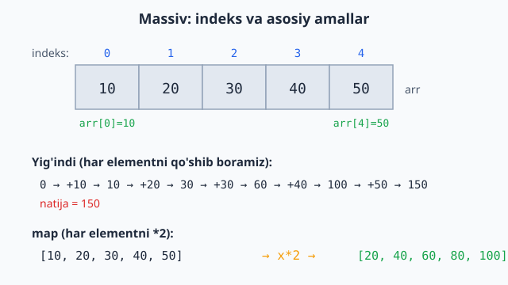

<a id="b5"></a>
# 5-bo'lim: Massivlar / ro'yxatlar

<sub>[↑ Mundarijaga qaytish](README.md#mundarija)</sub>

> 📊 Shu bo'limdan boshlab har bir masalada **murakkablik** ko'rsatilgan: `⏱ vaqt · 💾 xotira`. Murakkablik algoritm darajasida — odatda uchala tilda bir xil; tilning `built-in` funksiyasi boshqacha bo'lsa, alohida eslatiladi.

<a id="m56"></a>
### 56. Massiv yig'indisi
`⏱ O(n) · 💾 O(1)`

**JS**
```js
const sum = arr => arr.reduce((a, b) => a + b, 0);
```
**PHP**
```php
function sum($arr) {
    return array_sum($arr);
}
```
**Python**
```python
def total(arr):
    return sum(arr)
```

<a id="m57"></a>
### 57. Eng katta element
`⏱ O(n) · 💾 O(1)`
Eslatma: JS `Math.max(...arr)` juda katta massivlarda argument limitiga uriladi — bunda `arr.reduce((a, b) => Math.max(a, b))` ishlating.

**JS**
```js
const maxOf = arr => Math.max(...arr);
```
**PHP**
```php
function maxOf($arr) {
    return max($arr);
}
```
**Python**
```python
def max_of(arr):
    return max(arr)
```

<a id="m58"></a>
### 58. Eng kichik element
`⏱ O(n) · 💾 O(1)`

**JS**
```js
const minOf = arr => Math.min(...arr);
```
**PHP**
```php
function minOf($arr) {
    return min($arr);
}
```
**Python**
```python
def min_of(arr):
    return min(arr)
```

<a id="m59"></a>
### 59. Elementni qidirish (indeks)
`⏱ O(n) · 💾 O(1)` — topilmasa JS/Python −1, PHP `false`.

**JS**
```js
const indexOf = (arr, x) => arr.indexOf(x);
```
**PHP**
```php
function indexOf($arr, $x) {
    return array_search($x, $arr);
}
```
**Python**
```python
def index_of(arr, x):
    return arr.index(x) if x in arr else -1
```

<a id="m60"></a>
### 60. Element bormi (contains)
`⏱ O(n) · 💾 O(1)`

**JS**
```js
const contains = (arr, x) => arr.includes(x);
```
**PHP**
```php
function contains($arr, $x) {
    return in_array($x, $arr);
}
```
**Python**
```python
def contains(arr, x):
    return x in arr
```

<a id="m61"></a>
### 61. Massivni teskari ag'darish
`⏱ O(n) · 💾 O(n)`

**JS**
```js
const reverse = arr => [...arr].reverse();
```
**PHP**
```php
function reverse($arr) {
    return array_reverse($arr);
}
```
**Python**
```python
def reverse(arr):
    return arr[::-1]
```

<a id="m62"></a>
### 62. Takrorlarni olib tashlash (unique)
`⏱ O(n) · 💾 O(n)`
Eslatma: PHP `array_unique` ichki saralash tufayli ~O(n log n). Python `dict.fromkeys` tartibni saqlaydi (`set()` saqlamaydi).

**JS**
```js
const unique = arr => [...new Set(arr)];
```
**PHP**
```php
function unique($arr) {
    return array_values(array_unique($arr));
}
```
**Python**
```python
def unique(arr):
    return list(dict.fromkeys(arr))
```

<a id="m63"></a>
### 63. Juft sonlarni filtrlash
`⏱ O(n) · 💾 O(n)`

**JS**
```js
const evens = arr => arr.filter(x => x % 2 === 0);
```
**PHP**
```php
function evens($arr) {
    return array_values(array_filter($arr, fn($x) => $x % 2 === 0));
}
```
**Python**
```python
def evens(arr):
    return [x for x in arr if x % 2 == 0]
```

<a id="m64"></a>
### 64. Har bir elementni 2 ga ko'paytirish (map)
`⏱ O(n) · 💾 O(n)`

**JS**
```js
const double = arr => arr.map(x => x * 2);
```
**PHP**
```php
function double($arr) {
    return array_map(fn($x) => $x * 2, $arr);
}
```
**Python**
```python
def double(arr):
    return [x * 2 for x in arr]
```

Quyidagi diagramma massiv indekslari hamda yig'indi (#56) va `map` (#64) amallari qanday ishlashini ko'rsatadi:



<a id="m65"></a>
### 65. Massiv o'rtachasi
`⏱ O(n) · 💾 O(1)`

**JS**
```js
const avg = arr => arr.reduce((a, b) => a + b, 0) / arr.length;
```
**PHP**
```php
function avg($arr) {
    return array_sum($arr) / count($arr);
}
```
**Python**
```python
def avg(arr):
    return sum(arr) / len(arr)
```

<a id="m66"></a>
### 66. Manfiy sonlar sonini sanash
`⏱ O(n) · 💾 O(1)`

**JS**
```js
const countNeg = arr => arr.filter(x => x < 0).length;
```
**PHP**
```php
function countNeg($arr) {
    return count(array_filter($arr, fn($x) => $x < 0));
}
```
**Python**
```python
def count_neg(arr):
    return sum(1 for x in arr if x < 0)
```

<a id="m67"></a>
### 67. Ikkinchi eng katta element
`⏱ O(n) · 💾 O(1)` — bitta o'tishda (saralash bilan O(n log n) bo'lardi).

**JS**
```js
const secondMax = arr => {
  let first = -Infinity, second = -Infinity;
  for (const x of arr) {
    if (x > first) { second = first; first = x; }
    else if (x > second && x < first) second = x;
  }
  return second;
};
```
**PHP**
```php
function secondMax($arr) {
    $first = $second = PHP_INT_MIN;
    foreach ($arr as $x) {
        if ($x > $first) { $second = $first; $first = $x; }
        elseif ($x > $second && $x < $first) $second = $x;
    }
    return $second;
}
```
**Python**
```python
def second_max(arr):
    first = second = float("-inf")
    for x in arr:
        if x > first:
            second, first = first, x
        elif second < x < first:
            second = x
    return second
```

<a id="m68"></a>
### 68. Massivni saralash (o'sish bo'yicha)
`⏱ O(n log n) · 💾 O(n)`
Eslatma: JS `sort()` standart holatda **leksikografik** — sonlar uchun komparator (`a - b`) shart.

**JS**
```js
const sortAsc = arr => [...arr].sort((a, b) => a - b);
```
**PHP**
```php
function sortAsc($arr) {
    sort($arr);
    return $arr;
}
```
**Python**
```python
def sort_asc(arr):
    return sorted(arr)
```

<a id="m69"></a>
### 69. Ikki massivni birlashtirish (concat)
`⏱ O(n + m) · 💾 O(n + m)`

**JS**
```js
const concat = (a, b) => [...a, ...b];
```
**PHP**
```php
function concat($a, $b) {
    return array_merge($a, $b);
}
```
**Python**
```python
def concat(a, b):
    return a + b
```

<a id="m70"></a>
### 70. Ikki massiv kesishmasi (intersection)
`⏱ O(n + m) · 💾 O(n)` — `Set` orqali.
Eslatma: JS/Python `Set` yondashuvi O(n+m) kafolatlaydi; PHP `array_intersect` ichki amal (sekinroq bo'lishi mumkin).

**JS**
```js
const intersect = (a, b) => {
  const s = new Set(b);
  return [...new Set(a)].filter(x => s.has(x));
};
```
**PHP**
```php
function intersect($a, $b) {
    return array_values(array_intersect($a, $b));
}
```
**Python**
```python
def intersect(a, b):
    return list(set(a) & set(b))
```

<a id="m71"></a>
### 71. Ikki massiv ayirmasi (a − b)
`⏱ O(n + m) · 💾 O(n)`

**JS**
```js
const difference = (a, b) => {
  const s = new Set(b);
  return a.filter(x => !s.has(x));
};
```
**PHP**
```php
function difference($a, $b) {
    return array_values(array_diff($a, $b));
}
```
**Python**
```python
def difference(a, b):
    bset = set(b)
    return [x for x in a if x not in bset]
```

<a id="m72"></a>
### 72. Massivni n ta qismga bo'lish (chunk)
`⏱ O(n) · 💾 O(n)`

**JS**
```js
const chunk = (arr, n) => {
  const out = [];
  for (let i = 0; i < arr.length; i += n) out.push(arr.slice(i, i + n));
  return out;
};
```
**PHP**
```php
function chunk($arr, $n) {
    return array_chunk($arr, $n);
}
```
**Python**
```python
def chunk(arr, n):
    return [arr[i:i + n] for i in range(0, len(arr), n)]
```

<a id="m73"></a>
### 73. Massivni tekislash (flatten — 1 daraja)
`⏱ O(n) · 💾 O(n)`

**JS**
```js
const flatten = arr => arr.flat();
```
**PHP**
```php
function flatten($arr) {
    return array_merge(...$arr);
}
```
**Python**
```python
def flatten(arr):
    return [x for sub in arr for x in sub]
```

<a id="m74"></a>
### 74. Element chastotasi (count occurrences)
`⏱ O(n) · 💾 O(k)` — k: noyob elementlar soni.

**JS**
```js
const freq = arr => {
  const m = {};
  for (const x of arr) m[x] = (m[x] || 0) + 1;
  return m;
};
```
**PHP**
```php
function freq($arr) {
    return array_count_values($arr);
}
```
**Python**
```python
from collections import Counter

def freq(arr):
    return dict(Counter(arr))
```

<a id="m75"></a>
### 75. Massivni k qadam aylantirish (rotate left)
`⏱ O(n) · 💾 O(n)`

**JS**
```js
const rotate = (arr, k) => {
  k %= arr.length;
  return [...arr.slice(k), ...arr.slice(0, k)];
};
```
**PHP**
```php
function rotate($arr, $k) {
    $k %= count($arr);
    return array_merge(array_slice($arr, $k), array_slice($arr, 0, $k));
}
```
**Python**
```python
def rotate(arr, k):
    k %= len(arr)
    return arr[k:] + arr[:k]
```

<a id="m76"></a>
### 76. Yo'qolgan sonni topish (1..n)
`⏱ O(n) · 💾 O(1)` — yig'indi farqi orqali.

**JS**
```js
const missing = (arr, n) => n * (n + 1) / 2 - arr.reduce((a, b) => a + b, 0);
```
**PHP**
```php
function missing($arr, $n) {
    return $n * ($n + 1) / 2 - array_sum($arr);
}
```
**Python**
```python
def missing(arr, n):
    return n * (n + 1) // 2 - sum(arr)
```

<a id="m77"></a>
### 77. Juft indeksdagi elementlar
`⏱ O(n) · 💾 O(n)`

**JS**
```js
const evenIdx = arr => arr.filter((_, i) => i % 2 === 0);
```
**PHP**
```php
function evenIdx($arr) {
    return array_values(array_filter($arr, fn($k) => $k % 2 === 0, ARRAY_FILTER_USE_KEY));
}
```
**Python**
```python
def even_idx(arr):
    return arr[::2]
```

<a id="m78"></a>
### 78. Massiv saralanganmi (is sorted, o'sish)
`⏱ O(n) · 💾 O(1)`

**JS**
```js
const isSorted = arr => arr.every((x, i) => i === 0 || arr[i - 1] <= x);
```
**PHP**
```php
function isSorted($arr) {
    for ($i = 1; $i < count($arr); $i++) if ($arr[$i - 1] > $arr[$i]) return false;
    return true;
}
```
**Python**
```python
def is_sorted(arr):
    return all(arr[i - 1] <= arr[i] for i in range(1, len(arr)))
```

---
