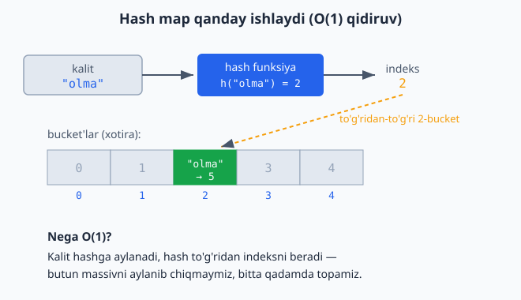

<a id="b6"></a>
# 6-bo'lim: Hash map / obyekt / lug'at

<sub>[↑ Mundarijaga qaytish](README.md#mundarija)</sub>

<a id="m79"></a>
### 79. Kalit bormi (has key)
`⏱ O(1) · 💾 O(1)`

**JS**
```js
const hasKey = (obj, k) => k in obj;
```
**PHP**
```php
function hasKey($map, $k) {
    return array_key_exists($k, $map);
}
```
**Python**
```python
def has_key(d, k):
    return k in d
```

Hash map kalitni hash funksiya orqali to'g'ridan-to'g'ri bucket indeksiga aylantiradi — shuning uchun kalit bor-yo'qligini tekshirish o'rtacha O(1) bo'ladi:



<a id="m80"></a>
### 80. Kalit-qiymat qo'shish / yangilash
`⏱ O(1) · 💾 O(1)`

**JS**
```js
obj[k] = v;
```
**PHP**
```php
$map[$k] = $v;
```
**Python**
```python
d[k] = v
```

<a id="m81"></a>
### 81. Kalitlar ro'yxati
`⏱ O(n) · 💾 O(n)`

**JS**
```js
const keys = obj => Object.keys(obj);
```
**PHP**
```php
function keys($map) {
    return array_keys($map);
}
```
**Python**
```python
def keys(d):
    return list(d.keys())
```

<a id="m82"></a>
### 82. Qiymatlar ro'yxati
`⏱ O(n) · 💾 O(n)`

**JS**
```js
const values = obj => Object.values(obj);
```
**PHP**
```php
function values($map) {
    return array_values($map);
}
```
**Python**
```python
def values(d):
    return list(d.values())
```

<a id="m83"></a>
### 83. Kalit bo'yicha o'chirish
`⏱ O(1) · 💾 O(1)`

**JS**
```js
delete obj[k];
```
**PHP**
```php
unset($map[$k]);
```
**Python**
```python
d.pop(k, None)
```

<a id="m84"></a>
### 84. Ikki obyektni birlashtirish (merge)
`⏱ O(n + m) · 💾 O(n + m)`
Eslatma: PHP `array_merge` da raqamli kalitlar qayta indekslanadi; string kalitlar uchun ikkinchisi ustun keladi.

**JS**
```js
const merge = (a, b) => ({ ...a, ...b });
```
**PHP**
```php
function merge($a, $b) {
    return array_merge($a, $b);
}
```
**Python**
```python
def merge(a, b):
    return {**a, **b}
```

<a id="m85"></a>
### 85. Qiymatlar yig'indisi
`⏱ O(n) · 💾 O(1)`

**JS**
```js
const sumValues = obj => Object.values(obj).reduce((a, b) => a + b, 0);
```
**PHP**
```php
function sumValues($map) {
    return array_sum($map);
}
```
**Python**
```python
def sum_values(d):
    return sum(d.values())
```

<a id="m86"></a>
### 86. Eng katta qiymatli kalit
`⏱ O(n) · 💾 O(1)`

**JS**
```js
const maxKey = obj => Object.keys(obj).reduce((a, b) => obj[b] > obj[a] ? b : a);
```
**PHP**
```php
function maxKey($map) {
    return array_search(max($map), $map);
}
```
**Python**
```python
def max_key(d):
    return max(d, key=d.get)
```

<a id="m87"></a>
### 87. Obyektni qiymat bo'yicha saralash
`⏱ O(n log n) · 💾 O(n)`

**JS**
```js
const sortByValue = obj =>
  Object.fromEntries(Object.entries(obj).sort((a, b) => a[1] - b[1]));
```
**PHP**
```php
function sortByValue($map) {
    asort($map);
    return $map;
}
```
**Python**
```python
def sort_by_value(d):
    return dict(sorted(d.items(), key=lambda kv: kv[1]))
```

<a id="m88"></a>
### 88. So'z chastotasi (word frequency)
`⏱ O(n) · 💾 O(k)` — matndagi so'zlarni sanash.

**JS**
```js
const wordFreq = s => {
  const m = {};
  for (const w of s.toLowerCase().split(/\s+/).filter(Boolean)) m[w] = (m[w] || 0) + 1;
  return m;
};
```
**PHP**
```php
function wordFreq($s) {
    $words = preg_split('/\s+/', strtolower(trim($s)), -1, PREG_SPLIT_NO_EMPTY);
    return array_count_values($words);
}
```
**Python**
```python
from collections import Counter

def word_freq(s):
    return dict(Counter(s.lower().split()))
```

<a id="m89"></a>
### 89. Ikki ro'yxatdan obyekt yasash (zip → map)
`⏱ O(n) · 💾 O(n)`

**JS**
```js
const zipObject = (keys, vals) =>
  Object.fromEntries(keys.map((k, i) => [k, vals[i]]));
```
**PHP**
```php
function zipObject($keys, $vals) {
    return array_combine($keys, $vals);
}
```
**Python**
```python
def zip_object(keys, vals):
    return dict(zip(keys, vals))
```

<a id="m90"></a>
### 90. Obyektni teskari aylantirish (invert: key↔value)
`⏱ O(n) · 💾 O(n)`

**JS**
```js
const invert = obj =>
  Object.fromEntries(Object.entries(obj).map(([k, v]) => [v, k]));
```
**PHP**
```php
function invert($map) {
    return array_flip($map);
}
```
**Python**
```python
def invert(d):
    return {v: k for k, v in d.items()}
```

<a id="m91"></a>
### 91. Guruhlash (group by — juft/toq misolida)
`⏱ O(n) · 💾 O(n)`

**JS**
```js
const groupParity = arr => {
  const g = { even: [], odd: [] };
  for (const x of arr) g[x % 2 === 0 ? "even" : "odd"].push(x);
  return g;
};
```
**PHP**
```php
function groupParity($arr) {
    $g = ["even" => [], "odd" => []];
    foreach ($arr as $x) $g[$x % 2 === 0 ? "even" : "odd"][] = $x;
    return $g;
}
```
**Python**
```python
def group_parity(arr):
    g = {"even": [], "odd": []}
    for x in arr:
        g["even" if x % 2 == 0 else "odd"].append(x)
    return g
```

---
