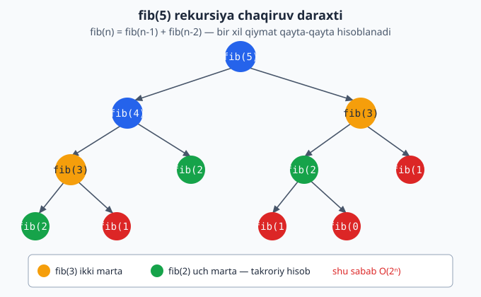

<a id="b7"></a>
# 7-bo'lim: Rekursiya

<sub>[↑ Mundarijaga qaytish](README.md#mundarija)</sub>

> 🧠 Rekursiyada **xotira** odatda chaqiruv steki (call stack) chuqurligiga teng. Juda chuqur rekursiya stack overflow beradi — Pythonda standart limit ~1000.

<a id="m92"></a>
### 92. Yig'indi 1..n (rekursiv)
`⏱ O(n) · 💾 O(n)` — stek chuqurligi.

**JS**
```js
const sumTo = n => n === 0 ? 0 : n + sumTo(n - 1);
```
**PHP**
```php
function sumTo($n) {
    return $n === 0 ? 0 : $n + sumTo($n - 1);
}
```
**Python**
```python
def sum_to(n):
    return 0 if n == 0 else n + sum_to(n - 1)
```

<a id="m93"></a>
### 93. Massiv yig'indisi (rekursiv)
`⏱ O(n) · 💾 O(n)`
Eslatma: indeks orqali — slicing (`arr[1:]`) ishlatilsa har chaqiruvda O(n) nusxa olinib, jami O(n²) bo'lardi.

**JS**
```js
const sumArr = (arr, i = 0) => i === arr.length ? 0 : arr[i] + sumArr(arr, i + 1);
```
**PHP**
```php
function sumArr($arr, $i = 0) {
    return $i === count($arr) ? 0 : $arr[$i] + sumArr($arr, $i + 1);
}
```
**Python**
```python
def sum_arr(arr, i=0):
    return 0 if i == len(arr) else arr[i] + sum_arr(arr, i + 1)
```

<a id="m94"></a>
### 94. Daraja (rekursiv power) base^exp
`⏱ O(e) · 💾 O(e)`
Eslatma: tez darajalash (`b^(e/2)` ni kvadratga ko'tarish) bilan O(log e) ga tushadi.

**JS**
```js
const power = (b, e) => e === 0 ? 1 : b * power(b, e - 1);
```
**PHP**
```php
function power($b, $e) {
    return $e === 0 ? 1 : $b * power($b, $e - 1);
}
```
**Python**
```python
def power(b, e):
    return 1 if e == 0 else b * power(b, e - 1)
```

<a id="m95"></a>
### 95. Fibonachchi (rekursiv, n-element)
`⏱ O(2ⁿ) · 💾 O(n)`
Eslatma: sodda rekursiya eksponensial — bitta qiymat qayta-qayta hisoblanadi. Memoizatsiya (DP) bilan O(n) bo'ladi (14-bo'lim).

**JS**
```js
const fib = n => n < 2 ? n : fib(n - 1) + fib(n - 2);
```
**PHP**
```php
function fib($n) {
    return $n < 2 ? $n : fib($n - 1) + fib($n - 2);
}
```
**Python**
```python
def fib(n):
    return n if n < 2 else fib(n - 1) + fib(n - 2)
```

Quyidagi chaqiruv daraxti nega sodda rekursiya eksponensial ekanini ko'rsatadi — bir xil qiymatlar (masalan `fib(3)`, `fib(2)`) qayta-qayta hisoblanadi:



<a id="m96"></a>
### 96. Satrni teskari (rekursiv)
`⏱ O(n) · 💾 O(n)`

**JS**
```js
const reverse = s => s === "" ? "" : reverse(s.slice(1)) + s[0];
```
**PHP**
```php
function reverse($s) {
    return $s === "" ? "" : reverse(substr($s, 1)) . $s[0];
}
```
**Python**
```python
def reverse(s):
    return "" if s == "" else reverse(s[1:]) + s[0]
```

<a id="m97"></a>
### 97. Raqamlar yig'indisi (rekursiv)
`⏱ O(d) · 💾 O(d)` — d: raqamlar soni.

**JS**
```js
const digitSum = n => n === 0 ? 0 : n % 10 + digitSum(Math.floor(n / 10));
```
**PHP**
```php
function digitSum($n) {
    return $n === 0 ? 0 : $n % 10 + digitSum(intdiv($n, 10));
}
```
**Python**
```python
def digit_sum(n):
    return 0 if n == 0 else n % 10 + digit_sum(n // 10)
```

<a id="m98"></a>
### 98. Palindrom (rekursiv tekshirish)
`⏱ O(n) · 💾 O(n)`

**JS**
```js
const isPalindrome = s =>
  s.length <= 1 ? true : s[0] === s[s.length - 1] && isPalindrome(s.slice(1, -1));
```
**PHP**
```php
function isPalindrome($s) {
    if (strlen($s) <= 1) return true;
    return $s[0] === $s[strlen($s) - 1] && isPalindrome(substr($s, 1, -1));
}
```
**Python**
```python
def is_palindrome(s):
    if len(s) <= 1:
        return True
    return s[0] == s[-1] and is_palindrome(s[1:-1])
```

<a id="m99"></a>
### 99. Massivda chiziqli qidiruv (rekursiv)
`⏱ O(n) · 💾 O(n)` — topilsa indeks, aks holda −1.

**JS**
```js
const search = (arr, x, i = 0) =>
  i === arr.length ? -1 : arr[i] === x ? i : search(arr, x, i + 1);
```
**PHP**
```php
function search($arr, $x, $i = 0) {
    if ($i === count($arr)) return -1;
    return $arr[$i] === $x ? $i : search($arr, $x, $i + 1);
}
```
**Python**
```python
def search(arr, x, i=0):
    if i == len(arr):
        return -1
    return i if arr[i] == x else search(arr, x, i + 1)
```

<a id="m100"></a>
### 100. Massivdagi eng katta (rekursiv)
`⏱ O(n) · 💾 O(n)`

**JS**
```js
const maxOf = (arr, i = 0) =>
  i === arr.length - 1 ? arr[i] : Math.max(arr[i], maxOf(arr, i + 1));
```
**PHP**
```php
function maxOf($arr, $i = 0) {
    if ($i === count($arr) - 1) return $arr[$i];
    return max($arr[$i], maxOf($arr, $i + 1));
}
```
**Python**
```python
def max_of(arr, i=0):
    if i == len(arr) - 1:
        return arr[i]
    return max(arr[i], max_of(arr, i + 1))
```

<a id="m101"></a>
### 101. Hanoy minorasi (Tower of Hanoi)
`⏱ O(2ⁿ) · 💾 O(n)` — harakatlar ketma-ketligini qaytaradi.

**JS**
```js
const hanoi = (n, from = "A", to = "C", via = "B", moves = []) => {
  if (n === 0) return moves;
  hanoi(n - 1, from, via, to, moves);
  moves.push(`${from} -> ${to}`);
  hanoi(n - 1, via, to, from, moves);
  return moves;
};
```
**PHP**
```php
function hanoi($n, $from = "A", $to = "C", $via = "B", &$moves = []) {
    if ($n === 0) return $moves;
    hanoi($n - 1, $from, $via, $to, $moves);
    $moves[] = "$from -> $to";
    hanoi($n - 1, $via, $to, $from, $moves);
    return $moves;
}
```
**Python**
```python
def hanoi(n, frm="A", to="C", via="B", moves=None):
    if moves is None:
        moves = []
    if n == 0:
        return moves
    hanoi(n - 1, frm, via, to, moves)
    moves.append(f"{frm} -> {to}")
    hanoi(n - 1, via, to, frm, moves)
    return moves
```

<a id="m102"></a>
### 102. Barcha permutatsiyalar (permutations)
`⏱ O(n · n!) · 💾 O(n · n!)`
Eslatma: amaliyotda Pythonda `itertools.permutations` ishlatiladi.

**JS**
```js
const permutations = arr => {
  if (arr.length <= 1) return [arr];
  return arr.flatMap((x, i) =>
    permutations([...arr.slice(0, i), ...arr.slice(i + 1)]).map(p => [x, ...p]));
};
```
**PHP**
```php
function permutations($arr) {
    if (count($arr) <= 1) return [$arr];
    $result = [];
    foreach ($arr as $i => $x) {
        $rest = array_merge(array_slice($arr, 0, $i), array_slice($arr, $i + 1));
        foreach (permutations($rest) as $p) {
            array_unshift($p, $x);
            $result[] = $p;
        }
    }
    return $result;
}
```
**Python**
```python
def permutations(arr):
    if len(arr) <= 1:
        return [arr]
    result = []
    for i, x in enumerate(arr):
        for p in permutations(arr[:i] + arr[i + 1:]):
            result.append([x] + p)
    return result
```

<a id="m103"></a>
### 103. Quvvat to'plami (power set — barcha kichik to'plamlar)
`⏱ O(2ⁿ) · 💾 O(2ⁿ)`

**JS**
```js
const powerSet = arr => {
  if (arr.length === 0) return [[]];
  const rest = powerSet(arr.slice(1));
  return [...rest, ...rest.map(s => [arr[0], ...s])];
};
```
**PHP**
```php
function powerSet($arr) {
    if (count($arr) === 0) return [[]];
    $first = $arr[0];
    $rest = powerSet(array_slice($arr, 1));
    $withFirst = array_map(fn($s) => array_merge([$first], $s), $rest);
    return array_merge($rest, $withFirst);
}
```
**Python**
```python
def power_set(arr):
    if not arr:
        return [[]]
    rest = power_set(arr[1:])
    return rest + [[arr[0]] + s for s in rest]
```

<a id="m104"></a>
### 104. O'nlikni ikkilikka (rekursiv)
`⏱ O(log n) · 💾 O(log n)`

**JS**
```js
const toBinary = n => n < 2 ? String(n) : toBinary(Math.floor(n / 2)) + (n % 2);
```
**PHP**
```php
function toBinary($n) {
    return $n < 2 ? (string) $n : toBinary(intdiv($n, 2)) . ($n % 2);
}
```
**Python**
```python
def to_binary(n):
    return str(n) if n < 2 else to_binary(n // 2) + str(n % 2)
```

---
