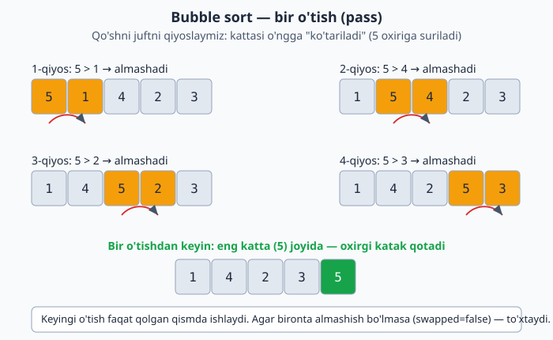
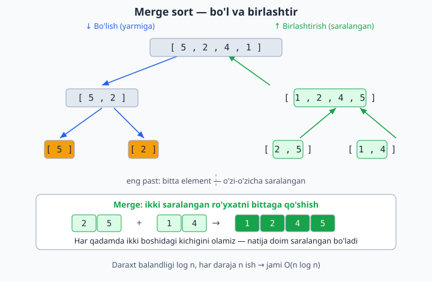
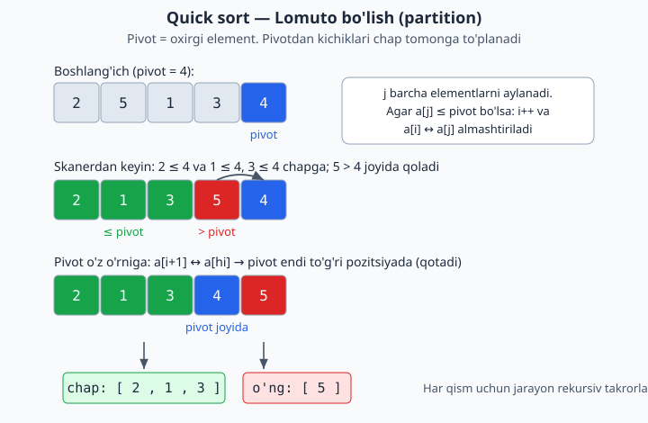

<a id="b8"></a>
# 8-bo'lim: Saralash algoritmlari

<sub>[↑ Mundarijaga qaytish](README.md#mundarija)</sub>

> Bu yerda algoritmlar **noldan** yozilgan (built-in `sort` emas) — maqsad ichki mexanikani tushunish. Tezkor taqqoslash:

| Algoritm | Eng yaxshi | O'rtacha | Eng yomon | Xotira | Barqaror |
|---|---|---|---|---|---|
| Bubble | O(n) | O(n²) | O(n²) | O(1) | Ha |
| Selection | O(n²) | O(n²) | O(n²) | O(1) | Yo'q |
| Insertion | O(n) | O(n²) | O(n²) | O(1) | Ha |
| Shell | O(n log n) | ≈O(n^1.25) | O(n²) | O(1) | Yo'q |
| Merge | O(n log n) | O(n log n) | O(n log n) | O(n) | Ha |
| Quick | O(n log n) | O(n log n) | O(n²) | O(log n) | Yo'q |
| Counting | O(n+k) | O(n+k) | O(n+k) | O(k) | Ha |
| Heap | O(n log n) | O(n log n) | O(n log n) | O(1) | Yo'q |

**Barqaror (stable)** — teng elementlarning dastlabki tartibi saqlanishi. Shell uchun raqamlar gap ketma-ketligiga bog'liq.

<a id="m105"></a>
### 105. Bubble sort
`⏱ O(n²), eng yaxshi O(n) · 💾 O(1)`
Yondoshlarni qiyoslab almashtiradi; `swapped` bayrog'i saralangan massivni bir o'tishda aniqlaydi.

**JS**
```js
const bubbleSort = arr => {
  const a = [...arr], n = a.length;
  for (let i = 0; i < n - 1; i++) {
    let swapped = false;
    for (let j = 0; j < n - 1 - i; j++) {
      if (a[j] > a[j + 1]) { [a[j], a[j + 1]] = [a[j + 1], a[j]]; swapped = true; }
    }
    if (!swapped) break;
  }
  return a;
};
```
**PHP**
```php
function bubbleSort($arr) {
    $a = $arr;
    $n = count($a);
    for ($i = 0; $i < $n - 1; $i++) {
        $swapped = false;
        for ($j = 0; $j < $n - 1 - $i; $j++) {
            if ($a[$j] > $a[$j + 1]) {
                [$a[$j], $a[$j + 1]] = [$a[$j + 1], $a[$j]];
                $swapped = true;
            }
        }
        if (!$swapped) break;
    }
    return $a;
}
```
**Python**
```python
def bubble_sort(arr):
    a = arr[:]
    n = len(a)
    for i in range(n - 1):
        swapped = False
        for j in range(n - 1 - i):
            if a[j] > a[j + 1]:
                a[j], a[j + 1] = a[j + 1], a[j]
                swapped = True
        if not swapped:
            break
    return a
```

Bir o'tishda qo'shni juftlar qiyoslanib, eng katta element massiv oxiriga "suzib" chiqishini quyidagi diagrammada ko'rish mumkin:



<a id="m106"></a>
### 106. Selection sort
`⏱ O(n²) har doim · 💾 O(1)`
Har o'tishda eng kichikni topib boshiga qo'yadi. Almashtirishlar soni minimal (O(n)), lekin qiyoslar doimo O(n²).

**JS**
```js
const selectionSort = arr => {
  const a = [...arr], n = a.length;
  for (let i = 0; i < n - 1; i++) {
    let min = i;
    for (let j = i + 1; j < n; j++) if (a[j] < a[min]) min = j;
    if (min !== i) [a[i], a[min]] = [a[min], a[i]];
  }
  return a;
};
```
**PHP**
```php
function selectionSort($arr) {
    $a = $arr;
    $n = count($a);
    for ($i = 0; $i < $n - 1; $i++) {
        $min = $i;
        for ($j = $i + 1; $j < $n; $j++) if ($a[$j] < $a[$min]) $min = $j;
        if ($min !== $i) [$a[$i], $a[$min]] = [$a[$min], $a[$i]];
    }
    return $a;
}
```
**Python**
```python
def selection_sort(arr):
    a = arr[:]
    n = len(a)
    for i in range(n - 1):
        m = i
        for j in range(i + 1, n):
            if a[j] < a[m]:
                m = j
        if m != i:
            a[i], a[m] = a[m], a[i]
    return a
```

<a id="m107"></a>
### 107. Insertion sort
`⏱ O(n²), eng yaxshi O(n) · 💾 O(1)`
Deyarli saralangan/kichik massivlarda juda tez — shuning uchun ko'p kutubxonalar kichik bo'laklarda shuni ishlatadi.

**JS**
```js
const insertionSort = arr => {
  const a = [...arr];
  for (let i = 1; i < a.length; i++) {
    const key = a[i];
    let j = i - 1;
    while (j >= 0 && a[j] > key) { a[j + 1] = a[j]; j--; }
    a[j + 1] = key;
  }
  return a;
};
```
**PHP**
```php
function insertionSort($arr) {
    $a = $arr;
    for ($i = 1; $i < count($a); $i++) {
        $key = $a[$i];
        $j = $i - 1;
        while ($j >= 0 && $a[$j] > $key) { $a[$j + 1] = $a[$j]; $j--; }
        $a[$j + 1] = $key;
    }
    return $a;
}
```
**Python**
```python
def insertion_sort(arr):
    a = arr[:]
    for i in range(1, len(a)):
        key = a[i]
        j = i - 1
        while j >= 0 and a[j] > key:
            a[j + 1] = a[j]
            j -= 1
        a[j + 1] = key
    return a
```

<a id="m108"></a>
### 108. Shell sort
`⏱ ≈O(n^1.25) · 💾 O(1)`
Insertion sort'ning umumlashmasi: katta `gap` bilan boshlab, uzoq elementlarni almashtiradi, gap'ni kichraytirib boradi.

**JS**
```js
const shellSort = arr => {
  const a = [...arr], n = a.length;
  for (let gap = Math.floor(n / 2); gap > 0; gap = Math.floor(gap / 2)) {
    for (let i = gap; i < n; i++) {
      const temp = a[i];
      let j = i;
      while (j >= gap && a[j - gap] > temp) { a[j] = a[j - gap]; j -= gap; }
      a[j] = temp;
    }
  }
  return a;
};
```
**PHP**
```php
function shellSort($arr) {
    $a = $arr;
    $n = count($a);
    for ($gap = intdiv($n, 2); $gap > 0; $gap = intdiv($gap, 2)) {
        for ($i = $gap; $i < $n; $i++) {
            $temp = $a[$i];
            $j = $i;
            while ($j >= $gap && $a[$j - $gap] > $temp) { $a[$j] = $a[$j - $gap]; $j -= $gap; }
            $a[$j] = $temp;
        }
    }
    return $a;
}
```
**Python**
```python
def shell_sort(arr):
    a = arr[:]
    n = len(a)
    gap = n // 2
    while gap > 0:
        for i in range(gap, n):
            temp = a[i]
            j = i
            while j >= gap and a[j - gap] > temp:
                a[j] = a[j - gap]
                j -= gap
            a[j] = temp
        gap //= 2
    return a
```

<a id="m109"></a>
### 109. Merge sort
`⏱ O(n log n) har doim · 💾 O(n)`
"Bo'l va hukmronlik qil": ikkiga bo'lib, rekursiv saralab, birlashtiradi. Barqaror, kafolatlangan O(n log n), lekin qo'shimcha xotira talab qiladi.

**JS**
```js
const mergeSort = arr => {
  if (arr.length <= 1) return arr;
  const mid = Math.floor(arr.length / 2);
  const left = mergeSort(arr.slice(0, mid));
  const right = mergeSort(arr.slice(mid));
  const merged = [];
  let i = 0, j = 0;
  while (i < left.length && j < right.length) {
    merged.push(left[i] <= right[j] ? left[i++] : right[j++]);
  }
  return merged.concat(left.slice(i), right.slice(j));
};
```
**PHP**
```php
function mergeSort($arr) {
    if (count($arr) <= 1) return $arr;
    $mid = intdiv(count($arr), 2);
    $left = mergeSort(array_slice($arr, 0, $mid));
    $right = mergeSort(array_slice($arr, $mid));
    $merged = [];
    $i = $j = 0;
    while ($i < count($left) && $j < count($right)) {
        $merged[] = $left[$i] <= $right[$j] ? $left[$i++] : $right[$j++];
    }
    return array_merge($merged, array_slice($left, $i), array_slice($right, $j));
}
```
**Python**
```python
def merge_sort(arr):
    if len(arr) <= 1:
        return arr
    mid = len(arr) // 2
    left = merge_sort(arr[:mid])
    right = merge_sort(arr[mid:])
    merged = []
    i = j = 0
    while i < len(left) and j < len(right):
        if left[i] <= right[j]:
            merged.append(left[i]); i += 1
        else:
            merged.append(right[j]); j += 1
    merged.extend(left[i:])
    merged.extend(right[j:])
    return merged
```

"Bo'l va birlashtir" g'oyasi: massiv yakka elementlargacha bo'linib, so'ng saralangan holda yuqoriga birlashtiriladi:



<a id="m110"></a>
### 110. Quick sort
`⏱ O(n log n) o'rtacha, O(n²) eng yomon · 💾 O(log n)`
Joyida (in-place) saralaydi, Lomuto bo'lish (partition) bilan. Eslatma: saralangan massivda oxirgi elementni pivot qilish O(n²) beradi — amaliyotda tasodifiy pivot yoki median-of-three ishlatiladi.

**JS**
```js
const quickSort = arr => {
  const a = [...arr];
  const sort = (lo, hi) => {
    if (lo >= hi) return;
    const pivot = a[hi];
    let i = lo - 1;
    for (let j = lo; j < hi; j++) {
      if (a[j] <= pivot) { i++; [a[i], a[j]] = [a[j], a[i]]; }
    }
    [a[i + 1], a[hi]] = [a[hi], a[i + 1]];
    const p = i + 1;
    sort(lo, p - 1);
    sort(p + 1, hi);
  };
  sort(0, a.length - 1);
  return a;
};
```
**PHP**
```php
function quickSort($arr) {
    $a = $arr;
    $sort = function ($lo, $hi) use (&$sort, &$a) {
        if ($lo >= $hi) return;
        $pivot = $a[$hi];
        $i = $lo - 1;
        for ($j = $lo; $j < $hi; $j++) {
            if ($a[$j] <= $pivot) {
                $i++;
                [$a[$i], $a[$j]] = [$a[$j], $a[$i]];
            }
        }
        [$a[$i + 1], $a[$hi]] = [$a[$hi], $a[$i + 1]];
        $p = $i + 1;
        $sort($lo, $p - 1);
        $sort($p + 1, $hi);
    };
    $sort(0, count($a) - 1);
    return $a;
}
```
**Python**
```python
def quick_sort(arr):
    a = arr[:]

    def sort(lo, hi):
        if lo >= hi:
            return
        pivot = a[hi]
        i = lo - 1
        for j in range(lo, hi):
            if a[j] <= pivot:
                i += 1
                a[i], a[j] = a[j], a[i]
        a[i + 1], a[hi] = a[hi], a[i + 1]
        p = i + 1
        sort(lo, p - 1)
        sort(p + 1, hi)

    sort(0, len(a) - 1)
    return a
```

Lomuto bo'lish (partition) qanday ishlashini — pivotdan kichiklarni chapga to'plab, pivotni o'z o'rniga qo'yishni — quyidagi diagramma ko'rsatadi:



<a id="m111"></a>
### 111. Counting sort
`⏱ O(n + k) · 💾 O(k)` — k: maksimal qiymat.
Taqqoslashga asoslanmaydi, shuning uchun O(n log n) chegarasidan tez. Faqat manfiy bo'lmagan butun sonlar uchun; k juda katta bo'lsa samarasiz.

**JS**
```js
const countingSort = arr => {
  if (arr.length === 0) return [];
  const max = Math.max(...arr);
  const count = new Array(max + 1).fill(0);
  for (const x of arr) count[x]++;
  const out = [];
  for (let v = 0; v <= max; v++) {
    while (count[v]-- > 0) out.push(v);
  }
  return out;
};
```
**PHP**
```php
function countingSort($arr) {
    if (count($arr) === 0) return [];
    $max = max($arr);
    $count = array_fill(0, $max + 1, 0);
    foreach ($arr as $x) $count[$x]++;
    $out = [];
    for ($v = 0; $v <= $max; $v++) {
        while ($count[$v]-- > 0) $out[] = $v;
    }
    return $out;
}
```
**Python**
```python
def counting_sort(arr):
    if not arr:
        return []
    mx = max(arr)
    count = [0] * (mx + 1)
    for x in arr:
        count[x] += 1
    out = []
    for v in range(mx + 1):
        out.extend([v] * count[v])
    return out
```

<a id="m112"></a>
### 112. Heap sort
`⏱ O(n log n) har doim · 💾 O(1)`
Max-heap quradi, so'ng maksimumni oxiriga ko'chirib, heap'ni qayta tiklaydi. Joyida va kafolatlangan, lekin barqaror emas va kesh-do'st emas (amaliyotda quicksort'dan sekinroq bo'lishi mumkin).

**JS**
```js
const heapSort = arr => {
  const a = [...arr], n = a.length;
  const heapify = (size, i) => {
    let largest = i;
    const l = 2 * i + 1, r = 2 * i + 2;
    if (l < size && a[l] > a[largest]) largest = l;
    if (r < size && a[r] > a[largest]) largest = r;
    if (largest !== i) {
      [a[i], a[largest]] = [a[largest], a[i]];
      heapify(size, largest);
    }
  };
  for (let i = Math.floor(n / 2) - 1; i >= 0; i--) heapify(n, i);
  for (let i = n - 1; i > 0; i--) {
    [a[0], a[i]] = [a[i], a[0]];
    heapify(i, 0);
  }
  return a;
};
```
**PHP**
```php
function heapSort($arr) {
    $a = $arr;
    $n = count($a);
    $heapify = function ($size, $i) use (&$heapify, &$a) {
        $largest = $i;
        $l = 2 * $i + 1;
        $r = 2 * $i + 2;
        if ($l < $size && $a[$l] > $a[$largest]) $largest = $l;
        if ($r < $size && $a[$r] > $a[$largest]) $largest = $r;
        if ($largest !== $i) {
            [$a[$i], $a[$largest]] = [$a[$largest], $a[$i]];
            $heapify($size, $largest);
        }
    };
    for ($i = intdiv($n, 2) - 1; $i >= 0; $i--) $heapify($n, $i);
    for ($i = $n - 1; $i > 0; $i--) {
        [$a[0], $a[$i]] = [$a[$i], $a[0]];
        $heapify($i, 0);
    }
    return $a;
}
```
**Python**
```python
def heap_sort(arr):
    a = arr[:]
    n = len(a)

    def heapify(size, i):
        largest = i
        l, r = 2 * i + 1, 2 * i + 2
        if l < size and a[l] > a[largest]:
            largest = l
        if r < size and a[r] > a[largest]:
            largest = r
        if largest != i:
            a[i], a[largest] = a[largest], a[i]
            heapify(size, largest)

    for i in range(n // 2 - 1, -1, -1):
        heapify(n, i)
    for i in range(n - 1, 0, -1):
        a[0], a[i] = a[i], a[0]
        heapify(i, 0)
    return a
```

---
