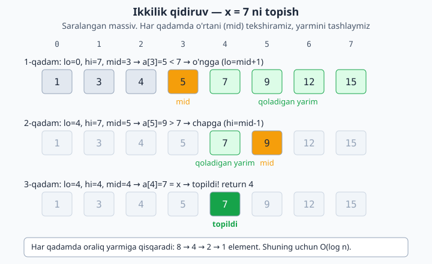

<a id="b9"></a>
# 9-bo'lim: Qidiruv

<sub>[↑ Mundarijaga qaytish](README.md#mundarija)</sub>

> ⚠️ Ikkilik qidiruv (binary search) **saralangan** massiv talab qiladi. Saralanmagan ma'lumotda faqat chiziqli qidiruv ishlaydi.

<a id="m113"></a>
### 113. Chiziqli qidiruv (linear search)
`⏱ O(n) · 💾 O(1)` — topilmasa −1.

**JS**
```js
const linearSearch = (arr, x) => {
  for (let i = 0; i < arr.length; i++) if (arr[i] === x) return i;
  return -1;
};
```
**PHP**
```php
function linearSearch($arr, $x) {
    foreach ($arr as $i => $v) if ($v === $x) return $i;
    return -1;
}
```
**Python**
```python
def linear_search(arr, x):
    for i, v in enumerate(arr):
        if v == x:
            return i
    return -1
```

<a id="m114"></a>
### 114. Ikkilik qidiruv — iterativ
`⏱ O(log n) · 💾 O(1)`
JS'da `(lo + hi) >> 1` butun bo'lishni ta'minlaydi.

**JS**
```js
const binarySearch = (arr, x) => {
  let lo = 0, hi = arr.length - 1;
  while (lo <= hi) {
    const mid = (lo + hi) >> 1;
    if (arr[mid] === x) return mid;
    if (arr[mid] < x) lo = mid + 1;
    else hi = mid - 1;
  }
  return -1;
};
```
**PHP**
```php
function binarySearch($arr, $x) {
    $lo = 0;
    $hi = count($arr) - 1;
    while ($lo <= $hi) {
        $mid = intdiv($lo + $hi, 2);
        if ($arr[$mid] === $x) return $mid;
        if ($arr[$mid] < $x) $lo = $mid + 1;
        else $hi = $mid - 1;
    }
    return -1;
}
```
**Python**
```python
def binary_search(arr, x):
    lo, hi = 0, len(arr) - 1
    while lo <= hi:
        mid = (lo + hi) // 2
        if arr[mid] == x:
            return mid
        if arr[mid] < x:
            lo = mid + 1
        else:
            hi = mid - 1
    return -1
```

Har qadamda o'rta (mid) tekshirilib, qidiruv oralig'i yarmiga qisqarishini quyidagi diagrammada kuzating:



<a id="m115"></a>
### 115. Ikkilik qidiruv — rekursiv
`⏱ O(log n) · 💾 O(log n)` — stek.

**JS**
```js
const binarySearchRec = (arr, x, lo = 0, hi = arr.length - 1) => {
  if (lo > hi) return -1;
  const mid = (lo + hi) >> 1;
  if (arr[mid] === x) return mid;
  return arr[mid] < x
    ? binarySearchRec(arr, x, mid + 1, hi)
    : binarySearchRec(arr, x, lo, mid - 1);
};
```
**PHP**
```php
function binarySearchRec($arr, $x, $lo = 0, $hi = null) {
    if ($hi === null) $hi = count($arr) - 1;
    if ($lo > $hi) return -1;
    $mid = intdiv($lo + $hi, 2);
    if ($arr[$mid] === $x) return $mid;
    return $arr[$mid] < $x
        ? binarySearchRec($arr, $x, $mid + 1, $hi)
        : binarySearchRec($arr, $x, $lo, $mid - 1);
}
```
**Python**
```python
def binary_search_rec(arr, x, lo=0, hi=None):
    if hi is None:
        hi = len(arr) - 1
    if lo > hi:
        return -1
    mid = (lo + hi) // 2
    if arr[mid] == x:
        return mid
    if arr[mid] < x:
        return binary_search_rec(arr, x, mid + 1, hi)
    return binary_search_rec(arr, x, lo, mid - 1)
```

<a id="m116"></a>
### 116. Birinchi uchrashi (leftmost)
`⏱ O(log n) · 💾 O(1)`
Takrorlanuvchi qiymatlar bo'lgan saralangan massivda x'ning eng chap indeksi.

**JS**
```js
const firstOccurrence = (arr, x) => {
  let lo = 0, hi = arr.length - 1, res = -1;
  while (lo <= hi) {
    const mid = (lo + hi) >> 1;
    if (arr[mid] === x) { res = mid; hi = mid - 1; }
    else if (arr[mid] < x) lo = mid + 1;
    else hi = mid - 1;
  }
  return res;
};
```
**PHP**
```php
function firstOccurrence($arr, $x) {
    $lo = 0; $hi = count($arr) - 1; $res = -1;
    while ($lo <= $hi) {
        $mid = intdiv($lo + $hi, 2);
        if ($arr[$mid] === $x) { $res = $mid; $hi = $mid - 1; }
        elseif ($arr[$mid] < $x) $lo = $mid + 1;
        else $hi = $mid - 1;
    }
    return $res;
}
```
**Python**
```python
def first_occurrence(arr, x):
    lo, hi, res = 0, len(arr) - 1, -1
    while lo <= hi:
        mid = (lo + hi) // 2
        if arr[mid] == x:
            res = mid
            hi = mid - 1
        elif arr[mid] < x:
            lo = mid + 1
        else:
            hi = mid - 1
    return res
```

<a id="m117"></a>
### 117. Oxirgi uchrashi (rightmost)
`⏱ O(log n) · 💾 O(1)`
Birinchi + oxirgi indeks orqali element nechta marta uchrashini O(log n) da topish mumkin.

**JS**
```js
const lastOccurrence = (arr, x) => {
  let lo = 0, hi = arr.length - 1, res = -1;
  while (lo <= hi) {
    const mid = (lo + hi) >> 1;
    if (arr[mid] === x) { res = mid; lo = mid + 1; }
    else if (arr[mid] < x) lo = mid + 1;
    else hi = mid - 1;
  }
  return res;
};
```
**PHP**
```php
function lastOccurrence($arr, $x) {
    $lo = 0; $hi = count($arr) - 1; $res = -1;
    while ($lo <= $hi) {
        $mid = intdiv($lo + $hi, 2);
        if ($arr[$mid] === $x) { $res = $mid; $lo = $mid + 1; }
        elseif ($arr[$mid] < $x) $lo = $mid + 1;
        else $hi = $mid - 1;
    }
    return $res;
}
```
**Python**
```python
def last_occurrence(arr, x):
    lo, hi, res = 0, len(arr) - 1, -1
    while lo <= hi:
        mid = (lo + hi) // 2
        if arr[mid] == x:
            res = mid
            lo = mid + 1
        elif arr[mid] < x:
            lo = mid + 1
        else:
            hi = mid - 1
    return res
```

<a id="m118"></a>
### 118. Kiritish nuqtasi (lower bound)
`⏱ O(log n) · 💾 O(1)`
x'ni tartibni buzmasdan joylash mumkin bo'lgan eng kichik indeks. Pythonda `bisect` moduli shu ishni qiladi.

**JS**
```js
const lowerBound = (arr, x) => {
  let lo = 0, hi = arr.length;
  while (lo < hi) {
    const mid = (lo + hi) >> 1;
    if (arr[mid] < x) lo = mid + 1;
    else hi = mid;
  }
  return lo;
};
```
**PHP**
```php
function lowerBound($arr, $x) {
    $lo = 0; $hi = count($arr);
    while ($lo < $hi) {
        $mid = intdiv($lo + $hi, 2);
        if ($arr[$mid] < $x) $lo = $mid + 1;
        else $hi = $mid;
    }
    return $lo;
}
```
**Python**
```python
import bisect

def lower_bound(arr, x):
    return bisect.bisect_left(arr, x)
```

<a id="m119"></a>
### 119. Aylantirilgan saralangan massivda qidiruv
`⏱ O(log n) · 💾 O(1)`
Mas. `[4,5,6,7,0,1,2]`. Har qadamda yarmi tartibli — shuni aniqlab, qidiruvni to'g'ri yarmiga yo'naltiramiz.

**JS**
```js
const searchRotated = (arr, x) => {
  let lo = 0, hi = arr.length - 1;
  while (lo <= hi) {
    const mid = (lo + hi) >> 1;
    if (arr[mid] === x) return mid;
    if (arr[lo] <= arr[mid]) {
      if (arr[lo] <= x && x < arr[mid]) hi = mid - 1;
      else lo = mid + 1;
    } else {
      if (arr[mid] < x && x <= arr[hi]) lo = mid + 1;
      else hi = mid - 1;
    }
  }
  return -1;
};
```
**PHP**
```php
function searchRotated($arr, $x) {
    $lo = 0; $hi = count($arr) - 1;
    while ($lo <= $hi) {
        $mid = intdiv($lo + $hi, 2);
        if ($arr[$mid] === $x) return $mid;
        if ($arr[$lo] <= $arr[$mid]) {
            if ($arr[$lo] <= $x && $x < $arr[$mid]) $hi = $mid - 1;
            else $lo = $mid + 1;
        } else {
            if ($arr[$mid] < $x && $x <= $arr[$hi]) $lo = $mid + 1;
            else $hi = $mid - 1;
        }
    }
    return -1;
}
```
**Python**
```python
def search_rotated(arr, x):
    lo, hi = 0, len(arr) - 1
    while lo <= hi:
        mid = (lo + hi) // 2
        if arr[mid] == x:
            return mid
        if arr[lo] <= arr[mid]:
            if arr[lo] <= x < arr[mid]:
                hi = mid - 1
            else:
                lo = mid + 1
        else:
            if arr[mid] < x <= arr[hi]:
                lo = mid + 1
            else:
                hi = mid - 1
    return -1
```

<a id="m120"></a>
### 120. Butun kvadrat ildiz (integer sqrt)
`⏱ O(log n) · 💾 O(1)`
"Javob bo'yicha ikkilik qidiruv" (binary search on answer) namunasi — floor(√n). Pythonda `math.isqrt(n)` ham bor.

**JS**
```js
const intSqrt = n => {
  if (n < 2) return n;
  let lo = 1, hi = n, res = 0;
  while (lo <= hi) {
    const mid = (lo + hi) >> 1;
    if (mid * mid <= n) { res = mid; lo = mid + 1; }
    else hi = mid - 1;
  }
  return res;
};
```
**PHP**
```php
function intSqrt($n) {
    if ($n < 2) return $n;
    $lo = 1; $hi = $n; $res = 0;
    while ($lo <= $hi) {
        $mid = intdiv($lo + $hi, 2);
        if ($mid * $mid <= $n) { $res = $mid; $lo = $mid + 1; }
        else $hi = $mid - 1;
    }
    return $res;
}
```
**Python**
```python
def int_sqrt(n):
    if n < 2:
        return n
    lo, hi, res = 1, n, 0
    while lo <= hi:
        mid = (lo + hi) // 2
        if mid * mid <= n:
            res = mid
            lo = mid + 1
        else:
            hi = mid - 1
    return res
```

---
