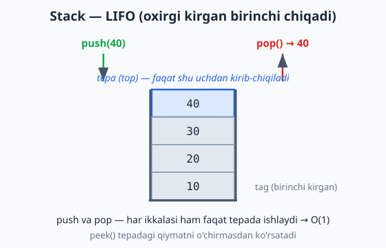
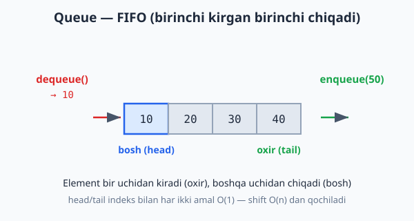

<a id="b10"></a>
# 10-bo'lim: Stack / Queue

<sub>[↑ Mundarijaga qaytish](README.md#mundarija)</sub>

> 🧱 Shu bo'limdan ma'lumotlar tuzilmalari `class` bilan yoziladi (OOP). Eslatma: PHP'da tayyor `SplStack`/`SplQueue`, Pythonda `collections.deque` bor — lekin bu yerda ichki tuzilishni ko'rsatish uchun qo'lda yozamiz.

<a id="m121"></a>
### 121. Stack (class)
`⏱ barcha amallar O(1) · 💾 O(n)`
LIFO (last-in, first-out): oxirgi kirgan birinchi chiqadi.

**JS**
```js
class Stack {
  #items = [];
  push(x) { this.#items.push(x); }
  pop() { return this.#items.pop(); }
  peek() { return this.#items[this.#items.length - 1]; }
  isEmpty() { return this.#items.length === 0; }
  size() { return this.#items.length; }
}
```
**PHP**
```php
class Stack {
    private array $items = [];

    public function push($x): void {
        $this->items[] = $x;
    }

    public function pop() {
        return array_pop($this->items);
    }

    public function peek() {
        return empty($this->items) ? null : $this->items[array_key_last($this->items)];
    }

    public function isEmpty(): bool {
        return empty($this->items);
    }

    public function size(): int {
        return count($this->items);
    }
}
```
**Python**
```python
class Stack:
    def __init__(self):
        self._items = []

    def push(self, x):
        self._items.append(x)

    def pop(self):
        return self._items.pop()

    def peek(self):
        return self._items[-1] if self._items else None

    def is_empty(self):
        return not self._items

    def size(self):
        return len(self._items)
```

Quyidagi diagramma push va pop faqat tepada ishlashini (LIFO) ko'rsatadi:



<a id="m122"></a>
### 122. Qavslar balansi (balanced parentheses)
`⏱ O(n) · 💾 O(n)`
Stack'ning klassik qo'llanilishi: `()[]{}` to'g'ri yopilganini tekshiradi.

**JS**
```js
const isBalanced = s => {
  const pairs = { ")": "(", "]": "[", "}": "{" };
  const stack = [];
  for (const c of s) {
    if (c === "(" || c === "[" || c === "{") stack.push(c);
    else if (c in pairs) {
      if (stack.pop() !== pairs[c]) return false;
    }
  }
  return stack.length === 0;
};
```
**PHP**
```php
function isBalanced($s) {
    $pairs = [")" => "(", "]" => "[", "}" => "{"];
    $stack = [];
    foreach (str_split($s) as $c) {
        if (in_array($c, ["(", "[", "{"], true)) {
            $stack[] = $c;
        } elseif (isset($pairs[$c])) {
            if (array_pop($stack) !== $pairs[$c]) return false;
        }
    }
    return count($stack) === 0;
}
```
**Python**
```python
def is_balanced(s):
    pairs = {")": "(", "]": "[", "}": "{"}
    stack = []
    for c in s:
        if c in "([{":
            stack.append(c)
        elif c in pairs:
            if not stack or stack.pop() != pairs[c]:
                return False
    return not stack
```

<a id="m123"></a>
### 123. Min Stack
`⏱ barcha amallar O(1) · 💾 O(n)`
Minimumni O(1) da qaytaradigan stack — yordamchi "mins" stegi har bosqichdagi minimumni saqlaydi.

**JS**
```js
class MinStack {
  #stack = [];
  #mins = [];
  push(x) {
    this.#stack.push(x);
    const min = this.#mins.length ? Math.min(x, this.#mins.at(-1)) : x;
    this.#mins.push(min);
  }
  pop() { this.#mins.pop(); return this.#stack.pop(); }
  top() { return this.#stack.at(-1); }
  getMin() { return this.#mins.at(-1); }
}
```
**PHP**
```php
class MinStack {
    private array $stack = [];
    private array $mins = [];

    public function push($x): void {
        $this->stack[] = $x;
        $this->mins[] = empty($this->mins) ? $x : min($x, end($this->mins));
    }

    public function pop() {
        array_pop($this->mins);
        return array_pop($this->stack);
    }

    public function top() {
        return end($this->stack);
    }

    public function getMin() {
        return end($this->mins);
    }
}
```
**Python**
```python
class MinStack:
    def __init__(self):
        self._stack = []
        self._mins = []

    def push(self, x):
        self._stack.append(x)
        self._mins.append(x if not self._mins else min(x, self._mins[-1]))

    def pop(self):
        self._mins.pop()
        return self._stack.pop()

    def top(self):
        return self._stack[-1]

    def get_min(self):
        return self._mins[-1]
```

<a id="m124"></a>
### 124. Postfiks (RPN) ifodani hisoblash
`⏱ O(n) · 💾 O(n)`
Teskari polyak yozuvi, mas. `["2","3","+","4","*"]` → 20. Operand'lar stack'ga tushadi, operator ikkitasini oladi.

**JS**
```js
const evalRPN = tokens => {
  const stack = [];
  const ops = {
    "+": (a, b) => a + b,
    "-": (a, b) => a - b,
    "*": (a, b) => a * b,
    "/": (a, b) => Math.trunc(a / b),
  };
  for (const t of tokens) {
    if (t in ops) {
      const b = stack.pop(), a = stack.pop();
      stack.push(ops[t](a, b));
    } else {
      stack.push(Number(t));
    }
  }
  return stack.pop();
};
```
**PHP**
```php
function evalRPN($tokens) {
    $stack = [];
    foreach ($tokens as $t) {
        if (in_array($t, ["+", "-", "*", "/"], true)) {
            $b = array_pop($stack);
            $a = array_pop($stack);
            $stack[] = match ($t) {
                "+" => $a + $b,
                "-" => $a - $b,
                "*" => $a * $b,
                "/" => intdiv($a, $b),
            };
        } else {
            $stack[] = (int) $t;
        }
    }
    return array_pop($stack);
}
```
**Python**
```python
def eval_rpn(tokens):
    stack = []
    ops = {
        "+": lambda a, b: a + b,
        "-": lambda a, b: a - b,
        "*": lambda a, b: a * b,
        "/": lambda a, b: int(a / b),
    }
    for t in tokens:
        if t in ops:
            b = stack.pop()
            a = stack.pop()
            stack.append(ops[t](a, b))
        else:
            stack.append(int(t))
    return stack.pop()
```

<a id="m125"></a>
### 125. Queue (class)
`⏱ barcha amallar O(1) · 💾 O(n)`
FIFO (first-in, first-out). Eslatma: oddiy massivda oldindan o'chirish (`shift`/`array_shift`) O(n) — shuning uchun JS/PHP'da head/tail indekslar, Pythonda `collections.deque` ishlatildi.

**JS**
```js
class Queue {
  #items = {};
  #head = 0;
  #tail = 0;
  enqueue(x) { this.#items[this.#tail++] = x; }
  dequeue() {
    if (this.isEmpty()) return undefined;
    const x = this.#items[this.#head];
    delete this.#items[this.#head++];
    return x;
  }
  peek() { return this.isEmpty() ? undefined : this.#items[this.#head]; }
  isEmpty() { return this.#head === this.#tail; }
  size() { return this.#tail - this.#head; }
}
```
**PHP**
```php
class Queue {
    private array $items = [];
    private int $head = 0;
    private int $tail = 0;

    public function enqueue($x): void {
        $this->items[$this->tail++] = $x;
    }

    public function dequeue() {
        if ($this->isEmpty()) return null;
        $x = $this->items[$this->head];
        unset($this->items[$this->head]);
        $this->head++;
        return $x;
    }

    public function peek() {
        return $this->isEmpty() ? null : $this->items[$this->head];
    }

    public function isEmpty(): bool {
        return $this->head === $this->tail;
    }

    public function size(): int {
        return $this->tail - $this->head;
    }
}
```
**Python**
```python
from collections import deque

class Queue:
    def __init__(self):
        self._items = deque()

    def enqueue(self, x):
        self._items.append(x)

    def dequeue(self):
        return self._items.popleft() if self._items else None

    def peek(self):
        return self._items[0] if self._items else None

    def is_empty(self):
        return not self._items

    def size(self):
        return len(self._items)
```

Diagrammada element bir uchidan kirib (oxir), boshqa uchidan chiqishini (bosh) ko'rishingiz mumkin — FIFO:



<a id="m126"></a>
### 126. Ikki stack yordamida Queue
`⏱ enqueue O(1), dequeue amortizatsiyalangan O(1) · 💾 O(n)`
"inbox" qabul qiladi, "outbox" beradi. Har element ko'pi bilan bir marta inbox→outbox ko'chadi.

**JS**
```js
class QueueWithStacks {
  #inbox = [];
  #outbox = [];
  enqueue(x) { this.#inbox.push(x); }
  dequeue() {
    if (this.#outbox.length === 0) {
      while (this.#inbox.length) this.#outbox.push(this.#inbox.pop());
    }
    return this.#outbox.pop();
  }
  isEmpty() { return this.#inbox.length === 0 && this.#outbox.length === 0; }
}
```
**PHP**
```php
class QueueWithStacks {
    private array $inbox = [];
    private array $outbox = [];

    public function enqueue($x): void {
        $this->inbox[] = $x;
    }

    public function dequeue() {
        if (empty($this->outbox)) {
            while (!empty($this->inbox)) {
                $this->outbox[] = array_pop($this->inbox);
            }
        }
        return array_pop($this->outbox);
    }

    public function isEmpty(): bool {
        return empty($this->inbox) && empty($this->outbox);
    }
}
```
**Python**
```python
class QueueWithStacks:
    def __init__(self):
        self._inbox = []
        self._outbox = []

    def enqueue(self, x):
        self._inbox.append(x)

    def dequeue(self):
        if not self._outbox:
            while self._inbox:
                self._outbox.append(self._inbox.pop())
        return self._outbox.pop() if self._outbox else None

    def is_empty(self):
        return not self._inbox and not self._outbox
```

<a id="m127"></a>
### 127. Circular Queue (aylanma navbat)
`⏱ barcha amallar O(1) · 💾 O(n)` (n = sig'im)
Sobit hajmli halqa-bufer (ring buffer): xotira oldindan ajratiladi, head va count indekslari aylanib boradi (modulo).

**JS**
```js
class CircularQueue {
  constructor(capacity) {
    this.capacity = capacity;
    this.items = new Array(capacity);
    this.head = 0;
    this.count = 0;
  }
  enqueue(x) {
    if (this.isFull()) return false;
    const tail = (this.head + this.count) % this.capacity;
    this.items[tail] = x;
    this.count++;
    return true;
  }
  dequeue() {
    if (this.isEmpty()) return undefined;
    const x = this.items[this.head];
    this.head = (this.head + 1) % this.capacity;
    this.count--;
    return x;
  }
  isEmpty() { return this.count === 0; }
  isFull() { return this.count === this.capacity; }
}
```
**PHP**
```php
class CircularQueue {
    private array $items;
    private int $head = 0;
    private int $count = 0;

    public function __construct(private int $capacity) {
        $this->items = array_fill(0, $capacity, null);
    }

    public function enqueue($x): bool {
        if ($this->isFull()) return false;
        $tail = ($this->head + $this->count) % $this->capacity;
        $this->items[$tail] = $x;
        $this->count++;
        return true;
    }

    public function dequeue() {
        if ($this->isEmpty()) return null;
        $x = $this->items[$this->head];
        $this->head = ($this->head + 1) % $this->capacity;
        $this->count--;
        return $x;
    }

    public function isEmpty(): bool {
        return $this->count === 0;
    }

    public function isFull(): bool {
        return $this->count === $this->capacity;
    }
}
```
**Python**
```python
class CircularQueue:
    def __init__(self, capacity):
        self.capacity = capacity
        self.items = [None] * capacity
        self.head = 0
        self.count = 0

    def enqueue(self, x):
        if self.is_full():
            return False
        tail = (self.head + self.count) % self.capacity
        self.items[tail] = x
        self.count += 1
        return True

    def dequeue(self):
        if self.is_empty():
            return None
        x = self.items[self.head]
        self.head = (self.head + 1) % self.capacity
        self.count -= 1
        return x

    def is_empty(self):
        return self.count == 0

    def is_full(self):
        return self.count == self.capacity
```

---
