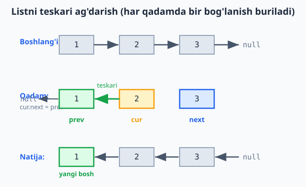

<a id="b11"></a>
# 11-bo'lim: Linked List

<sub>[↑ Mundarijaga qaytish](README.md#mundarija)</sub>

> 🔗 Quyidagi funksiyalar 128-masaladagi `Node` klassidan foydalanadi. Ko'pchiligida **dummy (soxta bosh) node** va **ikki ko'rsatkich (two-pointer)** uslubi qo'llaniladi — chetki holatlarni soddalashtiradigan klassik priyomlar.

<a id="m128"></a>
### 128. Singly Linked List (class)
`⏱ append O(1) (tail ko'rsatkichi bilan), prepend O(1) · 💾 O(n)`
Har element keyingisiga `next` orqali ulanadi. `tail` ko'rsatkichi append'ni O(1) qiladi.

**JS**
```js
class Node {
  constructor(value) {
    this.value = value;
    this.next = null;
  }
}

class LinkedList {
  constructor() {
    this.head = null;
    this.tail = null;
    this.length = 0;
  }
  append(value) {
    const node = new Node(value);
    if (!this.head) this.head = this.tail = node;
    else { this.tail.next = node; this.tail = node; }
    this.length++;
  }
  prepend(value) {
    const node = new Node(value);
    node.next = this.head;
    this.head = node;
    if (!this.tail) this.tail = node;
    this.length++;
  }
  toArray() {
    const out = [];
    let cur = this.head;
    while (cur) { out.push(cur.value); cur = cur.next; }
    return out;
  }
  size() { return this.length; }
}
```
**PHP**
```php
class Node {
    public ?Node $next = null;
    public function __construct(public mixed $value) {}
}

class LinkedList {
    private ?Node $head = null;
    private ?Node $tail = null;
    private int $length = 0;

    public function append($value): void {
        $node = new Node($value);
        if ($this->head === null) {
            $this->head = $this->tail = $node;
        } else {
            $this->tail->next = $node;
            $this->tail = $node;
        }
        $this->length++;
    }

    public function prepend($value): void {
        $node = new Node($value);
        $node->next = $this->head;
        $this->head = $node;
        if ($this->tail === null) $this->tail = $node;
        $this->length++;
    }

    public function toArray(): array {
        $out = [];
        $cur = $this->head;
        while ($cur !== null) {
            $out[] = $cur->value;
            $cur = $cur->next;
        }
        return $out;
    }

    public function size(): int {
        return $this->length;
    }
}
```
**Python**
```python
class Node:
    def __init__(self, value):
        self.value = value
        self.next = None

class LinkedList:
    def __init__(self):
        self.head = None
        self.tail = None
        self.length = 0

    def append(self, value):
        node = Node(value)
        if self.head is None:
            self.head = self.tail = node
        else:
            self.tail.next = node
            self.tail = node
        self.length += 1

    def prepend(self, value):
        node = Node(value)
        node.next = self.head
        self.head = node
        if self.tail is None:
            self.tail = node
        self.length += 1

    def to_array(self):
        out = []
        cur = self.head
        while cur:
            out.append(cur.value)
            cur = cur.next
        return out

    def size(self):
        return self.length
```

<a id="m129"></a>
### 129. Qiymat bo'yicha o'chirish (delete by value)
`⏱ O(n) · 💾 O(1)`
Dummy bosh node birinchi elementni o'chirish holatini soddalashtiradi.

**JS**
```js
const deleteValue = (head, value) => {
  const dummy = new Node(null);
  dummy.next = head;
  let prev = dummy;
  while (prev.next) {
    if (prev.next.value === value) { prev.next = prev.next.next; break; }
    prev = prev.next;
  }
  return dummy.next;
};
```
**PHP**
```php
function deleteValue(?Node $head, $value): ?Node {
    $dummy = new Node(null);
    $dummy->next = $head;
    $prev = $dummy;
    while ($prev->next !== null) {
        if ($prev->next->value === $value) {
            $prev->next = $prev->next->next;
            break;
        }
        $prev = $prev->next;
    }
    return $dummy->next;
}
```
**Python**
```python
def delete_value(head, value):
    dummy = Node(None)
    dummy.next = head
    prev = dummy
    while prev.next:
        if prev.next.value == value:
            prev.next = prev.next.next
            break
        prev = prev.next
    return dummy.next
```

<a id="m130"></a>
### 130. Listni teskari ag'darish (reverse)
`⏱ O(n) · 💾 O(1)`
Uchta ko'rsatkich (prev / cur / next) bilan har bog'lanish teskari buriladi.

**JS**
```js
const reverseList = head => {
  let prev = null, cur = head;
  while (cur) {
    const next = cur.next;
    cur.next = prev;
    prev = cur;
    cur = next;
  }
  return prev;
};
```
**PHP**
```php
function reverseList(?Node $head): ?Node {
    $prev = null;
    $cur = $head;
    while ($cur !== null) {
        $next = $cur->next;
        $cur->next = $prev;
        $prev = $cur;
        $cur = $next;
    }
    return $prev;
}
```
**Python**
```python
def reverse_list(head):
    prev, cur = None, head
    while cur:
        nxt = cur.next
        cur.next = prev
        prev = cur
        cur = nxt
    return prev
```

Diagrammada prev/cur/next ko'rsatkichlari va har bog'lanish qanday teskari burilishi tasvirlangan:



<a id="m131"></a>
### 131. O'rtadagi elementni topish (fast/slow)
`⏱ O(n) · 💾 O(1)`
"fast" ko'rsatkich ikki barobar tez yuradi — oxiriga yetganda "slow" o'rtada bo'ladi.

**JS**
```js
const middle = head => {
  let slow = head, fast = head;
  while (fast && fast.next) {
    slow = slow.next;
    fast = fast.next.next;
  }
  return slow ? slow.value : null;
};
```
**PHP**
```php
function middle(?Node $head) {
    $slow = $head;
    $fast = $head;
    while ($fast !== null && $fast->next !== null) {
        $slow = $slow->next;
        $fast = $fast->next->next;
    }
    return $slow?->value;
}
```
**Python**
```python
def middle(head):
    slow = fast = head
    while fast and fast.next:
        slow = slow.next
        fast = fast.next.next
    return slow.value if slow else None
```

<a id="m132"></a>
### 132. Siklni aniqlash (cycle detection — Floyd)
`⏱ O(n) · 💾 O(1)`
Floyd "toshbaqa va quyon" algoritmi: sikl bo'lsa, tez va sekin ko'rsatkichlar albatta uchrashadi.

**JS**
```js
const hasCycle = head => {
  let slow = head, fast = head;
  while (fast && fast.next) {
    slow = slow.next;
    fast = fast.next.next;
    if (slow === fast) return true;
  }
  return false;
};
```
**PHP**
```php
function hasCycle(?Node $head): bool {
    $slow = $head;
    $fast = $head;
    while ($fast !== null && $fast->next !== null) {
        $slow = $slow->next;
        $fast = $fast->next->next;
        if ($slow === $fast) return true;
    }
    return false;
}
```
**Python**
```python
def has_cycle(head):
    slow = fast = head
    while fast and fast.next:
        slow = slow.next
        fast = fast.next.next
        if slow is fast:
            return True
    return False
```

<a id="m133"></a>
### 133. Ikki saralangan listni birlashtirish
`⏱ O(n + m) · 💾 O(1)`
Mavjud node'lar qayta ulanadi — yangi xotira ajratilmaydi. Dummy + tail ko'rsatkich bilan.

**JS**
```js
const mergeTwoLists = (a, b) => {
  const dummy = new Node(null);
  let tail = dummy;
  while (a && b) {
    if (a.value <= b.value) { tail.next = a; a = a.next; }
    else { tail.next = b; b = b.next; }
    tail = tail.next;
  }
  tail.next = a || b;
  return dummy.next;
};
```
**PHP**
```php
function mergeTwoLists(?Node $a, ?Node $b): ?Node {
    $dummy = new Node(null);
    $tail = $dummy;
    while ($a !== null && $b !== null) {
        if ($a->value <= $b->value) {
            $tail->next = $a;
            $a = $a->next;
        } else {
            $tail->next = $b;
            $b = $b->next;
        }
        $tail = $tail->next;
    }
    $tail->next = $a ?? $b;
    return $dummy->next;
}
```
**Python**
```python
def merge_two_lists(a, b):
    dummy = Node(None)
    tail = dummy
    while a and b:
        if a.value <= b.value:
            tail.next = a
            a = a.next
        else:
            tail.next = b
            b = b.next
        tail = tail.next
    tail.next = a or b
    return dummy.next
```

<a id="m134"></a>
### 134. Oxiridan n-elementni o'chirish (remove nth from end)
`⏱ O(L) — bitta o'tish · 💾 O(1)`
"fast" ko'rsatkichni n qadam oldinga yuborib, ikkalasini birga suramiz; fast oxiriga yetganda slow o'chiriladiganning oldida turadi.

**JS**
```js
const removeNthFromEnd = (head, n) => {
  const dummy = new Node(null);
  dummy.next = head;
  let fast = dummy, slow = dummy;
  for (let i = 0; i < n; i++) fast = fast.next;
  while (fast.next) { fast = fast.next; slow = slow.next; }
  slow.next = slow.next.next;
  return dummy.next;
};
```
**PHP**
```php
function removeNthFromEnd(?Node $head, int $n): ?Node {
    $dummy = new Node(null);
    $dummy->next = $head;
    $fast = $dummy;
    $slow = $dummy;
    for ($i = 0; $i < $n; $i++) $fast = $fast->next;
    while ($fast->next !== null) {
        $fast = $fast->next;
        $slow = $slow->next;
    }
    $slow->next = $slow->next->next;
    return $dummy->next;
}
```
**Python**
```python
def remove_nth_from_end(head, n):
    dummy = Node(None)
    dummy.next = head
    fast = slow = dummy
    for _ in range(n):
        fast = fast.next
    while fast.next:
        fast = fast.next
        slow = slow.next
    slow.next = slow.next.next
    return dummy.next
```

---
