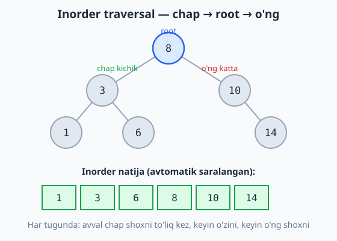
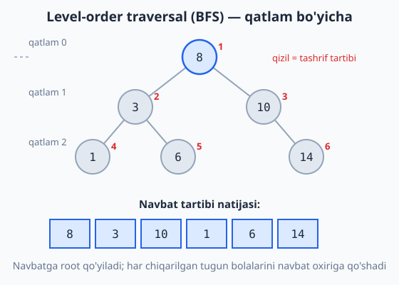

<a id="b12"></a>
# 12-bo'lim: Daraxtlar (Binary Tree / BST)

<sub>[↑ Mundarijaga qaytish](README.md#mundarija)</sub>

> 🌳 BST (binary search tree): chap bola har doim kichikroq, o'ng bola kattaroq. Funksiyalar 135-masaladagi `TreeNode` klassidan foydalanadi. Murakkablikdagi `h` — balandlik: muvozanatli daraxtda O(log n), qiyshiq daraxtda O(n).

<a id="m135"></a>
### 135. TreeNode (class) + BST'ga qo'shish
`⏱ o'rtacha O(log n), eng yomon O(n) · 💾 O(h)`

**JS**
```js
class TreeNode {
  constructor(value) {
    this.value = value;
    this.left = null;
    this.right = null;
  }
}

const insert = (root, value) => {
  if (!root) return new TreeNode(value);
  if (value < root.value) root.left = insert(root.left, value);
  else root.right = insert(root.right, value);
  return root;
};
```
**PHP**
```php
class TreeNode {
    public ?TreeNode $left = null;
    public ?TreeNode $right = null;
    public function __construct(public mixed $value) {}
}

function insert(?TreeNode $root, $value): TreeNode {
    if ($root === null) return new TreeNode($value);
    if ($value < $root->value) $root->left = insert($root->left, $value);
    else $root->right = insert($root->right, $value);
    return $root;
}
```
**Python**
```python
class TreeNode:
    def __init__(self, value):
        self.value = value
        self.left = None
        self.right = None

def insert(root, value):
    if root is None:
        return TreeNode(value)
    if value < root.value:
        root.left = insert(root.left, value)
    else:
        root.right = insert(root.right, value)
    return root
```

<a id="m136"></a>
### 136. BST'da qidirish
`⏱ o'rtacha O(log n), eng yomon O(n) · 💾 O(1)` (iterativ)

**JS**
```js
const search = (root, value) => {
  while (root) {
    if (value === root.value) return true;
    root = value < root.value ? root.left : root.right;
  }
  return false;
};
```
**PHP**
```php
function search(?TreeNode $root, $value): bool {
    while ($root !== null) {
        if ($value === $root->value) return true;
        $root = $value < $root->value ? $root->left : $root->right;
    }
    return false;
}
```
**Python**
```python
def search(root, value):
    while root:
        if value == root.value:
            return True
        root = root.left if value < root.value else root.right
    return False
```

<a id="m137"></a>
### 137. Inorder traversal (chap → root → o'ng)
`⏱ O(n) · 💾 O(h)`
BST'da inorder **saralangan** tartibni beradi.

**JS**
```js
const inorder = root => {
  const out = [];
  const walk = node => {
    if (!node) return;
    walk(node.left);
    out.push(node.value);
    walk(node.right);
  };
  walk(root);
  return out;
};
```
**PHP**
```php
function inorder(?TreeNode $root): array {
    $out = [];
    $walk = function (?TreeNode $node) use (&$walk, &$out) {
        if ($node === null) return;
        $walk($node->left);
        $out[] = $node->value;
        $walk($node->right);
    };
    $walk($root);
    return $out;
}
```
**Python**
```python
def inorder(root):
    out = []

    def walk(node):
        if node is None:
            return
        walk(node.left)
        out.append(node.value)
        walk(node.right)

    walk(root)
    return out
```

Quyidagi BST'da inorder tartib (chap → root → o'ng) qanday qilib saralangan natija berishini ko'ring:



<a id="m138"></a>
### 138. Preorder traversal (root → chap → o'ng)
`⏱ O(n) · 💾 O(h)`
Root birinchi — daraxtni nusxalash/serializatsiya uchun qulay.

**JS**
```js
const preorder = root => {
  const out = [];
  const walk = node => {
    if (!node) return;
    out.push(node.value);
    walk(node.left);
    walk(node.right);
  };
  walk(root);
  return out;
};
```
**PHP**
```php
function preorder(?TreeNode $root): array {
    $out = [];
    $walk = function (?TreeNode $node) use (&$walk, &$out) {
        if ($node === null) return;
        $out[] = $node->value;
        $walk($node->left);
        $walk($node->right);
    };
    $walk($root);
    return $out;
}
```
**Python**
```python
def preorder(root):
    out = []

    def walk(node):
        if node is None:
            return
        out.append(node.value)
        walk(node.left)
        walk(node.right)

    walk(root)
    return out
```

<a id="m139"></a>
### 139. Postorder traversal (chap → o'ng → root)
`⏱ O(n) · 💾 O(h)`
Bolalar birinchi — daraxtni o'chirish/bo'shatish uchun qulay.

**JS**
```js
const postorder = root => {
  const out = [];
  const walk = node => {
    if (!node) return;
    walk(node.left);
    walk(node.right);
    out.push(node.value);
  };
  walk(root);
  return out;
};
```
**PHP**
```php
function postorder(?TreeNode $root): array {
    $out = [];
    $walk = function (?TreeNode $node) use (&$walk, &$out) {
        if ($node === null) return;
        $walk($node->left);
        $walk($node->right);
        $out[] = $node->value;
    };
    $walk($root);
    return $out;
}
```
**Python**
```python
def postorder(root):
    out = []

    def walk(node):
        if node is None:
            return
        walk(node.left)
        walk(node.right)
        out.append(node.value)

    walk(root)
    return out
```

<a id="m140"></a>
### 140. Level-order traversal (BFS)
`⏱ O(n) · 💾 O(n)`
Kenglik bo'yicha — navbat (queue) ishlatiladi, rekursiv traversal'lardan farqli.

**JS**
```js
const levelOrder = root => {
  if (!root) return [];
  const out = [], queue = [root];
  let i = 0;
  while (i < queue.length) {
    const node = queue[i++];
    out.push(node.value);
    if (node.left) queue.push(node.left);
    if (node.right) queue.push(node.right);
  }
  return out;
};
```
**PHP**
```php
function levelOrder(?TreeNode $root): array {
    if ($root === null) return [];
    $out = [];
    $queue = [$root];
    $i = 0;
    while ($i < count($queue)) {
        $node = $queue[$i++];
        $out[] = $node->value;
        if ($node->left !== null) $queue[] = $node->left;
        if ($node->right !== null) $queue[] = $node->right;
    }
    return $out;
}
```
**Python**
```python
from collections import deque

def level_order(root):
    if root is None:
        return []
    out = []
    queue = deque([root])
    while queue:
        node = queue.popleft()
        out.append(node.value)
        if node.left:
            queue.append(node.left)
        if node.right:
            queue.append(node.right)
    return out
```

Diagrammada navbat yordamida daraxt qatlam-qatlam (yuqoridan pastga) qanday kezilishi tasvirlangan:



<a id="m141"></a>
### 141. Daraxt balandligi (height / max depth)
`⏱ O(n) · 💾 O(h)`

**JS**
```js
const height = root => root ? 1 + Math.max(height(root.left), height(root.right)) : 0;
```
**PHP**
```php
function height(?TreeNode $root): int {
    return $root === null ? 0 : 1 + max(height($root->left), height($root->right));
}
```
**Python**
```python
def height(root):
    return 0 if root is None else 1 + max(height(root.left), height(root.right))
```

<a id="m142"></a>
### 142. Tugunlar sonini sanash
`⏱ O(n) · 💾 O(h)`

**JS**
```js
const countNodes = root => root ? 1 + countNodes(root.left) + countNodes(root.right) : 0;
```
**PHP**
```php
function countNodes(?TreeNode $root): int {
    return $root === null ? 0 : 1 + countNodes($root->left) + countNodes($root->right);
}
```
**Python**
```python
def count_nodes(root):
    return 0 if root is None else 1 + count_nodes(root.left) + count_nodes(root.right)
```

<a id="m143"></a>
### 143. BST'ni tekshirish (validate BST)
`⏱ O(n) · 💾 O(h)`
Har node uchun ruxsat etilgan (min, max) oraliq uzatiladi — faqat to'g'ridan-to'g'ri ota emas, **butun ajdodlar** bilan moslik tekshiriladi.

**JS**
```js
const isValidBST = (root, min = -Infinity, max = Infinity) => {
  if (!root) return true;
  if (root.value <= min || root.value >= max) return false;
  return isValidBST(root.left, min, root.value) && isValidBST(root.right, root.value, max);
};
```
**PHP**
```php
function isValidBST(?TreeNode $root, float $min = -INF, float $max = INF): bool {
    if ($root === null) return true;
    if ($root->value <= $min || $root->value >= $max) return false;
    return isValidBST($root->left, $min, $root->value)
        && isValidBST($root->right, $root->value, $max);
}
```
**Python**
```python
def is_valid_bst(root, low=float("-inf"), high=float("inf")):
    if root is None:
        return True
    if not (low < root.value < high):
        return False
    return is_valid_bst(root.left, low, root.value) and is_valid_bst(root.right, root.value, high)
```

<a id="m144"></a>
### 144. Daraxtni aks ettirish (invert / mirror)
`⏱ O(n) · 💾 O(h)`

**JS**
```js
const invert = root => {
  if (!root) return null;
  [root.left, root.right] = [invert(root.right), invert(root.left)];
  return root;
};
```
**PHP**
```php
function invert(?TreeNode $root): ?TreeNode {
    if ($root === null) return null;
    [$root->left, $root->right] = [invert($root->right), invert($root->left)];
    return $root;
}
```
**Python**
```python
def invert(root):
    if root is None:
        return None
    root.left, root.right = invert(root.right), invert(root.left)
    return root
```

<a id="m145"></a>
### 145. Eng kichik umumiy ajdod (LCA, BST)
`⏱ O(h) · 💾 O(1)`
BST xossasidan foydalanib — ikki qiymat bo'linadigan birinchi node LCA bo'ladi.

**JS**
```js
const lca = (root, p, q) => {
  while (root) {
    if (p < root.value && q < root.value) root = root.left;
    else if (p > root.value && q > root.value) root = root.right;
    else return root.value;
  }
  return null;
};
```
**PHP**
```php
function lca(?TreeNode $root, $p, $q) {
    while ($root !== null) {
        if ($p < $root->value && $q < $root->value) $root = $root->left;
        elseif ($p > $root->value && $q > $root->value) $root = $root->right;
        else return $root->value;
    }
    return null;
}
```
**Python**
```python
def lca(root, p, q):
    while root:
        if p < root.value and q < root.value:
            root = root.left
        elif p > root.value and q > root.value:
            root = root.right
        else:
            return root.value
    return None
```

---
