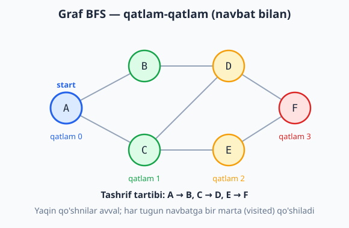
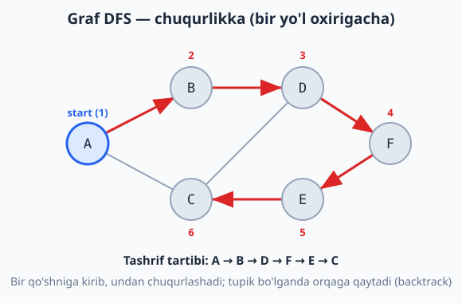
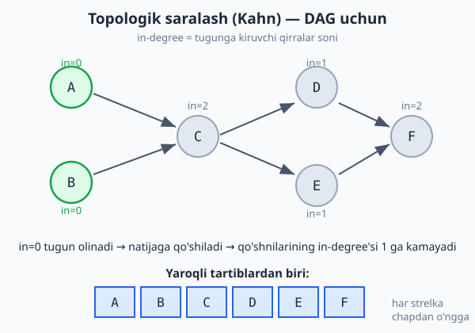

<a id="b13"></a>
# 13-bo'lim: Graflar (BFS / DFS)

<sub>[↑ Mundarijaga qaytish](README.md#mundarija)</sub>

> 🕸 Graf qo'shnilik ro'yxati (adjacency list) bilan ifodalanadi: 146-masaladagi `Graph` klassi. Murakkablikda **V** — tugunlar (vertices), **E** — qirralar (edges) soni.

<a id="m146"></a>
### 146. Graf (class, adjacency list)
`⏱ addEdge O(1) · 💾 O(V + E)`
Siyrak graflar uchun samarali. Yo'naltirilgan graf uchun teskari qirrani qo'shmang (izohli qatorni o'chiring).

**JS**
```js
class Graph {
  constructor() { this.adj = new Map(); }
  addVertex(v) { if (!this.adj.has(v)) this.adj.set(v, []); }
  addEdge(u, v) {
    this.addVertex(u);
    this.addVertex(v);
    this.adj.get(u).push(v);
    this.adj.get(v).push(u); // yo'naltirilmagan
  }
  neighbors(v) { return this.adj.get(v) || []; }
  vertices() { return [...this.adj.keys()]; }
}
```
**PHP**
```php
class Graph {
    private array $adj = [];

    public function addVertex($v): void {
        if (!isset($this->adj[$v])) $this->adj[$v] = [];
    }

    public function addEdge($u, $v): void {
        $this->addVertex($u);
        $this->addVertex($v);
        $this->adj[$u][] = $v;
        $this->adj[$v][] = $u; // yo'naltirilmagan
    }

    public function neighbors($v): array {
        return $this->adj[$v] ?? [];
    }

    public function vertices(): array {
        return array_keys($this->adj);
    }
}
```
**Python**
```python
class Graph:
    def __init__(self):
        self.adj = {}

    def add_vertex(self, v):
        self.adj.setdefault(v, [])

    def add_edge(self, u, v):
        self.add_vertex(u)
        self.add_vertex(v)
        self.adj[u].append(v)
        self.adj[v].append(u)  # yo'naltirilmagan

    def neighbors(self, v):
        return self.adj.get(v, [])

    def vertices(self):
        return list(self.adj.keys())
```

<a id="m147"></a>
### 147. BFS (kenglik bo'yicha o'tish)
`⏱ O(V + E) · 💾 O(V)`
Qatlam-qatlam yuradi — vaznsiz eng qisqa yo'l uchun asos.

**JS**
```js
const bfs = (graph, start) => {
  const visited = new Set([start]);
  const order = [], queue = [start];
  let i = 0;
  while (i < queue.length) {
    const v = queue[i++];
    order.push(v);
    for (const n of graph.neighbors(v)) {
      if (!visited.has(n)) { visited.add(n); queue.push(n); }
    }
  }
  return order;
};
```
**PHP**
```php
function bfs(Graph $graph, $start): array {
    $visited = [$start => true];
    $order = [];
    $queue = [$start];
    $i = 0;
    while ($i < count($queue)) {
        $v = $queue[$i++];
        $order[] = $v;
        foreach ($graph->neighbors($v) as $n) {
            if (!isset($visited[$n])) {
                $visited[$n] = true;
                $queue[] = $n;
            }
        }
    }
    return $order;
}
```
**Python**
```python
from collections import deque

def bfs(graph, start):
    visited = {start}
    order = []
    queue = deque([start])
    while queue:
        v = queue.popleft()
        order.append(v)
        for n in graph.neighbors(v):
            if n not in visited:
                visited.add(n)
                queue.append(n)
    return order
```

Diagrammada BFS start tugundan boshlab qatlam-qatlam (yaqin qo'shnilar avval) tarqalishi ko'rsatilgan:



<a id="m148"></a>
### 148. DFS — rekursiv (chuqurlik bo'yicha)
`⏱ O(V + E) · 💾 O(V)` (steki)

**JS**
```js
const dfs = (graph, start, visited = new Set(), order = []) => {
  visited.add(start);
  order.push(start);
  for (const n of graph.neighbors(start)) {
    if (!visited.has(n)) dfs(graph, n, visited, order);
  }
  return order;
};
```
**PHP**
```php
function dfs(Graph $graph, $start, array &$visited = [], array &$order = []): array {
    $visited[$start] = true;
    $order[] = $start;
    foreach ($graph->neighbors($start) as $n) {
        if (!isset($visited[$n])) dfs($graph, $n, $visited, $order);
    }
    return $order;
}
```
**Python**
```python
def dfs(graph, start, visited=None, order=None):
    if visited is None:
        visited, order = set(), []
    visited.add(start)
    order.append(start)
    for n in graph.neighbors(start):
        if n not in visited:
            dfs(graph, n, visited, order)
    return order
```

DFS esa bir yo'lni oxirigacha kuzatib chuqurlashadi, tupikka yetganda orqaga qaytadi:



<a id="m149"></a>
### 149. DFS — iterativ (stack bilan)
`⏱ O(V + E) · 💾 O(V)`
Rekursiya o'rniga aniq stack — chuqur graflarda stack overflow'dan saqlaydi.

**JS**
```js
const dfsIterative = (graph, start) => {
  const visited = new Set(), order = [], stack = [start];
  while (stack.length) {
    const v = stack.pop();
    if (visited.has(v)) continue;
    visited.add(v);
    order.push(v);
    const ns = graph.neighbors(v);
    for (let i = ns.length - 1; i >= 0; i--) stack.push(ns[i]);
  }
  return order;
};
```
**PHP**
```php
function dfsIterative(Graph $graph, $start): array {
    $visited = [];
    $order = [];
    $stack = [$start];
    while (!empty($stack)) {
        $v = array_pop($stack);
        if (isset($visited[$v])) continue;
        $visited[$v] = true;
        $order[] = $v;
        $ns = $graph->neighbors($v);
        for ($i = count($ns) - 1; $i >= 0; $i--) $stack[] = $ns[$i];
    }
    return $order;
}
```
**Python**
```python
def dfs_iterative(graph, start):
    visited = set()
    order = []
    stack = [start]
    while stack:
        v = stack.pop()
        if v in visited:
            continue
        visited.add(v)
        order.append(v)
        for n in reversed(graph.neighbors(v)):
            stack.append(n)
    return order
```

<a id="m150"></a>
### 150. Eng qisqa yo'l (vaznsiz graf, BFS)
`⏱ O(V + E) · 💾 O(V)`
Vaznsiz grafda BFS eng qisqa yo'lni kafolatlaydi. "prev" xaritasi yo'lni qayta tiklash uchun.

**JS**
```js
const shortestPath = (graph, src, dst) => {
  if (src === dst) return [src];
  const visited = new Set([src]), prev = new Map(), queue = [src];
  let i = 0;
  while (i < queue.length) {
    const v = queue[i++];
    for (const n of graph.neighbors(v)) {
      if (!visited.has(n)) {
        visited.add(n);
        prev.set(n, v);
        if (n === dst) {
          const path = [dst];
          let at = dst;
          while (prev.has(at)) { at = prev.get(at); path.push(at); }
          return path.reverse();
        }
        queue.push(n);
      }
    }
  }
  return null; // yo'l yo'q
};
```
**PHP**
```php
function shortestPath(Graph $graph, $src, $dst): ?array {
    if ($src === $dst) return [$src];
    $visited = [$src => true];
    $prev = [];
    $queue = [$src];
    $i = 0;
    while ($i < count($queue)) {
        $v = $queue[$i++];
        foreach ($graph->neighbors($v) as $n) {
            if (!isset($visited[$n])) {
                $visited[$n] = true;
                $prev[$n] = $v;
                if ($n === $dst) {
                    $path = [$dst];
                    $at = $dst;
                    while (isset($prev[$at])) { $at = $prev[$at]; $path[] = $at; }
                    return array_reverse($path);
                }
                $queue[] = $n;
            }
        }
    }
    return null;
}
```
**Python**
```python
from collections import deque

def shortest_path(graph, src, dst):
    if src == dst:
        return [src]
    visited = {src}
    prev = {}
    queue = deque([src])
    while queue:
        v = queue.popleft()
        for n in graph.neighbors(v):
            if n not in visited:
                visited.add(n)
                prev[n] = v
                if n == dst:
                    path = [dst]
                    at = dst
                    while at in prev:
                        at = prev[at]
                        path.append(at)
                    return path[::-1]
                queue.append(n)
    return None
```

<a id="m151"></a>
### 151. Bog'langan komponentlar soni (connected components)
`⏱ O(V + E) · 💾 O(V)`
Har belgilanmagan tugundan yangi qidiruv boshlanadi — necha marta boshlansa, shuncha komponent.

**JS**
```js
const countComponents = graph => {
  const visited = new Set();
  let count = 0;
  for (const v of graph.vertices()) {
    if (!visited.has(v)) {
      count++;
      const stack = [v];
      while (stack.length) {
        const u = stack.pop();
        if (visited.has(u)) continue;
        visited.add(u);
        for (const n of graph.neighbors(u)) if (!visited.has(n)) stack.push(n);
      }
    }
  }
  return count;
};
```
**PHP**
```php
function countComponents(Graph $graph): int {
    $visited = [];
    $count = 0;
    foreach ($graph->vertices() as $v) {
        if (!isset($visited[$v])) {
            $count++;
            $stack = [$v];
            while (!empty($stack)) {
                $u = array_pop($stack);
                if (isset($visited[$u])) continue;
                $visited[$u] = true;
                foreach ($graph->neighbors($u) as $n) {
                    if (!isset($visited[$n])) $stack[] = $n;
                }
            }
        }
    }
    return $count;
}
```
**Python**
```python
def count_components(graph):
    visited = set()
    count = 0
    for v in graph.vertices():
        if v not in visited:
            count += 1
            stack = [v]
            while stack:
                u = stack.pop()
                if u in visited:
                    continue
                visited.add(u)
                for n in graph.neighbors(u):
                    if n not in visited:
                        stack.append(n)
    return count
```

<a id="m152"></a>
### 152. Siklni aniqlash (yo'naltirilmagan graf, DFS)
`⏱ O(V + E) · 💾 O(V)`
Tashrif buyurilgan, ota bo'lmagan qo'shni topilsa — sikl bor. (Yo'naltirilgan graf uchun usul boshqacha: rekursiya stegi/rang bilan.)

**JS**
```js
const hasCycleUndirected = graph => {
  const visited = new Set();
  const dfs = (v, parent) => {
    visited.add(v);
    for (const n of graph.neighbors(v)) {
      if (!visited.has(n)) {
        if (dfs(n, v)) return true;
      } else if (n !== parent) {
        return true;
      }
    }
    return false;
  };
  for (const v of graph.vertices()) {
    if (!visited.has(v) && dfs(v, null)) return true;
  }
  return false;
};
```
**PHP**
```php
function hasCycleUndirected(Graph $graph): bool {
    $visited = [];
    $dfs = function ($v, $parent) use (&$dfs, &$visited, $graph) {
        $visited[$v] = true;
        foreach ($graph->neighbors($v) as $n) {
            if (!isset($visited[$n])) {
                if ($dfs($n, $v)) return true;
            } elseif ($n !== $parent) {
                return true;
            }
        }
        return false;
    };
    foreach ($graph->vertices() as $v) {
        if (!isset($visited[$v]) && $dfs($v, null)) return true;
    }
    return false;
}
```
**Python**
```python
def has_cycle_undirected(graph):
    visited = set()

    def dfs(v, parent):
        visited.add(v)
        for n in graph.neighbors(v):
            if n not in visited:
                if dfs(n, v):
                    return True
            elif n != parent:
                return True
        return False

    for v in graph.vertices():
        if v not in visited and dfs(v, None):
            return True
    return False
```

<a id="m153"></a>
### 153. Topologik saralash (Kahn algoritmi, DAG)
`⏱ O(V + E) · 💾 O(V)`
Yo'naltirilgan asiklik graf (DAG) uchun. In-degree (kiruvchi qirralar) 0 bo'lgan tugunlardan boshlanadi; natija barcha tugunlarni qamramasa — grafda sikl bor. (Grafni yo'naltirilgan qilib quring: addEdge'da teskari qirrasiz.)

**JS**
```js
const topoSort = graph => {
  const inDegree = new Map();
  for (const v of graph.vertices()) inDegree.set(v, 0);
  for (const v of graph.vertices())
    for (const n of graph.neighbors(v)) inDegree.set(n, (inDegree.get(n) || 0) + 1);

  const queue = [];
  for (const [v, d] of inDegree) if (d === 0) queue.push(v);

  const order = [];
  let i = 0;
  while (i < queue.length) {
    const v = queue[i++];
    order.push(v);
    for (const n of graph.neighbors(v)) {
      inDegree.set(n, inDegree.get(n) - 1);
      if (inDegree.get(n) === 0) queue.push(n);
    }
  }
  return order.length === inDegree.size ? order : null; // null → sikl bor
};
```
**PHP**
```php
function topoSort(Graph $graph): ?array {
    $inDegree = [];
    foreach ($graph->vertices() as $v) $inDegree[$v] = 0;
    foreach ($graph->vertices() as $v) {
        foreach ($graph->neighbors($v) as $n) {
            $inDegree[$n] = ($inDegree[$n] ?? 0) + 1;
        }
    }

    $queue = [];
    foreach ($inDegree as $v => $d) if ($d === 0) $queue[] = $v;

    $order = [];
    $i = 0;
    while ($i < count($queue)) {
        $v = $queue[$i++];
        $order[] = $v;
        foreach ($graph->neighbors($v) as $n) {
            $inDegree[$n]--;
            if ($inDegree[$n] === 0) $queue[] = $n;
        }
    }
    return count($order) === count($inDegree) ? $order : null;
}
```
**Python**
```python
from collections import deque

def topo_sort(graph):
    in_degree = {v: 0 for v in graph.vertices()}
    for v in graph.vertices():
        for n in graph.neighbors(v):
            in_degree[n] = in_degree.get(n, 0) + 1

    queue = deque(v for v, d in in_degree.items() if d == 0)
    order = []
    while queue:
        v = queue.popleft()
        order.append(v)
        for n in graph.neighbors(v):
            in_degree[n] -= 1
            if in_degree[n] == 0:
                queue.append(n)
    return order if len(order) == len(in_degree) else None
```

Diagrammada in-degree (kiruvchi qirralar) 0 bo'lgan tugunlardan boshlab tartib qanday qurilishi ko'rsatilgan:



---
