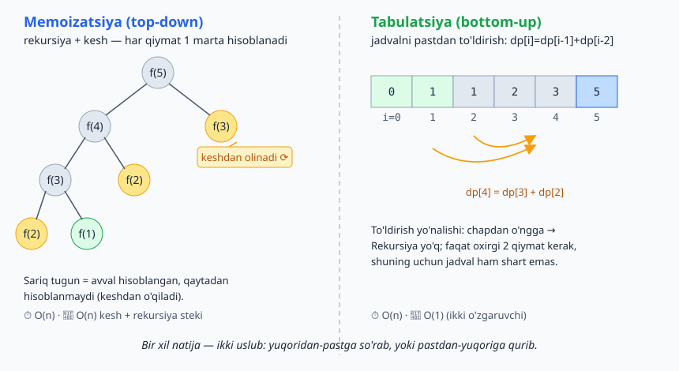
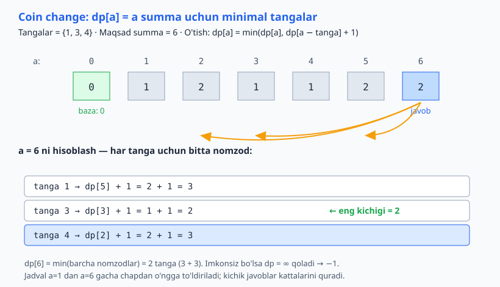
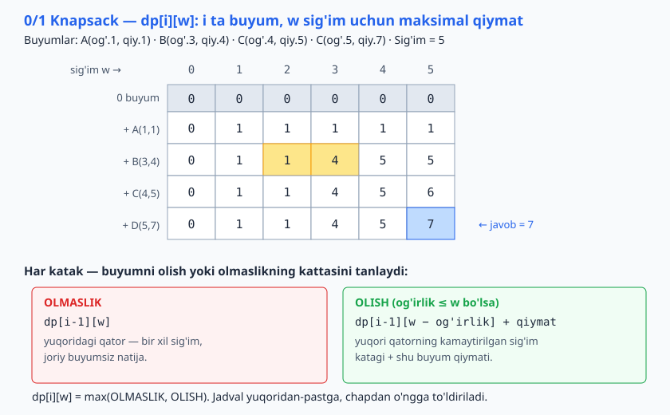
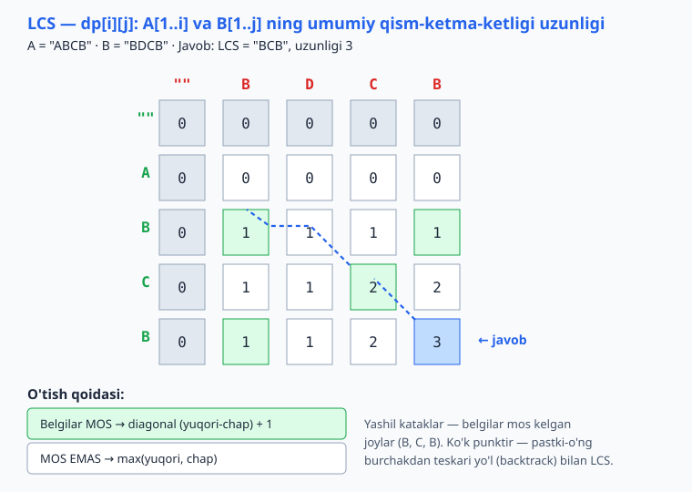

<a id="b14"></a>
# 14-bo'lim: Dinamik dasturlash (DP)

<sub>[↑ Mundarijaga qaytish](README.md#mundarija)</sub>

> ⚡ DP — takrorlanuvchi qism-masalalar natijasini saqlab, qayta hisoblashdan qutqaradi. Ikki uslub:
> - **Top-down (memoizatsiya):** rekursiya + natijalarni kesh.
> - **Bottom-up (tabulatsiya):** kichik qism-masalalardan jadval to'ldirish; ko'pincha xotirani kamaytirishga imkon beradi.
>
> Har masalada kalit savol: "qism-masala nima va o'tish (transition) formulasi qanday?"

<a id="m154"></a>
### 154. Fibonachchi — memoizatsiya (top-down)
`⏱ O(n) · 💾 O(n)`
95-masaladagi O(2ⁿ) rekursiyani kesh bilan O(n) ga tushiramiz — har qiymat bir marta hisoblanadi.

**JS**
```js
const fib = (n, memo = {}) => {
  if (n < 2) return n;
  if (n in memo) return memo[n];
  return memo[n] = fib(n - 1, memo) + fib(n - 2, memo);
};
```
**PHP**
```php
function fib($n, array &$memo = []): int {
    if ($n < 2) return $n;
    if (isset($memo[$n])) return $memo[$n];
    return $memo[$n] = fib($n - 1, $memo) + fib($n - 2, $memo);
}
```
**Python**
```python
def fib(n, memo=None):
    if memo is None:
        memo = {}
    if n < 2:
        return n
    if n in memo:
        return memo[n]
    memo[n] = fib(n - 1, memo) + fib(n - 2, memo)
    return memo[n]
```

<a id="m155"></a>
### 155. Fibonachchi — tabulatsiya (bottom-up)
`⏱ O(n) · 💾 O(1)`
Pastdan-yuqoriga: faqat oxirgi ikki qiymat saqlanadi, jadval shart emas.

**JS**
```js
const fib = n => {
  if (n < 2) return n;
  let a = 0, b = 1;
  for (let i = 2; i <= n; i++) [a, b] = [b, a + b];
  return b;
};
```
**PHP**
```php
function fib($n): int {
    if ($n < 2) return $n;
    $a = 0; $b = 1;
    for ($i = 2; $i <= $n; $i++) [$a, $b] = [$b, $a + $b];
    return $b;
}
```
**Python**
```python
def fib(n):
    if n < 2:
        return n
    a, b = 0, 1
    for _ in range(2, n + 1):
        a, b = b, a + b
    return b
```

Bir xil masala — ikki yondashuv: top-down kerakli qiymatlarni "so'rab" rekursiya bilan keshlaydi, bottom-up jadvalni pastdan to'ldiradi.



<a id="m156"></a>
### 156. Zinapoyaga chiqish (climbing stairs)
`⏱ O(n) · 💾 O(1)`
n pog'onaga 1 yoki 2 qadam bilan. Oxirgi qadam 1 yoki 2 → ways(n) = ways(n−1) + ways(n−2).

**JS**
```js
const climbStairs = n => {
  let a = 1, b = 1;
  for (let i = 2; i <= n; i++) [a, b] = [b, a + b];
  return b;
};
```
**PHP**
```php
function climbStairs($n): int {
    $a = 1; $b = 1;
    for ($i = 2; $i <= $n; $i++) [$a, $b] = [$b, $a + $b];
    return $b;
}
```
**Python**
```python
def climb_stairs(n):
    a, b = 1, 1
    for _ in range(2, n + 1):
        a, b = b, a + b
    return b
```

<a id="m157"></a>
### 157. Tanga maydalash — minimal tangalar (coin change)
`⏱ O(amount × coins) · 💾 O(amount)`
dp[a] = a summani yig'ishning minimal tangalar soni; imkonsiz bo'lsa −1.

**JS**
```js
const coinChange = (coins, amount) => {
  const dp = new Array(amount + 1).fill(Infinity);
  dp[0] = 0;
  for (let a = 1; a <= amount; a++) {
    for (const c of coins) {
      if (c <= a) dp[a] = Math.min(dp[a], dp[a - c] + 1);
    }
  }
  return dp[amount] === Infinity ? -1 : dp[amount];
};
```
**PHP**
```php
function coinChange($coins, $amount): int {
    $dp = array_fill(0, $amount + 1, PHP_INT_MAX);
    $dp[0] = 0;
    for ($a = 1; $a <= $amount; $a++) {
        foreach ($coins as $c) {
            if ($c <= $a && $dp[$a - $c] !== PHP_INT_MAX) {
                $dp[$a] = min($dp[$a], $dp[$a - $c] + 1);
            }
        }
    }
    return $dp[$amount] === PHP_INT_MAX ? -1 : $dp[$amount];
}
```
**Python**
```python
def coin_change(coins, amount):
    dp = [float("inf")] * (amount + 1)
    dp[0] = 0
    for a in range(1, amount + 1):
        for c in coins:
            if c <= a:
                dp[a] = min(dp[a], dp[a - c] + 1)
    return dp[amount] if dp[amount] != float("inf") else -1
```

Quyidagi jadval har bir summa uchun minimal tangalarni qanday qurib borishini ko'rsatadi:



<a id="m158"></a>
### 158. Tanga maydalash — usullar soni (coin change ways)
`⏱ O(amount × coins) · 💾 O(amount)`
Tashqi sikl tangalar bo'yicha — bu **noyob** to'plamlarni sanaydi (tartib muhim emas).

**JS**
```js
const coinChangeWays = (coins, amount) => {
  const dp = new Array(amount + 1).fill(0);
  dp[0] = 1;
  for (const c of coins) {
    for (let a = c; a <= amount; a++) dp[a] += dp[a - c];
  }
  return dp[amount];
};
```
**PHP**
```php
function coinChangeWays($coins, $amount): int {
    $dp = array_fill(0, $amount + 1, 0);
    $dp[0] = 1;
    foreach ($coins as $c) {
        for ($a = $c; $a <= $amount; $a++) $dp[$a] += $dp[$a - $c];
    }
    return $dp[$amount];
}
```
**Python**
```python
def coin_change_ways(coins, amount):
    dp = [0] * (amount + 1)
    dp[0] = 1
    for c in coins:
        for a in range(c, amount + 1):
            dp[a] += dp[a - c]
    return dp[amount]
```

<a id="m159"></a>
### 159. 0/1 Knapsack (ryukzak)
`⏱ O(n × cap) · 💾 O(n × cap)`
Har buyum uchun ikki tanlov — olish yoki olmaslik. 1D massiv bilan xotirani O(cap) ga tushirish mumkin (w ni teskari aylantirib).

**JS**
```js
const knapsack = (weights, values, cap) => {
  const n = weights.length;
  const dp = Array.from({ length: n + 1 }, () => new Array(cap + 1).fill(0));
  for (let i = 1; i <= n; i++) {
    for (let w = 0; w <= cap; w++) {
      dp[i][w] = dp[i - 1][w];
      if (weights[i - 1] <= w) {
        dp[i][w] = Math.max(dp[i][w], dp[i - 1][w - weights[i - 1]] + values[i - 1]);
      }
    }
  }
  return dp[n][cap];
};
```
**PHP**
```php
function knapsack($weights, $values, $cap): int {
    $n = count($weights);
    $dp = array_fill(0, $n + 1, array_fill(0, $cap + 1, 0));
    for ($i = 1; $i <= $n; $i++) {
        for ($w = 0; $w <= $cap; $w++) {
            $dp[$i][$w] = $dp[$i - 1][$w];
            if ($weights[$i - 1] <= $w) {
                $dp[$i][$w] = max($dp[$i][$w], $dp[$i - 1][$w - $weights[$i - 1]] + $values[$i - 1]);
            }
        }
    }
    return $dp[$n][$cap];
}
```
**Python**
```python
def knapsack(weights, values, cap):
    n = len(weights)
    dp = [[0] * (cap + 1) for _ in range(n + 1)]
    for i in range(1, n + 1):
        for w in range(cap + 1):
            dp[i][w] = dp[i - 1][w]
            if weights[i - 1] <= w:
                dp[i][w] = max(dp[i][w], dp[i - 1][w - weights[i - 1]] + values[i - 1])
    return dp[n][cap]
```

2D jadvalda har katak buyumni olish va olmaslik variantlarining kattasini tanlaydi:



<a id="m160"></a>
### 160. Eng uzun umumiy qism-ketma-ketlik (LCS)
`⏱ O(m × n) · 💾 O(m × n)`
Belgilar mos kelsa diagonal+1, aks holda yuqori/chap'dan maksimum. Diff vositalari, DNA solishtirish shu asosda.

**JS**
```js
const lcs = (a, b) => {
  const m = a.length, n = b.length;
  const dp = Array.from({ length: m + 1 }, () => new Array(n + 1).fill(0));
  for (let i = 1; i <= m; i++) {
    for (let j = 1; j <= n; j++) {
      dp[i][j] = a[i - 1] === b[j - 1]
        ? dp[i - 1][j - 1] + 1
        : Math.max(dp[i - 1][j], dp[i][j - 1]);
    }
  }
  return dp[m][n];
};
```
**PHP**
```php
function lcs($a, $b): int {
    $m = strlen($a); $n = strlen($b);
    $dp = array_fill(0, $m + 1, array_fill(0, $n + 1, 0));
    for ($i = 1; $i <= $m; $i++) {
        for ($j = 1; $j <= $n; $j++) {
            $dp[$i][$j] = $a[$i - 1] === $b[$j - 1]
                ? $dp[$i - 1][$j - 1] + 1
                : max($dp[$i - 1][$j], $dp[$i][$j - 1]);
        }
    }
    return $dp[$m][$n];
}
```
**Python**
```python
def lcs(a, b):
    m, n = len(a), len(b)
    dp = [[0] * (n + 1) for _ in range(m + 1)]
    for i in range(1, m + 1):
        for j in range(1, n + 1):
            if a[i - 1] == b[j - 1]:
                dp[i][j] = dp[i - 1][j - 1] + 1
            else:
                dp[i][j] = max(dp[i - 1][j], dp[i][j - 1])
    return dp[m][n]
```

Grid bo'ylab belgilar mos kelganda diagonal+1, aks holda yuqori/chap maksimum olinadi; pastki-o'ng burchakdan teskari yo'l LCS ni beradi:



<a id="m161"></a>
### 161. Eng uzun o'suvchi qism-ketma-ketlik (LIS)
`⏱ O(n²) · 💾 O(n)`
dp[i] = i bilan tugaydigan eng uzun o'suvchi ketma-ketlik. Ikkilik qidiruv bilan O(n log n) ga tushadi.

**JS**
```js
const lis = nums => {
  if (nums.length === 0) return 0;
  const dp = new Array(nums.length).fill(1);
  for (let i = 1; i < nums.length; i++) {
    for (let j = 0; j < i; j++) {
      if (nums[j] < nums[i]) dp[i] = Math.max(dp[i], dp[j] + 1);
    }
  }
  return Math.max(...dp);
};
```
**PHP**
```php
function lis($nums): int {
    if (count($nums) === 0) return 0;
    $dp = array_fill(0, count($nums), 1);
    for ($i = 1; $i < count($nums); $i++) {
        for ($j = 0; $j < $i; $j++) {
            if ($nums[$j] < $nums[$i]) $dp[$i] = max($dp[$i], $dp[$j] + 1);
        }
    }
    return max($dp);
}
```
**Python**
```python
def lis(nums):
    if not nums:
        return 0
    dp = [1] * len(nums)
    for i in range(1, len(nums)):
        for j in range(i):
            if nums[j] < nums[i]:
                dp[i] = max(dp[i], dp[j] + 1)
    return max(dp)
```

<a id="m162"></a>
### 162. Tahrirlash masofasi (edit distance / Levenshtein)
`⏱ O(m × n) · 💾 O(m × n)`
Uchta amal — o'chirish (yuqori), qo'shish (chap), almashtirish (diagonal). Imlo tekshirgichlar, fuzzy qidiruv shu asosda.

**JS**
```js
const editDistance = (a, b) => {
  const m = a.length, n = b.length;
  const dp = Array.from({ length: m + 1 }, (_, i) =>
    Array.from({ length: n + 1 }, (_, j) => (i === 0 ? j : j === 0 ? i : 0)));
  for (let i = 1; i <= m; i++) {
    for (let j = 1; j <= n; j++) {
      dp[i][j] = a[i - 1] === b[j - 1]
        ? dp[i - 1][j - 1]
        : 1 + Math.min(dp[i - 1][j], dp[i][j - 1], dp[i - 1][j - 1]);
    }
  }
  return dp[m][n];
};
```
**PHP**
```php
function editDistance($a, $b): int {
    $m = strlen($a); $n = strlen($b);
    $dp = array_fill(0, $m + 1, array_fill(0, $n + 1, 0));
    for ($i = 0; $i <= $m; $i++) $dp[$i][0] = $i;
    for ($j = 0; $j <= $n; $j++) $dp[0][$j] = $j;
    for ($i = 1; $i <= $m; $i++) {
        for ($j = 1; $j <= $n; $j++) {
            $dp[$i][$j] = $a[$i - 1] === $b[$j - 1]
                ? $dp[$i - 1][$j - 1]
                : 1 + min($dp[$i - 1][$j], $dp[$i][$j - 1], $dp[$i - 1][$j - 1]);
        }
    }
    return $dp[$m][$n];
}
```
**Python**
```python
def edit_distance(a, b):
    m, n = len(a), len(b)
    dp = [[0] * (n + 1) for _ in range(m + 1)]
    for i in range(m + 1):
        dp[i][0] = i
    for j in range(n + 1):
        dp[0][j] = j
    for i in range(1, m + 1):
        for j in range(1, n + 1):
            if a[i - 1] == b[j - 1]:
                dp[i][j] = dp[i - 1][j - 1]
            else:
                dp[i][j] = 1 + min(dp[i - 1][j], dp[i][j - 1], dp[i - 1][j - 1])
    return dp[m][n]
```

<a id="m163"></a>
### 163. Maksimal qism-massiv yig'indisi (Kadane)
`⏱ O(n) · 💾 O(1)`
Har pozitsiyada: joriy elementdan yangi boshlash yoki oldingi yig'indiga qo'shish foydaliroqmi?

**JS**
```js
const maxSubarray = nums => {
  let best = nums[0], cur = nums[0];
  for (let i = 1; i < nums.length; i++) {
    cur = Math.max(nums[i], cur + nums[i]);
    best = Math.max(best, cur);
  }
  return best;
};
```
**PHP**
```php
function maxSubarray($nums): int {
    $best = $cur = $nums[0];
    for ($i = 1; $i < count($nums); $i++) {
        $cur = max($nums[$i], $cur + $nums[$i]);
        $best = max($best, $cur);
    }
    return $best;
}
```
**Python**
```python
def max_subarray(nums):
    best = cur = nums[0]
    for x in nums[1:]:
        cur = max(x, cur + x)
        best = max(best, cur)
    return best
```

<a id="m164"></a>
### 164. House robber (qo'shni bo'lmagan maksimal yig'indi)
`⏱ O(n) · 💾 O(1)`
Har uyda: talamaslik (oldingi natija) yoki talash (oldingidan-oldingi + joriy)?

**JS**
```js
const rob = nums => {
  let prev = 0, curr = 0;
  for (const x of nums) {
    [prev, curr] = [curr, Math.max(curr, prev + x)];
  }
  return curr;
};
```
**PHP**
```php
function rob($nums): int {
    $prev = 0; $curr = 0;
    foreach ($nums as $x) {
        [$prev, $curr] = [$curr, max($curr, $prev + $x)];
    }
    return $curr;
}
```
**Python**
```python
def rob(nums):
    prev, curr = 0, 0
    for x in nums:
        prev, curr = curr, max(curr, prev + x)
    return curr
```

<a id="m165"></a>
### 165. To'r bo'yicha noyob yo'llar (unique paths)
`⏱ O(m × n) · 💾 O(n)`
m×n to'rda yuqori-chapdan pastki-o'ngga, faqat o'ng/past. paths(i,j) = paths(i−1,j) + paths(i,j−1); 1D massiv bilan optimallashtirildi.

**JS**
```js
const uniquePaths = (m, n) => {
  const dp = new Array(n).fill(1);
  for (let i = 1; i < m; i++) {
    for (let j = 1; j < n; j++) dp[j] += dp[j - 1];
  }
  return dp[n - 1];
};
```
**PHP**
```php
function uniquePaths($m, $n): int {
    $dp = array_fill(0, $n, 1);
    for ($i = 1; $i < $m; $i++) {
        for ($j = 1; $j < $n; $j++) $dp[$j] += $dp[$j - 1];
    }
    return $dp[$n - 1];
}
```
**Python**
```python
def unique_paths(m, n):
    dp = [1] * n
    for _ in range(1, m):
        for j in range(1, n):
            dp[j] += dp[j - 1]
    return dp[n - 1]
```

<a id="m166"></a>
### 166. Dijkstra — vaznli eng qisqa yo'l (bonus)
`⏱ O((V + E) log V) · 💾 O(V)`
> Bu **greedy** algoritm (DP emas), lekin 150-masaladagi vaznsiz BFS'ning tabiiy davomi. Min-heap (priority queue) eng yaqin tugunni tanlaydi. **Manfiy vazn** bo'lsa ishlamaydi (unda Bellman-Ford kerak). Kirish formati: `adj = { "A": [["B", 4], ["C", 1]], ... }`. JS'da o'z MinHeap'imiz, Pythonda `heapq`, PHP'da `SplPriorityQueue`.

**JS**
```js
class MinHeap {
  constructor() { this.h = []; }
  get size() { return this.h.length; }
  push(item) {
    const h = this.h;
    h.push(item);
    let i = h.length - 1;
    while (i > 0) {
      const p = (i - 1) >> 1;
      if (h[p][0] <= h[i][0]) break;
      [h[p], h[i]] = [h[i], h[p]];
      i = p;
    }
  }
  pop() {
    const h = this.h;
    const top = h[0], last = h.pop();
    if (h.length) {
      h[0] = last;
      let i = 0;
      while (true) {
        const l = 2 * i + 1, r = 2 * i + 2;
        let s = i;
        if (l < h.length && h[l][0] < h[s][0]) s = l;
        if (r < h.length && h[r][0] < h[s][0]) s = r;
        if (s === i) break;
        [h[s], h[i]] = [h[i], h[s]];
        i = s;
      }
    }
    return top;
  }
}

const dijkstra = (adj, start) => {
  const dist = {};
  for (const v in adj) dist[v] = Infinity;
  dist[start] = 0;
  const pq = new MinHeap();
  pq.push([0, start]);
  while (pq.size) {
    const [d, v] = pq.pop();
    if (d > dist[v]) continue; // eskirgan yozuv
    for (const [n, w] of adj[v]) {
      const nd = d + w;
      if (nd < dist[n]) { dist[n] = nd; pq.push([nd, n]); }
    }
  }
  return dist;
};
```
**PHP**
```php
function dijkstra(array $adj, $start): array {
    $dist = [];
    foreach (array_keys($adj) as $v) $dist[$v] = INF;
    $dist[$start] = 0;

    $pq = new SplPriorityQueue();
    $pq->insert([0, $start], 0);

    while (!$pq->isEmpty()) {
        [$d, $v] = $pq->extract();
        if ($d > $dist[$v]) continue; // eskirgan yozuv
        foreach ($adj[$v] as [$n, $w]) {
            $nd = $d + $w;
            if ($nd < $dist[$n]) {
                $dist[$n] = $nd;
                $pq->insert([$nd, $n], -$nd); // kichik masofa → yuqori prioritet
            }
        }
    }
    return $dist;
}
```
**Python**
```python
import heapq

def dijkstra(adj, start):
    dist = {v: float("inf") for v in adj}
    dist[start] = 0
    pq = [(0, start)]
    while pq:
        d, v = heapq.heappop(pq)
        if d > dist[v]:
            continue  # eskirgan yozuv
        for n, w in adj[v]:
            nd = d + w
            if nd < dist[n]:
                dist[n] = nd
                heapq.heappush(pq, (nd, n))
    return dist
```

---
