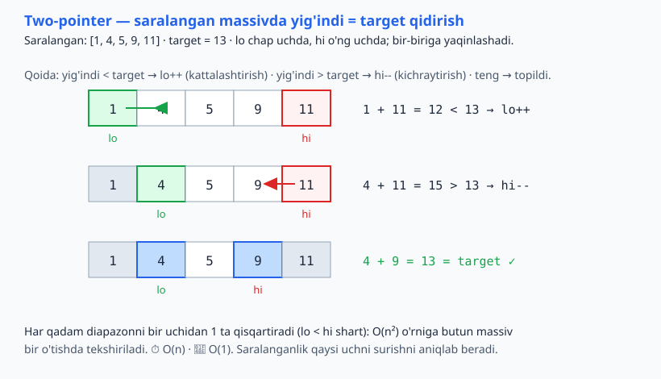
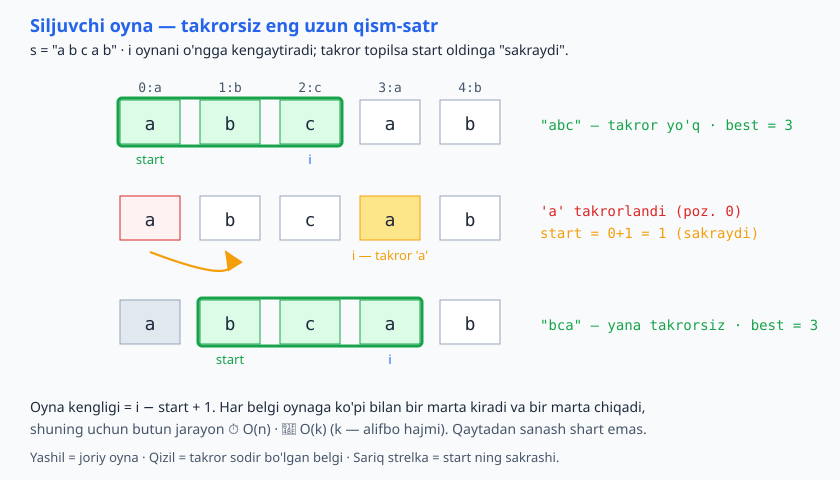

<a id="b15"></a>
# 15-bo'lim: Two pointers / Sliding window

<sub>[↑ Mundarijaga qaytish](README.md#mundarija)</sub>

> 👉👈 **Ikki ko'rsatkich (two pointers):** bitta sikl ichida ikki indeks bilan kvadratik yechimni chiziqliga aylantirish. **Siljuvchi oyna (sliding window):** ketma-ket qism (subarray/substring) ustida ishlaganda oynani har safar qaytadan hisoblamasdan, chetidan yangilab borish. Ikkalasi ham ko'p hollarda O(n²) → O(n) qiladi.

<a id="m167"></a>
### 167. Two sum (saralangan massiv)
`⏱ O(n) · 💾 O(1)`
Saralangan bo'lgani uchun — yig'indi kichik bo'lsa chap'ni surish, katta bo'lsa o'ng'ni. Saralanmaganda hash map bilan O(n) (lekin O(n) xotira).

**JS**
```js
const twoSumSorted = (arr, target) => {
  let lo = 0, hi = arr.length - 1;
  while (lo < hi) {
    const sum = arr[lo] + arr[hi];
    if (sum === target) return [lo, hi];
    if (sum < target) lo++;
    else hi--;
  }
  return null;
};
```
**PHP**
```php
function twoSumSorted($arr, $target): ?array {
    $lo = 0; $hi = count($arr) - 1;
    while ($lo < $hi) {
        $sum = $arr[$lo] + $arr[$hi];
        if ($sum === $target) return [$lo, $hi];
        if ($sum < $target) $lo++;
        else $hi--;
    }
    return null;
}
```
**Python**
```python
def two_sum_sorted(arr, target):
    lo, hi = 0, len(arr) - 1
    while lo < hi:
        s = arr[lo] + arr[hi]
        if s == target:
            return [lo, hi]
        if s < target:
            lo += 1
        else:
            hi -= 1
    return None
```

Ikki ko'rsatkich massivning ikki uchidan boshlanib, yig'indiga qarab bir-biriga yaqinlashadi:



<a id="m168"></a>
### 168. Massivni joyida teskari ag'darish
`⏱ O(n) · 💾 O(1)`
61-masaladagidan farqli — nusxa olmasdan, chetdan markazga.

**JS**
```js
const reverseInPlace = arr => {
  let lo = 0, hi = arr.length - 1;
  while (lo < hi) {
    [arr[lo], arr[hi]] = [arr[hi], arr[lo]];
    lo++;
    hi--;
  }
  return arr;
};
```
**PHP**
```php
function reverseInPlace(array $arr): array {
    $lo = 0; $hi = count($arr) - 1;
    while ($lo < $hi) {
        [$arr[$lo], $arr[$hi]] = [$arr[$hi], $arr[$lo]];
        $lo++;
        $hi--;
    }
    return $arr;
}
```
**Python**
```python
def reverse_in_place(arr):
    lo, hi = 0, len(arr) - 1
    while lo < hi:
        arr[lo], arr[hi] = arr[hi], arr[lo]
        lo += 1
        hi -= 1
    return arr
```

<a id="m169"></a>
### 169. Valid palindrome (alfanumerik)
`⏱ O(n) · 💾 O(1)`
42-masaladan farqli — yangi tozalangan satr yaratmasdan, joyida ko'rsatkichlar bilan (harf/raqam bo'lmaganlarni o'tkazib).

**JS**
```js
const isPalindromeClean = s => {
  let lo = 0, hi = s.length - 1;
  const ok = c => /[a-z0-9]/i.test(c);
  while (lo < hi) {
    while (lo < hi && !ok(s[lo])) lo++;
    while (lo < hi && !ok(s[hi])) hi--;
    if (s[lo].toLowerCase() !== s[hi].toLowerCase()) return false;
    lo++;
    hi--;
  }
  return true;
};
```
**PHP**
```php
function isPalindromeClean($s): bool {
    $lo = 0; $hi = strlen($s) - 1;
    while ($lo < $hi) {
        while ($lo < $hi && !ctype_alnum($s[$lo])) $lo++;
        while ($lo < $hi && !ctype_alnum($s[$hi])) $hi--;
        if (strtolower($s[$lo]) !== strtolower($s[$hi])) return false;
        $lo++;
        $hi--;
    }
    return true;
}
```
**Python**
```python
def is_palindrome_clean(s):
    lo, hi = 0, len(s) - 1
    while lo < hi:
        while lo < hi and not s[lo].isalnum():
            lo += 1
        while lo < hi and not s[hi].isalnum():
            hi -= 1
        if s[lo].lower() != s[hi].lower():
            return False
        lo += 1
        hi -= 1
    return True
```

<a id="m170"></a>
### 170. Saralangan massivdan takrorlarni olib tashlash (in-place)
`⏱ O(n) · 💾 O(1)`
"slow" noyob qism oxirini belgilaydi, "fast" oldinga yuradi — klassik tez/sekin ko'rsatkich. Noyob elementlar sonini qaytaradi.

**JS**
```js
const removeDuplicates = arr => {
  if (arr.length === 0) return 0;
  let slow = 0;
  for (let fast = 1; fast < arr.length; fast++) {
    if (arr[fast] !== arr[slow]) {
      slow++;
      arr[slow] = arr[fast];
    }
  }
  return slow + 1;
};
```
**PHP**
```php
function removeDuplicates(array &$arr): int {
    if (count($arr) === 0) return 0;
    $slow = 0;
    for ($fast = 1; $fast < count($arr); $fast++) {
        if ($arr[$fast] !== $arr[$slow]) {
            $slow++;
            $arr[$slow] = $arr[$fast];
        }
    }
    return $slow + 1;
}
```
**Python**
```python
def remove_duplicates(arr):
    if not arr:
        return 0
    slow = 0
    for fast in range(1, len(arr)):
        if arr[fast] != arr[slow]:
            slow += 1
            arr[slow] = arr[fast]
    return slow + 1
```

<a id="m171"></a>
### 171. Container with most water
`⏱ O(n) · 💾 O(1)`
Pastroq devorni surish — chunki balandni surish maydonni faqat kamaytiradi (kenglik kamayadi, balandlik baribir pastroq devor bilan cheklangan).

**JS**
```js
const maxArea = heights => {
  let lo = 0, hi = heights.length - 1, best = 0;
  while (lo < hi) {
    const area = Math.min(heights[lo], heights[hi]) * (hi - lo);
    best = Math.max(best, area);
    if (heights[lo] < heights[hi]) lo++;
    else hi--;
  }
  return best;
};
```
**PHP**
```php
function maxArea($heights): int {
    $lo = 0; $hi = count($heights) - 1; $best = 0;
    while ($lo < $hi) {
        $area = min($heights[$lo], $heights[$hi]) * ($hi - $lo);
        $best = max($best, $area);
        if ($heights[$lo] < $heights[$hi]) $lo++;
        else $hi--;
    }
    return $best;
}
```
**Python**
```python
def max_area(heights):
    lo, hi, best = 0, len(heights) - 1, 0
    while lo < hi:
        area = min(heights[lo], heights[hi]) * (hi - lo)
        best = max(best, area)
        if heights[lo] < heights[hi]:
            lo += 1
        else:
            hi -= 1
    return best
```

<a id="m172"></a>
### 172. 3Sum (yig'indisi nolga teng uchliklar)
`⏱ O(n²) · 💾 O(1)` (natijadan tashqari)
Saralab, har element uchun qolganini two-pointer bilan; takrorlarni o'tkazib yuborish noyoblikni ta'minlaydi.

**JS**
```js
const threeSum = nums => {
  const a = [...nums].sort((x, y) => x - y);
  const res = [];
  for (let i = 0; i < a.length - 2; i++) {
    if (i > 0 && a[i] === a[i - 1]) continue;
    let lo = i + 1, hi = a.length - 1;
    while (lo < hi) {
      const sum = a[i] + a[lo] + a[hi];
      if (sum === 0) {
        res.push([a[i], a[lo], a[hi]]);
        while (lo < hi && a[lo] === a[lo + 1]) lo++;
        while (lo < hi && a[hi] === a[hi - 1]) hi--;
        lo++;
        hi--;
      } else if (sum < 0) lo++;
      else hi--;
    }
  }
  return res;
};
```
**PHP**
```php
function threeSum($nums): array {
    $a = $nums;
    sort($a);
    $res = [];
    $n = count($a);
    for ($i = 0; $i < $n - 2; $i++) {
        if ($i > 0 && $a[$i] === $a[$i - 1]) continue;
        $lo = $i + 1; $hi = $n - 1;
        while ($lo < $hi) {
            $sum = $a[$i] + $a[$lo] + $a[$hi];
            if ($sum === 0) {
                $res[] = [$a[$i], $a[$lo], $a[$hi]];
                while ($lo < $hi && $a[$lo] === $a[$lo + 1]) $lo++;
                while ($lo < $hi && $a[$hi] === $a[$hi - 1]) $hi--;
                $lo++;
                $hi--;
            } elseif ($sum < 0) $lo++;
            else $hi--;
        }
    }
    return $res;
}
```
**Python**
```python
def three_sum(nums):
    a = sorted(nums)
    res = []
    n = len(a)
    for i in range(n - 2):
        if i > 0 and a[i] == a[i - 1]:
            continue
        lo, hi = i + 1, n - 1
        while lo < hi:
            s = a[i] + a[lo] + a[hi]
            if s == 0:
                res.append([a[i], a[lo], a[hi]])
                while lo < hi and a[lo] == a[lo + 1]:
                    lo += 1
                while lo < hi and a[hi] == a[hi - 1]:
                    hi -= 1
                lo += 1
                hi -= 1
            elif s < 0:
                lo += 1
            else:
                hi -= 1
    return res
```

<a id="m173"></a>
### 173. Sliding window (sobit): k uzunlikdagi maksimal yig'indi
`⏱ O(n) · 💾 O(1)`
Oynani har safar qaytadan emas — bittasi kiradi, bittasi chiqadi (O(1) yangilash). Sodda yondashuv O(n·k) bo'lardi.

**JS**
```js
const maxSumWindow = (arr, k) => {
  let sum = 0;
  for (let i = 0; i < k; i++) sum += arr[i];
  let best = sum;
  for (let i = k; i < arr.length; i++) {
    sum += arr[i] - arr[i - k];
    best = Math.max(best, sum);
  }
  return best;
};
```
**PHP**
```php
function maxSumWindow($arr, $k): int {
    $sum = 0;
    for ($i = 0; $i < $k; $i++) $sum += $arr[$i];
    $best = $sum;
    for ($i = $k; $i < count($arr); $i++) {
        $sum += $arr[$i] - $arr[$i - $k];
        $best = max($best, $sum);
    }
    return $best;
}
```
**Python**
```python
def max_sum_window(arr, k):
    s = sum(arr[:k])
    best = s
    for i in range(k, len(arr)):
        s += arr[i] - arr[i - k]
        best = max(best, s)
    return best
```

<a id="m174"></a>
### 174. Sliding window (o'zgaruvchan): takrorsiz eng uzun qism-satr
`⏱ O(n) · 💾 O(k)` — k: alifbo hajmi.
Takror topilsa, oyna boshini takror belgidan keyingi pozitsiyaga "sakratamiz".

**JS**
```js
const longestUnique = s => {
  const seen = new Map();
  let start = 0, best = 0;
  for (let i = 0; i < s.length; i++) {
    if (seen.has(s[i]) && seen.get(s[i]) >= start) {
      start = seen.get(s[i]) + 1;
    }
    seen.set(s[i], i);
    best = Math.max(best, i - start + 1);
  }
  return best;
};
```
**PHP**
```php
function longestUnique($s): int {
    $seen = [];
    $start = 0; $best = 0;
    for ($i = 0; $i < strlen($s); $i++) {
        $c = $s[$i];
        if (isset($seen[$c]) && $seen[$c] >= $start) {
            $start = $seen[$c] + 1;
        }
        $seen[$c] = $i;
        $best = max($best, $i - $start + 1);
    }
    return $best;
}
```
**Python**
```python
def longest_unique(s):
    seen = {}
    start = best = 0
    for i, c in enumerate(s):
        if c in seen and seen[c] >= start:
            start = seen[c] + 1
        seen[c] = i
        best = max(best, i - start + 1)
    return best
```

Oyna o'ng tomonga kengayadi; takror belgi uchraganda oyna boshi (start) takrordan keyingi pozitsiyaga sakraydi:



<a id="m175"></a>
### 175. Sliding window (o'zgaruvchan): minimal oyna, yig'indi ≥ target
`⏱ O(n) · 💾 O(1)` (musbat sonlar uchun)
Oynani kengaytirib (end), shart bajarilsa qisqartirib (start) boramiz — har element ko'pi bilan bir marta qo'shilib, bir marta chiqadi.

**JS**
```js
const minSubarrayLen = (target, nums) => {
  let start = 0, sum = 0, best = Infinity;
  for (let end = 0; end < nums.length; end++) {
    sum += nums[end];
    while (sum >= target) {
      best = Math.min(best, end - start + 1);
      sum -= nums[start++];
    }
  }
  return best === Infinity ? 0 : best;
};
```
**PHP**
```php
function minSubarrayLen($target, $nums): int {
    $start = 0; $sum = 0; $best = PHP_INT_MAX;
    for ($end = 0; $end < count($nums); $end++) {
        $sum += $nums[$end];
        while ($sum >= $target) {
            $best = min($best, $end - $start + 1);
            $sum -= $nums[$start++];
        }
    }
    return $best === PHP_INT_MAX ? 0 : $best;
}
```
**Python**
```python
def min_subarray_len(target, nums):
    start = 0
    s = 0
    best = float("inf")
    for end in range(len(nums)):
        s += nums[end]
        while s >= target:
            best = min(best, end - start + 1)
            s -= nums[start]
            start += 1
    return 0 if best == float("inf") else best
```

<a id="m176"></a>
### 176. Sliding window + chastota: barcha anagrammalar indekslari
`⏱ O(n) · 💾 O(1)` (alifbo doimiy, mas. 26)
Sobit o'lchamli oyna + belgi chastotasini taqqoslash — oyna siljiganda bitta belgi kiradi, bittasi chiqadi.

**JS**
```js
const findAnagrams = (s, p) => {
  if (p.length > s.length) return [];
  const need = {}, win = {};
  for (const c of p) need[c] = (need[c] || 0) + 1;
  const res = [], k = p.length;
  for (let i = 0; i < s.length; i++) {
    win[s[i]] = (win[s[i]] || 0) + 1;
    if (i >= k) {
      const left = s[i - k];
      if (--win[left] === 0) delete win[left];
    }
    if (i >= k - 1 && sameCounts(win, need)) res.push(i - k + 1);
  }
  return res;
};

function sameCounts(a, b) {
  const ak = Object.keys(a);
  if (ak.length !== Object.keys(b).length) return false;
  for (const key of ak) if (a[key] !== b[key]) return false;
  return true;
}
```
**PHP**
```php
function findAnagrams($s, $p): array {
    $k = strlen($p);
    if ($k > strlen($s)) return [];
    $need = array_count_values(str_split($p));
    $win = [];
    $res = [];
    for ($i = 0; $i < strlen($s); $i++) {
        $c = $s[$i];
        $win[$c] = ($win[$c] ?? 0) + 1;
        if ($i >= $k) {
            $left = $s[$i - $k];
            if (--$win[$left] === 0) unset($win[$left]);
        }
        // PHP'da == assotsiativ massivlarni tartibsiz taqqoslaydi
        if ($i >= $k - 1 && $win == $need) $res[] = $i - $k + 1;
    }
    return $res;
}
```
**Python**
```python
from collections import Counter

def find_anagrams(s, p):
    k = len(p)
    if k > len(s):
        return []
    need = Counter(p)
    win = Counter()
    res = []
    for i, c in enumerate(s):
        win[c] += 1
        if i >= k:
            left = s[i - k]
            win[left] -= 1
            if win[left] == 0:
                del win[left]
        if i >= k - 1 and win == need:
            res.append(i - k + 1)
    return res
```

---
