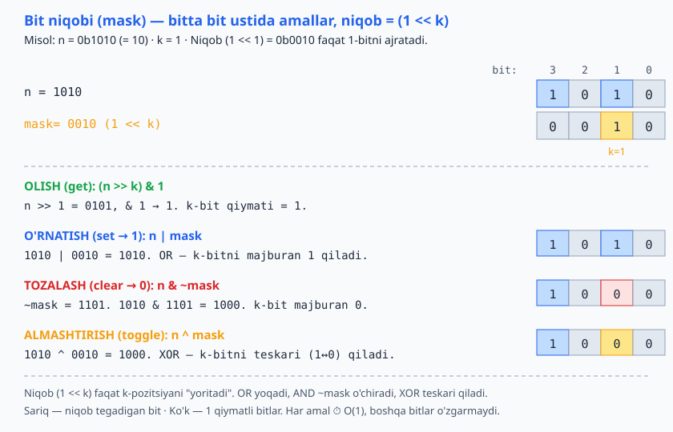

<a id="b17"></a>
# 17-bo'lim: Bit operatsiyalari

<sub>[↑ Mundarijaga qaytish](README.md#mundarija)</sub>

> 🔢 Bit darajasidagi amallar — tez (O(1)) va xotira-tejamkor. Tillar farqi: **JS** bit amallari 32-bitli **ishorali** butun songa aylantiriladi (kattaroq sonlar uchun `BigInt`), **PHP** ints — 64-bit, **Python** ints — cheksiz aniqlikda. Belgilar: `&` (AND), `|` (OR), `^` (XOR), `~` (NOT), `<<`/`>>` (siljish).

<a id="m183"></a>
### 183. Juft/toq — bit bilan
`⏱ O(1)`
Oxirgi bit 0 bo'lsa juft. `n % 2` dan tezroq (garchi zamonaviy kompilyatorlar farqni tekislasa ham).

**JS**
```js
const isEven = n => (n & 1) === 0;
```
**PHP**
```php
function isEven($n) {
    return ($n & 1) === 0;
}
```
**Python**
```python
def is_even(n):
    return n & 1 == 0
```

<a id="m184"></a>
### 184. k-bitni olish (get bit)
`⏱ O(1)` — o'ngdan 0-indeksli; 0 yoki 1 qaytaradi.

**JS**
```js
const getBit = (n, k) => (n >> k) & 1;
```
**PHP**
```php
function getBit($n, $k) {
    return ($n >> $k) & 1;
}
```
**Python**
```python
def get_bit(n, k):
    return (n >> k) & 1
```

<a id="m185"></a>
### 185. k-bitni o'rnatish (set bit → 1)
`⏱ O(1)`

**JS**
```js
const setBit = (n, k) => n | (1 << k);
```
**PHP**
```php
function setBit($n, $k) {
    return $n | (1 << $k);
}
```
**Python**
```python
def set_bit(n, k):
    return n | (1 << k)
```

<a id="m186"></a>
### 186. k-bitni tozalash (clear bit → 0)
`⏱ O(1)`

**JS**
```js
const clearBit = (n, k) => n & ~(1 << k);
```
**PHP**
```php
function clearBit($n, $k) {
    return $n & ~(1 << $k);
}
```
**Python**
```python
def clear_bit(n, k):
    return n & ~(1 << k)
```

<a id="m187"></a>
### 187. k-bitni almashtirish (toggle bit)
`⏱ O(1)`

**JS**
```js
const toggleBit = (n, k) => n ^ (1 << k);
```
**PHP**
```php
function toggleBit($n, $k) {
    return $n ^ (1 << $k);
}
```
**Python**
```python
def toggle_bit(n, k):
    return n ^ (1 << k)
```

Yuqoridagi to'rt amal bitta umumiy g'oyaga asoslanadi — niqob `(1 << k)` faqat k-bitni ajratadi, so'ng OR/AND/XOR uni boshqaradi:



<a id="m188"></a>
### 188. 2 ning darajasimi (power of two)
`⏱ O(1)`
2 ning darajasi ikkilik shaklda faqat bitta 1 bit (mas. 1000); n−1 esa pastki barcha bitlarni 1 qiladi (0111) → AND = 0.

**JS**
```js
const isPowerOfTwo = n => n > 0 && (n & (n - 1)) === 0;
```
**PHP**
```php
function isPowerOfTwo($n) {
    return $n > 0 && ($n & ($n - 1)) === 0;
}
```
**Python**
```python
def is_power_of_two(n):
    return n > 0 and (n & (n - 1)) == 0
```

<a id="m189"></a>
### 189. O'rnatilgan bitlar soni (Brian Kernighan)
`⏱ O(o'rnatilgan bitlar soni) · 💾 O(1)`
`n &= n − 1` har safar eng past 1 bitni o'chiradi — sikl 32 emas, bitlar soniga teng aylanadi. Pythonda `bin(n).count("1")` ham bor.

**JS**
```js
const countBits = n => {
  let count = 0;
  while (n) { n &= n - 1; count++; }
  return count;
};
```
**PHP**
```php
function countBits($n) {
    $count = 0;
    while ($n) { $n &= $n - 1; $count++; }
    return $count;
}
```
**Python**
```python
def count_bits(n):
    count = 0
    while n:
        n &= n - 1
        count += 1
    return count
```

<a id="m190"></a>
### 190. Eng past o'rnatilgan bitni ajratish (n & −n)
`⏱ O(1)`
Ikkitalik to'ldiruvchi (two's complement) tufayli −n eng past 1 bitdan boshqa hammasini teskari qiladi; AND faqat o'sha bitni qoldiradi (12 = 1100 → 4 = 0100). Fenwick tree (BIT) da ishlatiladi.

**JS**
```js
const lowestBit = n => n & -n;
```
**PHP**
```php
function lowestBit($n) {
    return $n & -$n;
}
```
**Python**
```python
def lowest_bit(n):
    return n & -n
```

<a id="m191"></a>
### 191. XOR bilan swap (temp'siz)
`⏱ O(1)`
`a ^ b ^ b = a` xossasiga asoslangan. Amaliyotda o'qilishi uchun oddiy almashtirish (`a, b = b, a`) afzal — bu shunchaki bit mantiqiga misol.

**JS**
```js
a ^= b;
b ^= a;
a ^= b;
```
**PHP**
```php
$a ^= $b;
$b ^= $a;
$a ^= $b;
```
**Python**
```python
a ^= b
b ^= a
a ^= b
```

<a id="m192"></a>
### 192. Yagona sonni topish (single number)
`⏱ O(n) · 💾 O(1)`
Hamma element ikki marta, faqat bittasi bir marta. `x^x=0`, `x^0=x` — juftlar o'zaro yo'qoladi, yagona qoladi.

**JS**
```js
const singleNumber = nums => nums.reduce((acc, x) => acc ^ x, 0);
```
**PHP**
```php
function singleNumber($nums) {
    $acc = 0;
    foreach ($nums as $x) $acc ^= $x;
    return $acc;
}
```
**Python**
```python
from functools import reduce
import operator

def single_number(nums):
    return reduce(operator.xor, nums, 0)
```

<a id="m193"></a>
### 193. Bitlarni teskari ag'darish (32-bit)
`⏱ O(1)` (32 iteratsiya)
JS'da `>>>` ishorasiz siljish, `>>> 0` esa natijani ishorasiz 32-bit qiladi (JS bit amallari 32-bit ishorali bilan ishlaydi). PHP/Python butun sonlari kengroq.

**JS**
```js
const reverseBits = n => {
  let result = 0;
  for (let i = 0; i < 32; i++) {
    result = (result << 1) | (n & 1);
    n >>>= 1;
  }
  return result >>> 0;
};
```
**PHP**
```php
function reverseBits($n) {
    $result = 0;
    for ($i = 0; $i < 32; $i++) {
        $result = ($result << 1) | ($n & 1);
        $n >>= 1;
    }
    return $result;
}
```
**Python**
```python
def reverse_bits(n):
    result = 0
    for _ in range(32):
        result = (result << 1) | (n & 1)
        n >>= 1
    return result
```

---
