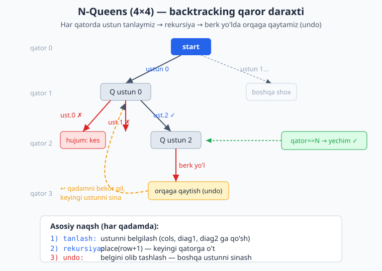

<a id="b21"></a>
# 21-bo'lim: Backtracking

<sub>[↑ Mundarijaga qaytish](README.md#mundarija)</sub>

> 🔁 Backtracking — yechimni qadam-baqadam quramiz, agar yo'l boshi berk bo'lsa orqaga qaytamiz (undo). Asosiy naqsh: tanlash → rekursiya → tanlovni bekor qilish. Ko'p masalada vaqt eksponensial, lekin pruning (kesish) bilan amalda tezlashadi.

<a id="m217"></a>
### 217. N-Queens — yechimlar soni (N-Queens count)
N×N taxtada bir-birini urmaydigan N ta vazir joylash usullari soni.
`⏱ O(N!) · 💾 O(N)`

**JS**
```js
const totalNQueens = n => {
  let count = 0;
  const cols = new Set(), diag1 = new Set(), diag2 = new Set();
  const place = row => {
    if (row === n) { count++; return; }
    for (let c = 0; c < n; c++) {
      if (cols.has(c) || diag1.has(row - c) || diag2.has(row + c)) continue;
      cols.add(c); diag1.add(row - c); diag2.add(row + c);
      place(row + 1);
      cols.delete(c); diag1.delete(row - c); diag2.delete(row + c);
    }
  };
  place(0);
  return count;
};
```
**PHP**
```php
function totalNQueens(int $n): int {
    $count = 0;
    $cols = []; $d1 = []; $d2 = [];
    $place = function ($row) use (&$place, &$count, &$cols, &$d1, &$d2, $n) {
        if ($row === $n) { $count++; return; }
        for ($c = 0; $c < $n; $c++) {
            if (isset($cols[$c]) || isset($d1[$row - $c]) || isset($d2[$row + $c])) continue;
            $cols[$c] = $d1[$row - $c] = $d2[$row + $c] = true;
            $place($row + 1);
            unset($cols[$c], $d1[$row - $c], $d2[$row + $c]);
        }
    };
    $place(0);
    return $count;
}
```
**Python**
```python
def total_n_queens(n):
    cols, d1, d2 = set(), set(), set()
    def place(row):
        if row == n:
            return 1
        total = 0
        for c in range(n):
            if c in cols or row - c in d1 or row + c in d2:
                continue
            cols.add(c); d1.add(row - c); d2.add(row + c)
            total += place(row + 1)
            cols.discard(c); d1.discard(row - c); d2.discard(row + c)
        return total
    return place(0)
```

<a id="m218"></a>
### 218. N-Queens — bitta yechim (N-Queens one solution)
Bitta amaldagi joylashuvni taxta ko'rinishida qaytaramiz.
`⏱ O(N!) · 💾 O(N²)`

**JS**
```js
const solveNQueens = n => {
  const pos = Array(n).fill(-1);
  const cols = new Set(), d1 = new Set(), d2 = new Set();
  const build = () => pos.map(c => ".".repeat(c) + "Q" + ".".repeat(n - c - 1));
  const place = row => {
    if (row === n) return true;
    for (let c = 0; c < n; c++) {
      if (cols.has(c) || d1.has(row - c) || d2.has(row + c)) continue;
      cols.add(c); d1.add(row - c); d2.add(row + c); pos[row] = c;
      if (place(row + 1)) return true;
      cols.delete(c); d1.delete(row - c); d2.delete(row + c);
    }
    return false;
  };
  return place(0) ? build() : null;
};
```
**Python**
```python
def solve_n_queens(n):
    pos = [-1] * n
    cols, d1, d2 = set(), set(), set()
    def place(row):
        if row == n:
            return True
        for c in range(n):
            if c in cols or row - c in d1 or row + c in d2:
                continue
            cols.add(c); d1.add(row - c); d2.add(row + c); pos[row] = c
            if place(row + 1):
                return True
            cols.discard(c); d1.discard(row - c); d2.discard(row + c)
        return False
    if not place(0):
        return None
    return ["." * c + "Q" + "." * (n - c - 1) for c in pos]
```

Quyidagi diagramma backtracking g'oyasini — tanlash, rekursiya va berk yo'lda orqaga qaytishni (undo) — N-Queens qaror daraxti misolida ko'rsatadi.



<a id="m219"></a>
### 219. Sudoku yechuvchi (Sudoku solver)
9×9 taxtadagi bo'sh kataklarni ('.') backtracking bilan to'ldiramiz.
`⏱ O(9^(bo'sh kataklar)) · 💾 O(1)`

**JS**
```js
const solveSudoku = board => {
  const valid = (r, c, v) => {
    for (let i = 0; i < 9; i++) {
      if (board[r][i] === v || board[i][c] === v) return false;
      const br = 3 * ((r / 3) | 0) + ((i / 3) | 0);
      const bc = 3 * ((c / 3) | 0) + (i % 3);
      if (board[br][bc] === v) return false;
    }
    return true;
  };
  const fill = () => {
    for (let r = 0; r < 9; r++)
      for (let c = 0; c < 9; c++)
        if (board[r][c] === ".") {
          for (let d = 1; d <= 9; d++) {
            const v = String(d);
            if (valid(r, c, v)) {
              board[r][c] = v;
              if (fill()) return true;
              board[r][c] = ".";
            }
          }
          return false;
        }
    return true;
  };
  fill();
  return board;
};
```
**Python**
```python
def solve_sudoku(board):
    def valid(r, c, v):
        for i in range(9):
            if board[r][i] == v or board[i][c] == v:
                return False
            if board[3 * (r // 3) + i // 3][3 * (c // 3) + i % 3] == v:
                return False
        return True
    def fill():
        for r in range(9):
            for c in range(9):
                if board[r][c] == ".":
                    for d in "123456789":
                        if valid(r, c, d):
                            board[r][c] = d
                            if fill():
                                return True
                            board[r][c] = "."
                    return False
        return True
    fill()
    return board
```

<a id="m220"></a>
### 220. Sudoku validatsiya (valid Sudoku)
To'ldirilgan/qisman taxta qoidaga mos ('.' — bo'sh) ekanligini tekshiramiz.
`⏱ O(81) · 💾 O(81)`

**JS**
```js
const isValidSudoku = board => {
  const seen = new Set();
  for (let r = 0; r < 9; r++)
    for (let c = 0; c < 9; c++) {
      const v = board[r][c];
      if (v === ".") continue;
      const box = `b${(r / 3) | 0}-${(c / 3) | 0}`;
      if (seen.has(`r${r}-${v}`) || seen.has(`c${c}-${v}`) || seen.has(`${box}-${v}`))
        return false;
      seen.add(`r${r}-${v}`); seen.add(`c${c}-${v}`); seen.add(`${box}-${v}`);
    }
  return true;
};
```
**Python**
```python
def is_valid_sudoku(board):
    seen = set()
    for r in range(9):
        for c in range(9):
            v = board[r][c]
            if v == ".":
                continue
            keys = [("r", r, v), ("c", c, v), ("b", r // 3, c // 3, v)]
            for k in keys:
                if k in seen:
                    return False
                seen.add(k)
    return True
```

<a id="m221"></a>
### 221. Qavslar generatsiyasi (generate parentheses)
n juft qavsdan tuzilgan barcha to'g'ri qavs ketma-ketliklari.
`⏱ O(4^n / √n) · 💾 O(n)`

**JS**
```js
const generateParenthesis = n => {
  const res = [];
  const build = (s, open, close) => {
    if (s.length === 2 * n) { res.push(s); return; }
    if (open < n) build(s + "(", open + 1, close);
    if (close < open) build(s + ")", open, close + 1);
  };
  build("", 0, 0);
  return res;
};
```
**PHP**
```php
function generateParenthesis(int $n): array {
    $res = [];
    $build = function ($s, $open, $close) use (&$build, &$res, $n) {
        if (strlen($s) === 2 * $n) { $res[] = $s; return; }
        if ($open < $n) $build($s . "(", $open + 1, $close);
        if ($close < $open) $build($s . ")", $open, $close + 1);
    };
    $build("", 0, 0);
    return $res;
}
```
**Python**
```python
def generate_parenthesis(n):
    res = []
    def build(s, open_, close):
        if len(s) == 2 * n:
            res.append(s)
            return
        if open_ < n:
            build(s + "(", open_ + 1, close)
        if close < open_:
            build(s + ")", open_, close + 1)
    build("", 0, 0)
    return res
```

<a id="m222"></a>
### 222. Barcha kichik to'plamlar (subsets)
Takrorsiz massivning barcha qism to'plamlari (power set).
`⏱ O(n · 2ⁿ) · 💾 O(n)`

**JS**
```js
const subsets = nums => {
  const res = [];
  const dfs = (start, cur) => {
    res.push([...cur]);
    for (let i = start; i < nums.length; i++) {
      cur.push(nums[i]);
      dfs(i + 1, cur);
      cur.pop();
    }
  };
  dfs(0, []);
  return res;
};
```
**PHP**
```php
function subsets(array $nums): array {
    $res = [];
    $dfs = function ($start, $cur) use (&$dfs, &$res, $nums) {
        $res[] = $cur;
        for ($i = $start; $i < count($nums); $i++) {
            $cur[] = $nums[$i];
            $dfs($i + 1, $cur);
            array_pop($cur);
        }
    };
    $dfs(0, []);
    return $res;
}
```
**Python**
```python
def subsets(nums):
    res = []
    def dfs(start, cur):
        res.append(cur[:])
        for i in range(start, len(nums)):
            cur.append(nums[i])
            dfs(i + 1, cur)
            cur.pop()
    dfs(0, [])
    return res
```

<a id="m223"></a>
### 223. Kichik to'plamlar takror bilan (subsets II)
Massivda takror elementlar bor; takroriy qism to'plamlarni chiqarib tashlaymiz.
`⏱ O(n · 2ⁿ) · 💾 O(n)`

**JS**
```js
const subsetsWithDup = nums => {
  nums.sort((a, b) => a - b);
  const res = [];
  const dfs = (start, cur) => {
    res.push([...cur]);
    for (let i = start; i < nums.length; i++) {
      if (i > start && nums[i] === nums[i - 1]) continue;
      cur.push(nums[i]);
      dfs(i + 1, cur);
      cur.pop();
    }
  };
  dfs(0, []);
  return res;
};
```
**Python**
```python
def subsets_with_dup(nums):
    nums.sort()
    res = []
    def dfs(start, cur):
        res.append(cur[:])
        for i in range(start, len(nums)):
            if i > start and nums[i] == nums[i - 1]:
                continue
            cur.append(nums[i])
            dfs(i + 1, cur)
            cur.pop()
    dfs(0, [])
    return res
```

<a id="m224"></a>
### 224. Permutatsiyalar (permutations)
Takrorsiz massivning barcha o'rin almashtirishlari.
`⏱ O(n · n!) · 💾 O(n)`

**JS**
```js
const permute = nums => {
  const res = [];
  const used = Array(nums.length).fill(false);
  const dfs = cur => {
    if (cur.length === nums.length) { res.push([...cur]); return; }
    for (let i = 0; i < nums.length; i++) {
      if (used[i]) continue;
      used[i] = true; cur.push(nums[i]);
      dfs(cur);
      cur.pop(); used[i] = false;
    }
  };
  dfs([]);
  return res;
};
```
**PHP**
```php
function permute(array $nums): array {
    $res = [];
    $used = array_fill(0, count($nums), false);
    $dfs = function ($cur) use (&$dfs, &$res, &$used, $nums) {
        if (count($cur) === count($nums)) { $res[] = $cur; return; }
        for ($i = 0; $i < count($nums); $i++) {
            if ($used[$i]) continue;
            $used[$i] = true; $cur[] = $nums[$i];
            $dfs($cur);
            array_pop($cur); $used[$i] = false;
        }
    };
    $dfs([]);
    return $res;
}
```
**Python**
```python
def permute(nums):
    res = []
    used = [False] * len(nums)
    cur = []
    def dfs():
        if len(cur) == len(nums):
            res.append(cur[:])
            return
        for i in range(len(nums)):
            if used[i]:
                continue
            used[i] = True; cur.append(nums[i])
            dfs()
            cur.pop(); used[i] = False
    dfs()
    return res
```

<a id="m225"></a>
### 225. Permutatsiyalar takror bilan (permutations II)
Takror elementli massiv uchun yagona permutatsiyalar.
`⏱ O(n · n!) · 💾 O(n)`

**JS**
```js
const permuteUnique = nums => {
  nums.sort((a, b) => a - b);
  const res = [];
  const used = Array(nums.length).fill(false);
  const dfs = cur => {
    if (cur.length === nums.length) { res.push([...cur]); return; }
    for (let i = 0; i < nums.length; i++) {
      if (used[i]) continue;
      if (i > 0 && nums[i] === nums[i - 1] && !used[i - 1]) continue;
      used[i] = true; cur.push(nums[i]);
      dfs(cur);
      cur.pop(); used[i] = false;
    }
  };
  dfs([]);
  return res;
};
```
**Python**
```python
def permute_unique(nums):
    nums.sort()
    res = []
    used = [False] * len(nums)
    cur = []
    def dfs():
        if len(cur) == len(nums):
            res.append(cur[:])
            return
        for i in range(len(nums)):
            if used[i]:
                continue
            if i > 0 and nums[i] == nums[i - 1] and not used[i - 1]:
                continue
            used[i] = True; cur.append(nums[i])
            dfs()
            cur.pop(); used[i] = False
    dfs()
    return res
```

<a id="m226"></a>
### 226. Kombinatsiyalar — nCk (combinations)
1..n dan k ta elementli barcha kombinatsiyalar.
`⏱ O(k · C(n,k)) · 💾 O(k)`

**JS**
```js
const combine = (n, k) => {
  const res = [];
  const dfs = (start, cur) => {
    if (cur.length === k) { res.push([...cur]); return; }
    for (let i = start; i <= n; i++) {
      cur.push(i);
      dfs(i + 1, cur);
      cur.pop();
    }
  };
  dfs(1, []);
  return res;
};
```
**Python**
```python
def combine(n, k):
    res = []
    def dfs(start, cur):
        if len(cur) == k:
            res.append(cur[:])
            return
        for i in range(start, n + 1):
            cur.append(i)
            dfs(i + 1, cur)
            cur.pop()
    dfs(1, [])
    return res
```

<a id="m227"></a>
### 227. Combination Sum
Har elementni cheksiz marta ishlatib target yig'indini beruvchi kombinatsiyalar.
`⏱ O(n^(target/min)) · 💾 O(target/min)`

**JS**
```js
const combinationSum = (candidates, target) => {
  const res = [];
  const dfs = (start, remain, cur) => {
    if (remain === 0) { res.push([...cur]); return; }
    for (let i = start; i < candidates.length; i++) {
      if (candidates[i] > remain) continue;
      cur.push(candidates[i]);
      dfs(i, remain - candidates[i], cur);
      cur.pop();
    }
  };
  dfs(0, target, []);
  return res;
};
```
**PHP**
```php
function combinationSum(array $candidates, int $target): array {
    $res = [];
    $dfs = function ($start, $remain, $cur) use (&$dfs, &$res, $candidates) {
        if ($remain === 0) { $res[] = $cur; return; }
        for ($i = $start; $i < count($candidates); $i++) {
            if ($candidates[$i] > $remain) continue;
            $cur[] = $candidates[$i];
            $dfs($i, $remain - $candidates[$i], $cur);
            array_pop($cur);
        }
    };
    $dfs(0, $target, []);
    return $res;
}
```
**Python**
```python
def combination_sum(candidates, target):
    res = []
    def dfs(start, remain, cur):
        if remain == 0:
            res.append(cur[:])
            return
        for i in range(start, len(candidates)):
            if candidates[i] > remain:
                continue
            cur.append(candidates[i])
            dfs(i, remain - candidates[i], cur)
            cur.pop()
    dfs(0, target, [])
    return res
```

<a id="m228"></a>
### 228. Combination Sum II
Har element bir marta; massivda takror bo'lishi mumkin, yechimlar yagona.
`⏱ O(2ⁿ) · 💾 O(n)`

**JS**
```js
const combinationSum2 = (candidates, target) => {
  candidates.sort((a, b) => a - b);
  const res = [];
  const dfs = (start, remain, cur) => {
    if (remain === 0) { res.push([...cur]); return; }
    for (let i = start; i < candidates.length; i++) {
      if (i > start && candidates[i] === candidates[i - 1]) continue;
      if (candidates[i] > remain) break;
      cur.push(candidates[i]);
      dfs(i + 1, remain - candidates[i], cur);
      cur.pop();
    }
  };
  dfs(0, target, []);
  return res;
};
```
**Python**
```python
def combination_sum2(candidates, target):
    candidates.sort()
    res = []
    def dfs(start, remain, cur):
        if remain == 0:
            res.append(cur[:])
            return
        for i in range(start, len(candidates)):
            if i > start and candidates[i] == candidates[i - 1]:
                continue
            if candidates[i] > remain:
                break
            cur.append(candidates[i])
            dfs(i + 1, remain - candidates[i], cur)
            cur.pop()
    dfs(0, target, [])
    return res
```

<a id="m229"></a>
### 229. Combination Sum III
1..9 dan aynan k ta turli raqam bilan n yig'indini hosil qilish.
`⏱ O(C(9,k)) · 💾 O(k)`

**JS**
```js
const combinationSum3 = (k, n) => {
  const res = [];
  const dfs = (start, remain, cur) => {
    if (cur.length === k) {
      if (remain === 0) res.push([...cur]);
      return;
    }
    for (let i = start; i <= 9; i++) {
      if (i > remain) break;
      cur.push(i);
      dfs(i + 1, remain - i, cur);
      cur.pop();
    }
  };
  dfs(1, n, []);
  return res;
};
```
**Python**
```python
def combination_sum3(k, n):
    res = []
    def dfs(start, remain, cur):
        if len(cur) == k:
            if remain == 0:
                res.append(cur[:])
            return
        for i in range(start, 10):
            if i > remain:
                break
            cur.append(i)
            dfs(i + 1, remain - i, cur)
            cur.pop()
    dfs(1, n, [])
    return res
```

<a id="m230"></a>
### 230. Telefon raqami harf kombinatsiyalari (letter combinations)
Telefon klaviaturasidagi raqamlarga mos harf kombinatsiyalari.
`⏱ O(4ⁿ · n) · 💾 O(n)`

**JS**
```js
const letterCombinations = digits => {
  if (!digits) return [];
  const map = { 2: "abc", 3: "def", 4: "ghi", 5: "jkl",
                6: "mno", 7: "pqrs", 8: "tuv", 9: "wxyz" };
  const res = [];
  const dfs = (i, cur) => {
    if (i === digits.length) { res.push(cur); return; }
    for (const ch of map[digits[i]]) dfs(i + 1, cur + ch);
  };
  dfs(0, "");
  return res;
};
```
**PHP**
```php
function letterCombinations(string $digits): array {
    if ($digits === "") return [];
    $map = [2 => "abc", 3 => "def", 4 => "ghi", 5 => "jkl",
            6 => "mno", 7 => "pqrs", 8 => "tuv", 9 => "wxyz"];
    $res = [];
    $dfs = function ($i, $cur) use (&$dfs, &$res, $map, $digits) {
        if ($i === strlen($digits)) { $res[] = $cur; return; }
        foreach (str_split($map[(int)$digits[$i]]) as $ch)
            $dfs($i + 1, $cur . $ch);
    };
    $dfs(0, "");
    return $res;
}
```
**Python**
```python
def letter_combinations(digits):
    if not digits:
        return []
    mapping = {"2": "abc", "3": "def", "4": "ghi", "5": "jkl",
               "6": "mno", "7": "pqrs", "8": "tuv", "9": "wxyz"}
    res = []
    def dfs(i, cur):
        if i == len(digits):
            res.append(cur)
            return
        for ch in mapping[digits[i]]:
            dfs(i + 1, cur + ch)
    dfs(0, "")
    return res
```

<a id="m231"></a>
### 231. Palindromga bo'lish (palindrome partitioning)
Satrni har bir bo'lak palindrom bo'ladigan barcha usullar bilan bo'lish.
`⏱ O(n · 2ⁿ) · 💾 O(n)`

**JS**
```js
const partitionPalindrome = s => {
  const res = [];
  const isPal = (l, r) => {
    while (l < r) if (s[l++] !== s[r--]) return false;
    return true;
  };
  const dfs = (start, cur) => {
    if (start === s.length) { res.push([...cur]); return; }
    for (let end = start; end < s.length; end++) {
      if (!isPal(start, end)) continue;
      cur.push(s.slice(start, end + 1));
      dfs(end + 1, cur);
      cur.pop();
    }
  };
  dfs(0, []);
  return res;
};
```
**Python**
```python
def partition_palindrome(s):
    res = []
    def dfs(start, cur):
        if start == len(s):
            res.append(cur[:])
            return
        for end in range(start, len(s)):
            piece = s[start:end + 1]
            if piece == piece[::-1]:
                cur.append(piece)
                dfs(end + 1, cur)
                cur.pop()
    dfs(0, [])
    return res
```

<a id="m232"></a>
### 232. So'z qidirish gridda (word search)
Grid kataklarida qo'shni harflardan so'zni topish (har katak bir marta).
`⏱ O(m·n·4^L) · 💾 O(L)`

**JS**
```js
const wordSearch = (board, word) => {
  const m = board.length, n = board[0].length;
  const dfs = (r, c, i) => {
    if (i === word.length) return true;
    if (r < 0 || c < 0 || r >= m || c >= n || board[r][c] !== word[i]) return false;
    const tmp = board[r][c];
    board[r][c] = "#";
    const found = dfs(r + 1, c, i + 1) || dfs(r - 1, c, i + 1) ||
                  dfs(r, c + 1, i + 1) || dfs(r, c - 1, i + 1);
    board[r][c] = tmp;
    return found;
  };
  for (let r = 0; r < m; r++)
    for (let c = 0; c < n; c++)
      if (dfs(r, c, 0)) return true;
  return false;
};
```
**Python**
```python
def word_search(board, word):
    m, n = len(board), len(board[0])
    def dfs(r, c, i):
        if i == len(word):
            return True
        if r < 0 or c < 0 or r >= m or c >= n or board[r][c] != word[i]:
            return False
        tmp = board[r][c]
        board[r][c] = "#"
        found = (dfs(r + 1, c, i + 1) or dfs(r - 1, c, i + 1) or
                 dfs(r, c + 1, i + 1) or dfs(r, c - 1, i + 1))
        board[r][c] = tmp
        return found
    return any(dfs(r, c, 0) for r in range(m) for c in range(n))
```

<a id="m233"></a>
### 233. Sichqon labirintda (rat in a maze)
0/1 gridda yuqori-chap burchakdan pastki-o'ngga yo'lni topamiz (1 — yurish mumkin).
`⏱ O(2^(m·n)) · 💾 O(m·n)`

**JS**
```js
const ratInMaze = grid => {
  const m = grid.length, n = grid[0].length;
  const path = Array.from({ length: m }, () => Array(n).fill(0));
  const dfs = (r, c) => {
    if (r < 0 || c < 0 || r >= m || c >= n || grid[r][c] === 0 || path[r][c] === 1)
      return false;
    path[r][c] = 1;
    if (r === m - 1 && c === n - 1) return true;
    if (dfs(r + 1, c) || dfs(r, c + 1) || dfs(r - 1, c) || dfs(r, c - 1))
      return true;
    path[r][c] = 0;
    return false;
  };
  return dfs(0, 0) ? path : null;
};
```
**Python**
```python
def rat_in_maze(grid):
    m, n = len(grid), len(grid[0])
    path = [[0] * n for _ in range(m)]
    def dfs(r, c):
        if r < 0 or c < 0 or r >= m or c >= n or grid[r][c] == 0 or path[r][c] == 1:
            return False
        path[r][c] = 1
        if r == m - 1 and c == n - 1:
            return True
        if dfs(r + 1, c) or dfs(r, c + 1) or dfs(r - 1, c) or dfs(r, c - 1):
            return True
        path[r][c] = 0
        return False
    return path if dfs(0, 0) else None
```

<a id="m234"></a>
### 234. Ot yurishi (knight's tour)
N×N taxtada ot har katakni aynan bir marta bosib o'tadigan yo'l.
`⏱ O(8^(N²)) · 💾 O(N²)`

**JS**
```js
const knightTour = n => {
  const board = Array.from({ length: n }, () => Array(n).fill(-1));
  const moves = [[2,1],[1,2],[-1,2],[-2,1],[-2,-1],[-1,-2],[1,-2],[2,-1]];
  const dfs = (r, c, step) => {
    board[r][c] = step;
    if (step === n * n - 1) return true;
    for (const [dr, dc] of moves) {
      const nr = r + dr, nc = c + dc;
      if (nr >= 0 && nc >= 0 && nr < n && nc < n && board[nr][nc] === -1)
        if (dfs(nr, nc, step + 1)) return true;
    }
    board[r][c] = -1;
    return false;
  };
  return dfs(0, 0, 0) ? board : null;
};
```
**Python**
```python
def knight_tour(n):
    board = [[-1] * n for _ in range(n)]
    moves = [(2, 1), (1, 2), (-1, 2), (-2, 1), (-2, -1), (-1, -2), (1, -2), (2, -1)]
    def dfs(r, c, step):
        board[r][c] = step
        if step == n * n - 1:
            return True
        for dr, dc in moves:
            nr, nc = r + dr, c + dc
            if 0 <= nr < n and 0 <= nc < n and board[nr][nc] == -1:
                if dfs(nr, nc, step + 1):
                    return True
        board[r][c] = -1
        return False
    return board if dfs(0, 0, 0) else None
```

<a id="m235"></a>
### 235. Graf bo'yash — m ranglar (m-coloring)
Grafni m rang bilan qo'shni tugunlar farqli bo'ladigan tarzda bo'yash mumkinmi.
`⏱ O(mⁿ) · 💾 O(n)`

**JS**
```js
const graphColoring = (adj, m) => {
  const n = adj.length;
  const color = Array(n).fill(0);
  const safe = (v, c) => adj[v].every(u => color[u] !== c);
  const dfs = v => {
    if (v === n) return true;
    for (let c = 1; c <= m; c++) {
      if (safe(v, c)) {
        color[v] = c;
        if (dfs(v + 1)) return true;
        color[v] = 0;
      }
    }
    return false;
  };
  return dfs(0) ? color : null;
};
```
**Python**
```python
def graph_coloring(adj, m):
    n = len(adj)
    color = [0] * n
    def safe(v, c):
        return all(color[u] != c for u in adj[v])
    def dfs(v):
        if v == n:
            return True
        for c in range(1, m + 1):
            if safe(v, c):
                color[v] = c
                if dfs(v + 1):
                    return True
                color[v] = 0
        return False
    return color if dfs(0) else None
```

<a id="m236"></a>
### 236. Hamilton yo'li (Hamiltonian path)
Grafda har tugunni aynan bir marta o'tadigan yo'l mavjudmi.
`⏱ O(n!) · 💾 O(n)`

**JS**
```js
const hamiltonianPath = adj => {
  const n = adj.length;
  const path = [], visited = Array(n).fill(false);
  const dfs = v => {
    visited[v] = true; path.push(v);
    if (path.length === n) return true;
    for (const u of adj[v])
      if (!visited[u] && dfs(u)) return true;
    visited[v] = false; path.pop();
    return false;
  };
  for (let s = 0; s < n; s++) {
    if (dfs(s)) return [...path];
    path.length = 0; visited.fill(false);
  }
  return null;
};
```
**Python**
```python
def hamiltonian_path(adj):
    n = len(adj)
    path, visited = [], [False] * n
    def dfs(v):
        visited[v] = True
        path.append(v)
        if len(path) == n:
            return True
        for u in adj[v]:
            if not visited[u] and dfs(u):
                return True
        visited[v] = False
        path.pop()
        return False
    for s in range(n):
        if dfs(s):
            return path[:]
        path.clear()
        visited = [False] * n
    return None
```

<a id="m237"></a>
### 237. IP manzillarni tiklash (restore IP addresses)
Faqat raqamlardan iborat satrdan barcha to'g'ri IPv4 manzillar.
`⏱ O(1) (≤3⁴ variant) · 💾 O(1)`

**JS**
```js
const restoreIpAddresses = s => {
  const res = [];
  const valid = seg => seg.length === 1 || (seg[0] !== "0" && +seg <= 255);
  const dfs = (start, parts) => {
    if (parts.length === 4) {
      if (start === s.length) res.push(parts.join("."));
      return;
    }
    for (let len = 1; len <= 3 && start + len <= s.length; len++) {
      const seg = s.slice(start, start + len);
      if (valid(seg)) dfs(start + len, [...parts, seg]);
    }
  };
  dfs(0, []);
  return res;
};
```
**Python**
```python
def restore_ip_addresses(s):
    res = []
    def valid(seg):
        return len(seg) == 1 or (seg[0] != "0" and int(seg) <= 255)
    def dfs(start, parts):
        if len(parts) == 4:
            if start == len(s):
                res.append(".".join(parts))
            return
        for length in range(1, 4):
            if start + length > len(s):
                break
            seg = s[start:start + length]
            if valid(seg):
                dfs(start + length, parts + [seg])
    dfs(0, [])
    return res
```

<a id="m238"></a>
### 238. Gray kod (Gray code)
n bitli Gray kod ketma-ketligi: qo'shni sonlar bitta bit bilan farq qiladi.
`⏱ O(2ⁿ) · 💾 O(2ⁿ)`

**JS**
```js
const grayCode = n => {
  const res = [0];
  for (let i = 0; i < n; i++) {
    const len = res.length;
    for (let j = len - 1; j >= 0; j--)
      res.push(res[j] | (1 << i));
  }
  return res;
};
```
**Python**
```python
def gray_code(n):
    res = [0]
    for i in range(n):
        res += [x | (1 << i) for x in reversed(res)]
    return res
```

<a id="m239"></a>
### 239. Chiroyli joylashuv (beautiful arrangement)
1..n permutatsiyalardan: har i pozitsiyada qiymat i ga yoki i qiymatga bo'linadi.
`⏱ O(k) (k — amaldagi joylashuvlar) · 💾 O(n)`

**JS**
```js
const countArrangement = n => {
  const used = Array(n + 1).fill(false);
  const dfs = pos => {
    if (pos > n) return 1;
    let count = 0;
    for (let v = 1; v <= n; v++) {
      if (!used[v] && (v % pos === 0 || pos % v === 0)) {
        used[v] = true;
        count += dfs(pos + 1);
        used[v] = false;
      }
    }
    return count;
  };
  return dfs(1);
};
```
**Python**
```python
def count_arrangement(n):
    used = [False] * (n + 1)
    def dfs(pos):
        if pos > n:
            return 1
        count = 0
        for v in range(1, n + 1):
            if not used[v] and (v % pos == 0 or pos % v == 0):
                used[v] = True
                count += dfs(pos + 1)
                used[v] = False
        return count
    return dfs(1)
```

<a id="m240"></a>
### 240. k teng yig'indili qismlarga bo'lish (partition to k equal sum subsets)
Massivni yig'indilari teng bo'lgan k ta qismga ajratish mumkinmi.
`⏱ O(k · 2ⁿ) · 💾 O(n)`

**JS**
```js
const canPartitionKSubsets = (nums, k) => {
  const total = nums.reduce((a, b) => a + b, 0);
  if (total % k !== 0) return false;
  const target = total / k;
  nums.sort((a, b) => b - a);
  if (nums[0] > target) return false;
  const used = Array(nums.length).fill(false);
  const dfs = (groups, start, sum) => {
    if (groups === 0) return true;
    if (sum === target) return dfs(groups - 1, 0, 0);
    for (let i = start; i < nums.length; i++) {
      if (used[i] || sum + nums[i] > target) continue;
      used[i] = true;
      if (dfs(groups, i + 1, sum + nums[i])) return true;
      used[i] = false;
    }
    return false;
  };
  return dfs(k, 0, 0);
};
```
**Python**
```python
def can_partition_k_subsets(nums, k):
    total = sum(nums)
    if total % k != 0:
        return False
    target = total // k
    nums.sort(reverse=True)
    if nums[0] > target:
        return False
    used = [False] * len(nums)
    def dfs(groups, start, s):
        if groups == 0:
            return True
        if s == target:
            return dfs(groups - 1, 0, 0)
        for i in range(start, len(nums)):
            if used[i] or s + nums[i] > target:
                continue
            used[i] = True
            if dfs(groups, i + 1, s + nums[i]):
                return True
            used[i] = False
        return False
    return dfs(k, 0, 0)
```

<a id="m241"></a>
### 241. Gugurt cho'plaridan kvadrat (matchsticks to square)
Barcha cho'plardan to'rt teng tomonli kvadrat yasash mumkinmi.
`⏱ O(4ⁿ) · 💾 O(n)`

**JS**
```js
const makesquare = matchsticks => {
  const total = matchsticks.reduce((a, b) => a + b, 0);
  if (total % 4 !== 0) return false;
  const side = total / 4;
  matchsticks.sort((a, b) => b - a);
  if (matchsticks[0] > side) return false;
  const sides = [0, 0, 0, 0];
  const dfs = i => {
    if (i === matchsticks.length) return sides.every(s => s === side);
    for (let j = 0; j < 4; j++) {
      if (sides[j] + matchsticks[i] > side) continue;
      if (j > 0 && sides[j] === sides[j - 1]) continue;
      sides[j] += matchsticks[i];
      if (dfs(i + 1)) return true;
      sides[j] -= matchsticks[i];
    }
    return false;
  };
  return dfs(0);
};
```
**Python**
```python
def makesquare(matchsticks):
    total = sum(matchsticks)
    if total % 4 != 0:
        return False
    side = total // 4
    matchsticks.sort(reverse=True)
    if matchsticks[0] > side:
        return False
    sides = [0, 0, 0, 0]
    def dfs(i):
        if i == len(matchsticks):
            return all(s == side for s in sides)
        for j in range(4):
            if sides[j] + matchsticks[i] > side:
                continue
            if j > 0 and sides[j] == sides[j - 1]:
                continue
            sides[j] += matchsticks[i]
            if dfs(i + 1):
                return True
            sides[j] -= matchsticks[i]
        return False
    return dfs(0)
```

<a id="m242"></a>
### 242. Manba-maqsad barcha yo'llar (all paths source to target)
DAG'da 0 tugundan n-1 tugungacha barcha yo'llar.
`⏱ O(2ⁿ · n) · 💾 O(n)`

**JS**
```js
const allPathsSourceTarget = graph => {
  const n = graph.length, res = [];
  const dfs = (node, path) => {
    if (node === n - 1) { res.push([...path]); return; }
    for (const next of graph[node]) {
      path.push(next);
      dfs(next, path);
      path.pop();
    }
  };
  dfs(0, [0]);
  return res;
};
```
**Python**
```python
def all_paths_source_target(graph):
    n = len(graph)
    res = []
    def dfs(node, path):
        if node == n - 1:
            res.append(path[:])
            return
        for nxt in graph[node]:
            path.append(nxt)
            dfs(nxt, path)
            path.pop()
    dfs(0, [0])
    return res
```

<a id="m243"></a>
### 243. Binar soat (binary watch)
LED soatda yondirilgan n ta chiroq bilan mumkin bo'lgan barcha vaqtlar.
`⏱ O(C(10,n)) · 💾 O(1)`

**JS**
```js
const readBinaryWatch = num => {
  const res = [];
  const bits = x => x.toString(2).split("").filter(b => b === "1").length;
  for (let h = 0; h < 12; h++)
    for (let m = 0; m < 60; m++)
      if (bits(h) + bits(m) === num)
        res.push(`${h}:${m.toString().padStart(2, "0")}`);
  return res;
};
```
**Python**
```python
def read_binary_watch(num):
    res = []
    for h in range(12):
        for m in range(60):
            if bin(h).count("1") + bin(m).count("1") == num:
                res.append(f"{h}:{m:02d}")
    return res
```

<a id="m244"></a>
### 244. Harf registri permutatsiyasi (letter case permutation)
Har harfni katta/kichik qilib barcha variantlarni hosil qilamiz; raqamlar o'zgarmaydi.
`⏱ O(2^h · n) · 💾 O(n)`

**JS**
```js
const letterCasePermutation = s => {
  const res = [];
  const dfs = (i, cur) => {
    if (i === s.length) { res.push(cur); return; }
    const ch = s[i];
    if (/[a-zA-Z]/.test(ch)) {
      dfs(i + 1, cur + ch.toLowerCase());
      dfs(i + 1, cur + ch.toUpperCase());
    } else {
      dfs(i + 1, cur + ch);
    }
  };
  dfs(0, "");
  return res;
};
```
**Python**
```python
def letter_case_permutation(s):
    res = []
    def dfs(i, cur):
        if i == len(s):
            res.append(cur)
            return
        ch = s[i]
        if ch.isalpha():
            dfs(i + 1, cur + ch.lower())
            dfs(i + 1, cur + ch.upper())
        else:
            dfs(i + 1, cur + ch)
    dfs(0, "")
    return res
```

<a id="m245"></a>
### 245. Kombinatsion qulf (combination lock — barcha kodlar)
m ta g'ildirakli, har biri 0..9 bo'lgan qulfning barcha mumkin kodlari.
`⏱ O(10^m · m) · 💾 O(m)`

**JS**
```js
const lockCombinations = m => {
  const res = [];
  const dfs = cur => {
    if (cur.length === m) { res.push(cur); return; }
    for (let d = 0; d <= 9; d++) dfs(cur + d);
  };
  dfs("");
  return res;
};
```
**Python**
```python
def lock_combinations(m):
    res = []
    def dfs(cur):
        if len(cur) == m:
            res.append(cur)
            return
        for d in range(10):
            dfs(cur + str(d))
    dfs("")
    return res
```

<a id="m246"></a>
### 246. Additsiya operatorlarini joylash (add operators)
Raqam satriga +, -, * qo'yib target qiymat beruvchi barcha ifodalar.
`⏱ O(4ⁿ) · 💾 O(n)`

**JS**
```js
const addOperators = (num, target) => {
  const res = [];
  const dfs = (i, expr, val, prev) => {
    if (i === num.length) {
      if (val === target) res.push(expr);
      return;
    }
    for (let j = i; j < num.length; j++) {
      if (j > i && num[i] === "0") break;
      const part = num.slice(i, j + 1);
      const cur = Number(part);
      if (i === 0) {
        dfs(j + 1, part, cur, cur);
      } else {
        dfs(j + 1, expr + "+" + part, val + cur, cur);
        dfs(j + 1, expr + "-" + part, val - cur, -cur);
        dfs(j + 1, expr + "*" + part, val - prev + prev * cur, prev * cur);
      }
    }
  };
  dfs(0, "", 0, 0);
  return res;
};
```
**Python**
```python
def add_operators(num, target):
    res = []
    def dfs(i, expr, val, prev):
        if i == len(num):
            if val == target:
                res.append(expr)
            return
        for j in range(i, len(num)):
            if j > i and num[i] == "0":
                break
            part = num[i:j + 1]
            cur = int(part)
            if i == 0:
                dfs(j + 1, part, cur, cur)
            else:
                dfs(j + 1, expr + "+" + part, val + cur, cur)
                dfs(j + 1, expr + "-" + part, val - cur, -cur)
                dfs(j + 1, expr + "*" + part, val - prev + prev * cur, prev * cur)
    dfs(0, "", 0, 0)
    return res
```

<a id="m247"></a>
### 247. So'zlar buzilishi (word break II)
Satrni lug'atdagi so'zlar yordamida barcha mumkin gaplarga bo'lish.
`⏱ O(2ⁿ · n) · 💾 O(n)`

**JS**
```js
const wordBreak = (s, wordDict) => {
  const words = new Set(wordDict);
  const memo = new Map();
  const dfs = start => {
    if (start === s.length) return [""];
    if (memo.has(start)) return memo.get(start);
    const res = [];
    for (let end = start + 1; end <= s.length; end++) {
      const word = s.slice(start, end);
      if (words.has(word))
        for (const rest of dfs(end))
          res.push(rest ? word + " " + rest : word);
    }
    memo.set(start, res);
    return res;
  };
  return dfs(0);
};
```
**Python**
```python
def word_break(s, word_dict):
    words = set(word_dict)
    memo = {}
    def dfs(start):
        if start == len(s):
            return [""]
        if start in memo:
            return memo[start]
        res = []
        for end in range(start + 1, len(s) + 1):
            word = s[start:end]
            if word in words:
                for rest in dfs(end):
                    res.append(word + (" " + rest if rest else ""))
        memo[start] = res
        return res
    return dfs(0)
```

<a id="m248"></a>
### 248. N juft qavs — yopilish soni (count valid parentheses)
n juft qavsdan tuzilishi mumkin bo'lgan to'g'ri ketma-ketliklar soni (Catalan).
`⏱ O(4^n / √n) · 💾 O(n)`

**JS**
```js
const countParenthesis = n => {
  let count = 0;
  const dfs = (open, close) => {
    if (open === n && close === n) { count++; return; }
    if (open < n) dfs(open + 1, close);
    if (close < open) dfs(open, close + 1);
  };
  dfs(0, 0);
  return count;
};
```
**Python**
```python
def count_parenthesis(n):
    count = 0
    def dfs(open_, close):
        nonlocal count
        if open_ == n and close == n:
            count += 1
            return
        if open_ < n:
            dfs(open_ + 1, close)
        if close < open_:
            dfs(open_, close + 1)
    dfs(0, 0)
    return count
```

<a id="m249"></a>
### 249. Sehrli kvadrat (magic square)
1..n² sonlardan qator/ustun/diagonal yig'indisi teng bo'lgan kvadrat tuzish.
`⏱ O((n²)!) · 💾 O(n²)`

**JS**
```js
const magicSquare = n => {
  const total = (n * (n * n + 1)) / 2;
  const grid = Array.from({ length: n }, () => Array(n).fill(0));
  const used = Array(n * n + 1).fill(false);
  const rowOk = r => grid[r].reduce((a, b) => a + b, 0) === total;
  const colOk = c => grid.reduce((a, row) => a + row[c], 0) === total;
  const dfs = pos => {
    if (pos === n * n) {
      const d1 = grid.reduce((a, _, i) => a + grid[i][i], 0);
      const d2 = grid.reduce((a, _, i) => a + grid[i][n - 1 - i], 0);
      return d1 === total && d2 === total;
    }
    const r = (pos / n) | 0, c = pos % n;
    for (let v = 1; v <= n * n; v++) {
      if (used[v]) continue;
      grid[r][c] = v; used[v] = true;
      if (!(c === n - 1 && !rowOk(r)) && !(r === n - 1 && !colOk(c)))
        if (dfs(pos + 1)) return true;
      used[v] = false; grid[r][c] = 0;
    }
    return false;
  };
  return dfs(0) ? grid : null;
};
```
**Python**
```python
def magic_square(n):
    total = n * (n * n + 1) // 2
    grid = [[0] * n for _ in range(n)]
    used = [False] * (n * n + 1)
    def dfs(pos):
        if pos == n * n:
            d1 = sum(grid[i][i] for i in range(n))
            d2 = sum(grid[i][n - 1 - i] for i in range(n))
            return d1 == total and d2 == total
        r, c = divmod(pos, n)
        for v in range(1, n * n + 1):
            if used[v]:
                continue
            grid[r][c] = v
            used[v] = True
            row_bad = c == n - 1 and sum(grid[r]) != total
            col_bad = r == n - 1 and sum(grid[i][c] for i in range(n)) != total
            if not row_bad and not col_bad and dfs(pos + 1):
                return True
            used[v] = False
            grid[r][c] = 0
        return False
    return grid if dfs(0) else None
```

<a id="m250"></a>
### 250. Target Sum (DFS bilan)
Har songa + yoki - belgisini qo'yib target qiymatga erishish usullari soni.
`⏱ O(2ⁿ) · 💾 O(n)`

**JS**
```js
const findTargetSumWays = (nums, target) => {
  const memo = new Map();
  const dfs = (i, sum) => {
    if (i === nums.length) return sum === target ? 1 : 0;
    const key = i + "#" + sum;
    if (memo.has(key)) return memo.get(key);
    const ways = dfs(i + 1, sum + nums[i]) + dfs(i + 1, sum - nums[i]);
    memo.set(key, ways);
    return ways;
  };
  return dfs(0, 0);
};
```
**Python**
```python
def find_target_sum_ways(nums, target):
    memo = {}
    def dfs(i, s):
        if i == len(nums):
            return 1 if s == target else 0
        if (i, s) in memo:
            return memo[(i, s)]
        ways = dfs(i + 1, s + nums[i]) + dfs(i + 1, s - nums[i])
        memo[(i, s)] = ways
        return ways
    return dfs(0, 0)
```

<a id="m251"></a>
### 251. Tetromino joylash (place a tetromino)
Berilgan shaklni (offsetlar) gridning biror joyiga (bo'sh kataklarga) qo'yish mumkinmi.
`⏱ O(m·n·k) · 💾 O(k)`

**JS**
```js
const placeTetromino = (grid, shape) => {
  const m = grid.length, n = grid[0].length;
  const canPlace = (r, c) =>
    shape.every(([dr, dc]) => {
      const nr = r + dr, nc = c + dc;
      return nr >= 0 && nc >= 0 && nr < m && nc < n && grid[nr][nc] === 0;
    });
  for (let r = 0; r < m; r++)
    for (let c = 0; c < n; c++)
      if (canPlace(r, c)) {
        const cells = shape.map(([dr, dc]) => [r + dr, c + dc]);
        for (const [nr, nc] of cells) grid[nr][nc] = 1;
        return cells;
      }
  return null;
};
```
**Python**
```python
def place_tetromino(grid, shape):
    m, n = len(grid), len(grid[0])
    def can_place(r, c):
        for dr, dc in shape:
            nr, nc = r + dr, c + dc
            if not (0 <= nr < m and 0 <= nc < n) or grid[nr][nc] != 0:
                return False
        return True
    for r in range(m):
        for c in range(n):
            if can_place(r, c):
                cells = [(r + dr, c + dc) for dr, dc in shape]
                for nr, nc in cells:
                    grid[nr][nc] = 1
                return cells
    return None
```

<a id="m252"></a>
### 252. Ifoda operatorlari — qiymatlar to'plami (expression operators values)
Raqamlar orasiga +, -, * qo'yib (chapdan o'ngga, ya'ni ko'paytirish ustunligisiz) hosil bo'lishi mumkin barcha qiymatlar to'plami.
`⏱ O(3ⁿ) · 💾 O(3ⁿ)`

**JS**
```js
const expressionValues = nums => {
  const res = new Set();
  const dfs = (i, val) => {
    if (i === nums.length) { res.add(val); return; }
    dfs(i + 1, val + nums[i]);
    dfs(i + 1, val - nums[i]);
    dfs(i + 1, val * nums[i]);
  };
  dfs(1, nums[0]);
  return [...res].sort((a, b) => a - b);
};
```
**Python**
```python
def expression_values(nums):
    res = set()
    def dfs(i, val):
        if i == len(nums):
            res.add(val)
            return
        dfs(i + 1, val + nums[i])
        dfs(i + 1, val - nums[i])
        dfs(i + 1, val * nums[i])
    dfs(1, nums[0])
    return sorted(res)
```

<a id="m253"></a>
### 253. Teng yig'indili ikkiga bo'lish (partition equal subset — backtracking)
Massivni yig'indisi teng ikki qismga ajratish mumkinmi.
`⏱ O(2ⁿ) · 💾 O(n)`

**JS**
```js
const canPartition = nums => {
  const total = nums.reduce((a, b) => a + b, 0);
  if (total % 2 !== 0) return false;
  const target = total / 2;
  nums.sort((a, b) => b - a);
  const dfs = (i, remain) => {
    if (remain === 0) return true;
    if (remain < 0 || i === nums.length) return false;
    return dfs(i + 1, remain - nums[i]) || dfs(i + 1, remain);
  };
  return dfs(0, target);
};
```
**Python**
```python
def can_partition(nums):
    total = sum(nums)
    if total % 2 != 0:
        return False
    target = total // 2
    nums.sort(reverse=True)
    def dfs(i, remain):
        if remain == 0:
            return True
        if remain < 0 or i == len(nums):
            return False
        return dfs(i + 1, remain - nums[i]) or dfs(i + 1, remain)
    return dfs(0, target)
```

<a id="m254"></a>
### 254. O'suvchi qism ketma-ketliklar (increasing subsequences)
Massivdagi uzunligi ≥2 bo'lgan barcha yagona kamaymaydigan qism ketma-ketliklar.
`⏱ O(2ⁿ · n) · 💾 O(n)`

**JS**
```js
const findSubsequences = nums => {
  const res = [];
  const dfs = (start, cur) => {
    if (cur.length >= 2) res.push([...cur]);
    const seen = new Set();
    for (let i = start; i < nums.length; i++) {
      if (cur.length && nums[i] < cur[cur.length - 1]) continue;
      if (seen.has(nums[i])) continue;
      seen.add(nums[i]);
      cur.push(nums[i]);
      dfs(i + 1, cur);
      cur.pop();
    }
  };
  dfs(0, []);
  return res;
};
```
**Python**
```python
def find_subsequences(nums):
    res = []
    def dfs(start, cur):
        if len(cur) >= 2:
            res.append(cur[:])
        seen = set()
        for i in range(start, len(nums)):
            if cur and nums[i] < cur[-1]:
                continue
            if nums[i] in seen:
                continue
            seen.add(nums[i])
            cur.append(nums[i])
            dfs(i + 1, cur)
            cur.pop()
    dfs(0, [])
    return res
```

<a id="m255"></a>
### 255. Qisqartmalar generatsiyasi (generate abbreviations)
So'zning barcha mumkin qisqartmalari (harflar sonini raqam bilan almashtirish).
`⏱ O(2ⁿ · n) · 💾 O(n)`

**JS**
```js
const generateAbbreviations = word => {
  const res = [];
  const dfs = (i, cur, count) => {
    if (i === word.length) {
      res.push(cur + (count > 0 ? count : ""));
      return;
    }
    dfs(i + 1, cur, count + 1);
    dfs(i + 1, cur + (count > 0 ? count : "") + word[i], 0);
  };
  dfs(0, "", 0);
  return res;
};
```
**Python**
```python
def generate_abbreviations(word):
    res = []
    def dfs(i, cur, count):
        if i == len(word):
            res.append(cur + (str(count) if count else ""))
            return
        dfs(i + 1, cur, count + 1)
        dfs(i + 1, cur + (str(count) if count else "") + word[i], 0)
    dfs(0, "", 0)
    return res
```

<a id="m256"></a>
### 256. Kamayuvchi ketma-ket qiymatlarga bo'lish (split into descending consecutive values)
Raqam satrini har biri oldingidan 1 kam bo'lgan ketma-ket sonlarga bo'lish mumkinmi.
`⏱ O(n²) · 💾 O(n)`

**JS**
```js
const splitDescending = s => {
  const dfs = (start, prev, count) => {
    if (start === s.length) return count >= 2;
    let num = 0;
    for (let i = start; i < s.length; i++) {
      num = num * 10 + (+s[i]);
      if ((prev === null || num === prev - 1) && dfs(i + 1, num, count + 1))
        return true;
      if (prev !== null && num >= prev) break;
    }
    return false;
  };
  return dfs(0, null, 0);
};
```
**Python**
```python
def split_descending(s):
    def dfs(start, prev, count):
        if start == len(s):
            return count >= 2
        num = 0
        for i in range(start, len(s)):
            num = num * 10 + int(s[i])
            if (prev is None or num == prev - 1) and dfs(i + 1, num, count + 1):
                return True
            if prev is not None and num >= prev:
                break
        return False
    return dfs(0, None, 0)
```
