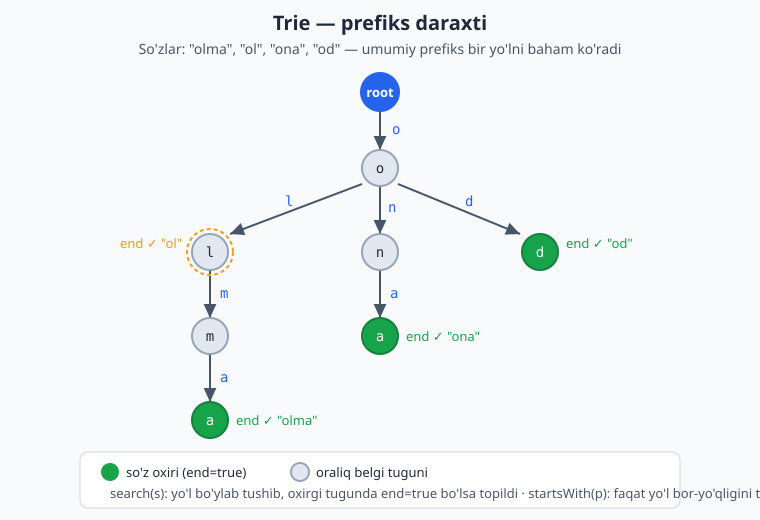
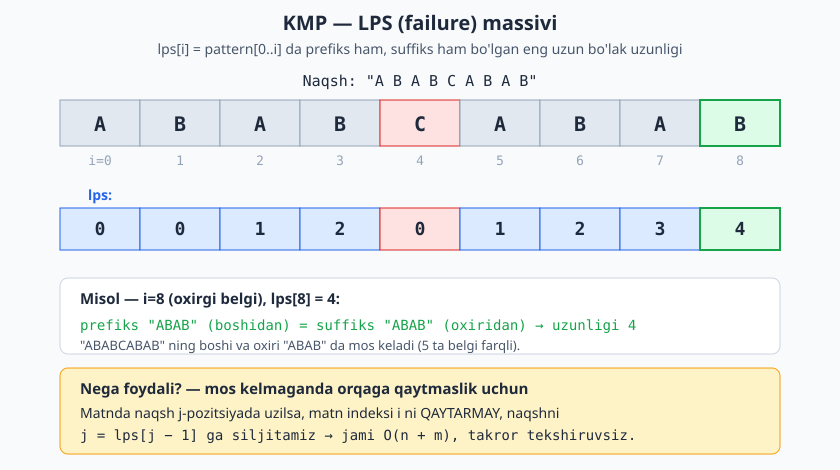

<a id="b22"></a>
# 22-bo'lim: Trie va string algoritmlari

<sub>[↑ Mundarijaga qaytish](README.md#mundarija)</sub>

> Bu bo'limda Trie (prefiks daraxti) ma'lumotlar tuzilmasi va satrlar ustida ishlovchi
> mashhur algoritmlar yig'ilgan: KMP, Rabin-Karp, Z-algoritm, Manacher, suffix massivi
> hamda ko'plab amaliy satr masalalari. Algoritmlar boshlovchilar uchun soddalashtirilgan,
> ammo to'g'ri va idiomatik tarzda berilgan.

<a id="m257"></a>
### 257. Trie — insert / search / startsWith (prefix tree)
Prefiks daraxti: so'z qo'shish, qidirish va prefiks bo'yicha tekshirish.
`⏱ O(L) har amal · 💾 O(jami belgilar)`

**JS**
```js
class Trie {
  constructor() { this.root = {}; }
  insert(word) {
    let node = this.root;
    for (const ch of word) node = node[ch] ??= {};
    node.end = true;
  }
  search(word) {
    let node = this.root;
    for (const ch of word) {
      if (!node[ch]) return false;
      node = node[ch];
    }
    return node.end === true;
  }
  startsWith(prefix) {
    let node = this.root;
    for (const ch of prefix) {
      if (!node[ch]) return false;
      node = node[ch];
    }
    return true;
  }
}
```
**PHP**
```php
class Trie {
    private array $root = [];
    public function insert(string $word): void {
        $node = &$this->root;
        for ($i = 0; $i < strlen($word); $i++) {
            $ch = $word[$i];
            if (!isset($node[$ch])) $node[$ch] = [];
            $node = &$node[$ch];
        }
        $node['end'] = true;
    }
    public function search(string $word): bool {
        $node = $this->root;
        for ($i = 0; $i < strlen($word); $i++) {
            $ch = $word[$i];
            if (!isset($node[$ch])) return false;
            $node = $node[$ch];
        }
        return isset($node['end']);
    }
    public function startsWith(string $prefix): bool {
        $node = $this->root;
        for ($i = 0; $i < strlen($prefix); $i++) {
            $ch = $prefix[$i];
            if (!isset($node[$ch])) return false;
            $node = $node[$ch];
        }
        return true;
    }
}
```
**Python**
```python
class Trie:
    def __init__(self):
        self.root = {}

    def insert(self, word):
        node = self.root
        for ch in word:
            node = node.setdefault(ch, {})
        node["end"] = True

    def search(self, word):
        node = self.root
        for ch in word:
            if ch not in node:
                return False
            node = node[ch]
        return node.get("end", False)

    def starts_with(self, prefix):
        node = self.root
        for ch in prefix:
            if ch not in node:
                return False
            node = node[ch]
        return True
```

Diagrammada Trie tuzilishi ko'rsatilgan: umumiy prefiksga ega so'zlar bir yo'lni baham ko'radi, har bir so'z oxiri alohida belgilanadi (end=true).



<a id="m258"></a>
### 258. Trie'dan so'z o'chirish (delete)
Trie'dan so'zni o'chirish; keraksiz bo'sh tugunlarni ham tozalaydi.
`⏱ O(L) · 💾 O(L) rekursiya`

**JS**
```js
const deleteWord = (root, word) => {
  const recur = (node, i) => {
    if (i === word.length) {
      if (!node.end) return false;
      delete node.end;
      return Object.keys(node).length === 0;
    }
    const ch = word[i];
    if (!node[ch]) return false;
    const shouldPrune = recur(node[ch], i + 1);
    if (shouldPrune) {
      delete node[ch];
      return Object.keys(node).length === 0 && !node.end;
    }
    return false;
  };
  recur(root, 0);
  return root;
};
```
**Python**
```python
def delete_word(root, word):
    def recur(node, i):
        if i == len(word):
            if not node.get("end"):
                return False
            del node["end"]
            return len(node) == 0
        ch = word[i]
        if ch not in node:
            return False
        if recur(node[ch], i + 1):
            del node[ch]
            return len(node) == 0 and "end" not in node
        return False

    recur(root, 0)
    return root
```

<a id="m259"></a>
### 259. So'z lug'ati — `.` wildcard qidiruv (WordDictionary)
`.` istalgan bitta belgiga mos keladigan qidiruvni qo'llab-quvvatlovchi lug'at.
`⏱ O(L) (eng yomon O(26^L)) · 💾 O(jami belgilar)`

**JS**
```js
class WordDictionary {
  constructor() { this.root = {}; }
  addWord(word) {
    let node = this.root;
    for (const ch of word) node = node[ch] ??= {};
    node.end = true;
  }
  search(word) {
    const dfs = (node, i) => {
      if (i === word.length) return node.end === true;
      const ch = word[i];
      if (ch === ".") {
        for (const k of Object.keys(node))
          if (k !== "end" && dfs(node[k], i + 1)) return true;
        return false;
      }
      return node[ch] ? dfs(node[ch], i + 1) : false;
    };
    return dfs(this.root, 0);
  }
}
```
**Python**
```python
class WordDictionary:
    def __init__(self):
        self.root = {}

    def add_word(self, word):
        node = self.root
        for ch in word:
            node = node.setdefault(ch, {})
        node["end"] = True

    def search(self, word):
        def dfs(node, i):
            if i == len(word):
                return node.get("end", False)
            ch = word[i]
            if ch == ".":
                return any(dfs(child, i + 1)
                           for k, child in node.items() if k != "end")
            return dfs(node[ch], i + 1) if ch in node else False

        return dfs(self.root, 0)
```

<a id="m260"></a>
### 260. Avtoto'ldirish takliflari (autocomplete)
Prefiks bo'yicha barcha mos so'zlarni Trie orqali qaytaradi.
`⏱ O(P + natija) · 💾 O(natija)`

**JS**
```js
const autocomplete = (words, prefix) => {
  const root = {};
  for (const w of words) {
    let node = root;
    for (const ch of w) node = node[ch] ??= {};
    node.end = true;
  }
  let node = root;
  for (const ch of prefix) {
    if (!node[ch]) return [];
    node = node[ch];
  }
  const res = [];
  const dfs = (n, path) => {
    if (n.end) res.push(prefix + path);
    for (const k of Object.keys(n))
      if (k !== "end") dfs(n[k], path + k);
  };
  dfs(node, "");
  return res.sort();
};
```
**Python**
```python
def autocomplete(words, prefix):
    root = {}
    for w in words:
        node = root
        for ch in w:
            node = node.setdefault(ch, {})
        node["end"] = True
    node = root
    for ch in prefix:
        if ch not in node:
            return []
        node = node[ch]
    res = []

    def dfs(n, path):
        if n.get("end"):
            res.append(prefix + path)
        for k, child in n.items():
            if k != "end":
                dfs(child, path + k)

    dfs(node, "")
    return sorted(res)
```

<a id="m261"></a>
### 261. Eng uzun umumiy prefiks — Trie bilan (longest common prefix)
Barcha so'zlar uchun umumiy eng uzun boshlang'ich qismni Trie orqali topadi.
`⏱ O(jami belgilar) · 💾 O(jami belgilar)`

**JS**
```js
const longestCommonPrefix = (words) => {
  if (words.length === 0) return "";
  const root = {};
  for (const w of words) {
    let node = root;
    for (const ch of w) node = node[ch] ??= {};
    node.end = true;
  }
  let prefix = "", node = root;
  while (true) {
    const keys = Object.keys(node).filter((k) => k !== "end");
    if (keys.length !== 1 || node.end) break;
    prefix += keys[0];
    node = node[keys[0]];
  }
  return prefix;
};
```
**Python**
```python
def longest_common_prefix(words):
    if not words:
        return ""
    root = {}
    for w in words:
        node = root
        for ch in w:
            node = node.setdefault(ch, {})
        node["end"] = True
    prefix, node = "", root
    while True:
        keys = [k for k in node if k != "end"]
        if len(keys) != 1 or node.get("end"):
            break
        prefix += keys[0]
        node = node[keys[0]]
    return prefix
```

<a id="m262"></a>
### 262. So'zlarni ildizga almashtirish (replace words / root)
Jumladagi har bir so'zni lug'atdagi eng qisqa ildiz bilan almashtiradi.
`⏱ O(jumla uzunligi) · 💾 O(lug'at)`

**JS**
```js
const replaceWords = (roots, sentence) => {
  const trie = {};
  for (const r of roots) {
    let node = trie;
    for (const ch of r) node = node[ch] ??= {};
    node.end = true;
  }
  const shortest = (word) => {
    let node = trie, pre = "";
    for (const ch of word) {
      if (!node[ch]) return word;
      pre += ch;
      node = node[ch];
      if (node.end) return pre;
    }
    return word;
  };
  return sentence.split(" ").map(shortest).join(" ");
};
```
**Python**
```python
def replace_words(roots, sentence):
    trie = {}
    for r in roots:
        node = trie
        for ch in r:
            node = node.setdefault(ch, {})
        node["end"] = True

    def shortest(word):
        node, pre = trie, ""
        for ch in word:
            if ch not in node:
                return word
            pre += ch
            node = node[ch]
            if node.get("end"):
                return pre
        return word

    return " ".join(shortest(w) for w in sentence.split(" "))
```

<a id="m263"></a>
### 263. KMP pattern qidirish (Knuth-Morris-Pratt)
Matnda naqshning barcha boshlanish indekslarini chiziqli vaqtda topadi.
`⏱ O(n + m) · 💾 O(m)`

**JS**
```js
const kmpSearch = (text, pattern) => {
  const m = pattern.length;
  if (m === 0) return [];
  const lps = Array(m).fill(0);
  for (let i = 1, len = 0; i < m; ) {
    if (pattern[i] === pattern[len]) lps[i++] = ++len;
    else if (len > 0) len = lps[len - 1];
    else lps[i++] = 0;
  }
  const res = [];
  for (let i = 0, j = 0; i < text.length; ) {
    if (text[i] === pattern[j]) {
      i++; j++;
      if (j === m) { res.push(i - m); j = lps[j - 1]; }
    } else if (j > 0) j = lps[j - 1];
    else i++;
  }
  return res;
};
```
**PHP**
```php
function kmpSearch(string $text, string $pattern): array {
    $m = strlen($pattern);
    if ($m === 0) return [];
    $lps = array_fill(0, $m, 0);
    for ($i = 1, $len = 0; $i < $m; ) {
        if ($pattern[$i] === $pattern[$len]) { $lps[$i++] = ++$len; }
        elseif ($len > 0) { $len = $lps[$len - 1]; }
        else { $lps[$i++] = 0; }
    }
    $res = [];
    $n = strlen($text);
    for ($i = 0, $j = 0; $i < $n; ) {
        if ($text[$i] === $pattern[$j]) {
            $i++; $j++;
            if ($j === $m) { $res[] = $i - $m; $j = $lps[$j - 1]; }
        } elseif ($j > 0) { $j = $lps[$j - 1]; }
        else { $i++; }
    }
    return $res;
}
```
**Python**
```python
def kmp_search(text, pattern):
    m = len(pattern)
    if m == 0:
        return []
    lps = [0] * m
    length = 0
    i = 1
    while i < m:
        if pattern[i] == pattern[length]:
            length += 1
            lps[i] = length
            i += 1
        elif length > 0:
            length = lps[length - 1]
        else:
            lps[i] = 0
            i += 1
    res = []
    i = j = 0
    while i < len(text):
        if text[i] == pattern[j]:
            i += 1
            j += 1
            if j == m:
                res.append(i - m)
                j = lps[j - 1]
        elif j > 0:
            j = lps[j - 1]
        else:
            i += 1
    return res
```

<a id="m264"></a>
### 264. LPS (failure) massivini hisoblash (prefix function)
KMP uchun "eng uzun bir xil prefiks-suffiks" massivini quradi.
`⏱ O(m) · 💾 O(m)`

**JS**
```js
const computeLPS = (pattern) => {
  const m = pattern.length;
  const lps = Array(m).fill(0);
  for (let i = 1, len = 0; i < m; ) {
    if (pattern[i] === pattern[len]) lps[i++] = ++len;
    else if (len > 0) len = lps[len - 1];
    else lps[i++] = 0;
  }
  return lps;
};
```
**Python**
```python
def compute_lps(pattern):
    m = len(pattern)
    lps = [0] * m
    length = 0
    i = 1
    while i < m:
        if pattern[i] == pattern[length]:
            length += 1
            lps[i] = length
            i += 1
        elif length > 0:
            length = lps[length - 1]
        else:
            lps[i] = 0
            i += 1
    return lps
```

Quyidagi diagramma LPS massivining ma'nosini ko'rsatadi: har bir lps[i] qiymati naqshning shu o'rinigacha bo'lgan qismida prefiks bilan suffiks mos kelgan eng uzun bo'lak uzunligi.



<a id="m265"></a>
### 265. Rabin-Karp (rolling hash)
Aylanma xesh yordamida naqshni matnda qidiradi.
`⏱ O(n + m) o'rtacha · 💾 O(1)`

**JS**
```js
const rabinKarp = (text, pattern) => {
  const n = text.length, m = pattern.length;
  if (m === 0 || m > n) return [];
  const base = 256, mod = 1_000_000_007;
  let ph = 0, th = 0, pow = 1;
  for (let i = 0; i < m; i++) {
    ph = (ph * base + pattern.charCodeAt(i)) % mod;
    th = (th * base + text.charCodeAt(i)) % mod;
    if (i < m - 1) pow = (pow * base) % mod;
  }
  const res = [];
  for (let i = 0; i + m <= n; i++) {
    if (ph === th && text.slice(i, i + m) === pattern) res.push(i);
    if (i + m < n) {
      th = ((th - text.charCodeAt(i) * pow % mod + mod) * base
            + text.charCodeAt(i + m)) % mod;
    }
  }
  return res;
};
```
**Python**
```python
def rabin_karp(text, pattern):
    n, m = len(text), len(pattern)
    if m == 0 or m > n:
        return []
    base, mod = 256, 1_000_000_007
    ph = th = 0
    pow_ = 1
    for i in range(m):
        ph = (ph * base + ord(pattern[i])) % mod
        th = (th * base + ord(text[i])) % mod
        if i < m - 1:
            pow_ = (pow_ * base) % mod
    res = []
    for i in range(n - m + 1):
        if ph == th and text[i:i + m] == pattern:
            res.append(i)
        if i + m < n:
            th = ((th - ord(text[i]) * pow_ % mod + mod) * base
                  + ord(text[i + m])) % mod
    return res
```

<a id="m266"></a>
### 266. Z-algoritm (Z-function)
Har bir pozitsiya uchun satr boshi bilan mos eng uzun prefiks uzunligini topadi.
`⏱ O(n) · 💾 O(n)`

**JS**
```js
const zFunction = (s) => {
  const n = s.length;
  const z = Array(n).fill(0);
  z[0] = n;
  for (let i = 1, l = 0, r = 0; i < n; i++) {
    if (i < r) z[i] = Math.min(r - i, z[i - l]);
    while (i + z[i] < n && s[z[i]] === s[i + z[i]]) z[i]++;
    if (i + z[i] > r) { l = i; r = i + z[i]; }
  }
  return z;
};
```
**Python**
```python
def z_function(s):
    n = len(s)
    z = [0] * n
    z[0] = n
    l = r = 0
    for i in range(1, n):
        if i < r:
            z[i] = min(r - i, z[i - l])
        while i + z[i] < n and s[z[i]] == s[i + z[i]]:
            z[i] += 1
        if i + z[i] > r:
            l, r = i, i + z[i]
    return z
```

<a id="m267"></a>
### 267. Eng uzun palindrom qism-satr — markazdan kengaytirish (longest palindromic substring)
Har bir markazdan ikki tomonga kengaytirib eng uzun palindromni topadi.
`⏱ O(n²) · 💾 O(1)`

**JS**
```js
const longestPalindrome = (s) => {
  if (s.length < 2) return s;
  let start = 0, maxLen = 1;
  const expand = (l, r) => {
    while (l >= 0 && r < s.length && s[l] === s[r]) { l--; r++; }
    if (r - l - 1 > maxLen) { maxLen = r - l - 1; start = l + 1; }
  };
  for (let i = 0; i < s.length; i++) {
    expand(i, i);
    expand(i, i + 1);
  }
  return s.slice(start, start + maxLen);
};
```
**PHP**
```php
function longestPalindrome(string $s): string {
    if (strlen($s) < 2) return $s;
    $start = 0; $maxLen = 1; $n = strlen($s);
    $expand = function ($l, $r) use ($s, $n, &$start, &$maxLen) {
        while ($l >= 0 && $r < $n && $s[$l] === $s[$r]) { $l--; $r++; }
        if ($r - $l - 1 > $maxLen) { $maxLen = $r - $l - 1; $start = $l + 1; }
    };
    for ($i = 0; $i < $n; $i++) {
        $expand($i, $i);
        $expand($i, $i + 1);
    }
    return substr($s, $start, $maxLen);
}
```
**Python**
```python
def longest_palindrome(s):
    if len(s) < 2:
        return s
    res = [0, 1]

    def expand(l, r):
        while l >= 0 and r < len(s) and s[l] == s[r]:
            l -= 1
            r += 1
        if r - l - 1 > res[1] - res[0]:
            res[0], res[1] = l + 1, r

    for i in range(len(s)):
        expand(i, i)
        expand(i, i + 1)
    return s[res[0]:res[1]]
```

<a id="m268"></a>
### 268. Manacher algoritmi (eng uzun palindrom O(n))
Manacher orqali eng uzun palindrom qism-satrni chiziqli vaqtda topadi.
`⏱ O(n) · 💾 O(n)`

**JS**
```js
const manacher = (s) => {
  if (s.length === 0) return "";
  const t = "^#" + s.split("").join("#") + "#$";
  const n = t.length;
  const p = Array(n).fill(0);
  let c = 0, r = 0;
  for (let i = 1; i < n - 1; i++) {
    if (i < r) p[i] = Math.min(r - i, p[2 * c - i]);
    while (t[i + p[i] + 1] === t[i - p[i] - 1]) p[i]++;
    if (i + p[i] > r) { c = i; r = i + p[i]; }
  }
  let maxLen = 0, centerIndex = 0;
  for (let i = 1; i < n - 1; i++)
    if (p[i] > maxLen) { maxLen = p[i]; centerIndex = i; }
  const start = (centerIndex - maxLen) / 2;
  return s.slice(start, start + maxLen);
};
```
**Python**
```python
def manacher(s):
    if not s:
        return ""
    t = "^#" + "#".join(s) + "#$"
    n = len(t)
    p = [0] * n
    c = r = 0
    for i in range(1, n - 1):
        if i < r:
            p[i] = min(r - i, p[2 * c - i])
        while t[i + p[i] + 1] == t[i - p[i] - 1]:
            p[i] += 1
        if i + p[i] > r:
            c, r = i, i + p[i]
    max_len = max(p)
    center = p.index(max_len)
    start = (center - max_len) // 2
    return s[start:start + max_len]
```

<a id="m269"></a>
### 269. Noyob (distinct) qism-satrlar soni
Suffikslar Trie'si orqali takrorlanmaydigan qism-satrlar sonini sanaydi.
`⏱ O(n²) · 💾 O(n²)`

**JS**
```js
const countDistinctSubstrings = (s) => {
  const root = {};
  let count = 0;
  for (let i = 0; i < s.length; i++) {
    let node = root;
    for (let j = i; j < s.length; j++) {
      const ch = s[j];
      if (!node[ch]) { node[ch] = {}; count++; }
      node = node[ch];
    }
  }
  return count;
};
```
**Python**
```python
def count_distinct_substrings(s):
    root = {}
    count = 0
    for i in range(len(s)):
        node = root
        for j in range(i, len(s)):
            ch = s[j]
            if ch not in node:
                node[ch] = {}
                count += 1
            node = node[ch]
    return count
```

<a id="m270"></a>
### 270. Eng uzun takrorlanuvchi qism-satr (longest repeated substring)
Kamida ikki marta uchraydigan eng uzun qism-satrni topadi (binar qidiruv + xesh).
`⏱ O(n² log n) · 💾 O(n)`

**JS**
```js
const longestRepeatedSubstring = (s) => {
  const n = s.length;
  const hasRepeat = (len) => {
    const seen = new Set();
    for (let i = 0; i + len <= n; i++) {
      const sub = s.slice(i, i + len);
      if (seen.has(sub)) return sub;
      seen.add(sub);
    }
    return null;
  };
  let lo = 1, hi = n - 1, best = "";
  while (lo <= hi) {
    const mid = (lo + hi) >> 1;
    const found = hasRepeat(mid);
    if (found) { best = found; lo = mid + 1; }
    else hi = mid - 1;
  }
  return best;
};
```
**Python**
```python
def longest_repeated_substring(s):
    n = len(s)

    def has_repeat(length):
        seen = set()
        for i in range(n - length + 1):
            sub = s[i:i + length]
            if sub in seen:
                return sub
            seen.add(sub)
        return None

    lo, hi, best = 1, n - 1, ""
    while lo <= hi:
        mid = (lo + hi) // 2
        found = has_repeat(mid)
        if found:
            best = found
            lo = mid + 1
        else:
            hi = mid - 1
    return best
```

<a id="m271"></a>
### 271. Polinomial string hashing (prefix hash)
Prefiks xeshlari orqali ixtiyoriy qism-satr xeshini O(1) da olish.
`⏱ O(n) tayyorlash, O(1) so'rov · 💾 O(n)`

**JS**
```js
class StringHash {
  constructor(s, base = 131, mod = 1_000_000_007n) {
    this.mod = mod;
    const n = s.length;
    this.pow = Array(n + 1).fill(1n);
    this.h = Array(n + 1).fill(0n);
    const b = BigInt(base);
    for (let i = 0; i < n; i++) {
      this.pow[i + 1] = (this.pow[i] * b) % mod;
      this.h[i + 1] = (this.h[i] * b + BigInt(s.charCodeAt(i))) % mod;
    }
  }
  // [l, r) yarim ochiq oraliq xeshi
  query(l, r) {
    return (this.h[r] - this.h[l] * this.pow[r - l] % this.mod + this.mod) % this.mod;
  }
}
```
**Python**
```python
class StringHash:
    def __init__(self, s, base=131, mod=1_000_000_007):
        self.mod = mod
        n = len(s)
        self.pow = [1] * (n + 1)
        self.h = [0] * (n + 1)
        for i in range(n):
            self.pow[i + 1] = self.pow[i] * base % mod
            self.h[i + 1] = (self.h[i] * base + ord(s[i])) % mod

    def query(self, l, r):  # [l, r) yarim ochiq oraliq
        return (self.h[r] - self.h[l] * self.pow[r - l]) % self.mod
```

<a id="m272"></a>
### 272. Boyer-Moore — soddalashtirilgan bad-char qoidasi
Yomon belgi (bad-character) jadvali bilan naqshni qidiradi.
`⏱ O(n·m) eng yomon, amalda tez · 💾 O(alifbo)`

**JS**
```js
const boyerMoore = (text, pattern) => {
  const n = text.length, m = pattern.length;
  if (m === 0) return [];
  const last = new Map();
  for (let i = 0; i < m; i++) last.set(pattern[i], i);
  const res = [];
  let s = 0;
  while (s <= n - m) {
    let j = m - 1;
    while (j >= 0 && pattern[j] === text[s + j]) j--;
    if (j < 0) { res.push(s); s++; }
    else {
      const lastOcc = last.has(text[s + j]) ? last.get(text[s + j]) : -1;
      s += Math.max(1, j - lastOcc);
    }
  }
  return res;
};
```
**Python**
```python
def boyer_moore(text, pattern):
    n, m = len(text), len(pattern)
    if m == 0:
        return []
    last = {ch: i for i, ch in enumerate(pattern)}
    res = []
    s = 0
    while s <= n - m:
        j = m - 1
        while j >= 0 and pattern[j] == text[s + j]:
            j -= 1
        if j < 0:
            res.append(s)
            s += 1
        else:
            s += max(1, j - last.get(text[s + j], -1))
    return res
```

<a id="m273"></a>
### 273. Suffix massivi — oddiy qurish (suffix array)
Barcha suffikslarni saralab indekslar massivini quradi (sodda usul).
`⏱ O(n² log n) · 💾 O(n)`

**JS**
```js
const suffixArray = (s) => {
  const n = s.length;
  return Array.from({ length: n }, (_, i) => i)
    .sort((a, b) => (s.slice(a) < s.slice(b) ? -1 : 1));
};
```
**PHP**
```php
function suffixArray(string $s): array {
    $n = strlen($s);
    $idx = range(0, $n - 1);
    usort($idx, fn($a, $b) => strcmp(substr($s, $a), substr($s, $b)));
    return $idx;
}
```
**Python**
```python
def suffix_array(s):
    return sorted(range(len(s)), key=lambda i: s[i:])
```

<a id="m274"></a>
### 274. Eng uzun umumiy qism-satr — DP (longest common substring)
Ikki satrning eng uzun umumiy uzluksiz qism-satrini DP bilan topadi.
`⏱ O(n·m) · 💾 O(n·m)`

**JS**
```js
const longestCommonSubstring = (a, b) => {
  const n = a.length, m = b.length;
  const dp = Array.from({ length: n + 1 }, () => Array(m + 1).fill(0));
  let maxLen = 0, end = 0;
  for (let i = 1; i <= n; i++)
    for (let j = 1; j <= m; j++)
      if (a[i - 1] === b[j - 1]) {
        dp[i][j] = dp[i - 1][j - 1] + 1;
        if (dp[i][j] > maxLen) { maxLen = dp[i][j]; end = i; }
      }
  return a.slice(end - maxLen, end);
};
```
**Python**
```python
def longest_common_substring(a, b):
    n, m = len(a), len(b)
    dp = [[0] * (m + 1) for _ in range(n + 1)]
    max_len = end = 0
    for i in range(1, n + 1):
        for j in range(1, m + 1):
            if a[i - 1] == b[j - 1]:
                dp[i][j] = dp[i - 1][j - 1] + 1
                if dp[i][j] > max_len:
                    max_len = dp[i][j]
                    end = i
    return a[end - max_len:end]
```

<a id="m275"></a>
### 275. Repeated string match
`a` ni necha marta takrorlasak `b` qism-satr bo'ladi; iloji bo'lmasa -1.
`⏱ O(n + m) · 💾 O(n + m)`

**JS**
```js
const repeatedStringMatch = (a, b) => {
  let count = Math.ceil(b.length / a.length);
  let s = a.repeat(count);
  if (s.includes(b)) return count;
  if ((s + a).includes(b)) return count + 1;
  return -1;
};
```
**Python**
```python
import math

def repeated_string_match(a, b):
    count = math.ceil(len(b) / len(a))
    s = a * count
    if b in s:
        return count
    if b in s + a:
        return count + 1
    return -1
```

<a id="m276"></a>
### 276. Eng qisqa palindrom — KMP (shortest palindrome)
Satr boshiga belgilar qo'shib eng qisqa palindrom hosil qiladi (KMP usuli).
`⏱ O(n) · 💾 O(n)`

**JS**
```js
const shortestPalindrome = (s) => {
  const rev = s.split("").reverse().join("");
  const combined = s + "#" + rev;
  const m = combined.length;
  const lps = Array(m).fill(0);
  for (let i = 1, len = 0; i < m; ) {
    if (combined[i] === combined[len]) lps[i++] = ++len;
    else if (len > 0) len = lps[len - 1];
    else lps[i++] = 0;
  }
  return rev.slice(0, s.length - lps[m - 1]) + s;
};
```
**Python**
```python
def shortest_palindrome(s):
    rev = s[::-1]
    combined = s + "#" + rev
    m = len(combined)
    lps = [0] * m
    length = 0
    i = 1
    while i < m:
        if combined[i] == combined[length]:
            length += 1
            lps[i] = length
            i += 1
        elif length > 0:
            length = lps[length - 1]
        else:
            lps[i] = 0
            i += 1
    return rev[:len(s) - lps[-1]] + s
```

<a id="m277"></a>
### 277. Anagrammalar guruhi (group anagrams)
So'zlarni saralangan harflar kaliti bo'yicha guruhlaydi.
`⏱ O(n·k log k) · 💾 O(n·k)`

**JS**
```js
const groupAnagrams = (words) => {
  const map = new Map();
  for (const w of words) {
    const key = w.split("").sort().join("");
    if (!map.has(key)) map.set(key, []);
    map.get(key).push(w);
  }
  return [...map.values()];
};
```
**PHP**
```php
function groupAnagrams(array $words): array {
    $map = [];
    foreach ($words as $w) {
        $arr = str_split($w);
        sort($arr);
        $key = implode("", $arr);
        $map[$key][] = $w;
    }
    return array_values($map);
}
```
**Python**
```python
from collections import defaultdict

def group_anagrams(words):
    groups = defaultdict(list)
    for w in words:
        groups["".join(sorted(w))].append(w)
    return list(groups.values())
```

<a id="m278"></a>
### 278. Isomorphic strings
Ikki satr belgilari o'zaro bir qiymatli moslik bilan almashtirilsa teng bo'ladimi.
`⏱ O(n) · 💾 O(n)`

**JS**
```js
const isIsomorphic = (s, t) => {
  if (s.length !== t.length) return false;
  const mapST = new Map(), mapTS = new Map();
  for (let i = 0; i < s.length; i++) {
    const a = s[i], b = t[i];
    if (mapST.has(a) && mapST.get(a) !== b) return false;
    if (mapTS.has(b) && mapTS.get(b) !== a) return false;
    mapST.set(a, b);
    mapTS.set(b, a);
  }
  return true;
};
```
**Python**
```python
def is_isomorphic(s, t):
    if len(s) != len(t):
        return False
    map_st, map_ts = {}, {}
    for a, b in zip(s, t):
        if map_st.get(a, b) != b or map_ts.get(b, a) != a:
            return False
        map_st[a], map_ts[b] = b, a
    return True
```

<a id="m279"></a>
### 279. Word pattern
Naqsh harflari bilan jumladagi so'zlar orasida bijeksiya bormi.
`⏱ O(n) · 💾 O(n)`

**JS**
```js
const wordPattern = (pattern, s) => {
  const words = s.split(" ");
  if (pattern.length !== words.length) return false;
  const p2w = new Map(), w2p = new Map();
  for (let i = 0; i < pattern.length; i++) {
    const c = pattern[i], w = words[i];
    if (p2w.has(c) && p2w.get(c) !== w) return false;
    if (w2p.has(w) && w2p.get(w) !== c) return false;
    p2w.set(c, w);
    w2p.set(w, c);
  }
  return true;
};
```
**Python**
```python
def word_pattern(pattern, s):
    words = s.split()
    if len(pattern) != len(words):
        return False
    p2w, w2p = {}, {}
    for c, w in zip(pattern, words):
        if p2w.get(c, w) != w or w2p.get(w, c) != c:
            return False
        p2w[c], w2p[w] = w, c
    return True
```

<a id="m280"></a>
### 280. Minimal oyna qism-satr (minimum window substring)
`s` ning `t` dagi barcha belgilarni o'z ichiga olgan eng qisqa oynasini topadi.
`⏱ O(n) · 💾 O(alifbo)`

**JS**
```js
const minWindow = (s, t) => {
  if (t.length === 0 || s.length < t.length) return "";
  const need = new Map();
  for (const c of t) need.set(c, (need.get(c) || 0) + 1);
  let required = need.size, formed = 0;
  const window = new Map();
  let l = 0, best = [Infinity, 0, 0];
  for (let r = 0; r < s.length; r++) {
    const c = s[r];
    window.set(c, (window.get(c) || 0) + 1);
    if (need.has(c) && window.get(c) === need.get(c)) formed++;
    while (formed === required) {
      if (r - l + 1 < best[0]) best = [r - l + 1, l, r];
      const lc = s[l];
      window.set(lc, window.get(lc) - 1);
      if (need.has(lc) && window.get(lc) < need.get(lc)) formed--;
      l++;
    }
  }
  return best[0] === Infinity ? "" : s.slice(best[1], best[2] + 1);
};
```
**Python**
```python
from collections import Counter

def min_window(s, t):
    if not t or len(s) < len(t):
        return ""
    need = Counter(t)
    required = len(need)
    window = Counter()
    formed = 0
    l = 0
    best = (float("inf"), 0, 0)
    for r, c in enumerate(s):
        window[c] += 1
        if window[c] == need[c]:
            formed += 1
        while formed == required:
            if r - l + 1 < best[0]:
                best = (r - l + 1, l, r)
            window[s[l]] -= 1
            if s[l] in need and window[s[l]] < need[s[l]]:
                formed -= 1
            l += 1
    return "" if best[0] == float("inf") else s[best[1]:best[2] + 1]
```

<a id="m281"></a>
### 281. String ko'paytirish (multiply strings)
Ikki manfiy bo'lmagan butun sonni satr ko'rinishida ko'paytiradi.
`⏱ O(n·m) · 💾 O(n + m)`

**JS**
```js
const multiply = (num1, num2) => {
  if (num1 === "0" || num2 === "0") return "0";
  const n = num1.length, m = num2.length;
  const res = Array(n + m).fill(0);
  for (let i = n - 1; i >= 0; i--)
    for (let j = m - 1; j >= 0; j--) {
      const mul = (num1.charCodeAt(i) - 48) * (num2.charCodeAt(j) - 48);
      const sum = mul + res[i + j + 1];
      res[i + j + 1] = sum % 10;
      res[i + j] += Math.floor(sum / 10);
    }
  return res.join("").replace(/^0+/, "");
};
```
**Python**
```python
def multiply(num1, num2):
    if num1 == "0" or num2 == "0":
        return "0"
    n, m = len(num1), len(num2)
    res = [0] * (n + m)
    for i in range(n - 1, -1, -1):
        for j in range(m - 1, -1, -1):
            mul = (ord(num1[i]) - 48) * (ord(num2[j]) - 48)
            total = mul + res[i + j + 1]
            res[i + j + 1] = total % 10
            res[i + j] += total // 10
    return "".join(map(str, res)).lstrip("0")
```

<a id="m282"></a>
### 282. atoi (string -> int)
Satrni butun songa aylantiradi: bo'shliq, ishora va to'lib ketishni hisobga oladi.
`⏱ O(n) · 💾 O(1)`

**JS**
```js
const myAtoi = (s) => {
  const INT_MAX = 2147483647, INT_MIN = -2147483648;
  let i = 0;
  while (i < s.length && s[i] === " ") i++;
  let sign = 1;
  if (s[i] === "+" || s[i] === "-") { sign = s[i] === "-" ? -1 : 1; i++; }
  let num = 0;
  while (i < s.length && s[i] >= "0" && s[i] <= "9") {
    num = num * 10 + (s.charCodeAt(i) - 48);
    i++;
  }
  num *= sign;
  if (num < INT_MIN) return INT_MIN;
  if (num > INT_MAX) return INT_MAX;
  return num;
};
```
**Python**
```python
def my_atoi(s):
    INT_MAX, INT_MIN = 2147483647, -2147483648
    i, n = 0, len(s)
    while i < n and s[i] == " ":
        i += 1
    sign = 1
    if i < n and s[i] in "+-":
        sign = -1 if s[i] == "-" else 1
        i += 1
    num = 0
    while i < n and s[i].isdigit():
        num = num * 10 + (ord(s[i]) - 48)
        i += 1
    num *= sign
    return max(INT_MIN, min(INT_MAX, num))
```

<a id="m283"></a>
### 283. Integer to english words
Manfiy bo'lmagan butun sonni ingliz so'zlari ko'rinishida yozadi.
`⏱ O(log n) · 💾 O(1)`

**JS**
```js
const numberToWords = (num) => {
  if (num === 0) return "Zero";
  const below20 = ["", "One", "Two", "Three", "Four", "Five", "Six", "Seven",
    "Eight", "Nine", "Ten", "Eleven", "Twelve", "Thirteen", "Fourteen",
    "Fifteen", "Sixteen", "Seventeen", "Eighteen", "Nineteen"];
  const tens = ["", "", "Twenty", "Thirty", "Forty", "Fifty", "Sixty",
    "Seventy", "Eighty", "Ninety"];
  const thousands = ["", "Thousand", "Million", "Billion"];
  const helper = (n) => {
    if (n === 0) return "";
    if (n < 20) return below20[n] + " ";
    if (n < 100) return tens[Math.floor(n / 10)] + " " + helper(n % 10);
    return below20[Math.floor(n / 100)] + " Hundred " + helper(n % 100);
  };
  let res = "", i = 0;
  while (num > 0) {
    if (num % 1000 !== 0)
      res = helper(num % 1000) + thousands[i] + " " + res;
    num = Math.floor(num / 1000);
    i++;
  }
  return res.trim().replace(/\s+/g, " ");
};
```
**Python**
```python
def number_to_words(num):
    if num == 0:
        return "Zero"
    below20 = ["", "One", "Two", "Three", "Four", "Five", "Six", "Seven",
               "Eight", "Nine", "Ten", "Eleven", "Twelve", "Thirteen",
               "Fourteen", "Fifteen", "Sixteen", "Seventeen", "Eighteen",
               "Nineteen"]
    tens = ["", "", "Twenty", "Thirty", "Forty", "Fifty", "Sixty",
            "Seventy", "Eighty", "Ninety"]
    thousands = ["", "Thousand", "Million", "Billion"]

    def helper(n):
        if n == 0:
            return ""
        if n < 20:
            return below20[n] + " "
        if n < 100:
            return tens[n // 10] + " " + helper(n % 10)
        return below20[n // 100] + " Hundred " + helper(n % 100)

    res, i = "", 0
    while num > 0:
        if num % 1000 != 0:
            res = helper(num % 1000) + thousands[i] + " " + res
        num //= 1000
        i += 1
    return " ".join(res.split())
```

<a id="m284"></a>
### 284. Count and say
"Ko'rib ayt" ketma-ketligining n-hadini hosil qiladi.
`⏱ O(2^n) (had uzunligi ortadi) · 💾 O(2^n)`

**JS**
```js
const countAndSay = (n) => {
  let s = "1";
  for (let k = 1; k < n; k++) {
    let next = "", i = 0;
    while (i < s.length) {
      let count = 1;
      while (i + 1 < s.length && s[i] === s[i + 1]) { count++; i++; }
      next += count + s[i];
      i++;
    }
    s = next;
  }
  return s;
};
```
**Python**
```python
def count_and_say(n):
    s = "1"
    for _ in range(n - 1):
        nxt, i = "", 0
        while i < len(s):
            count = 1
            while i + 1 < len(s) and s[i] == s[i + 1]:
                count += 1
                i += 1
            nxt += str(count) + s[i]
            i += 1
        s = nxt
    return s
```

<a id="m285"></a>
### 285. Decode ways
"A=1..Z=26" kodlash bo'yicha raqamli satrni dekodlash usullari soni.
`⏱ O(n) · 💾 O(1)`

**JS**
```js
const numDecodings = (s) => {
  if (s.length === 0 || s[0] === "0") return 0;
  let prev = 1, cur = 1;
  for (let i = 1; i < s.length; i++) {
    let next = 0;
    if (s[i] !== "0") next += cur;
    const two = +s.slice(i - 1, i + 1);
    if (two >= 10 && two <= 26) next += prev;
    prev = cur;
    cur = next;
  }
  return cur;
};
```
**Python**
```python
def num_decodings(s):
    if not s or s[0] == "0":
        return 0
    prev = cur = 1
    for i in range(1, len(s)):
        nxt = 0
        if s[i] != "0":
            nxt += cur
        if 10 <= int(s[i - 1:i + 1]) <= 26:
            nxt += prev
        prev, cur = cur, nxt
    return cur
```

<a id="m286"></a>
### 286. Basic calculator (+, -, qavslar)
`+`, `-` va qavslarni qo'llab-quvvatlovchi ifoda hisoblagichi.
`⏱ O(n) · 💾 O(n)`

**JS**
```js
const calculate = (s) => {
  let result = 0, sign = 1, i = 0;
  const stack = [];
  while (i < s.length) {
    const c = s[i];
    if (c >= "0" && c <= "9") {
      let num = 0;
      while (i < s.length && s[i] >= "0" && s[i] <= "9") {
        num = num * 10 + (s.charCodeAt(i) - 48);
        i++;
      }
      result += sign * num;
      continue;
    } else if (c === "+") sign = 1;
    else if (c === "-") sign = -1;
    else if (c === "(") { stack.push(result, sign); result = 0; sign = 1; }
    else if (c === ")") {
      result = result * stack.pop() + stack.pop();
    }
    i++;
  }
  return result;
};
```
**Python**
```python
def calculate(s):
    result, sign, i = 0, 1, 0
    stack = []
    while i < len(s):
        c = s[i]
        if c.isdigit():
            num = 0
            while i < len(s) and s[i].isdigit():
                num = num * 10 + (ord(s[i]) - 48)
                i += 1
            result += sign * num
            continue
        elif c == "+":
            sign = 1
        elif c == "-":
            sign = -1
        elif c == "(":
            stack.append(result)
            stack.append(sign)
            result, sign = 0, 1
        elif c == ")":
            result = result * stack.pop() + stack.pop()
        i += 1
    return result
```

<a id="m287"></a>
### 287. Valid number
Satr to'g'ri o'nlik/butun/ilmiy son ifodasimi (oddiy holatlar).
`⏱ O(n) · 💾 O(1)`

**JS**
```js
const isNumber = (s) => {
  return /^[+-]?(\d+\.?\d*|\.\d+)([eE][+-]?\d+)?$/.test(s.trim());
};
```
**PHP**
```php
function isNumber(string $s): bool {
    return preg_match('/^[+-]?(\d+\.?\d*|\.\d+)([eE][+-]?\d+)?$/', trim($s)) === 1;
}
```
**Python**
```python
import re

def is_number(s):
    return re.fullmatch(r"[+-]?(\d+\.?\d*|\.\d+)([eE][+-]?\d+)?", s.strip()) is not None
```

<a id="m288"></a>
### 288. Text justification
So'zlarni berilgan kenglikka to'liq tekislab (justify) qatorlarga joylaydi.
`⏱ O(jami belgilar) · 💾 O(jami belgilar)`

**JS**
```js
const fullJustify = (words, maxWidth) => {
  const res = [];
  let line = [], len = 0;
  for (const w of words) {
    if (len + line.length + w.length > maxWidth) {
      const spaces = maxWidth - len;
      const gaps = line.length - 1;
      if (gaps === 0) {
        res.push(line[0] + " ".repeat(spaces));
      } else {
        let str = "";
        for (let i = 0; i < line.length; i++) {
          str += line[i];
          if (i < gaps) {
            const sp = Math.floor(spaces / gaps) + (i < spaces % gaps ? 1 : 0);
            str += " ".repeat(sp);
          }
        }
        res.push(str);
      }
      line = []; len = 0;
    }
    line.push(w);
    len += w.length;
  }
  let last = line.join(" ");
  last += " ".repeat(maxWidth - last.length);
  res.push(last);
  return res;
};
```
**Python**
```python
def full_justify(words, max_width):
    res, line, length = [], [], 0
    for w in words:
        if length + len(line) + len(w) > max_width:
            spaces = max_width - length
            gaps = len(line) - 1
            if gaps == 0:
                res.append(line[0] + " " * spaces)
            else:
                s = ""
                for i in range(len(line)):
                    s += line[i]
                    if i < gaps:
                        sp = spaces // gaps + (1 if i < spaces % gaps else 0)
                        s += " " * sp
                res.append(s)
            line, length = [], 0
        line.append(w)
        length += len(w)
    last = " ".join(line)
    res.append(last + " " * (max_width - len(last)))
    return res
```

<a id="m289"></a>
### 289. Zigzag conversion
Satrni zigzag shaklida `numRows` qatorga yozib, qatorma-qator o'qiydi.
`⏱ O(n) · 💾 O(n)`

**JS**
```js
const convert = (s, numRows) => {
  if (numRows === 1 || numRows >= s.length) return s;
  const rows = Array.from({ length: numRows }, () => "");
  let cur = 0, step = 1;
  for (const c of s) {
    rows[cur] += c;
    if (cur === 0) step = 1;
    else if (cur === numRows - 1) step = -1;
    cur += step;
  }
  return rows.join("");
};
```
**Python**
```python
def convert(s, num_rows):
    if num_rows == 1 or num_rows >= len(s):
        return s
    rows = [""] * num_rows
    cur, step = 0, 1
    for c in s:
        rows[cur] += c
        if cur == 0:
            step = 1
        elif cur == num_rows - 1:
            step = -1
        cur += step
    return "".join(rows)
```

<a id="m290"></a>
### 290. Reverse words in a string
Satrdagi so'zlar tartibini teskari qiladi, ortiqcha bo'shliqlarni tozalaydi.
`⏱ O(n) · 💾 O(n)`

**JS**
```js
const reverseWords = (s) => s.trim().split(/\s+/).reverse().join(" ");
```
**PHP**
```php
function reverseWords(string $s): string {
    $words = preg_split('/\s+/', trim($s));
    return implode(" ", array_reverse($words));
}
```
**Python**
```python
def reverse_words(s):
    return " ".join(reversed(s.split()))
```

<a id="m291"></a>
### 291. Suffix massivi bilan eng uzun takrorlanuvchi qism-satr (LCP)
Suffix massivi va qo'shni suffikslarning umumiy prefiksi orqali eng uzun takrorni topadi.
`⏱ O(n² log n) · 💾 O(n)`

**JS**
```js
const longestRepeatedBySA = (s) => {
  const n = s.length;
  const sa = Array.from({ length: n }, (_, i) => i)
    .sort((a, b) => (s.slice(a) < s.slice(b) ? -1 : 1));
  const commonPrefix = (i, j) => {
    let k = 0;
    while (i + k < n && j + k < n && s[i + k] === s[j + k]) k++;
    return k;
  };
  let best = "";
  for (let i = 1; i < n; i++) {
    const len = commonPrefix(sa[i - 1], sa[i]);
    if (len > best.length) best = s.slice(sa[i], sa[i] + len);
  }
  return best;
};
```
**Python**
```python
def longest_repeated_by_sa(s):
    n = len(s)
    sa = sorted(range(n), key=lambda i: s[i:])

    def common_prefix(i, j):
        k = 0
        while i + k < n and j + k < n and s[i + k] == s[j + k]:
            k += 1
        return k

    best = ""
    for i in range(1, n):
        length = common_prefix(sa[i - 1], sa[i])
        if length > len(best):
            best = s[sa[i]:sa[i] + length]
    return best
```
