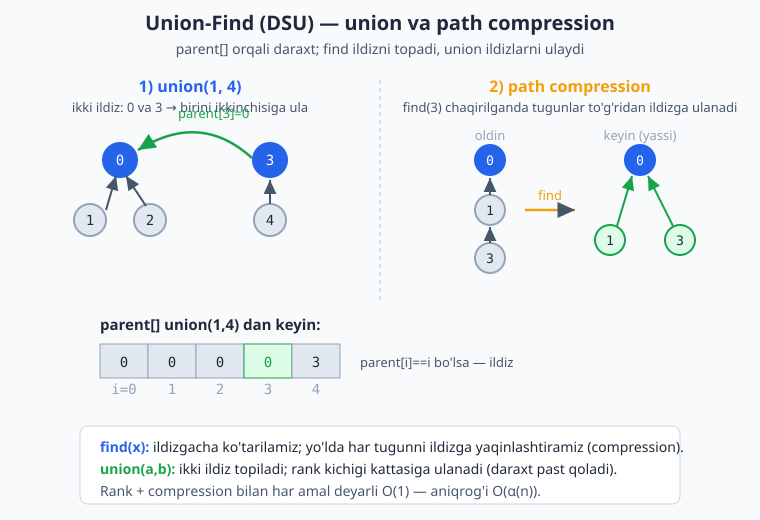
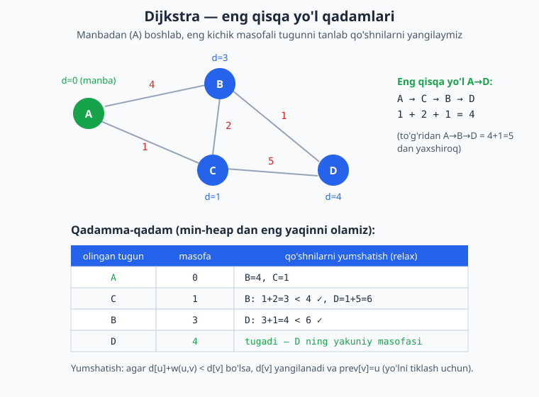

<a id="b23"></a>
# 23-bo'lim: Ilg'or graflar

<sub>[↑ Mundarijaga qaytish](README.md#mundarija)</sub>

> 🕸 Bu bo'lim Union-Find (DSU), eng qisqa yo'l algoritmlari (Bellman-Ford, Floyd-Warshall, Dijkstra), MST (Kruskal, Prim), kuchli bog'liq komponentalar (SCC), ko'priklar va kesim tugunlari hamda ko'plab amaliy BFS/DFS masalalarini qamrab oladi. Murakkablikda **V** — tugunlar (vertices), **E** — qirralar (edges) soni.

<a id="m292"></a>
### 292. Union-Find / DSU (rank + path compression)
Disjoint Set Union — to'plamlarni birlashtirish va bog'lanishni tekshirish. Rank va yo'l qisqartirish (path compression) bilan deyarli O(1).
`⏱ amal O(α(n)) · 💾 O(n)`

**JS**
```js
class DSU {
  constructor(n) {
    this.parent = Array.from({ length: n }, (_, i) => i);
    this.rank = Array(n).fill(0);
    this.count = n;
  }
  find(x) {
    while (this.parent[x] !== x) {
      this.parent[x] = this.parent[this.parent[x]]; // yo'l qisqartirish
      x = this.parent[x];
    }
    return x;
  }
  union(a, b) {
    let ra = this.find(a), rb = this.find(b);
    if (ra === rb) return false;
    if (this.rank[ra] < this.rank[rb]) [ra, rb] = [rb, ra];
    this.parent[rb] = ra;
    if (this.rank[ra] === this.rank[rb]) this.rank[ra]++;
    this.count--;
    return true;
  }
  connected(a, b) { return this.find(a) === this.find(b); }
}
```
**PHP**
```php
class DSU {
    private array $parent;
    private array $rank;
    public int $count;

    public function __construct(int $n) {
        $this->parent = range(0, $n - 1);
        $this->rank = array_fill(0, $n, 0);
        $this->count = $n;
    }

    public function find(int $x): int {
        while ($this->parent[$x] !== $x) {
            $this->parent[$x] = $this->parent[$this->parent[$x]];
            $x = $this->parent[$x];
        }
        return $x;
    }

    public function union(int $a, int $b): bool {
        $ra = $this->find($a);
        $rb = $this->find($b);
        if ($ra === $rb) return false;
        if ($this->rank[$ra] < $this->rank[$rb]) { [$ra, $rb] = [$rb, $ra]; }
        $this->parent[$rb] = $ra;
        if ($this->rank[$ra] === $this->rank[$rb]) $this->rank[$ra]++;
        $this->count--;
        return true;
    }

    public function connected(int $a, int $b): bool {
        return $this->find($a) === $this->find($b);
    }
}
```
**Python**
```python
class DSU:
    def __init__(self, n):
        self.parent = list(range(n))
        self.rank = [0] * n
        self.count = n

    def find(self, x):
        while self.parent[x] != x:
            self.parent[x] = self.parent[self.parent[x]]  # yo'l qisqartirish
            x = self.parent[x]
        return x

    def union(self, a, b):
        ra, rb = self.find(a), self.find(b)
        if ra == rb:
            return False
        if self.rank[ra] < self.rank[rb]:
            ra, rb = rb, ra
        self.parent[rb] = ra
        if self.rank[ra] == self.rank[rb]:
            self.rank[ra] += 1
        self.count -= 1
        return True

    def connected(self, a, b):
        return self.find(a) == self.find(b)
```

Quyidagi diagramma union amalida ikki to'plamning ildizlari qanday ulanishini va path compression find paytida yo'lni qanday qisqartirib daraxtni yassilashtirishini ko'rsatadi.



<a id="m293"></a>
### 293. Provinsiyalar soni (number of provinces)
`isConnected[i][j]=1` bo'lsa i va j shaharlar bevosita bog'langan. Bog'langan komponentalar (provinsiyalar) sonini top.
`⏱ O(n²·α(n)) · 💾 O(n)`

**JS**
```js
const findCircleNum = (isConnected) => {
  const n = isConnected.length;
  const dsu = new DSU(n);
  for (let i = 0; i < n; i++)
    for (let j = i + 1; j < n; j++)
      if (isConnected[i][j]) dsu.union(i, j);
  return dsu.count;
};
```
**PHP**
```php
function findCircleNum(array $isConnected): int {
    $n = count($isConnected);
    $dsu = new DSU($n);
    for ($i = 0; $i < $n; $i++)
        for ($j = $i + 1; $j < $n; $j++)
            if ($isConnected[$i][$j]) $dsu->union($i, $j);
    return $dsu->count;
}
```
**Python**
```python
def find_circle_num(is_connected):
    n = len(is_connected)
    dsu = DSU(n)
    for i in range(n):
        for j in range(i + 1, n):
            if is_connected[i][j]:
                dsu.union(i, j)
    return dsu.count
```

<a id="m294"></a>
### 294. Ortiqcha qirra (redundant connection)
Daraxt + 1 ortiqcha qirra berilgan; sikl hosil qiluvchi oxirgi qirrani top.
`⏱ O(n·α(n)) · 💾 O(n)`

**JS**
```js
const findRedundantConnection = (edges) => {
  const dsu = new DSU(edges.length + 1);
  for (const [u, v] of edges)
    if (!dsu.union(u, v)) return [u, v];
  return [];
};
```
**PHP**
```php
function findRedundantConnection(array $edges): array {
    $dsu = new DSU(count($edges) + 1);
    foreach ($edges as [$u, $v])
        if (!$dsu->union($u, $v)) return [$u, $v];
    return [];
}
```
**Python**
```python
def find_redundant_connection(edges):
    dsu = DSU(len(edges) + 1)
    for u, v in edges:
        if not dsu.union(u, v):
            return [u, v]
    return []
```

<a id="m295"></a>
### 295. Akkauntlarni birlashtirish (accounts merge)
Har bir akkaunt: ism va email'lar. Umumiy email'i bor akkauntlar bitta odamniki. Birlashtirib, email'larni saralab qaytar.
`⏱ O(N·K·log(N·K)) · 💾 O(N·K)`

**JS**
```js
const accountsMerge = (accounts) => {
  const dsu = new DSU(accounts.length);
  const emailToId = new Map();
  accounts.forEach((acc, i) => {
    for (let j = 1; j < acc.length; j++) {
      const e = acc[j];
      if (emailToId.has(e)) dsu.union(i, emailToId.get(e));
      else emailToId.set(e, i);
    }
  });
  const groups = new Map();
  for (const [e, i] of emailToId) {
    const root = dsu.find(i);
    if (!groups.has(root)) groups.set(root, []);
    groups.get(root).push(e);
  }
  const res = [];
  for (const [root, emails] of groups)
    res.push([accounts[root][0], ...emails.sort()]);
  return res;
};
```
**PHP**
```php
function accountsMerge(array $accounts): array {
    $dsu = new DSU(count($accounts));
    $emailToId = [];
    foreach ($accounts as $i => $acc) {
        for ($j = 1; $j < count($acc); $j++) {
            $e = $acc[$j];
            if (isset($emailToId[$e])) $dsu->union($i, $emailToId[$e]);
            else $emailToId[$e] = $i;
        }
    }
    $groups = [];
    foreach ($emailToId as $e => $i) {
        $root = $dsu->find($i);
        $groups[$root][] = $e;
    }
    $res = [];
    foreach ($groups as $root => $emails) {
        sort($emails);
        $res[] = array_merge([$accounts[$root][0]], $emails);
    }
    return $res;
}
```
**Python**
```python
def accounts_merge(accounts):
    dsu = DSU(len(accounts))
    email_to_id = {}
    for i, acc in enumerate(accounts):
        for e in acc[1:]:
            if e in email_to_id:
                dsu.union(i, email_to_id[e])
            else:
                email_to_id[e] = i
    groups = {}
    for e, i in email_to_id.items():
        groups.setdefault(dsu.find(i), []).append(e)
    return [[accounts[root][0], *sorted(emails)]
            for root, emails in groups.items()]
```

<a id="m296"></a>
### 296. Bellman-Ford (eng qisqa yo'l, manfiy vaznlar)
Manbadan barcha tugunlargacha eng qisqa yo'l; manfiy qirralarni ko'taradi.
`⏱ O(V·E) · 💾 O(V)`

**JS**
```js
const bellmanFord = (n, edges, src) => {
  const dist = Array(n).fill(Infinity);
  dist[src] = 0;
  for (let i = 0; i < n - 1; i++)
    for (const [u, v, w] of edges)
      if (dist[u] !== Infinity && dist[u] + w < dist[v])
        dist[v] = dist[u] + w;
  return dist;
};
```
**PHP**
```php
function bellmanFord(int $n, array $edges, int $src): array {
    $dist = array_fill(0, $n, INF);
    $dist[$src] = 0;
    for ($i = 0; $i < $n - 1; $i++)
        foreach ($edges as [$u, $v, $w])
            if ($dist[$u] !== INF && $dist[$u] + $w < $dist[$v])
                $dist[$v] = $dist[$u] + $w;
    return $dist;
}
```
**Python**
```python
def bellman_ford(n, edges, src):
    dist = [float("inf")] * n
    dist[src] = 0
    for _ in range(n - 1):
        for u, v, w in edges:
            if dist[u] != float("inf") and dist[u] + w < dist[v]:
                dist[v] = dist[u] + w
    return dist
```

<a id="m297"></a>
### 297. Manfiy sikl aniqlash (negative cycle detection)
Bellman-Ford'dan keyin yana bir iteratsiya masofani kamaytirsa — manfiy sikl bor.
`⏱ O(V·E) · 💾 O(V)`

**JS**
```js
const hasNegativeCycle = (n, edges) => {
  const dist = Array(n).fill(0); // barcha tugunlardan tekshirish uchun 0
  for (let i = 0; i < n - 1; i++)
    for (const [u, v, w] of edges)
      if (dist[u] + w < dist[v]) dist[v] = dist[u] + w;
  for (const [u, v, w] of edges)
    if (dist[u] + w < dist[v]) return true;
  return false;
};
```
**PHP**
```php
function hasNegativeCycle(int $n, array $edges): bool {
    $dist = array_fill(0, $n, 0);
    for ($i = 0; $i < $n - 1; $i++)
        foreach ($edges as [$u, $v, $w])
            if ($dist[$u] + $w < $dist[$v]) $dist[$v] = $dist[$u] + $w;
    foreach ($edges as [$u, $v, $w])
        if ($dist[$u] + $w < $dist[$v]) return true;
    return false;
}
```
**Python**
```python
def has_negative_cycle(n, edges):
    dist = [0] * n
    for _ in range(n - 1):
        for u, v, w in edges:
            if dist[u] + w < dist[v]:
                dist[v] = dist[u] + w
    for u, v, w in edges:
        if dist[u] + w < dist[v]:
            return True
    return False
```

<a id="m298"></a>
### 298. Floyd-Warshall (barcha juftliklar eng qisqa yo'l)
Har bir juftlik orasidagi eng qisqa masofani matritsada hisoblaydi.
`⏱ O(V³) · 💾 O(V²)`

**JS**
```js
const floydWarshall = (n, edges) => {
  const INF = Infinity;
  const dist = Array.from({ length: n }, () => Array(n).fill(INF));
  for (let i = 0; i < n; i++) dist[i][i] = 0;
  for (const [u, v, w] of edges) dist[u][v] = Math.min(dist[u][v], w);
  for (let k = 0; k < n; k++)
    for (let i = 0; i < n; i++)
      for (let j = 0; j < n; j++)
        if (dist[i][k] + dist[k][j] < dist[i][j])
          dist[i][j] = dist[i][k] + dist[k][j];
  return dist;
};
```
**PHP**
```php
function floydWarshall(int $n, array $edges): array {
    $dist = array_fill(0, $n, array_fill(0, $n, INF));
    for ($i = 0; $i < $n; $i++) $dist[$i][$i] = 0;
    foreach ($edges as [$u, $v, $w]) $dist[$u][$v] = min($dist[$u][$v], $w);
    for ($k = 0; $k < $n; $k++)
        for ($i = 0; $i < $n; $i++)
            for ($j = 0; $j < $n; $j++)
                if ($dist[$i][$k] + $dist[$k][$j] < $dist[$i][$j])
                    $dist[$i][$j] = $dist[$i][$k] + $dist[$k][$j];
    return $dist;
}
```
**Python**
```python
def floyd_warshall(n, edges):
    inf = float("inf")
    dist = [[inf] * n for _ in range(n)]
    for i in range(n):
        dist[i][i] = 0
    for u, v, w in edges:
        dist[u][v] = min(dist[u][v], w)
    for k in range(n):
        for i in range(n):
            for j in range(n):
                if dist[i][k] + dist[k][j] < dist[i][j]:
                    dist[i][j] = dist[i][k] + dist[k][j]
    return dist
```

<a id="m299"></a>
### 299. Dijkstra (yo'lni qayta tiklash bilan)
Manfiymas vaznli grafda eng qisqa yo'l; `prev` massivi orqali yo'lni tiklaydi.
`⏱ O(E·log V) · 💾 O(V)`

**JS**
```js
const dijkstraPath = (n, adj, src, dst) => {
  const dist = Array(n).fill(Infinity), prev = Array(n).fill(-1);
  dist[src] = 0;
  const pq = [[0, src]]; // [masofa, tugun]
  while (pq.length) {
    pq.sort((a, b) => b[0] - a[0]);
    const [d, u] = pq.pop();
    if (d > dist[u]) continue;
    for (const [v, w] of adj[u] || []) {
      if (d + w < dist[v]) {
        dist[v] = d + w;
        prev[v] = u;
        pq.push([dist[v], v]);
      }
    }
  }
  const path = [];
  for (let at = dst; at !== -1; at = prev[at]) path.push(at);
  return dist[dst] === Infinity ? [] : path.reverse();
};
```
**PHP**
```php
function dijkstraPath(int $n, array $adj, int $src, int $dst): array {
    $dist = array_fill(0, $n, INF);
    $prev = array_fill(0, $n, -1);
    $dist[$src] = 0;
    $pq = new SplPriorityQueue();
    $pq->insert($src, 0);
    while (!$pq->isEmpty()) {
        $u = $pq->extract();
        foreach ($adj[$u] ?? [] as [$v, $w]) {
            if ($dist[$u] + $w < $dist[$v]) {
                $dist[$v] = $dist[$u] + $w;
                $prev[$v] = $u;
                $pq->insert($v, -$dist[$v]);
            }
        }
    }
    if ($dist[$dst] === INF) return [];
    $path = [];
    for ($at = $dst; $at !== -1; $at = $prev[$at]) $path[] = $at;
    return array_reverse($path);
}
```
**Python**
```python
import heapq

def dijkstra_path(n, adj, src, dst):
    dist = [float("inf")] * n
    prev = [-1] * n
    dist[src] = 0
    pq = [(0, src)]
    while pq:
        d, u = heapq.heappop(pq)
        if d > dist[u]:
            continue
        for v, w in adj.get(u, []):
            if d + w < dist[v]:
                dist[v] = d + w
                prev[v] = u
                heapq.heappush(pq, (dist[v], v))
    if dist[dst] == float("inf"):
        return []
    path = []
    at = dst
    while at != -1:
        path.append(at)
        at = prev[at]
    return path[::-1]
```

Diagramma Dijkstra qadamlarini ko'rsatadi: har safar eng kichik masofali tugun olinadi, qo'shnilari yumshatiladi (relax) va eng qisqa yo'l shu tarzda topiladi.



<a id="m300"></a>
### 300. Kruskal MST (minimal qoplovchi daraxt)
Qirralarni vaznga ko'ra saralab, DSU bilan sikl hosil qilmaydiganlarini tanlaydi.
`⏱ O(E·log E) · 💾 O(V)`

**JS**
```js
const kruskal = (n, edges) => {
  edges.sort((a, b) => a[2] - b[2]);
  const dsu = new DSU(n);
  let total = 0;
  const mst = [];
  for (const [u, v, w] of edges)
    if (dsu.union(u, v)) { total += w; mst.push([u, v, w]); }
  return { total, mst };
};
```
**PHP**
```php
function kruskal(int $n, array $edges): array {
    usort($edges, fn($a, $b) => $a[2] <=> $b[2]);
    $dsu = new DSU($n);
    $total = 0;
    $mst = [];
    foreach ($edges as [$u, $v, $w])
        if ($dsu->union($u, $v)) { $total += $w; $mst[] = [$u, $v, $w]; }
    return ['total' => $total, 'mst' => $mst];
}
```
**Python**
```python
def kruskal(n, edges):
    edges = sorted(edges, key=lambda e: e[2])
    dsu = DSU(n)
    total = 0
    mst = []
    for u, v, w in edges:
        if dsu.union(u, v):
            total += w
            mst.append((u, v, w))
    return total, mst
```

<a id="m301"></a>
### 301. Prim MST (minimal qoplovchi daraxt)
Bitta tugundan boshlab, eng arzon qirra orqali daraxtni o'stiradi (priority queue).
`⏱ O(E·log V) · 💾 O(V + E)`

**JS**
```js
const prim = (n, adj) => {
  const inMst = Array(n).fill(false);
  let total = 0, taken = 0;
  const pq = [[0, 0]]; // [vazn, tugun]
  while (pq.length && taken < n) {
    pq.sort((a, b) => b[0] - a[0]);
    const [w, u] = pq.pop();
    if (inMst[u]) continue;
    inMst[u] = true;
    total += w;
    taken++;
    for (const [v, wt] of adj[u] || [])
      if (!inMst[v]) pq.push([wt, v]);
  }
  return taken === n ? total : -1; // bog'liq emas bo'lsa -1
};
```
**PHP**
```php
function prim(int $n, array $adj): int {
    $inMst = array_fill(0, $n, false);
    $total = 0; $taken = 0;
    $pq = new SplPriorityQueue();
    $pq->insert([0, 0], 0);
    while (!$pq->isEmpty() && $taken < $n) {
        [$w, $u] = $pq->extract();
        if ($inMst[$u]) continue;
        $inMst[$u] = true;
        $total += $w;
        $taken++;
        foreach ($adj[$u] ?? [] as [$v, $wt])
            if (!$inMst[$v]) $pq->insert([$wt, $v], -$wt);
    }
    return $taken === $n ? $total : -1;
}
```
**Python**
```python
import heapq

def prim(n, adj):
    in_mst = [False] * n
    total = taken = 0
    pq = [(0, 0)]
    while pq and taken < n:
        w, u = heapq.heappop(pq)
        if in_mst[u]:
            continue
        in_mst[u] = True
        total += w
        taken += 1
        for v, wt in adj.get(u, []):
            if not in_mst[v]:
                heapq.heappush(pq, (wt, v))
    return total if taken == n else -1
```

<a id="m302"></a>
### 302. Tarmoq kechikishi (network delay time)
K tugundan signal yuborilganda barcha tugunlarga yetib borish vaqti (eng katta masofa). Yetmaydigan bo'lsa -1.
`⏱ O(E·log V) · 💾 O(V + E)`

**JS**
```js
const networkDelayTime = (times, n, k) => {
  const adj = {};
  for (const [u, v, w] of times) (adj[u] ??= []).push([v, w]);
  const dist = Array(n + 1).fill(Infinity);
  dist[k] = 0;
  const pq = [[0, k]];
  while (pq.length) {
    pq.sort((a, b) => b[0] - a[0]);
    const [d, u] = pq.pop();
    if (d > dist[u]) continue;
    for (const [v, w] of adj[u] || [])
      if (d + w < dist[v]) { dist[v] = d + w; pq.push([dist[v], v]); }
  }
  const max = Math.max(...dist.slice(1));
  return max === Infinity ? -1 : max;
};
```
**PHP**
```php
function networkDelayTime(array $times, int $n, int $k): int {
    $adj = [];
    foreach ($times as [$u, $v, $w]) $adj[$u][] = [$v, $w];
    $dist = array_fill(1, $n, INF);
    $dist[$k] = 0;
    $pq = new SplPriorityQueue();
    $pq->insert($k, 0);
    while (!$pq->isEmpty()) {
        $u = $pq->extract();
        foreach ($adj[$u] ?? [] as [$v, $w])
            if ($dist[$u] + $w < $dist[$v]) {
                $dist[$v] = $dist[$u] + $w;
                $pq->insert($v, -$dist[$v]);
            }
    }
    $max = max($dist);
    return $max === INF ? -1 : $max;
}
```
**Python**
```python
import heapq

def network_delay_time(times, n, k):
    adj = {}
    for u, v, w in times:
        adj.setdefault(u, []).append((v, w))
    dist = {i: float("inf") for i in range(1, n + 1)}
    dist[k] = 0
    pq = [(0, k)]
    while pq:
        d, u = heapq.heappop(pq)
        if d > dist[u]:
            continue
        for v, w in adj.get(u, []):
            if d + w < dist[v]:
                dist[v] = d + w
                heapq.heappush(pq, (dist[v], v))
    m = max(dist.values())
    return -1 if m == float("inf") else m
```

<a id="m303"></a>
### 303. K to'xtash bilan eng arzon parvoz (cheapest flights within K stops)
src dan dst gacha eng ko'pi bilan K oraliq to'xtash bilan eng arzon narx (Bellman-Ford varianti).
`⏱ O(K·E) · 💾 O(V)`

**JS**
```js
const findCheapestPrice = (n, flights, src, dst, k) => {
  let dist = Array(n).fill(Infinity);
  dist[src] = 0;
  for (let i = 0; i <= k; i++) {
    const next = dist.slice();
    for (const [u, v, w] of flights)
      if (dist[u] !== Infinity && dist[u] + w < next[v])
        next[v] = dist[u] + w;
    dist = next;
  }
  return dist[dst] === Infinity ? -1 : dist[dst];
};
```
**PHP**
```php
function findCheapestPrice(int $n, array $flights, int $src, int $dst, int $k): int {
    $dist = array_fill(0, $n, INF);
    $dist[$src] = 0;
    for ($i = 0; $i <= $k; $i++) {
        $next = $dist;
        foreach ($flights as [$u, $v, $w])
            if ($dist[$u] !== INF && $dist[$u] + $w < $next[$v])
                $next[$v] = $dist[$u] + $w;
        $dist = $next;
    }
    return $dist[$dst] === INF ? -1 : $dist[$dst];
}
```
**Python**
```python
def find_cheapest_price(n, flights, src, dst, k):
    dist = [float("inf")] * n
    dist[src] = 0
    for _ in range(k + 1):
        nxt = dist[:]
        for u, v, w in flights:
            if dist[u] != float("inf") and dist[u] + w < nxt[v]:
                nxt[v] = dist[u] + w
        dist = nxt
    return -1 if dist[dst] == float("inf") else dist[dst]
```

<a id="m304"></a>
### 304. Tarjan SCC (kuchli bog'liq komponentalar)
Yo'naltirilgan grafda kuchli bog'liq komponentalarni bir o'tishda topadi (low-link).
`⏱ O(V + E) · 💾 O(V)`

**JS**
```js
const tarjanSCC = (n, adj) => {
  const ids = Array(n).fill(-1), low = Array(n).fill(0);
  const onStack = Array(n).fill(false), stack = [];
  let id = 0;
  const sccs = [];
  const dfs = (at) => {
    stack.push(at); onStack[at] = true;
    ids[at] = low[at] = id++;
    for (const to of adj[at] || []) {
      if (ids[to] === -1) { dfs(to); low[at] = Math.min(low[at], low[to]); }
      else if (onStack[to]) low[at] = Math.min(low[at], ids[to]);
    }
    if (ids[at] === low[at]) {
      const comp = [];
      while (true) {
        const node = stack.pop(); onStack[node] = false;
        comp.push(node);
        if (node === at) break;
      }
      sccs.push(comp);
    }
  };
  for (let i = 0; i < n; i++) if (ids[i] === -1) dfs(i);
  return sccs;
};
```
**PHP**
```php
function tarjanSCC(int $n, array $adj): array {
    $ids = array_fill(0, $n, -1);
    $low = array_fill(0, $n, 0);
    $onStack = array_fill(0, $n, false);
    $stack = [];
    $id = 0;
    $sccs = [];
    $dfs = function ($at) use (&$dfs, &$ids, &$low, &$onStack, &$stack, &$id, &$sccs, $adj) {
        $stack[] = $at; $onStack[$at] = true;
        $ids[$at] = $low[$at] = $id++;
        foreach ($adj[$at] ?? [] as $to) {
            if ($ids[$to] === -1) { $dfs($to); $low[$at] = min($low[$at], $low[$to]); }
            elseif ($onStack[$to]) $low[$at] = min($low[$at], $ids[$to]);
        }
        if ($ids[$at] === $low[$at]) {
            $comp = [];
            while (true) {
                $node = array_pop($stack); $onStack[$node] = false;
                $comp[] = $node;
                if ($node === $at) break;
            }
            $sccs[] = $comp;
        }
    };
    for ($i = 0; $i < $n; $i++) if ($ids[$i] === -1) $dfs($i);
    return $sccs;
}
```
**Python**
```python
import sys

def tarjan_scc(n, adj):
    sys.setrecursionlimit(10000)
    ids = [-1] * n
    low = [0] * n
    on_stack = [False] * n
    stack = []
    counter = [0]
    sccs = []

    def dfs(at):
        stack.append(at)
        on_stack[at] = True
        ids[at] = low[at] = counter[0]
        counter[0] += 1
        for to in adj.get(at, []):
            if ids[to] == -1:
                dfs(to)
                low[at] = min(low[at], low[to])
            elif on_stack[to]:
                low[at] = min(low[at], ids[to])
        if ids[at] == low[at]:
            comp = []
            while True:
                node = stack.pop()
                on_stack[node] = False
                comp.append(node)
                if node == at:
                    break
            sccs.append(comp)

    for i in range(n):
        if ids[i] == -1:
            dfs(i)
    return sccs
```

<a id="m305"></a>
### 305. Kosaraju SCC (ikki o'tishli)
Birinchi o'tishda tugatish tartibini yig'adi, ikkinchisida teskari grafda DFS qiladi.
`⏱ O(V + E) · 💾 O(V + E)`

**JS**
```js
const kosarajuSCC = (n, adj) => {
  const visited = Array(n).fill(false), order = [];
  const dfs1 = (u) => {
    visited[u] = true;
    for (const v of adj[u] || []) if (!visited[v]) dfs1(v);
    order.push(u);
  };
  for (let i = 0; i < n; i++) if (!visited[i]) dfs1(i);
  const radj = Array.from({ length: n }, () => []);
  for (let u = 0; u < n; u++) for (const v of adj[u] || []) radj[v].push(u);
  const comp = Array(n).fill(-1);
  let c = 0;
  const dfs2 = (u) => {
    comp[u] = c;
    for (const v of radj[u]) if (comp[v] === -1) dfs2(v);
  };
  for (let i = order.length - 1; i >= 0; i--) {
    const u = order[i];
    if (comp[u] === -1) { dfs2(u); c++; }
  }
  return { count: c, comp };
};
```
**PHP**
```php
function kosarajuSCC(int $n, array $adj): array {
    $visited = array_fill(0, $n, false);
    $order = [];
    $dfs1 = function ($u) use (&$dfs1, &$visited, &$order, $adj) {
        $visited[$u] = true;
        foreach ($adj[$u] ?? [] as $v) if (!$visited[$v]) $dfs1($v);
        $order[] = $u;
    };
    for ($i = 0; $i < $n; $i++) if (!$visited[$i]) $dfs1($i);
    $radj = array_fill(0, $n, []);
    for ($u = 0; $u < $n; $u++) foreach ($adj[$u] ?? [] as $v) $radj[$v][] = $u;
    $comp = array_fill(0, $n, -1);
    $c = 0;
    $dfs2 = function ($u) use (&$dfs2, &$comp, $radj, &$c) {
        $comp[$u] = $c;
        foreach ($radj[$u] as $v) if ($comp[$v] === -1) $dfs2($v);
    };
    for ($i = count($order) - 1; $i >= 0; $i--) {
        $u = $order[$i];
        if ($comp[$u] === -1) { $dfs2($u); $c++; }
    }
    return ['count' => $c, 'comp' => $comp];
}
```
**Python**
```python
import sys

def kosaraju_scc(n, adj):
    sys.setrecursionlimit(10000)
    visited = [False] * n
    order = []

    def dfs1(u):
        visited[u] = True
        for v in adj.get(u, []):
            if not visited[v]:
                dfs1(v)
        order.append(u)

    for i in range(n):
        if not visited[i]:
            dfs1(i)
    radj = [[] for _ in range(n)]
    for u in range(n):
        for v in adj.get(u, []):
            radj[v].append(u)
    comp = [-1] * n
    c = 0

    def dfs2(u):
        comp[u] = c
        for v in radj[u]:
            if comp[v] == -1:
                dfs2(v)

    for u in reversed(order):
        if comp[u] == -1:
            dfs2(u)
            c += 1
    return c, comp
```

<a id="m306"></a>
### 306. Kesim tugunlari (articulation points)
Yo'naltirilmagan grafda olib tashlansa komponentalar sonini oshiruvchi tugunlar.
`⏱ O(V + E) · 💾 O(V)`

**JS**
```js
const articulationPoints = (n, adj) => {
  const disc = Array(n).fill(-1), low = Array(n).fill(0);
  const isAp = Array(n).fill(false);
  let timer = 0;
  const dfs = (u, parent) => {
    disc[u] = low[u] = timer++;
    let children = 0;
    for (const v of adj[u] || []) {
      if (v === parent) continue;
      if (disc[v] === -1) {
        children++;
        dfs(v, u);
        low[u] = Math.min(low[u], low[v]);
        if (parent !== -1 && low[v] >= disc[u]) isAp[u] = true;
      } else low[u] = Math.min(low[u], disc[v]);
    }
    if (parent === -1 && children > 1) isAp[u] = true;
  };
  for (let i = 0; i < n; i++) if (disc[i] === -1) dfs(i, -1);
  return [...Array(n).keys()].filter((i) => isAp[i]);
};
```
**PHP**
```php
function articulationPoints(int $n, array $adj): array {
    $disc = array_fill(0, $n, -1);
    $low = array_fill(0, $n, 0);
    $isAp = array_fill(0, $n, false);
    $timer = 0;
    $dfs = function ($u, $parent) use (&$dfs, &$disc, &$low, &$isAp, &$timer, $adj) {
        $disc[$u] = $low[$u] = $timer++;
        $children = 0;
        foreach ($adj[$u] ?? [] as $v) {
            if ($v === $parent) continue;
            if ($disc[$v] === -1) {
                $children++;
                $dfs($v, $u);
                $low[$u] = min($low[$u], $low[$v]);
                if ($parent !== -1 && $low[$v] >= $disc[$u]) $isAp[$u] = true;
            } else $low[$u] = min($low[$u], $disc[$v]);
        }
        if ($parent === -1 && $children > 1) $isAp[$u] = true;
    };
    for ($i = 0; $i < $n; $i++) if ($disc[$i] === -1) $dfs($i, -1);
    return array_values(array_filter(range(0, $n - 1), fn($i) => $isAp[$i]));
}
```
**Python**
```python
import sys

def articulation_points(n, adj):
    sys.setrecursionlimit(10000)
    disc = [-1] * n
    low = [0] * n
    is_ap = [False] * n
    timer = [0]

    def dfs(u, parent):
        disc[u] = low[u] = timer[0]
        timer[0] += 1
        children = 0
        for v in adj.get(u, []):
            if v == parent:
                continue
            if disc[v] == -1:
                children += 1
                dfs(v, u)
                low[u] = min(low[u], low[v])
                if parent != -1 and low[v] >= disc[u]:
                    is_ap[u] = True
            else:
                low[u] = min(low[u], disc[v])
        if parent == -1 and children > 1:
            is_ap[u] = True

    for i in range(n):
        if disc[i] == -1:
            dfs(i, -1)
    return [i for i in range(n) if is_ap[i]]
```

<a id="m307"></a>
### 307. Ko'priklar (bridges)
Olib tashlansa grafni ikki qismga ajratuvchi qirralar.
`⏱ O(V + E) · 💾 O(V)`

**JS**
```js
const findBridges = (n, adj) => {
  const disc = Array(n).fill(-1), low = Array(n).fill(0);
  const bridges = [];
  let timer = 0;
  const dfs = (u, parent) => {
    disc[u] = low[u] = timer++;
    for (const v of adj[u] || []) {
      if (v === parent) continue;
      if (disc[v] === -1) {
        dfs(v, u);
        low[u] = Math.min(low[u], low[v]);
        if (low[v] > disc[u]) bridges.push([u, v]);
      } else low[u] = Math.min(low[u], disc[v]);
    }
  };
  for (let i = 0; i < n; i++) if (disc[i] === -1) dfs(i, -1);
  return bridges;
};
```
**PHP**
```php
function findBridges(int $n, array $adj): array {
    $disc = array_fill(0, $n, -1);
    $low = array_fill(0, $n, 0);
    $bridges = [];
    $timer = 0;
    $dfs = function ($u, $parent) use (&$dfs, &$disc, &$low, &$bridges, &$timer, $adj) {
        $disc[$u] = $low[$u] = $timer++;
        foreach ($adj[$u] ?? [] as $v) {
            if ($v === $parent) continue;
            if ($disc[$v] === -1) {
                $dfs($v, $u);
                $low[$u] = min($low[$u], $low[$v]);
                if ($low[$v] > $disc[$u]) $bridges[] = [$u, $v];
            } else $low[$u] = min($low[$u], $disc[$v]);
        }
    };
    for ($i = 0; $i < $n; $i++) if ($disc[$i] === -1) $dfs($i, -1);
    return $bridges;
}
```
**Python**
```python
import sys

def find_bridges(n, adj):
    sys.setrecursionlimit(10000)
    disc = [-1] * n
    low = [0] * n
    bridges = []
    timer = [0]

    def dfs(u, parent):
        disc[u] = low[u] = timer[0]
        timer[0] += 1
        for v in adj.get(u, []):
            if v == parent:
                continue
            if disc[v] == -1:
                dfs(v, u)
                low[u] = min(low[u], low[v])
                if low[v] > disc[u]:
                    bridges.append((u, v))
            else:
                low[u] = min(low[u], disc[v])

    for i in range(n):
        if disc[i] == -1:
            dfs(i, -1)
    return bridges
```

<a id="m308"></a>
### 308. Ikki bo'lakli graf tekshirish — BFS (bipartite)
Tugunlarni ikki rangga BFS bilan bo'yib, qo'shni bir xil rangda bo'lsa — bipartite emas.
`⏱ O(V + E) · 💾 O(V)`

**JS**
```js
const isBipartiteBFS = (adj) => {
  const n = adj.length;
  const color = Array(n).fill(-1);
  for (let s = 0; s < n; s++) {
    if (color[s] !== -1) continue;
    color[s] = 0;
    const queue = [s];
    let i = 0;
    while (i < queue.length) {
      const u = queue[i++];
      for (const v of adj[u]) {
        if (color[v] === -1) { color[v] = color[u] ^ 1; queue.push(v); }
        else if (color[v] === color[u]) return false;
      }
    }
  }
  return true;
};
```
**PHP**
```php
function isBipartiteBFS(array $adj): bool {
    $n = count($adj);
    $color = array_fill(0, $n, -1);
    for ($s = 0; $s < $n; $s++) {
        if ($color[$s] !== -1) continue;
        $color[$s] = 0;
        $queue = [$s];
        $i = 0;
        while ($i < count($queue)) {
            $u = $queue[$i++];
            foreach ($adj[$u] as $v) {
                if ($color[$v] === -1) { $color[$v] = $color[$u] ^ 1; $queue[] = $v; }
                elseif ($color[$v] === $color[$u]) return false;
            }
        }
    }
    return true;
}
```
**Python**
```python
from collections import deque

def is_bipartite_bfs(adj):
    n = len(adj)
    color = [-1] * n
    for s in range(n):
        if color[s] != -1:
            continue
        color[s] = 0
        queue = deque([s])
        while queue:
            u = queue.popleft()
            for v in adj[u]:
                if color[v] == -1:
                    color[v] = color[u] ^ 1
                    queue.append(v)
                elif color[v] == color[u]:
                    return False
    return True
```

<a id="m309"></a>
### 309. Ikki bo'lakli graf — DFS rang berish (bipartite)
Bir xil masalani DFS rekursiya bilan rang berib tekshiradi.
`⏱ O(V + E) · 💾 O(V)`

**JS**
```js
const isBipartiteDFS = (adj) => {
  const n = adj.length;
  const color = Array(n).fill(-1);
  const dfs = (u, c) => {
    color[u] = c;
    for (const v of adj[u]) {
      if (color[v] === -1) { if (!dfs(v, c ^ 1)) return false; }
      else if (color[v] === c) return false;
    }
    return true;
  };
  for (let i = 0; i < n; i++)
    if (color[i] === -1 && !dfs(i, 0)) return false;
  return true;
};
```
**PHP**
```php
function isBipartiteDFS(array $adj): bool {
    $n = count($adj);
    $color = array_fill(0, $n, -1);
    $dfs = function ($u, $c) use (&$dfs, &$color, $adj) {
        $color[$u] = $c;
        foreach ($adj[$u] as $v) {
            if ($color[$v] === -1) { if (!$dfs($v, $c ^ 1)) return false; }
            elseif ($color[$v] === $c) return false;
        }
        return true;
    };
    for ($i = 0; $i < $n; $i++)
        if ($color[$i] === -1 && !$dfs($i, 0)) return false;
    return true;
}
```
**Python**
```python
def is_bipartite_dfs(adj):
    n = len(adj)
    color = [-1] * n

    def dfs(u, c):
        color[u] = c
        for v in adj[u]:
            if color[v] == -1:
                if not dfs(v, c ^ 1):
                    return False
            elif color[v] == c:
                return False
        return True

    for i in range(n):
        if color[i] == -1 and not dfs(i, 0):
            return False
    return True
```

<a id="m310"></a>
### 310. Kurs jadvali — sikl bormi (course schedule)
Kurslar prerequisite (oldindan talab) grafida sikl bo'lmasa, hammasini tugatish mumkin.
`⏱ O(V + E) · 💾 O(V + E)`

**JS**
```js
const canFinish = (numCourses, prerequisites) => {
  const adj = Array.from({ length: numCourses }, () => []);
  const indeg = Array(numCourses).fill(0);
  for (const [a, b] of prerequisites) { adj[b].push(a); indeg[a]++; }
  const queue = [];
  for (let i = 0; i < numCourses; i++) if (indeg[i] === 0) queue.push(i);
  let done = 0, k = 0;
  while (k < queue.length) {
    const u = queue[k++];
    done++;
    for (const v of adj[u]) if (--indeg[v] === 0) queue.push(v);
  }
  return done === numCourses;
};
```
**PHP**
```php
function canFinish(int $numCourses, array $prerequisites): bool {
    $adj = array_fill(0, $numCourses, []);
    $indeg = array_fill(0, $numCourses, 0);
    foreach ($prerequisites as [$a, $b]) { $adj[$b][] = $a; $indeg[$a]++; }
    $queue = [];
    for ($i = 0; $i < $numCourses; $i++) if ($indeg[$i] === 0) $queue[] = $i;
    $done = 0; $k = 0;
    while ($k < count($queue)) {
        $u = $queue[$k++];
        $done++;
        foreach ($adj[$u] as $v) if (--$indeg[$v] === 0) $queue[] = $v;
    }
    return $done === $numCourses;
}
```
**Python**
```python
from collections import deque

def can_finish(num_courses, prerequisites):
    adj = [[] for _ in range(num_courses)]
    indeg = [0] * num_courses
    for a, b in prerequisites:
        adj[b].append(a)
        indeg[a] += 1
    queue = deque(i for i in range(num_courses) if indeg[i] == 0)
    done = 0
    while queue:
        u = queue.popleft()
        done += 1
        for v in adj[u]:
            indeg[v] -= 1
            if indeg[v] == 0:
                queue.append(v)
    return done == num_courses
```

<a id="m311"></a>
### 311. Kurs jadvali II — topologik tartib (course schedule II)
Kurslarni o'tish tartibini qaytar; sikl bo'lsa bo'sh massiv (Kahn algoritmi).
`⏱ O(V + E) · 💾 O(V + E)`

**JS**
```js
const findOrder = (numCourses, prerequisites) => {
  const adj = Array.from({ length: numCourses }, () => []);
  const indeg = Array(numCourses).fill(0);
  for (const [a, b] of prerequisites) { adj[b].push(a); indeg[a]++; }
  const order = [];
  for (let i = 0; i < numCourses; i++) if (indeg[i] === 0) order.push(i);
  let k = 0;
  while (k < order.length) {
    const u = order[k++];
    for (const v of adj[u]) if (--indeg[v] === 0) order.push(v);
  }
  return order.length === numCourses ? order : [];
};
```
**PHP**
```php
function findOrder(int $numCourses, array $prerequisites): array {
    $adj = array_fill(0, $numCourses, []);
    $indeg = array_fill(0, $numCourses, 0);
    foreach ($prerequisites as [$a, $b]) { $adj[$b][] = $a; $indeg[$a]++; }
    $order = [];
    for ($i = 0; $i < $numCourses; $i++) if ($indeg[$i] === 0) $order[] = $i;
    $k = 0;
    while ($k < count($order)) {
        $u = $order[$k++];
        foreach ($adj[$u] as $v) if (--$indeg[$v] === 0) $order[] = $v;
    }
    return count($order) === $numCourses ? $order : [];
}
```
**Python**
```python
from collections import deque

def find_order(num_courses, prerequisites):
    adj = [[] for _ in range(num_courses)]
    indeg = [0] * num_courses
    for a, b in prerequisites:
        adj[b].append(a)
        indeg[a] += 1
    order = [i for i in range(num_courses) if indeg[i] == 0]
    k = 0
    while k < len(order):
        u = order[k]
        k += 1
        for v in adj[u]:
            indeg[v] -= 1
            if indeg[v] == 0:
                order.append(v)
    return order if len(order) == num_courses else []
```

<a id="m312"></a>
### 312. Begona lug'at (alien dictionary)
Saralangan so'zlardan harflar tartibini topologik tartib bilan tikla; ziddiyat bo'lsa "".
`⏱ O(C) · 💾 O(1)` (C — barcha harflar soni)

**JS**
```js
const alienOrder = (words) => {
  const adj = new Map(), indeg = new Map();
  for (const w of words) for (const ch of w) {
    if (!adj.has(ch)) { adj.set(ch, new Set()); indeg.set(ch, 0); }
  }
  for (let i = 0; i + 1 < words.length; i++) {
    const a = words[i], b = words[i + 1];
    const len = Math.min(a.length, b.length);
    let j = 0;
    for (; j < len; j++) if (a[j] !== b[j]) {
      if (!adj.get(a[j]).has(b[j])) { adj.get(a[j]).add(b[j]); indeg.set(b[j], indeg.get(b[j]) + 1); }
      break;
    }
    if (j === len && a.length > b.length) return ""; // noto'g'ri tartib
  }
  const queue = [];
  for (const [ch, d] of indeg) if (d === 0) queue.push(ch);
  let res = "", k = 0;
  while (k < queue.length) {
    const u = queue[k++];
    res += u;
    for (const v of adj.get(u)) {
      indeg.set(v, indeg.get(v) - 1);
      if (indeg.get(v) === 0) queue.push(v);
    }
  }
  return res.length === indeg.size ? res : "";
};
```
**PHP**
```php
function alienOrder(array $words): string {
    $adj = []; $indeg = [];
    foreach ($words as $w)
        foreach (str_split($w) as $ch)
            if (!isset($adj[$ch])) { $adj[$ch] = []; $indeg[$ch] = 0; }
    for ($i = 0; $i + 1 < count($words); $i++) {
        $a = $words[$i]; $b = $words[$i + 1];
        $len = min(strlen($a), strlen($b));
        $j = 0;
        for (; $j < $len; $j++) if ($a[$j] !== $b[$j]) {
            if (!isset($adj[$a[$j]][$b[$j]])) { $adj[$a[$j]][$b[$j]] = true; $indeg[$b[$j]]++; }
            break;
        }
        if ($j === $len && strlen($a) > strlen($b)) return "";
    }
    $queue = [];
    foreach ($indeg as $ch => $d) if ($d === 0) $queue[] = $ch;
    $res = ''; $k = 0;
    while ($k < count($queue)) {
        $u = $queue[$k++];
        $res .= $u;
        foreach (array_keys($adj[$u]) as $v) if (--$indeg[$v] === 0) $queue[] = $v;
    }
    return strlen($res) === count($indeg) ? $res : "";
}
```
**Python**
```python
from collections import deque

def alien_order(words):
    adj = {c: set() for w in words for c in w}
    indeg = {c: 0 for c in adj}
    for a, b in zip(words, words[1:]):
        for ca, cb in zip(a, b):
            if ca != cb:
                if cb not in adj[ca]:
                    adj[ca].add(cb)
                    indeg[cb] += 1
                break
        else:
            if len(a) > len(b):
                return ""
    queue = deque(c for c in indeg if indeg[c] == 0)
    res = []
    while queue:
        u = queue.popleft()
        res.append(u)
        for v in adj[u]:
            indeg[v] -= 1
            if indeg[v] == 0:
                queue.append(v)
    return "".join(res) if len(res) == len(indeg) else ""
```

<a id="m313"></a>
### 313. So'zlar zinapoyasi — BFS (word ladder)
beginWord dan endWord gacha bir harf o'zgartirib o'tish uchun minimal qadamlar (so'z lug'atda bo'lishi shart).
`⏱ O(N·L²) · 💾 O(N·L)`

**JS**
```js
const ladderLength = (beginWord, endWord, wordList) => {
  const words = new Set(wordList);
  if (!words.has(endWord)) return 0;
  let queue = [beginWord], steps = 1;
  words.delete(beginWord);
  while (queue.length) {
    const next = [];
    for (const word of queue) {
      if (word === endWord) return steps;
      for (let i = 0; i < word.length; i++)
        for (let c = 97; c <= 122; c++) {
          const cand = word.slice(0, i) + String.fromCharCode(c) + word.slice(i + 1);
          if (words.has(cand)) { words.delete(cand); next.push(cand); }
        }
    }
    queue = next; steps++;
  }
  return 0;
};
```
**PHP**
```php
function ladderLength(string $beginWord, string $endWord, array $wordList): int {
    $words = array_flip($wordList);
    if (!isset($words[$endWord])) return 0;
    $queue = [$beginWord]; $steps = 1;
    unset($words[$beginWord]);
    while ($queue) {
        $next = [];
        foreach ($queue as $word) {
            if ($word === $endWord) return $steps;
            for ($i = 0; $i < strlen($word); $i++)
                for ($c = ord('a'); $c <= ord('z'); $c++) {
                    $cand = substr($word, 0, $i) . chr($c) . substr($word, $i + 1);
                    if (isset($words[$cand])) { unset($words[$cand]); $next[] = $cand; }
                }
        }
        $queue = $next; $steps++;
    }
    return 0;
}
```
**Python**
```python
from collections import deque
import string

def ladder_length(begin_word, end_word, word_list):
    words = set(word_list)
    if end_word not in words:
        return 0
    queue = deque([(begin_word, 1)])
    words.discard(begin_word)
    while queue:
        word, steps = queue.popleft()
        if word == end_word:
            return steps
        for i in range(len(word)):
            for c in string.ascii_lowercase:
                cand = word[:i] + c + word[i + 1:]
                if cand in words:
                    words.discard(cand)
                    queue.append((cand, steps + 1))
    return 0
```

<a id="m314"></a>
### 314. So'zlar zinapoyasi II — barcha eng qisqa yo'llar (word ladder II)
beginWord dan endWord gacha barcha eng qisqa transformatsiya ketma-ketliklarini qaytar.
`⏱ O(N·L²) · 💾 O(N·L)`

**JS**
```js
const findLadders = (beginWord, endWord, wordList) => {
  const words = new Set(wordList);
  if (!words.has(endWord)) return [];
  const parents = new Map();
  let level = new Set([beginWord]);
  let found = false;
  while (level.size && !found) {
    for (const w of level) words.delete(w);
    const next = new Set();
    for (const word of level) {
      for (let i = 0; i < word.length; i++)
        for (let c = 97; c <= 122; c++) {
          const cand = word.slice(0, i) + String.fromCharCode(c) + word.slice(i + 1);
          if (words.has(cand)) {
            if (!parents.has(cand)) parents.set(cand, []);
            parents.get(cand).push(word);
            next.add(cand);
            if (cand === endWord) found = true;
          }
        }
    }
    level = next;
  }
  if (!found) return [];
  const res = [];
  const build = (word, path) => {
    if (word === beginWord) { res.push([beginWord, ...path]); return; }
    for (const p of parents.get(word)) build(p, [word, ...path]);
  };
  build(endWord, []);
  return res;
};
```
**PHP**
```php
function findLadders(string $beginWord, string $endWord, array $wordList): array {
    $words = array_flip($wordList);
    if (!isset($words[$endWord])) return [];
    $parents = [];
    $level = [$beginWord => true];
    $found = false;
    while ($level && !$found) {
        foreach ($level as $w => $_) unset($words[$w]);
        $next = [];
        foreach (array_keys($level) as $word) {
            for ($i = 0; $i < strlen($word); $i++)
                for ($c = ord('a'); $c <= ord('z'); $c++) {
                    $cand = substr($word, 0, $i) . chr($c) . substr($word, $i + 1);
                    if (isset($words[$cand])) {
                        $parents[$cand][] = $word;
                        $next[$cand] = true;
                        if ($cand === $endWord) $found = true;
                    }
                }
        }
        $level = $next;
    }
    if (!$found) return [];
    $res = [];
    $build = function ($word, $path) use (&$build, &$res, $parents, $beginWord) {
        if ($word === $beginWord) { $res[] = array_merge([$beginWord], $path); return; }
        foreach ($parents[$word] as $p) $build($p, array_merge([$word], $path));
    };
    $build($endWord, []);
    return $res;
}
```
**Python**
```python
from collections import defaultdict
import string

def find_ladders(begin_word, end_word, word_list):
    words = set(word_list)
    if end_word not in words:
        return []
    parents = defaultdict(list)
    level = {begin_word}
    found = False
    while level and not found:
        words -= level
        nxt = set()
        for word in level:
            for i in range(len(word)):
                for c in string.ascii_lowercase:
                    cand = word[:i] + c + word[i + 1:]
                    if cand in words:
                        parents[cand].append(word)
                        nxt.add(cand)
                        if cand == end_word:
                            found = True
        level = nxt
    if not found:
        return []
    res = []

    def build(word, path):
        if word == begin_word:
            res.append([begin_word] + path[::-1])
            return
        for p in parents[word]:
            build(p, path + [word])

    build(end_word, [])
    return res
```

<a id="m315"></a>
### 315. Minimal balandlikdagi daraxtlar (min height trees)
Daraxtni qaysi tugundan ildiz qilsak balandligi minimal bo'ladi — markaziy tugun(lar)ni top.
`⏱ O(V) · 💾 O(V)`

**JS**
```js
const findMinHeightTrees = (n, edges) => {
  if (n === 1) return [0];
  const adj = Array.from({ length: n }, () => new Set());
  for (const [u, v] of edges) { adj[u].add(v); adj[v].add(u); }
  let leaves = [];
  for (let i = 0; i < n; i++) if (adj[i].size === 1) leaves.push(i);
  let remaining = n;
  while (remaining > 2) {
    remaining -= leaves.length;
    const next = [];
    for (const leaf of leaves)
      for (const nb of adj[leaf]) {
        adj[nb].delete(leaf);
        if (adj[nb].size === 1) next.push(nb);
      }
    leaves = next;
  }
  return leaves;
};
```
**PHP**
```php
function findMinHeightTrees(int $n, array $edges): array {
    if ($n === 1) return [0];
    $adj = array_fill(0, $n, []);
    foreach ($edges as [$u, $v]) { $adj[$u][$v] = true; $adj[$v][$u] = true; }
    $leaves = [];
    for ($i = 0; $i < $n; $i++) if (count($adj[$i]) === 1) $leaves[] = $i;
    $remaining = $n;
    while ($remaining > 2) {
        $remaining -= count($leaves);
        $next = [];
        foreach ($leaves as $leaf)
            foreach (array_keys($adj[$leaf]) as $nb) {
                unset($adj[$nb][$leaf]);
                if (count($adj[$nb]) === 1) $next[] = $nb;
            }
        $leaves = $next;
    }
    return $leaves;
}
```
**Python**
```python
def find_min_height_trees(n, edges):
    if n == 1:
        return [0]
    adj = [set() for _ in range(n)]
    for u, v in edges:
        adj[u].add(v)
        adj[v].add(u)
    leaves = [i for i in range(n) if len(adj[i]) == 1]
    remaining = n
    while remaining > 2:
        remaining -= len(leaves)
        nxt = []
        for leaf in leaves:
            nb = adj[leaf].pop()
            adj[nb].discard(leaf)
            if len(adj[nb]) == 1:
                nxt.append(nb)
        leaves = nxt
    return leaves
```

<a id="m316"></a>
### 316. Grafni klonlash (clone graph)
Yo'naltirilmagan bog'liq grafning chuqur nusxasini yarat (BFS + hashmap).
`⏱ O(V + E) · 💾 O(V)`

**JS**
```js
class Node {
  constructor(val, neighbors = []) { this.val = val; this.neighbors = neighbors; }
}

const cloneGraph = (node) => {
  if (!node) return null;
  const map = new Map();
  map.set(node, new Node(node.val));
  const queue = [node];
  while (queue.length) {
    const cur = queue.shift();
    for (const nb of cur.neighbors) {
      if (!map.has(nb)) { map.set(nb, new Node(nb.val)); queue.push(nb); }
      map.get(cur).neighbors.push(map.get(nb));
    }
  }
  return map.get(node);
};
```
**PHP**
```php
class GraphNode {
    public int $val;
    public array $neighbors;
    public function __construct(int $val, array $neighbors = []) {
        $this->val = $val;
        $this->neighbors = $neighbors;
    }
}

function cloneGraph(?GraphNode $node): ?GraphNode {
    if ($node === null) return null;
    $map = new SplObjectStorage();
    $map[$node] = new GraphNode($node->val);
    $queue = [$node];
    $i = 0;
    while ($i < count($queue)) {
        $cur = $queue[$i++];
        foreach ($cur->neighbors as $nb) {
            if (!isset($map[$nb])) { $map[$nb] = new GraphNode($nb->val); $queue[] = $nb; }
            $map[$cur]->neighbors[] = $map[$nb];
        }
    }
    return $map[$node];
}
```
**Python**
```python
from collections import deque

class Node:
    def __init__(self, val, neighbors=None):
        self.val = val
        self.neighbors = neighbors or []

def clone_graph(node):
    if not node:
        return None
    mapping = {node: Node(node.val)}
    queue = deque([node])
    while queue:
        cur = queue.popleft()
        for nb in cur.neighbors:
            if nb not in mapping:
                mapping[nb] = Node(nb.val)
                queue.append(nb)
            mapping[cur].neighbors.append(mapping[nb])
    return mapping[node]
```

<a id="m317"></a>
### 317. Bo'lishni hisoblash (evaluate division)
a/b=k ko'rinishidagi tenglamalardan yangi so'rovlar javobini graf orqali (DFS) hisobla.
`⏱ O(Q·(V+E)) · 💾 O(V+E)`

**JS**
```js
const calcEquation = (equations, values, queries) => {
  const adj = new Map();
  equations.forEach(([a, b], i) => {
    if (!adj.has(a)) adj.set(a, []);
    if (!adj.has(b)) adj.set(b, []);
    adj.get(a).push([b, values[i]]);
    adj.get(b).push([a, 1 / values[i]]);
  });
  const dfs = (cur, target, acc, seen) => {
    if (cur === target) return acc;
    seen.add(cur);
    for (const [nb, w] of adj.get(cur) || []) {
      if (!seen.has(nb)) {
        const res = dfs(nb, target, acc * w, seen);
        if (res !== -1) return res;
      }
    }
    return -1;
  };
  return queries.map(([a, b]) =>
    adj.has(a) && adj.has(b) ? dfs(a, b, 1, new Set()) : -1
  );
};
```
**PHP**
```php
function calcEquation(array $equations, array $values, array $queries): array {
    $adj = [];
    foreach ($equations as $i => [$a, $b]) {
        $adj[$a][] = [$b, $values[$i]];
        $adj[$b][] = [$a, 1 / $values[$i]];
    }
    $dfs = function ($cur, $target, $acc, &$seen) use (&$dfs, $adj) {
        if ($cur === $target) return $acc;
        $seen[$cur] = true;
        foreach ($adj[$cur] ?? [] as [$nb, $w]) {
            if (!isset($seen[$nb])) {
                $res = $dfs($nb, $target, $acc * $w, $seen);
                if ($res !== -1.0) return $res;
            }
        }
        return -1.0;
    };
    $out = [];
    foreach ($queries as [$a, $b]) {
        if (!isset($adj[$a]) || !isset($adj[$b])) { $out[] = -1.0; continue; }
        $seen = [];
        $out[] = $dfs($a, $b, 1.0, $seen);
    }
    return $out;
}
```
**Python**
```python
def calc_equation(equations, values, queries):
    adj = {}
    for (a, b), v in zip(equations, values):
        adj.setdefault(a, []).append((b, v))
        adj.setdefault(b, []).append((a, 1 / v))

    def dfs(cur, target, acc, seen):
        if cur == target:
            return acc
        seen.add(cur)
        for nb, w in adj.get(cur, []):
            if nb not in seen:
                res = dfs(nb, target, acc * w, seen)
                if res != -1.0:
                    return res
        return -1.0

    return [dfs(a, b, 1.0, set()) if a in adj and b in adj else -1.0
            for a, b in queries]
```

<a id="m318"></a>
### 318. Ikkilik matritsada eng qisqa yo'l — BFS (shortest path in binary matrix)
0 lar bo'ylab 8 yo'nalishda yuqori-chap dan pastki-o'ngga eng qisqa yo'l uzunligi.
`⏱ O(n²) · 💾 O(n²)`

**JS**
```js
const shortestPathBinaryMatrix = (grid) => {
  const n = grid.length;
  if (grid[0][0] || grid[n - 1][n - 1]) return -1;
  const queue = [[0, 0]];
  grid[0][0] = 1;
  let dist = 1;
  const dirs = [[-1,-1],[-1,0],[-1,1],[0,-1],[0,1],[1,-1],[1,0],[1,1]];
  while (queue.length) {
    const next = [];
    for (const [r, c] of queue) {
      if (r === n - 1 && c === n - 1) return dist;
      for (const [dr, dc] of dirs) {
        const nr = r + dr, nc = c + dc;
        if (nr >= 0 && nr < n && nc >= 0 && nc < n && grid[nr][nc] === 0) {
          grid[nr][nc] = 1;
          next.push([nr, nc]);
        }
      }
    }
    queue.length = 0;
    queue.push(...next);
    dist++;
  }
  return -1;
};
```
**PHP**
```php
function shortestPathBinaryMatrix(array $grid): int {
    $n = count($grid);
    if ($grid[0][0] || $grid[$n - 1][$n - 1]) return -1;
    $queue = [[0, 0]];
    $grid[0][0] = 1;
    $dist = 1;
    $dirs = [[-1,-1],[-1,0],[-1,1],[0,-1],[0,1],[1,-1],[1,0],[1,1]];
    while ($queue) {
        $next = [];
        foreach ($queue as [$r, $c]) {
            if ($r === $n - 1 && $c === $n - 1) return $dist;
            foreach ($dirs as [$dr, $dc]) {
                $nr = $r + $dr; $nc = $c + $dc;
                if ($nr >= 0 && $nr < $n && $nc >= 0 && $nc < $n && $grid[$nr][$nc] === 0) {
                    $grid[$nr][$nc] = 1;
                    $next[] = [$nr, $nc];
                }
            }
        }
        $queue = $next;
        $dist++;
    }
    return -1;
}
```
**Python**
```python
from collections import deque

def shortest_path_binary_matrix(grid):
    n = len(grid)
    if grid[0][0] or grid[n - 1][n - 1]:
        return -1
    queue = deque([(0, 0, 1)])
    grid[0][0] = 1
    dirs = [(-1,-1),(-1,0),(-1,1),(0,-1),(0,1),(1,-1),(1,0),(1,1)]
    while queue:
        r, c, dist = queue.popleft()
        if r == n - 1 and c == n - 1:
            return dist
        for dr, dc in dirs:
            nr, nc = r + dr, c + dc
            if 0 <= nr < n and 0 <= nc < n and grid[nr][nc] == 0:
                grid[nr][nc] = 1
                queue.append((nr, nc, dist + 1))
    return -1
```

<a id="m319"></a>
### 319. 01 matritsa — ko'p manbali BFS (01 matrix)
Har bir katak uchun eng yaqin 0 gacha masofa (barcha 0 lardan bir vaqtda BFS).
`⏱ O(m·n) · 💾 O(m·n)`

**JS**
```js
const updateMatrix = (mat) => {
  const m = mat.length, n = mat[0].length;
  const dist = Array.from({ length: m }, () => Array(n).fill(-1));
  const queue = [];
  for (let r = 0; r < m; r++)
    for (let c = 0; c < n; c++)
      if (mat[r][c] === 0) { dist[r][c] = 0; queue.push([r, c]); }
  const dirs = [[-1,0],[1,0],[0,-1],[0,1]];
  let k = 0;
  while (k < queue.length) {
    const [r, c] = queue[k++];
    for (const [dr, dc] of dirs) {
      const nr = r + dr, nc = c + dc;
      if (nr >= 0 && nr < m && nc >= 0 && nc < n && dist[nr][nc] === -1) {
        dist[nr][nc] = dist[r][c] + 1;
        queue.push([nr, nc]);
      }
    }
  }
  return dist;
};
```
**PHP**
```php
function updateMatrix(array $mat): array {
    $m = count($mat); $n = count($mat[0]);
    $dist = array_fill(0, $m, array_fill(0, $n, -1));
    $queue = [];
    for ($r = 0; $r < $m; $r++)
        for ($c = 0; $c < $n; $c++)
            if ($mat[$r][$c] === 0) { $dist[$r][$c] = 0; $queue[] = [$r, $c]; }
    $dirs = [[-1,0],[1,0],[0,-1],[0,1]];
    $k = 0;
    while ($k < count($queue)) {
        [$r, $c] = $queue[$k++];
        foreach ($dirs as [$dr, $dc]) {
            $nr = $r + $dr; $nc = $c + $dc;
            if ($nr >= 0 && $nr < $m && $nc >= 0 && $nc < $n && $dist[$nr][$nc] === -1) {
                $dist[$nr][$nc] = $dist[$r][$c] + 1;
                $queue[] = [$nr, $nc];
            }
        }
    }
    return $dist;
}
```
**Python**
```python
from collections import deque

def update_matrix(mat):
    m, n = len(mat), len(mat[0])
    dist = [[-1] * n for _ in range(m)]
    queue = deque()
    for r in range(m):
        for c in range(n):
            if mat[r][c] == 0:
                dist[r][c] = 0
                queue.append((r, c))
    while queue:
        r, c = queue.popleft()
        for dr, dc in ((-1, 0), (1, 0), (0, -1), (0, 1)):
            nr, nc = r + dr, c + dc
            if 0 <= nr < m and 0 <= nc < n and dist[nr][nc] == -1:
                dist[nr][nc] = dist[r][c] + 1
                queue.append((nr, nc))
    return dist
```

<a id="m320"></a>
### 320. Chirigan apelsinlar (rotting oranges)
Har daqiqada chirigan apelsin (2) qo'shni yangi apelsinlarni (1) chiritadi; hammasi chirishiga necha daqiqa. Imkonsiz bo'lsa -1.
`⏱ O(m·n) · 💾 O(m·n)`

**JS**
```js
const orangesRotting = (grid) => {
  const m = grid.length, n = grid[0].length;
  let queue = [], fresh = 0;
  for (let r = 0; r < m; r++)
    for (let c = 0; c < n; c++) {
      if (grid[r][c] === 2) queue.push([r, c]);
      else if (grid[r][c] === 1) fresh++;
    }
  let minutes = 0;
  const dirs = [[-1,0],[1,0],[0,-1],[0,1]];
  while (queue.length && fresh > 0) {
    const next = [];
    for (const [r, c] of queue)
      for (const [dr, dc] of dirs) {
        const nr = r + dr, nc = c + dc;
        if (nr >= 0 && nr < m && nc >= 0 && nc < n && grid[nr][nc] === 1) {
          grid[nr][nc] = 2; fresh--; next.push([nr, nc]);
        }
      }
    queue = next; minutes++;
  }
  return fresh === 0 ? minutes : -1;
};
```
**PHP**
```php
function orangesRotting(array $grid): int {
    $m = count($grid); $n = count($grid[0]);
    $queue = []; $fresh = 0;
    for ($r = 0; $r < $m; $r++)
        for ($c = 0; $c < $n; $c++) {
            if ($grid[$r][$c] === 2) $queue[] = [$r, $c];
            elseif ($grid[$r][$c] === 1) $fresh++;
        }
    $minutes = 0;
    $dirs = [[-1,0],[1,0],[0,-1],[0,1]];
    while ($queue && $fresh > 0) {
        $next = [];
        foreach ($queue as [$r, $c])
            foreach ($dirs as [$dr, $dc]) {
                $nr = $r + $dr; $nc = $c + $dc;
                if ($nr >= 0 && $nr < $m && $nc >= 0 && $nc < $n && $grid[$nr][$nc] === 1) {
                    $grid[$nr][$nc] = 2; $fresh--; $next[] = [$nr, $nc];
                }
            }
        $queue = $next; $minutes++;
    }
    return $fresh === 0 ? $minutes : -1;
}
```
**Python**
```python
from collections import deque

def oranges_rotting(grid):
    m, n = len(grid), len(grid[0])
    queue = deque()
    fresh = 0
    for r in range(m):
        for c in range(n):
            if grid[r][c] == 2:
                queue.append((r, c))
            elif grid[r][c] == 1:
                fresh += 1
    minutes = 0
    while queue and fresh > 0:
        for _ in range(len(queue)):
            r, c = queue.popleft()
            for dr, dc in ((-1, 0), (1, 0), (0, -1), (0, 1)):
                nr, nc = r + dr, c + dc
                if 0 <= nr < m and 0 <= nc < n and grid[nr][nc] == 1:
                    grid[nr][nc] = 2
                    fresh -= 1
                    queue.append((nr, nc))
        minutes += 1
    return minutes if fresh == 0 else -1
```

<a id="m321"></a>
### 321. Devorlar va darvozalar (walls and gates)
Har bo'sh xonaga (INF) eng yaqin darvozagacha (0) masofani to'ldir; devor = -1.
`⏱ O(m·n) · 💾 O(m·n)`

**JS**
```js
const wallsAndGates = (rooms) => {
  const INF = 2147483647;
  const m = rooms.length, n = rooms[0].length;
  const queue = [];
  for (let r = 0; r < m; r++)
    for (let c = 0; c < n; c++)
      if (rooms[r][c] === 0) queue.push([r, c]);
  const dirs = [[-1,0],[1,0],[0,-1],[0,1]];
  let k = 0;
  while (k < queue.length) {
    const [r, c] = queue[k++];
    for (const [dr, dc] of dirs) {
      const nr = r + dr, nc = c + dc;
      if (nr >= 0 && nr < m && nc >= 0 && nc < n && rooms[nr][nc] === INF) {
        rooms[nr][nc] = rooms[r][c] + 1;
        queue.push([nr, nc]);
      }
    }
  }
  return rooms;
};
```
**PHP**
```php
function wallsAndGates(array $rooms): array {
    $INF = 2147483647;
    $m = count($rooms); $n = count($rooms[0]);
    $queue = [];
    for ($r = 0; $r < $m; $r++)
        for ($c = 0; $c < $n; $c++)
            if ($rooms[$r][$c] === 0) $queue[] = [$r, $c];
    $dirs = [[-1,0],[1,0],[0,-1],[0,1]];
    $k = 0;
    while ($k < count($queue)) {
        [$r, $c] = $queue[$k++];
        foreach ($dirs as [$dr, $dc]) {
            $nr = $r + $dr; $nc = $c + $dc;
            if ($nr >= 0 && $nr < $m && $nc >= 0 && $nc < $n && $rooms[$nr][$nc] === $INF) {
                $rooms[$nr][$nc] = $rooms[$r][$c] + 1;
                $queue[] = [$nr, $nc];
            }
        }
    }
    return $rooms;
}
```
**Python**
```python
from collections import deque

def walls_and_gates(rooms):
    INF = 2147483647
    m, n = len(rooms), len(rooms[0])
    queue = deque((r, c) for r in range(m) for c in range(n) if rooms[r][c] == 0)
    while queue:
        r, c = queue.popleft()
        for dr, dc in ((-1, 0), (1, 0), (0, -1), (0, 1)):
            nr, nc = r + dr, c + dc
            if 0 <= nr < m and 0 <= nc < n and rooms[nr][nc] == INF:
                rooms[nr][nc] = rooms[r][c] + 1
                queue.append((nr, nc))
    return rooms
```

<a id="m322"></a>
### 322. Tinch va Atlantika okeanlari (pacific atlantic water flow)
Suv pasayib oqadi; ikkala okeanga ham yeta oladigan kataklarni top (chetdan DFS).
`⏱ O(m·n) · 💾 O(m·n)`

**JS**
```js
const pacificAtlantic = (heights) => {
  const m = heights.length, n = heights[0].length;
  const pac = Array.from({ length: m }, () => Array(n).fill(false));
  const atl = Array.from({ length: m }, () => Array(n).fill(false));
  const dfs = (r, c, ocean, prev) => {
    if (r < 0 || r >= m || c < 0 || c >= n || ocean[r][c] || heights[r][c] < prev) return;
    ocean[r][c] = true;
    for (const [dr, dc] of [[-1,0],[1,0],[0,-1],[0,1]])
      dfs(r + dr, c + dc, ocean, heights[r][c]);
  };
  for (let r = 0; r < m; r++) { dfs(r, 0, pac, -Infinity); dfs(r, n - 1, atl, -Infinity); }
  for (let c = 0; c < n; c++) { dfs(0, c, pac, -Infinity); dfs(m - 1, c, atl, -Infinity); }
  const res = [];
  for (let r = 0; r < m; r++)
    for (let c = 0; c < n; c++)
      if (pac[r][c] && atl[r][c]) res.push([r, c]);
  return res;
};
```
**PHP**
```php
function pacificAtlantic(array $heights): array {
    $m = count($heights); $n = count($heights[0]);
    $pac = array_fill(0, $m, array_fill(0, $n, false));
    $atl = array_fill(0, $m, array_fill(0, $n, false));
    $dfs = function ($r, $c, &$ocean, $prev) use (&$dfs, $heights, $m, $n) {
        if ($r < 0 || $r >= $m || $c < 0 || $c >= $n || $ocean[$r][$c] || $heights[$r][$c] < $prev) return;
        $ocean[$r][$c] = true;
        foreach ([[-1,0],[1,0],[0,-1],[0,1]] as [$dr, $dc])
            $dfs($r + $dr, $c + $dc, $ocean, $heights[$r][$c]);
    };
    for ($r = 0; $r < $m; $r++) { $dfs($r, 0, $pac, -INF); $dfs($r, $n - 1, $atl, -INF); }
    for ($c = 0; $c < $n; $c++) { $dfs(0, $c, $pac, -INF); $dfs($m - 1, $c, $atl, -INF); }
    $res = [];
    for ($r = 0; $r < $m; $r++)
        for ($c = 0; $c < $n; $c++)
            if ($pac[$r][$c] && $atl[$r][$c]) $res[] = [$r, $c];
    return $res;
}
```
**Python**
```python
def pacific_atlantic(heights):
    m, n = len(heights), len(heights[0])
    pac = [[False] * n for _ in range(m)]
    atl = [[False] * n for _ in range(m)]

    def dfs(r, c, ocean, prev):
        if (r < 0 or r >= m or c < 0 or c >= n
                or ocean[r][c] or heights[r][c] < prev):
            return
        ocean[r][c] = True
        for dr, dc in ((-1, 0), (1, 0), (0, -1), (0, 1)):
            dfs(r + dr, c + dc, ocean, heights[r][c])

    for r in range(m):
        dfs(r, 0, pac, float("-inf"))
        dfs(r, n - 1, atl, float("-inf"))
    for c in range(n):
        dfs(0, c, pac, float("-inf"))
        dfs(m - 1, c, atl, float("-inf"))
    return [[r, c] for r in range(m) for c in range(n)
            if pac[r][c] and atl[r][c]]
```

<a id="m323"></a>
### 323. O'rab olingan hududlar (surrounded regions)
Chetga tegmagan 'O' guruhlarini 'X' ga aylantir (chetdan DFS bilan himoyalanganlarni belgila).
`⏱ O(m·n) · 💾 O(m·n)`

**JS**
```js
const solveBoard = (board) => {
  if (!board.length) return board;
  const m = board.length, n = board[0].length;
  const dfs = (r, c) => {
    if (r < 0 || r >= m || c < 0 || c >= n || board[r][c] !== "O") return;
    board[r][c] = "#";
    dfs(r + 1, c); dfs(r - 1, c); dfs(r, c + 1); dfs(r, c - 1);
  };
  for (let r = 0; r < m; r++) { dfs(r, 0); dfs(r, n - 1); }
  for (let c = 0; c < n; c++) { dfs(0, c); dfs(m - 1, c); }
  for (let r = 0; r < m; r++)
    for (let c = 0; c < n; c++)
      board[r][c] = board[r][c] === "#" ? "O" : "X";
  return board;
};
```
**PHP**
```php
function solveBoard(array $board): array {
    if (!$board) return $board;
    $m = count($board); $n = count($board[0]);
    $dfs = function ($r, $c) use (&$dfs, &$board, $m, $n) {
        if ($r < 0 || $r >= $m || $c < 0 || $c >= $n || $board[$r][$c] !== "O") return;
        $board[$r][$c] = "#";
        $dfs($r + 1, $c); $dfs($r - 1, $c); $dfs($r, $c + 1); $dfs($r, $c - 1);
    };
    for ($r = 0; $r < $m; $r++) { $dfs($r, 0); $dfs($r, $n - 1); }
    for ($c = 0; $c < $n; $c++) { $dfs(0, $c); $dfs($m - 1, $c); }
    for ($r = 0; $r < $m; $r++)
        for ($c = 0; $c < $n; $c++)
            $board[$r][$c] = $board[$r][$c] === "#" ? "O" : "X";
    return $board;
}
```
**Python**
```python
import sys

def solve_board(board):
    if not board:
        return board
    sys.setrecursionlimit(10000)
    m, n = len(board), len(board[0])

    def dfs(r, c):
        if r < 0 or r >= m or c < 0 or c >= n or board[r][c] != "O":
            return
        board[r][c] = "#"
        dfs(r + 1, c)
        dfs(r - 1, c)
        dfs(r, c + 1)
        dfs(r, c - 1)

    for r in range(m):
        dfs(r, 0)
        dfs(r, n - 1)
    for c in range(n):
        dfs(0, c)
        dfs(m - 1, c)
    for r in range(m):
        for c in range(n):
            board[r][c] = "O" if board[r][c] == "#" else "X"
    return board
```

<a id="m324"></a>
### 324. Orollar soni II — DSU (number of islands II)
Bo'sh gridga ketma-ket yer qo'shilganda har qadamda orollar sonini qaytar.
`⏱ O(k·α(mn)) · 💾 O(m·n)`

**JS**
```js
const numIslands2 = (m, n, positions) => {
  const dsu = new DSU(m * n);
  const land = new Set();
  const res = [];
  let count = 0;
  const dirs = [[-1,0],[1,0],[0,-1],[0,1]];
  for (const [r, c] of positions) {
    const id = r * n + c;
    if (land.has(id)) { res.push(count); continue; }
    land.add(id);
    count++;
    for (const [dr, dc] of dirs) {
      const nr = r + dr, nc = c + dc, nid = nr * n + nc;
      if (nr >= 0 && nr < m && nc >= 0 && nc < n && land.has(nid))
        if (dsu.union(id, nid)) count--;
    }
    res.push(count);
  }
  return res;
};
```
**PHP**
```php
function numIslands2(int $m, int $n, array $positions): array {
    $dsu = new DSU($m * $n);
    $land = [];
    $res = [];
    $count = 0;
    $dirs = [[-1,0],[1,0],[0,-1],[0,1]];
    foreach ($positions as [$r, $c]) {
        $id = $r * $n + $c;
        if (isset($land[$id])) { $res[] = $count; continue; }
        $land[$id] = true;
        $count++;
        foreach ($dirs as [$dr, $dc]) {
            $nr = $r + $dr; $nc = $c + $dc; $nid = $nr * $n + $nc;
            if ($nr >= 0 && $nr < $m && $nc >= 0 && $nc < $n && isset($land[$nid]))
                if ($dsu->union($id, $nid)) $count--;
        }
        $res[] = $count;
    }
    return $res;
}
```
**Python**
```python
def num_islands2(m, n, positions):
    dsu = DSU(m * n)
    land = set()
    res = []
    count = 0
    for r, c in positions:
        idx = r * n + c
        if idx in land:
            res.append(count)
            continue
        land.add(idx)
        count += 1
        for dr, dc in ((-1, 0), (1, 0), (0, -1), (0, 1)):
            nr, nc = r + dr, c + dc
            nid = nr * n + nc
            if 0 <= nr < m and 0 <= nc < n and nid in land:
                if dsu.union(idx, nid):
                    count -= 1
        res.append(count)
    return res
```

<a id="m325"></a>
### 325. Eng katta orol yaratish (making a large island)
Bitta 0 ni 1 ga aylantirib hosil qilinadigan eng katta orol o'lchamini top.
`⏱ O(m·n) · 💾 O(m·n)`

**JS**
```js
const largestIsland = (grid) => {
  const n = grid.length;
  const size = new Map();
  let id = 2;
  const dirs = [[-1,0],[1,0],[0,-1],[0,1]];
  const dfs = (r, c, mark) => {
    if (r < 0 || r >= n || c < 0 || c >= n || grid[r][c] !== 1) return 0;
    grid[r][c] = mark;
    let s = 1;
    for (const [dr, dc] of dirs) s += dfs(r + dr, c + dc, mark);
    return s;
  };
  for (let r = 0; r < n; r++)
    for (let c = 0; c < n; c++)
      if (grid[r][c] === 1) size.set(id, dfs(r, c, id++));
  let best = 0;
  for (const v of size.values()) best = Math.max(best, v);
  for (let r = 0; r < n; r++)
    for (let c = 0; c < n; c++)
      if (grid[r][c] === 0) {
        const seen = new Set();
        let total = 1;
        for (const [dr, dc] of dirs) {
          const nr = r + dr, nc = c + dc;
          if (nr >= 0 && nr < n && nc >= 0 && nc < n && grid[nr][nc] > 1) {
            const mark = grid[nr][nc];
            if (!seen.has(mark)) { seen.add(mark); total += size.get(mark); }
          }
        }
        best = Math.max(best, total);
      }
  return best;
};
```
**PHP**
```php
function largestIsland(array $grid): int {
    $n = count($grid);
    $size = [];
    $id = 2;
    $dirs = [[-1,0],[1,0],[0,-1],[0,1]];
    $dfs = function ($r, $c, $mark) use (&$dfs, &$grid, $n, $dirs) {
        if ($r < 0 || $r >= $n || $c < 0 || $c >= $n || $grid[$r][$c] !== 1) return 0;
        $grid[$r][$c] = $mark;
        $s = 1;
        foreach ($dirs as [$dr, $dc]) $s += $dfs($r + $dr, $c + $dc, $mark);
        return $s;
    };
    for ($r = 0; $r < $n; $r++)
        for ($c = 0; $c < $n; $c++)
            if ($grid[$r][$c] === 1) { $size[$id] = $dfs($r, $c, $id); $id++; }
    $best = $size ? max($size) : 0;
    for ($r = 0; $r < $n; $r++)
        for ($c = 0; $c < $n; $c++)
            if ($grid[$r][$c] === 0) {
                $seen = [];
                $total = 1;
                foreach ($dirs as [$dr, $dc]) {
                    $nr = $r + $dr; $nc = $c + $dc;
                    if ($nr >= 0 && $nr < $n && $nc >= 0 && $nc < $n && $grid[$nr][$nc] > 1) {
                        $mark = $grid[$nr][$nc];
                        if (!isset($seen[$mark])) { $seen[$mark] = true; $total += $size[$mark]; }
                    }
                }
                $best = max($best, $total);
            }
    return $best;
}
```
**Python**
```python
import sys

def largest_island(grid):
    sys.setrecursionlimit(10000)
    n = len(grid)
    size = {}
    idx = 2
    dirs = ((-1, 0), (1, 0), (0, -1), (0, 1))

    def dfs(r, c, mark):
        if r < 0 or r >= n or c < 0 or c >= n or grid[r][c] != 1:
            return 0
        grid[r][c] = mark
        s = 1
        for dr, dc in dirs:
            s += dfs(r + dr, c + dc, mark)
        return s

    for r in range(n):
        for c in range(n):
            if grid[r][c] == 1:
                size[idx] = dfs(r, c, idx)
                idx += 1
    best = max(size.values(), default=0)
    for r in range(n):
        for c in range(n):
            if grid[r][c] == 0:
                seen = set()
                total = 1
                for dr, dc in dirs:
                    nr, nc = r + dr, c + dc
                    if 0 <= nr < n and 0 <= nc < n and grid[nr][nc] > 1:
                        mark = grid[nr][nc]
                        if mark not in seen:
                            seen.add(mark)
                            total += size[mark]
                best = max(best, total)
    return best
```

<a id="m326"></a>
### 326. Ko'tarilayotgan suvda suzish (swim in rising water)
Vaqt t da balandligi <= t bo'lgan kataklar suv ostida; (0,0) dan (n-1,n-1) gacha yetib borishning minimal vaqti (Dijkstra varianti).
`⏱ O(n²·log n) · 💾 O(n²)`

**JS**
```js
const swimInWater = (grid) => {
  const n = grid.length;
  const seen = Array.from({ length: n }, () => Array(n).fill(false));
  const pq = [[grid[0][0], 0, 0]];
  const dirs = [[-1,0],[1,0],[0,-1],[0,1]];
  while (pq.length) {
    pq.sort((a, b) => b[0] - a[0]);
    const [t, r, c] = pq.pop();
    if (seen[r][c]) continue;
    seen[r][c] = true;
    if (r === n - 1 && c === n - 1) return t;
    for (const [dr, dc] of dirs) {
      const nr = r + dr, nc = c + dc;
      if (nr >= 0 && nr < n && nc >= 0 && nc < n && !seen[nr][nc])
        pq.push([Math.max(t, grid[nr][nc]), nr, nc]);
    }
  }
  return -1;
};
```
**PHP**
```php
function swimInWater(array $grid): int {
    $n = count($grid);
    $seen = array_fill(0, $n, array_fill(0, $n, false));
    $pq = new SplPriorityQueue();
    $pq->insert([$grid[0][0], 0, 0], -$grid[0][0]);
    $dirs = [[-1,0],[1,0],[0,-1],[0,1]];
    while (!$pq->isEmpty()) {
        [$t, $r, $c] = $pq->extract();
        if ($seen[$r][$c]) continue;
        $seen[$r][$c] = true;
        if ($r === $n - 1 && $c === $n - 1) return $t;
        foreach ($dirs as [$dr, $dc]) {
            $nr = $r + $dr; $nc = $c + $dc;
            if ($nr >= 0 && $nr < $n && $nc >= 0 && $nc < $n && !$seen[$nr][$nc]) {
                $nt = max($t, $grid[$nr][$nc]);
                $pq->insert([$nt, $nr, $nc], -$nt);
            }
        }
    }
    return -1;
}
```
**Python**
```python
import heapq

def swim_in_water(grid):
    n = len(grid)
    seen = [[False] * n for _ in range(n)]
    pq = [(grid[0][0], 0, 0)]
    while pq:
        t, r, c = heapq.heappop(pq)
        if seen[r][c]:
            continue
        seen[r][c] = True
        if r == n - 1 and c == n - 1:
            return t
        for dr, dc in ((-1, 0), (1, 0), (0, -1), (0, 1)):
            nr, nc = r + dr, c + dc
            if 0 <= nr < n and 0 <= nc < n and not seen[nr][nc]:
                heapq.heappush(pq, (max(t, grid[nr][nc]), nr, nc))
    return -1
```

<a id="m327"></a>
### 327. Minimal kuch sarflanadigan yo'l (path with minimum effort)
Yo'lning "kuchi" — qo'shni kataklar balandliklari farqining maksimumi; uni minimallashtir (Dijkstra varianti).
`⏱ O(m·n·log(mn)) · 💾 O(m·n)`

**JS**
```js
const minimumEffortPath = (heights) => {
  const m = heights.length, n = heights[0].length;
  const effort = Array.from({ length: m }, () => Array(n).fill(Infinity));
  effort[0][0] = 0;
  const pq = [[0, 0, 0]]; // [kuch, r, c]
  const dirs = [[-1,0],[1,0],[0,-1],[0,1]];
  while (pq.length) {
    pq.sort((a, b) => b[0] - a[0]);
    const [e, r, c] = pq.pop();
    if (r === m - 1 && c === n - 1) return e;
    if (e > effort[r][c]) continue;
    for (const [dr, dc] of dirs) {
      const nr = r + dr, nc = c + dc;
      if (nr >= 0 && nr < m && nc >= 0 && nc < n) {
        const ne = Math.max(e, Math.abs(heights[nr][nc] - heights[r][c]));
        if (ne < effort[nr][nc]) { effort[nr][nc] = ne; pq.push([ne, nr, nc]); }
      }
    }
  }
  return 0;
};
```
**PHP**
```php
function minimumEffortPath(array $heights): int {
    $m = count($heights); $n = count($heights[0]);
    $effort = array_fill(0, $m, array_fill(0, $n, INF));
    $effort[0][0] = 0;
    $pq = new SplPriorityQueue();
    $pq->insert([0, 0, 0], 0);
    $dirs = [[-1,0],[1,0],[0,-1],[0,1]];
    while (!$pq->isEmpty()) {
        [$e, $r, $c] = $pq->extract();
        if ($r === $m - 1 && $c === $n - 1) return $e;
        if ($e > $effort[$r][$c]) continue;
        foreach ($dirs as [$dr, $dc]) {
            $nr = $r + $dr; $nc = $c + $dc;
            if ($nr >= 0 && $nr < $m && $nc >= 0 && $nc < $n) {
                $ne = max($e, abs($heights[$nr][$nc] - $heights[$r][$c]));
                if ($ne < $effort[$nr][$nc]) {
                    $effort[$nr][$nc] = $ne;
                    $pq->insert([$ne, $nr, $nc], -$ne);
                }
            }
        }
    }
    return 0;
}
```
**Python**
```python
import heapq

def minimum_effort_path(heights):
    m, n = len(heights), len(heights[0])
    effort = [[float("inf")] * n for _ in range(m)]
    effort[0][0] = 0
    pq = [(0, 0, 0)]
    while pq:
        e, r, c = heapq.heappop(pq)
        if r == m - 1 and c == n - 1:
            return e
        if e > effort[r][c]:
            continue
        for dr, dc in ((-1, 0), (1, 0), (0, -1), (0, 1)):
            nr, nc = r + dr, c + dc
            if 0 <= nr < m and 0 <= nc < n:
                ne = max(e, abs(heights[nr][nc] - heights[r][c]))
                if ne < effort[nr][nc]:
                    effort[nr][nc] = ne
                    heapq.heappush(pq, (ne, nr, nc))
    return 0
```

<a id="m328"></a>
### 328. Pirovard xavfsiz holatlar (find eventual safe states)
Har bir yo'l albatta terminal (chiqishsiz) tugunga keladigan tugunlar xavfsiz; sikldan qochuvchilarni top (rang DFS).
`⏱ O(V + E) · 💾 O(V)`

**JS**
```js
const eventualSafeNodes = (graph) => {
  const n = graph.length;
  const color = Array(n).fill(0); // 0=oq, 1=kulrang, 2=qora
  const safe = (u) => {
    if (color[u] !== 0) return color[u] === 2;
    color[u] = 1;
    for (const v of graph[u]) if (!safe(v)) return false;
    color[u] = 2;
    return true;
  };
  const res = [];
  for (let i = 0; i < n; i++) if (safe(i)) res.push(i);
  return res;
};
```
**PHP**
```php
function eventualSafeNodes(array $graph): array {
    $n = count($graph);
    $color = array_fill(0, $n, 0);
    $safe = function ($u) use (&$safe, &$color, $graph) {
        if ($color[$u] !== 0) return $color[$u] === 2;
        $color[$u] = 1;
        foreach ($graph[$u] as $v) if (!$safe($v)) return false;
        $color[$u] = 2;
        return true;
    };
    $res = [];
    for ($i = 0; $i < $n; $i++) if ($safe($i)) $res[] = $i;
    return $res;
}
```
**Python**
```python
def eventual_safe_nodes(graph):
    n = len(graph)
    color = [0] * n  # 0=oq, 1=kulrang, 2=qora

    def safe(u):
        if color[u] != 0:
            return color[u] == 2
        color[u] = 1
        for v in graph[u]:
            if not safe(v):
                return False
        color[u] = 2
        return True

    return [i for i in range(n) if safe(i)]
```

<a id="m329"></a>
### 329. Barcha tugunlarga yetish uchun minimal tugunlar (minimum vertices to reach all nodes)
Yo'naltirilgan asiklik grafda kirish darajasi (in-degree) 0 bo'lgan tugunlar yetarli.
`⏱ O(V + E) · 💾 O(V)`

**JS**
```js
const findSmallestSetOfVertices = (n, edges) => {
  const hasIncoming = Array(n).fill(false);
  for (const [, v] of edges) hasIncoming[v] = true;
  const res = [];
  for (let i = 0; i < n; i++) if (!hasIncoming[i]) res.push(i);
  return res;
};
```
**PHP**
```php
function findSmallestSetOfVertices(int $n, array $edges): array {
    $hasIncoming = array_fill(0, $n, false);
    foreach ($edges as [, $v]) $hasIncoming[$v] = true;
    $res = [];
    for ($i = 0; $i < $n; $i++) if (!$hasIncoming[$i]) $res[] = $i;
    return $res;
}
```
**Python**
```python
def find_smallest_set_of_vertices(n, edges):
    has_incoming = [False] * n
    for _, v in edges:
        has_incoming[v] = True
    return [i for i in range(n) if not has_incoming[i]]
```

<a id="m330"></a>
### 330. Marshrutni qayta tiklash — Euler yo'li (reconstruct itinerary)
Aviabiletlardan "JFK" dan boshlab barcha qirralardan o'tuvchi leksikografik eng kichik Euler yo'lini tikla (Hierholzer).
`⏱ O(E·log E) · 💾 O(E)`

**JS**
```js
const findItinerary = (tickets) => {
  const adj = new Map();
  for (const [from, to] of tickets) {
    if (!adj.has(from)) adj.set(from, []);
    adj.get(from).push(to);
  }
  for (const list of adj.values()) list.sort().reverse();
  const route = [];
  const stack = ["JFK"];
  while (stack.length) {
    const node = stack[stack.length - 1];
    const dests = adj.get(node);
    if (dests && dests.length) stack.push(dests.pop());
    else route.push(stack.pop());
  }
  return route.reverse();
};
```
**PHP**
```php
function findItinerary(array $tickets): array {
    $adj = [];
    foreach ($tickets as [$from, $to]) $adj[$from][] = $to;
    foreach ($adj as &$list) { sort($list); $list = array_reverse($list); }
    unset($list);
    $route = [];
    $stack = ["JFK"];
    while ($stack) {
        $node = end($stack);
        if (!empty($adj[$node])) $stack[] = array_pop($adj[$node]);
        else $route[] = array_pop($stack);
    }
    return array_reverse($route);
}
```
**Python**
```python
def find_itinerary(tickets):
    adj = {}
    for src, dst in sorted(tickets, reverse=True):
        adj.setdefault(src, []).append(dst)
    route = []
    stack = ["JFK"]
    while stack:
        node = stack[-1]
        if adj.get(node):
            stack.append(adj[node].pop())
        else:
            route.append(stack.pop())
    return route[::-1]
```

<a id="m331"></a>
### 331. Graf bog'liqmi (is graph connected)
Yo'naltirilmagan graf bitta komponentadanmi — bitta BFS/DFS bilan tekshir.
`⏱ O(V + E) · 💾 O(V)`

**JS**
```js
const isConnected = (n, adj) => {
  if (n === 0) return true;
  const seen = new Set([0]);
  const stack = [0];
  while (stack.length) {
    const u = stack.pop();
    for (const v of adj[u] || [])
      if (!seen.has(v)) { seen.add(v); stack.push(v); }
  }
  return seen.size === n;
};
```
**PHP**
```php
function isConnected(int $n, array $adj): bool {
    if ($n === 0) return true;
    $seen = [0 => true];
    $stack = [0];
    while ($stack) {
        $u = array_pop($stack);
        foreach ($adj[$u] ?? [] as $v)
            if (!isset($seen[$v])) { $seen[$v] = true; $stack[] = $v; }
    }
    return count($seen) === $n;
}
```
**Python**
```python
def is_connected(n, adj):
    if n == 0:
        return True
    seen = {0}
    stack = [0]
    while stack:
        u = stack.pop()
        for v in adj.get(u, []):
            if v not in seen:
                seen.add(v)
                stack.append(v)
    return len(seen) == n
```

<a id="m332"></a>
### 332. Kuchli bog'liq komponentalar sonini hisoblash — kondensatsiya (count SCC)
Kosaraju yordamida SCC sonini hisobla — bu kondensatsiya grafidagi tugunlar soni.
`⏱ O(V + E) · 💾 O(V + E)`

**JS**
```js
const countSCC = (n, adj) => kosarajuSCC(n, adj).count;
```
**PHP**
```php
function countSCC(int $n, array $adj): int {
    return kosarajuSCC($n, $adj)['count'];
}
```
**Python**
```python
def count_scc(n, adj):
    count, _ = kosaraju_scc(n, adj)
    return count
```

<a id="m333"></a>
### 333. Graf to'g'ri daraxtmi (graph valid tree)
n tugun va edges to'g'ri daraxt bo'lishi uchun: aniq n-1 qirra va sikl yo'q (DSU).
`⏱ O(n·α(n)) · 💾 O(n)`

**JS**
```js
const validTree = (n, edges) => {
  if (edges.length !== n - 1) return false;
  const dsu = new DSU(n);
  for (const [u, v] of edges)
    if (!dsu.union(u, v)) return false; // sikl
  return true;
};
```
**PHP**
```php
function validTree(int $n, array $edges): bool {
    if (count($edges) !== $n - 1) return false;
    $dsu = new DSU($n);
    foreach ($edges as [$u, $v])
        if (!$dsu->union($u, $v)) return false;
    return true;
}
```
**Python**
```python
def valid_tree(n, edges):
    if len(edges) != n - 1:
        return False
    dsu = DSU(n)
    for u, v in edges:
        if not dsu.union(u, v):
            return False
    return True
```

<a id="m334"></a>
### 334. Tenglik tenglamalarining bajariluvchanligi — DSU (satisfiability of equality equations)
"a==b" va "a!=b" tenglamalar to'plamini DSU bilan birlashtirib, ziddiyat bormi tekshir.
`⏱ O(n·α(1)) · 💾 O(1)`

**JS**
```js
const equationsPossible = (equations) => {
  const dsu = new DSU(26);
  const idx = (ch) => ch.charCodeAt(0) - 97;
  for (const eq of equations)
    if (eq[1] === "=") dsu.union(idx(eq[0]), idx(eq[3]));
  for (const eq of equations)
    if (eq[1] === "!" && dsu.connected(idx(eq[0]), idx(eq[3]))) return false;
  return true;
};
```
**PHP**
```php
function equationsPossible(array $equations): bool {
    $dsu = new DSU(26);
    $idx = fn($ch) => ord($ch) - ord('a');
    foreach ($equations as $eq)
        if ($eq[1] === "=") $dsu->union($idx($eq[0]), $idx($eq[3]));
    foreach ($equations as $eq)
        if ($eq[1] === "!" && $dsu->connected($idx($eq[0]), $idx($eq[3]))) return false;
    return true;
}
```
**Python**
```python
def equations_possible(equations):
    dsu = DSU(26)
    idx = lambda ch: ord(ch) - ord("a")
    for eq in equations:
        if eq[1] == "=":
            dsu.union(idx(eq[0]), idx(eq[3]))
    for eq in equations:
        if eq[1] == "!" and dsu.connected(idx(eq[0]), idx(eq[3])):
            return False
    return True
```

<a id="m335"></a>
### 335. Zararli dasturning tarqalishini kamaytirish (minimize malware spread)
Bitta zararlangan tugunni o'chirsak, yakuniy zararlanish minimal bo'ladigan tugunni top (DSU komponenta o'lchamlari).
`⏱ O(n²·α(n)) · 💾 O(n)`

**JS**
```js
const minMalwareSpread = (graph, initial) => {
  const n = graph.length;
  const dsu = new DSU(n);
  for (let i = 0; i < n; i++)
    for (let j = i + 1; j < n; j++)
      if (graph[i][j]) dsu.union(i, j);
  const infectedCount = new Map(); // ildiz -> nechta initial bor
  for (const node of initial) {
    const root = dsu.find(node);
    infectedCount.set(root, (infectedCount.get(root) || 0) + 1);
  }
  const compSize = new Map();
  for (let i = 0; i < n; i++) {
    const root = dsu.find(i);
    compSize.set(root, (compSize.get(root) || 0) + 1);
  }
  const sorted = [...initial].sort((a, b) => a - b);
  let best = sorted[0], bestSaved = -1;
  for (const node of sorted) {
    const root = dsu.find(node);
    if (infectedCount.get(root) === 1) {
      const saved = compSize.get(root);
      if (saved > bestSaved) { bestSaved = saved; best = node; }
    }
  }
  return best;
};
```
**PHP**
```php
function minMalwareSpread(array $graph, array $initial): int {
    $n = count($graph);
    $dsu = new DSU($n);
    for ($i = 0; $i < $n; $i++)
        for ($j = $i + 1; $j < $n; $j++)
            if ($graph[$i][$j]) $dsu->union($i, $j);
    $infectedCount = [];
    foreach ($initial as $node) {
        $root = $dsu->find($node);
        $infectedCount[$root] = ($infectedCount[$root] ?? 0) + 1;
    }
    $compSize = [];
    for ($i = 0; $i < $n; $i++) {
        $root = $dsu->find($i);
        $compSize[$root] = ($compSize[$root] ?? 0) + 1;
    }
    $sorted = $initial;
    sort($sorted);
    $best = $sorted[0]; $bestSaved = -1;
    foreach ($sorted as $node) {
        $root = $dsu->find($node);
        if ($infectedCount[$root] === 1) {
            $saved = $compSize[$root];
            if ($saved > $bestSaved) { $bestSaved = $saved; $best = $node; }
        }
    }
    return $best;
}
```
**Python**
```python
def min_malware_spread(graph, initial):
    n = len(graph)
    dsu = DSU(n)
    for i in range(n):
        for j in range(i + 1, n):
            if graph[i][j]:
                dsu.union(i, j)
    infected_count = {}
    for node in initial:
        root = dsu.find(node)
        infected_count[root] = infected_count.get(root, 0) + 1
    comp_size = {}
    for i in range(n):
        root = dsu.find(i)
        comp_size[root] = comp_size.get(root, 0) + 1
    best, best_saved = min(initial), -1
    for node in sorted(initial):
        root = dsu.find(node)
        if infected_count[root] == 1 and comp_size[root] > best_saved:
            best_saved = comp_size[root]
            best = node
    return best
```

<a id="m336"></a>
### 336. Muhim bog'lanishlar — ko'priklar (critical connections)
Tarmoqdagi serverlarni ajratib qo'yadigan qirralarni (ko'priklarni) top — Tarjan ko'prik algoritmi.
`⏱ O(V + E) · 💾 O(V + E)`

**JS**
```js
const criticalConnections = (n, connections) => {
  const adj = Array.from({ length: n }, () => []);
  for (const [u, v] of connections) { adj[u].push(v); adj[v].push(u); }
  const disc = Array(n).fill(-1), low = Array(n).fill(0);
  const res = [];
  let timer = 0;
  const dfs = (u, parent) => {
    disc[u] = low[u] = timer++;
    for (const v of adj[u]) {
      if (v === parent) continue;
      if (disc[v] === -1) {
        dfs(v, u);
        low[u] = Math.min(low[u], low[v]);
        if (low[v] > disc[u]) res.push([u, v]);
      } else low[u] = Math.min(low[u], disc[v]);
    }
  };
  for (let i = 0; i < n; i++) if (disc[i] === -1) dfs(i, -1);
  return res;
};
```
**PHP**
```php
function criticalConnections(int $n, array $connections): array {
    $adj = array_fill(0, $n, []);
    foreach ($connections as [$u, $v]) { $adj[$u][] = $v; $adj[$v][] = $u; }
    $disc = array_fill(0, $n, -1);
    $low = array_fill(0, $n, 0);
    $res = [];
    $timer = 0;
    $dfs = function ($u, $parent) use (&$dfs, &$disc, &$low, &$res, &$timer, $adj) {
        $disc[$u] = $low[$u] = $timer++;
        foreach ($adj[$u] as $v) {
            if ($v === $parent) continue;
            if ($disc[$v] === -1) {
                $dfs($v, $u);
                $low[$u] = min($low[$u], $low[$v]);
                if ($low[$v] > $disc[$u]) $res[] = [$u, $v];
            } else $low[$u] = min($low[$u], $disc[$v]);
        }
    };
    for ($i = 0; $i < $n; $i++) if ($disc[$i] === -1) $dfs($i, -1);
    return $res;
}
```
**Python**
```python
import sys

def critical_connections(n, connections):
    sys.setrecursionlimit(10000)
    adj = [[] for _ in range(n)]
    for u, v in connections:
        adj[u].append(v)
        adj[v].append(u)
    disc = [-1] * n
    low = [0] * n
    res = []
    timer = [0]

    def dfs(u, parent):
        disc[u] = low[u] = timer[0]
        timer[0] += 1
        for v in adj[u]:
            if v == parent:
                continue
            if disc[v] == -1:
                dfs(v, u)
                low[u] = min(low[u], low[v])
                if low[v] > disc[u]:
                    res.append([u, v])
            else:
                low[u] = min(low[u], disc[v])

    for i in range(n):
        if disc[i] == -1:
            dfs(i, -1)
    return res
```
