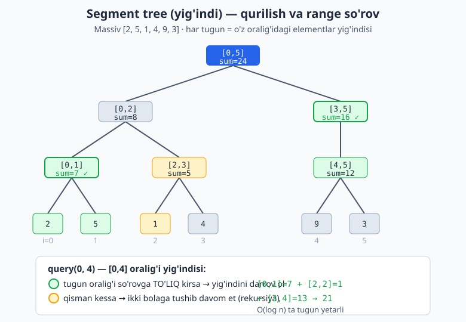

<a id="b24"></a>
# 24-bo'lim: Segment tree, Fenwick tree va range so'rovlar

<sub>[↑ Mundarijaga qaytish](README.md#mundarija)</sub>

> 📊 Bu bo'lim range (oraliq) so'rovlariga bag'ishlangan: massivning bir qismidagi yig'indi, minimum, maksimum yoki GCD ni tez topish va elementlarni yangilash. Asosiy vositalar: prefiks yig'indi (statik), difference array (range update), Fenwick (BIT) tree va segment tree (lazy propagation bilan). Murakkablikda `n` — massiv uzunligi, so'rovlar odatda O(log n).

<a id="m337"></a>
### 337. Prefiks yig'indi (prefix sum)
Massiv uchun prefiks yig'indi tayyorlab, ixtiyoriy `[l, r]` oralig'i yig'indisini O(1) da qaytaramiz.
`⏱ build O(n), query O(1) · 💾 O(n)`

**JS**
```js
const buildPrefix = (nums) => {
  const pre = [0];
  for (let i = 0; i < nums.length; i++) pre.push(pre[i] + nums[i]);
  return pre;
};

// [l, r] inklyuziv yig'indi
const rangeSum = (pre, l, r) => pre[r + 1] - pre[l];
```
**PHP**
```php
function buildPrefix(array $nums): array {
    $pre = [0];
    foreach ($nums as $i => $v) $pre[] = $pre[$i] + $v;
    return $pre;
}

function rangeSum(array $pre, int $l, int $r): int {
    return $pre[$r + 1] - $pre[$l];
}
```
**Python**
```python
def build_prefix(nums):
    pre = [0]
    for v in nums:
        pre.append(pre[-1] + v)
    return pre

def range_sum(pre, l, r):
    return pre[r + 1] - pre[l]
```

<a id="m338"></a>
### 338. 2D prefiks yig'indi
Matritsa uchun 2D prefiks yig'indi; har qanday to'rtburchak `(r1,c1)..(r2,c2)` yig'indisini O(1) da topamiz.
`⏱ build O(m·n), query O(1) · 💾 O(m·n)`

**JS**
```js
const build2D = (mat) => {
  const m = mat.length, n = mat[0].length;
  const pre = Array.from({ length: m + 1 }, () => Array(n + 1).fill(0));
  for (let i = 0; i < m; i++)
    for (let j = 0; j < n; j++)
      pre[i + 1][j + 1] = mat[i][j] + pre[i][j + 1] + pre[i + 1][j] - pre[i][j];
  return pre;
};

const sumRegion = (pre, r1, c1, r2, c2) =>
  pre[r2 + 1][c2 + 1] - pre[r1][c2 + 1] - pre[r2 + 1][c1] + pre[r1][c1];
```
**PHP**
```php
function build2D(array $mat): array {
    $m = count($mat); $n = count($mat[0]);
    $pre = array_fill(0, $m + 1, array_fill(0, $n + 1, 0));
    for ($i = 0; $i < $m; $i++)
        for ($j = 0; $j < $n; $j++)
            $pre[$i + 1][$j + 1] = $mat[$i][$j] + $pre[$i][$j + 1]
                + $pre[$i + 1][$j] - $pre[$i][$j];
    return $pre;
}

function sumRegion(array $pre, int $r1, int $c1, int $r2, int $c2): int {
    return $pre[$r2 + 1][$c2 + 1] - $pre[$r1][$c2 + 1]
        - $pre[$r2 + 1][$c1] + $pre[$r1][$c1];
}
```
**Python**
```python
def build_2d(mat):
    m, n = len(mat), len(mat[0])
    pre = [[0] * (n + 1) for _ in range(m + 1)]
    for i in range(m):
        for j in range(n):
            pre[i + 1][j + 1] = mat[i][j] + pre[i][j + 1] + pre[i + 1][j] - pre[i][j]
    return pre

def sum_region(pre, r1, c1, r2, c2):
    return pre[r2 + 1][c2 + 1] - pre[r1][c2 + 1] - pre[r2 + 1][c1] + pre[r1][c1]
```

<a id="m339"></a>
### 339. Range Sum Query — Immutable
Massiv o'zgarmaganda ko'p marta `[l, r]` yig'indisini so'raydigan klass (prefiks yig'indi asosida).
`⏱ build O(n), sumRange O(1) · 💾 O(n)`

**JS**
```js
class NumArray {
  constructor(nums) {
    this.pre = [0];
    for (const v of nums) this.pre.push(this.pre[this.pre.length - 1] + v);
  }
  sumRange(l, r) {
    return this.pre[r + 1] - this.pre[l];
  }
}
```
**PHP**
```php
class NumArray {
    private array $pre;
    public function __construct(array $nums) {
        $this->pre = [0];
        foreach ($nums as $v) $this->pre[] = end($this->pre) + $v;
    }
    public function sumRange(int $l, int $r): int {
        return $this->pre[$r + 1] - $this->pre[$l];
    }
}
```
**Python**
```python
from itertools import accumulate

class NumArray:
    def __init__(self, nums):
        self.pre = [0] + list(accumulate(nums))

    def sum_range(self, l, r):
        return self.pre[r + 1] - self.pre[l]
```

<a id="m340"></a>
### 340. Difference array (range update)
Difference array yordamida `[l, r]` oraliqning har bir elementiga `val` ni O(1) da qo'shamiz; oxirida massivni tiklaymiz.
`⏱ har update O(1), tiklash O(n) · 💾 O(n)`

**JS**
```js
const applyRangeUpdates = (n, updates) => {
  const diff = Array(n + 1).fill(0);
  for (const [l, r, val] of updates) {
    diff[l] += val;
    diff[r + 1] -= val;
  }
  const res = Array(n).fill(0);
  let run = 0;
  for (let i = 0; i < n; i++) {
    run += diff[i];
    res[i] = run;
  }
  return res;
};
```
**PHP**
```php
function applyRangeUpdates(int $n, array $updates): array {
    $diff = array_fill(0, $n + 1, 0);
    foreach ($updates as [$l, $r, $val]) {
        $diff[$l] += $val;
        $diff[$r + 1] -= $val;
    }
    $res = []; $run = 0;
    for ($i = 0; $i < $n; $i++) {
        $run += $diff[$i];
        $res[$i] = $run;
    }
    return $res;
}
```
**Python**
```python
def apply_range_updates(n, updates):
    diff = [0] * (n + 1)
    for l, r, val in updates:
        diff[l] += val
        diff[r + 1] -= val
    res, run = [], 0
    for i in range(n):
        run += diff[i]
        res.append(run)
    return res
```

<a id="m341"></a>
### 341. Range Sum Query — Mutable (BIT)
Fenwick tree (BIT) yordamida point update va prefiks yig'indi so'rovi; `[l, r]` yig'indisi farq orqali topiladi.
`⏱ update O(log n), query O(log n) · 💾 O(n)`

**JS**
```js
class NumArrayBIT {
  constructor(nums) {
    this.n = nums.length;
    this.tree = Array(this.n + 1).fill(0);
    this.nums = Array(this.n).fill(0);
    nums.forEach((v, i) => this.update(i, v));
  }
  update(i, val) {
    const delta = val - this.nums[i];
    this.nums[i] = val;
    for (let x = i + 1; x <= this.n; x += x & -x) this.tree[x] += delta;
  }
  prefix(i) {
    let s = 0;
    for (let x = i; x > 0; x -= x & -x) s += this.tree[x];
    return s;
  }
  sumRange(l, r) {
    return this.prefix(r + 1) - this.prefix(l);
  }
}
```
**PHP**
```php
class NumArrayBIT {
    private int $n;
    private array $tree;
    private array $nums;
    public function __construct(array $nums) {
        $this->n = count($nums);
        $this->tree = array_fill(0, $this->n + 1, 0);
        $this->nums = array_fill(0, $this->n, 0);
        foreach ($nums as $i => $v) $this->update($i, $v);
    }
    public function update(int $i, int $val): void {
        $delta = $val - $this->nums[$i];
        $this->nums[$i] = $val;
        for ($x = $i + 1; $x <= $this->n; $x += $x & -$x) $this->tree[$x] += $delta;
    }
    public function prefix(int $i): int {
        $s = 0;
        for ($x = $i; $x > 0; $x -= $x & -$x) $s += $this->tree[$x];
        return $s;
    }
    public function sumRange(int $l, int $r): int {
        return $this->prefix($r + 1) - $this->prefix($l);
    }
}
```
**Python**
```python
class NumArrayBIT:
    def __init__(self, nums):
        self.n = len(nums)
        self.tree = [0] * (self.n + 1)
        self.nums = [0] * self.n
        for i, v in enumerate(nums):
            self.update(i, v)

    def update(self, i, val):
        delta = val - self.nums[i]
        self.nums[i] = val
        x = i + 1
        while x <= self.n:
            self.tree[x] += delta
            x += x & -x

    def prefix(self, i):
        s = 0
        while i > 0:
            s += self.tree[i]
            i -= i & -i
        return s

    def sum_range(self, l, r):
        return self.prefix(r + 1) - self.prefix(l)
```

<a id="m342"></a>
### 342. Fenwick (BIT) tree klass
Umumiy Fenwick tree: `add(i, delta)` va prefiks yig'indi `query(i)` (1-indeksli ichki ifoda).
`⏱ add O(log n), query O(log n) · 💾 O(n)`

**JS**
```js
class Fenwick {
  constructor(n) {
    this.n = n;
    this.tree = Array(n + 1).fill(0);
  }
  add(i, delta) {
    for (let x = i + 1; x <= this.n; x += x & -x) this.tree[x] += delta;
  }
  // [0, i] prefiks yig'indi
  query(i) {
    let s = 0;
    for (let x = i + 1; x > 0; x -= x & -x) s += this.tree[x];
    return s;
  }
}
```
**PHP**
```php
class Fenwick {
    private int $n;
    private array $tree;
    public function __construct(int $n) {
        $this->n = $n;
        $this->tree = array_fill(0, $n + 1, 0);
    }
    public function add(int $i, int $delta): void {
        for ($x = $i + 1; $x <= $this->n; $x += $x & -$x) $this->tree[$x] += $delta;
    }
    public function query(int $i): int {
        $s = 0;
        for ($x = $i + 1; $x > 0; $x -= $x & -$x) $s += $this->tree[$x];
        return $s;
    }
}
```
**Python**
```python
class Fenwick:
    def __init__(self, n):
        self.n = n
        self.tree = [0] * (n + 1)

    def add(self, i, delta):
        x = i + 1
        while x <= self.n:
            self.tree[x] += delta
            x += x & -x

    def query(self, i):
        s, x = 0, i + 1
        while x > 0:
            s += self.tree[x]
            x -= x & -x
        return s
```

<a id="m343"></a>
### 343. BIT bilan range update + point query
Difference g'oyasini BIT bilan: `[l, r]` ga `val` qo'shamiz, keyin istalgan indeks qiymatini O(log n) da o'qiymiz.
`⏱ rangeUpdate O(log n), pointQuery O(log n) · 💾 O(n)`

**JS**
```js
class RangeBIT {
  constructor(n) {
    this.n = n;
    this.tree = Array(n + 2).fill(0);
  }
  _add(i, delta) {
    for (let x = i + 1; x <= this.n; x += x & -x) this.tree[x] += delta;
  }
  rangeUpdate(l, r, val) {
    this._add(l, val);
    this._add(r + 1, -val);
  }
  pointQuery(i) {
    let s = 0;
    for (let x = i + 1; x > 0; x -= x & -x) s += this.tree[x];
    return s;
  }
}
```
**PHP**
```php
class RangeBIT {
    private int $n;
    private array $tree;
    public function __construct(int $n) {
        $this->n = $n;
        $this->tree = array_fill(0, $n + 2, 0);
    }
    private function addAt(int $i, int $delta): void {
        for ($x = $i + 1; $x <= $this->n; $x += $x & -$x) $this->tree[$x] += $delta;
    }
    public function rangeUpdate(int $l, int $r, int $val): void {
        $this->addAt($l, $val);
        $this->addAt($r + 1, -$val);
    }
    public function pointQuery(int $i): int {
        $s = 0;
        for ($x = $i + 1; $x > 0; $x -= $x & -$x) $s += $this->tree[$x];
        return $s;
    }
}
```
**Python**
```python
class RangeBIT:
    def __init__(self, n):
        self.n = n
        self.tree = [0] * (n + 2)

    def _add(self, i, delta):
        x = i + 1
        while x <= self.n:
            self.tree[x] += delta
            x += x & -x

    def range_update(self, l, r, val):
        self._add(l, val)
        self._add(r + 1, -val)

    def point_query(self, i):
        s, x = 0, i + 1
        while x > 0:
            s += self.tree[x]
            x -= x & -x
        return s
```

<a id="m344"></a>
### 344. Segment tree (build / query / update — yig'indi)
Klassik yig'indi segment tree: massivdan quramiz, `[l, r]` yig'indisini va point update ni O(log n) da bajaramiz.
`⏱ build O(n), query/update O(log n) · 💾 O(n)`

**JS**
```js
class SumSegTree {
  constructor(nums) {
    this.n = nums.length;
    this.t = Array(2 * this.n).fill(0);
    for (let i = 0; i < this.n; i++) this.t[this.n + i] = nums[i];
    for (let i = this.n - 1; i > 0; i--) this.t[i] = this.t[2 * i] + this.t[2 * i + 1];
  }
  update(i, val) {
    let x = i + this.n;
    this.t[x] = val;
    for (x = Math.floor(x / 2); x > 0; x = Math.floor(x / 2))
      this.t[x] = this.t[2 * x] + this.t[2 * x + 1];
  }
  // [l, r] inklyuziv yig'indi
  query(l, r) {
    let res = 0;
    for (l += this.n, r += this.n + 1; l < r; l = Math.floor(l / 2), r = Math.floor(r / 2)) {
      if (l & 1) res += this.t[l++];
      if (r & 1) res += this.t[--r];
    }
    return res;
  }
}
```
**PHP**
```php
class SumSegTree {
    private int $n;
    private array $t;
    public function __construct(array $nums) {
        $this->n = count($nums);
        $this->t = array_fill(0, 2 * $this->n, 0);
        for ($i = 0; $i < $this->n; $i++) $this->t[$this->n + $i] = $nums[$i];
        for ($i = $this->n - 1; $i > 0; $i--)
            $this->t[$i] = $this->t[2 * $i] + $this->t[2 * $i + 1];
    }
    public function update(int $i, int $val): void {
        $x = $i + $this->n;
        $this->t[$x] = $val;
        for ($x = intdiv($x, 2); $x > 0; $x = intdiv($x, 2))
            $this->t[$x] = $this->t[2 * $x] + $this->t[2 * $x + 1];
    }
    public function query(int $l, int $r): int {
        $res = 0;
        for ($l += $this->n, $r += $this->n + 1; $l < $r; $l = intdiv($l, 2), $r = intdiv($r, 2)) {
            if ($l & 1) $res += $this->t[$l++];
            if ($r & 1) $res += $this->t[--$r];
        }
        return $res;
    }
}
```
**Python**
```python
class SumSegTree:
    def __init__(self, nums):
        self.n = len(nums)
        self.t = [0] * (2 * self.n)
        self.t[self.n:] = nums
        for i in range(self.n - 1, 0, -1):
            self.t[i] = self.t[2 * i] + self.t[2 * i + 1]

    def update(self, i, val):
        x = i + self.n
        self.t[x] = val
        x //= 2
        while x:
            self.t[x] = self.t[2 * x] + self.t[2 * x + 1]
            x //= 2

    def query(self, l, r):
        res = 0
        l, r = l + self.n, r + self.n + 1
        while l < r:
            if l & 1:
                res += self.t[l]
                l += 1
            if r & 1:
                r -= 1
                res += self.t[r]
            l //= 2
            r //= 2
        return res
```

Diagrammada segment tree tuzilishi ko'rsatilgan: har bir tugun bitta oraliq yig'indisini saqlaydi, range so'rovi esa to'liq qamralgan tugunlarni qo'shib, O(log n) tugun bilan javob beradi.



<a id="m345"></a>
### 345. Segment tree (min)
Minimum segment tree: `[l, r]` oraliqdagi eng kichik elementni va point update ni qo'llab-quvvatlaydi.
`⏱ build O(n), query/update O(log n) · 💾 O(n)`

**JS**
```js
class MinSegTree {
  constructor(nums) {
    this.n = nums.length;
    this.INF = Infinity;
    this.t = Array(2 * this.n).fill(this.INF);
    for (let i = 0; i < this.n; i++) this.t[this.n + i] = nums[i];
    for (let i = this.n - 1; i > 0; i--)
      this.t[i] = Math.min(this.t[2 * i], this.t[2 * i + 1]);
  }
  update(i, val) {
    let x = i + this.n;
    this.t[x] = val;
    for (x = Math.floor(x / 2); x > 0; x = Math.floor(x / 2))
      this.t[x] = Math.min(this.t[2 * x], this.t[2 * x + 1]);
  }
  query(l, r) {
    let res = this.INF;
    for (l += this.n, r += this.n + 1; l < r; l = Math.floor(l / 2), r = Math.floor(r / 2)) {
      if (l & 1) res = Math.min(res, this.t[l++]);
      if (r & 1) res = Math.min(res, this.t[--r]);
    }
    return res;
  }
}
```
**PHP**
```php
class MinSegTree {
    private int $n;
    private array $t;
    public function __construct(array $nums) {
        $this->n = count($nums);
        $this->t = array_fill(0, 2 * $this->n, PHP_INT_MAX);
        for ($i = 0; $i < $this->n; $i++) $this->t[$this->n + $i] = $nums[$i];
        for ($i = $this->n - 1; $i > 0; $i--)
            $this->t[$i] = min($this->t[2 * $i], $this->t[2 * $i + 1]);
    }
    public function update(int $i, int $val): void {
        $x = $i + $this->n;
        $this->t[$x] = $val;
        for ($x = intdiv($x, 2); $x > 0; $x = intdiv($x, 2))
            $this->t[$x] = min($this->t[2 * $x], $this->t[2 * $x + 1]);
    }
    public function query(int $l, int $r): int {
        $res = PHP_INT_MAX;
        for ($l += $this->n, $r += $this->n + 1; $l < $r; $l = intdiv($l, 2), $r = intdiv($r, 2)) {
            if ($l & 1) $res = min($res, $this->t[$l++]);
            if ($r & 1) $res = min($res, $this->t[--$r]);
        }
        return $res;
    }
}
```
**Python**
```python
class MinSegTree:
    def __init__(self, nums):
        self.n = len(nums)
        self.t = [float("inf")] * (2 * self.n)
        self.t[self.n:] = nums
        for i in range(self.n - 1, 0, -1):
            self.t[i] = min(self.t[2 * i], self.t[2 * i + 1])

    def update(self, i, val):
        x = i + self.n
        self.t[x] = val
        x //= 2
        while x:
            self.t[x] = min(self.t[2 * x], self.t[2 * x + 1])
            x //= 2

    def query(self, l, r):
        res = float("inf")
        l, r = l + self.n, r + self.n + 1
        while l < r:
            if l & 1:
                res = min(res, self.t[l])
                l += 1
            if r & 1:
                r -= 1
                res = min(res, self.t[r])
            l //= 2
            r //= 2
        return res
```

<a id="m346"></a>
### 346. Segment tree (max)
Maksimum segment tree: 345-masaladagi min daraxtning aynan analogi, faqat `max` bilan.
`⏱ build O(n), query/update O(log n) · 💾 O(n)`

**JS**
```js
class MaxSegTree {
  constructor(nums) {
    this.n = nums.length;
    this.NEG = -Infinity;
    this.t = Array(2 * this.n).fill(this.NEG);
    for (let i = 0; i < this.n; i++) this.t[this.n + i] = nums[i];
    for (let i = this.n - 1; i > 0; i--)
      this.t[i] = Math.max(this.t[2 * i], this.t[2 * i + 1]);
  }
  update(i, val) {
    let x = i + this.n;
    this.t[x] = val;
    for (x = Math.floor(x / 2); x > 0; x = Math.floor(x / 2))
      this.t[x] = Math.max(this.t[2 * x], this.t[2 * x + 1]);
  }
  query(l, r) {
    let res = this.NEG;
    for (l += this.n, r += this.n + 1; l < r; l = Math.floor(l / 2), r = Math.floor(r / 2)) {
      if (l & 1) res = Math.max(res, this.t[l++]);
      if (r & 1) res = Math.max(res, this.t[--r]);
    }
    return res;
  }
}
```
**PHP**
```php
class MaxSegTree {
    private int $n;
    private array $t;
    public function __construct(array $nums) {
        $this->n = count($nums);
        $this->t = array_fill(0, 2 * $this->n, PHP_INT_MIN);
        for ($i = 0; $i < $this->n; $i++) $this->t[$this->n + $i] = $nums[$i];
        for ($i = $this->n - 1; $i > 0; $i--)
            $this->t[$i] = max($this->t[2 * $i], $this->t[2 * $i + 1]);
    }
    public function update(int $i, int $val): void {
        $x = $i + $this->n;
        $this->t[$x] = $val;
        for ($x = intdiv($x, 2); $x > 0; $x = intdiv($x, 2))
            $this->t[$x] = max($this->t[2 * $x], $this->t[2 * $x + 1]);
    }
    public function query(int $l, int $r): int {
        $res = PHP_INT_MIN;
        for ($l += $this->n, $r += $this->n + 1; $l < $r; $l = intdiv($l, 2), $r = intdiv($r, 2)) {
            if ($l & 1) $res = max($res, $this->t[$l++]);
            if ($r & 1) $res = max($res, $this->t[--$r]);
        }
        return $res;
    }
}
```
**Python**
```python
class MaxSegTree:
    def __init__(self, nums):
        self.n = len(nums)
        self.t = [float("-inf")] * (2 * self.n)
        self.t[self.n:] = nums
        for i in range(self.n - 1, 0, -1):
            self.t[i] = max(self.t[2 * i], self.t[2 * i + 1])

    def update(self, i, val):
        x = i + self.n
        self.t[x] = val
        x //= 2
        while x:
            self.t[x] = max(self.t[2 * x], self.t[2 * x + 1])
            x //= 2

    def query(self, l, r):
        res = float("-inf")
        l, r = l + self.n, r + self.n + 1
        while l < r:
            if l & 1:
                res = max(res, self.t[l])
                l += 1
            if r & 1:
                r -= 1
                res = max(res, self.t[r])
            l //= 2
            r //= 2
        return res
```

<a id="m347"></a>
### 347. Lazy propagation (range update + range query)
Rekursiv segment tree: `[l, r]` ga qiymat qo'shish va `[l, r]` yig'indisini olish — ikkalasi ham O(log n), lazy bayroqlar bilan.
`⏱ build O(n), update/query O(log n) · 💾 O(n)`

**JS**
```js
class LazySegTree {
  constructor(nums) {
    this.n = nums.length;
    this.t = Array(4 * this.n).fill(0);
    this.lazy = Array(4 * this.n).fill(0);
    this._build(nums, 1, 0, this.n - 1);
  }
  _build(a, node, lo, hi) {
    if (lo === hi) { this.t[node] = a[lo]; return; }
    const mid = (lo + hi) >> 1;
    this._build(a, 2 * node, lo, mid);
    this._build(a, 2 * node + 1, mid + 1, hi);
    this.t[node] = this.t[2 * node] + this.t[2 * node + 1];
  }
  _push(node, lo, hi) {
    if (this.lazy[node] === 0) return;
    this.t[node] += (hi - lo + 1) * this.lazy[node];
    if (lo !== hi) {
      this.lazy[2 * node] += this.lazy[node];
      this.lazy[2 * node + 1] += this.lazy[node];
    }
    this.lazy[node] = 0;
  }
  update(l, r, val, node = 1, lo = 0, hi = this.n - 1) {
    this._push(node, lo, hi);
    if (r < lo || hi < l) return;
    if (l <= lo && hi <= r) {
      this.lazy[node] += val;
      this._push(node, lo, hi);
      return;
    }
    const mid = (lo + hi) >> 1;
    this.update(l, r, val, 2 * node, lo, mid);
    this.update(l, r, val, 2 * node + 1, mid + 1, hi);
    this.t[node] = this.t[2 * node] + this.t[2 * node + 1];
  }
  query(l, r, node = 1, lo = 0, hi = this.n - 1) {
    this._push(node, lo, hi);
    if (r < lo || hi < l) return 0;
    if (l <= lo && hi <= r) return this.t[node];
    const mid = (lo + hi) >> 1;
    return this.query(l, r, 2 * node, lo, mid) + this.query(l, r, 2 * node + 1, mid + 1, hi);
  }
}
```
**Python**
```python
class LazySegTree:
    def __init__(self, nums):
        self.n = len(nums)
        self.t = [0] * (4 * self.n)
        self.lazy = [0] * (4 * self.n)
        self._build(nums, 1, 0, self.n - 1)

    def _build(self, a, node, lo, hi):
        if lo == hi:
            self.t[node] = a[lo]
            return
        mid = (lo + hi) // 2
        self._build(a, 2 * node, lo, mid)
        self._build(a, 2 * node + 1, mid + 1, hi)
        self.t[node] = self.t[2 * node] + self.t[2 * node + 1]

    def _push(self, node, lo, hi):
        if self.lazy[node] == 0:
            return
        self.t[node] += (hi - lo + 1) * self.lazy[node]
        if lo != hi:
            self.lazy[2 * node] += self.lazy[node]
            self.lazy[2 * node + 1] += self.lazy[node]
        self.lazy[node] = 0

    def update(self, l, r, val, node=1, lo=0, hi=None):
        if hi is None:
            hi = self.n - 1
        self._push(node, lo, hi)
        if r < lo or hi < l:
            return
        if l <= lo and hi <= r:
            self.lazy[node] += val
            self._push(node, lo, hi)
            return
        mid = (lo + hi) // 2
        self.update(l, r, val, 2 * node, lo, mid)
        self.update(l, r, val, 2 * node + 1, mid + 1, hi)
        self.t[node] = self.t[2 * node] + self.t[2 * node + 1]

    def query(self, l, r, node=1, lo=0, hi=None):
        if hi is None:
            hi = self.n - 1
        self._push(node, lo, hi)
        if r < lo or hi < l:
            return 0
        if l <= lo and hi <= r:
            return self.t[node]
        mid = (lo + hi) // 2
        return (self.query(l, r, 2 * node, lo, mid)
                + self.query(l, r, 2 * node + 1, mid + 1, hi))
```

<a id="m348"></a>
### 348. Range Minimum Query (RMQ)
Berilgan so'rovlar ro'yxati uchun har bir `[l, r]` oraliqdagi minimumni min segment tree (345-masala) bilan qaytaramiz.
`⏱ har query O(log n) · 💾 O(n)`

**JS**
```js
// MinSegTree 345-masaladan
const rmq = (nums, queries) => {
  const seg = new MinSegTree(nums);
  return queries.map(([l, r]) => seg.query(l, r));
};
```
**Python**
```python
# MinSegTree 345-masaladan
def rmq(nums, queries):
    seg = MinSegTree(nums)
    return [seg.query(l, r) for l, r in queries]
```

<a id="m349"></a>
### 349. Sparse table (RMQ, statik)
O'zgarmas massivda RMQ: sparse table'ni O(n log n) da quramiz, har bir so'rovni O(1) da javob beramiz.
`⏱ build O(n log n), query O(1) · 💾 O(n log n)`

**JS**
```js
class SparseTable {
  constructor(nums) {
    this.n = nums.length;
    const K = Math.floor(Math.log2(this.n)) + 1;
    this.log = Array(this.n + 1).fill(0);
    for (let i = 2; i <= this.n; i++) this.log[i] = this.log[i >> 1] + 1;
    this.sp = Array.from({ length: K }, () => Array(this.n).fill(0));
    this.sp[0] = [...nums];
    for (let j = 1; j < K; j++)
      for (let i = 0; i + (1 << j) <= this.n; i++)
        this.sp[j][i] = Math.min(this.sp[j - 1][i], this.sp[j - 1][i + (1 << (j - 1))]);
  }
  // [l, r] minimum
  query(l, r) {
    const j = this.log[r - l + 1];
    return Math.min(this.sp[j][l], this.sp[j][r - (1 << j) + 1]);
  }
}
```
**Python**
```python
from math import log2, floor

class SparseTable:
    def __init__(self, nums):
        self.n = len(nums)
        k = floor(log2(self.n)) + 1
        self.log = [0] * (self.n + 1)
        for i in range(2, self.n + 1):
            self.log[i] = self.log[i >> 1] + 1
        self.sp = [list(nums)] + [[0] * self.n for _ in range(k - 1)]
        for j in range(1, k):
            i = 0
            while i + (1 << j) <= self.n:
                self.sp[j][i] = min(self.sp[j - 1][i], self.sp[j - 1][i + (1 << (j - 1))])
                i += 1

    def query(self, l, r):
        j = self.log[r - l + 1]
        return min(self.sp[j][l], self.sp[j][r - (1 << j) + 1])
```

<a id="m350"></a>
### 350. Inversiyalar soni (BIT)
Massivdagi inversiyalar (i < j, lekin a[i] > a[j]) sonini koordinata siqish + BIT bilan sanaymiz.
`⏱ O(n log n) · 💾 O(n)`

**JS**
```js
const countInversionsBIT = (nums) => {
  const sorted = [...new Set(nums)].sort((a, b) => a - b);
  const rank = new Map(sorted.map((v, i) => [v, i + 1]));
  const m = sorted.length;
  const tree = Array(m + 1).fill(0);
  const add = (i) => { for (let x = i; x <= m; x += x & -x) tree[x]++; };
  const sum = (i) => { let s = 0; for (let x = i; x > 0; x -= x & -x) s += tree[x]; return s; };
  let inv = 0, seen = 0;
  for (const v of nums) {
    const r = rank.get(v);
    inv += seen - sum(r);      // hozirgacha qo'shilganlardan kattalari soni
    add(r);
    seen++;
  }
  return inv;
};
```
**Python**
```python
def count_inversions_bit(nums):
    sorted_vals = sorted(set(nums))
    rank = {v: i + 1 for i, v in enumerate(sorted_vals)}
    m = len(sorted_vals)
    tree = [0] * (m + 1)

    def add(i):
        while i <= m:
            tree[i] += 1
            i += i & -i

    def pref(i):
        s = 0
        while i > 0:
            s += tree[i]
            i -= i & -i
        return s

    inv = seen = 0
    for v in nums:
        r = rank[v]
        inv += seen - pref(r)
        add(r)
        seen += 1
    return inv
```

<a id="m351"></a>
### 351. Inversiyalar soni (merge sort)
O'sha masala merge sort orqali: birlashtirish bosqichida o'ngdan olingan har bir element chap qoldiq sonini inversiya sifatida sanaydi.
`⏱ O(n log n) · 💾 O(n)`

**JS**
```js
const countInversionsMerge = (nums) => {
  let count = 0;
  const sort = (arr) => {
    if (arr.length <= 1) return arr;
    const mid = arr.length >> 1;
    const left = sort(arr.slice(0, mid));
    const right = sort(arr.slice(mid));
    const merged = [];
    let i = 0, j = 0;
    while (i < left.length && j < right.length) {
      if (left[i] <= right[j]) merged.push(left[i++]);
      else { count += left.length - i; merged.push(right[j++]); }
    }
    return merged.concat(left.slice(i)).concat(right.slice(j));
  };
  sort(nums);
  return count;
};
```
**Python**
```python
def count_inversions_merge(nums):
    count = 0

    def sort(arr):
        nonlocal count
        if len(arr) <= 1:
            return arr
        mid = len(arr) // 2
        left, right = sort(arr[:mid]), sort(arr[mid:])
        merged, i, j = [], 0, 0
        while i < len(left) and j < len(right):
            if left[i] <= right[j]:
                merged.append(left[i]); i += 1
            else:
                count += len(left) - i
                merged.append(right[j]); j += 1
        merged.extend(left[i:])
        merged.extend(right[j:])
        return merged

    sort(nums)
    return count
```

<a id="m352"></a>
### 352. Count of Smaller Numbers After Self
Har bir element uchun o'zidan keyin keladigan kichikroq elementlar sonini hisoblaymiz (o'ngdan BIT bilan).
`⏱ O(n log n) · 💾 O(n)`

**JS**
```js
const countSmaller = (nums) => {
  const sorted = [...new Set(nums)].sort((a, b) => a - b);
  const rank = new Map(sorted.map((v, i) => [v, i + 1]));
  const m = sorted.length;
  const tree = Array(m + 1).fill(0);
  const add = (i) => { for (let x = i; x <= m; x += x & -x) tree[x]++; };
  const sum = (i) => { let s = 0; for (let x = i; x > 0; x -= x & -x) s += tree[x]; return s; };
  const res = Array(nums.length).fill(0);
  for (let i = nums.length - 1; i >= 0; i--) {
    const r = rank.get(nums[i]);
    res[i] = sum(r - 1);   // hozirgacha ko'rilganlardan kichiklari
    add(r);
  }
  return res;
};
```
**Python**
```python
def count_smaller(nums):
    sorted_vals = sorted(set(nums))
    rank = {v: i + 1 for i, v in enumerate(sorted_vals)}
    m = len(sorted_vals)
    tree = [0] * (m + 1)

    def add(i):
        while i <= m:
            tree[i] += 1
            i += i & -i

    def pref(i):
        s = 0
        while i > 0:
            s += tree[i]
            i -= i & -i
        return s

    res = [0] * len(nums)
    for i in range(len(nums) - 1, -1, -1):
        r = rank[nums[i]]
        res[i] = pref(r - 1)
        add(r)
    return res
```

<a id="m353"></a>
### 353. Kth smallest (BIT bilan frequency)
Qiymatlar chastota BIT'ida saqlanadi; kumulyativ yig'indi bo'yicha binary lifting bilan k-chi eng kichik qiymatni topamiz.
`⏱ build O(n), kth O(log M) · 💾 O(M)` (M — qiymatlar diapazoni)

**JS**
```js
class KthBIT {
  constructor(maxVal) {
    this.maxVal = maxVal;
    this.LOG = Math.floor(Math.log2(maxVal)) + 1;
    this.tree = Array(maxVal + 1).fill(0);
  }
  add(v, cnt = 1) {
    for (let x = v; x <= this.maxVal; x += x & -x) this.tree[x] += cnt;
  }
  // k-chi eng kichik qiymat (1-indeksli k)
  kth(k) {
    let pos = 0;
    for (let pw = 1 << this.LOG; pw > 0; pw >>= 1) {
      const next = pos + pw;
      if (next <= this.maxVal && this.tree[next] < k) {
        pos = next;
        k -= this.tree[next];
      }
    }
    return pos + 1;
  }
}
```
**Python**
```python
from math import log2, floor

class KthBIT:
    def __init__(self, max_val):
        self.max_val = max_val
        self.log = floor(log2(max_val)) + 1
        self.tree = [0] * (max_val + 1)

    def add(self, v, cnt=1):
        while v <= self.max_val:
            self.tree[v] += cnt
            v += v & -v

    def kth(self, k):
        pos = 0
        pw = 1 << self.log
        while pw > 0:
            nxt = pos + pw
            if nxt <= self.max_val and self.tree[nxt] < k:
                pos = nxt
                k -= self.tree[nxt]
            pw >>= 1
        return pos + 1
```

<a id="m354"></a>
### 354. Range GCD query
GCD segment tree: yig'indi o'rniga `gcd` saqlanadi; `[l, r]` oraliqdagi barcha sonlar GCD'sini O(log n) da topamiz.
`⏱ build O(n log V), query O(log n) · 💾 O(n)`

**JS**
```js
const gcd = (a, b) => { while (b) [a, b] = [b, a % b]; return Math.abs(a); };

class GcdSegTree {
  constructor(nums) {
    this.n = nums.length;
    this.t = Array(2 * this.n).fill(0);
    for (let i = 0; i < this.n; i++) this.t[this.n + i] = nums[i];
    for (let i = this.n - 1; i > 0; i--) this.t[i] = gcd(this.t[2 * i], this.t[2 * i + 1]);
  }
  query(l, r) {
    let res = 0;
    for (l += this.n, r += this.n + 1; l < r; l = Math.floor(l / 2), r = Math.floor(r / 2)) {
      if (l & 1) res = gcd(res, this.t[l++]);
      if (r & 1) res = gcd(res, this.t[--r]);
    }
    return res;
  }
}
```
**Python**
```python
from math import gcd

class GcdSegTree:
    def __init__(self, nums):
        self.n = len(nums)
        self.t = [0] * (2 * self.n)
        self.t[self.n:] = nums
        for i in range(self.n - 1, 0, -1):
            self.t[i] = gcd(self.t[2 * i], self.t[2 * i + 1])

    def query(self, l, r):
        res = 0
        l, r = l + self.n, r + self.n + 1
        while l < r:
            if l & 1:
                res = gcd(res, self.t[l])
                l += 1
            if r & 1:
                r -= 1
                res = gcd(res, self.t[r])
            l //= 2
            r //= 2
        return res
```

<a id="m355"></a>
### 355. Range XOR query
Prefiks XOR: XOR'ning teskari amali o'zi bo'lgani uchun `[l, r]` XOR'i `pre[r+1] ^ pre[l]`.
`⏱ build O(n), query O(1) · 💾 O(n)`

**JS**
```js
class XorPrefix {
  constructor(nums) {
    this.pre = [0];
    for (const v of nums) this.pre.push(this.pre[this.pre.length - 1] ^ v);
  }
  // [l, r] XOR
  query(l, r) {
    return this.pre[r + 1] ^ this.pre[l];
  }
}
```
**PHP**
```php
class XorPrefix {
    private array $pre;
    public function __construct(array $nums) {
        $this->pre = [0];
        foreach ($nums as $v) $this->pre[] = end($this->pre) ^ $v;
    }
    public function query(int $l, int $r): int {
        return $this->pre[$r + 1] ^ $this->pre[$l];
    }
}
```
**Python**
```python
class XorPrefix:
    def __init__(self, nums):
        self.pre = [0]
        for v in nums:
            self.pre.append(self.pre[-1] ^ v)

    def query(self, l, r):
        return self.pre[r + 1] ^ self.pre[l]
```

<a id="m356"></a>
### 356. 2D BIT (range update / point query)
Ikki o'lchamli BIT: to'rtburchak oraliqqa qiymat qo'shish va nuqta qiymatini olish (2D difference g'oyasi).
`⏱ update O(log m·log n), query O(log m·log n) · 💾 O(m·n)`

**JS**
```js
class BIT2D {
  constructor(m, n) {
    this.m = m;
    this.n = n;
    this.tree = Array.from({ length: m + 1 }, () => Array(n + 1).fill(0));
  }
  _add(r, c, delta) {
    for (let i = r + 1; i <= this.m; i += i & -i)
      for (let j = c + 1; j <= this.n; j += j & -j)
        this.tree[i][j] += delta;
  }
  // (r1,c1)..(r2,c2) to'rtburchakka val qo'shish
  rangeUpdate(r1, c1, r2, c2, val) {
    this._add(r1, c1, val);
    this._add(r1, c2 + 1, -val);
    this._add(r2 + 1, c1, -val);
    this._add(r2 + 1, c2 + 1, val);
  }
  pointQuery(r, c) {
    let s = 0;
    for (let i = r + 1; i > 0; i -= i & -i)
      for (let j = c + 1; j > 0; j -= j & -j)
        s += this.tree[i][j];
    return s;
  }
}
```
**Python**
```python
class BIT2D:
    def __init__(self, m, n):
        self.m, self.n = m, n
        self.tree = [[0] * (n + 1) for _ in range(m + 1)]

    def _add(self, r, c, delta):
        i = r + 1
        while i <= self.m:
            j = c + 1
            while j <= self.n:
                self.tree[i][j] += delta
                j += j & -j
            i += i & -i

    def range_update(self, r1, c1, r2, c2, val):
        self._add(r1, c1, val)
        self._add(r1, c2 + 1, -val)
        self._add(r2 + 1, c1, -val)
        self._add(r2 + 1, c2 + 1, val)

    def point_query(self, r, c):
        s, i = 0, r + 1
        while i > 0:
            j = c + 1
            while j > 0:
                s += self.tree[i][j]
                j -= j & -j
            i -= i & -i
        return s
```

<a id="m357"></a>
### 357. My Calendar I
Har bir `[start, end)` intervalni qo'shamiz; agar mavjudlari bilan kesishsa, `false` qaytaramiz (oddiy chiziqli tekshiruv).
`⏱ har book O(n) · 💾 O(n)`

**JS**
```js
class MyCalendar {
  constructor() {
    this.events = [];
  }
  book(start, end) {
    for (const [s, e] of this.events)
      if (start < e && s < end) return false;
    this.events.push([start, end]);
    return true;
  }
}
```
**PHP**
```php
class MyCalendar {
    private array $events = [];
    public function book(int $start, int $end): bool {
        foreach ($this->events as [$s, $e])
            if ($start < $e && $s < $end) return false;
        $this->events[] = [$start, $end];
        return true;
    }
}
```
**Python**
```python
class MyCalendar:
    def __init__(self):
        self.events = []

    def book(self, start, end):
        for s, e in self.events:
            if start < e and s < end:
                return False
        self.events.append((start, end))
        return True
```

<a id="m358"></a>
### 358. My Calendar II
Bron qilish faqat uchlik (triple) bron hosil bo'lmasa qabul qilinadi; ikkilik kesishishlarni alohida saqlaymiz.
`⏱ har book O(n) · 💾 O(n)`

**JS**
```js
class MyCalendarTwo {
  constructor() {
    this.events = [];
    this.overlaps = [];
  }
  book(start, end) {
    for (const [s, e] of this.overlaps)
      if (start < e && s < end) return false;
    for (const [s, e] of this.events)
      if (start < e && s < end) this.overlaps.push([Math.max(start, s), Math.min(end, e)]);
    this.events.push([start, end]);
    return true;
  }
}
```
**Python**
```python
class MyCalendarTwo:
    def __init__(self):
        self.events = []
        self.overlaps = []

    def book(self, start, end):
        for s, e in self.overlaps:
            if start < e and s < end:
                return False
        for s, e in self.events:
            if start < e and s < end:
                self.overlaps.append((max(start, s), min(end, e)))
        self.events.append((start, end))
        return True
```

<a id="m359"></a>
### 359. Range Module
Yarim ochiq `[left, right)` intervallarni qo'shish, o'chirish va to'liq qoplanishini tekshirish (saralangan chegaralar ro'yxati bilan).
`⏱ addRange/removeRange O(n), queryRange O(n) · 💾 O(n)`

**JS**
```js
class RangeModule {
  constructor() {
    this.ranges = []; // saralangan, kesishmaydigan [l, r)
  }
  addRange(left, right) {
    const res = [];
    let placed = false;
    for (const [l, r] of this.ranges) {
      if (r < left) res.push([l, r]);
      else if (right < l) {
        if (!placed) { res.push([left, right]); placed = true; }
        res.push([l, r]);
      } else {
        left = Math.min(left, l);
        right = Math.max(right, r);
      }
    }
    if (!placed) res.push([left, right]);
    this.ranges = res.sort((a, b) => a[0] - b[0]);
  }
  queryRange(left, right) {
    for (const [l, r] of this.ranges)
      if (l <= left && right <= r) return true;
    return false;
  }
  removeRange(left, right) {
    const res = [];
    for (const [l, r] of this.ranges) {
      if (r <= left || right <= l) res.push([l, r]);
      else {
        if (l < left) res.push([l, left]);
        if (right < r) res.push([right, r]);
      }
    }
    this.ranges = res;
  }
}
```
**Python**
```python
import bisect

class RangeModule:
    def __init__(self):
        self.points = []  # tekis saralangan chegaralar; juft indeks = interval boshi

    def addRange(self, left, right):
        i = bisect.bisect_left(self.points, left)
        j = bisect.bisect_right(self.points, right)
        new = []
        if i % 2 == 0:
            new.append(left)
        if j % 2 == 0:
            new.append(right)
        self.points[i:j] = new

    def queryRange(self, left, right):
        i = bisect.bisect_right(self.points, left)
        j = bisect.bisect_left(self.points, right)
        return i == j and i % 2 == 1

    def removeRange(self, left, right):
        i = bisect.bisect_left(self.points, left)
        j = bisect.bisect_right(self.points, right)
        new = []
        if i % 2 == 1:
            new.append(left)
        if j % 2 == 1:
            new.append(right)
        self.points[i:j] = new
```

<a id="m360"></a>
### 360. Count Range Sum
`lower <= sum(i..j) <= upper` shartni qanoatlantiruvchi oraliqlar sonini prefiks yig'indi + merge sort bilan sanaymiz.
`⏱ O(n log n) · 💾 O(n)`

**JS**
```js
const countRangeSum = (nums, lower, upper) => {
  const pre = [0];
  for (const v of nums) pre.push(pre[pre.length - 1] + v);
  let count = 0;
  const sort = (lo, hi) => {
    if (hi - lo <= 1) return;
    const mid = (lo + hi) >> 1;
    sort(lo, mid);
    sort(mid, hi);
    let j = mid, k = mid;
    for (let i = lo; i < mid; i++) {
      while (j < hi && pre[j] - pre[i] < lower) j++;
      while (k < hi && pre[k] - pre[i] <= upper) k++;
      count += k - j;
    }
    const merged = pre.slice(lo, hi).sort((a, b) => a - b);
    for (let i = 0; i < merged.length; i++) pre[lo + i] = merged[i];
  };
  sort(0, pre.length);
  return count;
};
```
**Python**
```python
def count_range_sum(nums, lower, upper):
    pre = [0]
    for v in nums:
        pre.append(pre[-1] + v)
    count = 0

    def sort(lo, hi):
        nonlocal count
        if hi - lo <= 1:
            return
        mid = (lo + hi) // 2
        sort(lo, mid)
        sort(mid, hi)
        j = k = mid
        for i in range(lo, mid):
            while j < hi and pre[j] - pre[i] < lower:
                j += 1
            while k < hi and pre[k] - pre[i] <= upper:
                k += 1
            count += k - j
        pre[lo:hi] = sorted(pre[lo:hi])

    sort(0, len(pre))
    return count
```

<a id="m361"></a>
### 361. Longest Increasing Subsequence (BIT bilan)
LIS uzunligini qiymatlar bo'yicha maksimum-BIT yordamida O(n log n) da topamiz (koordinata siqish bilan).
`⏱ O(n log n) · 💾 O(n)`

**JS**
```js
const lengthOfLISBIT = (nums) => {
  const sorted = [...new Set(nums)].sort((a, b) => a - b);
  const rank = new Map(sorted.map((v, i) => [v, i + 1]));
  const m = sorted.length;
  const tree = Array(m + 1).fill(0);
  const update = (i, val) => { for (let x = i; x <= m; x += x & -x) tree[x] = Math.max(tree[x], val); };
  const queryMax = (i) => { let mx = 0; for (let x = i; x > 0; x -= x & -x) mx = Math.max(mx, tree[x]); return mx; };
  let best = 0;
  for (const v of nums) {
    const r = rank.get(v);
    const len = queryMax(r - 1) + 1;   // o'zidan kichiklar ichidagi eng uzuni
    update(r, len);
    best = Math.max(best, len);
  }
  return best;
};
```
**Python**
```python
def length_of_lis_bit(nums):
    sorted_vals = sorted(set(nums))
    rank = {v: i + 1 for i, v in enumerate(sorted_vals)}
    m = len(sorted_vals)
    tree = [0] * (m + 1)

    def update(i, val):
        while i <= m:
            tree[i] = max(tree[i], val)
            i += i & -i

    def query_max(i):
        mx = 0
        while i > 0:
            mx = max(mx, tree[i])
            i -= i & -i
        return mx

    best = 0
    for v in nums:
        r = rank[v]
        length = query_max(r - 1) + 1
        update(r, length)
        best = max(best, length)
    return best
```

<a id="m362"></a>
### 362. Maximum Sum of 3 Non-Overlapping Subarrays
Uzunligi `k` bo'lgan uchta kesishmaydigan podmassiv yig'indisini maksimallashtiramiz; chap/o'ng eng yaxshi indekslar oldindan hisoblanadi.
`⏱ O(n) · 💾 O(n)`

**JS**
```js
const maxSumOfThreeSubarrays = (nums, k) => {
  const n = nums.length;
  const pre = [0];
  for (const v of nums) pre.push(pre[pre.length - 1] + v);
  const win = (i) => pre[i + k] - pre[i]; // i dan boshlangan oyna yig'indisi
  const total = n - k + 1;
  const left = Array(total).fill(0);
  const right = Array(total).fill(0);
  for (let i = 1; i < total; i++) left[i] = win(i) > win(left[i - 1]) ? i : left[i - 1];
  for (let i = total - 2; i >= 0; i--) right[i] = win(i) >= win(right[i + 1]) ? i : right[i + 1];
  let best = -1, res = [];
  for (let m = k; m + k < total + k; m++) {
    if (m + k > n - k) break;
    const l = left[m - k], r = right[m + k];
    const sum = win(l) + win(m) + win(r);
    if (sum > best) { best = sum; res = [l, m, r]; }
  }
  return res;
};
```
**Python**
```python
def max_sum_of_three_subarrays(nums, k):
    n = len(nums)
    pre = [0]
    for v in nums:
        pre.append(pre[-1] + v)

    def win(i):
        return pre[i + k] - pre[i]

    total = n - k + 1
    left = [0] * total
    right = [0] * total
    for i in range(1, total):
        left[i] = i if win(i) > win(left[i - 1]) else left[i - 1]
    for i in range(total - 2, -1, -1):
        right[i] = i if win(i) >= win(right[i + 1]) else right[i + 1]

    best, res = -1, []
    for m in range(k, total - k):
        l, r = left[m - k], right[m + k]
        s = win(l) + win(m) + win(r)
        if s > best:
            best, res = s, [l, m, r]
    return res
```

<a id="m363"></a>
### 363. Number of Longest Increasing Subsequence
Eng uzun o'suvchi qism ketma-ketliklar sonini DP bilan topamiz: har bir indeks uchun uzunlik va shu uzunlikdagi yo'llar soni saqlanadi.
`⏱ O(n²) · 💾 O(n)`

**JS**
```js
const findNumberOfLIS = (nums) => {
  const n = nums.length;
  if (n === 0) return 0;
  const len = Array(n).fill(1);
  const cnt = Array(n).fill(1);
  let maxLen = 1;
  for (let i = 0; i < n; i++) {
    for (let j = 0; j < i; j++) {
      if (nums[j] < nums[i]) {
        if (len[j] + 1 > len[i]) { len[i] = len[j] + 1; cnt[i] = cnt[j]; }
        else if (len[j] + 1 === len[i]) cnt[i] += cnt[j];
      }
    }
    maxLen = Math.max(maxLen, len[i]);
  }
  let res = 0;
  for (let i = 0; i < n; i++) if (len[i] === maxLen) res += cnt[i];
  return res;
};
```
**Python**
```python
def find_number_of_lis(nums):
    n = len(nums)
    if n == 0:
        return 0
    length = [1] * n
    count = [1] * n
    max_len = 1
    for i in range(n):
        for j in range(i):
            if nums[j] < nums[i]:
                if length[j] + 1 > length[i]:
                    length[i] = length[j] + 1
                    count[i] = count[j]
                elif length[j] + 1 == length[i]:
                    count[i] += count[j]
        max_len = max(max_len, length[i])
    return sum(c for l, c in zip(length, count) if l == max_len)
```

<a id="m364"></a>
### 364. Range Frequency Query
Berilgan qiymatning `[left, right]` oraliqdagi uchrash sonini topamiz: har bir qiymat indekslari saralangan, binary search bilan sanaymiz.
`⏱ build O(n), query O(log n) · 💾 O(n)`

**JS**
```js
class RangeFreqQuery {
  constructor(arr) {
    this.pos = new Map();
    arr.forEach((v, i) => {
      if (!this.pos.has(v)) this.pos.set(v, []);
      this.pos.get(v).push(i);
    });
  }
  // chap chegara: birinchi >= target
  _lowerBound(a, target) {
    let lo = 0, hi = a.length;
    while (lo < hi) {
      const mid = (lo + hi) >> 1;
      if (a[mid] < target) lo = mid + 1;
      else hi = mid;
    }
    return lo;
  }
  query(left, right, value) {
    const idx = this.pos.get(value);
    if (!idx) return 0;
    return this._lowerBound(idx, right + 1) - this._lowerBound(idx, left);
  }
}
```
**Python**
```python
import bisect
from collections import defaultdict

class RangeFreqQuery:
    def __init__(self, arr):
        self.pos = defaultdict(list)
        for i, v in enumerate(arr):
            self.pos[v].append(i)

    def query(self, left, right, value):
        idx = self.pos.get(value)
        if not idx:
            return 0
        return bisect.bisect_right(idx, right) - bisect.bisect_left(idx, left)
```

<a id="m365"></a>
### 365. Segment tree (assignment + sum)
Lazy propagation bilan "tayinlash" (range assign) operatsiyasi: `[l, r]` ni bitta qiymatga tenglashtirib, yig'indi so'rovini qo'llab-quvvatlaymiz.
`⏱ build O(n), assign/query O(log n) · 💾 O(n)`

**JS**
```js
class AssignSegTree {
  constructor(nums) {
    this.n = nums.length;
    this.t = Array(4 * this.n).fill(0);
    this.lazy = Array(4 * this.n).fill(null); // null = tayinlash yo'q
    this._build(nums, 1, 0, this.n - 1);
  }
  _build(a, node, lo, hi) {
    if (lo === hi) { this.t[node] = a[lo]; return; }
    const mid = (lo + hi) >> 1;
    this._build(a, 2 * node, lo, mid);
    this._build(a, 2 * node + 1, mid + 1, hi);
    this.t[node] = this.t[2 * node] + this.t[2 * node + 1];
  }
  _apply(node, lo, hi, val) {
    this.t[node] = (hi - lo + 1) * val;
    this.lazy[node] = val;
  }
  _push(node, lo, hi) {
    if (this.lazy[node] === null) return;
    const mid = (lo + hi) >> 1;
    this._apply(2 * node, lo, mid, this.lazy[node]);
    this._apply(2 * node + 1, mid + 1, hi, this.lazy[node]);
    this.lazy[node] = null;
  }
  assign(l, r, val, node = 1, lo = 0, hi = this.n - 1) {
    if (r < lo || hi < l) return;
    if (l <= lo && hi <= r) { this._apply(node, lo, hi, val); return; }
    this._push(node, lo, hi);
    const mid = (lo + hi) >> 1;
    this.assign(l, r, val, 2 * node, lo, mid);
    this.assign(l, r, val, 2 * node + 1, mid + 1, hi);
    this.t[node] = this.t[2 * node] + this.t[2 * node + 1];
  }
  query(l, r, node = 1, lo = 0, hi = this.n - 1) {
    if (r < lo || hi < l) return 0;
    if (l <= lo && hi <= r) return this.t[node];
    this._push(node, lo, hi);
    const mid = (lo + hi) >> 1;
    return this.query(l, r, 2 * node, lo, mid) + this.query(l, r, 2 * node + 1, mid + 1, hi);
  }
}
```
**Python**
```python
class AssignSegTree:
    def __init__(self, nums):
        self.n = len(nums)
        self.t = [0] * (4 * self.n)
        self.lazy = [None] * (4 * self.n)
        self._build(nums, 1, 0, self.n - 1)

    def _build(self, a, node, lo, hi):
        if lo == hi:
            self.t[node] = a[lo]
            return
        mid = (lo + hi) // 2
        self._build(a, 2 * node, lo, mid)
        self._build(a, 2 * node + 1, mid + 1, hi)
        self.t[node] = self.t[2 * node] + self.t[2 * node + 1]

    def _apply(self, node, lo, hi, val):
        self.t[node] = (hi - lo + 1) * val
        self.lazy[node] = val

    def _push(self, node, lo, hi):
        if self.lazy[node] is None:
            return
        mid = (lo + hi) // 2
        self._apply(2 * node, lo, mid, self.lazy[node])
        self._apply(2 * node + 1, mid + 1, hi, self.lazy[node])
        self.lazy[node] = None

    def assign(self, l, r, val, node=1, lo=0, hi=None):
        if hi is None:
            hi = self.n - 1
        if r < lo or hi < l:
            return
        if l <= lo and hi <= r:
            self._apply(node, lo, hi, val)
            return
        self._push(node, lo, hi)
        mid = (lo + hi) // 2
        self.assign(l, r, val, 2 * node, lo, mid)
        self.assign(l, r, val, 2 * node + 1, mid + 1, hi)
        self.t[node] = self.t[2 * node] + self.t[2 * node + 1]

    def query(self, l, r, node=1, lo=0, hi=None):
        if hi is None:
            hi = self.n - 1
        if r < lo or hi < l:
            return 0
        if l <= lo and hi <= r:
            return self.t[node]
        self._push(node, lo, hi)
        mid = (lo + hi) // 2
        return (self.query(l, r, 2 * node, lo, mid)
                + self.query(l, r, 2 * node + 1, mid + 1, hi))
```

<a id="m366"></a>
### 366. Persistent segment tree (oddiy g'oya)
Persistent (versiyalanadigan) segment tree: har bir point update yangi versiya ildizini qaytaradi, eski versiyalar saqlanib qoladi (yo'l bo'ylab tugunlar nusxalanadi).
`⏱ update O(log n), query O(log n) · 💾 har update O(log n)`

**JS**
```js
class PersistentSegTree {
  constructor(n) {
    this.n = n;
    this.left = [0];
    this.right = [0];
    this.sum = [0];
    this.roots = [this._build(0, n - 1)];
  }
  _newNode(l, r, s) {
    this.left.push(l);
    this.right.push(r);
    this.sum.push(s);
    return this.sum.length - 1;
  }
  _build(lo, hi) {
    if (lo === hi) return this._newNode(0, 0, 0);
    const mid = (lo + hi) >> 1;
    const l = this._build(lo, mid);
    const r = this._build(mid + 1, hi);
    return this._newNode(l, r, 0);
  }
  // prev versiya ildizidan yangi versiya quradi (a[pos] += val)
  update(prevRoot, pos, val, lo = 0, hi = this.n - 1) {
    if (lo === hi) return this._newNode(0, 0, this.sum[prevRoot] + val);
    const mid = (lo + hi) >> 1;
    let l = this.left[prevRoot], r = this.right[prevRoot];
    if (pos <= mid) l = this.update(l, pos, val, lo, mid);
    else r = this.update(r, pos, val, mid + 1, hi);
    return this._newNode(l, r, this.sum[l] + this.sum[r]);
  }
  addVersion(pos, val) {
    const last = this.roots[this.roots.length - 1];
    this.roots.push(this.update(last, pos, val));
    return this.roots.length - 1;
  }
  // version-versiyadagi [ql, qr] yig'indi
  query(root, ql, qr, lo = 0, hi = this.n - 1) {
    if (qr < lo || hi < ql) return 0;
    if (ql <= lo && hi <= qr) return this.sum[root];
    const mid = (lo + hi) >> 1;
    return this.query(this.left[root], ql, qr, lo, mid)
      + this.query(this.right[root], ql, qr, mid + 1, hi);
  }
}
```
**Python**
```python
class PersistentSegTree:
    def __init__(self, n):
        self.n = n
        self.left = [0]
        self.right = [0]
        self.sum = [0]
        self.roots = [self._build(0, n - 1)]

    def _new_node(self, l, r, s):
        self.left.append(l)
        self.right.append(r)
        self.sum.append(s)
        return len(self.sum) - 1

    def _build(self, lo, hi):
        if lo == hi:
            return self._new_node(0, 0, 0)
        mid = (lo + hi) // 2
        l = self._build(lo, mid)
        r = self._build(mid + 1, hi)
        return self._new_node(l, r, 0)

    def update(self, prev_root, pos, val, lo=0, hi=None):
        if hi is None:
            hi = self.n - 1
        if lo == hi:
            return self._new_node(0, 0, self.sum[prev_root] + val)
        mid = (lo + hi) // 2
        l, r = self.left[prev_root], self.right[prev_root]
        if pos <= mid:
            l = self.update(l, pos, val, lo, mid)
        else:
            r = self.update(r, pos, val, mid + 1, hi)
        return self._new_node(l, r, self.sum[l] + self.sum[r])

    def add_version(self, pos, val):
        last = self.roots[-1]
        self.roots.append(self.update(last, pos, val))
        return len(self.roots) - 1

    def query(self, root, ql, qr, lo=0, hi=None):
        if hi is None:
            hi = self.n - 1
        if qr < lo or hi < ql:
            return 0
        if ql <= lo and hi <= qr:
            return self.sum[root]
        mid = (lo + hi) // 2
        return (self.query(self.left[root], ql, qr, lo, mid)
                + self.query(self.right[root], ql, qr, mid + 1, hi))
```
