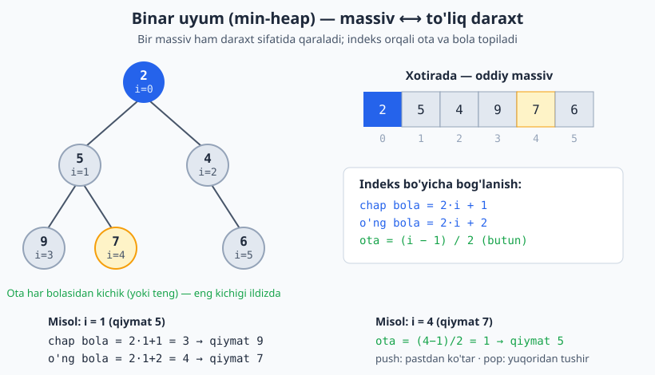

<a id="b25"></a>
# 25-bo'lim: Heap va Priority Queue

<sub>[↑ Mundarijaga qaytish](README.md#mundarija)</sub>

> Heap (uyum) — to'liq binar daraxt ko'rinishidagi ma'lumotlar tuzilmasi bo'lib, eng kichik
> (min-heap) yoki eng katta (max-heap) elementni O(1) da olishga, push/pop ni esa O(log n) da
> bajarishga imkon beradi. Priority queue (ustuvor navbat) ko'pincha heap ustiga quriladi.
> Bu bo'limda heap klassi, kth element masalalari, oqimdan median, top-K, jadval rejalashtirish
> kabi klassik masalalar 3 tilda yechiladi. Python'da tayyor `heapq` (faqat min-heap; max-heap
> uchun qiymatni manfiy qilamiz), PHP'da `SplMinHeap`/`SplMaxHeap`/`SplPriorityQueue`, JS'da esa
> standart heap yo'q — shuning uchun kichik `Heap` yordamchi klassidan foydalanamiz.

<a id="m367"></a>
### 367. MinHeap klass (push / pop / peek)
Eng kichik elementni ildizda saqlovchi binar uyum: `push` O(log n), `pop` O(log n), `peek` O(1).
`⏱ push/pop O(log n) · 💾 O(n)`

**JS**
```js
class MinHeap {
  constructor() { this.a = []; }
  size() { return this.a.length; }
  peek() { return this.a[0]; }
  push(v) {
    const a = this.a; a.push(v);
    let i = a.length - 1;
    while (i > 0) {
      const p = (i - 1) >> 1;
      if (a[p] <= a[i]) break;
      [a[i], a[p]] = [a[p], a[i]]; i = p;
    }
  }
  pop() {
    const a = this.a, top = a[0], last = a.pop();
    if (a.length) {
      a[0] = last; let i = 0; const n = a.length;
      while (true) {
        let s = i, l = 2 * i + 1, r = 2 * i + 2;
        if (l < n && a[l] < a[s]) s = l;
        if (r < n && a[r] < a[s]) s = r;
        if (s === i) break;
        [a[i], a[s]] = [a[s], a[i]]; i = s;
      }
    }
    return top;
  }
}
```
**PHP**
```php
class MinHeap {
    private array $a = [];
    public function size(): int { return count($this->a); }
    public function peek() { return $this->a[0]; }
    public function push($v): void {
        $this->a[] = $v;
        $i = count($this->a) - 1;
        while ($i > 0) {
            $p = intdiv($i - 1, 2);
            if ($this->a[$p] <= $this->a[$i]) break;
            [$this->a[$i], $this->a[$p]] = [$this->a[$p], $this->a[$i]];
            $i = $p;
        }
    }
    public function pop() {
        $top = $this->a[0];
        $last = array_pop($this->a);
        $n = count($this->a);
        if ($n > 0) {
            $this->a[0] = $last; $i = 0;
            while (true) {
                $s = $i; $l = 2 * $i + 1; $r = 2 * $i + 2;
                if ($l < $n && $this->a[$l] < $this->a[$s]) $s = $l;
                if ($r < $n && $this->a[$r] < $this->a[$s]) $s = $r;
                if ($s === $i) break;
                [$this->a[$i], $this->a[$s]] = [$this->a[$s], $this->a[$i]];
                $i = $s;
            }
        }
        return $top;
    }
}
```
**Python**
```python
import heapq

class MinHeap:
    def __init__(self):
        self.a = []

    def push(self, v):
        heapq.heappush(self.a, v)

    def pop(self):
        return heapq.heappop(self.a)

    def peek(self):
        return self.a[0]

    def size(self):
        return len(self.a)
```

Heap aslida oddiy massiv, lekin uni to'liq binar daraxt sifatida o'qiymiz: element indeksi orqali ota va bola pozitsiyalari hisoblanadi (push pastdan ko'tariladi, pop yuqoridan tushiriladi).



<a id="m368"></a>
### 368. MaxHeap klass
Eng katta elementni ildizda saqlovchi uyum. Python'da qiymatni manfiy qilib min-heap orqali quramiz.
`⏱ push/pop O(log n) · 💾 O(n)`

**JS**
```js
class MaxHeap {
  constructor() { this.a = []; }
  size() { return this.a.length; }
  peek() { return this.a[0]; }
  push(v) {
    const a = this.a; a.push(v);
    let i = a.length - 1;
    while (i > 0) {
      const p = (i - 1) >> 1;
      if (a[p] >= a[i]) break;
      [a[i], a[p]] = [a[p], a[i]]; i = p;
    }
  }
  pop() {
    const a = this.a, top = a[0], last = a.pop();
    if (a.length) {
      a[0] = last; let i = 0; const n = a.length;
      while (true) {
        let s = i, l = 2 * i + 1, r = 2 * i + 2;
        if (l < n && a[l] > a[s]) s = l;
        if (r < n && a[r] > a[s]) s = r;
        if (s === i) break;
        [a[i], a[s]] = [a[s], a[i]]; i = s;
      }
    }
    return top;
  }
}
```
**PHP**
```php
// PHP'da tayyor SplMaxHeap mavjud:
$h = new SplMaxHeap();
$h->insert(5);
$h->insert(8);
$h->top();      // 8 (peek)
$h->extract();  // 8 (pop)
count($h);      // qolgan elementlar soni
```
**Python**
```python
import heapq

class MaxHeap:
    def __init__(self):
        self.a = []

    def push(self, v):
        heapq.heappush(self.a, -v)

    def pop(self):
        return -heapq.heappop(self.a)

    def peek(self):
        return -self.a[0]

    def size(self):
        return len(self.a)
```

<a id="m369"></a>
### 369. Massivni heapga aylantirish (heapify)
Tartibsiz massivni o'rinda (in-place) min-heapga aylantirish — pastdan yuqoriga sift-down bilan O(n).
`⏱ O(n) · 💾 O(1)`

**JS**
```js
const heapify = (a) => {
  const n = a.length;
  const sift = (i) => {
    while (true) {
      let s = i, l = 2 * i + 1, r = 2 * i + 2;
      if (l < n && a[l] < a[s]) s = l;
      if (r < n && a[r] < a[s]) s = r;
      if (s === i) break;
      [a[i], a[s]] = [a[s], a[i]]; i = s;
    }
  };
  for (let i = (n >> 1) - 1; i >= 0; i--) sift(i);
  return a;
};
```
**Python**
```python
import heapq

def heapify(a):
    heapq.heapify(a)
    return a
```

<a id="m370"></a>
### 370. K-eng katta element (kth largest)
N o'lchamli min-heapda eng katta k ta elementni saqlab, ildizda k-eng kattasini topamiz.
`⏱ O(n log k) · 💾 O(k)`

**JS**
```js
const findKthLargest = (nums, k) => {
  const h = new MinHeap();
  for (const x of nums) {
    h.push(x);
    if (h.size() > k) h.pop();
  }
  return h.peek();
};
```
**PHP**
```php
function findKthLargest(array $nums, int $k): int {
    $h = new SplMinHeap();
    foreach ($nums as $x) {
        $h->insert($x);
        if (count($h) > $k) $h->extract();
    }
    return $h->top();
}
```
**Python**
```python
import heapq

def find_kth_largest(nums, k):
    h = nums[:k]
    heapq.heapify(h)
    for x in nums[k:]:
        if x > h[0]:
            heapq.heapreplace(h, x)
    return h[0]
```

<a id="m371"></a>
### 371. K-eng kichik element (kth smallest)
Max-heapda eng kichik k ta elementni saqlaymiz; ildizda k-eng kichigi turadi.
`⏱ O(n log k) · 💾 O(k)`

**JS**
```js
const findKthSmallest = (nums, k) => {
  const h = new MaxHeap();
  for (const x of nums) {
    h.push(x);
    if (h.size() > k) h.pop();
  }
  return h.peek();
};
```
**PHP**
```php
function findKthSmallest(array $nums, int $k): int {
    $h = new SplMaxHeap();
    foreach ($nums as $x) {
        $h->insert($x);
        if (count($h) > $k) $h->extract();
    }
    return $h->top();
}
```
**Python**
```python
import heapq

def find_kth_smallest(nums, k):
    h = [-x for x in nums[:k]]
    heapq.heapify(h)
    for x in nums[k:]:
        if -x > h[0]:
            heapq.heapreplace(h, -x)
    return -h[0]
```

<a id="m372"></a>
### 372. Top K tez-tez uchraydigan elementlar (top K frequent)
Chastotalarni sanab, eng katta k tasini chastota bo'yicha min-heapda ushlab qolamiz.
`⏱ O(n log k) · 💾 O(n)`

**JS**
```js
const topKFrequent = (nums, k) => {
  const freq = new Map();
  for (const x of nums) freq.set(x, (freq.get(x) || 0) + 1);
  const h = new MinHeap();
  // MinHeap'ni [chastota, qiymat] juftlik bilan ishlatamiz
  const arr = [...freq.entries()].map(([v, c]) => [c, v]);
  arr.sort((a, b) => b[0] - a[0]);
  return arr.slice(0, k).map(e => e[1]);
};
```
**PHP**
```php
function topKFrequent(array $nums, int $k): array {
    $freq = array_count_values($nums);
    arsort($freq);
    return array_slice(array_keys($freq), 0, $k);
}
```
**Python**
```python
from collections import Counter

def top_k_frequent(nums, k):
    return [v for v, _ in Counter(nums).most_common(k)]
```

<a id="m373"></a>
### 373. Top K so'zlar (chastota + alifbo tartibi)
Chastota kamayishi bo'yicha, teng bo'lsa alifbo o'sishi bo'yicha eng yaxshi k ta so'z.
`⏱ O(n log n) · 💾 O(n)`

**JS**
```js
const topKFrequentWords = (words, k) => {
  const freq = new Map();
  for (const w of words) freq.set(w, (freq.get(w) || 0) + 1);
  const arr = [...freq.entries()];
  arr.sort((a, b) => b[1] - a[1] || (a[0] < b[0] ? -1 : 1));
  return arr.slice(0, k).map(e => e[0]);
};
```
**PHP**
```php
function topKFrequentWords(array $words, int $k): array {
    $freq = array_count_values($words);
    $keys = array_keys($freq);
    usort($keys, fn($x, $y) => $freq[$y] <=> $freq[$x] ?: strcmp($x, $y));
    return array_slice($keys, 0, $k);
}
```
**Python**
```python
import heapq
from collections import Counter

def top_k_frequent_words(words, k):
    freq = Counter(words)
    h = [(-c, w) for w, c in freq.items()]
    heapq.heapify(h)
    return [heapq.heappop(h)[1] for _ in range(k)]
```

<a id="m374"></a>
### 374. K ta saralangan listni birlashtirish (merge k sorted lists)
Har bir listning boshini heapda saqlab, eng kichigini olib, navbatdagisini qo'shamiz.
`⏱ O(n log k) · 💾 O(k)`

**JS**
```js
const mergeKLists = (lists) => {
  const h = new MinHeap();
  // MinHeap'ni qiymat bo'yicha solishtirish uchun [val, node] juftlikdan foydalanamiz
  const cmpHeap = [];
  const push = (node) => {
    cmpHeap.push(node);
    cmpHeap.sort((a, b) => a.val - b.val);
  };
  for (const node of lists) if (node) push(node);
  const dummy = { next: null };
  let tail = dummy;
  while (cmpHeap.length) {
    const n = cmpHeap.shift();
    tail.next = n; tail = n;
    if (n.next) push(n.next);
  }
  return dummy.next;
};
```
**PHP**
```php
function mergeKLists(array $lists): ?ListNode {
    $h = new SplPriorityQueue();
    foreach ($lists as $i => $node) {
        if ($node) $h->insert($node, [-$node->val, -$i]);
    }
    $dummy = new ListNode();
    $tail = $dummy;
    while (!$h->isEmpty()) {
        $node = $h->extract();
        $tail->next = $node; $tail = $node;
        if ($node->next) $h->insert($node->next, [-$node->next->val, 0]);
    }
    return $dummy->next;
}
```
**Python**
```python
import heapq

def merge_k_lists(lists):
    h = []
    for i, node in enumerate(lists):
        if node:
            heapq.heappush(h, (node.val, i, node))
    dummy = ListNode(0)
    tail = dummy
    while h:
        _, i, node = heapq.heappop(h)
        tail.next = node
        tail = node
        if node.next:
            heapq.heappush(h, (node.next.val, i, node.next))
    return dummy.next
```

<a id="m375"></a>
### 375. K ta saralangan massivni birlashtirish (merge k sorted arrays)
Har bir massivning joriy indeksini heapda kuzatib, bittadan eng kichik qiymatni chiqaramiz.
`⏱ O(n log k) · 💾 O(k)`

**JS**
```js
const mergeKArrays = (arrays) => {
  const h = new Heap((a, b) => a[0] - b[0]); // [value, arrIdx, elemIdx]
  for (let i = 0; i < arrays.length; i++)
    if (arrays[i].length) h.push([arrays[i][0], i, 0]);
  const res = [];
  while (h.size()) {
    const [v, ai, ei] = h.pop();
    res.push(v);
    if (ei + 1 < arrays[ai].length) h.push([arrays[ai][ei + 1], ai, ei + 1]);
  }
  return res;
};
```
**PHP**
```php
function mergeKArrays(array $arrays): array {
    $h = new SplPriorityQueue();
    foreach ($arrays as $i => $arr) {
        if (count($arr)) $h->insert([$i, 0], -$arr[0]);
    }
    $res = [];
    while (!$h->isEmpty()) {
        [$ai, $ei] = $h->extract();
        $res[] = $arrays[$ai][$ei];
        if ($ei + 1 < count($arrays[$ai]))
            $h->insert([$ai, $ei + 1], -$arrays[$ai][$ei + 1]);
    }
    return $res;
}
```
**Python**
```python
import heapq

def merge_k_arrays(arrays):
    h = []
    for i, arr in enumerate(arrays):
        if arr:
            heapq.heappush(h, (arr[0], i, 0))
    res = []
    while h:
        v, ai, ei = heapq.heappop(h)
        res.append(v)
        if ei + 1 < len(arrays[ai]):
            heapq.heappush(h, (arrays[ai][ei + 1], ai, ei + 1))
    return res
```

<a id="m376"></a>
### 376. Oqimdan median (two heaps)
Pastki yarmi max-heap, yuqori yarmi min-heap. Median ildizlardan O(1) da olinadi.
`⏱ addNum O(log n) · 💾 O(n)`

**JS**
```js
class MedianFinder {
  constructor() {
    this.lo = new MaxHeap();
    this.hi = new MinHeap();
  }
  addNum(x) {
    this.lo.push(x);
    this.hi.push(this.lo.pop());
    if (this.hi.size() > this.lo.size()) this.lo.push(this.hi.pop());
  }
  findMedian() {
    if (this.lo.size() > this.hi.size()) return this.lo.peek();
    return (this.lo.peek() + this.hi.peek()) / 2;
  }
}
```
**PHP**
```php
class MedianFinder {
    private SplMaxHeap $lo;
    private SplMinHeap $hi;
    public function __construct() {
        $this->lo = new SplMaxHeap();
        $this->hi = new SplMinHeap();
    }
    public function addNum(int $x): void {
        $this->lo->insert($x);
        $this->hi->insert($this->lo->extract());
        if (count($this->hi) > count($this->lo))
            $this->lo->insert($this->hi->extract());
    }
    public function findMedian(): float {
        if (count($this->lo) > count($this->hi)) return $this->lo->top();
        return ($this->lo->top() + $this->hi->top()) / 2;
    }
}
```
**Python**
```python
import heapq

class MedianFinder:
    def __init__(self):
        self.lo = []  # max-heap (manfiy)
        self.hi = []  # min-heap

    def add_num(self, x):
        heapq.heappush(self.lo, -x)
        heapq.heappush(self.hi, -heapq.heappop(self.lo))
        if len(self.hi) > len(self.lo):
            heapq.heappush(self.lo, -heapq.heappop(self.hi))

    def find_median(self):
        if len(self.lo) > len(self.hi):
            return -self.lo[0]
        return (-self.lo[0] + self.hi[0]) / 2
```

<a id="m377"></a>
### 377. Sliding window median
Har bir k uzunlikdagi oynaning medianini topamiz. Saralangan oynaga ikkilik qidiruv bilan kiritamiz.
`⏱ O(n·k) · 💾 O(k)`

**JS**
```js
const medianSlidingWindow = (nums, k) => {
  const win = [];
  const res = [];
  const bisect = (x) => {
    let lo = 0, hi = win.length;
    while (lo < hi) { const m = (lo + hi) >> 1; if (win[m] < x) lo = m + 1; else hi = m; }
    return lo;
  };
  for (let i = 0; i < nums.length; i++) {
    win.splice(bisect(nums[i]), 0, nums[i]);
    if (win.length > k) win.splice(bisect(nums[i - k]), 1);
    if (win.length === k) {
      const mid = k >> 1;
      res.push(k % 2 ? win[mid] : (win[mid - 1] + win[mid]) / 2);
    }
  }
  return res;
};
```
**Python**
```python
import bisect

def median_sliding_window(nums, k):
    win = sorted(nums[:k])
    res = []

    def med():
        return win[k // 2] if k % 2 else (win[k // 2 - 1] + win[k // 2]) / 2

    res.append(med())
    for i in range(k, len(nums)):
        win.pop(bisect.bisect_left(win, nums[i - k]))
        bisect.insort(win, nums[i])
        res.append(med())
    return res
```

<a id="m378"></a>
### 378. Belgilarni chastota bo'yicha saralash (sort characters by frequency)
Belgilar chastotasini sanab, kamayish tartibida qaytaramiz.
`⏱ O(n log n) · 💾 O(n)`

**JS**
```js
const frequencySort = (s) => {
  const freq = new Map();
  for (const c of s) freq.set(c, (freq.get(c) || 0) + 1);
  return [...freq.entries()]
    .sort((a, b) => b[1] - a[1])
    .map(([c, n]) => c.repeat(n))
    .join("");
};
```
**PHP**
```php
function frequencySort(string $s): string {
    $freq = array_count_values(str_split($s));
    arsort($freq);
    $res = "";
    foreach ($freq as $c => $n) $res .= str_repeat((string)$c, $n);
    return $res;
}
```
**Python**
```python
from collections import Counter

def frequency_sort(s):
    return "".join(c * n for c, n in Counter(s).most_common())
```

<a id="m379"></a>
### 379. Task scheduler (jadval rejalashtirish)
Bir xil vazifalar orasida n dam olish kerak. Eng tez-tez uchraydigan vazifa bo'yicha minimal vaqt.
`⏱ O(n) · 💾 O(1)`

**JS**
```js
const leastInterval = (tasks, n) => {
  const cnt = new Map();
  for (const t of tasks) cnt.set(t, (cnt.get(t) || 0) + 1);
  const max = Math.max(...cnt.values());
  let maxCount = 0;
  for (const v of cnt.values()) if (v === max) maxCount++;
  return Math.max(tasks.length, (max - 1) * (n + 1) + maxCount);
};
```
**PHP**
```php
function leastInterval(array $tasks, int $n): int {
    $cnt = array_count_values($tasks);
    $max = max($cnt);
    $maxCount = count(array_filter($cnt, fn($v) => $v === $max));
    return max(count($tasks), ($max - 1) * ($n + 1) + $maxCount);
}
```
**Python**
```python
from collections import Counter

def least_interval(tasks, n):
    cnt = Counter(tasks)
    mx = max(cnt.values())
    max_count = sum(1 for v in cnt.values() if v == mx)
    return max(len(tasks), (mx - 1) * (n + 1) + max_count)
```

<a id="m380"></a>
### 380. Reorganize string
Qatorni qo'shni belgilari teng bo'lmaydigan qilib qayta tartiblash. Max-heap'dan navbat bilan olamiz.
`⏱ O(n log k) · 💾 O(k)`

**JS**
```js
const reorganizeString = (s) => {
  const freq = new Map();
  for (const c of s) freq.set(c, (freq.get(c) || 0) + 1);
  const h = new Heap((a, b) => b[1] - a[1]); // max by count
  for (const e of freq) h.push([...e]);
  let res = "", prev = null;
  while (h.size()) {
    const cur = h.pop();
    res += cur[0]; cur[1]--;
    if (prev && prev[1] > 0) h.push(prev);
    prev = cur;
  }
  return res.length === s.length ? res : "";
};
```
**PHP**
```php
function reorganizeString(string $s): string {
    $freq = array_count_values(str_split($s));
    $h = new SplPriorityQueue();
    $h->setExtractFlags(SplPriorityQueue::EXTR_BOTH);
    foreach ($freq as $c => $n) $h->insert((string)$c, $n);
    $res = "";
    $prev = null;
    while (!$h->isEmpty()) {
        $cur = $h->extract();
        $res .= $cur['data'];
        if ($prev !== null && $prev['priority'] > 0)
            $h->insert($prev['data'], $prev['priority']);
        $prev = ['data' => $cur['data'], 'priority' => $cur['priority'] - 1];
    }
    return strlen($res) === strlen($s) ? $res : "";
}
```
**Python**
```python
import heapq
from collections import Counter

def reorganize_string(s):
    h = [(-c, ch) for ch, c in Counter(s).items()]
    heapq.heapify(h)
    res, prev = [], None
    while h:
        c, ch = heapq.heappop(h)
        res.append(ch)
        if prev and prev[0] < 0:
            heapq.heappush(h, prev)
        prev = (c + 1, ch)
    return "".join(res) if len(res) == len(s) else ""
```

<a id="m381"></a>
### 381. Oxirgi tosh og'irligi (last stone weight)
Har safar eng og'ir ikki toshni urishtiramiz; farqi qaytadi. Max-heap bilan.
`⏱ O(n log n) · 💾 O(n)`

**JS**
```js
const lastStoneWeight = (stones) => {
  const h = new MaxHeap();
  for (const s of stones) h.push(s);
  while (h.size() > 1) {
    const a = h.pop(), b = h.pop();
    if (a !== b) h.push(a - b);
  }
  return h.size() ? h.peek() : 0;
};
```
**PHP**
```php
function lastStoneWeight(array $stones): int {
    $h = new SplMaxHeap();
    foreach ($stones as $s) $h->insert($s);
    while (count($h) > 1) {
        $a = $h->extract(); $b = $h->extract();
        if ($a !== $b) $h->insert($a - $b);
    }
    return count($h) ? $h->top() : 0;
}
```
**Python**
```python
import heapq

def last_stone_weight(stones):
    h = [-s for s in stones]
    heapq.heapify(h)
    while len(h) > 1:
        a = -heapq.heappop(h)
        b = -heapq.heappop(h)
        if a != b:
            heapq.heappush(h, -(a - b))
    return -h[0] if h else 0
```

<a id="m382"></a>
### 382. K eng yaqin nuqta (k closest points to origin)
Boshlang'ich nuqtaga eng yaqin k ta nuqta. Masofa kvadrati bo'yicha max-heapda k tasini ushlaymiz.
`⏱ O(n log k) · 💾 O(k)`

**JS**
```js
const kClosest = (points, k) => {
  const h = new Heap((a, b) => b[1] - a[1]); // max by dist
  for (const [x, y] of points) {
    h.push([[x, y], x * x + y * y]);
    if (h.size() > k) h.pop();
  }
  return h.a.map(e => e[0]);
};
```
**PHP**
```php
function kClosest(array $points, int $k): array {
    $h = new SplPriorityQueue(); // max-heap: katta masofa oldin chiqadi
    $h->setExtractFlags(SplPriorityQueue::EXTR_DATA);
    foreach ($points as $p) {
        $d = $p[0] * $p[0] + $p[1] * $p[1];
        $h->insert($p, $d);
        if (count($h) > $k) $h->extract();
    }
    $res = [];
    while (!$h->isEmpty()) $res[] = $h->extract();
    return $res;
}
```
**Python**
```python
import heapq

def k_closest(points, k):
    h = []
    for x, y in points:
        heapq.heappush(h, (-(x * x + y * y), [x, y]))
        if len(h) > k:
            heapq.heappop(h)
    return [p for _, p in h]
```

<a id="m383"></a>
### 383. Ugly number II
Faqat 2, 3, 5 ko'paytuvchilariga ega n-chi sonni uch ko'rsatkichli usul bilan topamiz.
`⏱ O(n) · 💾 O(n)`

**JS**
```js
const nthUglyNumber = (n) => {
  const dp = [1];
  let i2 = 0, i3 = 0, i5 = 0;
  while (dp.length < n) {
    const next = Math.min(dp[i2] * 2, dp[i3] * 3, dp[i5] * 5);
    dp.push(next);
    if (next === dp[i2] * 2) i2++;
    if (next === dp[i3] * 3) i3++;
    if (next === dp[i5] * 5) i5++;
  }
  return dp[n - 1];
};
```
**PHP**
```php
function nthUglyNumber(int $n): int {
    $dp = [1];
    $i2 = $i3 = $i5 = 0;
    while (count($dp) < $n) {
        $next = min($dp[$i2] * 2, $dp[$i3] * 3, $dp[$i5] * 5);
        $dp[] = $next;
        if ($next === $dp[$i2] * 2) $i2++;
        if ($next === $dp[$i3] * 3) $i3++;
        if ($next === $dp[$i5] * 5) $i5++;
    }
    return $dp[$n - 1];
}
```
**Python**
```python
def nth_ugly_number(n):
    dp = [1]
    i2 = i3 = i5 = 0
    while len(dp) < n:
        nxt = min(dp[i2] * 2, dp[i3] * 3, dp[i5] * 5)
        dp.append(nxt)
        if nxt == dp[i2] * 2:
            i2 += 1
        if nxt == dp[i3] * 3:
            i3 += 1
        if nxt == dp[i5] * 5:
            i5 += 1
    return dp[-1]
```

<a id="m384"></a>
### 384. Super ugly number
Berilgan tub sonlar ro'yxati ko'paytuvchilari bo'lgan n-chi son. Har bir tub uchun ko'rsatkich.
`⏱ O(n·m) · 💾 O(n+m)`

**JS**
```js
const nthSuperUglyNumber = (n, primes) => {
  const dp = [1];
  const idx = primes.map(() => 0);
  while (dp.length < n) {
    let next = Infinity;
    for (let j = 0; j < primes.length; j++) next = Math.min(next, dp[idx[j]] * primes[j]);
    dp.push(next);
    for (let j = 0; j < primes.length; j++) if (dp[idx[j]] * primes[j] === next) idx[j]++;
  }
  return dp[n - 1];
};
```
**PHP**
```php
function nthSuperUglyNumber(int $n, array $primes): int {
    $dp = [1];
    $idx = array_fill(0, count($primes), 0);
    while (count($dp) < $n) {
        $next = PHP_INT_MAX;
        foreach ($primes as $j => $p) $next = min($next, $dp[$idx[$j]] * $p);
        $dp[] = $next;
        foreach ($primes as $j => $p) if ($dp[$idx[$j]] * $p === $next) $idx[$j]++;
    }
    return $dp[$n - 1];
}
```
**Python**
```python
def nth_super_ugly_number(n, primes):
    dp = [1]
    idx = [0] * len(primes)
    while len(dp) < n:
        nxt = min(dp[idx[j]] * primes[j] for j in range(len(primes)))
        dp.append(nxt)
        for j in range(len(primes)):
            if dp[idx[j]] * primes[j] == nxt:
                idx[j] += 1
    return dp[-1]
```

<a id="m385"></a>
### 385. K ta eng yaqin son (find K closest elements)
Saralangan massivda x ga eng yaqin k ta sonni topish — oyna chap chegarasini ikkilik qidiruv bilan.
`⏱ O(log(n−k) + k) · 💾 O(k)`

**JS**
```js
const findClosestElements = (arr, k, x) => {
  let lo = 0, hi = arr.length - k;
  while (lo < hi) {
    const mid = (lo + hi) >> 1;
    if (x - arr[mid] > arr[mid + k] - x) lo = mid + 1;
    else hi = mid;
  }
  return arr.slice(lo, lo + k);
};
```
**PHP**
```php
function findClosestElements(array $arr, int $k, int $x): array {
    $lo = 0; $hi = count($arr) - $k;
    while ($lo < $hi) {
        $mid = intdiv($lo + $hi, 2);
        if ($x - $arr[$mid] > $arr[$mid + $k] - $x) $lo = $mid + 1;
        else $hi = $mid;
    }
    return array_slice($arr, $lo, $k);
}
```
**Python**
```python
def find_closest_elements(arr, k, x):
    lo, hi = 0, len(arr) - k
    while lo < hi:
        mid = (lo + hi) // 2
        if x - arr[mid] > arr[mid + k] - x:
            lo = mid + 1
        else:
            hi = mid
    return arr[lo:lo + k]
```

<a id="m386"></a>
### 386. Smallest range covering K lists
Har bir listdan kamida bittani qamrab oluvchi eng kichik oraliq. Min-heap + joriy maksimum.
`⏱ O(n log k) · 💾 O(k)`

**JS**
```js
const smallestRange = (nums) => {
  const h = new Heap((a, b) => a[0] - b[0]); // [val, listIdx, elemIdx]
  let curMax = -Infinity;
  for (let i = 0; i < nums.length; i++) {
    h.push([nums[i][0], i, 0]);
    curMax = Math.max(curMax, nums[i][0]);
  }
  let best = [-1e9, 1e9];
  while (true) {
    const [v, li, ei] = h.pop();
    if (curMax - v < best[1] - best[0]) best = [v, curMax];
    if (ei + 1 === nums[li].length) break;
    const nv = nums[li][ei + 1];
    curMax = Math.max(curMax, nv);
    h.push([nv, li, ei + 1]);
  }
  return best;
};
```
**PHP**
```php
function smallestRange(array $nums): array {
    $h = new SplPriorityQueue();
    $h->setExtractFlags(SplPriorityQueue::EXTR_DATA);
    $curMax = PHP_INT_MIN;
    foreach ($nums as $i => $lst) {
        $h->insert([$lst[0], $i, 0], -$lst[0]);
        $curMax = max($curMax, $lst[0]);
    }
    $best = [-1000000000, 1000000000];
    while (true) {
        [$v, $li, $ei] = $h->extract();
        if ($curMax - $v < $best[1] - $best[0]) $best = [$v, $curMax];
        if ($ei + 1 === count($nums[$li])) break;
        $nv = $nums[$li][$ei + 1];
        $curMax = max($curMax, $nv);
        $h->insert([$nv, $li, $ei + 1], -$nv);
    }
    return $best;
}
```
**Python**
```python
import heapq

def smallest_range(nums):
    h = [(lst[0], i, 0) for i, lst in enumerate(nums)]
    cur_max = max(lst[0] for lst in nums)
    heapq.heapify(h)
    best = [-10**9, 10**9]
    while True:
        v, li, ei = heapq.heappop(h)
        if cur_max - v < best[1] - best[0]:
            best = [v, cur_max]
        if ei + 1 == len(nums[li]):
            break
        nv = nums[li][ei + 1]
        cur_max = max(cur_max, nv)
        heapq.heappush(h, (nv, li, ei + 1))
    return best
```

<a id="m387"></a>
### 387. IPO (maximize capital)
Boshlang'ich kapital bilan eng ko'p foyda beruvchi k loyihani tanlash. Capital bo'yicha saralab, max-heap.
`⏱ O((n+k) log n) · 💾 O(n)`

**JS**
```js
const findMaximizedCapital = (k, w, profits, capital) => {
  const n = profits.length;
  const idx = [...Array(n).keys()].sort((a, b) => capital[a] - capital[b]);
  const h = new MaxHeap();
  let i = 0;
  for (let t = 0; t < k; t++) {
    while (i < n && capital[idx[i]] <= w) h.push(profits[idx[i++]]);
    if (!h.size()) break;
    w += h.pop();
  }
  return w;
};
```
**PHP**
```php
function findMaximizedCapital(int $k, int $w, array $profits, array $capital): int {
    $n = count($profits);
    $idx = range(0, $n - 1);
    usort($idx, fn($a, $b) => $capital[$a] <=> $capital[$b]);
    $h = new SplMaxHeap();
    $i = 0;
    for ($t = 0; $t < $k; $t++) {
        while ($i < $n && $capital[$idx[$i]] <= $w) $h->insert($profits[$idx[$i++]]);
        if (count($h) === 0) break;
        $w += $h->extract();
    }
    return $w;
}
```
**Python**
```python
import heapq

def find_maximized_capital(k, w, profits, capital):
    n = len(profits)
    order = sorted(range(n), key=lambda i: capital[i])
    h = []
    i = 0
    for _ in range(k):
        while i < n and capital[order[i]] <= w:
            heapq.heappush(h, -profits[order[i]])
            i += 1
        if not h:
            break
        w += -heapq.heappop(h)
    return w
```

<a id="m388"></a>
### 388. Furthest building you can reach
G'isht va narvonlar bilan eng uzoq binogacha. Eng katta ko'tarilishlarga narvon, qolganiga g'isht.
`⏱ O(n log n) · 💾 O(n)`

**JS**
```js
const furthestBuilding = (heights, bricks, ladders) => {
  const h = new MinHeap(); // narvon qamragan ko'tarilishlar
  for (let i = 0; i < heights.length - 1; i++) {
    const d = heights[i + 1] - heights[i];
    if (d <= 0) continue;
    h.push(d);
    if (h.size() > ladders) bricks -= h.pop();
    if (bricks < 0) return i;
  }
  return heights.length - 1;
};
```
**PHP**
```php
function furthestBuilding(array $heights, int $bricks, int $ladders): int {
    $h = new SplMinHeap();
    for ($i = 0; $i < count($heights) - 1; $i++) {
        $d = $heights[$i + 1] - $heights[$i];
        if ($d <= 0) continue;
        $h->insert($d);
        if (count($h) > $ladders) $bricks -= $h->extract();
        if ($bricks < 0) return $i;
    }
    return count($heights) - 1;
}
```
**Python**
```python
import heapq

def furthest_building(heights, bricks, ladders):
    h = []
    for i in range(len(heights) - 1):
        d = heights[i + 1] - heights[i]
        if d <= 0:
            continue
        heapq.heappush(h, d)
        if len(h) > ladders:
            bricks -= heapq.heappop(h)
        if bricks < 0:
            return i
    return len(heights) - 1
```

<a id="m389"></a>
### 389. Single-threaded CPU
Vazifalarni paydo bo'lish vaqti bilan saralab, ishlov vaqti (va indeks) bo'yicha eng kichigini bajaramiz.
`⏱ O(n log n) · 💾 O(n)`

**JS**
```js
const getOrder = (tasks) => {
  const n = tasks.length;
  const idx = [...Array(n).keys()].sort((a, b) => tasks[a][0] - tasks[b][0]);
  const h = new Heap((a, b) => a[0] - b[0] || a[1] - b[1]); // [proc, origIdx]
  const res = [];
  let time = 0, i = 0;
  while (res.length < n) {
    while (i < n && tasks[idx[i]][0] <= time) {
      h.push([tasks[idx[i]][1], idx[i]]); i++;
    }
    if (!h.size()) { time = tasks[idx[i]][0]; continue; }
    const [proc, id] = h.pop();
    time += proc;
    res.push(id);
  }
  return res;
};
```
**PHP**
```php
function getOrder(array $tasks): array {
    $n = count($tasks);
    $idx = range(0, $n - 1);
    usort($idx, fn($a, $b) => $tasks[$a][0] <=> $tasks[$b][0]);
    $h = new SplPriorityQueue();
    $h->setExtractFlags(SplPriorityQueue::EXTR_DATA);
    $res = [];
    $time = 0; $i = 0;
    while (count($res) < $n) {
        while ($i < $n && $tasks[$idx[$i]][0] <= $time) {
            $h->insert([$tasks[$idx[$i]][1], $idx[$i]], [-$tasks[$idx[$i]][1], -$idx[$i]]);
            $i++;
        }
        if ($h->isEmpty()) { $time = $tasks[$idx[$i]][0]; continue; }
        [$proc, $id] = $h->extract();
        $time += $proc;
        $res[] = $id;
    }
    return $res;
}
```
**Python**
```python
import heapq

def get_order(tasks):
    n = len(tasks)
    order = sorted(range(n), key=lambda i: tasks[i][0])
    h = []
    res = []
    time = i = 0
    while len(res) < n:
        while i < n and tasks[order[i]][0] <= time:
            heapq.heappush(h, (tasks[order[i]][1], order[i]))
            i += 1
        if not h:
            time = tasks[order[i]][0]
            continue
        proc, idx = heapq.heappop(h)
        time += proc
        res.append(idx)
    return res
```

<a id="m390"></a>
### 390. Minimum cost to connect sticks
Har safar eng kichik ikki tayoqni birlashtirib, narxni jamlaymiz (Huffman g'oyasi).
`⏱ O(n log n) · 💾 O(n)`

**JS**
```js
const connectSticks = (sticks) => {
  const h = new MinHeap();
  for (const s of sticks) h.push(s);
  let cost = 0;
  while (h.size() > 1) {
    const sum = h.pop() + h.pop();
    cost += sum; h.push(sum);
  }
  return cost;
};
```
**PHP**
```php
function connectSticks(array $sticks): int {
    $h = new SplMinHeap();
    foreach ($sticks as $s) $h->insert($s);
    $cost = 0;
    while (count($h) > 1) {
        $sum = $h->extract() + $h->extract();
        $cost += $sum; $h->insert($sum);
    }
    return $cost;
}
```
**Python**
```python
import heapq

def connect_sticks(sticks):
    h = sticks[:]
    heapq.heapify(h)
    cost = 0
    while len(h) > 1:
        s = heapq.heappop(h) + heapq.heappop(h)
        cost += s
        heapq.heappush(h, s)
    return cost
```

<a id="m391"></a>
### 391. Kth largest in a stream (klass)
Oqimga qo'shilgan har bir qiymatdan keyin k-eng kattasini qaytaruvchi klass. k o'lchamli min-heap.
`⏱ add O(log k) · 💾 O(k)`

**JS**
```js
class KthLargest {
  constructor(k, nums) {
    this.k = k;
    this.h = new MinHeap();
    for (const x of nums) this.add(x);
  }
  add(val) {
    this.h.push(val);
    if (this.h.size() > this.k) this.h.pop();
    return this.h.peek();
  }
}
```
**PHP**
```php
class KthLargest {
    private int $k;
    private SplMinHeap $h;
    public function __construct(int $k, array $nums) {
        $this->k = $k;
        $this->h = new SplMinHeap();
        foreach ($nums as $x) $this->add($x);
    }
    public function add(int $val): int {
        $this->h->insert($val);
        if (count($this->h) > $this->k) $this->h->extract();
        return $this->h->top();
    }
}
```
**Python**
```python
import heapq

class KthLargest:
    def __init__(self, k, nums):
        self.k = k
        self.h = nums[:]
        heapq.heapify(self.h)
        while len(self.h) > k:
            heapq.heappop(self.h)

    def add(self, val):
        heapq.heappush(self.h, val)
        if len(self.h) > self.k:
            heapq.heappop(self.h)
        return self.h[0]
```

<a id="m392"></a>
### 392. Connect ropes — minimal narx
Arqonlarni birlashtirishning minimal narxi (385/390 bilan bir xil Huffman usuli, alohida ko'rinish).
`⏱ O(n log n) · 💾 O(n)`

**JS**
```js
const connectRopes = (ropes) => {
  const h = new MinHeap();
  for (const r of ropes) h.push(r);
  let cost = 0;
  while (h.size() > 1) {
    const s = h.pop() + h.pop();
    cost += s; h.push(s);
  }
  return cost;
};
```
**PHP**
```php
function connectRopes(array $ropes): int {
    $h = new SplMinHeap();
    foreach ($ropes as $r) $h->insert($r);
    $cost = 0;
    while (count($h) > 1) {
        $s = $h->extract() + $h->extract();
        $cost += $s; $h->insert($s);
    }
    return $cost;
}
```
**Python**
```python
import heapq

def connect_ropes(ropes):
    h = ropes[:]
    heapq.heapify(h)
    cost = 0
    while len(h) > 1:
        s = heapq.heappop(h) + heapq.heappop(h)
        cost += s
        heapq.heappush(h, s)
    return cost
```

<a id="m393"></a>
### 393. Meeting rooms II (min heap)
Bir vaqtda kerak bo'lgan maksimal xona soni. Boshlanish bo'yicha saralab, tugash vaqtlarini min-heapda.
`⏱ O(n log n) · 💾 O(n)`

**JS**
```js
const minMeetingRooms = (intervals) => {
  intervals.sort((a, b) => a[0] - b[0]);
  const h = new MinHeap(); // tugash vaqtlari
  for (const [s, e] of intervals) {
    if (h.size() && h.peek() <= s) h.pop();
    h.push(e);
  }
  return h.size();
};
```
**PHP**
```php
function minMeetingRooms(array $intervals): int {
    usort($intervals, fn($a, $b) => $a[0] <=> $b[0]);
    $h = new SplMinHeap();
    foreach ($intervals as [$s, $e]) {
        if (count($h) && $h->top() <= $s) $h->extract();
        $h->insert($e);
    }
    return count($h);
}
```
**Python**
```python
import heapq

def min_meeting_rooms(intervals):
    intervals.sort()
    h = []
    for s, e in intervals:
        if h and h[0] <= s:
            heapq.heappop(h)
        heapq.heappush(h, e)
    return len(h)
```

<a id="m394"></a>
### 394. Car pooling
Yo'lovchilar soni har qadamda sig'imdan oshmasligini tekshirish. Tushish vaqtlari min-heapda.
`⏱ O(n log n) · 💾 O(n)`

**JS**
```js
const carPooling = (trips, capacity) => {
  trips.sort((a, b) => a[1] - b[1]);
  const h = new Heap((a, b) => a[0] - b[0]); // [end, passengers]
  let cur = 0;
  for (const [num, start, end] of trips) {
    while (h.size() && h.peek()[0] <= start) cur -= h.pop()[1];
    cur += num;
    if (cur > capacity) return false;
    h.push([end, num]);
  }
  return true;
};
```
**PHP**
```php
function carPooling(array $trips, int $capacity): bool {
    usort($trips, fn($a, $b) => $a[1] <=> $b[1]);
    $pq = new SplPriorityQueue(); // min by end: priority -end
    $pq->setExtractFlags(SplPriorityQueue::EXTR_DATA);
    $cur = 0;
    foreach ($trips as [$num, $start, $end]) {
        while (!$pq->isEmpty() && $pq->top()[0] <= $start) {
            $cur -= $pq->extract()[1];
        }
        $cur += $num;
        if ($cur > $capacity) return false;
        $pq->insert([$end, $num], -$end);
    }
    return true;
}
```
**Python**
```python
import heapq

def car_pooling(trips, capacity):
    trips.sort(key=lambda t: t[1])
    h = []
    cur = 0
    for num, start, end in trips:
        while h and h[0][0] <= start:
            cur -= heapq.heappop(h)[1]
        cur += num
        if cur > capacity:
            return False
        heapq.heappush(h, (end, num))
    return True
```

<a id="m395"></a>
### 395. Minimum number of refueling stops
Maqsadgacha yetish uchun minimal yoqilg'i to'xtashlari. O'tib ketgan stansiyalarni max-heapda saqlaymiz.
`⏱ O(n log n) · 💾 O(n)`

**JS**
```js
const minRefuelStops = (target, startFuel, stations) => {
  const h = new MaxHeap();
  let fuel = startFuel, stops = 0, i = 0;
  while (fuel < target) {
    while (i < stations.length && stations[i][0] <= fuel) h.push(stations[i++][1]);
    if (!h.size()) return -1;
    fuel += h.pop(); stops++;
  }
  return stops;
};
```
**PHP**
```php
function minRefuelStops(int $target, int $startFuel, array $stations): int {
    $h = new SplMaxHeap();
    $fuel = $startFuel; $stops = 0; $i = 0;
    while ($fuel < $target) {
        while ($i < count($stations) && $stations[$i][0] <= $fuel)
            $h->insert($stations[$i++][1]);
        if (count($h) === 0) return -1;
        $fuel += $h->extract(); $stops++;
    }
    return $stops;
}
```
**Python**
```python
import heapq

def min_refuel_stops(target, start_fuel, stations):
    h = []
    fuel, stops, i = start_fuel, 0, 0
    while fuel < target:
        while i < len(stations) and stations[i][0] <= fuel:
            heapq.heappush(h, -stations[i][1])
            i += 1
        if not h:
            return -1
        fuel += -heapq.heappop(h)
        stops += 1
    return stops
```

<a id="m396"></a>
### 396. Hand of straights
Kartalarni groupSize uzunlikdagi ketma-ket guruhlarga bo'lish mumkinmi. Eng kichik kartadan boshlaymiz.
`⏱ O(n log n) · 💾 O(n)`

**JS**
```js
const isNStraightHand = (hand, groupSize) => {
  if (hand.length % groupSize !== 0) return false;
  const cnt = new Map();
  for (const c of hand) cnt.set(c, (cnt.get(c) || 0) + 1);
  const keys = [...cnt.keys()].sort((a, b) => a - b);
  for (const k of keys) {
    const c = cnt.get(k);
    if (c > 0) {
      for (let i = k; i < k + groupSize; i++) {
        if ((cnt.get(i) || 0) < c) return false;
        cnt.set(i, cnt.get(i) - c);
      }
    }
  }
  return true;
};
```
**PHP**
```php
function isNStraightHand(array $hand, int $groupSize): bool {
    if (count($hand) % $groupSize !== 0) return false;
    $cnt = array_count_values($hand);
    ksort($cnt);
    foreach (array_keys($cnt) as $k) {
        $c = $cnt[$k];
        if ($c > 0) {
            for ($i = $k; $i < $k + $groupSize; $i++) {
                if (($cnt[$i] ?? 0) < $c) return false;
                $cnt[$i] -= $c;
            }
        }
    }
    return true;
}
```
**Python**
```python
from collections import Counter

def is_n_straight_hand(hand, group_size):
    if len(hand) % group_size:
        return False
    cnt = Counter(hand)
    for k in sorted(cnt):
        c = cnt[k]
        if c > 0:
            for i in range(k, k + group_size):
                if cnt[i] < c:
                    return False
                cnt[i] -= c
    return True
```

<a id="m397"></a>
### 397. Take gifts (sovg'alarni olish)
k soniya davomida har safar eng katta sovg'a o'rniga uning kvadrat ildizini qoldiramiz. Max-heap.
`⏱ O(n + k log n) · 💾 O(n)`

**JS**
```js
const pickGifts = (gifts, k) => {
  const h = new MaxHeap();
  for (const g of gifts) h.push(g);
  for (let i = 0; i < k; i++) {
    const top = h.pop();
    h.push(Math.floor(Math.sqrt(top)));
  }
  let sum = 0;
  while (h.size()) sum += h.pop();
  return sum;
};
```
**PHP**
```php
function pickGifts(array $gifts, int $k): int {
    $h = new SplMaxHeap();
    foreach ($gifts as $g) $h->insert($g);
    for ($i = 0; $i < $k; $i++) {
        $top = $h->extract();
        $h->insert((int)floor(sqrt($top)));
    }
    $sum = 0;
    while (count($h)) $sum += $h->extract();
    return $sum;
}
```
**Python**
```python
import heapq
import math

def pick_gifts(gifts, k):
    h = [-g for g in gifts]
    heapq.heapify(h)
    for _ in range(k):
        top = -heapq.heappop(h)
        heapq.heappush(h, -math.isqrt(top))
    return -sum(h)
```

<a id="m398"></a>
### 398. Maximum performance of a team
Tezlik yig'indisi × minimal samaradorlik maksimumi. Samaradorlik kamayishi bo'yicha, tezlik min-heapda.
`⏱ O(n log n) · 💾 O(n)`

**JS**
```js
const maxPerformance = (n, speed, efficiency, k) => {
  const idx = [...Array(n).keys()].sort((a, b) => efficiency[b] - efficiency[a]);
  const h = new MinHeap(); // tezliklar
  let speedSum = 0n, best = 0n;
  const MOD = 1000000007n;
  for (const i of idx) {
    h.push(speed[i]);
    speedSum += BigInt(speed[i]);
    if (h.size() > k) speedSum -= BigInt(h.pop());
    const perf = speedSum * BigInt(efficiency[i]);
    if (perf > best) best = perf;
  }
  return Number(best % MOD);
};
```
**PHP**
```php
function maxPerformance(int $n, array $speed, array $efficiency, int $k): int {
    $idx = range(0, $n - 1);
    usort($idx, fn($a, $b) => $efficiency[$b] <=> $efficiency[$a]);
    $h = new SplMinHeap();
    $speedSum = 0; $best = 0;
    $MOD = 1000000007;
    foreach ($idx as $i) {
        $h->insert($speed[$i]);
        $speedSum += $speed[$i];
        if (count($h) > $k) $speedSum -= $h->extract();
        $perf = $speedSum * $efficiency[$i];
        if ($perf > $best) $best = $perf;
    }
    return $best % $MOD;
}
```
**Python**
```python
import heapq

def max_performance(n, speed, efficiency, k):
    MOD = 10**9 + 7
    workers = sorted(range(n), key=lambda i: -efficiency[i])
    h = []
    speed_sum = best = 0
    for i in workers:
        heapq.heappush(h, speed[i])
        speed_sum += speed[i]
        if len(h) > k:
            speed_sum -= heapq.heappop(h)
        best = max(best, speed_sum * efficiency[i])
    return best % MOD
```

<a id="m399"></a>
### 399. Two heaps medianasi (klass)
Ikki uyumli yondashuvni qayta ishlatuvchi running median klassi: `add` va `median` metodlari.
`⏱ add O(log n) · 💾 O(n)`

**JS**
```js
class RunningMedian {
  constructor() {
    this.lo = new MaxHeap();
    this.hi = new MinHeap();
  }
  add(x) {
    this.lo.push(x);
    this.hi.push(this.lo.pop());
    if (this.hi.size() > this.lo.size()) this.lo.push(this.hi.pop());
  }
  median() {
    return this.lo.size() > this.hi.size()
      ? this.lo.peek()
      : (this.lo.peek() + this.hi.peek()) / 2;
  }
}
```
**PHP**
```php
class RunningMedian {
    private SplMaxHeap $lo;
    private SplMinHeap $hi;
    public function __construct() {
        $this->lo = new SplMaxHeap();
        $this->hi = new SplMinHeap();
    }
    public function add(int $x): void {
        $this->lo->insert($x);
        $this->hi->insert($this->lo->extract());
        if (count($this->hi) > count($this->lo))
            $this->lo->insert($this->hi->extract());
    }
    public function median(): float {
        if (count($this->lo) > count($this->hi)) return $this->lo->top();
        return ($this->lo->top() + $this->hi->top()) / 2;
    }
}
```
**Python**
```python
import heapq

class RunningMedian:
    def __init__(self):
        self.lo = []
        self.hi = []

    def add(self, x):
        heapq.heappush(self.lo, -x)
        heapq.heappush(self.hi, -heapq.heappop(self.lo))
        if len(self.hi) > len(self.lo):
            heapq.heappush(self.lo, -heapq.heappop(self.hi))

    def median(self):
        if len(self.lo) > len(self.hi):
            return -self.lo[0]
        return (-self.lo[0] + self.hi[0]) / 2
```

<a id="m400"></a>
### 400. Trapping rain water II (heap)
2D balandlik xaritasida ushlanadigan suv. Chegaradan boshlab min-heap orqali ichkariga kiramiz.
`⏱ O(m·n log(m·n)) · 💾 O(m·n)`

**JS**
```js
const trapRainWater = (heightMap) => {
  if (!heightMap.length) return 0;
  const m = heightMap.length, n = heightMap[0].length;
  const visited = Array.from({ length: m }, () => Array(n).fill(false));
  const h = new Heap((a, b) => a[0] - b[0]); // [height, r, c]
  for (let i = 0; i < m; i++)
    for (let j = 0; j < n; j++)
      if (i === 0 || i === m - 1 || j === 0 || j === n - 1) {
        h.push([heightMap[i][j], i, j]); visited[i][j] = true;
      }
  let water = 0;
  const dirs = [[0, 1], [0, -1], [1, 0], [-1, 0]];
  while (h.size()) {
    const [ht, r, c] = h.pop();
    for (const [dr, dc] of dirs) {
      const nr = r + dr, nc = c + dc;
      if (nr < 0 || nc < 0 || nr >= m || nc >= n || visited[nr][nc]) continue;
      visited[nr][nc] = true;
      water += Math.max(0, ht - heightMap[nr][nc]);
      h.push([Math.max(ht, heightMap[nr][nc]), nr, nc]);
    }
  }
  return water;
};
```
**PHP**
```php
function trapRainWater(array $heightMap): int {
    if (count($heightMap) === 0) return 0;
    $m = count($heightMap); $n = count($heightMap[0]);
    $visited = array_fill(0, $m, array_fill(0, $n, false));
    $h = new SplPriorityQueue(); // min by height: priority -height
    $h->setExtractFlags(SplPriorityQueue::EXTR_DATA);
    for ($i = 0; $i < $m; $i++)
        for ($j = 0; $j < $n; $j++)
            if ($i === 0 || $i === $m - 1 || $j === 0 || $j === $n - 1) {
                $h->insert([$heightMap[$i][$j], $i, $j], -$heightMap[$i][$j]);
                $visited[$i][$j] = true;
            }
    $water = 0;
    $dirs = [[0, 1], [0, -1], [1, 0], [-1, 0]];
    while (!$h->isEmpty()) {
        [$ht, $r, $c] = $h->extract();
        foreach ($dirs as [$dr, $dc]) {
            $nr = $r + $dr; $nc = $c + $dc;
            if ($nr < 0 || $nc < 0 || $nr >= $m || $nc >= $n || $visited[$nr][$nc]) continue;
            $visited[$nr][$nc] = true;
            $water += max(0, $ht - $heightMap[$nr][$nc]);
            $mh = max($ht, $heightMap[$nr][$nc]);
            $h->insert([$mh, $nr, $nc], -$mh);
        }
    }
    return $water;
}
```
**Python**
```python
import heapq

def trap_rain_water(height_map):
    if not height_map:
        return 0
    m, n = len(height_map), len(height_map[0])
    visited = [[False] * n for _ in range(m)]
    h = []
    for i in range(m):
        for j in range(n):
            if i in (0, m - 1) or j in (0, n - 1):
                heapq.heappush(h, (height_map[i][j], i, j))
                visited[i][j] = True
    water = 0
    while h:
        ht, r, c = heapq.heappop(h)
        for dr, dc in ((0, 1), (0, -1), (1, 0), (-1, 0)):
            nr, nc = r + dr, c + dc
            if 0 <= nr < m and 0 <= nc < n and not visited[nr][nc]:
                visited[nr][nc] = True
                water += max(0, ht - height_map[nr][nc])
                heapq.heappush(h, (max(ht, height_map[nr][nc]), nr, nc))
    return water
```

<a id="m401"></a>
### 401. The skyline problem
Binolar silueti — burchak nuqtalari. Hodisalarni saralab, faol balandliklar uyumini kuzatamiz.
`⏱ O(n log n) · 💾 O(n)`

**JS**
```js
const getSkyline = (buildings) => {
  const events = [];
  for (const [l, r, h] of buildings) {
    events.push([l, -h, r]); // kirish
    events.push([r, 0, 0]);   // chiqish
  }
  events.sort((a, b) => a[0] - b[0] || a[1] - b[1]);
  const res = [];
  let live = [[0, Infinity]]; // [height, right], balandlik kamayish tartibida
  let prev = 0;
  for (const [x, negH, r] of events) {
    live = live.filter(e => e[1] > x); // tugaganlarini olib tashlaymiz
    if (negH < 0) {
      let lo = 0, hi = live.length;
      while (lo < hi) { const m = (lo + hi) >> 1; if (live[m][0] > -negH) lo = m + 1; else hi = m; }
      live.splice(lo, 0, [-negH, r]);
    }
    const cur = live[0][0];
    if (cur !== prev) { res.push([x, cur]); prev = cur; }
  }
  return res;
};
```
**Python**
```python
import heapq

def get_skyline(buildings):
    events = []
    for l, r, h in buildings:
        events.append((l, -h, r))
        events.append((r, 0, 0))
    events.sort()
    res = []
    live = [(0, float("inf"))]  # (-height, right)
    prev = 0
    for x, neg_h, r in events:
        while live and live[0][1] <= x:
            heapq.heappop(live)
        if neg_h < 0:
            heapq.heappush(live, (neg_h, r))
        cur = -live[0][0]
        if cur != prev:
            res.append([x, cur])
            prev = cur
    return res
```

<a id="m402"></a>
### 402. Process tasks using servers
Vazifalarni bo'sh serverlarga (vazn, indeks bo'yicha) taqsimlash. Ikki heap: bo'sh va band serverlar.
`⏱ O((n+m) log m) · 💾 O(m)`

**JS**
```js
const assignTasks = (servers, tasks) => {
  const free = new Heap((a, b) => a[0] - b[0] || a[1] - b[1]); // [weight, idx]
  const busy = new Heap((a, b) => a[0] - b[0] || a[1] - b[1] || a[2] - b[2]); // [freeTime, weight, idx]
  for (let i = 0; i < servers.length; i++) free.push([servers[i], i]);
  const res = [];
  for (let t = 0; t < tasks.length; t++) {
    while (busy.size() && busy.peek()[0] <= t) {
      const [, w, idx] = busy.pop();
      free.push([w, idx]);
    }
    if (free.size()) {
      const [w, idx] = free.pop();
      res.push(idx);
      busy.push([t + tasks[t], w, idx]);
    } else {
      const [ft, w, idx] = busy.pop();
      res.push(idx);
      busy.push([ft + tasks[t], w, idx]);
    }
  }
  return res;
};
```
**Python**
```python
import heapq

def assign_tasks(servers, tasks):
    free = [(w, i) for i, w in enumerate(servers)]
    heapq.heapify(free)
    busy = []
    res = []
    for t in range(len(tasks)):
        while busy and busy[0][0] <= t:
            _, w, idx = heapq.heappop(busy)
            heapq.heappush(free, (w, idx))
        if free:
            w, idx = heapq.heappop(free)
            res.append(idx)
            heapq.heappush(busy, (t + tasks[t], w, idx))
        else:
            ft, w, idx = heapq.heappop(busy)
            res.append(idx)
            heapq.heappush(busy, (ft + tasks[t], w, idx))
    return res
```

<a id="m403"></a>
### 403. Seat reservation manager
Eng kichik raqamli bo'sh o'rindiqni band qilish/bo'shatish. Min-heap.
`⏱ reserve/unreserve O(log n) · 💾 O(n)`

**JS**
```js
class SeatManager {
  constructor(n) {
    this.h = new MinHeap();
    for (let i = 1; i <= n; i++) this.h.push(i);
  }
  reserve() { return this.h.pop(); }
  unreserve(seat) { this.h.push(seat); }
}
```
**PHP**
```php
class SeatManager {
    private SplMinHeap $h;
    public function __construct(int $n) {
        $this->h = new SplMinHeap();
        for ($i = 1; $i <= $n; $i++) $this->h->insert($i);
    }
    public function reserve(): int { return $this->h->extract(); }
    public function unreserve(int $seat): void { $this->h->insert($seat); }
}
```
**Python**
```python
import heapq

class SeatManager:
    def __init__(self, n):
        self.h = list(range(1, n + 1))
        heapq.heapify(self.h)

    def reserve(self):
        return heapq.heappop(self.h)

    def unreserve(self, seat):
        heapq.heappush(self.h, seat)
```

<a id="m404"></a>
### 404. Maximum average pass ratio
Qo'shimcha o'quvchilarni eng katta o'rtacha o'sish beruvchi sinfga qo'shamiz. Max-heap (o'sish bo'yicha).
`⏱ O((n+k) log n) · 💾 O(n)`

**JS**
```js
const maxAverageRatio = (classes, extraStudents) => {
  const gain = ([p, t]) => (p + 1) / (t + 1) - p / t;
  const h = new Heap((a, b) => gain(b) - gain(a)); // max by gain
  for (const c of classes) h.push([...c]);
  for (let i = 0; i < extraStudents; i++) {
    const c = h.pop();
    c[0]++; c[1]++;
    h.push(c);
  }
  let sum = 0;
  while (h.size()) { const [p, t] = h.pop(); sum += p / t; }
  return sum / classes.length;
};
```
**PHP**
```php
function maxAverageRatio(array $classes, int $extraStudents): float {
    $gain = fn($p, $t) => ($p + 1) / ($t + 1) - $p / $t;
    $h = new SplPriorityQueue(); // max by gain
    $h->setExtractFlags(SplPriorityQueue::EXTR_DATA);
    foreach ($classes as $c) $h->insert($c, $gain($c[0], $c[1]));
    for ($i = 0; $i < $extraStudents; $i++) {
        [$p, $t] = $h->extract();
        $p++; $t++;
        $h->insert([$p, $t], $gain($p, $t));
    }
    $sum = 0;
    while (!$h->isEmpty()) { [$p, $t] = $h->extract(); $sum += $p / $t; }
    return $sum / count($classes);
}
```
**Python**
```python
import heapq

def max_average_ratio(classes, extra_students):
    def gain(p, t):
        return (p + 1) / (t + 1) - p / t

    h = [(-gain(p, t), p, t) for p, t in classes]
    heapq.heapify(h)
    for _ in range(extra_students):
        _, p, t = heapq.heappop(h)
        p, t = p + 1, t + 1
        heapq.heappush(h, (-gain(p, t), p, t))
    return sum(p / t for _, p, t in h) / len(classes)
```

<a id="m405"></a>
### 405. Minimum cost to hire K workers
k ishchini sifat va minimal ish haqi nisbati shartida yollashning minimal narxi. Max-heap (sifat bo'yicha).
`⏱ O(n log n) · 💾 O(n)`

**JS**
```js
const mincostToHireWorkers = (quality, wage, k) => {
  const n = quality.length;
  const idx = [...Array(n).keys()].sort((a, b) => wage[a] / quality[a] - wage[b] / quality[b]);
  const h = new MaxHeap(); // sifatlar
  let qSum = 0, best = Infinity;
  for (const i of idx) {
    h.push(quality[i]);
    qSum += quality[i];
    if (h.size() > k) qSum -= h.pop();
    if (h.size() === k) best = Math.min(best, qSum * wage[i] / quality[i]);
  }
  return best;
};
```
**PHP**
```php
function mincostToHireWorkers(array $quality, array $wage, int $k): float {
    $n = count($quality);
    $idx = range(0, $n - 1);
    usort($idx, fn($a, $b) => $wage[$a] / $quality[$a] <=> $wage[$b] / $quality[$b]);
    $h = new SplMaxHeap();
    $qSum = 0; $best = INF;
    foreach ($idx as $i) {
        $h->insert($quality[$i]);
        $qSum += $quality[$i];
        if (count($h) > $k) $qSum -= $h->extract();
        if (count($h) === $k) $best = min($best, $qSum * $wage[$i] / $quality[$i]);
    }
    return $best;
}
```
**Python**
```python
import heapq

def mincost_to_hire_workers(quality, wage, k):
    workers = sorted(range(len(quality)), key=lambda i: wage[i] / quality[i])
    h = []
    q_sum = 0
    best = float("inf")
    for i in workers:
        heapq.heappush(h, -quality[i])
        q_sum += quality[i]
        if len(h) > k:
            q_sum += heapq.heappop(h)
        if len(h) == k:
            best = min(best, q_sum * wage[i] / quality[i])
    return best
```

<a id="m406"></a>
### 406. Total cost to hire K workers
Ikki tomondan candidates ta nomzodli ikki min-heap; har gal arzonrog'ini (teng bo'lsa chap) yollaymiz.
`⏱ O((candidates + k) log candidates) · 💾 O(candidates)`

**JS**
```js
const totalCost = (costs, k, candidates) => {
  const n = costs.length;
  const left = new MinHeap();
  const right = new MinHeap();
  let i = 0, j = n - 1;
  for (; i < candidates && i <= j; i++) left.push(costs[i]);
  for (; j >= i && n - 1 - j < candidates; j--) right.push(costs[j]);
  let total = 0;
  for (let h = 0; h < k; h++) {
    if (left.size() && (!right.size() || left.peek() <= right.peek())) {
      total += left.pop();
      if (i <= j) left.push(costs[i++]);
    } else {
      total += right.pop();
      if (i <= j) right.push(costs[j--]);
    }
  }
  return total;
};
```
**PHP**
```php
function totalCost(array $costs, int $k, int $candidates): int {
    $n = count($costs);
    $left = new SplMinHeap();
    $right = new SplMinHeap();
    $i = 0; $j = $n - 1;
    while ($i < $candidates && $i <= $j) $left->insert($costs[$i++]);
    while ($j >= $i && $n - 1 - $j < $candidates) $right->insert($costs[$j--]);
    $total = 0;
    for ($h = 0; $h < $k; $h++) {
        $useLeft = count($left) && (count($right) === 0 || $left->top() <= $right->top());
        if ($useLeft) {
            $total += $left->extract();
            if ($i <= $j) $left->insert($costs[$i++]);
        } else {
            $total += $right->extract();
            if ($i <= $j) $right->insert($costs[$j--]);
        }
    }
    return $total;
}
```
**Python**
```python
import heapq

def total_cost(costs, k, candidates):
    n = len(costs)
    left, right = [], []
    i, j = 0, n - 1
    while i < candidates and i <= j:
        heapq.heappush(left, costs[i])
        i += 1
    while j >= i and n - 1 - j < candidates:
        heapq.heappush(right, costs[j])
        j -= 1
    total = 0
    for _ in range(k):
        if left and (not right or left[0] <= right[0]):
            total += heapq.heappop(left)
            if i <= j:
                heapq.heappush(left, costs[i])
                i += 1
        else:
            total += heapq.heappop(right)
            if i <= j:
                heapq.heappush(right, costs[j])
                j -= 1
    return total
```
