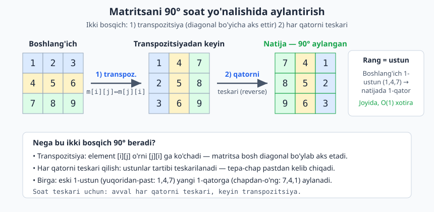

<a id="b28"></a>
# 28-bo'lim: Matritsa masalalari

<sub>[↑ Mundarijaga qaytish](README.md#mundarija)</sub>

> Matritsa (2D massiv) — qator va ustunlardan iborat to'rtburchak jadval. Bu bo'limda
> matritsani aylantirish, transpozitsiya, spiral o'qish, nol qatorlar, saralangan 2D
> qidiruv, DP (maksimal kvadrat, kadane 2D), grid BFS (01 matrix, island) va boshqa
> klassik masalalar 3 tilda (JS / PHP / Python) yechiladi. Ko'p masalalar joyida
> (in-place) ishlaydi va O(1) qo'shimcha xotira talab qiladi.

<a id="m507"></a>
### 507. Matritsani 90° aylantirish — joyida (rotate image)
n×n matritsani soat yo'nalishi bo'yicha 90° ga joyida buramiz: avval transpozitsiya, keyin har qatorni teskari.
`⏱ O(n²) · 💾 O(1)`

**JS**
```js
const rotate90 = (m) => {
  const n = m.length;
  for (let i = 0; i < n; i++)
    for (let j = i + 1; j < n; j++)
      [m[i][j], m[j][i]] = [m[j][i], m[i][j]];
  for (const row of m) row.reverse();
  return m;
};
```
**PHP**
```php
function rotate90(array &$m): array {
    $n = count($m);
    for ($i = 0; $i < $n; $i++)
        for ($j = $i + 1; $j < $n; $j++)
            [$m[$i][$j], $m[$j][$i]] = [$m[$j][$i], $m[$i][$j]];
    foreach ($m as &$row) $row = array_reverse($row);
    return $m;
}
```
**Python**
```python
def rotate90(m):
    n = len(m)
    for i in range(n):
        for j in range(i + 1, n):
            m[i][j], m[j][i] = m[j][i], m[i][j]
    for row in m:
        row.reverse()
    return m
```

Diagrammada ikki bosqich aniq ko'rinadi: avval transpozitsiya (diagonal bo'yicha aks ettirish), so'ng har bir qatorni teskari qilish — birgalikda 90° soat yo'nalishidagi aylanishni beradi.



<a id="m508"></a>
### 508. Matritsani 180° aylantirish
Har bir elementni qarama-qarshi burchakdagi pozitsiyaga ko'chiramiz; joyida bajariladi.
`⏱ O(n·m) · 💾 O(1)`

**JS**
```js
const rotate180 = (m) => {
  const R = m.length, C = m[0].length, total = R * C;
  for (let k = 0; k < (total >> 1); k++) {
    const i = (k / C) | 0, j = k % C;
    const k2 = total - 1 - k, i2 = (k2 / C) | 0, j2 = k2 % C;
    [m[i][j], m[i2][j2]] = [m[i2][j2], m[i][j]];
  }
  return m;
};
```
**PHP**
```php
function rotate180(array &$m): array {
    $R = count($m); $C = count($m[0]); $total = $R * $C;
    for ($k = 0; $k < intdiv($total, 2); $k++) {
        $i = intdiv($k, $C); $j = $k % $C;
        $k2 = $total - 1 - $k; $i2 = intdiv($k2, $C); $j2 = $k2 % $C;
        [$m[$i][$j], $m[$i2][$j2]] = [$m[$i2][$j2], $m[$i][$j]];
    }
    return $m;
}
```
**Python**
```python
def rotate180(m):
    R, C = len(m), len(m[0])
    total = R * C
    for k in range(total // 2):
        i, j = divmod(k, C)
        i2, j2 = divmod(total - 1 - k, C)
        m[i][j], m[i2][j2] = m[i2][j2], m[i][j]
    return m
```

<a id="m509"></a>
### 509. Transpozitsiya (transpose)
Matritsaning qator va ustunlarini almashtiramiz: yangi[j][i] = eski[i][j]. Nokvadrat ham bo'lishi mumkin.
`⏱ O(R·C) · 💾 O(R·C)`

**JS**
```js
const transpose = (m) => {
  const R = m.length, C = m[0].length;
  const t = Array.from({ length: C }, () => Array(R).fill(0));
  for (let i = 0; i < R; i++)
    for (let j = 0; j < C; j++)
      t[j][i] = m[i][j];
  return t;
};
```
**PHP**
```php
function transpose(array $m): array {
    $R = count($m); $C = count($m[0]);
    $t = array_fill(0, $C, array_fill(0, $R, 0));
    for ($i = 0; $i < $R; $i++)
        for ($j = 0; $j < $C; $j++)
            $t[$j][$i] = $m[$i][$j];
    return $t;
}
```
**Python**
```python
def transpose(m):
    return [list(row) for row in zip(*m)]
```

<a id="m510"></a>
### 510. Spiral tartibda o'qish (spiral order)
Matritsani tashqi chegaradan ichkariga qarab soat yo'nalishida o'qib, ro'yxat qaytaramiz.
`⏱ O(R·C) · 💾 O(1) (chiqishdan tashqari)`

**JS**
```js
const spiralOrder = (m) => {
  const res = [];
  let top = 0, bottom = m.length - 1, left = 0, right = m[0].length - 1;
  while (top <= bottom && left <= right) {
    for (let j = left; j <= right; j++) res.push(m[top][j]);
    top++;
    for (let i = top; i <= bottom; i++) res.push(m[i][right]);
    right--;
    if (top <= bottom) { for (let j = right; j >= left; j--) res.push(m[bottom][j]); bottom--; }
    if (left <= right) { for (let i = bottom; i >= top; i--) res.push(m[i][left]); left++; }
  }
  return res;
};
```
**PHP**
```php
function spiralOrder(array $m): array {
    $res = [];
    $top = 0; $bottom = count($m) - 1; $left = 0; $right = count($m[0]) - 1;
    while ($top <= $bottom && $left <= $right) {
        for ($j = $left; $j <= $right; $j++) $res[] = $m[$top][$j];
        $top++;
        for ($i = $top; $i <= $bottom; $i++) $res[] = $m[$i][$right];
        $right--;
        if ($top <= $bottom) { for ($j = $right; $j >= $left; $j--) $res[] = $m[$bottom][$j]; $bottom--; }
        if ($left <= $right) { for ($i = $bottom; $i >= $top; $i--) $res[] = $m[$i][$left]; $left++; }
    }
    return $res;
}
```
**Python**
```python
def spiral_order(m):
    res = []
    top, bottom, left, right = 0, len(m) - 1, 0, len(m[0]) - 1
    while top <= bottom and left <= right:
        for j in range(left, right + 1):
            res.append(m[top][j])
        top += 1
        for i in range(top, bottom + 1):
            res.append(m[i][right])
        right -= 1
        if top <= bottom:
            for j in range(right, left - 1, -1):
                res.append(m[bottom][j])
            bottom -= 1
        if left <= right:
            for i in range(bottom, top - 1, -1):
                res.append(m[i][left])
            left += 1
    return res
```

<a id="m511"></a>
### 511. Spiral matritsa generatsiya (spiral matrix II)
1 dan n² gacha sonlarni n×n matritsaga spiral tartibda joylashtiramiz.
`⏱ O(n²) · 💾 O(n²)`

**JS**
```js
const generateSpiral = (n) => {
  const m = Array.from({ length: n }, () => Array(n).fill(0));
  let top = 0, bottom = n - 1, left = 0, right = n - 1, val = 1;
  while (top <= bottom && left <= right) {
    for (let j = left; j <= right; j++) m[top][j] = val++;
    top++;
    for (let i = top; i <= bottom; i++) m[i][right] = val++;
    right--;
    for (let j = right; j >= left; j--) m[bottom][j] = val++;
    bottom--;
    for (let i = bottom; i >= top; i--) m[i][left] = val++;
    left++;
  }
  return m;
};
```
**PHP**
```php
function generateSpiral(int $n): array {
    $m = array_fill(0, $n, array_fill(0, $n, 0));
    $top = 0; $bottom = $n - 1; $left = 0; $right = $n - 1; $val = 1;
    while ($top <= $bottom && $left <= $right) {
        for ($j = $left; $j <= $right; $j++) $m[$top][$j] = $val++;
        $top++;
        for ($i = $top; $i <= $bottom; $i++) $m[$i][$right] = $val++;
        $right--;
        for ($j = $right; $j >= $left; $j--) $m[$bottom][$j] = $val++;
        $bottom--;
        for ($i = $bottom; $i >= $top; $i--) $m[$i][$left] = $val++;
        $left++;
    }
    return $m;
}
```
**Python**
```python
def generate_spiral(n):
    m = [[0] * n for _ in range(n)]
    top, bottom, left, right, val = 0, n - 1, 0, n - 1, 1
    while top <= bottom and left <= right:
        for j in range(left, right + 1):
            m[top][j] = val; val += 1
        top += 1
        for i in range(top, bottom + 1):
            m[i][right] = val; val += 1
        right -= 1
        for j in range(right, left - 1, -1):
            m[bottom][j] = val; val += 1
        bottom -= 1
        for i in range(bottom, top - 1, -1):
            m[i][left] = val; val += 1
        left += 1
    return m
```

<a id="m512"></a>
### 512. Nol qatorlar va ustunlar (set matrix zeroes)
Agar element 0 bo'lsa, uning butun qatori va ustunini 0 ga aylantiramiz. Birinchi qator/ustunni belgi sifatida ishlatib O(1) xotira.
`⏱ O(R·C) · 💾 O(1)`

**JS**
```js
const setZeroes = (m) => {
  const R = m.length, C = m[0].length;
  let firstRow = false, firstCol = false;
  for (let j = 0; j < C; j++) if (m[0][j] === 0) firstRow = true;
  for (let i = 0; i < R; i++) if (m[i][0] === 0) firstCol = true;
  for (let i = 1; i < R; i++)
    for (let j = 1; j < C; j++)
      if (m[i][j] === 0) { m[i][0] = 0; m[0][j] = 0; }
  for (let i = 1; i < R; i++)
    for (let j = 1; j < C; j++)
      if (m[i][0] === 0 || m[0][j] === 0) m[i][j] = 0;
  if (firstRow) for (let j = 0; j < C; j++) m[0][j] = 0;
  if (firstCol) for (let i = 0; i < R; i++) m[i][0] = 0;
  return m;
};
```
**PHP**
```php
function setZeroes(array &$m): array {
    $R = count($m); $C = count($m[0]);
    $firstRow = false; $firstCol = false;
    for ($j = 0; $j < $C; $j++) if ($m[0][$j] === 0) $firstRow = true;
    for ($i = 0; $i < $R; $i++) if ($m[$i][0] === 0) $firstCol = true;
    for ($i = 1; $i < $R; $i++)
        for ($j = 1; $j < $C; $j++)
            if ($m[$i][$j] === 0) { $m[$i][0] = 0; $m[0][$j] = 0; }
    for ($i = 1; $i < $R; $i++)
        for ($j = 1; $j < $C; $j++)
            if ($m[$i][0] === 0 || $m[0][$j] === 0) $m[$i][$j] = 0;
    if ($firstRow) for ($j = 0; $j < $C; $j++) $m[0][$j] = 0;
    if ($firstCol) for ($i = 0; $i < $R; $i++) $m[$i][0] = 0;
    return $m;
}
```
**Python**
```python
def set_zeroes(m):
    R, C = len(m), len(m[0])
    first_row = any(m[0][j] == 0 for j in range(C))
    first_col = any(m[i][0] == 0 for i in range(R))
    for i in range(1, R):
        for j in range(1, C):
            if m[i][j] == 0:
                m[i][0] = 0
                m[0][j] = 0
    for i in range(1, R):
        for j in range(1, C):
            if m[i][0] == 0 or m[0][j] == 0:
                m[i][j] = 0
    if first_row:
        for j in range(C):
            m[0][j] = 0
    if first_col:
        for i in range(R):
            m[i][0] = 0
    return m
```

<a id="m513"></a>
### 513. Saralangan 2D matritsada qidiruv (search a 2D matrix)
Har qator saralangan va keyingi qatorning birinchi elementi oldingi qatorning oxiridan katta — butun matritsani bitta saralangan massiv deb binar qidiramiz.
`⏱ O(log(R·C)) · 💾 O(1)`

**JS**
```js
const searchMatrix = (m, target) => {
  const R = m.length, C = m[0].length;
  let lo = 0, hi = R * C - 1;
  while (lo <= hi) {
    const mid = (lo + hi) >> 1;
    const v = m[(mid / C) | 0][mid % C];
    if (v === target) return true;
    if (v < target) lo = mid + 1; else hi = mid - 1;
  }
  return false;
};
```
**PHP**
```php
function searchMatrix(array $m, int $target): bool {
    $R = count($m); $C = count($m[0]);
    $lo = 0; $hi = $R * $C - 1;
    while ($lo <= $hi) {
        $mid = intdiv($lo + $hi, 2);
        $v = $m[intdiv($mid, $C)][$mid % $C];
        if ($v === $target) return true;
        if ($v < $target) $lo = $mid + 1; else $hi = $mid - 1;
    }
    return false;
}
```
**Python**
```python
def search_matrix(m, target):
    R, C = len(m), len(m[0])
    lo, hi = 0, R * C - 1
    while lo <= hi:
        mid = (lo + hi) // 2
        v = m[mid // C][mid % C]
        if v == target:
            return True
        if v < target:
            lo = mid + 1
        else:
            hi = mid - 1
    return False
```

<a id="m514"></a>
### 514. Saralangan 2D matritsa II — zinapoya qidiruv (search a 2D matrix II)
Qator va ustunlar saralangan. Yuqori-o'ng burchakdan boshlab: target kichik bo'lsa chapga, katta bo'lsa pastga.
`⏱ O(R+C) · 💾 O(1)`

**JS**
```js
const searchMatrixII = (m, target) => {
  let i = 0, j = m[0].length - 1;
  while (i < m.length && j >= 0) {
    if (m[i][j] === target) return true;
    if (m[i][j] > target) j--; else i++;
  }
  return false;
};
```
**PHP**
```php
function searchMatrixII(array $m, int $target): bool {
    $i = 0; $j = count($m[0]) - 1;
    while ($i < count($m) && $j >= 0) {
        if ($m[$i][$j] === $target) return true;
        if ($m[$i][$j] > $target) $j--; else $i++;
    }
    return false;
}
```
**Python**
```python
def search_matrix_ii(m, target):
    i, j = 0, len(m[0]) - 1
    while i < len(m) and j >= 0:
        if m[i][j] == target:
            return True
        if m[i][j] > target:
            j -= 1
        else:
            i += 1
    return False
```

<a id="m515"></a>
### 515. Diagonal o'tish (diagonal traverse)
Matritsani diagonallar bo'yicha zigzag (yuqoriga-pastga navbatma-navbat) o'qiymiz.
`⏱ O(R·C) · 💾 O(1) (chiqishdan tashqari)`

**JS**
```js
const diagonalTraverse = (m) => {
  const R = m.length, C = m[0].length, res = [];
  for (let d = 0; d < R + C - 1; d++) {
    if (d % 2 === 0) {
      let i = Math.min(d, R - 1), j = d - i;
      while (i >= 0 && j < C) res.push(m[i--][j++]);
    } else {
      let j = Math.min(d, C - 1), i = d - j;
      while (j >= 0 && i < R) res.push(m[i++][j--]);
    }
  }
  return res;
};
```
**PHP**
```php
function diagonalTraverse(array $m): array {
    $R = count($m); $C = count($m[0]); $res = [];
    for ($d = 0; $d < $R + $C - 1; $d++) {
        if ($d % 2 === 0) {
            $i = min($d, $R - 1); $j = $d - $i;
            while ($i >= 0 && $j < $C) { $res[] = $m[$i][$j]; $i--; $j++; }
        } else {
            $j = min($d, $C - 1); $i = $d - $j;
            while ($j >= 0 && $i < $R) { $res[] = $m[$i][$j]; $i++; $j--; }
        }
    }
    return $res;
}
```
**Python**
```python
def diagonal_traverse(m):
    R, C = len(m), len(m[0])
    res = []
    for d in range(R + C - 1):
        if d % 2 == 0:
            i = min(d, R - 1)
            j = d - i
            while i >= 0 and j < C:
                res.append(m[i][j]); i -= 1; j += 1
        else:
            j = min(d, C - 1)
            i = d - j
            while j >= 0 and i < R:
                res.append(m[i][j]); i += 1; j -= 1
    return res
```

<a id="m516"></a>
### 516. Matritsa diagonal yig'indisi (matrix diagonal sum)
Asosiy va yordamchi diagonal elementlari yig'indisi; markaziy element ikki marta sanalmasin.
`⏱ O(n) · 💾 O(1)`

**JS**
```js
const diagonalSum = (m) => {
  const n = m.length;
  let s = 0;
  for (let i = 0; i < n; i++) {
    s += m[i][i] + m[i][n - 1 - i];
  }
  if (n % 2 === 1) s -= m[n >> 1][n >> 1];
  return s;
};
```
**PHP**
```php
function diagonalSum(array $m): int {
    $n = count($m); $s = 0;
    for ($i = 0; $i < $n; $i++)
        $s += $m[$i][$i] + $m[$i][$n - 1 - $i];
    if ($n % 2 === 1) $s -= $m[intdiv($n, 2)][intdiv($n, 2)];
    return $s;
}
```
**Python**
```python
def diagonal_sum(m):
    n = len(m)
    s = sum(m[i][i] + m[i][n - 1 - i] for i in range(n))
    if n % 2 == 1:
        s -= m[n // 2][n // 2]
    return s
```

<a id="m517"></a>
### 517. Eng ko'p 1 li qator (row with maximum ones)
Har qator nollar keyin birlardan iborat saralangan; eng ko'p 1 ga ega qator indeksini topamiz.
`⏱ O(R·C) · 💾 O(1)`

**JS**
```js
const rowWithMaxOnes = (m) => {
  let best = -1, maxCount = -1;
  for (let i = 0; i < m.length; i++) {
    const count = m[i].reduce((a, b) => a + b, 0);
    if (count > maxCount) { maxCount = count; best = i; }
  }
  return best;
};
```
**PHP**
```php
function rowWithMaxOnes(array $m): int {
    $best = -1; $maxCount = -1;
    foreach ($m as $i => $row) {
        $count = array_sum($row);
        if ($count > $maxCount) { $maxCount = $count; $best = $i; }
    }
    return $best;
}
```
**Python**
```python
def row_with_max_ones(m):
    best, max_count = -1, -1
    for i, row in enumerate(m):
        count = sum(row)
        if count > max_count:
            max_count, best = count, i
    return best
```

<a id="m518"></a>
### 518. Saralangan matritsada kth eng kichik element (kth smallest in sorted matrix)
Har qator va ustun o'sib boradi. Binar qidiruvni qiymat bo'yicha olib boramiz: har bir mid uchun undan kichik/teng elementlar sonini sanaymiz.
`⏱ O(n·log(max−min)) · 💾 O(1)`

**JS**
```js
const kthSmallest = (m, k) => {
  const n = m.length;
  let lo = m[0][0], hi = m[n - 1][n - 1];
  const countLE = (x) => {
    let cnt = 0, j = n - 1;
    for (let i = 0; i < n; i++) {
      while (j >= 0 && m[i][j] > x) j--;
      cnt += j + 1;
    }
    return cnt;
  };
  while (lo < hi) {
    const mid = lo + ((hi - lo) >> 1);
    if (countLE(mid) < k) lo = mid + 1; else hi = mid;
  }
  return lo;
};
```
**PHP**
```php
function kthSmallest(array $m, int $k): int {
    $n = count($m);
    $lo = $m[0][0]; $hi = $m[$n - 1][$n - 1];
    $countLE = function ($x) use ($m, $n) {
        $cnt = 0; $j = $n - 1;
        for ($i = 0; $i < $n; $i++) {
            while ($j >= 0 && $m[$i][$j] > $x) $j--;
            $cnt += $j + 1;
        }
        return $cnt;
    };
    while ($lo < $hi) {
        $mid = $lo + intdiv($hi - $lo, 2);
        if ($countLE($mid) < $k) $lo = $mid + 1; else $hi = $mid;
    }
    return $lo;
}
```
**Python**
```python
def kth_smallest(m, k):
    n = len(m)
    lo, hi = m[0][0], m[n - 1][n - 1]

    def count_le(x):
        cnt, j = 0, n - 1
        for i in range(n):
            while j >= 0 and m[i][j] > x:
                j -= 1
            cnt += j + 1
        return cnt

    while lo < hi:
        mid = lo + (hi - lo) // 2
        if count_le(mid) < k:
            lo = mid + 1
        else:
            hi = mid
    return lo
```

<a id="m519"></a>
### 519. Qator-saralangan matritsa median (median in row-sorted matrix)
Har qator alohida saralangan, jami element soni toq. Qiymat bo'yicha binar qidiruv va har qatorda binar qidiruv bilan medianni topamiz.
`⏱ O(32·R·log C) · 💾 O(1)`

**JS**
```js
const matrixMedian = (m) => {
  const R = m.length, C = m[0].length, need = (R * C + 1) >> 1;
  let lo = Infinity, hi = -Infinity;
  for (const row of m) { lo = Math.min(lo, row[0]); hi = Math.max(hi, row[C - 1]); }
  const countLE = (x) => {
    let cnt = 0;
    for (const row of m) {
      let l = 0, r = C;
      while (l < r) { const mid = (l + r) >> 1; if (row[mid] <= x) l = mid + 1; else r = mid; }
      cnt += l;
    }
    return cnt;
  };
  while (lo < hi) {
    const mid = lo + ((hi - lo) >> 1);
    if (countLE(mid) < need) lo = mid + 1; else hi = mid;
  }
  return lo;
};
```
**PHP**
```php
function matrixMedian(array $m): int {
    $R = count($m); $C = count($m[0]); $need = intdiv($R * $C + 1, 2);
    $lo = PHP_INT_MAX; $hi = PHP_INT_MIN;
    foreach ($m as $row) { $lo = min($lo, $row[0]); $hi = max($hi, $row[$C - 1]); }
    $countLE = function ($x) use ($m, $C) {
        $cnt = 0;
        foreach ($m as $row) {
            $l = 0; $r = $C;
            while ($l < $r) { $mid = intdiv($l + $r, 2); if ($row[$mid] <= $x) $l = $mid + 1; else $r = $mid; }
            $cnt += $l;
        }
        return $cnt;
    };
    while ($lo < $hi) {
        $mid = $lo + intdiv($hi - $lo, 2);
        if ($countLE($mid) < $need) $lo = $mid + 1; else $hi = $mid;
    }
    return $lo;
}
```
**Python**
```python
from bisect import bisect_right

def matrix_median(m):
    R, C = len(m), len(m[0])
    need = (R * C + 1) // 2
    lo = min(row[0] for row in m)
    hi = max(row[-1] for row in m)
    while lo < hi:
        mid = lo + (hi - lo) // 2
        cnt = sum(bisect_right(row, mid) for row in m)
        if cnt < need:
            lo = mid + 1
        else:
            hi = mid
    return lo
```

<a id="m520"></a>
### 520. Maksimal yig'indili to'rtburchak (max sum rectangle — Kadane 2D)
Har juft chap-o'ng ustun uchun qatorlar yig'indisini siqib, 1D Kadane qo'llaymiz.
`⏱ O(C²·R) · 💾 O(R)`

**JS**
```js
const maxSumRectangle = (m) => {
  const R = m.length, C = m[0].length;
  let best = -Infinity;
  for (let left = 0; left < C; left++) {
    const tmp = Array(R).fill(0);
    for (let right = left; right < C; right++) {
      for (let i = 0; i < R; i++) tmp[i] += m[i][right];
      let cur = tmp[0], localMax = tmp[0];
      for (let i = 1; i < R; i++) {
        cur = Math.max(tmp[i], cur + tmp[i]);
        localMax = Math.max(localMax, cur);
      }
      best = Math.max(best, localMax);
    }
  }
  return best;
};
```
**PHP**
```php
function maxSumRectangle(array $m): int {
    $R = count($m); $C = count($m[0]);
    $best = PHP_INT_MIN;
    for ($left = 0; $left < $C; $left++) {
        $tmp = array_fill(0, $R, 0);
        for ($right = $left; $right < $C; $right++) {
            for ($i = 0; $i < $R; $i++) $tmp[$i] += $m[$i][$right];
            $cur = $tmp[0]; $localMax = $tmp[0];
            for ($i = 1; $i < $R; $i++) {
                $cur = max($tmp[$i], $cur + $tmp[$i]);
                $localMax = max($localMax, $cur);
            }
            $best = max($best, $localMax);
        }
    }
    return $best;
}
```
**Python**
```python
def max_sum_rectangle(m):
    R, C = len(m), len(m[0])
    best = float("-inf")
    for left in range(C):
        tmp = [0] * R
        for right in range(left, C):
            for i in range(R):
                tmp[i] += m[i][right]
            cur = local_max = tmp[0]
            for i in range(1, R):
                cur = max(tmp[i], cur + tmp[i])
                local_max = max(local_max, cur)
            best = max(best, local_max)
    return best
```

<a id="m521"></a>
### 521. Flood fill (rang to'ldirish)
(sr, sc) dan boshlab, o'sha rangdagi qo'shni hujayralarni yangi rangga bo'yaymiz (DFS).
`⏱ O(R·C) · 💾 O(R·C)`

**JS**
```js
const floodFill = (image, sr, sc, newColor) => {
  const old = image[sr][sc];
  if (old === newColor) return image;
  const R = image.length, C = image[0].length;
  const dfs = (i, j) => {
    if (i < 0 || i >= R || j < 0 || j >= C || image[i][j] !== old) return;
    image[i][j] = newColor;
    dfs(i + 1, j); dfs(i - 1, j); dfs(i, j + 1); dfs(i, j - 1);
  };
  dfs(sr, sc);
  return image;
};
```
**PHP**
```php
function floodFill(array $image, int $sr, int $sc, int $newColor): array {
    $old = $image[$sr][$sc];
    if ($old === $newColor) return $image;
    $R = count($image); $C = count($image[0]);
    $dfs = function ($i, $j) use (&$dfs, &$image, $old, $newColor, $R, $C) {
        if ($i < 0 || $i >= $R || $j < 0 || $j >= $C || $image[$i][$j] !== $old) return;
        $image[$i][$j] = $newColor;
        $dfs($i + 1, $j); $dfs($i - 1, $j); $dfs($i, $j + 1); $dfs($i, $j - 1);
    };
    $dfs($sr, $sc);
    return $image;
}
```
**Python**
```python
def flood_fill(image, sr, sc, new_color):
    old = image[sr][sc]
    if old == new_color:
        return image
    R, C = len(image), len(image[0])

    def dfs(i, j):
        if i < 0 or i >= R or j < 0 or j >= C or image[i][j] != old:
            return
        image[i][j] = new_color
        dfs(i + 1, j); dfs(i - 1, j); dfs(i, j + 1); dfs(i, j - 1)

    dfs(sr, sc)
    return image
```

<a id="m522"></a>
### 522. Game of life (hayot o'yini)
Har hujayra holatini qo'shnilar soniga qarab yangilaymiz; joyida ikki bitli kodlash bilan.
`⏱ O(R·C) · 💾 O(1)`

**JS**
```js
const gameOfLife = (board) => {
  const R = board.length, C = board[0].length;
  for (let i = 0; i < R; i++)
    for (let j = 0; j < C; j++) {
      let live = 0;
      for (let di = -1; di <= 1; di++)
        for (let dj = -1; dj <= 1; dj++) {
          if (di === 0 && dj === 0) continue;
          const ni = i + di, nj = j + dj;
          if (ni >= 0 && ni < R && nj >= 0 && nj < C && (board[ni][nj] & 1)) live++;
        }
      if ((board[i][j] & 1) && (live === 2 || live === 3)) board[i][j] |= 2;
      if (!(board[i][j] & 1) && live === 3) board[i][j] |= 2;
    }
  for (let i = 0; i < R; i++)
    for (let j = 0; j < C; j++) board[i][j] >>= 1;
  return board;
};
```
**PHP**
```php
function gameOfLife(array &$board): array {
    $R = count($board); $C = count($board[0]);
    for ($i = 0; $i < $R; $i++)
        for ($j = 0; $j < $C; $j++) {
            $live = 0;
            for ($di = -1; $di <= 1; $di++)
                for ($dj = -1; $dj <= 1; $dj++) {
                    if ($di === 0 && $dj === 0) continue;
                    $ni = $i + $di; $nj = $j + $dj;
                    if ($ni >= 0 && $ni < $R && $nj >= 0 && $nj < $C && ($board[$ni][$nj] & 1)) $live++;
                }
            if (($board[$i][$j] & 1) && ($live === 2 || $live === 3)) $board[$i][$j] |= 2;
            if (!($board[$i][$j] & 1) && $live === 3) $board[$i][$j] |= 2;
        }
    for ($i = 0; $i < $R; $i++)
        for ($j = 0; $j < $C; $j++) $board[$i][$j] >>= 1;
    return $board;
}
```
**Python**
```python
def game_of_life(board):
    R, C = len(board), len(board[0])
    for i in range(R):
        for j in range(C):
            live = 0
            for di in (-1, 0, 1):
                for dj in (-1, 0, 1):
                    if di == 0 and dj == 0:
                        continue
                    ni, nj = i + di, j + dj
                    if 0 <= ni < R and 0 <= nj < C and board[ni][nj] & 1:
                        live += 1
            if board[i][j] & 1 and live in (2, 3):
                board[i][j] |= 2
            if not board[i][j] & 1 and live == 3:
                board[i][j] |= 2
    for i in range(R):
        for j in range(C):
            board[i][j] >>= 1
    return board
```

<a id="m523"></a>
### 523. Matritsalar ko'paytmasi (matrix multiplication)
A (R×K) va B (K×C) matritsalar ko'paytmasini hisoblaymiz: C[i][j] = Σ A[i][k]·B[k][j].
`⏱ O(R·K·C) · 💾 O(R·C)`

**JS**
```js
const matMul = (A, B) => {
  const R = A.length, K = B.length, C = B[0].length;
  const res = Array.from({ length: R }, () => Array(C).fill(0));
  for (let i = 0; i < R; i++)
    for (let k = 0; k < K; k++) {
      const a = A[i][k];
      if (a === 0) continue;
      for (let j = 0; j < C; j++) res[i][j] += a * B[k][j];
    }
  return res;
};
```
**PHP**
```php
function matMul(array $A, array $B): array {
    $R = count($A); $K = count($B); $C = count($B[0]);
    $res = array_fill(0, $R, array_fill(0, $C, 0));
    for ($i = 0; $i < $R; $i++)
        for ($k = 0; $k < $K; $k++) {
            $a = $A[$i][$k];
            if ($a === 0) continue;
            for ($j = 0; $j < $C; $j++) $res[$i][$j] += $a * $B[$k][$j];
        }
    return $res;
}
```
**Python**
```python
def mat_mul(A, B):
    R, K, C = len(A), len(B), len(B[0])
    res = [[0] * C for _ in range(R)]
    for i in range(R):
        for k in range(K):
            a = A[i][k]
            if a == 0:
                continue
            for j in range(C):
                res[i][j] += a * B[k][j]
    return res
```

<a id="m524"></a>
### 524. Birlik matritsa (identity matrix)
Diagonali 1, qolgani 0 bo'lgan n×n birlik matritsasini yaratamiz.
`⏱ O(n²) · 💾 O(n²)`

**JS**
```js
const identity = (n) =>
  Array.from({ length: n }, (_, i) =>
    Array.from({ length: n }, (_, j) => (i === j ? 1 : 0)));
```
**PHP**
```php
function identity(int $n): array {
    $m = array_fill(0, $n, array_fill(0, $n, 0));
    for ($i = 0; $i < $n; $i++) $m[$i][$i] = 1;
    return $m;
}
```
**Python**
```python
def identity(n):
    return [[1 if i == j else 0 for j in range(n)] for i in range(n)]
```

<a id="m525"></a>
### 525. Matritsa darajasi (matrix power)
Kvadrat matritsani p-darajaga bo'lib ko'paytirish (fast exponentiation) bilan ko'taramiz.
`⏱ O(n³·log p) · 💾 O(n²)`

**JS**
```js
const matPow = (m, p) => {
  const n = m.length;
  let result = Array.from({ length: n }, (_, i) =>
    Array.from({ length: n }, (_, j) => (i === j ? 1 : 0)));
  const mul = (A, B) => {
    const C = Array.from({ length: n }, () => Array(n).fill(0));
    for (let i = 0; i < n; i++)
      for (let k = 0; k < n; k++)
        for (let j = 0; j < n; j++) C[i][j] += A[i][k] * B[k][j];
    return C;
  };
  let base = m;
  while (p > 0) {
    if (p & 1) result = mul(result, base);
    base = mul(base, base);
    p = Math.floor(p / 2);
  }
  return result;
};
```
**PHP**
```php
function matPow(array $m, int $p): array {
    $n = count($m);
    $result = array_fill(0, $n, array_fill(0, $n, 0));
    for ($i = 0; $i < $n; $i++) $result[$i][$i] = 1;
    $mul = function ($A, $B) use ($n) {
        $C = array_fill(0, $n, array_fill(0, $n, 0));
        for ($i = 0; $i < $n; $i++)
            for ($k = 0; $k < $n; $k++)
                for ($j = 0; $j < $n; $j++) $C[$i][$j] += $A[$i][$k] * $B[$k][$j];
        return $C;
    };
    $base = $m;
    while ($p > 0) {
        if ($p & 1) $result = $mul($result, $base);
        $base = $mul($base, $base);
        $p = intdiv($p, 2);
    }
    return $result;
}
```
**Python**
```python
def mat_pow(m, p):
    n = len(m)
    result = [[1 if i == j else 0 for j in range(n)] for i in range(n)]

    def mul(A, B):
        C = [[0] * n for _ in range(n)]
        for i in range(n):
            for k in range(n):
                a = A[i][k]
                for j in range(n):
                    C[i][j] += a * B[k][j]
        return C

    base = m
    while p > 0:
        if p & 1:
            result = mul(result, base)
        base = mul(base, base)
        p //= 2
    return result
```

<a id="m526"></a>
### 526. Chegara o'tish (boundary traversal)
Matritsaning tashqi chegarasini soat yo'nalishida o'qiymiz (yuqori, o'ng, past, chap).
`⏱ O(R+C) · 💾 O(1) (chiqishdan tashqari)`

**JS**
```js
const boundaryTraversal = (m) => {
  const R = m.length, C = m[0].length, res = [];
  for (let j = 0; j < C; j++) res.push(m[0][j]);
  for (let i = 1; i < R; i++) res.push(m[i][C - 1]);
  if (R > 1) for (let j = C - 2; j >= 0; j--) res.push(m[R - 1][j]);
  if (C > 1) for (let i = R - 2; i >= 1; i--) res.push(m[i][0]);
  return res;
};
```
**PHP**
```php
function boundaryTraversal(array $m): array {
    $R = count($m); $C = count($m[0]); $res = [];
    for ($j = 0; $j < $C; $j++) $res[] = $m[0][$j];
    for ($i = 1; $i < $R; $i++) $res[] = $m[$i][$C - 1];
    if ($R > 1) for ($j = $C - 2; $j >= 0; $j--) $res[] = $m[$R - 1][$j];
    if ($C > 1) for ($i = $R - 2; $i >= 1; $i--) $res[] = $m[$i][0];
    return $res;
}
```
**Python**
```python
def boundary_traversal(m):
    R, C = len(m), len(m[0])
    res = [m[0][j] for j in range(C)]
    res += [m[i][C - 1] for i in range(1, R)]
    if R > 1:
        res += [m[R - 1][j] for j in range(C - 2, -1, -1)]
    if C > 1:
        res += [m[i][0] for i in range(R - 2, 0, -1)]
    return res
```

<a id="m527"></a>
### 527. Reshape matrix (matritsa shaklini o'zgartirish)
R×C matritsani r×c ga qayta shakllantirilamiz; element soni mos kelmasa asl matritsani qaytaramiz.
`⏱ O(R·C) · 💾 O(r·c)`

**JS**
```js
const matrixReshape = (m, r, c) => {
  const R = m.length, C = m[0].length;
  if (R * C !== r * c) return m;
  const res = Array.from({ length: r }, () => Array(c).fill(0));
  for (let k = 0; k < r * c; k++) {
    res[(k / c) | 0][k % c] = m[(k / C) | 0][k % C];
  }
  return res;
};
```
**PHP**
```php
function matrixReshape(array $m, int $r, int $c): array {
    $R = count($m); $C = count($m[0]);
    if ($R * $C !== $r * $c) return $m;
    $res = array_fill(0, $r, array_fill(0, $c, 0));
    for ($k = 0; $k < $r * $c; $k++) {
        $res[intdiv($k, $c)][$k % $c] = $m[intdiv($k, $C)][$k % $C];
    }
    return $res;
}
```
**Python**
```python
def matrix_reshape(m, r, c):
    R, C = len(m), len(m[0])
    if R * C != r * c:
        return m
    flat = [v for row in m for v in row]
    return [flat[i * c:(i + 1) * c] for i in range(r)]
```

<a id="m528"></a>
### 528. Toeplitz matritsa tekshirish
Matritsa Toeplitz, agar har chap-yuqoridan o'ng-pastga diagonali bir xil bo'lsa: m[i][j] == m[i-1][j-1].
`⏱ O(R·C) · 💾 O(1)`

**JS**
```js
const isToeplitz = (m) => {
  for (let i = 1; i < m.length; i++)
    for (let j = 1; j < m[0].length; j++)
      if (m[i][j] !== m[i - 1][j - 1]) return false;
  return true;
};
```
**PHP**
```php
function isToeplitz(array $m): bool {
    for ($i = 1; $i < count($m); $i++)
        for ($j = 1; $j < count($m[0]); $j++)
            if ($m[$i][$j] !== $m[$i - 1][$j - 1]) return false;
    return true;
}
```
**Python**
```python
def is_toeplitz(m):
    for i in range(1, len(m)):
        for j in range(1, len(m[0])):
            if m[i][j] != m[i - 1][j - 1]:
                return False
    return True
```

<a id="m529"></a>
### 529. Sehrli kvadrat tekshirish (magic square)
n×n matritsa 1..n² sonlardan iborat va barcha qator, ustun, diagonal yig'indisi teng bo'lsa, sehrli.
`⏱ O(n²) · 💾 O(n²)`

**JS**
```js
const isMagicSquare = (m) => {
  const n = m.length;
  const seen = new Set();
  for (const row of m) for (const v of row) {
    if (v < 1 || v > n * n || seen.has(v)) return false;
    seen.add(v);
  }
  const target = (n * (n * n + 1)) / 2;
  let d1 = 0, d2 = 0;
  for (let i = 0; i < n; i++) {
    let rowSum = 0, colSum = 0;
    for (let j = 0; j < n; j++) { rowSum += m[i][j]; colSum += m[j][i]; }
    if (rowSum !== target || colSum !== target) return false;
    d1 += m[i][i]; d2 += m[i][n - 1 - i];
  }
  return d1 === target && d2 === target;
};
```
**PHP**
```php
function isMagicSquare(array $m): bool {
    $n = count($m);
    $seen = [];
    foreach ($m as $row) foreach ($row as $v) {
        if ($v < 1 || $v > $n * $n || isset($seen[$v])) return false;
        $seen[$v] = true;
    }
    $target = intdiv($n * ($n * $n + 1), 2);
    $d1 = 0; $d2 = 0;
    for ($i = 0; $i < $n; $i++) {
        $rowSum = 0; $colSum = 0;
        for ($j = 0; $j < $n; $j++) { $rowSum += $m[$i][$j]; $colSum += $m[$j][$i]; }
        if ($rowSum !== $target || $colSum !== $target) return false;
        $d1 += $m[$i][$i]; $d2 += $m[$i][$n - 1 - $i];
    }
    return $d1 === $target && $d2 === $target;
}
```
**Python**
```python
def is_magic_square(m):
    n = len(m)
    vals = [v for row in m for v in row]
    if sorted(vals) != list(range(1, n * n + 1)):
        return False
    target = n * (n * n + 1) // 2
    for i in range(n):
        if sum(m[i]) != target:
            return False
        if sum(m[j][i] for j in range(n)) != target:
            return False
    if sum(m[i][i] for i in range(n)) != target:
        return False
    if sum(m[i][n - 1 - i] for i in range(n)) != target:
        return False
    return True
```

<a id="m530"></a>
### 530. Saralangan matritsada manfiylar soni (count negatives)
Har qator va ustun kamayib boradi. Pastki-chapdan boshlab zinapoya bilan manfiylarni sanaymiz.
`⏱ O(R+C) · 💾 O(1)`

**JS**
```js
const countNegatives = (m) => {
  const R = m.length, C = m[0].length;
  let count = 0, i = R - 1, j = 0;
  while (i >= 0 && j < C) {
    if (m[i][j] < 0) { count += C - j; i--; }
    else j++;
  }
  return count;
};
```
**PHP**
```php
function countNegatives(array $m): int {
    $R = count($m); $C = count($m[0]);
    $count = 0; $i = $R - 1; $j = 0;
    while ($i >= 0 && $j < $C) {
        if ($m[$i][$j] < 0) { $count += $C - $j; $i--; }
        else $j++;
    }
    return $count;
}
```
**Python**
```python
def count_negatives(m):
    R, C = len(m), len(m[0])
    count, i, j = 0, R - 1, 0
    while i >= 0 and j < C:
        if m[i][j] < 0:
            count += C - j
            i -= 1
        else:
            j += 1
    return count
```

<a id="m531"></a>
### 531. Matritsadagi lucky raqamlar (lucky numbers)
O'z qatorida minimal, o'z ustunida esa maksimal bo'lgan elementlarni topamiz.
`⏱ O(R·C) · 💾 O(R+C)`

**JS**
```js
const luckyNumbers = (m) => {
  const rowMin = m.map((row) => Math.min(...row));
  const C = m[0].length;
  const colMax = Array.from({ length: C }, (_, j) =>
    Math.max(...m.map((row) => row[j])));
  const res = [];
  for (let i = 0; i < m.length; i++)
    for (let j = 0; j < C; j++)
      if (m[i][j] === rowMin[i] && m[i][j] === colMax[j]) res.push(m[i][j]);
  return res;
};
```
**PHP**
```php
function luckyNumbers(array $m): array {
    $rowMin = array_map(fn($row) => min($row), $m);
    $C = count($m[0]);
    $colMax = [];
    for ($j = 0; $j < $C; $j++) $colMax[$j] = max(array_column($m, $j));
    $res = [];
    for ($i = 0; $i < count($m); $i++)
        for ($j = 0; $j < $C; $j++)
            if ($m[$i][$j] === $rowMin[$i] && $m[$i][$j] === $colMax[$j]) $res[] = $m[$i][$j];
    return $res;
}
```
**Python**
```python
def lucky_numbers(m):
    row_min = {min(row) for row in m}
    col_max = {max(col) for col in zip(*m)}
    return list(row_min & col_max)
```

<a id="m532"></a>
### 532. Flip and invert image
Har qatorni teskari qilamiz, so'ng har bitni invert (0↔1) qilamiz.
`⏱ O(R·C) · 💾 O(1)`

**JS**
```js
const flipAndInvert = (m) => {
  const C = m[0].length;
  for (const row of m) {
    for (let l = 0, r = C - 1; l <= r; l++, r--) {
      const a = row[l] ^ 1, b = row[r] ^ 1;
      row[l] = b; row[r] = a;
    }
  }
  return m;
};
```
**PHP**
```php
function flipAndInvert(array &$m): array {
    $C = count($m[0]);
    foreach ($m as &$row) {
        for ($l = 0, $r = $C - 1; $l <= $r; $l++, $r--) {
            $a = $row[$l] ^ 1; $b = $row[$r] ^ 1;
            $row[$l] = $b; $row[$r] = $a;
        }
    }
    return $m;
}
```
**Python**
```python
def flip_and_invert(m):
    return [[v ^ 1 for v in reversed(row)] for row in m]
```

<a id="m533"></a>
### 533. Range sum query 2D — immutable (2D prefix sum)
Oldindan prefix yig'indi tuzib, har bir to'rtburchak yig'indisini O(1) da qaytaramiz.
`⏱ qurish O(R·C), so'rov O(1) · 💾 O(R·C)`

**JS**
```js
class NumMatrix {
  constructor(m) {
    const R = m.length, C = m[0].length;
    this.p = Array.from({ length: R + 1 }, () => Array(C + 1).fill(0));
    for (let i = 0; i < R; i++)
      for (let j = 0; j < C; j++)
        this.p[i + 1][j + 1] = m[i][j] + this.p[i][j + 1] + this.p[i + 1][j] - this.p[i][j];
  }
  sumRegion(r1, c1, r2, c2) {
    return this.p[r2 + 1][c2 + 1] - this.p[r1][c2 + 1] - this.p[r2 + 1][c1] + this.p[r1][c1];
  }
}
```
**PHP**
```php
class NumMatrix {
    private array $p;
    public function __construct(array $m) {
        $R = count($m); $C = count($m[0]);
        $this->p = array_fill(0, $R + 1, array_fill(0, $C + 1, 0));
        for ($i = 0; $i < $R; $i++)
            for ($j = 0; $j < $C; $j++)
                $this->p[$i + 1][$j + 1] = $m[$i][$j] + $this->p[$i][$j + 1] + $this->p[$i + 1][$j] - $this->p[$i][$j];
    }
    public function sumRegion(int $r1, int $c1, int $r2, int $c2): int {
        $p = $this->p;
        return $p[$r2 + 1][$c2 + 1] - $p[$r1][$c2 + 1] - $p[$r2 + 1][$c1] + $p[$r1][$c1];
    }
}
```
**Python**
```python
class NumMatrix:
    def __init__(self, m):
        R, C = len(m), len(m[0])
        self.p = [[0] * (C + 1) for _ in range(R + 1)]
        for i in range(R):
            for j in range(C):
                self.p[i + 1][j + 1] = (m[i][j] + self.p[i][j + 1]
                                        + self.p[i + 1][j] - self.p[i][j])

    def sum_region(self, r1, c1, r2, c2):
        p = self.p
        return p[r2 + 1][c2 + 1] - p[r1][c2 + 1] - p[r2 + 1][c1] + p[r1][c1]
```

<a id="m534"></a>
### 534. Barcha birli kvadrat submatritsalar soni (count square submatrices with all ones)
DP: dp[i][j] = (i,j) bilan tugaydigan to'liq birli kvadratlar soni. Barchasini yig'amiz.
`⏱ O(R·C) · 💾 O(1) (joyida)`

**JS**
```js
const countSquares = (m) => {
  const R = m.length, C = m[0].length;
  let total = 0;
  for (let i = 0; i < R; i++)
    for (let j = 0; j < C; j++) {
      if (m[i][j] && i > 0 && j > 0)
        m[i][j] = 1 + Math.min(m[i - 1][j], m[i][j - 1], m[i - 1][j - 1]);
      total += m[i][j];
    }
  return total;
};
```
**PHP**
```php
function countSquares(array $m): int {
    $R = count($m); $C = count($m[0]); $total = 0;
    for ($i = 0; $i < $R; $i++)
        for ($j = 0; $j < $C; $j++) {
            if ($m[$i][$j] && $i > 0 && $j > 0)
                $m[$i][$j] = 1 + min($m[$i - 1][$j], $m[$i][$j - 1], $m[$i - 1][$j - 1]);
            $total += $m[$i][$j];
        }
    return $total;
}
```
**Python**
```python
def count_squares(m):
    R, C = len(m), len(m[0])
    total = 0
    for i in range(R):
        for j in range(C):
            if m[i][j] and i > 0 and j > 0:
                m[i][j] = 1 + min(m[i - 1][j], m[i][j - 1], m[i - 1][j - 1])
            total += m[i][j]
    return total
```

<a id="m535"></a>
### 535. Maksimal kvadrat tomoni (maximal square — DP)
0/1 matritsada faqat 1 lardan iborat eng katta kvadrat tomonini topamiz; dp bilan maydon = tomon².
`⏱ O(R·C) · 💾 O(C)`

**JS**
```js
const maximalSquare = (m) => {
  const R = m.length, C = m[0].length;
  const dp = Array(C + 1).fill(0);
  let best = 0, prev = 0;
  for (let i = 1; i <= R; i++) {
    prev = 0;
    for (let j = 1; j <= C; j++) {
      const tmp = dp[j];
      if (m[i - 1][j - 1] === 1) {
        dp[j] = 1 + Math.min(dp[j], dp[j - 1], prev);
        best = Math.max(best, dp[j]);
      } else dp[j] = 0;
      prev = tmp;
    }
  }
  return best * best;
};
```
**PHP**
```php
function maximalSquare(array $m): int {
    $R = count($m); $C = count($m[0]);
    $dp = array_fill(0, $C + 1, 0);
    $best = 0;
    for ($i = 1; $i <= $R; $i++) {
        $prev = 0;
        for ($j = 1; $j <= $C; $j++) {
            $tmp = $dp[$j];
            if ($m[$i - 1][$j - 1] === 1) {
                $dp[$j] = 1 + min($dp[$j], $dp[$j - 1], $prev);
                $best = max($best, $dp[$j]);
            } else $dp[$j] = 0;
            $prev = $tmp;
        }
    }
    return $best * $best;
}
```
**Python**
```python
def maximal_square(m):
    R, C = len(m), len(m[0])
    dp = [0] * (C + 1)
    best = 0
    for i in range(1, R + 1):
        prev = 0
        for j in range(1, C + 1):
            tmp = dp[j]
            if m[i - 1][j - 1] == 1:
                dp[j] = 1 + min(dp[j], dp[j - 1], prev)
                best = max(best, dp[j])
            else:
                dp[j] = 0
            prev = tmp
    return best * best
```

<a id="m536"></a>
### 536. 2D gridni siljitish (shift 2D grid)
Gridni k marta o'ngga siljitamiz: oxirgi element keyingi qatorning boshiga o'tadi.
`⏱ O(R·C) · 💾 O(R·C)`

**JS**
```js
const shiftGrid = (grid, k) => {
  const R = grid.length, C = grid[0].length, total = R * C;
  k %= total;
  const res = Array.from({ length: R }, () => Array(C).fill(0));
  for (let idx = 0; idx < total; idx++) {
    const ni = (idx + k) % total;
    res[(ni / C) | 0][ni % C] = grid[(idx / C) | 0][idx % C];
  }
  return res;
};
```
**PHP**
```php
function shiftGrid(array $grid, int $k): array {
    $R = count($grid); $C = count($grid[0]); $total = $R * $C;
    $k %= $total;
    $res = array_fill(0, $R, array_fill(0, $C, 0));
    for ($idx = 0; $idx < $total; $idx++) {
        $ni = ($idx + $k) % $total;
        $res[intdiv($ni, $C)][$ni % $C] = $grid[intdiv($idx, $C)][$idx % $C];
    }
    return $res;
}
```
**Python**
```python
def shift_grid(grid, k):
    R, C = len(grid), len(grid[0])
    total = R * C
    k %= total
    flat = [v for row in grid for v in row]
    flat = flat[-k:] + flat[:-k] if k else flat
    return [flat[i * C:(i + 1) * C] for i in range(R)]
```

<a id="m537"></a>
### 537. Diagonallarni almashtirish (matrix transpose via diagonals)
Asosiy diagonalga nisbatan elementlarni almashtirish joyida transpozitsiyani beradi (kvadrat matritsa).
`⏱ O(n²) · 💾 O(1)`

**JS**
```js
const transposeInPlace = (m) => {
  const n = m.length;
  for (let i = 0; i < n; i++)
    for (let j = i + 1; j < n; j++)
      [m[i][j], m[j][i]] = [m[j][i], m[i][j]];
  return m;
};
```
**PHP**
```php
function transposeInPlace(array &$m): array {
    $n = count($m);
    for ($i = 0; $i < $n; $i++)
        for ($j = $i + 1; $j < $n; $j++)
            [$m[$i][$j], $m[$j][$i]] = [$m[$j][$i], $m[$i][$j]];
    return $m;
}
```
**Python**
```python
def transpose_in_place(m):
    n = len(m)
    for i in range(n):
        for j in range(i + 1, n):
            m[i][j], m[j][i] = m[j][i], m[i][j]
    return m
```

<a id="m538"></a>
### 538. Snake (ilon) tartibi
Matritsani qatorma-qator o'qiymiz: juft indeksli qatorni chapdan o'ngga, toqini o'ngdan chapga.
`⏱ O(R·C) · 💾 O(1) (chiqishdan tashqari)`

**JS**
```js
const snakeOrder = (m) => {
  const res = [];
  for (let i = 0; i < m.length; i++) {
    if (i % 2 === 0) for (let j = 0; j < m[i].length; j++) res.push(m[i][j]);
    else for (let j = m[i].length - 1; j >= 0; j--) res.push(m[i][j]);
  }
  return res;
};
```
**PHP**
```php
function snakeOrder(array $m): array {
    $res = [];
    foreach ($m as $i => $row) {
        if ($i % 2 === 0) foreach ($row as $v) $res[] = $v;
        else for ($j = count($row) - 1; $j >= 0; $j--) $res[] = $row[$j];
    }
    return $res;
}
```
**Python**
```python
def snake_order(m):
    res = []
    for i, row in enumerate(m):
        res.extend(row if i % 2 == 0 else row[::-1])
    return res
```

<a id="m539"></a>
### 539. Eng yaqin 0 gacha masofa (01 matrix — BFS)
Har bir hujayradan eng yaqin 0 gacha masofani ko'p manbali BFS bilan topamiz.
`⏱ O(R·C) · 💾 O(R·C)`

**JS**
```js
const updateMatrix = (m) => {
  const R = m.length, C = m[0].length;
  const dist = Array.from({ length: R }, () => Array(C).fill(-1));
  const q = [];
  for (let i = 0; i < R; i++)
    for (let j = 0; j < C; j++)
      if (m[i][j] === 0) { dist[i][j] = 0; q.push([i, j]); }
  const dirs = [[1, 0], [-1, 0], [0, 1], [0, -1]];
  let head = 0;
  while (head < q.length) {
    const [i, j] = q[head++];
    for (const [di, dj] of dirs) {
      const ni = i + di, nj = j + dj;
      if (ni >= 0 && ni < R && nj >= 0 && nj < C && dist[ni][nj] === -1) {
        dist[ni][nj] = dist[i][j] + 1;
        q.push([ni, nj]);
      }
    }
  }
  return dist;
};
```
**PHP**
```php
function updateMatrix(array $m): array {
    $R = count($m); $C = count($m[0]);
    $dist = array_fill(0, $R, array_fill(0, $C, -1));
    $q = [];
    for ($i = 0; $i < $R; $i++)
        for ($j = 0; $j < $C; $j++)
            if ($m[$i][$j] === 0) { $dist[$i][$j] = 0; $q[] = [$i, $j]; }
    $dirs = [[1, 0], [-1, 0], [0, 1], [0, -1]];
    $head = 0;
    while ($head < count($q)) {
        [$i, $j] = $q[$head++];
        foreach ($dirs as [$di, $dj]) {
            $ni = $i + $di; $nj = $j + $dj;
            if ($ni >= 0 && $ni < $R && $nj >= 0 && $nj < $C && $dist[$ni][$nj] === -1) {
                $dist[$ni][$nj] = $dist[$i][$j] + 1;
                $q[] = [$ni, $nj];
            }
        }
    }
    return $dist;
}
```
**Python**
```python
from collections import deque

def update_matrix(m):
    R, C = len(m), len(m[0])
    dist = [[-1] * C for _ in range(R)]
    q = deque()
    for i in range(R):
        for j in range(C):
            if m[i][j] == 0:
                dist[i][j] = 0
                q.append((i, j))
    while q:
        i, j = q.popleft()
        for di, dj in ((1, 0), (-1, 0), (0, 1), (0, -1)):
            ni, nj = i + di, j + dj
            if 0 <= ni < R and 0 <= nj < C and dist[ni][nj] == -1:
                dist[ni][nj] = dist[i][j] + 1
                q.append((ni, nj))
    return dist
```

<a id="m540"></a>
### 540. Island perimeter (orol perimetri)
Bitta oroldagi (1) hujayralarning ochiq tomonlarini sanaymiz: har hujayra 4 ta tomon, qo'shni quruqlik bo'lsa 2 ta ayiramiz.
`⏱ O(R·C) · 💾 O(1)`

**JS**
```js
const islandPerimeter = (grid) => {
  const R = grid.length, C = grid[0].length;
  let perim = 0;
  for (let i = 0; i < R; i++)
    for (let j = 0; j < C; j++)
      if (grid[i][j] === 1) {
        perim += 4;
        if (i > 0 && grid[i - 1][j] === 1) perim -= 2;
        if (j > 0 && grid[i][j - 1] === 1) perim -= 2;
      }
  return perim;
};
```
**PHP**
```php
function islandPerimeter(array $grid): int {
    $R = count($grid); $C = count($grid[0]); $perim = 0;
    for ($i = 0; $i < $R; $i++)
        for ($j = 0; $j < $C; $j++)
            if ($grid[$i][$j] === 1) {
                $perim += 4;
                if ($i > 0 && $grid[$i - 1][$j] === 1) $perim -= 2;
                if ($j > 0 && $grid[$i][$j - 1] === 1) $perim -= 2;
            }
    return $perim;
}
```
**Python**
```python
def island_perimeter(grid):
    R, C = len(grid), len(grid[0])
    perim = 0
    for i in range(R):
        for j in range(C):
            if grid[i][j] == 1:
                perim += 4
                if i > 0 and grid[i - 1][j] == 1:
                    perim -= 2
                if j > 0 and grid[i][j - 1] == 1:
                    perim -= 2
    return perim
```

<a id="m541"></a>
### 541. Max area of island (eng katta orol maydoni)
Har bir 1 dan DFS bilan bog'langan quruqlik maydonini hisoblab, maksimumini saqlaymiz.
`⏱ O(R·C) · 💾 O(R·C)`

**JS**
```js
const maxAreaOfIsland = (grid) => {
  const R = grid.length, C = grid[0].length;
  const dfs = (i, j) => {
    if (i < 0 || i >= R || j < 0 || j >= C || grid[i][j] === 0) return 0;
    grid[i][j] = 0;
    return 1 + dfs(i + 1, j) + dfs(i - 1, j) + dfs(i, j + 1) + dfs(i, j - 1);
  };
  let best = 0;
  for (let i = 0; i < R; i++)
    for (let j = 0; j < C; j++)
      if (grid[i][j] === 1) best = Math.max(best, dfs(i, j));
  return best;
};
```
**PHP**
```php
function maxAreaOfIsland(array $grid): int {
    $R = count($grid); $C = count($grid[0]);
    $dfs = function ($i, $j) use (&$dfs, &$grid, $R, $C) {
        if ($i < 0 || $i >= $R || $j < 0 || $j >= $C || $grid[$i][$j] === 0) return 0;
        $grid[$i][$j] = 0;
        return 1 + $dfs($i + 1, $j) + $dfs($i - 1, $j) + $dfs($i, $j + 1) + $dfs($i, $j - 1);
    };
    $best = 0;
    for ($i = 0; $i < $R; $i++)
        for ($j = 0; $j < $C; $j++)
            if ($grid[$i][$j] === 1) $best = max($best, $dfs($i, $j));
    return $best;
}
```
**Python**
```python
def max_area_of_island(grid):
    R, C = len(grid), len(grid[0])

    def dfs(i, j):
        if i < 0 or i >= R or j < 0 or j >= C or grid[i][j] == 0:
            return 0
        grid[i][j] = 0
        return 1 + dfs(i + 1, j) + dfs(i - 1, j) + dfs(i, j + 1) + dfs(i, j - 1)

    best = 0
    for i in range(R):
        for j in range(C):
            if grid[i][j] == 1:
                best = max(best, dfs(i, j))
    return best
```

<a id="m542"></a>
### 542. Surrounded regions (o'ralgan hududlar — X/O)
Chegaraga ulanmagan barcha "O" larni "X" ga aylantiramiz; avval chegaradagi "O" larni belgilab himoyalaymiz.
`⏱ O(R·C) · 💾 O(R·C)`

**JS**
```js
const solveBoard = (board) => {
  const R = board.length, C = board[0].length;
  const dfs = (i, j) => {
    if (i < 0 || i >= R || j < 0 || j >= C || board[i][j] !== "O") return;
    board[i][j] = "#";
    dfs(i + 1, j); dfs(i - 1, j); dfs(i, j + 1); dfs(i, j - 1);
  };
  for (let i = 0; i < R; i++) { dfs(i, 0); dfs(i, C - 1); }
  for (let j = 0; j < C; j++) { dfs(0, j); dfs(R - 1, j); }
  for (let i = 0; i < R; i++)
    for (let j = 0; j < C; j++)
      board[i][j] = board[i][j] === "#" ? "O" : "X";
  return board;
};
```
**PHP**
```php
function solveBoard(array $board): array {
    $R = count($board); $C = count($board[0]);
    $dfs = function ($i, $j) use (&$dfs, &$board, $R, $C) {
        if ($i < 0 || $i >= $R || $j < 0 || $j >= $C || $board[$i][$j] !== "O") return;
        $board[$i][$j] = "#";
        $dfs($i + 1, $j); $dfs($i - 1, $j); $dfs($i, $j + 1); $dfs($i, $j - 1);
    };
    for ($i = 0; $i < $R; $i++) { $dfs($i, 0); $dfs($i, $C - 1); }
    for ($j = 0; $j < $C; $j++) { $dfs(0, $j); $dfs($R - 1, $j); }
    for ($i = 0; $i < $R; $i++)
        for ($j = 0; $j < $C; $j++)
            $board[$i][$j] = $board[$i][$j] === "#" ? "O" : "X";
    return $board;
}
```
**Python**
```python
def solve_board(board):
    R, C = len(board), len(board[0])

    def dfs(i, j):
        if i < 0 or i >= R or j < 0 or j >= C or board[i][j] != "O":
            return
        board[i][j] = "#"
        dfs(i + 1, j); dfs(i - 1, j); dfs(i, j + 1); dfs(i, j - 1)

    for i in range(R):
        dfs(i, 0); dfs(i, C - 1)
    for j in range(C):
        dfs(0, j); dfs(R - 1, j)
    for i in range(R):
        for j in range(C):
            board[i][j] = "O" if board[i][j] == "#" else "X"
    return board
```

<a id="m543"></a>
### 543. Pacific Atlantic water flow
Suv ikkala okeanga ham yetib boradigan hujayralarni topamiz. Har okean chegarasidan teskari DFS qilamiz.
`⏱ O(R·C) · 💾 O(R·C)`

**JS**
```js
const pacificAtlantic = (h) => {
  const R = h.length, C = h[0].length;
  const pac = Array.from({ length: R }, () => Array(C).fill(false));
  const atl = Array.from({ length: R }, () => Array(C).fill(false));
  const dfs = (i, j, vis) => {
    vis[i][j] = true;
    for (const [di, dj] of [[1, 0], [-1, 0], [0, 1], [0, -1]]) {
      const ni = i + di, nj = j + dj;
      if (ni >= 0 && ni < R && nj >= 0 && nj < C && !vis[ni][nj] && h[ni][nj] >= h[i][j])
        dfs(ni, nj, vis);
    }
  };
  for (let i = 0; i < R; i++) { dfs(i, 0, pac); dfs(i, C - 1, atl); }
  for (let j = 0; j < C; j++) { dfs(0, j, pac); dfs(R - 1, j, atl); }
  const res = [];
  for (let i = 0; i < R; i++)
    for (let j = 0; j < C; j++)
      if (pac[i][j] && atl[i][j]) res.push([i, j]);
  return res;
};
```
**PHP**
```php
function pacificAtlantic(array $h): array {
    $R = count($h); $C = count($h[0]);
    $pac = array_fill(0, $R, array_fill(0, $C, false));
    $atl = array_fill(0, $R, array_fill(0, $C, false));
    $dfs = function ($i, $j, &$vis) use (&$dfs, $h, $R, $C) {
        $vis[$i][$j] = true;
        foreach ([[1, 0], [-1, 0], [0, 1], [0, -1]] as [$di, $dj]) {
            $ni = $i + $di; $nj = $j + $dj;
            if ($ni >= 0 && $ni < $R && $nj >= 0 && $nj < $C && !$vis[$ni][$nj] && $h[$ni][$nj] >= $h[$i][$j])
                $dfs($ni, $nj, $vis);
        }
    };
    for ($i = 0; $i < $R; $i++) { $dfs($i, 0, $pac); $dfs($i, $C - 1, $atl); }
    for ($j = 0; $j < $C; $j++) { $dfs(0, $j, $pac); $dfs($R - 1, $j, $atl); }
    $res = [];
    for ($i = 0; $i < $R; $i++)
        for ($j = 0; $j < $C; $j++)
            if ($pac[$i][$j] && $atl[$i][$j]) $res[] = [$i, $j];
    return $res;
}
```
**Python**
```python
def pacific_atlantic(h):
    R, C = len(h), len(h[0])
    pac = [[False] * C for _ in range(R)]
    atl = [[False] * C for _ in range(R)]

    def dfs(i, j, vis):
        vis[i][j] = True
        for di, dj in ((1, 0), (-1, 0), (0, 1), (0, -1)):
            ni, nj = i + di, j + dj
            if 0 <= ni < R and 0 <= nj < C and not vis[ni][nj] and h[ni][nj] >= h[i][j]:
                dfs(ni, nj, vis)

    for i in range(R):
        dfs(i, 0, pac); dfs(i, C - 1, atl)
    for j in range(C):
        dfs(0, j, pac); dfs(R - 1, j, atl)
    return [[i, j] for i in range(R) for j in range(C) if pac[i][j] and atl[i][j]]
```

<a id="m544"></a>
### 544. Count negative numbers (manfiy raqamlar — to'liq sanash)
Hech qanday saralanish kafolatlanmaganida barcha elementlarni tekshirib manfiylarni sanaymiz.
`⏱ O(R·C) · 💾 O(1)`

**JS**
```js
const countAllNegatives = (m) => {
  let count = 0;
  for (const row of m)
    for (const v of row)
      if (v < 0) count++;
  return count;
};
```
**PHP**
```php
function countAllNegatives(array $m): int {
    $count = 0;
    foreach ($m as $row)
        foreach ($row as $v)
            if ($v < 0) $count++;
    return $count;
}
```
**Python**
```python
def count_all_negatives(m):
    return sum(1 for row in m for v in row if v < 0)
```

<a id="m545"></a>
### 545. Transpose + reverse trick (90° aylantirishni tushuntirish)
90° soat yo'nalishi = transpozitsiya + har qatorni teskari; 90° teskari soat = har ustunni teskari + transpozitsiya. Bu yerda transpose so'ng qatorlarni teskari qilib natijani ko'rsatamiz.
`⏱ O(R·C) · 💾 O(R·C)`

**JS**
```js
const rotateViaTranspose = (m) => {
  const t = m[0].map((_, j) => m.map((row) => row[j]));
  for (const row of t) row.reverse();
  return t;
};
```
**PHP**
```php
function rotateViaTranspose(array $m): array {
    $R = count($m); $C = count($m[0]);
    $t = array_fill(0, $C, array_fill(0, $R, 0));
    for ($i = 0; $i < $R; $i++)
        for ($j = 0; $j < $C; $j++)
            $t[$j][$i] = $m[$i][$j];
    foreach ($t as &$row) $row = array_reverse($row);
    return $t;
}
```
**Python**
```python
def rotate_via_transpose(m):
    return [list(row)[::-1] for row in zip(*m)]
```

<a id="m546"></a>
### 546. Rotate image — soat va teskari soat (clockwise / counter-clockwise)
Bir funksiyada yo'nalish bayrog'i bilan: clockwise = transpose + qatorlarni teskari; counter = transpose + ustunlarni teskari (qatorlar tartibini teskari).
`⏱ O(n²) · 💾 O(1)`

**JS**
```js
const rotateImage = (m, clockwise = true) => {
  const n = m.length;
  for (let i = 0; i < n; i++)
    for (let j = i + 1; j < n; j++)
      [m[i][j], m[j][i]] = [m[j][i], m[i][j]];
  if (clockwise) for (const row of m) row.reverse();
  else m.reverse();
  return m;
};
```
**PHP**
```php
function rotateImage(array &$m, bool $clockwise = true): array {
    $n = count($m);
    for ($i = 0; $i < $n; $i++)
        for ($j = $i + 1; $j < $n; $j++)
            [$m[$i][$j], $m[$j][$i]] = [$m[$j][$i], $m[$i][$j]];
    if ($clockwise) { foreach ($m as &$row) $row = array_reverse($row); }
    else { $m = array_reverse($m); }
    return $m;
}
```
**Python**
```python
def rotate_image(m, clockwise=True):
    n = len(m)
    for i in range(n):
        for j in range(i + 1, n):
            m[i][j], m[j][i] = m[j][i], m[i][j]
    if clockwise:
        for row in m:
            row.reverse()
    else:
        m.reverse()
    return m
```
