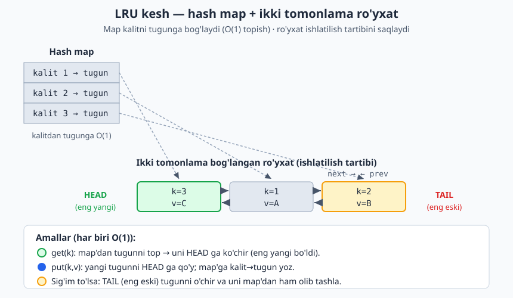

<a id="b31"></a>
# 31-bo'lim: Real-world komponentlar

<sub>[↑ Mundarijaga qaytish](README.md#mundarija)</sub>

> Bu bo'limda haqiqiy tizimlarda doim uchraydigan amaliy komponentlar — kesh strategiyalari,
> rate limiterlar, navbatlar, ID generatorlari, broker va boshqalar — JS, PHP va Python'da
> qisqa va idiomatik ko'rinishda yig'ilgan. Bular tayyor kutubxonalarning soddalashtirilgan
> "ichki mexanizmi": maqsad — ularning qanday ishlashini tushunish va o'zingiz yoza olish.
> Ba'zi komponentlar tilga xos (masalan, async navbat), shuning uchun 1-2 tilda berilgan.

<a id="m622"></a>
### 622. LRU kesh (LRU cache)
Eng kam ishlatilgan elementni siqib chiqaruvchi sig'imi cheklangan kesh; get/put — O(1).
`⏱ O(1) · 💾 O(capacity)`

**JS**
```js
class LRUCache {
  constructor(capacity) { this.cap = capacity; this.map = new Map(); }
  get(key) {
    if (!this.map.has(key)) return -1;
    const val = this.map.get(key);
    this.map.delete(key);
    this.map.set(key, val);
    return val;
  }
  put(key, val) {
    if (this.map.has(key)) this.map.delete(key);
    this.map.set(key, val);
    if (this.map.size > this.cap) this.map.delete(this.map.keys().next().value);
  }
}
// const c = new LRUCache(2); c.put(1,1); c.put(2,2); c.get(1); c.put(3,3); c.get(2) // -1
```
**PHP**
```php
class LRUCache {
    private array $map = [];
    public function __construct(private int $cap) {}
    public function get(int $key): int {
        if (!array_key_exists($key, $this->map)) return -1;
        $val = $this->map[$key];
        unset($this->map[$key]);
        $this->map[$key] = $val;
        return $val;
    }
    public function put(int $key, int $val): void {
        if (array_key_exists($key, $this->map)) unset($this->map[$key]);
        $this->map[$key] = $val;
        if (count($this->map) > $this->cap) array_shift($this->map);
    }
}
```
**Python**
```python
from collections import OrderedDict

class LRUCache:
    def __init__(self, capacity):
        self.cap = capacity
        self.map = OrderedDict()

    def get(self, key):
        if key not in self.map:
            return -1
        self.map.move_to_end(key)
        return self.map[key]

    def put(self, key, val):
        if key in self.map:
            self.map.move_to_end(key)
        self.map[key] = val
        if len(self.map) > self.cap:
            self.map.popitem(last=False)
# c = LRUCache(2); c.put(1, 1); c.put(2, 2); c.get(1); c.put(3, 3); c.get(2)  # -1
```

Klassik LRU ikki tuzilmani birlashtiradi: hash map kalitdan tugunni O(1) da topadi, ikki tomonlama bog'langan ro'yxat esa ishlatilish tartibini saqlaydi — har kirish HEAD ga ko'chadi, sig'im to'lsa eng eski (TAIL) element chiqariladi.



<a id="m623"></a>
### 623. LFU kesh (LFU cache)
Eng kam chastotada (kamdan-kam ishlatilgan) elementni siqib chiqaradi; tenglikda eng eski ketadi.
`⏱ O(1) · 💾 O(capacity)`

**JS**
```js
class LFUCache {
  constructor(capacity) {
    this.cap = capacity;
    this.vals = new Map();
    this.freq = new Map();
    this.buckets = new Map();
    this.minFreq = 0;
  }
  #bump(key) {
    const f = this.freq.get(key);
    this.buckets.get(f).delete(key);
    if (this.buckets.get(f).size === 0) {
      this.buckets.delete(f);
      if (this.minFreq === f) this.minFreq++;
    }
    this.freq.set(key, f + 1);
    if (!this.buckets.has(f + 1)) this.buckets.set(f + 1, new Set());
    this.buckets.get(f + 1).add(key);
  }
  get(key) {
    if (!this.vals.has(key)) return -1;
    this.#bump(key);
    return this.vals.get(key);
  }
  put(key, val) {
    if (this.cap === 0) return;
    if (this.vals.has(key)) { this.vals.set(key, val); this.#bump(key); return; }
    if (this.vals.size >= this.cap) {
      const evict = this.buckets.get(this.minFreq).values().next().value;
      this.buckets.get(this.minFreq).delete(evict);
      this.vals.delete(evict);
      this.freq.delete(evict);
    }
    this.vals.set(key, val);
    this.freq.set(key, 1);
    if (!this.buckets.has(1)) this.buckets.set(1, new Set());
    this.buckets.get(1).add(key);
    this.minFreq = 1;
  }
}
// const c = new LFUCache(2); c.put(1,1); c.put(2,2); c.get(1); c.put(3,3); c.get(2) // -1
```
**Python**
```python
from collections import defaultdict, OrderedDict

class LFUCache:
    def __init__(self, capacity):
        self.cap = capacity
        self.vals = {}
        self.freq = {}
        self.buckets = defaultdict(OrderedDict)
        self.min_freq = 0

    def _bump(self, key):
        f = self.freq[key]
        del self.buckets[f][key]
        if not self.buckets[f]:
            del self.buckets[f]
            if self.min_freq == f:
                self.min_freq += 1
        self.freq[key] = f + 1
        self.buckets[f + 1][key] = None

    def get(self, key):
        if key not in self.vals:
            return -1
        self._bump(key)
        return self.vals[key]

    def put(self, key, val):
        if self.cap == 0:
            return
        if key in self.vals:
            self.vals[key] = val
            self._bump(key)
            return
        if len(self.vals) >= self.cap:
            evict, _ = self.buckets[self.min_freq].popitem(last=False)
            del self.vals[evict]
            del self.freq[evict]
        self.vals[key] = val
        self.freq[key] = 1
        self.buckets[1][key] = None
        self.min_freq = 1
# c = LFUCache(2); c.put(1, 1); c.put(2, 2); c.get(1); c.put(3, 3); c.get(2)  # -1
```

<a id="m624"></a>
### 624. Rate limiter — token bucket
Doimiy tezlikda to'ldiriladigan "tokenlar chelagi"; har so'rov bitta token yeydi, qisqa portlashlarga ruxsat.
`⏱ O(1) · 💾 O(1)`

**JS**
```js
class TokenBucket {
  constructor(capacity, refillPerSec) {
    this.cap = capacity;
    this.rate = refillPerSec;
    this.tokens = capacity;
    this.last = Date.now() / 1000;
  }
  allow(now = Date.now() / 1000) {
    this.tokens = Math.min(this.cap, this.tokens + (now - this.last) * this.rate);
    this.last = now;
    if (this.tokens >= 1) { this.tokens -= 1; return true; }
    return false;
  }
}
// const b = new TokenBucket(2, 1); b.allow(0); b.allow(0); b.allow(0) // true,true,false
```
**PHP**
```php
class TokenBucket {
    private float $tokens;
    private float $last;
    public function __construct(private float $cap, private float $rate) {
        $this->tokens = $cap;
        $this->last = microtime(true);
    }
    public function allow(?float $now = null): bool {
        $now ??= microtime(true);
        $this->tokens = min($this->cap, $this->tokens + ($now - $this->last) * $this->rate);
        $this->last = $now;
        if ($this->tokens >= 1) { $this->tokens -= 1; return true; }
        return false;
    }
}
```
**Python**
```python
import time

class TokenBucket:
    def __init__(self, capacity, refill_per_sec):
        self.cap = capacity
        self.rate = refill_per_sec
        self.tokens = capacity
        self.last = time.monotonic()

    def allow(self, now=None):
        now = time.monotonic() if now is None else now
        self.tokens = min(self.cap, self.tokens + (now - self.last) * self.rate)
        self.last = now
        if self.tokens >= 1:
            self.tokens -= 1
            return True
        return False
# b = TokenBucket(2, 1); b.allow(0); b.allow(0); b.allow(0)  # True, True, False
```

<a id="m625"></a>
### 625. Rate limiter — sliding window log
Har so'rov vaqtini saqlaydi; oynadan eski yozuvlarni o'chirib, joriy sondan limitni tekshiradi.
`⏱ O(eskirgan yozuvlar) · 💾 O(limit)`

**JS**
```js
class SlidingWindowLog {
  constructor(limit, windowSec) { this.limit = limit; this.win = windowSec; this.log = []; }
  allow(now) {
    const cutoff = now - this.win;
    while (this.log.length && this.log[0] <= cutoff) this.log.shift();
    if (this.log.length < this.limit) { this.log.push(now); return true; }
    return false;
  }
}
// const r = new SlidingWindowLog(2, 10); r.allow(0); r.allow(1); r.allow(2) // true,true,false
```
**Python**
```python
from collections import deque

class SlidingWindowLog:
    def __init__(self, limit, window_sec):
        self.limit = limit
        self.win = window_sec
        self.log = deque()

    def allow(self, now):
        cutoff = now - self.win
        while self.log and self.log[0] <= cutoff:
            self.log.popleft()
        if len(self.log) < self.limit:
            self.log.append(now)
            return True
        return False
# r = SlidingWindowLog(2, 10); r.allow(0); r.allow(1); r.allow(2)  # True, True, False
```

<a id="m626"></a>
### 626. Rate limiter — fixed window
Vaqtni teng oynalarga bo'ladi; har oynada hisoblagich limitga yetguncha ruxsat beradi.
`⏱ O(1) · 💾 O(1)`

**JS**
```js
class FixedWindow {
  constructor(limit, windowSec) { this.limit = limit; this.win = windowSec; this.count = 0; this.start = 0; }
  allow(now) {
    const w = Math.floor(now / this.win);
    if (w !== this.start) { this.start = w; this.count = 0; }
    if (this.count < this.limit) { this.count++; return true; }
    return false;
  }
}
// const r = new FixedWindow(2, 10); r.allow(0); r.allow(1); r.allow(2); r.allow(11) // t,t,f,t
```
**PHP**
```php
class FixedWindow {
    private int $count = 0;
    private int $start = -1;
    public function __construct(private int $limit, private int $win) {}
    public function allow(int $now): bool {
        $w = intdiv($now, $this->win);
        if ($w !== $this->start) { $this->start = $w; $this->count = 0; }
        if ($this->count < $this->limit) { $this->count++; return true; }
        return false;
    }
}
```
**Python**
```python
class FixedWindow:
    def __init__(self, limit, window_sec):
        self.limit = limit
        self.win = window_sec
        self.count = 0
        self.start = -1

    def allow(self, now):
        w = now // self.win
        if w != self.start:
            self.start = w
            self.count = 0
        if self.count < self.limit:
            self.count += 1
            return True
        return False
# r = FixedWindow(2, 10); r.allow(0); r.allow(1); r.allow(2); r.allow(11)  # T,T,F,T
```

<a id="m627"></a>
### 627. Eksponensial backoff bilan qayta urinish (retry)
Har muvaffaqiyatsiz urinishdan keyin kutish vaqtini ikki barobar oshirib, funksiyani qayta chaqiradi.
`⏱ O(attempts) · 💾 O(1)`

**JS**
```js
async function retry(fn, { retries = 3, base = 100 } = {}) {
  let lastErr;
  for (let i = 0; i <= retries; i++) {
    try { return await fn(); }
    catch (e) {
      lastErr = e;
      if (i < retries) await new Promise(r => setTimeout(r, base * 2 ** i));
    }
  }
  throw lastErr;
}
// let n = 0; await retry(async () => { if (++n < 3) throw new Error("x"); return n; }) // 3
```
**Python**
```python
import time

def retry(fn, retries=3, base=0.1):
    last_err = None
    for i in range(retries + 1):
        try:
            return fn()
        except Exception as e:
            last_err = e
            if i < retries:
                time.sleep(base * 2 ** i)
    raise last_err
# n = [0]
# def f():
#     n[0] += 1
#     if n[0] < 3: raise ValueError("x")
#     return n[0]
# retry(f, base=0)  # 3
```

<a id="m628"></a>
### 628. Circuit breaker
Ketma-ket xatolar chegaradan oshsa "ochiladi" va so'rovlarni bloklaydi; vaqt o'tib yarim-ochiq holatda sinaydi.
`⏱ O(1) · 💾 O(1)`

**JS**
```js
class CircuitBreaker {
  constructor(threshold = 3, cooldown = 5) {
    this.threshold = threshold;
    this.cooldown = cooldown;
    this.fails = 0;
    this.state = "closed";
    this.openedAt = 0;
  }
  call(fn, now) {
    if (this.state === "open") {
      if (now - this.openedAt >= this.cooldown) this.state = "half";
      else throw new Error("circuit ochiq");
    }
    try {
      const r = fn();
      this.fails = 0; this.state = "closed";
      return r;
    } catch (e) {
      if (++this.fails >= this.threshold) { this.state = "open"; this.openedAt = now; }
      throw e;
    }
  }
}
```
**Python**
```python
class CircuitBreaker:
    def __init__(self, threshold=3, cooldown=5):
        self.threshold = threshold
        self.cooldown = cooldown
        self.fails = 0
        self.state = "closed"
        self.opened_at = 0

    def call(self, fn, now):
        if self.state == "open":
            if now - self.opened_at >= self.cooldown:
                self.state = "half"
            else:
                raise RuntimeError("circuit ochiq")
        try:
            r = fn()
            self.fails = 0
            self.state = "closed"
            return r
        except Exception:
            self.fails += 1
            if self.fails >= self.threshold:
                self.state = "open"
                self.opened_at = now
            raise
```

<a id="m629"></a>
### 629. Offset paginatsiya (offset pagination)
Sahifa raqami va o'lchami bo'yicha ma'lumotlardan bir bo'lakni qaytaradi.
`⏱ O(pageSize) · 💾 O(pageSize)`

**JS**
```js
function paginate(items, page, pageSize) {
  const total = items.length;
  const pages = Math.ceil(total / pageSize) || 1;
  const start = (page - 1) * pageSize;
  return { page, pageSize, total, pages, data: items.slice(start, start + pageSize) };
}
// paginate([1,2,3,4,5], 2, 2).data // [3,4]
```
**PHP**
```php
function paginate(array $items, int $page, int $pageSize): array {
    $total = count($items);
    $pages = (int) ceil($total / $pageSize) ?: 1;
    $start = ($page - 1) * $pageSize;
    return [
        "page" => $page, "pageSize" => $pageSize, "total" => $total,
        "pages" => $pages, "data" => array_slice($items, $start, $pageSize),
    ];
}
```
**Python**
```python
import math

def paginate(items, page, page_size):
    total = len(items)
    pages = math.ceil(total / page_size) or 1
    start = (page - 1) * page_size
    return {
        "page": page, "page_size": page_size, "total": total,
        "pages": pages, "data": items[start:start + page_size],
    }
# paginate([1, 2, 3, 4, 5], 2, 2)["data"]  # [3, 4]
```

<a id="m630"></a>
### 630. Cursor paginatsiya (cursor pagination)
Oldingi sahifaning oxirgi id'sidan keyingi elementlarni oladi; katta jadvallarda barqaror.
`⏱ O(n) topish · 💾 O(limit)`

**JS**
```js
function cursorPage(items, cursor, limit) {
  let start = 0;
  if (cursor != null) {
    const idx = items.findIndex(x => x.id === cursor);
    start = idx === -1 ? items.length : idx + 1;
  }
  const data = items.slice(start, start + limit);
  const next = data.length === limit ? data[data.length - 1].id : null;
  return { data, nextCursor: next };
}
// const xs = [{id:1},{id:2},{id:3}]; cursorPage(xs, 1, 1) // { data:[{id:2}], nextCursor:2 }
```
**Python**
```python
def cursor_page(items, cursor, limit):
    start = 0
    if cursor is not None:
        idx = next((i for i, x in enumerate(items) if x["id"] == cursor), -1)
        start = len(items) if idx == -1 else idx + 1
    data = items[start:start + limit]
    nxt = data[-1]["id"] if len(data) == limit else None
    return {"data": data, "next_cursor": nxt}
# xs = [{"id": 1}, {"id": 2}, {"id": 3}]; cursor_page(xs, 1, 1)
# {"data": [{"id": 2}], "next_cursor": 2}
```

<a id="m631"></a>
### 631. TTL kalit-qiymat ombor (TTL key-value store)
Har kalit yashash muddati (TTL) bilan saqlanadi; muddati o'tgani o'qishda yo'q deb hisoblanadi.
`⏱ O(1) · 💾 O(n)`

**JS**
```js
class TTLStore {
  constructor() { this.map = new Map(); }
  set(key, val, ttl, now) { this.map.set(key, { val, exp: now + ttl }); }
  get(key, now) {
    const e = this.map.get(key);
    if (!e) return undefined;
    if (e.exp <= now) { this.map.delete(key); return undefined; }
    return e.val;
  }
}
// const s = new TTLStore(); s.set("a", 1, 10, 0); s.get("a", 5); s.get("a", 20) // 1, undefined
```
**PHP**
```php
class TTLStore {
    private array $map = [];
    public function set(string $key, mixed $val, int $ttl, int $now): void {
        $this->map[$key] = ["val" => $val, "exp" => $now + $ttl];
    }
    public function get(string $key, int $now): mixed {
        if (!isset($this->map[$key])) return null;
        if ($this->map[$key]["exp"] <= $now) { unset($this->map[$key]); return null; }
        return $this->map[$key]["val"];
    }
}
```
**Python**
```python
class TTLStore:
    def __init__(self):
        self.map = {}

    def set(self, key, val, ttl, now):
        self.map[key] = (val, now + ttl)

    def get(self, key, now):
        if key not in self.map:
            return None
        val, exp = self.map[key]
        if exp <= now:
            del self.map[key]
            return None
        return val
# s = TTLStore(); s.set("a", 1, 10, 0); s.get("a", 5); s.get("a", 20)  # 1, None
```

<a id="m632"></a>
### 632. Event emitter (on/off/emit)
Hodisa nomiga tinglovchilar ulanadi; emit barcha tinglovchilarni chaqiradi, off ularni uzadi.
`⏱ O(tinglovchilar) · 💾 O(n)`

**JS**
```js
class EventEmitter {
  constructor() { this.handlers = new Map(); }
  on(event, fn) {
    if (!this.handlers.has(event)) this.handlers.set(event, new Set());
    this.handlers.get(event).add(fn);
    return this;
  }
  off(event, fn) { this.handlers.get(event)?.delete(fn); return this; }
  emit(event, ...args) {
    for (const fn of this.handlers.get(event) ?? []) fn(...args);
  }
}
// const e = new EventEmitter(); let got; e.on("hi", x => got = x); e.emit("hi", 5) // got === 5
```
**PHP**
```php
class EventEmitter {
    private array $handlers = [];
    public function on(string $event, callable $fn): static {
        $this->handlers[$event][] = $fn;
        return $this;
    }
    public function off(string $event, callable $fn): static {
        $this->handlers[$event] = array_filter(
            $this->handlers[$event] ?? [], fn($h) => $h !== $fn
        );
        return $this;
    }
    public function emit(string $event, mixed ...$args): void {
        foreach ($this->handlers[$event] ?? [] as $fn) $fn(...$args);
    }
}
```
**Python**
```python
class EventEmitter:
    def __init__(self):
        self.handlers = {}

    def on(self, event, fn):
        self.handlers.setdefault(event, []).append(fn)
        return self

    def off(self, event, fn):
        if event in self.handlers:
            self.handlers[event] = [h for h in self.handlers[event] if h is not fn]
        return self

    def emit(self, event, *args):
        for fn in list(self.handlers.get(event, [])):
            fn(*args)
# e = EventEmitter(); got = []; e.on("hi", got.append); e.emit("hi", 5)  # got == [5]
```

<a id="m633"></a>
### 633. Pub-sub broker (mavzular bo'yicha)
Nashrchilar mavzuga xabar yuboradi; o'sha mavzuga obuna bo'lganlarning hammasi xabarni oladi.
`⏱ O(obunachilar) · 💾 O(n)`

**JS**
```js
class Broker {
  constructor() { this.topics = new Map(); }
  subscribe(topic, fn) {
    if (!this.topics.has(topic)) this.topics.set(topic, new Set());
    this.topics.get(topic).add(fn);
    return () => this.topics.get(topic).delete(fn);
  }
  publish(topic, msg) {
    for (const fn of this.topics.get(topic) ?? []) fn(msg);
  }
}
// const b = new Broker(); const out = []; b.subscribe("t", m => out.push(m)); b.publish("t", 1)
```
**Python**
```python
class Broker:
    def __init__(self):
        self.topics = {}

    def subscribe(self, topic, fn):
        self.topics.setdefault(topic, set()).add(fn)
        return lambda: self.topics[topic].discard(fn)

    def publish(self, topic, msg):
        for fn in list(self.topics.get(topic, set())):
            fn(msg)
# b = Broker(); out = []; b.subscribe("t", out.append); b.publish("t", 1)  # out == [1]
```

<a id="m634"></a>
### 634. Observer (unsubscribe bilan)
Subyekt holatini kuzatuvchilarga xabar beradi; obuna funksiya uzish (unsubscribe) qaytaradi.
`⏱ O(kuzatuvchilar) · 💾 O(n)`

**JS**
```js
class Subject {
  constructor() { this.observers = new Set(); }
  subscribe(fn) { this.observers.add(fn); return () => this.observers.delete(fn); }
  notify(state) { for (const fn of this.observers) fn(state); }
}
// const s = new Subject(); const log = []; const un = s.subscribe(x => log.push(x));
// s.notify(1); un(); s.notify(2) // log === [1]
```
**Python**
```python
class Subject:
    def __init__(self):
        self.observers = set()

    def subscribe(self, fn):
        self.observers.add(fn)
        return lambda: self.observers.discard(fn)

    def notify(self, state):
        for fn in list(self.observers):
            fn(state)
# s = Subject(); log = []; un = s.subscribe(log.append)
# s.notify(1); un(); s.notify(2)  # log == [1]
```

<a id="m635"></a>
### 635. Async navbat (concurrency limit)
Bir vaqtda faqat N ta vazifa ishlaydi; qolganlari navbatda kutadi va o'rin bo'shaganda ishga tushadi.
`⏱ O(1) qo'shish · 💾 O(navbat)`

**JS**
```js
class AsyncQueue {
  constructor(concurrency) { this.limit = concurrency; this.active = 0; this.queue = []; }
  add(task) {
    return new Promise((resolve, reject) => {
      this.queue.push({ task, resolve, reject });
      this.#next();
    });
  }
  #next() {
    if (this.active >= this.limit || this.queue.length === 0) return;
    this.active++;
    const { task, resolve, reject } = this.queue.shift();
    Promise.resolve()
      .then(task)
      .then(resolve, reject)
      .finally(() => { this.active--; this.#next(); });
  }
}
// const q = new AsyncQueue(2); await Promise.all([1,2,3].map(x => q.add(async () => x*2))) // [2,4,6]
```

<a id="m636"></a>
### 636. Ustuvor vazifa navbati (priority task queue)
Vazifalar ustuvorlik bo'yicha chiqariladi; ichida min-heap (binar uyum) ishlatiladi.
`⏱ O(log n) · 💾 O(n)`

**JS**
```js
class PriorityQueue {
  constructor() { this.heap = []; }
  #up(i) {
    while (i > 0) {
      const p = (i - 1) >> 1;
      if (this.heap[p][0] <= this.heap[i][0]) break;
      [this.heap[p], this.heap[i]] = [this.heap[i], this.heap[p]];
      i = p;
    }
  }
  #down(i) {
    const n = this.heap.length;
    for (;;) {
      let s = i, l = 2 * i + 1, r = l + 1;
      if (l < n && this.heap[l][0] < this.heap[s][0]) s = l;
      if (r < n && this.heap[r][0] < this.heap[s][0]) s = r;
      if (s === i) break;
      [this.heap[s], this.heap[i]] = [this.heap[i], this.heap[s]];
      i = s;
    }
  }
  push(priority, task) { this.heap.push([priority, task]); this.#up(this.heap.length - 1); }
  pop() {
    const top = this.heap[0];
    const last = this.heap.pop();
    if (this.heap.length) { this.heap[0] = last; this.#down(0); }
    return top;
  }
}
// const q = new PriorityQueue(); q.push(2,"b"); q.push(1,"a"); q.pop() // [1,"a"]
```
**Python**
```python
import heapq

class PriorityQueue:
    def __init__(self):
        self.heap = []
        self.seq = 0

    def push(self, priority, task):
        heapq.heappush(self.heap, (priority, self.seq, task))
        self.seq += 1

    def pop(self):
        priority, _, task = heapq.heappop(self.heap)
        return (priority, task)
# q = PriorityQueue(); q.push(2, "b"); q.push(1, "a"); q.pop()  # (1, "a")
```

<a id="m637"></a>
### 637. Obyekt pool (object pool)
Qimmat obyektlarni qayta yaratmay, bo'sh ro'yxatdan beradi va ishlatilgach qaytarib oladi.
`⏱ O(1) · 💾 O(n)`

**JS**
```js
class ObjectPool {
  constructor(factory) { this.factory = factory; this.free = []; this.inUse = 0; }
  acquire() {
    this.inUse++;
    return this.free.length ? this.free.pop() : this.factory();
  }
  release(obj) { this.inUse--; this.free.push(obj); }
}
// const p = new ObjectPool(() => ({})); const a = p.acquire(); p.release(a); p.acquire() === a // true
```
**PHP**
```php
class ObjectPool {
    private array $free = [];
    public int $inUse = 0;
    public function __construct(private \Closure $factory) {}
    public function acquire(): object {
        $this->inUse++;
        return array_pop($this->free) ?? ($this->factory)();
    }
    public function release(object $obj): void {
        $this->inUse--;
        $this->free[] = $obj;
    }
}
```
**Python**
```python
class ObjectPool:
    def __init__(self, factory):
        self.factory = factory
        self.free = []
        self.in_use = 0

    def acquire(self):
        self.in_use += 1
        return self.free.pop() if self.free else self.factory()

    def release(self, obj):
        self.in_use -= 1
        self.free.append(obj)
# p = ObjectPool(dict); a = p.acquire(); p.release(a); p.acquire() is a  # True
```

<a id="m638"></a>
### 638. Connection pool (oddiy)
Cheklangan sonli ulanishni boshqaradi; bo'sh ulanish bo'lmasa, mavjudligini bildirib qaytaradi.
`⏱ O(1) · 💾 O(maxConn)`

**JS**
```js
class ConnectionPool {
  constructor(maxConn, factory) {
    this.max = maxConn;
    this.factory = factory;
    this.idle = [];
    this.active = 0;
  }
  acquire() {
    if (this.idle.length) { this.active++; return this.idle.pop(); }
    if (this.active < this.max) { this.active++; return this.factory(); }
    return null;
  }
  release(conn) { this.active--; this.idle.push(conn); }
}
// const p = new ConnectionPool(1, () => ({})); p.acquire(); p.acquire() // obj, null
```
**Python**
```python
class ConnectionPool:
    def __init__(self, max_conn, factory):
        self.max = max_conn
        self.factory = factory
        self.idle = []
        self.active = 0

    def acquire(self):
        if self.idle:
            self.active += 1
            return self.idle.pop()
        if self.active < self.max:
            self.active += 1
            return self.factory()
        return None

    def release(self, conn):
        self.active -= 1
        self.idle.append(conn)
# p = ConnectionPool(1, dict); p.acquire(); p.acquire()  # obj, None
```

<a id="m639"></a>
### 639. Bloom filtri (bloom filter)
Ehtimoliy to'plam: "yo'q" aniq, "bor" — ehtimol; bir nechta hash funksiyasi bilan bit massivi.
`⏱ O(k) · 💾 O(m bit)`

**JS**
```js
class BloomFilter {
  constructor(size = 1024, hashes = 3) {
    this.size = size; this.k = hashes; this.bits = new Uint8Array(size);
  }
  #hash(item, seed) {
    let h = seed;
    for (const ch of String(item)) h = (h * 31 + ch.charCodeAt(0)) >>> 0;
    return h % this.size;
  }
  add(item) { for (let i = 0; i < this.k; i++) this.bits[this.#hash(item, i + 1)] = 1; }
  has(item) {
    for (let i = 0; i < this.k; i++) if (!this.bits[this.#hash(item, i + 1)]) return false;
    return true;
  }
}
// const b = new BloomFilter(); b.add("x"); b.has("x"); b.has("y") // true, ehtimol false
```
**Python**
```python
class BloomFilter:
    def __init__(self, size=1024, hashes=3):
        self.size = size
        self.k = hashes
        self.bits = bytearray(size)

    def _hash(self, item, seed):
        h = seed
        for ch in str(item):
            h = (h * 31 + ord(ch)) & 0xFFFFFFFF
        return h % self.size

    def add(self, item):
        for i in range(self.k):
            self.bits[self._hash(item, i + 1)] = 1

    def has(self, item):
        return all(self.bits[self._hash(item, i + 1)] for i in range(self.k))
# b = BloomFilter(); b.add("x"); b.has("x"); b.has("y")  # True, ehtimol False
```

<a id="m640"></a>
### 640. Konsistent xeshlash (consistent hashing, hash ring)
Tugunlarni doira (ring) bo'ylab joylashtiradi; kalit soat strelkasi bo'yicha keyingi tugunga tegadi.
`⏱ O(log n) · 💾 O(n × replicas)`

**JS**
```js
class HashRing {
  constructor(replicas = 3) { this.replicas = replicas; this.ring = []; }
  #hash(s) {
    let h = 0;
    for (const ch of s) h = (h * 31 + ch.charCodeAt(0)) >>> 0;
    return h;
  }
  add(node) {
    for (let i = 0; i < this.replicas; i++)
      this.ring.push([this.#hash(node + "#" + i), node]);
    this.ring.sort((a, b) => a[0] - b[0]);
  }
  get(key) {
    if (!this.ring.length) return null;
    const h = this.#hash(key);
    for (const [pos, node] of this.ring) if (pos >= h) return node;
    return this.ring[0][1];
  }
}
// const r = new HashRing(); r.add("a"); r.add("b"); typeof r.get("key1") // "string"
```
**Python**
```python
import bisect

class HashRing:
    def __init__(self, replicas=3):
        self.replicas = replicas
        self.keys = []
        self.nodes = {}

    def _hash(self, s):
        h = 0
        for ch in s:
            h = (h * 31 + ord(ch)) & 0xFFFFFFFF
        return h

    def add(self, node):
        for i in range(self.replicas):
            pos = self._hash(f"{node}#{i}")
            idx = bisect.bisect(self.keys, pos)
            self.keys.insert(idx, pos)
            self.nodes[pos] = node

    def get(self, key):
        if not self.keys:
            return None
        h = self._hash(key)
        idx = bisect.bisect(self.keys, h) % len(self.keys)
        return self.nodes[self.keys[idx]]
# r = HashRing(); r.add("a"); r.add("b"); isinstance(r.get("key1"), str)  # True
```

<a id="m641"></a>
### 641. Snowflake ID generator
64-bitli ID: vaqt belgisi + tugun id + ketma-ket hisoblagich; bir mashinada o'sib boradigan noyob ID.
`⏱ O(1) · 💾 O(1)`

**JS**
```js
class Snowflake {
  constructor(nodeId, epoch = 0) {
    this.node = BigInt(nodeId & 0x3ff);
    this.epoch = BigInt(epoch);
    this.seq = 0n;
    this.last = -1n;
  }
  next(nowMs) {
    let ts = BigInt(nowMs);
    if (ts === this.last) {
      this.seq = (this.seq + 1n) & 0xfffn;
      if (this.seq === 0n) ts++;
    } else this.seq = 0n;
    this.last = ts;
    return ((ts - this.epoch) << 22n) | (this.node << 12n) | this.seq;
  }
}
// const s = new Snowflake(1); s.next(1000) < s.next(1001) // true
```
**Python**
```python
class Snowflake:
    def __init__(self, node_id, epoch=0):
        self.node = node_id & 0x3FF
        self.epoch = epoch
        self.seq = 0
        self.last = -1

    def next(self, now_ms):
        ts = now_ms
        if ts == self.last:
            self.seq = (self.seq + 1) & 0xFFF
            if self.seq == 0:
                ts += 1
        else:
            self.seq = 0
        self.last = ts
        return ((ts - self.epoch) << 22) | (self.node << 12) | self.seq
# s = Snowflake(1); s.next(1000) < s.next(1001)  # True
```

<a id="m642"></a>
### 642. UUID v4 generator
Tasodifiy 128-bitli identifikatorni standart 8-4-4-4-12 ko'rinishida hosil qiladi (versiya 4 va variant bitlari bilan).
`⏱ O(1) · 💾 O(1)`

**JS**
```js
import { randomBytes } from "node:crypto";

function uuidV4() {
  const b = randomBytes(16);
  b[6] = (b[6] & 0x0f) | 0x40;
  b[8] = (b[8] & 0x3f) | 0x80;
  const hex = [...b].map(x => x.toString(16).padStart(2, "0")).join("");
  return `${hex.slice(0,8)}-${hex.slice(8,12)}-${hex.slice(12,16)}-${hex.slice(16,20)}-${hex.slice(20)}`;
}
// uuidV4() // "3f2504e0-4f89-41d3-9a0c-0305e82c3301" kabi
```
**PHP**
```php
function uuidV4(): string {
    $b = random_bytes(16);
    $b[6] = chr((ord($b[6]) & 0x0f) | 0x40);
    $b[8] = chr((ord($b[8]) & 0x3f) | 0x80);
    return vsprintf("%s%s-%s-%s-%s-%s%s%s", str_split(bin2hex($b), 4));
}
```
**Python**
```python
import os

def uuid_v4():
    b = bytearray(os.urandom(16))
    b[6] = (b[6] & 0x0F) | 0x40
    b[8] = (b[8] & 0x3F) | 0x80
    h = b.hex()
    return f"{h[:8]}-{h[8:12]}-{h[12:16]}-{h[16:20]}-{h[20:]}"
# uuid_v4()  # "3f2504e0-4f89-41d3-9a0c-0305e82c3301" kabi
```

<a id="m643"></a>
### 643. Base62 kodlash/dekodlash (base62 encode/decode)
Butun sonni 0-9A-Za-z belgilaridan iborat qisqa satrga aylantiradi va qaytaradi.
`⏱ O(log n) · 💾 O(log n)`

**JS**
```js
const ALPHABET = "0123456789abcdefghijklmnopqrstuvwxyzABCDEFGHIJKLMNOPQRSTUVWXYZ";
function base62Encode(num) {
  if (num === 0) return "0";
  let s = "";
  while (num > 0) { s = ALPHABET[num % 62] + s; num = Math.floor(num / 62); }
  return s;
}
function base62Decode(str) {
  let num = 0;
  for (const ch of str) num = num * 62 + ALPHABET.indexOf(ch);
  return num;
}
// base62Decode(base62Encode(125)) === 125 // true
```
**PHP**
```php
const BASE62 = "0123456789abcdefghijklmnopqrstuvwxyzABCDEFGHIJKLMNOPQRSTUVWXYZ";
function base62Encode(int $num): string {
    if ($num === 0) return "0";
    $s = "";
    while ($num > 0) { $s = BASE62[$num % 62] . $s; $num = intdiv($num, 62); }
    return $s;
}
function base62Decode(string $str): int {
    $num = 0;
    foreach (str_split($str) as $ch) $num = $num * 62 + strpos(BASE62, $ch);
    return $num;
}
```
**Python**
```python
ALPHABET = "0123456789abcdefghijklmnopqrstuvwxyzABCDEFGHIJKLMNOPQRSTUVWXYZ"

def base62_encode(num):
    if num == 0:
        return "0"
    s = ""
    while num > 0:
        num, rem = divmod(num, 62)
        s = ALPHABET[rem] + s
    return s

def base62_decode(s):
    num = 0
    for ch in s:
        num = num * 62 + ALPHABET.index(ch)
    return num
# base62_decode(base62_encode(125)) == 125  # True
```

<a id="m644"></a>
### 644. URL qisqartiruvchi (URL shortener)
ID'ni base62 kodi orqali qisqa kalitga aylantiruvchi xizmat; kalit bo'yicha asl URL'ni qaytaradi.
`⏱ O(1) · 💾 O(n)`

**JS**
```js
class URLShortener {
  constructor() { this.urls = new Map(); this.id = 0; this.alphabet = "0123456789abcdefghijklmnopqrstuvwxyzABCDEFGHIJKLMNOPQRSTUVWXYZ"; }
  #encode(n) {
    let s = "";
    do { s = this.alphabet[n % 62] + s; n = Math.floor(n / 62); } while (n > 0);
    return s;
  }
  shorten(url) {
    const code = this.#encode(this.id++);
    this.urls.set(code, url);
    return code;
  }
  resolve(code) { return this.urls.get(code) ?? null; }
}
// const s = new URLShortener(); const c = s.shorten("https://a.uz"); s.resolve(c) // "https://a.uz"
```
**Python**
```python
class URLShortener:
    ALPHABET = "0123456789abcdefghijklmnopqrstuvwxyzABCDEFGHIJKLMNOPQRSTUVWXYZ"

    def __init__(self):
        self.urls = {}
        self.id = 0

    def _encode(self, n):
        s = ""
        while True:
            n, rem = divmod(n, 62)
            s = self.ALPHABET[rem] + s
            if n == 0:
                break
        return s

    def shorten(self, url):
        code = self._encode(self.id)
        self.id += 1
        self.urls[code] = url
        return code

    def resolve(self, code):
        return self.urls.get(code)
# s = URLShortener(); c = s.shorten("https://a.uz"); s.resolve(c)  # "https://a.uz"
```

<a id="m645"></a>
### 645. Avtoto'ldirish xizmati (autocomplete, trie asosida)
Trie (prefiks daraxti) yordamida berilgan prefiks bilan boshlanadigan barcha so'zlarni topadi.
`⏱ O(prefiks + natijalar) · 💾 O(belgilar)`

**JS**
```js
class Autocomplete {
  constructor() { this.root = {}; }
  insert(word) {
    let node = this.root;
    for (const ch of word) node = node[ch] ??= {};
    node.$ = word;
  }
  #collect(node, out) {
    if (node.$) out.push(node.$);
    for (const ch in node) if (ch !== "$") this.#collect(node[ch], out);
  }
  suggest(prefix) {
    let node = this.root;
    for (const ch of prefix) { if (!node[ch]) return []; node = node[ch]; }
    const out = [];
    this.#collect(node, out);
    return out;
  }
}
// const a = new Autocomplete(); a.insert("car"); a.insert("card"); a.suggest("car").sort() // ["car","card"]
```
**Python**
```python
class Autocomplete:
    def __init__(self):
        self.root = {}

    def insert(self, word):
        node = self.root
        for ch in word:
            node = node.setdefault(ch, {})
        node["$"] = word

    def _collect(self, node, out):
        if "$" in node:
            out.append(node["$"])
        for ch, child in node.items():
            if ch != "$":
                self._collect(child, out)

    def suggest(self, prefix):
        node = self.root
        for ch in prefix:
            if ch not in node:
                return []
            node = node[ch]
        out = []
        self._collect(node, out)
        return out
# a = Autocomplete(); a.insert("car"); a.insert("card"); sorted(a.suggest("car"))
# ["car", "card"]
```

<a id="m646"></a>
### 646. Write-through kesh (write-through cache)
Yozuvda ham keshga, ham asosiy omborga bir vaqtda yoziladi; o'qish keshdan, bo'lmasa ombordan.
`⏱ O(1) · 💾 O(n)`

**JS**
```js
class WriteThroughCache {
  constructor(store) { this.store = store; this.cache = new Map(); }
  set(key, val) { this.cache.set(key, val); this.store.set(key, val); }
  get(key) {
    if (this.cache.has(key)) return this.cache.get(key);
    const val = this.store.get(key);
    if (val !== undefined) this.cache.set(key, val);
    return val;
  }
}
// const db = new Map(); const c = new WriteThroughCache(db); c.set("a", 1); db.get("a") // 1
```
**Python**
```python
class WriteThroughCache:
    def __init__(self, store):
        self.store = store
        self.cache = {}

    def set(self, key, val):
        self.cache[key] = val
        self.store[key] = val

    def get(self, key):
        if key in self.cache:
            return self.cache[key]
        val = self.store.get(key)
        if val is not None:
            self.cache[key] = val
        return val
# db = {}; c = WriteThroughCache(db); c.set("a", 1); db["a"]  # 1
```

<a id="m647"></a>
### 647. Deduplikatsiya (oxirgi N)
Oxirgi N ta ko'rilgan elementni eslab qoladi; takror kelganini "ko'rilgan" deb belgilaydi.
`⏱ O(1) · 💾 O(N)`

**JS**
```js
class Deduper {
  constructor(maxSize) { this.max = maxSize; this.seen = new Set(); this.order = []; }
  isNew(item) {
    if (this.seen.has(item)) return false;
    this.seen.add(item);
    this.order.push(item);
    if (this.order.length > this.max) this.seen.delete(this.order.shift());
    return true;
  }
}
// const d = new Deduper(2); d.isNew("a"); d.isNew("a"); d.isNew("b"); d.isNew("c"); d.isNew("a")
// true, false, true, true, true (a siqib chiqarilgan)
```
**Python**
```python
from collections import deque

class Deduper:
    def __init__(self, max_size):
        self.max = max_size
        self.seen = set()
        self.order = deque()

    def is_new(self, item):
        if item in self.seen:
            return False
        self.seen.add(item)
        self.order.append(item)
        if len(self.order) > self.max:
            self.seen.discard(self.order.popleft())
        return True
# d = Deduper(2); d.is_new("a"); d.is_new("a"); d.is_new("b"); d.is_new("c"); d.is_new("a")
# True, False, True, True, True
```

<a id="m648"></a>
### 648. Idempotentlik kaliti ombori (idempotency key store)
Bir xil kalit bilan kelgan operatsiyani qayta bajarmay, birinchi natijani qaytaradi.
`⏱ O(1) · 💾 O(n)`

**JS**
```js
class IdempotencyStore {
  constructor() { this.results = new Map(); }
  execute(key, fn) {
    if (this.results.has(key)) return this.results.get(key);
    const result = fn();
    this.results.set(key, result);
    return result;
  }
}
// const s = new IdempotencyStore(); let calls = 0; const f = () => ++calls;
// s.execute("k", f); s.execute("k", f); calls // 1
```
**PHP**
```php
class IdempotencyStore {
    private array $results = [];
    public function execute(string $key, callable $fn): mixed {
        if (array_key_exists($key, $this->results)) return $this->results[$key];
        return $this->results[$key] = $fn();
    }
}
```
**Python**
```python
class IdempotencyStore:
    def __init__(self):
        self.results = {}

    def execute(self, key, fn):
        if key in self.results:
            return self.results[key]
        result = fn()
        self.results[key] = result
        return result
# s = IdempotencyStore(); calls = [0]
# def f(): calls[0] += 1; return calls[0]
# s.execute("k", f); s.execute("k", f); calls[0]  # 1
```

<a id="m649"></a>
### 649. Feature flag baholovchi (feature flag evaluator)
Bayroqning yoqilgan/o'chirilgan holatini va foiz bo'yicha bosqichli yoyilishni baholaydi.
`⏱ O(1) · 💾 O(flaglar)`

**JS**
```js
class FeatureFlags {
  constructor(flags) { this.flags = flags; }
  #hash(s) {
    let h = 0;
    for (const ch of s) h = (h * 31 + ch.charCodeAt(0)) >>> 0;
    return h % 100;
  }
  isEnabled(name, userId = "") {
    const flag = this.flags[name];
    if (!flag || !flag.on) return false;
    if (flag.rollout == null) return true;
    return this.#hash(name + ":" + userId) < flag.rollout;
  }
}
// const f = new FeatureFlags({ beta: { on: true, rollout: 50 } }); typeof f.isEnabled("beta", "u1")
```
**PHP**
```php
class FeatureFlags {
    public function __construct(private array $flags) {}
    private function hash(string $s): int {
        $h = 0;
        foreach (str_split($s) as $ch) $h = ($h * 31 + ord($ch)) & 0xFFFFFFFF;
        return $h % 100;
    }
    public function isEnabled(string $name, string $userId = ""): bool {
        $flag = $this->flags[$name] ?? null;
        if (!$flag || !$flag["on"]) return false;
        if (!isset($flag["rollout"])) return true;
        return $this->hash("$name:$userId") < $flag["rollout"];
    }
}
```
**Python**
```python
class FeatureFlags:
    def __init__(self, flags):
        self.flags = flags

    def _hash(self, s):
        h = 0
        for ch in s:
            h = (h * 31 + ord(ch)) & 0xFFFFFFFF
        return h % 100

    def is_enabled(self, name, user_id=""):
        flag = self.flags.get(name)
        if not flag or not flag.get("on"):
            return False
        if flag.get("rollout") is None:
            return True
        return self._hash(f"{name}:{user_id}") < flag["rollout"]
# f = FeatureFlags({"beta": {"on": True, "rollout": 50}}); type(f.is_enabled("beta", "u1"))
```

<a id="m650"></a>
### 650. A/B test guruhlash (A/B bucketing, hash bilan)
Foydalanuvchini barqaror hash orqali variantlardan biriga tushiradi; bir user doim bir guruhda.
`⏱ O(1) · 💾 O(1)`

**JS**
```js
function assignVariant(userId, variants) {
  let h = 0;
  for (const ch of userId) h = (h * 31 + ch.charCodeAt(0)) >>> 0;
  return variants[h % variants.length];
}
// assignVariant("user42", ["A", "B"]) // har doim bir xil variant
```
**PHP**
```php
function assignVariant(string $userId, array $variants): string {
    $h = 0;
    foreach (str_split($userId) as $ch) $h = ($h * 31 + ord($ch)) & 0xFFFFFFFF;
    return $variants[$h % count($variants)];
}
```
**Python**
```python
def assign_variant(user_id, variants):
    h = 0
    for ch in user_id:
        h = (h * 31 + ord(ch)) & 0xFFFFFFFF
    return variants[h % len(variants)]
# assign_variant("user42", ["A", "B"])  # har doim bir xil variant
```

<a id="m651"></a>
### 651. Reyting jadvali (leaderboard, saralangan)
O'yinchilarning ballarini saqlaydi va eng yuqori N tasini tartiblangan holda qaytaradi.
`⏱ O(n log n) top · 💾 O(n)`

**JS**
```js
class Leaderboard {
  constructor() { this.scores = new Map(); }
  submit(player, score) {
    this.scores.set(player, Math.max(score, this.scores.get(player) ?? -Infinity));
  }
  top(n) {
    return [...this.scores.entries()]
      .sort((a, b) => b[1] - a[1])
      .slice(0, n)
      .map(([player, score]) => ({ player, score }));
  }
}
// const l = new Leaderboard(); l.submit("a", 10); l.submit("b", 20); l.top(1) // [{player:"b",score:20}]
```
**Python**
```python
import heapq

class Leaderboard:
    def __init__(self):
        self.scores = {}

    def submit(self, player, score):
        self.scores[player] = max(score, self.scores.get(player, float("-inf")))

    def top(self, n):
        best = heapq.nlargest(n, self.scores.items(), key=lambda kv: kv[1])
        return [{"player": p, "score": s} for p, s in best]
# l = Leaderboard(); l.submit("a", 10); l.submit("b", 20); l.top(1)
# [{"player": "b", "score": 20}]
```

<a id="m652"></a>
### 652. Sessiya ombori (session store, TTL)
Sessiyalarni token bo'yicha saqlaydi; har murojaatda muddatni uzaytiradi, eskirganini o'chiradi.
`⏱ O(1) · 💾 O(sessiyalar)`

**JS**
```js
class SessionStore {
  constructor(ttl) { this.ttl = ttl; this.sessions = new Map(); }
  create(token, data, now) { this.sessions.set(token, { data, exp: now + this.ttl }); }
  get(token, now) {
    const s = this.sessions.get(token);
    if (!s || s.exp <= now) { this.sessions.delete(token); return null; }
    s.exp = now + this.ttl;
    return s.data;
  }
}
// const st = new SessionStore(10); st.create("t", { user: 1 }, 0); st.get("t", 5) // { user: 1 }
```
**PHP**
```php
class SessionStore {
    private array $sessions = [];
    public function __construct(private int $ttl) {}
    public function create(string $token, mixed $data, int $now): void {
        $this->sessions[$token] = ["data" => $data, "exp" => $now + $this->ttl];
    }
    public function get(string $token, int $now): mixed {
        $s = $this->sessions[$token] ?? null;
        if (!$s || $s["exp"] <= $now) { unset($this->sessions[$token]); return null; }
        $this->sessions[$token]["exp"] = $now + $this->ttl;
        return $s["data"];
    }
}
```
**Python**
```python
class SessionStore:
    def __init__(self, ttl):
        self.ttl = ttl
        self.sessions = {}

    def create(self, token, data, now):
        self.sessions[token] = {"data": data, "exp": now + self.ttl}

    def get(self, token, now):
        s = self.sessions.get(token)
        if not s or s["exp"] <= now:
            self.sessions.pop(token, None)
            return None
        s["exp"] = now + self.ttl
        return s["data"]
# st = SessionStore(10); st.create("t", {"user": 1}, 0); st.get("t", 5)  # {"user": 1}
```

<a id="m653"></a>
### 653. JWT kodlash/dekodlash (JWT, HMAC-SHA256)
Header.payload.signature ko'rinishidagi tokenni HMAC-SHA256 bilan imzolaydi va imzosini tekshiradi.
`⏱ O(payload) · 💾 O(payload)`

**JS**
```js
import { createHmac } from "node:crypto";

const b64 = obj => Buffer.from(JSON.stringify(obj))
  .toString("base64url");
function jwtEncode(payload, secret) {
  const header = b64({ alg: "HS256", typ: "JWT" });
  const body = b64(payload);
  const sig = createHmac("sha256", secret).update(`${header}.${body}`).digest("base64url");
  return `${header}.${body}.${sig}`;
}
function jwtDecode(token, secret) {
  const [header, body, sig] = token.split(".");
  const expected = createHmac("sha256", secret).update(`${header}.${body}`).digest("base64url");
  if (sig !== expected) throw new Error("imzo noto'g'ri");
  return JSON.parse(Buffer.from(body, "base64url").toString());
}
// const t = jwtEncode({ id: 1 }, "secret"); jwtDecode(t, "secret") // { id: 1 }
```
**Python**
```python
import hmac, hashlib, json, base64

def _b64(data):
    return base64.urlsafe_b64encode(data).rstrip(b"=").decode()

def jwt_encode(payload, secret):
    header = _b64(json.dumps({"alg": "HS256", "typ": "JWT"}).encode())
    body = _b64(json.dumps(payload).encode())
    msg = f"{header}.{body}".encode()
    sig = _b64(hmac.new(secret.encode(), msg, hashlib.sha256).digest())
    return f"{header}.{body}.{sig}"

def jwt_decode(token, secret):
    header, body, sig = token.split(".")
    msg = f"{header}.{body}".encode()
    expected = _b64(hmac.new(secret.encode(), msg, hashlib.sha256).digest())
    if not hmac.compare_digest(sig, expected):
        raise ValueError("imzo noto'g'ri")
    pad = "=" * (-len(body) % 4)
    return json.loads(base64.urlsafe_b64decode(body + pad))
# t = jwt_encode({"id": 1}, "secret"); jwt_decode(t, "secret")  # {"id": 1}
```

<a id="m654"></a>
### 654. CSV parser
Vergul bilan ajratilgan satrlarni qatorlarga ajratadi; qo'shtirnoq ichidagi vergullarni hisobga oladi.
`⏱ O(n) · 💾 O(n)`

**JS**
```js
function parseCSV(text) {
  const rows = [];
  let row = [], field = "", inQuotes = false;
  for (let i = 0; i < text.length; i++) {
    const ch = text[i];
    if (inQuotes) {
      if (ch === '"' && text[i + 1] === '"') { field += '"'; i++; }
      else if (ch === '"') inQuotes = false;
      else field += ch;
    } else if (ch === '"') inQuotes = true;
    else if (ch === ",") { row.push(field); field = ""; }
    else if (ch === "\n") { row.push(field); rows.push(row); row = []; field = ""; }
    else if (ch !== "\r") field += ch;
  }
  if (field !== "" || row.length) { row.push(field); rows.push(row); }
  return rows;
}
// parseCSV('a,"b,c"\n1,2') // [["a","b,c"],["1","2"]]
```
**Python**
```python
def parse_csv(text):
    rows, row, field, in_quotes = [], [], "", False
    i = 0
    while i < len(text):
        ch = text[i]
        if in_quotes:
            if ch == '"' and text[i + 1:i + 2] == '"':
                field += '"'
                i += 1
            elif ch == '"':
                in_quotes = False
            else:
                field += ch
        elif ch == '"':
            in_quotes = True
        elif ch == ",":
            row.append(field)
            field = ""
        elif ch == "\n":
            row.append(field)
            rows.append(row)
            row, field = [], ""
        elif ch != "\r":
            field += ch
        i += 1
    if field != "" or row:
        row.append(field)
        rows.append(row)
    return rows
# parse_csv('a,"b,c"\n1,2')  # [["a", "b,c"], ["1", "2"]]
```

<a id="m655"></a>
### 655. INI/config parser
Bo'limlar ([section]) va kalit=qiymat juftlarini bo'limlar lug'atiga ajratadi; izohlarni tashlaydi.
`⏱ O(n) · 💾 O(n)`

**JS**
```js
function parseINI(text) {
  const result = {};
  let section = "";
  for (const raw of text.split("\n")) {
    const line = raw.trim();
    if (!line || line.startsWith(";") || line.startsWith("#")) continue;
    if (line.startsWith("[") && line.endsWith("]")) {
      section = line.slice(1, -1);
      result[section] = {};
    } else {
      const idx = line.indexOf("=");
      if (idx === -1) continue;
      const key = line.slice(0, idx).trim();
      const val = line.slice(idx + 1).trim();
      (result[section] ??= {})[key] = val;
    }
  }
  return result;
}
// parseINI("[db]\nhost=localhost\nport=5432") // { db: { host: "localhost", port: "5432" } }
```
**Python**
```python
def parse_ini(text):
    result = {}
    section = ""
    for raw in text.split("\n"):
        line = raw.strip()
        if not line or line[0] in ";#":
            continue
        if line.startswith("[") and line.endswith("]"):
            section = line[1:-1]
            result[section] = {}
        elif "=" in line:
            key, val = line.split("=", 1)
            result.setdefault(section, {})[key.strip()] = val.strip()
    return result
# parse_ini("[db]\nhost=localhost\nport=5432")
# {"db": {"host": "localhost", "port": "5432"}}
```

<a id="m656"></a>
### 656. Oddiy shablon dvigateli (template engine)
`{{var}}` ko'rinishidagi o'rin egallar (placeholder)ni berilgan qiymatlar bilan almashtiradi.
`⏱ O(n) · 💾 O(n)`

**JS**
```js
function render(template, vars) {
  return template.replace(/\{\{\s*(\w+)\s*\}\}/g, (_, key) =>
    key in vars ? String(vars[key]) : "");
}
// render("Salom, {{name}}!", { name: "Ali" }) // "Salom, Ali!"
```
**PHP**
```php
function render(string $template, array $vars): string {
    return preg_replace_callback('/\{\{\s*(\w+)\s*\}\}/', function ($m) use ($vars) {
        return array_key_exists($m[1], $vars) ? (string) $vars[$m[1]] : "";
    }, $template);
}
```
**Python**
```python
import re

def render(template, vars):
    return re.sub(r"\{\{\s*(\w+)\s*\}\}",
                  lambda m: str(vars.get(m.group(1), "")), template)
# render("Salom, {{name}}!", {"name": "Ali"})  # "Salom, Ali!"
```

<a id="m657"></a>
### 657. Xotiradagi navbat (in-memory queue, FIFO)
Birinchi kirgan birinchi chiqadigan navbat; enqueue/dequeue amortizatsiyalangan O(1).
`⏱ O(1) · 💾 O(n)`

**JS**
```js
class Queue {
  constructor() { this.items = {}; this.head = 0; this.tail = 0; }
  enqueue(x) { this.items[this.tail++] = x; }
  dequeue() {
    if (this.head === this.tail) return undefined;
    const x = this.items[this.head];
    delete this.items[this.head++];
    return x;
  }
  get size() { return this.tail - this.head; }
}
// const q = new Queue(); q.enqueue(1); q.enqueue(2); q.dequeue(); q.size // 1, qoldi 1
```
**Python**
```python
from collections import deque

class Queue:
    def __init__(self):
        self.items = deque()

    def enqueue(self, x):
        self.items.append(x)

    def dequeue(self):
        return self.items.popleft() if self.items else None

    @property
    def size(self):
        return len(self.items)
# q = Queue(); q.enqueue(1); q.enqueue(2); q.dequeue(); q.size  # 1, qoldi 1
```

<a id="m658"></a>
### 658. Siljuvchi oyna hisoblagichi (sliding window counter)
Joriy va oldingi oyna hisoblagichlarini vaznli qo'shib, tekis approksimatsiya beradi (metrics/rate).
`⏱ O(1) · 💾 O(1)`

**JS**
```js
class SlidingWindowCounter {
  constructor(windowSec) { this.win = windowSec; this.cur = 0; this.prev = 0; this.start = 0; }
  hit(now) {
    const w = Math.floor(now / this.win);
    if (w !== this.start) {
      this.prev = w === this.start + 1 ? this.cur : 0;
      this.cur = 0;
      this.start = w;
    }
    this.cur++;
  }
  rate(now) {
    const w = Math.floor(now / this.win);
    if (w !== this.start) return w === this.start + 1 ? this.cur : 0;
    const elapsed = (now % this.win) / this.win;
    return this.prev * (1 - elapsed) + this.cur;
  }
}
// const c = new SlidingWindowCounter(10); c.hit(0); c.hit(5); c.rate(5) > 0 // true
```
**Python**
```python
class SlidingWindowCounter:
    def __init__(self, window_sec):
        self.win = window_sec
        self.cur = 0
        self.prev = 0
        self.start = 0

    def hit(self, now):
        w = now // self.win
        if w != self.start:
            self.prev = self.cur if w == self.start + 1 else 0
            self.cur = 0
            self.start = w
        self.cur += 1

    def rate(self, now):
        w = now // self.win
        if w != self.start:
            return self.cur if w == self.start + 1 else 0
        elapsed = (now % self.win) / self.win
        return self.prev * (1 - elapsed) + self.cur
# c = SlidingWindowCounter(10); c.hit(0); c.hit(5); c.rate(5) > 0  # True
```

<a id="m659"></a>
### 659. Debounce (klass/closure)
Chaqiruvlar to'xtaganidan keyin belgilangan kechikishdan so'nggina funksiyani ishga tushiradi.
`⏱ O(1) · 💾 O(1)`

**JS**
```js
function debounce(fn, delay) {
  let timer = null;
  return (...args) => {
    clearTimeout(timer);
    timer = setTimeout(() => fn(...args), delay);
  };
}
// const d = debounce(() => console.log("run"), 100); d(); d(); d(); // faqat bitta "run"
```
**Python**
```python
import threading

def debounce(fn, delay):
    timer = None

    def wrapper(*args):
        nonlocal timer
        if timer is not None:
            timer.cancel()
        timer = threading.Timer(delay, fn, args)
        timer.start()

    return wrapper
# d = debounce(lambda: print("run"), 0.1); d(); d(); d()  # faqat bitta "run"
```

<a id="m660"></a>
### 660. Throttle (closure)
Funksiyani belgilangan interval ichida ko'pi bilan bir marta chaqirishga ruxsat beradi.
`⏱ O(1) · 💾 O(1)`

**JS**
```js
function throttle(fn, interval) {
  let last = -Infinity;
  return (now, ...args) => {
    if (now - last >= interval) { last = now; return fn(...args); }
  };
}
// const t = throttle(x => x, 100); t(0, "a"); t(50, "b"); t(150, "c") // "a", undefined, "c"
```
**Python**
```python
def throttle(fn, interval):
    last = [float("-inf")]

    def wrapper(now, *args):
        if now - last[0] >= interval:
            last[0] = now
            return fn(*args)
        return None

    return wrapper
# t = throttle(lambda x: x, 100); t(0, "a"); t(50, "b"); t(150, "c")  # "a", None, "c"
```

<a id="m661"></a>
### 661. Memoize (TTL bilan)
Funksiya natijalarini argumentlar bo'yicha keshlaydi; TTL muddati o'tsa qayta hisoblaydi.
`⏱ O(1) kesh · 💾 O(chaqiruvlar)`

**JS**
```js
function memoizeTTL(fn, ttl) {
  const cache = new Map();
  return (...args) => {
    const key = JSON.stringify(args);
    const now = Date.now();
    const hit = cache.get(key);
    if (hit && hit.exp > now) return hit.val;
    const val = fn(...args);
    cache.set(key, { val, exp: now + ttl });
    return val;
  };
}
// let calls = 0; const f = memoizeTTL(x => { calls++; return x*2; }, 1000);
// f(5); f(5); calls // 1
```
**Python**
```python
import time

def memoize_ttl(fn, ttl):
    cache = {}

    def wrapper(*args):
        now = time.monotonic()
        if args in cache and cache[args][1] > now:
            return cache[args][0]
        val = fn(*args)
        cache[args] = (val, now + ttl)
        return val

    return wrapper
# calls = [0]
# f = memoize_ttl(lambda x: (calls.__setitem__(0, calls[0] + 1), x * 2)[1], 1000)
# f(5); f(5); calls[0]  # 1
```

<a id="m662"></a>
### 662. Oddiy holatlar mashinasi (state machine)
Joriy holat va hodisaga qarab o'tishlar jadvalidan keyingi holatga o'tadi; noto'g'ri o'tishni rad etadi.
`⏱ O(1) · 💾 O(o'tishlar)`

**JS**
```js
class StateMachine {
  constructor(initial, transitions) { this.state = initial; this.transitions = transitions; }
  send(event) {
    const next = this.transitions[this.state]?.[event];
    if (next === undefined) throw new Error(`'${event}' bu yerda mumkin emas: ${this.state}`);
    this.state = next;
    return this.state;
  }
}
// const m = new StateMachine("idle", { idle: { start: "run" }, run: { stop: "idle" } });
// m.send("start"); m.state // "run"
```
**PHP**
```php
class StateMachine {
    public function __construct(public string $state, private array $transitions) {}
    public function send(string $event): string {
        $next = $this->transitions[$this->state][$event] ?? null;
        if ($next === null) throw new RuntimeException("'$event' mumkin emas: $this->state");
        return $this->state = $next;
    }
}
```
**Python**
```python
class StateMachine:
    def __init__(self, initial, transitions):
        self.state = initial
        self.transitions = transitions

    def send(self, event):
        nxt = self.transitions.get(self.state, {}).get(event)
        if nxt is None:
            raise ValueError(f"'{event}' mumkin emas: {self.state}")
        self.state = nxt
        return self.state
# m = StateMachine("idle", {"idle": {"start": "run"}, "run": {"stop": "idle"}})
# m.send("start"); m.state  # "run"
```

<a id="m663"></a>
### 663. Command bus
Buyruq turini unga mos ishlovchiga (handler) yo'naltirib bajaradi; CQRS uslubidagi dispetcher.
`⏱ O(1) · 💾 O(handlerlar)`

**JS**
```js
class CommandBus {
  constructor() { this.handlers = new Map(); }
  register(type, handler) { this.handlers.set(type, handler); }
  dispatch(command) {
    const handler = this.handlers.get(command.type);
    if (!handler) throw new Error(`handler yo'q: ${command.type}`);
    return handler(command);
  }
}
// const bus = new CommandBus(); bus.register("add", c => c.a + c.b);
// bus.dispatch({ type: "add", a: 2, b: 3 }) // 5
```
**PHP**
```php
class CommandBus {
    private array $handlers = [];
    public function register(string $type, callable $handler): void {
        $this->handlers[$type] = $handler;
    }
    public function dispatch(array $command): mixed {
        $handler = $this->handlers[$command["type"]] ?? null;
        if (!$handler) throw new RuntimeException("handler yo'q: {$command['type']}");
        return $handler($command);
    }
}
```
**Python**
```python
class CommandBus:
    def __init__(self):
        self.handlers = {}

    def register(self, type_, handler):
        self.handlers[type_] = handler

    def dispatch(self, command):
        handler = self.handlers.get(command["type"])
        if handler is None:
            raise ValueError(f"handler yo'q: {command['type']}")
        return handler(command)
# bus = CommandBus(); bus.register("add", lambda c: c["a"] + c["b"])
# bus.dispatch({"type": "add", "a": 2, "b": 3})  # 5
```

<a id="m664"></a>
### 664. Middleware pipeline (chain)
Har bir middleware so'rovni o'zgartirib, keyingisini chaqiradi; oxirgi handler natija qaytaradi.
`⏱ O(middleware soni) · 💾 O(n)`

**JS**
```js
function pipeline(middlewares, handler) {
  return (ctx) => {
    let i = -1;
    const dispatch = (idx) => {
      i = idx;
      const mw = middlewares[idx];
      if (!mw) return handler(ctx);
      return mw(ctx, () => dispatch(idx + 1));
    };
    return dispatch(0);
  };
}
// const app = pipeline([
//   (ctx, next) => { ctx.log = []; ctx.log.push("a"); return next(); },
//   (ctx, next) => { ctx.log.push("b"); return next(); },
// ], ctx => ctx.log.join("-"));
// app({}) // "a-b"
```
**Python**
```python
def pipeline(middlewares, handler):
    def run(ctx):
        def dispatch(idx):
            if idx >= len(middlewares):
                return handler(ctx)
            return middlewares[idx](ctx, lambda: dispatch(idx + 1))
        return dispatch(0)
    return run
# def mw_a(ctx, nxt): ctx.setdefault("log", []).append("a"); return nxt()
# def mw_b(ctx, nxt): ctx["log"].append("b"); return nxt()
# app = pipeline([mw_a, mw_b], lambda ctx: "-".join(ctx["log"]))
# app({})  # "a-b"
```

<a id="m665"></a>
### 665. DI konteyner (dependency injection, oddiy)
Xizmatlarni nom bo'yicha ro'yxatga oladi va kerakli bog'liqliklarni hal qilib (resolve) qaytaradi.
`⏱ O(1) · 💾 O(xizmatlar)`

**JS**
```js
class Container {
  constructor() { this.factories = new Map(); this.singletons = new Map(); }
  register(name, factory, { singleton = false } = {}) {
    this.factories.set(name, { factory, singleton });
  }
  resolve(name) {
    const entry = this.factories.get(name);
    if (!entry) throw new Error(`topilmadi: ${name}`);
    if (entry.singleton) {
      if (!this.singletons.has(name)) this.singletons.set(name, entry.factory(this));
      return this.singletons.get(name);
    }
    return entry.factory(this);
  }
}
// const c = new Container(); c.register("logger", () => ({ log: x => x }), { singleton: true });
// c.resolve("logger") === c.resolve("logger") // true
```
**PHP**
```php
class Container {
    private array $factories = [];
    private array $singletons = [];
    public function register(string $name, callable $factory, bool $singleton = false): void {
        $this->factories[$name] = ["factory" => $factory, "singleton" => $singleton];
    }
    public function resolve(string $name): mixed {
        $entry = $this->factories[$name] ?? null;
        if (!$entry) throw new RuntimeException("topilmadi: $name");
        if ($entry["singleton"]) {
            return $this->singletons[$name] ??= ($entry["factory"])($this);
        }
        return ($entry["factory"])($this);
    }
}
```
**Python**
```python
class Container:
    def __init__(self):
        self.factories = {}
        self.singletons = {}

    def register(self, name, factory, singleton=False):
        self.factories[name] = (factory, singleton)

    def resolve(self, name):
        if name not in self.factories:
            raise ValueError(f"topilmadi: {name}")
        factory, singleton = self.factories[name]
        if singleton:
            if name not in self.singletons:
                self.singletons[name] = factory(self)
            return self.singletons[name]
        return factory(self)
# c = Container(); c.register("logger", lambda c: {"log": lambda x: x}, singleton=True)
# c.resolve("logger") is c.resolve("logger")  # True
```

<a id="m666"></a>
### 666. Middleware pipeline bilan oddiy router (mini-app)
URL yo'lini handlerga moslaydi va topilgan handlerni middleware zanjiri orqali ishga tushiradi.
`⏱ O(yo'llar) · 💾 O(yo'llar)`

**JS**
```js
class Router {
  constructor() { this.routes = new Map(); }
  add(method, path, handler) { this.routes.set(`${method} ${path}`, handler); }
  handle(method, path, ctx = {}) {
    const handler = this.routes.get(`${method} ${path}`);
    if (!handler) return { status: 404, body: "topilmadi" };
    return { status: 200, body: handler(ctx) };
  }
}
// const r = new Router(); r.add("GET", "/hi", () => "salom"); r.handle("GET", "/hi")
// { status: 200, body: "salom" }
```
**PHP**
```php
class Router {
    private array $routes = [];
    public function add(string $method, string $path, callable $handler): void {
        $this->routes["$method $path"] = $handler;
    }
    public function handle(string $method, string $path, array $ctx = []): array {
        $handler = $this->routes["$method $path"] ?? null;
        if (!$handler) return ["status" => 404, "body" => "topilmadi"];
        return ["status" => 200, "body" => $handler($ctx)];
    }
}
```
**Python**
```python
class Router:
    def __init__(self):
        self.routes = {}

    def add(self, method, path, handler):
        self.routes[f"{method} {path}"] = handler

    def handle(self, method, path, ctx=None):
        handler = self.routes.get(f"{method} {path}")
        if handler is None:
            return {"status": 404, "body": "topilmadi"}
        return {"status": 200, "body": handler(ctx or {})}
# r = Router(); r.add("GET", "/hi", lambda ctx: "salom"); r.handle("GET", "/hi")
# {"status": 200, "body": "salom"}
```
