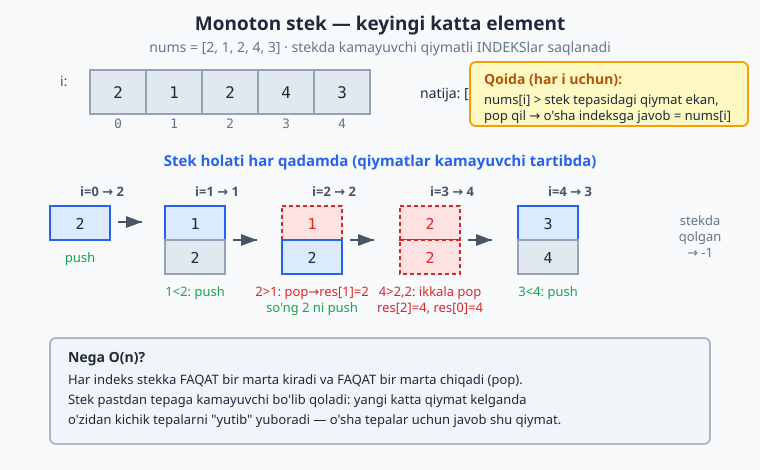

<a id="b34"></a>
# 34-bo'lim: Qo'shimcha ma'lumotlar tuzilmalari

<sub>[↑ Mundarijaga qaytish](README.md#mundarija)</sub>

> Bu bo'limda klassik Stack / Queue / LinkedList / Heap / Trie / BST dan tashqari
> uchraydigan ma'lumotlar tuzilmalari noldan quriladi: ikki tomonlama bog'langan ro'yxat,
> halqasimon bufer, dinamik massiv, hash map (separate chaining va open addressing),
> AVL daraxt, treap, monoton stek va navbat, hamda mashhur LeetCode "design" masalalari
> (LRU/LFU emas — ular boshqa bo'limda — balki getRandom O(1), snapshot array, time-based
> store va h.k.). Tuzilmalarni ichidan tushunish — bu ularni tayyor kutubxonadan farqli
> ravishda o'zingiz yozib ko'rishdir.

<a id="m727"></a>
### 727. Ikki tomonlama bog'langan ro'yxat (doubly linked list)
Har bir tugun keyingi va oldingi tugunga ishora qiladi; oxiriga va boshiga O(1) qo'shish.
`⏱ O(1) qo'shish · 💾 O(n)`

**JS**
```js
class Node {
  constructor(val) { this.val = val; this.prev = null; this.next = null; }
}
class DoublyLinkedList {
  constructor() { this.head = null; this.tail = null; this.size = 0; }
  pushBack(val) {
    const node = new Node(val);
    if (!this.tail) this.head = this.tail = node;
    else { node.prev = this.tail; this.tail.next = node; this.tail = node; }
    this.size++;
  }
  pushFront(val) {
    const node = new Node(val);
    if (!this.head) this.head = this.tail = node;
    else { node.next = this.head; this.head.prev = node; this.head = node; }
    this.size++;
  }
  toArray() {
    const out = [];
    for (let n = this.head; n; n = n.next) out.push(n.val);
    return out;
  }
}
// const d = new DoublyLinkedList(); d.pushBack(2); d.pushFront(1); d.toArray() // [1,2]
```
**PHP**
```php
class Node {
    public ?Node $prev = null;
    public ?Node $next = null;
    public function __construct(public mixed $val) {}
}
class DoublyLinkedList {
    public ?Node $head = null;
    public ?Node $tail = null;
    public int $size = 0;
    public function pushBack(mixed $val): void {
        $node = new Node($val);
        if ($this->tail === null) { $this->head = $this->tail = $node; }
        else { $node->prev = $this->tail; $this->tail->next = $node; $this->tail = $node; }
        $this->size++;
    }
    public function pushFront(mixed $val): void {
        $node = new Node($val);
        if ($this->head === null) { $this->head = $this->tail = $node; }
        else { $node->next = $this->head; $this->head->prev = $node; $this->head = $node; }
        $this->size++;
    }
    public function toArray(): array {
        $out = [];
        for ($n = $this->head; $n !== null; $n = $n->next) $out[] = $n->val;
        return $out;
    }
}
```
**Python**
```python
class Node:
    def __init__(self, val):
        self.val = val
        self.prev = None
        self.next = None

class DoublyLinkedList:
    def __init__(self):
        self.head = None
        self.tail = None
        self.size = 0

    def push_back(self, val):
        node = Node(val)
        if self.tail is None:
            self.head = self.tail = node
        else:
            node.prev = self.tail
            self.tail.next = node
            self.tail = node
        self.size += 1

    def push_front(self, val):
        node = Node(val)
        if self.head is None:
            self.head = self.tail = node
        else:
            node.next = self.head
            self.head.prev = node
            self.head = node
        self.size += 1

    def to_array(self):
        out, n = [], self.head
        while n:
            out.append(n.val)
            n = n.next
        return out
```

<a id="m728"></a>
### 728. Halqasimon ikki tomonlama bog'langan ro'yxat (circular doubly linked list)
Oxirgi tugun boshga, bosh tugun oxirga ulanadi; sentinel (qo'riqchi) tugun bilan oson.
`⏱ O(1) qo'shish · 💾 O(n)`

**JS**
```js
class CircularDLL {
  constructor() {
    this.guard = { val: null };          // sentinel
    this.guard.next = this.guard;
    this.guard.prev = this.guard;
    this.size = 0;
  }
  pushBack(val) {
    const node = { val, prev: this.guard.prev, next: this.guard };
    this.guard.prev.next = node;
    this.guard.prev = node;
    this.size++;
  }
  toArray() {
    const out = [];
    for (let n = this.guard.next; n !== this.guard; n = n.next) out.push(n.val);
    return out;
  }
}
// const c = new CircularDLL(); c.pushBack(1); c.pushBack(2); c.toArray() // [1,2]
```
**Python**
```python
class _N:
    __slots__ = ("val", "prev", "next")
    def __init__(self, val):
        self.val = val
        self.prev = self.next = None

class CircularDLL:
    def __init__(self):
        self.guard = _N(None)            # sentinel
        self.guard.next = self.guard
        self.guard.prev = self.guard
        self.size = 0

    def push_back(self, val):
        node = _N(val)
        node.prev = self.guard.prev
        node.next = self.guard
        self.guard.prev.next = node
        self.guard.prev = node
        self.size += 1

    def to_array(self):
        out, n = [], self.guard.next
        while n is not self.guard:
            out.append(n.val)
            n = n.next
        return out
```

<a id="m729"></a>
### 729. Deque noldan (double-ended queue)
Ikki tomondan ham qo'shish/olib tashlash; bu yerda bog'langan ro'yxat ustida quramiz.
`⏱ O(1) har amal · 💾 O(n)`

**JS**
```js
class Deque {
  constructor() { this.head = null; this.tail = null; this.size = 0; }
  pushFront(v) {
    const n = { v, prev: null, next: this.head };
    if (this.head) this.head.prev = n; else this.tail = n;
    this.head = n; this.size++;
  }
  pushBack(v) {
    const n = { v, prev: this.tail, next: null };
    if (this.tail) this.tail.next = n; else this.head = n;
    this.tail = n; this.size++;
  }
  popFront() {
    if (!this.head) return undefined;
    const v = this.head.v;
    this.head = this.head.next;
    if (this.head) this.head.prev = null; else this.tail = null;
    this.size--; return v;
  }
  popBack() {
    if (!this.tail) return undefined;
    const v = this.tail.v;
    this.tail = this.tail.prev;
    if (this.tail) this.tail.next = null; else this.head = null;
    this.size--; return v;
  }
}
// const dq = new Deque(); dq.pushBack(1); dq.pushFront(0); [dq.popFront(), dq.popBack()] // [0,1]
```
**PHP**
```php
class Deque {
    private array $items = [];   // SplDoublyLinkedList ham mumkin, lekin oddiy massiv yetarli
    public function pushFront(mixed $v): void { array_unshift($this->items, $v); }
    public function pushBack(mixed $v): void { $this->items[] = $v; }
    public function popFront(): mixed { return array_shift($this->items); }
    public function popBack(): mixed { return array_pop($this->items); }
    public function size(): int { return count($this->items); }
}
```
**Python**
```python
class Deque:
    def __init__(self):
        self.head = None
        self.tail = None
        self.size = 0

    def push_front(self, v):
        n = [v, None, self.head]              # [val, prev, next]
        if self.head:
            self.head[1] = n
        else:
            self.tail = n
        self.head = n
        self.size += 1

    def push_back(self, v):
        n = [v, self.tail, None]
        if self.tail:
            self.tail[2] = n
        else:
            self.head = n
        self.tail = n
        self.size += 1

    def pop_front(self):
        if not self.head:
            return None
        v = self.head[0]
        self.head = self.head[2]
        if self.head:
            self.head[1] = None
        else:
            self.tail = None
        self.size -= 1
        return v

    def pop_back(self):
        if not self.tail:
            return None
        v = self.tail[0]
        self.tail = self.tail[1]
        if self.tail:
            self.tail[2] = None
        else:
            self.head = None
        self.size -= 1
        return v
```

<a id="m730"></a>
### 730. Halqasimon bufer (ring buffer / circular buffer)
Sobit o'lchamli massiv ustida FIFO; to'lganda eng eski element ustiga yoziladi.
`⏱ O(1) har amal · 💾 O(k)`

**JS**
```js
class RingBuffer {
  constructor(capacity) {
    this.buf = new Array(capacity);
    this.cap = capacity;
    this.head = 0;   // o'qish joyi
    this.size = 0;
  }
  push(v) {
    const tail = (this.head + this.size) % this.cap;
    this.buf[tail] = v;
    if (this.size === this.cap) this.head = (this.head + 1) % this.cap; // ustiga yoz
    else this.size++;
  }
  shift() {
    if (this.size === 0) return undefined;
    const v = this.buf[this.head];
    this.head = (this.head + 1) % this.cap;
    this.size--;
    return v;
  }
}
// const r = new RingBuffer(2); r.push(1); r.push(2); r.push(3); r.shift() // 2 (1 ustiga yozildi)
```
**Python**
```python
class RingBuffer:
    def __init__(self, capacity):
        self.buf = [None] * capacity
        self.cap = capacity
        self.head = 0
        self.size = 0

    def push(self, v):
        tail = (self.head + self.size) % self.cap
        self.buf[tail] = v
        if self.size == self.cap:
            self.head = (self.head + 1) % self.cap   # eng eski ustiga yoz
        else:
            self.size += 1

    def shift(self):
        if self.size == 0:
            return None
        v = self.buf[self.head]
        self.head = (self.head + 1) % self.cap
        self.size -= 1
        return v
```

<a id="m731"></a>
### 731. Dinamik massiv (dynamic array — resizing)
Sig'im to'lganda ikki barobar kattalashadigan o'zgaruvchan massiv; amortizatsiyalangan O(1) push.
`⏱ O(1) amortizatsiyalangan push · 💾 O(n)`

**JS**
```js
class DynamicArray {
  constructor() { this.data = new Array(1); this.length = 0; this.cap = 1; }
  push(v) {
    if (this.length === this.cap) this._resize(this.cap * 2);
    this.data[this.length++] = v;
  }
  get(i) {
    if (i < 0 || i >= this.length) throw new RangeError("indeks chegaradan tashqari");
    return this.data[i];
  }
  _resize(newCap) {
    const next = new Array(newCap);
    for (let i = 0; i < this.length; i++) next[i] = this.data[i];
    this.data = next; this.cap = newCap;
  }
}
// const a = new DynamicArray(); for (const x of [1,2,3]) a.push(x); a.get(2) // 3
```
**PHP**
```php
class DynamicArray {
    private array $data;
    private int $length = 0;
    private int $cap = 1;
    public function __construct() { $this->data = array_fill(0, 1, null); }
    public function push(mixed $v): void {
        if ($this->length === $this->cap) $this->resize($this->cap * 2);
        $this->data[$this->length++] = $v;
    }
    public function get(int $i): mixed {
        if ($i < 0 || $i >= $this->length) throw new OutOfRangeException("chegaradan tashqari");
        return $this->data[$i];
    }
    private function resize(int $newCap): void {
        $next = array_fill(0, $newCap, null);
        for ($i = 0; $i < $this->length; $i++) $next[$i] = $this->data[$i];
        $this->data = $next; $this->cap = $newCap;
    }
}
```
**Python**
```python
class DynamicArray:
    def __init__(self):
        self._data = [None]
        self._length = 0
        self._cap = 1

    def push(self, v):
        if self._length == self._cap:
            self._resize(self._cap * 2)
        self._data[self._length] = v
        self._length += 1

    def get(self, i):
        if not 0 <= i < self._length:
            raise IndexError("chegaradan tashqari")
        return self._data[i]

    def _resize(self, new_cap):
        nxt = [None] * new_cap
        for i in range(self._length):
            nxt[i] = self._data[i]
        self._data = nxt
        self._cap = new_cap
```

<a id="m732"></a>
### 732. Hash map — separate chaining
Har bir bucket bir bog'langan ro'yxat (zanjir); to'qnashuvlar shu zanjirga qo'shiladi.
`⏱ O(1) o'rtacha · 💾 O(n)`

**JS**
```js
class HashMapChaining {
  constructor(capacity = 8) {
    this.buckets = Array.from({ length: capacity }, () => []);
    this.cap = capacity;
    this.size = 0;
  }
  _idx(key) {
    let h = 0;
    const s = String(key);
    for (let i = 0; i < s.length; i++) h = (h * 31 + s.charCodeAt(i)) >>> 0;
    return h % this.cap;
  }
  set(key, val) {
    const b = this.buckets[this._idx(key)];
    for (const pair of b) if (pair[0] === key) { pair[1] = val; return; }
    b.push([key, val]); this.size++;
  }
  get(key) {
    const b = this.buckets[this._idx(key)];
    for (const [k, v] of b) if (k === key) return v;
    return undefined;
  }
}
// const m = new HashMapChaining(); m.set("a", 1); m.set("a", 2); m.get("a") // 2
```
**PHP**
```php
class HashMapChaining {
    private array $buckets;
    public function __construct(private int $cap = 8) {
        $this->buckets = array_fill(0, $cap, []);
    }
    private function idx(string $key): int {
        $h = 0;
        $len = strlen($key);
        for ($i = 0; $i < $len; $i++) $h = ($h * 31 + ord($key[$i])) & 0x7fffffff;
        return $h % $this->cap;
    }
    public function set(string $key, mixed $val): void {
        $i = $this->idx($key);
        foreach ($this->buckets[$i] as &$pair) {
            if ($pair[0] === $key) { $pair[1] = $val; return; }
        }
        unset($pair);
        $this->buckets[$i][] = [$key, $val];
    }
    public function get(string $key): mixed {
        foreach ($this->buckets[$this->idx($key)] as $pair) {
            if ($pair[0] === $key) return $pair[1];
        }
        return null;
    }
}
```
**Python**
```python
class HashMapChaining:
    def __init__(self, capacity=8):
        self.buckets = [[] for _ in range(capacity)]
        self.cap = capacity
        self.size = 0

    def _idx(self, key):
        h = 0
        for ch in str(key):
            h = (h * 31 + ord(ch)) & 0xFFFFFFFF
        return h % self.cap

    def set(self, key, val):
        b = self.buckets[self._idx(key)]
        for pair in b:
            if pair[0] == key:
                pair[1] = val
                return
        b.append([key, val])
        self.size += 1

    def get(self, key):
        for k, v in self.buckets[self._idx(key)]:
            if k == key:
                return v
        return None
```

<a id="m733"></a>
### 733. Hash map — open addressing (linear probing)
To'qnashuvda keyingi bo'sh katakka qadam tashlaymiz; o'chirishda "tombstone" belgisi.
`⏱ O(1) o'rtacha · 💾 O(n)`

**JS**
```js
class HashMapLinear {
  constructor(capacity = 8) {
    this.keys = new Array(capacity).fill(undefined);
    this.vals = new Array(capacity).fill(undefined);
    this.cap = capacity;
    this.size = 0;
  }
  _hash(key) {
    let h = 0; const s = String(key);
    for (let i = 0; i < s.length; i++) h = (h * 31 + s.charCodeAt(i)) >>> 0;
    return h % this.cap;
  }
  set(key, val) {
    let i = this._hash(key);
    while (this.keys[i] !== undefined && this.keys[i] !== key)
      i = (i + 1) % this.cap;
    if (this.keys[i] === undefined) this.size++;
    this.keys[i] = key; this.vals[i] = val;
  }
  get(key) {
    let i = this._hash(key), steps = 0;
    while (this.keys[i] !== undefined && steps++ < this.cap) {
      if (this.keys[i] === key) return this.vals[i];
      i = (i + 1) % this.cap;
    }
    return undefined;
  }
}
// const m = new HashMapLinear(); m.set("x", 7); m.get("x") // 7
```
**Python**
```python
class HashMapLinear:
    def __init__(self, capacity=8):
        self.keys = [None] * capacity
        self.vals = [None] * capacity
        self.cap = capacity
        self.size = 0

    def _hash(self, key):
        h = 0
        for ch in str(key):
            h = (h * 31 + ord(ch)) & 0xFFFFFFFF
        return h % self.cap

    def set(self, key, val):
        i = self._hash(key)
        while self.keys[i] is not None and self.keys[i] != key:
            i = (i + 1) % self.cap
        if self.keys[i] is None:
            self.size += 1
        self.keys[i] = key
        self.vals[i] = val

    def get(self, key):
        i, steps = self._hash(key), 0
        while self.keys[i] is not None and steps < self.cap:
            if self.keys[i] == key:
                return self.vals[i]
            i = (i + 1) % self.cap
            steps += 1
        return None
```

<a id="m734"></a>
### 734. Hash set noldan (hash set)
Faqat kalitlarni saqlovchi to'plam; chaining bilan add / contains / remove.
`⏱ O(1) o'rtacha · 💾 O(n)`

**JS**
```js
class HashSet {
  constructor(capacity = 16) {
    this.buckets = Array.from({ length: capacity }, () => []);
    this.cap = capacity;
  }
  _idx(v) {
    let h = 0; const s = String(v);
    for (let i = 0; i < s.length; i++) h = (h * 31 + s.charCodeAt(i)) >>> 0;
    return h % this.cap;
  }
  add(v) {
    const b = this.buckets[this._idx(v)];
    if (!b.includes(v)) b.push(v);
  }
  contains(v) { return this.buckets[this._idx(v)].includes(v); }
  remove(v) {
    const b = this.buckets[this._idx(v)];
    const i = b.indexOf(v);
    if (i !== -1) b.splice(i, 1);
  }
}
// const s = new HashSet(); s.add(5); s.contains(5) // true ; s.remove(5); s.contains(5) // false
```
**Python**
```python
class HashSet:
    def __init__(self, capacity=16):
        self.buckets = [[] for _ in range(capacity)]
        self.cap = capacity

    def _idx(self, v):
        h = 0
        for ch in str(v):
            h = (h * 31 + ord(ch)) & 0xFFFFFFFF
        return h % self.cap

    def add(self, v):
        b = self.buckets[self._idx(v)]
        if v not in b:
            b.append(v)

    def contains(self, v):
        return v in self.buckets[self._idx(v)]

    def remove(self, v):
        b = self.buckets[self._idx(v)]
        if v in b:
            b.remove(v)
```

<a id="m735"></a>
### 735. AVL daraxt — rotatsiyalar bilan (self-balancing BST)
Har insertda balans omilini ushlab turadi; LL/RR/LR/RL rotatsiyalar bilan balans qaytariladi.
`⏱ O(log n) insert · 💾 O(n)`

**Python**
```python
class AVLNode:
    def __init__(self, key):
        self.key = key
        self.left = None
        self.right = None
        self.height = 1

def _h(node):
    return node.height if node else 0

def _balance(node):
    return _h(node.left) - _h(node.right) if node else 0

def _update(node):
    node.height = 1 + max(_h(node.left), _h(node.right))

def _rotate_right(y):
    x = y.left
    y.left = x.right
    x.right = y
    _update(y)
    _update(x)
    return x

def _rotate_left(x):
    y = x.right
    x.right = y.left
    y.left = x
    _update(x)
    _update(y)
    return y

def avl_insert(root, key):
    if root is None:
        return AVLNode(key)
    if key < root.key:
        root.left = avl_insert(root.left, key)
    else:
        root.right = avl_insert(root.right, key)
    _update(root)
    bf = _balance(root)
    if bf > 1 and key < root.left.key:                # LL
        return _rotate_right(root)
    if bf < -1 and key > root.right.key:              # RR
        return _rotate_left(root)
    if bf > 1 and key > root.left.key:                # LR
        root.left = _rotate_left(root.left)
        return _rotate_right(root)
    if bf < -1 and key < root.right.key:              # RL
        root.right = _rotate_right(root.right)
        return _rotate_left(root)
    return root

def inorder(root, out=None):
    out = [] if out is None else out
    if root:
        inorder(root.left, out)
        out.append(root.key)
        inorder(root.right, out)
    return out
# r = None
# for k in [10, 20, 30, 40, 50, 25]: r = avl_insert(r, k)
# inorder(r) -> [10, 20, 25, 30, 40, 50] ; r.key == 30 (balanslangan)
```
**JS**
```js
const h = (n) => (n ? n.height : 0);
const upd = (n) => { n.height = 1 + Math.max(h(n.left), h(n.right)); };
const bf = (n) => (n ? h(n.left) - h(n.right) : 0);
const rotR = (y) => { const x = y.left; y.left = x.right; x.right = y; upd(y); upd(x); return x; };
const rotL = (x) => { const y = x.right; x.right = y.left; y.left = x; upd(x); upd(y); return y; };

function avlInsert(root, key) {
  if (!root) return { key, left: null, right: null, height: 1 };
  if (key < root.key) root.left = avlInsert(root.left, key);
  else root.right = avlInsert(root.right, key);
  upd(root);
  const b = bf(root);
  if (b > 1 && key < root.left.key) return rotR(root);          // LL
  if (b < -1 && key > root.right.key) return rotL(root);        // RR
  if (b > 1 && key > root.left.key) { root.left = rotL(root.left); return rotR(root); }  // LR
  if (b < -1 && key < root.right.key) { root.right = rotR(root.right); return rotL(root); } // RL
  return root;
}
function inorder(root, out = []) {
  if (root) { inorder(root.left, out); out.push(root.key); inorder(root.right, out); }
  return out;
}
// let r = null; for (const k of [10,20,30]) r = avlInsert(r, k); r.key // 20 (balanslangan)
```

<a id="m736"></a>
### 736. Treap (randomized BST)
Har tugunga tasodifiy ustuvorlik (priority) beriladi; kalit bo'yicha BST, ustuvorlik bo'yicha heap.
`⏱ O(log n) kutilgan · 💾 O(n)`

**Python**
```python
import random

class TreapNode:
    def __init__(self, key):
        self.key = key
        self.priority = random.random()
        self.left = None
        self.right = None

def _rot_right(node):
    l = node.left
    node.left = l.right
    l.right = node
    return l

def _rot_left(node):
    r = node.right
    node.right = r.left
    r.left = node
    return r

def treap_insert(root, key):
    if root is None:
        return TreapNode(key)
    if key < root.key:
        root.left = treap_insert(root.left, key)
        if root.left.priority < root.priority:    # min-heap ustuvorlik
            root = _rot_right(root)
    else:
        root.right = treap_insert(root.right, key)
        if root.right.priority < root.priority:
            root = _rot_left(root)
    return root

def inorder(root, out=None):
    out = [] if out is None else out
    if root:
        inorder(root.left, out)
        out.append(root.key)
        inorder(root.right, out)
    return out
# random.seed(1)
# r = None
# for k in [5, 3, 8, 1, 4]: r = treap_insert(r, k)
# inorder(r) -> [1, 3, 4, 5, 8]  (har doim saralangan)
```
**JS**
```js
const rotRight = (n) => { const l = n.left; n.left = l.right; l.right = n; return l; };
const rotLeft = (n) => { const r = n.right; n.right = r.left; r.left = n; return r; };

function treapInsert(root, key) {
  if (!root) return { key, priority: Math.random(), left: null, right: null };
  if (key < root.key) {
    root.left = treapInsert(root.left, key);
    if (root.left.priority < root.priority) root = rotRight(root);
  } else {
    root.right = treapInsert(root.right, key);
    if (root.right.priority < root.priority) root = rotLeft(root);
  }
  return root;
}
function inorder(root, out = []) {
  if (root) { inorder(root.left, out); out.push(root.key); inorder(root.right, out); }
  return out;
}
// let r = null; for (const k of [5,3,8,1,4]) r = treapInsert(r, k); inorder(r) // [1,3,4,5,8]
```

<a id="m737"></a>
### 737. Monoton stek (monotonic stack)
Stek elementlari doim o'sib (yoki kamayib) boradi; "keyingi katta element" kabi masalalar uchun asos.
`⏱ O(n) · 💾 O(n)`

**JS**
```js
function previousSmaller(nums) {
  const res = new Array(nums.length).fill(-1);
  const stack = []; // indekslar, qiymatlari o'suvchi
  for (let i = 0; i < nums.length; i++) {
    while (stack.length && nums[stack[stack.length - 1]] >= nums[i]) stack.pop();
    res[i] = stack.length ? nums[stack[stack.length - 1]] : -1;
    stack.push(i);
  }
  return res;
}
// previousSmaller([2, 1, 3, 2]) // [-1, -1, 1, 1]
```
**Python**
```python
def previous_smaller(nums):
    res = [-1] * len(nums)
    stack = []                     # indekslar, qiymatlari o'suvchi
    for i, x in enumerate(nums):
        while stack and nums[stack[-1]] >= x:
            stack.pop()
        res[i] = nums[stack[-1]] if stack else -1
        stack.append(i)
    return res
# previous_smaller([2, 1, 3, 2]) -> [-1, -1, 1, 1]
```
**PHP**
```php
function previousSmaller(array $nums): array {
    $n = count($nums);
    $res = array_fill(0, $n, -1);
    $stack = [];
    for ($i = 0; $i < $n; $i++) {
        while ($stack && $nums[end($stack)] >= $nums[$i]) array_pop($stack);
        $res[$i] = $stack ? $nums[end($stack)] : -1;
        $stack[] = $i;
    }
    return $res;
}
```

<a id="m738"></a>
### 738. Monoton navbat (monotonic queue)
Deque yordamida oynaning maksimumini O(1) da kuzatish uchun kamayuvchi tartibni saqlaydi.
`⏱ O(n) · 💾 O(k)`

**Python**
```python
from collections import deque

class MonotonicQueue:
    def __init__(self):
        self.dq = deque()          # kamayuvchi tartib

    def push(self, x):
        while self.dq and self.dq[-1] < x:
            self.dq.pop()
        self.dq.append(x)

    def max(self):
        return self.dq[0]

    def pop(self, x):              # x oynadan chiqsa, oldidan olib tashla
        if self.dq and self.dq[0] == x:
            self.dq.popleft()
# q = MonotonicQueue(); q.push(3); q.push(1); q.push(4); q.max() -> 4
```
**JS**
```js
class MonotonicQueue {
  constructor() { this.dq = []; }   // kamayuvchi tartib
  push(x) {
    while (this.dq.length && this.dq[this.dq.length - 1] < x) this.dq.pop();
    this.dq.push(x);
  }
  max() { return this.dq[0]; }
  pop(x) { if (this.dq.length && this.dq[0] === x) this.dq.shift(); }
}
// const q = new MonotonicQueue(); q.push(3); q.push(1); q.push(4); q.max() // 4
```

<a id="m739"></a>
### 739. Keyingi katta element (next greater element)
Har element uchun o'ngdagi birinchi kattaroq qiymat; topilmasa -1. Monoton stek bilan.
`⏱ O(n) · 💾 O(n)`

**JS**
```js
function nextGreaterElements(nums) {
  const res = new Array(nums.length).fill(-1);
  const stack = []; // indekslar
  for (let i = 0; i < nums.length; i++) {
    while (stack.length && nums[stack[stack.length - 1]] < nums[i])
      res[stack.pop()] = nums[i];
    stack.push(i);
  }
  return res;
}
// nextGreaterElements([2, 1, 2, 4, 3]) // [4, 2, 4, -1, -1]
```
**Python**
```python
def next_greater_elements(nums):
    res = [-1] * len(nums)
    stack = []                       # indekslar
    for i, x in enumerate(nums):
        while stack and nums[stack[-1]] < x:
            res[stack.pop()] = x
        stack.append(i)
    return res
# next_greater_elements([2, 1, 2, 4, 3]) -> [4, 2, 4, -1, -1]
```
**PHP**
```php
function nextGreaterElements(array $nums): array {
    $n = count($nums);
    $res = array_fill(0, $n, -1);
    $stack = [];
    for ($i = 0; $i < $n; $i++) {
        while ($stack && $nums[end($stack)] < $nums[$i]) {
            $res[array_pop($stack)] = $nums[$i];
        }
        $stack[] = $i;
    }
    return $res;
}
```

Quyidagi diagramma stek har qadamda qanday o'zgarishini va nima uchun algoritm O(n) bo'lishini ko'rsatadi:



<a id="m740"></a>
### 740. Kunlik haroratlar (daily temperatures)
Har kun uchun necha kundan keyin issiqroq bo'lishini topish; monoton stek bilan.
`⏱ O(n) · 💾 O(n)`

**JS**
```js
function dailyTemperatures(temps) {
  const res = new Array(temps.length).fill(0);
  const stack = []; // indekslar, haroratlari kamayuvchi
  for (let i = 0; i < temps.length; i++) {
    while (stack.length && temps[stack[stack.length - 1]] < temps[i]) {
      const j = stack.pop();
      res[j] = i - j;
    }
    stack.push(i);
  }
  return res;
}
// dailyTemperatures([73,74,75,71,69,72,76,73]) // [1,1,4,2,1,1,0,0]
```
**Python**
```python
def daily_temperatures(temps):
    res = [0] * len(temps)
    stack = []                       # indekslar, haroratlari kamayuvchi
    for i, t in enumerate(temps):
        while stack and temps[stack[-1]] < t:
            j = stack.pop()
            res[j] = i - j
        stack.append(i)
    return res
# daily_temperatures([73,74,75,71,69,72,76,73]) -> [1,1,4,2,1,1,0,0]
```

<a id="m741"></a>
### 741. Gistogrammadagi eng katta to'rtburchak (largest rectangle in histogram)
Monoton stek bilan har ustun uchun chap/o'ng kichik chegaralarni topib maksimal yuzani hisoblaymiz.
`⏱ O(n) · 💾 O(n)`

**Python**
```python
def largest_rectangle(heights):
    stack = []                       # indekslar, balandliklari o'suvchi
    best = 0
    for i, h in enumerate(heights + [0]):     # oxiriga 0 — hammasini bo'shatish uchun
        while stack and heights[stack[-1]] >= h:
            height = heights[stack.pop()]
            width = i if not stack else i - stack[-1] - 1
            best = max(best, height * width)
        stack.append(i)
    return best
# largest_rectangle([2, 1, 5, 6, 2, 3]) -> 10
```
**JS**
```js
function largestRectangle(heights) {
  const stack = []; // indekslar
  let best = 0;
  const arr = [...heights, 0];
  for (let i = 0; i < arr.length; i++) {
    while (stack.length && heights[stack[stack.length - 1]] >= arr[i]) {
      const height = heights[stack.pop()];
      const width = stack.length ? i - stack[stack.length - 1] - 1 : i;
      best = Math.max(best, height * width);
    }
    stack.push(i);
  }
  return best;
}
// largestRectangle([2,1,5,6,2,3]) // 10
```

<a id="m742"></a>
### 742. Siljuvchi oyna maksimumi (sliding window maximum)
k uzunlikdagi har oyna uchun maksimum; monoton deque indekslarni kamayuvchi tartibda ushlaydi.
`⏱ O(n) · 💾 O(k)`

**Python**
```python
from collections import deque

def max_sliding_window(nums, k):
    dq = deque()                     # indekslar, qiymatlari kamayuvchi
    res = []
    for i, x in enumerate(nums):
        while dq and nums[dq[-1]] < x:
            dq.pop()
        dq.append(i)
        if dq[0] == i - k:           # oynadan chiqqan indeksni olib tashla
            dq.popleft()
        if i >= k - 1:
            res.append(nums[dq[0]])
    return res
# max_sliding_window([1,3,-1,-3,5,3,6,7], 3) -> [3,3,5,5,6,7]
```
**JS**
```js
function maxSlidingWindow(nums, k) {
  const dq = []; // indekslar, qiymatlari kamayuvchi
  const res = [];
  for (let i = 0; i < nums.length; i++) {
    while (dq.length && nums[dq[dq.length - 1]] < nums[i]) dq.pop();
    dq.push(i);
    if (dq[0] === i - k) dq.shift();
    if (i >= k - 1) res.push(nums[dq[0]]);
  }
  return res;
}
// maxSlidingWindow([1,3,-1,-3,5,3,6,7], 3) // [3,3,5,5,6,7]
```

<a id="m743"></a>
### 743. Max stack (push/pop/top/peekMax/popMax)
Oddiy stek ustiga maksimumlar stekini qo'shib, joriy maksimumni O(1) da beradi.
`⏱ O(1) max · O(n) popMax · 💾 O(n)`

**JS**
```js
class MaxStack {
  constructor() { this.stack = []; this.maxes = []; }
  push(x) {
    this.stack.push(x);
    const m = this.maxes.length ? this.maxes[this.maxes.length - 1] : -Infinity;
    this.maxes.push(Math.max(m, x));
  }
  pop() { this.maxes.pop(); return this.stack.pop(); }
  top() { return this.stack[this.stack.length - 1]; }
  peekMax() { return this.maxes[this.maxes.length - 1]; }
  popMax() {
    const m = this.peekMax();
    const buf = [];
    while (this.top() !== m) buf.push(this.pop());
    this.pop();                              // m ni olib tashla
    while (buf.length) this.push(buf.pop());
    return m;
  }
}
// const s = new MaxStack(); s.push(5); s.push(1); s.push(5); s.popMax() // 5 ; s.top() // 1
```
**Python**
```python
class MaxStack:
    def __init__(self):
        self.stack = []
        self.maxes = []

    def push(self, x):
        m = self.maxes[-1] if self.maxes else float("-inf")
        self.stack.append(x)
        self.maxes.append(max(m, x))

    def pop(self):
        self.maxes.pop()
        return self.stack.pop()

    def top(self):
        return self.stack[-1]

    def peek_max(self):
        return self.maxes[-1]

    def pop_max(self):
        m = self.peek_max()
        buf = []
        while self.top() != m:
            buf.append(self.pop())
        self.pop()                           # m ni olib tashla
        while buf:
            self.push(buf.pop())
        return m
```

<a id="m744"></a>
### 744. LinkedHashMap (insertion order)
Hash map'ga qo'shilish tartibini ham eslab qoladi; iteratsiya kalitlar kiritilgan tartibda boradi.
`⏱ O(1) o'rtacha · 💾 O(n)`

**JS**
```js
class LinkedHashMap {
  // Map allaqachon kiritish tartibini saqlaydi; ustiga ozgina qulay API
  constructor() { this.map = new Map(); }
  set(key, val) { this.map.delete(key); this.map.set(key, val); return this; }
  get(key) { return this.map.get(key); }
  delete(key) { return this.map.delete(key); }
  keys() { return [...this.map.keys()]; }          // kiritish tartibida
  entries() { return [...this.map.entries()]; }
}
// const m = new LinkedHashMap(); m.set("b",2).set("a",1); m.keys() // ["b","a"]
```
**Python**
```python
class LinkedHashMap:
    def __init__(self):
        self._d = {}                 # Python dict 3.7+ kiritish tartibini saqlaydi

    def set(self, key, val):
        self._d.pop(key, None)       # yangilashda ham tartib oxiriga ko'chsin
        self._d[key] = val

    def get(self, key):
        return self._d.get(key)

    def delete(self, key):
        self._d.pop(key, None)

    def keys(self):
        return list(self._d.keys())  # kiritish tartibida

    def entries(self):
        return list(self._d.items())
# m = LinkedHashMap(); m.set("b", 2); m.set("a", 1); m.keys() -> ["b", "a"]
```

<a id="m745"></a>
### 745. N-ar daraxtni aylanib chiqish (n-ary tree traversal)
Har tugunda ixtiyoriy sondagi bolalar; preorder (oldindan) aylanish.
`⏱ O(n) · 💾 O(h)`

**Python**
```python
class NaryNode:
    def __init__(self, val, children=None):
        self.val = val
        self.children = children or []

def preorder(root):
    if root is None:
        return []
    res = [root.val]
    for child in root.children:
        res.extend(preorder(child))
    return res
# root = NaryNode(1, [NaryNode(2), NaryNode(3, [NaryNode(5)]), NaryNode(4)])
# preorder(root) -> [1, 2, 3, 5, 4]
```
**JS**
```js
class NaryNode {
  constructor(val, children = []) { this.val = val; this.children = children; }
}
function preorder(root) {
  if (!root) return [];
  const res = [root.val];
  for (const child of root.children) res.push(...preorder(child));
  return res;
}
// const r = new NaryNode(1, [new NaryNode(2), new NaryNode(3, [new NaryNode(5)]), new NaryNode(4)]);
// preorder(r) // [1, 2, 3, 5, 4]
```

<a id="m746"></a>
### 746. N-ar daraxt sathlar bo'yicha (n-ary tree level order)
BFS bilan har sathdagi qiymatlarni alohida ro'yxatga yig'amiz.
`⏱ O(n) · 💾 O(n)`

**Python**
```python
from collections import deque

def level_order(root):
    if root is None:
        return []
    res, q = [], deque([root])
    while q:
        level = []
        for _ in range(len(q)):
            node = q.popleft()
            level.append(node.val)
            q.extend(node.children)
        res.append(level)
    return res
# root = NaryNode(1, [NaryNode(3, [NaryNode(5), NaryNode(6)]), NaryNode(2), NaryNode(4)])
# level_order(root) -> [[1], [3, 2, 4], [5, 6]]
```
**JS**
```js
function levelOrder(root) {
  if (!root) return [];
  const res = [];
  let queue = [root];
  while (queue.length) {
    const level = [];
    const next = [];
    for (const node of queue) {
      level.push(node.val);
      next.push(...node.children);
    }
    res.push(level);
    queue = next;
  }
  return res;
}
// levelOrder(new NaryNode(1, [new NaryNode(3, [new NaryNode(5)]), new NaryNode(2)])) // [[1],[3,2],[5]]
```

<a id="m747"></a>
### 747. d-ar uyum (d-ary heap)
Har tugunning d ta bolasi bo'lgan min-heap; ko'p push, kam pop bo'lganda samarali.
`⏱ O(log_d n) push · O(d·log_d n) pop · 💾 O(n)`

**Python**
```python
class DaryHeap:
    def __init__(self, d=4):
        self.d = d
        self.data = []

    def push(self, x):
        self.data.append(x)
        i = len(self.data) - 1
        while i > 0:
            parent = (i - 1) // self.d
            if self.data[parent] <= self.data[i]:
                break
            self.data[i], self.data[parent] = self.data[parent], self.data[i]
            i = parent

    def pop(self):
        if not self.data:
            return None
        top = self.data[0]
        last = self.data.pop()
        if self.data:
            self.data[0] = last
            self._sift_down(0)
        return top

    def _sift_down(self, i):
        n = len(self.data)
        while True:
            smallest = i
            for k in range(1, self.d + 1):
                child = self.d * i + k
                if child < n and self.data[child] < self.data[smallest]:
                    smallest = child
            if smallest == i:
                break
            self.data[i], self.data[smallest] = self.data[smallest], self.data[i]
            i = smallest
# h = DaryHeap(3)
# for x in [5, 3, 8, 1, 9, 2]: h.push(x)
# [h.pop() for _ in range(6)] -> [1, 2, 3, 5, 8, 9]
```
**JS**
```js
class DaryHeap {
  constructor(d = 4) { this.d = d; this.data = []; }
  push(x) {
    this.data.push(x);
    let i = this.data.length - 1;
    while (i > 0) {
      const parent = Math.floor((i - 1) / this.d);
      if (this.data[parent] <= this.data[i]) break;
      [this.data[i], this.data[parent]] = [this.data[parent], this.data[i]];
      i = parent;
    }
  }
  pop() {
    if (!this.data.length) return undefined;
    const top = this.data[0];
    const last = this.data.pop();
    if (this.data.length) { this.data[0] = last; this._siftDown(0); }
    return top;
  }
  _siftDown(i) {
    const n = this.data.length;
    for (;;) {
      let smallest = i;
      for (let k = 1; k <= this.d; k++) {
        const child = this.d * i + k;
        if (child < n && this.data[child] < this.data[smallest]) smallest = child;
      }
      if (smallest === i) break;
      [this.data[i], this.data[smallest]] = [this.data[smallest], this.data[i]];
      i = smallest;
    }
  }
}
// const h = new DaryHeap(3); for (const x of [5,3,8,1]) h.push(x); [h.pop(),h.pop()] // [1,3]
```

<a id="m748"></a>
### 748. Interval to'plami — insertda birlashtirish (interval set / merge on insert)
Qo'shganda kesishuvchi intervallarni avtomatik birlashtiradi; saralangan, ust-ust tushmaydigan ro'yxat.
`⏱ O(n) insert · 💾 O(n)`

**Python**
```python
class IntervalSet:
    def __init__(self):
        self.intervals = []          # saralangan, kesishmaydigan [start, end]

    def insert(self, start, end):
        merged = []
        placed = False
        for s, e in self.intervals:
            if e < start:                        # joriydan oldin
                merged.append([s, e])
            elif end < s:                        # joriydan keyin
                if not placed:
                    merged.append([start, end])
                    placed = True
                merged.append([s, e])
            else:                                # kesishadi — birlashtir
                start = min(start, s)
                end = max(end, e)
        if not placed:
            merged.append([start, end])
        self.intervals = merged
# s = IntervalSet()
# s.insert(1, 3); s.insert(6, 9); s.insert(2, 5)
# s.intervals -> [[1, 5], [6, 9]]
```
**JS**
```js
class IntervalSet {
  constructor() { this.intervals = []; }
  insert(start, end) {
    const merged = [];
    let placed = false;
    for (const [s, e] of this.intervals) {
      if (e < start) merged.push([s, e]);
      else if (end < s) {
        if (!placed) { merged.push([start, end]); placed = true; }
        merged.push([s, e]);
      } else { start = Math.min(start, s); end = Math.max(end, e); }
    }
    if (!placed) merged.push([start, end]);
    this.intervals = merged;
  }
}
// const s = new IntervalSet(); s.insert(1,3); s.insert(6,9); s.insert(2,5); s.intervals // [[1,5],[6,9]]
```

<a id="m749"></a>
### 749. Design HashMap (LC 706)
Tayyor hash-tuzilmasiz, sobit hajmli bucketlar va zanjirlar bilan put/get/remove.
`⏱ O(1) o'rtacha · 💾 O(n)`

**Python**
```python
class MyHashMap:
    def __init__(self):
        self.size = 1009                 # tub son — to'qnashuvni kamaytiradi
        self.buckets = [[] for _ in range(self.size)]

    def put(self, key, value):
        b = self.buckets[key % self.size]
        for pair in b:
            if pair[0] == key:
                pair[1] = value
                return
        b.append([key, value])

    def get(self, key):
        for k, v in self.buckets[key % self.size]:
            if k == key:
                return v
        return -1

    def remove(self, key):
        b = self.buckets[key % self.size]
        for i, (k, _) in enumerate(b):
            if k == key:
                b.pop(i)
                return
# m = MyHashMap(); m.put(1, 10); m.get(1) -> 10 ; m.remove(1); m.get(1) -> -1
```
**JS**
```js
class MyHashMap {
  constructor() {
    this.size = 1009;
    this.buckets = Array.from({ length: this.size }, () => []);
  }
  put(key, value) {
    const b = this.buckets[key % this.size];
    for (const pair of b) if (pair[0] === key) { pair[1] = value; return; }
    b.push([key, value]);
  }
  get(key) {
    for (const [k, v] of this.buckets[key % this.size]) if (k === key) return v;
    return -1;
  }
  remove(key) {
    const b = this.buckets[key % this.size];
    const i = b.findIndex(([k]) => k === key);
    if (i !== -1) b.splice(i, 1);
  }
}
// const m = new MyHashMap(); m.put(1,10); m.get(1) // 10 ; m.remove(1); m.get(1) // -1
```

<a id="m750"></a>
### 750. Design HashSet (LC 705)
Faqat butun kalitlar to'plami; add / contains / remove zanjirlar bilan.
`⏱ O(1) o'rtacha · 💾 O(n)`

**Python**
```python
class MyHashSet:
    def __init__(self):
        self.size = 1009
        self.buckets = [[] for _ in range(self.size)]

    def add(self, key):
        b = self.buckets[key % self.size]
        if key not in b:
            b.append(key)

    def contains(self, key):
        return key in self.buckets[key % self.size]

    def remove(self, key):
        b = self.buckets[key % self.size]
        if key in b:
            b.remove(key)
# s = MyHashSet(); s.add(7); s.contains(7) -> True ; s.remove(7); s.contains(7) -> False
```
**JS**
```js
class MyHashSet {
  constructor() {
    this.size = 1009;
    this.buckets = Array.from({ length: this.size }, () => []);
  }
  add(key) {
    const b = this.buckets[key % this.size];
    if (!b.includes(key)) b.push(key);
  }
  contains(key) { return this.buckets[key % this.size].includes(key); }
  remove(key) {
    const b = this.buckets[key % this.size];
    const i = b.indexOf(key);
    if (i !== -1) b.splice(i, 1);
  }
}
// const s = new MyHashSet(); s.add(7); s.contains(7) // true
```

<a id="m751"></a>
### 751. Design Linked List (LC 707)
addAtHead / addAtTail / addAtIndex / get / deleteAtIndex bilan to'liq bog'langan ro'yxat.
`⏱ O(n) get/insert · 💾 O(n)`

**Python**
```python
class MyLinkedList:
    def __init__(self):
        self.head = None
        self.size = 0

    def get(self, index):
        if index < 0 or index >= self.size:
            return -1
        node = self.head
        for _ in range(index):
            node = node[1]
        return node[0]

    def add_at_index(self, index, val):
        if index > self.size or index < 0:
            return
        if index == 0:
            self.head = [val, self.head]
        else:
            prev = self.head
            for _ in range(index - 1):
                prev = prev[1]
            prev[1] = [val, prev[1]]
        self.size += 1

    def add_at_head(self, val):
        self.add_at_index(0, val)

    def add_at_tail(self, val):
        self.add_at_index(self.size, val)

    def delete_at_index(self, index):
        if index < 0 or index >= self.size:
            return
        if index == 0:
            self.head = self.head[1]
        else:
            prev = self.head
            for _ in range(index - 1):
                prev = prev[1]
            prev[1] = prev[1][1]
        self.size -= 1
# l = MyLinkedList(); l.add_at_head(1); l.add_at_tail(3); l.add_at_index(1, 2)
# l.get(1) -> 2 ; l.delete_at_index(1); l.get(1) -> 3
```
**JS**
```js
class MyLinkedList {
  constructor() { this.head = null; this.size = 0; }
  get(index) {
    if (index < 0 || index >= this.size) return -1;
    let node = this.head;
    for (let i = 0; i < index; i++) node = node.next;
    return node.val;
  }
  addAtIndex(index, val) {
    if (index > this.size || index < 0) return;
    if (index === 0) { this.head = { val, next: this.head }; }
    else {
      let prev = this.head;
      for (let i = 0; i < index - 1; i++) prev = prev.next;
      prev.next = { val, next: prev.next };
    }
    this.size++;
  }
  addAtHead(val) { this.addAtIndex(0, val); }
  addAtTail(val) { this.addAtIndex(this.size, val); }
  deleteAtIndex(index) {
    if (index < 0 || index >= this.size) return;
    if (index === 0) this.head = this.head.next;
    else {
      let prev = this.head;
      for (let i = 0; i < index - 1; i++) prev = prev.next;
      prev.next = prev.next.next;
    }
    this.size--;
  }
}
// const l = new MyLinkedList(); l.addAtHead(1); l.addAtTail(3); l.addAtIndex(1,2); l.get(1) // 2
```

<a id="m752"></a>
### 752. My Circular Deque (LC 641)
Sobit sig'imli halqasimon deque; insertFront/insertLast/deleteFront/deleteLast/isFull.
`⏱ O(1) har amal · 💾 O(k)`

**Python**
```python
class MyCircularDeque:
    def __init__(self, k):
        self.buf = [0] * k
        self.cap = k
        self.head = 0
        self.size = 0

    def insert_front(self, value):
        if self.is_full():
            return False
        self.head = (self.head - 1) % self.cap
        self.buf[self.head] = value
        self.size += 1
        return True

    def insert_last(self, value):
        if self.is_full():
            return False
        self.buf[(self.head + self.size) % self.cap] = value
        self.size += 1
        return True

    def delete_front(self):
        if self.size == 0:
            return False
        self.head = (self.head + 1) % self.cap
        self.size -= 1
        return True

    def delete_last(self):
        if self.size == 0:
            return False
        self.size -= 1
        return True

    def get_front(self):
        return self.buf[self.head] if self.size else -1

    def get_rear(self):
        return self.buf[(self.head + self.size - 1) % self.cap] if self.size else -1

    def is_empty(self):
        return self.size == 0

    def is_full(self):
        return self.size == self.cap
# d = MyCircularDeque(3); d.insert_last(1); d.insert_front(2)
# d.get_front() -> 2 ; d.get_rear() -> 1 ; d.is_full() -> False
```
**JS**
```js
class MyCircularDeque {
  constructor(k) { this.buf = new Array(k).fill(0); this.cap = k; this.head = 0; this.size = 0; }
  insertFront(value) {
    if (this.isFull()) return false;
    this.head = (this.head - 1 + this.cap) % this.cap;
    this.buf[this.head] = value; this.size++;
    return true;
  }
  insertLast(value) {
    if (this.isFull()) return false;
    this.buf[(this.head + this.size) % this.cap] = value; this.size++;
    return true;
  }
  deleteFront() {
    if (this.size === 0) return false;
    this.head = (this.head + 1) % this.cap; this.size--;
    return true;
  }
  deleteLast() { if (this.size === 0) return false; this.size--; return true; }
  getFront() { return this.size ? this.buf[this.head] : -1; }
  getRear() { return this.size ? this.buf[(this.head + this.size - 1) % this.cap] : -1; }
  isEmpty() { return this.size === 0; }
  isFull() { return this.size === this.cap; }
}
// const d = new MyCircularDeque(3); d.insertLast(1); d.insertFront(2); d.getFront() // 2
```

<a id="m753"></a>
### 753. Tekislovchi ichma-ich ro'yxat iteratori (flatten nested list iterator, LC 341)
Ichma-ich [1,[4,[6]]] ko'rinishidagi ro'yxatni next()/hasNext() bilan tekis o'qiydi.
`⏱ O(1) amortizatsiyalangan · 💾 O(d)`

**Python**
```python
class NestedIterator:
    def __init__(self, nested_list):
        self.stack = list(reversed(nested_list))   # har element [is_int, value]

    def has_next(self):
        while self.stack:
            top = self.stack[-1]
            if isinstance(top, int):
                return True
            self.stack.pop()
            self.stack.extend(reversed(top))
        return False

    def next(self):
        return self.stack.pop()
# it = NestedIterator([1, [4, [6]]])
# out = []
# while it.has_next(): out.append(it.next())
# out -> [1, 4, 6]
```
**JS**
```js
class NestedIterator {
  constructor(nestedList) { this.stack = [...nestedList].reverse(); }
  hasNext() {
    while (this.stack.length) {
      const top = this.stack[this.stack.length - 1];
      if (typeof top === "number") return true;
      this.stack.pop();
      for (let i = top.length - 1; i >= 0; i--) this.stack.push(top[i]);
    }
    return false;
  }
  next() { return this.stack.pop(); }
}
// const it = new NestedIterator([1,[4,[6]]]); const out = [];
// while (it.hasNext()) out.push(it.next()); // [1,4,6]
```

<a id="m754"></a>
### 754. Peeking Iterator (LC 284)
Mavjud iteratorga peek() qo'shadi — keyingi elementni ko'radi, lekin oldinga surmaydi.
`⏱ O(1) · 💾 O(1)`

**Python**
```python
class PeekingIterator:
    def __init__(self, iterator):
        self._it = iter(iterator)
        self._peeked = None
        self._has = False

    def peek(self):
        if not self._has:
            self._peeked = next(self._it)
            self._has = True
        return self._peeked

    def next(self):
        if self._has:
            self._has = False
            return self._peeked
        return next(self._it)

    def has_next(self):
        if self._has:
            return True
        try:
            self._peeked = next(self._it)
            self._has = True
            return True
        except StopIteration:
            return False
# p = PeekingIterator([1, 2, 3])
# p.peek() -> 1 ; p.next() -> 1 ; p.next() -> 2 ; p.has_next() -> True
```
**JS**
```js
class PeekingIterator {
  constructor(arr) { this.arr = arr; this.i = 0; }
  peek() { return this.arr[this.i]; }
  next() { return this.arr[this.i++]; }
  hasNext() { return this.i < this.arr.length; }
}
// const p = new PeekingIterator([1,2,3]); p.peek() // 1 ; p.next() // 1 ; p.next() // 2
```

<a id="m755"></a>
### 755. Brauzer tarixi dizayni (design browser history, LC 1472)
DLL bilan visit/back/forward; yangi sahifaga o'tganda oldinga tarix o'chiriladi.
`⏱ O(1) visit/back/forward · 💾 O(n)`

**Python**
```python
class BrowserHistory:
    def __init__(self, homepage):
        self.history = [homepage]
        self.cur = 0

    def visit(self, url):
        del self.history[self.cur + 1:]      # oldinga tarixni o'chir
        self.history.append(url)
        self.cur += 1

    def back(self, steps):
        self.cur = max(0, self.cur - steps)
        return self.history[self.cur]

    def forward(self, steps):
        self.cur = min(len(self.history) - 1, self.cur + steps)
        return self.history[self.cur]
# b = BrowserHistory("a"); b.visit("b"); b.visit("c")
# b.back(1) -> "b" ; b.forward(1) -> "c" ; b.visit("d"); b.forward(1) -> "d"
```
**JS**
```js
class BrowserHistory {
  constructor(homepage) { this.history = [homepage]; this.cur = 0; }
  visit(url) {
    this.history.length = this.cur + 1;     // oldinga tarixni kes
    this.history.push(url);
    this.cur++;
  }
  back(steps) { this.cur = Math.max(0, this.cur - steps); return this.history[this.cur]; }
  forward(steps) {
    this.cur = Math.min(this.history.length - 1, this.cur + steps);
    return this.history[this.cur];
  }
}
// const b = new BrowserHistory("a"); b.visit("b"); b.visit("c"); b.back(1) // "b"
```

<a id="m756"></a>
### 756. Insert Delete GetRandom O(1) (LC 380)
Massiv + qiymat→indeks xaritasi: barcha amallar (insert/remove/getRandom) o'rtacha O(1).
`⏱ O(1) o'rtacha · 💾 O(n)`

**Python**
```python
import random

class RandomizedSet:
    def __init__(self):
        self.arr = []
        self.pos = {}                # qiymat -> arr dagi indeks

    def insert(self, val):
        if val in self.pos:
            return False
        self.pos[val] = len(self.arr)
        self.arr.append(val)
        return True

    def remove(self, val):
        if val not in self.pos:
            return False
        i = self.pos[val]
        last = self.arr[-1]
        self.arr[i] = last           # oxirgini bo'shagan joyga ko'chir
        self.pos[last] = i
        self.arr.pop()
        del self.pos[val]
        return True

    def get_random(self):
        return random.choice(self.arr)
# s = RandomizedSet(); s.insert(1) -> True ; s.insert(1) -> False
# s.remove(1) -> True ; s.remove(1) -> False
```
**JS**
```js
class RandomizedSet {
  constructor() { this.arr = []; this.pos = new Map(); }
  insert(val) {
    if (this.pos.has(val)) return false;
    this.pos.set(val, this.arr.length);
    this.arr.push(val);
    return true;
  }
  remove(val) {
    if (!this.pos.has(val)) return false;
    const i = this.pos.get(val);
    const last = this.arr[this.arr.length - 1];
    this.arr[i] = last;
    this.pos.set(last, i);
    this.arr.pop();
    this.pos.delete(val);
    return true;
  }
  getRandom() { return this.arr[Math.floor(Math.random() * this.arr.length)]; }
}
// const s = new RandomizedSet(); s.insert(1) // true ; s.insert(1) // false ; s.remove(1) // true
```

<a id="m757"></a>
### 757. Insert Delete GetRandom — dublikatlar bilan (LC 381)
Bir qiymat bir necha marta bo'lishi mumkin; qiymat→indekslar to'plami bilan O(1).
`⏱ O(1) o'rtacha · 💾 O(n)`

**Python**
```python
import random

class RandomizedCollection:
    def __init__(self):
        self.arr = []
        self.pos = {}                # qiymat -> indekslar to'plami (set)

    def insert(self, val):
        had = val in self.pos
        self.pos.setdefault(val, set()).add(len(self.arr))
        self.arr.append(val)
        return not had

    def remove(self, val):
        if not self.pos.get(val):
            return False
        i = self.pos[val].pop()
        last = self.arr[-1]
        last_i = len(self.arr) - 1
        self.arr[i] = last
        if last != val:
            self.pos[last].discard(last_i)
            self.pos[last].add(i)
        elif i != last_i:            # o'chirilayotgan qiymatning o'zi oxirda edi
            self.pos[val].discard(last_i)
            self.pos[val].add(i)
        self.arr.pop()
        if not self.pos[val]:
            del self.pos[val]
        return True

    def get_random(self):
        return random.choice(self.arr)
# c = RandomizedCollection()
# c.insert(1) -> True ; c.insert(1) -> False ; c.insert(2) -> True
# c.remove(1) -> True ; len(c.arr) -> 2
```
**JS**
```js
class RandomizedCollection {
  constructor() { this.arr = []; this.pos = new Map(); }  // val -> Set(indekslar)
  insert(val) {
    const had = this.pos.has(val);
    if (!had) this.pos.set(val, new Set());
    this.pos.get(val).add(this.arr.length);
    this.arr.push(val);
    return !had;
  }
  remove(val) {
    const set = this.pos.get(val);
    if (!set || set.size === 0) return false;
    const i = set.values().next().value;
    set.delete(i);
    const lastI = this.arr.length - 1;
    const last = this.arr[lastI];
    this.arr[i] = last;
    if (last !== val) { this.pos.get(last).delete(lastI); this.pos.get(last).add(i); }
    else if (i !== lastI) { set.delete(lastI); set.add(i); }
    this.arr.pop();
    if (set.size === 0) this.pos.delete(val);
    return true;
  }
  getRandom() { return this.arr[Math.floor(Math.random() * this.arr.length)]; }
}
// const c = new RandomizedCollection(); c.insert(1) // true ; c.insert(1) // false ; c.remove(1) // true
```

<a id="m758"></a>
### 758. Randomized set (qisqa versiya)
756-masala g'oyasining ixcham ko'rinishi: O(1) insert/remove va teng ehtimolli tasodifiy tanlov.
`⏱ O(1) o'rtacha · 💾 O(n)`

**PHP**
```php
class RandomizedSet {
    private array $arr = [];
    private array $pos = [];          // qiymat -> indeks
    public function insert(int $val): bool {
        if (isset($this->pos[$val])) return false;
        $this->pos[$val] = count($this->arr);
        $this->arr[] = $val;
        return true;
    }
    public function remove(int $val): bool {
        if (!isset($this->pos[$val])) return false;
        $i = $this->pos[$val];
        $last = end($this->arr);
        $this->arr[$i] = $last;
        $this->pos[$last] = $i;
        array_pop($this->arr);
        unset($this->pos[$val]);
        return true;
    }
    public function getRandom(): int {
        return $this->arr[random_int(0, count($this->arr) - 1)];
    }
}
```
**Python**
```python
import random

class RandomizedSet:
    def __init__(self):
        self.arr = []
        self.pos = {}

    def insert(self, val):
        if val in self.pos:
            return False
        self.pos[val] = len(self.arr)
        self.arr.append(val)
        return True

    def remove(self, val):
        if val not in self.pos:
            return False
        i = self.pos.pop(val)
        last = self.arr.pop()
        if i < len(self.arr):
            self.arr[i] = last
            self.pos[last] = i
        return True

    def get_random(self):
        return random.choice(self.arr)
# s = RandomizedSet(); s.insert(3) -> True ; s.get_random() -> 3
```

<a id="m759"></a>
### 759. Vaqtga asoslangan kalit-qiymat saqlash (time-based key-value store, LC 981)
set(key, val, ts); get(key, ts) — ts dan katta bo'lmagan eng oxirgi qiymatni binary search bilan qaytaradi.
`⏱ O(log n) get · 💾 O(n)`

**Python**
```python
import bisect

class TimeMap:
    def __init__(self):
        self.store = {}              # key -> ([timestamps], [values])

    def set(self, key, value, timestamp):
        ts, vals = self.store.setdefault(key, ([], []))
        ts.append(timestamp)
        vals.append(value)

    def get(self, key, timestamp):
        if key not in self.store:
            return ""
        ts, vals = self.store[key]
        i = bisect.bisect_right(ts, timestamp)
        return vals[i - 1] if i else ""
# m = TimeMap(); m.set("a", "x", 1); m.set("a", "y", 4)
# m.get("a", 3) -> "x" ; m.get("a", 5) -> "y" ; m.get("a", 0) -> ""
```
**JS**
```js
class TimeMap {
  constructor() { this.store = new Map(); } // key -> [[ts, val], ...]
  set(key, value, timestamp) {
    if (!this.store.has(key)) this.store.set(key, []);
    this.store.get(key).push([timestamp, value]);
  }
  get(key, timestamp) {
    const arr = this.store.get(key);
    if (!arr) return "";
    let lo = 0, hi = arr.length, res = "";
    while (lo < hi) {
      const mid = (lo + hi) >> 1;
      if (arr[mid][0] <= timestamp) { res = arr[mid][1]; lo = mid + 1; }
      else hi = mid;
    }
    return res;
  }
}
// const m = new TimeMap(); m.set("a","x",1); m.set("a","y",4); m.get("a",3) // "x"
```

<a id="m760"></a>
### 760. Snapshot massivi (snapshot array, LC 1146)
set/snap/get(index, snapId): har indeks bo'yicha (snapId, val) tarixi saqlanadi, get binary search bilan.
`⏱ O(log n) get · 💾 O(o'zgarishlar soni)`

**Python**
```python
import bisect

class SnapshotArray:
    def __init__(self, length):
        self.snap_id = 0
        self.history = [[(-1, 0)] for _ in range(length)]   # (snap_id, value)

    def set(self, index, val):
        last = self.history[index][-1]
        if last[0] == self.snap_id:
            self.history[index][-1] = (self.snap_id, val)
        else:
            self.history[index].append((self.snap_id, val))

    def snap(self):
        self.snap_id += 1
        return self.snap_id - 1

    def get(self, index, snap_id):
        hist = self.history[index]
        i = bisect.bisect_right(hist, (snap_id, float("inf")))
        return hist[i - 1][1]
# a = SnapshotArray(2); a.set(0, 5); sid = a.snap(); a.set(0, 9)
# a.get(0, sid) -> 5 ; a.get(0, a.snap()) -> 9
```
**JS**
```js
class SnapshotArray {
  constructor(length) {
    this.snapId = 0;
    this.history = Array.from({ length }, () => [[-1, 0]]); // [[snapId, val], ...]
  }
  set(index, val) {
    const h = this.history[index];
    if (h[h.length - 1][0] === this.snapId) h[h.length - 1][1] = val;
    else h.push([this.snapId, val]);
  }
  snap() { return this.snapId++; }
  get(index, snapId) {
    const h = this.history[index];
    let lo = 0, hi = h.length - 1, res = 0;
    while (lo <= hi) {
      const mid = (lo + hi) >> 1;
      if (h[mid][0] <= snapId) { res = h[mid][1]; lo = mid + 1; }
      else hi = mid - 1;
    }
    return res;
  }
}
// const a = new SnapshotArray(2); a.set(0,5); const s = a.snap(); a.set(0,9); a.get(0,s) // 5
```

<a id="m761"></a>
### 761. Twitter dizayni (design Twitter, LC 355)
postTweet / follow / unfollow / getNewsFeed — heap bilan eng yangi 10 tvitni birlashtirish.
`⏱ O(f·log f) feed · 💾 O(n)`

**Python**
```python
import heapq
from collections import defaultdict

class Twitter:
    def __init__(self):
        self.time = 0
        self.tweets = defaultdict(list)      # user -> [(time, tweet_id)]
        self.following = defaultdict(set)

    def post_tweet(self, user_id, tweet_id):
        self.tweets[user_id].append((self.time, tweet_id))
        self.time += 1

    def get_news_feed(self, user_id):
        people = self.following[user_id] | {user_id}
        heap = []                            # eng yangi 10 ta uchun min-heap
        for person in people:
            for t, tid in self.tweets[person]:
                heapq.heappush(heap, (t, tid))
                if len(heap) > 10:
                    heapq.heappop(heap)
        return [tid for _, tid in sorted(heap, reverse=True)]

    def follow(self, follower_id, followee_id):
        if follower_id != followee_id:
            self.following[follower_id].add(followee_id)

    def unfollow(self, follower_id, followee_id):
        self.following[follower_id].discard(followee_id)
# tw = Twitter(); tw.post_tweet(1, 5); tw.get_news_feed(1) -> [5]
# tw.follow(1, 2); tw.post_tweet(2, 6); tw.get_news_feed(1) -> [6, 5]
```
**JS**
```js
class Twitter {
  constructor() { this.time = 0; this.tweets = new Map(); this.following = new Map(); }
  postTweet(userId, tweetId) {
    if (!this.tweets.has(userId)) this.tweets.set(userId, []);
    this.tweets.get(userId).push([this.time++, tweetId]);
  }
  getNewsFeed(userId) {
    const people = new Set(this.following.get(userId) || []);
    people.add(userId);
    const all = [];
    for (const p of people) for (const t of this.tweets.get(p) || []) all.push(t);
    all.sort((a, b) => b[0] - a[0]);
    return all.slice(0, 10).map(([, id]) => id);
  }
  follow(a, b) {
    if (a === b) return;
    if (!this.following.has(a)) this.following.set(a, new Set());
    this.following.get(a).add(b);
  }
  unfollow(a, b) { this.following.get(a)?.delete(b); }
}
// const tw = new Twitter(); tw.postTweet(1,5); tw.follow(1,2); tw.postTweet(2,6); tw.getNewsFeed(1) // [6,5]
```

<a id="m762"></a>
### 762. All O(1) Data Structure (LFU asosi, LC 432)
inc/dec/getMaxKey/getMinKey — barchasi O(1); kalitlarni teng sanoqli guruhlarning DLL'iga joylaydi.
`⏱ O(1) har amal · 💾 O(n)`

**Python**
```python
class AllOne:
    def __init__(self):
        self.counts = {}             # key -> count
        self.buckets = {}            # count -> set(keys)

    def inc(self, key):
        c = self.counts.get(key, 0)
        self.counts[key] = c + 1
        self.buckets.setdefault(c + 1, set()).add(key)
        if c > 0:
            self.buckets[c].discard(key)
            if not self.buckets[c]:
                del self.buckets[c]

    def dec(self, key):
        c = self.counts[key]
        if c == 1:
            del self.counts[key]
        else:
            self.counts[key] = c - 1
            self.buckets.setdefault(c - 1, set()).add(key)
        self.buckets[c].discard(key)
        if not self.buckets[c]:
            del self.buckets[c]

    def get_max_key(self):
        return next(iter(self.buckets[max(self.buckets)])) if self.buckets else ""

    def get_min_key(self):
        return next(iter(self.buckets[min(self.buckets)])) if self.buckets else ""
# a = AllOne(); a.inc("x"); a.inc("x"); a.inc("y")
# a.get_max_key() -> "x" ; a.get_min_key() -> "y"
```
> Eslatma: bu yerda `max`/`min` qulaylik uchun ishlatilgan; chinakam O(1) uchun
> sanoqlar ikki tomonlama bog'langan ro'yxatda tartibda saqlanadi.

<a id="m763"></a>
### 763. Telefon kataloglari dizayni (design phone directory, LC 379)
get() bo'sh raqam beradi, check(n) bandligini, release(n) qaytarib bo'shatadi.
`⏱ O(1) get/release · 💾 O(maxNumbers)`

**Python**
```python
class PhoneDirectory:
    def __init__(self, max_numbers):
        self.available = list(range(max_numbers))
        self.used = set()

    def get(self):
        if not self.available:
            return -1
        num = self.available.pop()
        self.used.add(num)
        return num

    def check(self, number):
        return number not in self.used

    def release(self, number):
        if number in self.used:
            self.used.discard(number)
            self.available.append(number)
# d = PhoneDirectory(3); d.get() -> 2 ; d.check(2) -> False ; d.release(2); d.check(2) -> True
```
**JS**
```js
class PhoneDirectory {
  constructor(maxNumbers) {
    this.available = Array.from({ length: maxNumbers }, (_, i) => i);
    this.used = new Set();
  }
  get() {
    if (!this.available.length) return -1;
    const num = this.available.pop();
    this.used.add(num);
    return num;
  }
  check(number) { return !this.used.has(number); }
  release(number) {
    if (this.used.has(number)) { this.used.delete(number); this.available.push(number); }
  }
}
// const d = new PhoneDirectory(3); d.get() // 2 ; d.check(2) // false ; d.release(2); d.check(2) // true
```

<a id="m764"></a>
### 764. Metro tizimi dizayni (design underground system, LC 1396)
checkIn/checkOut bilan har ikki bekat orasidagi o'rtacha sayohat vaqtini hisoblaydi.
`⏱ O(1) har amal · 💾 O(stansiyalar²)`

**Python**
```python
class UndergroundSystem:
    def __init__(self):
        self.check_ins = {}          # id -> (station, time)
        self.totals = {}             # (start, end) -> [umumiy_vaqt, sayohatlar_soni]

    def check_in(self, id, station_name, t):
        self.check_ins[id] = (station_name, t)

    def check_out(self, id, station_name, t):
        start, start_t = self.check_ins.pop(id)
        key = (start, station_name)
        total = self.totals.setdefault(key, [0, 0])
        total[0] += t - start_t
        total[1] += 1

    def get_average_time(self, start_station, end_station):
        total, count = self.totals[(start_station, end_station)]
        return total / count
# u = UndergroundSystem()
# u.check_in(1, "A", 3); u.check_out(1, "B", 8)
# u.check_in(2, "A", 10); u.check_out(2, "B", 16)
# u.get_average_time("A", "B") -> 5.5
```
**JS**
```js
class UndergroundSystem {
  constructor() { this.checkIns = new Map(); this.totals = new Map(); }
  checkIn(id, stationName, t) { this.checkIns.set(id, [stationName, t]); }
  checkOut(id, stationName, t) {
    const [start, startT] = this.checkIns.get(id);
    this.checkIns.delete(id);
    const key = start + "->" + stationName;
    const total = this.totals.get(key) || [0, 0];
    total[0] += t - startT;
    total[1] += 1;
    this.totals.set(key, total);
  }
  getAverageTime(startStation, endStation) {
    const [total, count] = this.totals.get(startStation + "->" + endStation);
    return total / count;
  }
}
// const u = new UndergroundSystem(); u.checkIn(1,"A",3); u.checkOut(1,"B",8); u.getAverageTime("A","B") // 5
```

<a id="m765"></a>
### 765. Avtoturargoh tizimi dizayni (design parking system, LC 1603)
Uch xil joy (big/medium/small) sonini saqlaydi; addCar bo'sh joy bo'lsa true qaytaradi.
`⏱ O(1) · 💾 O(1)`

**PHP**
```php
class ParkingSystem {
    private array $slots;
    public function __construct(int $big, int $medium, int $small) {
        $this->slots = [1 => $big, 2 => $medium, 3 => $small];
    }
    public function addCar(int $carType): bool {
        if ($this->slots[$carType] > 0) {
            $this->slots[$carType]--;
            return true;
        }
        return false;
    }
}
```
**Python**
```python
class ParkingSystem:
    def __init__(self, big, medium, small):
        self.slots = {1: big, 2: medium, 3: small}

    def add_car(self, car_type):
        if self.slots[car_type] > 0:
            self.slots[car_type] -= 1
            return True
        return False
# p = ParkingSystem(1, 1, 0)
# p.add_car(1) -> True ; p.add_car(2) -> True ; p.add_car(3) -> False ; p.add_car(1) -> False
```
**JS**
```js
class ParkingSystem {
  constructor(big, medium, small) { this.slots = { 1: big, 2: medium, 3: small }; }
  addCar(carType) {
    if (this.slots[carType] > 0) { this.slots[carType]--; return true; }
    return false;
  }
}
// const p = new ParkingSystem(1,1,0); p.addCar(1) // true ; p.addCar(3) // false
```

<a id="m766"></a>
### 766. Hit hisoblagich dizayni (design hit counter, LC 362)
hit(ts) zarbani qayd qiladi; getHits(ts) oxirgi 300 soniyadagi zarbalar sonini beradi.
`⏱ O(1) amortizatsiyalangan · 💾 O(zarbalar oynada)`

**Python**
```python
from collections import deque

class HitCounter:
    def __init__(self):
        self.hits = deque()          # o'suvchi timestamplar

    def hit(self, timestamp):
        self.hits.append(timestamp)

    def get_hits(self, timestamp):
        while self.hits and self.hits[0] <= timestamp - 300:
            self.hits.popleft()
        return len(self.hits)
# c = HitCounter(); c.hit(1); c.hit(2); c.hit(300)
# c.get_hits(300) -> 3 ; c.get_hits(301) -> 2
```
**JS**
```js
class HitCounter {
  constructor() { this.hits = []; this.start = 0; } // hits — o'suvchi timestamplar
  hit(timestamp) { this.hits.push(timestamp); }
  getHits(timestamp) {
    while (this.start < this.hits.length && this.hits[this.start] <= timestamp - 300)
      this.start++;
    return this.hits.length - this.start;
  }
}
// const c = new HitCounter(); c.hit(1); c.hit(2); c.hit(300); c.getHits(300) // 3 ; c.getHits(301) // 2
```
