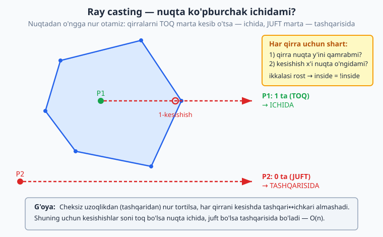
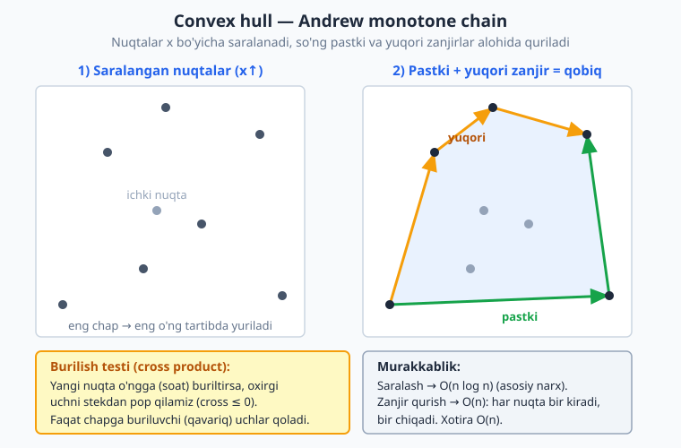

<a id="b36"></a>
# 36-bo'lim: Geometriya

<sub>[↑ Mundarijaga qaytish](README.md#mundarija)</sub>

> Bu bo'limda hisoblash geometriyasi (computational geometry) asoslari ko'rib chiqiladi:
> nuqtalar orasidagi masofalar, nuqtaning shakl ichida yotishini aniqlash, ko'pburchak
> yuzasi (shoelace) va perimetri, vektor ko'paytmasi (cross product) orqali orientatsiya
> va kesmalar kesishishi, eng yaqin juftlikni topish (brute force va divide & conquer),
> qavariq qobiq (convex hull — Graham scan va Andrew monotone chain), nuqtalarni aylantirish
> va aks ettirish hamda to'rtburchaklar bilan ishlash (kesishma, union yuzasi). Aksariyat
> formulalar oddiy koordinata geometriyasiga tayanadi; e'tibor bering — suzuvchi nuqta
> (floating point) bilan ishlashda taqqoslashlarda kichik xatoliklar bo'lishi mumkin.

<a id="m797"></a>
### 797. Ikki nuqta orasidagi masofa (Euclidean distance)
Ikki nuqta orasidagi to'g'ri chiziqli (Evklid) masofani Pifagor teoremasi bilan hisoblaydi.
`⏱ O(1) · 💾 O(1)`

**JS**
```js
const dist = (a, b) => Math.hypot(a[0] - b[0], a[1] - b[1]);
// dist([0, 0], [3, 4]) === 5
```
**PHP**
```php
function dist(array $a, array $b): float {
    return hypot($a[0] - $b[0], $a[1] - $b[1]);
}
```
**Python**
```python
from math import hypot

def dist(a, b):
    return hypot(a[0] - b[0], a[1] - b[1])
```

<a id="m798"></a>
### 798. Manhattan masofa (taxi geometriyasi)
Koordinata farqlarining absolyut qiymatlari yig'indisi — "panjara" bo'ylab masofa.
`⏱ O(1) · 💾 O(1)`

**JS**
```js
const manhattan = (a, b) => Math.abs(a[0] - b[0]) + Math.abs(a[1] - b[1]);
// manhattan([1, 2], [4, 6]) === 7
```
**PHP**
```php
function manhattan(array $a, array $b): int {
    return abs($a[0] - $b[0]) + abs($a[1] - $b[1]);
}
```
**Python**
```python
def manhattan(a, b):
    return abs(a[0] - b[0]) + abs(a[1] - b[1])
```

<a id="m799"></a>
### 799. Nuqta to'rtburchak ichidami
Nuqta o'qlarga parallel to'rtburchak (chap-past va o'ng-yuqori burchaklari berilgan) ichida yoki chegarasidami.
`⏱ O(1) · 💾 O(1)`

**JS**
```js
const inRect = (p, lo, hi) =>
  p[0] >= lo[0] && p[0] <= hi[0] && p[1] >= lo[1] && p[1] <= hi[1];
// inRect([2, 3], [0, 0], [5, 5]) === true
```
**PHP**
```php
function inRect(array $p, array $lo, array $hi): bool {
    return $p[0] >= $lo[0] && $p[0] <= $hi[0]
        && $p[1] >= $lo[1] && $p[1] <= $hi[1];
}
```
**Python**
```python
def in_rect(p, lo, hi):
    return lo[0] <= p[0] <= hi[0] and lo[1] <= p[1] <= hi[1]
```

<a id="m800"></a>
### 800. Nuqta aylana ichidami
Nuqtadan markazgacha masofa radiusdan kichik yoki tengligini ildizsiz (kvadratlar orqali) tekshiradi.
`⏱ O(1) · 💾 O(1)`

**JS**
```js
const inCircle = (p, c, r) => {
  const dx = p[0] - c[0], dy = p[1] - c[1];
  return dx * dx + dy * dy <= r * r;
};
// inCircle([1, 1], [0, 0], 2) === true
```
**PHP**
```php
function inCircle(array $p, array $c, float $r): bool {
    $dx = $p[0] - $c[0]; $dy = $p[1] - $c[1];
    return $dx * $dx + $dy * $dy <= $r * $r;
}
```
**Python**
```python
def in_circle(p, c, r):
    dx, dy = p[0] - c[0], p[1] - c[1]
    return dx * dx + dy * dy <= r * r
```

<a id="m801"></a>
### 801. Nuqta ko'pburchak ichidami (ray casting)
Nuqtadan o'ngga nur otib, ko'pburchak qirralarini kesib o'tish sonini sanaydi: toq bo'lsa ichida.
`⏱ O(n) · 💾 O(1)`

**JS**
```js
const inPolygon = (p, poly) => {
  let inside = false;
  for (let i = 0, j = poly.length - 1; i < poly.length; j = i++) {
    const [xi, yi] = poly[i], [xj, yj] = poly[j];
    if (yi > p[1] !== yj > p[1] &&
        p[0] < ((xj - xi) * (p[1] - yi)) / (yj - yi) + xi)
      inside = !inside;
  }
  return inside;
};
// inPolygon([1, 1], [[0,0],[4,0],[4,4],[0,4]]) === true
```
**PHP**
```php
function inPolygon(array $p, array $poly): bool {
    $inside = false;
    $n = count($poly);
    for ($i = 0, $j = $n - 1; $i < $n; $j = $i++) {
        [$xi, $yi] = $poly[$i];
        [$xj, $yj] = $poly[$j];
        if (($yi > $p[1]) !== ($yj > $p[1]) &&
            $p[0] < ($xj - $xi) * ($p[1] - $yi) / ($yj - $yi) + $xi)
            $inside = !$inside;
    }
    return $inside;
}
```
**Python**
```python
def in_polygon(p, poly):
    inside = False
    n = len(poly)
    j = n - 1
    for i in range(n):
        xi, yi = poly[i]
        xj, yj = poly[j]
        if (yi > p[1]) != (yj > p[1]) and \
                p[0] < (xj - xi) * (p[1] - yi) / (yj - yi) + xi:
            inside = not inside
        j = i
    return inside
```

Quyidagi diagramma nurni ichki va tashqi nuqtalardan otib, kesishishlar soni toq yoki juftligiga qarab javob qanday aniqlanishini ko'rsatadi:



<a id="m802"></a>
### 802. Ko'pburchak yuzasi (shoelace formula)
Uchlari tartiblangan oddiy ko'pburchak yuzasini "bog'lama" (shoelace) formulasi bilan topadi.
`⏱ O(n) · 💾 O(1)`

**JS**
```js
const polygonArea = (poly) => {
  let s = 0;
  for (let i = 0, n = poly.length; i < n; i++) {
    const [x1, y1] = poly[i], [x2, y2] = poly[(i + 1) % n];
    s += x1 * y2 - x2 * y1;
  }
  return Math.abs(s) / 2;
};
// polygonArea([[0,0],[4,0],[4,4],[0,4]]) === 16
```
**PHP**
```php
function polygonArea(array $poly): float {
    $s = 0; $n = count($poly);
    for ($i = 0; $i < $n; $i++) {
        [$x1, $y1] = $poly[$i];
        [$x2, $y2] = $poly[($i + 1) % $n];
        $s += $x1 * $y2 - $x2 * $y1;
    }
    return abs($s) / 2;
}
```
**Python**
```python
def polygon_area(poly):
    s = 0
    n = len(poly)
    for i in range(n):
        x1, y1 = poly[i]
        x2, y2 = poly[(i + 1) % n]
        s += x1 * y2 - x2 * y1
    return abs(s) / 2
```

<a id="m803"></a>
### 803. Uchburchak yuzasi (3 nuqta bo'yicha)
Uchta nuqta bilan berilgan uchburchak yuzasini vektor ko'paytmasi orqali topadi.
`⏱ O(1) · 💾 O(1)`

**JS**
```js
const triArea = (a, b, c) =>
  Math.abs((b[0] - a[0]) * (c[1] - a[1]) - (c[0] - a[0]) * (b[1] - a[1])) / 2;
// triArea([0,0],[4,0],[0,3]) === 6
```
**PHP**
```php
function triArea(array $a, array $b, array $c): float {
    return abs(($b[0] - $a[0]) * ($c[1] - $a[1])
        - ($c[0] - $a[0]) * ($b[1] - $a[1])) / 2;
}
```
**Python**
```python
def tri_area(a, b, c):
    return abs((b[0] - a[0]) * (c[1] - a[1])
               - (c[0] - a[0]) * (b[1] - a[1])) / 2
```

<a id="m804"></a>
### 804. Uch nuqta orientatsiyasi (cross product)
Vektor ko'paytmasi ishorasi bilan a→b→c burilishini aniqlaydi: 1 — soat strelkasiga teskari, -1 — soat bo'ylab, 0 — bir chiziqda.
`⏱ O(1) · 💾 O(1)`

**JS**
```js
const orientation = (a, b, c) => {
  const v = (b[0] - a[0]) * (c[1] - a[1]) - (b[1] - a[1]) * (c[0] - a[0]);
  return v > 0 ? 1 : v < 0 ? -1 : 0;
};
// orientation([0,0],[1,0],[0,1]) === 1
```
**PHP**
```php
function orientation(array $a, array $b, array $c): int {
    $v = ($b[0] - $a[0]) * ($c[1] - $a[1])
       - ($b[1] - $a[1]) * ($c[0] - $a[0]);
    return $v > 0 ? 1 : ($v < 0 ? -1 : 0);
}
```
**Python**
```python
def orientation(a, b, c):
    v = (b[0] - a[0]) * (c[1] - a[1]) - (b[1] - a[1]) * (c[0] - a[0])
    return (v > 0) - (v < 0)
```

<a id="m805"></a>
### 805. Ikki kesma kesishadimi
Orientatsiyalar va maxsus (bir chiziqdagi) holatlar orqali ikki kesmaning kesishishini aniqlaydi.
`⏱ O(1) · 💾 O(1)`

**JS**
```js
const orient = (a, b, c) => {
  const v = (b[0] - a[0]) * (c[1] - a[1]) - (b[1] - a[1]) * (c[0] - a[0]);
  return v > 0 ? 1 : v < 0 ? -1 : 0;
};
const onSeg = (a, b, c) =>
  Math.min(a[0], b[0]) <= c[0] && c[0] <= Math.max(a[0], b[0]) &&
  Math.min(a[1], b[1]) <= c[1] && c[1] <= Math.max(a[1], b[1]);
const segIntersect = (p1, p2, p3, p4) => {
  const o1 = orient(p1, p2, p3), o2 = orient(p1, p2, p4);
  const o3 = orient(p3, p4, p1), o4 = orient(p3, p4, p2);
  if (o1 !== o2 && o3 !== o4) return true;
  if (o1 === 0 && onSeg(p1, p2, p3)) return true;
  if (o2 === 0 && onSeg(p1, p2, p4)) return true;
  if (o3 === 0 && onSeg(p3, p4, p1)) return true;
  if (o4 === 0 && onSeg(p3, p4, p2)) return true;
  return false;
};
// segIntersect([0,0],[4,4],[0,4],[4,0]) === true
```
**Python**
```python
def orient(a, b, c):
    v = (b[0] - a[0]) * (c[1] - a[1]) - (b[1] - a[1]) * (c[0] - a[0])
    return (v > 0) - (v < 0)

def on_seg(a, b, c):
    return (min(a[0], b[0]) <= c[0] <= max(a[0], b[0]) and
            min(a[1], b[1]) <= c[1] <= max(a[1], b[1]))

def seg_intersect(p1, p2, p3, p4):
    o1, o2 = orient(p1, p2, p3), orient(p1, p2, p4)
    o3, o4 = orient(p3, p4, p1), orient(p3, p4, p2)
    if o1 != o2 and o3 != o4:
        return True
    if o1 == 0 and on_seg(p1, p2, p3):
        return True
    if o2 == 0 and on_seg(p1, p2, p4):
        return True
    if o3 == 0 and on_seg(p3, p4, p1):
        return True
    if o4 == 0 and on_seg(p3, p4, p2):
        return True
    return False
```

<a id="m806"></a>
### 806. Ikki to'g'ri chiziq kesishish nuqtasi
Har biri ikki nuqta bilan berilgan ikki to'g'ri chiziqning kesishish nuqtasini determinant orqali topadi (parallel bo'lsa null).
`⏱ O(1) · 💾 O(1)`

**JS**
```js
const lineIntersect = (p1, p2, p3, p4) => {
  const d = (p1[0] - p2[0]) * (p3[1] - p4[1]) - (p1[1] - p2[1]) * (p3[0] - p4[0]);
  if (d === 0) return null;
  const a = p1[0] * p2[1] - p1[1] * p2[0];
  const b = p3[0] * p4[1] - p3[1] * p4[0];
  const x = (a * (p3[0] - p4[0]) - (p1[0] - p2[0]) * b) / d;
  const y = (a * (p3[1] - p4[1]) - (p1[1] - p2[1]) * b) / d;
  return [x, y];
};
// lineIntersect([0,0],[4,4],[0,4],[4,0]) -> [2, 2]
```
**PHP**
```php
function lineIntersect(array $p1, array $p2, array $p3, array $p4): ?array {
    $d = ($p1[0] - $p2[0]) * ($p3[1] - $p4[1])
       - ($p1[1] - $p2[1]) * ($p3[0] - $p4[0]);
    if ($d == 0) return null;
    $a = $p1[0] * $p2[1] - $p1[1] * $p2[0];
    $b = $p3[0] * $p4[1] - $p3[1] * $p4[0];
    $x = ($a * ($p3[0] - $p4[0]) - ($p1[0] - $p2[0]) * $b) / $d;
    $y = ($a * ($p3[1] - $p4[1]) - ($p1[1] - $p2[1]) * $b) / $d;
    return [$x, $y];
}
```
**Python**
```python
def line_intersect(p1, p2, p3, p4):
    d = (p1[0] - p2[0]) * (p3[1] - p4[1]) - (p1[1] - p2[1]) * (p3[0] - p4[0])
    if d == 0:
        return None
    a = p1[0] * p2[1] - p1[1] * p2[0]
    b = p3[0] * p4[1] - p3[1] * p4[0]
    x = (a * (p3[0] - p4[0]) - (p1[0] - p2[0]) * b) / d
    y = (a * (p3[1] - p4[1]) - (p1[1] - p2[1]) * b) / d
    return (x, y)
```

<a id="m807"></a>
### 807. Eng yaqin juftlik (brute force)
Barcha juftliklarni solishtirib eng kichik masofadagi ikki nuqtani topadi.
`⏱ O(n²) · 💾 O(1)`

**JS**
```js
const closestBrute = (pts) => {
  let best = Infinity;
  for (let i = 0; i < pts.length; i++)
    for (let j = i + 1; j < pts.length; j++) {
      const d = Math.hypot(pts[i][0] - pts[j][0], pts[i][1] - pts[j][1]);
      if (d < best) best = d;
    }
  return best;
};
// closestBrute([[0,0],[3,4],[1,1]]) -> ~1.414
```
**PHP**
```php
function closestBrute(array $pts): float {
    $best = INF;
    $n = count($pts);
    for ($i = 0; $i < $n; $i++)
        for ($j = $i + 1; $j < $n; $j++) {
            $d = hypot($pts[$i][0] - $pts[$j][0], $pts[$i][1] - $pts[$j][1]);
            if ($d < $best) $best = $d;
        }
    return $best;
}
```
**Python**
```python
from math import hypot

def closest_brute(pts):
    best = float("inf")
    n = len(pts)
    for i in range(n):
        for j in range(i + 1, n):
            d = hypot(pts[i][0] - pts[j][0], pts[i][1] - pts[j][1])
            best = min(best, d)
    return best
```

<a id="m808"></a>
### 808. Eng yaqin juftlik (divide & conquer)
Nuqtalarni x bo'yicha bo'lib, har yarmidagi minimal masofani topib, chegara ("strip") bo'ylab tekshiradi.
`⏱ O(n log n) · 💾 O(n)`

**Python**
```python
from math import hypot

def closest_pair(pts):
    pts = sorted(pts)

    def rec(p):
        n = len(p)
        if n <= 3:
            return min((hypot(p[i][0] - p[j][0], p[i][1] - p[j][1])
                        for i in range(n) for j in range(i + 1, n)),
                       default=float("inf"))
        mid = n // 2
        midx = p[mid][0]
        d = min(rec(p[:mid]), rec(p[mid:]))
        strip = sorted((q for q in p if abs(q[0] - midx) < d),
                       key=lambda q: q[1])
        for i in range(len(strip)):
            for j in range(i + 1, len(strip)):
                if strip[j][1] - strip[i][1] >= d:
                    break
                d = min(d, hypot(strip[i][0] - strip[j][0],
                                 strip[i][1] - strip[j][1]))
        return d

    return rec(pts)
```
**JS**
```js
const closestPair = (pts) => {
  const d2 = (a, b) => Math.hypot(a[0] - b[0], a[1] - b[1]);
  const rec = (p) => {
    const n = p.length;
    if (n <= 3) {
      let best = Infinity;
      for (let i = 0; i < n; i++)
        for (let j = i + 1; j < n; j++) best = Math.min(best, d2(p[i], p[j]));
      return best;
    }
    const mid = n >> 1, midx = p[mid][0];
    let d = Math.min(rec(p.slice(0, mid)), rec(p.slice(mid)));
    const strip = p.filter((q) => Math.abs(q[0] - midx) < d)
                   .sort((a, b) => a[1] - b[1]);
    for (let i = 0; i < strip.length; i++)
      for (let j = i + 1; j < strip.length && strip[j][1] - strip[i][1] < d; j++)
        d = Math.min(d, d2(strip[i], strip[j]));
    return d;
  };
  return rec([...pts].sort((a, b) => a[0] - b[0]));
};
```

<a id="m809"></a>
### 809. Convex hull (Graham scan)
Eng pastki nuqtaga nisbatan burchak bo'yicha saralab, stek yordamida qavariq qobiqni yig'adi.
`⏱ O(n log n) · 💾 O(n)`

**Python**
```python
from math import atan2

def graham_scan(pts):
    pts = sorted(set(map(tuple, pts)))
    if len(pts) < 3:
        return pts
    start = min(pts, key=lambda p: (p[1], p[0]))

    def cross(o, a, b):
        return (a[0] - o[0]) * (b[1] - o[1]) - (a[1] - o[1]) * (b[0] - o[0])

    rest = sorted((p for p in pts if p != start),
                  key=lambda p: (atan2(p[1] - start[1], p[0] - start[0]),
                                 (p[0] - start[0]) ** 2 + (p[1] - start[1]) ** 2))
    hull = [start]
    for p in rest:
        while len(hull) >= 2 and cross(hull[-2], hull[-1], p) <= 0:
            hull.pop()
        hull.append(p)
    return hull
```
**JS**
```js
const grahamScan = (pts) => {
  const uniq = [...new Set(pts.map((p) => p.join(",")))].map((s) => s.split(",").map(Number));
  if (uniq.length < 3) return uniq;
  const start = uniq.reduce((a, b) => (b[1] < a[1] || (b[1] === a[1] && b[0] < a[0]) ? b : a));
  const cross = (o, a, b) =>
    (a[0] - o[0]) * (b[1] - o[1]) - (a[1] - o[1]) * (b[0] - o[0]);
  const rest = uniq.filter((p) => p !== start).sort((p, q) => {
    const ap = Math.atan2(p[1] - start[1], p[0] - start[0]);
    const aq = Math.atan2(q[1] - start[1], q[0] - start[0]);
    return ap - aq;
  });
  const hull = [start];
  for (const p of rest) {
    while (hull.length >= 2 && cross(hull[hull.length - 2], hull[hull.length - 1], p) <= 0)
      hull.pop();
    hull.push(p);
  }
  return hull;
};
```

<a id="m810"></a>
### 810. Convex hull (Andrew monotone chain)
Nuqtalarni saralab, pastki va yuqori zanjirlarni qurib qavariq qobiqni topadi (Graham'ga muqobil).
`⏱ O(n log n) · 💾 O(n)`

**JS**
```js
const monotoneChain = (pts) => {
  const p = [...new Set(pts.map((q) => q.join(",")))]
    .map((s) => s.split(",").map(Number))
    .sort((a, b) => a[0] - b[0] || a[1] - b[1]);
  if (p.length < 3) return p;
  const cross = (o, a, b) =>
    (a[0] - o[0]) * (b[1] - o[1]) - (a[1] - o[1]) * (b[0] - o[0]);
  const build = (arr) => {
    const h = [];
    for (const pt of arr) {
      while (h.length >= 2 && cross(h[h.length - 2], h[h.length - 1], pt) <= 0) h.pop();
      h.push(pt);
    }
    h.pop();
    return h;
  };
  const lower = build(p), upper = build([...p].reverse());
  return [...lower, ...upper];
};
// monotoneChain([[0,0],[2,0],[2,2],[0,2],[1,1]]) -> 4 ta uch
```
**Python**
```python
def monotone_chain(pts):
    p = sorted(set(map(tuple, pts)))
    if len(p) < 3:
        return p

    def cross(o, a, b):
        return (a[0] - o[0]) * (b[1] - o[1]) - (a[1] - o[1]) * (b[0] - o[0])

    def build(arr):
        h = []
        for pt in arr:
            while len(h) >= 2 and cross(h[-2], h[-1], pt) <= 0:
                h.pop()
            h.append(pt)
        return h[:-1]

    return build(p) + build(p[::-1])
```

Quyidagi diagramma saralangan nuqtalardan pastki va yuqori zanjirlar qanday qurilib, qavariq qobiqni hosil qilishini ko'rsatadi:



<a id="m811"></a>
### 811. Ko'pburchak perimetri
Ketma-ket uchlar orasidagi masofalar yig'indisi sifatida ko'pburchak perimetrini hisoblaydi.
`⏱ O(n) · 💾 O(1)`

**JS**
```js
const perimeter = (poly) => {
  let s = 0;
  for (let i = 0, n = poly.length; i < n; i++) {
    const a = poly[i], b = poly[(i + 1) % n];
    s += Math.hypot(a[0] - b[0], a[1] - b[1]);
  }
  return s;
};
// perimeter([[0,0],[4,0],[4,3],[0,3]]) === 14
```
**PHP**
```php
function perimeter(array $poly): float {
    $s = 0; $n = count($poly);
    for ($i = 0; $i < $n; $i++) {
        $a = $poly[$i]; $b = $poly[($i + 1) % $n];
        $s += hypot($a[0] - $b[0], $a[1] - $b[1]);
    }
    return $s;
}
```
**Python**
```python
from math import hypot

def perimeter(poly):
    n = len(poly)
    return sum(hypot(poly[i][0] - poly[(i + 1) % n][0],
                     poly[i][1] - poly[(i + 1) % n][1]) for i in range(n))
```

<a id="m812"></a>
### 812. Nuqta kesmada yotadimi
Nuqta a-b kesmasida (uchlarini ham hisobga olib) yotishini bir chiziqlilik va chegaralar orqali tekshiradi.
`⏱ O(1) · 💾 O(1)`

**JS**
```js
const onSegment = (a, b, p) => {
  const cross = (b[0] - a[0]) * (p[1] - a[1]) - (b[1] - a[1]) * (p[0] - a[0]);
  if (cross !== 0) return false;
  return Math.min(a[0], b[0]) <= p[0] && p[0] <= Math.max(a[0], b[0]) &&
         Math.min(a[1], b[1]) <= p[1] && p[1] <= Math.max(a[1], b[1]);
};
// onSegment([0,0],[4,4],[2,2]) === true
```
**PHP**
```php
function onSegment(array $a, array $b, array $p): bool {
    $cross = ($b[0] - $a[0]) * ($p[1] - $a[1])
           - ($b[1] - $a[1]) * ($p[0] - $a[0]);
    if ($cross != 0) return false;
    return min($a[0], $b[0]) <= $p[0] && $p[0] <= max($a[0], $b[0])
        && min($a[1], $b[1]) <= $p[1] && $p[1] <= max($a[1], $b[1]);
}
```
**Python**
```python
def on_segment(a, b, p):
    cross = (b[0] - a[0]) * (p[1] - a[1]) - (b[1] - a[1]) * (p[0] - a[0])
    if cross != 0:
        return False
    return (min(a[0], b[0]) <= p[0] <= max(a[0], b[0]) and
            min(a[1], b[1]) <= p[1] <= max(a[1], b[1]))
```

<a id="m813"></a>
### 813. Nuqtani aylantirish (origin atrofida)
Nuqtani koordinata boshi atrofida θ radian burchakka aylantiradi (aylantirish matritsasi).
`⏱ O(1) · 💾 O(1)`

**JS**
```js
const rotate = (p, theta) => {
  const c = Math.cos(theta), s = Math.sin(theta);
  return [p[0] * c - p[1] * s, p[0] * s + p[1] * c];
};
// rotate([1, 0], Math.PI / 2) -> [~0, 1]
```
**PHP**
```php
function rotate(array $p, float $theta): array {
    $c = cos($theta); $s = sin($theta);
    return [$p[0] * $c - $p[1] * $s, $p[0] * $s + $p[1] * $c];
}
```
**Python**
```python
from math import cos, sin

def rotate(p, theta):
    c, s = cos(theta), sin(theta)
    return (p[0] * c - p[1] * s, p[0] * s + p[1] * c)
```

<a id="m814"></a>
### 814. Nuqtani aks ettirish
Nuqtani x o'qi, y o'qi va y=x to'g'ri chizig'iga nisbatan aks ettiradi (reflection).
`⏱ O(1) · 💾 O(1)`

**JS**
```js
const reflectX = (p) => [p[0], -p[1]];
const reflectY = (p) => [-p[0], p[1]];
const reflectYeqX = (p) => [p[1], p[0]];
// reflectX([3, 2]) -> [3, -2]
```
**PHP**
```php
function reflectX(array $p): array { return [$p[0], -$p[1]]; }
function reflectY(array $p): array { return [-$p[0], $p[1]]; }
function reflectYeqX(array $p): array { return [$p[1], $p[0]]; }
```
**Python**
```python
def reflect_x(p):
    return (p[0], -p[1])

def reflect_y(p):
    return (-p[0], p[1])

def reflect_y_eq_x(p):
    return (p[1], p[0])
```

<a id="m815"></a>
### 815. Ko'pburchak markazi (centroid)
Yuza bo'yicha o'rtacha (shoelace) formulasi bilan ko'pburchakning og'irlik markazini topadi.
`⏱ O(n) · 💾 O(1)`

**JS**
```js
const centroid = (poly) => {
  let a = 0, cx = 0, cy = 0, n = poly.length;
  for (let i = 0; i < n; i++) {
    const [x1, y1] = poly[i], [x2, y2] = poly[(i + 1) % n];
    const cr = x1 * y2 - x2 * y1;
    a += cr;
    cx += (x1 + x2) * cr;
    cy += (y1 + y2) * cr;
  }
  a *= 0.5;
  return [cx / (6 * a), cy / (6 * a)];
};
// centroid([[0,0],[4,0],[4,4],[0,4]]) -> [2, 2]
```
**PHP**
```php
function centroid(array $poly): array {
    $a = 0; $cx = 0; $cy = 0; $n = count($poly);
    for ($i = 0; $i < $n; $i++) {
        [$x1, $y1] = $poly[$i];
        [$x2, $y2] = $poly[($i + 1) % $n];
        $cr = $x1 * $y2 - $x2 * $y1;
        $a += $cr;
        $cx += ($x1 + $x2) * $cr;
        $cy += ($y1 + $y2) * $cr;
    }
    $a *= 0.5;
    return [$cx / (6 * $a), $cy / (6 * $a)];
}
```
**Python**
```python
def centroid(poly):
    a = cx = cy = 0
    n = len(poly)
    for i in range(n):
        x1, y1 = poly[i]
        x2, y2 = poly[(i + 1) % n]
        cr = x1 * y2 - x2 * y1
        a += cr
        cx += (x1 + x2) * cr
        cy += (y1 + y2) * cr
    a *= 0.5
    return (cx / (6 * a), cy / (6 * a))
```

<a id="m816"></a>
### 816. Ko'pburchak qavariqmi (convex)
Ketma-ket uchlardagi burilish ishorasi doimo bir xil bo'lsa ko'pburchak qavariq.
`⏱ O(n) · 💾 O(1)`

**JS**
```js
const isConvex = (poly) => {
  const n = poly.length;
  let sign = 0;
  for (let i = 0; i < n; i++) {
    const a = poly[i], b = poly[(i + 1) % n], c = poly[(i + 2) % n];
    const cr = (b[0] - a[0]) * (c[1] - b[1]) - (b[1] - a[1]) * (c[0] - b[0]);
    if (cr !== 0) {
      const s = cr > 0 ? 1 : -1;
      if (sign === 0) sign = s;
      else if (s !== sign) return false;
    }
  }
  return true;
};
// isConvex([[0,0],[4,0],[4,4],[0,4]]) === true
```
**PHP**
```php
function isConvex(array $poly): bool {
    $n = count($poly); $sign = 0;
    for ($i = 0; $i < $n; $i++) {
        $a = $poly[$i]; $b = $poly[($i + 1) % $n]; $c = $poly[($i + 2) % $n];
        $cr = ($b[0] - $a[0]) * ($c[1] - $b[1]) - ($b[1] - $a[1]) * ($c[0] - $b[0]);
        if ($cr != 0) {
            $s = $cr > 0 ? 1 : -1;
            if ($sign == 0) $sign = $s;
            elseif ($s != $sign) return false;
        }
    }
    return true;
}
```
**Python**
```python
def is_convex(poly):
    n = len(poly)
    sign = 0
    for i in range(n):
        a, b, c = poly[i], poly[(i + 1) % n], poly[(i + 2) % n]
        cr = (b[0] - a[0]) * (c[1] - b[1]) - (b[1] - a[1]) * (c[0] - b[0])
        if cr != 0:
            s = 1 if cr > 0 else -1
            if sign == 0:
                sign = s
            elif s != sign:
                return False
    return True
```

<a id="m817"></a>
### 817. Ikki to'rtburchak kesishadimi
O'qlarga parallel ikki to'rtburchak (har biri chap-past va o'ng-yuqori bilan) ustma-ust tushishini tekshiradi.
`⏱ O(1) · 💾 O(1)`

**JS**
```js
const rectsOverlap = (r1, r2) =>
  r1[0][0] < r2[1][0] && r2[0][0] < r1[1][0] &&
  r1[0][1] < r2[1][1] && r2[0][1] < r1[1][1];
// rectsOverlap([[0,0],[2,2]], [[1,1],[3,3]]) === true
```
**PHP**
```php
function rectsOverlap(array $r1, array $r2): bool {
    return $r1[0][0] < $r2[1][0] && $r2[0][0] < $r1[1][0]
        && $r1[0][1] < $r2[1][1] && $r2[0][1] < $r1[1][1];
}
```
**Python**
```python
def rects_overlap(r1, r2):
    return (r1[0][0] < r2[1][0] and r2[0][0] < r1[1][0] and
            r1[0][1] < r2[1][1] and r2[0][1] < r1[1][1])
```

<a id="m818"></a>
### 818. Ikki to'rtburchak kesishma yuzasi
Ikki o'qparallel to'rtburchakning umumiy (kesishma) qismi yuzasini topadi; kesishmasa 0.
`⏱ O(1) · 💾 O(1)`

**JS**
```js
const intersectArea = (r1, r2) => {
  const w = Math.min(r1[1][0], r2[1][0]) - Math.max(r1[0][0], r2[0][0]);
  const h = Math.min(r1[1][1], r2[1][1]) - Math.max(r1[0][1], r2[0][1]);
  return w > 0 && h > 0 ? w * h : 0;
};
// intersectArea([[0,0],[2,2]], [[1,1],[3,3]]) === 1
```
**PHP**
```php
function intersectArea(array $r1, array $r2): float {
    $w = min($r1[1][0], $r2[1][0]) - max($r1[0][0], $r2[0][0]);
    $h = min($r1[1][1], $r2[1][1]) - max($r1[0][1], $r2[0][1]);
    return $w > 0 && $h > 0 ? $w * $h : 0;
}
```
**Python**
```python
def intersect_area(r1, r2):
    w = min(r1[1][0], r2[1][0]) - max(r1[0][0], r2[0][0])
    h = min(r1[1][1], r2[1][1]) - max(r1[0][1], r2[0][1])
    return w * h if w > 0 and h > 0 else 0
```

<a id="m819"></a>
### 819. To'rtburchaklar union yuzasi (inclusion-exclusion)
Ikki to'rtburchak birlashmasi (union) yuzasi = yuzalar yig'indisi − kesishma yuzasi.
`⏱ O(1) · 💾 O(1)`

**JS**
```js
const unionArea = (r1, r2) => {
  const area = (r) => (r[1][0] - r[0][0]) * (r[1][1] - r[0][1]);
  const w = Math.min(r1[1][0], r2[1][0]) - Math.max(r1[0][0], r2[0][0]);
  const h = Math.min(r1[1][1], r2[1][1]) - Math.max(r1[0][1], r2[0][1]);
  const inter = w > 0 && h > 0 ? w * h : 0;
  return area(r1) + area(r2) - inter;
};
// unionArea([[0,0],[2,2]], [[1,1],[3,3]]) === 7
```
**PHP**
```php
function unionArea(array $r1, array $r2): float {
    $area = fn($r) => ($r[1][0] - $r[0][0]) * ($r[1][1] - $r[0][1]);
    $w = min($r1[1][0], $r2[1][0]) - max($r1[0][0], $r2[0][0]);
    $h = min($r1[1][1], $r2[1][1]) - max($r1[0][1], $r2[0][1]);
    $inter = $w > 0 && $h > 0 ? $w * $h : 0;
    return $area($r1) + $area($r2) - $inter;
}
```
**Python**
```python
def union_area(r1, r2):
    area = lambda r: (r[1][0] - r[0][0]) * (r[1][1] - r[0][1])
    w = min(r1[1][0], r2[1][0]) - max(r1[0][0], r2[0][0])
    h = min(r1[1][1], r2[1][1]) - max(r1[0][1], r2[0][1])
    inter = w * h if w > 0 and h > 0 else 0
    return area(r1) + area(r2) - inter
```

<a id="m820"></a>
### 820. Bir chiziqdagi maksimal nuqtalar
Har bir nuqtadan boshqalarga qiyaliklarni (slope) sanab, bitta to'g'ri chiziqda yotuvchi nuqtalarning maksimal sonini topadi.
`⏱ O(n²) · 💾 O(n)`

**Python**
```python
from math import gcd
from collections import defaultdict

def max_points(points):
    n = len(points)
    if n <= 2:
        return n
    best = 1
    for i in range(n):
        slopes = defaultdict(int)
        for j in range(n):
            if i == j:
                continue
            dx = points[j][0] - points[i][0]
            dy = points[j][1] - points[i][1]
            g = gcd(dx, dy) or 1
            dx, dy = dx // g, dy // g
            if dx < 0 or (dx == 0 and dy < 0):
                dx, dy = -dx, -dy
            slopes[(dx, dy)] += 1
        best = max(best, max(slopes.values()) + 1)
    return best
```
**JS**
```js
const maxPoints = (points) => {
  const n = points.length;
  if (n <= 2) return n;
  const gcd = (a, b) => (b === 0 ? a : gcd(b, a % b));
  let best = 1;
  for (let i = 0; i < n; i++) {
    const slopes = new Map();
    for (let j = 0; j < n; j++) {
      if (i === j) continue;
      let dx = points[j][0] - points[i][0];
      let dy = points[j][1] - points[i][1];
      const g = gcd(Math.abs(dx), Math.abs(dy)) || 1;
      dx /= g; dy /= g;
      if (dx < 0 || (dx === 0 && dy < 0)) { dx = -dx; dy = -dy; }
      const key = dx + "," + dy;
      slopes.set(key, (slopes.get(key) || 0) + 1);
    }
    best = Math.max(best, Math.max(...slopes.values()) + 1);
  }
  return best;
};
// maxPoints([[1,1],[2,2],[3,3],[0,5]]) === 3
```

<a id="m821"></a>
### 821. Nuqtalardan minimal yuzali to'rtburchak (axis-aligned)
Nuqtalarni qoplovchi o'qlarga parallel eng kichik to'rtburchak (bounding box) yuzasini topadi.
`⏱ O(n) · 💾 O(1)`

**JS**
```js
const boundingArea = (pts) => {
  let minX = Infinity, minY = Infinity, maxX = -Infinity, maxY = -Infinity;
  for (const [x, y] of pts) {
    if (x < minX) minX = x;
    if (x > maxX) maxX = x;
    if (y < minY) minY = y;
    if (y > maxY) maxY = y;
  }
  return (maxX - minX) * (maxY - minY);
};
// boundingArea([[0,0],[2,3],[1,1]]) === 6
```
**PHP**
```php
function boundingArea(array $pts): int {
    $xs = array_column($pts, 0);
    $ys = array_column($pts, 1);
    return (max($xs) - min($xs)) * (max($ys) - min($ys));
}
```
**Python**
```python
def bounding_area(pts):
    xs = [p[0] for p in pts]
    ys = [p[1] for p in pts]
    return (max(xs) - min(xs)) * (max(ys) - min(ys))
```
