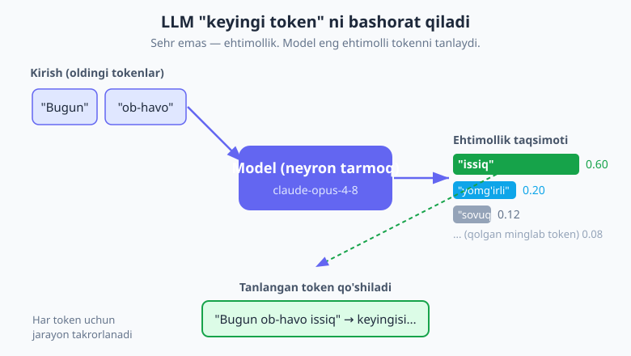
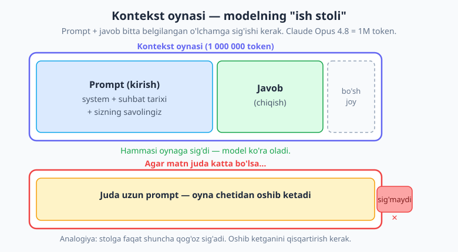
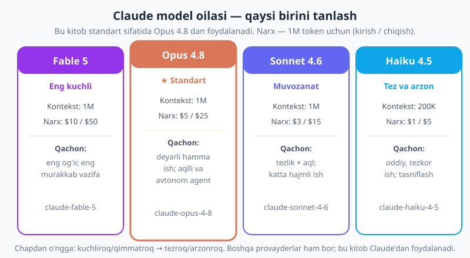

# 01 — LLM nima va qanday ishlaydi

[🏠 README](./README.md) · [Keyingi: 02 — O'rnatish va birinchi chaqiruv ➡️](./02-ornatish-birinchi-chaqiruv.md)

---

> **Bu bobda:** LLM (katta til modeli) aslida nima ekanini — "sehrli quti" emas, balki **ehtimollik bilan keyingi tokenni bashorat qiluvchi** ulkan neyron tarmoq ekanini tushunamiz. **Token** nima (matn bo'laklari), nega ular muhim (narx va limitlar tokenga bog'liq), va `"salom dunyo"` qanday tokenlarga bo'linishini ko'ramiz. **Kontekst oynasi** — modelning bir vaqtda "ko'ra oladigan" maksimal token miqdori (Claude Opus 4.8 da 1M) — qisqa muddatli xotira yoki "ish stoli" analogiyasi bilan ochiladi. **Ehtimollik va "temperatura"** g'oyasini halol tushuntiramiz (zamonaviy Opus 4.8 da temperatura parametri olib tashlangan). **Prompt → completion** oqimi shunchaki HTTP API chaqiruvi ekanini, va `client.messages.create(...)` qanday ko'rinishini oldindan ko'rsatamiz. **Claude model oilasini** (Opus 4.8 standart, Sonnet 4.6, Haiku 4.5, Fable 5) jadval bilan solishtiramiz. Nega aynan **JavaScript** AI uchun ideal, LLM nimani yaxshi qiladi va nimani qila olmaydi ("gallyutsinatsiya" nima) — hammasini ko'ramiz.
>
> Bu kitob siz JavaScript / Node.js asoslarini (`async/await`, `Promise`, ESM `import`, `npm`, `fetch`) bilasiz deb hisoblaydi — kerak bo'lsa [../js/README.md](../js/README.md) ga qayting. Lekin AI/LLM siz uchun yangi deb faraz qilamiz, shuning uchun har bir AI atamasini birinchi uchraganida tushuntiramiz. Bu bob asosan tushunchaviy — jonli kod kam; birinchi chaqiruvni 02-bobda yozamiz.

---

## 1. LLM nima? Sehr yo'q — bu ehtimollik

**LLM** (Large Language Model — katta til modeli) — bu **juda katta matn ustida o'rgatilgan neyron tarmoq**. Uning bitta, ajablanarli darajada oddiy vazifasi bor: berilgan matnga qarab, **keyingi "token" nima bo'lishini bashorat qilish**.

Tasavvur qiling, telefoningiz klaviaturasidagi avtomatik to'ldirish (autocomplete) "men bugun" deb yozsangiz, "ishga" yoki "uyda" deb taklif qiladi. LLM — bu **o'ta kuchaytirilgan autocomplete**: u nafaqat keyingi bitta so'zni, balki butun paragraf, kod yoki maqolani so'z-so'z (aniqrog'i, token-token) yozib chiqadi, har qadamda "endi nima kelishi eng ehtimolli?" degan savolga javob beradi.

Bu yerda muhim haqiqat bor, uni boshdanoq yodda tuting:

> **Eslatma.** LLM "o'ylamaydi" va "bilmaydi" — u **statistik bashorat** qiladi. U internet va kitoblardagi ulkan matndan "qaysi tokenlar ketma-ketligi tabiiy ko'rinadi" degan naqshlarni o'rgangan. Javob to'g'ri chiqsa — bu ehtimollik to'g'ri ishlagani uchun, "bilgani" uchun emas. Bu farq keyinroq (gallyutsinatsiya bo'limida) juda muhim bo'ladi.

Demak, "AI bizdan aqlliroq" yoki "AI nima qilayotganini tushunadi" degan qo'rquvni hozircha bir chetga qo'ying. Siz o'rganadigan narsa — **ehtimollik mashinasini** o'z ilovangizga ulash. Bu HTTP API; siz unga matn berasiz, u matn qaytaradi.



Diagrammaga qarang: model `["Bugun", "ob-havo"]` tokenlarini oladi va keyingi token bo'yicha **ehtimollik taqsimotini** chiqaradi — `"issiq"` (0.60), `"yomg'irli"` (0.20), `"sovuq"` (0.12) va minglab boshqa variant. Keyin u bittasini tanlaydi (odatda eng ehtimollisini), uni matnga qo'shadi, va jarayonni keyingi token uchun **qaytadan** boshlaydi. Mana shu sikl — javob tugaguncha takrorlanadi.

## 2. Token nima va nega muhim?

LLM matnni so'zlar bilan emas, **tokenlar** bilan o'lchaydi. **Token** — bu matnning kichik bo'lagi: ko'pincha so'z, lekin ba'zan so'zning bir qismi yoki tinish belgisi.

Inglizcha matnda taxminan: **1 token ≈ 4 belgi ≈ 0.75 so'z**. Ya'ni 100 token ≈ 75 so'z. O'zbekcha, ruscha yoki boshqa tillarda esa bitta so'z **bir nechta tokenga** bo'linishi mumkin (chunki modellar asosan inglizcha matnga moslab tuzilgan) — shuning uchun bir xil ma'noli matn o'zbekchada inglizchaga qaraganda ko'proq token oladi.

Misol uchun, `"salom dunyo"` taxminan shunday bo'linishi mumkin (aniq bo'linish modelga bog'liq):

```text
"salom dunyo"  →  ["sal", "om", " dun", "yo"]   ≈ 4 token
```

E'tibor bering: bo'shliq ham token ichiga kiradi, va bitta so'z bir necha bo'lakka ajraladi. Buni hozircha aniq hisoblashga urinmang — muhimi, **token ≠ so'z**, va matn qanchalik uzun bo'lsa, shuncha ko'p token.

### Nega bu sizning hamyoningizga muhim?

Ikki sabab, va ikkalasi ham amaliy:

1. **Siz har token uchun pul to'laysiz.** Narx **kirish tokenlari** (siz yuborgan prompt) va **chiqish tokenlari** (model qaytargan javob) bo'yicha alohida hisoblanadi. Masalan, Opus 4.8 da 1 million kirish tokeni $5, 1 million chiqish tokeni $25 turadi (chiqish qimmatroq, chunki uni model "ishlab chiqaradi").
2. **Limitlar tokenda o'lchanadi.** Kontekst oynasi (keyingi bo'lim) ham, tezlik limitlari (rate limit) ham tokenda. Uzun promptlar nafaqat qimmat, balki limitga ham tezroq yetadi.

> **Maslahat.** Yangi boshlovchi sifatida "har bir token pul" degan o'yni o'rganing: keraksiz uzun system promptlar, butun fayllarni "ehtiyot uchun" yuborish, javobni cheksiz uzun qo'yib yuborish — bularning hammasi pulingizni yeydi. Boshida arzon model (Haiku) va kichik `max_tokens` bilan tajriba qiling. Tokenlarni aniq sanashni 14-bobda Claude'ning `countTokens` chaqiruvi bilan o'rganamiz (`tiktoken` — bu OpenAI uchun, Claude uchun noto'g'ri sanaydi).

## 3. Kontekst oynasi — modelning "ish stoli"

**Kontekst oynasi** (context window) — bu modelning bir chaqiruvda **bir vaqtning o'zida "ko'ra oladigan" maksimal token miqdori**. Bu chegaraga **prompt (kirish) ham, javob (chiqish) ham birgalikda** sig'ishi kerak.

Claude Opus 4.8 ning kontekst oynasi — **1 000 000 token** (1M). Bu juda katta: taxminan 750 000 inglizcha so'z, ya'ni bir nechta yo'g'on kitob. Lekin baribir **cheklangan** — cheksiz emas.



Eng yaxshi analogiya — **qisqa muddatli xotira** yoki **ish stoli**:

- Stolingizga faqat ma'lum miqdordagi qog'oz sig'adi. Yangi qog'oz qo'shsangiz, eskisini olib qo'yishga to'g'ri keladi.
- Model ham xuddi shunday: oynaga nima sig'sa, o'shani "ko'radi". Suhbat juda uzayib ketsa yoki siz juda katta hujjat yuborsangiz, oyna to'lib qoladi.
- Oynadan tashqaridagi narsani model **umuman ko'rmaydi** — go'yo u yo'qdek.

> **Diqqat.** API **holatsiz** (stateless): har bir chaqiruvda siz **butun suhbat tarixini** qaytadan yuborasiz. Model "oldingi gaplaringizni eslab qoladi" deb o'ylamang — u faqat siz hozir yuborgan promptdagi narsani ko'radi. Ko'p bosqichli suhbatni (multi-turn) qanday yuritish — 03-bobda. Suhbat oynaga sig'may qolganda nima qilish (qisqartirish, kompaktlash) — keyingi boblarda.

## 4. Ehtimollik va "temperatura" — ijodkorlik vs aniqlik (halol nuqta)

1-bo'limda ko'rdik: model keyingi token bo'yicha ehtimollik taqsimotini chiqaradi. Endi savol — u **qaysi** tokenni tanlaydi?

- Agar model har doim **eng ehtimolli** tokenni tanlasa — javoblar **aniq va takrorlanuvchi** (deterministik) bo'ladi, lekin biroz "quruq".
- Agar model ba'zan kamroq ehtimolli tokenni ham tanlasa — javoblar **ijodkorroq va xilma-xil** bo'ladi, lekin ba'zan kutilmaganroq.

An'anaviy LLM'larda bu muvozanatni **"temperatura"** (temperature) degan parametr boshqargan: past temperatura = aniqroq/takrorlanuvchi, yuqori temperatura = ijodkorroq/tasodifiyroq.

> **Diqqat.** Zamonaviy **Claude Opus 4.8 da `temperature` parametri umuman olib tashlangan** (uni yuborsangiz, API xato qaytaradi). Demak, bu kitobda siz temperaturani sozlamaysiz — Claude o'zi mos darajada xilma-xillikni boshqaradi, va xulq-atvorni siz **prompt orqali** (masalan, "qisqa va aniq javob ber" yoki "bir nechta ijodiy variant taklif et") yo'naltirasiz. "Temperatura" g'oyasini bilib qo'yish foydali (boshqa modellar va eski misollarda uchraydi), lekin Opus 4.8 da uni o'rnatmaysiz.

Amaliy xulosa, uni hozir yodda tuting: **bir xil promptni ikki marta yuborsangiz, javob bir xil bo'lmasligi mumkin.** Bu xato emas — bu LLM'ning tabiati. Shuning uchun ilovangizni shunga moslab qurasiz (bu fikrlash tarzini oxirgi bo'limda ko'ramiz).

## 5. Prompt → completion: bu shunchaki HTTP API

Endi eng tinchlantiruvchi qism: LLM bilan ishlash — bu **oddiy API chaqiruvi**, xuddi siz bilgan boshqa REST API'lar kabi.

- **Prompt** — siz yuboradigan matn (savol, ko'rsatma, suhbat tarixi).
- **Completion** — model qaytaradigan, generatsiya qilingan matn (javob).

Siz HTTP so'rovini yuborasiz, javobni olasiz. Sehr yo'q — `fetch` yoki ma'lumotlar bazasi so'rovi qanchalik "sehrli" bo'lsa, bu ham shuncha. Yagona farq — javobni model **token-token generatsiya qiladi**.

JavaScript'da bu rasmiy `@anthropic-ai/sdk` paketi orqali shunday ko'rinadi (buni hali ishga tushirmaymiz — shunchaki oldindan ko'ring):

```js
import Anthropic from "@anthropic-ai/sdk";

const client = new Anthropic(); // API kalitini muhit o'zgaruvchisidan oladi

const message = await client.messages.create({
  model: "claude-opus-4-8",
  max_tokens: 1024,
  messages: [{ role: "user", content: "Salom! O'zingni tanishtir." }],
});

console.log(message.content[0].text); // model qaytargan javob matni
```

Mana xolos — `messages.create(...)` chaqiruvi, prompt yuboriladi, javob qaytadi. `model` — qaysi modelni ishlatishimiz; `max_tokens` — javob eng ko'pi bilan necha token bo'lishi; `messages` — suhbat. Buni 02-bobda haqiqiy API kaliti bilan ishga tushiramiz; Messages API'ni 03-bobda chuqur ochamiz.

> **Eslatma.** `await` ga e'tibor bering — API chaqiruvi tarmoq orqali ketadi, shuning uchun u **asinxron**. Bu kitobdagi deyarli har bir AI chaqiruvi `async`/`await` bilan yoziladi. Agar bu siz uchun yangi bo'lsa, [../js/README.md](../js/README.md) dagi Promise va async bo'limlariga qayting.

## 6. Model oilasi va bu kitobning tanlovi

Bozorda LLM'lar ko'p (boshqa kompaniyalarning ham modellari bor). **Bu kitob butunlay Anthropic'ning Claude modellari atrofida qurilgan**, chunki ular kuchli, rasmiy JavaScript SDK'siga ega va xavfsizlik/ishonchlilikka qattiq e'tibor beradi.

Claude bir nechta modeldan iborat **oila**. Ular bir xil API'ga ega — siz faqat `model` qatorini o'zgartirasiz. Tanlov **vazifaning og'irligi, tezlik va narx** o'rtasidagi muvozanatga bog'liq:



| Model | Model ID | Kontekst | Narx (kirish / chiqish, 1M token) | Qachon ishlatiladi |
|---|---|---|---|---|
| **Claude Opus 4.8** ★ standart | `claude-opus-4-8` | 1M | $5 / $25 | Deyarli har qanday ish; aqlli, avtonom agentlar, murakkab kod va tahlil. **Bu kitobning standarti.** |
| Claude Fable 5 | `claude-fable-5` | 1M | $10 / $50 | Eng kuchli, eng murakkab vazifalar — narx ikkilamchi bo'lganda. |
| Claude Sonnet 4.6 | `claude-sonnet-4-6` | 1M | $3 / $15 | Tezlik va aqlning yaxshi muvozanati; katta hajmli ishlab chiqarish yuklamalari. |
| Claude Haiku 4.5 | `claude-haiku-4-5` | 200K | $1 / $5 | Eng tez va arzon; oddiy, tezkor ishlar (tasniflash, qisqa javoblar). |

Bir necha muhim qoida:

- **Model ID aniq qator** — `claude-opus-4-8` kabi. Hech qachon oxiriga sana qo'shmang (`claude-opus-4-8-20251114` kabi narsalar **noto'g'ri** va xato beradi).
- **Standartni `claude-opus-4-8` qoldiring** — narxni tejash uchun avtomatik arzon modelga o'tmang; bu sizning ongli tanlovingiz bo'lsin.
- Boshqa provayderlarning modellari ham mavjud, lekin **bu kitob faqat Claude'ni** rasmiy SDK orqali ishlatadi — shunda misollar barqaror va tekshirilgan bo'ladi.

> **Maslahat.** O'rganayotganda va tajriba qilayotganda **Haiku** (`claude-haiku-4-5`) dan boshlash — eng arzoni. Ishlab chiqarishda esa sifat muhim bo'lsa **Opus 4.8** ga o'ting. Model tanlash va narxni 14-bobda batafsil ko'ramiz.

## 7. Nega aynan JavaScript bilan?

AI integratsiyasi uchun JavaScript ajoyib tanlov, va sabablari amaliy:

- **Rasmiy SDK** — Anthropic'ning `@anthropic-ai/sdk` paketi to'liq qo'llab-quvvatlanadi, tipli (TypeScript) va barcha imkoniyatlarni (streaming, tools, vision, caching) qamrab oladi.
- **Vercel AI SDK** — `ai` + `@ai-sdk/anthropic` paketlari ilova qatlamini soddalashtiradi: chat UI, strukturali chiqish, agentlar — kamroq kod bilan (11–13 boblar).
- **Hamma joyda ishlaydi** — Node.js serverda, serverless funksiyalarda, hatto **edge** (Cloudflare Workers, Vercel Edge) muhitida. Streaming javoblarni brauzerga oqim qilib uzatish JavaScript'da tabiiy (25-bob).
- **Veb ilova qurish oson** — React/Next.js bilan oqimli (streaming) chat interfeysini bir necha qatorda qurasiz (13-bob).

Bu kitob oxirida siz quyidagilarni qura olasiz: **chat** (oqimli suhbat), **RAG** (o'z hujjatlaringizga asoslangan javob — V qism), va **agentlar** (model o'zi vositalardan foydalanib vazifani bajaradi — VI qism). Hammasi JavaScript'da, Claude bilan.

> Bu kitob **JavaScript** nashri. Agar siz PHP yoki Python dasturchisi bo'lsangiz, xuddi shu mavzu o'sha tillar uchun alohida kitoblarda beriladi — tushunchalar bir xil, faqat sintaksis farq qiladi.

## 8. LLM nimani yaxshi qiladi va nimani QILA OLMAYDI

Yangi boshlovchilar ko'pincha LLM'dan imkonsiz narsani kutadi. Chegaralarni boshdanoq aniq bilish — eng katta xatolardan saqlaydi.

| ✅ LLM nimani YAXSHI qiladi | ❌ LLM nimaga ISHONCHSIZ |
|---|---|
| Matnni **xulosalash** (uzun maqolani qisqartirish) | **Ma'lumotlar bazasi** emas — aniq faktlarni "yoddan" ishonchli bermaydi |
| **Tasniflash** (ijobiy/salbiy, spam/spam emas) | **Kalkulyator** emas — murakkab hisob-kitobda xato qilishi mumkin |
| Matndan **ma'lumot ajratish** (ism, sana, email) | **Kafolatlangan haqiqat** manbai emas — javob ishonarli ko'rinsa ham noto'g'ri bo'lishi mumkin |
| Matn **generatsiya qilish** (xat, tavsif, ijodiy yozish) | Eng yangi voqealar — o'rgatilgan sanadan keyingisini bilmaydi |
| **Kod** yozish va tushuntirish | Aniq, takrorlanuvchi natija — javoblar har safar biroz farq qiladi |
| Tilni tarjima qilish, qayta yozish | Sizning shaxsiy/maxfiy ma'lumotingiz — siz bermasangiz, bilmaydi |

### Gallyutsinatsiya — eng muhim tushuncha

**Gallyutsinatsiya** (hallucination) — bu LLM **ishonchli ko'rinishda, lekin noto'g'ri yoki o'ylab topilgan** ma'lumot qaytarishi. Model "bilmayman" deyish o'rniga, ehtimolligi yuqori ko'ringan, ammo haqiqatda mavjud bo'lmagan faktni "to'qib" chiqaradi — chunki, eslang, u **ehtimollik bilan ishlaydi, fakt bilan emas**.

Masalan, mavjud bo'lmagan kitob nomini, noto'g'ri sana yoki yo'q funksiya nomini to'liq ishonch bilan aytishi mumkin. Bu yolg'on emas — model yolg'on gapirayotganini "bilmaydi"; u shunchaki tabiiy ko'ringan tokenlarni tanladi.

> **Diqqat.** Shuning uchun LLM chiqishiga **ko'r-ko'rona ishonmang**, ayniqsa aniq faktlar, raqamlar, kod yoki yuridik/tibbiy maslahatda. Muhim ilovalarda chiqishni tekshirish, ishonchli manbaga asoslantirish (RAG — V qism), va validatsiya qilish (06-bob, strukturali chiqish) kerak. Gallyutsinatsiyani kamaytirishning eng kuchli usuli — modelga javob uchun ishonchli kontekst berish (RAG) va undan manbaga tayanishni so'rash.

## 9. To'g'ri fikrlash tarzi (mindset)

Oxirida — eng muhim amaliy nasihat. LLM bilan ishlash an'anaviy dasturlashdan biroz farq qiladi, va buni qabul qilish ishingizni osonlashtiradi:

- **Promptlar ustida iteratsiya qilasiz.** Birinchi prompt mukammal chiqmaydi. Siz uni sinab ko'rasiz, javobga qarab tuzatasiz, qaytadan sinaysiz. Bu normal jarayon (prompt engineering — 05-bob).
- **Chiqishlar har safar biroz farq qiladi.** Funksiya har doim bir xil natija qaytaradigan oddiy koddan farqli, LLM ehtimollik bilan ishlaydi. Ilovangizni shunga moslab quring (validatsiya, qayta urinish, strukturali chiqish).
- **Bu vosita, sehrli quti emas.** Siz narxini (tokenlar), chegarasini (kontekst oynasi) va kuchli/kuchsiz tomonlarini tushunadigan **boshqariladigan vosita** sifatida munosabatda bo'lasiz. Mana shu kitobning butun maqsadi.

Keyingi bobda nazariyadan amaliyotga o'tamiz: Node loyihasini ochamiz, `@anthropic-ai/sdk` ni o'rnatamiz, API kalitini olib `.env` da xavfsiz saqlaymiz, va Claude'ga **birinchi haqiqiy chaqiruvni** yuboramiz.

---

## Mashqlar

Bu bob konseptual bo'lgani uchun mashqlar ko'pincha "tushuntir / hisobla / tanla" turida.

### Oson

1. **Autocomplete analogiyasi.** LLM "o'ta kuchaytirilgan autocomplete" deyildi. O'z so'zlaringiz bilan tushuntiring: model keyingi tokenni qanday tanlaydi, va nega bu "sehr" emas, balki ehtimollik?

2. **Token ≠ so'z.** Nega "1 token = 1 so'z" deyish noto'g'ri? `"salom dunyo"` taxminan necha tokenga bo'linadi va nega o'zbekcha matn inglizchaga qaraganda ko'proq token olishi mumkin?

3. **Narx qaysi tokenda?** LLM chaqiruvida narx ikki xil tokenda hisoblanadi. Ular qaysilari, qaysi biri odatda qimmatroq, va nega?

4. **Kontekst oynasi.** Claude Opus 4.8 ning kontekst oynasi necha token? "Prompt va javob unga birga sig'ishi kerak" gapining ma'nosini "ish stoli" analogiyasi bilan tushuntiring.

5. **Model tanlash.** Quyidagilar uchun qaysi Claude modelini tanlardingiz va nega: (a) minglab qisqa izohni "ijobiy/salbiy" deb tezda tasniflash, (b) murakkab, ko'p bosqichli kod migratsiyasi, (c) o'rganayotganda arzon tajriba.

### O'rta

6. **Gallyutsinatsiya nima?** "Gallyutsinatsiya" atamasini ta'riflang. Nega LLM yolg'on gapirayotganini "bilmaydi"? Bir ilovada bu xavfli bo'lishi mumkin bo'lgan misol keltiring.

7. **Temperatura halol nuqtasi.** "Temperatura" g'oyasi nimani boshqaradi? Nega bu kitobda siz uni Opus 4.8 da o'rnatmaysiz, va xulq-atvorni qanday yo'naltirasiz?

8. **API holatsiz.** "API holatsiz (stateless)" degani nima? Agar model "oldingi gaplarimni eslab qoladi" deb o'ylab, har chaqiruvda faqat oxirgi savolni yuborsangiz, nima yuz beradi?

9. **JavaScript nega?** AI integratsiyasi uchun JavaScript'ni tanlashning kamida uchta amaliy sababini keltiring.

### Qiyin

10. **Chaqiruvni o'qing.** 5-bo'limdagi `messages.create(...)` misolidagi har bir parametr (`model`, `max_tokens`, `messages`) nimani anglatadi? `await` nega kerak?

11. **Narxni baholang.** Faraz qiling, promptingiz 2000 token, javob 500 token, va siz Opus 4.8 (`$5` kirish / `$25` chiqish 1M token uchun) ishlatasiz. Bitta chaqiruv taxminan necha dollar turadi? (Hisobni ko'rsating.)

12. **Yaxshi yoki yomon ish?** Quyidagilarning qaysilari LLM uchun mos vazifa, qaysilari xavfli (va nega): (a) mijoz sharhini xulosalash, (b) "2847 × 9163 nechaga teng?" deb so'rash, (c) email matnidan jo'natuvchi ismini ajratib olish, (d) "menga kechagi aniq valyuta kursini ayt" deb so'rash.

---

<details markdown="1">
<summary>Yechim — 1</summary>

Model har qadamda "shu paytgacha bo'lgan tokenlarga qarab, keyingi token nima bo'lishi eng ehtimolli?" degan savolga javob beradi: u barcha mumkin tokenlar bo'yicha **ehtimollik taqsimotini** chiqaradi (masalan "issiq" 0.60, "yomg'irli" 0.20, ...) va odatda eng ehtimollisini tanlaydi, so'ng jarayonni keyingi token uchun qaytaradi. Bu "sehr" emas, chunki model fakt bilmaydi yoki o'ylamaydi — u shunchaki ulkan matndan o'rgangan **statistik naqshlarni** qo'llaydi. Telefon klaviaturasidagi avtomatik to'ldirish bilan bir xil g'oya, faqat juda kuchaytirilgan.
</details>

<details markdown="1">
<summary>Yechim — 2</summary>

"1 token = 1 so'z" noto'g'ri, chunki token — matnning **bo'lagi**: ba'zan butun so'z, ba'zan so'zning bir qismi yoki tinish belgisi/bo'shliq. Inglizchada taxminan 1 token ≈ 4 belgi ≈ 0.75 so'z. `"salom dunyo"` taxminan **4 token** ga bo'linadi (masalan `["sal", "om", " dun", "yo"]` — aniq bo'linish modelga bog'liq). O'zbekcha (yoki ruscha) matn ko'proq token oladi, chunki modellar asosan inglizcha matnga moslab tuzilgan; ingliz tilidagi keng tarqalgan so'zlar bitta token bo'lsa, o'zbekcha so'zlar ko'pincha bir nechta bo'lakka ajraladi.
</details>

<details markdown="1">
<summary>Yechim — 3</summary>

Narx **kirish tokenlari** (siz yuborgan prompt — system, suhbat tarixi, savol) va **chiqish tokenlari** (model qaytargan javob) bo'yicha alohida hisoblanadi. **Chiqish odatda qimmatroq** (masalan Opus 4.8 da kirish $5, chiqish $25 — 1M token uchun), chunki javob tokenlarini model real vaqtda generatsiya qiladi, bu ko'proq hisoblash talab qiladi.
</details>

<details markdown="1">
<summary>Yechim — 4</summary>

Claude Opus 4.8 ning kontekst oynasi — **1 000 000 token (1M)**. "Prompt va javob birga sig'ishi kerak" degani: oynaga siz yuborgan butun matn (system prompt + suhbat tarixi + savol) **va** model qaytaradigan javob — hammasi birgalikda 1M tokendan oshmasligi kerak. Ish stoli analogiyasi: stolga faqat ma'lum miqdordagi qog'oz sig'adi; yangi qog'oz (uzun prompt yoki uzun javob) qo'shilsa, joy tugaydi — oynadan oshib ketgan narsani model umuman ko'rmaydi.
</details>

<details markdown="1">
<summary>Yechim — 5</summary>

(a) Minglab qisqa izohni tasniflash → **Haiku 4.5** (`claude-haiku-4-5`): tez, arzon ($1/$5), oddiy vazifa uchun yetarli. (b) Murakkab, ko'p bosqichli kod migratsiyasi → **Opus 4.8** (`claude-opus-4-8`) yoki eng og'iri uchun **Fable 5** — bunday vazifa eng kuchli model va uzun kontekstni talab qiladi. (c) O'rganayotganda arzon tajriba → **Haiku 4.5** — eng arzoni, xato qilsangiz ham kam pul ketadi. Umumiy qoida: oddiy/tez → Haiku, og'ir/aqlli → Opus, muvozanat/hajm → Sonnet.
</details>

<details markdown="1">
<summary>Yechim — 6</summary>

**Gallyutsinatsiya** — LLM ishonchli ko'rinishda, lekin **noto'g'ri yoki o'ylab topilgan** ma'lumot qaytarishi (mavjud bo'lmagan kitob, noto'g'ri sana, yo'q funksiya nomi va h.k.). Model yolg'on gapirayotganini "bilmaydi", chunki u **ehtimollik bilan ishlaydi, fakt bilan emas** — u shunchaki tabiiy/ehtimolli ko'ringan tokenlarni tanlaydi, ularning haqiqatga mosligini tekshirmaydi. Xavfli misol: tibbiy yoki yuridik maslahat beruvchi ilova noto'g'ri dozani yoki mavjud bo'lmagan qonun moddasini to'liq ishonch bilan aytsa — foydalanuvchi unga ishonib zarar ko'rishi mumkin. Shuning uchun muhim ilovalarda chiqishni tekshirish va ishonchli kontekstga asoslantirish (RAG) kerak.
</details>

<details markdown="1">
<summary>Yechim — 7</summary>

"Temperatura" — modelning keyingi tokenni tanlashdagi **tasodifiylik/ijodkorlik** darajasini boshqaradigan g'oya: past = aniqroq va takrorlanuvchi (deterministik), yuqori = ijodkorroq va xilma-xilroq. Bu kitobda siz uni **o'rnatmaysiz**, chunki **Claude Opus 4.8 da `temperature` parametri umuman olib tashlangan** (yuborsangiz API xato beradi). Buning o'rniga Claude o'zi mos xilma-xillikni boshqaradi, va siz xulq-atvorni **prompt orqali** yo'naltirasiz — masalan "qisqa va aniq javob ber" (aniqlik uchun) yoki "uchta turli ijodiy variant taklif et" (xilma-xillik uchun).
</details>

<details markdown="1">
<summary>Yechim — 8</summary>

"API holatsiz (stateless)" degani: server chaqiruvlar orasida suhbatni **eslab qolmaydi** — har bir chaqiruv mustaqil. Shuning uchun ko'p bosqichli suhbatda siz **butun tarixni** (oldingi savollar va javoblar) har safar qaytadan `messages` ichida yuborasiz. Agar siz faqat oxirgi savolni yuborsangiz, model oldingi kontekstni **umuman ko'rmaydi** — masalan "ismimni eslab qoldingmi?" deb so'rasangiz, u bilmaydi, chunki ismni o'z ichiga olgan oldingi xabarlar yuborilmagan. (Buni 03-bobda amalda ko'ramiz.)
</details>

<details markdown="1">
<summary>Yechim — 9</summary>

Kamida uchta sabab: (1) **Rasmiy SDK** — `@anthropic-ai/sdk` to'liq qo'llab-quvvatlanadi va barcha imkoniyatlarni qamrab oladi. (2) **Hamma joyda ishlaydi** — Node server, serverless, edge (Cloudflare Workers, Vercel Edge); streaming javoblarni brauzerga oqim qilish tabiiy. (3) **Veb ilova qurish oson** — React/Next.js va Vercel AI SDK bilan oqimli chat UI'ni kam kod bilan qurasiz. (Qo'shimcha: keng ekotizim, async/await streamingga juda mos.)
</details>

<details markdown="1">
<summary>Yechim — 10</summary>

- `model: "claude-opus-4-8"` — qaysi Claude modelidan foydalanish (bu kitobning standarti). Model ID aniq qator, oxiriga sana qo'shilmaydi.
- `max_tokens: 1024` — javob **eng ko'pi bilan** necha **chiqish tokeni** bo'lishi. Bu chegaraga yetsa, javob shu yerda uziladi (kesiladi).
- `messages: [{ role: "user", content: "..." }]` — suhbat: rollar bilan xabarlar massivi. Bu yerda bitta `user` (foydalanuvchi) xabari bor.
- `await` kerak, chunki `messages.create(...)` **tarmoq orqali** ketadigan asinxron chaqiruv — u Promise qaytaradi, va `await` javob kelguncha kutadi.
</details>

<details markdown="1">
<summary>Yechim — 11</summary>

Narx 1M (1 000 000) token uchun berilgan, demak 1 token narxi = narx ÷ 1 000 000.

- Kirish: 2000 token × ($5 / 1 000 000) = 2000 × $0.000005 = **$0.01**
- Chiqish: 500 token × ($25 / 1 000 000) = 500 × $0.000025 = **$0.0125**
- Jami ≈ **$0.0225** (taxminan 2.25 sent).

Xulosa: bitta kichik chaqiruv juda arzon, lekin minglab chaqiruvda yig'ilib ketadi — shuning uchun tokenlarni tejash va to'g'ri model tanlash muhim (14-bob).
</details>

<details markdown="1">
<summary>Yechim — 12</summary>

- (a) Mijoz sharhini xulosalash → **mos**: matnni xulosalash LLM eng yaxshi qiladigan ishlardan.
- (b) "2847 × 9163 nechaga teng?" → **xavfli**: LLM kalkulyator emas; murakkab hisobda xato qilishi mumkin. Aniq hisob uchun haqiqiy hisob-kitob (yoki tool/kod) ishlatish kerak.
- (c) Email matnidan jo'natuvchi ismini ajratib olish → **mos**: ma'lumot ajratish (extraction) — LLM yaxshi qiladigan til vazifasi (strukturali chiqish bilan yanada ishonchli — 06-bob).
- (d) "Kechagi aniq valyuta kursini ayt" → **xavfli**: LLM real vaqtdagi/eng yangi ma'lumotni va aniq raqamlarni ishonchli bermaydi (o'rgatilgan sanadan keyingisini bilmaydi, gallyutsinatsiya qilishi mumkin). Bunday narsa uchun haqiqiy API yoki RAG kerak.
</details>

---

[🏠 README](./README.md) · [Keyingi: 02 — O'rnatish va birinchi chaqiruv ➡️](./02-ornatish-birinchi-chaqiruv.md)
