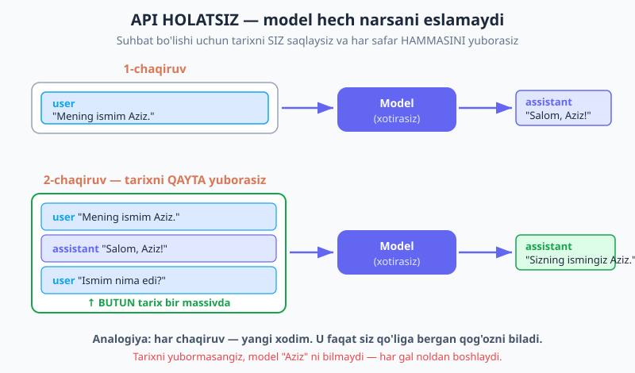
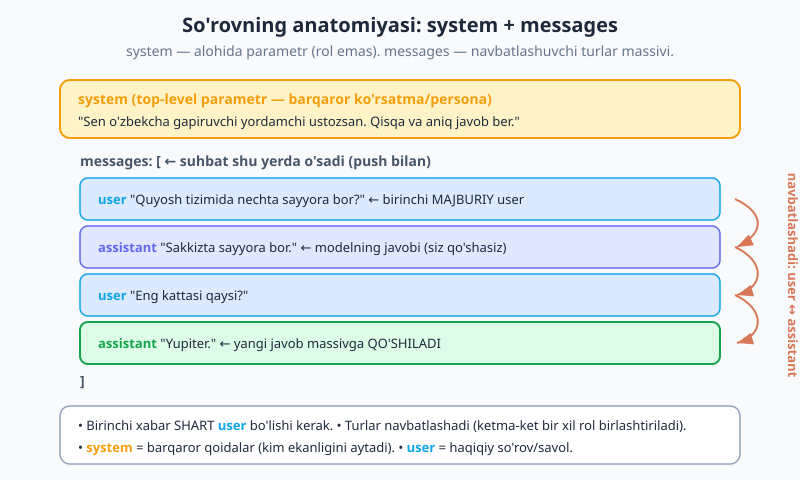
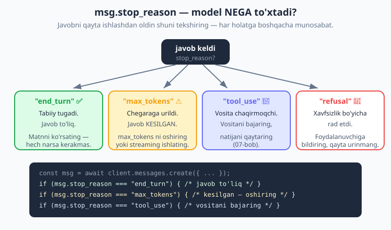

# 03 — Messages API chuqur

[⬅️ Oldingi: 02 — O'rnatish va birinchi chaqiruv](./02-ornatish-birinchi-chaqiruv.md) · [🏠 README](./README.md) · [Keyingi: 04 — Streaming (oqimli javob) ➡️](./04-streaming.md)

> **Bu bobda:** Messages API ning eng muhim sirini ochamiz — u **holatsiz** (stateless): model chaqiruvlar orasida hech narsani eslamaydi. Suhbat qurish uchun tarixni SIZ saqlaysiz va har safar hammasini yuborasiz. Rollarni (`user`/`assistant`), `system` promptni, `max_tokens` va `stop_reason` ni, content bloklarini va `usage` ni o'rganamiz — so'ng tarixni eslab qoladigan ishlaydigan CLI chatbot quramiz.

---

## Nega bu bob muhim?

02-bobda biz birinchi `messages.create()` chaqiruvini yubordik va javob oldik. Ishladi. Lekin agar siz ikkita savol ketma-ket bersangiz, ajablanarli narsa sodir bo'ladi:

```js
// 1-chaqiruv
await client.messages.create({
  model: "claude-opus-4-8",
  max_tokens: 1024,
  messages: [{ role: "user", content: "Mening ismim Aziz." }],
});
// 2-chaqiruv — alohida chaqiruv
const r = await client.messages.create({
  model: "claude-opus-4-8",
  max_tokens: 1024,
  messages: [{ role: "user", content: "Mening ismim nima edi?" }],
});
// Model: "Kechirasiz, ismingizni bilmayman."  ← nega?!
```

Model "Aziz" ni unutdi. Bu xato emas — bu API ning **eng asosiy xususiyati**. Buni tushunmasdan turib chat, agent yoki RAG qura olmaysiz. Keling, sirni ochamiz.

---

## 1. API HOLATSIZ — model hech narsani eslamaydi

Bu bobning eng muhim jumlasi, uni yodlab oling:

> **Anthropic Messages API holatsiz (stateless). Model chaqiruvlar orasida hech narsani saqlamaydi. Suhbat bo'lishi uchun butun tarixni HAR safar SIZ yuborasiz.**

**Analogiya.** Har bir API chaqiruvini shunday tasavvur qiling: siz har gal **yangi xodim**ga murojaat qilyapsiz. Bu xodim juda aqlli, lekin u faqat siz qo'liga bergan qog'ozda yozilgan narsani biladi. Kecha bilan, hatto bir daqiqa oldin bilan, u sizni umuman ko'rmagan. Agar oldingi suhbatni eslashini xohlasangiz — o'sha suhbatni qog'ozga yozib, unga qaytadan berishingiz kerak.

ChatGPT yoki Claude veb-saytida yozganda "u eslab turadi" deb o'ylashingiz mumkin. Aslida o'sha ilovalar ham xuddi shu narsani qiladi: tarixni o'zlarida saqlaydi va har xabaringizda butun suhbatni modelga qayta jo'natadi. Sehr yo'q — shunchaki tarixni saqlash va qayta yuborish.



**Demak suhbat = tarixni o'zingiz boshqarish.** Har yangi xabardan keyin:

1. Foydalanuvchi xabarini massivga qo'shasiz.
2. Modelning javobini ham massivga qo'shasiz.
3. Keyingi savolda — butun massivni qaytadan yuborasiz.

Bu juda kuchli g'oya, chunki u sizga to'liq nazorat beradi: tarixni qisqartirish, tahrirlash, eski qismlarni o'chirish — hammasi sizning qo'lingizda. Lekin u bilan birga mas'uliyat ham keladi (narx haqida pastda gaplashamiz).

---

## 2. Rollar: `user` va `assistant`

`messages` — bu obyektlar massivi. Har obyektda ikkita maydon bor: `role` va `content`.

| `role` | Kim bu? |
|---|---|
| `"user"` | Siz / inson. Savol, ko'rsatma, ma'lumot. |
| `"assistant"` | Model. Uning oldingi javoblari. |

Ikkita oddiy qoida bor:

- **Birinchi xabar `user` bo'lishi shart.** Suhbatni har doim siz boshlaysiz. Birinchi bo'lib `assistant` qo'yib bo'lmaydi (400 xato).
- **Rollar navbatlashadi:** `user` → `assistant` → `user` → ... (ketma-ket bir xil rol qo'yilsa, API ularni bitta turga birlashtiradi, lekin odatda navbatlashtirgan toza bo'ladi).

Mana ikki bosqichli (multi-turn) suhbatning to'liq massivi:

```js
const messages = [
  { role: "user", content: "Quyosh tizimida nechta sayyora bor?" },
  { role: "assistant", content: "Sakkizta sayyora bor." },
  { role: "user", content: "Eng kattasi qaysi?" },
];
```

Uchinchi savolni (`"Eng kattasi qaysi?"`) modelga yuborganingizda, u butun massivni "ko'radi" — shu sababli "Yupiter" deb javob bera oladi, garchi savolda Quyosh tizimi tilga olinmagan bo'lsa ham. Kontekst tarixda turibdi.

---

## 3. `system` prompt — alohida parametr (rol emas)

Ko'pchilik adashadi: `system` — bu `messages` massividagi rol **emas**. Bu `create()` ning **top-level (yuqori darajadagi) parametri**. U modelga "kim ekanligini" va "qanday tutishini" aytadi.

```js
const msg = await client.messages.create({
  model: "claude-opus-4-8",
  max_tokens: 1024,
  system: "Sen o'zbekcha gapiruvchi yordamchi ustozsan. Qisqa va aniq javob ber.",
  messages: [{ role: "user", content: "Rekursiya nima?" }],
});
```



**Nega `system`, nega `user` emas?** Farqi — barqarorlikda:

- **`system`** = *barqaror qoidalar*. Persona, til, javob uslubi, cheklovlar. Butun suhbat davomida o'zgarmaydi. "Sen kimsan va qanday ishlaysan."
- **`user`** = *haqiqiy so'rov*. Bu safar nimani so'rayapsiz. Har turda o'zgaradi.

Ko'rsatmani `system` ga qo'yish modelga "bu mening doimiy qoidam" degan signal beradi va u so'rovning o'zidan ajralib turadi. Bu, shuningdek, prompt caching (15-bob) uchun ham foydali — barqaror `system` keshlanadi.

> `system` haqida chuqurroq — rol berish, uslubni boshqarish, eng yaxshi amaliyotlar — [05-bob: Prompt engineering](./05-prompt-engineering.md) da. (Eslatma: suhbat o'rtasida operator ko'rsatmasini yuborish uchun `messages` massiviga `{ role: "system", ... }` qo'shish imkoni ham bor — bu beta xususiyat; bu yerda chuqur kirmaymiz.)

---

## 4. Javob qanday ko'rinadi: content bloklar

`content` ni yuborayotganda u **oddiy matn (string)** bo'lishi mumkin (eng oson yo'l) — yuqoridagi misollarda shunday qildik. Lekin u **bloklar massivi** ham bo'lishi mumkin (rasm, hujjat, vosita uchun — 07 va 09-boblar).

Muhim nuqta: **javobning `content` maydoni HAR DOIM massiv** — hatto oddiy matn javobida ham. Shu sababli undan matnni shunchaki `.content` deb olib bo'lmaydi; massivni aylanib chiqib, har blokning `.type` ini tekshirish kerak:

```js
const msg = await client.messages.create({
  model: "claude-opus-4-8",
  max_tokens: 1024,
  messages: [{ role: "user", content: "Salom!" }],
});

// msg.content — bu bloklar massivi: [{ type: "text", text: "..." }, ...]
for (const block of msg.content) {
  if (block.type === "text") {
    console.log(block.text);
  }
}

// Yoki birinchi matn blokini qisqa olish:
const javob = msg.content.find((b) => b.type === "text")?.text ?? "";
```

`block.type` `"text"` dan tashqari `"thinking"` (10-bob) yoki `"tool_use"` (07-bob) ham bo'lishi mumkin. Shuning uchun `.type` ni tekshirish odat qiling.

Modelning javobini suhbatga qaytarib qo'shganda, eng oddiy holatda matnni string sifatida saqlasangiz bo'ladi:

```js
const javobMatni = msg.content.find((b) => b.type === "text")?.text ?? "";
messages.push({ role: "assistant", content: javobMatni });
```

---

## 5. Ko'p bosqichli suhbat qurish

Endi hammasini birlashtiramiz. Suhbat qurishning kaliti — **har javobdan keyin tarixni yangilash**:

```js
import Anthropic from "@anthropic-ai/sdk";
const client = new Anthropic(); // ANTHROPIC_API_KEY muhitdan o'qiladi

const messages = [];

async function yubor(matn) {
  // 1. Foydalanuvchi xabarini tarixga qo'shamiz
  messages.push({ role: "user", content: matn });

  // 2. BUTUN tarixni yuboramiz
  const msg = await client.messages.create({
    model: "claude-opus-4-8",
    max_tokens: 1024,
    system: "Sen do'stona o'zbekcha yordamchisan.",
    messages, // ← butun massiv
  });

  // 3. Modelning javobini tarixga qo'shamiz
  const javob = msg.content.find((b) => b.type === "text")?.text ?? "";
  messages.push({ role: "assistant", content: javob });
  return javob;
}

console.log(await yubor("Mening ismim Aziz."));
console.log(await yubor("Mening ismim nima edi?")); // → "Sizning ismingiz Aziz."
```

Ikkinchi chaqiruvda model "Aziz" ni eslaydi — chunki tarixda u turibdi. Sehr emas: biz uni qayta yubordik.

### `ConversationManager` klassi

Buni qayta ishlatiladigan klassga o'rab qo'yaylik. Bu real ilovalarda ko'p uchraydigan andoza:

```js
import Anthropic from "@anthropic-ai/sdk";

class ConversationManager {
  constructor({ model = "claude-opus-4-8", system, maxTokens = 1024 } = {}) {
    this.client = new Anthropic();
    this.model = model;
    this.system = system;
    this.maxTokens = maxTokens;
    this.messages = []; // tarix shu yerda yashaydi
  }

  async send(userText) {
    this.messages.push({ role: "user", content: userText });

    const msg = await this.client.messages.create({
      model: this.model,
      max_tokens: this.maxTokens,
      system: this.system,
      messages: this.messages,
    });

    const text = msg.content.find((b) => b.type === "text")?.text ?? "";
    this.messages.push({ role: "assistant", content: text });

    return { text, stopReason: msg.stop_reason, usage: msg.usage };
  }
}

// Foydalanish:
const chat = new ConversationManager({
  system: "Sen o'zbekcha gapiruvchi yordamchi ustozsan. Qisqa javob ber.",
});

const a = await chat.send("Men frontend dasturchiman.");
const b = await chat.send("Menga qaysi tilni o'rganishni maslahat berasan?");
// Model "frontend dasturchi" ekanligingizni eslaydi → JS/TS maslahat beradi
```

Diqqat qiling: `messages` massivi klass ichida yashaydi va har `send()` da ham o'sadi. Model "frontend" faktini ikkinchi savolda ham biladi, chunki u tarixda saqlanib qoldi.

---

## 6. Parametrlar: `max_tokens` va `stop_sequences`

### `max_tokens` — chiqishni cheklaydi

`max_tokens` — modelning **chiqishi** uchun yuqori chegara (tokenlarda). U kirishni emas, faqat javob uzunligini cheklaydi. Bu maydon **majburiy**.

Agar model bu chegaraga yetib qolsa, javob **kesiladi** va `stop_reason` `"max_tokens"` bo'ladi (pastda batafsil). Yechim — `max_tokens` ni oshirish yoki streaming ishlatish (04-bob).

```js
// Juda kichik — javob o'rtada kesiladi:
const r = await client.messages.create({
  model: "claude-opus-4-8",
  max_tokens: 20, // ← juda oz!
  messages: [{ role: "user", content: "Fotosintezni batafsil tushuntir." }],
});
console.log(r.stop_reason); // "max_tokens" — javob to'liq emas
```

> **Maslahat:** `max_tokens` ni juda kam qo'ymang. Streaming bo'lmagan chaqiruvlar uchun `~16000`, streaming uchun `~64000` yaxshi standart. Faqat aniq sabab bo'lsa kamaytiring (masalan, tasniflash uchun `256`). Opus 4.8 128K gacha chiqarishi mumkin, lekin katta qiymatlarda streaming kerak bo'ladi.

### `stop_sequences` — erta to'xtatish

`stop_sequences` — modelga "shu matnga duch kelsang, to'xta" deyish. Belgilangan ketma-ketlikka yetganda model generatsiyani to'xtatadi.

```js
const r = await client.messages.create({
  model: "claude-opus-4-8",
  max_tokens: 1024,
  stop_sequences: ["\n\n"], // ikki yangi qatorga yetganda to'xta
  messages: [{ role: "user", content: "Bitta qisqa jumla yoz." }],
});
// Bu holatda stop_reason "stop_sequence" bo'ladi
```

### `temperature` haqida halol gap

Avvalgi modellarda `temperature` (va `top_p`/`top_k`) javob "tasodifiyligini" boshqarar edi. **Opus 4.8 da bu parametrlar olib tashlangan** — ularni yuborsangiz API 400 xato qaytaradi. Modelning xulqini endi **sampling parametrlari bilan emas, prompting bilan** boshqarasiz: aniq ko'rsatma bering, kerakli uslubni `system` da tasvirlang. Agar "ijodiy turlilik" kerak bo'lsa — promptda so'rang ("har safar boshqacha so'z tuzilishidan foydalan"), `temperature` bilan emas.

---

## 7. `stop_reason` — model nega to'xtadi?

Har javobda `stop_reason` maydoni bor — u modelning **nega to'xtaganini** aytadi. Javobni qayta ishlashdan oldin shuni tekshirish — yaxshi odat.



| `stop_reason` | Ma'nosi | Nima qilish |
|---|---|---|
| `"end_turn"` | Model tabiiy ravishda tugatdi. Javob to'liq. | Hech narsa — matnni ishlating. |
| `"max_tokens"` | `max_tokens` chegarasiga urildi. Javob **kesilgan**. | `max_tokens` ni oshiring yoki streaming ishlating. |
| `"stop_sequence"` | Sizning `stop_sequences` dan biriga yetdi. | Kutilgan — davom eting. |
| `"tool_use"` | Model vosita chaqirmoqchi (07-bob). | Vositani bajaring, natijani qaytaring. |
| `"refusal"` | Xavfsizlik sababli rad etdi. | Foydalanuvchiga bildiring; aynan shu prompt bilan qayta urinmang. |

Ishlab chiqarishga tayyor kodda har holatni hisobga oling:

```js
const msg = await client.messages.create({
  model: "claude-opus-4-8",
  max_tokens: 1024,
  messages,
});

switch (msg.stop_reason) {
  case "end_turn":
    // Javob to'liq — odatdagidek ishlating
    break;
  case "max_tokens":
    console.warn("Javob kesilgan! max_tokens ni oshiring.");
    break;
  case "tool_use":
    // Vositani bajaramiz (07-bobda)
    break;
  case "refusal":
    console.warn("Model rad etdi (xavfsizlik).");
    break;
}
```

> `stop_reason` `thinking` (adaptiv o'ylash) bilan birga qanday ishlashi haqida [10-bob: Adaptiv thinking va effort](./10-thinking-effort.md) da batafsil.

---

## 8. `usage` — narx tarix bilan o'sadi

Har javobda `usage` obyekti bor:

```js
console.log(msg.usage);
// { input_tokens: 42, output_tokens: 18, cache_read_input_tokens: 0, ... }
```

| Maydon | Ma'nosi |
|---|---|
| `input_tokens` | Siz yuborgan tokenlar (kirish). |
| `output_tokens` | Model chiqargan tokenlar (javob). |
| `cache_read_input_tokens` | Keshdan o'qilgan tokenlar (15-bob). |

Endi **muhim xulosa**. API holatsiz bo'lgani uchun, har chaqiruvda butun tarixni qayta yuborasiz. Demak suhbat uzaygani sayin `input_tokens` ham **o'sib boradi** — chunki har gal hammasi qayta jo'natiladi. 20 ta xabardan keyin har chaqiruv 20 ta xabarning hammasini kirish sifatida hisoblaydi.

```
1-turn:  input ≈ 10 token
5-turn:  input ≈ 200 token   (oldingi 4 turn + system qayta yuboriladi)
20-turn: input ≈ 2000 token  (hammasi har safar!)
```

Bu **narx uzun suhbatda o'sishini** bildiradi. Bu holatsizlikning narxi.

> **Yechim?** Bir xil barqaror prefiks (system, eski tarix) ni qayta-qayta yuborganingizda, **prompt caching** (15-bob) uni keshlab, 90% gacha tejaydi. `cache_read_input_tokens` ana shuni o'lchaydi. Hozircha shuni bilib qo'ying: uzun suhbat = ko'proq kirish tokeni = ko'proq narx.

---

## 9. Loyiha: ishlaydigan CLI chatbot

Hammasini birlashtirib, terminalda ishlaydigan, tarixni eslab qoladigan chatbot quramiz. Node ning `readline` moduli bilan.

```js
// chatbot.js
import Anthropic from "@anthropic-ai/sdk";
import readline from "node:readline/promises";
import { stdin as input, stdout as output } from "node:process";

const client = new Anthropic(); // ANTHROPIC_API_KEY .env / muhitdan
const rl = readline.createInterface({ input, output });

const messages = []; // ← suhbat tarixi shu yerda
const system =
  "Sen do'stona, o'zbekcha gapiruvchi yordamchisan. Qisqa va tushunarli javob ber.";

console.log("Chatbot tayyor. Chiqish uchun: 'chiqish'\n");

while (true) {
  const savol = await rl.question("Siz: ");
  if (savol.trim().toLowerCase() === "chiqish") break;

  messages.push({ role: "user", content: savol });

  const msg = await client.messages.create({
    model: "claude-opus-4-8",
    max_tokens: 1024,
    system,
    messages, // butun tarix
  });

  const javob = msg.content.find((b) => b.type === "text")?.text ?? "";
  messages.push({ role: "assistant", content: javob }); // javobni ham saqlaymiz

  console.log(`Bot: ${javob}`);

  if (msg.stop_reason === "max_tokens") {
    console.log("  (⚠️ javob kesilgan — max_tokens ni oshiring)");
  }
  console.log(`  (tokenlar: kirish ${msg.usage.input_tokens}, chiqish ${msg.usage.output_tokens})\n`);
}

rl.close();
console.log("Xayr!");
```

Ishga tushiring va sinab ko'ring:

```bash
node chatbot.js
```

```
Siz: Mening sevimli rangim ko'k.
Bot: Yaxshi! Ko'k — tinchlik va osmonni eslatadigan chiroyli rang.
  (tokenlar: kirish 38, chiqish 19)

Siz: Mening sevimli rangim qaysi edi?
Bot: Sizning sevimli rangingiz ko'k edi.
  (tokenlar: kirish 71, chiqish 11)   ← kirish o'sdi: tarix qayta yuborildi
```

E'tibor bering: ikkinchi savolda `input_tokens` oshdi (38 → 71), chunki butun tarix qayta yuborildi. Va bot "ko'k" ni esladi — biz tarixni saqlaganimiz uchun. **Holatsizlik amalda shunday ishlaydi.**

---

## Xulosa

- Messages API **holatsiz** — model chaqiruvlar orasida hech narsani eslamaydi. Suhbat = tarixni o'zingiz saqlash va har safar hammasini yuborish.
- `messages` — `{ role, content }` massivi. `user` = siz, `assistant` = model. Birinchi xabar `user` bo'lishi shart; rollar navbatlashadi.
- `system` — rol emas, top-level parametr. Barqaror qoidalar/persona uchun. `user` esa har safargi haqiqiy so'rov.
- Suhbat qurish: har javobdan keyin `{role:"assistant", content}` ni, keyin yangi `{role:"user", ...}` ni `push` qilib, qayta yuboring.
- `max_tokens` chiqishni cheklaydi; chegara urilsa `stop_reason: "max_tokens"`. `temperature` Opus 4.8 da olib tashlangan — xulqni prompting bilan boshqaring.
- `content` javobda har doim massiv — `.type` ni tekshirib, matnni oling.
- `usage.input_tokens` tarix bilan o'sadi → narx uzun suhbatda oshadi (yechim: prompt caching, 15-bob).

---

## Mashqlar

**1-mashq.** O'z so'zlaringiz bilan tushuntiring: "API holatsiz" nimani anglatadi va shuning uchun suhbat qurish uchun nima qilishingiz kerak? "Yangi xodim" analogiyasidan foydalaning.

**2-mashq.** Quyidagi kod nega ishlamaydi (400 xato qaytaradi)? Tuzating.

```js
const messages = [
  { role: "assistant", content: "Salom! Sizga qanday yordam bera olaman?" },
  { role: "user", content: "Bugun ob-havo qanday?" },
];
```

**3-mashq.** `ConversationManager` klassiga `reset()` metodini qo'shing — u tarixni tozalaydi (suhbatni noldan boshlaydi), lekin `system` va `model` ni saqlab qoladi.

**4-mashq.** Javobning `content` maydoni har doim massiv ekanligini eslang. Quyidagi kod nega xavfli/noto'g'ri, uni qanday tuzatasiz?

```js
const msg = await client.messages.create({ /* ... */ });
console.log(msg.content); // [object Object] yoki [{...}] chiqaradi — matn emas!
```

**5-mashq.** `stop_reason` `"max_tokens"` bo'lganda nima sodir bo'lgan? Foydalanuvchi to'liq javob olish uchun ikkita yo'lni ayting.

**6-mashq.** Bir suhbat 15 ta xabardan iborat. Nega 15-chaqiruv 1-chaqiruvga qaraganda qimmatroq turadi? `usage` qaysi maydoni buni ko'rsatadi va qanday yechim bor?

<details markdown="1">
<summary>Yechimlar</summary>

**1-mashq.** "API holatsiz" — model bir chaqiruvdan keyingi chaqiruvga hech qanday xotira saqlamaydi degani. Har chaqiruv mustaqil: u faqat o'sha so'rovda yuborilgan `messages` ni "ko'radi". "Yangi xodim" analogiyasi: har gal yangi, aqlli, lekin sizni umuman tanimaydigan xodimga murojaat qilasiz — u faqat siz qo'liga bergan qog'ozdagi (ya'ni `messages` massividagi) ma'lumotni biladi. Shuning uchun suhbat bo'lishi uchun **tarixni o'zingiz saqlab**, har xabarda butun massivni (oldingi `user` va `assistant` turlari bilan) qayta yuborishingiz kerak.

**2-mashq.** Xato — birinchi xabar `assistant` rolida. **Birinchi xabar har doim `user` bo'lishi shart.** Suhbatni doim foydalanuvchi boshlaydi. Tuzatish — `assistant` xabarini olib tashlash (yoki uni `user` xabaridan keyinga qo'yish):

```js
const messages = [
  { role: "user", content: "Bugun ob-havo qanday?" },
];
```

(Agar "Salom!" salomlashuvini boshlang'ich kontekst sifatida ko'rsatmoqchi bo'lsangiz, uni `system` ga qo'ying yoki birinchi `user` xabaridan keyin `assistant` sifatida qo'shing.)

**3-mashq.**

```js
class ConversationManager {
  constructor({ model = "claude-opus-4-8", system, maxTokens = 1024 } = {}) {
    this.client = new Anthropic();
    this.model = model;
    this.system = system;
    this.maxTokens = maxTokens;
    this.messages = [];
  }

  reset() {
    this.messages = []; // faqat tarixni tozalaymiz
    // this.system va this.model o'zgarmaydi — saqlanib qoladi
  }

  async send(userText) {
    this.messages.push({ role: "user", content: userText });
    const msg = await this.client.messages.create({
      model: this.model,
      max_tokens: this.maxTokens,
      system: this.system,
      messages: this.messages,
    });
    const text = msg.content.find((b) => b.type === "text")?.text ?? "";
    this.messages.push({ role: "assistant", content: text });
    return text;
  }
}
```

**4-mashq.** `msg.content` — bu **bloklar massivi** (`[{ type: "text", text: "..." }]`), oddiy string emas. Uni to'g'ridan-to'g'ri `console.log` qilsangiz, matn o'rniga obyekt(lar) chiqadi. To'g'ri yo'l — massivni aylanib chiqib, `type === "text"` blokidan `.text` ni olish:

```js
const matn = msg.content.find((b) => b.type === "text")?.text ?? "";
console.log(matn);
```

`.find()` ishlatishimiz sababi — `content` da `thinking` yoki `tool_use` kabi boshqa turdagi bloklar ham bo'lishi mumkin, shuning uchun `.type` ni tekshirish shart.

**5-mashq.** `"max_tokens"` — model `max_tokens` chegarasiga yetgani uchun **o'rtada to'xtab qolgan**; javob **to'liq emas, kesilgan**. To'liq javob olish uchun ikki yo'l:
1. **`max_tokens` ni oshirish** — modelga ko'proq joy berish (masalan, 1024 → 16000).
2. **Streaming ishlatish** (04-bob) — `client.messages.stream()` bilan uzun javoblarni oqim sifatida olish (timeout muammosisiz).

**6-mashq.** API holatsiz bo'lgani uchun har chaqiruvda **butun tarix qayta yuboriladi**. 15-chaqiruvda oldingi 14 ta xabar + `system` hammasi kirish sifatida qayta jo'natiladi, 1-chaqiruvda esa atigi bitta xabar bor edi. Buni `usage.input_tokens` ko'rsatadi — u tarix bilan o'sib boradi. Yechim: **prompt caching** (15-bob) — barqaror prefiksni (system + eski tarix) keshlab, qayta o'qishda ~0.1× narxda oladi, bu 90% gacha tejashi mumkin. Keshdan o'qilgan tokenlar `usage.cache_read_input_tokens` da ko'rinadi.

</details>

---

[⬅️ Oldingi: 02 — O'rnatish va birinchi chaqiruv](./02-ornatish-birinchi-chaqiruv.md) · [🏠 README](./README.md) · [Keyingi: 04 — Streaming (oqimli javob) ➡️](./04-streaming.md)
