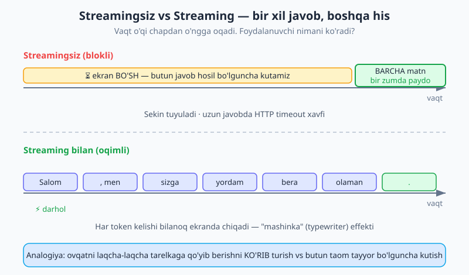
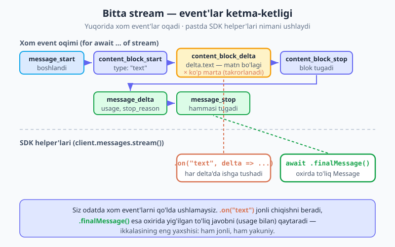
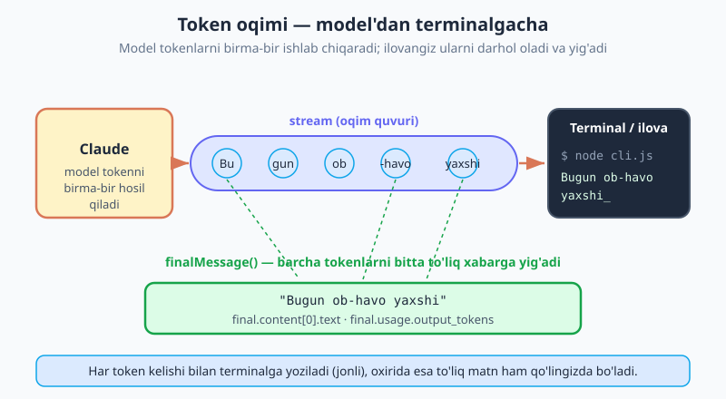

# 04 — Streaming (oqimli javob)

[⬅️ Oldingi: 03 — Messages API chuqur](./03-messages-api.md) · [🏠 README](./README.md) · [Keyingi: 05 — Prompt engineering ➡️](./05-prompt-engineering.md)

---

> **Bu bobda:** nega **streaming** (oqimli javob) kerakligini tushunamiz — streamingsiz siz butun javob tayyor bo'lguncha **bo'sh ekranga** qarab kutasiz; streaming esa tokenlarni hosil bo'lishi bilanoq ko'rsatadi ("mashinka" effekti). So'ng tavsiya etilgan usul — `client.messages.stream()` ni o'rganamiz: `.on("text", delta => ...)` har bo'lakda ishlaydi, `await stream.finalMessage()` esa oxirida to'liq `Message` ni (usage bilan) qaytaradi. Muqobil — **async iteratsiya** (`for await (const event of stream)`) va xom event turlari (`message_start` → `content_block_start` → `content_block_delta` × ko'p → `content_block_stop` → `message_delta` → `message_stop`). Oqim ichida matn (text) bo'laklaridan tashqari thinking va tool_use ham kelishi mumkinligini (qisqacha), oqim o'rtasidagi xatolarni (`.on("error", ...)`), va **qachon streaming SHART** ekanini (katta `max_tokens`) ko'rib chiqamiz. Yakunda — Claude javobini terminalga token-token chiqaruvchi va oxirida tokenlar sonini ko'rsatuvchi mini **CLI** quramiz.
>
> **Halollik eslatmasi:** Bobdagi barcha SDK chaqiruvlari `@anthropic-ai/sdk` **v0.104** ga tayanadi: `client.messages.stream(...)`, `.on("text"|"message"|"contentBlock"|"error"|"end")`, `for await` bilan xom event'lar (`content_block_delta` ichida `delta.text`), `await stream.finalMessage()` va past darajadagi `messages.create({ stream: true })`. Bu metod va event nomlari haqiqatan mavjud — o'ylab topilgani yo'q.

---

## 1. Nega streaming kerak? — bo'sh ekran muammosi

03-bobda biz `client.messages.create(...)` bilan javob oldik. U bitta `Promise` qaytaradi: `await` qilasiz, va **butun javob tayyor bo'lguncha** kutib turasiz. Faqat shundan keyin `msg.content[0].text` ni ko'rasiz.

Qisqa javob uchun bu yaxshi. Lekin Claude'dan uzun matn — masalan, ikki sahifalik maqola — so'rasangiz, model uni hosil qilishga 10-20 soniya sarflashi mumkin. **Bu butun vaqt davomida foydalanuvchi bo'sh ekranga qarab turadi.** Hech narsa harakatlanmaydi. Ko'pchilik "ilova osilib qoldi" deb o'ylaydi.

> **Analogiya.** Restoranni tasavvur qiling. Bir oshpaz taomni oshxonada tayyorlab, faqat **butunlay tayyor bo'lgach** stolingizga olib keladi — siz o'shangacha bo'sh stolga qarab o'tirasiz. Boshqasi esa har bir qismni — go'shtni, garnirni, sousni — **ko'z oldingizda** tarelkaga qo'yib boradi. Ikkinchisida ovqat tezroq pishmaydi, lekin siz **harakatni ko'rasiz** va kutish qiyin tuyulmaydi. Streaming — aynan ikkinchi usul.



Streaming ikkita muammoni hal qiladi:

1. **UX (foydalanuvchi tajribasi).** Tokenlar hosil bo'lishi bilanoq ekranga chiqadi — siz ChatGPT'da ko'rgan "mashinka" (typewriter) effekti aynan shu. Javob **tezroq emas**, lekin **tezroq tuyuladi**, chunki birinchi so'z bir soniyada ko'rinadi, 15 soniyada emas.
2. **HTTP timeout xavfi.** Uzun javob (katta `max_tokens`) bitta uzun so'rovda kelsa, tarmoq yoki SDK timeout'ga uchrashi mumkin. SDK buni biladi: agar u so'rov 10 daqiqadan oshadi deb baholasa, streamingsiz chaqiruvda **xato tashlaydi** va sizni streaming'ga undaydi. Streaming'da ma'lumot doimiy oqib turgani uchun bunday timeout muammosi yo'q.

> **Muhim:** streaming javobni **tezlashtirmaydi** — model baribir bir xil tezlikda token hosil qiladi. U faqat tokenlarni **kutib turmasdan, darhol** ko'rsatadi. Tejaladigan narsa — sizning sabringiz, model vaqti emas.

---

## 2. Tavsiya etilgan usul — `client.messages.stream()`

SDK'da streaming uchun maxsus, qulay **helper** bor: `client.messages.stream(...)`. U `create` bilan deyarli bir xil parametrlarni oladi, lekin `Promise` o'rniga **stream obyektini** qaytaradi. Bu obyektga "tinglovchilar" (`.on(...)`) ulashingiz mumkin.

03-bobdagi setupni eslaylik — `client` ni shunday yaratamiz:

```js
import Anthropic from "@anthropic-ai/sdk";

const client = new Anthropic(); // ANTHROPIC_API_KEY ni .env dan oladi
```

Endi streaming bilan so'rov:

```js
const stream = client.messages.stream({
  model: "claude-opus-4-8",
  max_tokens: 1024,
  messages: [{ role: "user", content: "Qisqa hikoya yoz." }],
});

// Har matn bo'lagi (delta) kelganda darhol terminalga yozamiz:
stream.on("text", (delta) => process.stdout.write(delta));

// Oqim tugagach — to'liq, yig'ilgan Message:
const final = await stream.finalMessage();
console.log("\n\nTokenlar:", final.usage.output_tokens);
```

E'tibor bering:

- **`client.messages.stream({...})`** — darhol qaytadi (`await` shart emas), chunki bu hali javob emas, **oqim boshqaruvchisi**.
- **`.on("text", (delta) => ...)`** — eng muhim event. Model har yangi matn bo'lagini ("delta") chiqarganda chaqiriladi. `delta` — bu **yangi qism** (butun matn emas), shuning uchun uni shunchaki `process.stdout.write(delta)` bilan yozaversangiz, ekranda matn o'sib boradi. `console.log` emas, `process.stdout.write` ishlatamiz — chunki har deltadan keyin yangi qatorga o'tmaslik kerak.
- **`await stream.finalMessage()`** — oqim to'liq tugaganda hal bo'ladigan `Promise`. U **yig'ilgan to'liq `Message` obyektini** qaytaradi — xuddi `create` qaytargandek: `content`, `stop_reason`, va eng muhimi `usage` (tokenlar soni) ichida. Streaming paytida SDK barcha deltalarni siz uchun yig'adi.

Bu — **ikki dunyoning eng yaxshisi**: `.on("text")` orqali jonli chiqish (UX), `.finalMessage()` orqali yakuniy to'liq natija (qayta ishlash, usage, log uchun). Ko'pchilik server kodida aynan shu naqshni ishlatasiz.

> **Eslatma — `delta` butun matn emas.** Eng ko'p uchraydigan xato: `.on("text", (delta) => { result = delta; })`. Bu noto'g'ri — har chaqiruvda faqat oxirgi bo'lakni saqlaysiz. To'plash kerak bo'lsa `result += delta` qiling, yoki yaxshisi — oxirda `final.content[0].text` ni oling (SDK allaqachon yig'gan).

`.on(...)` zanjir (chain) qilinadi va boshqa event'larni ham beradi:

```js
stream
  .on("text", (delta) => process.stdout.write(delta))
  .on("error", (err) => console.error("\nXato:", err))
  .on("end", () => console.log("\n[oqim tugadi]"));
```

Mavjud event'lar: `.on("text", (delta, snapshot) => ...)` (matn bo'lagi), `.on("message", (msg) => ...)` (to'liq xabar shakllanganda), `.on("contentBlock", (block) => ...)` (bir content blok tugaganda), `.on("error", (err) => ...)` (xato), `.on("end", () => ...)` (hammasi tugadi).

---

## 3. Oqim ichida nima sodir bo'ladi? — event ketma-ketligi

`.on("text")` qulay, lekin "qopqoq ostida" nima oqayotganini bilish foydali. Oqim aslida bir nechta turdagi **xom event'lardan** iborat, ular qat'iy tartibda keladi:



1. **`message_start`** — javob boshlandi (bo'sh `Message` skeleti, `usage` da hozircha faqat `input_tokens`).
2. **`content_block_start`** — yangi content blok ochildi (`type: "text"` — yoki thinking/tool_use, 6-bo'limga qarang).
3. **`content_block_delta`** — **eng ko'p takrorlanadigan** event. Har biri kichik matn bo'lagini olib keladi: `delta.text`. Aynan shu yerda `.on("text")` ishga tushadi.
4. **`content_block_stop`** — joriy blok tugadi.
5. **`message_delta`** — yakuniy meta-ma'lumot: `stop_reason` va to'ldirilgan `usage.output_tokens`.
6. **`message_stop`** — butun oqim tugadi.

SDK shu xom oqimni siz uchun yig'ib, qulay `.on("text")` va `.finalMessage()` ga aylantiradi. Demak `.on("text")` — bu har bir `content_block_delta` ning `delta.text` qismi, `.finalMessage()` — bu `message_stop` dan keyingi to'liq, yig'ilgan natija.

---

## 4. Muqobil usul — async iteratsiya (`for await`)

Agar siz xom event'lar ustidan **to'liq nazorat** xohlasangiz (masalan, `message_delta` dagi `stop_reason` ni real vaqtda kuzatish), stream obyektining o'zi **async-iterable** — uni `for await` bilan aylantirasiz:

```js
const stream = client.messages.stream({
  model: "claude-opus-4-8",
  max_tokens: 1024,
  messages: [{ role: "user", content: "Qisqa hikoya yoz." }],
});

for await (const event of stream) {
  if (
    event.type === "content_block_delta" &&
    event.delta.type === "text_delta"
  ) {
    process.stdout.write(event.delta.text);
  }
}

const final = await stream.finalMessage(); // bu yerda ham ishlaydi
```

Bu yerda biz har bir xom `event` ni qo'lda tekshiramiz: `event.type === "content_block_delta"` va ichidagi `event.delta.type === "text_delta"` bo'lsa — `event.delta.text` ni yozamiz. Boshqa event turlarini (`message_start`, `content_block_stop` va h.k.) e'tiborsiz qoldiramiz.

> **JS bilimi tutashadi.** Bu — `for await ... of` async iterator'i (`Symbol.asyncIterator`). Agar `for await`, async generatorlar yoki Promiselar sizga noaniq tuyulsa, [JavaScript kitobi](../js/README.md)dagi async/iteratorlar bobini bir ko'zdan kechiring — streaming butunlay shu mexanizmga quriladi.

**Qaysi usulni tanlash?**

| Holat | Tavsiya |
|---|---|
| Oddiy: jonli matn + oxirgi natija | `.on("text", ...)` + `.finalMessage()` |
| Xom event'lar ustidan to'liq nazorat | `for await (const event of stream)` |
| Eng past daraja, yig'ishsiz | `messages.create({ ..., stream: true })` |

Oxirgi — **past darajali** variant: `client.messages.create({ ..., stream: true })` ham xom event'larning async-iterable'ini qaytaradi, **lekin SDK ularni yig'maydi** — `.finalMessage()` yo'q, hammasini o'zingiz to'plashingiz kerak. Buni faqat juda maxsus holatda ishlating; ko'pincha `client.messages.stream()` to'g'ri tanlov.

---

## 5. Oqimdagi content turlari — matn, thinking, tool_use

Yuqorida biz faqat **matn** (text) deltalari bilan ishladik. Lekin oqimda boshqa content turlari ham kelishi mumkin, va `content_block_start` ularning `type` ini bildiradi:

- **`text`** — oddiy matn javobi (bu bobning asosiy mavzusi). Delta: `text_delta`.
- **`thinking`** — Claude'ning "ovoz chiqarib o'ylashi" (adaptiv reasoning). Delta: `thinking_delta`. Buni alohida — 10-bobda (Adaptiv thinking) — chuqur ko'ramiz.
- **`tool_use`** — model funksiya (tool) chaqirmoqchi bo'lsa, uning argumentlari `input_json_delta` bo'lib oqib keladi. Bu — 07-bob (Tool use) mavzusi.

Hozircha bilib qo'ying: agar `.on("text")` ishlatsangiz, SDK siz uchun **faqat matn** deltalarini ajratib beradi — thinking va tool_use'ni aralashtirmaydi. Shu sababli oddiy chat/CLI uchun `.on("text")` yetarli va xavfsiz. To'liq xom oqim kerak bo'lganda (`for await`), `event.delta.type` ni tekshirib turing.

---

## 6. Oqim o'rtasida xato bo'lsa-chi?

Streaming uzoq davom etadigan tarmoq aloqasi — o'rtada **uzilish** bo'lishi mumkin (internet tushdi, server xatosi, rate limit). Bunday xatolarni ikki yo'l bilan tutamiz.

**`.on("error", ...)` bilan:**

```js
const stream = client.messages.stream({ /* ... */ })
  .on("text", (delta) => process.stdout.write(delta))
  .on("error", (err) => {
    console.error("\n[Oqimda xato]:", err.message);
  });

await stream.finalMessage();
```

**`for await` da — `try/catch` bilan:**

```js
try {
  for await (const event of stream) {
    if (event.type === "content_block_delta" && event.delta.type === "text_delta") {
      process.stdout.write(event.delta.text);
    }
  }
} catch (err) {
  console.error("\n[Oqim uzildi]:", err.message);
}
```

Diqqat qiling: streaming'da bir qism matn **allaqachon ekranga chiqib bo'lgan** bo'lishi mumkin, keyin xato yuzaga keladi. Ya'ni foydalanuvchi **yarim javobni** ko'rib turibdi. Ishlab chiqarishda bunday holatni chiroyli boshqarish kerak — yarim javobni belgilash, qayta urinish (retry) va h.k. Tipli xatolar (`APIError`, `RateLimitError`), avtomatik retry va ishonchli oqim klientini **16-bobda (Xatolar, retry va ishonchlilik)** to'liq ko'ramiz.

---

## 7. Qachon streaming SHART?

Streaming odatda **tanlov** (yaxshi UX uchun). Lekin bitta holat bor — u **majburiy** bo'lib qoladi:

> **Katta `max_tokens` (taxminan 16K dan ko'p) — streaming SHART.** Bunday uzun javob streamingsiz bitta uzun so'rovda kelganda HTTP yoki SDK timeout'ga uchraydi. SDK buni oldindan biladi: agar u so'rovni ~10 daqiqadan oshadi deb baholasa, streamingsiz `create` chaqiruvida **xato tashlaydi**.

Amaliy qoida sodda: **uzun chiqish kutsangiz — streaming'ni standart qiling.** Kichik javoblarda (bir-ikki jumla) `create` ham yetarli; lekin maqola, hisobot, kod generatsiyasi, uzun tahlil kabi narsalarda `client.messages.stream()` ga o'ting. Bu nafaqat UX'ni yaxshilaydi, balki sizni timeout xatolaridan ham himoya qiladi.

---

## 8. Server konteksti — terminal, SSE va UI

Streaming **server tomonida** (Node) ikki asosiy joyga yo'naltiriladi:

**1. Terminalga (CLI)** — biz yuqorida `process.stdout.write(delta)` bilan qildik. Eng oddiy holat.

**2. HTTP javobiga (SSE — Server-Sent Events)** — veb-ilovada server Claude'dan oqimni oladi va uni **xuddi shunday oqim sifatida** brauzerga uzatadi. Mana konseptual Express eskizi (illustrativ — qism-qism soddalashtirilgan):

```js
import express from "express";
import Anthropic from "@anthropic-ai/sdk";

const app = express();
const client = new Anthropic();

app.get("/chat", async (req, res) => {
  // SSE sarlavhalari:
  res.setHeader("Content-Type", "text/event-stream");
  res.setHeader("Cache-Control", "no-cache");
  res.setHeader("Connection", "keep-alive");

  const stream = client.messages.stream({
    model: "claude-opus-4-8",
    max_tokens: 1024,
    messages: [{ role: "user", content: req.query.q }],
  });

  // Har deltani SSE "data:" qatori sifatida brauzerga jo'natamiz:
  stream.on("text", (delta) => {
    res.write(`data: ${JSON.stringify({ text: delta })}\n\n`);
  });

  await stream.finalMessage();
  res.write("data: [DONE]\n\n");
  res.end();
});

app.listen(3000);
```

Bu yerda model oqimini olib, har bir bo'lakni `res.write(...)` bilan brauzerga **uzatib turamiz** — server-dan-klientga to'liq oqim hosil bo'ladi.

> **Brauzer/React UI streaming.** To'liq frontend streaming chat interfeysini (React `useChat`, oqimli xabarlar, "yozmoqda" holati) qo'lda SSE bilan emas, balki zamonaviy **Vercel AI SDK** bilan quramiz — bu **13-bob (AI SDK UI: chat interfeysi)** mavzusi. U serverdagi `streamText` va frontenddagi `useChat` ni bog'lab, butun oqimni siz uchun boshqaradi.

---

## 9. Amaliyot — terminalga oqadigan CLI

Endi hammasini birlashtirib, **mini CLI** quramiz: foydalanuvchi savolini argument sifatida beradi, javob terminalga **token-token** chiqadi, oxirida tokenlar soni ko'rsatiladi.

```js
// stream-cli.js
import Anthropic from "@anthropic-ai/sdk";

const client = new Anthropic(); // ANTHROPIC_API_KEY .env yoki muhitdan

async function main() {
  // Savolni buyruq qatori argumentlaridan olamiz:
  const savol = process.argv.slice(2).join(" ");
  if (!savol) {
    console.error("Foydalanish: node stream-cli.js <savolingiz>");
    process.exit(1);
  }

  process.stdout.write("\nClaude javob bermoqda...\n\n");

  const stream = client.messages
    .stream({
      model: "claude-opus-4-8",
      max_tokens: 2048,
      messages: [{ role: "user", content: savol }],
    })
    .on("text", (delta) => process.stdout.write(delta)) // jonli chiqish
    .on("error", (err) => console.error("\n[Xato]:", err.message));

  const final = await stream.finalMessage();

  // Yakuniy statistika:
  process.stdout.write("\n\n");
  console.log("─".repeat(40));
  console.log("Kirish tokenlari: ", final.usage.input_tokens);
  console.log("Chiqish tokenlari:", final.usage.output_tokens);
  console.log("To'xtash sababi:  ", final.stop_reason);
}

main();
```

Ishga tushirish:

```bash
node stream-cli.js "Node.js'da event loop nima ekanini soddacha tushuntir"
```

Javob ekranda **bittalab so'z bo'lib oqib** chiqadi, oxirida esa tokenlar hisobi ko'rinadi:

```
Claude javob bermoqda...

Event loop — bu Node.js ning... (matn oqib chiqadi)

────────────────────────────────────────
Kirish tokenlari:  21
Chiqish tokenlari: 312
To'xtash sababi:   end_turn
```



Bu kichik dastur streaming'ning butun mohiyatini ko'rsatadi: **jonli chiqish** (`.on("text")`) + **yakuniy to'liq natija** (`.finalMessage()`), ikkalasi bitta oqimda. Aynan shu naqsh sizning kelajakdagi chat va agent ilovalaringizning negizi bo'ladi.

---

## 10. Tez-tez uchraydigan xatolar

| Xato | Sabab | Yechim |
|---|---|---|
| `.on("text", d => result = d)` — matn yarim chiqadi | `delta` butun matn emas, faqat oxirgi bo'lak | `result += d`, yoki oxirda `final.content[0].text` |
| Har so'z yangi qatordan chiqdi | `console.log(delta)` ishlatildi | `process.stdout.write(delta)` ishlating |
| `await client.messages.stream(...)` natija bermadi | `stream()` `Promise` emas, oqim obyekti qaytaradi | `const stream = client.messages.stream(...)` (await'siz), keyin `await stream.finalMessage()` |
| `final.usage` `undefined` | `create` javobi bilan adashtirildi | `.finalMessage()` ni `await` qiling — u to'liq `Message` ni beradi |
| Uzun javobda timeout xatosi | Katta `max_tokens` streamingsiz so'raldi | `client.messages.stream()` ga o'ting (>~16K da SDK majbur qiladi) |
| Oqim o'rtasida ilova qulab tushdi | `error` event ushlanmadi | `.on("error", ...)` yoki `for await` atrofida `try/catch` |
| `for await` da matn chiqmadi | `event.delta.type` tekshirilmadi | `event.type === "content_block_delta" && event.delta.type === "text_delta"` |

---

## Mashqlar

Mashqlar uchun `client` ni 02-bobdagidek sozlang (`new Anthropic()` + `.env` da `ANTHROPIC_API_KEY`). Tokenni isrof qilmaslik uchun kichik `max_tokens` (masalan 256) bilan boshlang.

### Oson

1. `client.messages.stream(...)` bilan "Salom" so'zining 5 ta tilda tarjimasini so'rang va javobni `process.stdout.write` bilan terminalga oqiming.

2. Oldingi mashqqa `.on("end", () => console.log("\n[tugadi]"))` qo'shing — oqim tugaganda xabar chiqsin.

3. `await stream.finalMessage()` natijasidan `final.usage.output_tokens` va `final.stop_reason` ni chop eting.

4. Bir nechta `.on(...)` ni zanjir (chain) qilib bitta ifodada yozing: `text`, `error`, `end`.

### O'rta

5. `.on("text", ...)` ichida deltalarni `let acc = ""` o'zgaruvchiga `acc += delta` bilan yig'ing. Oqim tugagach, `acc` ning `final.content[0].text` ga **teng** ekanini `console.assert` bilan tekshiring.

6. Xuddi shu so'rovni `for await (const event of stream)` bilan qayta yozing: faqat `content_block_delta` + `text_delta` deltalarini terminalga chiqaring.

7. Streaming bilan ataylab uzilishni boshqaring: `.on("error", err => ...)` qo'shing va internetni o'chirib (yoki noto'g'ri API kalit bilan) xato chiroyli ushlanishini ko'ring.

8. Bir funksiya `streamGa(savol)` yozing — u savolni oladi, oqimni terminalga chiqaradi va `finalMessage().usage.output_tokens` ni `return` qiladi.

### Qiyin

9. 9-bo'limdagi `stream-cli.js` ni kengaytiring: agar `--quiet` flagi berilsa, jonli oqimni KO'RSATMASIN (faqat `finalMessage` matnini bir marta chiqarsin); aks holda jonli oqsin. (`process.argv` ni tahlil qiling.)

10. `for await` bilan har bir event turini (`message_start`, `content_block_start`, `content_block_delta`, ...) hisoblang va oxirida har turdan nechtadan kelganini jadval ko'rinishida chop eting. Qaysi event eng ko'p takrorlanadi?

11. 8-bo'limdagi Express/SSE eskizini ishlaydigan holga keltiring: `/chat?q=...` ga so'rov yuborib, `curl -N http://localhost:3000/chat?q=salom` bilan oqim brauzersiz terminalda kelishini ko'ring.

12. "Tezlik o'lchagich": oqim boshlanishidan birinchi `text` deltagacha o'tgan vaqtni (`performance.now()` bilan) va to'liq tugaguncha o'tgan vaqtni o'lchang. Streaming'ning "birinchi token kechikishi" (TTFB) afzalligini sonlar bilan ko'rsating.

<details markdown="1">
<summary>Yechimlar</summary>

Yechimlarda umumiy boshlanish shu deb faraz qilinadi:

```js
import Anthropic from "@anthropic-ai/sdk";
const client = new Anthropic(); // ANTHROPIC_API_KEY .env / muhitdan
```

**1.**
```js
const stream = client.messages.stream({
  model: "claude-opus-4-8",
  max_tokens: 256,
  messages: [{ role: "user", content: "'Salom' so'zini 5 tilda tarjima qil." }],
});
stream.on("text", (delta) => process.stdout.write(delta));
await stream.finalMessage();
```

**2.**
```js
const stream = client.messages
  .stream({
    model: "claude-opus-4-8",
    max_tokens: 256,
    messages: [{ role: "user", content: "'Salom' so'zini 5 tilda tarjima qil." }],
  })
  .on("text", (delta) => process.stdout.write(delta))
  .on("end", () => console.log("\n[tugadi]"));
await stream.finalMessage();
```

**3.**
```js
const stream = client.messages.stream({
  model: "claude-opus-4-8",
  max_tokens: 256,
  messages: [{ role: "user", content: "Bitta o'zbek maqolini ayt." }],
});
stream.on("text", (d) => process.stdout.write(d));
const final = await stream.finalMessage();
console.log("\nChiqish tokenlari:", final.usage.output_tokens);
console.log("To'xtash sababi:  ", final.stop_reason);
```

**4.**
```js
const stream = client.messages
  .stream({
    model: "claude-opus-4-8",
    max_tokens: 256,
    messages: [{ role: "user", content: "Qisqa hikoya yoz." }],
  })
  .on("text", (d) => process.stdout.write(d))
  .on("error", (err) => console.error("\n[Xato]:", err.message))
  .on("end", () => console.log("\n[tugadi]"));
await stream.finalMessage();
```

**5.** `acc` to'plangan matn aslida `final.content[0].text` bilan bir xil bo'lishi kerak — chunki SDK ham aynan shu deltalarni yig'adi:
```js
let acc = "";
const stream = client.messages.stream({
  model: "claude-opus-4-8",
  max_tokens: 256,
  messages: [{ role: "user", content: "Bir jumla yoz." }],
});
stream.on("text", (delta) => {
  acc += delta;
  process.stdout.write(delta);
});
const final = await stream.finalMessage();
console.assert(acc === final.content[0].text, "Yig'ilgan matn final bilan teng emas!");
console.log("\nTeng:", acc === final.content[0].text);
```

**6.** Xom event'larni o'zimiz filterlaymiz:
```js
const stream = client.messages.stream({
  model: "claude-opus-4-8",
  max_tokens: 256,
  messages: [{ role: "user", content: "Bir jumla yoz." }],
});
for await (const event of stream) {
  if (event.type === "content_block_delta" && event.delta.type === "text_delta") {
    process.stdout.write(event.delta.text);
  }
}
const final = await stream.finalMessage();
console.log("\nTokenlar:", final.usage.output_tokens);
```

**7.**
```js
const stream = client.messages
  .stream({
    model: "claude-opus-4-8",
    max_tokens: 256,
    messages: [{ role: "user", content: "Uzunroq matn yoz." }],
  })
  .on("text", (d) => process.stdout.write(d))
  .on("error", (err) => console.error("\n[Oqimda xato ushlandi]:", err.message));
try {
  await stream.finalMessage();
} catch (err) {
  console.error("[finalMessage xatosi]:", err.message);
}
// Noto'g'ri kalit bilan sinash uchun: new Anthropic({ apiKey: "noto'g'ri" })
```

**8.**
```js
async function streamGa(savol) {
  const stream = client.messages.stream({
    model: "claude-opus-4-8",
    max_tokens: 512,
    messages: [{ role: "user", content: savol }],
  });
  stream.on("text", (d) => process.stdout.write(d));
  const final = await stream.finalMessage();
  return final.usage.output_tokens;
}

const tokenlar = await streamGa("Salom dunyo dasturini tushuntir.");
console.log("\nChiqish tokenlari:", tokenlar);
```

**9.** `--quiet` flagini argumentlardan ajratamiz:
```js
// stream-cli.js
const args = process.argv.slice(2);
const quiet = args.includes("--quiet");
const savol = args.filter((a) => a !== "--quiet").join(" ");

if (!savol) {
  console.error("Foydalanish: node stream-cli.js [--quiet] <savol>");
  process.exit(1);
}

const stream = client.messages
  .stream({
    model: "claude-opus-4-8",
    max_tokens: 2048,
    messages: [{ role: "user", content: savol }],
  })
  .on("error", (err) => console.error("\n[Xato]:", err.message));

if (!quiet) {
  stream.on("text", (d) => process.stdout.write(d)); // jonli faqat quiet bo'lmasa
}

const final = await stream.finalMessage();
if (quiet) process.stdout.write(final.content[0].text); // bir marta
console.log("\n\nChiqish tokenlari:", final.usage.output_tokens);
```

**10.**
```js
const sanagich = {};
const stream = client.messages.stream({
  model: "claude-opus-4-8",
  max_tokens: 512,
  messages: [{ role: "user", content: "Uzunroq matn yoz." }],
});
for await (const event of stream) {
  sanagich[event.type] = (sanagich[event.type] ?? 0) + 1;
}
await stream.finalMessage();
console.table(sanagich);
// content_block_delta — odatda eng ko'p takrorlanadigan event.
```

**11.** SSE serveri (8-bo'limdagi eskizning ishlaydigan varianti):
```js
import express from "express";
import Anthropic from "@anthropic-ai/sdk";

const app = express();
const client = new Anthropic();

app.get("/chat", async (req, res) => {
  res.setHeader("Content-Type", "text/event-stream");
  res.setHeader("Cache-Control", "no-cache");
  res.setHeader("Connection", "keep-alive");

  const stream = client.messages
    .stream({
      model: "claude-opus-4-8",
      max_tokens: 512,
      messages: [{ role: "user", content: String(req.query.q ?? "Salom") }],
    })
    .on("text", (delta) => res.write(`data: ${JSON.stringify({ text: delta })}\n\n`))
    .on("error", (err) => res.write(`data: ${JSON.stringify({ error: err.message })}\n\n`));

  await stream.finalMessage();
  res.write("data: [DONE]\n\n");
  res.end();
});

app.listen(3000, () => console.log("http://localhost:3000/chat?q=salom"));
// Sinash: curl -N "http://localhost:3000/chat?q=salom"
```

**12.** Birinchi token kechikishini (TTFT) o'lchaymiz:
```js
const boshlandi = performance.now();
let birinchiTokenVaqti = null;

const stream = client.messages.stream({
  model: "claude-opus-4-8",
  max_tokens: 1024,
  messages: [{ role: "user", content: "Uzun maqola yoz." }],
});
stream.on("text", (delta) => {
  if (birinchiTokenVaqti === null) birinchiTokenVaqti = performance.now();
  process.stdout.write(delta);
});
await stream.finalMessage();
const tugadi = performance.now();

console.log(`\n\nBirinchi tokengacha: ${Math.round(birinchiTokenVaqti - boshlandi)} ms`);
console.log(`To'liq tugaguncha:   ${Math.round(tugadi - boshlandi)} ms`);
// Streaming'da foydalanuvchi BIRINCHI tokengacha kechikishni his qiladi — u to'liq
// vaqtdan ancha kichik. Streamingsiz esa foydalanuvchi to'liq vaqtni kutadi.
```

</details>

---

[⬅️ Oldingi: 03 — Messages API chuqur](./03-messages-api.md) · [🏠 README](./README.md) · [Keyingi: 05 — Prompt engineering ➡️](./05-prompt-engineering.md)
