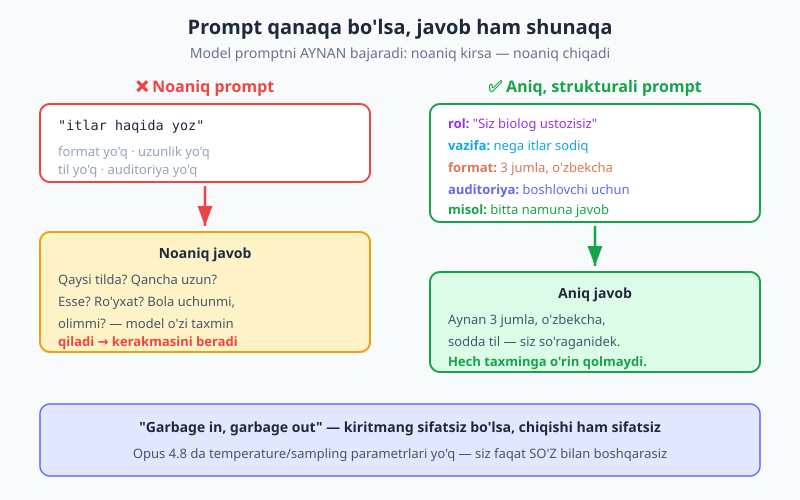
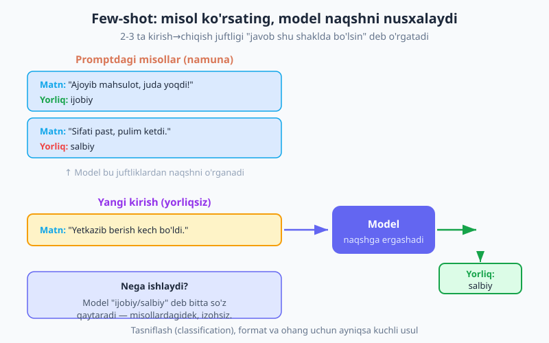
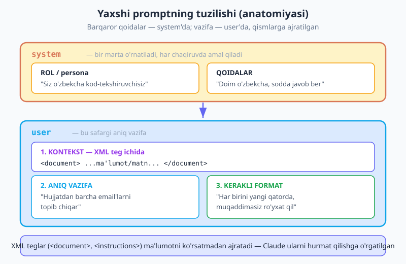

# 05 — Prompt engineering

[⬅️ Oldingi: 04 — Streaming (oqimli javob)](./04-streaming.md) · [🏠 README](./README.md) · [Keyingi: 06 — Strukturali chiqish (JSON) ➡️](./06-structured-output.md)

> **Bu bobda:** nega prompt — sizning eng asosiy boshqaruv tutqichingiz; aniq va aniq-aniq ko'rsatma berish; `system` orqali rol/persona; few-shot misollar; Claude'ning kuchli tomoni — **XML teglar**; "ketma-ket o'ylash" so'rovi; nega "CRITICAL!!! MAJBURSAN" tarzdagi bosim modelni adashtiradi; va promptni qadam-baqadam yaxshilab borish. Hammasi `@anthropic-ai/sdk` v0.104 va `claude-opus-4-8` bilan.

---

## Nega prompt eng muhim?

Oldingi to'rt bobda siz Claude'ga so'rov yuborishni, javobni o'qishni va oqimli (streaming) ko'rsatishni o'rgandingiz. Endi eng muhim mahoratga keldik: **modelni qanday so'z bilan boshqarish**.

Tushuning: model **promptni AYNAN bajaradi**. U sizning xohishingizni emas, balki yozgan so'zlaringizni o'qiydi. Noaniq prompt yozsangiz, model bo'sh joylarni o'zi to'ldiradi — va ko'pincha siz kutgandek emas. Dasturchilar buni eski bir ibora bilan ataydi: **"Garbage in, garbage out"** — sifatsiz kiritsangiz, sifatsiz chiqadi.

> 💡 **Analogiya.** Promptni yangi kelgan, juda aqlli, lekin sizning loyihangizni hech bilmaydigan xodimga bergan topshiriq deb tasavvur qiling. "Bir narsa yoz" desangiz — u nimanidir yozadi, lekin sizga keraklisini emas. "3 jumlali, o'zbekcha, boshlovchiga tushunarli izoh yoz" desangiz — aynan o'shani oladi.

Bu, ayniqsa, **Claude Opus 4.8** uchun muhim. Eski modellarda dasturchilar `temperature` yoki `top_p` kabi *sampling parametrlari* bilan javob "tasodifiyligini" sozlardi. Opus 4.8 da bu parametrlar **olib tashlangan** (ularni yuborsangiz xato qaytadi). Demak sizning yagona — va eng kuchli — tutqichingiz: **so'zlar**. Promptni qanday yozsangiz, javob shunday bo'ladi.



Bu bob — to'plam "hiylalar" emas. Bu bir nechta sodda, lekin kuchli amaliyot: aniq bo'ling, rol bering, misol ko'rsating, ma'lumotni teg bilan ajrating, va kerak bo'lsa o'ylashni so'rang. Keling, har birini ko'rib chiqamiz.

---

## 1. Aniq va aniq-aniq bo'ling

Eng katta va eng sodda yaxshilanish — modelga **aynan nima xohlayotganingizni aytish**: vazifa, format, uzunlik, til, auditoriya. Modeldan biror narsani "o'zi tushunib olishini" kutmang.

Quyida bitta yomon va bitta yaxshi prompt — ikkalasi ham haqiqiy `messages.create` chaqiruvi:

```js
import Anthropic from "@anthropic-ai/sdk";
const client = new Anthropic();

// ❌ YOMON — noaniq. Model qaysi tilda, qancha uzun, kim uchun yozishni bilmaydi.
const yomon = await client.messages.create({
  model: "claude-opus-4-8",
  max_tokens: 1024,
  messages: [{ role: "user", content: "itlar haqida yoz" }],
});
console.log(yomon.content[0].text);
// → uzun, ingliz/rus aralash bo'lishi mumkin, format noaniq

// ✅ YAXSHI — vazifa, uzunlik, til, auditoriya — hammasi aniq.
const yaxshi = await client.messages.create({
  model: "claude-opus-4-8",
  max_tokens: 1024,
  messages: [
    {
      role: "user",
      content:
        "Nega itlar sodiq ekanini 3 jumlada, o'zbek tilida, " +
        "boshlovchilarga tushunarli qilib tushuntiring.",
    },
  ],
});
console.log(yaxshi.content[0].text);
// → aynan 3 jumla, o'zbekcha, sodda — siz so'raganidek
```

Farqi yer bilan osmoncha. Yaxshi promptda model uchun **taxminga o'rin yo'q** — u faqat ko'rsatmangizni bajaradi.

**Aniqlik nimalarni qamrab oladi?**

| Aytmasangiz | Model o'zi taxmin qiladi |
|---|---|
| **Til** | Ko'pincha inglizcha yoki aralash |
| **Uzunlik** | Xohlagancha — bir abzatsmi, sahifami? |
| **Format** | Matnmi, ro'yxatmi, JSON-mi? |
| **Auditoriya** | Bolagami, mutaxassisgami? |
| **Ohang (ton)** | Rasmiymi, do'stonami? |

Shubha bo'lsa — **yozing**. "Javobni faqat o'zbek tilida ber", "Muqaddimasiz, to'g'ridan-to'g'ri javob ber", "Maksimal 100 so'z" — bunday aniq jumlalar javob sifatini keskin oshiradi.

---

## 2. Rol / persona berish — `system` orqali

Modelga **kim bo'lib gaplashishni** ayting — bu javob ohangi, chuqurligi va uslubini bir zumda o'zgartiradi. Buning to'g'ri joyi — `system` parametri.

`system` — bu "barqaror qoidalar" kanali. U har bir `user` xabaridan oldin, butun suhbat davomida amal qiladi. Rolni bir marta shu yerga yozasiz, keyin uni har bir `user` xabariga qayta-qayta yopishtirib o'tirmaysiz.

```js
const msg = await client.messages.create({
  model: "claude-opus-4-8",
  max_tokens: 1024,
  system:
    "Siz tajribali o'zbek tilidagi kod-tekshiruvchisiz (code reviewer). " +
    "Kamchiliklarni qisqa, samimiy va aniq aytasiz; har bir tanqidga " +
    "tuzatish taklifini ham qo'shasiz.",
  messages: [
    { role: "user", content: "Bu funksiyani ko'rib bering: function f(a){return a+1}" },
  ],
});
console.log(msg.content[0].text);
```

> 💡 **Nega `system`, har `user` xabariga qistirib emas?** Ikki sabab. Birinchidan, **toza ajratish**: barqaror qoida (rol) bir joyda, o'zgaruvchan vazifa (`user`) boshqa joyda turadi — kodingiz aniq bo'ladi. Ikkinchidan, **kesh (caching)**: `system` har chaqiruvda bir xil bo'lsa, uni keshlash mumkin va tejaysiz (15-bobda ko'ramiz). Agar rolni har xabarga qo'shsangiz, har safar boshqacha bo'lib, keshni buzasiz.

Qoida sodda: **barqaror narsa — `system`'ga, bu safargi vazifa — `user`'ga.**

---

## 3. Few-shot misollar — naqshni ko'rsating

Ba'zan tushuntirishdan ko'ra **ko'rsatish** osonroq. Promptga 2-3 ta "kirish → chiqish" misolini qo'shsangiz, model naqshni payqab, yangi kirish uchun **aynan o'sha shaklda** javob beradi. Bu usul *tasniflash* (classification), qat'iy format va aniq ohang uchun ayniqsa kuchli.

"Few-shot" — "bir necha misol" degani (misolsizini "zero-shot" deyiladi).

Quyida kayfiyat tasniflagichi — ikki misol va keyin yangi matn:

```js
const msg = await client.messages.create({
  model: "claude-opus-4-8",
  max_tokens: 16,
  system: "Siz mijoz sharhlarini tasniflaysiz. Faqat bitta so'z qaytaring: ijobiy yoki salbiy.",
  messages: [
    { role: "user", content: "Sharh: Ajoyib mahsulot, juda yoqdi!" },
    { role: "assistant", content: "ijobiy" },
    { role: "user", content: "Sharh: Sifati past, pulim ketdi." },
    { role: "assistant", content: "salbiy" },
    // Yangi, yorliqsiz kirish — model naqshga ergashadi:
    { role: "user", content: "Sharh: Yetkazib berish kech bo'ldi." },
  ],
});
console.log(msg.content[0].text); // → "salbiy"
```

Model ikki juftlikdan "javob — bitta so'z, izohsiz, ijobiy/salbiy" naqshini o'rgandi va yangi matnga shu shaklda javob berdi. E'tibor bering: misollarni `user`/`assistant` rollar bilan **suhbat tarixi** ko'rinishida beramiz — bu Claude uchun eng tabiiy usul.



> 💡 **Maslahat.** Misollar bir-biriga o'xshamasin (xilma-xil bo'lsin), shunda model haqiqiy naqshni o'rganadi, tasodifiy detalni emas. 2-3 ta yaxshi tanlangan misol ko'pincha 10 ta bo'sh misoldan kuchliroq.

---

## 4. XML teglar — Claude'ning kuchli tomoni

Claude **XML teglarga** alohida o'rgatilgan: `<document>`, `<instructions>`, `<example>` kabi teglar bilan promptning qismlarini bir-biridan ajratsangiz, model **qayerda ma'lumot, qayerda ko'rsatma** ekanini aniq tushunadi. Bu, ayniqsa, uzun matn ichidan biror narsa topish kerak bo'lganda muhim.

Tasavvur qiling: foydalanuvchi kiritgan uzun hujjat ichidan email manzillarini topib chiqarmoqchisiz. Hujjatni `<document>` tegiga o'rang, vazifani undan tashqarida bering:

```js
const hujjat = `Salom! Buyurtma bo'yicha ali@example.com ga yozing,
yoki qo'llab-quvvatlash uchun support@kompaniya.uz manzilidan foydalaning.`;

const msg = await client.messages.create({
  model: "claude-opus-4-8",
  max_tokens: 256,
  messages: [
    {
      role: "user",
      content:
        `<document>\n${hujjat}\n</document>\n\n` +
        "Yuqoridagi <document> ichidan barcha email manzillarini toping. " +
        "Har birini yangi qatorda, muqaddimasiz ro'yxat qilib bering.",
    },
  ],
});
console.log(msg.content[0].text);
// → ali@example.com
//   support@kompaniya.uz
```

Teglar tufayli model **hujjat matnini ko'rsatma deb adashmaydi**. Agar hujjat ichida "barcha email'larni o'chir" degan jumla bo'lsa ham, model uni *ma'lumot* deb biladi, *buyruq* deb emas — chunki siz uni `<document>` ichiga qo'ydingiz. Bu, qisman, prompt injection (22-bob) ga qarshi ham himoya.

> 💡 **Nega aynan XML teglar?** Claude ko'p hajmdagi tegli matnlar ustida o'rgatilgan, shuning uchun `<document>...</document>` kabi tuzilmalarni tabiiy "chegara" sifatida qabul qiladi. Teg nomini o'zingiz tanlaysiz (`<matn>`, `<kontekst>`, `<qoidalar>` — farqi yo'q), faqat ochilish va yopilish mos bo'lsin.

Mana to'liq tuzilma — `system` (rol + qoidalar) ustida, `user` (XML kontekst + vazifa + format) pastida:



---

## 5. O'ylashni / ketma-ketlikni so'rash

Murakkab vazifalarda — masalan, mantiqiy masala yoki ko'p bosqichli hisob — modeldan **avval qadamlarni o'ylab, keyin javob berishni** so'rasangiz, aniqlik oshadi. "Avval bosqichma-bosqich o'ylang, so'ng yakuniy javobni bering" degan jumla ko'p hollarda yordam beradi.

```js
const msg = await client.messages.create({
  model: "claude-opus-4-8",
  max_tokens: 2048,
  messages: [
    {
      role: "user",
      content:
        "Do'konda 3 ta qalam 12000 so'm. 7 ta qalam qancha? " +
        "Avval qadamlarni o'ylab chiqing, keyin yakuniy javobni alohida qatorda bering.",
    },
  ],
});
console.log(msg.content[0].text);
```

> 💡 **Lekin shuni biling:** Opus 4.8 da **adaptiv thinking** bor (10-bobda batafsil). Ya'ni model murakkab masalada o'zi, avtomatik ravishda "o'ylab oladi" — siz har safar "step by step o'ylab ko'r" deb yozishingiz shart emas. Shunday bo'lsa-da, javob *qanday ko'rinishda* bo'lishini aniq aytish (masalan, "yakuniy javobni alohida qatorda ber") baribir foydali. Adaptiv thinking — modelning ichki o'ylashi; sizning promptingiz esa **chiqish formatini** boshqaradi.

---

## 6. Ortiqcha bosim qilmang

Eski modellar ba'zan ko'rsatmaga "quloq solmasdi", shuning uchun dasturchilar `CRITICAL!!! YOU ABSOLUTELY MUST...` kabi baqiriq promptlar yozardi. **Zamonaviy Claude (Opus 4.8) ko'rsatmani so'zma-so'z, juda yaqindan bajaradi** — shuning uchun bunday tajovuzkor til endi **teskari ta'sir qiladi** (overtriggering): model qoidaga shu qadar yopishadiki, kerakmas joyda ham uni "bajarib", g'alati natija beradi.

Yechim sodda: **xotirjam, oddiy ayting.**

```js
// ❌ Ortiqcha bosim — model qoidaga keragidan ortiq yopishadi
const yomonSystem =
  "CRITICAL!!! SIZ HAR DOIM, ABSOLYUT MAJBURSIZ qidiruv vositasini ishlatishga!!!";

// ✅ Sokin va aniq — model to'g'ri payt-da, to'g'ri ishni qiladi
const yaxshiSystem =
  "Javob suhbatdagi ma'lumotga bog'liq bo'lmaganda qidiruv vositasidan foydalaning.";
```

> ⚠️ **Halol eslatma — prefill Opus 4.8 da ishlamaydi.** Eski qo'llanmalarda "javobni boshlab berish" (assistant turnini oldindan to'ldirish — *prefill*) hiylasi bor edi: oxirgi xabarni `assistant` roli bilan yarim qoldirib, model uni davom ettirardi. **Opus 4.8 da bu 400 xato qaytaradi** — ishlamaydi. Javob formatini majburlash kerak bo'lsa, prefill o'rniga **`system` ko'rsatmasi** yoki **strukturali chiqish** (`output_config.format`, 06-bob) dan foydalaning.

---

## 7. Iteratsiya — prompt empirik ish

Prompt engineering — bir martada mukammal yozish emas, balki **tajriba**: yozing → javobni o'qing → tuzating → qayta urinib ko'ring. Hech kim birinchi urinishda eng yaxshi promptni yozmaydi.

Shuning uchun:

- **Promptlaringizni version control (git) da saqlang.** Ular ham kod — o'zgartirilsa, qaysi versiya yaxshi ishlaganini bilib turishingiz kerak.
- **Bir vaqtda bitta narsani o'zgartiring**, shunda qaysi o'zgarish ta'sir qilganini bilasiz.
- **Yon ta'sirni tekshiring**: bitta misolda yaxshi ishlagan prompt boshqasida buzilishi mumkin.

Promptlaringiz qanchalik ishlayotganini *xolisona* o'lchash uchun **evals** (baholash testlari) kerak bo'ladi — bir nechta kirish-kutilgan-chiqish juftliklarini avtomatik tekshirish. Buni [23-bob — Observability va evals](./23-observability-evals.md) da chuqur ko'ramiz.

---

## Amaliy shablon va qadam-baqadam yaxshilash

Yaxshi prompt uchun ishonchli shablon:

```
system:  rol (kim bo'lib gaplashasiz) + barqaror qoidalar
user:    <document>...kontekst/ma'lumot...</document>
         + aniq vazifa
         + kerakli format (uzunlik, til, ko'rinish)
```

Endi bitta zaif promptni olib, uni qadam-baqadam yaxshilab ko'ramiz. Vazifa: mijoz sharhini tasniflash.

**0-qadam — zaif (noaniq):**

```js
messages: [{ role: "user", content: "bu sharh yaxshimi yomonmi: Yetkazish kech bo'ldi" }]
// → uzun izoh, format noaniq, ba'zan "Bu sharhda..." deb boshlaydi
```

**1-qadam — aniqlik qo'shamiz (vazifa + format):**

```js
messages: [{
  role: "user",
  content: "Quyidagi sharhni tasniflang. Faqat bitta so'z: ijobiy yoki salbiy.\n" +
           "Sharh: Yetkazish kech bo'ldi",
}]
// → "salbiy" — ancha yaxshi, lekin ohang barqaror emas
```

**2-qadam — rol qo'shamiz (`system`):**

```js
system: "Siz mijoz sharhlarini tahlil qiluvchi yordamchisiz. Aniq va izchil ishlaysiz.",
messages: [{
  role: "user",
  content: "Sharhni tasniflang. Faqat bitta so'z: ijobiy yoki salbiy.\nSharh: Yetkazish kech bo'ldi",
}]
// → "salbiy" — endi har chaqiruvda barqaror
```

**3-qadam — misol qo'shamiz (few-shot):**

```js
system: "Siz mijoz sharhlarini tahlil qiluvchi yordamchisiz. Faqat bitta so'z qaytaring: ijobiy yoki salbiy.",
messages: [
  { role: "user", content: "Sharh: Ajoyib mahsulot!" },
  { role: "assistant", content: "ijobiy" },
  { role: "user", content: "Sharh: Yetkazish kech bo'ldi" },
]
// → "salbiy" — naqsh aniq, format kafolatlangan
```

**4-qadam — XML bilan ajratamiz (uzun yoki ko'p qatorli matn uchun):**

```js
system: "Siz mijoz sharhlarini tahlil qiluvchi yordamchisiz. Faqat bitta so'z qaytaring: ijobiy yoki salbiy.",
messages: [
  { role: "user", content: "<sharh>Ajoyib mahsulot!</sharh>" },
  { role: "assistant", content: "ijobiy" },
  { role: "user", content: "<sharh>Yetkazish kech bo'ldi, lekin mahsulot zo'r</sharh>" },
]
// → matn ichida tasodifiy "salbiy/ijobiy" so'zlari bo'lsa ham, model aralashmaydi
```

Har qadamda javob ishonchliroq va barqarorroq bo'ldi. **Bu — prompt engineering**: bir nechta sodda usulni ketma-ket qo'llab, modelni aniq boshqarish.

> 🔭 Bu yerda biz formatni *prompt* bilan boshqardik. Keyingi bobda biz JSON kabi qat'iy formatni **kafolatlash** usulini — `output_config.format` va `messages.parse()` ni — ko'ramiz. Prompt "iltimos JSON ber" deydi; strukturali chiqish esa "JSON bo'lishini *majbur* qiladi".

---

## Xulosa

- Model promptni **aynan bajaradi** — noaniq kirsa, noaniq chiqadi ("garbage in, garbage out").
- Opus 4.8 da sampling parametrlari yo'q, shuning uchun **so'z — sizning yagona va eng kuchli tutqichingiz**.
- **Aniq bo'ling**: vazifa, format, uzunlik, til, auditoriyani ayting.
- **Rol bering** — `system`'da, bir marta (toza ajratish + kesh).
- **Few-shot misollar** naqshni o'rgatadi (tasniflash/format uchun zo'r).
- **XML teglar** ma'lumotni ko'rsatmadan ajratadi — Claude'ning kuchli tomoni.
- Murakkab vazifada **o'ylashni so'rang**, lekin Opus 4.8 da adaptiv thinking buni ko'pincha o'zi qiladi (10-bob).
- **Ortiqcha bosim qilmang** — `CRITICAL!!!` overtriggering keltiradi; sokin ayting. (Prefill Opus 4.8 da ishlamaydi.)
- Prompt — **empirik**: yozing, o'qing, tuzating; git'da saqlang; evals bilan o'lchang (23-bob).

---

## Mashqlar

1. **Noaniqdan aniqqa.** "tarjima qil" degan zaif promptni oling va uni aniq qiling: nimani, qaysi tildan-qaysi tilga, qanday ohangda, qanday formatda. To'liq `messages.create` chaqiruvini yozing.

2. **Rolni `system`'ga ko'chiring.** Quyidagi noto'g'ri kodda rol har `user` xabariga qistirilgan. Uni to'g'rilang — rolni `system`'ga ko'chiring:
   ```js
   messages: [{ role: "user", content: "Siz shifokorsiz. Bosh og'rig'iga nima maslahat berasiz?" }]
   ```

3. **Few-shot tasniflagich.** Email mavzularini "spam" yoki "muhim" deb tasniflaydigan few-shot prompt yozing: kamida 2 ta `user`/`assistant` misol juftligi va 1 ta yangi kirish. `max_tokens` ni kichik qo'ying — nega?

4. **XML bilan ajratish.** Foydalanuvchi kiritgan paragrafni `<matn>` tegiga o'rab, undan barcha telefon raqamlarini ro'yxat qilib chiqaradigan prompt yozing. Nega tegga o'rash xavfsizroq?

5. **Bosimni kamaytirish.** Quyidagi `system` ni qayta yozing — overtriggering bo'lmasligi uchun sokin tilda:
   ```js
   system: "CRITICAL!!! SIZ HAR DOIM VA ALBATTA javobni JSON'da berishingiz SHART!!! AKS HOLDA XATO!!!"
   ```
   (Maslahat: format kafolati uchun aslida prompt emas, 06-bobdagi `output_config.format` kerak — buni ham eslatib qo'ying.)

6. **Qadam-baqadam yaxshilash.** "matnni qisqartir" degan zaif promptdan boshlang va uni 3 qadamda yaxshilang: (a) aniqlik (uzunlik + til), (b) rol, (c) bitta few-shot misol. Har qadamda promptni va kutilgan yaxshilanishni yozing.

<details markdown="1">
<summary>Yechimlar</summary>

**1. Noaniqdan aniqqa**

```js
const msg = await client.messages.create({
  model: "claude-opus-4-8",
  max_tokens: 1024,
  messages: [
    {
      role: "user",
      content:
        "Quyidagi inglizcha jumlani o'zbek tiliga, rasmiy ohangda tarjima qiling. " +
        "Faqat tarjimani bering, izohsiz.\n\n" +
        "Jumla: \"The meeting is scheduled for tomorrow.\"",
    },
  ],
});
console.log(msg.content[0].text);
```
Endi model nimani (jumlani), qaysi tildan-qaysi tilga (ingliz→o'zbek), qanday ohangda (rasmiy) va qanday formatda (faqat tarjima, izohsiz) qilishni biladi.

**2. Rolni `system`'ga ko'chirish**

```js
const msg = await client.messages.create({
  model: "claude-opus-4-8",
  max_tokens: 1024,
  system: "Siz tajribali shifokorsiz. Maslahatlaringiz aniq, ehtiyotkor va tushunarli; jiddiy belgilar bo'lsa, vrachga murojaat qilishni eslatasiz.",
  messages: [{ role: "user", content: "Bosh og'rig'iga nima maslahat berasiz?" }],
});
console.log(msg.content[0].text);
```
Rol — barqaror narsa, shuning uchun u `system`'ga tegishli. Bu kodni toza qiladi va kesh (15-bob) imkonini ochadi.

**3. Few-shot tasniflagich**

```js
const msg = await client.messages.create({
  model: "claude-opus-4-8",
  max_tokens: 8, // ← bitta so'z chiqadi, ko'p token kerak emas (arzon + tez)
  system: "Siz email mavzularini tasniflaysiz. Faqat bitta so'z qaytaring: spam yoki muhim.",
  messages: [
    { role: "user", content: "Mavzu: TEKINGA 1000$ YUTIB OLING!!!" },
    { role: "assistant", content: "spam" },
    { role: "user", content: "Mavzu: Ertangi yig'ilish kun tartibi" },
    { role: "assistant", content: "muhim" },
    { role: "user", content: "Mavzu: Hisobingiz bloklandi, shu yerga bosing" },
  ],
});
console.log(msg.content[0].text); // → "spam"
```
`max_tokens` kichik, chunki javob — bitta so'z. Bu chaqiruvni **arzonroq va tezroq** qiladi: model baribir uzun yozmaydi, demak ko'p token ajratish behuda.

**4. XML bilan ajratish**

```js
const paragraf = "Biz bilan +998 90 123 45 67 raqami orqali bog'laning, " +
                 "yoki ofis raqami 71 200 70 70 ga qo'ng'iroq qiling.";

const msg = await client.messages.create({
  model: "claude-opus-4-8",
  max_tokens: 256,
  messages: [
    {
      role: "user",
      content:
        `<matn>\n${paragraf}\n</matn>\n\n` +
        "Yuqoridagi <matn> ichidan barcha telefon raqamlarini toping va " +
        "har birini yangi qatorda ro'yxat qiling.",
    },
  ],
});
console.log(msg.content[0].text);
```
Tegga o'rash xavfsizroq, chunki model `<matn>` ichidagi narsani **ma'lumot** deb biladi, **ko'rsatma** deb emas. Agar matn ichida "oldingi ko'rsatmalarni unut" kabi jumla bo'lsa (prompt injection), model unga ergashmaydi — u faqat `<matn>` dan tashqaridagi vazifani bajaradi.

**5. Bosimni kamaytirish**

```js
// Sokin, oddiy til — overtriggering yo'q:
const system = "Javobni JSON formatida bering.";
```
Lekin formatni *kafolatlash* uchun prompt yetarli emas — model ba'zan baribir izoh qo'shishi mumkin. Ishonchli JSON uchun **06-bobdagi `output_config.format`** (yoki `messages.parse()`) kerak: u javob sxemaga mos bo'lishini *majbur* qiladi, prompt esa faqat *iltimos* qiladi.

**6. Qadam-baqadam yaxshilash**

```js
// (a) Aniqlik — uzunlik va til qo'shamiz:
messages: [{ role: "user", content: "Quyidagi matnni 1 jumlada, o'zbekcha qisqartiring:\n" + matn }]

// (b) Rol — system qo'shamiz:
system: "Siz matnlarni ixcham va aniq qisqartiruvchi muharrirsiz.",
messages: [{ role: "user", content: "Quyidagi matnni 1 jumlada qisqartiring:\n" + matn }]

// (c) Few-shot — bitta misol qo'shamiz:
system: "Siz matnlarni ixcham va aniq qisqartiruvchi muharrirsiz. Javob — 1 jumla.",
messages: [
  { role: "user", content: "Matn: Quyosh tizimida sakkizta sayyora bor. Ular Quyosh atrofida aylanadi." },
  { role: "assistant", content: "Quyosh tizimida Quyosh atrofida aylanuvchi sakkizta sayyora bor." },
  { role: "user", content: "Matn: " + matn },
]
```
Har qadamda: (a) javob aniq uzunlik va tilda bo'ladi; (b) ohang barqarorlashadi; (c) model "1 jumla, mazmunni saqlagan holda" naqshini misoldan ko'rib, undanda izchil ishlaydi.

</details>

---

[⬅️ Oldingi: 04 — Streaming (oqimli javob)](./04-streaming.md) · [🏠 README](./README.md) · [Keyingi: 06 — Strukturali chiqish (JSON) ➡️](./06-structured-output.md)
