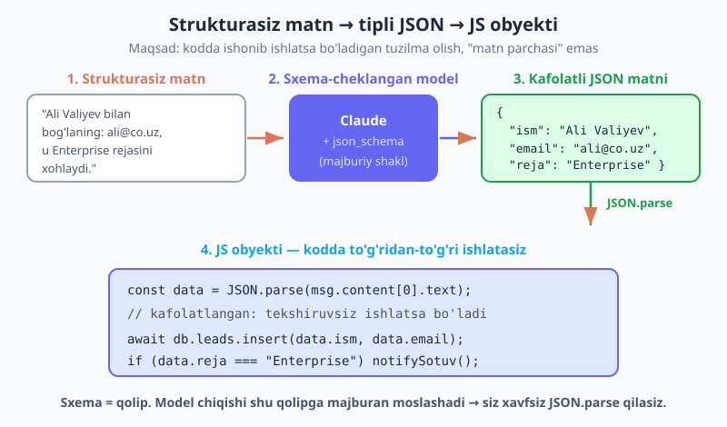
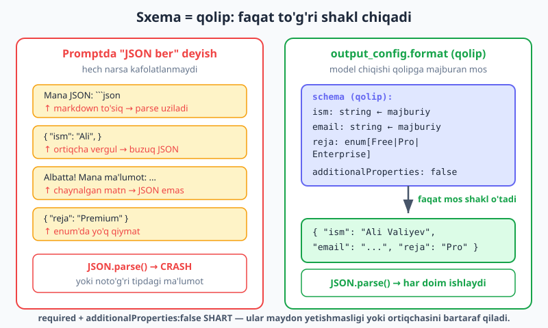
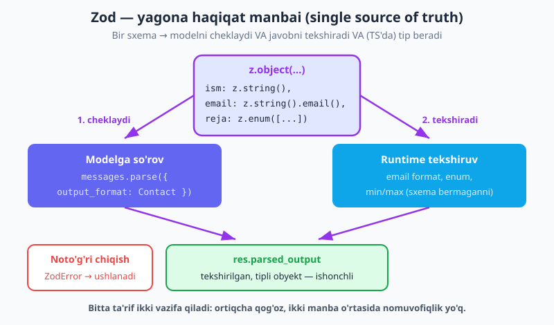

# 06 — Strukturali chiqish (JSON)

[⬅️ Oldingi: 05 — Prompt engineering](./05-prompt-engineering.md) · [🏠 README](./README.md) · [Keyingi: 07 — Tool use (funksiya chaqirish) ➡️](./07-tool-use.md)

---

> **Bu bobda:** Endi model bilan suhbatlasha olamiz va promptni yaxshilab yoza olamiz. Lekin chinakam ilova qurish uchun bizga **gap emas, ma'lumot** kerak — `JSON.parse` qilib, ishonib ishlatadigan `{ ism, email, reja }` obyekti. Bu bobda nega "iltimos, JSON ber" deyish ishonchsiz ekanini ko'ramiz, so'ng ishonchli yechimni — **`output_config.format`** bilan modelni JSON-sxemaga **majburlash** — o'rganamiz. Keyin JavaScript'ning eng qulay yo'lini — **Zod** sxemasi + `client.messages.parse()` — bilan tipli, tekshirilgan obyekt olamiz. Yakunda ikkita real vosita quramiz: **matn → tuzilgan lead** ajratuvchi va **sharh → kayfiyat (enum) + ball** klassifikatori. Misollar `@anthropic-ai/sdk` v0.104 va `zod` v4 da haqiqatan mavjud parametrlar bilan yozilgan.

---

## Nega "shunchaki JSON so'rash" yetarli emas

Tasavvur qiling: foydalanuvchi yozgan murojaat matnidan ism, email va tarif rejasini ajratib, bazaga yozmoqchisiz. Ko'pchilik avval shunday qiladi — promptga "javobni JSON shaklida ber" deb yozadi:

```js
const msg = await client.messages.create({
  model: "claude-opus-4-8",
  max_tokens: 1024,
  messages: [{
    role: "user",
    content: 'Quyidagidan ism, email, reja ajrat va JSON ber: "Ali Valiyev, ali@co.uz, Enterprise rejasini xohlaydi."',
  }],
});

const data = JSON.parse(msg.content[0].text); // ⚠️ ishonchsiz!
```

Bu **ba'zan** ishlaydi. Lekin ishlab chiqarishda (production) "ba'zan" — bu xato demakdir. Model "yordamchi" bo'lishga harakat qiladi va sizning `JSON.parse` ni quyidagilar bilan portlatishi mumkin:

- **Matn qo'shadi:** `Albatta! Mana ma'lumot: { ... }` — boshidagi gap tufayli `JSON.parse` darrov uziladi.
- **Markdown to'siq (fence) o'raydi:** javobni ``` ```json ... ``` ``` ichiga soladi — backtick'lar valid JSON emas.
- **Buzuq JSON beradi:** ortiqcha vergul (`{ "ism": "Ali", }`), qo'shtirnoq o'rniga apostrof, yopilmagan qavs.
- **Sxemadan tashqari maydon/qiymat:** siz `reja` faqat `Free`/`Pro`/`Enterprise` bo'lsin desangiz ham, model `"Premium"` deb yozib qo'yishi mumkin.

Bularning hammasi bitta sababdan kelib chiqadi: **prompt — bu iltimos, kafolat emas.** Modeldan matn bilan "iltimos JSON ber" deyish — uning erkini cheklamaydi.



Bizga kerak bo'lgan narsa — modelni **chiqishi shakliga majburlash**. Xuddi quyma qolip kabi: qolipga nima quyilmasin, faqat qolip shaklida chiqadi. Bu mexanizm **strukturali chiqish** (structured output) deb ataladi.

> **Atama:** *JSON-sxema (JSON Schema)* — JSON obyektining shakli (qaysi maydonlar bor, qaysi tipda, qaysilari majburiy) ni ta'riflovchi standart. Biz modelga "javob shu sxemaga mos bo'lsin" deb beramiz, model esa shundan chiqa olmaydi.

---

## Ishonchli yechim — `output_config.format`

`messages.create` chaqiruviga **`output_config.format`** parametrini qo'shsangiz, model javobining birinchi content bloki **kafolatlangan, sxemaga to'liq mos JSON matn** bo'ladi. Endi `JSON.parse` hech qachon uzilmaydi:

```js
const msg = await client.messages.create({
  model: "claude-opus-4-8",
  max_tokens: 1024,
  messages: [{
    role: "user",
    content: "Ali Valiyev, ali@co.uz, Enterprise rejasini xohlaydi.",
  }],
  output_config: {
    format: {
      type: "json_schema",
      schema: {
        type: "object",
        properties: {
          ism: { type: "string" },
          email: { type: "string" },
          reja: { type: "string" },
        },
        required: ["ism", "email", "reja"],
        additionalProperties: false,
      },
    },
  },
});

const data = JSON.parse(msg.content[0].text); // kafolatlangan valid JSON
console.log(data.email); // "ali@co.uz"
```

Endi `data` — ishonsangiz bo'ladigan obyekt: `data.ism`, `data.email`, `data.reja` har doim mavjud va string tipida. Tekshiruvga, `try/catch` ga, markdown to'siqni kesib tashlashga hojat yo'q.



Ikki narsa **majburiy** (mandatory), aks holda API xato beradi:

- **`required`** — qaysi maydonlar albatta bo'lishi shart. Yetishmasa, model uni to'ldirishga majbur (modelni "bo'sh qoldirib ketish" yo'lidan to'sadi).
- **`additionalProperties: false`** — sxemada sanalmagan ortiqcha maydon **chiqmasligi** kerak. Buni qo'ymasangiz, model o'zicha `izoh` yoki `ishonch` kabi maydon qo'shib yuborishi mumkin.

> **Eskirishdan ogohlantirish:** Internetda yoki eski kodda yuqori darajadagi `output_format: "json"` (oddiy satr) parametrini uchratishingiz mumkin — u **eskirgan (deprecated)**. Hozir **`output_config.format`** (yuqoridagi obyekt) ishlatiladi. Agar eski misol ko'rsangiz, shu yangisiga o'tkazing.

### Qaysi tiplar qo'llab-quvvatlanadi (va qaysilari yo'q)

JSON-sxemada hammasi server tomonda majburlanmaydi. Quyidagilar **ishlaydi**: asosiy `type`lar (`string`, `number`, `boolean`, `object`, `array`), `enum` (cheklangan qiymatlar ro'yxati), `const`, `anyOf` (bir nechta variantdan biri), `$ref` (sxemani qayta ishlatish), string `format` (masalan `"email"`, `"date-time"`).

Lekin quyidagilar **server tomonda majburlanmaydi**: `minimum`/`maximum` (son chegarasi), `minLength`/`maxLength` (satr uzunligi), `pattern` (regex). Model bularni "ko'rsatma" sifatida ko'rishi mumkin, lekin **kafolat yo'q** — masalan, `0` dan `5` gacha ball so'rasangiz, `7` chiqishi extimoli bor. Bunday cheklovlarni **o'zingiz klient tomonda tekshirishingiz** kerak — buning eng qulay yo'li Zod (pastda).

---

## JavaScript'cha qulay yo'l — Zod + `messages.parse()`

Yuqoridagi xom JSON-sxemani qo'lda yozish ko'p joy oladi va xato qilish oson. JavaScript dunyosida sxemani ta'riflashning standart vositasi — **Zod** (`zod` v4). Zod bilan siz sxemani bir marta yozasiz va u **uch vazifani** bajaradi: modelni cheklaydi, javobni runtime'da tekshiradi, va (TypeScript'da) sizga tip beradi.

SDK'da buning uchun maxsus yordamchi bor — **`client.messages.parse()`**. U Zod sxemasini `output_format` orqali oladi va sizga **tekshirilgan, tayyor obyekt** qaytaradi:

```js
import Anthropic from "@anthropic-ai/sdk";
import { z } from "zod";

const client = new Anthropic(); // ANTHROPIC_API_KEY .env dan

const Contact = z.object({
  ism: z.string(),
  email: z.string().email(),                 // email formatini Zod tekshiradi
  reja: z.enum(["Free", "Pro", "Enterprise"]), // faqat shu uchtadan biri
});

const res = await client.messages.parse({
  model: "claude-opus-4-8",
  max_tokens: 1024,
  messages: [{
    role: "user",
    content: "Ali Valiyev, ali@co.uz, Enterprise rejasini xohlaydi.",
  }],
  output_format: Contact, // <-- Zod sxemani shu yerga beramiz
});

console.log(res.parsed_output); // { ism: "Ali Valiyev", email: "ali@co.uz", reja: "Enterprise" }
```

`res.parsed_output` — bu **xom matn emas, allaqachon `JSON.parse` qilingan va Zod bilan tekshirilgan obyekt**. Agar model `email` o'rniga noto'g'ri narsa yuborsa yoki `reja`ni `"Premium"` desa, Zod buni ushlaydi va xato (`ZodError`) tashlaydi — buzuq ma'lumot kodingizning ichkarisiga kira olmaydi.



### Nega aynan Zod?

- **Bitta haqiqat manbai (single source of truth):** sxemani bir joyda yozasiz, u ham modelga, ham tekshiruvga ishlatiladi. Ikki joyda ikki xil sxema saqlab, ular bir-biriga mos kelmay qolish muammosi yo'q.
- **Runtime tekshiruv:** sxema *server tomonda majburlamaydigan* qoidalarni (email format, `min`/`max`, `regex`) Zod **klient tomonda** tekshiradi. Masalan `z.number().min(0).max(5)` — server `5` dan oshig'iga yo'l qo'yishi mumkin, lekin Zod uni ushlaydi.
- **TypeScript tiplari:** TS ishlatsangiz, `z.infer<typeof Contact>` bilan to'g'ridan-to'g'ri tip olasiz — `res.parsed_output.reja` muharrirda `"Free" | "Pro" | "Enterprise"` deb ko'rinadi.

> **Eslatma:** Zod email/min/max ni tekshirsa-da, modelni server tomonda *bularga* majburlamaydi (yuqoridagi qo'llab-quvvatlanmaydigan ro'yxatni eslang). Ya'ni Zod = ikkinchi himoya qatlami. Amaliyot: sxemada strukturani majburlang, qolgan nozik qoidalarni Zod tekshirsin.

---

## Foydali holatlar

Strukturali chiqish AI'ni "matn qaytaruvchi" dan "ma'lumot qaytaruvchi servis" ga aylantiradi. Eng tez-tez uchraydigan holatlar:

| Holat | Strukturasiz kirish | Tuzilgan chiqish |
|---|---|---|
| **Ma'lumot ajratish** | rezyume, email, hisob-faktura matni | `{ ism, tajriba, kompaniyalar: [...] }` |
| **Klassifikatsiya (enum)** | mijoz sharhi | `{ kayfiyat: "ijobiy", ball: 4 }` |
| **Konfiguratsiya yaratish** | tabiiy til ko'rsatma | `{ chart: "bar", oxlar: {...} }` |
| **Forma to'ldirish** | erkin matn so'rov | tipli forma obyekti |

Ikki kichik misolda ko'rib chiqamiz: ma'lumot ajratish (extraction) va klassifikatsiya (classification).

### 1-misol: Email → tuzilgan "lead" ajratuvchi

Saytdagi murojaat formasidan kelgan erkin matnni qabul qilib, undan tuzilgan lead chiqaramiz. `niyat` maydoni `enum` — model faqat ruxsat etilgan toifalardan birini tanlay oladi:

```js
import Anthropic from "@anthropic-ai/sdk";
import { z } from "zod";

const client = new Anthropic();

const Lead = z.object({
  ism: z.string(),
  email: z.string().email(),
  kompaniya: z.string().nullable(),                       // bo'lmasligi mumkin
  niyat: z.enum(["demo_sorovi", "narx_sorovi", "qollab_quvvatlash", "boshqa"]),
  shoshilinch: z.boolean(),
});

async function leadAjrat(matn) {
  const res = await client.messages.parse({
    model: "claude-opus-4-8",
    max_tokens: 512,
    system: "Sen murojaat matnidan tuzilgan lead ajratuvchisan. Faqat matnda bor narsani yoz; kompaniya ko'rsatilmasa null qo'y.",
    messages: [{ role: "user", content: matn }],
    output_format: Lead,
  });
  return res.parsed_output;
}

const lead = await leadAjrat(
  "Assalomu alaykum, men Dilnoza Karimova, BIZ MChJ dan. " +
  "Iltimos, ertaga demo ko'rsata olasizmi? Juda shoshilinch. dilnoza@biz.uz"
);

console.log(lead);
// { ism: "Dilnoza Karimova", email: "dilnoza@biz.uz",
//   kompaniya: "BIZ MChJ", niyat: "demo_sorovi", shoshilinch: true }

if (lead.shoshilinch && lead.niyat === "demo_sorovi") {
  // sotuv jamoasini darhol xabardor qil — endi bu kod ishonchli
}
```

E'tibor bering: `lead.niyat` har doim to'rt qiymatdan biri — `switch` yoki `if` da xotirjam ishlatasiz, kutilmagan satr kelmaydi. `kompaniya` esa `null` bo'lishi mumkin (`z.string().nullable()`), chunki har murojaatda kompaniya nomi bo'lavermaydi.

### 2-misol: Sharh → kayfiyat (enum) + ball klassifikatori

Mahsulot sharhini olib, kayfiyatni toifaga ajratamiz va `1`–`5` ball beramiz. Bu yerda muhim saboq: **`ball` ni `0`–`5` deb cheklashni Zod qiladi, sxema emas** — chunki server `min`/`max` ni majburlamaydi.

```js
import Anthropic from "@anthropic-ai/sdk";
import { z } from "zod";

const client = new Anthropic();

const Tahlil = z.object({
  kayfiyat: z.enum(["ijobiy", "neytral", "salbiy"]),
  ball: z.number().int().min(1).max(5),  // Zod klient tomonda tekshiradi
  asosiy_mavzu: z.string(),
});

async function sharhTahlil(sharh) {
  const res = await client.messages.parse({
    model: "claude-opus-4-8",
    max_tokens: 256,
    system: "Mahsulot sharhini tahlil qil. ball: 1 (juda yomon) dan 5 (a'lo) gacha butun son.",
    messages: [{ role: "user", content: sharh }],
    output_format: Tahlil,
  });
  return res.parsed_output;
}

const t = await sharhTahlil("Yetkazib berish kechikdi, lekin mahsulot sifati zo'r.");
console.log(t);
// { kayfiyat: "neytral", ball: 3, asosiy_mavzu: "yetkazib berish va sifat" }
```

Endi `t.kayfiyat` va `t.ball` ni hisobotda, filtrlashda, dashboard'da bemalol ishlatasiz — chunki ular tipli va chegaralangan. Yuzlab sharhni `for` siklida o'tkazib, kayfiyat bo'yicha guruhlash — bir necha qator.

---

## Tool'ga asoslangan JSON (qisqacha)

Strukturali JSON olishning yana bir yo'li bor — **`strict: true` kirish sxemali tool (vosita)** e'lon qilish. Modelga "shu vositani chaqir" deb aytsangiz, vosita kirishi ham xuddi sxemaga majburlanadi va siz `tool_use` blokidan tuzilgan argumentlarni olasiz.

Qachon qaysi biri? Agar sizga **shunchaki ma'lumot** kerak bo'lsa (ajratish, klassifikatsiya) — `output_config.format` soddaroq. Agar model **harakat tanlashi** kerak bo'lsa (qaysi funksiyani, qaysi argument bilan chaqirish) — tool yo'li to'g'ri. To'liq tool use — **keyingi, [07-bob](./07-tool-use.md)**, Zod bilan avtomatik tool runner esa 08-bobda.

---

## Tez-tez uchraydigan xatolar

| Xato | Nima bo'ladi | Yechim |
|---|---|---|
| `additionalProperties: false` yozilmagan | API xato beradi, yoki model ortiqcha maydon qo'shadi | Sxemaga **doim** qo'shing |
| `required` yozilmagan | Model maydonni tushirib ketishi mumkin | Majburiy maydonlarni sanang |
| `min`/`max`/`regex` ni server majburlaydi deb o'ylash | Chegaradan oshgan qiymat o'tib ketadi | Bularni **Zod** klient tomonda tekshirsin |
| `stop_reason: "max_tokens"` | JSON yarmida uzilib qoladi → `JSON.parse` xato | `max_tokens` ni oshiring; `stop_reason` ni tekshiring |
| `enum` o'rniga erkin `string` | Model kutilmagan toifa qaytaradi | Cheklangan qiymatlar uchun `z.enum([...])` / `enum` ishlating |
| Eski `output_format: "json"` satri | Eskirgan, kutilmagan natija | `output_config.format` obyektiga o'ting |

> **`stop_reason` haqida (03-bobni eslang):** strukturali chiqishda ham javob uzun bo'lsa `max_tokens` ga urilib, JSON tugamasdan kesilishi mumkin. Shuning uchun mahsulot kodida `if (msg.stop_reason === "max_tokens")` ni tekshirib, kerak bo'lsa qayta so'rang yoki `max_tokens` ni oshiring. `messages.parse()` ishlatganda esa to'liqsiz JSON Zod tekshiruvida ushlanadi.

---

## Mashqlar

Quyidagi mashqlarni `node fayl.mjs` bilan ishga tushiring. Haqiqiy chaqiruvlar API kaliti va token sarfini talab qiladi — avval kichik `max_tokens` bilan sinang. Sxema/Zod ta'riflarini esa chaqiruvsiz, lokal `.parse()` bilan ham tekshirishingiz mumkin.

### Oson

1. **Sxemani Zod'siz yozing.** `{ shahar: string, aholi: number }` uchun xom JSON-sxema obyektini yozing — `required` va `additionalProperties: false` bilan. `output_config.format` ichida ishlating va `JSON.parse(msg.content[0].text)` natijasida ikkala maydon borligini tekshiring.
2. **Eskirgan parametrni toping.** Berilgan ikki misoldan — biri `output_format: "json"`, biri `output_config.format` — qaysi biri eskirgan (deprecated) va nega ekanini ayting, eskisini yangisiga aylantiring.
3. **`enum` bilan toifa.** `kategoriya` maydoni faqat `"texnika" | "kiyim" | "oziq-ovqat"` bo'ladigan Zod sxema (`z.enum`) yozing. `messages.parse()` bilan bir mahsulot tavsifini toifaga ajrating.
4. **Majburiy vs ixtiyoriy.** `{ ism: string (majburiy), telefon: string (ixtiyoriy) }` uchun Zod sxema yozing (`telefon` uchun `.nullable()`). Telefon ko'rsatilmagan matnda `telefon === null` chiqishini tekshiring.

### O'rta

5. **Lead ajratuvchini kengaytiring.** Yuqoridagi `Lead` sxemasiga `byudjet: z.number().nullable()` qo'shing. Byudjet aytilmagan matnda `null`, aytilganda son chiqishini ikki misolda tekshiring.
6. **Zod chegarani ushlaydi.** `ball: z.number().int().min(1).max(5)` li sxema yozing. Sxema `min`/`max` ni server tomonda majburlamasligini matnda tushuntiring, so'ng Zod chegaradan oshgan qiymatni qanday ushlashini ko'rsating (`.safeParse()` bilan `{ ball: 9 }` ni sinab).
7. **Massiv chiqishi.** Bir paragrafdan barcha shaxs ismlarini ajratuvchi sxema yozing: `{ ismlar: z.array(z.string()) }`. Uch ismli matnda massiv uzunligi `3` ekanini tekshiring.
8. **`stop_reason` ni tekshiring.** `messages.create` (Zod'siz) bilan uzun ro'yxat so'rang, ataylab `max_tokens: 20` qo'ying. `msg.stop_reason === "max_tokens"` ekanini va JSON to'liqsiz (parse xato) ekanini ko'rsating, so'ng `max_tokens` ni oshirib tuzating.

### Qiyin

9. **Ichma-ich obyekt.** Hisob-faktura matnidan `{ mijoz: { ism, email }, qatorlar: [{ mahsulot, narx }], jami: number }` ko'rinishidagi ichma-ich (nested) tuzilmani ajratuvchi Zod sxema yozing va bir misolda ishlatib, `res.parsed_output.qatorlar.length` ni tekshiring.
10. **Klassifikator quvuri.** Beshta sharhdan iborat massivni `for` siklida `sharhTahlil` dan o'tkazib, natijalarni `kayfiyat` bo'yicha guruhlovchi (`{ ijobiy: n, neytral: n, salbiy: n }`) funksiya yozing.
11. **`anyOf` bilan ikki shakl.** Hodisa (event) sxemasini yozing: u **yoki** `{ tur: "login", foydalanuvchi: string }` **yoki** `{ tur: "xarid", summa: number }` bo'lsin (`z.discriminatedUnion("tur", [...])`). Ikki xil matnda to'g'ri shakl chiqishini tekshiring.

<details markdown="1">
<summary>Yechimlar</summary>

Hammasi `@anthropic-ai/sdk` (v0.104) va `zod` (v4) bilan. `ANTHROPIC_API_KEY` ni `.env` da saqlang (02-bob).

### 1-mashq yechimi

```js
import Anthropic from "@anthropic-ai/sdk";
const client = new Anthropic();

const msg = await client.messages.create({
  model: "claude-opus-4-8",
  max_tokens: 256,
  messages: [{ role: "user", content: "Toshkent shahri, aholisi taxminan 3 million." }],
  output_config: {
    format: {
      type: "json_schema",
      schema: {
        type: "object",
        properties: { shahar: { type: "string" }, aholi: { type: "number" } },
        required: ["shahar", "aholi"],
        additionalProperties: false,
      },
    },
  },
});

const data = JSON.parse(msg.content[0].text);
console.log(data.shahar, data.aholi); // "Toshkent" 3000000
```

`required` va `additionalProperties: false` ikkalasi ham shart — usiz API sxemani qabul qilmaydi.

### 2-mashq yechimi

`output_format: "json"` — **eskirgan (deprecated)** yuqori darajadagi satr parametri. To'g'risi — `output_config.format` obyekti (`{ type: "json_schema", schema: {...} }`). Eskisi qaysi sxemaga moslashni aytmaydi va kelajakda ishlamay qolishi mumkin; yangisi esa aniq sxema beradi va kafolat kuchliroq. Aylantirish: satrni o'chirib, o'rniga `output_config: { format: { type: "json_schema", schema: {...} } }` yozing.

### 3-mashq yechimi

```js
import Anthropic from "@anthropic-ai/sdk";
import { z } from "zod";
const client = new Anthropic();

const Mahsulot = z.object({
  kategoriya: z.enum(["texnika", "kiyim", "oziq-ovqat"]),
});

const res = await client.messages.parse({
  model: "claude-opus-4-8",
  max_tokens: 128,
  messages: [{ role: "user", content: "Yangi paxta ko'ylak, 100% tabiiy." }],
  output_format: Mahsulot,
});
console.log(res.parsed_output.kategoriya); // "kiyim"
```

`z.enum` model chiqishini uch qiymat bilan cheklaydi — kutilmagan toifa kelmaydi.

### 4-mashq yechimi

```js
import Anthropic from "@anthropic-ai/sdk";
import { z } from "zod";
const client = new Anthropic();

const Kontakt = z.object({
  ism: z.string(),
  telefon: z.string().nullable(), // ixtiyoriy: bo'lmasa null
});

const res = await client.messages.parse({
  model: "claude-opus-4-8",
  max_tokens: 128,
  system: "Telefon ko'rsatilmasa null qo'y.",
  messages: [{ role: "user", content: "Mening ismim Sardor." }],
  output_format: Kontakt,
});
console.log(res.parsed_output.telefon); // null
```

`.nullable()` — maydon majburiy bo'lib qoladi, lekin qiymati `null` bo'lishiga ruxsat beradi. Modelga `system` da "yo'q bo'lsa null" deb aytish muhim.

### 5-mashq yechimi

```js
import Anthropic from "@anthropic-ai/sdk";
import { z } from "zod";
const client = new Anthropic();

const Lead = z.object({
  ism: z.string(),
  email: z.string().email(),
  byudjet: z.number().nullable(),
});

async function ajrat(matn) {
  const res = await client.messages.parse({
    model: "claude-opus-4-8",
    max_tokens: 256,
    system: "Byudjet ($) aytilmasa null qo'y.",
    messages: [{ role: "user", content: matn }],
    output_format: Lead,
  });
  return res.parsed_output;
}

console.log((await ajrat("Aziz, aziz@x.uz, byudjet 5000$")).byudjet);   // 5000
console.log((await ajrat("Aziz, aziz@x.uz, hozircha o'rganyapmiz")).byudjet); // null
```

### 6-mashq yechimi

```js
import { z } from "zod";

const Tahlil = z.object({
  ball: z.number().int().min(1).max(5),
});

// MUHIM: min/max ni SERVER majburlamaydi (qo'llab-quvvatlanmaydi).
// Shuning uchun model nazariy jihatdan 9 qaytarishi mumkin — Zod uni KLIENT tomonda ushlaydi:
const natija = Tahlil.safeParse({ ball: 9 });
console.log(natija.success);              // false
console.log(natija.error.issues[0].code); // "too_big"
```

Saboq: strukturani sxema majburlaydi, *qiymat chegarasini* esa Zod. Ikkovi birga to'liq himoya beradi.

### 7-mashq yechimi

```js
import Anthropic from "@anthropic-ai/sdk";
import { z } from "zod";
const client = new Anthropic();

const Ismlar = z.object({ ismlar: z.array(z.string()) });

const res = await client.messages.parse({
  model: "claude-opus-4-8",
  max_tokens: 256,
  messages: [{ role: "user", content: "Ali, Vali va Guli bog'da uchrashdi." }],
  output_format: Ismlar,
});
console.log(res.parsed_output.ismlar.length); // 3
```

`z.array(z.string())` — har bir element string bo'lgan massivni majburlaydi.

### 8-mashq yechimi

```js
import Anthropic from "@anthropic-ai/sdk";
const client = new Anthropic();

const msg = await client.messages.create({
  model: "claude-opus-4-8",
  max_tokens: 20, // ataylab juda kichik
  messages: [{ role: "user", content: "20 ta mamlakat va poytaxtini JSON massiv qil." }],
  output_config: {
    format: {
      type: "json_schema",
      schema: {
        type: "object",
        properties: { royxat: { type: "array", items: { type: "string" } } },
        required: ["royxat"],
        additionalProperties: false,
      },
    },
  },
});

console.log(msg.stop_reason); // "max_tokens"
try {
  JSON.parse(msg.content[0].text);
} catch (e) {
  console.log("JSON to'liqsiz — kesilgan:", e.message);
}
// Tuzatish: max_tokens ni 1024+ ga oshiring → stop_reason "end_turn" bo'ladi, JSON to'liq.
```

`max_tokens` ga urilsa, JSON yarmida uzilib qoladi. **Doim** `stop_reason` ni tekshiring.

### 9-mashq yechimi

```js
import Anthropic from "@anthropic-ai/sdk";
import { z } from "zod";
const client = new Anthropic();

const Faktura = z.object({
  mijoz: z.object({ ism: z.string(), email: z.string().email() }),
  qatorlar: z.array(z.object({ mahsulot: z.string(), narx: z.number() })),
  jami: z.number(),
});

const res = await client.messages.parse({
  model: "claude-opus-4-8",
  max_tokens: 512,
  messages: [{
    role: "user",
    content: "Mijoz: Olim (olim@x.uz). Klaviatura 150000, sichqoncha 80000. Jami 230000.",
  }],
  output_format: Faktura,
});
console.log(res.parsed_output.qatorlar.length); // 2
console.log(res.parsed_output.jami);            // 230000
```

Zod ichma-ich (`z.object` ichida `z.object` va `z.array`) tuzilmani ham bemalol tekshiradi.

### 10-mashq yechimi

```js
// sharhTahlil — bob matnidagi funksiya
async function guruhla(sharhlar) {
  const sanoq = { ijobiy: 0, neytral: 0, salbiy: 0 };
  for (const s of sharhlar) {
    const t = await sharhTahlil(s);
    sanoq[t.kayfiyat]++;
  }
  return sanoq;
}

const natija = await guruhla([
  "Zo'r mahsulot!",
  "Yomon, pulim ketdi.",
  "O'rtacha, yaxshi ham emas.",
  "Juda mamnunman!",
  "Sifatsiz, qaytardim.",
]);
console.log(natija); // { ijobiy: 2, neytral: 1, salbiy: 2 }
```

`enum` tufayli `sanoq[t.kayfiyat]` har doim mavjud kalitga tushadi — kutilmagan toifa indeksdan tashqari chiqmaydi. (Tezroq uchun `Promise.all` bilan parallel ham qilsa bo'ladi.)

### 11-mashq yechimi

```js
import Anthropic from "@anthropic-ai/sdk";
import { z } from "zod";
const client = new Anthropic();

const Hodisa = z.discriminatedUnion("tur", [
  z.object({ tur: z.literal("login"), foydalanuvchi: z.string() }),
  z.object({ tur: z.literal("xarid"), summa: z.number() }),
]);

async function ajrat(matn) {
  const res = await client.messages.parse({
    model: "claude-opus-4-8",
    max_tokens: 128,
    messages: [{ role: "user", content: matn }],
    output_format: Hodisa,
  });
  return res.parsed_output;
}

console.log(await ajrat("Aziz tizimga kirdi."));        // { tur: "login", foydalanuvchi: "Aziz" }
console.log(await ajrat("250000 so'mlik xarid bo'ldi.")); // { tur: "xarid", summa: 250000 }
```

`discriminatedUnion` — `tur` maydoniga qarab to'g'ri shaklni tanlaydi (JSON-sxemada `anyOf` ga aylanadi). Har bir variant o'z maydonlariga ega.

</details>

---

## Yakunda

Bu bobda AI chiqishini "matn" dan "ishonchli ma'lumot" ga aylantirdik:

- **Nega kerak:** kodda ishlatish uchun sizga kafolatli struktura kerak — promptda "JSON ber" deyish ishonchsiz (matn qo'shadi, markdown to'siq o'raydi, buzuq JSON beradi).
- **`output_config.format`** (`type: "json_schema"`) — modelni sxemaga **majburlaydi**. `required` va `additionalProperties: false` **shart**. Eski `output_format` satri — **eskirgan**.
- **Server faqat strukturani majburlaydi:** `min`/`max`/`regex`/`length` server tomonda emas — ularni klient tomonda tekshiring.
- **Zod + `messages.parse()`** — JavaScript'cha eng qulay yo'l: bitta sxema modelni cheklaydi, javobni runtime tekshiradi va tip beradi. `res.parsed_output` — tayyor, tekshirilgan obyekt.
- Quryapmiz: **lead ajratuvchi** (matn → tuzilgan obyekt) va **sharh klassifikatori** (matn → kayfiyat enum + ball).

`JSON.parse` ning o'zi haqida ko'proq — [JavaScript kitobida](../js/README.md). Strukturali chiqish bilan model **ma'lumot** qaytaradi; lekin ko'pincha biz modelga **harakat** ham bajartirishni — funksiya chaqirishni — xohlaymiz. Bu — keyingi **[07-bob: Tool use](./07-tool-use.md)** ning mavzusi. Vercel AI SDK'ning shu maqsaddagi `generateObject` versiyasini esa [12-bobda](./12-ai-sdk-structured-tools.md) ko'ramiz.

---

[⬅️ Oldingi: 05 — Prompt engineering](./05-prompt-engineering.md) · [🏠 README](./README.md) · [Keyingi: 07 — Tool use (funksiya chaqirish) ➡️](./07-tool-use.md)
