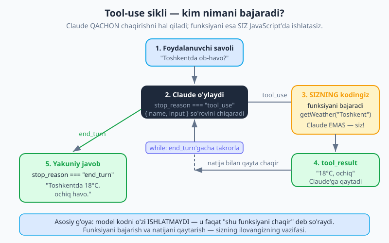
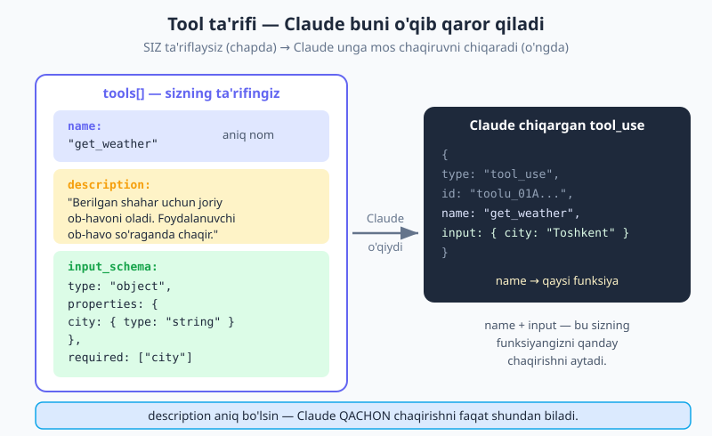
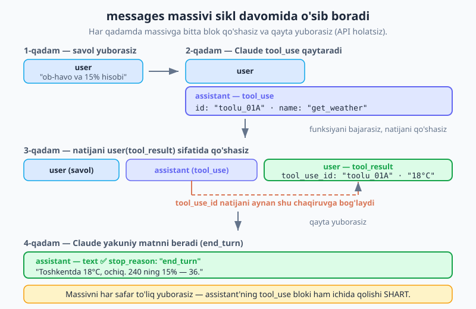

# 07 — Tool use (funksiya chaqirish)

[⬅️ Oldingi: 06 — Strukturali chiqish (JSON)](./06-structured-output.md) · [🏠 README](./README.md) · [Keyingi: 08 — Tool runner va Zod ➡️](./08-tool-runner-zod.md)

> **Bu bobda:** LLM nega yolg'iz ish bajara olmasligini va **tool use** (vosita ishlatish / funksiya chaqirish) buni qanday hal qilishini o'rganamiz. Tool ta'riflashni (`name`, `description`, `input_schema`), `tool_use` → `tool_result` siklini va uni **qo'lda agent loop** sifatida yozishni ko'ramiz. Oxirida ob-havo + kalkulyator vositalari bilan to'liq, ishlaydigan misol quramiz. Bu — **agentlar** (19-bob) poydevori.

---

## Nega tool kerak? — Claude yolg'iz nimani uddalay olmaydi

Tasavvur qiling: siz Claude'dan **"Hozir Toshkentda ob-havo qanday?"** deb so'radingiz. Claude qanchalik aqlli bo'lmasin, u **bilmaydi** — chunki u faqat o'zi o'rgatilgan matnga ega, va o'rgatish ma'lum bir sanada to'xtagan. Uning internetga, sizning baza'ngizga yoki real vaqtdagi narxlarga **kirishi yo'q**.

LLM yana ikki narsani ishonchli uddalay olmaydi:

- **Aniq matematika.** "240 ning 15% nechchi?" — LLM ko'pincha to'g'ri javob beradi, lekin u *hisoblamaydi*, balki javobni *bashorat qiladi*. Murakkab sonlarda u adashishi mumkin. Kalkulyator esa hech qachon adashmaydi.
- **Harakat qilish.** Email yuborish, bazaga yozish, buyurtma yaratish — bularning hammasi tashqi dunyoga ta'sir qiladi. Matn generatsiya qiluvchi model buni o'zi qila olmaydi.

**Tool use** (vositadan foydalanish) aynan shu bo'shliqni to'ldiradi. G'oya oddiy:

> Siz Claude'ga **vositalar** (tools) — ya'ni u so'rab oladigan funksiyalar ro'yxatini berasiz. Claude **qachon** chaqirishni hal qiladi; **funksiyani esa SIZ** JavaScript'da bajarasiz va natijani qaytarasiz. Claude natijadan foydalanib javob beradi.

**Analogiya.** Claude — aqlli **menejer**. U hamma narsani o'zi qilmaydi. Aniq vazifa kerak bo'lganda — "ob-havoni tekshir", "bu sonni hisobla" — u buni **sizning funksiyangizga topshiradi** va natijani kutadi. Menejer qarorni qabul qiladi (kimga, qachon topshirish), lekin qo'l mehnatini xodim (sizning kodingiz) bajaradi.

> ⚠️ **Eng muhim tushuncha (esda tuting):** Model sizning kodingizni **hech qachon o'zi ishlatmaydi**. U faqat "iltimos, `get_weather` funksiyasini `{city: "Toshkent"}` bilan chaqir" degan *so'rovni* chiqaradi. Funksiyani bajarish — sizning ilovangizning ishi. Bu butun bobning kaliti.



---

## Tool ta'riflash — `name`, `description`, `input_schema`

Har bir vosita uchta narsadan iborat. Ularni `messages.create()` ga `tools` massivi sifatida berasiz:

```js
const tools = [
  {
    name: "get_weather",
    description:
      "Berilgan shahar uchun joriy ob-havoni oladi. " +
      "Foydalanuvchi biror joydagi ob-havo, harorat yoki ob-havo holatini so'raganda chaqir.",
    input_schema: {
      type: "object",
      properties: {
        city: { type: "string", description: "Shahar nomi, masalan: Toshkent" },
      },
      required: ["city"],
    },
  },
];
```

Uchta qism:

| Qism | Nima | Maslahat |
|---|---|---|
| `name` | Vositaning aniq nomi | Tushunarli bo'lsin: `get_weather`, `send_email`, `search_db` — `weather` emas. |
| `description` | Claude buni **o'qib qachon chaqirishni hal qiladi** | Eng muhim qism! Faqat "nima qiladi"ni emas, **qachon chaqirish kerakligini** ham aniq yozing. |
| `input_schema` | Argumentlarning JSON Schema'si | `type`, `properties`, har bir maydon `description`'i va `required`. |

> 🔑 **`description` — Claude'ning yagona yo'riqnomasi.** Claude qaysi vositani, qachon chaqirishni faqat shu matndan tushunadi. "Ob-havo so'ralganda chaqir" deb yozsangiz — to'g'ri chaqiradi. Bo'sh yoki noaniq qoldirsangiz — yo umuman chaqirmaydi, yo noto'g'ri vaqtda chaqiradi. Buyruq emas, **kontekst** bering: "X so'ralganda foydalan".

Yana bitta vosita — kalkulyator — qo'shaylik. Keyin ikkalasini bitta misolda ishlatamiz:

```js
const tools = [
  {
    name: "get_weather",
    description:
      "Berilgan shahar uchun joriy ob-havoni oladi. " +
      "Foydalanuvchi ob-havo yoki harorat so'raganda chaqir.",
    input_schema: {
      type: "object",
      properties: {
        city: { type: "string", description: "Shahar nomi" },
      },
      required: ["city"],
    },
  },
  {
    name: "calculate",
    description:
      "Matematik ifodani aniq hisoblaydi. Foydalanuvchi hisob-kitob, " +
      "foiz yoki arifmetika so'raganda chaqir — sonlarni o'zing taxmin qilma.",
    input_schema: {
      type: "object",
      properties: {
        expression: {
          type: "string",
          description: "JavaScript arifmetik ifodasi, masalan: 240 * 0.15",
        },
      },
      required: ["expression"],
    },
  },
];
```

Claude bu ta'rifni o'qiydi va, kerak bo'lsa, unga **mos** `tool_use` blokini chiqaradi — uning `name` va `input` maydonlari sizning funksiyangizni qanday chaqirishni aytadi:



---

## Sikl (qo'lda) — asosiy fikrlash modeli

Mana butun bobning yuragi. Tool use — bu **sikl** (loop): Claude vosita so'raydi → siz bajarasiz → natijani qaytarasiz → Claude davom etadi. Buni qadamma-qadam ko'raylik.

1. **Yuborasiz:** `messages.create({ tools, messages })`.
2. **Tekshirasiz:** agar `stop_reason === "tool_use"` bo'lsa, javob `content`'ida bir yoki bir nechta `tool_use` bloki bor: `{ id, name, input }`.
3. **Bajarasiz:** `name`'ga mos JavaScript funksiyasini `input` bilan ishlatasiz.
4. **Qo'shasiz:** massivga **assistant'ning to'liq javobi**ni (`{ role: "assistant", content: msg.content }`) va **tool natijasi**ni qo'shasiz:
   ```js
   { role: "user", content: [{ type: "tool_result", tool_use_id: id, content: natija }] }
   ```
5. **Takrorlaysiz:** `messages.create` ni qaytadan chaqirasiz. **`stop_reason === "end_turn"` bo'lguncha** davom etasiz.

> 🔁 `stop_reason` nima ekanini eslatib o'tamiz: bu model **nega to'xtaganini** aytadi (`end_turn`, `max_tokens`, `tool_use`...). Batafsil [03 — Messages API](./03-messages-api.md) da ko'rgansiz. Tool use'da bizni ikki holat qiziqtiradi: `tool_use` (vosita kerak — davom et) va `end_turn` (tugadi — to'xta).

`messages` massivi har qadamda **o'sib boradi**. API **holatsiz** (stateless) — har safar butun tarixni qayta yuborasiz, shu jumladan assistant'ning oldingi `tool_use` bloki ham:



> ⚠️ **`tool_use_id` — bog'lovchi ip.** `tool_result` ichidagi `tool_use_id` aynan qaysi `tool_use` chaqiruviga javob ekanini ko'rsatadi. Uni `tool_use` blokining `id`'sidan **so'zma-so'z** ko'chiring. Bir nechta vosita bo'lsa, har bir natija o'z `id`'si bilan to'g'ri chaqiruvga bog'lanadi.

### To'liq ishlaydigan misol — qo'lda loop

Endi hammasini birlashtiramiz. Foydalanuvchi savoli: **"Toshkentda ob-havo qanday, va 240 ning 15% nechchi?"** — bu ikkala vositani ham talab qiladi. To'liq `while(true)` siklini ko'ramiz: u `tool_use`'ni qayta ishlaydi, lokal `toolFns` xaritasidan funksiyani bajaradi, natijani qaytaradi va `end_turn`'da to'xtaydi.

```js
import Anthropic from "@anthropic-ai/sdk";

const client = new Anthropic(); // ANTHROPIC_API_KEY muhitdan o'qiladi

// 1) Vosita ta'riflari (Claude o'qiydi)
const tools = [
  {
    name: "get_weather",
    description:
      "Berilgan shahar uchun joriy ob-havoni oladi. " +
      "Foydalanuvchi ob-havo yoki harorat so'raganda chaqir.",
    input_schema: {
      type: "object",
      properties: { city: { type: "string", description: "Shahar nomi" } },
      required: ["city"],
    },
  },
  {
    name: "calculate",
    description:
      "Matematik ifodani aniq hisoblaydi. Hisob-kitob yoki foiz " +
      "so'ralganda chaqir — sonlarni taxmin qilma.",
    input_schema: {
      type: "object",
      properties: {
        expression: { type: "string", description: "Arifmetik ifoda, masalan 240 * 0.15" },
      },
      required: ["expression"],
    },
  },
];

// 2) Funksiyalar xaritasi (SIZNING kodingiz buni ishlatadi)
const toolFns = {
  get_weather: ({ city }) => {
    // Haqiqiy ilovada bu yerda ob-havo API'siga so'rov bo'lardi.
    return `${city}da hozir 18°C, ochiq havo.`;
  },
  calculate: ({ expression }) => {
    // Soddalik uchun; ishlab chiqarishda xavfsiz hisoblovchidan foydalaning.
    const natija = Function(`"use strict"; return (${expression});`)();
    return String(natija);
  },
};

async function run(savol) {
  const messages = [{ role: "user", content: savol }];

  // 3) Agent loop: Claude vosita chaqirishni to'xtatguncha aylanadi
  while (true) {
    const msg = await client.messages.create({
      model: "claude-opus-4-8",
      max_tokens: 1024,
      tools,
      messages,
    });

    // Claude tugatdi — yakuniy matnni chiqaramiz
    if (msg.stop_reason === "end_turn") {
      const text = msg.content.find((b) => b.type === "text")?.text ?? "";
      return text;
    }

    if (msg.stop_reason === "tool_use") {
      // Assistant javobini (tool_use bloklari bilan) massivga qo'shamiz
      messages.push({ role: "assistant", content: msg.content });

      // Har bir tool_use blokini bajaramiz
      const toolResults = [];
      for (const block of msg.content) {
        if (block.type !== "tool_use") continue;

        let resultStr;
        try {
          const fn = toolFns[block.name];
          resultStr = fn(block.input); // SIZ funksiyani bu yerda ishlatasiz
        } catch (err) {
          // Funksiya xato bersa — Claude'ga xabar beramiz, u moslashadi
          toolResults.push({
            type: "tool_result",
            tool_use_id: block.id,
            content: `Xato: ${err.message}`,
            is_error: true,
          });
          continue;
        }

        toolResults.push({
          type: "tool_result",
          tool_use_id: block.id, // chaqiruvga bog'lovchi ip
          content: resultStr,
        });
      }

      // Barcha natijalarni BITTA user xabarida qaytaramiz
      messages.push({ role: "user", content: toolResults });
      continue; // sikl davom etadi — Claude'ni qayta chaqiramiz
    }

    // Kutilmagan to'xtash sababi (max_tokens, refusal...) — chiqamiz
    break;
  }
}

const javob = await run("Toshkentda ob-havo qanday, va 240 ning 15% nechchi?");
console.log(javob);
// → "Toshkentda hozir 18°C, ochiq havo. 240 ning 15% — 36."
```

Bu yerda nima sodir bo'lganini bosqichma-bosqich kuzating:

- **1-aylanish:** Claude ikkala vositani ham chaqirishi kerakligini ko'radi → `stop_reason: "tool_use"`. Javobida ikkita `tool_use` bloki bor (`get_weather` va `calculate`).
- **Siz:** ikkala funksiyani ham bajarasiz, ikkita `tool_result`'ni bitta `user` xabarida qaytarasiz.
- **2-aylanish:** Claude natijalarni ko'radi, ularni jumlaga birlashtiradi → `stop_reason: "end_turn"`. Sikl to'xtaydi, yakuniy matn qaytadi.

---

## Bir vaqtda bir nechta vosita

Yuqorida ko'rganingizdek, **bitta javobda bir nechta `tool_use` bloki** bo'lishi mumkin (Claude ob-havo va hisobni bir vaqtda so'radi). Qoida oddiy:

> **Hammasini bajaring, hamma `tool_result`'ni BITTA `user` xabarida qaytaring.**

```js
const toolResults = [];
for (const block of msg.content) {
  if (block.type === "tool_use") {
    const result = toolFns[block.name](block.input);
    toolResults.push({
      type: "tool_result",
      tool_use_id: block.id, // har biri o'z id'si bilan
      content: result,
    });
  }
}
// Bitta xabarda, bir nechta natija:
messages.push({ role: "user", content: toolResults });
```

Har bir `tool_result`'ning `tool_use_id`'si o'z `tool_use` blokining `id`'siga mos kelishi kerak — shunda Claude qaysi natija qaysi chaqiruvga tegishli ekanini biladi.

---

## `tool_choice` — vosita ishlatishni boshqarish

Standartda Claude **o'zi** hal qiladi: vosita kerakmi yoki to'g'ridan-to'g'ri javob beradimi. Lekin `tool_choice` bilan buni majburlash mumkin:

```js
const msg = await client.messages.create({
  model: "claude-opus-4-8",
  max_tokens: 1024,
  tools,
  tool_choice: { type: "auto" }, // standart
  messages,
});
```

| `tool_choice` | Nima qiladi | Qachon ishlatasiz |
|---|---|---|
| `{ type: "auto" }` | Claude o'zi hal qiladi (standart) | Aksariyat hollarda. |
| `{ type: "any" }` | **Albatta** birorta vosita chaqirishi shart | Javob doim vosita orqali kelishi kerak bo'lsa. |
| `{ type: "tool", name: "calculate" }` | **Aniq shu** vositani majburlaydi | Aynan bitta funksiya kerakligini bilsangiz. |
| `{ type: "none" }` | Vosita ishlatolmaydi | Vositalar berilgan, lekin shu chaqiruvda kerakmas bo'lsa. |

> 💡 **Qachon majburlash kerak?** Masalan, foydalanuvchi kiritmasidan strukturali ma'lumot ajratish uchun bitta vositani `{type: "tool", name: ...}` bilan majburlash mumkin. Lekin ko'p hollarda `auto` eng yaxshi — Claude kontekstga qarab to'g'ri qaror qiladi.

---

## Xatolarni qayta ishlash

Sizning funksiyangiz har doim ham muvaffaqiyatli ishlamaydi — API tushib qolishi, shahar topilmasligi mumkin. Bunda **xatoni yashirmang** — `tool_result`'da `is_error: true` bilan qaytaring:

```js
toolResults.push({
  type: "tool_result",
  tool_use_id: block.id,
  content: "Xato: 'xyz' shahri topilmadi. To'g'ri shahar nomini bering.",
  is_error: true,
});
```

Claude xato natijani ko'radi va **moslashadi** — ya'ni boshqa yondashuvni sinab ko'radi yoki foydalanuvchidan aniqlik so'raydi. Bu — tool use'ning kuchli tomoni: model real dunyodagi nosozliklarga ishonchli munosabat bildira oladi.

---

## Eng yaxshi amaliyotlar

Tool use'ni ishonchli qurish uchun:

- **`description`'ni aniq yozing.** Claude qaysi vositani qachon chaqirishni faqat shundan biladi. "X so'ralganda chaqir" deb kontekst bering. Bu — vosita to'g'ri ishlashining 1-sharti.
- **`input`'ni bajarishdan oldin tekshiring.** Claude yuborgan argumentlarni ishonchli deb qabul qilmang — funksiyangiz ichida validatsiya qiling (masalan, `city` haqiqatan ham mavjudligini).
- **Zararli amallarni darvozadan o'tkazing.** Email yuborish, ma'lumot o'chirish kabi qaytarib bo'lmaydigan amallarni **avtomatik bajarmang** — foydalanuvchi tasdig'ini so'rang. Aynan shu sabab qo'lda loop (ne avtomatik runner) ko'pincha foydali: har chaqiruvdan oldin "to'xtab", tasdiq so'rashingiz mumkin.
- **Vositalar to'plamini ixcham tuting.** Juda ko'p vosita Claude'ni chalg'itadi. Faqat kerakli, fokuslangan to'plamni bering.

---

## Bu — agentlarning poydevori

Siz hozir qurgani — vosita chaqiradigan, natijani kutadigan va davom etadigan sikl — bu aslida **agent**ning eng oddiy ko'rinishi. **Agent** (19-bob) — bu xuddi shu loop, faqat ko'proq vosita, ko'proq mustaqillik va ko'proq qadam bilan. Claude o'z trayektoriyasini o'zi hal qiladi: qaysi vositani, qaysi tartibda, qachon to'xtashni.

Demak, bu bobda o'rgangan `tool_use` → bajar → `tool_result` → takrorla sikli — kitobning eng muhim asoslaridan biri. [Agentlar asoslari](./19-agentlar-asoslari.md) da bunga qaytamiz.

Keyingi bobda esa SDK'ning **avtomatik tool runner**'ini (`betaZodTool`) ko'ramiz — u shu qo'lda loop'ni siz uchun yozadi va Zod bilan tipli vositalar beradi.

---

## Mashqlar

**1-mashq.** O'z so'zingiz bilan tushuntiring: tool use'da Claude funksiyani **o'zi ishlatadimi**? Agar yo'q bo'lsa, funksiyani kim bajaradi va Claude aslida nima qiladi?

**2-mashq.** Quyidagi vosita ta'rifida bitta muhim kamchilik bor. Nima va nega muammo? Tuzating.

```js
{
  name: "tool1",
  description: "Ma'lumot oladi",
  input_schema: { type: "object", properties: { q: { type: "string" } } },
}
```

**3-mashq.** Qo'lda loop'da `stop_reason === "tool_use"` bo'lganda, `messages` massiviga **ikkita** narsa qo'shiladi. Ular qaysilar va qaysi tartibda? Nega assistant'ning `tool_use` blokini ham massivga qo'shish **shart**?

**4-mashq.** `tool_result` ichidagi `tool_use_id` nima vazifani bajaradi? Agar uni noto'g'ri (boshqa chaqiruvning id'si) qo'ysangiz nima bo'ladi?

**5-mashq.** `get_time` nomli vosita yozing — u argument olmaydi va joriy vaqtni satr sifatida qaytaradi. `tools` ta'rifini va `toolFns` xaritasidagi funksiyani yozing.

**6-mashq.** Foydalanuvchi "Parijdagi vaqtni va Toshkentdagi vaqtni ayt" desa, Claude bitta javobda nechta `tool_use` bloki chiqaradi (`get_time` har shahar uchun)? Siz natijalarni qanday qaytarasiz — har biri uchun alohida `user` xabaridami yoki bitta xabardami?

<details markdown="1">
<summary>Yechimlar</summary>

**1-yechim.** Yo'q, Claude funksiyani o'zi ishlatmaydi. Claude faqat "shu funksiyani shu argumentlar bilan chaqir" degan **so'rovni** (`tool_use` blokini `name` va `input` bilan) chiqaradi. Funksiyani **sizning ilovangiz** (JavaScript kodingiz) bajaradi va natijani `tool_result` orqali qaytaradi. Claude esa: (a) qaysi vositani qachon chaqirishni hal qiladi, va (b) natijani olib, undan foydalanib yakuniy javobni shakllantiradi.

**2-yechim.** Ikki kamchilik:
- `name` (`"tool1"`) va `description` (`"Ma'lumot oladi"`) **juda noaniq** — Claude buni qachon chaqirishni bilolmaydi. Aniq nom va "X so'ralganda chaqir" tarzidagi kontekst kerak.
- `required` yo'q — `q` majburiymi yoki yo'qmi noma'lum.

Tuzatilgan:
```js
{
  name: "search_docs",
  description:
    "Hujjatlar bazasidan matn qidiradi. Foydalanuvchi hujjat, " +
    "qo'llanma yoki ichki ma'lumot so'raganda chaqir.",
  input_schema: {
    type: "object",
    properties: { q: { type: "string", description: "Qidiruv so'rovi" } },
    required: ["q"],
  },
}
```

**3-yechim.** Qo'shiladi:
1. **Avval** assistant'ning to'liq javobi: `{ role: "assistant", content: msg.content }` (bu `tool_use` bloklarini saqlaydi).
2. **Keyin** tool natijalari: `{ role: "user", content: [{ type: "tool_result", tool_use_id, content }] }`.

Assistant'ning `tool_use` blokini qo'shish **shart**, chunki API holatsiz — har safar butun tarixni yuborasiz. Agar `tool_use` blokini tashlab ketsangiz, `tool_result`'ning `tool_use_id`'si hech qaysi chaqiruvga bog'lanmaydi va API xato beradi (rollar/bloklar mos kelmaydi).

**4-yechim.** `tool_use_id` natijani **aynan qaysi `tool_use` chaqiruviga** javob ekanini ko'rsatadi — uni `tool_use` blokining `id`'sidan so'zma-so'z ko'chiriladi. Bu, ayniqsa, bir nechta vosita bir vaqtda chaqirilganda muhim. Noto'g'ri (boshqa chaqiruvning) id'si qo'ysangiz, API natijani to'g'ri chaqiruvga bog'lay olmaydi va xato qaytaradi (yoki Claude noto'g'ri natijani noto'g'ri savolga bog'laydi).

**5-yechim.**
```js
// tools massiviga:
{
  name: "get_time",
  description: "Joriy vaqtni qaytaradi. Foydalanuvchi hozir soat nechchaligini so'raganda chaqir.",
  input_schema: { type: "object", properties: {}, required: [] },
}

// toolFns xaritasiga:
get_time: () => new Date().toLocaleTimeString("uz-UZ"),
```
Argument yo'q, shuning uchun `properties` bo'sh va `required` bo'sh massiv.

**6-yechim.** Claude **ikkita** `tool_use` bloki chiqaradi (`get_time` Parij uchun, yana biri Toshkent uchun) — ehtimol har biri boshqa `input` bilan, masalan `{ timezone: "Europe/Paris" }` va `{ timezone: "Asia/Tashkent" }` (agar sxemada vaqt mintaqasi maydoni bo'lsa). Natijalarni **bitta `user` xabarida**, ikkita `tool_result` bloki bilan qaytarasiz — har biri o'z `tool_use_id`'si bilan to'g'ri chaqiruvga bog'langan. Har bir natija uchun alohida xabar yubormaysiz.

</details>

---

[⬅️ Oldingi: 06 — Strukturali chiqish (JSON)](./06-structured-output.md) · [🏠 README](./README.md) · [Keyingi: 08 — Tool runner va Zod ➡️](./08-tool-runner-zod.md)
