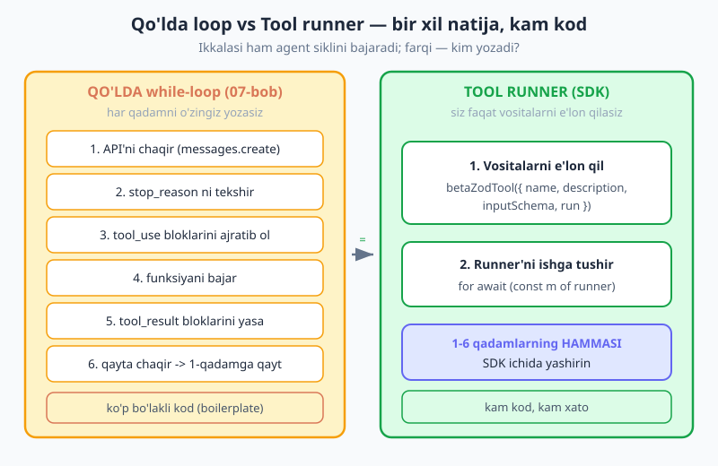
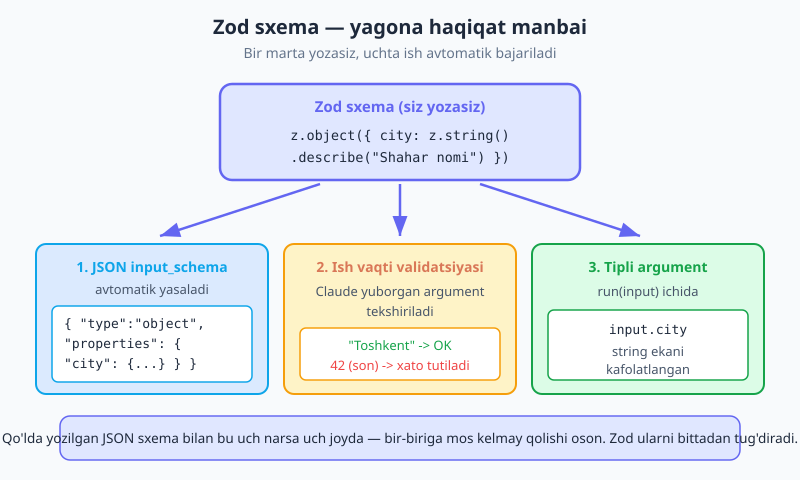
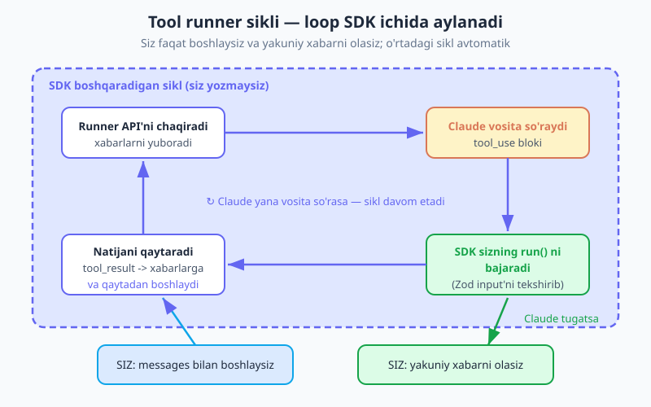

# 08 — Tool runner va Zod

[⬅️ Oldingi: 07 — Tool use (funksiya chaqirish)](./07-tool-use.md) · [🏠 README](./README.md) · [Keyingi: 09 — Vision va hujjatlar ➡️](./09-vision-fayllar.md)

---

> **Bu bobda:** 07-bobda siz **qo'lda agent loop**ni qurdingiz — `while` sikli ichida API'ni chaqirdingiz, `tool_use` bloklarini ajratib oldingiz, funksiyani bajardingiz, `tool_result` yasadingiz va qaytadan chaqirdingiz. Ishladi — lekin u takrorlanuvchi, "bo'lakli" (boilerplate) koddir. Bu bobda biz uni ikki vosita bilan yengillashtiramiz. Birinchisi — **Zod sxemalar**: qo'lda JSON `input_schema` yozish o'rniga, vositangiz argumentlarini Zod bilan ta'riflaysiz, va u sxemani avtomatik tug'diradi, tipni beradi hamda Claude yuborgan argumentni ish vaqtida tekshiradi. Ikkinchisi — Anthropic SDK'ning **tool runner**i (`betaZodTool` + `client.beta.messages.toolRunner`): siz vositalarni funksiya sifatida e'lon qilasiz, SDK esa butun siklni o'zi aylantiradi. Oxirida 07-bobdagi ob-havo + kalkulyator agentini runner bilan qaytadan quramiz — ancha qisqaroq chiqadi — va **qachon runner, qachon qo'lda loop** kerakligini aniq ajratib olamiz.

> **Halollik eslatmasi:** tool runner — `@anthropic-ai/sdk` ning **beta** xususiyati (kitob 0.104 versiyasiga tayanadi). Beta API yuzasi (surface) — aniq metod/simvol nomlari — versiyadan versiyaga o'zgarishi mumkin. Shuning uchun bu yerda men **shaklni va foydani** o'rgataman (ular barqaror), aniq nomlarni esa har doim o'rnatgan SDK'ngiz README'sidan tasdiqlang. Zod misollari **Zod v4** (`zod` 4.x) uchun; model — `claude-opus-4-8`.

---

## Nega qo'lda loop yetarli emas?

07-bobni eslang. Siz ob-havo va kalkulyator vositalarini berdingiz, keyin shunday sikl yozdingiz:

```js
// ❌ Takrorlanuvchi: har bir qadamni o'zingiz boshqarasiz (07-bob)
let messages = [{ role: "user", content: savol }];

while (true) {
  const res = await client.messages.create({ model, max_tokens: 1024, tools, messages });

  if (res.stop_reason !== "tool_use") {        // 1. to'xtash sababini tekshir
    console.log(matnniOl(res));
    break;
  }

  messages.push({ role: "assistant", content: res.content });

  const toolResults = [];
  for (const block of res.content) {           // 2. tool_use bloklarini ajrat
    if (block.type !== "tool_use") continue;
    const natija = await bajar(block.name, block.input);  // 3. funksiyani bajar
    toolResults.push({                          // 4. tool_result yasa
      type: "tool_result",
      tool_use_id: block.id,
      content: String(natija),
    });
  }

  messages.push({ role: "user", content: toolResults });   // 5. natijani qaytar
}                                                // 6. qaytadan -> while boshiga
```

Bu kod **to'g'ri** ishlaydi va siz uni tushunasiz — bu muhim. Lekin diqqat qiling: bu mantiqning **hech bir qismi sizning ilovangizga xos emas**. Har bir tool-ishlatuvchi ilovada xuddi shu olti qadam takrorlanadi: chaqir → tekshir → ajrat → bajar → yasa → qaytar. Sizning ilovangizga xos yagona narsa — vositalarning o'zi (`bajar` ichi). Qolgani — qoliplama.

Dasturlashda bunga **boilerplate** (bo'lakli, takrorlanuvchi kod) deyiladi. Va boilerplate qayerda bo'lsa, u yerda xato qilish oson: `tool_use_id` ni unutib qo'yish, `assistant` xabarini `messages`ga qo'shmaslik, `String(...)` o'rashni esdan chiqarish. Har biri jim xatoga olib keladi.

**Tool runner** aynan shu olti qadamni SDK ichiga olib kiradi. Siz vositalarni e'lon qilasiz, runner'ni ishga tushirasiz — sikl SDK ichida aylanadi.



---

## Zod — vosita sxemasini bir marta yozish

Runner'ga o'tishdan oldin, vosita argumentlarini qanday ta'riflashni yangilab olamiz. 07-bobda siz `input_schema`ni **qo'lda** JSON ko'rinishida yozgandingiz:

```js
// ❌ Qo'lda yozilgan JSON sxema — uzun va xatoga moyil
const obHavoTool = {
  name: "ob_havo",
  description: "Berilgan shahar uchun ob-havoni qaytaradi",
  input_schema: {
    type: "object",
    properties: {
      city: { type: "string", description: "Shahar nomi, masalan 'Toshkent'" },
    },
    required: ["city"],
  },
};
```

Bu ishlaydi, ammo uchta muammosi bor. **Birinchi**, u uzun va qo'l bilan yoziladi — `required` massivini ham alohida yozasiz, `properties` ichidagi tipni ham. **Ikkinchi**, sxema bilan `bajar` funksiyangiz orasida hech qanday bog'liqlik yo'q: agar siz JSON'da `city` deb yozsangiz-u, funksiyada `input.shahar` deb o'qisangiz, hech kim sizni ogohlantirmaydi. **Uchinchi**, Claude yuborgan argumentni **hech kim tekshirmaydi** — agar u qandaydir sababdan `city` o'rniga son yuborsa, kodingiz uni shundayligicha ishlatadi.

[06-bobda](./06-structured-output.md) siz strukturali chiqish uchun Zod bilan tanishgansiz. Xuddi shu Zod vositalar uchun ham ishlaydi. **Zod** (`zod`) — bu JavaScript uchun sxema kutubxonasi: siz ma'lumot shaklini bir marta yozasiz, u esa (a) TypeScript tipini, (b) ish vaqtidagi tekshiruvchini beradi. Vositalar uchun esa yana bittasi qo'shiladi: (c) JSON sxema avtomatik tug'iladi.

```js
import { z } from "zod";

// ✅ Bitta Zod sxema — yagona haqiqat manbai
const obHavoSchema = z.object({
  city: z.string().describe("Shahar nomi, masalan 'Toshkent'"),
});
```

Bu bitta sxemadan SDK uchta narsani oladi:

1. **JSON `input_schema`** — avtomatik tug'iladi. Yuqoridagi 10 qatorli qo'lda JSON endi kerak emas.
2. **Ish vaqti validatsiyasi** — Claude argument yuborganda, runner uni `obHavoSchema` ga solib tekshiradi. Agar `city` string bo'lmasa — xato toza tutiladi, kodingizga buzuq qiymat kirmaydi.
3. **Tipli argument** — `run(input)` ichida `input.city` ning string ekani kafolatlangan (TypeScript ishlatsangiz, muharrir buni biladi).

`.describe(...)` — bu shunchaki izoh emas. U JSON sxemaga `description` bo'lib tushadi, **Claude esa uni o'qiydi**. "Shahar nomi, masalan 'Toshkent'" yozsangiz, Claude argumentni to'g'riroq to'ldiradi. Maydon tavsiflari — Claude'ga beriladigan ko'rsatma; ularni puxta yozing.



> **Nega "yagona haqiqat manbai" muhim?** Qo'lda JSON sxemada bir narsa uch joyda yashaydi: JSON ichidagi tip, funksiyangiz o'qiydigan maydon nomi, va validatsiya (agar yozsangiz). Vaqt o'tib biri o'zgaradi, qolgani eskirib qoladi — bu jimgina ishlamay qolishning klassik sababidir. Zod bilan uchalasi bittadan tug'iladi, demak ular doim bir-biriga mos.

---

## Tool runner — vositani funksiya sifatida e'lon qilish

Endi vositani Zod sxema + bajaruvchi funksiya sifatida birga ta'riflaymiz. Anthropic SDK buning uchun **`betaZodTool`** yordamchisini beradi:

```js
import Anthropic, { betaZodTool } from "@anthropic-ai/sdk";
import { z } from "zod";

const client = new Anthropic();   // ANTHROPIC_API_KEY .env'dan

const obHavoTool = betaZodTool({
  name: "ob_havo",
  description: "Berilgan shahar uchun joriy ob-havoni qaytaradi",
  inputSchema: z.object({
    city: z.string().describe("Shahar nomi, masalan 'Toshkent'"),
  }),
  // run — Claude bu vositani so'raganda chaqiriladigan SIZNING funksiyangiz.
  // input allaqachon Zod orqali tekshirilgan va tipli.
  run: async (input) => {
    // Haqiqiy ilovada bu yerda ob-havo API'siga so'rov bo'lardi.
    const soxta = { Toshkent: "+28°C, ochiq", Samarqand: "+25°C, bulutli" };
    return soxta[input.city] ?? `${input.city}: ma'lumot yo'q`;
  },
});
```

E'tibor bering: `run` — bu siz 07-bobdagi `bajar` funksiyasiga o'xshash narsa, lekin endi u **vositaning o'ziga ulangan**. Vosita uchta narsani bir joyda saqlaydi: nomi, Claude o'qiydigan ta'rif/sxema, va bajariladigan kod. `run` matn (string) qaytaradi — bu Claude'ga `tool_result` sifatida boradi.

Endi bir nechta vosita yasab, runner'ni ishga tushiramiz. Kalkulyator vositasini ham qo'shamiz:

```js
const kalkulyatorTool = betaZodTool({
  name: "kalkulyator",
  description: "Ikki son ustida arifmetik amal bajaradi",
  inputSchema: z.object({
    amal: z.enum(["qoshish", "ayirish", "kopaytirish", "bolish"])
      .describe("Bajariladigan amal"),
    a: z.number().describe("Birinchi son"),
    b: z.number().describe("Ikkinchi son"),
  }),
  run: async ({ amal, a, b }) => {
    const natija = { qoshish: a + b, ayirish: a - b,
      kopaytirish: a * b, bolish: b === 0 ? null : a / b }[amal];
    return natija === null ? "Xato: nolga bo'lish" : String(natija);
  },
});

// Runner: model, max_tokens, vositalar va boshlang'ich xabarlar beriladi.
const runner = client.beta.messages.toolRunner({
  model: "claude-opus-4-8",
  max_tokens: 1024,
  tools: [obHavoTool, kalkulyatorTool],
  messages: [{ role: "user", content: "Toshkentda ob-havo qanday? Va 18 * 24 nechiga teng?" }],
});

// Runner — asinxron iterator. Har aylanada bir xabar beradi va
// Claude tugaguncha o'zi davom etadi. while/tool_result/qayta-chaqir YO'Q.
for await (const message of runner) {
  for (const block of message.content) {
    if (block.type === "text") console.log("Claude:", block.text);
  }
}
```

Mana shu — 07-bobdagi 25+ qatorli qo'lda sikl o'rniga bitta `for await`. Solishtirib ko'ring: u yerda siz `stop_reason` ni tekshirib, bloklarni ajratib, `tool_result` yasab, `messages`ni o'zingiz kengaytirgan edingiz. Bu yerda **runner buni hammasini qiladi**: API'ni chaqiradi, Claude vosita so'rasa — mos `betaZodTool`ning `run` funksiyasini topib bajaradi (avval Zod bilan input'ni tekshirib), natijani xabarlarga qo'shadi, qaytadan chaqiradi, va Claude `tool_use`'siz javob berganda to'xtaydi.



> **API yuzasi (surface) haqida.** Yuqoridagi `betaZodTool` va `client.beta.messages.toolRunner` — beta xususiyat nomlari. Ba'zi SDK versiyalarida runner'dan yakuniy natijani olishning qo'shimcha usullari ham bo'ladi (masalan `for await` tugagach so'nggi xabarni qaytaruvchi yordamchi metod). **Shakl barqaror**: "vositani sxema + `run` funksiya bilan e'lon qil, runner'ni iteratsiya qil". Aniq nomlarni o'rnatgan SDK README'ngizdan tasdiqlang — bu kitobning oltin qoidasi: taxmin qilmang, tekshiring.

---

## Validatsiya yutug'i — buzuq argumentni toza tutish

Zod'ning eng kam ko'rinadigan, lekin eng qimmatli foydasi — **validatsiya**. Claude odatda to'g'ri argument yuboradi, ammo "odatda" — kafolat emas. Murakkab sxemada, noaniq tavsifda yoki chekka holatda u kutilmagan tipni yuborishi mumkin. Qo'lda JSON sxemada bunday qiymat kodingizga **jim** kirib boradi va keyinroq, allaqachon zarar yetgan joyda portlaydi.

Zod sxemali vositada esa runner `run` ni chaqirishdan **oldin** input'ni tekshiradi. Cheklov qo'shilgan sxemaga qarang:

```js
const ulushTool = betaZodTool({
  name: "chegirma",
  description: "Narxga foizli chegirma qo'llaydi",
  inputSchema: z.object({
    narx: z.number().positive().describe("Asl narx (musbat son)"),
    foiz: z.number().min(0).max(100).describe("Chegirma foizi, 0 dan 100 gacha"),
  }),
  run: async ({ narx, foiz }) => {
    // Bu yerga faqat narx > 0 VA 0 <= foiz <= 100 bo'lganda kiriladi.
    // Validatsiyani biz qilmadik — Zod sxema avtomatik qildi.
    const yangi = narx * (1 - foiz / 100);
    return `Yangi narx: ${yangi.toFixed(2)}`;
  },
});
```

`z.number().min(0).max(100)` — bu nafaqat tipni, balki **qiymat oralig'ini** ham tekshiradi. Agar Claude `foiz: 150` yuborsa, Zod uni rad etadi va runner buni Claude'ga toza xato sifatida qaytaradi — Claude esa odatda o'zini tuzatib, to'g'ri qiymat bilan qayta uradi. Sizning `run` funksiyangiz ichiga esa **faqat to'g'ri ma'lumot** kiradi. Bu — "ishonma, tekshir" tamoyilining amaliy ko'rinishi: tashqaridan (hatto Claude'dan) kelgan har qanday ma'lumotni chegarada tekshiring.

> **Nega bu LLM'da ayniqsa muhim?** Oddiy API'da argumentlarni *siz* yuborasiz, demak ularni nazorat qilasiz. Vositalarda esa argumentlarni **model** to'ldiradi — ya'ni ehtimollik asosida. Ehtimollik 99% to'g'ri bo'lishi mumkin, lekin 1% xato real. Zod o'sha 1% ni ishlab chiqarishga yetib bormasdan tutadi.

---

## Qachon runner, qachon qo'lda loop?

Tool runner — kuchli, lekin u **hamma narsani avtomatlashtiradi**, jumladan vositalarni bajarishni ham. Ko'pincha bu aynan kerakli narsa. Ammo ba'zan sizga aralashish nuqtasi kerak bo'ladi — va aynan o'sha paytda 07-bobdagi qo'lda loop qaytib keladi.

| Holat | Tanlov | Nega |
|---|---|---|
| Oddiy, ko'p uchraydigan agent (ob-havo, qidiruv, hisob) | **Tool runner** | Kam kod, kam xato, tezroq yoziladi |
| Vosita bajarilishidan **oldin** odamdan tasdiq so'rash (human-in-the-loop) | **Qo'lda loop** | Runner avtomatik bajaradi — to'xtatib so'rash imkoni cheklangan |
| Har bir qadamni batafsil log/trace qilish, maxsus kuzatuv | **Qo'lda loop** | Sizga sikl ustidan to'liq nazorat kerak |
| Shartli bajarish (ba'zi vositani faqat ma'lum holatda ishlatish) | **Qo'lda loop** | Sikl ichida o'zingiz qaror qabul qilasiz |
| Yon ta'sirsiz, "xavfsiz" vositalar (faqat o'qish) | **Tool runner** | Avtomatik bajarish xavfsiz |

Eng muhim ajratuvchi chiziq — **yon ta'sir** (side effect). Ob-havoni o'qish xavfsiz: hech narsa o'zgarmaydi, runner uni bemalol bajarsin. Ammo "to'lovni amalga oshir", "faylni o'chir", "email yubor" kabi vositalar — bular **buzg'unchi** (destructive). Runner ularni so'rovsiz, avtomatik bajaradi. Bunday vositalarda yo qo'lda loop ishlatib, har safar tasdiq so'rang, yoki `run` ichida tasdiq mexanizmini quring.

```js
// ⚠️ Buzg'unchi vosita + runner = ehtiyot bo'ling.
// Runner buni avtomatik bajaradi — odam tasdig'isiz!
const ochirishTool = betaZodTool({
  name: "fayl_ochir",
  description: "Berilgan faylni o'chiradi",
  inputSchema: z.object({ yol: z.string().describe("Fayl yo'li") }),
  run: async ({ yol }) => {
    // Bu yerga Claude qaror qilishi bilan KELADI — siz to'xtatmaysiz.
    // Buzg'unchi amal uchun qo'lda loop'da tasdiq so'rang (07-bob).
    return `O'chirildi: ${yol}`;
  },
});
```

> **Oltin qoida.** Faqat o'qiydigan, yon ta'sirsiz vositalar uchun — runner. Pul ko'chiradigan, ma'lumot o'chiradigan yoki tashqi dunyoga o'zgartirish kirituvchi vositalar uchun — yo qo'lda loop bilan odam tasdig'i, yo `run` ichida aniq himoya. Avtomatlashtirish qulay, lekin u xavfsizlikni almashtirmaydi.

Bir bog'lanish: bu Anthropic SDK'ning runner'i. **Vercel AI SDK**ning ham o'z runner'i bor (`tool()` + `stopWhen`) — uni [12-bobda](./12-ai-sdk-structured-tools.md) ko'ramiz. Bir xil g'oya, boshqa kutubxona; qaysi biri loyihangizga mosligini keyinroq taqqoslaymiz.

---

## To'liq misol: ob-havo + kalkulyator agenti

Hammasini bir joyga yig'amiz — 07-bobdagi agentning runner + Zod varianti:

```js
import Anthropic, { betaZodTool } from "@anthropic-ai/sdk";
import { z } from "zod";

const client = new Anthropic();

const obHavo = betaZodTool({
  name: "ob_havo",
  description: "Berilgan shahar uchun joriy ob-havoni qaytaradi",
  inputSchema: z.object({
    city: z.string().describe("Shahar nomi, masalan 'Toshkent'"),
  }),
  run: async ({ city }) => {
    const db = { Toshkent: "+28°C, ochiq", Samarqand: "+25°C, bulutli" };
    return db[city] ?? `${city}: ma'lumot yo'q`;
  },
});

const kalkulyator = betaZodTool({
  name: "kalkulyator",
  description: "Ikki son ustida arifmetik amal bajaradi",
  inputSchema: z.object({
    amal: z.enum(["qoshish", "ayirish", "kopaytirish", "bolish"]).describe("Amal"),
    a: z.number().describe("Birinchi son"),
    b: z.number().describe("Ikkinchi son"),
  }),
  run: async ({ amal, a, b }) => {
    const r = { qoshish: a + b, ayirish: a - b, kopaytirish: a * b,
      bolish: b === 0 ? null : a / b }[amal];
    return r === null ? "Xato: nolga bo'lish" : String(r);
  },
});

const runner = client.beta.messages.toolRunner({
  model: "claude-opus-4-8",
  max_tokens: 1024,
  tools: [obHavo, kalkulyator],
  messages: [{
    role: "user",
    content: "Samarqandda ob-havo qanday? Va menga 144 ni 12 ga bo'lib ber.",
  }],
});

for await (const message of runner) {
  for (const block of message.content) {
    if (block.type === "text") process.stdout.write(block.text);
  }
}
```

Bu kod 07-bobdagi bilan **bir xil natija** beradi — Claude ikkala vositani chaqiradi, natijalarni oladi, yakuniy javobni yozadi — lekin sikl mantig'ining birorta qatori sizda yo'q. Sizning kodingiz endi faqat ikki narsadan iborat: **vositalar** (ilovangizga xos) va **runner'ni ishga tushirish**. Boilerplate SDK ichida.

---

## Mashqlar

> Maslahat: `run` funksiyalari sof (tarmoqsiz) bo'lsa, vositalarni Claude'siz ham, to'g'ridan-to'g'ri chaqirib sinab ko'rishingiz mumkin — bu validatsiya va mantiqni arzon tekshiradi. Runner'ning to'liq siklini esa haqiqiy API kaliti bilan ishga tushiring.

### Oson

1. **Birinchi Zod vosita.** `salomlash` nomli vosita yozing: `inputSchema` da `ism: z.string().describe("Foydalanuvchi ismi")` bo'lsin, `run` esa `"Salom, {ism}!"` qaytarsin. Uni `betaZodTool` bilan e'lon qiling va `run` ni Claude'siz to'g'ridan-to'g'ri chaqirib sinang.
2. **Qo'lda JSON'dan Zod'ga.** 07-bobning qo'lda yozilgan `input_schema`li ob-havo vositasini oling va uni Zod sxemaga aylantiring. Qaysi qatorlar yo'qoldi va nega ular endi kerak emas?

### O'rta

3. **Ikki vositali runner.** Ob-havo + kalkulyatorni bitta runner'ga bering va "Toshkentda ob-havo-chi? 7 * 6 nechi?" so'rovini yuboring. `kalkulyator` ning `amal` maydonini `z.enum([...])` bilan ta'riflang. Claude ro'yxatdan tashqari amal so'rasa, sxema buni qanday cheklaydi?
4. **Validatsiya cheklovi.** `chegirma` vositasini `narx: z.number().positive()` va `foiz: z.number().min(0).max(100)` bilan yozing. `run` ichida hech qanday tekshiruv qilmang. `foiz: 150` kelsa nima bo'ladi va nega bu xavfsiz?

### Qiyin

5. **Runner vs qo'lda — qaror + himoya.** Avval to'rt vosita uchun "runner" yoki "qo'lda loop" deb belgilang: (a) pul o'tkazish, (b) ob-havoni o'qish, (c) foydalanuvchini o'qish, (d) yozuvni o'chirish. So'ng `fayl_ochir` vositasini qo'lda loop'da, har o'chirishdan oldin terminalda "ha/yo'q" so'rab quring — runner varianti bilan xavfsizlik farqini izohlang.
6. **Tipli `run` ning foydasi (TS).** Misolni TypeScript faylda yozing va `run` ichida `input.shahar` (mavjud bo'lmagan maydon) o'qishga urinib ko'ring. `tsc` qanday ogohlantiradi? Bu qo'lda JSON sxemada ham shunday tutilarmidi?

<details markdown="1">
<summary>Yechimlar</summary>

> Eslatma: quyidagi yechimlarda `run` funksiyalari sof (tarmoqsiz) — shuning uchun ularning ko'pini Claude'siz ham, to'g'ridan-to'g'ri chaqirib sinash mumkin. Runner'ni ishga tushirish esa API kaliti talab qiladi. Beta nomlar (`betaZodTool`, `toolRunner`) — SDK README'dan tasdiqlang.

**1-mashq.**

```js
import { betaZodTool } from "@anthropic-ai/sdk";
import { z } from "zod";

const salomlash = betaZodTool({
  name: "salomlash",
  description: "Berilgan ism bilan salomlashadi",
  inputSchema: z.object({ ism: z.string().describe("Foydalanuvchi ismi") }),
  run: async ({ ism }) => `Salom, ${ism}!`,
});

// Sof sinov (Claude'siz): run'ni to'g'ridan-to'g'ri chaqiramiz
console.log(await salomlash.run({ ism: "Oqil" }));  // "Salom, Oqil!"
```

`.describe("Foydalanuvchi ismi")` matni JSON sxemaga `description` bo'lib tushadi va Claude uni o'qiydi — ya'ni izoh sizga emas, **Claude'ga** ko'rsatma. U maydonga nima kutilayotganini tushunib, argumentni to'g'riroq to'ldiradi.

**2-mashq.** Yo'qolgan qatorlar — butun qo'lda JSON bloki:

```js
// OLDIN (07-bob): qo'lda JSON
input_schema: {
  type: "object",
  properties: { city: { type: "string", description: "Shahar nomi" } },
  required: ["city"],
}

// KEYIN: Zod — bitta qator, qolgani avtomatik
inputSchema: z.object({ city: z.string().describe("Shahar nomi") })
```

`type: "object"`, `properties`, `required` massivi — hammasi Zod'dan avtomatik tug'iladi, shuning uchun ularni qo'lda yozish kerak emas. Bundan tashqari endi tip va validatsiya ham "tekin" keladi.

**3-mashq.**

```js
import Anthropic, { betaZodTool } from "@anthropic-ai/sdk";
import { z } from "zod";

const client = new Anthropic();

const obHavo = betaZodTool({
  name: "ob_havo",
  description: "Shahar uchun ob-havoni qaytaradi",
  inputSchema: z.object({ city: z.string().describe("Shahar nomi") }),
  run: async ({ city }) => `${city}: +27°C, ochiq`,
});

const kalkulyator = betaZodTool({
  name: "kalkulyator",
  description: "Ikki son ustida arifmetik amal bajaradi",
  inputSchema: z.object({
    amal: z.enum(["qoshish", "ayirish", "kopaytirish", "bolish"]).describe("Amal"),
    a: z.number(), b: z.number(),
  }),
  run: async ({ amal, a, b }) =>
    String({ qoshish: a + b, ayirish: a - b, kopaytirish: a * b, bolish: a / b }[amal]),
});

const runner = client.beta.messages.toolRunner({
  model: "claude-opus-4-8",
  max_tokens: 1024,
  tools: [obHavo, kalkulyator],
  messages: [{ role: "user", content: "Toshkentda ob-havo-chi? 7 * 6 nechi?" }],
});

for await (const message of runner) {
  for (const block of message.content) {
    if (block.type === "text") console.log(block.text);
  }
}
```

`z.enum([...])` JSON sxemaga `"enum": [...]` bo'lib tushadi — Claude ro'yxatdagi qiymatlardangina birini tanlashi kerakligini biladi va odatda chegaradan chiqmaydi. Agar negadir "ildiz" kabi tashqi qiymat kelsa, Zod validatsiyasi uni rad etadi va runner buni Claude'ga xato sifatida qaytaradi — sizning `run` ichingizga ro'yxatdan tashqari qiymat **hech qachon** yetib bormaydi.

**4-mashq.**

```js
const chegirma = betaZodTool({
  name: "chegirma",
  description: "Narxga foizli chegirma qo'llaydi",
  inputSchema: z.object({
    narx: z.number().positive().describe("Asl narx (musbat)"),
    foiz: z.number().min(0).max(100).describe("Chegirma foizi 0..100"),
  }),
  run: async ({ narx, foiz }) => `Yangi narx: ${(narx * (1 - foiz / 100)).toFixed(2)}`,
});
```

`foiz: 150` kelsa, runner `run` ni **umuman chaqirmaydi**: Zod sxema bajarilishdan oldin uni `.max(100)` ga solib tekshiradi, rad etadi va xatoni Claude'ga qaytaradi (Claude esa odatda o'zini tuzatib qayta uradi). Bu xavfsiz, chunki `run` ichiga faqat `narx > 0` va `0 <= foiz <= 100` bo'lgan qiymatlar kiradi — validatsiya kodini siz yozmadingiz, sxema o'zi qildi.

**5-mashq.** Qaror:

- (a) **Pul o'tkazish** → qo'lda loop. Buzg'unchi, qaytarib bo'lmaydigan yon ta'sir; odam tasdig'i shart.
- (b) **Ob-havoni o'qish** → runner. Faqat o'qish, yon ta'sirsiz.
- (c) **Foydalanuvchini o'qish** → runner. O'qish amali, hech narsani o'zgartirmaydi.
- (d) **Yozuvni o'chirish** → qo'lda loop. Buzg'unchi; o'chirishdan oldin tasdiq kerak.

Umumiy qoida: **o'qish — runner, yozish/o'chirish — ehtiyot.** Qo'lda loop'dagi himoya — `tool_use` blokini ko'rganda, bajarishdan **oldin** to'xtash:

```js
// Qo'lda loop ichida (07-bob naqshi), tool_use blokini ko'rganda:
if (block.name === "fayl_ochir") {
  const tasdiq = await terminaldanSora(`"${block.input.yol}" o'chirilsinmi? (ha/yo'q) `);
  if (tasdiq !== "ha") {
    toolResults.push({ type: "tool_result", tool_use_id: block.id,
      content: "Bekor qilindi: foydalanuvchi rad etdi" });
    continue;  // bajarmaymiz
  }
  // tasdiqlangandan keyingina o'chiramiz
}
```

Farq: runner buni **avtomatik** bajaradi (buzg'unchi amalda xavfli — fayl so'rovsiz o'chadi), qo'lda loop esa har qadamda **aralashish nuqtasi** beradi — bu human-in-the-loop ning mohiyati.

**6-mashq.** TypeScript faylda:

```ts
const obHavo = betaZodTool({
  name: "ob_havo",
  description: "Shahar uchun ob-havo",
  inputSchema: z.object({ city: z.string().describe("Shahar nomi") }),
  run: async (input) => {
    return `${input.shahar}: ochiq`;  // ❌ tsc: 'shahar' mavjud emas
  },
});
```

`tsc` xato beradi: `Property 'shahar' does not exist on type '{ city: string }'`. Sababi — `input` ning tipi `inputSchema` dan **avtomatik chiqariladi** (inferred). Qo'lda yozilgan JSON sxemada bu tutilmas edi: JSON shunchaki ma'lumot, undan TypeScript tip chiqarmaydi — `input.shahar` `undefined` bo'lib jimgina o'tib ketardi va xato faqat ish vaqtida, allaqachon kech, ko'rinardi. Bu — Zod'ning yana bir yutug'i: tipli `run` xatoni yozish paytidayoq tutadi.

</details>

---

[⬅️ Oldingi: 07 — Tool use (funksiya chaqirish)](./07-tool-use.md) · [🏠 README](./README.md) · [Keyingi: 09 — Vision va hujjatlar ➡️](./09-vision-fayllar.md)
