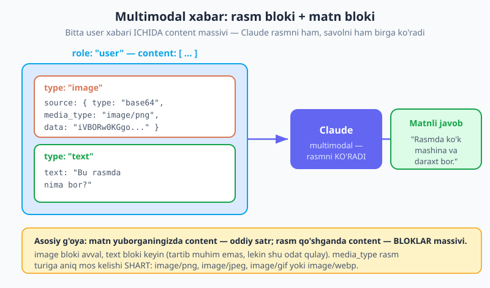
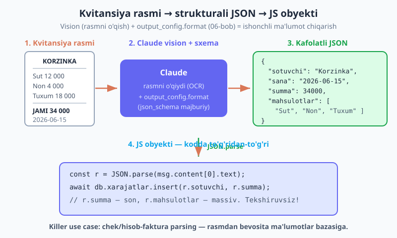
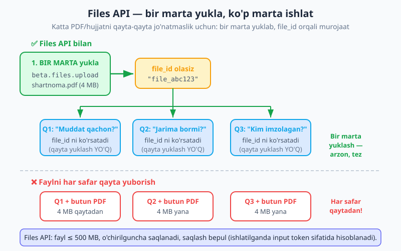

# 09 — Vision va hujjatlar

[⬅️ Oldingi: 08 — Tool runner va Zod](./08-tool-runner-zod.md) · [🏠 README](./README.md) · [Keyingi: 10 — Adaptiv thinking va effort ➡️](./10-thinking-effort.md)

---

> **Bu bobda:** shu paytgacha biz Claude'ga faqat **matn** yuborib keldik. Lekin Claude **multimodal** — ya'ni u nafaqat matnni o'qiydi, balki rasmlarni ham **ko'radi** va PDF/hujjatlarni o'qiydi. Bu butun bir dunyoni ochadi: chek va hisob-fakturalardan ma'lumot chiqarish (OCR), rasmni tasvirlash, diagramma va grafiklarni tahlil qilish, shartnomalarni o'qish, ko'rish imkoniyati cheklangan foydalanuvchilar uchun `alt` matn yozish. Biz rasmni Node'da `base64` ko'rinishida (va URL orqali) qanday yuborishni, rasmdan **strukturali JSON** chiqarishni (06-bob bilan birlashtirib — bu chinakam "killer" use case), PDF/hujjatlarni `document` bloki sifatida jo'natishni va **Files API** (beta) bilan bitta faylni bir marta yuklab, uni ko'plab so'rovlarda qayta-qayta ishlatishni o'rganamiz. Yakunda chek tahlilchisi (rasm → strukturali JSON) va "PDF bilan suhbat" quramiz.

> **Halollik eslatmasi:** bu bobdagi API shakllari — `image` bloki (`base64`/`url`), `media_type` qiymatlari (jpeg/png/gif/webp), `document` bloki, `client.beta.files.upload()` va `{ type:"document", source:{ type:"file", file_id } }` murojaati — `@anthropic-ai/sdk` **0.104** ga asoslangan va Anthropic hujjatiga muvofiq yozilgan. Lekin rasm/PDF bilan ishlash **haqiqiy fayl, API kaliti va tarmoq** talab qiladi — shuning uchun ushbu bobdagi chaqiruvlar jonli ijro emas, balki to'g'ri tuzilgan misollardir. Har bir misolni o'z rasmingiz/PDF'ingiz bilan ishga tushiring. Files API'ning beta sarlavhasini (`files-api-2025-04-14`) SDK o'zi qo'yadi — siz `client.beta.files` orqali chaqirsangiz, qo'lda sarlavha qo'shish shart emas.

---

## Nega multimodal? — Claude rasmni "ko'radi"

Tasavvur qiling, foydalanuvchi ilovangizga do'kon chekining suratini yuboradi va siz undan summani, sotuvchini va mahsulotlar ro'yxatini ajratib olmoqchisiz. Eski yo'l — alohida OCR (Optical Character Recognition — rasmda matnni aniqlash) kutubxonasini ulash, keyin chiqqan "xom" matnni qoidalar bilan parchalash. Bu murakkab, mo'rt va har xil chek formatida sinadi.

**Multimodal model** bu ishni bir qadamda qiladi. *Multimodal* degani — model bir necha turdagi kirishni (matn + rasm + hujjat) birga tushunadi. Claude'ga rasmni va savolni birga berasiz, u esa rasmni **ko'rib**, savolingizga javob beradi. Hech qanday alohida OCR kutubxonasi kerak emas.

Bu nima imkon beradi:

- **OCR / ma'lumot chiqarish** — chek, pasport, ariza, blank va jadval rasmlaridan tuzilgan ma'lumot olish.
- **Tasvirlash / izohlash (captioning)** — rasmda nima borligini matn bilan aytib berish.
- **Grafik/diagramma tahlili** — chart, ER-diagramma, arxitektura sxemasini "o'qish".
- **PDF/shartnoma o'qish** — uzun hujjatdan kerakli bandni topish, savol-javob.
- **Accessibility** — rasm uchun `alt` matn generatsiya qilib, ko'rish imkoniyati cheklangan foydalanuvchilarga yordam berish.

Asosiy o'zgarish bitta: avval xabarning `content` maydoni oddiy **satr** edi. Endi rasm qo'shganimizda u **bloklar massiviga** aylanadi — bittasi rasm bloki, bittasi matn bloki.



---

## Rasm yuborish: `base64` (lokal fayl)

Eng keng tarqalgan holat — diskdagi rasmni yuborish. Node'da faylni o'qiymiz, uni `base64` matniga aylantiramiz va `image` bloki sifatida jo'natamiz.

*base64* — bu ikkilik (binary) ma'lumotni (rasm baytlarini) faqat oddiy matn belgilaridan iborat satrga aylantirish usuli. JSON faqat matnni tashiy oladi, shuning uchun rasmni JSON ichida yuborish uchun avval uni base64 satriga aylantiramiz.

```js
import Anthropic from "@anthropic-ai/sdk";
import fs from "node:fs";

const client = new Anthropic(); // ANTHROPIC_API_KEY .env dan (02-bob)

// 1) Rasmni o'qib, base64 satriga aylantiramiz
const data = fs.readFileSync("kvitansiya.png").toString("base64");

// 2) content — endi BLOKLAR massivi: rasm bloki + matn bloki
const msg = await client.messages.create({
  model: "claude-opus-4-8",
  max_tokens: 1024,
  messages: [
    {
      role: "user",
      content: [
        {
          type: "image",
          source: {
            type: "base64",
            media_type: "image/png", // rasm turiga ANIQ mos kelishi shart
            data,                     // base64 satri
          },
        },
        { type: "text", text: "Bu kvitansiyadagi umumiy summani ayt." },
      ],
    },
  ],
});

console.log(msg.content[0].text);
```

Bu yerda har bir qismni tushunib olaylik:

- **`content` — massiv.** Matnli xabarda `content: "salom"` deb yozardik; rasm bo'lsa, `content` ichida bloklar bo'ladi. Siz bir nechta rasm va matn blokini ham aralashtirishingiz mumkin (masalan ikki rasmni solishtirish so'rovi).
- **`type: "image"`** — bu blok rasm ekanini bildiradi.
- **`source.type: "base64"`** — rasm ma'lumoti to'g'ridan-to'g'ri base64 satrida kelyapti (URL emas).
- **`media_type`** — rasmning aniq turi. Bu rasm formatiga **to'g'ri** mos kelishi shart. Qo'llab-quvvatlanadiganlar: `image/jpeg`, `image/png`, `image/gif`, `image/webp`. PNG faylga `image/jpeg` qo'ysangiz, xato olasiz.
- **`data`** — base64 satrining o'zi (boshida `data:` yoki sarlavha bo'lmasdan, faqat toza base64).

> **Diqqat — `media_type` ni to'g'ri bering.** Eng ko'p uchraydigan birinchi xato — fayl `.png`, lekin `media_type: "image/jpeg"` yozib qo'yish (yoki aksincha). Agar fayl uzaytmasiga ishonmasangiz, uni dinamik aniqlang: `const ext = path.extname(fayl).slice(1); const mt = ext === "jpg" ? "image/jpeg" : \`image/${ext}\`;` — yoki `file-type` kutubxonasi bilan haqiqiy turni o'qing.

---

## Rasm yuborish: URL (allaqachon internetda bo'lsa)

Agar rasm allaqachon internetda joylashgan bo'lsa (masalan sizning S3/CDN'ingizda), uni base64 ga aylantirish shart emas — to'g'ridan-to'g'ri URL bering. Bu kodni soddalashtiradi va siz katta base64 satrini jo'natmaysiz.

```js
const msg = await client.messages.create({
  model: "claude-opus-4-8",
  max_tokens: 512,
  messages: [
    {
      role: "user",
      content: [
        {
          type: "image",
          source: {
            type: "url", // base64 EMAS — manzil
            url: "https://example.com/rasmlar/diagramma.png",
          },
        },
        { type: "text", text: "Bu diagrammada qaysi xizmatlar bir-biriga bog'langan?" },
      ],
    },
  ],
});
```

`url` rejimida `media_type` shart emas — Anthropic rasmni o'zi yuklab, turini aniqlaydi. URL ommaviy (public) bo'lishi kerak: Anthropic serveri unga kira olishi shart. Maxfiy yoki lokal (`localhost`) URL ishlamaydi — bunday hollarda base64'dan foydalaning.

> **Eslatma — qaysi birini tanlash?** Rasm diskda yoki foydalanuvchidan yuklangan bo'lsa — **base64**. Rasm allaqachon ommaviy URL'da bo'lsa — **url** (qulayroq, kichikroq so'rov). Maxfiy ma'lumotli rasmni umumiy URL'ga qo'ymang — base64 bilan to'g'ridan-to'g'ri yuboring.

---

## Rasmdan strukturali JSON (06-bob bilan birlashtirib)

Mana endi haqiqiy kuch. [06-bobda](./06-structured-output.md) biz `output_config.format` (`json_schema`) bilan modelni **majburiy JSON shaklga** soldik. Buni vision bilan birlashtiramiz: rasmni yuboramiz, lekin javobni erkin matn emas, balki aniq sxemaga mos JSON qilib so'raymiz. Natija — chek rasmidan to'g'ridan-to'g'ri `{ sotuvchi, sana, summa, mahsulotlar }` obyekti.

Bu **chek/hisob-faktura parsing** — eng amaliy use case'lardan biri. Rasm kiradi, kodda ishonib ishlatsa bo'ladigan obyekt chiqadi.



```js
import Anthropic from "@anthropic-ai/sdk";
import fs from "node:fs";

const client = new Anthropic();
const data = fs.readFileSync("kvitansiya.png").toString("base64");

const msg = await client.messages.create({
  model: "claude-opus-4-8",
  max_tokens: 1024,
  messages: [
    {
      role: "user",
      content: [
        { type: "image", source: { type: "base64", media_type: "image/png", data } },
        { type: "text", text: "Ushbu kvitansiyadan ma'lumotlarni ajratib ber." },
      ],
    },
  ],
  // 06-bobdagi kabi: chiqishni majburiy JSON shaklga solamiz
  output_config: {
    format: {
      type: "json_schema",
      schema: {
        type: "object",
        properties: {
          sotuvchi: { type: "string", description: "Do'kon yoki sotuvchi nomi" },
          sana: { type: "string", description: "Chek sanasi (YYYY-MM-DD)" },
          summa: { type: "number", description: "Umumiy summa (so'mda, son)" },
          mahsulotlar: {
            type: "array",
            items: { type: "string" },
            description: "Sotib olingan mahsulotlar nomlari",
          },
        },
        required: ["sotuvchi", "sana", "summa", "mahsulotlar"],
        additionalProperties: false,
      },
    },
  },
});

// Sxema-cheklangani uchun bemalol parse qilamiz
const chek = JSON.parse(msg.content[0].text);
console.log(chek.sotuvchi);        // "Korzinka"
console.log(chek.summa);           // 34000  (haqiqiy son, satr emas)
console.log(chek.mahsulotlar);     // ["Sut", "Non", "Tuxum"]

// Endi to'g'ridan-to'g'ri ma'lumotlar bazasiga yozsa bo'ladi
// await db.xarajatlar.insert({ sotuvchi: chek.sotuvchi, summa: chek.summa });
```

Diqqat qiling: `summa` — `number` deb e'lon qilingani uchun model uni `"34000"` satr emas, `34000` son qilib qaytaradi. Sxema "qolip" vazifasini bajaradi — model rasmda nimani ko'rsa ham, javobni shu qolipga **majburan** moslaydi. Shuning uchun `JSON.parse` xavfsiz: tipli, ishonib ishlatsa bo'ladigan obyekt olasiz.

> **Eslatma — Zod bilan ham mumkin.** 06-bobda ko'rganimizdek, sxemani qo'lda yozish o'rniga Zod sxema + `messages.parse()` ishlatib, tipli (`z.infer`) natija olishingiz mumkin. Vision bilan ham xuddi shunday: `content` ichida `image` bloki, qolgani — 06-bobdagidek. Sxemani Zod'da yozish katta loyihada toza va xato kamroq bo'ladi.

---

## PDF va hujjatlar: `document` bloki

Rasm yagona variant emas. Claude **PDF va matnli hujjatlarni** ham o'qiy oladi — buning uchun `document` bloki bor. Eng oddiy holatda PDF'ni xuddi rasm kabi base64 qilib yuborasiz, faqat `type: "document"` bilan:

```js
import fs from "node:fs";

const pdfData = fs.readFileSync("shartnoma.pdf").toString("base64");

const msg = await client.messages.create({
  model: "claude-opus-4-8",
  max_tokens: 1024,
  messages: [
    {
      role: "user",
      content: [
        {
          type: "document",
          source: {
            type: "base64",
            media_type: "application/pdf",
            data: pdfData,
          },
        },
        { type: "text", text: "Bu shartnomadagi to'lov muddati qachon?" },
      ],
    },
  ],
});

console.log(msg.content[0].text);
```

Bu bitta savol uchun yetarli. Lekin agar **bir hujjat haqida bir nechta savol** bersangiz, har safar 4 MB PDF'ni qaytadan jo'natish — pul va vaqt isrofi. Mana shu yerda Files API yordamga keladi.

---

## Files API (beta): bir marta yukla, ko'p marta ishlat

**Files API** bilan siz faylni Anthropic'ga **bir marta** yuklaysiz, qaytib `file_id` olasiz, keyin o'sha `file_id` ni xohlagancha xabarda **qayta yuklamasdan** ishlatasiz. Faylni har safar qayta jo'natishdan ko'ra arzon, tez va toza.



```js
import Anthropic from "@anthropic-ai/sdk";
import fs from "node:fs";

const client = new Anthropic();

// 1) PDF ni BIR MARTA yuklaymiz -> file_id olamiz
//    (beta sarlavhasini SDK o'zi qo'yadi — `files-api-2025-04-14`)
const uploaded = await client.beta.files.upload({
  file: fs.createReadStream("shartnoma.pdf"),
});
const fileId = uploaded.id; // masalan "file_abc123..."

// 2) Bir hujjat haqida UCH savol — faqat file_id ni ko'rsatamiz, qayta yuklamaymiz
async function sora(savol) {
  const msg = await client.beta.messages.create({
    model: "claude-opus-4-8",
    max_tokens: 1024,
    messages: [
      {
        role: "user",
        content: [
          { type: "document", source: { type: "file", file_id: fileId } },
          { type: "text", text: savol },
        ],
      },
    ],
  });
  return msg.content[0].text;
}

console.log("Q1:", await sora("To'lov muddati qachon?"));
console.log("Q2:", await sora("Kechikkanda jarima bormi?"));
console.log("Q3:", await sora("Shartnomani kim imzolagan?"));
```

E'tibor bering — `shartnoma.pdf` faqat **bir marta** o'qildi va yuklandi. Uch savol esa shunchaki bir xil `file_id` ga murojaat qiladi. Agar `document` blokini har safar base64 bilan to'ldirsangiz, 4 MB fayl uch marta jo'natilardi.

Files API haqida bilish kerak bo'lgan asosiy faktlar:

- **Hajm:** fayl 500 MB gacha bo'lishi mumkin.
- **Saqlanish:** fayl siz **o'chirmaguningizcha** Anthropic'da saqlanadi (`client.beta.files.delete(fileId)`).
- **Narx:** faylni saqlash **bepul**. Lekin uni xabarda ishlatsangiz — o'sha so'rovda **input token** sifatida hisoblanadi (xuddi base64 bilan yuborgandek). Ya'ni Files API yuklash takrorini tejaydi, token narxini emas.
- **Beta sarlavha:** `files-api-2025-04-14` — buni SDK `client.beta.files` va `client.beta.messages` orqali o'zi qo'yadi, qo'lda yozish shart emas.

> **Qachon Files API, qachon base64?** Faylni **bir marta** ishlatsangiz (bitta savol) — base64 sodda. Bir faylga **ko'p marta** murojaat qilsangiz (PDF bilan suhbat, bir hujjatga ko'p savol, ko'p foydalanuvchi bir hujjatni so'rasa) — Files API. Aslida bu "PDF bilan suhbat" ilovasining poydevori: bir marta yuklab, keyin foydalanuvchi xohlagancha savol beradi.

---

## Rasm narxi: tokenlar va o'lcham

Rasmlar bepul emas — ular **input token** iste'mol qiladi, va token soni rasm o'lchamiga (piksel soniga) taxminan proporsional. Katta, yuqori aniqlikdagi rasm ko'p token "yeydi". To'liq aniqlik kerak bo'lmasa (masalan, faqat "bu chekmi yoki hisob-fakturami?" deb tasniflash), rasmni jo'natishdan oldin **kichraytiring** (downsample) — `sharp` kabi kutubxona bilan:

```js
import sharp from "sharp";

// Katta rasmni jo'natishdan oldin kichraytiramiz -> kamroq token
const kichik = await sharp("katta-rasm.jpg")
  .resize({ width: 1024 }) // eni 1024 px (balandlik proporsional)
  .toBuffer();
const data = kichik.toString("base64");
```

Token narxi va uni hisoblash — alohida mavzu; biz unga [14 — Token, narx va limitlar](./14-token-narx-limit.md) bobida batafsil qaytamiz. Hozircha qoidani eslab qoling: **kerak bo'lmagan aniqlik = bekorga token = bekorga pul.**

---

## Tuzoqlar va ehtiyotkorlik

| Muammo | Sabab | Yechim |
|---|---|---|
| "Invalid media type" xatosi | `media_type` rasm turiga mos kelmaydi (`.png` ga `image/jpeg`) | Faylni dinamik aniqlang yoki `file-type` bilan haqiqiy turni o'qing |
| URL rasmi ishlamaydi | URL ommaviy emas (`localhost`/maxfiy) | Ommaviy URL bering yoki base64'dan foydalaning |
| Juda katta rasm — sekin/qimmat/limit | Yuqori aniqlikdagi rasm ko'p token yeydi | Jo'natishdan oldin `resize` bilan kichraytiring (14-bob) |
| Xira/buloq rasmda OCR xato | Model ham, OCR ham mukammal emas | Aniq, yorug', to'g'ri burchakli rasm bering; kritik raqamlarni qo'lda tekshiring |
| PII (shaxsiy ma'lumot) rasmda | Pasport, karta, tibbiy hujjat rasmlari | Nimani yuborayotganingizga ehtiyot bo'ling; kerak bo'lmasa yubormang, niqoblang |
| Har savolda PDF qayta yuklanadi | `document` har safar base64 bilan to'ldirilgan | Files API: bir marta `upload`, keyin `file_id` |
| `content` satr sifatida yuborilgan | Rasm qo'shganda `content` massiv bo'lishi kerak | `content: [ {type:"image"...}, {type:"text"...} ]` |

> **Diqqat — maxfiy ma'lumot (PII).** Pasport, bank kartasi, tibbiy hujjat yoki shaxsiy ma'lumotli rasmlarni Claude'ga yuborganingizda — bu ma'lumot API orqali o'tadi. Faqat haqiqatan kerak bo'lgan narsani yuboring, kerakmas qismni niqoblang (masalan kartaning faqat oxirgi 4 raqami), va foydalanuvchidan ruxsat oling. Maxfiylik — xususiyat emas, mas'uliyat. Buni xavfsizlik bobida ([22 — Xavfsizlik](./README.md)) yana ko'ramiz.

---

## Mashqlar

Mashqlarning ko'pi haqiqiy rasm/PDF talab qiladi — o'zingizning fayllaringiz bilan ishlang. API kaliti kerak bo'lgan joyni izohda belgilab qo'ydik.

### Oson

1. **Rasm tasvirlash.** Bir rasmni base64 bilan yuboring va "Bu rasmda nima bor? O'zbekcha tasvirla" deb so'rang. `content` ni to'g'ri (massiv) tuzganingizga ishonch hosil qiling.
2. **`media_type` ni to'g'rilang.** Bir `.jpg` faylga atayin `media_type: "image/png"` qo'yib yuboring. Qanday xato chiqadi? Keyin to'g'rilang. Nega format aniq mos kelishi kerakligini tushuning.
3. **URL bilan.** Ommaviy URL'dagi bir rasmni `source: { type:"url", url }` bilan yuboring. Bu base64 variantidan nimasi bilan soddaroq?

### O'rta

4. **Chek tahlilchisi.** Chek rasmidan `output_config.format` bilan `{ sotuvchi, sana, summa, mahsulotlar }` JSON chiqaring. `summa` haqiqatan `number` ekanini (satr emas) tekshiring.
5. **`alt` matn generatori.** Bir rasm uchun qisqa (1 jumla) `alt` matn so'rang — accessibility uchun. Javobni HTML `` ga qo'ying.
6. **Ikki rasmni solishtirish.** Bitta `content` massiviga **ikkita** `image` bloki + bitta matn bloki ("Bu ikki rasmning farqi nima?") qo'ying. Model ikkala rasmni ham ko'rishini tasdiqlang.

### Qiyin

7. **PDF bilan suhbat (Files API).** Bir PDF'ni `beta.files.upload` bilan bir marta yuklang, `file_id` oling. So'ng `file_id` ga 3 ta turli savol bering (qayta yuklamasdan). Yuklash aynan bir marta bo'lganini kodda ko'rsating.
8. **Kichraytirish bilan tejash.** Katta rasmni avval `sharp` bilan `resize({ width: 1024 })` qiling, keyin yuboring. `usage.input_tokens` ni kichraytirilmagan variant bilan solishtiring (token tejaganini ko'ring).
9. **Hisob-faktura → bazaga.** 4-mashqdagi chek parserini Zod sxema + `messages.parse()` (06-bob) bilan qayta yozing, natijani "soxta DB" massiviga `insert` qiling. PII (agar bo'lsa) yubormaslikka e'tibor bering.

<details markdown="1">
<summary>Yechimlar</summary>

> Quyidagi yechimlar `ANTHROPIC_API_KEY` (.env) va haqiqiy fayl talab qiladi. `client` — `new Anthropic()` (02-bob). Fayl nomlarini o'zingiznikiga moslang.

### 1-mashq yechimi

```js
import fs from "node:fs";
const data = fs.readFileSync("rasm.png").toString("base64");
const msg = await client.messages.create({
  model: "claude-opus-4-8",
  max_tokens: 512,
  messages: [
    { role: "user", content: [
      { type: "image", source: { type: "base64", media_type: "image/png", data } },
      { type: "text", text: "Bu rasmda nima bor? O'zbekcha tasvirla." },
    ]},
  ],
});
console.log(msg.content[0].text);
```

Asosiysi: `content` — massiv, ichida rasm bloki va matn bloki. Oddiy satr ishlamaydi.

### 2-mashq yechimi

```js
const data = fs.readFileSync("rasm.jpg").toString("base64");
// ❌ Noto'g'ri: fayl .jpg, lekin media_type png
//    -> "Invalid media type" turidagi xato
// { type:"image", source:{ type:"base64", media_type:"image/png", data } }

// ✅ To'g'ri: turi faylga mos
const blok = { type: "image", source: { type: "base64", media_type: "image/jpeg", data } };
```

`media_type` faylning haqiqiy formatiga aniq mos kelishi shart — Anthropic uni baytlarni dekod qilish uchun ishlatadi.

### 3-mashq yechimi

```js
const msg = await client.messages.create({
  model: "claude-opus-4-8",
  max_tokens: 512,
  messages: [
    { role: "user", content: [
      { type: "image", source: { type: "url", url: "https://upload.wikimedia.org/.../misol.png" } },
      { type: "text", text: "Bu rasmda nima bor?" },
    ]},
  ],
});
```

URL variantida `media_type` shart emas (Anthropic o'zi aniqlaydi) va katta base64 satrini jo'natmaysiz — so'rov kichikroq, kod soddaroq. Ammo URL ommaviy bo'lishi kerak.

### 4-mashq yechimi

```js
const data = fs.readFileSync("chek.png").toString("base64");
const msg = await client.messages.create({
  model: "claude-opus-4-8",
  max_tokens: 1024,
  messages: [
    { role: "user", content: [
      { type: "image", source: { type: "base64", media_type: "image/png", data } },
      { type: "text", text: "Chekdan ma'lumotlarni ajratib ber." },
    ]},
  ],
  output_config: { format: { type: "json_schema", schema: {
    type: "object",
    properties: {
      sotuvchi: { type: "string" },
      sana: { type: "string" },
      summa: { type: "number" },
      mahsulotlar: { type: "array", items: { type: "string" } },
    },
    required: ["sotuvchi", "sana", "summa", "mahsulotlar"],
    additionalProperties: false,
  }}},
});
const chek = JSON.parse(msg.content[0].text);
console.log(typeof chek.summa); // "number" — satr emas!
```

Sxemada `summa: { type: "number" }` bo'lgani uchun model uni son qilib qaytaradi. Vision + 06-bobdagi strukturali chiqish birga — chek parsing'ning yadrosi.

### 5-mashq yechimi

```js
const data = fs.readFileSync("mahsulot.jpg").toString("base64");
const msg = await client.messages.create({
  model: "claude-opus-4-8",
  max_tokens: 200,
  messages: [
    { role: "user", content: [
      { type: "image", source: { type: "base64", media_type: "image/jpeg", data } },
      { type: "text", text: "Bu rasm uchun qisqa, bir jumlali alt matn yoz (accessibility uchun)." },
    ]},
  ],
});
const alt = msg.content[0].text.trim();
const html = ``;
console.log(html);
```

`alt` matn — ko'rish imkoniyati cheklangan foydalanuvchilar uchun. Bu vision'ning to'g'ridan-to'g'ri ijtimoiy foydasi.

### 6-mashq yechimi

```js
const a = fs.readFileSync("oldin.png").toString("base64");
const b = fs.readFileSync("keyin.png").toString("base64");
const msg = await client.messages.create({
  model: "claude-opus-4-8",
  max_tokens: 512,
  messages: [
    { role: "user", content: [
      { type: "image", source: { type: "base64", media_type: "image/png", data: a } },
      { type: "image", source: { type: "base64", media_type: "image/png", data: b } },
      { type: "text", text: "Bu ikki rasmning farqi nima?" },
    ]},
  ],
});
console.log(msg.content[0].text);
```

Bitta `content` massivida bir nechta rasm bo'lishi mumkin — model hammasini birga ko'radi. Faqat ikki rasm ko'p token yeyishini unutmang.

### 7-mashq yechimi

```js
import fs from "node:fs";

// BIR MARTA yuklaymiz
const uploaded = await client.beta.files.upload({
  file: fs.createReadStream("hujjat.pdf"),
});
const fileId = uploaded.id;
console.log("Yuklandi (bir marta):", fileId);

async function sora(savol) {
  const msg = await client.beta.messages.create({
    model: "claude-opus-4-8",
    max_tokens: 1024,
    messages: [
      { role: "user", content: [
        { type: "document", source: { type: "file", file_id: fileId } },
        { type: "text", text: savol },
      ]},
    ],
  });
  return msg.content[0].text;
}

console.log(await sora("Hujjat nima haqida?"));
console.log(await sora("Asosiy sanalarni sana."));
console.log(await sora("Kim mas'ul shaxs?"));
// upload() faqat BIR marta chaqirildi; uch savol bir xil file_id ga murojaat qildi.
```

Files API'ning butun foydasi shu: katta faylni qayta-qayta jo'natmaslik. "PDF bilan suhbat" ilovasi aynan shu naqsh ustiga quriladi.

### 8-mashq yechimi

```js
import sharp from "sharp";

// Kichraytirilgan variant
const kichik = (await sharp("katta.jpg").resize({ width: 1024 }).toBuffer()).toString("base64");
const m1 = await client.messages.create({
  model: "claude-opus-4-8", max_tokens: 300,
  messages: [{ role: "user", content: [
    { type: "image", source: { type: "base64", media_type: "image/jpeg", data: kichik } },
    { type: "text", text: "Bu nima?" },
  ]}],
});
console.log("Kichik input_tokens:", m1.usage.input_tokens);

// Kichraytirilmagan variant bilan solishtiring — input_tokens kamayadi.
```

Rasm o'lchami token soniga ta'sir qiladi. To'liq aniqlik kerak bo'lmaganda kichraytirish — bevosita tejash (14-bob).

### 9-mashq yechimi

```js
import { z } from "zod";

const Chek = z.object({
  sotuvchi: z.string(),
  sana: z.string(),
  summa: z.number(),
  mahsulotlar: z.array(z.string()),
});

const data = fs.readFileSync("chek.png").toString("base64");
const msg = await client.messages.parse({
  model: "claude-opus-4-8",
  max_tokens: 1024,
  messages: [
    { role: "user", content: [
      { type: "image", source: { type: "base64", media_type: "image/png", data } },
      { type: "text", text: "Chekdan ma'lumotlarni ajratib ber." },
    ]},
  ],
  output_config: { format: Chek }, // 06-bobdagi Zod naqshi
});

const baza = []; // "soxta DB"
baza.push(msg.parsed); // msg.parsed — Chek tipi bilan tiplangan
console.log(baza[0].summa); // number, ishonib ishlatsa bo'ladi
```

Zod + `messages.parse()` (06-bob) vision bilan birga ishlaydi: `content` ichida rasm bloki, qolgani o'sha-o'sha. `msg.parsed` allaqachon validatsiyadan o'tgan, tipli obyekt. PII bo'lsa, uni bazaga yozishdan oldin niqoblang.

</details>

---

> **Keyingi qadam.** Endi Claude faqat matnni emas, **rasm va hujjatlarni ham** "ko'radi" — bu OCR, chek parsing, PDF-savol-javob va accessibility eshigini ochadi. Rasmdan strukturali JSON olish — 06-bobdagi `output_config.format` ni vision bilan birlashtirishning natijasi, Files API esa bir faylni samarali qayta ishlatish yo'li. Rasm narxi (token) haqida [14 — Token, narx va limitlar](./14-token-narx-limit.md) bobida batafsil gaplashamiz. Keyingi bobda esa Claude Opus 4.8 ning **adaptiv thinking** va `effort` sozlamalarini — modelni qachon chuqurroq "o'ylashga" majburlashni — o'rganamiz.

---

[⬅️ Oldingi: 08 — Tool runner va Zod](./08-tool-runner-zod.md) · [🏠 README](./README.md) · [Keyingi: 10 — Adaptiv thinking va effort ➡️](./10-thinking-effort.md)
