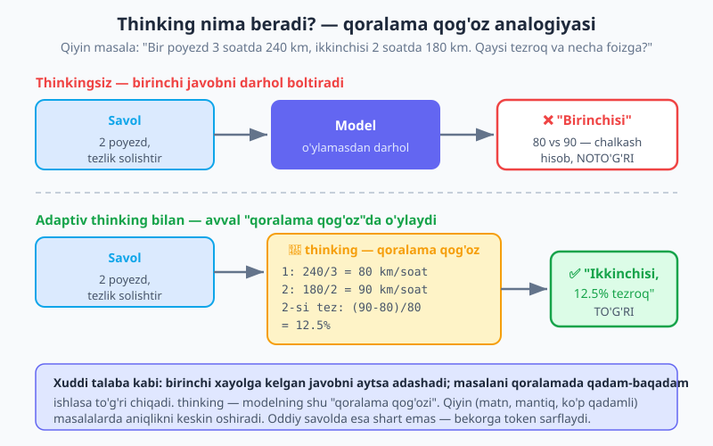
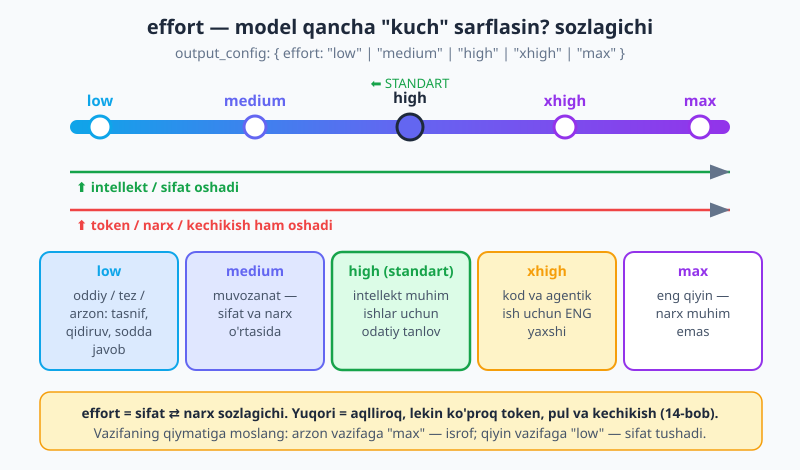
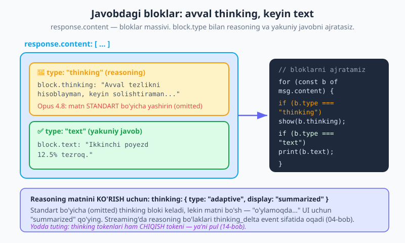

# 10 — Adaptiv thinking va effort

[⬅️ Oldingi: 09 — Vision va hujjatlar](./09-vision-fayllar.md) · [🏠 README](./README.md) · [Keyingi: 11 — Vercel AI SDK bilan tanishuv ➡️](./11-vercel-ai-sdk-kirish.md)

---

> **Bu bobda:** shu paytgacha biz Claude'dan javobni **darhol** so'rab keldik. Lekin qiyin masalalarda — ko'p qadamli matematika, mantiq, rejalashtirish, murakkab kod — modelga javob berishdan **oldin "o'ylash"** imkonini bersangiz, aniqlik keskin oshadi. Bu **extended/adaptiv thinking**. Claude Opus 4.8'da bu `thinking: { type: "adaptive" }` orqali yoqiladi — model **qachon va qancha** o'ylashni o'zi hal qiladi (eski `budget_tokens` g'oyasi olib tashlangan). Keyin `effort` sozlagichini — modelning qancha "kuch" sarflashini (`low`/`medium`/`high`/`xhigh`/`max`) — o'rganamiz. Reasoning matnini qanday **ko'rsatish** (`display: "summarized"`), uni `thinking` bloklaridan ajratish, va streaming'da `thinking_delta` bilan jonli "o'ylamoqda..." indikatorini chiqarishni ko'ramiz. Eng muhimi: **qachon thinking/high effort kerak, qachon yo'q** — chunki bu sifat ⇄ narx sozlagichi. Yakunda adaptiv thinking + high effort bilan matematik/mantiqiy yechuvchi va low effort'li sodda tasniflagichni quramiz.
>
> **Halollik eslatmasi:** bobdagi API shakllari — `thinking: { type: "adaptive" }`, `thinking: { type: "adaptive", display: "summarized" }`, `output_config: { effort: ... }`, javobdagi `type === "thinking"` bloklari (`block.thinking`) va streaming'dagi `thinking_delta` event — `@anthropic-ai/sdk` **v0.104** va Claude Opus 4.8 ga asoslangan. **Eng muhim ogohlantirish:** Opus 4.8'da `thinking: { type: "enabled", budget_tokens: N }` **olib tashlangan** — uni yuborsangiz **400 xato** olasiz. Shuningdek `temperature`/`top_p`/`top_k` ham olib tashlangan (400). Bular o'ylab topilgani emas — Opus 4.8 ning haqiqiy talabi.

---

## 1. Nega thinking? — qoralama qog'oz analogiyasi

Tasavvur qiling, talabaga qiyin matematik masala berildi: *"Bir poyezd 3 soatda 240 km, ikkinchisi 2 soatda 180 km yurdi. Qaysi tezroq va necha foizga?"*

Bir talaba birinchi xayolga kelgan javobni **boltirib** yuboradi: "Birinchisi tezroq, chunki ko'proq yurgan." Bu xato — u masofani tezlik bilan aralashtirdi.

Ikkinchi talaba esa avval **qoralama qog'ozda** ishlaydi: `240/3 = 80 km/soat`, `180/2 = 90 km/soat`, demak ikkinchisi tezroq, `(90−80)/80 = 12.5%`. To'g'ri javob.

Model ham xuddi shunday. Standart holatda u "birinchi talaba" kabi — savolni o'qib, darhol javob hosil qila boshlaydi. Oson savollarda bu yetarli. Lekin qiyin, **ko'p qadamli** masalalarda (matematika, mantiqiy zanjir, rejalashtirish, murakkab kod) bu adashishga olib keladi.

**Extended thinking** (uzaytirilgan o'ylash) — modelga javobdan **oldin ichki ravishda "o'ylash"** imkonini berish. Model o'ziga qoralama qog'oz ochib, masalani qadam-baqadam ishlaydi, keyingina yakuniy javobni yozadi. Bu reasoning (mulohaza) bosqichi javobning bir qismi sifatida saqlanadi.



Thinking nimaga yordam beradi:

- **Matematika va hisob** — ko'p bosqichli arifmetika, foiz, formula.
- **Mantiq va xulosa** — "agar A bo'lsa, B; B bo'lsa, C; demak..." kabi zanjirlar.
- **Rejalashtirish** — vazifani bo'laklarga bo'lib, tartibni o'ylash.
- **Murakkab kod** — algoritm, chekka holatlar (edge case), xatolarni oldindan ko'rish.

> **Tarixiy eslatma.** Eski modellarda (masalan Sonnet 4.5) o'ylashni `budget_tokens` (o'ylash uchun aniq token "byudjeti") bilan boshqarardingiz. Zamonaviy Claude'da bu g'oya **adaptiv thinking** bilan almashtirilgan — model byudjetni o'zi hal qiladi. Opus 4.8'da `budget_tokens` butunlay olib tashlangan, uni yuborish 400 xato beradi.

---

## 2. Adaptiv thinking — `thinking: { type: "adaptive" }`

Claude Opus 4.8'da thinking'ni yoqish bitta qator: `thinking: { type: "adaptive" }`. *Adaptiv* degani — model **qachon** o'ylash kerakligini va **qancha** o'ylashni har bir so'rov uchun o'zi qaror qiladi. Oson savolda u deyarli o'ylamaydi (token tejaydi), qiyin masalada esa chuqurroq o'ylaydi. Sizdan hech qanday "byudjet" sozlash talab qilinmaydi.

Avval — **thinkingsiz** (standart) qiyin masala:

```js
import Anthropic from "@anthropic-ai/sdk";

const client = new Anthropic(); // ANTHROPIC_API_KEY .env dan (02-bob)

// thinking yo'q — model darhol javob beradi
const msg = await client.messages.create({
  model: "claude-opus-4-8",
  max_tokens: 1024,
  messages: [
    {
      role: "user",
      content:
        "Bir poyezd 3 soatda 240 km, ikkinchisi 2 soatda 180 km yurdi. " +
        "Qaysi tezroq va necha foizga?",
    },
  ],
});

console.log(msg.content[0].text);
```

Endi xuddi shu so'rov, lekin **adaptiv thinking** bilan:

```js
const msg = await client.messages.create({
  model: "claude-opus-4-8",
  max_tokens: 1024,
  thinking: { type: "adaptive" }, // ⬅️ model javobdan oldin "o'ylaydi"
  messages: [
    {
      role: "user",
      content:
        "Bir poyezd 3 soatda 240 km, ikkinchisi 2 soatda 180 km yurdi. " +
        "Qaysi tezroq va necha foizga?",
    },
  ],
});

// Javob bloklari: avval (ehtimol) thinking, keyin text
for (const block of msg.content) {
  if (block.type === "text") console.log(block.text);
}
```

Farqni bevosita ko'rasiz: thinking bilan model avval `240/3` va `180/2` ni hisoblab, keyin solishtiradi — natija ishonchli. Thinkingsiz esa qiyin masalada u shoshib adashishi mumkin.

> **Diqqat — `budget_tokens` ishlatmang.** Eng ko'p uchraydigan xato (eski kod yoki eski model odatidan): `thinking: { type: "enabled", budget_tokens: 8000 }`. Opus 4.8'da bu **400 xato** beradi — `budget_tokens` butunlay olib tashlangan. Doimo `thinking: { type: "adaptive" }` ishlating. Xuddi shunday, `temperature`, `top_p`, `top_k` ham olib tashlangan (400). Modelni boshqarish uchun prompt va `effort` ishlating, sampling parametrlari emas.

> **Eslatma — thinking maydonni qo'shmaslik.** Agar `thinking` maydonini umuman bermasangiz, model **o'ylamasdan** ishlaydi (standart). Ya'ni thinking o'z-o'zidan yoqilmaydi — uni **aniq** `{ type: "adaptive" }` deb yozishingiz kerak.

---

## 3. Effort — modelning "kuch" sozlagichi

`thinking` o'ylashni yoqadi; `effort` esa modelning **qancha kuch sarflashini** — o'ylash chuqurligini va umumiy token sarfini — boshqaradi. U `output_config` ichida turadi (yuqori darajada emas):

```js
const msg = await client.messages.create({
  model: "claude-opus-4-8",
  max_tokens: 1024,
  thinking: { type: "adaptive" },
  output_config: { effort: "high" }, // low | medium | high | xhigh | max
  messages: [{ role: "user", content: "Murakkab masalani qadam-baqadam yech..." }],
});
```

`effort` ni radio sozlagich (dial) deb tasavvur qiling — chapdan o'ngga surgan sari model aqlliroq ishlaydi, lekin ko'proq token, pul va vaqt sarflaydi.



Bosqichlarni qachon ishlatish:

| `effort` | Qachon | Izoh |
|---|---|---|
| `low` | Oddiy, tez, arzon vazifalar | Tasnif (classification), oddiy qidiruv, sodda javob. Eng kam token. |
| `medium` | Muvozanat kerak bo'lganda | Sifat va narx o'rtasidagi oltin o'rtalik. |
| `high` | **Standart** — intellekt muhim ishlar | Bermasangiz ham shu ishlaydi (default). Ko'p holatlarda to'g'ri tanlov. |
| `xhigh` | Kod va agentik (ko'p qadamli) ishlar | Aynan shu turdagi ishlar uchun **eng yaxshi**. |
| `max` | Eng qiyin masalalar — narx muhim emas | To'g'rilik hamma narsadan ustun bo'lganda. |

Eng muhimi: **yuqori `effort` = aqlliroq, lekin ko'proq token = ko'proq pul + kechikish.** Bu to'g'ridan-to'g'ri narxga bog'liq — biz buni [14 — Token, narx va limitlar](./14-token-narx-limit.md) bobida batafsil ko'ramiz. Hozircha: `effort` ni **vazifaning qiymatiga** moslang. Arzon, oddiy vazifaga `max` qo'yish — bekorga pul; qiyin masalaga `low` qo'yish — sifat tushadi.

> **Eslatma — `high` standart.** `effort` ni umuman bermasangiz, u `high` bo'ladi. Ya'ni `output_config: { effort: "high" }` va uni butunlay tashlab ketish — bir xil. Token tejamoqchi bo'lsangiz, ataylab `low` yoki `medium` qo'ying.

---

## 4. Reasoning'ni ko'rish — `display: "summarized"`

Model o'ylaganda, uning mulohazasi javobda alohida **`thinking` bloki** sifatida keladi. Lekin diqqat: **Opus 4.8'da bu bloklarning matni standart bo'yicha YASHIRIN (`omitted`).** Ya'ni `thinking` bloki keladi, lekin `block.thinking` bo'sh bo'ladi.

Agar siz reasoning'ni foydalanuvchiga ko'rsatmoqchi bo'lsangiz (masalan, "Claude o'ylamoqda..." panelida modelning mulohazasini chiqarish), `thinking` ga `display: "summarized"` qo'shasiz:

```js
const msg = await client.messages.create({
  model: "claude-opus-4-8",
  max_tokens: 1024,
  thinking: { type: "adaptive", display: "summarized" }, // ⬅️ reasoning matnini KO'RSAT
  output_config: { effort: "high" },
  messages: [{ role: "user", content: "Ushbu mantiqiy masalani yech: ..." }],
});

// Bloklarni ajratamiz: thinking (reasoning) vs text (yakuniy javob)
for (const block of msg.content) {
  if (block.type === "thinking") {
    console.log("🧠 Mulohaza:", block.thinking); // summarized matn shu yerda
  } else if (block.type === "text") {
    console.log("✅ Javob:", block.text);
  }
}
```

E'tibor bering — `response.content` bloklar **massivi**, xuddi 09-bobdagi rasm bloklari kabi. Endi bu massivda `thinking` va `text` bloklari aralash bo'lishi mumkin. Siz `block.type` ni tekshirib, ikkalasini ajratasiz: `thinking` — modelning "qoralama qog'ozi", `text` — yakuniy javob.



`display` ning ikki qiymati bor:

- **`"omitted"`** (standart) — thinking bloki keladi, lekin matni bo'sh. Foydalanuvchiga reasoning'ni ko'rsatmasangiz, shu yetarli (token kamroq).
- **`"summarized"`** — reasoning'ning qisqartirilgan (xulosalangan) matni `block.thinking` da keladi. "O'ylamoqda..." UI uchun aynan shu kerak.

> **Eslatma — maydon nomi o'zgarmagan.** Reasoning matni doim `block.thinking` da (`type === "thinking"` blokida). `display: "summarized"` — bu **so'rov** parametri, javobni o'qish usuli emas. Agar `display` bermasangiz, `block.thinking` bo'sh chiqadi — bu xato emas, shunchaki standart.

---

## 5. Streaming'da thinking — jonli "o'ylamoqda..." indikatori

[04-bobda](./04-streaming.md) biz streaming'ni ko'rdik: matn bo'laklari `text_delta` event sifatida oqib keladi. Thinking yoqilganda, reasoning bo'laklari ham oqadi — lekin alohida **`thinking_delta`** event sifatida. Bu bilan siz foydalanuvchiga avval jonli "o'ylamoqda..." indikatorini, keyin yakuniy javobni ko'rsatishingiz mumkin.

```js
const stream = client.messages.stream({
  model: "claude-opus-4-8",
  max_tokens: 2048,
  thinking: { type: "adaptive", display: "summarized" },
  output_config: { effort: "high" },
  messages: [{ role: "user", content: "Bu algoritmni qadam-baqadam tushuntir: ..." }],
});

for await (const event of stream) {
  // Yangi blok ochilganda — bu thinking'mi yoki text'mi?
  if (event.type === "content_block_start") {
    if (event.content_block.type === "thinking") {
      process.stdout.write("\n🧠 [o'ylamoqda] ");
    } else if (event.content_block.type === "text") {
      process.stdout.write("\n\n✅ [javob] ");
    }
  }

  // Bo'laklar — thinking_delta yoki text_delta
  if (event.type === "content_block_delta") {
    if (event.delta.type === "thinking_delta") {
      process.stdout.write(event.delta.thinking); // reasoning oqimi
    } else if (event.delta.type === "text_delta") {
      process.stdout.write(event.delta.text); // javob oqimi
    }
  }
}

const final = await stream.finalMessage();
console.log("\n\nChiqish tokenlari:", final.usage.output_tokens);
```

Bu yerda `content_block_start` event blok turini (`thinking` yoki `text`) bildiradi, so'ng deltalar oqadi: `thinking_delta` ichida `event.delta.thinking`, `text_delta` ichida `event.delta.text`. Shunday qilib UI'da avval reasoning, keyin javob jonli ko'rinadi — xuddi ChatGPT'dagi "Thinking..." paneli kabi.

> **Eslatma — `.on("text")` faqat matnni beradi.** Agar 04-bobdagi sodda `.on("text", delta => ...)` ishlatsangiz, SDK siz uchun **faqat `text` deltalarini** ajratib beradi — thinking aralashmaydi. Demak oddiy chat uchun `.on("text")` baribir xavfsiz. Reasoning'ni alohida ko'rsatmoqchi bo'lsangizgina `for await` bilan `thinking_delta` ni qo'lda ushlaysiz.

---

## 6. Qachon thinking/high effort kerak — qachon yo'q

Thinking va yuqori `effort` — bepul emas. Ular qo'shimcha token sarflaydi, demak qo'shimcha pul va kechikish. Shuning uchun ularni **har doim emas, kerakli joyda** ishlating.

**Thinking / high effort YOQING** (reasoning-og'ir vazifalar):

- Ko'p qadamli matematika va mantiq.
- Murakkab kod yozish yoki debug qilish.
- Rejalashtirish, ko'p bosqichli tahlil.
- Chekka holatlar muhim bo'lgan vazifalar.

**Thinking O'CHIRING yoki `low` effort** (sodda vazifalar):

- Tasnif: "bu ijobiy fikrmi yoki salbiy?"
- Oddiy ma'lumot izlash: "bu matnda telefon raqami bormi?"
- Sodda formatlash, qisqa javob.
- Yuqori hajmli, tez kerak bo'lgan ishlar.

Sodda vazifada thinking yoqish — bekorga token (= pul) va kechikish. Qiyin vazifada thinking'ni o'chirish — sifat tushadi. Bu sof **sifat ⇄ narx** sozlagichi.

> **Narx haqiqati.** Thinking tokenlari **chiqish (output) tokeni** sifatida hisoblanadi — ya'ni ko'proq o'ylash = ko'proq pul. Opus 4.8 da chiqish tokeni 1M uchun $25 (kirish $5). Shuning uchun `effort` ni vazifaning **qiymatiga** moslang: arzon, ommaviy vazifalar (tasnif, teglar) `low`'da; qimmat, muhim vazifalar (kod, tahlil, hisobot) `high`/`xhigh`'da. Batafsil — [14 — Token, narx va limitlar](./14-token-narx-limit.md).

---

## 7. Amaliyot — yechuvchi vs tasniflagich

Endi hammasini birlashtirib, ikkita funksiya quramiz: biri **matematik/mantiqiy yechuvchi** (adaptiv thinking + high effort, ixtiyoriy reasoning ko'rsatish), ikkinchisi **sodda tasniflagich** (low effort, thinking yo'q). Ular orasidagi farq — bu kitobning butun "sifat ⇄ narx" g'oyasini amalda ko'rsatadi.

```js
// solver-vs-classifier.js
import Anthropic from "@anthropic-ai/sdk";

const client = new Anthropic(); // ANTHROPIC_API_KEY .env dan

// 1) YECHUVCHI — qiyin masalalar uchun: thinking + high effort
async function yech(masala, { reasoningKorsat = false } = {}) {
  const msg = await client.messages.create({
    model: "claude-opus-4-8",
    max_tokens: 2048,
    thinking: reasoningKorsat
      ? { type: "adaptive", display: "summarized" } // reasoning'ni ko'rsatamiz
      : { type: "adaptive" }, // o'ylaydi, lekin matni yashirin
    output_config: { effort: "high" }, // intellekt muhim
    messages: [{ role: "user", content: masala }],
  });

  let mulohaza = "";
  let javob = "";
  for (const block of msg.content) {
    if (block.type === "thinking") mulohaza += block.thinking;
    else if (block.type === "text") javob += block.text;
  }
  return { mulohaza, javob, tokenlar: msg.usage.output_tokens };
}

// 2) TASNIFLAGICH — sodda, ommaviy ish: thinking YO'Q, low effort
async function tasnifla(matn) {
  const msg = await client.messages.create({
    model: "claude-opus-4-8",
    max_tokens: 16, // bir so'z yetarli
    // thinking bermaymiz — model o'ylamaydi (tez, arzon)
    output_config: { effort: "low" }, // eng kam kuch
    messages: [
      {
        role: "user",
        content: `Quyidagi fikrni faqat bitta so'z bilan tasnifla ` +
          `(ijobiy / salbiy / neytral): "${matn}"`,
      },
    ],
  });
  return msg.content[0].text.trim();
}

// --- Sinov ---
const r = await yech(
  "Bir poyezd 3 soatda 240 km, ikkinchisi 2 soatda 180 km yurdi. " +
    "Qaysi tezroq va necha foizga?",
  { reasoningKorsat: true },
);
console.log("🧠 Mulohaza:", r.mulohaza);
console.log("✅ Javob:", r.javob);
console.log("Yechuvchi tokenlari:", r.tokenlar);

console.log("\nTasnif:", await tasnifla("Mahsulot zo'r chiqdi, juda mamnunman!"));
// -> "ijobiy" — tez, arzon, thinkingsiz
```

Bu yerda asosiy dars: **bir model, ikki rejim.** Qiyin masalaga thinking + `high` (hatto `xhigh`/`max`) berasiz — aniqlik uchun token to'laysiz. Sodda tasnifga thinking yo'q + `low` berasiz — tez va arzon. Aynan shu farq — production'da pulingizni tejaydi va sifatni saqlaydi.

> **Maslahat — agentik/kod ishida `xhigh`.** Agar yechuvchi murakkab kod yozish yoki ko'p qadamli agentik vazifa bo'lsa, `effort` ni `high` o'rniga `xhigh` qiling — aynan shu turdagi ishlar uchun eng yaxshi sozlama. `max` ni esa faqat eng qiyin, narx muhim bo'lmagan holatda ishlating.

---

## 8. Tez-tez uchraydigan xatolar

| Xato | Sabab | Yechim |
|---|---|---|
| `400` xato: thinking | `thinking: { type: "enabled", budget_tokens: N }` — Opus 4.8'da olib tashlangan | `thinking: { type: "adaptive" }` ishlating |
| `400` xato: sampling | `temperature` / `top_p` / `top_k` — olib tashlangan | Ularni o'chiring; modelni prompt va `effort` bilan boshqaring |
| `block.thinking` bo'sh | `display` berilmagan (standart `omitted`) | `thinking: { type: "adaptive", display: "summarized" }` |
| Thinking umuman ishlamadi | `thinking` maydoni berilmagan | Aniq `thinking: { type: "adaptive" }` qo'shing — o'z-o'zidan yoqilmaydi |
| `effort` yuqori darajada | `effort: "high"` to'g'ridan-to'g'ri so'rovda | U `output_config: { effort: "high" }` ichida turishi kerak |
| Sodda vazifa qimmat/sekin | Tasnifga ham thinking + `high` berildi | `low` effort, thinking yo'q |
| Streaming'da reasoning chiqmadi | `.on("text")` faqat matnni beradi | `for await` + `event.delta.type === "thinking_delta"` |
| Qiyin masalada javob xato | Thinking yoqilmagan, model "boltirgan" | `thinking: { type: "adaptive" }` + kerak bo'lsa `xhigh` |

---

## Mashqlar

Mashqlar uchun `client` ni 02-bobdagidek sozlang (`new Anthropic()` + `.env` da `ANTHROPIC_API_KEY`). Tokenni tejash uchun kichik `max_tokens` bilan boshlang, lekin thinking'li so'rovlarda modelga o'ylashga joy bering (masalan 1024+).

### Oson

1. **Thinkingsiz vs thinking bilan.** Bitta qiyin masala ("Agar 5 ta ishchi 5 ta detalni 5 soatda yasasa, 100 ta ishchi 100 ta detalni necha soatda yasaydi?") ni avval thinkingsiz, keyin `thinking: { type: "adaptive" }` bilan yuboring. Javoblarni solishtiring.
2. **`effort` ni o'rnating.** Bir so'rovga `output_config: { effort: "low" }`, keyin `"high"` qo'ying. `usage.output_tokens` qanday o'zgaradi?
3. **`budget_tokens` xatosi.** Atayin `thinking: { type: "enabled", budget_tokens: 5000 }` yuboring. Qanday xato (400) chiqadi? Keyin `{ type: "adaptive" }` ga o'zgartiring.

### O'rta

4. **Reasoning'ni ko'rsating.** `thinking: { type: "adaptive", display: "summarized" }` bilan mantiqiy masala yuboring. `block.type` ni tekshirib, `thinking` blokini "🧠 Mulohaza:" va `text` blokini "✅ Javob:" deb alohida chop eting.
5. **`omitted` vs `summarized`.** Xuddi shu so'rovni avval `display: "omitted"` (yoki `display`siz), keyin `"summarized"` bilan yuboring. Birinchisida `block.thinking` bo'sh, ikkinchisida to'la ekanini ko'rsating.
6. **Streaming "o'ylamoqda...".** `for await` bilan streaming'da `content_block_start` da blok turini, `thinking_delta` da reasoning'ni, `text_delta` da javobni alohida belgilab chiqaring.

### Qiyin

7. **Yechuvchi + tasniflagich.** 7-bo'limdagi `yech()` va `tasnifla()` funksiyalarini yozing. Yechuvchini `xhigh` effort bilan ishlating va `usage.output_tokens` ni tasniflagichniki bilan solishtiring — qaysi qimmatroq va nega?
8. **`effort` taqqoslagich.** Bitta qiyin masalani `low`, `medium`, `high`, `xhigh` da ketma-ket yuboring. Har birining `output_tokens` va javob sifatini jadval qiling. Qaysi nuqtada "ko'proq token = sezilarli yaxshiroq javob" to'xtaydi?
9. **Aqlli rejim tanlovchi.** Bir funksiya `soraAqlli(savol)` yozing: u savol uzunligi yoki kalit so'zlar ("hisobla", "yech", "kod") ga qarab thinking + `high` (qiyin) yoki thinking yo'q + `low` (sodda) ni avtomatik tanlasin. Har bir tanlovni izohda asoslang.

<details markdown="1">
<summary>Yechimlar</summary>

> Yechimlar `ANTHROPIC_API_KEY` (.env) talab qiladi. `client` — `new Anthropic()` (02-bob).

### 1-mashq yechimi

```js
const masala =
  "Agar 5 ta ishchi 5 ta detalni 5 soatda yasasa, " +
  "100 ta ishchi 100 ta detalni necha soatda yasaydi?";

// Thinkingsiz
const a = await client.messages.create({
  model: "claude-opus-4-8",
  max_tokens: 512,
  messages: [{ role: "user", content: masala }],
});
console.log("Thinkingsiz:", a.content.find((b) => b.type === "text").text);

// Thinking bilan
const b = await client.messages.create({
  model: "claude-opus-4-8",
  max_tokens: 1024,
  thinking: { type: "adaptive" },
  messages: [{ role: "user", content: masala }],
});
console.log("Thinking bilan:", b.content.find((b) => b.type === "text").text);
// To'g'ri javob: 5 soat (har ishchi 5 soatda 1 detal yasaydi).
```

Bu klassik "tuzoq" masala — thinking bilan model uni to'g'riroq yechadi.

### 2-mashq yechimi

```js
for (const effort of ["low", "high"]) {
  const msg = await client.messages.create({
    model: "claude-opus-4-8",
    max_tokens: 1024,
    thinking: { type: "adaptive" },
    output_config: { effort },
    messages: [{ role: "user", content: "Quyosh tizimini qisqacha tushuntir." }],
  });
  console.log(`${effort}: ${msg.usage.output_tokens} token`);
}
// "high" odatda "low" dan ko'proq token sarflaydi — chuqurroq o'ylaydi.
```

`effort` to'g'ridan-to'g'ri token sarfiga (= narxga) ta'sir qiladi.

### 3-mashq yechimi

```js
try {
  await client.messages.create({
    model: "claude-opus-4-8",
    max_tokens: 1024,
    thinking: { type: "enabled", budget_tokens: 5000 }, // ❌ Opus 4.8'da olib tashlangan
    messages: [{ role: "user", content: "Salom" }],
  });
} catch (err) {
  console.error("Xato:", err.message); // 400 — budget_tokens qo'llab-quvvatlanmaydi
}

// ✅ To'g'ri:
const ok = await client.messages.create({
  model: "claude-opus-4-8",
  max_tokens: 1024,
  thinking: { type: "adaptive" },
  messages: [{ role: "user", content: "Salom" }],
});
console.log(ok.content[0].text);
```

`budget_tokens` — eski model g'oyasi. Opus 4.8'da faqat `adaptive`.

### 4-mashq yechimi

```js
const msg = await client.messages.create({
  model: "claude-opus-4-8",
  max_tokens: 1500,
  thinking: { type: "adaptive", display: "summarized" },
  output_config: { effort: "high" },
  messages: [
    {
      role: "user",
      content:
        "Uch do'st — Ali, Vali, Soli — har xil rang kiygan (qizil, ko'k, yashil). " +
        "Ali qizil emas. Vali ko'k. Soli qaysi rangda?",
    },
  ],
});

for (const block of msg.content) {
  if (block.type === "thinking") console.log("🧠 Mulohaza:", block.thinking);
  else if (block.type === "text") console.log("✅ Javob:", block.text);
}
```

`block.type` bilan reasoning va yakuniy javobni ajratamiz. `display: "summarized"` bo'lgani uchun `thinking` matni to'la.

### 5-mashq yechimi

```js
const savol = { role: "user", content: "2+2 nechchi va nega?" };

async function sora(display) {
  const msg = await client.messages.create({
    model: "claude-opus-4-8",
    max_tokens: 512,
    thinking: { type: "adaptive", display },
    messages: [savol],
  });
  const t = msg.content.find((b) => b.type === "thinking");
  return t ? t.thinking : "(thinking bloki yo'q)";
}

console.log("omitted:", JSON.stringify(await sora("omitted"))); // "" — bo'sh
console.log("summarized:", JSON.stringify(await sora("summarized"))); // to'la matn
```

`omitted` (standart) da thinking matni bo'sh; `summarized` da reasoning ko'rinadi.

### 6-mashq yechimi

```js
const stream = client.messages.stream({
  model: "claude-opus-4-8",
  max_tokens: 1500,
  thinking: { type: "adaptive", display: "summarized" },
  output_config: { effort: "high" },
  messages: [{ role: "user", content: "Bubble sort algoritmini qadam-baqadam tushuntir." }],
});

for await (const event of stream) {
  if (event.type === "content_block_start") {
    if (event.content_block.type === "thinking") process.stdout.write("\n🧠 [o'ylamoqda] ");
    if (event.content_block.type === "text") process.stdout.write("\n\n✅ [javob] ");
  }
  if (event.type === "content_block_delta") {
    if (event.delta.type === "thinking_delta") process.stdout.write(event.delta.thinking);
    if (event.delta.type === "text_delta") process.stdout.write(event.delta.text);
  }
}
await stream.finalMessage();
```

`content_block_start` blok turini bildiradi; `thinking_delta` va `text_delta` ni alohida oqitamiz — jonli "o'ylamoqda..." indikatori.

### 7-mashq yechimi

```js
async function yech(masala) {
  const msg = await client.messages.create({
    model: "claude-opus-4-8",
    max_tokens: 2048,
    thinking: { type: "adaptive" },
    output_config: { effort: "xhigh" }, // kod/agentik uchun eng yaxshi
    messages: [{ role: "user", content: masala }],
  });
  return {
    javob: msg.content.find((b) => b.type === "text").text,
    tokenlar: msg.usage.output_tokens,
  };
}

async function tasnifla(matn) {
  const msg = await client.messages.create({
    model: "claude-opus-4-8",
    max_tokens: 16,
    output_config: { effort: "low" },
    messages: [{ role: "user", content: `Bir so'z (ijobiy/salbiy/neytral): "${matn}"` }],
  });
  return { javob: msg.content[0].text.trim(), tokenlar: msg.usage.output_tokens };
}

const y = await yech("Fibonachchi sonlarini hisoblovchi rekursiv funksiya yoz va murakkabligini ayt.");
const t = await tasnifla("Xizmat juda yomon edi.");
console.log("Yechuvchi:", y.tokenlar, "token");
console.log("Tasniflagich:", t.tokenlar, "token");
// Yechuvchi ko'p marta qimmatroq: xhigh + thinking ko'p chiqish tokeni yeydi.
```

`xhigh` + thinking aqlli, lekin qimmat; `low` + thinkingsiz tasnif arzon. Vazifaga moslang.

### 8-mashq yechimi

```js
const masala = "17 ta tuya 3 o'g'ilga 1/2, 1/3, 1/9 nisbatda bo'linsin. Qanday?";
const natija = [];
for (const effort of ["low", "medium", "high", "xhigh"]) {
  const msg = await client.messages.create({
    model: "claude-opus-4-8",
    max_tokens: 1500,
    thinking: { type: "adaptive" },
    output_config: { effort },
    messages: [{ role: "user", content: masala }],
  });
  natija.push({
    effort,
    tokenlar: msg.usage.output_tokens,
    javobBoshi: msg.content.find((b) => b.type === "text").text.slice(0, 60),
  });
}
console.table(natija);
// Odatda bir nuqtadan keyin token oshadi-yu, javob sifati deyarli o'zgarmaydi —
// o'sha nuqta sizning shu vazifa uchun "oltin" effortingiz.
```

`console.table` bilan token ⇄ sifat egri chizig'ini ko'rasiz. "Yetarli yaxshi" nuqtani toping.

### 9-mashq yechimi

```js
function rejimTanla(savol) {
  const qiyinSozlar = /hisobla|yech|kod|algoritm|isbotla|reja|tahlil/i;
  const qiyin = qiyinSozlar.test(savol) || savol.length > 200;
  return qiyin
    ? { thinking: { type: "adaptive" }, output_config: { effort: "high" }, max_tokens: 2048 }
    : { output_config: { effort: "low" }, max_tokens: 256 }; // thinking yo'q
}

async function soraAqlli(savol) {
  const rejim = rejimTanla(savol);
  console.log(rejim.thinking ? "[qiyin rejim: thinking + high]" : "[sodda rejim: low]");
  const msg = await client.messages.create({
    model: "claude-opus-4-8",
    messages: [{ role: "user", content: savol }],
    ...rejim,
  });
  return msg.content.find((b) => b.type === "text").text;
}

console.log(await soraAqlli("O'zbekiston poytaxti qaysi?")); // sodda: low
console.log(await soraAqlli("Ikkinchi darajali tenglamani yech: x²-5x+6=0")); // qiyin: thinking + high
```

Bu — "sifat ⇄ narx" sozlagichini **avtomatlashtirish**: sodda savolga arzon rejim, qiyin savolga aqlli rejim. Production'da aynan shunday qilasiz.

</details>

---

> **Keyingi qadam.** Endi siz Claude'ni qachon chuqurroq "o'ylashga" majburlashni bilasiz: `thinking: { type: "adaptive" }` qiyin masalalarda aniqlikni oshiradi, `output_config: { effort: ... }` esa modelning kuchini (va token/narxini) boshqaradi. Reasoning'ni `display: "summarized"` bilan ko'rsatasiz, streaming'da `thinking_delta` orqali jonli "o'ylamoqda..." indikatorini chiqarasiz. Eng muhim dars — bu **sifat ⇄ narx** sozlagichi: qiyin vazifaga thinking + `high`/`xhigh`, sodda vazifaga thinking yo'q + `low`. Narxni chuqur [14 — Token, narx va limitlar](./14-token-narx-limit.md) bobida ko'ramiz. Keyingi bobda esa **Vercel AI SDK** bilan tanishamiz — bu Anthropic SDK ustiga qulay abstraksiya qatlami bo'lib, `generateText`/`streamText` bilan kodni soddalashtiradi va provayder almashtirishni osonlashtiradi.

---

[⬅️ Oldingi: 09 — Vision va hujjatlar](./09-vision-fayllar.md) · [🏠 README](./README.md) · [Keyingi: 11 — Vercel AI SDK bilan tanishuv ➡️](./11-vercel-ai-sdk-kirish.md)
