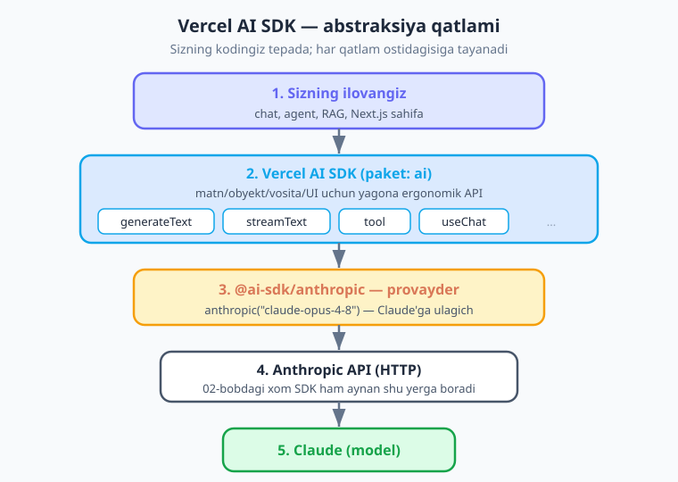

# 11 — Vercel AI SDK bilan tanishuv

[⬅️ Oldingi: 10 — Adaptiv thinking va effort](./10-thinking-effort.md) · [🏠 README](./README.md) · [Keyingi: 12 — AI SDK: strukturali chiqish va vositalar ➡️](./12-ai-sdk-structured-tools.md)

---

> **Bu bobda:** shu paytgacha biz to'g'ridan-to'g'ri **xom Anthropic SDK** (`@anthropic-ai/sdk`) bilan ishladik — `messages.create`, `content[0].text`, tool sikli va h.k. (02–10-boblar). Bu paket ajoyib va kuchli. Lekin veb-ilova qurganingizda yana bir qatlam juda asqotadi: **Vercel AI SDK** (`ai` paketi). U matn, obyekt, vositalar va oqimli UI uchun **yagona, ergonomik API** beradi, React/Next.js'ga birinchi darajali ulanadi (13-bob) va provayderdan mustaqil. Bu bobda nega bunday yuqori darajali "freymvork" foydali ekanini tushunamiz, `ai` + `@ai-sdk/anthropic` ni o'rnatamiz, ishchi ot bo'lgan `generateText` va oqimli `streamText` ni o'rganamiz, `prompt`/`system`/`messages` farqini ko'ramiz, Claude'ga xos sozlamalarni (thinking) `providerOptions` orqali berishni va — eng muhimi — *qachon xom SDK, qachon AI SDK* ishlatishni hal qilamiz. Yakunda eski xom-SDK xulosalovchini AI SDK bilan qayta yozamiz va ergonomikani "his" qilamiz.

> **Halollik eslatmasi:** bu bobdagi AI SDK shakllari — `generateText`, `streamText`, `anthropic("claude-opus-4-8")` provayderi, `text`/`usage`/`finishReason` qaytishlari va `providerOptions: { anthropic: {...} }` — jonli o'rnatilgan **`ai` v6.0** va **`@ai-sdk/anthropic` v3.0** paketlari bilan tip-tekshiruvdan o'tkazilgan. AI SDK juda tez rivojlanmoqda; Claude'ga xos "tugmacha"larning (masalan, thinking sozlamalarining) **aniq kalit nomlari** versiyadan versiyaga o'zgarishi mumkin — shuning uchun bunday joyda biz **g'oyani** beramiz va sizni provayderning README'siga yo'naltiramiz. Asosiy API (`generateText`/`streamText`) esa barqaror. Misollarni o'zingiz ishga tushiring.

---

## Nega yana bir qatlam? — xom SDK yaxshi-ku

Adolatli savol. 02-bobdan beri `@anthropic-ai/sdk` bilan hamma narsani qildik: matn, streaming, tool, vision. U ishlaydi, kuchli va Claude'ning **har bir** imkoniyatiga eng birinchi bo'lib kirish beradi. Unda nega boshqa narsa kerak?

Sababi — siz **veb-ilova** qurganingizda paydo bo'ladigan takroriy ishlar. O'ylab ko'ring: har safar javobni olish uchun `msg.content[0].text` deb blok massivini ochasiz; strukturali JSON uchun sxema yozib, qo'lda parse qilasiz; tool sikli uchun `while` loop tuzasiz; React'da oqimli chat uchun esa o'zingiz holatni boshqarasiz. Bularning har biri — *takrorlanadigan boilerplate* (har loyihada qayta yoziladigan bir xil "qovurg'a" kod).

**Vercel AI SDK** (`ai` paketi) aynan shu umumiy holatlarni silliqlaydi. Uni *yaxshi loyihalangan o'ramcha* (wrapper) deb tasavvur qiling: ostida o'sha-o'sha Anthropic API'ni chaqiradi, lekin ustki yuzasi tozaroq va ilova qurish uchun moslangan. U beradigan narsalar:

- **Yagona API** — matn (`generateText`), obyekt (`generateObject`, 12-bob), vosita (`tool`, 12-bob), oqimli UI (`useChat`, 13-bob) — hammasi bir uslubda, izchil.
- **Ergonomika** — `const { text } = await generateText(...)`. Blok massivini ochish yo'q; tayyor satr.
- **Birinchi darajali React/Next.js** — `useChat`, `useCompletion` hook'lari bilan oqimli chat UI'ni bir necha qatorda quriladi (13-bob).
- **Provayderdan mustaqillik** — `anthropic(...)` ni boshqa provayder bilan almashtirish *texnik jihatdan* mumkin (kod o'zgarmaydi). **Bu kitob esa Claude'da qoladi** — biz `@ai-sdk/anthropic` orqali Claude'ning kuchidan to'liq foydalanamiz.



Asosiy fikr: **AI SDK xom SDK'ning o'rnini bosmaydi — uning ustiga qatlam qo'shadi.** U ham aslida Anthropic API'ga HTTP so'rov yuboradi (xuddi 02-bobdagi xom SDK kabi). Farqi — ko'p loyiha uchun siz `messages.create` o'rniga `generateText` yozasiz va kam kod bilan ko'proq ish qilasiz. Bu kitob **ikkalasini ham** o'rgatadi: asoslarni (06–10-bob) chuqur tushunish uchun xom SDK, ilova qatlamini qurish uchun esa AI SDK.

---

## O'rnatish va provayder

AI SDK ikki qismdan iborat: **yadro** (`ai` paketi — `generateText` va boshqalar shu yerda) va **provayder** (`@ai-sdk/anthropic` — Claude'ga ulagich). Sxemani (12-bobda Zod kerak bo'ladi) ham birga o'rnatamiz:

```bash
npm i ai @ai-sdk/anthropic zod
```

API kaliti masalasi 02-bobdagidek qoladi: `.env` faylida `ANTHROPIC_API_KEY` turadi va Git'ga tushmaydi. Yaxshi xabar — **provayder kalitni o'zi env'dan o'qiydi**, xuddi xom SDK kabi. Siz hech narsani qo'lda uzatmaysiz:

```text
ANTHROPIC_API_KEY=sk-ant-...
```

Endi provayderni import qilamiz va **model obyektini** yasaymiz:

```js
import { anthropic } from "@ai-sdk/anthropic";

// "model obyekti" — qaysi modelni ishlatishni bildiradi.
// Bu funksiyani har chaqiruvda yoki bir marta o'zgaruvchiga olib ishlatasiz.
const model = anthropic("claude-opus-4-8");
```

`anthropic("claude-opus-4-8")` — bu chaqiruv **modelni darhol API'ga jo'natmaydi**. U shunchaki "men Claude Opus 4.8 dan foydalanaman" degan **konfiguratsiya obyekti** qaytaradi. Bu obyektni keyin `generateText` va `streamText` kabi funksiyalarning `model` maydoniga "ulaysiz". Xuddi rozetka kabi: model — vilka, funksiya — rozetka.

---

## `generateText` — ishchi ot

`generateText` — AI SDK'ning eng ko'p ishlatiladigan funksiyasi: prompt yuborasiz, tugagan javob matnini olasiz. 02-bobdagi `messages.create` ning ergonomik ekvivalenti deb o'ylang.

```js
import { generateText } from "ai";
import { anthropic } from "@ai-sdk/anthropic";

const { text, usage, finishReason } = await generateText({
  model: anthropic("claude-opus-4-8"),
  system: "Sen qisqa va aniq javob beradigan yordamchisan.", // ko'rsatma (ixtiyoriy)
  prompt: "JavaScript nima ekanini bir jumlada tushuntir.",
});

console.log(text);          // tayyor satr — blok ochish SHART EMAS
console.log(finishReason);  // "stop" — nega tugadi (03-bobdagi stop_reason kabi)
console.log(usage);         // { inputTokens, outputTokens, totalTokens, ... }
```

Har bir qismni tushunib olaylik:

- **`model`** — yuqorida yasagan model obyekti. Bu maydon o'zgarmaydi; faqat ichidagi model nomini almashtirasiz.
- **`prompt`** — bir martalik (one-shot) savol, oddiy **satr**. Eng sodda yo'l.
- **`system`** — modelga umumiy ko'rsatma (rol, uslub, qoidalar). Bu xom SDK'dagi `system` parametrining aynan o'zi (05-bob).
- **`text`** — natija. **Eng katta qulaylik shu yerda:** xom SDK'da `msg.content[0].text` deb blok massivini ochardingiz; bu yerda esa tayyor satr. AI SDK bloklarni siz uchun o'zi ochadi.
- **`finishReason`** — javob nega tugadi (`"stop"`, `"length"`, `"tool-calls"` va h.k.) — xom SDK'dagi `stop_reason` ning hamkasbi.
- **`usage`** — token hisobi (kirish/chiqish). Narx kuzatuvi uchun zarur (14-bob).

### Yonma-yon solishtirma — bir xil natija, kam kod

Mana o'sha-o'sha "salom" so'rovi: chapda 02-bobdagi xom SDK, o'ngda AI SDK. Natija bir xil, ostidagi API chaqiruvi ham bir xil — farqi faqat ergonomikada.

```js
// ── XOM SDK (@anthropic-ai/sdk) — 02-bobdagi yo'l ──
import Anthropic from "@anthropic-ai/sdk";
const client = new Anthropic();

const msg = await client.messages.create({
  model: "claude-opus-4-8",
  max_tokens: 1024,
  messages: [{ role: "user", content: "Bir jumlada salomlash." }],
});
console.log(msg.content[0].text); // <-- blok massivini QO'LDA ochasiz
```

```js
// ── VERCEL AI SDK (ai) — xuddi shu natija ──
import { generateText } from "ai";
import { anthropic } from "@ai-sdk/anthropic";

const { text } = await generateText({
  model: anthropic("claude-opus-4-8"),
  prompt: "Bir jumlada salomlash.",
});
console.log(text); // <-- tayyor satr, ochish shart emas
```

![Bir xil vazifa ikki yo'l bilan: chapda xom @anthropic-ai/sdk (messages.create chaqiriladi, content[0].text qo'lda ochiladi), o'ngda Vercel AI SDK (generateText -> tayyor { text }); ostida ikkalasi ham bir xil Anthropic API'ni chaqiradi](rasmlar/ai11-raw-vs-aisdk.svg)

Ikki kichik tafsilot: AI SDK'da `max_tokens` ixtiyoriy (kerak bo'lsa `maxOutputTokens` deb beriladi — `camelCase` AI SDK uslubi), va siz blok massivini umuman ko'rmaysiz. Ko'p loyiha uchun aynan shu farq vaqtni tejaydi.

---

## `streamText` — oqimli javob

04-bobda xom SDK bilan streaming (oqimli javob) ni ko'rdik: javob tugashini kutmasdan, token kelishi bilanoq ekranga chiqarish. AI SDK buni `streamText` bilan beradi va u juda toza:

```js
import { streamText } from "ai";
import { anthropic } from "@ai-sdk/anthropic";

const result = streamText({
  model: anthropic("claude-opus-4-8"),
  prompt: "Node.js event loop nima ekanini 3 jumlada tushuntir.",
});

// textStream — async iterable: har bir bo'lak (chunk) kelganda chiqaramiz
for await (const chunk of result.textStream) {
  process.stdout.write(chunk); // qator boshlamasdan, yonma-yon yozamiz
}
process.stdout.write("\n");

// Oqim tugagach to'liq matn va hisobni ham olsak bo'ladi (promise)
console.log("To'liq:", await result.text);
console.log("Hisob:", await result.usage);
```

Bu yerda muhim nuqtalar:

- **`streamText` `await` talab qilmaydi.** U darhol `result` obyektini qaytaradi (promise emas). Chunki oqim "boshlanadi", lekin natija asta-sekin keladi.
- **`result.textStream`** — `for await` bilan aylanadigan oqim. Har bir `chunk` — kichik matn bo'lagi. `process.stdout.write` ishlatamiz (`console.log` emas), chunki har bo'lakdan keyin yangi qator kerak emas — matn jonli "oqib" chiqsin.
- **`await result.text`** — oqim tugagach, **to'liq** matnni beradigan promise. Agar sizga bir vaqtning o'zida jonli oqim ham, oxirda to'liq matn ham kerak bo'lsa — ikkalasi ham bor.
- **`await result.usage`** — oqim tugagach token hisobi.

> **Eslatma — qachon `streamText`, qachon `generateText`?** Foydalanuvchi javobni *jonli* ko'rishi kerak bo'lsa (chat, uzun matn generatsiyasi) — `streamText`: birinchi so'z tezroq ko'rinadi, kutish "yengilroq" his qilinadi. Javobni *kodda ishlatish* uchun olsangiz (masalan JSON parse qilish, boshqa funksiyaga uzatish) — `generateText`: tugagan matn bilan ishlash sodda. Aynan shu tanlovni 04-bobda xom SDK uchun ham qilgandik — mantiq bir xil.

---

## `prompt` va `messages` — qaysi birini qachon

Yuqorida `prompt: "..."` ishlatdik — bir martalik savol uchun ideal. Lekin **ko'p bosqichli suhbat** (multi-turn — savol, javob, yana savol) kerak bo'lsa-chi? Buning uchun `prompt` o'rniga `messages` massivini berasiz — xuddi 03-bobdagi xabarlar massivi kabi:

```js
const { text } = await generateText({
  model: anthropic("claude-opus-4-8"),
  system: "Sen o'zbek tilida javob beradigan dasturlash ustozisan.",
  messages: [
    { role: "user", content: "Promise nima?" },
    { role: "assistant", content: "Promise — kelajakda keladigan qiymat va'dasi." },
    { role: "user", content: "Unda async/await u bilan qanday bog'liq?" }, // oldingi javobga tayanadi
  ],
});

console.log(text);
```

Uchta variantni esda tuting:

- **`prompt`** — bitta satr, bir martalik savol. Eng sodda.
- **`system`** — modelga umumiy ko'rsatma (rol, uslub). `prompt` yoki `messages` bilan birga ishlatiladi.
- **`messages`** — `{ role, content }` obyektlari massivi. Ko'p bosqichli suhbat uchun: avvalgi savol-javoblarni massivga qo'shib yuborasiz, model kontekstni "eslaydi".

> **Eslatma — API holatsiz (stateless), bu yerda ham.** 03-bobda ko'rganimizdek, API hech narsani "eslab qolmaydi". `messages` massivida siz **butun suhbat tarixini** har safar qayta yuborasiz — AI SDK bu jihatni o'zgartirmaydi. `useChat` (13-bob) esa bu tarixni siz uchun avtomatik boshqaradi, shuning uchun React'da uni qo'lda yig'ish kerak bo'lmaydi.

---

## Claude'ga xos sozlamalar: `providerOptions`

AI SDK ko'p narsani **normallashtiradi** (har provayder uchun bir xil API). Lekin Claude'ning ba'zi maxsus imkoniyatlari — masalan, 10-bobda ko'rgan **adaptiv thinking** va **effort** — provayderga xos. Bunday "tugmacha"larni `providerOptions: { anthropic: {...} }` orqali berasiz: bu maydon "bu sozlama faqat Anthropic provayderi uchun" degani.

```js
import { generateText } from "ai";
import { anthropic } from "@ai-sdk/anthropic";

const { text } = await generateText({
  model: anthropic("claude-opus-4-8"),
  prompt: "Bu logikani qadam-baqadam tahlil qil: 3 ta ishchi 9 soatda devorni quradi...",
  providerOptions: {
    anthropic: {
      thinking: { type: "adaptive" }, // 10-bobdagi adaptiv thinking
      // effort'ni ham shu yerda beriladi (low -> max)
    },
  },
});

console.log(text);
```

Bu yerda ikki narsa muhim:

- **`providerOptions.anthropic`** — bu "qutiga" faqat Claude'ga tegishli sozlamalar tushadi. AI SDK ularni provayderga "o'tkazib yuboradi", o'zi aralashmaydi.
- **Aniq kalit nomlari o'zgarishi mumkin.** `thinking` va `effort` ning *aniq shakli* AI SDK + provayder versiyasiga bog'liq va tez rivojlanmoqda. Shuning uchun **g'oyani** eslang ("Claude'ga xos sozlama `providerOptions.anthropic` ga boradi") va aniq kalitlarni **`@ai-sdk/anthropic` README'sidan** tekshiring. 10-bobda thinking/effort *nima qilishini* chuqur ko'rgansiz — bu yerda faqat *qayerga yozilishini* o'rganyapmiz.

> **Eslatma — eng yangi Claude imkoniyati hali AI SDK'da yo'q bo'lsa-chi?** Ba'zan Anthropic yangi imkoniyat chiqaradi, AI SDK esa uni hali "yuzaga chiqarmagan" bo'ladi. Ana shunday hollar — **xom SDK** kerak bo'ladigan asosiy sabab (pastdagi bo'limga qarang). `providerOptions` ko'p narsani qoplaydi, lekin hammasini emas.

---

## Qachon xom SDK, qachon AI SDK?

Ikkalasi ham to'g'ri — savol "qaysi biri ish uchun mosroq" degan savol. Mana amaliy qoida:

| Vaziyat | Tanlov | Nega |
|---|---|---|
| Veb/UI ilova qurish (chat, agent, RAG) | **AI SDK** | Yagona API, kam boilerplate, React hook'lar (13-bob) |
| Strukturali obyekt yoki tool tez kerak | **AI SDK** | `generateObject`, `tool({ execute })` (12-bob) ergonomik |
| Bir necha provayderni qo'llab-quvvatlash | **AI SDK** | Provayderdan mustaqil (kod o'zgarmaydi) |
| Eng yangi, AI SDK hali bermagan Claude imkoniyati | **Xom SDK** | Anthropic'ning eng yangi xususiyatiga birinchi kirish |
| Maksimal nazorat, past darajali kirish | **Xom SDK** | Har bir blok, sarlavha, beta bayroq qo'lingizda |
| Asoslarni chuqur tushunish | **Xom SDK** | `content` bloklari, `stop_reason`, tool sikli "ko'rinadi" |

Bu kitobning yo'li: **asoslarni xom SDK bilan** (02–10-bob) chuqur o'rgandingiz — endi `content` massivi nima, tool sikli qanday aylanishini *tushunasiz*. Shu poydevor ustida **ilova qatlamini AI SDK bilan** (11–13-bob va keyin) quramiz. AI SDK "sehrli" emas — siz uning ostida nima borligini bilasiz.


---

## Quramiz: xulosalovchini AI SDK bilan qayta yozish

Nazariyani amalda his qilaylik. Faraz qilaylik, sizda 03–04-boblardan oddiy **matn xulosalovchi** (summarizer) bor edi: uzun matnni qisqa xulosaga aylantiradi. Avval uni xom SDK uslubida eslaylik, keyin AI SDK bilan qayta yozamiz.

```js
// ── Avval: xom SDK uslubidagi xulosalovchi (eslatma) ──
import Anthropic from "@anthropic-ai/sdk";
const client = new Anthropic();

async function xulosaXom(matn) {
  const msg = await client.messages.create({
    model: "claude-opus-4-8",
    max_tokens: 300,
    system: "Sen matnni 3 ta qisqa bandga xulosalovchisan.",
    messages: [{ role: "user", content: matn }],
  });
  return msg.content[0].text; // blokni qo'lda ochamiz
}
```

Endi xuddi shu vazifa AI SDK bilan — tozaroq va qisqaroq:

```js
// ── Endi: AI SDK bilan ──
import { generateText } from "ai";
import { anthropic } from "@ai-sdk/anthropic";

async function xulosa(matn) {
  const { text } = await generateText({
    model: anthropic("claude-opus-4-8"),
    system: "Sen matnni 3 ta qisqa bandga xulosalovchisan.",
    prompt: matn,
  });
  return text; // tayyor satr
}

const maqola = `Node.js — bu serverda JavaScript ishlatish imkonini beruvchi muhit.
U V8 dvigateliga asoslangan va bloklamaydigan (non-blocking) I/O modeli bilan ishlaydi.
Shuning uchun u ko'p bir vaqtli ulanishni samarali boshqaradi...`;

console.log(await xulosa(maqola));
```

Endi unga **oqim** qo'shamiz — foydalanuvchi xulosa "yozilayotganini" jonli ko'rsin. Faqat funksiyani `streamText` ga o'zgartiramiz:

```js
import { streamText } from "ai";
import { anthropic } from "@ai-sdk/anthropic";

async function xulosaOqim(matn) {
  const result = streamText({
    model: anthropic("claude-opus-4-8"),
    system: "Sen matnni 3 ta qisqa bandga xulosalovchisan.",
    prompt: matn,
  });

  for await (const chunk of result.textStream) {
    process.stdout.write(chunk); // jonli "oqib" chiqadi
  }
  process.stdout.write("\n");
  return await result.text; // oxirda to'liq matn ham kerak bo'lsa
}
```

E'tibor bering: `generateText` dan `streamText` ga o'tish deyarli og'riqsiz — funksiya nomi va natijani o'qish usuli o'zgardi, qolgani (model, system, prompt) o'sha-o'sha. Aynan shu izchillik AI SDK'ning kuchi: bir uslubni o'rgansangiz, qolgan funksiyalar (`generateObject`, `streamObject` — 12-bob) ham xuddi shunday his qilinadi.

---

## Tuzoqlar va ehtiyotkorlik

| Muammo | Sabab | Yechim |
|---|---|---|
| "Cannot find module 'ai'" | Paket o'rnatilmagan | `npm i ai @ai-sdk/anthropic zod` |
| Autentifikatsiya xatosi (401) | `ANTHROPIC_API_KEY` env'da yo'q | `.env` ga kalit qo'ying; provayder uni o'zi o'qiydi (02-bob) |
| `streamText` natijasini `await` qilib qo'yish | `streamText` promise emas, `result` qaytaradi | `await` SIZ — `result.textStream`/`result.text` ni ishlating |
| `text` bo'sh, lekin xato yo'q | `finishReason: "length"` — javob `maxOutputTokens` ga urilib uzildi | `maxOutputTokens` ni oshiring |
| Claude thinking/effort ishlamayapti | Sozlama yadro maydoniga yozilgan | `providerOptions: { anthropic: {...} }` ga ko'chiring; kalitni README'dan tekshiring |
| Eng yangi Claude imkoniyati AI SDK'da yo'q | AI SDK uni hali yuzaga chiqarmagan | O'sha bo'lak uchun xom SDK'dan foydalaning (02-bob) |
| `model: "claude-opus-4-8"` (satr) | AI SDK satr emas, model obyekti kutadi | `model: anthropic("claude-opus-4-8")` |

> **Diqqat — AI SDK xom SDK'ni "bekor qilmaydi".** Ikkalasi ham bir loyihada yashashi mumkin va bu normal. Ilova qatlamini AI SDK bilan quring, lekin Claude'ning eng yangi yoki past darajali imkoniyati kerak bo'lganda xom SDK'ga tushishdan tortinmang. Bu kitob ikkalasini ham biladi — chunki yaxshi muhandis vositani vazifaga qarab tanlaydi.

---

## Mashqlar

### Oson

1. **Birinchi `generateText`.** `ai` va `@ai-sdk/anthropic` ni o'rnating, `.env` ga kalit qo'ying va `generateText` bilan "O'zbekiston poytaxti qaysi shahar?" deb so'rang. `text`, `finishReason` va `usage` ni chop eting.
2. **`system` qo'shing.** 1-mashqqa `system: "Faqat bitta so'z bilan javob ber."` qo'shing. Javob qanday o'zgardi? `system` ning roli nima?
3. **Xom vs AI SDK.** Bitta savolni avval `client.messages.create` (xom SDK), keyin `generateText` (AI SDK) bilan yuboring. Natija matnini va kod uzunligini solishtiring — qaysi biri qisqaroq?

### O'rta

4. **Oqimli CLI.** `streamText` bilan "JavaScript tarixini 5 jumlada gapir" deb so'rang va `for await` bilan terminalda jonli chiqaring. Oxirida `await result.usage` ni ham chop eting.
5. **Ko'p bosqichli suhbat.** `messages` massivi bilan ikki bosqichli suhbat tuzing: avval "Closure nima?", model javobidan keyin "Unga bitta misol ber". Ikkinchi savol birinchisiga tayanganini tasdiqlang.
6. **`generateText` vs `streamText` qachon.** Bir xil promptni ikkalasi bilan yozing. Qaysi holatda `streamText` foydaliroq, qaysisida `generateText`? Bir-ikki jumlada izohlang.

### Qiyin

7. **Xulosalovchini ko'chiring.** O'zingizning (yoki bobdagi) xom-SDK xulosalovchingizni `generateText` ga ko'chiring, keyin `streamText` variantini ham yozing. Ikki funksiya o'rtasida qancha kod o'zgardi?
8. **`providerOptions` bilan thinking.** `providerOptions: { anthropic: { thinking: { type: "adaptive" } } }` qo'shib, murakkab mantiqiy savol bering (masalan, mantiq jumboqi). Aniq kalit shaklini `@ai-sdk/anthropic` README'sidan tekshiring va 10-bob bilan bog'lang.
9. **Konfiguratsiyalanadigan klient.** `xulosa(matn, { stream })` funksiyasini yozing: `stream: false` bo'lsa `generateText`, `true` bo'lsa `streamText` ishlatsin. Ikkala holatda ham `model: anthropic("claude-opus-4-8")` bir joydan kelsin (takrorlamang).

<details markdown="1">
<summary>Yechimlar</summary>

> Quyidagi yechimlar o'rnatilgan `ai` + `@ai-sdk/anthropic` va `.env` dagi `ANTHROPIC_API_KEY` ni talab qiladi. `model: anthropic("claude-opus-4-8")` hamma yerda bir xil.

### 1-mashq yechimi

```js
import { generateText } from "ai";
import { anthropic } from "@ai-sdk/anthropic";

const { text, finishReason, usage } = await generateText({
  model: anthropic("claude-opus-4-8"),
  prompt: "O'zbekiston poytaxti qaysi shahar?",
});
console.log("Matn:", text);
console.log("finishReason:", finishReason); // odatda "stop"
console.log("usage:", usage);               // { inputTokens, outputTokens, ... }
```

`text` — tayyor satr (blok ochish yo'q), `finishReason` — nega tugadi (`stop_reason` hamkasbi), `usage` — token hisobi.

### 2-mashq yechimi

```js
const { text } = await generateText({
  model: anthropic("claude-opus-4-8"),
  system: "Faqat bitta so'z bilan javob ber.", // umumiy ko'rsatma
  prompt: "O'zbekiston poytaxti qaysi shahar?",
});
console.log(text); // "Toshkent" — system javob uslubini boshqardi
```

`system` modelga *qanday* javob berishni aytadi (rol, uslub, qoidalar) — `prompt` esa *nimani* so'rashingiz. Ikkalasi birga ishlaydi.

### 3-mashq yechimi

```js
// Xom SDK
import Anthropic from "@anthropic-ai/sdk";
const client = new Anthropic();
const m = await client.messages.create({
  model: "claude-opus-4-8", max_tokens: 200,
  messages: [{ role: "user", content: "Salom de." }],
});
console.log(m.content[0].text); // blokni qo'lda ochamiz

// AI SDK
import { generateText } from "ai";
import { anthropic } from "@ai-sdk/anthropic";
const { text } = await generateText({
  model: anthropic("claude-opus-4-8"),
  prompt: "Salom de.",
});
console.log(text); // tayyor satr
```

Natija matni bir xil; AI SDK varianti qisqaroq va `content[0].text` ochishni talab qilmaydi. Ostida ikkalasi ham bir xil Anthropic API'ni chaqiradi.

### 4-mashq yechimi

```js
import { streamText } from "ai";
import { anthropic } from "@ai-sdk/anthropic";

const result = streamText({
  model: anthropic("claude-opus-4-8"),
  prompt: "JavaScript tarixini 5 jumlada gapir.",
});

for await (const chunk of result.textStream) {
  process.stdout.write(chunk); // jonli oqim
}
process.stdout.write("\n");
console.log("usage:", await result.usage);
```

`streamText` ni `await` qilmaymiz — u darhol `result` qaytaradi. Oqim `result.textStream` orqali keladi; `result.usage` esa promise (oqim tugagach hal bo'ladi).

### 5-mashq yechimi

```js
import { generateText } from "ai";
import { anthropic } from "@ai-sdk/anthropic";

const model = anthropic("claude-opus-4-8");

// 1-bosqich
const r1 = await generateText({ model, prompt: "Closure nima? Qisqa." });
console.log("Javob 1:", r1.text);

// 2-bosqich — birinchi savol-javobni messages'ga qo'shamiz
const r2 = await generateText({
  model,
  messages: [
    { role: "user", content: "Closure nima? Qisqa." },
    { role: "assistant", content: r1.text }, // oldingi javob
    { role: "user", content: "Unga bitta misol ber." }, // bunga tayanadi
  ],
});
console.log("Javob 2:", r2.text);
```

API holatsiz — model "Closure"ni eslab qolmaydi. Biz tarixni `messages` da qayta yuboramiz, shuning uchun ikkinchi javob birinchisiga bog'lanadi (03-bob).

### 6-mashq yechimi

```js
// streamText — foydalanuvchi jonli ko'rsin (chat, uzun matn)
const s = streamText({ model: anthropic("claude-opus-4-8"), prompt: "Uzun ertak ayt." });
for await (const c of s.textStream) process.stdout.write(c);

// generateText — javobni kodda ishlataman (parse, boshqa funksiyaga uzatish)
const { text } = await generateText({ model: anthropic("claude-opus-4-8"), prompt: "Faqat shahar nomini ayt." });
const shahar = text.trim();
```

Qoida: javob **foydalanuvchiga** jonli kerak bo'lsa — `streamText`; javobni **kodda** ishlatish uchun olsangiz — `generateText` (tugagan matn bilan ishlash sodda).

### 7-mashq yechimi

```js
import { generateText, streamText } from "ai";
import { anthropic } from "@ai-sdk/anthropic";

const SYSTEM = "Sen matnni 3 ta qisqa bandga xulosalovchisan.";
const model = anthropic("claude-opus-4-8");

// generateText varianti
async function xulosa(matn) {
  const { text } = await generateText({ model, system: SYSTEM, prompt: matn });
  return text;
}

// streamText varianti — faqat funksiya va o'qish usuli o'zgardi
async function xulosaOqim(matn) {
  const result = streamText({ model, system: SYSTEM, prompt: matn });
  for await (const chunk of result.textStream) process.stdout.write(chunk);
  process.stdout.write("\n");
  return await result.text;
}
```

`model`, `system`, `prompt` ikkala funksiyada bir xil — faqat `generateText`/`streamText` va natijani o'qish farq qiladi. Ko'chirish deyarli og'riqsiz.

### 8-mashq yechimi

```js
import { generateText } from "ai";
import { anthropic } from "@ai-sdk/anthropic";

const { text } = await generateText({
  model: anthropic("claude-opus-4-8"),
  prompt: "Mantiq jumboqi: Ali Validan katta, Vali Hasandan katta. Eng yoshi kim? Qadam-baqadam.",
  providerOptions: {
    anthropic: {
      thinking: { type: "adaptive" }, // 10-bob: model chuqurroq "o'ylaydi"
    },
  },
});
console.log(text);
// Eslatma: thinking/effort ning ANIQ kalit shaklini @ai-sdk/anthropic README'sidan tekshiring.
```

`providerOptions.anthropic` — Claude'ga xos sozlamalar uchun. Thinking *nima qilishini* 10-bobda ko'rgansiz; bu yerda faqat *qayerga yozilishini* (g'oyani) o'rganyapmiz. Aniq kalitlar versiyaga bog'liq.

### 9-mashq yechimi

```js
import { generateText, streamText } from "ai";
import { anthropic } from "@ai-sdk/anthropic";

const model = anthropic("claude-opus-4-8"); // bir joyda — takrorlanmaydi
const SYSTEM = "Sen matnni 3 ta qisqa bandga xulosalovchisan.";

async function xulosa(matn, { stream = false } = {}) {
  if (!stream) {
    const { text } = await generateText({ model, system: SYSTEM, prompt: matn });
    return text;
  }
  const result = streamText({ model, system: SYSTEM, prompt: matn });
  for await (const chunk of result.textStream) process.stdout.write(chunk);
  process.stdout.write("\n");
  return await result.text;
}

console.log(await xulosa("Uzun matn...", { stream: false })); // tugagan matn
await xulosa("Uzun matn...", { stream: true });               // jonli oqim
```

`model` va `SYSTEM` bir marta e'lon qilinadi va ikkala tarmoqda ham ishlatiladi — takror yo'q. Bayroq (`stream`) bilan bitta funksiya ikki rejimni qoplaydi.

</details>

---

> **Keyingi qadam.** Endi sizda ikki kuchli vosita bor: chuqur nazorat uchun **xom Anthropic SDK** (02–10-bob) va ilova qurish uchun ergonomik **Vercel AI SDK** (`generateText`/`streamText`). Ko'rdingizki, AI SDK xom SDK o'rnini bosmaydi — uning ustiga toza qatlam qo'shadi va ostida o'sha-o'sha Anthropic API'ni chaqiradi. `prompt`/`system`/`messages` farqini, oqimni va Claude'ga xos sozlamalar `providerOptions` ga borishini o'rgandik. Keyingi bobda AI SDK'ning chinakam kuchini ochamiz: **strukturali chiqish** (`generateObject` + Zod) va **vositalar** (`tool({ inputSchema, execute })` + avtomatik agent loop) — 06–08-boblardagi xom-SDK naqshlarining ergonomik ekvivalenti.

---

[⬅️ Oldingi: 10 — Adaptiv thinking va effort](./10-thinking-effort.md) · [🏠 README](./README.md) · [Keyingi: 12 — AI SDK: strukturali chiqish va vositalar ➡️](./12-ai-sdk-structured-tools.md)
