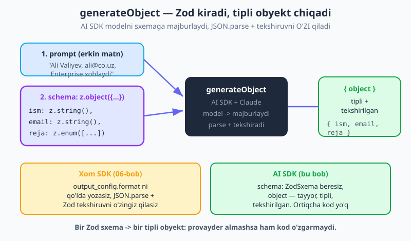
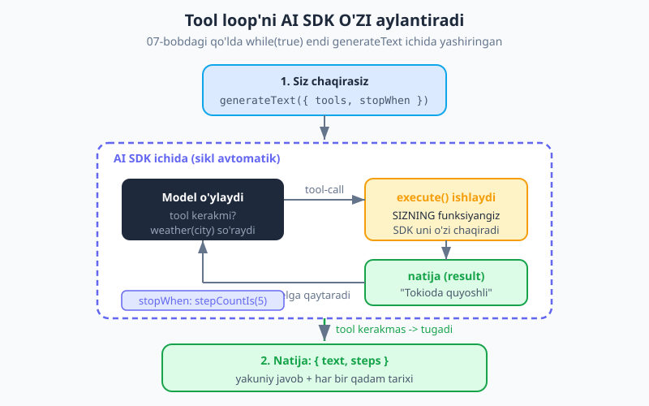
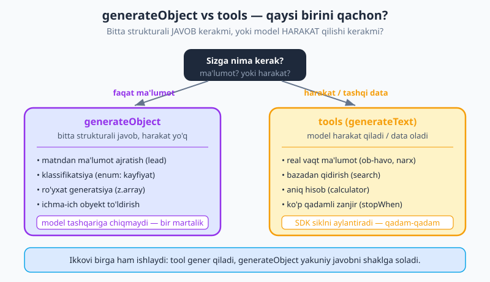

# 12 — AI SDK: strukturali chiqish va vositalar

[⬅️ Oldingi: 11 — Vercel AI SDK bilan tanishuv](./11-vercel-ai-sdk-kirish.md) · [🏠 README](./README.md) · [Keyingi: 13 — AI SDK UI: chat interfeysi ➡️](./13-ai-sdk-ui.md)

---

> **Bu bobda:** 11-bobda Vercel AI SDK bilan `generateText`/`streamText` orqali oddiy matn oldik. Endi shu qatlamning ikki kuchli quroliga o'tamiz: **`generateObject`** — Zod sxemasi berib, tipli va tekshirilgan obyekt qaytaradi (xom SDK'dagi `output_config.format` o'rniga, 06-bobni eslang), va **vositalar (tools)** — bu yerda AS SDK siz uchun **butun tool loop'ni o'zi aylantiradi** (07-bobdagi qo'lda `while(true)` loop endi ichkarida yashiringan). v6 sintaksisining ikki muhim nuqtasini ajratamiz: vosita maydoni **`inputSchema`** (eski `parameters` EMAS) va sikl chegarasi **`stopWhen: stepCountIs(N)`** (eski `maxSteps` EMAS). Yakunda ikkita real vosita quramiz: **lead ajratuvchi** (`generateObject`) va **2 vositali tadqiqot yordamchisi** (`generateText` + tools + `stopWhen`). Hamma misol jonli o'rnatilgan `ai` v6.0, `@ai-sdk/anthropic` v3.0, `zod` v4 bilan `tsc` dan o'tkazilgan.

---

## `generateObject` — strukturali chiqishning AI SDK yo'li

06-bobda biz xom `@anthropic-ai/sdk` bilan ishonchli JSON oldik — `output_config.format` ni qo'lda yozib, keyin `JSON.parse` qilib, Zod bilan tekshirib. Bu ishladi, lekin uch alohida qadam edi: sxemani yozish, parse qilish, tekshirish.

Vercel AI SDK buni **bitta chaqiruvga** jamlaydi. `generateObject` ga Zod sxema berasiz — qaytib **tayyor, tipli, allaqachon tekshirilgan obyekt** olasiz. Modelni sxemaga majburlash, JSON'ni ajratish va Zod tekshiruvi — hammasi ichkarida bo'lib o'tadi:

```js
import { generateObject } from "ai";
import { anthropic } from "@ai-sdk/anthropic";
import { z } from "zod";

const emailText =
  "Assalomu alaykum, men Ali Valiyev. Enterprise rejasiga qiziqyapman. " +
  "Aloqa uchun: ali@co.uz";

const { object } = await generateObject({
  model: anthropic("claude-opus-4-8"),
  schema: z.object({
    ism: z.string(),
    email: z.string(),
    reja: z.enum(["Free", "Pro", "Enterprise"]),
  }),
  prompt: emailText,
});

console.log(object);        // { ism: "Ali Valiyev", email: "ali@co.uz", reja: "Enterprise" }
console.log(object.reja);   // "Enterprise" — TS'da tipi "Free" | "Pro" | "Enterprise"
```

`object` — bu xom matn emas. U sizning Zod sxemangizga to'liq mos, tekshirilgan obyekt. `object.reja` har doim uch qiymatdan biri — `switch`/`if` da xotirjam ishlatasiz. Agar model sxemadan chiqsa, AI SDK xato tashlaydi — buzuq ma'lumot kodingizga kira olmaydi.



> **Atama:** *strukturali chiqish (structured output)* — modelni erkin matn emas, oldindan belgilangan **shaklga** (sxemaga) mos javob berishga majburlash. AI SDK'da bu shaklni **Zod sxema** orqali beramiz.

> **06-bob bilan solishtirish.** Xom SDK'da: `output_config.format` (JSON Schema) ni qo'lda yozasiz → `JSON.parse(msg.content[0].text)` → Zod bilan tekshirasiz. AI SDK'da: `schema: z.object({...})` → `object`. Bir qatorda. Provayder almashsa ham (`anthropic` → `openai`) shu kod o'zgarmaydi — bu AI SDK abstraksiyasining maqsadi (11-bob).

### Foydali holatlar — ajratish, klassifikatsiya, ro'yxat

`generateObject` modelni "matn qaytaruvchi" dan "ma'lumot qaytaruvchi" ga aylantiradi. Eng tez-tez uchraydigan uch holat:

**1. Klassifikatsiya (`enum`).** Sharhni kayfiyat toifasiga ajratish — model faqat ruxsat etilgan qiymatdan birini tanlay oladi:

```js
const { object } = await generateObject({
  model: anthropic("claude-opus-4-8"),
  schema: z.object({
    kayfiyat: z.enum(["ijobiy", "neytral", "salbiy"]),
    ball: z.number().int().min(1).max(5),
  }),
  prompt: "Yetkazib berish kechikdi, lekin mahsulot sifati zo'r.",
});
console.log(object); // { kayfiyat: "neytral", ball: 3 }
```

`ball` chegarasini (`min(1).max(5)`) Zod tekshiradi — chegaradan oshgan qiymat o'tib ketmaydi.

**2. Ro'yxat generatsiya (`z.array`).** Bir paragrafdan bir nechta element ajratish yoki ro'yxat yaratish:

```js
const { object } = await generateObject({
  model: anthropic("claude-opus-4-8"),
  schema: z.object({
    vazifalar: z.array(
      z.object({
        sarlavha: z.string(),
        muhimlik: z.enum(["past", "orta", "yuqori"]),
      })
    ),
  }),
  prompt: "Ertaga: hisobotni tugat (shoshilinch), gulga suv quy, kitob o'qi.",
});
console.log(object.vazifalar.length); // 3
// [{ sarlavha: "Hisobotni tugat", muhimlik: "yuqori" }, ...]
```

**3. Ichma-ich obyekt (nested).** Sxema istalgancha chuqur bo'lishi mumkin — `z.object` ichida `z.object`, `z.array` va h.k. Hisob-faktura, profil yoki konfiguratsiya kabi murakkab tuzilmalarni bir chaqiruvda olasiz.

> 💡 **Maslahat.** Sxema maydon nomlarini "tushuntiruvchi" qilib qo'ying — model maydon nomidan ham nima kerakligini tushunadi. `email`, `muhimlik`, `shoshilinch` — yaxshi; `f1`, `x`, `data` — yomon. Kerak bo'lsa `.describe("...")` bilan maydonga izoh qo'shing.

---

## `streamObject` — obyektni oqimda olish

Ba'zan obyekt katta bo'ladi (uzun ro'yxat, ko'p maydon) va siz uni **to'lguncha kutmasdan**, paydo bo'layotgan paytida ko'rsatmoqchisiz — masalan, foydalanuvchi jadval to'lib borayotganini ko'rib tursin. Buning uchun **`streamObject`** bor: u **qisman (partial) obyekt** oqimini beradi.

```js
import { streamObject } from "ai";
import { anthropic } from "@ai-sdk/anthropic";
import { z } from "zod";

const { partialObjectStream } = streamObject({
  model: anthropic("claude-opus-4-8"),
  schema: z.object({
    vazifalar: z.array(z.object({ sarlavha: z.string() })),
  }),
  prompt: "5 ta o'quv vazifasi tuz.",
});

for await (const partial of partialObjectStream) {
  // har bir qadamda obyekt to'lib boradi: { vazifalar: [{...}] }, keyin [{...},{...}]...
  console.log(partial.vazifalar?.length ?? 0);
}
```

`partialObjectStream` — to'lib borayotgan obyektni qaytaradi. Maydonlar hali yo'q bo'lishi mumkin, shuning uchun `?.` (ixtiyoriy zanjir) bilan ehtiyot bo'lib o'qing. Bu, ayniqsa, progressiv UI uchun foydali — to'liqsiz obyektni jadvalga "qatorma-qator" chizib turasiz. Chat UI bilan birga ishlatishni 13-bobda ko'ramiz.

---

## Vositalar — AI SDK yo'li (eng katta yutuq)

Endi eng muhim qismga keldik. 07-bobda biz tool loop'ni **qo'lda** yozgan edik: `stop_reason === "tool_use"` ni tekshirish, funksiyani topib bajarish, `tool_result` ni massivga qo'shish, `messages.create` ni qayta chaqirish — `while(true)` ichida. Bu butun mantiqni biz o'z qo'limiz bilan yozgan edik.

**AI SDK bu loop'ni siz uchun o'zi aylantiradi.** Siz faqat vositalarni e'lon qilasiz; SDK qolganini bajaradi: model vositani so'raydi → SDK sizning `execute` funksiyangizni ishlatadi → natijani modelga qaytaradi → model davom etadi → tugaguncha (yoki `stopWhen` gacha) takrorlaydi.

```js
import { generateText, tool, stepCountIs } from "ai";
import { anthropic } from "@ai-sdk/anthropic";
import { z } from "zod";

const { text, steps } = await generateText({
  model: anthropic("claude-opus-4-8"),
  tools: {
    weather: tool({
      description: "Berilgan shahar uchun joriy ob-havoni oladi.",
      inputSchema: z.object({ city: z.string() }), // <-- v6: inputSchema (parameters EMAS)
      execute: async ({ city }) => `${city}da hozir quyoshli, 24°C.`,
    }),
  },
  stopWhen: stepCountIs(5), // <-- v6: agent loop chegarasi (maxSteps EMAS)
  prompt: "Tokioda ob-havo qanday?",
});

console.log(text); // "Tokioda hozir quyoshli, 24 daraja."
```



Bu yerda nima sodir bo'ldi? AI SDK ichkarida:

1. Modelga so'rovni va vosita ta'riflarini yubordi.
2. Model `weather` ni `{ city: "Tokio" }` bilan chaqirishni so'radi.
3. SDK **sizning `execute` funksiyangizni** `{ city: "Tokio" }` bilan ishlatdi → `"Tokioda hozir quyoshli, 24°C."`
4. Natijani modelga qaytardi.
5. Model endi vosita kerakmasligini ko'rdi → yakuniy matn berdi. Sikl to'xtadi.

07-bobda bularning hammasini biz qo'lda yozgan edik. Endi — bitta `generateText` chaqiruvi.

### v6 sintaksisining uch kaliti

Vositalar v6'da o'zgardi. Internetda yoki eski kodda **v4** nomlarini uchratishingiz mumkin — ular endi xato. Esda tuting:

| Tushuncha | v6 (to'g'ri) | v4 (eskirgan — ishlatmang) |
|---|---|---|
| Vosita kirish sxemasi | **`inputSchema`** (Zod) | ~~`parameters`~~ |
| Sikl (qadam) chegarasi | **`stopWhen: stepCountIs(N)`** | ~~`maxSteps: N`~~ |
| Vositani bajaruvchi funksiya | **`execute: async (args) => ...`** | (xuddi shu) |

> ⚠️ **`tool({ ... })` yordamchisi.** Vositani `tool()` funksiyasi bilan o'rang — u TypeScript'ga `execute` argumentlarining tipini `inputSchema` dan avtomatik chiqarib beradi. Ya'ni `execute: async ({ city }) => ...` ichida `city` aniq `string` deb biladi. Bu — Zod sxemani ikki marta yozmaslikning AI SDK yo'li.

> 🔑 **`execute` — bu sizning kodingiz.** 07-bobdagi eng muhim tushuncha bu yerda ham kuchda: model funksiyani **o'zi ishlatmaydi**. U faqat "shu vositani shu argument bilan chaqir" deydi; `execute` ni esa **AI SDK sizning nomingizdan** ishga tushiradi. Farqi shuki, endi chaqirish va natijani qaytarish jarayonini SDK boshqaradi, siz emas.

### `steps` — ichkarida nima bo'lganini ko'rish

Loop yashiringan bo'lsa-da, ko'rinmas emas. `generateText` qaytargan **`steps`** massivi har bir qadamni — qaysi vosita chaqirildi, qanday argument bilan, qanday natija qaytdi — saqlaydi. Bu nosozliklarni tuzatishda (debugging) bebaho:

```js
for (const step of steps) {
  for (const call of step.toolCalls) {
    console.log("Chaqirildi:", call.toolName, call.input);
  }
  for (const res of step.toolResults) {
    console.log("Natija:", res.output);
  }
}
```

Agar model kutilmagan vositani chaqirsa yoki noto'g'ri argument bersa — `steps` ni ko'rib, vosita `description` yoki `inputSchema` ni aniqlashtirasiz.

---

## Ko'p vosita + ko'p qadam — mini tadqiqot yordamchisi

Vositalarning chinakam kuchi — model ularni **ketma-ket zanjirlay olishi**. Bir nechta vosita bersangiz, model bir qadamda birini, keyingi qadamda boshqasini chaqirib, ko'p qismli savolni yechadi — `stopWhen` chegarasigacha.

Mana ikki vositali "tadqiqot yordamchisi": `qidiruv` (ma'lumot oladi) + `kalkulyator` (aniq hisoblaydi). Foydalanuvchi savoli ikkalasini ham talab qiladi:

```js
import { generateText, tool, stepCountIs } from "ai";
import { anthropic } from "@ai-sdk/anthropic";
import { z } from "zod";

// Soddalashtirilgan "baza" — haqiqiy ilovada bu API yoki DB so'rovi bo'lardi
const aholi = { Toshkent: 3_000_000, Samarqand: 560_000 };

const { text, steps } = await generateText({
  model: anthropic("claude-opus-4-8"),
  tools: {
    qidiruv: tool({
      description:
        "Shahar aholisi sonini bazadan qidiradi. " +
        "Foydalanuvchi aholi soni haqida so'raganda chaqir.",
      inputSchema: z.object({ shahar: z.string() }),
      execute: async ({ shahar }) =>
        aholi[shahar] != null
          ? `${shahar} aholisi: ${aholi[shahar]}`
          : `${shahar} bazada topilmadi.`,
    }),
    kalkulyator: tool({
      description:
        "Matematik ifodani aniq hisoblaydi. Hisob-kitob yoki foiz " +
        "so'ralganda chaqir — sonlarni o'zing taxmin qilma.",
      inputSchema: z.object({ ifoda: z.string().describe("Masalan: 3000000 * 0.6") }),
      execute: async ({ ifoda }) => {
        const natija = Function(`"use strict"; return (${ifoda});`)();
        return String(natija);
      },
    }),
  },
  stopWhen: stepCountIs(5),
  prompt:
    "Toshkent va Samarqand aholisini top, keyin ularning yig'indisini hisobla.",
});

console.log(text);
// → "Toshkent aholisi 3 000 000, Samarqand 560 000. Yig'indisi 3 560 000."

console.log(steps.length); // bir nechta qadam: qidiruv x2, keyin kalkulyator
```

Model bu yerda o'z **trayektoriyasini** o'zi tuzdi: avval `qidiruv` ni ikki shahar uchun chaqirdi, natijalarni oldi, keyin `kalkulyator` ni yig'indi uchun chaqirdi, va nihoyat yakuniy jumlani yozdi. Siz hech qanday `if`/`while` yozmadingiz — faqat vositalarni e'lon qildingiz va `stopWhen` chegarasini berdingiz.

> 🔁 **`stopWhen` nega kerak?** U cheksiz sikldan himoya qiladi. Agar model qaysidir sababdan to'xtamasa, `stepCountIs(5)` uni beshinchi qadamdan keyin to'xtatadi. Real ilovada bu chegarani vazifaning murakkabligiga qarab tanlang — oddiy savol uchun 3–5, murakkab agent uchun ko'proq. Bu — 19-bobdagi **agentlar**ning poydevori.

### `streamText` + vositalar (qisqacha)

Vositalar **`streamText`** bilan ham ishlaydi — chat UI uchun aynan shu kerak. `streamText` matnni token-token oqitadi va orada vositalarni chaqiradi; foydalanuvchi javob "yozilayotganini" ko'rib turadi. Sintaksis bir xil: `tools`, `inputSchema`, `execute`, `stopWhen`. Buni to'liq chat interfeysiga ulashni **[13-bob: AI SDK UI](./13-ai-sdk-ui.md)** da quramiz.

---

## `generateObject` vs vositalar — qaysi birini qachon?

Ikkalasi ham Zod ishlatadi, lekin maqsadi boshqa. Tanlash mezoni oddiy: **sizga bitta strukturali JAVOB kerakmi, yoki model HARAKAT qilishi kerakmi?**



| | `generateObject` | Vositalar (`generateText` + `tools`) |
|---|---|---|
| **Maqsad** | Bitta tuzilgan **javob** olish | Modelga **harakat** qildirish / data oldirish |
| **Model tashqariga chiqadimi?** | Yo'q — faqat matnni shaklga soladi | Ha — `execute` orqali API, DB, hisob | 
| **Qadamlar** | Bitta | Ko'p (loop, `stopWhen` gacha) |
| **Tipik holat** | ajratish, klassifikatsiya, ro'yxat | real vaqt data, qidiruv, hisob, zanjir |
| **Natija** | `object` (tipli) | `text` + `steps` |

Oddiy qoida:

- Sizda allaqachon **bor matnni** tuzilgan shaklga solmoqchimisiz (email → lead, sharh → kayfiyat)? → **`generateObject`**.
- Model **tashqaridan ma'lumot olishi** yoki **amal bajarishi** kerakmi (ob-havo, baza, hisob, email yuborish)? → **vositalar**.

Ikkovi birga ham ishlaydi: vosita yordamida ma'lumot yig'asiz, so'ng yakuniy javobni `generateObject` bilan strukturaga solasiz.

---

## Tez-tez uchraydigan xatolar

| Xato | Nima bo'ladi | Yechim |
|---|---|---|
| Vositada `parameters:` yozish | v6'da tanilmaydi / tip xatosi | **`inputSchema:`** ishlating |
| `maxSteps: N` berish | v6'da loop chegarasi ishlamaydi | **`stopWhen: stepCountIs(N)`** |
| `stopWhen` umuman yo'q | Ko'p qadamli vazifa bir qadamdan keyin to'xtab qoladi | Vositalar bilan **doim** `stopWhen` bering |
| `tool({...})` o'ramasiz | `execute` argumenti tipi `any` bo'ladi | Vositani `tool()` ga o'rang — tip avtomatik chiqadi |
| `execute` ichida xatoni yutib yuborish | Model nosozlikni ko'rmaydi, adashadi | Xatoni aniq matn qilib qaytaring (yoki tashlang — SDK modelga yetkazadi) |
| `generateObject` o'rniga tools (yoki aksincha) | Ortiqcha murakkablik yoki imkonsiz vazifa | Yuqoridagi mezon: javob kerakmi yoki harakatmi? |

---

## Mashqlar

Quyidagi mashqlarni `node fayl.mjs` bilan ishga tushiring. Avval `npm i ai @ai-sdk/anthropic zod` (11-bob) va `.env` da `ANTHROPIC_API_KEY` (02-bob). Sxema/vosita ta'riflarini esa chaqiruvsiz, lokal Zod `.parse()` bilan ham sinashingiz mumkin.

### Oson

1. **Enum klassifikator.** `generateObject` bilan, `tur` maydoni faqat `"savol" | "shikoyat" | "maqtov"` bo'ladigan sxema (`z.enum`) yozing. Bitta mijoz xabarini toifaga ajrating va `object.tur` ni chop eting.
2. **v4 → v6 tuzatish.** Quyidagi vositada ikkita eskirgan nom bor — toping va tuzating:
   ```js
   tool({ description: "...", parameters: z.object({ x: z.number() }), execute: async ({x}) => x*2 })
   // ... generateText({ tools, maxSteps: 3, prompt: "..." })
   ```
3. **Bitta vositali chaqiruv.** `vaqt` nomli vosita yozing — argument olmaydi (`z.object({})`) va joriy vaqtni satr qaytaradi. `generateText` ga `stopWhen: stepCountIs(2)` bilan berib, "Hozir soat nechi?" deb so'rang.
4. **`object` vs `text`.** Bir gapda tushuntiring: nega `generateObject` `text` emas, `object` qaytaradi, va qachon `generateText` (vositalar bilan) ni tanlaysiz?

### O'rta

5. **Ro'yxat ajratuvchi.** Bir paragrafdan barcha shaxs ismlarini ajratuvchi sxema yozing: `z.object({ ismlar: z.array(z.string()) })`. Uch ismli matnda `object.ismlar.length === 3` ekanini tekshiring.
6. **Lead ajratuvchi (bob misoli).** `generateObject` bilan email matnidan `{ ism, email, reja, shoshilinch: boolean }` ajrating. `reja` — `z.enum(["Free","Pro","Enterprise"])`. Ikki xil matnda sinang.
7. **`steps` ni o'qish.** Bob matnidagi ikki vositali yordamchini ishga tushiring va `steps` ni aylanib, har bir `toolCall` ning `toolName` va `input` ini chop eting. Model qaysi vositani necha marta chaqirgan?
8. **Chegara muhimligi.** Ko'p qadamli savol bering, lekin `stopWhen: stepCountIs(1)` qo'ying. Nima bo'ladi va nega? So'ng chegarani oshirib tuzating.

### Qiyin

9. **Ikkinchi vosita qo'shish.** Bob matnidagi tadqiqot yordamchisiga uchinchi vosita — `valyuta(summa, kurs)` — qo'shing. "Toshkent aholisini topib, har biriga 1 dollardan to'lasak, so'mda qancha bo'ladi (kurs 12600)?" savolini bering va model uch vositani zanjirlaganini `steps` dan ko'rsating.
10. **Vosita + obyekt birga.** Avval `generateText` + `qidiruv` vositasi bilan ma'lumot yig'ing, so'ng yakuniy `text` ni `generateObject` ga berib `{ shahar, aholi: z.number() }` strukturali obyektga aylantiring. Nega ikki bosqich foydali ekanini tushuntiring.
11. **`streamObject` jadval.** `streamObject` bilan 5 ta vazifa generatsiya qiling (`z.object({ vazifalar: z.array(...) })`). `partialObjectStream` ni aylanib, har qadamda `partial.vazifalar?.length` ni chop eting — son `0` dan `5` gacha o'sib borishini ko'rsating.

<details markdown="1">
<summary>Yechimlar</summary>

Hammasi `ai` (v6.0), `@ai-sdk/anthropic` (v3.0), `zod` (v4) bilan. `ANTHROPIC_API_KEY` ni `.env` da saqlang.

### 1-mashq yechimi

```js
import { generateObject } from "ai";
import { anthropic } from "@ai-sdk/anthropic";
import { z } from "zod";

const { object } = await generateObject({
  model: anthropic("claude-opus-4-8"),
  schema: z.object({ tur: z.enum(["savol", "shikoyat", "maqtov"]) }),
  prompt: "Buyurtmam 3 kun kechikdi, hech kim javob bermayapti!",
});
console.log(object.tur); // "shikoyat"
```

`z.enum` model chiqishini uch qiymat bilan cheklaydi — kutilmagan toifa kelmaydi.

### 2-mashq yechimi

Ikki eskirgan nom: `parameters` → **`inputSchema`**, `maxSteps` → **`stopWhen: stepCountIs`**.

```js
import { tool, generateText, stepCountIs } from "ai";
import { z } from "zod";

tool({
  description: "...",
  inputSchema: z.object({ x: z.number() }), // parameters EMAS
  execute: async ({ x }) => x * 2,
});
// ... generateText({ tools, stopWhen: stepCountIs(3), prompt: "..." }) // maxSteps EMAS
```

### 3-mashq yechimi

```js
import { generateText, tool, stepCountIs } from "ai";
import { anthropic } from "@ai-sdk/anthropic";
import { z } from "zod";

const { text } = await generateText({
  model: anthropic("claude-opus-4-8"),
  tools: {
    vaqt: tool({
      description: "Joriy vaqtni qaytaradi. Soat so'ralganda chaqir.",
      inputSchema: z.object({}), // argument yo'q
      execute: async () => new Date().toLocaleTimeString("uz-UZ"),
    }),
  },
  stopWhen: stepCountIs(2),
  prompt: "Hozir soat nechi?",
});
console.log(text);
```

Argument olmaydigan vosita uchun `inputSchema: z.object({})`.

### 4-mashq yechimi

`generateObject` ning butun maqsadi — strukturali, tipli **ma'lumot** qaytarish, shuning uchun u matn (`text`) emas, tekshirilgan **`object`** beradi. `generateText` (vositalar bilan) ni esa model **harakat qilishi** kerak bo'lganda — tashqaridan data olish, hisoblash, amal bajarish — tanlaysiz; u erkin `text` (va `steps`) qaytaradi.

### 5-mashq yechimi

```js
import { generateObject } from "ai";
import { anthropic } from "@ai-sdk/anthropic";
import { z } from "zod";

const { object } = await generateObject({
  model: anthropic("claude-opus-4-8"),
  schema: z.object({ ismlar: z.array(z.string()) }),
  prompt: "Ali, Vali va Guli bog'da uchrashdi.",
});
console.log(object.ismlar.length); // 3
```

`z.array(z.string())` — har bir element string bo'lgan massivni majburlaydi.

### 6-mashq yechimi

```js
import { generateObject } from "ai";
import { anthropic } from "@ai-sdk/anthropic";
import { z } from "zod";

const Lead = z.object({
  ism: z.string(),
  email: z.string(),
  reja: z.enum(["Free", "Pro", "Enterprise"]),
  shoshilinch: z.boolean(),
});

async function leadAjrat(matn) {
  const { object } = await generateObject({
    model: anthropic("claude-opus-4-8"),
    schema: Lead,
    system: "Email matnidan lead ajrat. Shoshilinchlikni ohangdan aniqla.",
    prompt: matn,
  });
  return object;
}

console.log(await leadAjrat("Ali Valiyev, Pro rejasi kerak, juda shoshilinch! ali@co.uz"));
// { ism: "Ali Valiyev", email: "ali@co.uz", reja: "Pro", shoshilinch: true }
console.log(await leadAjrat("Salom, men Dilnoza, Free rejani sinab ko'rmoqchiman. d@x.uz"));
// { ism: "Dilnoza", email: "d@x.uz", reja: "Free", shoshilinch: false }
```

`generateObject` da ham `system` prompt ishlaydi — modelga qo'shimcha ko'rsatma berasiz.

### 7-mashq yechimi

```js
// bob matnidagi yordamchi natijasi: { text, steps }
for (const step of steps) {
  for (const call of step.toolCalls) {
    console.log("Chaqirildi:", call.toolName, JSON.stringify(call.input));
  }
}
// Masalan:
// Chaqirildi: qidiruv {"shahar":"Toshkent"}
// Chaqirildi: qidiruv {"shahar":"Samarqand"}
// Chaqirildi: kalkulyator {"ifoda":"3000000 + 560000"}
```

`qidiruv` ikki marta (har shahar uchun), `kalkulyator` bir marta chaqirilgan — jami uch tool-call, bir necha qadamga taqsimlangan.

### 8-mashq yechimi

`stopWhen: stepCountIs(1)` bilan SDK birinchi qadamdan keyin to'xtaydi. Model birinchi qadamda vositani chaqiradi, lekin **natijani ishlatib yakuniy javob berishga ulgurmaydi** — `text` bo'sh yoki to'liqsiz bo'ladi. Sababi: har bir "qadam" — bir model chaqiruvi; ko'p qismli savol kamida 2 qadam talab qiladi (chaqir → natijani o'qib javob ber). Tuzatish: `stopWhen: stepCountIs(5)` — model vosita natijasini olib, yakuniy jumlani yoza oladi.

### 9-mashq yechimi

```js
import { generateText, tool, stepCountIs } from "ai";
import { anthropic } from "@ai-sdk/anthropic";
import { z } from "zod";

const aholi = { Toshkent: 3_000_000 };

const { text, steps } = await generateText({
  model: anthropic("claude-opus-4-8"),
  tools: {
    qidiruv: tool({
      description: "Shahar aholisini qaytaradi.",
      inputSchema: z.object({ shahar: z.string() }),
      execute: async ({ shahar }) => `${shahar}: ${aholi[shahar] ?? "noma'lum"}`,
    }),
    kalkulyator: tool({
      description: "Ifodani hisoblaydi.",
      inputSchema: z.object({ ifoda: z.string() }),
      execute: async ({ ifoda }) => String(Function(`"use strict";return(${ifoda});`)()),
    }),
    valyuta: tool({
      description: "Dollar summasini so'mga aylantiradi.",
      inputSchema: z.object({ summa: z.number(), kurs: z.number() }),
      execute: async ({ summa, kurs }) => String(summa * kurs),
    }),
  },
  stopWhen: stepCountIs(6),
  prompt:
    "Toshkent aholisini top, har biriga 1 dollar to'lasak so'mda qancha (kurs 12600)?",
});

console.log(text);
for (const s of steps)
  for (const c of s.toolCalls) console.log(c.toolName, c.input);
// qidiruv -> kalkulyator/valyuta zanjiri ko'rinadi (3 000 000 * 1 * 12600)
```

Model uch vositani zanjirlaydi: `qidiruv` (aholi) → `valyuta` (dollar → so'm). `steps` zanjirini ochib ko'rsatadi.

### 10-mashq yechimi

```js
import { generateText, generateObject, tool, stepCountIs } from "ai";
import { anthropic } from "@ai-sdk/anthropic";
import { z } from "zod";

const aholi = { Toshkent: 3_000_000 };

// 1-bosqich: vosita bilan ma'lumot yig'amiz (model HARAKAT qiladi)
const { text } = await generateText({
  model: anthropic("claude-opus-4-8"),
  tools: {
    qidiruv: tool({
      description: "Shahar aholisini qaytaradi.",
      inputSchema: z.object({ shahar: z.string() }),
      execute: async ({ shahar }) => `${shahar}: ${aholi[shahar] ?? "noma'lum"}`,
    }),
  },
  stopWhen: stepCountIs(4),
  prompt: "Toshkent aholisi qancha?",
});

// 2-bosqich: erkin javobni STRUKTURAGA solamiz
const { object } = await generateObject({
  model: anthropic("claude-opus-4-8"),
  schema: z.object({ shahar: z.string(), aholi: z.number() }),
  prompt: `Quyidagidan shahar va aholini ajrat: ${text}`,
});
console.log(object); // { shahar: "Toshkent", aholi: 3000000 }
```

Ikki bosqich foydali, chunki **harakat** (data olish — vosita) va **shakl** (tipli obyekt — `generateObject`) — ikki xil vazifa. Vosita real ma'lumot keltiradi, `generateObject` esa uni ishonchli strukturaga soladi.

### 11-mashq yechimi

```js
import { streamObject } from "ai";
import { anthropic } from "@ai-sdk/anthropic";
import { z } from "zod";

const { partialObjectStream } = streamObject({
  model: anthropic("claude-opus-4-8"),
  schema: z.object({ vazifalar: z.array(z.object({ sarlavha: z.string() })) }),
  prompt: "5 ta o'quv vazifasi tuz.",
});

for await (const partial of partialObjectStream) {
  console.log(partial.vazifalar?.length ?? 0); // 0, 1, 2, 3, 4, 5 — o'sib boradi
}
```

`partialObjectStream` to'lib borayotgan obyektni beradi; `?.` bilan hali yo'q maydonlardan ehtiyot bo'lamiz.

</details>

---

## Yakunda

Bu bobda Vercel AI SDK'ning strukturali chiqish va vosita qatlamini o'zlashtirdik:

- **`generateObject`** — Zod sxema berasiz, tipli va tekshirilgan **`object`** olasiz. 06-bobdagi `output_config.format` + qo'lda `JSON.parse` + Zod tekshiruvi — endi bitta chaqiruv. Ajratish, klassifikatsiya (`enum`), ro'yxat (`z.array`), ichma-ich obyekt uchun ideal.
- **`streamObject`** — qisman obyekt oqimini beradi (progressiv UI uchun).
- **Vositalar** — AI SDK **tool loop'ni o'zi aylantiradi**. Siz `tool({ description, inputSchema, execute })` e'lon qilasiz; SDK model→`execute`→natija→takror siklini `stopWhen: stepCountIs(N)` gacha boshqaradi. 07-bobdagi qo'lda `while(true)` — endi yashiringan.
- **v6 kalitlari:** maydon **`inputSchema`** (eski `parameters` EMAS), chegara **`stopWhen: stepCountIs(N)`** (eski `maxSteps` EMAS). `steps` massivi ichkarida nima bo'lganini ko'rsatadi.
- **Tanlash:** bitta strukturali **javob** kerakmi → `generateObject`; model **harakat** qilishi / data olishi kerakmi → vositalar.
- Quryapmiz: **lead ajratuvchi** (`generateObject`) va **2 vositali tadqiqot yordamchisi** (`generateText` + tools + `stopWhen`).

Bu — keyingi ikki yo'nalishning poydevori. **[13-bob: AI SDK UI](./13-ai-sdk-ui.md)** da `streamText` + vositalarni React `useChat` bilan chat interfeysiga ulaymiz. Vositalarni ko'p qadam, ko'p mustaqillik bilan kengaytirish esa — **[19-bob: Agentlar asoslari](./19-agentlar-asoslari.md)** ning mavzusi: bugun qurgan `stopWhen` loop'i aslida eng oddiy agent.

---

[⬅️ Oldingi: 11 — Vercel AI SDK bilan tanishuv](./11-vercel-ai-sdk-kirish.md) · [🏠 README](./README.md) · [Keyingi: 13 — AI SDK UI: chat interfeysi ➡️](./13-ai-sdk-ui.md)
