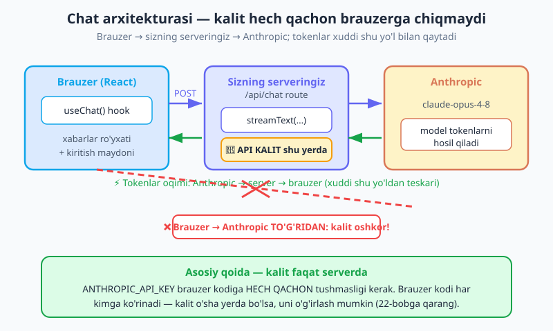
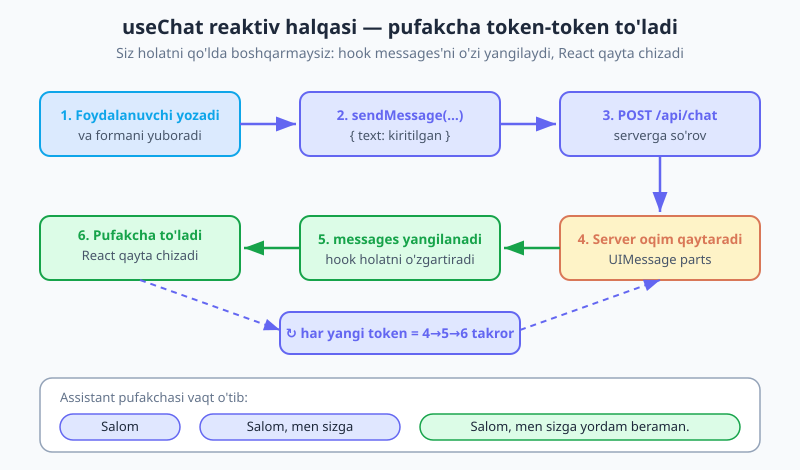
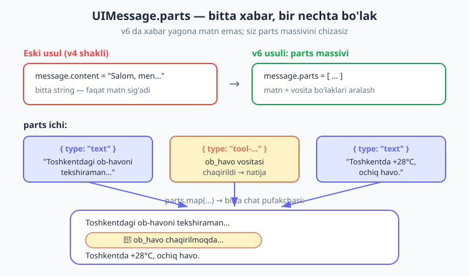

# 13 — AI SDK UI: chat interfeysi

[⬅️ Oldingi: 12 — AI SDK: strukturali chiqish va vositalar](./12-ai-sdk-structured-tools.md) · [🏠 README](./README.md) · [Keyingi: 14 — Token, narx va limitlar ➡️](./14-token-narx-limit.md)

---

> **Bu bobda:** shu paytgacha biz Claude bilan **terminalda** yoki server kodida ishladik. Endi haqiqiy mahsulot — **brauzerdagi chat interfeysi** quramiz: ChatGPT'dagi kabi, foydalanuvchi yozadi, javob token-token oqib chiqadi. Avval **nega** buni qo'lda qurish (holat, oqim, xabarlar ro'yxati, kiritish maydoni) juda ko'p ish ekanini ko'ramiz, va Vercel **AI SDK UI** hooklari buni ~30 qatorga qisqartirishini tushunamiz. So'ng eng muhim arxitektura qoidasini o'rnatamiz: **API kalit serverda qoladi, hech qachon brauzerga chiqmaydi** — demak yo'l doim brauzer → sizning serveringiz → Anthropic. Keyin to'liq Next.js misolini quramiz: **server route** (`app/api/chat/route.js`) `streamText` bilan, va **klient** (`useChat` hook bilan React komponenti). Oxirida vositalar (12-bob) UI'da qanday ko'rinishini, React'siz ilovalar uchun oddiy `fetch` muqobilini, va Vercel'ga deploy qilishni ko'rib chiqamiz.

> **Halollik eslatmasi:** misollar Vercel **AI SDK v6** (`ai` v6.0, `@ai-sdk/react`, `@ai-sdk/anthropic` v3.0) va Next.js **App Router** ga tayanadi. v6 da server route `result.toUIMessageStreamResponse()` qaytaradi (eski v4 da bu `toDataStreamResponse` edi), `useChat` esa `{ messages, sendMessage, status }` qaytaradi, xabarlarda esa yagona `content` string emas, **`parts` massivi** bo'ladi. Aniq simvol nomlari versiyadan versiyaga o'zgaradi — shaklni o'rganing, aniq nomlarni esa o'rnatgan AI SDK versiyangiz hujjatidan tasdiqlang. Model — `claude-opus-4-8`.

---

## Nega chat UI'ni qo'lda qurish og'ir?

04-bobda biz streaming'ni o'rgandik va hatto oddiy SSE serveri eskizini ham yozdik. O'sha bobning oxirida bir va'da bergandik: to'liq frontend chat interfeysini qo'lda SSE bilan emas, balki AI SDK bilan quramiz. Mana o'sha vaqt keldi — lekin avval **nega** kerakligini his qilaylik.

Tasavvur qiling, ChatGPT'dagi kabi oddiy chat sahifasini noldan, qo'lda yozyapsiz. Sizga kamida shular kerak:

- **Xabarlar ro'yxati holati** — `useState([])` bilan barcha xabarlarni saqlash, har yangi xabarda massivni yangilash.
- **Kiritish maydoni holati** — foydalanuvchi yozayotgan matn.
- **So'rov yuborish** — `fetch` bilan serverga POST, javobni kutish.
- **Oqimni o'qish** — javob SSE/stream bo'lsa, `response.body.getReader()` bilan bo'lak-bo'lak o'qish va har bo'lakni mavjud assistant xabariga **qo'shib borish**.
- **"Yozmoqda" holati** — so'rov ketdimi, javob kelyaptimi, tugadimi — buni kuzatib, tugma/spinner ko'rsatish.
- **Xatolar** — tarmoq uzildi, server 500 qaytardi va h.k.

Bularning hech biri sizning ilovangizga xos emas — **har bir chat ilovasida** xuddi shu kod takrorlanadi. 08-bobda buni nima deganini eslang: bu **boilerplate** (takrorlanuvchi, "bo'lakli" kod). Va boilerplate qayerda bo'lsa, xato qilish oson: oqim bo'lagini qo'shish o'rniga almashtirib yuborish, holatni noto'g'ri yangilash, "yozmoqda" indikatorini o'chirishni unutish.

**AI SDK UI** aynan shu boilerplate'ni o'ziga oladi. Siz bitta hook — `useChat` — chaqirasiz, u esa xabarlar ro'yxatini, oqimni, holatni va xatolarni **siz uchun** boshqaradi. Sizga qoladigani — xabarlarni chizish va kiritish formasini ko'rsatish. Natijada to'liq streaming chat ~30 qatorga sig'adi.

> **Tanish naqsh.** Bu xuddi 08-bobdagi tool runner bilan bir g'oya: takrorlanuvchi mantiqni kutubxona ichiga olib kirish. U yerda agent siklini SDK aylantirdi; bu yerda chat holati + oqimini SDK boshqaradi. Siz faqat ilovangizga xos qismni — UI ko'rinishini — yozasiz.

---

## Arxitektura — kalit hech qachon brauzerga chiqmaydi

Kodga o'tishdan oldin, eng muhim qarorni aniq qilib olaylik. Bu xavfsizlik masalasi, va uni noto'g'ri qilsangiz — pulingiz va ma'lumotingiz xavf ostida.

**Savol:** brauzerdagi React kodi to'g'ridan-to'g'ri Anthropic API'siga so'rov yuborsa bo'ladimi?

**Javob: YO'Q, hech qachon.** Sababi oddiy: brauzerda ishlaydigan har qanday kod — JavaScript, muhit o'zgaruvchilari, tarmoq so'rovlari — foydalanuvchiga **to'liq ko'rinadi**. Brauzerning "Developer Tools" oynasini ochgan har kim kodingizni o'qiy oladi, tarmoq so'rovlarini ko'ra oladi. Agar `ANTHROPIC_API_KEY` o'sha kodda bo'lsa, u **oshkor** bo'ladi. Kalitni o'g'irlagan odam sizning hisobingizdan istalgancha so'rov yuboradi — hisobingizni puch qiladi.

Shuning uchun yo'l doim shunday bo'ladi:

> **Brauzer (React) → sizning serveringiz → Anthropic.** Kalit faqat **serverda** yashaydi. Brauzer hech qachon Anthropic bilan to'g'ridan-to'g'ri gaplashmaydi — u faqat **sizning** serveringiz bilan gaplashadi.



AI SDK UI **aynan shu arxitektura uchun** qurilgan. `useChat` hook brauzerda ishlaydi va **sizning** route'ingizga (`/api/chat`) so'rov yuboradi. O'sha route serverda ishlaydi, kalitni o'qiydi, Anthropic'ni chaqiradi va oqimni brauzerga qaytaradi. Kalit ishlab chiqaruvchi muhit o'zgaruvchisi (`ANTHROPIC_API_KEY`) sifatida **faqat serverda** yashaydi.

> **Oldinga ko'prik.** Bu — bu kitobning eng muhim xavfsizlik qoidalaridan biri. Maxfiy kalitlarni hech qachon mijoz (klient) tomonida oshkor qilmaslik, ularni serverda saqlash mavzusini **22-bobda (Xavfsizlik)** to'liq, boshqa amaliy himoyalar bilan birga ko'ramiz. Hozircha bitta qoidani yodda tuting: **kalit serverda.**

---

## Server route — `app/api/chat/route.js`

Avval serverni quramiz, chunki klient unga so'rov yuboradi. Next.js App Router'da server endpointi **Route Handler** deyiladi — bu `app/api/<nom>/route.js` faylidagi `POST` (yoki `GET`) funksiya. Bizning route `app/api/chat/route.js` da turadi va `POST` so'rovlarni qabul qiladi.

```js
// app/api/chat/route.js  — SERVERDA ishlaydi (brauzerda emas!)
import { anthropic } from "@ai-sdk/anthropic";
import { streamText, convertToModelMessages } from "ai";

export async function POST(req) {
  // 1. Brauzerdan kelgan xabarlar ro'yxatini o'qiymiz.
  //    Bular UI xabarlari (parts shaklida) — useChat yuborgan.
  const { messages } = await req.json();

  // 2. Modelni oqimli chaqiramiz. convertToModelMessages — UI xabarlarini
  //    modelga mos shaklga o'tkazadi (parts -> model content).
  const result = streamText({
    model: anthropic("claude-opus-4-8"),
    messages: await convertToModelMessages(messages),
  });

  // 3. Natijani oqim sifatida brauzerga qaytaramiz.
  //    toUIMessageStreamResponse — v6 nomi (eski v4 da toDataStreamResponse edi).
  return result.toUIMessageStreamResponse();
}
```

Bu butun server kodi — uch qadam. Har birini ko'rib chiqamiz:

1. **`const { messages } = await req.json()`** — `useChat` har so'rovda **butun suhbat tarixini** yuboradi (3-bobni eslang: Messages API stateless — har safar to'liq kontekst kerak). Bu xabarlar **UI shaklida**, ya'ni `parts` massivi bilan.
2. **`streamText({ model, messages })`** — 12-bobdagi `generateText` ning oqimli ukasi. U `Promise` ni emas, balki oqim natijasini darhol qaytaradi (04-bobdagi `client.messages.stream()` ga juda o'xshash g'oya). `convertToModelMessages(messages)` — UI xabarlarini (parts bilan) modelga yuboriladigan oddiy shaklga aylantiradi. Bu ikki shakl bir xil emas: UI xabari ekranda chizish uchun, model xabari Anthropic'ga yuborish uchun.
3. **`result.toUIMessageStreamResponse()`** — eng muhim qism. Bu metod oqimni `useChat` tushunadigan formatdagi HTTP javobiga o'rab beradi. Brauzerdagi hook bu oqimni o'qib, xabarlarni avtomatik yig'adi.

> **`anthropic("claude-opus-4-8")` kalitni qayerdan oladi?** `@ai-sdk/anthropic` paketi `ANTHROPIC_API_KEY` muhit o'zgaruvchisini **avtomatik** o'qiydi — xuddi Anthropic SDK'sidagidek (02-bob). Buni `.env.local` faylida saqlaysiz (Next.js uni faqat serverda yuklaydi). Brauzerga uzatish uchun siz hech narsa qilmaysiz — qilmasligingiz ham kerak.

> **Versiya eslatmasi.** `toUIMessageStreamResponse` — v6 nomi. Eski versiyalarda bu `toDataStreamResponse` yoki `toAIStreamResponse` deb atalgan. Agar misol ishlamasa, birinchi shubha — versiya farqi: o'rnatgan `ai` paketingiz hujjatidan aniq nomni tasdiqlang. Bu kitobning oltin qoidasi: taxmin qilmang, tekshiring.

---

## Klient — `useChat` hook

Endi brauzer tomoni. `useChat` — `@ai-sdk/react` paketidagi React hook. U xabarlar ro'yxatini, yuborish funksiyasini va holatni beradi; oqimni o'qish va xabarlarni yig'ish — hammasi uning ichida.

```jsx
// app/page.jsx  — BRAUZERDA ishlaydi (klient komponent)
"use client";
import { useChat } from "@ai-sdk/react";
import { useState } from "react";

export default function Chat() {
  // useChat: messages = suhbat tarixi, sendMessage = yangi xabar yuborish,
  // status = joriy holat ("ready" | "submitted" | "streaming" | "error").
  const { messages, sendMessage, status } = useChat();
  const [input, setInput] = useState("");

  return (
    <div>
      {/* Xabarlar ro'yxati — har birining parts massivini chizamiz */}
      {messages.map((m) => (
        <div key={m.id}>
          <strong>{m.role === "user" ? "Siz" : "Claude"}:</strong>{" "}
          {m.parts.map((part, i) =>
            part.type === "text" ? <span key={i}>{part.text}</span> : null
          )}
        </div>
      ))}

      {/* "Yozmoqda" indikatori */}
      {status === "streaming" && <p>Claude yozmoqda…</p>}

      {/* Kiritish formasi */}
      <form
        onSubmit={(e) => {
          e.preventDefault();
          if (!input.trim()) return;
          sendMessage({ text: input }); // yangi user xabarini yuboramiz
          setInput("");
        }}
      >
        <input
          value={input}
          onChange={(e) => setInput(e.target.value)}
          placeholder="Savolingizni yozing…"
        />
        <button type="submit">Yuborish</button>
      </form>
    </div>
  );
}
```

Diqqat qiling — bu yerda **hech qanday `fetch` yo'q, hech qanday oqim o'qish yo'q, hech qanday qo'lda holat yangilash yo'q**. Hammasini `useChat` qiladi. Uchta narsani ajratib olamiz:

- **`messages`** — butun suhbat. Har bir xabarda `role` (`"user"` / `"assistant"`), `id` va **`parts`** massivi bor. Biz `m.parts.map(...)` bilan har bir bo'lakni chizamiz; hozircha faqat `type === "text"` bo'laklarini ko'rsatamiz.
- **`sendMessage({ text: input })`** — yangi foydalanuvchi xabarini yuboradi. Bu funksiya darhol `messages`ga user xabarini qo'shadi, `/api/chat` ga POST yuboradi, javob oqimini o'qiy boshlaydi va assistant xabarini **token-token to'ldiradi**.
- **`status`** — joriy holat. `"streaming"` — javob hozir oqib kelyapti; ana shu paytda "yozmoqda…" ko'rsatamiz yoki "Yuborish" tugmasini o'chiramiz.

> **Versiya eslatmasi — hook shakli o'zgaruvchan.** `useChat` ning aniq qaytaradigan maydonlari versiyadan versiyaga sezilarli o'zgargan. Eski versiyalarda hook `input`, `handleInputChange`, `handleSubmit` ni o'zi bergan va xabarda `parts` o'rniga `content` string bo'lgan. v6 da esa shakl yuqoridagidek: `messages` + `sendMessage` + `status`, va `parts` massivi. **O'rnatgan `@ai-sdk/react` versiyangiz hujjatini ochib, aniq maydon nomlarini tasdiqlang** — bu siz duch keladigan eng ko'p uchraydigan "nega ishlamayapti" sababidir.

---

## Streaming UX — pufakcha token-token to'ladi

Endi sehrning o'zini ko'raylik. Foydalanuvchi savol yozib "Yuborish" bosganda nima sodir bo'ladi? Halqani kuzating:



1. Foydalanuvchi yozadi va formani yuboradi.
2. `sendMessage({ text })` chaqiriladi — `messages`ga user xabari darhol qo'shiladi (ekranda ko'rinadi).
3. Hook `/api/chat` ga POST yuboradi.
4. Server `streamText` bilan Anthropic'ni chaqiradi va **oqim** qaytaradi (`toUIMessageStreamResponse`). Tokenlar bo'lak-bo'lak kela boshlaydi.
5. Har yangi bo'lak kelganda hook `messages`dagi assistant xabarini **yangilaydi**.
6. `messages` o'zgargani uchun React komponentni qayta chizadi — assistant pufakchasi yana bir bo'lakka **to'ladi**.

4→5→6 har yangi token uchun takrorlanadi. Natijada foydalanuvchi javobni so'z-so'z, **mashinka effekti** bilan ko'radi — aynan 04-bobda terminalda ko'rgan effekt, lekin endi **brauzerda, tekinga**. Siz oqimni o'qishni ham, holatni yangilashni ham yozmadingiz; hook va React'ning reaktivligi buni o'zi qildi.

Bu — `useState` + qo'lda `fetch` bilan qilinganda eng ko'p xato chiqadigan joy edi: oqim bo'lagini "qo'shish" o'rniga "almashtirib" yuborish, yoki React'ni qayta chizishga undamaslik. `useChat` bularning hammasini to'g'ri qiladi.

> **`status` bilan UX'ni silliqlash.** Foydalanuvchiga doim nima bo'layotganini ko'rsating. `status === "submitted"` — so'rov ketdi, lekin birinchi token hali kelmadi (spinner ko'rsating). `status === "streaming"` — javob oqyapti ("yozmoqda…", "To'xtatish" tugmasi). `status === "ready"` — bo'sh, yangi savol kutilmoqda. Ikki marta yuborilishni oldini olish uchun oqim paytida "Yuborish" tugmasini `disabled` qiling.

---

## Vositalar UI'da — tool parts

12-bobda biz `streamText` ga **vositalar** (tools) berishni o'rgandik — Claude ob-havo so'raganda funksiyangiz chaqirilib, natija qaytadi. Chat UI'da bu vositalar `parts` massivida **alohida bo'lak turlari** bo'lib ko'rinadi.

Mana shu yerda `parts` massivining kuchi ochiladi. Eski usulda xabar yagona matn (`content` string) edi — unga faqat matn sig'ardi. v6 da xabar **bir nechta bo'lakdan** iborat: matn bo'laklari, vosita bo'laklari, va h.k. Bitta assistant xabarida shular aralash bo'lishi mumkin: "Tekshirib ko'ray…" (matn) → ob-havo vositasi chaqirildi (vosita bo'lagi) → "Toshkentda +28°C" (yana matn).



`m.parts.map(...)` ichida bo'lak turiga qarab har xil chizasiz:

```jsx
{m.parts.map((part, i) => {
  if (part.type === "text") {
    return <span key={i}>{part.text}</span>;
  }
  // Vosita bo'laklari "tool-" bilan boshlanadigan type'ga ega bo'ladi.
  // (Aniq shakl versiyaga bog'liq — hujjatdan tasdiqlang.)
  if (part.type?.startsWith("tool-")) {
    return <div key={i}>🔧 ob-havo vositasi chaqirilmoqda…</div>;
  }
  return null;
})}
```

Bu sizga foydalanuvchiga **"Claude hozir ob-havo vositasini ishlatyapti…"** deb ko'rsatish imkonini beradi — keyin natija kelganda uni almashtirasiz. Bu shaffoflik foydalanuvchi tajribasini sezilarli yaxshilaydi: u Claude shunchaki "o'ylab turgani" emas, real ish qilayotganini ko'radi.

> **Konseptual eslatma.** Vosita bo'laklarining aniq shakli (`type` qiymati, `state` maydonlari, kirish/natija qayerda turishi) AI SDK versiyasiga juda bog'liq. Bu yerda **g'oyani** tushuning — vositalar `parts`da alohida bo'lak bo'lib oqib keladi va siz ularni xohlaganingizcha chizasiz. Aniq maydon nomlarini o'rnatgan versiyangiz hujjatidan oling.

---

## React'siz: oddiy `fetch` muqobili

`useChat` — React (va Next.js) uchun. Agar ilovangiz React'da bo'lmasa (oddiy HTML+JS, Vue, Svelte yoki shunchaki tajriba qilmoqchi bo'lsangiz), o'sha **bir xil server route**ga oddiy `fetch` bilan ham murojaat qila olasiz. Route o'zgarmaydi; faqat klientni o'zingiz yozasiz.

```js
// React'siz: o'z route'ingizga fetch + oqimni o'qish
async function chatYubor(matn) {
  const res = await fetch("/api/chat", {
    method: "POST",
    headers: { "Content-Type": "application/json" },
    // Server convertToModelMessages kutadi -> parts shaklida yuboramiz
    body: JSON.stringify({
      messages: [{ role: "user", parts: [{ type: "text", text: matn }] }],
    }),
  });

  // Javob tanasi — oqim. Uni bo'lak-bo'lak o'qiymiz (04-bobdagi reader g'oyasi).
  const reader = res.body.getReader();
  const decoder = new TextDecoder();
  while (true) {
    const { done, value } = await reader.read();
    if (done) break;
    const chunk = decoder.decode(value);
    process.stdout.write?.(chunk) ?? console.log(chunk); // kelgan bo'lakni ishlat
  }
}
```

Bu yerda biz `response.body.getReader()` bilan oqimni qo'lda o'qiymiz — xuddi 04-bobda gaplashgan past darajadagi usul. E'tibor bering: server oqimi `useChat` uchun maxsus formatda keladi (har bo'lak meta-ma'lumot bilan o'ralgan), shuning uchun React'siz o'qiganda formatni o'zingiz tahlil qilishingiz kerak bo'ladi. Soddaroq kerak bo'lsa, route'ni `result.toTextStreamResponse()` qaytaradigan qilib o'zgartirib, faqat sof matn oqimini olishingiz mumkin — lekin u holda `useChat` bilan ishlamaydi.

> **Asosiy fikr o'zgarmaydi:** klient qaysi texnologiyada bo'lishidan qat'i nazar, u **sizning serveringizga** so'rov yuboradi, server esa Anthropic bilan gaplashadi. Kalit har doim serverda. `useChat` shunchaki React uchun eng qulay yo'l.

---

## Deploy — Vercel/edge va muhit o'zgaruvchisi

Bunday ilova **Vercel** (yoki shunga o'xshash platformalarda) ajoyib ishlaydi — AI SDK aynan shu muhit uchun mo'ljallangan. Route Handler oqimni edge/serverless funksiya sifatida brauzerga uzatadi.

Bitta narsani **albatta** to'g'ri qiling: `ANTHROPIC_API_KEY` ni serverda muhit o'zgaruvchisi sifatida sozlang.

- **Lokal ishlab chiqishda:** `.env.local` fayliga `ANTHROPIC_API_KEY=sk-ant-...` yozing. Bu faylni **hech qachon** git'ga qo'shmang (`.gitignore`da bo'lsin).
- **Vercel'da:** loyiha sozlamalarida "Environment Variables" bo'limiga `ANTHROPIC_API_KEY` ni qo'shing. Vercel uni faqat server funksiyalariga beradi, brauzerga emas.

> **Diqqat — `NEXT_PUBLIC_` prefiksidan saqlaning.** Next.js'da `NEXT_PUBLIC_` bilan boshlanadigan muhit o'zgaruvchisi **brauzerga yuboriladi**. Hech qachon `NEXT_PUBLIC_ANTHROPIC_API_KEY` deb yozmang — bu kalitni butun internetga oshkor qiladi. Kalit prefiksisiz, oddiy `ANTHROPIC_API_KEY` bo'lib qolsin. Deploy va edge funksiyalarini **25-bobda** batafsil ko'ramiz.

---

## To'liq misol: minimal Next.js streaming chatbot

Hammasini bir joyga yig'amiz. Quyidagi ikki fayl — to'liq ishlaydigan, eng kichik streaming chatbot. Reader uni `npx create-next-app` bilan yaratilgan loyihaga qo'yib, `ANTHROPIC_API_KEY` ni `.env.local` ga yozib ishga tushira oladi.

**1-fayl — server route:**

```js
// app/api/chat/route.js
import { anthropic } from "@ai-sdk/anthropic";
import { streamText, convertToModelMessages } from "ai";

export async function POST(req) {
  const { messages } = await req.json();

  const result = streamText({
    model: anthropic("claude-opus-4-8"),
    system: "Sen foydali, qisqa javob beradigan o'zbek tilidagi yordamchisan.",
    messages: await convertToModelMessages(messages),
  });

  return result.toUIMessageStreamResponse();
}
```

**2-fayl — chat sahifasi:**

```jsx
// app/page.jsx
"use client";
import { useChat } from "@ai-sdk/react";
import { useState } from "react";

export default function Chat() {
  const { messages, sendMessage, status } = useChat();
  const [input, setInput] = useState("");

  return (
    <main style={{ maxWidth: 600, margin: "40px auto", fontFamily: "system-ui" }}>
      <h1>Claude bilan suhbat</h1>

      {messages.map((m) => (
        <div key={m.id} style={{ margin: "12px 0" }}>
          <strong>{m.role === "user" ? "Siz" : "Claude"}:</strong>{" "}
          {m.parts.map((part, i) =>
            part.type === "text" ? <span key={i}>{part.text}</span> : null
          )}
        </div>
      ))}

      {status === "streaming" && <p style={{ color: "#888" }}>Claude yozmoqda…</p>}

      <form
        onSubmit={(e) => {
          e.preventDefault();
          if (!input.trim()) return;
          sendMessage({ text: input });
          setInput("");
        }}
      >
        <input
          value={input}
          onChange={(e) => setInput(e.target.value)}
          placeholder="Savolingizni yozing…"
          disabled={status === "streaming"}
          style={{ width: "80%", padding: 8 }}
        />
        <button type="submit" disabled={status === "streaming"}>
          Yuborish
        </button>
      </form>
    </main>
  );
}
```

Bu ikki fayl bilan sizda haqiqiy, oqimli chat ilovasi bor: foydalanuvchi yozadi, javob token-token oqib chiqadi, suhbat tarixi saqlanadi, kalit esa xavfsiz serverda qoladi. 04-bobda biz buni terminalda ko'rgan edik; endi u brauzerda, real foydalanuvchilar uchun tayyor.

> **Eslatib o'tamiz — har so'rov butun tarixni yuboradi.** `useChat` har yuborishda butun `messages`ni route'ga jo'natadi (Messages API stateless — 3-bob). Demak suhbat uzayib borgani sari har so'rov ko'proq token yeydi. Bu **xarajat** masalasi — token, narx va kontekstni qanday boshqarishni keyingi, **14-bobda** ko'ramiz.

---

## Tez-tez uchraydigan xatolar

| Xato | Sabab | Yechim |
|---|---|---|
| Kalit brauzerda ko'rinib qoldi | Kalit klient kodida yoki `NEXT_PUBLIC_` bilan | Kalit faqat serverda, prefiksisiz `ANTHROPIC_API_KEY` |
| `messages.map` da matn chiqmadi | `m.content` o'qildi, lekin v6 da `m.parts` | `m.parts.map(p => p.type==="text" ? p.text : ...)` |
| `toUIMessageStreamResponse is not a function` | Versiya farqi (v4 da boshqa nom) | O'rnatgan `ai` versiyasi hujjatidan aniq nomni oling |
| `useChat` `input`/`handleSubmit` bermadi | v6 da bu shakl o'zgargan | `sendMessage({ text })` + o'z `useState` input'ingiz |
| Oqim kelmadi, faqat to'liq javob | Route oqim qaytarmayapti | `streamText` + `toUIMessageStreamResponse` ishlatilganini tekshiring |
| `"use client"` unutildi → hook xatosi | `useChat` faqat klient komponentda | Sahifa boshiga `"use client"` qo'shing |

---

## Mashqlar

> Maslahat: bu mashqlar uchun `npx create-next-app@latest` bilan loyiha yarating, `npm i ai @ai-sdk/react @ai-sdk/anthropic` o'rnating va `.env.local` ga `ANTHROPIC_API_KEY` yozing. Aniq simvol nomlari versiyaga bog'liq — ishlamasa, birinchi navbatda AI SDK versiyangiz hujjatini tekshiring.

### Oson

1. **Birinchi chat.** Yuqoridagi ikki faylni (route + sahifa) loyihaga qo'ying, ishga tushiring va Claude'ga savol bering. Javob token-token oqib kelishini kuzating. Server `toUIMessageStreamResponse()` o'rniga oddiy matn qaytarsa nima o'zgarardi (his qiling)?
2. **Rollarni ajrating.** Sahifada user va assistant xabarlarini turli rangda yoki turli tomonda (chap/o'ng) ko'rsating. `m.role` ni ishlatib CSS bering.

### O'rta

3. **"Yozmoqda" indikatori.** `status` ni ishlatib uch holatni ko'rsating: `"submitted"` da spinner, `"streaming"` da "Claude yozmoqda…", `"ready"` da hech narsa. Oqim paytida "Yuborish" tugmasini `disabled` qiling.
4. **System prompt.** Route'dagi `streamText` ga `system` qo'shib, Claude'ni "faqat o'zbek tilida, qisqa javob beruvchi yordamchi" qiling. Klientda hech narsa o'zgartirmasdan javob ohangi o'zgarganini ko'ring. Nega `system` ni serverda berish kerak, klientda emas?
5. **Kalit xavfsizligi tekshiruvi.** Brauzerda "Developer Tools → Network" ni oching, savol yuboring va `/api/chat` so'rovini ko'ring. So'rovda yoki javobda `ANTHROPIC_API_KEY` bormi? Endi xayolan kalitni klient kodiga qo'yganingizni tasavvur qiling — uni kim ko'ra olardi?

### Qiyin

6. **Vosita bo'lagini chizish.** 12-bobdagi ob-havo vositasini route'ga qo'shing (`streamText` ga `tools`). Klientda `m.parts.map` ichida `type` `"tool-"` bilan boshlansa "🔧 ob-havo tekshirilmoqda…" ko'rsating. Vosita natijasidan keyin yana matn bo'lagi kelishini kuzating.
7. **React'siz klient.** Bitta `index.html` + sof JS bilan o'sha route'ga `fetch` qiling va `response.body.getReader()` orqali kelgan oqimni `<div>` ga yozib boring. (Maslahat: server formatini soddalashtirish uchun route'ni `toTextStreamResponse()` qaytaradigan qilib sinab ko'ring.)
8. **Suhbat tarixi xarajati.** Har yuborishda route'da `(await convertToModelMessages(messages))` natijasining uzunligini `console.log` qiling. Suhbat uzaygan sari har so'rov qancha katta bo'lib borishini kuzating — bu 14-bobdagi xarajat muammosining ildizi.

<details markdown="1">
<summary>Yechimlar</summary>

> Eslatma: barcha yechimlar Next.js App Router + AI SDK v6 shakliga tayanadi. Aniq simvol nomlari (`toUIMessageStreamResponse`, `sendMessage`, `parts`, `status`) versiyaga bog'liq — o'rnatgan paketingiz hujjatidan tasdiqlang.

**1-mashq.** Ikki fayl ("To'liq misol" bo'limidagi) yetarli. Agar route `toUIMessageStreamResponse()` o'rniga oddiy `Response.json(...)` qaytarsa, butun javob **bir zumda** (oqimsiz) kelardi — mashinka effekti yo'qoladi, foydalanuvchi javob tayyor bo'lguncha bo'sh ekranga qarab kutadi (04-bobdagi "blokli" holat). Oqim aynan `toUIMessageStreamResponse` orqali saqlanadi.

**2-mashq.** Rolga qarab uslub beramiz:

```jsx
{messages.map((m) => (
  <div
    key={m.id}
    style={{
      textAlign: m.role === "user" ? "right" : "left",
      background: m.role === "user" ? "#dbeafe" : "#f1f5f9",
      padding: "8px 12px",
      borderRadius: 12,
      margin: "8px 0",
    }}
  >
    {m.parts.map((p, i) => (p.type === "text" ? <span key={i}>{p.text}</span> : null))}
  </div>
))}
```

**3-mashq.**

```jsx
{status === "submitted" && <p>⏳ yuborildi, javob kutilmoqda…</p>}
{status === "streaming" && <p>✍️ Claude yozmoqda…</p>}

<button type="submit" disabled={status === "streaming" || status === "submitted"}>
  Yuborish
</button>
```

`"submitted"` — so'rov ketdi, birinchi token hali yo'q; `"streaming"` — tokenlar oqyapti. Ikkalasida ham tugmani o'chirsak, foydalanuvchi ikki marta yubora olmaydi.

**4-mashq.** Route'da:

```js
const result = streamText({
  model: anthropic("claude-opus-4-8"),
  system: "Sen faqat o'zbek tilida, 1-2 jumlada qisqa javob beruvchi yordamchisan.",
  messages: await convertToModelMessages(messages),
});
```

`system` ni **serverda** beramiz, chunki u ilovangizning xatti-harakatini belgilaydi — uni klientda berish foydalanuvchiga uni o'zgartirish imkonini berardi (masalan, brauzer so'rovini tahrirlab system'ni almashtirish). Xulq-atvor va xavfsizlik qoidalari doim serverda qolsin.

**5-mashq.** Network panelida `/api/chat` so'rovini ochsangiz: **so'rov tanasida** faqat `messages` bor (foydalanuvchi xabarlari), **javobda** esa Claude'ning oqimli matni. `ANTHROPIC_API_KEY` **hech qaerda yo'q** — chunki u serverda, so'rov server ichida Anthropic'ga ketganida ishlatiladi. Agar kalitni klient kodiga qo'ysangiz, u brauzerga yuklangan JS faylida va har bir tarmoq so'rovida ko'rinardi — sahifani ochgan **har bir odam** uni o'g'irlab, sizning hisobingizdan so'rov yuborardi. Mana shuning uchun kalit serverda qoladi.

**6-mashq.** Route'da vosita (12-bob shakli):

```js
import { tool, streamText, convertToModelMessages } from "ai";
import { anthropic } from "@ai-sdk/anthropic";
import { z } from "zod";

const result = streamText({
  model: anthropic("claude-opus-4-8"),
  messages: await convertToModelMessages(messages),
  tools: {
    obHavo: tool({
      description: "Shahar uchun ob-havoni qaytaradi",
      inputSchema: z.object({ shahar: z.string() }),
      execute: async ({ shahar }) => ({ shahar, harorat: "+28°C, ochiq" }),
    }),
  },
});
```

Klientda bo'lak turini tekshiramiz:

```jsx
{m.parts.map((part, i) => {
  if (part.type === "text") return <span key={i}>{part.text}</span>;
  if (part.type?.startsWith("tool-"))
    return <div key={i} style={{ color: "#d97757" }}>🔧 ob-havo tekshirilmoqda…</div>;
  return null;
})}
```

Bir assistant xabarida ketma-ket: matn ("tekshiraman…") → vosita bo'lagi → yana matn ("Toshkentda +28°C") kelishini ko'rasiz. Aniq `type` qiymati va natija qayerda turishini versiyangiz hujjatidan tasdiqlang.

**7-mashq.** Sof JS klient (server route'ni `toTextStreamResponse()` qaytaradigan qilib sodda matn oqimi olamiz):

```html
<!-- index.html -->
<input id="q" placeholder="Savol…" />
<button id="b">Yuborish</button>
<div id="out"></div>
<script>
  document.getElementById("b").onclick = async () => {
    const matn = document.getElementById("q").value;
    const out = document.getElementById("out");
    out.textContent = "";
    const res = await fetch("/api/chat", {
      method: "POST",
      headers: { "Content-Type": "application/json" },
      body: JSON.stringify({
        messages: [{ role: "user", parts: [{ type: "text", text: matn }] }],
      }),
    });
    const reader = res.body.getReader();
    const dec = new TextDecoder();
    while (true) {
      const { done, value } = await reader.read();
      if (done) break;
      out.textContent += dec.decode(value); // kelgan bo'lakni qo'shib boramiz
    }
  };
</script>
```

Asosiy g'oya: klient qaysi texnologiyada bo'lsa ham, **o'z serveringizga** murojaat qiladi; kalit serverda qoladi. `useChat` faqat React uchun eng qulay yo'l, lekin majburiy emas.

**8-mashq.** Route'da:

```js
const modelMessages = await convertToModelMessages(messages);
console.log("Model xabarlari soni:", modelMessages.length);
console.log("Taxminiy hajm (belgi):", JSON.stringify(modelMessages).length);

const result = streamText({ model: anthropic("claude-opus-4-8"), messages: modelMessages });
```

Har yangi savolda `messages.length` o'sib boradi (user + assistant + user + …), demak har so'rov **butun tarixni** o'z ichiga oladi. Suhbat uzaygan sari yuboriladigan token soni — va shu bilan birga **narx** — ortib boradi. Bu 14-bobdagi muammoning ildizi: kontekst cheksiz o'smaydi va har token pul turadi, shuning uchun tarixni qisqartirish/jamlash strategiyasi kerak bo'ladi.

</details>

---

[⬅️ Oldingi: 12 — AI SDK: strukturali chiqish va vositalar](./12-ai-sdk-structured-tools.md) · [🏠 README](./README.md) · [Keyingi: 14 — Token, narx va limitlar ➡️](./14-token-narx-limit.md)
