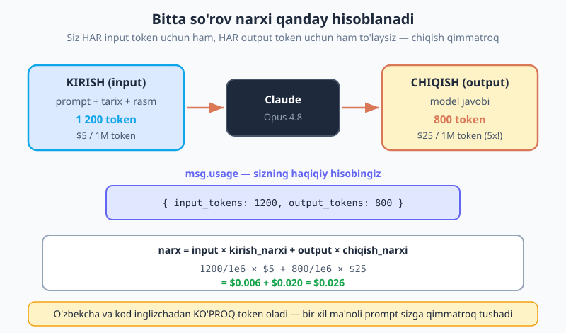
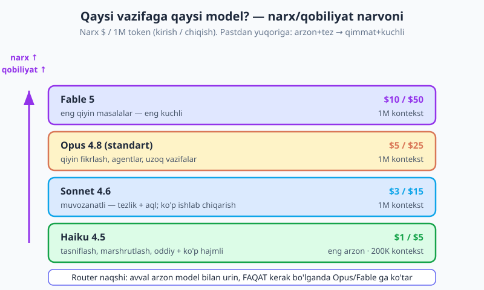
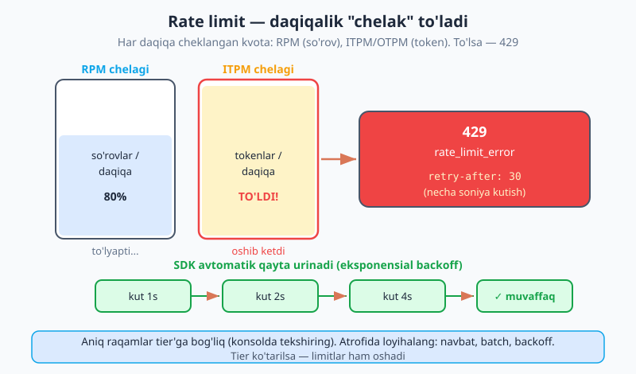

# 14 — Token, narx va limitlar

[⬅️ Oldingi: 13 — AI SDK UI: chat interfeysi](./13-ai-sdk-ui.md) · [🏠 README](./README.md) · [Keyingi: 15 — Prompt caching ➡️](./15-prompt-caching.md)

---

> **Bu bobda:** bu — **pul** bobi. Shu paytgacha biz kod yozdik, lekin har bir `messages.create()` chaqiruvi sizning hisobingizdan pul yechadi — va aksariyat dasturchilar buni faqat oy oxirida hisob-faktura kelganda payqaydi. Bu bobda biz buni oldindan ko'ramiz va boshqaramiz. **Narx modeli**: siz HAR kirish (input) token uchun ham, HAR chiqish (output) token uchun ham to'laysiz — va chiqish odatda qimmatroq (Opus 4.8 da $5 kirish / $25 chiqish). **O'zbekcha va kod inglizchadan ko'proq token oladi** — bu bizning auditoriyamiz uchun muhim: bir xil ma'noli promptingiz inglizcha ekvivalentidan qimmatroq tushadi. Keyin: `msg.usage` dan **haqiqiy narxni hisoblash** (`cost()` yordamchisi), so'rovdan oldin `countTokens()` bilan **narxni oldindan baholash** (va nega **hech qachon `tiktoken` emas**), to'g'ri **modelni narx bo'yicha tanlash** (Haiku → Opus router naqshi), **narxni pasaytirish vositalari** (caching, batch, kichik `max_tokens`), **rate limit** (RPM/ITPM/OTPM, 429 + retry-after, SDK backoff) va ishlab chiqarishda **byudjetni nazorat qilish**. Yakunda: `cost()` kalkulyatori, `countTokens` qo'riqchisi va Haiku→Opus router.

> **Halollik eslatmasi:** bu bobdagi narxlar (Opus 4.8 $5/$25, Sonnet 4.6 $3/$15, Haiku 4.5 $1/$5, Fable 5 $10/$50, 1M token uchun), `usage` maydonlari (`input_tokens`, `output_tokens`, `cache_read_input_tokens`, `cache_creation_input_tokens`), `client.messages.countTokens()` API va kontekst/chiqish chegaralari `@anthropic-ai/sdk` **0.104** ga asoslangan va Anthropic hujjatiga muvofiq. `usage` o'qish, `cost()` hisoblash va `countTokens()` chaqiruvlari **jonli ijro etiladigan** to'g'ri kod. **Aniq rate-limit raqamlari (RPM/ITPM/OTPM) — tier'ga bog'liq**, ya'ni har tashkilot/hisobda turlicha; aniq qiymatlarni Anthropic **konsolida** ko'ring, bu bobda raqamlarni faqat namuna sifatida ishlatdik.

---

## Nega bu bob muhim? — har chaqiruv pul

Tasavvur qiling, siz chiroyli AI chat ilovasini yozdingiz, demo qildingiz, hamma xursand. Bir oydan keyin Anthropic hisob-fakturasi keladi va siz hayron qolasiz: "Men shunchaki bir necha xabar yubordim, bu nega $200?" Sabab — siz har chaqiruvda nima qancha turishini **ko'rmagansiz**.

LLM API'lari elektr quvvati kabi: siz oqim bilan to'lov qilasiz, lekin hisoblagich ko'rinmas joyda aylanadi. Bu bobning maqsadi — o'sha hisoblagichni **ko'rinadigan** qilish. Har chaqiruvdan keyin "bu menga necha sent turdi?" degan savolga aniq javob bera olishingiz kerak. Mana shu bilim sizni qimmat kechalardan saqlaydi.

Yaxshi xabar: narx modeli oddiy va to'liq oldindan aytib bo'ladigan. Yomon xabar: agar e'tibor bermasangiz, kichik beparvoliklar (juda katta `max_tokens`, har safar butun suhbat tarixini qayta yuborish, eng qiyin modelni eng oddiy vazifaga ishlatish) tez orada qimmatga tushadi. Keling, modelni tushunaylik.

---

## Narx modeli: kirish + chiqish, alohida narxlar

Asosiy qoida ikkita jumladan iborat:

1. Siz **kirish (input) tokenlari** uchun ham, **chiqish (output) tokenlari** uchun ham to'laysiz.
2. Bu ikkisi **alohida narxlarda** hisoblanadi — va chiqish odatda **qimmatroq**.

**Kirish** — bu modelga yuborganingiz hammasi: system prompt, suhbat tarixi, foydalanuvchi xabari, rasm/PDF (agar bo'lsa). **Chiqish** — bu model qaytargan javob. Opus 4.8 misolida: kirish **1M token uchun $5**, chiqish **1M token uchun $25**. Ya'ni chiqish token kirishdan **5 barobar qimmat**.

Nega chiqish qimmatroq? Chunki chiqishni hosil qilish modelga ko'proq hisob-kitob talab qiladi — har bir token oldingi barcha tokenlarga qarab birma-bir generatsiya qilinadi (buni 01-bobda ko'rgandik). Kirishni esa model bir martada "o'qiydi". Amaliy xulosa: **uzun javoblar uzun promptlardan tezroq qimmatlashadi.** Shuning uchun keraksiz uzun javoblardan saqlanish (kichik `max_tokens`, "qisqa javob ber" ko'rsatmasi) bevosita pul tejaydi.



Diagrammaga qarang: 1200 kirish token + 800 chiqish token bo'lgan bir so'rov uchun:

```text
narx = (1200 / 1 000 000) × $5  +  (800 / 1 000 000) × $25
     = $0.006                   +  $0.020
     = $0.026   (taxminan 2.6 sent)
```

Bitta so'rov uchun 2.6 sent arzon ko'rinadi. Lekin kuniga 10 000 so'rov bo'lsa — bu $260/kun, ya'ni oyiga ~$7800. Mana shuning uchun har tokenga e'tibor muhim.

### O'zbekcha va kod ko'proq token oladi (bizning auditoriya uchun muhim)

01-bobda ([tokenlarni qaytaring](./01-llm-nima.md)) ko'rganimizdek: inglizchada taxminan **1 token ≈ 4 belgi**. Lekin o'zbekcha (va boshqa lotin bo'lmagan yoki kam-ifodalangan tillar) **ko'proq** token oladi — chunki modellar asosan inglizcha matnga moslab tuzilgan, shuning uchun o'zbekcha so'z ko'pincha bir nechta tokenga bo'linadi. **Kod** ham (qavslar, otstupi, maxsus belgilar) ko'p token "yeydi".

Bu nimani anglatadi? **Bir xil ma'noli prompt sizga inglizchaga qaraganda qimmatroq tushadi.** Masalan, "Mahsulot tavsifini yoz" o'zbekcha promptingiz "Write a product description" inglizcha ekvivalentidan ko'proq token bo'lishi mumkin — ham kirishda (promptingiz), ham chiqishda (o'zbekcha javob). Bu sizni o'zbekchadan voz kechishga undamaydi — shunchaki byudjetni rejalashtirayotganda buni **hisobga oling** va token sonini taxmin qilmang, balki o'lchang (pastda `countTokens`).

---

## `usage` ni o'qish: har chaqiruvning haqiqiy narxi

Eng muhim odat: **har chaqiruvdan keyin `msg.usage` ni o'qing.** Bu — taxmin emas, sizning **haqiqiy** iste'molingiz. Har javob obyektida `usage` keladi:

```js
import Anthropic from "@anthropic-ai/sdk";

const client = new Anthropic(); // ANTHROPIC_API_KEY .env dan (02-bob)

const msg = await client.messages.create({
  model: "claude-opus-4-8",
  max_tokens: 1024,
  messages: [{ role: "user", content: "O'zbekiston poytaxti qaysi shahar?" }],
});

console.log(msg.content[0].text);
console.log(msg.usage);
// {
//   input_tokens: 18,
//   output_tokens: 12,
//   cache_read_input_tokens: 0,        // 15-bob (caching)
//   cache_creation_input_tokens: 0     // 15-bob (caching)
// }
```

`usage` ning to'rt maydoni:

- **`input_tokens`** — to'liq narxda hisoblangan kirish tokenlari (keshlanmagani).
- **`output_tokens`** — chiqish tokenlari (qimmatroq narxda).
- **`cache_read_input_tokens`** — keshdan o'qilgan tokenlar (~0.1x narx). Buni [15 — Prompt caching](./15-prompt-caching.md) bobida ko'ramiz.
- **`cache_creation_input_tokens`** — keshga yozilgan tokenlar (~1.25x narx). U ham 15-bobda.

Hozircha caching'siz, faqat `input_tokens` va `output_tokens` muhim. Keling, ulardan dollar narxini hisoblaydigan **yordamchi funksiya** yozaylik.

### `cost()` kalkulyatori

Narxlarni bir joyda jadval qilamiz va `usage` dan narxni hisoblaymiz. Narxlar **1M (million) token uchun** dollarda:

```js
// Narx jadvali — 1M token uchun [kirish $, chiqish $]
const NARX = {
  "claude-opus-4-8":   { in: 5,  out: 25 },
  "claude-sonnet-4-6": { in: 3,  out: 15 },
  "claude-haiku-4-5":  { in: 1,  out: 5  },
  "claude-fable-5":    { in: 10, out: 50 },
};

/**
 * usage va model bo'yicha so'rov narxini dollarda hisoblaydi.
 * (Caching narxi 15-bobda; bu yerda input/output bilan cheklanamiz.)
 */
function cost(usage, model) {
  const p = NARX[model];
  if (!p) throw new Error(`Noma'lum model narxi: ${model}`);
  const inCost = (usage.input_tokens / 1_000_000) * p.in;
  const outCost = (usage.output_tokens / 1_000_000) * p.out;
  return inCost + outCost; // dollarda
}

// Ishlatish:
const narx = cost(msg.usage, "claude-opus-4-8");
console.log(`Bu so'rov: $${narx.toFixed(6)}`); // $0.000360
```

Endi har chaqiruvdan keyin uni log qiling — siz hisobni **real vaqtda** ko'rasiz. Ishlab chiqarishda har so'rovning narxini bazaga yoki monitoringga yozing (pastda "Byudjet" bo'limida).

> **Eslatma — `usage` yolg'on gapirmaydi.** `cost()` ni o'z taxminingiz bilan emas, doim `msg.usage` bilan chaqiring. `usage` — Anthropic tomonidan qaytarilgan haqiqiy raqam; siz token sonini o'zingiz taxmin qilsangiz (ayniqsa o'zbekcha/kod uchun), xato qilasiz.

---

## So'rovdan OLDIN sanash: `countTokens()`

`usage` so'rovdan **keyin** keladi — ya'ni pul allaqachon yechilgan. Lekin ba'zan siz **oldindan** bilmoqchisiz: "bu prompt juda uzunmi? Yuborsam qancha turadi?" Buning uchun `countTokens()` bor — u so'rovni **yubormasdan** kirish tokenlarini sanaydi (bu chaqiruv bepul):

```js
const r = await client.messages.countTokens({
  model: "claude-opus-4-8",
  system: "Sen foydali yordamchisan.",
  messages: [{ role: "user", content: foydalanuvchiMatni }],
});

console.log(r.input_tokens); // masalan 1432
```

Bu nima uchun foydali? **Narxni oldindan baholash** va **juda uzun kirishni rad etish** uchun — qo'riqchi (guard) sifatida.

### `countTokens` qo'riqchisi: juda uzun kirishni rad etish

```js
const MAX_KIRISH_TOKEN = 50_000; // o'z chegaramiz

async function xavfsizChaqiruv(matn) {
  // 1) Yubormasdan OLDIN sanaymiz
  const { input_tokens } = await client.messages.countTokens({
    model: "claude-opus-4-8",
    messages: [{ role: "user", content: matn }],
  });

  // 2) Chegaradan oshsa — qimmat so'rovni rad etamiz
  if (input_tokens > MAX_KIRISH_TOKEN) {
    throw new Error(
      `Kirish juda uzun: ${input_tokens} token (chegara ${MAX_KIRISH_TOKEN}). ` +
      `Matnni qisqartiring yoki bo'laklarga bo'ling.`
    );
  }

  // 3) Xavfsiz — yuboramiz
  const msg = await client.messages.create({
    model: "claude-opus-4-8",
    max_tokens: 1024,
    messages: [{ role: "user", content: matn }],
  });
  return msg;
}
```

Bu naqsh ayniqsa foydalanuvchi matn yoki fayl yuklaydigan ilovalarda muhim — kimdir 200 sahifali hujjatni yopishtirib qo'ysa, siz uni **yubormasdan** to'xtatasiz, qimmat so'rovga aylanishidan oldin.

### HECH QACHON `tiktoken` ishlatmang

Internetda "Claude tokenini sanash" uchun `tiktoken` (yoki `gpt-tokenizer`) ishlatishni tavsiya qiladigan maslahatlar ko'p. **Buni qilmang.** `tiktoken` — bu **OpenAI'ning** tokenizatori, Claude'niki emas. U Claude tokenlarini odatdagi matnda ~15-20% **kam sanaydi**, kod va lotin bo'lmagan (o'zbekcha!) matnda esa undan ham ko'proq xato qiladi.

Sabab oddiy: har model **boshqa** tokenizatorga ega — bir xil matn turli modellarda turli tokenlarga bo'linadi. OpenAI tokenizatori bilan Claude narxini hisoblash — bir mamlakat valyutasi bilan boshqasining narxini hisoblashga o'xshaydi: raqam chiqadi, lekin noto'g'ri. **Doim `client.messages.countTokens()` ishlating** — u aynan siz ishlatadigan model bilan to'g'ri sanaydi. Bu, ayniqsa, o'zbekcha auditoriya uchun muhim: `tiktoken` o'zbekcha matnda eng ko'p xato qiladigan joy.

---

## Narx jadvali

| Model | Kirish ($ / 1M) | Chiqish ($ / 1M) | Kontekst oynasi | Qachon ishlatish |
|---|---|---|---|---|
| Haiku 4.5 | $1 | $5 | 200K | Oddiy, tez, ko'p hajmli (tasniflash, marshrutlash) |
| Sonnet 4.6 | $3 | $15 | 1M | Muvozanatli — tezlik + aql |
| **Opus 4.8** (standart) | $5 | $25 | 1M | Qiyin fikrlash, agentlar, uzoq vazifalar |
| Fable 5 | $10 | $50 | 1M | Eng qiyin masalalar — eng kuchli |

Diqqat: barcha modellarda chiqish kirishdan ~5 barobar qimmat. **Kontekst oynasi** — modelning bir vaqtda "ko'ra oladigan" maksimal token miqdori (Opus/Sonnet/Fable da 1M, Haiku da 200K). Bu narx emas — bu sig'im chegarasi; lekin uzun kontekst ko'p kirish token degani, ya'ni bilvosita narxga ta'sir qiladi.

---

## To'g'ri modelni tanlash: narx bo'yicha

Eng katta narx richagi — **model tanlash**. Ko'p dasturchilar hamma narsani Opus'da ishlatadi (chunki u eng kuchli), lekin aksariyat vazifalar uchun bu pulni isrof qilish. Qoida: **vazifaga yetarli bo'lgan eng arzon modelni tanlang.**



Amaliy qo'llanma:

- **Haiku 4.5** — oddiy va **ko'p hajmli** vazifalar: matnni tasniflash ("bu ijobiy/salbiy?"), marshrutlash ("bu savol qaysi bo'limga?"), oddiy ajratish, teglar. Tez va eng arzon. Agar kuniga million so'rov bo'lsa, narx farqi (Haiku $1 vs Opus $5) ulkan.
- **Sonnet 4.6** — muvozanatli ish: o'rta murakkablikdagi yozish, xulosalash, ko'p tool-chaqiruvli oqimlar. Tezlik va aql o'rtasida yaxshi nuqta.
- **Opus 4.8** — chinakam **qiyin fikrlash**: murakkab kod, chuqur tahlil, uzoq agentlik vazifalari, qiyin qaror.
- **Fable 5** — eng qiyin, eng yuqori darajadagi masalalar. Eng qimmat — faqat kerak bo'lganda.

### Router naqshi: arzon model birinchi, Opus'ga ko'taring

Aqlli usul — **router**: avval arzon model (Haiku) bilan urinib ko'ring, va **faqat** kerak bo'lganda Opus'ga "ko'taring" (escalate). Masalan, foydalanuvchi savolini avval Haiku bilan tasniflang: "bu oddiy savolmi yoki murakkab fikrlash kerakmi?" — keyin shunga qarab modelni tanlang:

```js
// Oddiy router: Haiku bilan tasniflaymiz, keyin to'g'ri modelga yuboramiz
async function router(savol) {
  // 1) Arzon model (Haiku) bilan tasniflash — "oddiy" yoki "murakkab"?
  const tasnif = await client.messages.create({
    model: "claude-haiku-4-5",
    max_tokens: 16, // juda qisqa javob — bir so'z
    messages: [
      {
        role: "user",
        content:
          `Quyidagi savol "oddiy" (faktik, qisqa javobli) yoki "murakkab" ` +
          `(ko'p qadamli fikrlash, kod, tahlil kerak)? Faqat bitta so'z bilan javob ber.\n\n` +
          `Savol: ${savol}`,
      },
    ],
  });

  const turi = tasnif.content[0].text.trim().toLowerCase();

  // 2) Tasnifga qarab modelni tanlaymiz
  const model = turi.includes("murakkab") ? "claude-opus-4-8" : "claude-haiku-4-5";

  // 3) Asosiy javobni shu model bilan olamiz
  const javob = await client.messages.create({
    model,
    max_tokens: 1024,
    messages: [{ role: "user", content: savol }],
  });

  console.log(`Tanlangan model: ${model}`);
  console.log(`Tasnif narxi: $${cost(tasnif.usage, "claude-haiku-4-5").toFixed(6)}`);
  console.log(`Javob narxi:  $${cost(javob.usage, model).toFixed(6)}`);
  return javob;
}
```

Bu yerda hiyla: tasniflash bosqichi **arzon** (Haiku, 16 token chiqish). Agar savol oddiy bo'lsa, javob ham Haiku'da qoladi — siz Opus narxini umuman to'lamaysiz. Faqat haqiqatan murakkab savollar Opus'ga boradi. Katta hajmda bu jiddiy tejash.

> **Eslatma — router'ning ham narxi bor.** Tasniflash bosqichi qo'shimcha chaqiruv, ya'ni qo'shimcha token. U arzon (Haiku, qisqa), lekin bepul emas. Router foydali bo'ladi qachonki "oddiy" savollar ko'p bo'lsa — chunki ularning har biri Opus o'rniga Haiku'da qoladi. Agar deyarli hamma savol murakkab bo'lsa, router shunchaki ortiqcha qadam qo'shadi. O'z trafikni o'lchang.

---

## Narxni pasaytirish vositalari (kitobning qolgan qismi)

Model tanlash — eng katta richag, lekin yagona emas. Mana narxni pasaytirishning asosiy vositalari, ularning ko'pini keyingi boblarda batafsil ko'ramiz:

- **Prompt caching** ([15-bob](./15-prompt-caching.md)) — takrorlanadigan katta kontekst (system prompt, hujjat, few-shot misollar) keshlanadi va keyingi so'rovlarda **90% gacha arzon** o'qiladi. Agar har so'rovda bir xil katta system prompt yuborsangiz — bu eng katta tejash.
- **Batch** ([24-bob](./24-batch-optimizatsiya.md)) — kechikishga sezgir bo'lmagan so'rovlar (tungi ishlash, ko'p hujjatni tahlil) uchun Batch API **50% arzon**. Javob darhol kerak bo'lmasa — har doim batch.
- **Kichikroq `max_tokens`** — chiqish qimmat ekanini eslang. Javob qisqa bo'lishi kerak bo'lsa (tasniflash, ha/yo'q), `max_tokens` ni past qo'ying. Bu javobni kesib qo'ymaydi, faqat ortiqcha generatsiyani cheklaydi.
- **Qisqaroq promptlar** — keraksiz kontekst, takror ko'rsatmalar, ortiqcha few-shot misollarni olib tashlang. Har keraksiz token — bekorga pul.
- **To'g'ri model** — yuqorida ko'rganimiz: router, vazifaga arzon model.
- **Pastroq effort** (10-bob) — Opus 4.8'da `effort` sozlamasi modelning qancha "o'ylashi"ni boshqaradi. Pastroq effort = kamroq token = arzonroq (lekin oddiyroq vazifalar uchun).

Bu vositalarni birga ishlatish mumkin: arzon model + caching + batch + kichik `max_tokens` — bu birga olganda narxni bir necha barobar pasaytirishi mumkin.

---

## Rate limit: RPM, ITPM, OTPM

Narxdan tashqari yana bir chegara bor — **rate limit** (so'rov tezligi chegarasi). Bu — siz qancha to'lashga tayyor bo'lishingizdan qat'i nazar, Anthropic sizga **daqiqasiga / kuniga** ruxsat beradigan miqdor. Bu serverni adolatli taqsimlash uchun.

Asosiy chegaralar (har tashkilot/tier uchun):

- **RPM** (requests per minute) — daqiqasiga so'rovlar soni.
- **ITPM** (input tokens per minute) — daqiqasiga kirish tokenlari.
- **OTPM** (output tokens per minute) — daqiqasiga chiqish tokenlari.
- **TPD** (tokens per day) — kuniga tokenlar.

Buni **chelak** (bucket) sifatida tasavvur qiling: har daqiqa chelak to'ladi, va to'lib ketsa — keyingi so'rov rad etiladi.



Chegaradan oshsangiz, API **429** (`rate_limit_error`) xatosini qaytaradi, va javobda **`retry-after`** sarlavhasi bo'ladi — necha soniya kutib turish kerakligini aytadi.

> **Eslatma — aniq raqamlar tier'ga bog'liq.** RPM/ITPM/OTPM ning aniq qiymatlari sizning **tier**ingizga (hisob darajangizga) bog'liq va vaqt o'tib o'zgaradi — shuning uchun bu yerda aniq raqam bermaymiz. O'zingiznikini Anthropic **konsolida** ko'ring. Ko'proq to'lov / yuqori tier — yuqori limitlar.

### SDK avtomatik qayta urinadi (backoff)

Yaxshi xabar: `@anthropic-ai/sdk` 429 (va server xatolari 5xx) ni **avtomatik** qayta urinadi — eksponensial backoff bilan (kut 1s, keyin 2s, keyin 4s...). Siz hech narsa qilmasangiz ham, vaqtinchalik 429 odatda o'z-o'zidan hal bo'ladi. Buni [16 — Xatolar va retry](./16-xatolar-retry.md) bobida batafsil ko'ramiz, lekin asosiy sozlama:

```js
// SDK standart 2 marta qayta urinadi; ko'paytirish mumkin
const client = new Anthropic({ maxRetries: 4 });

// Yoki bitta chaqiruv uchun:
const msg = await client
  .withOptions({ maxRetries: 5 })
  .messages.create({ /* ... */ });
```

### Limitlar atrofida loyihalash

Agar siz tez-tez 429 ga urilsangiz, bu siz limitni qayta loyihalashingiz kerakligini bildiradi:

- **Navbat (queue)** — so'rovlarni birdaniga emas, navbat bilan yuboring. Daqiqalik limit ichida turing.
- **Batch** ([24-bob](./24-batch-optimizatsiya.md)) — ko'p so'rov bo'lsa, batch API alohida (yengilroq) limitda ishlaydi va 50% arzon.
- **Backoff** ([16-bob](./16-xatolar-retry.md)) — SDK o'zi qiladi, lekin custom logikangiz bo'lsa, `retry-after` ni hurmat qiling.
- **Tier ko'tarish** — agar haqiqatan ko'p trafik kerak bo'lsa, konsolda tier'ingizni ko'taring.

---

## Ishlab chiqarishda byudjetni nazorat qilish

Demo'dan ishlab chiqarishga o'tganda, narxni "ko'rinadigan" qilish hayotiy muhim. Amaliy ro'yxat:

1. **Konsolda sarflash chegarasini qo'ying.** Anthropic konsolida oylik xarajat limitini belgilang — kutilmagan xatolik (cheksiz tsikl, hujum) sizni bankrot qilmasin.
2. **Har so'rov narxini log qiling.** `cost(msg.usage, model)` ni har chaqiruvda hisoblang va bazaga/monitoringga yozing (foydalanuvchi ID, model, narx bilan). Keyin "kim/nima eng ko'p sarflaydi?" degan savolga javob bera olasiz.
3. **Spike'larda ogohlantirish.** Agar bir foydalanuvchi yoki endpoint kutilmaganda ko'p sarflasa — alert oling. Erta payqash — arzon tuzatish.
4. **Agressiv keshlang.** Takrorlanadigan kontekst bor joyda caching (15-bob) — eng oson katta tejash.

Mana har so'rov narxini log qiladigan oddiy o'ram (wrapper):

```js
async function logBilanChaqir(params, { foydalanuvchiId } = {}) {
  const msg = await client.messages.create(params);
  const narx = cost(msg.usage, params.model);

  // Monitoring / bazaga yozish (bu yerda shunchaki konsol)
  console.log(JSON.stringify({
    vaqt: new Date().toISOString(),
    foydalanuvchiId,
    model: params.model,
    input: msg.usage.input_tokens,
    output: msg.usage.output_tokens,
    narx: Number(narx.toFixed(6)),
  }));

  return msg;
}

// Ishlatish — har chaqiruv avtomatik log bo'ladi
const javob = await logBilanChaqir(
  {
    model: "claude-opus-4-8",
    max_tokens: 512,
    messages: [{ role: "user", content: "Salom!" }],
  },
  { foydalanuvchiId: "user-42" }
);
```

Bu oddiy o'ram sizga "har so'rov necha turdi, kim sarfladi" degan to'liq ko'rinish beradi — bu ishlab chiqarishda eng muhim odat.

---

## Tuzoqlar va ehtiyotkorlik

| Muammo | Sabab | Yechim |
|---|---|---|
| Hisob-faktura kutilmaganda katta | Har so'rov narxi kuzatilmagan | Har chaqiruvda `cost(msg.usage, model)` ni log qiling |
| `tiktoken` bilan noto'g'ri narx | `tiktoken` — OpenAI'niki, Claude'ni kam sanaydi | Doim `client.messages.countTokens()` |
| O'zbekcha kutilgandan qimmat | Lotin bo'lmagan til ko'proq token oladi | Taxmin qilmang — `countTokens` bilan o'lchang |
| Hamma narsa Opus'da | Eng kuchli model eng oddiy vazifaga | Router: Haiku oddiyga, Opus murakkabga |
| Chiqish kutilmaganda qimmat | `max_tokens` juda baland yoki javob uzun | Kerakli `max_tokens`; "qisqa javob" ko'rsatmasi |
| Tez-tez 429 xatosi | Rate limit (RPM/ITPM/OTPM) oshib ketgan | SDK backoff, navbat, batch (24-bob), tier ko'tarish |
| Bir xil katta system prompt qayta-qayta | Kontekst keshlanmagan | Prompt caching (15-bob) — 90% gacha tejash |
| Juda uzun foydalanuvchi kirishi | Foydalanuvchi 200 sahifa yopishtirdi | `countTokens` qo'riqchisi bilan oldindan rad eting |

> **Diqqat — narxni o'z taxminingiz bilan emas, `usage` bilan hisoblang.** Eng ko'p uchraydigan xato — "men taxminan 500 token yubordim" deb o'zingizcha hisoblash. Doim haqiqiy `msg.usage` (yoki oldindan `countTokens`) raqamini ishlating. Bu, ayniqsa, o'zbekcha/kod uchun muhim — taxmin doim noto'g'ri chiqadi.

---

## Mashqlar

Mashqlarning ba'zilari haqiqiy API kaliti talab qiladi (jonli `usage`/`countTokens`), ba'zilari faqat hisoblash (`cost()`). API kaliti kerak bo'lgan joyni belgilab qo'ydik.

### Oson

1. **`cost()` ni sinab ko'ring.** Yuqoridagi `NARX` jadvali va `cost()` funksiyasini yozing. `cost({ input_tokens: 2000, output_tokens: 1000 }, "claude-opus-4-8")` qanchani qaytaradi? Qo'lda ham hisoblab, tekshiring.
2. **Kirish vs chiqish narxi.** Bir xil 1000 token kirishda va 1000 token chiqishda Opus 4.8 da narx farqini hisoblang. Nega chiqish qimmatroq ekanini bir jumlada tushuntiring.
3. **`usage` ni o'qing (API kaliti).** Bir oddiy so'rov yuboring va `msg.usage` ni to'liq log qiling. `input_tokens` va `output_tokens` ni `cost()` ga bering — bu so'rov necha sent turdi?

### O'rta

4. **`countTokens` qo'riqchisi (API kaliti).** `xavfsizChaqiruv(matn)` funksiyasini yozing: `countTokens` bilan kirishni sanasin, agar 50 000 tokendan oshsa `throw` qilsin, aks holda yuborsin. Uni juda uzun matn bilan sinab ko'ring.
5. **O'zbekcha vs inglizcha token (API kaliti).** Bir xil ma'noli promptni o'zbekcha va inglizchada yozing (masalan "Mahsulot tavsifini yoz" / "Write a product description"). Ikkalasini `countTokens` bilan sanang. Qaysi ko'proq token oldi? Necha foizga?
6. **Modellar narxini solishtirish.** Bir xil `usage` ({ input: 5000, output: 2000 }) uchun `cost()` ni to'rt model (Haiku, Sonnet, Opus, Fable) bilan hisoblang. Eng arzon va eng qimmat orasidagi farq necha barobar?

### Qiyin

7. **Router (API kaliti).** Yuqoridagi `router(savol)` ni yozing: Haiku bilan "oddiy/murakkab" tasniflang, keyin shunga qarab Haiku yoki Opus'ga yuboring. Ikki xil savol bilan sinang (oddiy faktik + murakkab kod) va har biri qaysi modelga ketganini, narxini ko'ring.
8. **Log o'rami (API kaliti).** `logBilanChaqir(params, { foydalanuvchiId })` o'ramini yozing: har chaqiruvda narx, model, token sonini JSON qilib log qilsin. Uch xil chaqiruv qiling, keyin jami narxni qo'shib chiqaring.
9. **Byudjet qo'riqchisi.** `cost()` va `countTokens` ni birlashtiring: so'rovdan oldin **taxminiy** narxni hisoblang (kirish `countTokens` + `max_tokens` ni maksimal chiqish deb faraz qilib), va agar bu taxmin $0.10 dan oshsa, foydalanuvchidan tasdiq so'rang (yoki rad eting). Nega bu faqat taxmin ekanini (chiqish odatda `max_tokens` dan kam bo'ladi) izohda yozing.

<details markdown="1">
<summary>Yechimlar</summary>

> Quyidagi yechimlarda `client` — `new Anthropic()` (02-bob), `cost()` va `NARX` — bob ichidagidek. API kaliti kerak bo'lgan yechimlar `ANTHROPIC_API_KEY` (.env) talab qiladi.

### 1-mashq yechimi

```js
const NARX = {
  "claude-opus-4-8":   { in: 5,  out: 25 },
  "claude-sonnet-4-6": { in: 3,  out: 15 },
  "claude-haiku-4-5":  { in: 1,  out: 5  },
  "claude-fable-5":    { in: 10, out: 50 },
};

function cost(usage, model) {
  const p = NARX[model];
  const inCost = (usage.input_tokens / 1_000_000) * p.in;
  const outCost = (usage.output_tokens / 1_000_000) * p.out;
  return inCost + outCost;
}

console.log(cost({ input_tokens: 2000, output_tokens: 1000 }, "claude-opus-4-8"));
// 2000/1e6 × 5 + 1000/1e6 × 25 = 0.010 + 0.025 = 0.035  ($0.035)
```

Qo'lda: kirish $0.010, chiqish $0.025, jami **$0.035**.

### 2-mashq yechimi

```js
const faqatKirish = cost({ input_tokens: 1000, output_tokens: 0 }, "claude-opus-4-8");
const faqatChiqish = cost({ input_tokens: 0, output_tokens: 1000 }, "claude-opus-4-8");
console.log(faqatKirish);  // 0.005  ($5/1M)
console.log(faqatChiqish); // 0.025  ($25/1M) — 5 barobar qimmat
```

Chiqish qimmatroq, chunki uni hosil qilish modelga ko'proq hisob-kitob talab qiladi — har token oldingilarga qarab birma-bir generatsiya qilinadi.

### 3-mashq yechimi

```js
const msg = await client.messages.create({
  model: "claude-opus-4-8",
  max_tokens: 256,
  messages: [{ role: "user", content: "2 + 2 necha?" }],
});
console.log(msg.usage);
console.log(`Bu so'rov: $${cost(msg.usage, "claude-opus-4-8").toFixed(6)}`);
```

`usage` — haqiqiy raqam; `cost()` ga bersangiz, aniq narx chiqadi (taxmin emas).

### 4-mashq yechimi

```js
const MAX_KIRISH_TOKEN = 50_000;

async function xavfsizChaqiruv(matn) {
  const { input_tokens } = await client.messages.countTokens({
    model: "claude-opus-4-8",
    messages: [{ role: "user", content: matn }],
  });
  if (input_tokens > MAX_KIRISH_TOKEN) {
    throw new Error(`Kirish juda uzun: ${input_tokens} token (chegara ${MAX_KIRISH_TOKEN}).`);
  }
  return client.messages.create({
    model: "claude-opus-4-8",
    max_tokens: 1024,
    messages: [{ role: "user", content: matn }],
  });
}

// Sinov: juda uzun matn -> throw; qisqa matn -> ishlaydi
try {
  await xavfsizChaqiruv("salom ".repeat(30_000));
} catch (e) {
  console.log("Rad etildi:", e.message);
}
```

Qo'riqchi qimmat so'rovni **yubormasdan** to'xtatadi — `countTokens` bepul.

### 5-mashq yechimi

```js
const uz = await client.messages.countTokens({
  model: "claude-opus-4-8",
  messages: [{ role: "user", content: "Mahsulot tavsifini yoz" }],
});
const en = await client.messages.countTokens({
  model: "claude-opus-4-8",
  messages: [{ role: "user", content: "Write a product description" }],
});
console.log("O'zbekcha:", uz.input_tokens, "Inglizcha:", en.input_tokens);
console.log("Farq:", (((uz.input_tokens - en.input_tokens) / en.input_tokens) * 100).toFixed(0) + "%");
```

O'zbekcha odatda ko'proq token oladi — chunki model asosan inglizchaga moslab tuzilgan. Aynan shu sabab `countTokens` bilan o'lchash kerak, taxmin qilmaslik.

### 6-mashq yechimi

```js
const u = { input_tokens: 5000, output_tokens: 2000 };
for (const model of Object.keys(NARX)) {
  console.log(model, "$" + cost(u, model).toFixed(4));
}
// haiku:  5000/1e6×1  + 2000/1e6×5  = 0.005 + 0.010 = $0.0150
// sonnet: 5000/1e6×3  + 2000/1e6×15 = 0.015 + 0.030 = $0.0450
// opus:   5000/1e6×5  + 2000/1e6×25 = 0.025 + 0.050 = $0.0750
// fable:  5000/1e6×10 + 2000/1e6×50 = 0.050 + 0.100 = $0.1500
```

Fable ($0.15) Haiku ($0.015) dan **10 barobar** qimmat — bir xil ish uchun. Shuning uchun vazifaga arzon model.

### 7-mashq yechimi

```js
async function router(savol) {
  const tasnif = await client.messages.create({
    model: "claude-haiku-4-5",
    max_tokens: 16,
    messages: [{
      role: "user",
      content: `Quyidagi savol "oddiy" yoki "murakkab"? Faqat bitta so'z.\n\nSavol: ${savol}`,
    }],
  });
  const turi = tasnif.content[0].text.trim().toLowerCase();
  const model = turi.includes("murakkab") ? "claude-opus-4-8" : "claude-haiku-4-5";

  const javob = await client.messages.create({
    model, max_tokens: 1024,
    messages: [{ role: "user", content: savol }],
  });
  console.log(`Model: ${model} · jami: $${(
    cost(tasnif.usage, "claude-haiku-4-5") + cost(javob.usage, model)
  ).toFixed(6)}`);
  return javob;
}

await router("Frantsiya poytaxti?");                    // -> Haiku
await router("Bu rekursiv funksiyani optimallashtir."); // -> Opus
```

Oddiy savol Haiku'da qoladi — Opus narxini to'lamaysiz. Faqat murakkab savollar Opus'ga ko'tariladi.

### 8-mashq yechimi

```js
let jami = 0;
async function logBilanChaqir(params, { foydalanuvchiId } = {}) {
  const msg = await client.messages.create(params);
  const narx = cost(msg.usage, params.model);
  jami += narx;
  console.log(JSON.stringify({
    foydalanuvchiId, model: params.model,
    input: msg.usage.input_tokens, output: msg.usage.output_tokens,
    narx: Number(narx.toFixed(6)),
  }));
  return msg;
}

await logBilanChaqir({ model: "claude-haiku-4-5", max_tokens: 100, messages: [{ role: "user", content: "Salom" }] }, { foydalanuvchiId: "a" });
await logBilanChaqir({ model: "claude-sonnet-4-6", max_tokens: 100, messages: [{ role: "user", content: "Xulosa qil: ..." }] }, { foydalanuvchiId: "b" });
await logBilanChaqir({ model: "claude-opus-4-8", max_tokens: 100, messages: [{ role: "user", content: "Tahlil qil: ..." }] }, { foydalanuvchiId: "c" });
console.log(`Jami: $${jami.toFixed(6)}`);
```

Har chaqiruv avtomatik log bo'ladi — bu ishlab chiqarishda "kim/nima sarflaydi" ni ko'rishning poydevori.

### 9-mashq yechimi

```js
async function byudjetQoriqchi(matn, { maxTokens = 1024, chegara = 0.10 } = {}) {
  const { input_tokens } = await client.messages.countTokens({
    model: "claude-opus-4-8",
    messages: [{ role: "user", content: matn }],
  });
  // TAXMINIY narx: kirish aniq, chiqishni maksimal (max_tokens) deb faraz qilamiz.
  // Bu ENG YOMON holat — haqiqiy chiqish odatda max_tokens dan KAM bo'ladi,
  // shuning uchun haqiqiy narx bu taxmindan past chiqadi.
  const taxmin = cost({ input_tokens, output_tokens: maxTokens }, "claude-opus-4-8");
  if (taxmin > chegara) {
    throw new Error(`Taxminiy narx $${taxmin.toFixed(4)} > chegara $${chegara}. Tasdiq kerak.`);
  }
  return client.messages.create({
    model: "claude-opus-4-8", max_tokens: maxTokens,
    messages: [{ role: "user", content: matn }],
  });
}
```

Bu **taxmin**, chunki chiqishni biz `max_tokens` (maksimal) deb faraz qildik — model odatda undan kam chiqaradi. Ya'ni taxmin "eng yomon holat"; haqiqiy narx undan past bo'ladi. Qo'riqchi sifatida bu xavfsiz: agar eng yomon holat ham chegaradan past bo'lsa, demak so'rov xavfsiz.

</details>

---

> **Keyingi qadam.** Endi siz har chaqiruv narxini ko'ra olasiz: `usage` dan `cost()` bilan haqiqiy narx, `countTokens` bilan oldindan baholash (hech qachon `tiktoken` emas — ayniqsa o'zbekcha/kod uchun), router bilan vazifaga arzon model, va rate limit (429 + retry-after, SDK backoff). Bu — pulni boshqarishning poydevori. Keyingi bobda esa **eng katta tejash vositasiga** o'tamiz: [15 — Prompt caching](./15-prompt-caching.md) — takrorlanadigan katta kontekstni keshlab, uni 90% gacha arzonroq qayta ishlatish. Agar har so'rovda bir xil katta system prompt yoki hujjat yuborsangiz, bu sizning hisobingizni keskin pasaytiradi.

---

[⬅️ Oldingi: 13 — AI SDK UI: chat interfeysi](./13-ai-sdk-ui.md) · [🏠 README](./README.md) · [Keyingi: 15 — Prompt caching ➡️](./15-prompt-caching.md)
