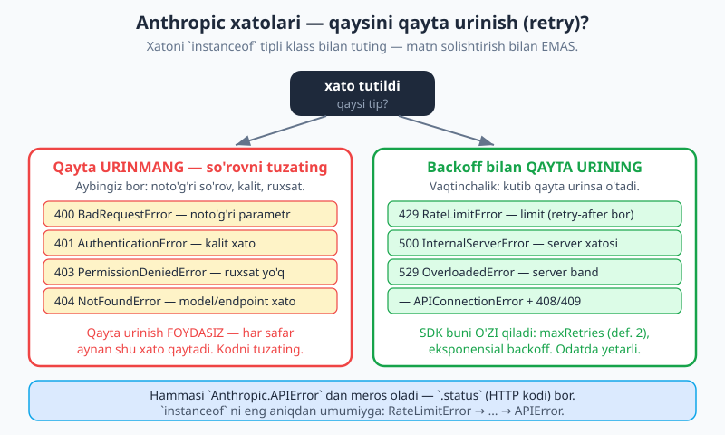
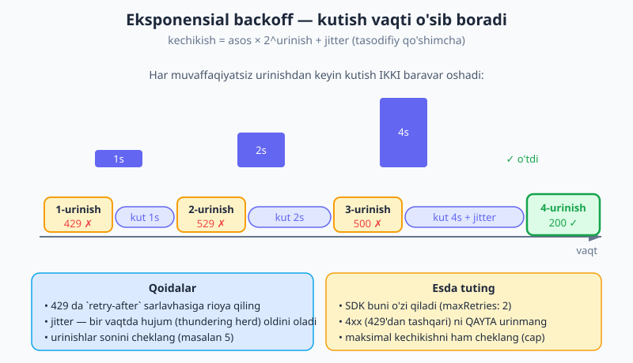
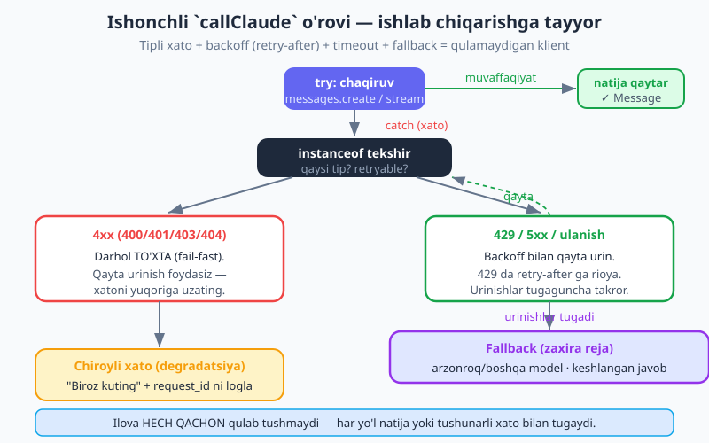

# 16 — Xatolar, retry va ishonchlilik

[⬅️ Oldingi: 15 — Prompt caching](./15-prompt-caching.md) · [🏠 README](./README.md) · [Keyingi: 17 — Embeddings va semantik qidiruv ➡️](./17-embeddings.md)

---

> **Bu bobda:** nega ishlab chiqarishda (production) API chaqiruvlari **muqarrar ravishda** ba'zan barbod bo'lishini va ishonchli klient ularni qanday **chiroyli** boshqarishini o'rganamiz. **Tipli xatolarni** — `Anthropic.RateLimitError`, `Anthropic.AuthenticationError`, `Anthropic.BadRequestError` va asosiy `Anthropic.APIError` (`.status` bilan) — `instanceof` orqali tutamiz (matn solishtirish bilan **emas**); to'liq xato jadvalini (400/401/403/404/429/5xx/529) va qaysisini qayta urinish (retry) mumkinligini ko'ramiz. SDK 429/5xx ni **o'zi** eksponensial backoff bilan qayta urinishini (`maxRetries`) va qachon o'z retry'ingizni yozish kerakligini bilib olamiz. So'ng qo'lda **eksponensial backoff** (`withRetry`) — `retry-after` ga rioya qilib, urinishlar sonini cheklab — yozamiz. **Timeout**, oqim (stream) ichidagi xatolar, javob darajasidagi "xatolar" (`stop_reason: "refusal"` va `"max_tokens"`) va ishonchlilik naqshlari (graceful degradation, fallback, `request_id` ni loglash) ni ko'rib chiqamiz. Yakunda — haqiqiy ilova ishlatishi mumkin bo'lgan ishlab-chiqarishga-tayyor `callClaude` o'rovini quramiz.
>
> **Halollik eslatmasi:** Bobdagi barcha SDK chaqiruvlari `@anthropic-ai/sdk` **v0.104** ga tayanadi: tipli xato klasslari (`Anthropic.BadRequestError`, `Anthropic.AuthenticationError`, `Anthropic.PermissionDeniedError`, `Anthropic.NotFoundError`, `Anthropic.RateLimitError`, `Anthropic.APIError`, `Anthropic.APIConnectionError`, `Anthropic.InternalServerError` — hammasi `APIError` dan meros oladi va `.status` ga ega), `new Anthropic({ maxRetries, timeout })`, `client.withOptions({ maxRetries })`, va `msg._request_id`. Bu klass va parametr nomlari haqiqatan mavjud — o'ylab topilgani yo'q.

---

## 1. Nega bu bob muhim? — production'da chaqiruvlar barbod bo'ladi

Hozirgacha kitobdagi misollarda biz baxtli yo'ldan (happy path) yurdik: `await client.messages.create(...)` — javob keldi, ishladi. Lokal mashinangizda, bir nechta sinov chaqiruvida bu deyarli har doim shunday. Lekin ilovangizni **real foydalanuvchilarga** ochsangiz, vaziyat tubdan o'zgaradi.

Minglab so'rov ostida, real tarmoq orqali, real serverga — chaqiruvlar **muqarrar** ba'zan barbod bo'ladi:

- **Rate limit (429).** Bir daqiqada ruxsat etilganidan ko'p so'rov yubordingiz. (Limitlar haqida — [14-bob](./14-token-narx-limit.md).)
- **Tarmoq uzilishi.** Foydalanuvchining Wi-Fi'i, serveringizning aloqasi, oraliq proksi — bir lahzaga "yiqildi".
- **Server ortiqcha yuklangan (529).** Anthropic infratuzilmasida vaqtinchalik yuqori talab.
- **Server xatosi (5xx).** Bir lahzalik ichki nosozlik.

> **Analogiya.** Tasavvur qiling, har kuni ishga avtobusda borasiz. Ko'p kunlar avtobus o'z vaqtida keladi. Lekin ba'zida — yo'l tirbandligi, sinish, gavjumlik. **Yomon yo'lovchi** birinchi muammoda taslim bo'ladi: "avtobus kelmadi, demak men bugun ishga bormayman". **Yaxshi yo'lovchi** esa rejaga ega: bir-ikki daqiqa kutadi (vaqtinchalik tirbandlik o'tib ketadi), keyingi avtobusni kutadi, kerak bo'lsa taksiga (zaxira reja) o'tadi. Ishonchli klient — aynan yaxshi yo'lovchi: vaqtinchalik muammoda **taslim bo'lmaydi**, balki aqlli ravishda qayta uradi yoki zaxira rejaga o'tadi.

Ishonchsiz klient bu xatolarda **qulab tushadi** (`throw` butun ilovani to'xtatadi) yoki foydalanuvchining so'rovini **yo'qotadi**. Ishonchli klient esa: tushunadi (qaysi xato?), qaror qiladi (qayta urinish mumkinmi?), va chiroyli boshqaradi (qayta urin, yoki zaxira rejaga o't, yoki foydalanuvchiga tushunarli xabar ber). Bu bobning maqsadi — sizning klientingizni yaxshi yo'lovchiga aylantirish.

---

## 2. Tipli xatolar — to'g'ri usul (`instanceof`, matn emas)

Xatoni tutganda birinchi savol: **bu qanday xato?** SDK bunga aniq javob beradi — har HTTP xato kodi uchun **alohida klass** bor. Ularni `instanceof` bilan tekshiring.

```js
import Anthropic from "@anthropic-ai/sdk";

const client = new Anthropic(); // ANTHROPIC_API_KEY muhitdan

try {
  const msg = await client.messages.create({
    model: "claude-opus-4-8",
    max_tokens: 1024,
    messages: [{ role: "user", content: "Salom!" }],
  });
  console.log(msg.content);
} catch (err) {
  if (err instanceof Anthropic.RateLimitError) {
    console.warn("Rate limit (429) — biroz kuting va qayta urining.");
  } else if (err instanceof Anthropic.AuthenticationError) {
    console.error("Kalit noto'g'ri (401) — ANTHROPIC_API_KEY ni tekshiring.");
  } else if (err instanceof Anthropic.BadRequestError) {
    console.error("Noto'g'ri so'rov (400):", err.message);
  } else if (err instanceof Anthropic.APIError) {
    // Asosiy (bazaviy) klass — boshqa hamma API xatolari shu yerga tushadi
    console.error(`API xatosi (${err.status}):`, err.message);
  } else {
    throw err; // API bilan bog'liq bo'lmagan xato — yuqoriga uzating
  }
}
```

E'tibor bering:

- **`err instanceof Anthropic.RateLimitError`** — bu xato aynan rate limit (429) ekanini **ishonchli** bildiradi. Klass nomi orqali, taxmin qilmasdan.
- **`Anthropic.APIError`** — barcha API xatolarining **bazaviy** klassi. Har bir maxsus klass (RateLimitError, BadRequestError, ...) undan meros oladi. Shuning uchun uni **oxirgi** (eng umumiy) tekshiruv sifatida qo'yamiz — bu yerga yuqorida tutilmagan hamma API xatolari tushadi. Uning `.status` maydoni — HTTP kodi (`429`, `400`, ...).

> ⚠️ **Eng muhim qoida: matn (string) solishtirmang.** Quyidagi kabi kod — **xato amaliyot**:
>
> ```js
> } catch (err) {
>   if (err.message.includes("429") || err.message.includes("rate_limit")) { ... } // ❌ NOTO'G'RI
> }
> ```
>
> Xato xabarining matni — bu API ning ichki tafsiloti; u istalgan vaqtda o'zgarishi mumkin, va tilga/formatga bog'liq. Bir kun "rate_limit" deb yozilgan bo'lsa, ertaga boshqacha bo'lishi mumkin — sizning `includes(...)` tekshiruvingiz jimgina ishlamay qoladi. **Klass tipli** — u o'zgarmaydi va xato kodiga qat'iy bog'langan. Har doim `instanceof` ishlating.

### To'liq xato jadvali — qaysini qayta urinish mumkin?



| HTTP | Tipli klass | Qayta urinish? | Sabab |
|---|---|---|---|
| 400 | `Anthropic.BadRequestError` | ❌ Yo'q | So'rov formati/parametri noto'g'ri |
| 401 | `Anthropic.AuthenticationError` | ❌ Yo'q | API kalit noto'g'ri yoki yo'q |
| 403 | `Anthropic.PermissionDeniedError` | ❌ Yo'q | Kalitda ruxsat yo'q |
| 404 | `Anthropic.NotFoundError` | ❌ Yo'q | Model/endpoint nomi noto'g'ri |
| 429 | `Anthropic.RateLimitError` | ✅ Ha | Juda ko'p so'rov (`retry-after` bor) |
| 500 | `Anthropic.InternalServerError` | ✅ Ha | Anthropic server xatosi |
| 529 | `Anthropic.OverloadedError` | ✅ Ha | Server vaqtinchalik band |
| — | `Anthropic.APIConnectionError` | ✅ Ha | Tarmoq uzildi / ulanib bo'lmadi |

**Asosiy mantiq juda sodda:**

- **4xx (400/401/403/404) — qayta URINMANG.** Bular **sizning** aybingiz: so'rov, kalit yoki ruxsat noto'g'ri. Aynan o'sha so'rovni qayta yuborsangiz, **aynan o'sha xato** qaytadi — qayta urinish faqat vaqt va token isrof qiladi. Ularni tuzatish kerak (kodda yoki sozlamada).
- **429, 5xx, ulanish xatolari — qayta URINING.** Bular **vaqtinchalik**: biroz kutib qayta urinsangiz, ko'pincha o'tib ketadi. Aynan shu yerda backoff ishga tushadi.

> **Bitta istisnoni eslang:** 429 — bu 4xx oilasidan, lekin u **qayta urinish mumkin** bo'lgan yagona 4xx. Chunki u "siz noto'g'ri qildingiz" emas, "hozir juda tez yubordingiz, biroz sekinroq" degani.

---

## 3. SDK buni siz uchun qiladi — `maxRetries`

Yaxshi xabar: 429 va 5xx (hamda ulanish) xatolari uchun **SDK avtomatik ravishda eksponensial backoff bilan qayta urinadi**. Standart sozlama — `maxRetries: 2` (ya'ni asl chaqiruv + 2 qayta urinish). Demak ko'p hollarda **siz hech qanday retry kodi yozishingiz shart emas** — SDK uni o'zi boshqaradi.

Bu sonni o'zgartirish oson — klient yaratishda:

```js
const client = new Anthropic({
  maxRetries: 5, // standart 2 o'rniga 5 marta qayta urinsin
});
```

Yoki bitta chaqiruv uchun (klientni o'zgartirmasdan), `withOptions` orqali:

```js
const msg = await client
  .withOptions({ maxRetries: 5 })
  .messages.create({
    model: "claude-opus-4-8",
    max_tokens: 1024,
    messages: [{ role: "user", content: "Salom!" }],
  });
```

`maxRetries: 0` — retry'ni butunlay o'chiradi.

**Demak nega qo'lda retry yozaman?** SDK ning avtomatik retry'i ko'p ilovaga yetadi. Lekin quyidagi holatlarda **o'z retry'ingiz** kerak bo'ladi:

- **Uzunroq yoki boshqacha backoff** — SDK ning standartidan farqli kutish strategiyasi (masalan, juda uzun kechikishlar, yoki maxsus jitter).
- **Maxsus loglash** — har bir urinishni o'z log tizimingizga yozish, metrikalar yig'ish.
- **Navbat (queueing)** — qayta urinish o'rniga so'rovni navbatga qo'yib, keyinroq bajarish.
- **Fallback bilan birlashtirish** — qayta urinishlar tugagach, boshqa modelga yoki keshlangan javobga o'tish (pastda quramiz).

Boshqacha aytganda: oddiy holatda `maxRetries` ni sozlang va tinch bo'ling. Murakkabroq mantiq kerak bo'lsa — keyingi bo'limdagi `withRetry` ni yozing.

---

## 4. Qo'lda eksponensial backoff — `withRetry`

Endi o'z retry mantig'imizni yozaylik. Asosiy g'oya — **eksponensial backoff**: har muvaffaqiyatsiz urinishdan keyin kutish vaqtini **ikki baravar** oshiramiz. Birinchi muvaffaqiyatsizlikda 1s, keyin 2s, keyin 4s, keyin 8s... Bunga **jitter** (kichik tasodifiy qo'shimcha) qo'shamiz — bu ko'p klient bir vaqtda qayta urinib serverga "to'p bo'lib bostirib kelishi" (thundering herd) muammosini oldini oladi.



Mana toza implementatsiya:

```js
import Anthropic from "@anthropic-ai/sdk";

// Berilgan millisekundga "uxlaydi" (kutadi)
const uxla = (ms) => new Promise((resolve) => setTimeout(resolve, ms));

// Bu xato qayta urinishga arziydimi?
function retryGaArziydimi(err) {
  if (err instanceof Anthropic.RateLimitError) return true;        // 429
  if (err instanceof Anthropic.APIConnectionError) return true;    // tarmoq
  if (err instanceof Anthropic.APIError) return err.status >= 500; // 5xx / 529
  return false; // 4xx (429'dan tashqari) va boshqalar — qayta urinmaymiz
}

async function withRetry(fn, { maxRetries = 5, base = 1000, cap = 30000 } = {}) {
  let oxirgiXato;

  for (let urinish = 0; urinish <= maxRetries; urinish++) {
    try {
      return await fn(); // muvaffaqiyat — natijani darhol qaytaramiz
    } catch (err) {
      oxirgiXato = err;

      // Qayta urinishga arzimasa (4xx) yoki urinishlar tugagan bo'lsa — to'xta
      if (!retryGaArziydimi(err) || urinish === maxRetries) {
        throw err;
      }

      // Kechikishni hisoblaymiz: base * 2^urinish + jitter
      let kechikish = Math.min(base * 2 ** urinish, cap);
      kechikish += Math.random() * 1000; // jitter (0–1s)

      // 429 bo'lsa, server aytgan `retry-after` ga rioya qilamiz
      if (err instanceof Anthropic.RateLimitError) {
        const retryAfter = Number(err.headers?.["retry-after"]);
        if (!Number.isNaN(retryAfter) && retryAfter > 0) {
          kechikish = Math.max(kechikish, retryAfter * 1000);
        }
      }

      console.warn(
        `Urinish ${urinish + 1}/${maxRetries} muvaffaqiyatsiz. ` +
          `${Math.round(kechikish)}ms dan keyin qayta...`
      );
      await uxla(kechikish);
    }
  }

  throw oxirgiXato; // mantiqan bu yerga yetib kelmaydi
}
```

Foydalanish — istalgan chaqiruvni `withRetry` ga o'rab:

```js
const client = new Anthropic({ maxRetries: 0 }); // SDK retry'ini o'chiramiz, o'zimizniki ishlaydi

const msg = await withRetry(() =>
  client.messages.create({
    model: "claude-opus-4-8",
    max_tokens: 1024,
    messages: [{ role: "user", content: "Salom!" }],
  })
);
```

Bu kodning muhim nuqtalari:

- **`retryGaArziydimi(err)`** — markaziy qaror. U faqat 429, 5xx va ulanish xatolarini "ha" deb baholaydi; 4xx larni "yo'q". Shuning uchun noto'g'ri so'rov (400) bo'lsa, darhol `throw` qilinadi — vaqt isrof bo'lmaydi.
- **`base * 2 ** urinish`** — eksponensial o'sish: `urinish=0` → 1s, `1` → 2s, `2` → 4s, `3` → 8s.
- **`Math.min(..., cap)`** — kechikish cheksiz o'smasligi uchun yuqori chegara (30s).
- **`retry-after` ga rioya** — 429 da Anthropic `retry-after` sarlavhasini qaytaradi (necha soniya kutish kerakligini aytadi). Biz uni o'qib, kechikishni hech bo'lmaganda shu qiymatga ko'taramiz. Bu — eng to'g'ri xulq, chunki server aynan qancha kutishni o'zi aytadi.
- **`urinish === maxRetries`** — urinishlar tugaganda oxirgi xatoni `throw` qilamiz. Cheksiz tsikl yo'q.

> **Eslatma — SDK retry'i bilan ikki marta urinmang.** Agar `withRetry` ishlatsangiz, klientda `maxRetries: 0` qo'ying. Aks holda SDK ham, sizning kodingiz ham qayta urinadi — kechikishlar ko'payadi va sonlar chalkashadi.

---

## 5. Timeout — javob juda uzoq kelmasa

Ba'zida xato umuman qaytmaydi — chaqiruv shunchaki **osilib qoladi**. Buning oldini olish uchun **timeout** (vaqt chegarasi) qo'yiladi: agar javob belgilangan vaqtda kelmasa, SDK chaqiruvni bekor qiladi.

Standart timeout — **10 daqiqa**. Uni qisqartirish mumkin:

```js
const client = new Anthropic({
  timeout: 20000, // 20 soniya (millisekundda)
});
```

Timeout sodir bo'lganda SDK `Anthropic.APIConnectionTimeoutError` tashlaydi (u `APIConnectionError` ning bir turi — ya'ni bizning `retryGaArziydimi` uni qayta urinishga arziydi deb baholaydi):

```js
try {
  const msg = await client
    .withOptions({ timeout: 20000 })
    .messages.create({
      model: "claude-opus-4-8",
      max_tokens: 1024,
      messages: [{ role: "user", content: "Uzun matn yoz." }],
    });
} catch (err) {
  if (err instanceof Anthropic.APIConnectionTimeoutError) {
    console.error("Chaqiruv juda uzoq cho'zildi (timeout).");
  }
}
```

> **Muhim bog'liqlik — uzun chiqishda streaming ishlating.** Agar uzun javob (katta `max_tokens`) kutsangiz, uni bitta uzun so'rovda olish timeout xavfini oshiradi. Buning yechimi — **streaming** ([04-bob](./04-streaming.md)). Streaming'da ma'lumot doimiy oqib turgani uchun ulanish "jim" qolmaydi va timeout muammosi yo'q. Amaliy qoida: uzun chiqishda `client.messages.stream()` ni standart qiling.

---

## 6. Javob darajasidagi "xatolar" — `refusal` va `max_tokens`

Hamma muammo `throw` bo'lmaydi. Ba'zilari **muvaffaqiyatli javob** ichida keladi — chaqiruv o'tdi (`200 OK`), lekin javobning `stop_reason` maydoni nimadir noto'g'ri ketganini bildiradi. Bular **istisno (exception) emas**, shuning uchun `try/catch` ularni tutmaydi — siz `stop_reason` ni o'zingiz tekshirishingiz kerak. ([`stop_reason` haqida to'liq — 03-bob](./03-messages-api.md).)

Ikkita muhim holat:

```js
const msg = await client.messages.create({
  model: "claude-opus-4-8",
  max_tokens: 1024,
  messages,
});

if (msg.stop_reason === "refusal") {
  // Xavfsizlik sababli rad etish. Bu xato EMAS — model ataylab rad etdi.
  // Foydalanuvchiga bildiring. AYNAN shu prompt bilan qayta URINMANG —
  // qayta urinish faqat aynan o'sha rad etishni qaytaradi.
  console.warn("Model xavfsizlik sababli rad etdi.");
} else if (msg.stop_reason === "max_tokens") {
  // Javob kesilgan (truncated) — max_tokens chegarasiga urildi.
  // max_tokens ni oshiring yoki streaming ishlating.
  console.warn("Javob kesilgan — max_tokens ni oshiring.");
}
```

- **`stop_reason: "refusal"`** — model xavfsizlik sababli javob berishdan **bosh tortdi**. Bu tarmoq nosozligi emas; aynan shu so'rovni qayta yuborish **foydasiz** (yana rad etadi). Buni foydalanuvchiga tushunarli ko'rsating va boshqa so'rovni kutib oling.
- **`stop_reason: "max_tokens"`** — javob to'liq tugamadi, `max_tokens` chegarasida **kesildi**. Yechim: `max_tokens` ni oshiring yoki uzun chiqish uchun streaming'ga o'ting.

> Bu ikkalasini **retry mantig'idan ajrating**. Backoff faqat `throw` bo'lgan vaqtinchalik xatolar uchun. `refusal` va `max_tokens` — muvaffaqiyatli javoblar; ularni `stop_reason` orqali alohida boshqaring.

---

## 7. Oqim (stream) ichidagi xatolar

Streaming uzoq davom etadigan ulanish ([04-bob](./04-streaming.md)) — uning **o'rtasida** ham xato bo'lishi mumkin (tarmoq uzildi, server xatosi). Buni ikki yo'l bilan tutamiz.

**`.on("error", ...)` bilan:**

```js
const stream = client.messages
  .stream({
    model: "claude-opus-4-8",
    max_tokens: 1024,
    messages: [{ role: "user", content: "Uzun hikoya yoz." }],
  })
  .on("text", (delta) => process.stdout.write(delta))
  .on("error", (err) => {
    console.error("\n[Oqimda xato]:", err.message);
  });

await stream.finalMessage();
```

**`for await` da — `try/catch` bilan:**

```js
try {
  for await (const event of stream) {
    if (event.type === "content_block_delta" && event.delta.type === "text_delta") {
      process.stdout.write(event.delta.text);
    }
  }
} catch (err) {
  if (err instanceof Anthropic.APIError) {
    console.error("\n[Oqim uzildi]:", err.status, err.message);
  } else {
    throw err;
  }
}
```

> ⚠️ **Diqqat — yarim javob.** Oqim o'rtasida xato yuzaga kelsa, bir qism matn **allaqachon ekranga chiqib bo'lgan** bo'lishi mumkin. Ya'ni foydalanuvchi **to'liq bo'lmagan** javobni ko'rib turibdi. Buni chiroyli boshqaring: yarim javobni belgilang ("javob to'liq emas"), kerak bo'lsa qaytadan boshlang. Oqimni qayta urinish biroz murakkabroq — chunki retry butun oqimni boshidan boshlaydi, yarmidan emas. Shuning uchun ko'p ilovada oqim uzilganda butun chaqiruvni qaytadan boshlash eng sodda yechim.

---

## 8. Ishonchlilik naqshlari

Tipli xato + retry — poydevor. Ustiga production ilova quyidagi naqshlarni qo'shadi.

**1. Graceful degradation (yumshoq pasayish) — fallback.** Agar asosiy yo'l ishlamasa, ilova **butunlay yiqilmasin**, balki kamroq, ammo ishlaydigan natijaga "pasaysin". Masalan: asosiy model band bo'lsa, **boshqa modelga** o'ting; yoki shunga o'xshash savol uchun **keshlangan** (oldin saqlangan) javobni qaytaring. Foydalanuvchi mukammal bo'lmasa-da, **biror** javob oladi.

**2. Foydalanuvchiga tushunarli xabar.** Texnik xato matnini (`"429 rate_limit_error..."`) foydalanuvchiga ko'rsatmang. 429 da: *"Hozir tizim band, biroz kuting va qayta urinib ko'ring."* Bu — yaxshi UX.

**3. `request_id` ni loglash.** Har bir javob obyektida `_request_id` bor (HTTP `request-id` sarlavhasidan). Xato yuz berganda uni **loglang** — Anthropic'ga muammo haqida murojaat qilsangiz, bu ID so'rovni topishga yordam beradi. Pastki chiziq (`_`) bo'lsa-da, bu **ommaviy** xususiyat:

```js
const msg = await client.messages.create({ /* ... */ });
console.log("Request ID:", msg._request_id); // req_018Ee...
```

Xatoda ham: tutilgan `Anthropic.APIError` da `err.request_id` bo'lishi mumkin — uni log'ga yozing.

**4. Circuit breaker (qisqacha g'oya).** Agar bir xizmat **ketma-ket ko'p marta** barbod bo'layotgan bo'lsa, har safar urinaverish foydasiz — faqat yukni oshiradi. "Circuit breaker" (avtomatik o'chirgich, elektrdagi probka kabi) g'oyasi: ketma-ket N marta xatodan keyin **"ochiq"** holatga o'tib, bir muddat (masalan, 30s) chaqiruvlarni **umuman to'xtatadi** (yoki darhol fallback'ga yo'naltiradi). Vaqt o'tgach, bitta sinov chaqiruvi yuboradi — agar o'tsa, "yopiq" holatga qaytadi. Bu serverga ham, sizning ilovangizga ham nafas oldiradi. (To'liq implementatsiya bu bobdan tashqarida, lekin g'oyani bilib qo'ying.)

**5. Idempotentlik / dedup.** Bir xil so'rov ikki marta yuborilib qolsa (foydalanuvchi tugmani ikki marta bossa, retry ustma-ust tushsa), ikki marta token sarflamaslik uchun so'rovga noyob kalit bering va natijani keshlang — bir xil kalitli so'rov ikkinchi marta kelsa, saqlangan natijani qaytaring.

---

## 9. Loyiha: ishlab-chiqarishga-tayyor `callClaude` o'rovi

Endi hammasini birlashtiramiz — haqiqiy ilova ishlatishi mumkin bo'lgan **bitta funksiya**: tipli xato boshqaruvi + backoff (`retry-after` ga rioya) + timeout + fallback.



```js
// call-claude.js
import Anthropic from "@anthropic-ai/sdk";

const client = new Anthropic({
  maxRetries: 0,   // o'z retry'imiz ishlaydi
  timeout: 30000,  // har chaqiruvga 30s
});

const uxla = (ms) => new Promise((r) => setTimeout(r, ms));

function retryGaArziydimi(err) {
  if (err instanceof Anthropic.RateLimitError) return true;
  if (err instanceof Anthropic.APIConnectionError) return true; // timeout ham shu yerda
  if (err instanceof Anthropic.APIError) return err.status >= 500;
  return false;
}

/**
 * Ishonchli Claude chaqiruvi.
 * @param {object} params - messages.create parametrlari (model, messages, ...)
 * @param {object} opts   - { maxRetries, base, cap, fallbackModel }
 */
async function callClaude(params, opts = {}) {
  const {
    maxRetries = 4,
    base = 1000,
    cap = 30000,
    fallbackModel = "claude-haiku-4-5", // band bo'lsa arzonroq/yengilroq modelga o'tamiz
  } = opts;

  let oxirgiXato;

  for (let urinish = 0; urinish <= maxRetries; urinish++) {
    try {
      const msg = await client.messages.create(params);

      // Javob darajasidagi holatlarni tekshiramiz (bular throw EMAS)
      if (msg.stop_reason === "refusal") {
        // Qayta urinish foydasiz — to'g'ridan-to'g'ri qaytaramiz, chaqiruvchi hal qiladi
        return { ok: false, reason: "refusal", message: msg };
      }
      if (msg.stop_reason === "max_tokens") {
        console.warn("⚠️ Javob kesilgan (max_tokens). Request:", msg._request_id);
      }

      return { ok: true, message: msg };
    } catch (err) {
      oxirgiXato = err;

      // 4xx (429'dan tashqari) — darhol to'xta (fail-fast)
      if (!retryGaArziydimi(err)) {
        console.error("Qayta urinilmaydigan xato:", err.status, err.message);
        break;
      }

      // Urinishlar tugadi — fallback'ga o'tamiz
      if (urinish === maxRetries) break;

      let kechikish = Math.min(base * 2 ** urinish, cap) + Math.random() * 1000;
      if (err instanceof Anthropic.RateLimitError) {
        const ra = Number(err.headers?.["retry-after"]);
        if (!Number.isNaN(ra) && ra > 0) kechikish = Math.max(kechikish, ra * 1000);
      }
      console.warn(`Urinish ${urinish + 1} muvaffaqiyatsiz, ${Math.round(kechikish)}ms kutamiz...`);
      await uxla(kechikish);
    }
  }

  // Asosiy yo'l barbod bo'ldi — FALLBACK: boshqa model bilan bir marta urinib ko'ramiz
  if (fallbackModel && params.model !== fallbackModel) {
    console.warn(`Asosiy model ishlamadi — fallback (${fallbackModel}) bilan urinamiz.`);
    try {
      const msg = await client.messages.create({ ...params, model: fallbackModel });
      return { ok: true, message: msg, usedFallback: true };
    } catch (err) {
      oxirgiXato = err;
    }
  }

  // Hamma yo'l barbod — chiroyli, tushunarli natija qaytaramiz (ilova qulamaydi)
  console.error("Hamma urinish barbod. So'nggi xato:", oxirgiXato?.message);
  return {
    ok: false,
    reason: "exhausted",
    userMessage: "Hozir tizim band. Iltimos, biroz kuting va qayta urinib ko'ring.",
    error: oxirgiXato,
  };
}

// --- Foydalanish ---
const natija = await callClaude({
  model: "claude-opus-4-8",
  max_tokens: 1024,
  messages: [{ role: "user", content: "Node.js'da event loop nima?" }],
});

if (natija.ok) {
  const matn = natija.message.content.find((b) => b.type === "text")?.text ?? "";
  console.log(natija.usedFallback ? "[fallback model]" : "[asosiy model]");
  console.log(matn);
} else if (natija.reason === "refusal") {
  console.log("Model bu so'rovga javob bera olmaydi.");
} else {
  console.log(natija.userMessage); // foydalanuvchiga tushunarli xabar
}
```

Bu funksiya nima qiladi:

1. **Tipli xato tarmog'i.** 4xx bo'lsa darhol to'xtaydi (fail-fast); 429/5xx/ulanish bo'lsa qayta urinadi.
2. **Backoff `retry-after` bilan.** Eksponensial kutish + jitter, 429 da serverning ko'rsatmasiga rioya.
3. **Timeout.** Klientda 30s — osilib qolish yo'q.
4. **Javob darajasi.** `refusal` va `max_tokens` ni alohida boshqaradi.
5. **Fallback.** Asosiy model barbod bo'lsa, arzonroq modelga bir marta o'tadi.
6. **Chiroyli yakun.** Hech qachon `throw` bilan ilovani qulatmaydi — har doim `{ ok, ... }` qaytaradi, foydalanuvchi uchun tushunarli xabar bilan.

Bu naqsh sizning real AI ilovangizning **negizi** — har bir Claude chaqiruvini shu o'rovdan o'tkazsangiz, ilova vaqtinchalik nosozliklarga chidamli (resilient) bo'ladi.

---

## 10. Tez-tez uchraydigan xatolar

| Xato | Sabab | Yechim |
|---|---|---|
| `err.message.includes("429")` bilan tekshirish | Matn solishtirish — mo'rt va ishonchsiz | `err instanceof Anthropic.RateLimitError` |
| 400/401 da qayta urinish | 4xx — sizning aybingiz, takror foydasiz | Faqat 429/5xx/ulanishni qayta uring |
| SDK retry + o'z retry ikkalasi | Ikki marta qayta urinadi, kechikish ko'payadi | `withRetry` bilan klientda `maxRetries: 0` |
| `refusal` da qayta urinish | Bu xato emas, model ataylab rad etdi | `stop_reason` ni tekshiring, qayta urmang |
| `max_tokens` ni xato deb tutish | Bu `throw` emas, kesilgan javob | `stop_reason === "max_tokens"` — oshiring/stream |
| Backoff'da jitter yo'q | Ko'p klient bir vaqtda urinadi (thundering herd) | `+ Math.random() * 1000` qo'shing |
| Cheksiz retry | `maxRetries` cheklanmagan | Urinishlar sonini va `cap` ni cheklang |
| Oqim o'rtasidagi xato ushlanmadi | `.on("error")` yoki `try/catch` yo'q | Oqimni o'rang; yarim javobni belgilang |
| Uzun chiqishda timeout | Katta `max_tokens` streamingsiz | `client.messages.stream()` ga o'ting |

---

## Xulosa

- Production'da chaqiruvlar **muqarrar** ba'zan barbod bo'ladi (429, tarmoq, 5xx, 529). Ishonchli klient yiqilmaydi — tushunadi, qaror qiladi, chiroyli boshqaradi.
- Xatoni **tipli klass** bilan tuting: `Anthropic.RateLimitError`, `AuthenticationError`, `BadRequestError`, ..., va bazaviy `Anthropic.APIError` (`.status` bilan). `instanceof` ishlating — **matn solishtirmang**.
- **4xx (400/401/403/404)** — qayta urinmang, tuzating. **429/5xx/529/ulanish** — backoff bilan qayta uring.
- **SDK buni o'zi qiladi** (`maxRetries`, def. 2, eksponensial backoff). O'z retry'ingiz faqat maxsus backoff/loglash/navbat/fallback kerak bo'lganda.
- Qo'lda backoff: `base * 2^urinish + jitter`, 429 da `retry-after` ga rioya, urinishlar va `cap` cheklangan, 4xx qayta urinilmaydi.
- **Timeout** ni sozlang; uzun chiqishda **streaming** ([04-bob](./04-streaming.md)).
- **Javob darajasi**: `refusal` (rad — qayta urmang) va `max_tokens` (kesilgan — oshiring/stream) — bular `throw` emas, `stop_reason` orqali.
- Ishonchlilik: fallback (degradatsiya), foydalanuvchiga tushunarli xabar, `request_id` ni loglash, circuit breaker g'oyasi.

---

## Mashqlar

Mashqlar uchun `client` ni 02-bobdagidek sozlang (`new Anthropic()` + `.env` da `ANTHROPIC_API_KEY`). Tokenni isrof qilmaslik uchun kichik `max_tokens` (masalan 256) bilan boshlang.

### Oson

1. `try/catch` yozing va `Anthropic.AuthenticationError` ni alohida tuting. Uni qo'zg'atish uchun klientni ataylab noto'g'ri kalit bilan yarating: `new Anthropic({ apiKey: "xato-kalit" })` va chaqiruv qiling. Xato klassini `console.log(err.constructor.name)` bilan chop eting.

2. Bir funksiya `retryMumkinmi(err)` yozing — u `Anthropic.RateLimitError`, `APIConnectionError` va 5xx larga `true`, qolganlariga `false` qaytarsin. Uni har xil soxta xato obyektlari bilan sinab ko'ring.

3. Klientni `new Anthropic({ maxRetries: 5, timeout: 15000 })` bilan sozlang va oddiy chaqiruv qiling. SDK endi 429/5xx ni 5 marta o'zi qayta urinishini tushuntiring (kod izohida).

4. Bir chaqiruvdan keyin `msg._request_id` ni chop eting. Nega uni loglash foydali ekanini bir jumlada izohlang.

### O'rta

5. 4-bo'limdagi `withRetry` funksiyasini yozing va uni bir chaqiruvga o'rab ishlating. `console.warn` orqali har urinishdagi kechikishni ko'rsating.

6. `withRetry` ga `retry-after` ga rioya qo'shilganini tekshiring: soxta `RateLimitError` (qo'lda `err.headers = { "retry-after": "3" }` qo'yib) bilan, kechikish kamida 3000ms bo'lishini `console.assert` bilan tasdiqlang.

7. `stop_reason` ni boshqaruvchi funksiya yozing: u `msg` ni oladi va `"end_turn"`, `"max_tokens"`, `"refusal"` uchun har xil xabar qaytaradi. `refusal` da "qayta urinmang" deb ogohlantirsin.

8. Streaming chaqiruvini `.on("error", ...)` bilan o'rang. Internetni o'chirib (yoki noto'g'ri kalit bilan) xato chiroyli ushlanishini va yarim javob holatini ko'ring.

### Qiyin

9. 9-bo'limdagi `callClaude` o'rovini yozing va sinang: asosiy model `"claude-opus-4-8"`, fallback `"claude-haiku-4-5"`. Natija `{ ok, ... }` strukturasini to'g'ri boshqaring.

10. `callClaude` ga oddiy **circuit breaker** qo'shing: modul darajasida `xatolarKetmaKet` hisoblagichi tuting. Ketma-ket 3 xatodan keyin keyingi 30s ichida chaqiruvni **umuman qilmasdan** darhol fallback'ga (yoki xatoga) o'ting. Muvaffaqiyatda hisoblagichni nolga tushiring.

11. **Idempotentlik**: `callClaude` ga `key` parametri qo'shing va natijalarni `Map` da keshlang. Bir xil `key` bilan ikkinchi chaqiruv kelsa, API ga bormasdan keshlangan natijani qaytaring (qo'shimcha token sarflamang).

12. SDK ning avtomatik retry'i bilan o'zingiznikini **taqqoslang**: bir chaqiruvni `new Anthropic({ maxRetries: 3 })` bilan, ikkinchisini `maxRetries: 0` + `withRetry({ maxRetries: 3 })` bilan bajaring. Ikkalasi ham 429/5xx da bir xil natija berishini va 400 da darhol to'xtashini tekshiring.

<details markdown="1">
<summary>Yechimlar</summary>

Yechimlarda umumiy boshlanish shu deb faraz qilinadi:

```js
import Anthropic from "@anthropic-ai/sdk";
const client = new Anthropic(); // ANTHROPIC_API_KEY .env / muhitdan
const uxla = (ms) => new Promise((r) => setTimeout(r, ms));
```

**1.**
```js
const xatoKlient = new Anthropic({ apiKey: "xato-kalit" });
try {
  await xatoKlient.messages.create({
    model: "claude-opus-4-8",
    max_tokens: 256,
    messages: [{ role: "user", content: "Salom" }],
  });
} catch (err) {
  if (err instanceof Anthropic.AuthenticationError) {
    console.log("Autentifikatsiya xatosi (401):", err.message);
  }
  console.log("Klass nomi:", err.constructor.name); // AuthenticationError
}
```

**2.**
```js
function retryMumkinmi(err) {
  if (err instanceof Anthropic.RateLimitError) return true;
  if (err instanceof Anthropic.APIConnectionError) return true;
  if (err instanceof Anthropic.APIError) return err.status >= 500;
  return false;
}
// Sinov: APIError dan soxta obyektlar yasab ko'rsa bo'ladi, lekin eng ishonchli —
// real xatolar bilan. Mantiq: 429/ulanish/5xx → true, 400/401/403/404 → false.
```

**3.**
```js
const client = new Anthropic({ maxRetries: 5, timeout: 15000 });
const msg = await client.messages.create({
  model: "claude-opus-4-8",
  max_tokens: 256,
  messages: [{ role: "user", content: "Salom" }],
});
console.log(msg.content);
// SDK endi 429 va 5xx (va ulanish) xatolarini eksponensial backoff bilan
// 5 martagacha O'ZI qayta urinadi — qo'shimcha retry kodi shart emas.
```

**4.**
```js
const msg = await client.messages.create({
  model: "claude-opus-4-8",
  max_tokens: 256,
  messages: [{ role: "user", content: "Salom" }],
});
console.log("Request ID:", msg._request_id);
// Foydali: xato/muammoda Anthropic'ga shu ID bilan murojaat qilsangiz,
// ular so'rovni log'larida aniq topa oladi.
```

**5.**
```js
function retryGaArziydimi(err) {
  if (err instanceof Anthropic.RateLimitError) return true;
  if (err instanceof Anthropic.APIConnectionError) return true;
  if (err instanceof Anthropic.APIError) return err.status >= 500;
  return false;
}
async function withRetry(fn, { maxRetries = 5, base = 1000, cap = 30000 } = {}) {
  let oxirgiXato;
  for (let urinish = 0; urinish <= maxRetries; urinish++) {
    try {
      return await fn();
    } catch (err) {
      oxirgiXato = err;
      if (!retryGaArziydimi(err) || urinish === maxRetries) throw err;
      let kechikish = Math.min(base * 2 ** urinish, cap) + Math.random() * 1000;
      if (err instanceof Anthropic.RateLimitError) {
        const ra = Number(err.headers?.["retry-after"]);
        if (!Number.isNaN(ra) && ra > 0) kechikish = Math.max(kechikish, ra * 1000);
      }
      console.warn(`Urinish ${urinish + 1}: ${Math.round(kechikish)}ms kutamiz`);
      await uxla(kechikish);
    }
  }
  throw oxirgiXato;
}

const noRetryKlient = new Anthropic({ maxRetries: 0 });
const msg = await withRetry(() =>
  noRetryKlient.messages.create({
    model: "claude-opus-4-8",
    max_tokens: 256,
    messages: [{ role: "user", content: "Salom" }],
  })
);
console.log(msg.content);
```

**6.** `retry-after` ga rioyani izolyatsiyalab tekshiramiz (faqat hisoblash mantig'i):
```js
function kechikishHisobla(err, urinish, base = 1000, cap = 30000) {
  let kechikish = Math.min(base * 2 ** urinish, cap); // jittersiz — tasdiqlash uchun
  if (err instanceof Anthropic.RateLimitError) {
    const ra = Number(err.headers?.["retry-after"]);
    if (!Number.isNaN(ra) && ra > 0) kechikish = Math.max(kechikish, ra * 1000);
  }
  return kechikish;
}

// Soxta RateLimitError: prototipini RateLimitError ga moslab, headers qo'yamiz
const soxta = Object.create(Anthropic.RateLimitError.prototype);
soxta.headers = { "retry-after": "3" };

const k = kechikishHisobla(soxta, 0); // base=1000 → 1000, lekin retry-after=3000
console.assert(k >= 3000, "retry-after ga rioya qilinmadi!");
console.log("Kechikish:", k, "ms (kamida 3000 bo'lishi kerak)");
```

**7.**
```js
function stopReasonBoshqar(msg) {
  switch (msg.stop_reason) {
    case "end_turn":
      return { holat: "ok", matn: msg.content.find((b) => b.type === "text")?.text ?? "" };
    case "max_tokens":
      return { holat: "kesilgan", xabar: "Javob kesilgan — max_tokens ni oshiring yoki stream." };
    case "refusal":
      return { holat: "rad", xabar: "Model rad etdi (xavfsizlik). Aynan shu prompt bilan QAYTA URINMANG." };
    default:
      return { holat: "boshqa", xabar: `stop_reason: ${msg.stop_reason}` };
  }
}

const msg = await client.messages.create({
  model: "claude-opus-4-8",
  max_tokens: 256,
  messages: [{ role: "user", content: "Salom" }],
});
console.log(stopReasonBoshqar(msg));
```

**8.**
```js
const stream = client.messages
  .stream({
    model: "claude-opus-4-8",
    max_tokens: 256,
    messages: [{ role: "user", content: "Uzunroq matn yoz." }],
  })
  .on("text", (d) => process.stdout.write(d))
  .on("error", (err) => {
    console.error("\n[Oqimda xato]:", err.message);
    console.error("(Yarim javob allaqachon chiqqan bo'lishi mumkin.)");
  });
try {
  await stream.finalMessage();
} catch (err) {
  console.error("[finalMessage xatosi]:", err.message);
}
// Sinash: new Anthropic({ apiKey: "xato" }) bilan oqim oching.
```

**9.**
```js
const client = new Anthropic({ maxRetries: 0, timeout: 30000 });

function retryGaArziydimi(err) {
  if (err instanceof Anthropic.RateLimitError) return true;
  if (err instanceof Anthropic.APIConnectionError) return true;
  if (err instanceof Anthropic.APIError) return err.status >= 500;
  return false;
}

async function callClaude(params, opts = {}) {
  const { maxRetries = 4, base = 1000, cap = 30000, fallbackModel = "claude-haiku-4-5" } = opts;
  let oxirgiXato;
  for (let urinish = 0; urinish <= maxRetries; urinish++) {
    try {
      const msg = await client.messages.create(params);
      if (msg.stop_reason === "refusal") return { ok: false, reason: "refusal", message: msg };
      return { ok: true, message: msg };
    } catch (err) {
      oxirgiXato = err;
      if (!retryGaArziydimi(err)) break;
      if (urinish === maxRetries) break;
      let k = Math.min(base * 2 ** urinish, cap) + Math.random() * 1000;
      if (err instanceof Anthropic.RateLimitError) {
        const ra = Number(err.headers?.["retry-after"]);
        if (!Number.isNaN(ra) && ra > 0) k = Math.max(k, ra * 1000);
      }
      await uxla(k);
    }
  }
  if (fallbackModel && params.model !== fallbackModel) {
    try {
      const msg = await client.messages.create({ ...params, model: fallbackModel });
      return { ok: true, message: msg, usedFallback: true };
    } catch (err) {
      oxirgiXato = err;
    }
  }
  return { ok: false, reason: "exhausted", userMessage: "Tizim band, biroz kuting.", error: oxirgiXato };
}

const r = await callClaude({
  model: "claude-opus-4-8",
  max_tokens: 256,
  messages: [{ role: "user", content: "Salom" }],
});
console.log(r.ok ? r.message.content : r.userMessage ?? r.reason);
```

**10.** Circuit breaker — modul darajasidagi holat:
```js
let xatolarKetmaKet = 0;
let ochiqGacha = 0; // shu vaqtgacha "ochiq" (chaqiruv qilmaymiz)

async function callClaudeCB(params, opts = {}) {
  const { fallbackModel = "claude-haiku-4-5" } = opts;

  // Breaker "ochiq" bo'lsa — API ga bormasdan darhol fallback/xato
  if (Date.now() < ochiqGacha) {
    console.warn("Circuit OCHIQ — API'ga bormaymiz.");
    if (fallbackModel) {
      try {
        const msg = await client.messages.create({ ...params, model: fallbackModel });
        return { ok: true, message: msg, usedFallback: true };
      } catch {
        /* fallback ham yiqildi */
      }
    }
    return { ok: false, reason: "circuit_open", userMessage: "Tizim band, keyinroq urining." };
  }

  try {
    const msg = await client.messages.create(params);
    xatolarKetmaKet = 0; // muvaffaqiyat — hisoblagich nol
    return { ok: true, message: msg };
  } catch (err) {
    xatolarKetmaKet++;
    if (xatolarKetmaKet >= 3) {
      ochiqGacha = Date.now() + 30000; // 30s ga "ochiq"
      console.warn("Ketma-ket 3 xato — circuit 30s ga OCHILDI.");
    }
    return { ok: false, reason: "error", error: err };
  }
}
```

**11.** Idempotentlik / dedup keshi:
```js
const kesh = new Map();

async function callClaudeKesh(params, key) {
  if (key && kesh.has(key)) {
    console.log("[keshdan]");
    return kesh.get(key); // API ga bormaymiz — token tejaymiz
  }
  const msg = await client.messages.create(params);
  const natija = { ok: true, message: msg };
  if (key) kesh.set(key, natija);
  return natija;
}

const a = await callClaudeKesh(
  { model: "claude-opus-4-8", max_tokens: 256, messages: [{ role: "user", content: "2+2?" }] },
  "savol-2plus2"
);
const b = await callClaudeKesh({ /* bir xil */ }, "savol-2plus2"); // keshdan, API'siz
console.log(a.message === b.message); // true — aynan o'sha obyekt
```

**12.**
```js
// (a) SDK avtomatik retry
const sdkKlient = new Anthropic({ maxRetries: 3 });
const r1 = await sdkKlient.messages.create({
  model: "claude-opus-4-8",
  max_tokens: 256,
  messages: [{ role: "user", content: "Salom" }],
});

// (b) Qo'lda retry (5-yechimadagi withRetry bilan)
const qoYda = new Anthropic({ maxRetries: 0 });
const r2 = await withRetry(() =>
  qoYda.messages.create({
    model: "claude-opus-4-8",
    max_tokens: 256,
    messages: [{ role: "user", content: "Salom" }],
  }),
  { maxRetries: 3 }
);

// Ikkalasi ham 429/5xx da qayta urinadi va o'tadi.
// 400 (masalan, noto'g'ri model nomi) da ikkalasi ham DARHOL to'xtaydi —
// SDK ham, withRetry ham 4xx ni qayta urinmaydi.
console.log(r1.content, r2.content);
```

</details>

---

[⬅️ Oldingi: 15 — Prompt caching](./15-prompt-caching.md) · [🏠 README](./README.md) · [Keyingi: 17 — Embeddings va semantik qidiruv ➡️](./17-embeddings.md)
