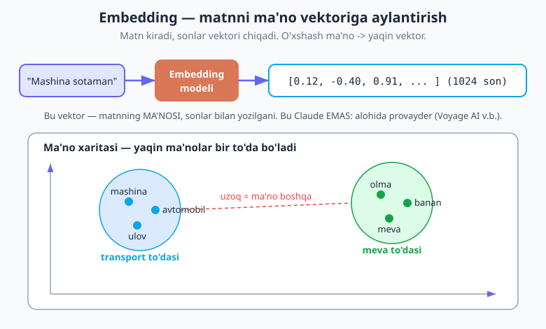
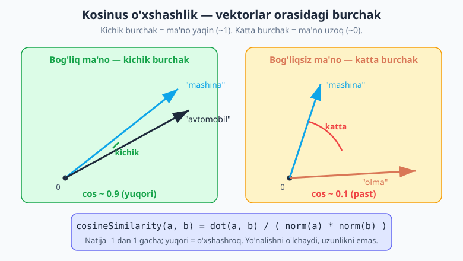
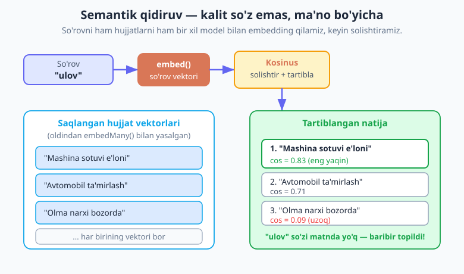

# 17 — Embeddings va semantik qidiruv

[⬅️ Oldingi: 16 — Xatolar, retry va ishonchlilik](./16-xatolar-retry.md) · [🏠 README](./README.md) · [Keyingi: 18 — Vektor baza va RAG ➡️](./18-vector-db-rag.md)

---

> **Bu bobda:** shu paytgacha siz Claude'ga matn yuborib, matn olgansiz. Endi boshqa turdagi vazifaga kiramiz: matnni **ma'nosi bo'yicha** qidirish. Kalit so'z qidiruvi "mashina" so'zini izlasa, "avtomobil" yoki "ulov" yozilgan hujjatni topa olmaydi — garchi ular **bir narsani** anglatsa ham. **Embedding** (vektor tasviri) aynan shu muammoni yechadi: u har bir matnni *sonlar vektoriga* aylantiradi, shunday qilib o'xshash MA'NOLI matnlar bir-biriga *yaqin* vektor bo'ladi. Shu yaqinlikni o'lchab (kosinus o'xshashlik) biz **semantik qidiruv** — ma'no bo'yicha qidiruvni — quramiz. Bu bob keyingi bobdagi **RAG** ([18-bob](./18-vector-db-rag.md)) ning poydevoridir. Oxirida hech qanday baza ishlatmasdan, xotira ichida 8 ta jumla ustidan semantik qidiruvni noldan quramiz.

> **Halollik eslatmasi:** **Claude embedding bermaydi** — Anthropic'da embedding API yo'q. Embedding uchun siz *alohida provayder* ishlatasiz; Anthropic rasman **Voyage AI** ni (`voyage-3`) tavsiya qiladi. Boshqa variantlar: OpenAI embeddings, Cohere, yoki lokal/ochiq-manba (`@xenova/transformers`). Ya'ni RAG ilovasi **ikkita** modeldan foydalanadi: embedding uchun bittasi, **javob generatsiyasi** uchun Claude. Bu — me'yor, kamchilik emas. Kod misollari AI SDK v6 (`ai` 6.0) ga tayanadi; generatsiya modeli — `claude-opus-4-8`.

---

## Nega kalit so'z qidiruvi yetarli emas?

Tasavvur qiling, sizda e'lonlar bazasi bor va foydalanuvchi "**ulov sotib olmoqchiman**" deb yozdi. Bazada esa shunday e'lonlar bor:

- "Mashina sotuvi: arzon narxda"
- "Avtomobil ta'mirlash ustaxonasi"
- "Olma bog'i sotiladi"

Klassik **kalit so'z qidiruvi** (`LIKE '%ulov%'` yoki to'liq-matn indeks) bu yerda **hech narsa topmaydi**: birorta e'londa "ulov" so'zi yo'q. Lekin inson uchun ayon — birinchi ikki e'lon aynan foydalanuvchi izlagan narsa! "Ulov", "mashina", "avtomobil" — *bir xil ma'no*, lekin *boshqa so'zlar*. Kalit so'z qidiruvi **harflarni** solishtiradi, **ma'noni** emas.

Bu muammo hamma joyda uchraydi:

- **Sinonimlar:** "ulov" / "mashina" / "transport".
- **Boshqacha ifoda:** "narxi qancha?" / "qancha turadi?" / "qiymati nima?".
- **Imlo/shevani farqi:** "telifon" / "telefon".
- **Tushuncha darajasi:** "mevali daraxt" so'rovi "olma bog'i" hujjatiga mos kelishi kerak.

Kerakli narsa — **ma'no bo'yicha qidiruv** (semantik qidiruv). Va buni amalga oshirish uchun avval matnni mashina tushunadigan, *ma'noni saqlaydigan* shaklga o'tkazishimiz kerak. Aynan shu — embedding.

---

## Embedding nima?

**Embedding** (o'zbekcha taxminan "joylashtirish", vektor tasviri) — bu matnning ma'nosini ifodalovchi *belgilangan uzunlikdagi sonlar vektori* (massiv). Masalan, "Mashina sotaman" matni 1024 ta sondan iborat vektorga aylanishi mumkin:

```js
[0.012, -0.4, 0.91, 0.07, -0.22, /* ... yana 1019 son ... */, 0.15]
```

Bu sonlarning har biri o'z-o'zidan hech narsa anglatmaydi — siz ularni "o'qiy olmaysiz". Muhim narsa — **butun vektorning yo'nalishi**. Embedding modeli shunday o'rgatilganki:

> Ma'nosi o'xshash matnlar → yo'nalishi o'xshash (bir-biriga yaqin) vektorlar.
>
> Ma'nosi uzoq matnlar → yo'nalishi har xil vektorlar.

**Analogiya — "ma'noning GPS koordinatasi".** Har bir matnga ma'no fazosida bir nuqta (koordinata) beriladi deb tasavvur qiling. "Mashina", "avtomobil", "ulov" bir-biriga juda yaqin nuqtalar — ular bir "tumanda" yashaydi. "Olma", "banan", "meva" esa boshqa bir tumanda. Ikki tuman orasidagi masofa katta, chunki ularning ma'nosi uzoq. Embedding modeli — aynan shu "ma'no xaritasi"ning koordinatalarini chiqaradigan funksiya.



[01-bobda](./01-llm-nima.md) siz LLM matnni **tokenlarga** bo'lib, har bir tokenni ichki sonli tasvir bilan ishlashini ko'rgandingiz. Embedding ham shunga o'xshash g'oya, lekin bu yerda biz **butun bir matn parchasi**ning yagona, yaxlit ma'no-vektorini olamiz va undan tashqarida — qidiruvda, taqqoslashda — foydalanamiz.

> **Vektorning o'lchami (dimension) nima?** Vektordagi sonlar soni — uning *o'lchami*. `voyage-3` 1024 o'lcham beradi, boshqa modellar 256, 512, 1536 yoki undan ko'p berishi mumkin. Ko'proq o'lcham — ko'pincha aniqroq, lekin sekinroq va ko'proq joy egallaydi. Muhim qoida: **bir to'plam ichidagi barcha vektorlar bir xil o'lchamli bo'lishi kerak** — ya'ni hammasini *bir xil model* yasashi shart.

Embedding nimalarga ishlatiladi?

- **Semantik qidiruv** — ma'no bo'yicha hujjat topish (shu bob).
- **RAG** — foydalanuvchi savoliga eng mos bilim parchalarini topib, Claude'ga berish ([18-bob](./18-vector-db-rag.md)).
- **Tavsiya** (recommendation) — "shunga o'xshash maqolalar".
- **Dublikat topish** (dedup) — deyarli bir xil ma'noli matnlarni aniqlash.
- **Klasterlash** (clustering) — matnlarni ma'no bo'yicha guruhlarga ajratish.

---

## Muhim: Claude embedding YASAMAYDI

Bu bobning eng muhim, lekin ko'pincha aytilmaydigan haqiqati:

> **Anthropic'da embedding API yo'q.** Claude — *generativ* model: matn kiritasiz, matn chiqaradi. U vektor-embedding *bermaydi*.

Demak embedding olish uchun siz **alohida provayder** ishlatasiz. Variantlar:

| Provayder | Misol model | Eslatma |
|---|---|---|
| **Voyage AI** | `voyage-3`, `voyage-3-large` | Anthropic **rasman tavsiya qiladi** — Claude bilan yaxshi juftlashadi. |
| OpenAI | `text-embedding-3-small/large` | Keng tarqalgan, hujjatlari ko'p. |
| Cohere | `embed-v4.0` | Ko'p tillik kuchli. |
| **Lokal / ochiq-manba** | `@xenova/transformers` (Transformers.js) | Node yoki brauzerda **API'siz, bepul** ishlaydi; internet kerak emas, lekin sekinroq. |

Bu g'alati tuyulishi mumkin, lekin bu — **odatiy holat**. Tipik RAG ilovasi *ikkita* modeldan foydalanadi:

1. **Embedding modeli** (masalan Voyage) — hujjatlarni va so'rovni vektorga aylantiradi.
2. **Generatsiya modeli** (Claude `claude-opus-4-8`) — topilgan hujjatlar asosida yakuniy javobni yozadi.

Ularni aralashtirib yubormang: vektor — embedding provayderdan, javob matni — Claude'dan. [18-bobda](./18-vector-db-rag.md) ikkalasini bir quvurda (pipeline) birlashtiramiz.

> **Nega Voyage tavsiya etiladi?** Anthropic o'z embedding modelini chiqarmaganligi sababli, Claude ekotizimida embedding ehtiyojini Voyage AI qoplaydi va Anthropic uni rasman ko'rsatadi. Ammo bu *majburiyat emas* — OpenAI yoki lokal model ham bemalol ishlaydi. Asosiy qoida o'zgarmaydi: embedding alohida, generatsiya alohida.

---

## JavaScript'da embedding olish — AI SDK `embed` / `embedMany`

[11-bobda](./11-vercel-ai-sdk-kirish.md) siz **Vercel AI SDK** (`ai` paketi) bilan tanishdingiz — u turli provayderlarni bir xil interfeys ostida birlashtiradi. Embedding uchun ham xuddi shunday: AI SDK ikkita funksiya beradi — **`embed`** (bitta matn uchun) va **`embedMany`** (ko'p matn uchun, paketlab).

```js
import { embed, embedMany } from "ai";
```

**Bitta matnni embedding qilish:**

```js
import { embed } from "ai";
// embeddingModel — embedding provayderdan keladi (Voyage / OpenAI / lokal).
// MUHIM: bu Claude EMAS.

const { embedding } = await embed({
  model: embeddingModel,
  value: "Mashina sotib olmoqchiman",
});

console.log(embedding.length);   // masalan 1024
console.log(embedding.slice(0, 3)); // [0.012, -0.4, 0.91]
```

Natijadagi `embedding` — bu o'sha sonlar massivi (vektor). `value` — bitta string.

**Ko'p matnni paketlab embedding qilish** — `embedMany` (har bir hujjatni alohida chaqirgandan tezroq va arzonroq):

```js
import { embedMany } from "ai";

const docs = [
  "Mashina sotuvi: arzon narxda",
  "Avtomobil ta'mirlash ustaxonasi",
  "Olma bog'i sotiladi",
];

const { embeddings } = await embedMany({
  model: embeddingModel,
  values: docs,         // massiv
});

// embeddings — vektorlar massivi; embeddings[i] <-> docs[i]
console.log(embeddings.length);     // 3
console.log(embeddings[0].length);  // masalan 1024
```

`embeddings[i]` aynan `docs[i]` ning vektori — tartib saqlanadi.

**`embeddingModel` qayerdan keladi?** Provayder paketidan. Konseptual ravishda:

```js
// Variant A — Voyage AI (Anthropic tavsiyasi).
// (Voyage uchun AI SDK provayder paketini o'rnatasiz va kalit berasiz.)
import { voyage } from "voyage-ai-provider";
const embeddingModel = voyage.textEmbeddingModel("voyage-3");

// Variant B — OpenAI embeddings (AI SDK rasmiy provayderi).
import { openai } from "@ai-sdk/openai";
const embeddingModel = openai.embedding("text-embedding-3-small");
```

Ikkala holatda ham `embed`/`embedMany` chaqiruvi **bir xil** qoladi — faqat `model` o'zgaradi. Bu AI SDK abstraksiyasining kuchi: provayderni almashtirsangiz, qidiruv kodingiz tegmaydi.

> **Halollik:** yuqorida ko'rsatilgan `embed`/`embedMany` API'lari `ai` v6 da mavjud va barqaror. Aniq provayder paketining nomi (`voyage-ai-provider` v.b.) va metod imzosi versiyadan versiyaga o'zgarishi mumkin — o'rnatgan paketingiz README'sidan tasdiqlang. Bu — kitobning oltin qoidasi: **shaklni o'rgan, nomlarni tekshir.**

---

## Vektorlarni taqqoslash — kosinus o'xshashlik

Bizda endi vektorlar bor. Lekin "ikki matn qanchalik o'xshash?" degan savolga javob berish uchun ikki vektorni *o'lchab* taqqoslashimiz kerak. Eng keng tarqalgan o'lchov — **kosinus o'xshashlik** (cosine similarity).

G'oyasi sodda: ikki vektorni koordinata boshidan chiqqan ikki *o'q* (strelka) deb tasavvur qiling. Ular orasidagi **burchak** qancha kichik bo'lsa, ular shuncha o'xshash:

- Burchak ≈ 0° → vektorlar bir yo'nalishda → kosinus ≈ **1** → ma'no juda yaqin.
- Burchak ≈ 90° → vektorlar perpendikulyar → kosinus ≈ **0** → ma'no bog'liqsiz.
- Burchak ≈ 180° → qarama-qarshi → kosinus ≈ **-1** → ma'no qarama-qarshi.

Demak natija **-1 dan 1 gacha**, va **yuqori = o'xshashroq**. Diqqat: kosinus vektorlarning *yo'nalishini* o'lchaydi, *uzunligini* emas — shuning uchun matn uzun yoki qisqaligidan deyarli mustaqil.



Formula:

```
cosineSimilarity(a, b) = dot(a, b) / ( norm(a) * norm(b) )
```

Bu yerda `dot(a, b)` — **skalyar ko'paytma** (mos sonlarni ko'paytirib qo'shish), `norm(a)` — vektor **uzunligi** (kvadratlar yig'indisining ildizi). JavaScript'da:

```js
// Skalyar ko'paytma: a[i] * b[i] larning yig'indisi
function dot(a, b) {
  let sum = 0;
  for (let i = 0; i < a.length; i++) sum += a[i] * b[i];
  return sum;
}

// Vektor uzunligi (norma): kvadratlar yig'indisining ildizi
function norm(a) {
  return Math.sqrt(dot(a, a));
}

// Kosinus o'xshashlik: -1..1, yuqori = o'xshashroq
function cosineSimilarity(a, b) {
  const denom = norm(a) * norm(b);
  return denom === 0 ? 0 : dot(a, b) / denom;  // nolga bo'linishdan himoya
}
```

Bu funksiyani o'zingiz yozishingiz **shart emas**: AI SDK ham `cosineSimilarity` yordamchisini eksport qiladi.

```js
import { cosineSimilarity } from "ai";

const o = cosineSimilarity(vektorA, vektorB);  // -1..1
```

Lekin yuqoridagi qo'lda yozilgan variant nima sodir bo'layotganini ko'rsatadi — uni bir marta o'qib chiqish "sehrni" yo'qotadi. Amalda esa AI SDK'nikini ishlating: u sinovdan o'tgan va tez.

> **Nega masofa emas, kosinus?** Ma'no fazosida ko'pincha vektorlar uzunligi (matn uzunligi, takror so'zlar) ma'noga emas, "hajmga" bog'liq. Kosinus uzunlikni e'tiborsiz qoldirib, faqat *yo'nalishni* — ya'ni *ma'noni* — solishtiradi. Shuning uchun u matn embeddinglarida standart tanlovdir.

---

## Semantik qidiruvni qurish (bazasiz, xotirada)

Endi hammasini birlashtiramiz. Bizda kichik hujjatlar to'plami bor; biz ularni embedding qilamiz, so'rovni ham embedding qilamiz, kosinus bo'yicha tartiblaymiz va eng yaqinlarini qaytaramiz. Hech qanday baza yo'q — barcha vektorlar oddiy massivda, xotirada.



```js
import { embed, embedMany, cosineSimilarity } from "ai";
// embeddingModel — embedding provayderdan (Voyage/OpenAI/lokal), Claude EMAS.
// Masalan:
//   import { voyage } from "voyage-ai-provider";
//   const embeddingModel = voyage.textEmbeddingModel("voyage-3");

// 1) Bilim bazasi — 8 ta jumla (atayin har xil so'z bilan)
const documents = [
  "Mashina sotuvi: arzon narxda yangi avtomobil",
  "Avtomobil ta'mirlash ustaxonasi shaharda",
  "Velosiped va elektrosamokat ijaraga beriladi",
  "Toshkentda ob-havo bugun issiq va ochiq",
  "Olma bog'i sotiladi, hosildor daraxtlar",
  "Banan va boshqa tropik mevalar import qilinadi",
  "JavaScript dasturlash kursi boshlanmoqda",
  "Node.js bilan backend serverini qurish",
];

// 2) Hujjatlarni BIR MARTA embedding qilamiz (paketlab)
const { embeddings: docVectors } = await embedMany({
  model: embeddingModel,
  values: documents,
});

// 3) Qidiruv funksiyasi: so'rovni embedding qilib, kosinus bo'yicha tartiblaymiz
async function semantikQidiruv(query, topK = 3) {
  // So'rov uchun embedding — DOC'lar bilan AYNAN BIR XIL model!
  const { embedding: queryVector } = await embed({
    model: embeddingModel,
    value: query,
  });

  // Har bir hujjat uchun o'xshashlikni hisoblaymiz
  const ranked = documents
    .map((text, i) => ({
      text,
      score: cosineSimilarity(queryVector, docVectors[i]),
    }))
    .sort((a, b) => b.score - a.score)  // yuqori score birinchi
    .slice(0, topK);                    // faqat eng yaxshi topK

  return ranked;
}

// 4) Sinab ko'ramiz — "ulov" so'zi hech bir hujjatda YO'Q
const natija = await semantikQidiruv("ulov sotib olmoqchiman");
for (const { text, score } of natija) {
  console.log(`${score.toFixed(3)}  ${text}`);
}
```

Kutilgan natija (raqamlar modelga qarab biroz farq qiladi, lekin **tartib** shu):

```
0.71  Mashina sotuvi: arzon narxda yangi avtomobil
0.68  Avtomobil ta'mirlash ustaxonasi shaharda
0.55  Velosiped va elektrosamokat ijaraga beriladi
```

E'tibor bering: birinchi o'rinda "Mashina sotuvi" turibdi — garchi so'rovdagi "**ulov**" so'zi unda **umuman yo'q**. Embedding "ulov", "mashina", "avtomobil" ning ma'nosini yaqin deb biladi, shuning uchun ularning vektorlari yaqin chiqdi. "Olma bog'i" yoki "JavaScript kursi" esa pastda qoldi — ularning ma'nosi uzoq. Mana shu — **ma'no bo'yicha qidiruv**, kalit so'z bo'yicha emas.

Xuddi shu funksiyaga boshqa so'rov bering:

```js
console.log(await semantikQidiruv("dasturlashni o'rganmoqchiman", 2));
// -> "JavaScript dasturlash kursi..." va "Node.js bilan backend..." yuqorida
```

"Dasturlash" so'rovi avtomatik ravishda kod-bilan-bog'liq ikki hujjatni topadi, ob-havo yoki meva hujjatlarini emas.

---

## Amaliy maslahatlar

Bir nechta qoida bor — ular keyinchalik ([18-bob](./18-vector-db-rag.md), RAG'da) sizni katta xatolardan saqlaydi:

- **So'rov va hujjat uchun BIR XIL model.** Eng ko'p uchraydigan xato. Agar hujjatlarni `voyage-3` bilan, so'rovni `text-embedding-3-small` bilan embedding qilsangiz, vektorlar **boshqa fazoda** bo'ladi — kosinus mutlaqo ma'nosiz natija beradi. Provayderni ham, model nomini ham, hatto o'lchamni ham bir xil tuting.
- **Embeddinglarni keshlang (cache).** Hujjat o'zgarmasa, uning vektori o'zgarmaydi. Har qidiruvda qayta embedding qilmang — bir marta hisoblab, saqlang (massiv, fayl yoki [18-bobda](./18-vector-db-rag.md) — vektor baza). Faqat **so'rov** har safar yangi embedding talab qiladi.
- **Narx — token bo'yicha, lekin arzon.** Embedding generatsiyaga qaraganda ancha arzon, chunki model kichikroq va chiqish — qisqa vektor. Baribir 10 000 hujjatni embedding qilish token sarflaydi; `embedMany` paketlab ishlagani uchun tejamliroq.
- **Uzun hujjatlarni bo'laklang (chunking).** Bitta embedding bitta "ma'no nuqtasi" beradi. Agar hujjat juda uzun bo'lsa (masalan butun bir kitob), uning yagona vektori ma'noni "suyultiradi". Yechim — matnni mantiqiy bo'laklarga (chunk) ajratib, har birini alohida embedding qilish. Buni [18-bobda](./18-vector-db-rag.md) batafsil ko'ramiz.
- **Normalizatsiya.** Ba'zi modellar allaqachon birlik uzunlikdagi (normalized) vektor beradi — u holda kosinus oddiy skalyar ko'paytmaga teng. Lekin `cosineSimilarity` ikkala holatda ham to'g'ri ishlaydi, shuning uchun odatda buni o'ylab o'tirmaysiz.

---

## Bu RAG'ga qanday ulanadi

Siz hozir RAG'ning **yuragini** qurdingiz. [18-bob](./18-vector-db-rag.md) shu poydevor ustiga quriladi:

1. **Saqlash:** hujjatlarni bo'laklab, har bo'lakni embedding qilib, vektorlarni **vektor bazada** (pgvector v.b.) saqlash — bizning xotiradagi massiv o'rniga.
2. **Qidiruv:** foydalanuvchi savolini embedding qilib, eng yaqin bo'laklarni topish — aynan shu bobdagi kosinus qidiruvi, lekin baza tezligida.
3. **Generatsiya:** topilgan bo'laklarni **Claude'ga kontekst** sifatida berib, javob yozdirish. Mana shu yerda generatsiya modeli — `claude-opus-4-8` — ishga tushadi.

Ya'ni embedding "qaysi bilim kerak"ni topadi, Claude esa "shu bilim asosida javob"ni yozadi. Ikkalasi birga — bilimga asoslangan, ishonchli AI ilova.

---

## Mashqlar

> Maslahat: `cosineSimilarity`, `dot` va `norm` funksiyalari sof — ularni API'siz, qo'lda yozilgan kichik vektorlar bilan sinab ko'rishingiz mumkin. To'liq `embed`/`embedMany` oqimi esa embedding provayder kaliti talab qiladi.

### Oson

1. **Kosinusni qo'lda his qilish.** `dot`, `norm`, `cosineSimilarity` funksiyalarini yozing va shu uchta juftni hisoblang: `[1,0]` va `[1,0]`; `[1,0]` va `[0,1]`; `[1,0]` va `[-1,0]`. Har bir natija nimani anglatadi (yaqin / bog'liqsiz / qarama-qarshi)?
2. **`embed` vs `embedMany`.** O'z so'zingiz bilan ayting: qachon `embed`, qachon `embedMany` ishlatasiz? Nega 100 ta hujjatni `embedMany` bilan embedding qilish 100 ta alohida `embed` chaqiruvidan yaxshiroq?

### O'rta

3. **Claude embedding bermaydi.** Bir kishi: "Claude'dan embedding olib, keyin yana Claude bilan javob yozdiraman" deydi. Nima xato? To'g'ri arxitekturani 2-3 jumlada tushuntiring (qaysi model nimani qiladi).
4. **Semantik qidiruvni qurish.** Yuqoridagi 8 jumlali misolni to'liq yozing va `semantikQidiruv("transport vositasi kerak")` ni ishga tushiring. Qaysi hujjatlar yuqorida chiqadi va nega — ularda "transport" so'zi bormi?

### Qiyin

5. **Bir xil model qoidasini buzish.** Hujjatlarni bir model bilan, so'rovni boshqa provayder modeli bilan embedding qilsangiz nima bo'ladi? Nega kosinus natijasi ma'nosiz chiqadi? (Maslahat: vektorlar bir xil "fazoda"mi?) Buni qanday oldini olasiz?
6. **Keshlash strategiyasi.** 5000 ta mahsulot tavsifi bo'lgan do'kon uchun semantik qidiruv quryapsiz. Qaysi embeddinglarni *oldindan bir marta* hisoblab saqlaysiz, qaysi birini *har so'rovda* yangidan hisoblaysiz? Mahsulot tavsifi tahrirlansa nima qilasiz?

<details markdown="1">
<summary>Yechimlar</summary>

**1-mashq.**

```js
function dot(a, b) { let s = 0; for (let i = 0; i < a.length; i++) s += a[i] * b[i]; return s; }
function norm(a) { return Math.sqrt(dot(a, a)); }
function cosineSimilarity(a, b) {
  const d = norm(a) * norm(b);
  return d === 0 ? 0 : dot(a, b) / d;
}

console.log(cosineSimilarity([1, 0], [1, 0]));   // 1   -> bir xil yo'nalish (juda yaqin)
console.log(cosineSimilarity([1, 0], [0, 1]));   // 0   -> perpendikulyar (bog'liqsiz)
console.log(cosineSimilarity([1, 0], [-1, 0]));  // -1  -> qarama-qarshi
```

`1` — vektorlar bir yo'nalishda, ma'no maksimal yaqin. `0` — 90°, hech qanday bog'liqlik yo'q. `-1` — qarama-qarshi yo'nalish. Matn embeddinglarida natijalar odatda `0` dan `1` oralig'ida bo'ladi (kamdan-kam manfiy), shuning uchun amalda biz "qanchalik yuqori, shuncha o'xshash" deb o'qiymiz.

**2-mashq.** `embed` — **bitta** matn uchun (masalan foydalanuvchi so'rovi, har safar bittadan keladi). `embedMany` — **ko'p** matn uchun bir chaqiruvda (masalan bilim bazasidagi barcha hujjatlar). 100 ta hujjat uchun `embedMany` afzal, chunki: (a) bitta tarmoq so'rovida ketadi — 100 ta alohida HTTP so'rov emas, demak tezroq va kechikish kam; (b) provayder paketni samaraliroq qayta ishlaydi; (c) `embeddings[i]` tartibi `values[i]` bilan mos, ya'ni kodingiz sodda. Qoida: hujjatlar to'plami → `embedMany`; bitta jonli so'rov → `embed`.

**3-mashq.** Xato — **Claude embedding bermaydi**; Anthropic'da embedding API yo'q. To'g'ri arxitektura ikki modelni ishlatadi: (1) **embedding modeli** (masalan Voyage `voyage-3`, yoki OpenAI/lokal) hujjatlarni va so'rovni vektorga aylantiradi — shu vektorlar bilan semantik qidiruv qilinadi; (2) **Claude** (`claude-opus-4-8`) — topilgan hujjatlar asosida yakuniy *javob matnini* yozadi. Ya'ni embedding "qaysi bilim kerak"ni topadi, Claude "shu bilim asosida javob"ni generatsiya qiladi. Bitta modeldan ikkalasini kutish — noto'g'ri.

**4-mashq.**

```js
import { embed, embedMany, cosineSimilarity } from "ai";
// const embeddingModel = voyage.textEmbeddingModel("voyage-3"); // yoki OpenAI/lokal

const documents = [
  "Mashina sotuvi: arzon narxda yangi avtomobil",
  "Avtomobil ta'mirlash ustaxonasi shaharda",
  "Velosiped va elektrosamokat ijaraga beriladi",
  "Toshkentda ob-havo bugun issiq va ochiq",
  "Olma bog'i sotiladi, hosildor daraxtlar",
  "Banan va boshqa tropik mevalar import qilinadi",
  "JavaScript dasturlash kursi boshlanmoqda",
  "Node.js bilan backend serverini qurish",
];

const { embeddings: docVectors } = await embedMany({ model: embeddingModel, values: documents });

async function semantikQidiruv(query, topK = 3) {
  const { embedding: q } = await embed({ model: embeddingModel, value: query });
  return documents
    .map((text, i) => ({ text, score: cosineSimilarity(q, docVectors[i]) }))
    .sort((a, b) => b.score - a.score)
    .slice(0, topK);
}

console.log(await semantikQidiruv("transport vositasi kerak"));
```

Yuqorida "Mashina sotuvi...", "Avtomobil ta'mirlash..." va "Velosiped va elektrosamokat..." chiqadi — uchalasi ham transport ma'nosida. Diqqat: birinchi ikki hujjatda "**transport**" so'zi **yo'q**, lekin embedding "mashina", "avtomobil", "velosiped", "samokat" ni transport ma'nosiga yaqin biladi. Ob-havo, meva va dasturlash hujjatlari pastda qoladi. Bu — semantik moslik: harf emas, ma'no.

**5-mashq.** Har bir embedding modeli o'z **vektor fazosini** quradi — bir model uchun "0.4" o'lchami bir narsani, boshqa model uchun butunlay boshqa narsani anglatadi. Hatto o'lcham soni (1024 vs 1536) ham har xil bo'lishi mumkin, u holda kosinusni hisoblab ham bo'lmaydi. O'lchamlar bir xil chiqqan taqdirda ham, ikki xil modeldan kelgan vektorlarni solishtirish — *ikki xil tilda yozilgan koordinatalarni* taqqoslashga o'xshaydi: natija ma'nosiz. Oldini olish: **so'rov va hujjatni har doim bir xil provayder + bir xil model** bilan embedding qiling; modelni o'zgartirsangiz, **butun bazani qayta embedding** qiling.

**6-mashq.** **Oldindan bir marta:** 5000 mahsulot tavsifining embeddinglarini hisoblab, ularni saqlang (`embedMany` bilan paketlab; saqlash — fayl, massiv yoki vektor baza, [18-bob](./18-vector-db-rag.md)). Bular kamdan-kam o'zgaradi, shuning uchun har so'rovda qayta hisoblash — pul va vaqt isrofi. **Har so'rovda yangidan:** faqat **foydalanuvchi so'rovini** embedding qilasiz — u har safar boshqacha keladi va keshlab bo'lmaydi. **Tavsif tahrirlansa:** o'sha **bitta** mahsulotning embeddingini qayta hisoblab, saqlangan vektorini yangilang — qolgan 4999 tasiga tegmang. Shunday qilib qidiruv tez, narx arzon, baza dolzarb qoladi.

</details>

---

[⬅️ Oldingi: 16 — Xatolar, retry va ishonchlilik](./16-xatolar-retry.md) · [🏠 README](./README.md) · [Keyingi: 18 — Vektor baza va RAG ➡️](./18-vector-db-rag.md)
