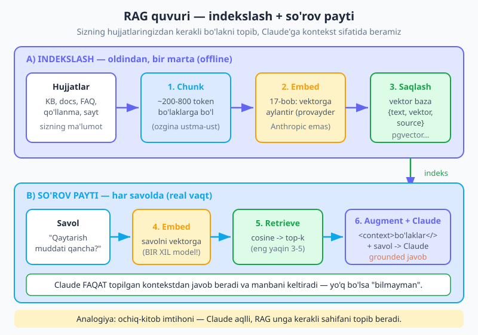
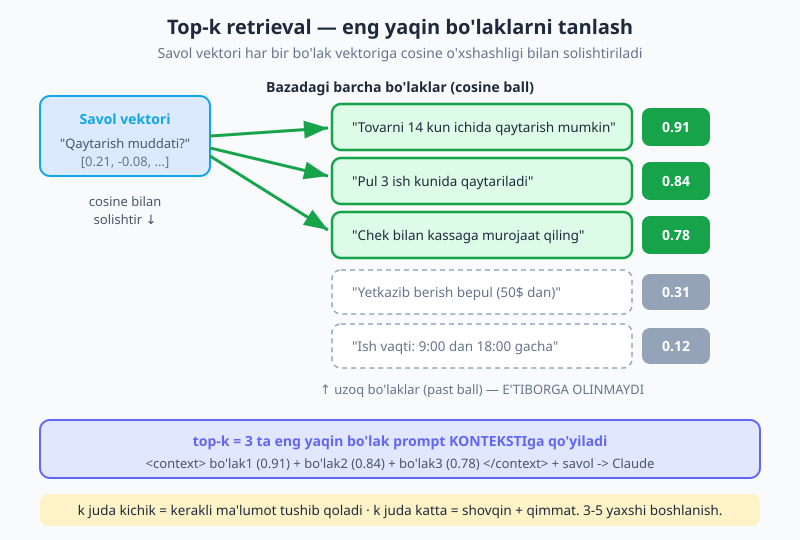
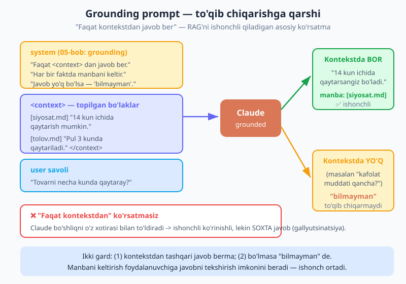

# 18 — Vektor baza va RAG

[⬅️ Oldingi: 17 — Embeddings va semantik qidiruv](./17-embeddings.md) · [🏠 README](./README.md) · [Keyingi: 19 — Agentlar asoslari ➡️](./19-agentlar-asoslari.md)

---

> **Bu bobda:** Claude juda aqlli, lekin u faqat o'qigan ma'lumotini biladi — sizning **shaxsiy hujjatlaringizni**, kompaniyangiz bilimlar bazasini yoki kechagi yangilikni bilmaydi. Bilmagan narsasini esa ba'zan ishonchli ohangda **to'qib** chiqaradi (gallyutsinatsiya). **RAG** (Retrieval-Augmented Generation — qidiruv bilan boyitilgan generatsiya) shu muammoni hal qiladi: savol kelganda sizning ma'lumotingizdan eng tegishli bo'laklarni topib, ularni Claude'ga **kontekst** sifatida beradi — shunda Claude o'z xotirasidan emas, sizning haqiqiy manbalaringizdan javob beradi (va manbani keltiradi). Bu bobda butun RAG quvurini qadam-baqadam quramiz: hujjatlarni **chunk** qilish, [17-bobdagi](./17-embeddings.md) embedding bilan vektorga aylantirish, vektor bazaga saqlash, savolga eng yaqin **top-k** bo'lakni topish va Claude'ga grounding prompt bilan berish. Yakunda to'liq ishlaydigan "o'z hujjatlaring bilan suhbat" tizimini — xotiradagi vektor bazadan tortib `bilmayman` fallback'igacha — quramiz.

> **Halollik eslatmasi:** RAG — Anthropic'ning maxsus API'si emas, balki **naqsh** (pattern): embedding (17-bob, **Anthropic'dan tashqari** provayder — Voyage/OpenAI/lokal), vektor o'xshashligi (cosine) va oddiy `client.messages.create` ni birlashtirasiz. Generatsiya Claude'da, embedding boshqa provayderda — bu bobda hech qanday "RAG API" o'ylab topilmagan. Vektor bazalar (pgvector, Pinecone, Qdrant, Chroma) — uchinchi tomon mahsulotlari; biz avval o'rganish uchun xotiradagi oddiy massivni, keyin ishlab chiqarish uchun ularni ko'rsatamiz. Kod misollari to'g'ri tuzilgan, lekin haqiqiy API kaliti va embedding provayderini talab qiladi.

---

## Nega RAG? — Claude'ning bilimi chegarali

Tasavvur qiling, kompaniyangizning ichki qaytarish siyosati bor va foydalanuvchi botdan so'raydi: "Tovarni necha kunda qaytarsam bo'ladi?". Claude bu savolga javob beradi — lekin **sizning** siyosatingizni hech qachon o'qimagan. U umumiy bilimi asosida "ko'pincha 14-30 kun" deb taxmin qiladi yoki butunlay noto'g'ri raqam **to'qib** chiqaradi. Foydalanuvchi esa bu javobni rost deb qabul qiladi.

Muammoning ildizi: **LLM faqat o'qitilgan ma'lumotini biladi.** U bilmaydigan uchta katta soha bor:

- **Sizning shaxsiy ma'lumotingiz** — ichki hujjatlar, bilimlar bazasi (KB), mahsulot qo'llanmasi, mijoz tarixi. Bular hech qachon model trening'iga kirmagan.
- **Yangi ma'lumot** — modelning bilim chegarasidan (knowledge cutoff) keyingi voqealar, narxlar, yangilanishlar.
- **Aniqlik talab qiladigan faktlar** — model "esladim" deb o'ylagan raqam ko'pincha noto'g'ri. Bilmaganini tan olish o'rniga to'qib chiqaradi — bu **gallyutsinatsiya** (hallucination).

**RAG** bu uch muammoni bitta g'oya bilan hal qiladi: savol kelganda sizning ma'lumotingizdan **eng tegishli bo'laklarni** topib, ularni Claude'ga so'rovning ichida kontekst sifatida beramiz. Claude endi o'z xotirasidan emas, oldida turgan haqiqiy matndan javob beradi — va qaysi manbadan olganini aytadi.

> **Analogiya — ochiq-kitob imtihoni.** Yopiq imtihonda talaba faqat yodlaganini yozadi; esidan chiqsa — taxmin qiladi. Ochiq-kitob imtihonida esa unga kerakli sahifani ochib beradigan yordamchi bor. Claude — aqlli talaba; **RAG** — har savol uchun kerakli sahifani topib uzatadigan yordamchi. Talaba aqlli bo'lgani uchun sahifani o'qib, to'g'ri javob beradi — yod olishi shart emas.

Endi bu g'oyani amalga oshiradigan quvurni ko'raylik.

---

## Quvur — RAG'ning asosiy fikrlash modeli

RAG ikki bosqichdan iborat. **Indekslash** — oldindan, bir marta bajariladigan tayyorgarlik (offline). **So'rov payti** — har bir savolda bajariladigan jonli qism (real vaqt).



Olti qadam, ketma-ket:

1. **Chunk (bo'laklash).** Hujjatlaringizni ~200-800 token'lik kichik bo'laklarga bo'lasiz (ozgina ustma-ust bilan). Nega — keyin faqat savolga tegishli kichik bo'lakni topib berish uchun (aniqroq, kontekst oynaga sig'adi).
2. **Embed.** Har bir bo'lakni [17-bobdagidek](./17-embeddings.md) vektorga aylantirasiz (Anthropic'dan tashqari provayder). Har bo'lak uchun `{ text, embedding, source }` saqlaysiz.
3. **Store (saqlash).** Vektorlarni vektor bazaga qo'yasiz — o'rganish uchun oddiy xotiradagi massiv; ishlab chiqarish uchun pgvector/Pinecone/Qdrant/Chroma.
4. **Retrieve (topish).** Foydalanuvchi savolini ham vektorga aylantirasiz, uni barcha bo'lak vektorlari bilan cosine o'xshashligi orqali solishtirib, eng yaqin **top-k** (masalan 3-5) ni olasiz.
5. **Augment (boyitish).** Topilgan bo'laklarni `<context>` XML teglariga solib, savol bilan birga prompt quryasiz.
6. **Generate (javob).** Claude shu kontekstdan javob beradi, manbani keltiradi va agar javob kontekstda yo'q bo'lsa — `bilmayman` deydi (gallyutsinatsiyaga qarshi ko'rsatma, [05-bob](./05-prompt-engineering.md)).

Eslatma: 1-3 qadamlar (indekslash) hujjatlaringiz o'zgargandagina qaytariladi. 4-6 qadamlar (so'rov) esa har savolda ishlaydi. Endi har qadamni kod bilan ko'raylik.

---

## 1-qadam: Chunk — hujjatni bo'laklarga bo'lish

Nega butun hujjatni emas, bo'laklarini saqlaymiz? Uch sabab:

- **Aniqlik.** Foydalanuvchi "qaytarish muddati" deb so'rasa, unga 40 betlik qo'llanmani emas, aynan o'sha 3 jumlani topib berish kerak. Mayda bo'laklar aniqroq mos keladi.
- **Kontekst oynaga sig'ish.** Butun bilimlar bazasini har promptga tiqib bo'lmaydi (qimmat va sig'maydi). Faqat tegishli bo'laklarni beramiz.
- **Embedding sifati.** Embedding bitta mavzuli qisqa matnda aniqroq ishlaydi; aralash-quralash uzun matnning vektori "loyqa" bo'ladi.

Eng sodda chunker — matnni belgilangan uzunlikdagi bo'laklarga, ozgina **ustma-ustlik** (overlap) bilan kesadi. Overlap nima uchun? Bo'lak chegarasiga tushib qolgan jumla ikkala bo'lakda ham bo'lsin — chegarada ma'no yo'qolmasin.

```js
// So'z bo'yicha sodda chunker (token ~ so'zga yaqin deb taxmin qilamiz).
// Ishlab chiqarishda haqiqiy token sanagich yoki jumla/paragraf chegarasini ishlating.
function chunk(text, { size = 120, overlap = 20 } = {}) {
  const words = text.split(/\s+/).filter(Boolean);
  const chunks = [];
  for (let i = 0; i < words.length; i += size - overlap) {
    const piece = words.slice(i, i + size).join(" ");
    if (piece.trim()) chunks.push(piece);
    if (i + size >= words.length) break; // oxiriga yetdik
  }
  return chunks;
}
```

Bu yerda `size - overlap` qadam tashlaymiz, shuning uchun har bir bo'lak oldingisining oxirgi `overlap` so'zini takrorlaydi. ~200-800 token oralig'i ko'p hollarda yaxshi: juda mayda bo'lak (50 token) kontekstni yo'qotadi, juda yirik bo'lak (2000 token) aniqlikni pasaytiradi va ko'p token yeydi.

> **Eslatma — aqlliroq chunking.** Amalda matnni ko'r-ko'rona kesish o'rniga **tabiiy chegara** bo'yicha (paragraf, sarlavha, jumla) bo'lish yaxshiroq, chunki ma'no butun qoladi. Markdown/HTML hujjatlar uchun sarlavhalar bo'yicha bo'ling. Bu detal RAG sifatiga katta ta'sir qiladi — pastdagi "Tuzoqlar" bo'limiga qarang.

---

## 2-3-qadam: Embed va saqlash — vektor "baza"

Endi har bir bo'lakni vektorga aylantiramiz. [17-bobda](./17-embeddings.md) ko'rganimizdek, embedding — matnni ma'nosini ifodalovchi sonlar massiviga (vektorga) aylantirish; ma'nosi yaqin matnlarning vektorlari ham fazoda yaqin turadi. Embedding **Anthropic'dan tashqari** provayderdan keladi (Voyage, OpenAI yoki lokal model — 17-bob); Claude faqat oxirgi javob generatsiyasi uchun ishlatiladi.

Bir nechta bo'lakni birvarakayiga embed qilish uchun AI SDK'ning `embedMany` funksiyasidan foydalanamiz (har bo'lakni alohida chaqirishdan tez va arzon):

```js
import { embedMany } from "ai";
import { voyage } from "voyage-ai-provider"; // 17-bob: Anthropic EMAS, embedding provayderi

const embedModel = voyage.textEmbeddingModel("voyage-3"); // 1024 o'lchamli vektor

// Bir nechta hujjatni bo'laklab, hammasini bitta massivga yig'amiz
function indexlaUchun(docs) {
  const items = [];
  for (const doc of docs) {
    for (const text of chunk(doc.text)) {
      items.push({ text, source: doc.source }); // source = manba (qaysi fayl/sahifa)
    }
  }
  return items;
}

async function buildIndex(docs) {
  const items = indexlaUchun(docs);
  // Hamma bo'laklarni BIR marta embed qilamiz
  const { embeddings } = await embedMany({
    model: embedModel,
    values: items.map((it) => it.text),
  });
  // Har bo'lakka uning vektorini biriktiramiz -> bu bizning "vektor baza"
  return items.map((it, i) => ({ ...it, embedding: embeddings[i] }));
}
```

Natija — `{ text, source, embedding }` obyektlari massivi. O'rganish uchun bu massivning o'zi **vektor baza** vazifasini bajaradi: u xotirada turadi, biz unda cosine o'xshashlik bo'yicha qidiramiz. Real loyihada bu vektorlarni doimiy saqlashga (pgvector, Pinecone va h.k.) qo'yasiz — pastda ko'ramiz — lekin g'oya bir xil.

> **Diqqat — indeks va so'rov uchun BIR XIL model.** Bo'laklarni `voyage-3` bilan embed qilsangiz, savolni ham aynan `voyage-3` bilan embed qiling. Har xil embedding modeli har xil "fazo" yaratadi — vektorlarni solishtirib bo'lmaydi, qidiruv buziladi. Bu eng ko'p uchraydigan jim xatolardan biri.

---

## 4-qadam: Retrieve — savolga eng yaqin top-k bo'lak

Indeks tayyor. Endi savol kelganda: savolni **xuddi shu model** bilan embed qilamiz, so'ng uni har bir bo'lak vektoriga cosine o'xshashligi bo'yicha solishtirib, eng yaqin `k` tasini olamiz.



```js
import { embed } from "ai";

// Cosine o'xshashlik (17-bob): ikki vektor qanchalik bir yo'nalishda
function cosine(a, b) {
  let dot = 0, na = 0, nb = 0;
  for (let i = 0; i < a.length; i++) {
    dot += a[i] * b[i];
    na += a[i] * a[i];
    nb += b[i] * b[i];
  }
  return dot / (Math.sqrt(na) * Math.sqrt(nb));
}

async function retrieve(index, question, k = 3) {
  // Savolni BIR XIL model bilan embed qilamiz
  const { embedding: qVec } = await embed({ model: embedModel, value: question });
  // Har bo'lakka ball qo'yamiz, kamayish tartibida saralaymiz, top-k ni olamiz
  return index
    .map((item) => ({ ...item, score: cosine(qVec, item.embedding) }))
    .sort((x, y) => y.score - x.score)
    .slice(0, k);
}
```

`k` — nechta bo'lak olishni belgilaydi. Juda kichik (k=1) bo'lsa, kerakli ma'lumot boshqa bo'lakda qolib ketishi mumkin; juda katta (k=20) bo'lsa, kontekst shovqinga to'ladi, qimmatlashadi va model chalg'iydi. 3-5 — ko'p ilovalar uchun yaxshi boshlanish.

> **Eslatma — xotiradagi cosine faqat o'rganish uchun.** Bir necha yuz bo'lakda massivni to'liq aylanib chiqish (linear scan) yaxshi ishlaydi. Lekin minglab/millionlab bo'lakda har savolda hammasini solishtirish sekin. Shu joyda haqiqiy vektor baza kerak bo'ladi — u maxsus indeks (masalan HNSW) bilan eng yaqin vektorlarni tez topadi. Pastda ko'ramiz.

---

## 5-6-qadam: Augment va generate — grounding prompt

Endi RAG'ning yuragi. Topilgan bo'laklarni `<context>` XML teglariga solib, Claude'ga aniq ko'rsatma beramiz: **faqat shu kontekstdan javob ber, manbani keltir, javob yo'q bo'lsa "bilmayman" de.** Aynan shu ko'rsatma RAG'ni ishonchli qiladi.



Nega XML teg? [05-bobda](./05-prompt-engineering.md) ko'rganimizdek, `<context>...</context>` kabi teglar promptning qismlarini aniq ajratadi — Claude qayergacha "tashqi ma'lumot" va qayerdan "ko'rsatma/savol" boshlanishini aniq tushunadi. Har bo'lakka manba yorlig'ini ham qo'shamiz, shunda Claude javobda manbani keltira oladi:

```js
import Anthropic from "@anthropic-ai/sdk";

const client = new Anthropic(); // ANTHROPIC_API_KEY .env dan (02-bob)

function buildPrompt(chunks) {
  // Har bo'lakni manbasi bilan birga, raqamlab kontekstga qo'yamiz
  return chunks
    .map((c, i) => `[${i + 1}] (manba: ${c.source})\n${c.text}`)
    .join("\n\n");
}

async function generate(question, chunks) {
  const context = buildPrompt(chunks);
  const msg = await client.messages.create({
    model: "claude-opus-4-8",
    max_tokens: 1024,
    system:
      "Sen yordamchi assistentsan. FAQAT quyidagi <context> ichidagi ma'lumotdan " +
      "javob ber. Har bir faktdan keyin qaysi manbadan olganingni [manba] ko'rinishida keltir. " +
      "Agar javob <context> da yo'q bo'lsa, o'zingdan to'qib chiqarma — aniq 'Bilmayman' deb javob ber.",
    messages: [
      {
        role: "user",
        content: `<context>\n${context}\n</context>\n\nSavol: ${question}`,
      },
    ],
  });
  return msg.content[0].text;
}
```

Ikki ko'rsatma birgalikda gallyutsinatsiyani keskin kamaytiradi:

1. **"Faqat kontekstdan javob ber"** — Claude o'z xotirasidagi taxminni emas, oldidagi haqiqiy matnni ishlatadi.
2. **"Yo'q bo'lsa 'Bilmayman' de"** — bo'shliqni to'ldirishga ruxsat bermaydi. Bu ko'rsatma bo'lmasa, Claude bo'shliqni o'z bilimi bilan to'ldiradi — ishonchli ko'rinadi, lekin soxta bo'lishi mumkin.

Manbani keltirish esa foydalanuvchiga javobni **tekshirish** imkonini beradi — bu ishonchni oshiradi.

---

## To'liq ishlaydigan RAG — "o'z hujjatlaring bilan suhbat"

Hamma qismni bitta tizimga yig'amiz: kichik bilimlar bazasini indekslaymiz (chunk → embed → store), keyin `ask(question)` funksiyasi top-k bo'lakni topib, Claude'dan grounded javob oladi.

```js
import Anthropic from "@anthropic-ai/sdk";
import { embed, embedMany } from "ai";
import { voyage } from "voyage-ai-provider";

const client = new Anthropic();
const embedModel = voyage.textEmbeddingModel("voyage-3");

// --- Kichik bilimlar bazasi (real loyihada bu fayllardan/DB'dan keladi) ---
const docs = [
  { source: "qaytarish.md", text:
    "Tovarni xarid sanasidan boshlab 14 kun ichida qaytarish mumkin. " +
    "Tovar ishlatilmagan va asl qadog'ida bo'lishi shart. Chekni saqlang." },
  { source: "tolov.md", text:
    "Pul mablag'i qaytarilganda 3 ish kuni ichida xaridor kartasiga o'tkaziladi. " +
    "Naqd to'lovlar kassadan naqd qaytariladi." },
  { source: "yetkazish.md", text:
    "Yetkazib berish 50$ dan yuqori xaridlar uchun bepul. Toshkent bo'ylab 1-2 kun." },
];

// --- 1-3: chunk -> embed -> store (indekslash) ---
function chunk(text, { size = 120, overlap = 20 } = {}) {
  const words = text.split(/\s+/).filter(Boolean);
  const out = [];
  for (let i = 0; i < words.length; i += size - overlap) {
    const piece = words.slice(i, i + size).join(" ");
    if (piece.trim()) out.push(piece);
    if (i + size >= words.length) break;
  }
  return out;
}

let index = []; // bizning xotiradagi "vektor baza"

async function buildIndex() {
  const items = [];
  for (const doc of docs)
    for (const text of chunk(doc.text)) items.push({ text, source: doc.source });
  const { embeddings } = await embedMany({ model: embedModel, values: items.map((i) => i.text) });
  index = items.map((it, i) => ({ ...it, embedding: embeddings[i] }));
}

// --- 4: retrieve (top-k) ---
function cosine(a, b) {
  let dot = 0, na = 0, nb = 0;
  for (let i = 0; i < a.length; i++) { dot += a[i] * b[i]; na += a[i] * a[i]; nb += b[i] * b[i]; }
  return dot / (Math.sqrt(na) * Math.sqrt(nb));
}

async function retrieve(question, k = 3) {
  const { embedding: q } = await embed({ model: embedModel, value: question });
  return index
    .map((it) => ({ ...it, score: cosine(q, it.embedding) }))
    .sort((x, y) => y.score - x.score)
    .slice(0, k);
}

// --- 5-6: augment + generate (grounding prompt) ---
async function ask(question) {
  const hits = await retrieve(question, 3);
  const context = hits.map((c, i) => `[${i + 1}] (manba: ${c.source})\n${c.text}`).join("\n\n");
  const msg = await client.messages.create({
    model: "claude-opus-4-8",
    max_tokens: 1024,
    system:
      "FAQAT <context> dagi ma'lumotdan javob ber. Har faktdan keyin [manba] keltir. " +
      "Javob kontekstda yo'q bo'lsa, to'qima — 'Bilmayman' de.",
    messages: [
      { role: "user", content: `<context>\n${context}\n</context>\n\nSavol: ${question}` },
    ],
  });
  return msg.content[0].text;
}

// --- Ishga tushirish ---
await buildIndex();
console.log(await ask("Tovarni necha kunda qaytarsam bo'ladi?"));
// -> "14 kun ichida qaytarishingiz mumkin [qaytarish.md]. ..."
console.log(await ask("Pul qachon qaytariladi?"));
// -> "3 ish kuni ichida kartangizga [tolov.md]."
console.log(await ask("Kafolat muddati qancha?"));
// -> "Bilmayman" — bu ma'lumot bilimlar bazasida yo'q (to'qib chiqarmadi!)
```

Mana butun RAG bir joyda. Diqqat qiling: oxirgi savol ("kafolat muddati") bilimlar bazasida **yo'q** — va Claude uni to'qib chiqarmasdan halol "Bilmayman" deydi. Aynan shu xulq RAG'ni ishonchli qiladi: noma'lum savol soxta javob emas, ochiq "bilmayman" oladi.

> **Eslatma — katta kontekstni keshlash (15-bob).** Agar siz har savolda **bir xil katta** kontekst (masalan butun siyosat hujjati) bersangiz, [15 — Prompt caching](./15-prompt-caching.md) bilan uni keshlab, takroriy so'rovlarni 90% gacha arzonlashtirasiz. Lekin RAG'ning klassik shaklida kontekst har savolda **o'zgaradi** (top-k turlicha), shuning uchun keshlash faqat barqaror, har savolda bir xil bo'ladigan qism uchun foydali (masalan ko'p hujjatga doim qo'shiladigan umumiy yo'riqnoma).

---

## Ishlab chiqarishga o'tish — haqiqiy vektor baza va sayqal

Xotiradagi massiv o'rganish uchun ajoyib, lekin server qayta ishga tushganda yo'qoladi va katta hajmda sekin. Ishlab chiqarishda haqiqiy vektor baza ishlatiladi.

**pgvector** — Postgres'ning vektor kengaytmasi. Allaqachon Postgres ishlatsangiz, eng tabiiy tanlov: vektorlar oddiy jadvalda, mavjud SQL bilan birga yashaydi.

```sql
-- Kengaytmani yoqamiz
CREATE EXTENSION IF NOT EXISTS vector;

-- Bo'laklar jadvali: matn + manba + 1024 o'lchamli vektor
CREATE TABLE chunks (
  id        bigserial PRIMARY KEY,
  source    text NOT NULL,
  content   text NOT NULL,
  embedding vector(1024)            -- voyage-3 -> 1024 o'lcham
);

-- Tez qidiruv uchun yaqinlik indeksi (cosine masofa bo'yicha)
CREATE INDEX ON chunks USING hnsw (embedding vector_cosine_ops);

-- So'rov payti: savol vektoriga eng yaqin 5 bo'lak ( <=> = masofa operatori )
SELECT source, content, 1 - (embedding <=> $1) AS score
FROM chunks
ORDER BY embedding <=> $1   -- masofa bo'yicha o'sish = o'xshashlik bo'yicha kamayish
LIMIT 5;
```

Bu yerda `$1` — savolning embedding'i (JS'dan parametr sifatida uzatiladi), `<=>` — cosine masofa operatori, `hnsw` indeks esa millionlab vektorda ham qidiruvni tez qiladi. Mantiq RAG bilan bir xil — faqat cosine'ni JS o'rniga ma'lumotlar bazasi hisoblaydi.

**Hosted (boshqariladigan) vektor bazalar** — Pinecone, Qdrant, Chroma, Supabase. Server saqlash, masshtablash va indeksni o'zlari hal qiladi; siz faqat "vektor + metadata qo'sh" va "eng yaqin k tasini topib ber" deysiz. Postgres yo'q bo'lsa yoki tez boshlamoqchi bo'lsangiz qulay.

Sifatni oshiruvchi amaliy texnikalar:

- **Metadata filtri** — har bo'lakka teg qo'shing (`lang`, `product`, `date`) va qidiruvni faqat tegishli to'plamda bajaring (masalan faqat o'zbekcha hujjatlar). Aniqlikni oshiradi.
- **Re-ranking (qayta saralash)** — avval cosine bilan ~20 nomzodni oling, keyin maxsus re-ranker model bilan ularni qayta saralab eng yaxshi 3-5 tasini tanlang. Topish sifatini sezilarli oshiradi.
- **Chunk o'lchamini sozlash** — 200, 400, 800 token variantlarini sinab, qaysi biri sizning hujjatlaringizda yaxshi topishini o'lchang. Universal "to'g'ri" o'lcham yo'q.
- **Kontekstni keshlash** — barqaror, takrorlanadigan kontekst qismi uchun [15-bob](./15-prompt-caching.md).
- **Topish sifatini baholash** — RAG'ning eng muhim, lekin ko'pincha unutiladigan qismi: model to'g'ri javob bermasa, ko'pincha aybdor **generatsiya emas, balki retrieval** (kerakli bo'lak umuman topilmagan). Buni o'lchash (recall@k va h.k.) — [23-bob](./README.md) mavzusi.

> **Eslatma — RAG'ning "zaif bo'g'ini".** Agar tizim noto'g'ri javob bersa, birinchi navbatda **nima topilganini** tekshiring (`retrieve` natijasini chop eting). Ko'p hollarda Claude aybdor emas — unga shunchaki noto'g'ri yoki yetishmaydigan bo'laklar berilgan. "Axlat kirsa — axlat chiqadi": retrieval yomon bo'lsa, eng yaxshi prompt ham qutqarmaydi.

---

## Tuzoqlar va ehtiyotkorlik

| Muammo | Sabab | Yechim |
|---|---|---|
| Topilgan bo'lakda javob yarmi kesilgan | Chunk juda mayda yoki yomon chegarada kesilgan | Overlap qo'shing; tabiiy chegara (paragraf/sarlavha) bo'yicha bo'ling; o'lchamni oshiring |
| Qidiruv umuman ishlamaydi (mantiqsiz natija) | Indeks va savol uchun **har xil** embedding modeli | Bir xil model + bir xil versiya; modelni o'zgartirsangiz butun indeksni qayta quring |
| Claude hali ham to'qib chiqaryapti | "Faqat kontekstdan" / "bilmayman" ko'rsatmasi yo'q | system'ga aniq grounding ko'rsatmasi qo'shing (05-bob) |
| Javob loyqa, model chalg'iydi | Kontekstga juda ko'p bo'lak tiqilgan (k katta) | k ni 3-5 ga tushiring; re-ranking bilan eng tegishlisini tanlang |
| Har savol qimmat/sekin | Katta kontekst har safar to'liq narxda | k ni kamaytiring; barqaror qismni keshlang (15-bob) |
| Foydalanuvchi javobga ishonmaydi | Manba ko'rsatilmagan | Har faktdan keyin `[manba]` keltirishni so'rang |
| Topilmaydigan "yangi" hujjatlar | Indeks eskirgan | Hujjat o'zgarganda tegishli bo'laklarni qayta embed qiling |

> **Diqqat — RAG sehr emas.** RAG faqat **siz indekslagan** ma'lumotdan javob bera oladi. Bilimlar bazangizda bo'lmagan savol — `bilmayman` oladi (va bu **to'g'ri** xulq). Shuningdek, retrieval mukammal emas: ba'zan kerakli bo'lak topilmaydi. Kritik (huquqiy, tibbiy, moliyaviy) javoblarni har doim manba bilan ko'rsating va foydalanuvchiga tekshirish imkonini bering.

---

## Mashqlar

Mashqlarning aksariyati `ANTHROPIC_API_KEY` (.env, 02-bob) va embedding provayderi kalitini (17-bob) talab qiladi. Embedding modeli sifatida bobdagi `voyage-3` (yoki o'zingizdagi) ni ishlating va indeks/savol uchun **bir xil** model bo'lishiga e'tibor bering.

### Oson

1. **Chunker.** `chunk(text, { size, overlap })` funksiyasini yozing va bir uzun paragrafni 50 token'lik bo'laklarga (10 overlap bilan) bo'ling. Ketma-ket bo'laklar oxir/boshida takrorlanayotganini ko'rsating.
2. **Bir xil model qoidasi.** Indeksni `voyage-3` bilan qurib, savolni **boshqa** model bilan embed qilib ko'ring (yoki shunchaki vektor o'lchami farq qilsin). Natija nega buziladi? Keyin tuzating.
3. **`bilmayman` ko'rsatmasi.** To'liq RAG'ga bilimlar bazasida **yo'q** savol bering (masalan "kafolat muddati"). Avval grounding ko'rsatmasi bilan, keyin usiz sinab ko'ring — farqni kuzating.

### O'rta

4. **Top-k sozlash.** Bitta savol uchun `retrieve` ni `k=1`, `k=3`, `k=8` bilan chaqiring va har safar topilgan bo'laklarni hamda javobni solishtiring. Qaysi `k` aniqroq javob beradi?
5. **Manba keltirish.** Grounding promptni "har faktdan keyin `[manba]` keltir" deb sozlang. Javobda manbalar to'g'ri ko'rsatilganini va ular topilgan bo'laklarga mos kelishini tekshiring.
6. **Retrieval'ni alohida tekshirish.** `ask` ichida Claude'ni chaqirishdan **oldin** `retrieve` natijasini (`source` + `score`) chop eting. Noto'g'ri javob chiqsa, aybdor topish (retrieval) ekanini yoki generatsiya ekanini ajrating.

### Qiyin

7. **Metadata filtri.** Har bo'lakka `lang` (uz/en) tegini qo'shing. `retrieve` ni faqat berilgan tildagi bo'laklar ichida qidiradigan qiling (avval filtrla, keyin cosine). O'zbekcha savolga faqat o'zbekcha bo'laklar topilishini tasdiqlang.
8. **pgvector eskizi.** Bobdagi `CREATE TABLE chunks ... vector(1024)` + `hnsw` indeks + eng yaqin 5 bo'lakni topuvchi `SELECT ... ORDER BY embedding <=> $1` so'rovini yozing. JS tomonidan savol embedding'ini parametr sifatida uzatish kerakligini izohlang (xotiradagi cosine'dan farqi nimada?).
9. **Keshlash bilan (15-bob).** Har savolga doim qo'shiladigan **barqaror** yo'riqnoma + umumiy hujjat qismini ajratib, uni [15-bob](./15-prompt-caching.md) `cache_control` bilan keshlang; o'zgaruvchan top-k bo'laklarni esa keshdan keyin qo'ying. Birinchi va keyingi chaqiruvlarda `usage` (cache_read) qanday o'zgaradi?

<details markdown="1">
<summary>Yechimlar</summary>

> Yechimlar `ANTHROPIC_API_KEY` + embedding provayder kaliti talab qiladi. `client` — `new Anthropic()` (02-bob), `embedModel` — 17-bobdagi provayder.

### 1-mashq yechimi

```js
function chunk(text, { size = 50, overlap = 10 } = {}) {
  const words = text.split(/\s+/).filter(Boolean);
  const out = [];
  for (let i = 0; i < words.length; i += size - overlap) {
    out.push(words.slice(i, i + size).join(" "));
    if (i + size >= words.length) break;
  }
  return out;
}
const parts = chunk(uzunMatn, { size: 50, overlap: 10 });
// parts[0] ning oxirgi 10 so'zi = parts[1] ning birinchi 10 so'zi (overlap)
```

Overlap chegaraga tushgan jumlani ikkala bo'lakda saqlab, ma'no yo'qolmasligini ta'minlaydi.

### 2-mashq yechimi

```js
// Indeks: voyage-3 (1024 o'lcham)
const { embeddings } = await embedMany({ model: voyage.textEmbeddingModel("voyage-3"), values });
// ❌ Savol: BOSHQA model -> boshqa fazo, cosine mantiqsiz natija beradi
// const { embedding } = await embed({ model: openai.embedding("text-embedding-3-small"), value: q });
// ✅ To'g'ri: AYNAN bir xil model
const { embedding } = await embed({ model: voyage.textEmbeddingModel("voyage-3"), value: q });
```

Har xil model — har xil vektor fazosi. Solishtirish faqat bir xil fazoda ma'noli; modelni almashtirsangiz butun indeksni qayta qurish shart.

### 3-mashq yechimi

```js
// Grounding ko'rsatmasi BILAN: kontekstda yo'q -> "Bilmayman"
system: "FAQAT <context> dan javob ber. Yo'q bo'lsa 'Bilmayman' de.";
// console.log(await ask("Kafolat muddati qancha?")); -> "Bilmayman"

// Ko'rsatmasiz: Claude bo'shliqni o'z bilimi bilan to'ldiradi -> taxminiy/soxta javob
system: "Foydalanuvchiga yordam ber."; // -> "Odatda 1 yil..." (BU KONTEKSTDA YO'Q!)
```

"Faqat kontekstdan" + "bilmayman" — RAG'ni ishonchli qiladigan ikki ko'rsatma. Usiz model to'qib chiqaradi.

### 4-mashq yechimi

```js
for (const k of [1, 3, 8]) {
  const hits = await retrieve(savol, k);
  console.log(`k=${k}:`, hits.map((h) => `${h.source}(${h.score.toFixed(2)})`));
  console.log(await ask(savol, k)); // ask ni k qabul qiladigan qiling
}
// k=1: kerakli bo'lak boshqasida qolsa, tushib qoladi
// k=8: keraksiz bo'laklar shovqin qo'shadi, javob loyqalashadi
// k=3: ko'pincha balansli
```

### 5-mashq yechimi

```js
system:
  "FAQAT <context> dan javob ber. HAR faktdan keyin [manba] ko'rinishida " +
  "qaysi manbadan olganingni keltir. Yo'q bo'lsa 'Bilmayman' de.";
// Javob: "14 kun ichida qaytarish mumkin [qaytarish.md]."
// Manba topilgan bo'lakning source'iga mos kelishini tekshiring.
```

Manba — foydalanuvchiga javobni tekshirish imkonini beradi; ishonchni oshiradi.

### 6-mashq yechimi

```js
async function ask(question, k = 3) {
  const hits = await retrieve(question, k);
  // RETRIEVAL'ni alohida tekshiramiz:
  console.log("Topilgan:", hits.map((h) => `${h.source} score=${h.score.toFixed(3)}`));
  const context = hits.map((c, i) => `[${i + 1}] (manba: ${c.source})\n${c.text}`).join("\n\n");
  // ... generate ...
}
// Agar score'lar past (masalan < 0.4) bo'lsa, aybdor RETRIEVAL — kerakli bo'lak topilmagan.
// Score'lar yuqori, lekin javob yomon bo'lsa — aybdor generatsiya/prompt.
```

RAG'ni nazorat qilishning birinchi qadami — har doim "nima topildi"ni ko'rish.

### 7-mashq yechimi

```js
// Indekslashda teg qo'shamiz
items.push({ text, source: doc.source, lang: doc.lang });

async function retrieve(question, { k = 3, lang } = {}) {
  const { embedding: q } = await embed({ model: embedModel, value: question });
  return index
    .filter((it) => !lang || it.lang === lang) // AVVAL filtrla
    .map((it) => ({ ...it, score: cosine(q, it.embedding) }))
    .sort((x, y) => y.score - x.score)
    .slice(0, k);
}
// await retrieve("Qaytarish muddati?", { lang: "uz" }); -> faqat o'zbekcha bo'laklar
```

Metadata filtri qidiruv maydonini toraytirib aniqlikni oshiradi. pgvector'da bu `WHERE lang = 'uz'` bo'ladi.

### 8-mashq yechimi

```sql
CREATE EXTENSION IF NOT EXISTS vector;
CREATE TABLE chunks (
  id bigserial PRIMARY KEY,
  source text NOT NULL,
  content text NOT NULL,
  embedding vector(1024)
);
CREATE INDEX ON chunks USING hnsw (embedding vector_cosine_ops);

-- $1 = savol embedding'i (JS'dan parametr): client.query(sql, [JSON.stringify(qVec)])
SELECT source, content, 1 - (embedding <=> $1) AS score
FROM chunks
ORDER BY embedding <=> $1
LIMIT 5;
```

Farqi: xotirada cosine'ni **JS** hisoblaydi (har savolda butun massivni aylanadi); pgvector'da cosine masofani **ma'lumotlar bazasi** `hnsw` indeks bilan tez hisoblaydi va vektorlar serverda doimiy saqlanadi.

### 9-mashq yechimi

```js
const msg = await client.messages.create({
  model: "claude-opus-4-8",
  max_tokens: 1024,
  system: [
    {
      type: "text",
      text: BARQAROR_YORIQNOMA + "\n\n" + UMUMIY_HUJJAT, // har savolda BIR XIL
      cache_control: { type: "ephemeral" }, // 15-bob: shu yergacha keshlanadi
    },
  ],
  messages: [
    // o'zgaruvchan top-k bo'laklar keshdan KEYIN keladi
    { role: "user", content: `<context>\n${topKContext}\n</context>\n\nSavol: ${question}` },
  ],
});
console.log(msg.usage); // 1-chaqiruv: cache_creation > 0; keyingilar: cache_read > 0
```

Barqaror prefiks keshlanadi (90% gacha arzon), o'zgaruvchan top-k esa har safar yangi. Faqat har savolda bir xil bo'lgan qism keshlanishini unutmang (15-bob).

</details>

---

> **Keyingi qadam.** Endi sizda to'liq RAG bor: hujjatlarni chunk qilib, [17-bobdagi](./17-embeddings.md) embedding bilan vektorga aylantirib, top-k eng yaqin bo'lakni topib, Claude'ga grounding prompt ([05-bob](./05-prompt-engineering.md)) bilan berasiz — natijada Claude o'z xotirasidan emas, sizning haqiqiy manbalaringizdan javob beradi va manbani keltiradi, bilmaganini esa halol "bilmayman" deydi. Xotiradagi massivdan pgvector/hosted bazaga o'tish — bir xil g'oyaning masshtablangan shakli. Keyingi bobda esa Claude'ni shunchaki javob beradigan modeldan **agentga** — ya'ni o'zi qaror qabul qilib, asboblarni ketma-ket ishlatadigan tizimga — aylantirishni boshlaymiz; RAG esa agentning eng muhim "asbob"laridan biri bo'ladi.

---

[⬅️ Oldingi: 17 — Embeddings va semantik qidiruv](./17-embeddings.md) · [🏠 README](./README.md) · [Keyingi: 19 — Agentlar asoslari ➡️](./19-agentlar-asoslari.md)
