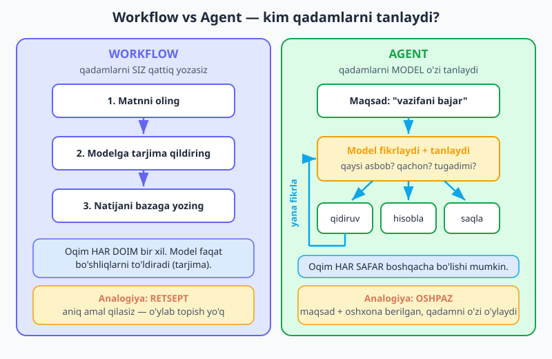
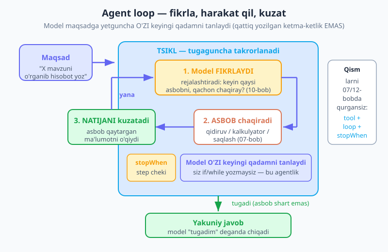
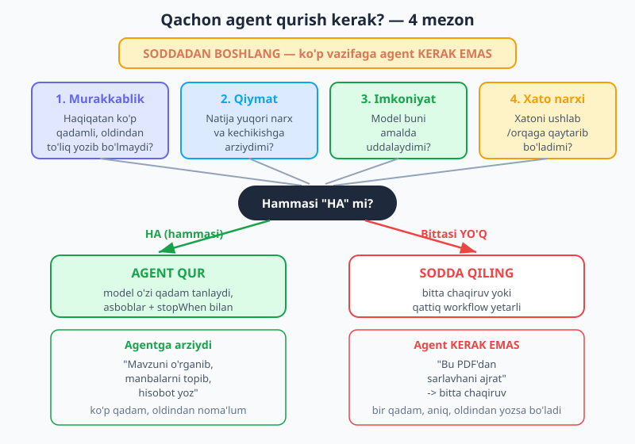

# 19 — Agentlar asoslari

[⬅️ Oldingi: 18 — Vektor baza va RAG](./18-vector-db-rag.md) · [🏠 README](./README.md) · [Keyingi: 20 — MCP — Model Context Protocol ➡️](./20-mcp.md)

---

> **Bu bobda:** Shu paytgacha siz Claude'ga vositalar berib, **siz** yozgan tartibda ishlatdingiz — [07-bobda](./07-tool-use.md) qo'lda loop, [12-bobda](./12-ai-sdk-structured-tools.md) AI SDK `stopWhen`. Endi bir qadam tashlaymiz: **agent** — bu LLM'ning **o'zi** maqsadga yetish uchun qaysi vositani, qachon chaqirishni va qachon to'xtashni hal qiladigan tizim. Avval agent nima ekanligini (va **workflow** dan farqini — retsept vs oshpaz), so'ng **agent loop**ini (fikrla → harakat qil → kuzat → yana fikrla), keyin Anthropic'ning **4 mezoni** bilan "qachon agent qurish kerak"ni o'rganamiz — eng muhim saboq: **soddadan boshlang, ko'p vazifaga agent kerak emas**. Yakunda 2-3 vositali, step chegarali va bitta **tasdiq talab qiladigan** (human-in-the-loop) amalli ishlaydigan "tadqiqot agenti"ni AI SDK bilan noldan quramiz, `steps` orqali uning trayektoriyasini ko'ramiz, va xato rejimlari (cheksiz aylanish, ortiqcha xarajat, xavfli amal) hamda himoyalarini sanab o'tamiz.

> **Halollik eslatmasi:** "Agent" — Anthropic'ning maxsus API'si emas, balki **naqsh** (pattern): siz allaqachon qurgan vositalar + loop + step chegarasidan tashkil topadi. Bu bobda hech qanday "agent API" o'ylab topilmagan — `generateText({ tools, stopWhen: stepCountIs(N) })` (12-bob) agent loop'ini aylantiradi, `@anthropic-ai/sdk` esa qo'lda loop yoki `toolRunner` (08-bob) bilan. Kod misollari to'g'ri tuzilgan, lekin haqiqiy `ANTHROPIC_API_KEY` ni talab qiladi. Model: `claude-opus-4-8`.

---

## Agent nima? — o'zi qaror qabul qiluvchi LLM

[07-bobda](./07-tool-use.md) siz Claude'ga vositalar berdingiz; [12-bobda](./12-ai-sdk-structured-tools.md) `stopWhen` bilan loop'ni aylantirdingiz. Aslida o'sha yerda siz birinchi **agent**ingizning urug'ini ekkansiz. Endi nomini beraylik:

> **Agent** — bu **loop ichidagi LLM**: u maqsadga yetish uchun qaysi vositani, qachon chaqirishni va **qachon ishni tugatishni** o'zi hal qiladi. Siz qadamlarni yozmaysiz — faqat **maqsad**, **vositalar to'plami** va **chegara** berasiz; qadamlarni model o'zi tuzadi.

Bu **workflow** (oqim) dan tubdan farq qiladi. Workflow'da qadamlarni **siz** kodda qattiq yozasiz: "1) matnni ol, 2) modelga tarjima qildir, 3) bazaga yoz". Oqim har doim aynan bir xil; model faqat bo'shliqni (tarjimani) to'ldiradi. Agentda esa siz faqat maqsadni aytasiz — model qaysi qadamlarni, qaysi tartibda bajarishni o'zi o'ylab topadi, va oqim har safar boshqacha bo'lishi mumkin.

> **Analogiya — retsept va oshpaz.** **Workflow** — bu **retsept**: "tuxumni yor, unni qo'sh, 20 daqiqa pishir". Siz aniq amal qilasiz, o'ylab topadigan narsa yo'q. **Agent** — bu **maqsad va oshxona berilgan oshpaz**: "menga tushlik tayyorla". U muzlatkichni ochadi, nima borligini ko'radi, qaror qabul qiladi, kerak bo'lsa qo'shimcha narsa oladi — qadamlarni o'zi tuzadi. Retsept ishonchli va arzon; oshpaz moslashuvchan, lekin qimmatroq va ba'zan adashishi mumkin.



Bu farq nega muhim? Chunki u sizning **xarajat, ishonchlilik va moslashuvchanlik** tanlovingizni belgilaydi. Agent moslashuvchan, lekin har qadam yangi model chaqiruvi — qimmat va sekin, va model adashishi mumkin. Workflow esa arzon, tez va bashoratli, lekin faqat siz oldindan yozgan oqimni bajaradi. Shuning uchun keyingi savol — **qachon qaysi birini tanlash** — bu bobning markazidir.

---

## Agent loop — fikrla, harakat qil, kuzat

Agentning yuragi — **loop** (sikl). Siz uni allaqachon qurgansiz: 07-bobdagi qo'lda `while`, 12-bobdagi `stopWhen` ichida yashiringan o'sha loop. Endi unga ataylab nom beramiz, chunki agentning butun "aqli" shu siklda yashaydi:



Sikl uch bosqichdan iborat, ular maqsadga yetguncha takrorlanadi:

1. **Fikrla (reason / plan).** Model joriy holatga qaraydi: "Maqsadga yetish uchun endi nima kerak? Qaysi vositani chaqiray? Yoki yetarli ma'lumot bormi, tugatsam bo'ladimi?" Bu yerda [10-bobdagi](./10-thinking-effort.md) **adaptiv fikrlash** (thinking) yaxshi yordam beradi — murakkab rejani ichki "fikrlash" bilan tuzadi.
2. **Harakat qil (act).** Model bir vositani tanlab chaqiradi — masalan `qidiruv({ mavzu: "..." })`. Diqqat (07-bob): model funksiyani **o'zi ishlatmaydi**, faqat "shu argument bilan chaqir" deb **so'raydi**; funksiyani siz (yoki AI SDK) bajaradi.
3. **Kuzat (observe).** Vosita qaytargan natija modelga qaytariladi. Model uni o'qiydi va... yana 1-qadamga qaytadi: "Endi yetarlimi? Yana nima kerak?"

Bu sikl model **"tugadim"** deganda to'xtaydi — ya'ni model boshqa vosita chaqirmasdan to'g'ridan-to'g'ri yakuniy javob (matn) qaytaradi. Aynan shu — agentlikning mohiyati: **keyingi qadam nima bo'lishini va qachon to'xtashni model o'zi tanlaydi**, siz `if`/`while` yozmaysiz.

> 🔑 **Workflow loop EMAS — agent loop.** Oddiy tool loop'da (12-bob) ham takror bor, lekin asosiy g'oya bir xil: har aylanishda **model qaror qabul qiladi**. Uni "agent" deb atashimizning sababi — biz unga **bitta aniq vazifa emas, ochiq maqsad** beramiz va **bir nechta vosita** beramiz, shunda model haqiqatan ham trayektoriyani o'zi tuzadi. Bitta vosita + bir qadam = bu hali workflow; ko'p vosita + ochiq maqsad + model qarori = agent.

Bu loop juda kuchli — lekin aynan shuning uchun xavfli ham. Model adashsa, cheksiz aylanishi yoki xavfli amal bajarishi mumkin. Shuning uchun avval **qachon umuman agent qurish kerakligini** halol baholaymiz.

---

## Qachon agent qurish kerak? — 4 mezon (va "soddadan boshlang")

Eng muhim saboq oldindan: **ko'p vazifaga agent kerak emas.** Agent — bu eng murakkab, eng qimmat va eng kam bashoratli yechim. Ko'pincha bitta `messages.create` chaqiruvi yoki qattiq yozilgan workflow yaxshiroq, arzonroq va ishonchliroq. Anthropic'ning maslahati aniq: **soddadan boshlang**, faqat haqiqatan kerak bo'lganda agentga o'ting.

Qachon kerak? Anthropic to'rtta mezonni taklif qiladi. **Hammasiga** "ha" desangizgina agent qurishga arziydi; bittasiga "yo'q" bo'lsa — soddaroq yechim tanlang.



| Mezon | Savol | "Ha" deganda | "Yo'q" deganda |
|---|---|---|---|
| **1. Murakkablik** | Vazifa haqiqatan ko'p qadamli va qadamlarini oldindan to'liq yozib bo'lmaydimi? | Qadamlar va tartibi kirishga bog'liq, oldindan noma'lum | Qadamlar aniq → **workflow** yozing |
| **2. Qiymat** | Natija agentning yuqori narxi va kechikishiga arziydimi? | Ha, qimmat lekin foydali ish | Arzon/tez kerak → **bitta chaqiruv** |
| **3. Imkoniyat** | Model bu vazifani amalda uddalaydimi? | Ha, sinov ko'rsatdi | Model dovdiraydi → vazifani **bo'laklang** |
| **4. Xato narxi** | Xatoni ushlab yoki orqaga qaytarib bo'ladimi (test, ko'rik, tasdiq)? | Ha, xato qaytariladi/tuzatiladi | Xato halokatli/qaytmas → **inson nazorati** + workflow |

Misollar bilan tushunarli bo'ladi:

- ✅ **Agentga arziydi:** "Bu mavzuni o'rgan, bir nechta manbani topib o'qi, va qisqa hisobot yoz." Bu ko'p qadamli (qancha manba, qaysi tartibda — oldindan noma'lum), natija qimmatga arziydi, model uddalaydi, va xato (yomon hisobot) ko'rib tuzatiladi.
- ❌ **Agent kerak emas:** "Bu PDF'dan sarlavhani ajratib ber." Bu **bitta qadam**, oqim aniq, oldindan to'liq yozsa bo'ladi. Bunga agent qurish — bolg'a bilan pashsha urish: sekin, qimmat va keraksiz xavf. Bitta `generateObject` ([12-bob](./12-ai-sdk-structured-tools.md)) chaqiruvi yetadi.
- ❌ **Agent kerak emas:** "Mijoz xabarini ijobiy/salbiy deb tasnifla." Bir qadamli klassifikatsiya — bitta chaqiruv.
- ⚠️ **Ehtiyot bo'ling:** "Mijozlarga avtomatik pul qaytar." Bu yerda **xato narxi** juda yuqori (pul qaytmas) — to'liq avtonom agent qilmang; agent **taklif** qilsin, **inson tasdiqlasin** (pastda — gating).

> 💡 **Saboq — START SIMPLE.** Avval eng oddiy yechimni sinang: bitta prompt? Bitta vositali chaqiruv? Qattiq workflow? Agar ular yetmasa — **shundagina** agentga o'ting. Agent murakkablikni, narxni va kutilmagan xulqni olib keladi; uni faqat soddaroq yechim haqiqatan ojiz qolganda to'lang.

---

## Oddiy agentni noldan quramiz — "tadqiqot agenti"

Endi nazariyani amalga aylantiramiz. Bir nechta vositali kichik **tadqiqot agenti** quramiz: u maqsad oladi, vositalarni o'zi tanlab ketma-ket chaqiradi, va tugagach javob beradi. Asosini siz [12-bobda](./12-ai-sdk-structured-tools.md) qurdingiz — `generateText` + `tools` + `stopWhen`. Bu yerda biz uni **agent** sifatida ataylab loyihalaymiz.

Uchta vosita beramiz: `webQidiruv` (ma'lumot oladi — bu yerda mock), `kalkulyator` (aniq hisoblaydi) va `eslatmaSaqla` (xulosani saqlaydi):

```js
import { generateText, tool, stepCountIs } from "ai";
import { anthropic } from "@ai-sdk/anthropic";
import { z } from "zod";

// Soddalashtirilgan "internet" — haqiqiy ilovada bu real qidiruv API'si bo'lardi
const bilim = {
  "toshkent aholisi": "Toshkent aholisi taxminan 3 000 000 kishi.",
  "samarqand aholisi": "Samarqand aholisi taxminan 560 000 kishi.",
};

const eslatmalar = []; // agent saqlagan xulosalar shu yerga tushadi

const { text, steps } = await generateText({
  model: anthropic("claude-opus-4-8"),
  // Tizim prompti — agentning ROLI, MAQSADI va QACHON TO'XTASHI (pastda batafsil)
  system:
    "Sen tadqiqot yordamchisisan. Foydalanuvchi maqsadiga yetish uchun " +
    "vositalardan ketma-ket foydalan: avval kerakli ma'lumotni QIDIR, " +
    "kerak bo'lsa aniq HISOBLA, oxirida xulosani SAQLA. " +
    "Sonlarni o'zing taxmin qilma — har doim kalkulyatorni ishlat. " +
    "Yetarli ma'lumot to'planganda QISQA yakuniy javob ber va to'xta.",
  tools: {
    webQidiruv: tool({
      description:
        "Internetdan biror mavzu bo'yicha ma'lumot qidiradi. " +
        "Faktik ma'lumot (aholi, sana, ta'rif) kerak bo'lganda chaqir.",
      inputSchema: z.object({ soʻrov: z.string().describe("Qidiruv so'rovi") }),
      execute: async ({ soʻrov }) =>
        bilim[soʻrov.toLowerCase().trim()] ?? `"${soʻrov}" bo'yicha natija topilmadi.`,
    }),
    kalkulyator: tool({
      description:
        "Matematik ifodani aniq hisoblaydi. Yig'indi, foiz yoki " +
        "har qanday hisob-kitob kerak bo'lganda chaqir.",
      inputSchema: z.object({ ifoda: z.string().describe("Masalan: 3000000 + 560000") }),
      execute: async ({ ifoda }) => String(Function(`"use strict"; return (${ifoda});`)()),
    }),
    eslatmaSaqla: tool({
      description: "Yakuniy xulosani eslatmalar ro'yxatiga saqlaydi.",
      inputSchema: z.object({ matn: z.string() }),
      execute: async ({ matn }) => {
        eslatmalar.push(matn);
        return "Saqlandi.";
      },
    }),
  },
  stopWhen: stepCountIs(8), // <-- step CHEGARASI: cheksiz aylanishdan himoya
  prompt:
    "Toshkent va Samarqand aholisining umumiy sonini top va xulosani saqla.",
});

console.log(text);
// → "Toshkent (3 000 000) va Samarqand (560 000) jami 3 560 000 kishi. Saqlandi."
console.log(eslatmalar); // ["..."] — agent o'zi saqlagan xulosa
```

Diqqat qiling: siz **hech qanday tartib yozmadingiz**. "Avval qidir, keyin hisobla, oxirida saqla" — buni model **o'zi** tizim promptidagi maqsaddan kelib chiqib hal qildi. Ana shu — agent.

### Trayektoriyani ko'rish — `steps`

Agent ichida nima bo'lganini ko'rmoq uchun [12-bobdagidek](./12-ai-sdk-structured-tools.md) `steps` massivini aylanamiz. Bu agentning **trayektoriyasi** — u qaysi qadamda qaysi vositani, qanday argument bilan chaqirgani:

```js
for (const [i, step] of steps.entries()) {
  for (const call of step.toolCalls ?? []) {
    console.log(`${i + 1}-qadam: ${call.toolName}(`, call.input, ")");
  }
}
// 1-qadam: webQidiruv( { soʻrov: 'Toshkent aholisi' } )
// 2-qadam: webQidiruv( { soʻrov: 'Samarqand aholisi' } )
// 3-qadam: kalkulyator( { ifoda: '3000000 + 560000' } )
// 4-qadam: eslatmaSaqla( { matn: 'Jami 3 560 000 kishi.' } )
```

Trayektoriyani ko'rish — agentni **tuzatishning** (debugging) asosiy quroli. Agent noto'g'ri javob bersa, `steps` ni ochib ko'rasiz: u noto'g'ri vositani chaqirdimi? Argument xato edimi? Kerakli qadamni o'tkazib yubordimi? Javob shu yerda. Ko'pincha tuzatish — vosita `description`'ini yoki tizim promptini aniqlashtirish bo'lib chiqadi.

---

## Yaxshi agent loyihalash — prompt, vositalar, chegara, gate

Ishlaydigan agent bilan **yaxshi** agent orasida katta farq bor. To'rtta ustun:

**1. Aniq tizim prompti.** Agentning **roli** (kim u), **maqsadi** (nimaga erishishi kerak), **cheklovlari** (nimani qilmasligi kerak) va eng muhimi — **qachon to'xtashi** kerakligini aniq yozing. Yuqoridagi misolda "yetarli ma'lumot to'planganda qisqa javob ber va to'xta" — bu agentni cheksiz "yana qidiray-mi?" siklidan saqlaydi.

**2. Fokuslangan vositalar to'plami, zo'r tavsiflar.** Har bir vosita bitta aniq ishni qilsin va `description`'i **qachon chaqirishni** aniq aytsin ([07-bob](./07-tool-use.md) — `description` Claude'ning yagona yo'riqnomasi). Ortiqcha, bir-biriga o'xshash vositalar modelni chalg'itadi. 3-5 ta yaxshi tavsiflangan vosita 15 ta loyqasidan a'lo.

**3. Step chegarasi (`stopWhen`).** Doim chegara qo'ying — `stopWhen: stepCountIs(N)`. Bu cheksiz loopdan **kafolatli** himoya: model qaysidir sababdan to'xtamasa ham, N qadamdan keyin sikl uziladi. Murakkablikka qarab tanlang: oddiy uchun 3-5, murakkab tadqiqot uchun 10-15.

**4. Xavfli vositalarni gate qiling (human-in-the-loop).** Agar vosita tashqi dunyoga **qaytmas** ta'sir qilsa — email yuborish, o'chirish, pul o'tkazish — uni to'g'ridan-to'g'ri agentga bermang. Avval **inson tasdig'ini** so'rang. Naqsh: vosita amalni darhol bajarmaydi, balki **tasdiq uchun pauza** qiladi.

```js
import readline from "node:readline/promises";

// Tashqi dunyoga ta'sir qiladigan amal: avval inson tasdig'ini so'raydi
async function tasdiqSoʻra(savol) {
  const rl = readline.createInterface({ input: process.stdin, output: process.stdout });
  const javob = (await rl.question(`${savol} (ha/yo'q) `)).trim().toLowerCase();
  rl.close();
  return javob === "ha" || javob === "h" || javob === "y";
}

const emailYubor = tool({
  description:
    "Foydalanuvchiga email yuboradi. Faqat email yuborish ANIQ so'ralganda chaqir.",
  inputSchema: z.object({
    kimga: z.string(),
    mavzu: z.string(),
    matn: z.string(),
  }),
  execute: async ({ kimga, mavzu, matn }) => {
    // 🛑 GATE: qaytmas amal — avval inson tasdiqlaydi
    const ok = await tasdiqSoʻra(`"${kimga}" ga "${mavzu}" yuborilsinmi?`);
    if (!ok) return "Bekor qilindi — email yuborilmadi.";
    // await sendEmail({ kimga, mavzu, matn }); // haqiqiy yuborish shu yerda
    return `Email "${kimga}" ga yuborildi.`;
  },
});
```

Bu yerda kalit g'oya: agent emailni **tayyorlaydi** (kimga, mavzu, matn — model o'zi tuzadi), lekin **yuborish** qarorini inson beradi. Inson "yo'q" desa, vosita xato emas, "bekor qilindi" deb qaytaradi — agent buni o'qib, boshqacha davom etadi. Bu — avtonomlik va xavfsizlik o'rtasidagi muvozanat.

> ⚠️ **Qoida — qaytmas amalni hech qachon to'liq avtomatlashtirma.** O'qish (qidiruv, hisoblash) — xavfsiz, agentga bemalol bering. **Yozish/o'chirish/yuborish/to'lash** — qaytmas; bularni doim gate orqasiga qo'ying yoki avval "quruq rejim" (dry-run: faqat nima qilishini ko'rsatadi, bajarmaydi) bilan sinang. Xato narxi qancha yuqori bo'lsa, gate shuncha zarur.

---

## Xato rejimlari va himoyalar

Agentlar kuchli, lekin yangi xato turlarini olib keladi — chunki nazoratning bir qismini modelga topshirdingiz. Eng ko'p uchraydiganlari va ularning yechimlari:

| Xato rejimi | Nima bo'ladi | Himoya |
|---|---|---|
| **Cheksiz aylanish** | Model "tugadim" demaydi, bir xil vositani qayta-qayta chaqiradi | **`stopWhen: stepCountIs(N)`** — qattiq chegara; tizim promptida to'xtash shartini aniq yozing |
| **Noto'g'ri vosita** | Model xato vositani yoki xato argument bilan chaqiradi | Vosita `description` va `inputSchema` ni aniqlashtiring (07-bob); `steps` dan trayektoriyani tekshiring |
| **Nazoratsiz xarajat** | Ko'p qadam = ko'p model chaqiruvi = qimmat va sekin | Step chegarasini pasaytiring; oddiy qism uchun arzonroq model; token budjeti qo'ying ([14-bob](./README.md)) |
| **Xavfli amal** | Agent kerakmagan email yuboradi / ma'lumot o'chiradi | Qaytmas vositalarni **gate** qiling (inson tasdig'i); o'qish va yozishni ajrating |
| **Adashib ketish** | Maqsaddan chetlashadi, keraksiz qadamlar bosadi | Tizim promptida maqsad va doirani aniq; fokuslangan vosita to'plami; murakkabni kichik agentlarga bo'ling ([21-bob](./21-multi-agent.md)) |
| **Loyqa rejalashtirish** | Murakkab vazifada qadamlarni chalkash tartibda bajaradi | [10-bobdagi](./10-thinking-effort.md) adaptiv fikrlashni yoqing — model rejani ichki tuzadi |

> **Diqqat — agent sehr emas.** Agent — bu modelga ko'proq erkinlik berish. Erkinlik bilan birga **mas'uliyat** keladi: har bir avtonom qadam — bu kutilmagan natija ehtimoli. Shuning uchun: minimal vosita, qattiq step chegarasi, qaytmas amallarga gate, va trayektoriyani (`steps`) doim kuzatish. Eng yaxshi agent — eng kam erkinlik bilan ishni bajaradigan agent.

---

## Agent vs workflow — yakuniy qaror

Bobni boshlagan savolga qaytamiz: **agent yoki workflow?** Endi javob aniq:

- **Workflow tanlang** (qadamlarni siz yozing), agar: qadamlar oldindan ma'lum va barqaror; arzon/tez/bashorat kerak; xato narxi yuqori. Bu **ko'pchilik** holat. Bitta chaqiruv yoki qattiq oqim ishonchliroq va arzonroq.
- **Agent tanlang** (model qadamlarni tanlasin), agar: 4 mezonning **hammasi** "ha" — vazifa haqiqatan ko'p qadamli va oldindan to'liq yozib bo'lmaydi, natija qimmatga arziydi, model uddalaydi, xato qaytariladi.

Eslang: **soddadan boshlang**. Avval bitta promptni, keyin vositali bitta chaqiruvni, keyin workflow'ni sinang — agar ular ojiz qolsagina agentga o'ting.

Va shuni bilib qo'ying: bu ikkisi qarama-qarshi emas. Ko'p real tizimlar **aralash**: qattiq workflow ichida bir-ikki bosqich agent bo'ladi, yoki agentning ba'zi qadamlari oldindan yozilgan workflow'larni chaqiradi. Sizning ishingiz — har bir qism uchun eng oddiy yetarli yechimni tanlash.

> **Keyingisi nima.** Bugun bitta agent qurdik — bir loop, bir model, bir nechta vosita. Ikki tabiiy kengayish bor. Birinchisi: agentga **boshqalarning** vositalarini ulash — [20-bob: MCP](./20-mcp.md) (Model Context Protocol) standart usulda tashqi vosita-serverlarni (fayl tizimi, GitHub, ma'lumotlar bazasi) agentga ulashni ko'rsatadi. Ikkinchisi: bitta katta agent o'rniga **bir nechta ixtisoslashgan agent**ni birga ishlatish — [21-bob: Ko'p agentli ish](./21-multi-agent.md) orkestratsiya, subagentlar va parallel ishlashni quradi. Ikkalasi ham bugungi asosga — loop, vositalar, chegara — quriladi.

---

## Mashqlar

Mashqlar `ANTHROPIC_API_KEY` (.env, [02-bob](./02-ornatish-birinchi-chaqiruv.md)) va `ai` + `@ai-sdk/anthropic` paketlarini talab qiladi. Vositalarni [12-bobdagi](./12-ai-sdk-structured-tools.md) `tool({ description, inputSchema, execute })` shaklida yozing, model — `claude-opus-4-8`.

### Oson

1. **Agent yoki workflow?** Quyidagi vazifalarning har biri uchun agent kerakmi yoki workflow yetadimi, 4 mezon orqali asoslang: (a) "PDF'dan barcha email manzillarni ajrat", (b) "raqobatchilarni o'rganib, taqqoslash hisoboti yoz", (c) "bu xabarni spam/spam-emas deb tasnifla", (d) "foydalanuvchi savoliga kerak bo'lsa hisoblab, kerak bo'lsa qidirib javob ber".
2. **Loop'ni nomlash.** Bob matnidagi tadqiqot agentini ishga tushiring va `steps` ni aylanib, har qadamda qaysi vosita chaqirilganini chop eting. Agent loopning uch bosqichini (fikrla → harakat → kuzat) trayektoriyada toping.
3. **Step chegarasi.** Tadqiqot agentini `stopWhen: stepCountIs(1)` bilan ishga tushiring. Nima bo'ladi va nega? So'ng chegarani 8 ga oshirib tuzating ([12-bobni](./12-ai-sdk-structured-tools.md) eslang).

### O'rta

4. **Uchinchi vosita.** Tadqiqot agentiga `valyuta(summa, kurs)` vositasini qo'shing (so'mga aylantiradi). "Toshkent aholisining har biriga 1 dollardan to'lasak, so'mda qancha bo'ladi (kurs 12600)?" maqsadini bering va agent vositalarni qanday zanjirlaganini `steps` dan ko'rsating.
5. **Gate qo'shish.** Bob matnidagi `emailYubor` vositasini agentingizga qo'shing va "natijani menga emailga yubor" maqsadini bering. Tasdiqda "yo'q" deb javob bering — agent buni qanday qabul qilishini va keyin nima qilishini kuzating.
6. **Trayektoriya bilan debug.** Vositaning `description`'ini ataylab loyqa qiling (masalan `kalkulyator` ni shunchaki "matematika" deb). Agent endi noto'g'ri ishlaydimi? `steps` ni ochib, qaysi qadamda adashganini toping va tavsifni aniqlashtirib tuzating.

### Qiyin

7. **To'xtash sharti.** Tizim promptidan "yetarli ma'lumot to'planganda to'xta" jumlasini olib tashlang va agentni murakkab maqsad bilan ishga tushiring. Agent ortiqcha qadam bosadimi (cheksiz aylanishga moyilmi)? `stepCountIs` chegarasi qanday qutqaradi? So'ng jumlani qaytarib, farqni o'lchang.
8. **Xarajat budjeti.** Agentni ishga tushirib, `steps` orqali jami nechta model chaqiruvi bo'lganini sanang. Endi bir xil maqsadni **bitta** `messages.create` chaqiruvi (vositasiz) bilan bajarib ko'ring. Qaysi biri arzon/tez? Qaysi holatda agent ortiqcha xarajatga arzimaydi?
9. **RAG'ni vosita sifatida.** [18-bobdagi](./18-vector-db-rag.md) `retrieve` funksiyangizni agentga `hujjatQidir` vositasi sifatida bering (inputSchema: `{ savol }`, execute: top-k bo'laklarni qaytaradi). Endi agent "o'z hujjatlaringdan javob top va xulosa yoz" maqsadini bajara oladimi? RAG — agentning eng kuchli vositalaridan biri ekanini ko'rsating.

<details markdown="1">
<summary>Yechimlar</summary>

> Yechimlar `ANTHROPIC_API_KEY` ni talab qiladi. Vositalar `ai` ning `tool()` funksiyasida, model `anthropic("claude-opus-4-8")`.

### 1-mashq yechimi

| Vazifa | Yechim | Sabab (4 mezon) |
|---|---|---|
| (a) PDF'dan email ajrat | **Workflow / bitta chaqiruv** | Bir qadam, aniq, oldindan yozsa bo'ladi — murakkablik "yo'q" |
| (b) Raqobatchi hisoboti | **Agent** | Ko'p qadam, oldindan noma'lum, natija qimmat, xato tuzatiladi — hammasi "ha" |
| (c) Spam tasnifi | **Bitta chaqiruv** (`generateObject`) | Bir qadamli klassifikatsiya — murakkablik "yo'q" |
| (d) Kerak bo'lsa hisobla/qidir | **Agent** (kichik) | Model qaysi vositani kerakligini o'zi tanlashi kerak — adaptiv |

Saboq: faqat (b) va (d) haqiqatan agentga muhtoj; (a) va (c) ga agent qurish ortiqcha murakkablik.

### 2-mashq yechimi

```js
const { text, steps } = await generateText({ /* bob matnidagi agent */ });
for (const [i, step] of steps.entries()) {
  for (const call of step.toolCalls ?? [])
    console.log(`${i + 1}: HARAKAT ->`, call.toolName, call.input);
  for (const res of step.toolResults ?? [])
    console.log(`   KUZAT <-`, res.output);
}
// Har qadam: model FIKRLAYDI (ichkarida) -> toolCall = HARAKAT -> toolResult = KUZAT
```

`toolCall` — "harakat" bosqichi, `toolResult` — "kuzat" bosqichi; ikkisi orasidagi model qarori — "fikrla".

### 3-mashq yechimi

```js
// stopWhen: stepCountIs(1) -> agent birinchi vositani chaqiradi, lekin
// natijani ishlatib YAKUNIY javob berishga ulgurmaydi (1 qadam = 1 chaqiruv).
// text bo'sh yoki to'liqsiz bo'ladi.
stopWhen: stepCountIs(1); // ❌ ko'p qadamli maqsadga yetmaydi
stopWhen: stepCountIs(8); // ✅ qidir -> qidir -> hisobla -> saqla -> javob
```

Har "qadam" — bitta model chaqiruvi. Ko'p qismli maqsad kamida bir necha qadam talab qiladi: chaqir → natijani o'qi → davom et → yakunla.

### 4-mashq yechimi

```js
valyuta: tool({
  description: "Dollar summasini so'mga aylantiradi. Valyuta hisobi kerak bo'lganda chaqir.",
  inputSchema: z.object({ summa: z.number(), kurs: z.number() }),
  execute: async ({ summa, kurs }) => String(summa * kurs),
}),
// Maqsad: "Toshkent aholisiga 1$ dan, kurs 12600, so'mda qancha?"
// steps: webQidiruv(Toshkent aholisi) -> kalkulyator(3000000 * 1) -> valyuta(3000000, 12600)
```

Agent uch vositani o'zi zanjirladi — siz tartib yozmadingiz, faqat maqsad berdingiz.

### 5-mashq yechimi

```js
// emailYubor vositasini (gate bilan) agent tools'iga qo'shamiz.
// Maqsad: "Aholini topib, xulosani imomnazarovoqil@gmail.com ga emailga yubor."
// Agent: webQidiruv -> kalkulyator -> emailYubor(...) -> GATE: "yuborilsinmi? (ha/yo'q)"
// Siz "yo'q" -> execute "Bekor qilindi" qaytaradi -> agent buni o'qib,
// "Email yuborilmadi, xohlasangiz qayta urinib ko'ray" deb javob beradi.
```

Gate — agentga avtonomlik beradi, lekin qaytmas qarorni insonda qoldiradi.

### 6-mashq yechimi

```js
// ❌ Loyqa tavsif: model qachon chaqirishni bilmaydi, ba'zan o'tkazib yuboradi
kalkulyator: tool({ description: "matematika", inputSchema, execute }),
// steps'da: model sonni O'ZI taxmin qiladi (kalkulyatorni chaqirmaydi) -> xato yig'indi

// ✅ Aniq tavsif: qachon chaqirishni aytadi
kalkulyator: tool({
  description: "Matematik ifodani aniq hisoblaydi. Yig'indi/foiz kerak bo'lganda chaqir — sonni taxmin qilma.",
  inputSchema, execute,
});
```

`description` — Claude'ning yagona yo'riqnomasi (07-bob). Loyqa bo'lsa, agent vositani noto'g'ri vaqtda ishlatadi yoki umuman ishlatmaydi.

### 7-mashq yechimi

```js
// ❌ To'xtash sharti yo'q: agent "yana tekshiray-mi?" deb ortiqcha qadam bosishi mumkin
system: "Sen tadqiqot yordamchisisan. Vositalardan foydalan.";
// stepCountIs(8) chegarasi uni 8-qadamda majburan to'xtatadi (himoya ishlaydi)

// ✅ Aniq to'xtash sharti: ortiqcha qadam yo'q
system: "... Yetarli ma'lumot to'planganda QISQA yakuniy javob ber va TO'XTA.";
```

To'xtash sharti — agentni samarali qiladi; `stopWhen` esa oxirgi himoya. Ikkisi ham kerak: biri samaradorlik, biri xavfsizlik uchun.

### 8-mashq yechimi

```js
console.log("Agent: model chaqiruvlari =", steps.length); // masalan 4-5 chaqiruv
// vs bitta chaqiruv (vositasiz):
const { text } = await generateText({ model: anthropic("claude-opus-4-8"), prompt: maqsad });
console.log("Bitta chaqiruv = 1 chaqiruv"); // arzon, tez — lekin real ma'lumot/hisob yo'q
```

Agent ko'p chaqiruv = qimmat va sekin. Vazifa **haqiqiy** vosita (qidiruv, hisob) talab qilmasa, bitta chaqiruv yetadi — agent ortiqcha. Bu 4-mezonning (Qiymat) amaliy o'lchovi.

### 9-mashq yechimi

```js
import { retrieve } from "./rag.js"; // 18-bob: top-k bo'lak topadi

const hujjatQidir = tool({
  description: "Ichki hujjatlardan savolga tegishli bo'laklarni topadi. " +
    "Kompaniya/mahsulot bo'yicha savolda chaqir.",
  inputSchema: z.object({ savol: z.string() }),
  execute: async ({ savol }) => {
    const hits = await retrieve(savol, 3); // 18-bobdagi RAG retrieve
    return hits.map((h) => `(${h.source}) ${h.text}`).join("\n");
  },
});
// Maqsad: "Qaytarish siyosatini hujjatlardan top va qisqa xulosa yoz."
// Agent: hujjatQidir -> (kerak bo'lsa yana qidir) -> eslatmaSaqla -> javob
```

RAG (18-bob) agentning eng kuchli vositalaridan biri: agent qachon va nima qidirishni o'zi hal qiladi, RAG esa unga haqiqiy hujjatlardan grounded ma'lumot beradi.

</details>

---

> **Keyingi qadam.** Endi siz agent nimaligini bilasiz: **loop ichidagi LLM** — maqsadga yetish uchun qaysi vositani, qachon chaqirishni va qachon to'xtashni o'zi hal qiladi (workflow — retsept, agent — oshpaz). Agent loopni — fikrla → harakat qil → kuzat — qurdingiz, uni [07](./07-tool-use.md)/[12-bobdagi](./12-ai-sdk-structured-tools.md) vositalar + `stopWhen` ustiga o'rnatdingiz. Eng muhim saboq: **soddadan boshlang** — 4 mezon (murakkablik, qiymat, imkoniyat, xato narxi) hammasi "ha" bo'lgandagina agent quring; aks holda bitta chaqiruv yoki workflow yaxshiroq. Yaxshi agent = aniq tizim prompti + fokuslangan vositalar + step chegarasi + qaytmas amallarga inson tasdig'i (gate). Keyingi bobda agentga **boshqa odamlarning** vositalarini standart usulda ulashni — [MCP — Model Context Protocol](./20-mcp.md) ni — o'rganamiz; undan keyin esa bitta agentdan **ko'p agentli** tizimga ([21-bob](./21-multi-agent.md)) o'tamiz.

---

[⬅️ Oldingi: 18 — Vektor baza va RAG](./18-vector-db-rag.md) · [🏠 README](./README.md) · [Keyingi: 20 — MCP — Model Context Protocol ➡️](./20-mcp.md)
