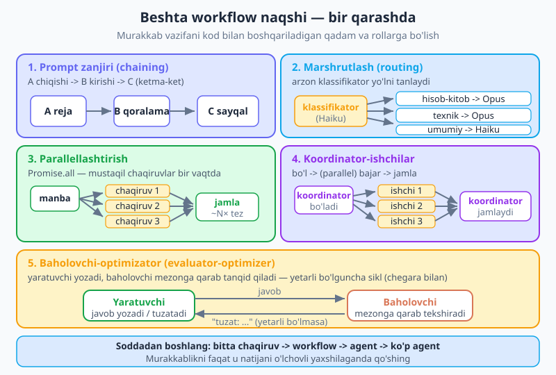
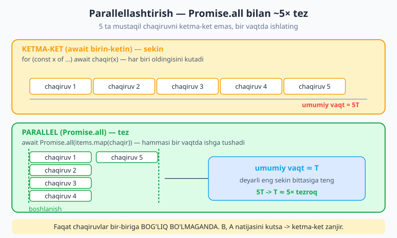
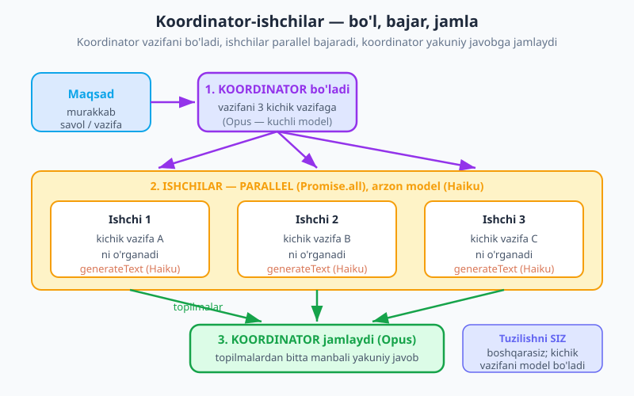

# 21 — Ko'p bosqichli va ko'p agentli ish

[⬅️ Oldingi: 20 — MCP — Model Context Protocol](./20-mcp.md) · [🏠 README](./README.md) · [Keyingi: 22 — Xavfsizlik ➡️](./22-xavfsizlik.md)

---

> **Bu bobda:** 19-bobda bitta agent qurdik — bitta model, bir to'plam vosita, o'z trayektoriyasini o'zi tanlaydigan loop. Endi savol: murakkab vazifani **bitta katta agentga** bermay, uni **bosqichlarga va rollarga** bo'lsak-chi? Ko'pincha bu ishonchliroq, kuzatish (debug) osonroq va hatto arzonroq bo'ladi — chunki siz qadamlarni **kod bilan**, deterministik (oldindan aniq) boshqarasiz. Bu bobda beshta **workflow naqshini** (prompt zanjiri, marshrutlash, parallellashtirish, koordinator-ishchilar, baholovchi-optimizator) JS misollarda o'rganamiz, "ko'p agent" deganda JS kodida aniq nima nazarda tutilishini ko'ramiz (har bir agent — bu o'z system prompti va vositalari bo'lgan **funksiya**), narx/kechikish haqiqatini (14-bobga bog'lab) o'lchaymiz, va Anthropic'ning serverdagi "Managed Agents" mahsulotiga bir jumlada ishora qilamiz. Yakunda **koordinator-ishchi tadqiqot quvuri** quramiz: koordinator savolni 3 ta kichik savolga bo'ladi → 3 ta parallel ishchi (arzon Haiku) ularni o'rganadi → kuchli Opus bitta manbali javobga jamlaydi. Misollar `@anthropic-ai/sdk` (v0.104) va AI SDK (v6) bilan.

---

## Nega bitta katta agent har doim eng yaxshi yechim emas

19-bobda agent — bu o'z qadamlarini o'zi tanlaydigan model: u fikrlaydi, vosita chaqiradi, natijani kuzatadi, yana fikrlaydi. Bu kuchli, lekin bir nozik joyi bor: **butun nazoratni modelga berasiz**. Murakkab, ko'p qismli vazifada bitta agent adashishi mumkin — bir qadamni unutadi, ortiqcha vosita chaqiradi, yoki yo'lda kontekstni boy beradi. Va nima xato ketganini topish qiyin: hamma narsa bitta uzun loop ichida.

Buni hayotiy holat bilan o'ylab ko'ring. Katta loyihani **bitta universal mutaxassisga** topshirsangiz — u hamma narsani biladi, lekin bir o'zi hamma ishni ketma-ket bajaradi, charchaydi, chalkashadi. Yoki **koordinator + bir nechta tor mutaxassis** jamoasiga berasiz: koordinator ishni bo'lib beradi, har kim o'z qismini qiladi, koordinator natijalarni yig'adi. Ikkinchisi ko'pincha tez, ishonchli va tekshirish oson.

Dasturlashda ham aynan shunday. Murakkab vazifani **bosqichlarga** (qadamlarga) yoki **rollarga** (agentlarga) bo'lib, ularni **o'z JS kodingiz bilan** ulang. Bu yondashuvning uchta yutug'i:

- **Ishonchlilik.** Har bosqich tor va aniq — model adashish ehtimoli kamayadi. Bir bosqich xato bersa, faqat o'shanisini qayta ishlatasiz, butun loopni emas.
- **Kuzatuvchanlik (debug).** Har bosqichning kirishi va chiqishini alohida ko'rasiz, logga yozasiz, sinaysiz. "Qaysi qadamda nima bo'ldi?" degan savolga aniq javob bor.
- **Narx.** Oddiy qadamlarni **arzon modelga** (Haiku) berasiz, faqat eng murakkab jamlash uchun **Opus** ishlatasiz. Bitta katta agent hamma narsani qimmat modelda qilardi.

> **Atama:** *workflow (ish oqimi)* — qadamlar **kod bilan** oldindan belgilangan, deterministik boshqariladigan jarayon. *Agent* — model o'z trayektoriyasini o'zi tanlaydi (19-bob). Farqi: workflow'da **siz** "avval A, keyin B" deysiz; agentda buni **model** hal qiladi. Ko'pincha workflow yetarli va undan boshlash kerak.

> 🔑 **Soddadan boshlang.** Eng muhim qoida: *eng oddiy ishlaydigan naqshni tanlang*. Tartib: **bitta chaqiruv → workflow → agent → ko'p agent**, faqat zarurat o'lchanganda murakkablikni oshiring. Har bir qo'shimcha agent — qo'shimcha token, narx, kechikish va xato nuqtasi.

---

## Beshta workflow naqshi

Mana kod bilan boshqariladigan beshta asosiy naqsh. Har birini alohida JS misolda ko'rib chiqamiz. Hammasi 12-bobdagi `generateText`/`generateObject` ga tayanadi — har bir "bosqich" oddiy bir chaqiruv.



### 1. Prompt zanjiri (prompt chaining) — A → B → C

Eng oddiy naqsh: bir chaqiruvning **chiqishi** keyingisining **kirishiga** beriladi. Vazifani tabiiy bosqichlarga bo'lasiz va ketma-ket `await` qilasiz. Masalan, maqola yozish: avval **reja** tuz → so'ng **qoralama** yoz → oxirida **sayqalla**.

```js
import { generateText } from "ai";
import { anthropic } from "@ai-sdk/anthropic";

async function maqolaYoz(mavzu) {
  // A bosqichi: reja
  const { text: reja } = await generateText({
    model: anthropic("claude-opus-4-8"),
    prompt: `"${mavzu}" mavzusida qisqa maqola uchun 3 banddan iborat reja tuz.`,
  });

  // B bosqichi: rejaga asoslanib qoralama
  const { text: qoralama } = await generateText({
    model: anthropic("claude-opus-4-8"),
    prompt: `Quyidagi reja asosida maqola qoralamasini yoz:\n\n${reja}`,
  });

  // C bosqichi: sayqallash
  const { text: tayyor } = await generateText({
    model: anthropic("claude-opus-4-8"),
    prompt: `Bu qoralamani aniqroq va ravonroq qilib qayta yoz:\n\n${qoralama}`,
  });

  return tayyor;
}
```

Har bosqich tor vazifani bajaradi, shuning uchun har biri ishonchliroq. Yana bir foyda: oraliq natijalarni (`reja`, `qoralama`) ko'rib, qaysi bosqich xato berganini darrov topasiz.

> 💡 **Qachon ishlatish.** Vazifa tabiiy ravishda ketma-ket bosqichlarga bo'linganda: tarjima → tahrir, ajratish → tekshirish, reja → bajarish. Agar bir bosqich oldingisining natijasiga muhtoj bo'lsa — bu prompt zanjiri.

### 2. Marshrutlash (routing) — klassifikator yo'lni tanlaydi

Ba'zan kelayotgan so'rovlar har xil bo'ladi va har biriga **boshqacha** munosabat kerak. Bu yerda arzon **klassifikator chaqiruvi** so'rovni toifaga ajratadi, so'ng kod uni to'g'ri yo'lga (prompt/vosita/model) yo'naltiradi. Oddiy holatlarni **Haiku**ga berib, pulni tejaysiz.

```js
import { generateObject, generateText } from "ai";
import { anthropic } from "@ai-sdk/anthropic";
import { z } from "zod";

async function murojaatniBoshqar(xabar) {
  // 1) Arzon klassifikator: qaysi toifa?
  const { object } = await generateObject({
    model: anthropic("claude-haiku-4-5"), // arzon model — vazifa oddiy
    schema: z.object({ toifa: z.enum(["hisob-kitob", "texnik", "umumiy"]) }),
    prompt: `Mijoz murojaatini toifaga ajrat:\n${xabar}`,
  });

  // 2) Toifaga qarab to'g'ri yo'lni tanla
  switch (object.toifa) {
    case "hisob-kitob":
      return generateText({
        model: anthropic("claude-opus-4-8"), // murakkab — kuchli model
        system: "Sen to'lov va hisob-kitob bo'yicha mutaxassissan.",
        prompt: xabar,
      });
    case "texnik":
      return generateText({
        model: anthropic("claude-opus-4-8"),
        system: "Sen texnik yordam muhandisisan.",
        prompt: xabar,
      });
    default:
      return generateText({
        model: anthropic("claude-haiku-4-5"), // oddiy savol — arzon model yetadi
        system: "Sen do'stona umumiy yordamchisan.",
        prompt: xabar,
      });
  }
}
```

Klassifikator — bitta arzon, tez chaqiruv. U nafaqat **promptni** (system) tanlaydi, balki **modelni** ham: oddiy savolga Haiku, murakkabiga Opus. Bu — narxni boshqarishning eng amaliy naqshlaridan biri (14-bob).

> **Atama:** *klassifikator (classifier)* — kirishni oldindan belgilangan toifalardan biriga ajratuvchi chaqiruv. Bu yerda u **marshrutlash kaliti** vazifasini bajaradi. `generateObject` + `z.enum` aynan shu uchun ideal (12-bob).

### 3. Parallellashtirish (parallelization) — `Promise.all`

Agar bir nechta chaqiruv **bir-biriga bog'liq bo'lmasa** (biri ikkinchisining natijasini kutmasa), ularni ketma-ket emas, **bir vaqtda** ishlatish kerak. JS'da bu — `Promise.all`. Masalan, 5 ta hujjatni yoki bitta matnga 3 ta mustaqil tahlilni bir paytda olasiz, keyin jamlaysiz.

```js
import { generateText } from "ai";
import { anthropic } from "@ai-sdk/anthropic";

async function hujjatlarniXulosala(hujjatlar) {
  // Har bir hujjat mustaqil — hammasini BIR VAQTDA yuboramiz
  const xulosalar = await Promise.all(
    hujjatlar.map((hujjat) =>
      generateText({
        model: anthropic("claude-haiku-4-5"),
        prompt: `Bu hujjatni bir jumlada xulosala:\n\n${hujjat}`,
      }).then((r) => r.text)
    )
  );

  return xulosalar; // 5 ta xulosa — lekin 1 ta chaqiruv vaqtida keldi
}
```

Asosiy yutuq — **kechikish (latency)**. 5 ta hujjatni ketma-ket qilsangiz, vaqt 5× ko'p. `Promise.all` bilan hammasi parallel ketadi, shuning uchun umumiy vaqt deyarli **eng sekin bittasiniki**ga teng — ya'ni ~5× tezroq.



> 💡 **Qachon parallel?** Faqat chaqiruvlar **bir-biriga bog'liq bo'lmaganda**. Agar B chaqiruvi A ning natijasini talab qilsa — bu prompt zanjiri (ketma-ket), parallel emas. "Bir nechta narsani alohida-alohida qil" → parallel; "avval buni, keyin uni" → zanjir.

### 4. Koordinator-ishchilar (orchestrator-workers)

Bu — eng kuchli naqsh va bu bobning asosiy quroli. Bitta **koordinator** (orchestrator) chaqiruvi vazifani kichik vazifalarga **bo'ladi**, har biri uchun **ishchi** (worker) chaqiruvini ishga tushiradi (ko'pincha parallel), so'ng ularning natijalarini bitta javobga **jamlaydi**. Masalan, tadqiqot vazifasi: koordinator savolni 3 yo'nalishga ajratadi → har bir yo'nalishni alohida ishchi o'rganadi → koordinator hisobotni yozadi.

```js
import { generateObject, generateText } from "ai";
import { anthropic } from "@ai-sdk/anthropic";
import { z } from "zod";

async function tadqiqotQuvuri(savol) {
  // 1) KOORDINATOR: savolni kichik savollarga bo'ladi
  const { object } = await generateObject({
    model: anthropic("claude-opus-4-8"),
    schema: z.object({ kichikSavollar: z.array(z.string()).length(3) }),
    prompt: `Bu savolni o'rganish uchun 3 ta mustaqil kichik savolga bo'l:\n${savol}`,
  });

  // 2) ISHCHILAR: har bir kichik savolni PARALLEL o'rganadi (arzon model)
  const topilmalar = await Promise.all(
    object.kichikSavollar.map((ks) =>
      generateText({
        model: anthropic("claude-haiku-4-5"), // ishchilar — arzon
        prompt: `Quyidagi savolga qisqa, faktik javob ber:\n${ks}`,
      }).then((r) => r.text)
    )
  );

  // 3) KOORDINATOR: topilmalarni bitta javobga jamlaydi (kuchli model)
  const { text } = await generateText({
    model: anthropic("claude-opus-4-8"),
    prompt:
      `Asosiy savol: ${savol}\n\nTopilmalar:\n` +
      topilmalar.map((t, i) => `(${i + 1}) ${t}`).join("\n") +
      `\n\nShu topilmalarga tayanib yaxlit javob yoz.`,
  });

  return text;
}
```

Diqqat qiling: bo'lish (`generateObject`) va jamlash (`generateText`) — **kuchli Opus**da, lekin ishchilar — **arzon Haiku**da. Bu narx va sifat o'rtasidagi muvozanat.



> 💡 **Workflow vs koordinator.** Prompt zanjirida bosqichlar **siz** belgilagansiz (qattiq). Koordinator-ishchilarda esa kichik vazifalarni **model** belgilaydi (dinamik), lekin bo'lish→bajarish→jamlash tuzilishini **siz** boshqarasiz. Bu — workflow bilan agent o'rtasidagi oraliq.

### 5. Baholovchi-optimizator (evaluator-optimizer) — yarat ↔ tanqid qil

Ba'zan bir chaqiruv **yaratadi**, ikkinchisi uni **mezonlarga qarab tanqid qiladi**, so'ng birinchisi tuzatadi — yetarli bo'lguncha. Bu — sifatni oshiruvchi sikl. Tanqid qiluvchi "baholovchi" mohiyatan kichik baho (eval) — buni to'liq **[23-bob](./README.md)** da ko'ramiz.

```js
import { generateObject, generateText } from "ai";
import { anthropic } from "@ai-sdk/anthropic";
import { z } from "zod";

async function yaratVaSayqalla(vazifa, maxUrinish = 3) {
  let javob = "";
  for (let i = 0; i < maxUrinish; i++) {
    // YARATUVCHI: javob yoz (yoki avvalgisini tuzat)
    const { text } = await generateText({
      model: anthropic("claude-opus-4-8"),
      prompt: javob
        ? `Vazifa: ${vazifa}\nAvvalgi javob:\n${javob}\nUni yaxshila.`
        : `Vazifa: ${vazifa}`,
    });
    javob = text;

    // BAHOLOVCHI: mezonlarga qarab tekshir
    const { object } = await generateObject({
      model: anthropic("claude-opus-4-8"),
      schema: z.object({
        yetarli: z.boolean(),
        izoh: z.string(),
      }),
      prompt: `Bu javob "${vazifa}" vazifasini to'liq bajardimi?\n\n${javob}`,
    });

    if (object.yetarli) break; // mezonga yetdi — to'xta
    vazifa = `${vazifa}\n(Tuzatish kerak: ${object.izoh})`;
  }
  return javob;
}
```

Bu naqsh sifatni sezilarli oshiradi, lekin har sikl — qo'shimcha chaqiruv, ya'ni qo'shimcha narx va vaqt. Shuning uchun **chegara** (`maxUrinish`) bering — cheksiz sikldan saqlanasiz (19-bobdagi `stopWhen` g'oyasiga o'xshash).

---

## "Ko'p agent" JS kodida — har bir agent bitta funksiya

"Ko'p agentli tizim" hayajonli yangraydi, lekin JS'da u oddiy narsa: **har bir agent — bu funksiya**. Funksiya ichida `generateText`/`generateObject` chaqiriladi, o'z **system prompti** (roli) va kerak bo'lsa **o'z vositalari** bilan. **Orkestrator** (koordinator funksiyasi) bu agentlarni chaqiradi va ular orasida ma'lumotni uzatadi. Sehr yo'q — bu shunchaki bir-birini chaqiruvchi funksiyalar.

```js
import { generateText } from "ai";
import { anthropic } from "@ai-sdk/anthropic";

// "Tadqiqotchi" agenti — o'z roli bor
async function tadqiqotchi(mavzu) {
  const { text } = await generateText({
    model: anthropic("claude-haiku-4-5"), // arzon — ishchi roli
    system: "Sen tadqiqotchisan. Mavzu bo'yicha faktik tezislar yig'asan.",
    prompt: `"${mavzu}" bo'yicha 3 ta asosiy fakt top.`,
  });
  return text;
}

// "Yozuvchi" agenti — boshqa rol
async function yozuvchi(tezislar) {
  const { text } = await generateText({
    model: anthropic("claude-opus-4-8"), // kuchli — yakuniy matn
    system: "Sen muharrirsan. Tezislardan ravon matn yozasan.",
    prompt: `Quyidagi tezislardan qisqa xat yoz:\n${tezislar}`,
  });
  return text;
}

// ORKESTRATOR: agentlarni ulaydi, ma'lumotni uzatadi
async function maqolaTizimi(mavzu) {
  const tezislar = await tadqiqotchi(mavzu); // 1-agent ishlaydi
  return yozuvchi(tezislar);                 // natija 2-agentga uzatiladi
}
```

Har bir agent — alohida funksiya, alohida rol, hatto alohida model. Parallel ishchilar kerak bo'lsa — yana o'sha `Promise.all`:

```js
// Bir nechta tadqiqotchini PARALLEL ishlatish
const [a, b, c] = await Promise.all([
  tadqiqotchi("narx"),
  tadqiqotchi("xavfsizlik"),
  tadqiqotchi("tezlik"),
]);
```

> 🔑 **Agent = funksiya + rol.** "Multi-agent" ni jodu deb o'ylamang. Bu — har biri tor rolga ega bir nechta `generateText` o'rami va ularni ulovchi oddiy JS. Agentlar **vositalarga** ham ega bo'lishi mumkin (12-bob: `tools` + `stopWhen`) — masalan, tadqiqotchi qidiruv vositasiga ega bo'lib, ichida o'z mini-loopini aylantiradi.

> ℹ️ **Bir jumlada.** Anthropic'da serverda ishlovchi **"Managed Agents"** mahsuloti ham bor — siz saqlanadigan agent + sessiyalar yaratasiz, loopni esa Anthropic o'z infratuzilmasida aylantiradi; bu — ilg'or, hostlangan variant, lekin bu bob **o'z JS kodingizda** orkestratsiya qilish haqida.

---

## Narx va kechikish haqiqati

Har bir qo'shilgan agent yoki bosqich — qo'shimcha **token**, qo'shimcha **pul**, qo'shimcha **kechikish** va qo'shimcha **xato nuqtasi**. Ko'p agentli tizim aqlli ko'rinadi, lekin u har doim ham foydali emas. Mana mezon:

| Naqsh | Narx | Kechikish | Qachon |
|---|---|---|---|
| Bitta chaqiruv | Eng arzon | Eng kam | Oddiy, bir qadamli vazifa |
| Prompt zanjiri | O'rta (N×) | Yuqori (ketma-ket) | Tabiiy bosqichlar bor |
| Marshrutlash | Arzon (klassifikator Haiku) | Kam | Har xil so'rovlar, har xiliga boshqacha |
| Parallellashtirish | O'rta (N×) | **Kam** (bir vaqtda) | Mustaqil ishlar ko'p |
| Koordinator-ishchilar | Yuqori (1 + N + 1) | O'rta | Murakkab, bo'linadigan vazifa |
| Baholovchi-optimizator | Yuqori (sikl × 2) | Yuqori | Sifat narxdan muhimroq |

Amaliy qoidalar:

- **Eng oddiydan boshlang.** Avval bitta chaqiruvni sinang. Yetmasagina workflow'ga, undan keyin agentga, va faqat oxirgi chora sifatida ko'p agentga o'ting.
- **Murakkablikni faqat o'lchanganda qo'shing.** "Ko'p agent qiziq" emas, "ko'p agent natijani sezilarli yaxshilaydi" — shundagina qo'shing.
- **Arzon modelni ishlating.** Ishchilar, klassifikatorlar va oddiy qadamlar uchun **Haiku**; faqat murakkab jamlash uchun **Opus** (14-bob narx jadvalini eslang).
- **Adversarial (qarama-qarshi) naqshlar sifatni oshiradi, lekin qimmat.** Baholovchi-optimizator yaxshi natija beradi, biroq har sikl ikki barobar chaqiruv.

> 🔑 **14-bobga bog'lash.** Token narxi va limitlari real. 3 ta parallel ishchi = 3× ishchi tokeni + koordinatorning 2 chaqiruvi. Ko'p sessiya uchun bu tez yig'iladi. Naqsh tanlashda har doim "bu pul va vaqtga arzaydimi?" deb so'rang.

---

## Quramiz: koordinator-ishchi tadqiqot quvuri

Endi hammasini birlashtiramiz. To'liq, ishlaydigan **tadqiqot quvuri**: koordinator savolni 3 ta kichik savolga bo'ladi, 3 ta **parallel** ishchi (arzon Haiku) ularni o'rganadi, kuchli **Opus** chaqiruvi esa manbalarga ishora qilgan yaxlit javob yozadi. Bu — koordinator-ishchilar + parallellashtirish + model-aralash narx optimizatsiyasini bitta misolda jamlaydi.

```js
import { generateObject, generateText } from "ai";
import { anthropic } from "@ai-sdk/anthropic";
import { z } from "zod";

async function tadqiqotQil(savol) {
  // 1) KOORDINATOR (Opus): savolni 3 ta kichik savolga bo'ladi
  const { object } = await generateObject({
    model: anthropic("claude-opus-4-8"),
    schema: z.object({
      kichikSavollar: z.array(z.string()).length(3),
    }),
    system: "Sen tadqiqot koordinatorisan. Savolni o'rganish uchun " +
            "bir-birini takrorlamaydigan 3 ta yo'nalishga bo'lasan.",
    prompt: savol,
  });

  // 2) ISHCHILAR (Haiku, PARALLEL): har biri bitta yo'nalishni o'rganadi
  const topilmalar = await Promise.all(
    object.kichikSavollar.map(async (ks, i) => {
      const { text } = await generateText({
        model: anthropic("claude-haiku-4-5"), // arzon ishchi
        system: "Sen tadqiqotchisan. Qisqa, faktik javob berasan.",
        prompt: ks,
      });
      return { manba: `Ishchi ${i + 1}`, savol: ks, javob: text };
    })
  );

  // 3) KOORDINATOR (Opus): topilmalarni manbali javobga jamlaydi
  const { text } = await generateText({
    model: anthropic("claude-opus-4-8"), // kuchli jamlovchi
    system: "Sen muharrirsan. Faqat berilgan topilmalarga tayanib javob " +
            "yozasan va har bir da'vodan keyin manbani [Ishchi N] ko'rsatasan.",
    prompt:
      `Asosiy savol: ${savol}\n\nTopilmalar:\n` +
      topilmalar
        .map((t) => `[${t.manba}] ${t.savol}\n→ ${t.javob}`)
        .join("\n\n"),
  });

  return { javob: text, topilmalar };
}

const natija = await tadqiqotQil(
  "Elektromobillar an'anaviy avtomobillarga nisbatan qanday afzal va kamchiliklarga ega?"
);
console.log(natija.javob);
// Koordinator 3 yo'nalishga bo'ldi (masalan: narx, ekologiya, infratuzilma),
// 3 ishchi parallel o'rgandi, Opus manbali yakuniy javobga jamladi.
```

Quvurning go'zalligi — har bo'lak o'z vazifasiga mos modelda ishlaydi: bo'lish va jamlash uchun aql (Opus), mustaqil o'rganish uchun tezlik va arzonlik (Haiku, parallel). Va siz har bosqichni alohida ko'rasiz: `natija.topilmalar` ichchida har bir ishchi nima topganini tekshirib, sifatni baholaysiz.

> 💡 **Bu yerda ham xom SDK bilan ishlash mumkin.** Misollar AI SDK'da, lekin xuddi shu naqshlarni `@anthropic-ai/sdk` (`messages.create`) bilan ham quryapsiz — har bir "agent" `client.messages.create({ model, system, messages })` ni o'rovchi funksiya, orkestrator esa ularni `Promise.all` bilan ulaydi (07-bob).

---

## Tez-tez uchraydigan xatolar

| Xato | Nima bo'ladi | Yechim |
|---|---|---|
| Mustaqil chaqiruvlarni ketma-ket `await` qilish | Kechikish N× ko'p, behuda kutish | Bog'liq bo'lmasa **`Promise.all`** |
| Bog'liq qadamlarni parallel qilish | B, A natijasini kutmaydi → noto'g'ri natija | Bog'liq bo'lsa **ketma-ket zanjir** |
| Hamma narsani Opus'da qilish | Ortiqcha narx | Ishchi/klassifikatorga **Haiku** |
| Baholovchi siklida chegara yo'q | Cheksiz sikl, behuda token | **`maxUrinish`** chegarasi bering |
| Bitta katta agentga murakkab vazifa | Adashadi, debug qiyin | Bosqich/rolga **bo'ling** (workflow) |
| Murakkablikni "qiziq" deb qo'shish | Ortiqcha narx, kechikish, xato nuqtasi | Faqat **o'lchanganda** murakkablash |

---

## Mashqlar

Quyidagilarni `node fayl.mjs` bilan ishga tushiring. Avval `npm i ai @ai-sdk/anthropic zod` (11-bob) va `.env` da `ANTHROPIC_API_KEY` (02-bob).

### Oson

1. **Prompt zanjiri.** Ikki bosqichli zanjir yozing: avval `generateText` bilan berilgan mavzuga sarlavha tuzing, keyin o'sha sarlavhani ikkinchi chaqiruvga berib bir paragraf yozing. Oraliq sarlavhani ham chop eting.
2. **Ketma-ket vs parallel.** 3 ta mustaqil so'rovni avval ketma-ket `await` bilan, keyin `Promise.all` bilan bajaring. `console.time`/`console.timeEnd` bilan ikki variantning vaqtini solishtiring.
3. **Agent = funksiya.** O'z `system` prompti bo'lgan `xulosalovchi(matn)` nomli agent-funksiya yozing. Uni `generateText` bilan quring va ikki xil matnda sinang.
4. **Naqshni tanlash.** Bir gapda tushuntiring: "5 ta hujjatni alohida xulosala" — qaysi naqsh? "Avval tarjima qil, keyin tahrirla" — qaysi naqsh? Nega?

### O'rta

5. **Marshrutlovchi.** `generateObject` + `z.enum(["savol","shikoyat","maqtov"])` bilan klassifikator yozing (Haiku'da). Toifaga qarab `switch` orqali uch xil `system` prompt bilan `generateText` chaqiring. Klassifikator nega arzon modelda?
6. **Parallel xulosa.** 4 ta qisqa matn massivini `Promise.all` + `.map` bilan bir vaqtda xulosalang (Haiku'da). Natija — 4 ta xulosa massivi. Ishchilarga nega Opus emas, Haiku?
7. **Ikki agentli quvur.** `tadqiqotchi(mavzu)` (Haiku) va `yozuvchi(tezislar)` (Opus) ikki agent-funksiya yozing, orkestrator ularni ulasin: tadqiqotchi tezis yig'adi → yozuvchi xat yozadi. Har biriga alohida `system` rol bering.
8. **Baholovchi sikli.** `yaratVaSayqalla(vazifa)` yozing: `generateText` yaratadi, `generateObject` (`{ yetarli: boolean, izoh: string }`) baholaydi, `yetarli` bo'lmasa qayta uradi. `maxUrinish=3` chegarasi qo'ying. Nega chegara shart?

### Qiyin

9. **To'liq tadqiqot quvuri (bob misoli).** Bob matnidagi `tadqiqotQil` ni qurib ishga tushiring: koordinator (Opus) 3 kichik savolga bo'ladi → 3 ishchi (Haiku, parallel) o'rganadi → koordinator (Opus) manbali javobga jamlaydi. `natija.topilmalar` ni chop etib, har ishchi nima topganini ko'rsating.
10. **Narxni o'lchash.** 9-mashqdagi quvurda har bir chaqiruvning `usage` (kirish/chiqish token) ini yig'ing (AI SDK natijasidagi `usage` maydoni). Hammasini Opus'da qilsangiz narx qancha o'zgaradi — Haiku jadvalidan (14-bob) taxminan hisoblang.
11. **Naqshlarni birlashtirish.** Marshrutlash + koordinator-ishchilarni birlashtiring: avval klassifikator so'rov "oddiy"mi yoki "tadqiqot"mi aniqlasin; "oddiy" bo'lsa bitta Haiku chaqiruvi, "tadqiqot" bo'lsa to'liq koordinator-ishchi quvuri ishlasin. Bu nega narxni tejaydi?

<details markdown="1">
<summary>Yechimlar</summary>

Hammasi `ai` (v6.0), `@ai-sdk/anthropic` (v3.0), `zod` (v4) bilan. `ANTHROPIC_API_KEY` ni `.env` da saqlang.

### 1-mashq yechimi

```js
import { generateText } from "ai";
import { anthropic } from "@ai-sdk/anthropic";

const { text: sarlavha } = await generateText({
  model: anthropic("claude-opus-4-8"),
  prompt: "Quyosh panellari haqida qiziqarli sarlavha tuz.",
});
console.log("Sarlavha:", sarlavha);

const { text: paragraf } = await generateText({
  model: anthropic("claude-opus-4-8"),
  prompt: `Shu sarlavhaga bir paragraf yoz:\n${sarlavha}`,
});
console.log(paragraf);
```

Sarlavhaning chiqishi paragraf chaqiruvining kirishiga beriladi — bu prompt zanjiri.

### 2-mashq yechimi

```js
import { generateText } from "ai";
import { anthropic } from "@ai-sdk/anthropic";

const savollar = ["Quyosh nima?", "Oy nima?", "Yulduz nima?"];
const m = anthropic("claude-haiku-4-5");

console.time("ketma-ket");
for (const s of savollar) await generateText({ model: m, prompt: s });
console.timeEnd("ketma-ket"); // ~3× sekin

console.time("parallel");
await Promise.all(savollar.map((s) => generateText({ model: m, prompt: s })));
console.timeEnd("parallel"); // ~1× (bir vaqtda)
```

Mustaqil so'rovlar — parallel ishlatilsa, vaqt deyarli eng sekin bittasiga teng.

### 3-mashq yechimi

```js
import { generateText } from "ai";
import { anthropic } from "@ai-sdk/anthropic";

async function xulosalovchi(matn) {
  const { text } = await generateText({
    model: anthropic("claude-haiku-4-5"),
    system: "Sen xulosalovchisan. Matnni bir jumlada xulosalaysan.",
    prompt: matn,
  });
  return text;
}

console.log(await xulosalovchi("Uzun matn 1..."));
console.log(await xulosalovchi("Uzun matn 2..."));
```

Agent — bu o'z `system` roli bo'lgan funksiya. Hammasi shu.

### 4-mashq yechimi

"5 ta hujjatni alohida xulosala" — **parallellashtirish** (`Promise.all`): hujjatlar bir-biriga bog'liq emas, hammasini bir vaqtda qilamiz, tezroq. "Avval tarjima qil, keyin tahrirla" — **prompt zanjiri**: tahrir tarjima natijasiga muhtoj, shuning uchun ketma-ket bo'lishi shart.

### 5-mashq yechimi

```js
import { generateObject, generateText } from "ai";
import { anthropic } from "@ai-sdk/anthropic";
import { z } from "zod";

async function boshqar(xabar) {
  const { object } = await generateObject({
    model: anthropic("claude-haiku-4-5"), // klassifikator — arzon, vazifa oddiy
    schema: z.object({ toifa: z.enum(["savol", "shikoyat", "maqtov"]) }),
    prompt: xabar,
  });

  const promptlar = {
    savol: "Sen do'stona yordamchisan, aniq javob ber.",
    shikoyat: "Sen mijozlarni tinchlantiruvchi yordamchisan, uzr so'ra.",
    maqtov: "Sen minnatdorchilik bildiruvchi yordamchisan.",
  };

  return generateText({
    model: anthropic("claude-opus-4-8"),
    system: promptlar[object.toifa],
    prompt: xabar,
  });
}
```

Klassifikator arzon modelda, chunki uning vazifasi oddiy (bitta toifani tanlash) — bu yerda Opus pul isrofi bo'lardi.

### 6-mashq yechimi

```js
import { generateText } from "ai";
import { anthropic } from "@ai-sdk/anthropic";

const matnlar = ["matn A...", "matn B...", "matn C...", "matn D..."];

const xulosalar = await Promise.all(
  matnlar.map((m) =>
    generateText({
      model: anthropic("claude-haiku-4-5"),
      prompt: `Bir jumlada xulosala:\n${m}`,
    }).then((r) => r.text)
  )
);
console.log(xulosalar); // 4 ta xulosa
```

Ishchilarga Haiku — xulosalash oddiy va ko'p marta takrorlanadi, shuning uchun arzon model narxni keskin tejaydi (14-bob).

### 7-mashq yechimi

```js
import { generateText } from "ai";
import { anthropic } from "@ai-sdk/anthropic";

async function tadqiqotchi(mavzu) {
  const { text } = await generateText({
    model: anthropic("claude-haiku-4-5"),
    system: "Sen tadqiqotchisan. Faktik tezislar yig'asan.",
    prompt: `"${mavzu}" bo'yicha 3 ta fakt top.`,
  });
  return text;
}

async function yozuvchi(tezislar) {
  const { text } = await generateText({
    model: anthropic("claude-opus-4-8"),
    system: "Sen muharrirsan. Tezislardan ravon matn yozasan.",
    prompt: `Quyidagi tezislardan qisqa xat yoz:\n${tezislar}`,
  });
  return text;
}

const xat = await yozuvchi(await tadqiqotchi("quyosh energiyasi"));
console.log(xat);
```

Ikki agent, ikki rol, ikki model: tadqiqotchi arzon (yig'ish), yozuvchi kuchli (yakuniy matn).

### 8-mashq yechimi

```js
import { generateObject, generateText } from "ai";
import { anthropic } from "@ai-sdk/anthropic";
import { z } from "zod";

async function yaratVaSayqalla(vazifa, maxUrinish = 3) {
  let javob = "";
  for (let i = 0; i < maxUrinish; i++) {
    const { text } = await generateText({
      model: anthropic("claude-opus-4-8"),
      prompt: javob ? `Vazifa: ${vazifa}\nAvvalgi:\n${javob}\nYaxshila.` : vazifa,
    });
    javob = text;

    const { object } = await generateObject({
      model: anthropic("claude-opus-4-8"),
      schema: z.object({ yetarli: z.boolean(), izoh: z.string() }),
      prompt: `Bu javob vazifani bajardimi?\n${javob}`,
    });
    if (object.yetarli) break;
    vazifa = `${vazifa} (Tuzat: ${object.izoh})`;
  }
  return javob;
}
```

Chegara (`maxUrinish`) shart, chunki baholovchi hech qachon "yetarli" demasligi mumkin — chegarasiz sikl cheksiz aylanib, token va pulni isrof qiladi.

### 9-mashq yechimi

Bob matnidagi `tadqiqotQil` ni to'liq ishlatamiz va topilmalarni ochib ko'rsatamiz:

```js
const natija = await tadqiqotQil(
  "Masofadan ishlashning afzallik va kamchiliklari nimada?"
);
console.log("=== YAKUNIY JAVOB ===\n", natija.javob);
console.log("\n=== ISHCHILAR TOPILMALARI ===");
for (const t of natija.topilmalar) {
  console.log(`\n[${t.manba}] ${t.savol}\n→ ${t.javob}`);
}
```

`natija.topilmalar` har bir ishchi parallel nima topganini ko'rsatadi — bu debug va sifat nazorati uchun bebaho.

### 10-mashq yechimi

```js
// Har chaqiruv natijasida usage bor: { inputTokens, outputTokens }
let jami = { kirish: 0, chiqish: 0 };
function qoshish(r) {
  jami.kirish += r.usage.inputTokens ?? 0;
  jami.chiqish += r.usage.outputTokens ?? 0;
}
// tadqiqotQil ichidagi har generateText/generateObject natijasiga qoshish() chaqiring.
// Keyin (14-bob jadvali bilan):
// Haiku:  $1.00/1M kirish, $5.00/1M chiqish
// Opus:   $5.00/1M kirish, $25.00/1M chiqish
const narx = (jami.kirish / 1e6) * 5 + (jami.chiqish / 1e6) * 25; // hammasi Opus bo'lsa
console.log("Token:", jami, "≈ $", narx.toFixed(4));
```

Ishchilarni Haiku'da qoldirsangiz, ularning tokenlari 5× arzonroq hisoblanadi — quvurning katta qismi ishchilarda bo'lgani uchun bu sezilarli farq.

### 11-mashq yechimi

```js
import { generateObject } from "ai";
import { anthropic } from "@ai-sdk/anthropic";
import { z } from "zod";

async function aqlliBoshqar(savol) {
  // 1) Arzon klassifikator: oddiymi yoki tadqiqotmi?
  const { object } = await generateObject({
    model: anthropic("claude-haiku-4-5"),
    schema: z.object({ tur: z.enum(["oddiy", "tadqiqot"]) }),
    prompt: `Bu savol oddiy faktik javob talab qiladimi yoki chuqur tadqiqotmi?\n${savol}`,
  });

  if (object.tur === "oddiy") {
    // bitta arzon chaqiruv yetadi
    const { generateText } = await import("ai");
    const { text } = await generateText({
      model: anthropic("claude-haiku-4-5"),
      prompt: savol,
    });
    return text;
  }
  // murakkab — to'liq koordinator-ishchi quvuri
  return (await tadqiqotQil(savol)).javob;
}
```

Bu narxni tejaydi, chunki **oddiy savollar** qimmat koordinator-ishchi quvurini umuman ishlatmaydi — bitta arzon Haiku chaqiruvi bilan tugaydi. Faqat haqiqatan murakkab savollar to'liq quvurga tushadi.

</details>

---

## Yakunda

Bu bobda murakkab vazifani bitta katta agentga bermay, uni **kod bilan boshqariladigan bosqich va rollarga** bo'lishni o'rgandik:

- **Nega.** Bo'lish ishonchli (har qadam tor), debug oson (har qadam ko'rinadi) va arzon (oddiy qadamlar Haiku'da). "Koordinator + mutaxassislar" ko'pincha "bitta universal" dan yaxshi.
- **Beshta naqsh.** *Prompt zanjiri* (A→B→C, ketma-ket), *marshrutlash* (klassifikator yo'lni tanlaydi, oddiyga Haiku), *parallellashtirish* (`Promise.all`, ~N× tez), *koordinator-ishchilar* (bo'l→bajar→jamla), *baholovchi-optimizator* (yarat↔tanqid, chegara bilan).
- **Ko'p agent JS'da.** Har agent — o'z `system` roli (va kerak bo'lsa vositalari) bo'lgan **funksiya**; orkestrator ularni chaqiradi va ma'lumotni uzatadi; parallel uchun `Promise.all`. Sehr yo'q.
- **Narx haqiqati.** Har agent = ko'proq token, pul, kechikish, xato nuqtasi. **Eng oddiy ishlaydigan naqshdan boshlang**, murakkablikni faqat o'lchanganda qo'shing, arzon modelni ishlating (14-bob).
- Qurdik: **koordinator-ishchi tadqiqot quvuri** — Opus bo'ladi/jamlaydi, Haiku ishchilari parallel o'rganadi, yakunda manbali javob.

Bu naqshlar 19-bobdagi bitta agentni butun **tizimga** kengaytiradi. Keyingi bobda esa eng muhim mavzuga o'tamiz: bu tizimlarni xavfsiz qilish — prompt-injection, ma'lumot sizib chiqishi, vositalarni nazorat qilish. **[22-bob: Xavfsizlik](./22-xavfsizlik.md)** da ko'p agentli quvuringizning har bir chaqiruvini qanday himoyalashni o'rganamiz.

---

[⬅️ Oldingi: 20 — MCP — Model Context Protocol](./20-mcp.md) · [🏠 README](./README.md) · [Keyingi: 22 — Xavfsizlik ➡️](./22-xavfsizlik.md)
