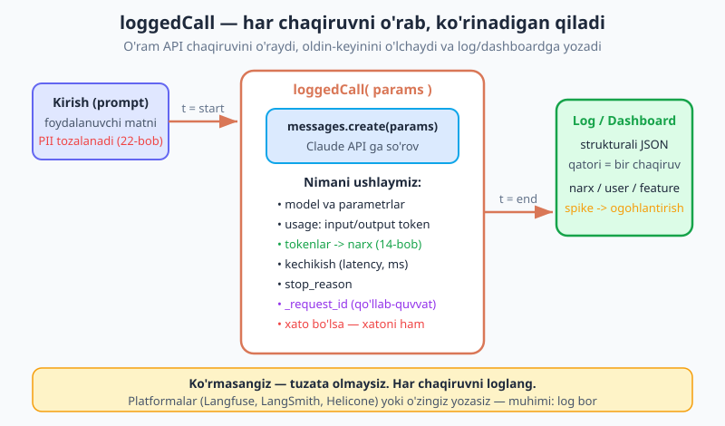
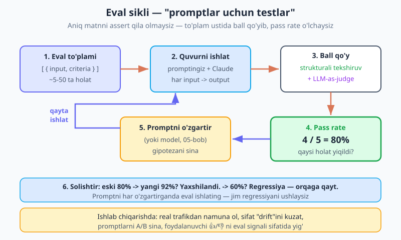
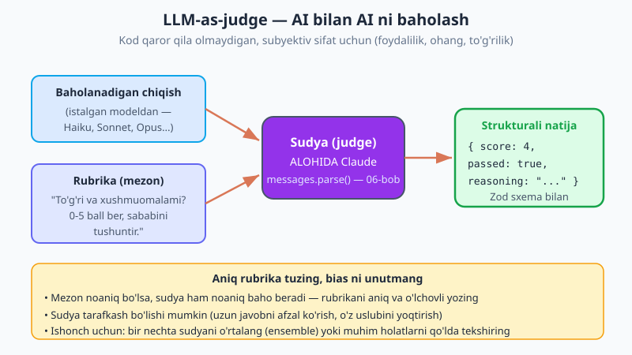

# 23 — Observability va evals

[⬅️ Oldingi: 22 — Xavfsizlik](./22-xavfsizlik.md) · [🏠 README](./README.md) · [Keyingi: 24 — Batch API va optimizatsiya ➡️](./24-batch-optimizatsiya.md)

---

> **Bu bobda:** ilovangiz **haqiqatan ishlayaptimi** va sizga **necha turyaptimi** — buni qanday bilasiz? Oddiy backend'da bu oson: test yozasiz, `assert(jami === 42)`, tamom. LLM bilan esa chiqish **deterministik emas** — bir xil prompt har safar biroz boshqa javob beradi. "Mening testimda bir marta ishladi" — bu "ishlab chiqarishda ishlaydi" degani emas. Shuning uchun ikkita ko'nikma kerak: **observability** (kuzatuvchanlik) — ichkarida nima sodir bo'layotganini **ko'rish** (har chaqiruvni loglash: kirish, chiqish, model, token→narx, kechikish, `stop_reason`, `_request_id`, xatolar) — va **evals** (baholash) — sifatni **tizimli o'lchash** (eval to'plami + ball qo'yish). Biz `loggedCall` o'ramini quramiz (PII tozalab, narx-kechikishni loglaydi), agent qadamlarini **trace** qilamiz, so'ng "promptlar uchun testlar"ni — strukturali tekshiruv + **LLM-as-judge** (alohida Claude chiqishni rubrika bo'yicha baholaydi) bilan mini **eval harness** quramiz va **pass rate** chiqaramiz. Bularsiz siz ko'r holda deploy qilasiz: debug qila olmaysiz, promptni o'zgartirsangiz sifat jimgina pasayadi, hisob esa kutilmaganda oshadi.

> **Halollik eslatmasi:** bu bobdagi `msg.usage` (token), `msg.stop_reason`, `msg._request_id` maydonlari va `client.messages.parse()` (Zod `output_format` bilan) chaqiruvlari `@anthropic-ai/sdk` **0.104** ga asoslangan va 06/14-boblardagi bilan bir xil. AI SDK'ning `experimental_telemetry` (OpenTelemetry) — `ai` v6 da mavjud belgi. **Kuzatuv platformalari (Langfuse, LangSmith, Helicone, OpenTelemetry) — variant sifatida eslatiladi, biri tavsiya etilmaydi**; ularning aniq API'lari tez o'zgaradi, shuning uchun bu bobda kodni **o'z loglaringiz** atrofida quramiz (har qanday platformaga moslashadi). LLM-as-judge — kuchli, lekin **mukammal emas** vosita: sudya tarafkash bo'lishi mumkin, shuning uchun uni **bittagina haqiqat** sifatida emas, signal sifatida ishlating.

---

## Nega bu bob muhim? — non-deterministik tizimni qanday boshqarasiz

Tasavvur qiling, siz mahsulot sharhlarini "ijobiy / salbiy" deb tasniflaydigan AI funksiyani yozdingiz. Uch-to'rt sharhda sinab ko'rdingiz — to'g'ri ishladi. Deploy qildingiz. Ikki haftadan keyin mijoz qo'ng'iroq qiladi: "Nega mening salbiy sharhim 'ijobiy' deb belgilandi?" Siz logni ochasiz... va u yo'q. Qaysi prompt ketganini, model nima javob berganini, qancha token sarflanganini — **hech narsani bilmaysiz**. Tuzatishni qayerdan boshlashni ham bilmaysiz.

Mana bu — odatiy backend bilan AI ilova orasidagi tub farq. Odatiy kodda `2 + 2` **doim** `4`. LLM esa **ehtimollik mashinasi** (01-bobni eslang): har token oldingilarga qarab tasodifiy element bilan tanlanadi. Ya'ni bir xil prompt har safar **biroz boshqacha** javob berishi mumkin. Bu — kuchli xususiyat (ijodiy, moslashuvchan), lekin shuni anglatadi: siz **aniq matnni** assert qila olmaysiz, va "bir marta ishladi" hech narsani kafolatlamaydi.

Demak sizga ikkita yangi ko'nikma kerak:

- **Observability** (kuzatuvchanlik) — ilova ichida har chaqiruvda nima bo'layotganini **ko'rish**. Bu — "qora quti"ni shaffof qilish. Kelganda darrov javob bera olishingiz kerak: *bu foydalanuvchiga qaysi prompt ketdi? Model nima qaytardi? Necha token, necha sent? Qancha kutdi? Xato bormi?*
- **Evals** (evaluation, baholash) — chiqish sifatini **tizimli o'lchash**. Bir necha holatdan iborat *eval to'plami* tuzasiz, ustidan ilovani yurgizib, natijalarga ball qo'yasiz. Bu — "promptlar uchun testlar": promptni yoki modelni o'zgartirganingizda **regressiya**ni (sifat pasayishini) ushlaydi.

Birinchisi — *ko'rish*, ikkinchisi — *o'lchash*. Ikkalasi ham bo'lmasa, siz ko'r holda uchasiz. Keling, ko'rishdan boshlaylik.

---

## Observability: har chaqiruvni loglash

Eng asosiy odat juda oddiy: **har LLM chaqiruvini loglang.** Lekin "loglash" deganda `console.log(javob)` emas — sizga **strukturali**, qidiriladigan va jamlanadigan ma'lumot kerak. Har chaqiruv uchun quyidagilarni yozing:

- **model** va asosiy parametrlar (`max_tokens`, harorat va h.k.) — qaysi sozlama bilan ishlaganini bilish uchun;
- **`usage`** — `input_tokens`, `output_tokens` — bulardan **narx** kelib chiqadi (14-bob);
- **kechikish** (latency, ms) — chaqiruv qancha davom etdi;
- **`stop_reason`** — javob normal tugadimi (`end_turn`) yoki `max_tokens` ga urilib kesildimi (03-bob);
- **`_request_id`** — Anthropic qaytaradigan noyob ID; biror so'rov g'alati ketsa, **Anthropic qo'llab-quvvatlash** xizmatiga shuni berasiz;
- **xato** bo'lsa — xato turi va xabari ham (16-bob);
- **kirish/chiqish** — lekin **PII tozalangan holda** (pastda; 22-bobni eslang).



### `loggedCall` o'rami

Buni har chaqiruvda qo'lda yozish charchatadi va unutiladi. Yechim — **o'ram** (wrapper): `messages.create` ni bir funksiya ichiga oling, u oldin-keyinini o'lchaydi va loglaydi. (14-bobdagi `cost()` yordamchisini eslang — narxni shu yerda hisoblaymiz.)

```js
import Anthropic from "@anthropic-ai/sdk";

const client = new Anthropic(); // ANTHROPIC_API_KEY .env dan (02-bob)

// 14-bobdan: narx jadvali va cost()
const NARX = {
  "claude-opus-4-8":   { in: 5,  out: 25 },
  "claude-sonnet-4-6": { in: 3,  out: 15 },
  "claude-haiku-4-5":  { in: 1,  out: 5  },
};
function cost(usage, model) {
  const p = NARX[model];
  return (usage.input_tokens / 1e6) * p.in + (usage.output_tokens / 1e6) * p.out;
}

// PII'ni log'dan tozalash (22-bob) — sodda misol
function redact(s) {
  return String(s)
    .replace(/[\w.+-]+@[\w-]+\.[\w.-]+/g, "[email]")        // email
    .replace(/\+?\d[\d\s-]{8,}\d/g, "[telefon]");           // telefon raqami
}

/**
 * messages.create ni o'rab, har chaqiruvni strukturali loglaydi.
 * meta — qo'shimcha kontekst (userId, feature) — jamlash uchun.
 */
async function loggedCall(params, meta = {}) {
  const boshi = Date.now();
  try {
    const msg = await client.messages.create(params);
    const kechikish = Date.now() - boshi;

    log({
      vaqt: new Date().toISOString(),
      ...meta,                                  // userId, feature, ...
      model: params.model,
      input_tokens: msg.usage.input_tokens,
      output_tokens: msg.usage.output_tokens,
      narx: Number(cost(msg.usage, params.model).toFixed(6)),
      kechikish_ms: kechikish,
      stop_reason: msg.stop_reason,             // end_turn | max_tokens | ...
      request_id: msg._request_id,              // Anthropic qo'llab-quvvatlash uchun
      prompt: redact(params.messages.at(-1)?.content), // PII tozalangan
      ok: true,
    });
    return msg;
  } catch (err) {
    log({
      vaqt: new Date().toISOString(),
      ...meta,
      model: params.model,
      kechikish_ms: Date.now() - boshi,
      ok: false,
      xato_turi: err?.constructor?.name,        // RateLimitError, APIError... (16-bob)
      xato: err?.message,
      request_id: err?.request_id,              // xatoda ham request_id bo'ladi
    });
    throw err;                                  // log qildik, lekin xatoni yashirmaymiz
  }
}

// "log" — hozircha konsol; ishlab chiqarishda baza/monitoringga yoki platformaga
function log(qator) {
  console.log(JSON.stringify(qator));
}
```

Ishlatish — oddiy `messages.create` o'rniga:

```js
const msg = await loggedCall(
  {
    model: "claude-opus-4-8",
    max_tokens: 512,
    messages: [{ role: "user", content: "Ali (ali@co.uz) buyurtmasi qayerda?" }],
  },
  { userId: "user-42", feature: "support-bot" }
);
// log qatori: { ..., narx: 0.0003, kechikish_ms: 820, stop_reason: "end_turn",
//   request_id: "req_...", prompt: "Ali ([email]) buyurtmasi qayerda?", ok: true }
```

Endi har chaqiruv bitta strukturali JSON qatori bo'ladi. Bu nima beradi:

- **Debug:** mijoz shikoyat qilsa — o'sha `userId` / `request_id` bo'yicha aniq prompt va javobni topasiz.
- **Narx nazorati:** `narx` ni `userId` yoki `feature` bo'yicha jamlab, "kim/nima eng ko'p sarflaydi?" ga javob berasiz (14-bob).
- **Anomaliyani payqash:** kechikish yoki narx **to'satdan** oshsa, yoki `ok: false` foizi ko'paysa — ogohlantirish ulaysiz.

> **Eslatma — loglashdan OLDIN PII'ni tozalang.** Foydalanuvchi kiritmasida email, telefon, manzil bo'lishi mumkin. Logingiz — bu yana bir ma'lumot ombori; u ham buzg'unchi nishoni. 22-bobdagi qoidani eslang: **log'ga xom PII yozmang.** Yuqoridagi `redact()` — minimal misol; haqiqiy ilovada o'z domeningizga mos to'liqroq tozalash kerak.

### Narx spike'iga ogohlantirish

Loglar bor — endi ulardan **anomaliya**ni ushlaymiz. Eng oddiy variant: har chaqiruvdan keyin narxni kuzatib, kutilmagan sakrashda signal bering.

```js
let oynaNarx = 0; // masalan oxirgi daqiqadagi jami narx (soddalashtirilgan)
const SPIKE_CHEGARA = 1.0; // $1/daqiqa — o'z normangizga moslang

function narxniKuzat(narx) {
  oynaNarx += narx;
  if (oynaNarx > SPIKE_CHEGARA) {
    alert(`⚠️ Narx spike: $${oynaNarx.toFixed(2)}/daqiqa — tekshiring!`);
    // alert() = Slack/email/PagerDuty'ga xabar (bu yerda joy egasi)
  }
}
```

Erta payqash arzon tuzatish: cheksiz tsikl, prompt injection hujumi (22-bob) yoki shunchaki noto'g'ri model tanlovi hisobingizni yeb qo'yishidan oldin to'xtatasiz.

---

## Agent va ko'p bosqichli oqimni trace qilish

Bitta chaqiruvni loglash oddiy. Lekin **agent** (19-bob) yoki ko'p bosqichli oqim — bu bir nechta chaqiruv ketma-ketligi: model o'ylaydi → tool chaqiradi → natijani oladi → yana o'ylaydi... Agar faqat **oxirgi** javobni loglasangiz, agent **qayerda adashganini** tushunmaysiz. Sizga **trace** kerak — butun **trayektoriya**ning har qadami.

Trace — bu bir mantiqiy ish (masalan, bir foydalanuvchi so'rovi) bilan bog'liq barcha qadamlarning yozuvi: qaysi tool chaqirildi, qanday kirish bilan, qanday natija qaytdi, har qadamda necha token. Buni bitta `traceId` bilan bog'lab loglang:

```js
import { randomUUID } from "node:crypto";

async function tracedAgent(savol) {
  const traceId = randomUUID(); // butun ish uchun bitta ID
  let qadam = 0;

  // ... agent loop (19-bobdagidek). Har bosqichda loggedCall ishlatamiz:
  const javob = await loggedCall(
    { model: "claude-opus-4-8", max_tokens: 1024, messages: [{ role: "user", content: savol }] },
    { traceId, qadam: qadam++, turi: "reasoning" }
  );

  // model tool chaqirsa — tool natijasini ham loglang:
  log({ traceId, qadam: qadam++, turi: "tool", tool: "qidiruv", kirish: "...", natija: "..." });

  return javob;
}
```

Endi `traceId` bo'yicha filtrlab, butun agent yo'lini — har qadami bilan — ko'rasiz. Agar agent noto'g'ri tool chaqirgan yoki noto'g'ri argument bergan bo'lsa, aynan qaysi qadamda ekanini topasiz.

### Platformalar va AI SDK telemetriyasi

Hammasini qo'lda yozish shart emas — buning uchun maxsus **kuzatuv platformalari** bor: **Langfuse**, **LangSmith**, **Helicone**, va standart **OpenTelemetry**. Ular trace'larni chiroyli ko'rsatadi, narx/kechikishni jamlaydi, eval'larni ham boshqaradi. Bu yerda birortasini tavsiya qilmaymiz — tanlov ehtiyojingizga bog'liq, va ko'pincha **o'z loglaringiz** ham yetarli (yuqoridagi `loggedCall` har qanday platformaga osongina ulanadi: `log()` ichiga ularning SDK chaqiruvini qo'yasiz).

Agar **Vercel AI SDK** (11-bob) ishlatsangiz, unda tayyor **OpenTelemetry** qo'llab-quvvatlash bor — `experimental_telemetry`:

```js
import { generateText } from "ai";
import { anthropic } from "@ai-sdk/anthropic";

const { text } = await generateText({
  model: anthropic("claude-opus-4-8"),
  prompt: "Salom!",
  experimental_telemetry: { isEnabled: true, functionId: "support-bot" },
});
// OpenTelemetry sozlangan bo'lsa, chaqiruv avtomatik trace bo'ladi
```

Muhimi — vosita emas, **odat**: har chaqiruv va har agent qadami **ko'rinadigan** bo'lsin.

---

## Evals: "promptlar uchun testlar"

Observability ichkarini ko'rsatadi. Lekin "sifat **yaxshimi**?" degan savolga javob bermaydi. Buning uchun **eval** kerak.

Asosiy g'oya: LLM chiqishini aniq matn bilan tekshira olmaysiz (`assert(javob === "...")` — bekor, chunki javob har safar boshqacha). Buning o'rniga **eval to'plami** tuzasiz — har biri `{ input, criteria }` ko'rinishidagi holatlar ro'yxati — ilovani ular ustidan yurgizasiz va har chiqishga **ball** qo'yasiz. Bu — aynan **testlar**ning LLM versiyasi: promptni yoki modelni o'zgartirganingizda **regressiya**ni ushlaydi.



Diagrammadagi sikl: **eval to'plami → quvurni ishlat → ball qo'y → pass rate → promptni o'zgartir → qayta ishlat → solishtir.** Eval to'plami misol:

```js
// Har holat: kirish + qanday bo'lsa "to'g'ri" ekanini ta'riflovchi mezon
const evalSet = [
  { input: "Bu mahsulot zo'r, juda mamnunman!", expectedLabel: "ijobiy" },
  { input: "Yetkazib berish kechikdi, hafsalam pir bo'ldi.", expectedLabel: "salbiy" },
  { input: "Narxi o'rtacha, sifati ham shunday.", expectedLabel: "neytral" },
  { input: "Qadoq buzilgan keldi, lekin mahsulot ishlaydi.", expectedLabel: "neytral" },
  { input: "Ajoyib! Hammaga tavsiya qilaman.", expectedLabel: "ijobiy" },
];
```

Endi bularga **ball qo'yish** — ikki usul bor.

---

## Ball qo'yish usuli 1 — strukturali / kod tekshiruvi

Birinchi va eng arzon usul: **kod bilan** tekshirib bo'ladigan narsani kod bilan tekshiring. Bu **deterministik**, tez va bepul — shuning uchun **avval** shu ishlaydi. Savollar: chiqish to'g'ri JSON bo'lib **parse** bo'ladimi? Kerakli **maydon** bormi? Kutilgan **yorlig'ga** (label) mosmi? Zod (06-bob) bu yerda ideal.

```js
import { z } from "zod";

const Tasnif = z.object({
  label: z.enum(["ijobiy", "salbiy", "neytral"]),
  ishonch: z.number().min(0).max(1),
});

// Baholanadigan quvur: sharhni tasniflaydi (sizning ilovangiz)
async function tasnifla(matn) {
  const res = await client.messages.parse({
    model: "claude-haiku-4-5",                  // tasnif — arzon model yetarli (14-bob)
    max_tokens: 128,
    messages: [{ role: "user", content: `Sharh kayfiyatini aniqla: "${matn}"` }],
    output_format: Tasnif,                       // Zod sxema (06-bob)
  });
  return res.parsed_output;                       // { label, ishonch }
}

// Strukturali tekshiruv: kutilgan label bilan mos keladimi?
function strukturaliBall(chiqish, kutilgan) {
  const parsed = Tasnif.safeParse(chiqish);       // 1) sxemaga mosmi?
  if (!parsed.success) return { passed: false, sabab: "sxema buzuq" };
  if (chiqish.label !== kutilgan)                 // 2) to'g'ri yorliqmi?
    return { passed: false, sabab: `kutilgan ${kutilgan}, keldi ${chiqish.label}` };
  return { passed: true };
}
```

Strukturali tekshiruv "to'g'ri javob aniq" bo'lgan vaziyatlar uchun ideal: tasniflash, ajratish, formatga moslik, ha/yo'q. Lekin "javob **foydalimi**? **xushmuomalami**? **to'g'ri va to'liqmi**?" kabi **subyektiv** savollarga kod javob bera olmaydi. Mana shu yerda ikkinchi usul kerak.

---

## Ball qo'yish usuli 2 — LLM-as-judge (AI bilan AI ni baholash)

**LLM-as-judge** ("sudya sifatida LLM") — bu **alohida** Claude chaqiruvi, u bir chiqishni **rubrika** (baholash mezonlari) bo'yicha baholaydi va **strukturali** `{ score, passed, reasoning }` qaytaradi. Ya'ni AI yordamida AI chiqishiga ball qo'yasiz — odam o'rniga, lekin odam tuzgan aniq mezon bilan.



Nega bu ishlaydi? Chunki "javob xushmuomalami?" degan savol — o'zi LLM yaxshi bajaradigan ish (matnni tushunish va baholash). Hiyla: javobni baholashni **boshqa** chaqiruvga ajratamiz va undan **tuzilgan baho** so'raymiz (06-bobdagi `messages.parse()` bilan), shunda natija kod uchun o'qiladigan bo'ladi:

```js
import { z } from "zod";

// Sudya qaytaradigan struktura
const Baho = z.object({
  score: z.number().min(1).max(5),   // 1-5 ball
  passed: z.boolean(),               // o'tdimi (masalan score >= 4)
  reasoning: z.string(),             // NEGA shu ball — eng muhim maydon
});

/**
 * judge: bir chiqishni rubrika bo'yicha baholaydi.
 * Sudya — ALOHIDA Claude chaqiruvi (graded model boshqa bo'lishi mumkin).
 */
async function judge(input, output, rubrika) {
  const res = await client.messages.parse({
    model: "claude-opus-4-8",        // sudya kuchli model bo'lgani yaxshi
    max_tokens: 512,
    messages: [{
      role: "user",
      content:
        `Sen xolis baholovchisan. Quyidagi javobni RUBRIKA bo'yicha 1-5 ball bilan bahola.\n\n` +
        `RUBRIKA:\n${rubrika}\n\n` +
        `FOYDALANUVCHI SO'ROVI:\n${input}\n\n` +
        `BAHOLANADIGAN JAVOB:\n${output}\n\n` +
        `Avval reasoning'da sababini yoz, keyin score (1-5) va passed (score>=4) ber.`,
    }],
    output_format: Baho,             // strukturali baho (06-bob)
  });
  return res.parsed_output;          // { score, passed, reasoning }
}

// Ishlatish:
const rubrika =
  `- 5: to'liq to'g'ri, aniq va xushmuomala\n` +
  `- 3: qisman to'g'ri yoki ohang quruq\n` +
  `- 1: noto'g'ri yoki qo'pol`;

const baho = await judge(
  "Buyurtmam qachon keladi?",
  "Buyurtmangiz 2-3 ish kunida yetkaziladi. Sabr qilganingiz uchun rahmat!",
  rubrika
);
console.log(baho); // { score: 5, passed: true, reasoning: "To'g'ri va xushmuomala..." }
```

> **Eslatma — sudya mukammal emas.** LLM-as-judge — kuchli, lekin uni **bittagina haqiqat** deb bilmang. Sudya **tarafkash** (biased) bo'lishi mumkin: uzun javoblarni, o'z uslubidagi javoblarni yoki birinchi ko'rsatilgan variantni asossiz afzal ko'rishi mumkin. Ikki himoya: (1) **aniq, o'lchovli rubrika** yozing — "yaxshimi?" emas, balki "faktlar to'g'rimi, ohang xushmuomalami, savolga javob berildimi?"; (2) muhim qarorlar uchun bir nechta sudya bahosini **o'rtalang** (ensemble) yoki namunani **qo'lda** tekshiring. `reasoning` maydoni shu uchun muhim — sudya nega shu ball berganini ko'rib, unga ishonish/ishonmaslikni o'zingiz hal qilasiz.

> **AI SDK varianti:** agar Vercel AI SDK ishlatsangiz, sudyani `generateObject` bilan ham yozasiz (12-bob) — `schema: Baho` bering, `object` qaytadi. Mexanizm bir xil: alohida chaqiruv + strukturali baho.

---

## Eval harness: hammasini birlashtirish

Endi ikkala usulni bitta **harness**ga (eval yurgizgich) yig'amiz: to'plam ustidan ilovani yurgizib, har chiqishga **strukturali tekshiruv + sudya** qo'llab, **pass rate** chiqaramiz. Bu — promptni o'zgartirganda qayta yurgizadigan asosiy vositangiz.

```js
async function evalYurgiz(evalSet, rubrika) {
  const natijalar = [];

  for (const holat of evalSet) {
    const chiqish = await tasnifla(holat.input);          // ilovani ishga tushir

    // 1) Strukturali tekshiruv — arzon, avval (06-bob)
    const struktura = strukturaliBall(chiqish, holat.expectedLabel);

    // 2) Sudya — faqat struktura o'tsa, sifatni baholaymiz (chaqiruvni tejaymiz)
    let baho = { passed: struktura.passed, score: struktura.passed ? null : 1 };
    if (struktura.passed) {
      baho = await judge(holat.input, JSON.stringify(chiqish), rubrika);
    }

    const passed = struktura.passed && baho.passed;
    natijalar.push({ input: holat.input, struktura, baho, passed });
  }

  const otgan = natijalar.filter((r) => r.passed).length;
  const passRate = ((otgan / natijalar.length) * 100).toFixed(0);

  console.log(`\n=== EVAL NATIJASI: ${otgan}/${natijalar.length} (${passRate}%) ===`);
  for (const r of natijalar) {
    const belgi = r.passed ? "✓" : "✗";
    const sabab = r.passed ? "" : ` — ${r.struktura.sabab ?? r.baho.reasoning}`;
    console.log(`${belgi} "${r.input.slice(0, 40)}..."${sabab}`);
  }
  return { passRate: Number(passRate), natijalar };
}

// Yurgizish:
await evalYurgiz(evalSet, rubrika);
// === EVAL NATIJASI: 4/5 (80%) ===
// ✓ "Bu mahsulot zo'r, juda mamnunman!..."
// ✗ "Qadoq buzilgan keldi, lekin mahsulot ishlaydi...." — kutilgan neytral, keldi salbiy
// ...
```

Endi ish jarayoni shunday (diagrammani eslang):

1. **Eval to'plamini yozing** (~5-50 holat — ko'paygan sayin ishonch ortadi).
2. **Yurgizing** → boshlang'ich pass rate (masalan **80%**).
3. **Promptni o'zgartiring** (05-bob) — masalan, "neytral" ta'rifini aniqlashtiring.
4. **Qayta yurgizing** → yangi pass rate.
5. **Solishtiring:** 80% → **92%**? Yaxshilandi, prompt o'zgarishini saqlang. 80% → **60%**? **Regressiya** — orqaga qayting. Mana shu — "test"ning AI versiyasi: o'zgarish sifatni oshirdimi yoki tushirdimi — **raqam bilan** bilasiz, taxmin bilan emas.

> **Diqqat — eval to'plamingiz yaxshi bo'lsa, eval ham yaxshi.** Agar to'plamingiz faqat oson holatlardan iborat bo'lsa, 100% pass rate hech narsani isbotlamaydi. Real, qiyin va **chegaraviy** (edge-case) holatlarni qo'shing — ayniqsa ishlab chiqarishda allaqachon xato bo'lgan holatlarni. Eval to'plami — tirik hujjat: yangi xato topilsa, uni darrov to'plamga holat qilib qo'shing, toki u qaytib kelmasin.

---

## Ishlab chiqarishda: sifatni doimiy kuzatish

Eval'ni bir marta yozib qo'yib unutish emas — ishlab chiqarishda u **doimiy** jarayon:

- **Real trafikdan namuna oling.** Haqiqiy foydalanuvchi so'rovlarining kichik foizini (anonim, PII tozalangan) eval to'plamingizga qo'shing. Sun'iy misollar real foydalanuvchini hech qachon to'liq qoplamaydi.
- **Sifat "drift"ini kuzating.** Modelni yangilasangiz yoki promptni o'zgartirsangiz, eval'ni qayta yurgizing. Hatto o'zgartirmasangiz ham — vaqti-vaqti bilan yurgizib, sifat asta-sekin pasaymayotganini tekshiring.
- **Promptlarni A/B sinang.** Ikki prompt variantini bir eval to'plamida solishtiring — qaysi biri yuqori pass rate beradi, shuni tanlang.
- **Foydalanuvchi fikrini eval signali sifatida yig'ing.** UI'da oddiy 👍/👎 tugmasi qo'ying. 👎 olgan javoblar — eng qimmatli eval holatlari: ularni to'plamingizga qo'shing va prompt'ni shularni hal qiladigan qilib yaxshilang.

Shunday qilib aylanma yopiladi: **observability** sizga nima bo'layotganini ko'rsatadi → real holatlar **eval** to'plamiga aylanadi → eval prompt o'zgarishlarini tekshiradi → yaxshilangan ilova yana log qilinadi. Bu — AI ilovasini ko'r holda emas, **ko'zli** boshqarishning poydevori.

---

## Tuzoqlar va ehtiyotkorlik

| Muammo | Sabab | Yechim |
|---|---|---|
| Mijoz shikoyatini debug qila olmayapsiz | Chaqiruvlar log qilinmagan | `loggedCall` o'rami: prompt, javob, `request_id` ni loglang |
| Log'da foydalanuvchi emaili/telefoni bor | PII tozalanmagan loglandi | Loglashdan oldin `redact()` (22-bob) |
| Agent qayerda adashganini topa olmayapsiz | Faqat oxirgi javob loglangan | `traceId` bilan har qadamni trace qiling |
| Promptni o'zgartirib sifat jimgina tushdi | Eval yo'q — regressiya ushlanmadi | Eval harness: o'zgarishdan oldin/keyin pass rate |
| Sudya har doim yuqori ball beradi | Rubrika noaniq ("yaxshimi?") | Aniq, o'lchovli rubrika + `reasoning` ni o'qing |
| Eval 100% lekin ishlab chiqarishda xato | To'plam faqat oson holatlardan | Real/chegaraviy holatlar, 👎 javoblarni qo'shing |
| Eval juda qimmat/sekin | Har holatda Opus + sudya | Avval arzon strukturali tekshiruv; sudya faqat kerak bo'lganda |
| Token sonini o'zingiz hisoblayapsiz | `usage` o'qilmagan | Doim `msg.usage` (14-bob), taxmin emas |

> **Diqqat — eval'ni promptni o'zgartirgan HAR safar yurgizing.** Eng katta xato — bir prompt'ni "yaxshilab" deploy qilib, bilmasdan boshqa 10 ta holatni buzish. Unit testni har commit'da yurgizganingizdek, eval'ni ham har prompt/model o'zgarishidan keyin yurgizing. Aks holda sifat jimgina, sezilmay pasayadi.

---

## Mashqlar

Ba'zi mashqlar haqiqiy API kaliti talab qiladi (jonli chaqiruv/sudya), ba'zilari faqat mantiq/kod. API kaliti kerak bo'lgan joyni belgilab qo'ydik.

### Oson

1. **`loggedCall` ni yozing.** Yuqoridagi `loggedCall` o'ramini (PII'siz, soddalashtirilgan) yozing: u `model`, `usage`, `narx`, `kechikish_ms`, `stop_reason` ni JSON qilib loglasin. Nega `_request_id` ni ham loglash muhim — bir jumlada izohlang.
2. **Nega aniq matnni assert qilib bo'lmaydi?** LLM chiqishi non-deterministik bo'lgani uchun `assert(javob === "...")` nega ishonchsiz ekanini va uning o'rniga nima qilish kerakligini (eval to'plami + ball) o'z so'zlaringiz bilan tushuntiring.
3. **Strukturali ball.** `strukturaliBall(chiqish, kutilgan)` funksiyasini yozing: chiqish Zod sxemaga mosligini va `label` kutilganga tengligini tekshirsin, `{ passed, sabab }` qaytarsin.

### O'rta

4. **PII tozalash (API kaliti emas).** `redact(s)` ni kengaytiring: email va telefondan tashqari, oddiy karta raqami namunasini (`\d{16}`) `[karta]` ga almashtirsin. Uni bir necha test matnida sinab, log'ga xom PII tushmasligini tasdiqlang.
5. **`judge` ni yozing (API kaliti).** `judge(input, output, rubrika)` funksiyasini yozing: alohida Claude chaqiruvi `messages.parse()` bilan `{ score, passed, reasoning }` qaytarsin. Bir yaxshi va bir yomon javobni bir xil rubrika bilan baholang — ballar farq qildimi?
6. **Sudya tarafkashligi (API kaliti).** Bir xil ma'noli, lekin biri qisqa, biri keraksiz uzun ikkita javobni `judge` ga bering. Sudya uzunini asossiz yuqori baholadimi? `reasoning` ni o'qib, rubrikani buni oldini oladigan qilib aniqlashtiring.

### Qiyin

7. **To'liq eval harness (API kaliti).** `evalYurgiz(evalSet, rubrika)` ni yozing: 5 ta holat ustidan `tasnifla` ni yurgizib, har biriga strukturali tekshiruv + sudya qo'llasin va pass rate chiqarsin. Bitta holatni ataylab "qiyin" qiling — qaysi bosqichda (struktura yoki sudya) yiqilishini ko'ring.
8. **Regressiyani ushlang (API kaliti).** 7-mashqdagi quvurning prompt'ini ataylab yomonlashtiring (masalan, "neytral" ta'rifini olib tashlang). Eval'ni oldin va keyin yurgizing — pass rate qancha tushdi? Bu nega "test"ga o'xshashligini izohlang.
9. **Trace (API kaliti).** Ikki bosqichli oddiy oqim yozing (masalan: avval savolni tasniflang, keyin shu turga mos javob bering). Har bosqichni bitta `traceId` bilan loglang. Keyin loglarni `traceId` bo'yicha filtrlab, butun trayektoriyani — har qadami bilan — chop eting.

<details markdown="1">
<summary>Yechimlar</summary>

> Quyidagi yechimlarda `client` — `new Anthropic()` (02-bob), `cost()`/`NARX` — 14-bobdagidek, `Tasnif`/`Baho` — bobdagidek. API kaliti kerak bo'lgan yechimlar `ANTHROPIC_API_KEY` (.env) talab qiladi.

### 1-mashq yechimi

```js
async function loggedCall(params, meta = {}) {
  const boshi = Date.now();
  const msg = await client.messages.create(params);
  log({
    ...meta,
    model: params.model,
    usage: msg.usage,
    narx: Number(cost(msg.usage, params.model).toFixed(6)),
    kechikish_ms: Date.now() - boshi,
    stop_reason: msg.stop_reason,
    request_id: msg._request_id,
  });
  return msg;
}
const log = (q) => console.log(JSON.stringify(q));
```

`_request_id` muhim, chunki biror so'rov g'alati ketsa, uni **Anthropic qo'llab-quvvatlash** xizmatiga berib, aynan o'sha chaqiruvni tekshirtirasiz.

### 2-mashq yechimi

LLM — ehtimollik mashinasi: bir xil prompt har safar **biroz boshqa** matn beradi (01-bob). Shuning uchun `assert(javob === "...")` deyarli doim yiqiladi — sal boshqacha so'z, sal boshqa formatda javob "noto'g'ri" hisoblanadi, garchi ma'no to'g'ri bo'lsa ham. To'g'ri yo'l: aniq matn emas, **mezon**ni tekshirish. Eval to'plami (`{ input, criteria }`) tuziladi, ilova ustidan yurgiziladi va har chiqishga **ball** qo'yiladi (strukturali tekshiruv yoki LLM-as-judge), so'ng **pass rate** o'lchanadi.

### 3-mashq yechimi

```js
function strukturaliBall(chiqish, kutilgan) {
  const parsed = Tasnif.safeParse(chiqish);
  if (!parsed.success) return { passed: false, sabab: "sxema buzuq" };
  if (chiqish.label !== kutilgan)
    return { passed: false, sabab: `kutilgan ${kutilgan}, keldi ${chiqish.label}` };
  return { passed: true };
}
```

Avval **sxema** (to'g'ri shaklmi?), keyin **qiymat** (to'g'ri yorliqmi?) — ikki bosqichli. `safeParse` xato tashlamaydi, `{ success }` qaytaradi.

### 4-mashq yechimi

```js
function redact(s) {
  return String(s)
    .replace(/[\w.+-]+@[\w-]+\.[\w.-]+/g, "[email]")
    .replace(/\+?\d[\d\s-]{8,}\d/g, "[telefon]")
    .replace(/\b\d{16}\b/g, "[karta]");   // oddiy 16-raqamli karta namunasi
}

console.log(redact("Ali ali@co.uz, +998901234567, 1234567812345678"));
// "Ali [email], [telefon], [karta]"
```

Bu — **minimal** misol. Haqiqiy ilovada karta raqami probellar/chiziqlar bilan ham keladi va boshqa PII turlari bor — domeningizga mos to'liqroq tozalash yozing (22-bob).

### 5-mashq yechimi

```js
async function judge(input, output, rubrika) {
  const res = await client.messages.parse({
    model: "claude-opus-4-8",
    max_tokens: 512,
    messages: [{
      role: "user",
      content:
        `Sen xolis baholovchisan. RUBRIKA bo'yicha 1-5 ball ber.\n\n` +
        `RUBRIKA:\n${rubrika}\n\nSO'ROV:\n${input}\n\nJAVOB:\n${output}\n\n` +
        `reasoning'da sababini yoz, keyin score va passed (score>=4).`,
    }],
    output_format: Baho,
  });
  return res.parsed_output;
}

const r = `- 5: to'g'ri va xushmuomala\n- 1: noto'g'ri yoki qo'pol`;
console.log(await judge("Buyurtmam qachon?", "2-3 kunda yetkaziladi, rahmat!", r)); // yuqori
console.log(await judge("Buyurtmam qachon?", "Bilmadim, o'zingiz qarang.", r));     // past
```

Yaxshi javob yuqori, yomoni past ball oladi — chunki sudya rubrikaga qarab baholaydi.

### 6-mashq yechimi

```js
const qisqa = "2-3 ish kunida yetkaziladi.";
const uzun = "Hurmatli mijoz, sizning qimmatli buyurtmangiz haqida... (10 jumla, lekin xuddi shu ma'no)";

console.log(await judge("Buyurtmam qachon?", qisqa, rubrika));
console.log(await judge("Buyurtmam qachon?", uzun, rubrika));
```

Ko'pincha sudya uzun javobga asossiz yuqoriroq ball beradi (uzunlik = sifat emas!). Rubrikaga **aniq** band qo'shing: "Qisqalik afzal; ortiqcha so'z ball oshirmaydi. Faqat savolga to'g'ri javob berilganini bahola." `reasoning` ni o'qib, sudya nimaga e'tibor berganini ko'rasiz va shunga qarab rubrikani tuzatasiz.

### 7-mashq yechimi

```js
async function evalYurgiz(evalSet, rubrika) {
  const natijalar = [];
  for (const h of evalSet) {
    const chiqish = await tasnifla(h.input);
    const struktura = strukturaliBall(chiqish, h.expectedLabel);
    let baho = { passed: struktura.passed };
    if (struktura.passed) baho = await judge(h.input, JSON.stringify(chiqish), rubrika);
    natijalar.push({ input: h.input, passed: struktura.passed && baho.passed, struktura, baho });
  }
  const otgan = natijalar.filter((r) => r.passed).length;
  console.log(`${otgan}/${natijalar.length} (${((otgan / natijalar.length) * 100).toFixed(0)}%)`);
  natijalar.forEach((r) =>
    console.log(`${r.passed ? "✓" : "✗"} ${r.input.slice(0, 40)}`)
  );
  return natijalar;
}
await evalYurgiz(evalSet, rubrika);
```

"Qiyin" holat (masalan, "qadoq buzilgan, lekin ishlaydi") odatda **strukturali** bosqichda yiqiladi — model "salbiy" desa, kutilgan "neytral" ga teng kelmaydi va sudyagacha yetib bormaydi (chaqiruv tejaladi).

### 8-mashq yechimi

```js
// Yomon prompt: "neytral" ta'rifi yo'q -> model ko'p sharhni ijobiy/salbiyga uradi
async function tasniflaYomon(matn) {
  const res = await client.messages.parse({
    model: "claude-haiku-4-5", max_tokens: 128,
    messages: [{ role: "user", content: `Sharh ijobiymi yoki salbiy: "${matn}"` }],
    output_format: Tasnif,
  });
  return res.parsed_output;
}
// evalYurgiz ichida tasnifla -> tasniflaYomon ga almashtirib, oldin va keyin pass rate'ni solishtiring.
```

Yomon prompt bilan pass rate tushadi (masalan 80% → 50%), chunki "neytral" holatlar noto'g'ri tasniflanadi. Bu **aynan test kabi**: o'zgarish (prompt) sifatni oshirdimi yoki buzdimi — pass rate **raqam bilan** ko'rsatadi, taxmin bilan emas. Shuning uchun eval'ni har prompt o'zgarishida yurgizish kerak.

### 9-mashq yechimi

```js
import { randomUUID } from "node:crypto";

async function ikkiBosqich(savol) {
  const traceId = randomUUID();

  // 1-qadam: savol turini aniqla
  const turRes = await client.messages.create({
    model: "claude-haiku-4-5", max_tokens: 16,
    messages: [{ role: "user", content: `"${savol}" — texnik yoki umumiy? Bir so'z.` }],
  });
  const tur = turRes.content[0].text.trim();
  log({ traceId, qadam: 1, turi: "tasnif", natija: tur, request_id: turRes._request_id });

  // 2-qadam: turga mos javob
  const javobRes = await client.messages.create({
    model: "claude-opus-4-8", max_tokens: 512,
    messages: [{ role: "user", content: `(${tur} savol) ${savol}` }],
  });
  log({ traceId, qadam: 2, turi: "javob", request_id: javobRes._request_id });

  return javobRes.content[0].text;
}
const log = (q) => console.log(JSON.stringify(q));

await ikkiBosqich("Login parolimni unutdim, nima qilay?");
// Loglarni traceId bo'yicha filtrlab, ikkala qadam ketma-ket ko'rinadi
```

Bitta `traceId` ikkala qadamni bog'laydi — keyin loglarni shu ID bo'yicha filtrlab, butun trayektoriyani ko'rasiz. Agar javob noto'g'ri bo'lsa, qaysi qadam aybdor ekanini (tasnif xato chiqdimi yoki javob?) aniq topasiz.

</details>

---

> **Keyingi qadam.** Endi siz AI ilovangizni **ko'r holda emas** boshqarasiz: `loggedCall` bilan har chaqiruvni (narx, kechikish, `stop_reason`, `_request_id`, PII tozalangan) ko'rasiz, agent qadamlarini `traceId` bilan trace qilasiz, va eval harness — strukturali tekshiruv + LLM-as-judge — bilan sifatni **raqam bilan** o'lchaysiz hamda regressiyani ushlaysiz. Bu — ishonchli AI ilovasining poydevori. Keyingi bobda esa **narx va kechikishni** keskin pasaytiruvchi ikki vositaga o'tamiz: [24 — Batch API va optimizatsiya](./24-batch-optimizatsiya.md) — kechikishga sezgir bo'lmagan ommaviy ishlarni **50% arzon** Batch API bilan bajarish va umumiy optimizatsiya. Eval to'plamingizni Batch bilan yurgizsangiz — arzon va tez sifat tekshiruvi.

---

[⬅️ Oldingi: 22 — Xavfsizlik](./22-xavfsizlik.md) · [🏠 README](./README.md) · [Keyingi: 24 — Batch API va optimizatsiya ➡️](./24-batch-optimizatsiya.md)
