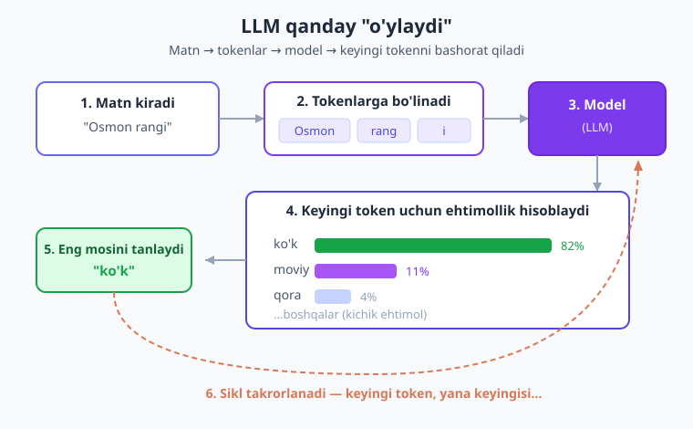
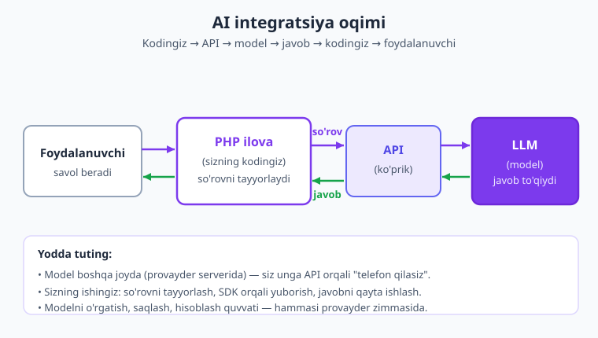
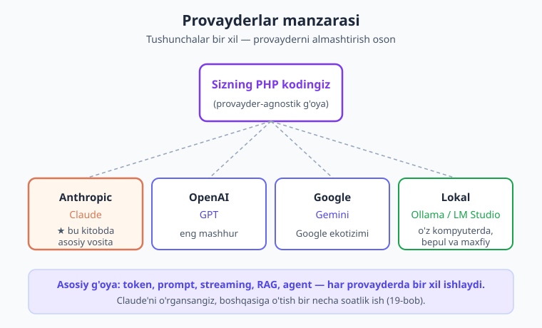

# 01 — LLM nima va AI integratsiyasi nima?

[🏠 Kitob boshi](./README.md) · [Keyingi: 02 — Muhit va birinchi so'rov ➡️](./02-muhit-birinchi-sorov.md)

> **Bu bobda:** AI va LLM (katta til modeli) nima ekanini eng oddiy tildan boshlab tushunamiz — model qanday "o'ylaydi", token va kontekst oynasi nima, AI integratsiyasi (o'z ilovangizdan API orqali modelga so'rov yuborish) qanday ishlaydi va nega buni PHP'da qilish mantiqiy. Hech qanday kod yozmaymiz — avval g'oyani mustahkam o'rnatamiz, keyingi boblarda esa qo'lni ishga solamiz.

---

## Kirish: nega bu kitob?

Tasavvur qiling, sizning saytingiz bor. Foydalanuvchilar savol berishadi, hujjatlar yuborishadi, izoh yozishadi. Bularning hammasini qo'lda o'qib, javob berib o'tirish — charchatadigan ish. Endi tasavvur qiling, saytingizda hech charchamaydigan, minglab kitob o'qigan, savolga darhol javob beradigan, matnni umumlashtiradigan, tarjima qiladigan, kod yozadigan **aqlli yordamchi** bor. Va u sizga shu yordamchini ulashga atigi bir necha qator kod bilan ruxsat beradi.

Mana shu — **AI integratsiyasi**. Bu kitobda biz sizning PHP ilovangizga aynan shunday aqlli yordamchini ulashni **noldan** o'rganamiz.

> **Hayotiy o'xshatish.** AI yordamchisini ulash — uyingizga elektr o'tkazishga o'xshaydi. Siz o'zingiz elektr stantsiyasini qurmaysiz (bu milliardlab so'm va minglab muhandis kerak). Siz shunchaki rozetka o'rnatasiz va tayyor quvvatdan foydalanasiz. AI'da ham xuddi shunday: siz ulkan modelni o'zingiz qurmaysiz — tayyor modelga "rozetka" (API) orqali ulanib, undan foydalanasiz.

Bu bob — eng birinchi qadam. Bu yerda hali bironta kod yozmaymiz. Avval **nima** bilan ishlashimizni va u **qanday** ishlashini sodda tilda tushunib olamiz. Tushuncha mustahkam bo'lsa, keyingi boblardagi kod o'z-o'zidan tushunarli bo'ladi.

---

## 1. AI va LLM nima?

Avvalo ikki atamani ajratib olaylik, chunki ularni tez-tez aralashtirib yuborishadi.

- **AI (sun'iy intellekt)** — bu juda keng tushuncha. Kompyuterga "aqlli" ko'rinadigan ishni bajartirish — rasmni tanish, ovozni eshitish, o'yin o'ynash, matnni tushunish — bularning hammasi AI ostiga kiradi. AI — bu butun bir soha (ulkan "soyabon").
- **LLM (Large Language Model — katta til modeli)** — bu AI'ning bir turi, faqat **til** (matn) bilan ishlashga ixtisoslashgan. Biz bu kitobda asosan LLM bilan ishlaymiz.

> **Hayotiy o'xshatish.** "AI" — bu "transport" so'ziga o'xshaydi (mashina, samolyot, kema, velosiped — hammasi transport). "LLM" esa shu transportning bir aniq turi, masalan "avtomobil". Biz kitobda aynan "avtomobil" — ya'ni matn bilan ishlovchi modellar haqida gaplashamiz.

Endi eng muhim savol: **LLM aslida nima qiladi?**

Javob hayratlanarli darajada sodda. Katta til modeli — bu **keyingi so'zni bashorat qiladigan** tizim. Unga matn berasiz, u esa "shu matndan keyin qaysi so'z kelishi eng mantiqiy?" degan savolga javob beradi. Keyin yana keyingisini, yana keyingisini — va shu tariqa butun jumla, paragraf, hatto kitob hosil bo'ladi.

Misol uchun, agar siz modelga "Osmon rangi..." deb yozsangiz, model "...ko'k" so'zini bashorat qiladi, chunki u o'rgangan millionlab matnlarda "osmon rangi" iborasidan keyin ko'pincha "ko'k" kelgan. Bu juda oddiy mexanizm, lekin u nihoyatda ulkan miqdordagi matn ustida takrorlansa — savolga javob berish, hikoya yozish, kod tuzish kabi murakkab natijalar paydo bo'ladi.

> **Hayotiy o'xshatish.** LLM — bu hayotida juda ko'p kitob o'qigan yordamchiga o'xshaydi. U milliardlab sahifa matn — kitoblar, maqolalar, hujjatlar, savol-javoblarni "o'qigan". Endi siz unga savol bersangiz, u o'qigan hamma narsasiga tayanib, eng mos javobni "to'qiydi". U aniq qaysi kitobdan ekanini eslay olmaydi, lekin umumiy naqshlarni juda yaxshi o'zlashtirgan.

Bu "ko'p kitob o'qigan yordamchi" aynan **ChatGPT, Claude, Gemini** kabi mashhur AI suhbatdoshlarining orqasida turgan narsa. Siz ChatGPT'ga savol yozsangiz — orqada bir LLM keyingi so'zlarni birma-bir bashorat qilib, javobni shakllantiradi. Bu kitobda biz aynan shunday modelga (asosan **Claude**'ga) o'z PHP kodimizdan murojaat qilishni o'rganamiz.

!!! note "Eslatma"
    "Model" so'zini ko'p eshitasiz. **Model** — bu o'rgatilgan, tayyor LLM'ning o'zi (masalan, `claude-opus-4-8`). Uni "miyya" deb tasavvur qiling: ko'p o'qigan, bilimga to'la, lekin u bilan gaplashish uchun unga so'z (so'rov) yuborishingiz kerak.

---

## 2. LLM qanday "o'ylaydi"?

Endi biroz chuqurroq tushunaylik — model qanday qilib keyingi so'zni "biladi"? Bu juda muhim, chunki LLM'ni qanchalik yaxshi tushunsangiz, undan shunchalik yaxshi foydalanasiz (va uning kuchli va kuchsiz tomonlarini to'g'ri baholaysiz).

Jarayon taxminan shunday:

1. **Matnni bo'laklarga ajratadi.** Model sizning matningizni mayda bo'lakchalarga — **token**larga bo'ladi (token haqida keyingi bo'limda batafsil). Hozircha tokenni "so'z yoki so'zning bir qismi" deb tasavvur qiling.
2. **Keyingi tokenni ehtimollik bilan tanlaydi.** Model har bir mumkin bo'lgan keyingi token uchun "ehtimollik" hisoblaydi. Masalan, "Men bozordan olma..." matnidan keyin "oldim" — yuqori ehtimol, "uchdim" — past ehtimol. Model eng mos tokenni tanlaydi va matnga qo'shadi.
3. **Takrorlaydi.** Endi yangi (biroz uzayagan) matnni yana modelga beradi va keyingi tokenni so'raydi. Bu sikl javob tugaguncha davom etadi.

Mana shu oddiy "keyingi tokenni bashorat qil" sikli — minglab marta takrorlansa — biz ko'rib turgan ajoyib javoblarni hosil qiladi.



Diagrammada ko'rib turibsiz: matn kiradi → tokenlarga bo'linadi → model har bir keyingi token uchun ehtimollik hisoblaydi → eng mosini tanlaydi → bu sikl takrorlanadi.

### Model "biladi" emas — naqsh asosida generatsiya qiladi

Bu juda muhim nuqta. LLM faktlarni "ma'lumotlar bazasidan qidirib topmaydi". U **naqsh (pattern) asosida matn generatsiya qiladi**. Ko'pincha bu naqshlar to'g'ri faktlarga mos keladi (chunki model o'qigan matnlarda faktlar to'g'ri bo'lgan), lekin har doim emas.

> **Hayotiy o'xshatish.** Tasavvur qiling, juda bilimdon do'stingiz bor. U deyarli har narsani biladi, lekin biror narsani aniq eslay olmasa, **uyalmasdan, ishonch bilan taxmin qilib aytadi** — va ba'zan bu taxmin noto'g'ri chiqadi. LLM ham aynan shunday: u "bilmayman" deyish o'rniga ba'zan ishonch bilan noto'g'ri javob "to'qib" qo'yishi mumkin.

Bu hodisaning maxsus nomi bor — **hallyutsinatsiya** (ya'ni model haqiqatda mavjud bo'lmagan narsani ishonch bilan "to'qib chiqarishi"). Masalan, model mavjud bo'lmagan kitob nomini, noto'g'ri sanani yoki yo'q funksiya nomini juda ishonch bilan ayta oladi.

!!! warning "Ehtiyot bo'ling"
    LLM javobiga **ko'r-ko'rona ishonmang**, ayniqsa aniq faktlar (sana, raqam, qonun, narx, ism) masalasida. Model ishonch bilan gapirishi — javob to'g'ri degani emas. Muhim qarorlar uchun javobni tekshiring yoki modelga ishonchli manba bering (buni keyinroq **RAG** mavzusida o'rganamiz — [15-bob](./15-rag.md)). Hallyutsinatsiyani kamaytirish butun bir san'at, va biz unga alohida e'tibor beramiz.

!!! tip "Maslahat"
    Hallyutsinatsiya — kamchilik emas, balki LLM tabiatining bir qismi. Yaxshi AI ilova quruvchi bu xususiyatni biladi va unga moslashadi: aniq ko'rsatma beradi, modelga kerakli ma'lumotni o'zi taqdim etadi va javobni tekshiradi. Bu kitob aynan shunday ishonchli ilovalar qurishni o'rgatadi.

---

## 3. Token va kontekst oynasi

"Token" so'zini bir necha bor eshitdik. Endi uni to'liq tushunib olaylik, chunki bu — AI bilan ishlashda eng muhim amaliy tushunchalardan biri (u bevosita **narx** va **cheklov**larga ta'sir qiladi).

### Token nima?

**Token** — bu matnning model o'qiydigan eng kichik bo'lakchasi. U ko'pincha bitta so'z, ba'zan so'zning bir qismi yoki tinish belgisi bo'ladi.

Misollar (taxminiy, model va tilga qarab farq qiladi):

```text
"salom"        → 1-2 token
"kompyuter"    → 2-3 token
"PHP"          → 1 token
"olma yedim"   → 3-4 token (olma, ye, dim, bo'shliq...)
```

Qo'pol qoida: ingliz tilida o'rtacha **1 token ≈ 4 belgi ≈ 0.75 so'z**. O'zbek (va boshqa tillar) uchun nisbat biroz boshqacha bo'lishi mumkin, lekin g'oya bir xil: matn qanchalik uzun bo'lsa, shunchalik ko'p token.

> **Hayotiy o'xshatish.** Token — bu taksidagi schyotchikning "qadami"ga o'xshaydi. Yo'l qancha uzun bo'lsa (matn qancha katta bo'lsa), schyotchik shuncha ko'p sanaydi va to'lov ko'payadi. AI'da ham siz **token bo'yicha** to'laysiz: yuborgan matningiz (kirish) va olgan javobingiz (chiqish) — ikkalasi ham tokenlarda hisoblanadi.

Nega bu muhim? Chunki AI provayderlari xizmatini **token hisobida** sotadi. Masalan (keyingi bobda batafsil ko'ramiz), Claude Opus 4.8 modelida har 1 million kirish tokeni $5, har 1 million chiqish tokeni $25 turadi. Demak, matningiz qanchalik uzun bo'lsa va javob qanchalik uzun bo'lsa — shuncha ko'p token, shuncha ko'p to'lov.

!!! tip "Maslahat"
    Token tushunchasini hozir mukammal bilishingiz shart emas. Faqat shuni yodda tuting: **token = matn bo'lagi = pul va cheklov birligi.** Keyingi boblarda token sanash kodini ko'ramiz ([04-bob](./04-suhbat-kontekst.md)) va xarajatni qanday optimallashtirishni o'rganamiz ([16-bob](./16-kesh-xarajat.md)).

### Kontekst oynasi nima?

**Kontekst oynasi (context window)** — bu model bir vaqtning o'zida "ko'ra oladigan" matnning maksimal hajmi (tokenlarda). Ya'ni: siz yuborgan so'rov + suhbat tarixi + model yozadigan javob — hammasi shu oynaga sig'ishi kerak.

> **Hayotiy o'xshatish.** Kontekst oynasi — odamning **ish stoli**ga o'xshaydi. Stol qanchalik katta bo'lsa, ustiga shuncha ko'p hujjat yoyib, bir vaqtda ko'rib ishlay olasiz. Stol kichik bo'lsa, eski hujjatlarni olib qo'yib, yangisini qo'yishingizga to'g'ri keladi — eskisini esa endi "ko'rmaysiz". LLM ham faqat kontekst oynasiga sig'gan matnni "ko'radi"; undan tashqaridagini "esidan chiqaradi".

Kontekst oynasi model bo'yicha farq qiladi. Bu kitobda ishlatadigan modellar:

| Model | Kontekst oynasi | Bu nimani anglatadi |
|---|---|---|
| Claude Opus 4.8 | 1M (million) token | Juda katta kitob hajmidagi matn bir vaqtda |
| Claude Sonnet 4.6 | 1M token | Xuddi shunday — ulkan kontekst |
| Claude Haiku 4.5 | 200K token | Hali ham juda katta (yuzlab sahifa) |

**1 million token** — bu taxminan **katta bir kitob** (700-800 sahifa) hajmidagi matn. Ya'ni siz modelga butun bir kitobni berib, "shu kitob bo'yicha savolimga javob ber" deyishingiz mumkin — va u butun matnni "ko'rib" javob beradi.

Nega kontekst oynasi muhim?

1. **Cheklov.** Oynadan oshib ketadigan matn yubora olmaysiz. Juda katta hujjat bilan ishlasangiz, uni bo'laklarga bo'lish kerak bo'ladi (bu — RAG'ga olib keladi, [15-bob](./15-rag.md)).
2. **Narx.** Kontekst qancha to'la bo'lsa (ko'p token), so'rov shuncha qimmat. Katta kontekstni keshlash (prompt caching) bilan tejash mumkin ([16-bob](./16-kesh-xarajat.md)).

!!! info "Boshqa provayderda"
    Kontekst oynasi har provayderda va har modelda har xil. Ba'zi modellar kichikroq (masalan, 8K yoki 128K token) oynaga ega. Shuning uchun ishlatayotgan modelingizning kontekst hajmini bilib olish muhim. Tushuncha esa hamma joyda bir xil: oynaga sig'maydigan matn — modelga ko'rinmaydi.

---

## 4. AI integratsiyasi nima?

Endi eng asosiy savolga keldik: **biz aynan nima qilamiz?**

Siz ChatGPT yoki Claude'ning veb-saytida AI bilan suhbatlashgan bo'lsangiz kerak — brauzerda matn yozasiz, javob olasiz. Bu — **odam** uchun. Lekin biz dasturchimiz, va biz xohlaymizki, AI bizning **ilovamiz** bilan gaplashsin — odam emas, balki bizning PHP kodimiz so'rov yuborsin va javobni olib, undan o'z ilovamizda foydalansin.

Mana shu — **AI integratsiyasi**: o'z ilovangizdan (kodingizdan) **API** orqali LLM'ga so'rov yuborish va javobni dasturiy ravishda olish.

> **Hayotiy o'xshatish.** AI integratsiyasi — bu **telefon orqali ekspertdan maslahat so'rash**ga o'xshaydi. Sizda ekspert (model) bor, lekin u boshqa joyda (Anthropic serverlarida) o'tiribdi. Siz unga telefon (API) orqali qo'ng'iroq qilasiz, savolingizni aytasiz (so'rov), u javob beradi (javob) — va siz bu javobni o'z ishingizda ishlatasiz. Telefon liniyasi — bu API.

Bu jarayonning uchta asosiy bo'g'ini bor:

1. **Sizning kodingiz (PHP ilovasi)** — bu yerda foydalanuvchi savol beradi yoki biror voqea sodir bo'ladi (masalan, yangi izoh keldi). Sizning kodingiz so'rovni tayyorlaydi.
2. **API (interfeys)** — bu sizning kodingiz bilan model o'rtasidagi "ko'prik". Siz so'rovni internet orqali provayderning serveriga yuborasiz, u modelga uzatadi.
3. **Model (LLM)** — provayderning serverida ishlaydi, so'rovni qayta ishlaydi, javob generatsiya qiladi va API orqali sizga qaytaradi.

Sxema oddiy: **Sizning kodingiz → API → Model → API → Sizning kodingiz → Foydalanuvchi.**



Diagrammada to'liq oqimni ko'rasiz: foydalanuvchi → PHP ilova → API so'rov → LLM → javob → PHP ilova qayta ishlaydi → foydalanuvchiga ko'rsatadi.

!!! note "Eslatma"
    **API (Application Programming Interface)** — bu ikki dastur o'zaro "gaplashishi" uchun kelishilgan qoidalar to'plami. AI provayderlari odatda **HTTP API** beradi: siz internet orqali maxsus manzilga so'rov yuborasiz, javob qaytadi. Yaxshi xabar — bularning hammasini o'zingiz qo'lda yozishingiz shart emas. Provayderlar **SDK** (tayyor kutubxona) beradi, u API bilan ishlashni siz uchun osonlashtiradi. Biz bu kitobda Anthropic'ning rasmiy PHP SDK'sidan foydalanamiz ([02-bob](./02-muhit-birinchi-sorov.md)).

Demak, dasturchi sifatida sizning ishingiz: so'rovni to'g'ri tayyorlash, uni SDK orqali yuborish va kelgan javobni o'z ilovangizda ishlatish. Modelni o'rgatish, serverda saqlash, hisoblash quvvati — bularning hammasi provayder zimmasida. Siz faqat "rozetkadan" foydalanasiz.

---

## 5. Nega API (o'z modelni qurish emas)?

Tabiiy savol tug'iladi: "O'z modelimni o'zim qursam-chi? Nega birovning serveriga bog'lanib o'tiraman?"

Javob — **masshtab**. Bunday darajadagi LLM'ni noldan qurish quyidagilarni talab qiladi:

- **Ulkan ma'lumot.** Modelni o'rgatish uchun internetning katta qismiga teng — trillionlab so'z matn kerak.
- **Ulkan hisoblash quvvati.** Minglab maxsus protsessorlar (GPU) oylab uzluksiz ishlashi kerak. Bu — **milliardlab dollar**lik xarajat.
- **Maxsus jamoa.** Yuzlab tadqiqotchi va muhandis.

Bunday narsani faqat eng yirik kompaniyalar (Anthropic, OpenAI, Google) qila oladi. Biz uchun esa baxtimizga — ular bu modellarni **API orqali ijaraga** beradi.

> **Hayotiy o'xshatish.** Internet sayti uchun siz o'zingizning butun internetni qurmaysiz, hatto o'zingizning ulkan ma'lumot markazingizni ham qurmaysiz — siz tayyor hosting xizmatidan foydalanasiz. AI ham xuddi shunday: tayyor, dunyodagi eng yaxshi modelni bir necha qator kod va arzon to'lov evaziga ishlatasiz. Bu — **arzon, tez va kuchli**.

Solishtirib ko'ring:

| O'z modelni qurish | API'dan foydalanish |
|---|---|
| Milliardlab dollar | Foydalanganingiz uchun arzon to'lov (tokenlar bo'yicha) |
| Oylar/yillar vaqt | Bir necha daqiqada birinchi so'rov |
| Maxsus jamoa kerak | Bitta dasturchi yetarli |
| Hisoblash infratuzilmasi sizning zimmangizda | Hammasi provayderda |

!!! tip "Maslahat"
    Kichik, ixtisoslashgan vazifalar uchun **lokal modellar** (o'z kompyuteringizda ishlaydigan kichikroq modellar — Ollama, LM Studio) ham bor. Ular kuchsizroq, lekin bepul va maxfiy (ma'lumot internetga chiqmaydi). Bularni [19-bobda](./19-boshqa-provayderlar.md) ko'rib chiqamiz. Boshlash uchun esa eng to'g'ri yo'l — kuchli API'dan foydalanish.

---

## 6. Nega aynan PHP'da?

Agar siz internetda "AI o'rganish" haqida qidirsangiz, deyarli hamma narsa Python tilida bo'ladi. Bu sizni "AI uchun Python o'rganish shartmikan?" deb o'ylantirishi mumkin. **Javob — yo'q.**

Mana sabablari:

- **Dunyoning katta qismi PHP'da ishlaydi.** Internetdagi saytlarning juda katta ulushi PHP'da yozilgan (WordPress, Laravel, va son-sanoqsiz biznes saytlari). Agar sizning ilovangiz allaqachon PHP'da bo'lsa — AI qo'shish uchun uni butunlay qaytadan yozish aqlsizlik bo'lardi.
- **AI integratsiyasi — bu shunchaki API bilan ishlash.** Yodingizdami, biz model qurmaymiz — biz tayyor modelga so'rov yuboramiz. API'ga so'rov yuborish va javobni qayta ishlash esa PHP'ning eng kuchli tomonlaridan biri. Buning uchun Python umuman shart emas.
- **PHP ekotizimi tayyor.** Anthropic'ning **rasmiy PHP SDK**'si bor (biz shuni ishlatamiz), shuningdek OpenAI, Gemini uchun ham PHP kutubxonalar va to'liq GenAI frameworklari (LLPhant, Neuron AI) mavjud.

PHP'da nima qura olishingizga bir necha misol:

- **Chatbot** — saytingizda mijozlar savoliga avtomatik javob beruvchi suhbatdosh.
- **Hujjat-yordamchi** — foydalanuvchi yuborgan hujjat (yoki sizning bilim bazangiz) bo'yicha savol-javob.
- **Kontent generatori** — mahsulot tavsifi, blog maqolasi, sarlavha avtomatik yaratish.
- **Avtomatlashtirish** — kelgan xat/izohni tasniflash, umumlashtirish, kerakli bo'limga yo'naltirish.

> **Hayotiy o'xshatish.** "AI uchun albatta Python kerak" degan fikr — "musiqa tinglash uchun albatta gitara chalishni bilish kerak" degandek. Yo'q — siz tayyor musiqani (modelni) eshitasiz (ishlatasiz), uni o'zingiz yaratishingiz (o'rgatishingiz) shart emas. Pleyer (PHP) bor — bas.

!!! note "Eslatma"
    Bu kitob siz **PHP asoslari** (o'zgaruvchi, funksiya, massiv, OOP) va **Composer** (paketlarni o'rnatish vositasi) bilan tanish deb taxmin qiladi. Agar bu mavzular notanish bo'lsa, avval [PHP kitobini](../php/README.md) ko'rib chiqing. AI/LLM bo'yicha esa hech qanday oldindan bilim talab qilinmaydi — biz noldan boshlayapmiz.

---

## 7. Provayderlar manzarasi

"Provayder" — bu LLM'ni API orqali taqdim etuvchi kompaniya. Hozirda bir nechta yirik provayder bor, har birining o'z modellari va kuchli tomonlari mavjud:

- **Anthropic** — **Claude** modellari oilasi (Opus, Sonnet, Haiku). Aql, ishonchlilik va uzun kontekst bilan ajralib turadi. **Bu kitobda asosiy vositamiz aynan Claude.**
- **OpenAI** — **GPT** modellari. Eng mashhur va keng tarqalgan (ChatGPT orqasidagi kompaniya).
- **Google** — **Gemini** modellari. Google ekotizimi bilan chambarchas.
- **Lokal modellar** — **Ollama**, **LM Studio** kabi vositalar orqali o'z kompyuteringizda ishlaydigan ochiq modellar. Kuchsizroq, lekin bepul va maxfiy.
- **OpenRouter** — bitta API orqali ko'p provayderning ko'p modeliga ulanish imkonini beruvchi "vositachi".



Diagrammada ko'rasiz: turli provayderlar bor (Anthropic, OpenAI, Google, lokal), lekin tushunchalar bir xil — va yaxshi yozilgan kod bilan provayderni almashtirish ham oson bo'ladi.

### Nega Claude bu kitobda asosiy?

Biz amaliy kodni bitta provayder — **Claude (Anthropic)** atrofida quramiz, chunki bitta vositada chuqur ishlab, hamma tushunchalarni mustahkam o'rganish — har biriga sirg'alib o'tishdan ancha samaraliroq. Anthropic'ning **rasmiy PHP SDK**'si bor, hujjatlari yaxshi va kodimiz toza chiqadi.

**Lekin eng muhimi:** bu kitobda o'rganadigan **tushunchalar provayderga bog'liq emas.** Prompt, token, streaming, function calling, RAG, embedding, agent — bularning hammasi har bir provayderda bir xil ishlaydi. Kod sintaksisi biroz farq qiladi, g'oya esa aynan o'sha. Shuning uchun siz Claude'ni o'rgansangiz — OpenAI yoki Gemini'ga o'tish bir necha soatlik ish bo'ladi.

!!! info "Boshqa provayderda"
    [19-bobda](./19-boshqa-provayderlar.md) biz OpenAI, Gemini va lokal Ollama bilan ishlashni alohida ko'rib chiqamiz — va kodingizni "provayder-agnostik" (provayderga bog'liq bo'lmagan) qilib, bittadan ikkinchisiga oson o'tish naqshlarini o'rganamiz. Maqsad: bitta o'rgangan g'oyangiz hamma joyda foydali bo'lsin.

---

## 8. Nima qura olasiz? (ilhom uchun)

Endi siz LLM nima va integratsiya qanday ishlashini tushundingiz. Ko'nglingizni ko'tarish uchun — bu kitobni tugatgach nima qura olishingizning bir necha namunasi:

- **Chatbot (suhbatdosh)** — saytingizda 24/7 ishlaydigan, mijoz savoliga javob beruvchi yordamchi. Asosi: [03-bob](./03-prompt-muhandisligi.md) va [04-bob](./04-suhbat-kontekst.md).
- **Hujjat bo'yicha savol-javob (RAG)** — foydalanuvchi o'z hujjatini (yoki siz o'z bilim bazangizni) yuklaydi, AI esa **aynan shu hujjat** asosida javob beradi (hallyutsinatsiyasiz). Bu — kitobning eng kuchli mavzularidan biri: [13](./13-embedding-semantik-qidiruv.md)–[15-bob](./15-rag.md).
- **Kontent generatori** — mahsulot tavsifi, blog maqolasi, sarlavha, ijtimoiy tarmoq posti — avtomatik yaratish.
- **Klassifikator (tasniflagich)** — kelgan xat/izoh/murojaatni avtomatik turkumlarga ajratish (shikoyat? savol? maqtov?). Asosi: [06-bob](./06-strukturali-chiqish.md).
- **Tarjima va qayta yozish** — matnni boshqa tilga o'girish yoki uslubini o'zgartirish.
- **Kod yordamchi** — kod yozish, tushuntirish, xato topishda yordam beruvchi vosita.
- **Agent** — bir necha qadamli vazifani o'zi rejalashtirib, tashqi vositalar (qidiruv, baza, hisob-kitob) bilan mustaqil bajaradigan "aqlli yordamchi". Eng ilg'or mavzu: [09](./09-function-calling.md)–[11-bob](./11-agentlar.md).

> **Hayotiy o'xshatish.** LLM — bu juda ko'p qirrali xodimga o'xshaydi: u yozadi, tarjima qiladi, tasniflaydi, savolga javob beradi, hatto boshqa vositalardan foydalanib ish bajaradi. Sizning vazifangiz — unga to'g'ri ko'rsatma berish va kerakli vositalarni ulash. Aynan shuni bu kitobda qadam-baqadam o'rganamiz.

---

## 9. Kitob yo'l xaritasi (qisqacha)

Biz qaerga ketyapmiz? Mana butun sayohatning qisqa xaritasi (to'liq ro'yxat [README](./README.md)'da):

1. **Asoslar (02–05):** muhitni sozlash, birinchi so'rov, prompt muhandisligi, suhbat va kontekst, streaming (jonli javob).
2. **Strukturali va ishonchli chiqish (06–08):** JSON ko'rinishida natija olish, rasm/hujjat bilan ishlash, xatolarni ushlash va ishonchlilik.
3. **Tool use va agentlar (09–12):** modelga tashqi funksiyalarni ulash, tool runner, agentlar qurish, MCP standarti.
4. **RAG va bilim (13–16):** embedding, vektor bazalar, RAG quvuri, kesh va xarajat optimizatsiyasi.
5. **Frameworklar va arxitektura (17–19):** PHP GenAI frameworklari, Laravel'ga integratsiya, boshqa provayderlar.
6. **Professional daraja (20–23):** xavfsizlik, testlash va baholash, production va kuzatuv, promptlarni boshqarish.
7. **Kapston (24):** hamma bilimni birlashtirib, to'liq real AI ilova quramiz.

Har bob oldingisiga tayanadi, shuning uchun ularni **tartib bilan** o'qishni tavsiya qilamiz. Keyingi bobda esa nazariyadan amaliyotga o'tamiz: muhitni sozlaymiz va o'zimizning **birinchi haqiqiy AI so'rovi**mizni yuboramiz.

---

## Xulosa

- **AI** — keng soha; **LLM (katta til modeli)** — uning matn bilan ishlovchi turi. LLM aslida **keyingi tokenni bashorat qiluvchi** tizim — "juda ko'p kitob o'qigan yordamchi".
- LLM faktni "bazadan qidirmaydi", balki **naqsh asosida matn generatsiya qiladi** — shuning uchun ba'zan ishonch bilan noto'g'ri javob beradi (**hallyutsinatsiya**). Javobni tekshirish muhim.
- **Token** — matnning model o'qiydigan bo'lakchasi; u **narx va cheklov birligi**. **Kontekst oynasi** — model bir vaqtda "ko'ra oladigan" matn hajmi (model "ish stoli").
- **AI integratsiyasi** — o'z ilovangizdan **API orqali** modelga so'rov yuborib, javob olish. Sxema: kodingiz → API → model → javob → kodingiz → foydalanuvchi.
- O'z modelni qurish milliardlab dollar va yillar talab qiladi; **API'dan foydalanish — arzon, tez, kuchli.** Provayder hamma og'irlikni ko'taradi.
- AI integratsiyasi uchun **Python shart emas** — bu shunchaki API bilan ishlash, va PHP buni mukammal eplaydi. Dunyoning katta qismi PHP'da ishlaydi.
- Provayderlar bor (**Anthropic/Claude, OpenAI/GPT, Google/Gemini, lokal**); bu kitob amaliy kodni **Claude** atrofida quradi, lekin **tushunchalar har joyda bir xil** ishlaydi.
- PHP'da chatbot, RAG hujjat-yordamchi, kontent generatori, klassifikator, tarjima, kod yordamchi va agent qura olasiz.

## Amaliy mashqlar

Bu bob nazariy bo'lgani uchun mashqlar ham fikrlashga qaratilgan (kod yozish keyingi bobdan boshlanadi). Javoblarni **o'z so'zlaringiz bilan** yozib ko'ring:

1. **Tokenni tushuntiring.** Bir do'stingizga (dasturchi bo'lmagan odamga) "token nima va nega u muhim?" degan savolga 3-4 jumlada o'z so'zlaringiz bilan tushuntiring. O'xshatishdan foydalaning.
2. **Kontekst oynasi.** Nega katta hujjat (masalan, 2000 sahifalik kitob) bilan ishlaganda kontekst oynasi muammoga aylanishi mumkin? Bu muammoni qanday hal qilsa bo'ladi deb o'ylaysiz? (Taxmin qiling — keyingi boblarda javobni topasiz.)
3. **Qachon AI integratsiya foydali?** O'zingiz bilgan yoki ishlatadigan biror sayt/ilovani tasavvur qiling. Unga AI qo'shilsa, qaysi aniq vazifa osonlashardi? Nega aynan o'sha vazifa AI uchun mos?
4. **O'z modelmi yoki API?** Bir do'stingiz "men o'zimning ChatGPT'imni noldan quraman" desa, unga API'dan foydalanish nega aqlliroq ekanini ikki-uchta dalil bilan tushuntiring.
5. **Qaysi ilovani qurarding?** Ushbu kitobni tugatgach qurmoqchi bo'lgan bitta AI ilovangizni tanlang. Uni qisqacha tasvirlang: kim ishlatadi, qaysi muammoni hal qiladi, qaysi turdagi vazifa (chatbot? RAG? klassifikator?)? Bu g'oyani yodda saqlang — kitob davomida unga qaytib turamiz.

---

[🏠 Kitob boshi](./README.md) · [Keyingi: 02 — Muhit va birinchi so'rov ➡️](./02-muhit-birinchi-sorov.md)
