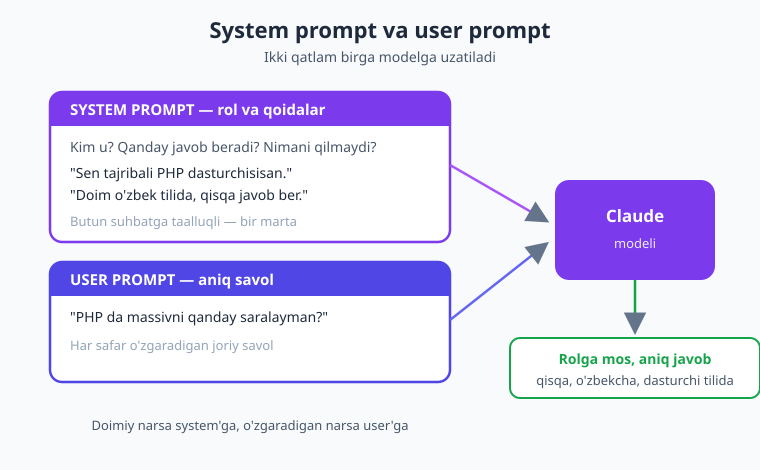
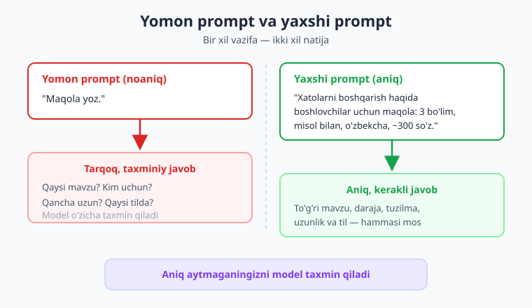
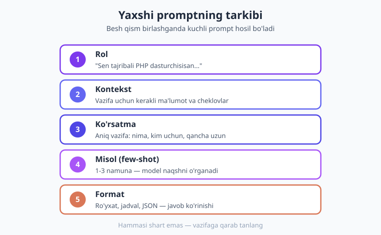

# 03 — Prompt muhandisligi asoslari

[⬅️ Oldingi: 02 — Muhit va birinchi so'rov](./02-muhit-birinchi-sorov.md) · [🏠 Kitob boshi](./README.md) · [Keyingi: 04 — Suhbat va kontekst ➡️](./04-suhbat-kontekst.md)

> **Bu bobda:** Modelga *qanday* gapirsangiz — *shunday* javob olasiz. Prompt nima ekanligini, system va user prompt farqini, aniqlik tamoyilini, rol berish, few-shot (misol bilan o'rgatish), format so'rash, qadam-baqadam fikrlash, harorat va effort tushunchalarini o'rganamiz. Oxirida bir vazifani "yomon prompt" va "yaxshi prompt" bilan yonma-yon yozib, farqni o'z ko'zingiz bilan ko'rasiz.

---

## Prompt nima?

Oldingi bobda biz Claude'ga birinchi so'rovimizni yubordik. O'sha so'rovning ichidagi matn — "Salom, Claude! O'zbek tilida javob ber" — **prompt** deyiladi.

**Prompt** — bu siz modelga beradigan ko'rsatma, savol yoki vazifa. Bu modelning *kirish* ma'lumoti: siz nima yozsangiz, model o'sha matnni o'qib, davomini yozadi.

> **Hayotiy o'xshatish.** Tasavvur qiling, siz juda bilimdon, lekin sizni umuman tanimaydigan yordamchini ishga oldingiz. U dunyodagi deyarli hamma narsani biladi, ammo *sizning* ayni damdagi maqsadingizni faqat siz aytgan so'zlardan tushunadi. "Hujjat tayyorla" desangiz — qaysi hujjat? Kim uchun? Qanday uslubda? Qancha uzun? Agar buni aytmasangiz, u taxmin qiladi. Prompt — aynan o'sha yordamchiga bergan topshirig'ingiz. Topshiriq qancha aniq bo'lsa, natija shuncha yaxshi.

Shu yerdan kitobning eng muhim tamoyili kelib chiqadi:

> **Yaxshi savol = yaxshi javob.** Model "aqlsiz" emas — u shunchaki siz aytgan narsaga javob beradi. Yomon javob olsangiz, ko'pincha aybdor model emas, balki noaniq prompt.

**Prompt muhandisligi** (prompt engineering) — bu modeldan eng yaxshi natijani olish uchun promptni to'g'ri yozish san'ati va ko'nikmasi. Bu "sehrli so'zlar" topish emas; bu **aniq fikrlash va aniq yozish**. Aslida bu — o'z xohishingizni odamga tushuntirishga juda o'xshaydi, faqat tinglovchi — til modeli.

!!! note "Eslatma"
    Prompt muhandisligi provayderga bog'liq emas. Bu yerdagi kod Claude (Anthropic PHP SDK) uchun, lekin tamoyillarning hammasi — aniqlik, rol, few-shot, format — OpenAI, Gemini, lokal modellarga ham bir xil ishlaydi. Bir marta o'rgansangiz, hamma joyda foydalanasiz.

---

## System prompt va user prompt

Oldingi bobda `messages` massivi va `system` parametrini ko'rgan edingiz. Endi ularning *roli* nimada ekanligini chuqurroq tushunamiz, chunki bu prompt muhandisligining poydevori.

Claude'ga ikki xil "qatlam"da gapirish mumkin:

- **System prompt** — modelning *roli* va *qoidalari*. "Sen kimsan? Qanday javob berasan? Nimani qilma?" degan doimiy ko'rsatma. Bu butun suhbatga taalluqli — go'yo lavozim yo'riqnomasi.
- **User prompt** — aniq *savol* yoki *vazifa*. Foydalanuvchi ayni damda nimani so'rayapti.

> **Hayotiy o'xshatish.** Restoran tasavvur qiling. **System prompt** — bu oshpazga ish boshlashidan oldin beriladigan yo'riqnoma: "Sen milliy taomlar ustasisan, har taomni o'zbekona uslubda tayyorla, achchiqni kam sol". **User prompt** — bu mijozning aniq buyurtmasi: "Bitta osh, ikkita choy". Oshpaz har buyurtmani o'sha umumiy yo'riqnoma asosida bajaradi. Yo'riqnomani har safar takrorlash shart emas — u doimiy.



Kodda bu shunday ko'rinadi. `system` — alohida, eng yuqori darajadagi parametr; `messages` esa foydalanuvchi savolini saqlaydi:

```php
<?php
require __DIR__ . '/vendor/autoload.php';

use Anthropic\Client;

$client = new Client(apiKey: getenv('ANTHROPIC_API_KEY'));

$javob = $client->messages->create(
    model: 'claude-opus-4-8',
    maxTokens: 512,
    // System prompt — modelning roli va qoidalari (butun suhbatga taalluqli)
    system: 'Sen tajribali PHP dasturchisisan. Doim o\'zbek tilida, '
          . 'qisqa va aniq javob ber. Kod misol so\'ralsa — toza, ishlaydigan kod ber.',
    // User prompt — aniq savol
    messages: [
        ['role' => 'user', 'content' => 'PHP da massivni qanday saralayman?'],
    ],
);

echo $javob->content[0]->text;
```

Bu yerda nima bo'ldi:

1. `system` orqali biz modelga **kim ekanligini va qanday javob berishini** bir marta aytdik.
2. `messages` ichida esa faqat **aniq savol** turibdi.
3. Endi suhbat davom etsa ham (4-bobda ko'ramiz), `system` o'sha qoidalarni eslatib turadi — har savolda takrorlash shart emas.

!!! tip "Maslahat"
    System prompt'ni "doimiy qoidalar", user prompt'ni "joriy savol" deb ajrating. Suhbat davomida o'zgarmaydigan narsalar (til, ohang, rol, taqiqlar) — system'ga; o'zgaradigan narsa (savolning o'zi) — user'ga. Bu kodingizni ham, modelning javobini ham barqaror qiladi.

!!! info "Boshqa provayderda"
    OpenAI'da system prompt `messages` massivining ichida `['role' => 'system', ...]` sifatida yuboriladi. Claude'da esa system — alohida, top-level parametr (`messages` ichida "system" roli yo'q). G'oya bir xil, faqat joylashuvi farq qiladi.

---

## Aniqlik tamoyili: noaniq prompt → noaniq javob

Prompt muhandisligida birinchi va eng kuchli qoida — **aniqlik**. Model sizning miyangizdagi rasmni ko'rmaydi; u faqat yozgan so'zlaringizni ko'radi. Nimani aniq aytmasangiz, model o'zicha taxmin qiladi — va taxmini siznikidan farq qilishi mumkin.

Bir xil vazifani ikki xil so'rab ko'raylik:

```text
❌ Yomon prompt:
   "Maqola yoz."

✅ Yaxshi prompt:
   "PHP da xatolarni qanday boshqarish haqida boshlovchilar uchun
    qisqa maqola yoz. 3 ta sarlavhali bo'lim bo'lsin, har bo'limda
    bitta kod misoli. O'zbek tilida, do'stona ohangda, taxminan
    300 so'z."
```

Birinchi promptda model: qaysi mavzu? Kim uchun? Qancha uzun? Qaysi tilda? — hech narsa bilmaydi. U *biror* maqola yozadi, lekin sizga kerakligini emas.

Ikkinchi promptda biz **mavzu**, **auditoriya**, **tuzilma**, **uzunlik**, **til** va **ohang**ni aniq berdik. Natija ham aniq bo'ladi.

> **Hayotiy o'xshatish.** Taksi haydovchisiga "meni shaharga olib bor" deganingiz bilan "meni Chilonzor 19-kvartal, 5-uyga olib bor" deganingiz — ikki xil natija. Birinchisida haydovchi o'zi bir joyga olib boradi; ikkinchisida — aynan kerakli joyga. Manzilni aniq aytish — sizning vazifangiz.

Aniq prompt yozishning oddiy retsepti — quyidagi savollarga javob bering:

| Savol | Promptga nima qo'shasiz |
|---|---|
| **Nima** qilish kerak? | Aniq vazifa fe'li: "tarjima qil", "umumlashtir", "tasnifla" |
| **Kim** uchun? | Auditoriya: "boshlovchilar uchun", "menejer uchun" |
| **Qanday** ko'rinishda? | Format: ro'yxat, JSON, jadval, abzats |
| **Qancha** uzun? | "3 jumla", "300 so'z", "5 punkt" |
| **Qaysi** tilda/ohangda? | "o'zbek tilida", "rasmiy ohangda" |
| Qo'shimcha **kontekst** bormi? | Kerakli ma'lumot, cheklovlar, misollar |

!!! warning "Ehtiyot bo'ling"
    "Yaxshi qilib yoz", "professional bo'lsin", "sifatli bo'lsin" kabi so'zlar — *aniq emas*. Modelga "yaxshi" nima ekanligi ma'lum emas. Buning o'rniga aniq, o'lchanadigan ko'rsatma bering: "har gap 15 so'zdan oshmasin", "texnik atamalardan qoch", "har punktda misol bo'lsin".



---

## Rol berish

Aniq promptning eng kuchli usullaridan biri — modelga **rol** berish. "Sen tajribali PHP dasturchisisan...", "Sen sabr-toqatli o'qituvchisan...", "Sen qattiqqo'l kod tekshiruvchisisan..." kabi.

Nega bu ishlaydi? Model juda ko'p turdagi matnda o'rgangan — dasturchilar yozgan kod, o'qituvchilar tushuntirgan darslar, jurnalistlar yozgan maqolalar. Rol berganingizda, siz modelga *qanday uslub va bilim sohasiga* yo'naltirishini aytasiz. U o'sha rolga mos javob beradi: dasturchi roli — texnik va aniq; o'qituvchi roli — sodda va sabrli.

> **Hayotiy o'xshatish.** Bir savolni shifokorga ham, do'stingizga ham berishingiz mumkin — javoblar boshqacha bo'ladi. Shifokor tibbiy atamalar bilan, do'stingiz sodda til bilan javob beradi. Rol berish — modelga "ayni damda kim bo'lib gapir" deganingiz.

Rolni odatda **system prompt**'da beramiz, chunki u butun suhbat davomida o'zgarmasligi kerak:

```php
$javob = $client->messages->create(
    model: 'claude-opus-4-8',
    maxTokens: 1024,
    system: 'Sen 10 yillik tajribaga ega PHP/Laravel dasturchisisan. '
          . 'Boshlovchilarga tushuntirayotganda sodda til ishlatasan, '
          . 'har tushunchani hayotiy misol bilan ochib berasan, '
          . 'kerak bo\'lsa qisqa kod namunasi keltirasan. '
          . 'Javoblar o\'zbek tilida bo\'lsin.',
    messages: [
        ['role' => 'user', 'content' => 'Dependency injection nima?'],
    ],
);

echo $javob->content[0]->text;
```

Bu yerda rol (`10 yillik tajribaga ega PHP/Laravel dasturchi`) modelga: texnik aniqlik, boshlovchiga moslik, hayotiy misol va kod namunasini birga bering — degan signal beradi.

!!! tip "Maslahat"
    Rolni iloji boricha aniq qiling. "Sen yordamchisan" — kuchsiz. "Sen mijozlarga sabr bilan javob beradigan texnik qo'llab-quvvatlash mutaxassisisan, har javobni keyingi qadam bilan yakunlaysan" — kuchli. Rolga *qanday gapirishini* ham qo'shsangiz, yana ham aniqroq.

---

## Few-shot: misollar bilan o'rgatish

Ba'zan vazifani so'z bilan tushuntirgandan ko'ra, **bir-ikki misol ko'rsatish** osonroq va aniqroq. Bu usul **few-shot** ("bir necha misol") deyiladi. Promptga 1-3 ta namuna (kirish → kutilgan chiqish) qo'ssangiz, model o'sha **naqsh**ni o'rganib, yangi kiritmaga ham o'shanga mos javob beradi.

> **Hayotiy o'xshatish.** Yangi ishchiga vazifa tushuntirayotganda ko'pincha "mana, bittasini men qilib ko'rsatay, keyin sen davom et" deysiz. Bir-ikki namunani ko'rgach, ishchi naqshni tushunadi va o'zi qila boshlaydi. Few-shot — modelga aynan shunday "namuna ko'rsatish".

Faqat so'z bilan tushuntirish — bu **zero-shot** (misolsiz, "nol misol"). Misol qo'shilsa — few-shot. Murakkab yoki o'ziga xos formatli vazifalarda few-shot ko'pincha aniqroq ishlaydi.

Klassik misol — **sharhlarni tasniflash** (ijobiy/salbiy/neytral). Avval modelga bir nechta tayyor namuna ko'rsatamiz, keyin yangi sharhni beramiz. Bu yerda namunalarni `user` va `assistant` rollari orqali "suhbat" ko'rinishida beramiz — model buni o'tgan misol deb qabul qiladi:

```php
$javob = $client->messages->create(
    model: 'claude-opus-4-8',
    maxTokens: 16,
    // Vazifani qoida sifatida system'ga qo'yamiz
    system: 'Sen mijoz sharhlarini "ijobiy", "salbiy" yoki "neytral" '
          . 'deb tasniflaysan. Faqat bitta so\'z qaytar, boshqa hech narsa.',
    messages: [
        // 1-misol (namuna)
        ['role' => 'user',      'content' => 'Mahsulot zo\'r, juda yoqdi!'],
        ['role' => 'assistant', 'content' => 'ijobiy'],
        // 2-misol (namuna)
        ['role' => 'user',      'content' => 'Yetkazib berish kechikdi, xafa bo\'ldim.'],
        ['role' => 'assistant', 'content' => 'salbiy'],
        // 3-misol (namuna)
        ['role' => 'user',      'content' => 'Narxi o\'rtacha, oddiy mahsulot.'],
        ['role' => 'assistant', 'content' => 'neytral'],
        // Endi haqiqiy savol — model naqshga ergashadi
        ['role' => 'user',      'content' => 'Buyurtma bugun keldi, hammasi joyida.'],
    ],
);

echo $javob->content[0]->text;   // Kutilgan: "ijobiy"
```

Bu yerda nima sodir bo'ldi:

1. **System** modelga *vazifani* aytdi: tasnifla, faqat bitta so'z qaytar.
2. Uchta `user → assistant` jufti modelga *naqsh*ni ko'rsatdi: kirish qanday, chiqish qanday bo'lishi kerak.
3. Oxirgi `user` xabari — haqiqiy savol. Model namunalarga qarab, o'shanga mos formatda javob beradi.

Few-shot ayniqsa quyidagilarda foydali:

- **Aniq format** kerak bo'lganda (faqat bitta so'z, ma'lum ko'rinishdagi javob).
- **O'ziga xos vazifa** — so'z bilan tushuntirish qiyin, lekin misol bilan oson.
- **Izchillik** kerak bo'lganda — model har safar bir xil uslubda javob bersin.

!!! note "Eslatma"
    Few-shot — bu modelni "o'qitish" emas. Model o'rganmaydi yoki o'zgarmaydi; u shunchaki *shu so'rov ichidagi* namunalarga qarab naqshni payqaydi. So'rov tugagach, namunalar unutiladi. (Suhbat va xotira haqida 4-bobda batafsil gaplashamiz.)

!!! tip "Maslahat"
    Misollaringiz sifatli va xilma-xil bo'lsin. Agar barcha namunalar bir xil bo'lsa, model tor naqshga tushib qoladi. 2-4 ta turli misol odatda yetarli — juda ko'p misol token (ya'ni matn bo'lakchasi — model uchun hisob birligi) sarflaydi va har doim ham yaxshilamaydi.

---

## Format so'rash

Model matn qaytaradi — lekin o'sha matn *qanday ko'rinishda* bo'lishini siz boshqarishingiz mumkin. Promptda formatni aniq aytsangiz, model unga amal qiladi:

- "Javobni raqamli ro'yxat shaklida ber."
- "Natijani jadval ko'rinishida chiqar."
- "Faqat 3 ta punkt, har biri bitta jumla."
- "Javob o'zbek tilida bo'lsin."
- "Faqat JSON qaytar, boshqa hech qanday matn yozma."

Bu juda muhim, chunki javobni **dasturda ishlatadigan** bo'lsangiz, uning ko'rinishi oldindan ma'lum bo'lishi kerak. Masalan, model javobni ro'yxat qilib bersa, siz uni qatorlarga ajratib ishlatasiz.

```php
$javob = $client->messages->create(
    model: 'claude-opus-4-8',
    maxTokens: 512,
    system: 'Sen PHP bo\'yicha yordamchisan. O\'zbek tilida javob ber.',
    messages: [
        ['role' => 'user', 'content' =>
            'PHP da o\'zgaruvchi nomlash uchun 5 ta qoidani sanab ber. '
            . 'Javobni raqamli ro\'yxat shaklida ber, har qoida bitta qisqa jumla bo\'lsin.'],
    ],
);

echo $javob->content[0]->text;
```

Bu yerda biz formatni ham (raqamli ro'yxat), uzunlikni ham (5 ta, har biri bitta jumla) aniq berdik. Natija o'qishga ham, dasturda qayta ishlashga ham qulay bo'ladi.

> **Hayotiy o'xshatish.** Hisobotni "yozib ber" deganingiz bilan "jadval qilib, ustunlarga sana, summa, izoh qo'yib ber" deganingizning farqi katta. Format aytish — tartibni o'zingiz belgilash.

!!! info "Boshqa provayderda"
    "Faqat JSON qaytar" deb so'rash — eng keng tarqalgan format talabi. U deyarli har provayderda ishlaydi, lekin model ba'zan JSON atrofiga ortiqcha matn qo'shib yuborishi mumkin. Ishonchli, kafolatlangan JSON kerak bo'lsa — Claude'da *strukturali chiqish* (`outputConfig` + model klass) ishlatiladi. Bu **6-bobda** to'liq ko'rib chiqiladi; hozircha "format so'rash" — eng sodda usul deb biling.

---

## Qadam-baqadam fikrlash (chain of thought)

Murakkab masalalar — mantiqiy jumboqlar, ko'p bosqichli hisob-kitob, sabab-natija tahlili — uchun kuchli usul bor: modelga **qadam-baqadam o'ylashini** so'rash. Buni inglizcha *chain of thought* ("fikrlash zanjiri") deyiladi.

Oddiygina "Bu masalani qadam-baqadam yech" yoki "Avval o'ylab ko'r, keyin javob ber" deb qo'shsangiz — model javobni shoshib bermay, oraliq qadamlarni yozib boradi va shu tufayli **aniqroq** xulosaga keladi.

> **Hayotiy o'xshatish.** Matematik masalani yechayotgan o'quvchi shartni o'qib, darrov javobni aytsa — ko'pincha xato qiladi. Lekin "avval shartni yozaman, keyin formulani, keyin hisoblayman" deb bosqichma-bosqich ketsa — to'g'ri javobga keladi. Model ham xuddi shunday: "ovoz chiqarib o'ylasa", xatosi kamayadi.

```php
$javob = $client->messages->create(
    model: 'claude-opus-4-8',
    maxTokens: 2048,
    messages: [
        ['role' => 'user', 'content' =>
            'Bir do\'konda olma 1 kg 12 000 so\'m, banan 1 kg 18 000 so\'m. '
            . 'Mijoz 3 kg olma va 2 kg banan oldi, 100 000 so\'m berdi. '
            . 'Qaytim qancha? Qadam-baqadam hisobla, keyin yakuniy javobni ayt.'],
    ],
);

echo $javob->content[0]->text;
```

"Qadam-baqadam hisobla" iborasi tufayli model avval har bosqichni (olma narxi, banan narxi, jami, qaytim) yozadi, keyin yakuniy javobni beradi — bu yo'l xatoga kamroq imkon qoldiradi.

!!! tip "Maslahat"
    Qadam-baqadam fikrlash *har* savol uchun kerak emas. Oddiy savolda u faqat javobni uzaytiradi va ko'proq token sarflaydi. Uni murakkab, ko'p bosqichli yoki mantiqiy masalalar uchun saqlang.

Eng yangi Claude modellari (Opus 4.8, Sonnet 4.6) bunda yana bir qadam oldinga ketgan: ularda **kengaytirilgan fikrlash** (extended thinking) imkoniyati bor — model javobdan oldin alohida "fikrlash" bosqichidan o'tadi. Buni quyidagi `thinking` bo'limida ko'ramiz.

---

## Harorat va effort tushunchasi

> **Bu bo'lim muhim — chunki ko'p eski qo'llanmalarda "harorat"ni o'zgartirish maslahat beriladi, lekin eng yangi Claude modellarida bu o'zgargan.**

### Harorat (temperature) nima?

**Harorat** (temperature) — modelning javobidagi "tasodifiylik" yoki "ijodkorlik" darajasini boshqaradigan tushuncha:

- **Past harorat** (masalan, 0 ga yaqin) — model eng ehtimolli, "xavfsiz" so'zlarni tanlaydi. Javob **aniq, barqaror, takrorlanadigan**. Faktik savollar, kod, tasnif uchun yaxshi.
- **Yuqori harorat** — model kamroq ehtimolli so'zlarni ham tanlashga moyil bo'ladi. Javob **xilma-xil, ijodiy, kutilmagan**. Hikoya, g'oya, marketing matni uchun yaxshi.

> **Hayotiy o'xshatish.** Oshpazga "har doim aynan bir xil osh pishir" desangiz — bu past harorat: natija doim bir xil, ishonchli. "Bugun yangicha, ijodiy taom o'ylab top" desangiz — bu yuqori harorat: har safar boshqacha, ba'zan ajoyib, ba'zan g'alati.

### MUHIM: eng yangi Claude'da harorat olib tashlangan

Mana eng muhim nuqta. **Claude Opus 4.8 va Sonnet 4.6 kabi eng yangi modellarda `temperature` parametri olib tashlangan.** Agar siz unga harorat (yoki `topP`, `topK`) yuborsangiz — so'rov **400 (xato)** bilan rad etiladi.

Buning sababi: bu modellar shu darajada rivojlanganki, "ijodkorlikni" raqam bilan emas, balki **promptning o'zi** va **effort** sozlamasi orqali boshqarish ma'qul.

!!! warning "Ehtiyot bo'ling"
    Eski qo'llanmada `temperature: 0.7` kabi kodni ko'rsangiz va uni `claude-opus-4-8` da ishlatsangiz — **400 xatosi** olasiz. Eng yangi Opus/Sonnet'da haroratni yubormang. (Harorat eski modellarda hali ishlaydi — agar maxsus eski model bilan ishlasangiz, foydalanish mumkin. Lekin bu kitobda biz eng yangi modellarni ishlatamiz.)

Demak, "aniqroq" yoki "ijodiyroq" javob kerak bo'lsa — **promptda aytasiz**:

- Aniq kerak bo'lsa: *"Faqat faktlarga tayan, taxmin qilma, qisqa va aniq javob ber."*
- Ijodiy kerak bo'lsa: *"Erkin fikrla, bir nechta original variant taklif qil."*

### Effort — fikrlash chuqurligi

Harorat o'rniga eng yangi modellarda **effort** ("kuch sarfi") tushunchasi keladi. Effort — model masalaga *qancha chuqur o'ylashini* va *qancha resurs sarflashini* boshqaradi. To'rt daraja bor: `low`, `medium`, `high`, `max`.

- **`low`** — tez va arzon; oddiy, tushunarli vazifalar uchun.
- **`high` / `max`** — model chuqurroq fikrlaydi; murakkab, ko'p bosqichli masalalar uchun (lekin sekinroq va qimmatroq).

Effort `outputConfig` parametri *ichida* beriladi (top-level emas):

```php
$javob = $client->messages->create(
    model: 'claude-opus-4-8',
    maxTokens: 2048,
    // Effort outputConfig ICHIDA: low | medium | high | max
    outputConfig: ['effort' => 'high'],
    messages: [
        ['role' => 'user', 'content' =>
            'Quyidagi mantiqiy jumboqni yech: uch do\'st — Ali, Vali va Soli — '
            . 'turli kasb egasi (o\'qituvchi, shifokor, muhandis). Ali shifokor emas, '
            . 'Vali muhandis emas va o\'qituvchi emas. Kim qaysi kasb egasi?'],
    ],
);

echo $javob->content[0]->text;
```

`effort: 'high'` modelga "shoshilma, chuqurroq o'yla" deydi — murakkab masalalarda foydali.

### Adaptiv thinking — model o'zi qaror qilsin

Yana bir variant — **kengaytirilgan fikrlash**ni yoqish. Bunda model javobdan oldin alohida ichki "fikrlash" bosqichidan o'tadi. Eng yangi Claude'da buning eng sodda usuli — **adaptiv** rejim: model masalaning murakkabligiga qarab *qancha* fikrlashni o'zi hal qiladi.

```php
$javob = $client->messages->create(
    model: 'claude-opus-4-8',
    maxTokens: 4096,
    // Adaptiv thinking — model qancha o'ylashni o'zi hal qiladi
    thinking: ['type' => 'adaptive'],
    messages: [
        ['role' => 'user', 'content' =>
            'Bu algoritmik masalani qadam-baqadam tahlil qil va yechimini ber: '
            . 'massivdagi eng katta ketma-ket o\'suvchi qism ketma-ketligini qanday topaman?'],
    ],
);

echo $javob->content[0]->text;
```

!!! warning "Ehtiyot bo'ling"
    Eski qo'llanmalarda thinking uchun `budget_tokens` (token byudjeti) ishlatilardi. Eng yangi Opus 4.8'da bu usul **ishlamaydi** (400 xatosi). Buning o'rniga `thinking: ['type' => 'adaptive']` ishlating.

!!! note "Eslatma"
    `effort`, `thinking` va promptdagi "qadam-baqadam o'yla" — uchalasi ham bitta maqsadga xizmat qiladi: murakkab masalada modelni chuqurroq o'ylashga undash. Oddiy savollarda ularning hojati yo'q va ular faqat token sarflaydi. Vazifaga qarab tanlang.

---

## Eng yaxshi amaliyotlar (checklist)

Yuqoridagilarni bitta amaliy ro'yxatga jamlaylik. Yaxshi prompt yozayotganda shu savollardan o'ting:

1. **Aniq bo'l.** Nima, kim uchun, qaysi tilda — hammasini ayt. "Yaxshi qil" emas, o'lchanadigan ko'rsatma.
2. **Rolni belgila.** Modelga kim bo'lib gapirishini ayt (system prompt'da).
3. **Kontekst ber.** Vazifa uchun zarur ma'lumot, cheklov va fonni qo'sh.
4. **Format ayt.** Ro'yxat, jadval, JSON, abzats — javob qanday ko'rinishda bo'lsin.
5. **Misol ber (few-shot).** O'ziga xos yoki formatli vazifada 1-3 namuna ko'rsat.
6. **Bo'lib-bo'lib so'ra.** Murakkab vazifani bitta katta promptga tiqishtirma; qadamlarga ajrat. Kerak bo'lsa "qadam-baqadam o'yla" qo'sh.
7. **Murakkablikka mos effort tanla.** Oddiy → `low`; murakkab/mantiqiy → `high`/`max` yoki adaptiv thinking.
8. **Test qil va takomillashtir.** Birinchi prompt kamdan-kam mukammal bo'ladi. Natijaga qarab promptni yaxshilab boring — bu normal jarayon.



!!! tip "Maslahat"
    Prompt muhandisligi — bir martalik ish emas, **iteratsiya** (takror-takror yaxshilash). Promptni yozing, natijani ko'ring, kamchilikni toping, promptni tuzating, yana sinab ko'ring. Eng yaxshi promptlar — bir necha marta sayqallangani.

---

## To'liq misol: yomon prompt vs yaxshi prompt

Endi hamma narsani bitta misolda birlashtiramiz. Bir xil vazifa — **mijoz sharhini tahlil qilish** — ni avval **yomon prompt**, keyin **yaxshi prompt** bilan bajarib, farqni ko'ramiz.

Quyidagi PHP skripti ikkala promptni ham yuboradi va javoblarni yonma-yon chiqaradi. (Eslatma: bu yerda haqiqiy API kaliti bo'lsa, ikki xil javob ko'rasiz; biz e'tiborni promptning *tuzilishi*ga qaratamiz.)

```php
<?php
require __DIR__ . '/vendor/autoload.php';

use Anthropic\Client;

$client = new Client(apiKey: getenv('ANTHROPIC_API_KEY'));

$sharh = 'Telefon yaxshi, lekin batareyasi tez tugaydi va narxi qimmat.';

// ── 1) YOMON prompt: noaniq, rolsiz, formatsiz ──────────────────
$yomon = $client->messages->create(
    model: 'claude-opus-4-8',
    maxTokens: 512,
    messages: [
        ['role' => 'user', 'content' => "Bu sharhni ko'rib chiq: $sharh"],
    ],
);

// ── 2) YAXSHI prompt: rol + aniq vazifa + few-shot + format ──────
$yaxshi = $client->messages->create(
    model: 'claude-opus-4-8',
    maxTokens: 512,
    // ROL + QOIDA (system)
    system: 'Sen mijoz fikrlarini tahlil qiluvchi mutaxassissan. '
          . 'Har sharhni tahlil qilib, FAQAT quyidagi formatda javob ber:'
          . "\nKayfiyat: <ijobiy|salbiy|aralash>"
          . "\nIjobiy jihatlar: <vergul bilan>"
          . "\nSalbiy jihatlar: <vergul bilan>"
          . "\nQisqa xulosa: <bitta jumla>"
          . "\nJavob o'zbek tilida bo'lsin.",
    messages: [
        // FEW-SHOT: bitta namuna
        ['role' => 'user', 'content' => 'Sharh: Yetkazib berish tez, lekin qadoq buzilgan edi.'],
        ['role' => 'assistant', 'content' =>
            "Kayfiyat: aralash\n"
            . "Ijobiy jihatlar: tez yetkazib berish\n"
            . "Salbiy jihatlar: buzilgan qadoq\n"
            . "Qisqa xulosa: Tezkor yetkazib berish yoqqan, ammo qadoqlash sifatsiz."],
        // HAQIQIY savol
        ['role' => 'user', 'content' => "Sharh: $sharh"],
    ],
);

echo "=== YOMON PROMPT JAVOBI ===\n";
echo $yomon->content[0]->text . "\n\n";

echo "=== YAXSHI PROMPT JAVOBI ===\n";
echo $yaxshi->content[0]->text . "\n";
```

Farqni ko'ring:

| Jihat | Yomon prompt | Yaxshi prompt |
|---|---|---|
| **Rol** | Yo'q | "mijoz fikrlarini tahlil qiluvchi mutaxassis" |
| **Vazifa** | Noaniq ("ko'rib chiq") | Aniq (kayfiyat, jihatlar, xulosa) |
| **Format** | Yo'q — model o'zicha yozadi | Qat'iy belgilangan to'rt qatorli format |
| **Misol** | Yo'q | Bitta few-shot namuna |
| **Natija** | Har safar har xil, prognoz qilib bo'lmaydi | Barqaror, dasturda ishlatishga qulay |

Yomon promptda model "yaxshi sharh ekan, foydalanuvchi qanoatlangan ko'rinadi..." kabi erkin, har safar boshqacha matn beradi. Yaxshi promptda esa javob har doim bir xil tuzilmada keladi — buni siz dasturda aniq parse qilib, ma'lumotlar bazasiga yozishingiz mumkin.

> **Asosiy xulosa.** Modelni o'zgartirmadik, savol mavzusi ham o'zgarmadi — faqat **promptni yaxshiladik**. Natija sifatida sezilarli farq. Mana shu — prompt muhandisligining kuchi.

!!! question "Tekshirib ko'ring"
    Yuqoridagi skriptni o'z loyihangizda (2-bobda sozlagan muhitda) ishga tushirib ko'ring. Yomon va yaxshi promptlar javoblarini solishtiring. Keyin "yaxshi" promptga yana bitta few-shot misol qo'shsangiz, javob barqarorligi o'zgaradimi — sinab ko'ring.

---

## Xulosa

- **Prompt** — modelga beradigan ko'rsatma/savol; "yaxshi savol = yaxshi javob". **Prompt muhandisligi** — natijani yaxshilash uchun aniq fikrlash va aniq yozish ko'nikmasi.
- **System prompt** — modelning roli va doimiy qoidalari; **user prompt** — aniq joriy savol. Doimiy narsa system'ga, o'zgaradigan narsa user'ga.
- **Aniqlik** — eng kuchli qoida: nima, kim uchun, qaysi tilda, qancha uzun, qaysi formatda — hammasini ayting. Noaniq prompt → noaniq javob.
- **Rol berish** modelni kerakli uslub va bilim sohasiga yo'naltiradi; **few-shot** (1-3 misol) naqshni ko'rsatib o'rgatadi.
- **Format so'rash** javobni dasturda ishlatishga qulay qiladi; kafolatlangan JSON kerak bo'lsa — 6-bobdagi strukturali chiqish.
- **Qadam-baqadam fikrlash** murakkab masalalarda aniqlikni oshiradi.
- **Harorat** eng yangi Claude (Opus 4.8/Sonnet 4.6)'da **olib tashlangan** (yuborilsa 400 xato); uning o'rniga **prompt** + `outputConfig: ['effort' => 'high']` + `thinking: ['type' => 'adaptive']`.
- Prompt muhandisligi — **iteratsiya**: yoz, sinab ko'r, tuzat, yana sina.

## Amaliy mashqlar

1. **Rol berish.** Bir savol tanlang (masalan, "REST API nima?"). Uni avval rolsiz, keyin uch xil rol bilan (boshlovchi o'qituvchi, qattiqqo'l senior dasturchi, qiziqarli hikoyachi) system promptda so'rang. Javoblardagi uslub farqini yozib chiqing.

2. **Few-shot klassifikator.** `user → assistant` namunalari bilan email mavzusini "muhim", "reklama" yoki "shaxsiy" deb tasniflaydigan few-shot prompt yozing. Kamida 3 namuna bering, so'ng 2 ta yangi email mavzusini sinab ko'ring. Modeldan faqat bitta so'z qaytarishini talab qiling.

3. **Format so'rash.** Modeldan "PHP da fayl bilan ishlash"ga oid 5 ta foydali funksiyani **jadval** ko'rinishida (ustunlar: funksiya nomi, vazifasi, qisqa misol) so'rang. Keyin xuddi shu so'rovni raqamli ro'yxat formatida takrorlang va qaysi biri sizga qulayroq ekanini baholang.

4. **Yomon promptni yaxshilash.** "Kod yoz" degan yomon promptni oling va uni aniq, to'liq promptga aylantiring: vazifa (qaysi funksiya), til (PHP 8.4), format (izohlar bilan), cheklov (tashqi kutubxonasiz) va auditoriya (boshlovchi) qo'shing. Ikkala promptni ham ishga tushirib, natijani solishtiring.

5. **Effort solishtiruvi.** Bitta mantiqiy jumboq tanlang. Uni avval `outputConfig: ['effort' => 'low']`, keyin `'effort' => 'max'` bilan yuboring. Javob aniqligi va uzunligida farq bormi — kuzating. (Eslatma: bu mashq haqiqiy API kalitini talab qiladi.)

---

[⬅️ Oldingi: 02 — Muhit va birinchi so'rov](./02-muhit-birinchi-sorov.md) · [🏠 Kitob boshi](./README.md) · [Keyingi: 04 — Suhbat va kontekst ➡️](./04-suhbat-kontekst.md)
