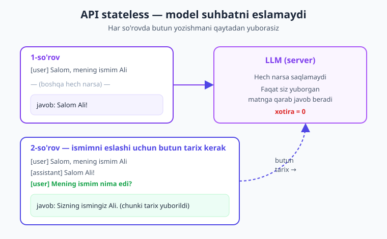
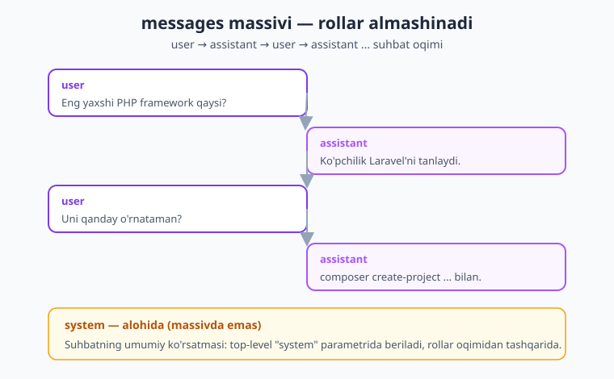
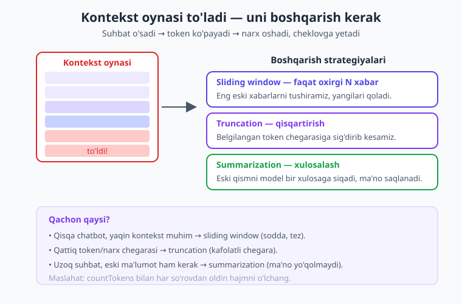

# 04 — Suhbat va kontekst

[⬅️ Oldingi: 03 — Prompt muhandisligi](./03-prompt-muhandisligi.md) · [🏠 Kitob boshi](./README.md) · [Keyingi: 05 — Streaming ➡️](./05-streaming.md)

> **Bu bobda:** chatbotni "esda qoladigan" qilamiz. API'ning eng muhim siri — u **stateless** (suhbatni eslamaydi) — bilan tanishamiz va shuning uchun har so'rovda butun suhbat tarixini qanday yuborishni o'rganamiz. `messages` massivi bilan ko'p-burilishli suhbat quramiz, to'liq ishlaydigan `Suhbat` PHP klassini yozamiz, tarixni sessiya va bazada saqlaymiz, kontekst oynasi to'lib qolganda uni boshqarish strategiyalarini (qisqartirish, xulosalash, oxirgi N xabar) ko'ramiz, token sanash va xarajatni kuzatamiz. Oxirida — to'liq terminal chatbot.

---

## Muammo: bitta so'rov "esda qolmaydi"

Oldingi boblarda biz modelga bitta savol yubordik va bitta javob oldik. Bu — bir martalik so'rov. Ammo haqiqiy chatbot bunday ishlamaydi. Tasavvur qiling, foydalanuvchi yozadi:

```text
Foydalanuvchi:  Salom, mening ismim Ali.
Bot:            Salom, Ali! Sizga qanday yordam bera olaman?
Foydalanuvchi:  Mening ismim nima edi?
Bot:            Kechirasiz, sizning ismingizni bilmayman.
```

Nima bo'ldi? Bot bir lahza oldin "Ali" deganini eshitgan edi-ku! Lekin ikkinchi savolga kelganda u hammasini unutib qo'ydi. Bu — boshlovchilarni eng ko'p chalg'itadigan holat.

> **Hayotiy o'xshatish.** Tasavvur qiling, har gal gaplashganingizda sizni butunlay unutib qo'yadigan suhbatdosh bor. Bugun unga o'zingizni tanishtirdingiz, kecha kechki ovqat haqida gaplashdingiz — ammo ertaga u sizni umuman tanimaganday, "Tanishaylik, ismingiz nima?" deb so'raydi. Modelning "tabiiy" holati aynan shunday: **har safar tanishuvni noldan boshlaydigan suhbatdosh.**

Demak, modelni oldingi gaplarni "eslaydigan" qilish — bu bizning, ya'ni dasturchining vazifasi. Yaxshi xabar: buni qilish juda oson, faqat bitta tushunchani to'g'ri anglash kerak.

---

## KRITIK tushuncha: API stateless

Mana shu bobning eng muhim jumlasi, uni xotirangizga yozib qo'ying:

!!! danger "Eng muhim qoida"
    **LLM API — stateless (holatsiz).** Server suhbatni **ESLAMAYDI**. Har bir so'rov mustaqil va bir-biridan butunlay ajralgan. Model faqat va faqat **shu so'rovda siz yuborgan matnga** qarab javob beradi. Oldingi so'rovlaringizdan hech qanday iz qolmaydi.

"Stateless" (holatsiz) degani — server hech qanday "holat" (state), ya'ni xotira saqlamaydi. Siz birinchi so'rovni yuborasiz, javob olasiz — va aloqa tugaydi. Server sizni unutadi. Ikkinchi so'rov yuborganingizda, server uchun bu — mutlaqo yangi, notanish odam.

Unda chatbotlar qanday "eslaydi"? Sir oddiy:

!!! tip "Asosiy yechim"
    Model oldingi gaplarni eslashi uchun siz **har so'rovda butun suhbat tarixini qaytadan yuborasiz.** "Xotira" — bu sizning ilovangizda saqlangan va har safar so'rovga qo'shib jo'natiladigan xabarlar ro'yxati.

> **Hayotiy o'xshatish.** Buni elektron pochtaga o'xshating. Tasavvur qiling, har bir yangi xat yozganingizda butun oldingi yozishmani ("...quyida oldingi xatlar...") pastiga nusxalab qo'shasiz. Suhbatdoshingiz xotirasi yo'q bo'lsa ham, har xatda butun tarix borligi uchun u kontekstni "biladi". LLM bilan ishlash ham aynan shunday: **har xatga butun yozishmani qo'shib jo'natasiz.**



Diagrammada ko'rib turganingizdek: 2-so'rovda model "ismingiz Ali" deb javob bera oldi — chunki biz unga oldingi xabarlarni ham qo'shib yubordik. Server o'zi hech narsa eslamadi; eslagan biz edik.

---

## `messages` massivi bilan suhbat

2-bobda biz `messages` parametriga bitta element berib so'rov yuborgan edik. Suhbat qurish uchun shu massivga **ko'p element** qo'shamiz — har biri bitta gap (burilish):

```php
$messages = [
    ['role' => 'user',      'content' => 'Eng yaxshi PHP framework qaysi?'],
    ['role' => 'assistant', 'content' => 'Ko\'pchilik Laravel\'ni tanlaydi.'],
    ['role' => 'user',      'content' => 'Uni qanday o\'rnataman?'],
];
```

Bu yerda har element ikki kalitdan iborat:

- `role` — bu gapni kim aytgan: `'user'` (foydalanuvchi/siz) yoki `'assistant'` (model/bot).
- `content` — gapning matni.

E'tibor bering: rollar **almashinib** boradi — user, assistant, user, assistant... Bu suhbatning tabiiy oqimi: siz so'raysiz, model javob beradi, siz yana so'raysiz.



!!! note "Bir nechta qoida"
    - Birinchi xabar doim `user` bo'lishi kerak (siz suhbatni boshlaysiz).
    - Rollar almashinib turishi tabiiy; ketma-ket bir xil rolli xabarlar bo'lsa, ular birlashtiriladi.
    - `system` (umumiy ko'rsatma) bu massivga KIRMAYDI — u alohida, top-level `system` parametrida beriladi (3-bobda ko'rgan edik). Diagrammadagi sariq blokga e'tibor bering.

Mana shu massivni `create`'ga to'liq yuboramiz — endi model butun suhbatni "ko'radi":

```php
<?php
require __DIR__ . '/vendor/autoload.php';

use Anthropic\Client;

$client = new Client(apiKey: getenv('ANTHROPIC_API_KEY'));

$messages = [
    ['role' => 'user',      'content' => 'Salom, mening ismim Ali.'],
    ['role' => 'assistant', 'content' => 'Salom, Ali! Sizga qanday yordam bera olaman?'],
    ['role' => 'user',      'content' => 'Mening ismim nima edi?'],
];

$message = $client->messages->create(
    model: 'claude-opus-4-8',
    maxTokens: 1024,
    messages: $messages,
);

echo $message->content[0]->text;
// -> "Sizning ismingiz Ali." — endi model eslaydi!
```

Sehr shu yerda: model "Ali" ismini **eslagani uchun** emas, balki biz uni o'sha so'rovda qaytadan yuborganimiz uchun to'g'ri javob berdi.

---

## Suhbat menejeri: `Suhbat` klassi

Har safar massivni qo'lda boshqarish noqulay. Bu ishni avtomatlashtiradigan kichik PHP klass yozamiz. Klass mantig'i oddiy va u har bir chatbotning yuragidir:

1. Foydalanuvchi xabarini tarixga **qo'shamiz**.
2. Butun tarixni model'ga yuborib `create` qilamiz.
3. Model javobini ham tarixga **qo'shamiz**.
4. Javobni qaytaramiz.

```php
<?php

use Anthropic\Client;

class Suhbat
{
    /** @var array<int, array{role: string, content: string}> — suhbat tarixi */
    private array $tarix = [];

    public function __construct(
        private Client $client,
        private string $system = 'Sen foydali yordamchisan. Doim o\'zbek tilida javob ber.',
        private string $model = 'claude-opus-4-8',
        private int $maxTokens = 1024,
    ) {}

    // Foydalanuvchi xabarini yuboradi va model javobini qaytaradi
    public function yubor(string $matn): string
    {
        // 1) Foydalanuvchi xabarini tarixga qo'shamiz
        $this->tarix[] = ['role' => 'user', 'content' => $matn];

        // 2) Butun tarixni model'ga yuboramiz
        $message = $this->client->messages->create(
            model: $this->model,
            maxTokens: $this->maxTokens,
            system: $this->system,
            messages: $this->tarix,
        );

        // 3) Javob matnini yig'amiz (bloklar massiv bo'lishi mumkin)
        $javob = '';
        foreach ($message->content as $block) {
            if ($block->type === 'text') {
                $javob .= $block->text;
            }
        }

        // 4) Model javobini ham tarixga qo'shamiz — keyingi so'rovda eslashi uchun
        $this->tarix[] = ['role' => 'assistant', 'content' => $javob];

        return $javob;
    }

    // Butun tarixni qaytaradi (saqlash/ko'rsatish uchun)
    public function tarix(): array
    {
        return $this->tarix;
    }

    // Suhbatni noldan boshlaydi
    public function tozala(): void
    {
        $this->tarix = [];
    }
}
```

Ishlatish judayam sodda — endi tarixni o'zimiz boshqarmaymiz, klass qiladi:

```php
$client = new Client(apiKey: getenv('ANTHROPIC_API_KEY'));
$suhbat = new Suhbat($client);

echo $suhbat->yubor('Salom, mening ismim Ali.') . "\n";
echo $suhbat->yubor('Mening ismim nima edi?') . "\n";
// -> Ikkinchi javobda model "Ali" deb eslaydi, chunki klass tarixni saqlab,
//    har so'rovda butun tarixni yubordi.
```

!!! tip "Maslahat"
    Bu `Suhbat` klassi — butun kitobning ko'p bobida asos bo'ladi. Streaming (5-bob), tool use (9-bob), agentlar (11-bob) — hammasi shu "tarixni saqlab, har so'rovda yuborish" g'oyasiga tayanadi. Uni yaxshi tushunib oling.

---

## Tarixni saqlash: sessiya va ma'lumotlar bazasi

Yuqoridagi klass tarixni faqat **bitta so'rov davomida** (RAM'da) saqlaydi. PHP skripti tugashi bilan tarix yo'qoladi. Veb-ilovada esa foydalanuvchi sahifani yangilaganda yoki ertaga qaytib kelganda suhbat **davom etishi** kerak. Buning uchun tarixni biror joyda saqlab qo'yishimiz lozim.

### Sessiyada saqlash (oddiy, qisqa muddatli)

Eng oson yo'l — PHP sessiyasi. Suhbat brauzer sessiyasi davomida saqlanadi:

```php
<?php
session_start();

// Sessiyadan tarixni olamiz (bo'lmasa — bo'sh massiv)
$_SESSION['suhbat'] ??= [];

// ... foydalanuvchi yangi xabar yubordi ...
$_SESSION['suhbat'][] = ['role' => 'user', 'content' => $foydalanuvchiMatni];

$message = $client->messages->create(
    model: 'claude-opus-4-8',
    maxTokens: 1024,
    messages: $_SESSION['suhbat'],
);

$javob = $message->content[0]->text;
$_SESSION['suhbat'][] = ['role' => 'assistant', 'content' => $javob];
```

Sessiya — tez sinash uchun yaxshi, ammo u vaqtinchalik (sessiya tugasa yo'qoladi) va bir foydalanuvchiga bog'liq.

### Ma'lumotlar bazasida saqlash (doimiy, ishonchli)

Real ilovada suhbatlarni **ma'lumotlar bazasida** saqlaymiz — shunda ular doimiy bo'ladi, tahlil qilish va qayta yuklash mumkin. Oddiy jadval sxemasi:

```sql
CREATE TABLE xabarlar (
    id         BIGSERIAL PRIMARY KEY,
    suhbat_id  BIGINT      NOT NULL,   -- qaysi suhbatga tegishli
    role       VARCHAR(16) NOT NULL,   -- 'user' yoki 'assistant'
    content    TEXT        NOT NULL,
    vaqt       TIMESTAMP   NOT NULL DEFAULT NOW()
);
```

Saqlash va yuklash PDO bilan (PHP'ning standart baza vositasi):

```php
// Bitta xabarni bazaga yozamiz
function dbSaqla(PDO $pdo, int $suhbatId, string $role, string $content): void
{
    $stmt = $pdo->prepare(
        'INSERT INTO xabarlar (suhbat_id, role, content) VALUES (?, ?, ?)'
    );
    $stmt->execute([$suhbatId, $role, $content]);
}

// Suhbat tarixini bazadan tiklaymiz — to'g'ridan-to'g'ri messages formatida
function dbYukla(PDO $pdo, int $suhbatId): array
{
    $stmt = $pdo->prepare(
        'SELECT role, content FROM xabarlar WHERE suhbat_id = ? ORDER BY id ASC'
    );
    $stmt->execute([$suhbatId]);
    return $stmt->fetchAll(PDO::FETCH_ASSOC);
    // -> [['role' => 'user', 'content' => '...'], ['role' => 'assistant', ...], ...]
}
```

E'tibor bering: `dbYukla` qaytargan massiv — bevosita `messages` parametriga beradigan formatda. Demak bazadan tiklash bilan suhbatni kaltta davom ettiramiz.

!!! note "Eslatma"
    Laravel ishlatsangiz, buni Eloquent modeli (`Message`) bilan ancha qulay qilish mumkin — 18-bobda Laravel'ga integratsiyani ko'ramiz. Tarixni qanday saqlasangiz ham (sessiya, fayl, baza, Redis), g'oya bir xil: saqla → yukla → har so'rovda model'ga yubor.

---

## Kontekst oynasi cheklovi

Suhbatni saqlash muammosini yechdik. Endi yangi muammo paydo bo'ladi: suhbat **cheksiz o'sib** boradi. Har yangi gap tarixga qo'shiladi, va biz har so'rovda butun tarixni yuborgani uchun:

- Har so'rovda yuborilayotgan matn **kattalashib** boradi.
- Token (matnning AI o'qiydigan bo'lakchasi) soni **ko'payadi**.
- Token ko'paygani sayin **narx oshadi** (siz yuborgan har token uchun to'laysiz).
- Bir paytdan keyin **kontekst oynasi** (model bir so'rovda qabul qila oladigan maksimal token) chegarasiga **yetadi** va so'rov xato beradi.

> **Hayotiy o'xshatish.** Kontekst oynasini ish stolingizga o'xshating. Stol ustiga suhbatning har bir qog'ozini qo'yib borasiz. Avvaliga joy yetadi, ammo qog'ozlar to'planib borgani sayin stol to'lib ketadi — yangi qog'oz qo'yishga joy qolmaydi. Modelning kontekst oynasi ham xuddi shunday: u cheklangan, va **stol ustidagi qog'ozlar to'lib ketishi** — bu suhbatni boshqarishni boshlash kerakligining belgisi.

!!! info "Modellar kontekst hajmi"
    Claude Opus 4.8 va Sonnet 4.6 — **1M token** (juda katta), Haiku 4.5 — 200K token. Bu juda ko'pday tuyuladi, lekin uzoq suhbatlar, katta hujjatlar yoki ko'p tarix bilan baribir to'lib qolishi mumkin. Va eng muhimi: oynaga sig'sa ham, har token uchun **pul to'laysiz** — shuning uchun tarixni qisqa tutish ham narx masalasi.

---

## Kontekstni boshqarish strategiyalari

Suhbat oynani to'ldirib borganda, eski xabarlardan qutulishimiz yoki ularni siqishimiz kerak. Uchta asosiy strategiya bor.



### 1. Sliding window — faqat oxirgi N xabar

Eng oddiy yo'l: faqat **oxirgi N ta** burilishni saqlaymiz, eng eskilarini tashlaymiz. "Surilib boruvchi oyna" — yangi xabarlar kirgani sayin oyna oldinga suriladi.

```php
// Faqat oxirgi N juft (user+assistant) xabarni qoldiramiz
function oxirgiN(array $tarix, int $n): array
{
    return array_slice($tarix, -$n * 2);
}

// Ishlatish: faqat oxirgi 5 burilishni model'ga yuboramiz
$qisqaTarix = oxirgiN($suhbat->tarix(), 5);
```

**Afzalligi:** oddiy, tez, kafolatli kichik. **Kamchiligi:** eng eski ma'lumot (masalan, foydalanuvchi boshida aytgan ismi) yo'qoladi.

### 2. Truncation — qisqartirish

Belgilangan token chegarasiga sig'guncha eski xabarlarni **kesib tashlaymiz**. Sliding window'ga o'xshaydi, ammo bu yerda mezon — xabar soni emas, **token chegarasi**.

```php
// Token chegarasiga sig'guncha eng eski xabarlarni olib tashlaymiz
function qisqart(Client $client, array $tarix, int $tokenChegarasi): array
{
    while (count($tarix) > 2) {
        $hisob = $client->messages->countTokens(
            model: 'claude-opus-4-8',
            messages: $tarix,
        );
        if ($hisob->inputTokens <= $tokenChegarasi) {
            break;   // sig'di — to'xtaymiz
        }
        array_shift($tarix);   // eng eski xabarni olib tashlaymiz
    }
    return $tarix;
}
```

**Afzalligi:** token/narx ustidan qattiq nazorat. **Kamchiligi:** har tekshiruvda token sanaladi; eski ma'lumot baribir yo'qoladi.

### 3. Summarization — xulosalash

Eng aqlli, lekin murakkabroq yo'l: eski xabarlarni **modelning o'ziga xulosalattirib**, ularni bitta qisqa xulosa bilan almashtiramiz. Shunda ma'no saqlanadi, token esa kamayadi.

```php
// Eski xabarlarni bir xulosaga siqamiz (arzon model bilan)
function xulosala(Client $client, array $eskiXabarlar): string
{
    $matn = '';
    foreach ($eskiXabarlar as $x) {
        $matn .= $x['role'] . ': ' . $x['content'] . "\n";
    }

    $message = $client->messages->create(
        model: 'claude-haiku-4-5',   // xulosalash uchun arzon, tez model yetarli
        maxTokens: 512,
        system: 'Quyidagi suhbatni 3-4 jumlada xulosala. Muhim faktlar va '
              . 'foydalanuvchi haqidagi ma\'lumotlarni (ism, afzalliklar) saqla.',
        messages: [['role' => 'user', 'content' => $matn]],
    );

    return $message->content[0]->text;
}

// Keyin xulosani tarix boshiga "system kontekst" sifatida qo'yamiz:
$xulosa = xulosala($client, array_slice($tarix, 0, -6));   // eski qism
$yangiTarix = array_merge(
    [['role' => 'user', 'content' => "Avvalgi suhbat xulosasi: $xulosa"]],
    array_slice($tarix, -6),   // oxirgi 6 ta xabar to'liq qoladi
);
```

**Afzalligi:** uzoq suhbatda ham eski ma'no yo'qolmaydi. **Kamchiligi:** xulosalash uchun qo'shimcha so'rov (vaqt + ozgina narx) kerak.

!!! question "Qachon qaysi?"
    - **Sliding window** — sodda chatbot, asosan yaqin kontekst muhim bo'lsa.
    - **Truncation** — token/narx chegarasi qat'iy bo'lishi kerak bo'lsa.
    - **Summarization** — uzun suhbat va eski ma'lumot ham kerak bo'lsa (masalan, mijozga xizmat boti).

    Amalda ko'pincha aralash qo'llanadi: oxirgi bir necha xabar to'liq + undan oldingisi xulosa.

---

## Token sanash: so'rovdan oldin bilish

Har so'rovda qancha token ketishini **oldindan** bilsangiz, ham narxni hisoblay olasiz, ham oynaga sig'ish-sig'masligini tekshira olasiz. SDK shuning uchun maxsus metod beradi:

```php
$hisob = $client->messages->countTokens(
    model: 'claude-opus-4-8',
    messages: $suhbat->tarix(),
);

echo "Bu so'rov: {$hisob->inputTokens} token kirish.\n";
// system, tools ham qo'shsangiz — ularni ham bu metodga bering, aniqroq bo'ladi.
```

`countTokens` — bu **arzon va tez** tekshiruv (model'ga to'liq so'rov yubormaydi, faqat sanaydi). Nega muhim?

- **Narxni oldindan bilish:** kirish tokeni × model narxi = taxminiy xarajat. (Opus 4.8 — $5/1M kirish token; demak 10 000 token ≈ $0.05.)
- **Oynaga sig'ishni tekshirish:** so'rovni yuborishdan oldin chegaradan oshmaganini bilasiz.
- **Strategiya tanlash:** token ko'p bo'lsa — qisqartirish/xulosalash kerakligini hal qilasiz (yuqorida `qisqart` shunday ishlatadi).

!!! tip "Maslahat"
    `countTokens` faqat **kirish** (siz yuborayotgan) tokenni sanaydi. **Chiqish** (model javobi) tokenini esa oldindan bilib bo'lmaydi — uni `maxTokens` bilan cheklaysiz va javob kelganda `usage`'dan o'qiysiz (quyida).

---

## `usage` ni kuzatish: har so'rov narxi

Har javobda model qancha token ishlatganini aniq aytib beradi — `usage` maydonida. Bu — haqiqiy xarajatni hisoblashning eng to'g'ri yo'li:

```php
$message = $client->messages->create(
    model: 'claude-opus-4-8',
    maxTokens: 1024,
    messages: $suhbat->tarix(),
);

$kirish  = $message->usage->inputTokens;    // siz yuborgan token
$chiqish = $message->usage->outputTokens;   // model javobi tokeni

echo "Kirish: $kirish, chiqish: $chiqish token.\n";

// Narxni hisoblaymiz (Opus 4.8: $5/1M kirish, $25/1M chiqish)
$narx = ($kirish / 1_000_000) * 5 + ($chiqish / 1_000_000) * 25;
echo 'Bu so\'rov narxi: $' . number_format($narx, 6) . "\n";
```

!!! warning "Ehtiyot bo'ling"
    Suhbat uzaygani sayin **kirish tokeni** har so'rovda ortib boradi — chunki har safar butun tarixni qaytadan yuborasiz. Demak 20-burilishli suhbatning oxirgi so'rovi 1-so'rovdan ancha qimmat. Aynan shu sabab tarixni boshqarish (yuqoridagi strategiyalar) muhim. Har so'rov `usage`'ini log qilib, jami xarajatni kuzatib boring (16-bobda kesh va xarajat optimizatsiyasini chuqur ko'ramiz).

---

## To'liq misol: terminal chatbot

Endi hamma narsani birlashtiramiz — terminalda ishlaydigan, sizni eslaydigan chatbot. Foydalanuvchi yozadi, model javob beradi, suhbat davom etadi, har burilishda token sarfi ko'rsatiladi:

```php
<?php
require __DIR__ . '/vendor/autoload.php';

use Anthropic\Client;

$client = new Client(apiKey: getenv('ANTHROPIC_API_KEY'));

// Suhbat tarixi va jami xarajat
$tarix = [];
$jamiNarx = 0.0;

echo "🤖 Chatbot tayyor! ('chiqish' deb yozsangiz tugaydi)\n\n";

while (true) {
    echo "Siz: ";
    $matn = trim(fgets(STDIN));   // terminaldan bir qator o'qiymiz

    if ($matn === '' ) {
        continue;
    }
    if (in_array(mb_strtolower($matn), ['chiqish', 'exit', 'quit'], true)) {
        echo "Xayr! 👋\n";
        break;
    }

    // 1) Foydalanuvchi xabarini tarixga qo'shamiz
    $tarix[] = ['role' => 'user', 'content' => $matn];

    // 2) (ixtiyoriy) sliding window — faqat oxirgi 10 burilish
    $yuboriladigan = array_slice($tarix, -20);

    // 3) Butun tarixni model'ga yuboramiz
    try {
        $message = $client->messages->create(
            model: 'claude-opus-4-8',
            maxTokens: 1024,
            system: 'Sen do\'stona o\'zbek tilidagi yordamchisan. Qisqa va aniq javob ber.',
            messages: $yuboriladigan,
        );
    } catch (\Anthropic\Core\Exceptions\APIException $e) {
        echo "Xato: {$e->getMessage()}\n";
        continue;
    }

    // 4) Javob matnini yig'amiz
    $javob = '';
    foreach ($message->content as $block) {
        if ($block->type === 'text') {
            $javob .= $block->text;
        }
    }

    // 5) Javobni tarixga qo'shamiz — keyingi so'rovda eslashi uchun
    $tarix[] = ['role' => 'assistant', 'content' => $javob];

    // 6) Narxni hisoblaymiz va ko'rsatamiz
    $kirish  = $message->usage->inputTokens;
    $chiqish = $message->usage->outputTokens;
    $narx = ($kirish / 1_000_000) * 5 + ($chiqish / 1_000_000) * 25;
    $jamiNarx += $narx;

    echo "Bot: $javob\n";
    echo "  (token: ↑$kirish ↓$chiqish · jami xarajat: \$" . number_format($jamiNarx, 5) . ")\n\n";
}
```

Ishga tushirish:

```bash
php chatbot.php
```

Natija — sizni eslaydigan, har javobda xarajatni ko'rsatadigan jonli chatbot:

```text
🤖 Chatbot tayyor! ('chiqish' deb yozsangiz tugaydi)

Siz: Salom, ismim Ali.
Bot: Salom, Ali! Sizga qanday yordam bera olaman?
  (token: ↑28 ↓14 · jami xarajat: $0.00049)

Siz: Mening ismim nima edi?
Bot: Sizning ismingiz Ali.
  (token: ↑52 ↓8 · jami xarajat: $0.00075)

Siz: chiqish
Xayr! 👋
```

E'tibor bering: ikkinchi so'rovda **kirish tokeni** (52) birinchidan (28) ko'p — chunki endi tarixga oldingi savol-javob ham kirdi. Aynan shu — "stateless API'da xotira pulga tushadi" degan tushunchaning amaldagi ko'rinishi.

!!! example "Sinab ko'ring"
    Yuqoridagi chatbotni ishga tushiring va modelga avval bir nechta fakt ayting (ismingiz, sevimli tilingiz), keyin ularni so'rang. Eslayotganini ko'rasiz. Endi `array_slice($tarix, -20)` ni `-2` ga o'zgartiring (faqat oxirgi burilish) — bot eskini "unutib" qo'yadi. Bu — sliding window'ning ta'sirini o'z ko'zingiz bilan ko'rish.

---

## Xulosa

- **LLM API stateless** — server suhbatni eslamaydi. Har so'rov mustaqil; model faqat o'sha so'rovda yuborilgan matnga qarab javob beradi.
- Chatbot "eslashi" uchun siz **har so'rovda butun suhbat tarixini** qaytadan yuborasiz — bu "xotira" sizning ilovangizda saqlanadi, modelda emas.
- Suhbat — `messages` massivi: `user` va `assistant` rollari **almashinib** boradi; `system` esa alohida top-level parametr.
- **`Suhbat` klassi** mantig'i: foydalanuvchi xabarini qo'sh → `create` → javobni tarixga qo'sh → qaytar. Bu kitobning ko'p bobiga asos.
- Tarixni **sessiya** (oddiy) yoki **ma'lumotlar bazasi** (doimiy, ishonchli) da saqlaysiz; bazadan yuklangan format bevosita `messages`'ga beriladi.
- Suhbat o'sgani sayin **token va narx ortadi**, **kontekst oynasi** to'lishi mumkin — shuning uchun uni boshqarish kerak.
- Uchta strategiya: **sliding window** (oxirgi N xabar), **truncation** (token chegarasiga qisqartirish), **summarization** (eski qismni xulosalash). Ko'pincha aralash qo'llanadi.
- **`countTokens`** bilan so'rovdan oldin token va narxni bilasiz; **`usage`** (`inputTokens`/`outputTokens`) bilan har javobning haqiqiy xarajatini hisoblaysiz.

## Amaliy mashqlar

1. **`Suhbat` klassini kengaytiring.** Yuqoridagi `Suhbat` klassiga `xabarSoni(): int` (suhbatdagi xabarlar sonini qaytaradi) va `oxirgiJavob(): ?string` metodlarini qo'shing. Klassni sinash uchun kichik skript yozing.

2. **Doimiy terminal chatbot.** Bobdagi terminal chatbotni shunday o'zgartiringki, har burilish (user va assistant xabari) `xabarlar` jadvaliga (PDO) yoziladi; dastur qayta ishga tushganda berilgan `suhbat_id` bo'yicha tarixni bazadan yuklab, suhbatni **kaltta davom ettirsin**.

3. **Token monitori.** Funksiya yozing: u suhbat tarixini oladi, `countTokens` bilan kirish tokenini sanaydi va agar token 50 000 dan oshsa, ekranga "⚠️ Kontekst kattalashdi — qisqartirish tavsiya etiladi" deb ogohlantirish chiqaradi.

4. **Avtomatik xulosalovchi suhbat.** `Suhbat` klassini shunday yangilangki, tarix 12 xabardan oshsa, eng eski 6 tasini avtomatik xulosalab (bobdagi `xulosala`), ularni bitta qisqa kontekst xabari bilan almashtirsin. Suhbatni uzoq davom ettirib, ismingiz hali ham eslanayotganini tekshiring.

5. **Strategiyalarni solishtiring.** Bitta uzun suhbat (kamida 15 burilish) tayyorlang. Uni uch usulda model'ga yuboring: (a) butun tarix, (b) sliding window (oxirgi 6), (c) xulosa + oxirgi 6. Har holatda `countTokens` natijasini va javob sifatini yozib, qaysi biri sizning vaziyatingizga mosligini xulosalang.

---

[⬅️ Oldingi: 03 — Prompt muhandisligi](./03-prompt-muhandisligi.md) · [🏠 Kitob boshi](./README.md) · [Keyingi: 05 — Streaming ➡️](./05-streaming.md)
