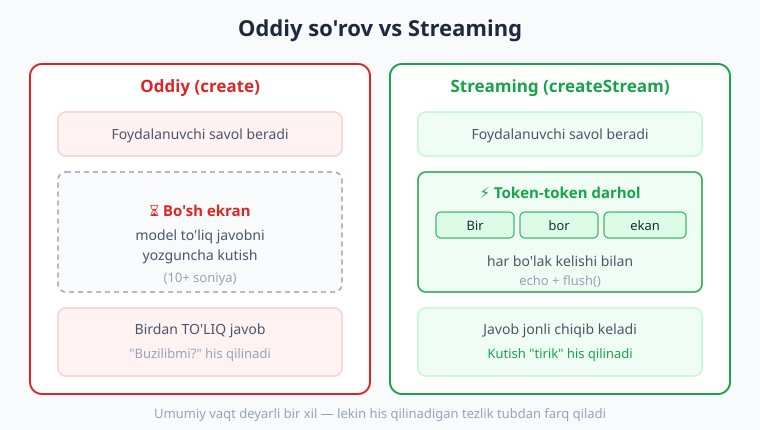
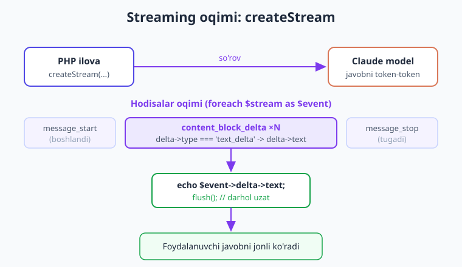
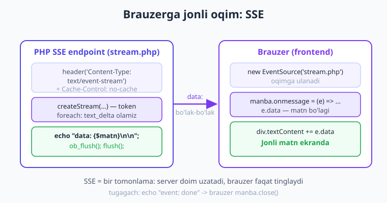

# 05 — Streaming (jonli javob)

[⬅️ Oldingi: 04 — Suhbat va kontekst](./04-suhbat-kontekst.md) · [🏠 Kitob boshi](./README.md) · [Keyingi: 06 — Strukturali chiqish ➡️](./06-strukturali-chiqish.md)

> **Bu bobda:** modelning javobini u to'liq tugaguncha kutmasdan, **token-token** (so'z-so'z) jonli ko'rsatishni o'rganamiz. `createStream` bilan oqimni qabul qilamiz, terminalda `flush()` bilan harf-harf chiqaramiz, brauzerga **SSE (Server-Sent Events)** orqali jonli uzatamiz va JavaScript `EventSource` bilan qabul qilamiz. Shuningdek oqimdan to'liq javobni yig'ib suhbat tarixiga qo'shamiz va streaming xatolarini boshqaramiz.

---

## Muammo: bo'sh ekran va kutish

Tasavvur qiling: foydalanuvchi chatbot'ingizga uzun savol berdi — "Laravel'da autentifikatsiyani qadam-baqadam tushuntir". Model batafsil, 400 so'zli javob tayyorlaydi. Lekin oddiy `messages->create` so'rovida javob **faqat to'liq tayyor bo'lganda** qaytadi. Bu 10–15 soniya davom etishi mumkin.

Shu vaqt ichida foydalanuvchi nima ko'radi? **Bo'sh ekran.** Yoki aylanayotgan "yuklanmoqda" belgisi. U "buzilibmi?", "ilova qotdimi?" deb o'ylaydi. Ko'pchilik shu yerda sahifani yopadi.

> **Hayotiy o'xshatish.** Tasavvur qiling, do'stingizdan uzun maktub kutyapsiz. Ikki holat bor:
>
> 1. **Oddiy javob** — do'stingiz butun maktubni yozib, konvertga solib, pochta orqali yuboradi. Siz hech narsa ko'rmay turib, tugagunicha kutasiz. Keyin birdan to'liq maktub keladi.
> 2. **Streaming** — do'stingiz sizga qo'ng'iroq qilib, **yozayotgan paytida o'qib beradi.** Siz har bir jumlani u yozishi bilanoq eshitasiz. Kutish "tirik" his qilinadi — gap ketyapti, hammasi joyida.
>
> ChatGPT yoki Claude bilan suhbatlashganingizda javob **harf-harf chiqib kelishini** ko'rgansiz — bu aynan ikkinchi holat, ya'ni **streaming**. Foydalanuvchi natijani darhol ko'ra boshlaydi, kutish sezilmaydi.

Model javobni baribir token-token ishlab chiqaradi (1-bobda token — matnning AI o'qiydigan bo'lakchasi ekanini ko'rgandik). Oddiy so'rovda SDK shu tokenlarni **siz uchun yig'ib**, oxirida bir butun qilib beradi. Streaming'da esa biz tokenlarni **kelishi bilanoq** olamiz va ekranga chiqaramiz.



!!! tip "Streaming faqat tezroq emas — kutishni boshqaradi"
    Aslida modelning umumiy javob yozish vaqti ikkala holatda deyarli bir xil. Lekin **his qilinadigan tezlik** tubdan farq qiladi: birinchi token 1 soniyada chiqsa, foydalanuvchi "ishlayapti" deb biladi va o'qiy boshlaydi. Bu **psixologik** g'alaba — texnik emas, tajriba haqida.

## Yechim: `createStream` bilan oqim

Streaming so'rovi oddiy `create` ga juda o'xshaydi — parametrlar (model, `maxTokens`, `messages`) bir xil. Faqat metod nomi boshqacha: `create` o'rniga **`createStream`**.

Farqi natijada: `create` bitta `Message` obyekti qaytaradi; `createStream` esa **iterable oqim** qaytaradi — uni `foreach` bilan aylantirib, har bir **hodisani (event)** olib boramiz.

```php
<?php
require __DIR__ . '/vendor/autoload.php';

use Anthropic\Client;

// API kalitni MUHIT O'ZGARUVCHISIDAN ol — kodga YOZMA!
$client = new Client(apiKey: getenv('ANTHROPIC_API_KEY'));

// create() o'rniga createStream() — iterable oqim qaytaradi
$stream = $client->messages->createStream(
    model: 'claude-opus-4-8',
    maxTokens: 1024,
    messages: [
        ['role' => 'user', 'content' => 'Qisqa hikoya yoz'],
    ],
);

// Oqimni token-token aylantiramiz
foreach ($stream as $event) {
    // har bir event — javobning bir bo'lagi haqida xabar
    var_dump($event->type);
}
```

Bu yerda `$stream` — bir martalik o'qiladigan oqim. `foreach` ichida har takrorlanishda yangi **hodisa** keladi. Lekin hodisalar faqat matn emas — ular javob hayotining turli bosqichlarini bildiradi.

### Hodisa turlari (event types)

Model javobni quyidagi bosqichlar bilan "hikoya qilib" beradi. Eng muhimlari:

| Hodisa turi (`$event->type`) | Ma'nosi |
|---|---|
| `message_start` | Javob boshlandi (hali matn yo'q — meta-ma'lumot). |
| `content_block_start` | Yangi kontent bloki ochildi (masalan, matn bloki). |
| **`content_block_delta`** | **Matnning yangi bo'lagi keldi** — bizga eng kerakli! |
| `content_block_stop` | Joriy blok tugadi. |
| `message_delta` | Yakuniy meta yangilanish (masalan, `stop_reason`). |
| `message_stop` | Butun javob tugadi. |

Bizni asosan **`content_block_delta`** qiziqtiradi — aynan shu hodisalar ichida foydalanuvchiga ko'rsatadigan matn bo'laklari keladi. Qolganlari boshlanish/tugash signallari (ularni keyinroq — yig'ish va xato boshqaruvida — ishlatamiz).



## Matn bo'laklarini olish va darhol chiqarish

Har `content_block_delta` hodisasi ichida `delta` obyekti bor. Uning turi (`delta->type`) `text_delta` bo'lganda — bu **matn bo'lagi**, va `delta->text` da haqiqiy harflar yotadi.

!!! note "Nega `delta->type` ni ham tekshiramiz?"
    `delta` har doim ham oddiy matn bo'lavermaydi. Masalan, model fikrlash (thinking) yoki tool (function calling, 9-bob) ishlatsa, boshqa turdagi delta'lar keladi (`input_json_delta` va h.k.). Shuning uchun **matnni ko'rsatishdan oldin** `delta->type === 'text_delta'` ekaniga ishonch hosil qilamiz — aks holda kerakmas ma'lumotni ekranga chiqarib qo'yishimiz mumkin.

Eng muhim sintaksis — har bo'lakni olib, darhol ekranga chiqarish:

```php
foreach ($stream as $event) {
    // faqat matn bo'laklarini ushlaymiz
    if ($event->type === 'content_block_delta'
        && ($event->delta->type ?? '') === 'text_delta') {

        echo $event->delta->text;  // bo'lakni chiqaramiz
        flush();                   // bufferni darhol bo'shatamiz
    }
}
```

Bu yerda ikkita kalit narsa bor:

- **`echo $event->delta->text`** — bo'lakni chiqaradi (masalan, "Bir bor", keyin " ekan, bir", keyin " yo'q ekan..." — qism-qism).
- **`flush()`** — PHP odatda chiqishni **bufferda** to'plab, keyin birdan yuboradi. `flush()` esa "to'plama, hozir yubor!" deydi. Streaming'ning butun mohiyati shu — har bo'lakni darhol uzatmasak, foydalanuvchi baribir oxirida birdan ko'radi (oddiy so'rovdan farqi qolmaydi).

!!! warning "`($event->delta->type ?? '')` — nega `??`?"
    `message_start` kabi ba'zi hodisalarda umuman `delta` yo'q. Agar to'g'ridan `$event->delta->type` ga murojaat qilsak, "undefined property" ogohlantirishi chiqishi mumkin. `?? ''` (null-coalescing) operatori "agar yo'q bo'lsa, bo'sh satr deb hisobla" deydi — kod xavfsiz ishlaydi.

## To'liq CLI misol: terminalda jonli javob

Endi hammasini birlashtirib, **buyruq satrida (terminalda) jonli oqim** ko'rsatadigan to'liq dasturni yozamiz. Ishga tushirilganda javob harf-harf chiqib kelishini ko'rasiz — xuddi kimdir terganday.

```php
<?php
// stream-cli.php — terminalda jonli AI javobi
require __DIR__ . '/vendor/autoload.php';

use Anthropic\Client;

$client = new Client(apiKey: getenv('ANTHROPIC_API_KEY'));

$savol = $argv[1] ?? 'PHP nima ekanini 3 jumlada tushuntir.';

echo "Savol: {$savol}\n";
echo "Javob: ";

$stream = $client->messages->createStream(
    model: 'claude-opus-4-8',
    maxTokens: 1024,
    messages: [
        ['role' => 'user', 'content' => $savol],
    ],
);

foreach ($stream as $event) {
    if ($event->type === 'content_block_delta'
        && ($event->delta->type ?? '') === 'text_delta') {
        echo $event->delta->text;
        flush();   // har bo'lakni darhol chiqar
    }
}

echo "\n";  // oxirida yangi qator
```

Ishga tushirish:

```bash
php stream-cli.php "Laravel migration nima?"
```

Natija — javob **terminalda jonli** paydo bo'ladi, so'z-so'z. Birinchi so'z deyarli darhol chiqadi, qolgani ortidan oqib keladi. Bu oddiy `create` bilan erishib bo'lmaydigan tajriba.

!!! tip "Terminalda `flush()` ham kerakmi?"
    Ko'p hollarda terminalda PHP CLI chiqishni darrov ko'rsatadi, lekin ba'zi sozlamalarda buferlash bo'ladi. `flush()` ni qoldirish — zararsiz va kafolatli. Brauzerga uzatishda esa `flush()` **mutlaqo shart** (quyida ko'ramiz).

## Brauzerga oqim: SSE (Server-Sent Events)

Terminal yaxshi, lekin haqiqiy ilova — bu **veb-sahifa**. Foydalanuvchi brauzerda savol yozadi, javob jonli chiqishini ko'rishni istaydi. Buning uchun server javobni qism-qism brauzerga uzatishi kerak.

Bu vazifaning standart, sodda yechimi — **SSE (Server-Sent Events)**.

> **Hayotiy o'xshatish.** SSE — bu **bir tomonlama radio** kabi. Server (radiostansiya) doimo efirga bo'lak-bo'lak xabar uzatadi; brauzer (radio) faqat tinglaydi. WebSocket (ikki tomonlama "telefon") dan farqli, SSE faqat **server -> brauzer** yo'nalishida ishlaydi — AI javobini oqimda yetkazish uchun aynan shu yetarli va eng oson.

SSE'ning ishlash formati juda sodda. Server quyidagi qoidalarga amal qiladi:

1. Maxsus sarlavhalar yuboradi: `Content-Type: text/event-stream` (bu — "men oqim uzataman" degani) va `Cache-Control: no-cache`.
2. Har xabarni `data: ...` bilan boshlab, **ikkita yangi qator** (`\n\n`) bilan tugatadi.
3. Har yuborgandan keyin `flush()` qiladi — aks holda hammasi oxirida birdan ketadi.



### To'liq SSE endpoint

Quyida `stream.php` — brauzerdan `?savol=...` qabul qilib, AI javobini SSE orqali jonli uzatadigan to'liq endpoint:

```php
<?php
// stream.php — AI javobini brauzerga SSE bilan jonli uzatadi
require __DIR__ . '/vendor/autoload.php';

use Anthropic\Client;

// --- 1. SSE sarlavhalari ---
header('Content-Type: text/event-stream');  // "bu oqim" deb belgilaymiz
header('Cache-Control: no-cache');          // kesh qilmasin
header('X-Accel-Buffering: no');            // Nginx bufferlamasin (muhim!)

// PHP chiqish buferini o'chiramiz — har bo'lak darhol ketsin
while (ob_get_level() > 0) {
    ob_end_flush();
}

$client = new Client(apiKey: getenv('ANTHROPIC_API_KEY'));

// brauzerdan kelgan savol (oddiy tozalash bilan)
$savol = trim($_GET['savol'] ?? 'Salom!');

// --- 2. Oqimni boshlaymiz ---
$stream = $client->messages->createStream(
    model: 'claude-opus-4-8',
    maxTokens: 1024,
    messages: [
        ['role' => 'user', 'content' => $savol],
    ],
);

// --- 3. Har bo'lakni SSE xabari sifatida yuboramiz ---
foreach ($stream as $event) {
    if ($event->type === 'content_block_delta'
        && ($event->delta->type ?? '') === 'text_delta') {

        $matn = $event->delta->text;

        // SSE'da yangi qator maxsus belgi — uni \n bilan almashtiramiz,
        // brauzerda qaytadan tiklaymiz
        $matn = str_replace("\n", '\\n', $matn);

        echo "data: {$matn}\n\n";  // SSE xabar formati
        flush();                   // darhol uzat!
    }
}

// --- 4. Tugadi signalini yuboramiz ---
echo "event: done\ndata: [TUGADI]\n\n";
flush();
```

Diqqat qiling:

- **`X-Accel-Buffering: no`** — agar serveringiz oldida Nginx tursa, u o'zi javobni buferlab, oqimni "bo'g'ib" qo'yishi mumkin. Bu sarlavha "buni qilma" deydi. Apache uchun odatda kerak emas, lekin zarar qilmaydi.
- **`str_replace("\n", '\\n', ...)`** — SSE protokolida `\n` xabar chegarasi sifatida ishlatiladi. Agar AI matni ichida haqiqiy yangi qator bo'lsa, u SSE'ni chalkashtiradi. Shuning uchun yangi qatorni `\n` (matn sifatida) ga aylantirib yuboramiz, brauzerda qaytarib o'giramiz.
- **`event: done`** — oxirida o'zimizning maxsus "tugadi" signalini yuboramiz. Brauzer shuni eshitib, "yozilyapti" indikatorini o'chiradi.

!!! danger "Foydalanuvchi savolini hech qachon ko'r-ko'rona ishonma"
    Bu yerda `$savol` to'g'ridan brauzerdan keldi. Real ilovada uni **tekshiring** (uzunlik chegarasi, kerakmas belgilar). Bundan ham muhimi — foydalanuvchi matni model'ni "aldab", noto'g'ri ish qildirishi mumkin (**prompt injection**). Bu jiddiy mavzuni [20-bobda (Xavfsizlik)](./20-xavfsizlik.md) batafsil ko'ramiz. Hozircha eslab qoling: foydalanuvchi kiritmasi — ishonchsiz manba.

## Frontend tomoni: brauzerda `EventSource`

Server tayyor. Endi brauzer tomonida oqimni qabul qilish kerak. Brauzerlarda SSE uchun maxsus tayyor vosita bor — **`EventSource`**. U serverga ulanadi va har kelgan `data:` xabarni hodisa sifatida beradi.

Bu PHP kitobi bo'lgani uchun frontend'ga chuqur kirmaymiz — faqat **g'oyani** ko'rsatamiz (kichik HTML + JavaScript):

```html
<!-- index.html — sodda jonli chat -->
<input id="savol" placeholder="Savolingiz..." size="40">
<button onclick="sora()">Yubor</button>
<div id="javob" style="white-space: pre-wrap; margin-top: 1rem;"></div>

<script>
function sora() {
    const savol = document.getElementById('savol').value;
    const javobDiv = document.getElementById('javob');
    javobDiv.textContent = '';  // tozalaymiz

    // serverga ulanamiz (bizning stream.php)
    const manba = new EventSource('stream.php?savol=' + encodeURIComponent(savol));

    // har "data:" xabari kelganda — matnni qo'shamiz
    manba.onmessage = (e) => {
        if (e.data === '[TUGADI]') {   // o'zimizning tugash signali
            manba.close();             // ulanishni yopamiz
            return;
        }
        // \n ni qaytadan haqiqiy yangi qatorga o'giramiz
        javobDiv.textContent += e.data.replaceAll('\\n', '\n');
    };

    // xato bo'lsa — ulanishni yopamiz
    manba.onerror = () => manba.close();
}
</script>
```

Bu yerda asosiy g'oya:

- **`new EventSource(url)`** — serverga oqim ulanishini ochadi.
- **`manba.onmessage`** — har `data:` xabari kelganda chaqiriladi; `e.data` da matn bo'lagi bor. Uni `div` ga qo'shib boramiz — natija jonli chiqadi.
- **`manba.close()`** — tugagach yoki xatoda ulanishni yopamiz (aks holda `EventSource` o'zi qayta ulanishga urinaveradi).

!!! info "Boshqa usul: `fetch` + ReadableStream"
    `EventSource` faqat `GET` so'rovini qo'llaydi va sarlavha qo'sholmaydi (masalan, `Authorization`). Murakkabroq ilovalarda ko'pincha `fetch()` bilan `POST` qilib, javob oqimini `response.body.getReader()` orqali o'qishadi. G'oya bir xil — qism-qism o'qish; faqat moslashuvchanroq. Boshlang'ich uchun `EventSource` to'liq yetarli.

## Streaming + suhbat: oqimdan tarixni yig'ish

4-bobda suhbatni eslaysiz: har savol-javobni `messages` massiviga qo'shib, modelga butun tarixni qayta yuboramiz (API **stateless** — o'tmishni o'zi eslamaydi). Streaming'da bitta nozik nuqta bor: javob bo'lak-bo'lak keladi, lekin tarixga **to'liq** javobni qo'shishimiz kerak.

Yechim oddiy: oqim davomida har bo'lakni ekranga chiqarish bilan birga, **bir o'zgaruvchiga to'plab** boramiz. Oxirida shu to'plangan matnni `assistant` xabari sifatida tarixga qo'shamiz.

```php
<?php
require __DIR__ . '/vendor/autoload.php';

use Anthropic\Client;

$client = new Client(apiKey: getenv('ANTHROPIC_API_KEY'));

// suhbat tarixi
$tarix = [
    ['role' => 'user', 'content' => 'Salom! Sen kimsan?'],
];

$stream = $client->messages->createStream(
    model: 'claude-opus-4-8',
    maxTokens: 1024,
    messages: $tarix,
);

$toliqJavob = '';   // to'liq javobni shu yerga yig'amiz

foreach ($stream as $event) {
    if ($event->type === 'content_block_delta'
        && ($event->delta->type ?? '') === 'text_delta') {

        $bolak = $event->delta->text;
        echo $bolak;              // foydalanuvchiga jonli ko'rsat
        flush();
        $toliqJavob .= $bolak;    // VA tarix uchun yig'
    }
}
echo "\n";

// to'liq javobni tarixga qo'shamiz — keyingi savol kontekstida bo'lsin
$tarix[] = ['role' => 'assistant', 'content' => $toliqJavob];

// endi keyingi savolni qo'shib, yana createStream chaqirish mumkin —
// model oldingi javobini "eslaydi" (chunki biz $tarix ni qayta yubordik)
$tarix[] = ['role' => 'user', 'content' => 'Yana bir bor takrorla?'];
// $client->messages->createStream(model: ..., maxTokens: ..., messages: $tarix);
```

Mana shu naqsh — **"ko'rsat va yig'"** — jonli chatbotning yuragi: foydalanuvchi javobni oqimda ko'radi, ilova esa orqada to'liq matnni keyingi burilish uchun saqlab qoladi.

!!! note "SSE endpoint'da tarixni qayerda saqlash?"
    Veb-ilovada `$toliqJavob` ni session, ma'lumotlar bazasi yoki keshda saqlaysiz (har so'rov alohida HTTP so'rov bo'lgani uchun PHP o'zgaruvchisi yashamaydi). G'oya bir xil — oqimdan yig'ib, tarix sifatida saqlash. Tarixni boshqarish [16-bob (Kesh va xarajat)](./16-kesh-xarajat.md) da xarajat nuqtai nazaridan ham muhim — uzun tarix ko'p token, ko'p pul.

## Qachon streaming, qachon oddiy `create`?

Streaming kuchli, lekin har joyda kerak emas. Tanlovni vazifa belgilaydi:

| Holat | Tavsiya | Sababi |
|---|---|---|
| Foydalanuvchi javobni **ko'rib turadi** (chat, yordamchi, kontent generatori) | **Streaming** | Kutish "tirik" his qilinadi, tajriba yaxshi. |
| **Uzun** javob (esse, kod, batafsil tahlil) | **Streaming** | Bo'sh ekran uzoq bo'lmaydi; timeout xavfi kamayadi. |
| **Qisqa** javob (bitta so'z, "ha/yo'q", klassifikatsiya) | Oddiy `create` | Bo'lakka bo'lishdan foyda yo'q — baribir tez. |
| **Fonda** ishlaydigan vazifa (queue, cron, batch) | Oddiy `create` | Hech kim kutmaydi; to'liq natija osonroq. |
| **Strukturali chiqish** (JSON, [6-bob](./06-strukturali-chiqish.md)) kerak | Oddiy `create` | To'liq JSON kelishini kutish soddaroq va ishonchli. |
| **Tool/function calling** ([9-bob](./09-function-calling.md)) sikli | Odatda oddiy `create` | Loop'da to'liq javobni tahlil qilish qulayroq. |

!!! tip "Streaming timeout muammosini ham yengillashtiradi"
    Juda uzun javoblarda oddiy `create` so'rovi server yoki HTTP **timeout**'iga uchrashi mumkin (javob juda uzoq kelmasa, ulanish uziladi). Streaming'da esa ma'lumot doimo oqib turadi — ulanish "tirik" qoladi, timeout xavfi kamayadi. Bu uzun matnlar uchun yana bir afzallik.

## Xato boshqaruvi: oqim uzilsa nima bo'ladi?

Oddiy so'rovga qaraganda streaming'da xato ehtimoli ko'proq nuqtada bor — chunki ulanish **uzoq vaqt ochiq** turadi. Tarmoq uzilishi, server qayta yuklanishi yoki foydalanuvchi sahifani yopishi mumkin — va bularning hammasi **javob o'rtasida** sodir bo'lishi mumkin.

Asosiy himoya — `foreach` ni `try/catch` ichiga olish. SDK xatolari `APIException` (va undan meros olgan klasslar) sifatida keladi:

```php
<?php
use Anthropic\Core\Exceptions\APIException;

$toliqJavob = '';

try {
    $stream = $client->messages->createStream(
        model: 'claude-opus-4-8',
        maxTokens: 1024,
        messages: [['role' => 'user', 'content' => 'Uzun maqola yoz']],
    );

    foreach ($stream as $event) {
        if ($event->type === 'content_block_delta'
            && ($event->delta->type ?? '') === 'text_delta') {
            $bolak = $event->delta->text;
            echo $bolak;
            flush();
            $toliqJavob .= $bolak;
        }
    }
} catch (APIException $e) {
    // oqim o'rtasida uzildi — foydalanuvchini ogohlantiramiz
    echo "\n[Uzr, javob to'xtab qoldi: " . $e->getMessage() . "]";
    // $toliqJavob da QISMAN javob bor — uni saqlab qolish mumkin
}
```

Streaming xatosida ikkita muhim jihat:

- **Qisman javob** — oqim uzilganda `$toliqJavob` da shu paytgacha kelgan matn **saqlanib qoladi**. Buni tashlab yuborish shart emas: foydalanuvchiga ko'rsatib, "davom ettirishni xohlaysizmi?" deb so'rashingiz mumkin.
- **Foydalanuvchi ulanishni uzsa** — brauzerda foydalanuvchi sahifani yopsa, SSE ulanishi uziladi. Real ilovada `connection_aborted()` bilan buni aniqlab, keraksiz so'rovni to'xtatishingiz mumkin (model tokenlari — pul; behuda sarflamang).

!!! warning "Streaming'da SDK avtomatik retry'si cheklangan"
    8-bobda ko'ramizki, SDK 429/5xx xatolarda so'rovni **avtomatik qayta urinadi**. Lekin streaming'da oqim **boshlangach** — ya'ni birinchi bo'laklar kelganidan keyin — uzilsa, SDK uni o'zi qayta boshlay olmaydi (qisman matn allaqachon "ketib bo'lgan"). Shuning uchun streaming'da **o'zingiz** `try/catch` bilan tayyor turishingiz muhimroq. Xato turlari va retry strategiyasini [8-bob (Xatolar va ishonchlilik)](./08-xatolar-ishonchlilik.md) da to'liq ochamiz.

## Xulosa

- **Streaming** — modelning javobini u to'liq tugaguncha kutmasdan, **token-token** kelishi bilanoq ko'rsatish. Bu kutishni "tirik" qiladi va foydalanuvchi tajribasini tubdan yaxshilaydi.
- `$client->messages->**createStream**(...)` oddiy `create` bilan bir xil parametr oladi, lekin **iterable oqim** qaytaradi — uni `foreach ($stream as $event)` bilan aylantiramiz.
- Bizga kerakli hodisa — **`content_block_delta`** + `delta->type === 'text_delta'`; matn `$event->delta->text` da. Har bo'lakni `echo` qilib, **`flush()`** bilan darhol chiqaramiz.
- Brauzerga jonli uzatish uchun **SSE**: `Content-Type: text/event-stream` sarlavhasi + `echo "data: {$matn}\n\n"; flush();`. Frontend tomonda **`EventSource`** qabul qiladi.
- Streaming + suhbat: oqimdan to'liq javobni **bir o'zgaruvchiga yig'ib**, oxirida `assistant` xabari sifatida tarixga qo'shamiz ("ko'rsat va yig'" naqshi).
- **Qachon:** uzun/jonli UI -> streaming; qisqa, fon-ish yoki strukturali (JSON) -> oddiy `create`. Streaming uzun javoblarda **timeout** xavfini ham kamaytiradi.
- **Xatolar:** oqim uzoq ochiq turgani uchun `try/catch (APIException)` shart; uzilganda **qisman javob** saqlanib qoladi — uni yo'qotmang.

## Amaliy mashqlar

1. **CLI jonli javob.** `php stream-cli.php "..."` dasturini terib ishga tushiring. Bir marta `flush()` qatorini olib tashlab, qayta ishga tushiring — farqni sezasizmi? (Buferlash bo'lsa, javob oxirida birdan chiqadi.)

2. **SSE endpoint.** `stream.php` ni va sodda `index.html` ni yarating. Brauzerda savol yozib, javob jonli chiqishini ko'ring. Keyin javob **o'rtasida** brauzer tabini yopib, server logiga `connection_aborted()` holatini chiqaring — ulanish uzilganini aniqlang.

3. **Tezlik o'lchovi.** Bitta uzun savolni (masalan, "PHP tarixini batafsil yoz") avval oddiy `create` bilan, keyin `createStream` bilan so'rang. Har holatda **birinchi belgi qachon ekranga chiqqanini** (mikrosekundlarda `microtime(true)` bilan) o'lchang. Streaming'da "birinchi token" qancha tezroq?

4. **Oqimdan tarix yig'ish.** "Ko'rsat va yig'" naqshidan foydalanib, **ikki burilishli** suhbat yozing: birinchi savol streaming bilan, javobni `$tarix` ga qo'shing, keyin tarixga tayanadigan ikkinchi savolni (masalan, "buni soddaroq tushuntir") yana streaming bilan so'rang. Model birinchi javobini "esladimi"?

5. **Xatoga chidamli oqim.** Streaming kodingizni `try/catch (APIException)` ga o'rab, xato bo'lganda shu paytgacha yig'ilgan **qisman javobni** faylga saqlang. Soxta xatoni sinab ko'rish uchun (masalan, noto'g'ri API kalit bilan) blok ishlashini tekshiring.

---

[⬅️ Oldingi: 04 — Suhbat va kontekst](./04-suhbat-kontekst.md) · [🏠 Kitob boshi](./README.md) · [Keyingi: 06 — Strukturali chiqish ➡️](./06-strukturali-chiqish.md)
