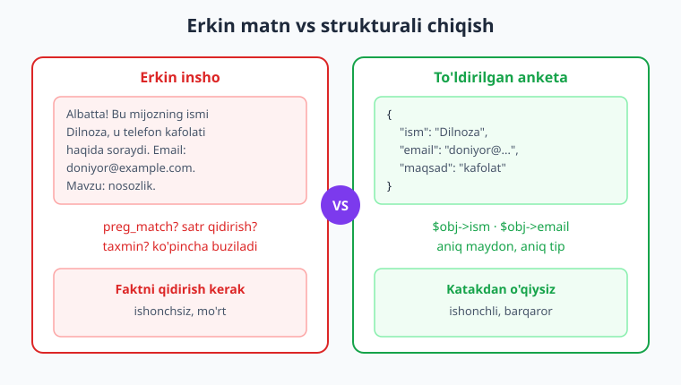
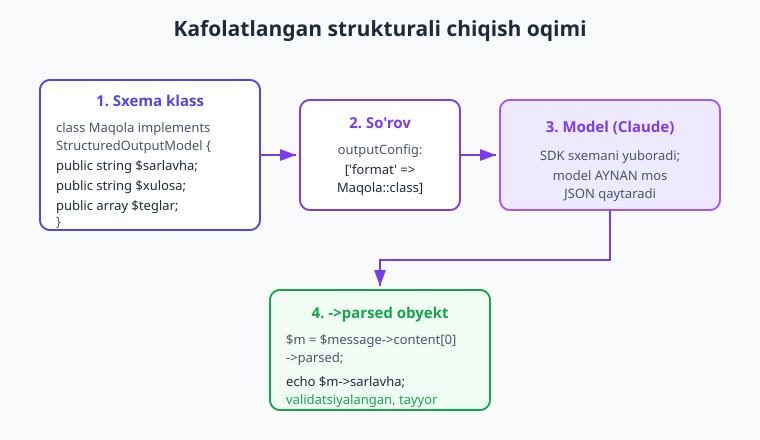
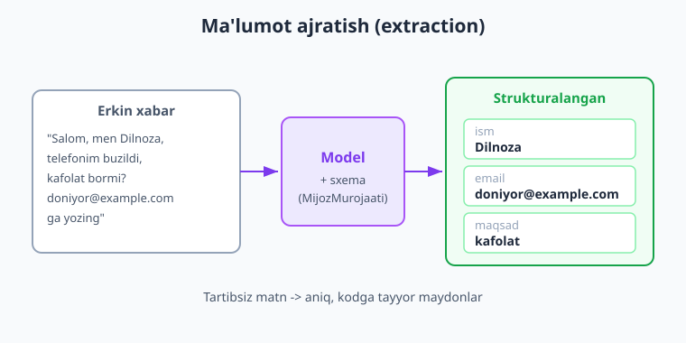

# 06 — Strukturali chiqish (JSON)

[⬅️ Oldingi: 05 — Streaming](./05-streaming.md) · [🏠 Kitob boshi](./README.md) · [Keyingi: 07 — Vision va hujjatlar ➡️](./07-vision-hujjatlar.md)

> **Bu bobda:** modeldan erkin matn emas, balki kodingiz bevosita ishlata oladigan aniq **strukturali ma'lumot** (JSON obyekt, maydonlar bilan) qanday olishni o'rganamiz. Promptda JSON so'rashning kamchiliklarini ko'ramiz, so'ng SDK'ning **kafolatlangan strukturali chiqish** imkoniyatini — `outputConfig: ['format' => Klass::class]` va `StructuredOutputModel` — qo'llaymiz. Real misollar: matndan ma'lumot ajratish (extraction) va matnni kategoriyalarga ajratish (klassifikatsiya).

---

## Muammo: matn chiroyli, lekin kodga struktura kerak

Tasavvur qiling, siz onlayn do'kon uchun yordamchi yozyapsiz. Foydalanuvchi shunday yozdi:

> "Salom, men Dilnoza, telefonim buzildi, kafolat bormi? doniyor@example.com ga javob bering."

Siz modeldan bu xabarni "tushunishini" so'raysiz. U shunday javob beradi:

```text
Albatta! Bu mijozning ismi Dilnoza, u telefon kafolati haqida so'rayapti.
Bog'lanish uchun email: doniyor@example.com. Mavzu — texnik nosozlik.
```

Inson uchun ajoyib javob. Lekin sizning **kodingiz** bu matn bilan nima qiladi? Sizga kerak bo'lgani:

```php
$ism    = 'Dilnoza';
$email  = 'doniyor@example.com';
$maqsad = 'kafolat';
```

Bularni yuqoridagi paragrafdan ajratib olish uchun siz `preg_match`, satrlarni qidirish, "email shu yerda bo'lsa kerak" deb taxmin qilishingiz kerak bo'ladi. Bugun ishlaydi, ertaga model javob shaklini ozgina o'zgartiradi — kodingiz buziladi.

> **Hayotiy o'xshatish.** Erkin matn — bu **erkin insho**. Inshoni o'qib, undan kerakli faktni topish mumkin, lekin bu mashaqqat va xatoga moyil. Strukturali chiqish esa — **to'ldirilgan anketa**: "Ism: ___", "Email: ___", "Maqsad: ___". Anketada har maydon o'z joyida; siz "ism" katagiga qaraysiz va tamom. Inshodan faktni qidirmaysiz — anketadan o'qiysiz.

Dasturchi sifatida bizga deyarli har doim **anketa** kerak: aniq maydonlar, aniq tiplar (satr, son, massiv), oldindan ma'lum tuzilma. Mana shu bobning maqsadi — modelni inshodan emas, anketadan javob beradigan qilish.



---

## Yechim 1 — promptda "JSON qaytar" deb so'rash

Birinchi (va eng sodda) g'oya — modeldan to'g'ridan-to'g'ri JSON so'rash. 3-bobdagi prompt muhandisligini eslang: aniq ko'rsatma bering.

```php
<?php
require __DIR__ . '/vendor/autoload.php';

use Anthropic\Client;

$client = new Client(apiKey: getenv('ANTHROPIC_API_KEY'));

$xabar = "Salom, men Dilnoza, telefonim buzildi, kafolat bormi? doniyor@example.com";

$message = $client->messages->create(
    model: 'claude-opus-4-8',
    maxTokens: 1024,
    system: 'Sen faqat JSON qaytaradigan yordamchisan. '
          . 'Hech qanday qo\'shimcha matn, izoh yoki ```json belgisi yozma. '
          . 'Faqat shu shakldagi JSON: {"ism": "...", "email": "...", "maqsad": "..."}',
    messages: [['role' => 'user', 'content' => $xabar]],
);

$javobMatni = $message->content[0]->text;   // model qaytargan matn (umid qilamizki JSON)

// Endi qo'lda JSON'ga aylantirishga urinamiz:
$malumot = json_decode($javobMatni, true);

if ($malumot === null) {
    echo "Xato: model toza JSON qaytarmadi. Olingan matn:\n" . $javobMatni;
} else {
    echo "Ism: "    . ($malumot['ism']    ?? '—') . "\n";
    echo "Email: "  . ($malumot['email']  ?? '—') . "\n";
    echo "Maqsad: " . ($malumot['maqsad'] ?? '—') . "\n";
}
```

Bu ko'pincha **ishlaydi**. Lekin "ko'pincha" — bu production uchun yetarli emas. Mana muammolar:

- Model ba'zan oldidan tushuntirish qo'shadi: `Albatta! Mana JSON: {...}` — `json_decode` `null` qaytaradi.
- Model JSON'ni \`\`\`json ... \`\`\` blokiga o'rab beradi.
- Bitta qo'shtirnoq tushib qoladi, vergul ortib ketadi — JSON buziladi.
- Kerakli maydonni unutadi yoki qo'shimcha maydon qo'shadi.

> **Hayotiy o'xshatish.** Bu — odamga "iltimos, faqat to'rtburchak ichida yozing" deb aytishga o'xshaydi. Ko'pchilik shunday qiladi, lekin kimdir chetga chiqib yozadi, kimdir izoh qo'shadi. Sizga esa **ramka chetidan chiqishning iloji bo'lmagan** anketa kerak.

!!! warning "Promptda JSON so'rash — ishonchsiz"
    "JSON qaytar" deyish — bu **iltimos**, kafolat emas. Demo va tezkor tajriba uchun yaxshi, lekin real tizimda har 50–100 so'rovdan birida buzuq JSON kelishi mumkin. Bunday kodga har doim `if ($malumot === null)` tekshiruvi va qayta urinish kerak bo'ladi.

---

## Yechim 2 — kafolatlangan strukturali chiqish

Anthropic SDK'da yaxshiroq yo'l bor: **strukturali chiqish** (structured output). Siz modelga **aniq sxema** (qaysi maydonlar, qaysi tiplar) berasiz, va u **aynan shu sxemaga mos** JSON qaytaradi. "Iltimos" emas — **majburlash**.

Buni `create()` ning `outputConfig` parametri orqali qilamiz:

```php
outputConfig: ['format' => Klass::class]
```

Bu yerda `Klass` — siz e'lon qiladigan oddiy PHP klass. SDK uning **xususiyatlaridan avtomatik JSON sxema yasaydi**, modelga yuboradi, javobni qaytib o'sha klassga aylantiradi va **tekshiradi**.

> **Hayotiy o'xshatish.** Bu — modelga bo'sh anketa qog'ozini berib qo'yishga o'xshaydi: "shu kataklarni to'ldir". Model insho yoza olmaydi, faqat kataklarni to'ldiradi. Natijada siz aniq, to'ldirilgan anketa olasiz.

### StructuredOutputModel — modelni klass bilan ta'riflash

Sxema yasash uchun klassga ikkita narsa kerak: `StructuredOutputModel` interfeysi va `StructuredOutputModelTrait` trait'i. Maydonlar — **tipi e'lon qilingan public xususiyatlar** (`public string $...`).

Quyida "maqola" tuzilmasini ta'riflaymiz: sarlavha, xulosa va teglar massivi.

```php
<?php
require __DIR__ . '/vendor/autoload.php';

use Anthropic\Client;
use Anthropic\Lib\Contracts\StructuredOutputModel;
use Anthropic\Lib\Concerns\StructuredOutputModelTrait;

// Bizning kerakli tuzilma — "anketa" shakli:
class Maqola implements StructuredOutputModel
{
    use StructuredOutputModelTrait;   // trait barcha kerakli metodlarni beradi

    public string $sarlavha;          // matn maydoni  -> required string
    public string $xulosa;            // matn maydoni  -> required string

    /** @var string[] */
    public array $teglar;             // satrlar massivi -> required array
}
```

E'tibor bering: biz hech qanday metod yozmadik. `StructuredOutputModelTrait` xususiyatlardagi **tip e'lonlaridan** sxemani avtomatik chiqaradi:

- `public string $sarlavha;` → majburiy matn (string);
- `public int $yosh;` → majburiy butun son (integer);
- `public float $narx;` → majburiy haqiqiy son (number);
- `public bool $faol;` → majburiy mantiqiy (boolean);
- `public array $teglar;` → majburiy massiv;
- `public ?string $izoh = null;` → **ixtiyoriy** matn (`?` belgisi tufayli).

Endi shu klassni so'rovga ulaymiz:

```php
$client = new Client(apiKey: getenv('ANTHROPIC_API_KEY'));

$message = $client->messages->create(
    model: 'claude-opus-4-8',
    maxTokens: 1024,
    messages: [['role' => 'user', 'content' => 'PHP dasturlash tili haqida qisqa maqola yoz']],
    outputConfig: ['format' => Maqola::class],   // <- sxema shu yerda
);
```

### Javobni olish — ->parsed

Strukturali chiqishda javob bloki oddiy `->text` emas, balki **`->parsed`** xususiyatiga ega bo'ladi. U — to'ldirilgan, **validatsiyalangan** obyekt:

```php
$maqola = $message->content[0]->parsed;   // Maqola obyekti (avtomatik yasalgan)

echo $maqola->sarlavha . "\n";            // to'g'ridan-to'g'ri xususiyatdan o'qiymiz
echo $maqola->xulosa   . "\n";

foreach ($maqola->teglar as $teg) {       // massiv ham tayyor
    echo "#$teg ";
}
```

Hech qanday `json_decode`, hech qanday "umid qilamizki JSON" yo'q. `$maqola` — sizning `Maqola` klassingizning haqiqiy obyekti. IDE avtomatik to'ldirishni ham ko'rsatadi, chunki xususiyatlar tipli.



!!! tip "Maslahat — maydon nomlari ma'noli bo'lsin"
    Model maydon **nomlaridan** ham ma'no oladi. `$sarlavha`, `$xulosa`, `$teglar` kabi tushunarli nomlar modelga nima kerakligini aytib turadi. Kerak bo'lsa, har maydonga tavsif ham qo'shasiz (pastda `#[Constrained]` da ko'ramiz) — bu natijani sezilarli yaxshilaydi.

> **Eski usul haqida.** Avval `output_format` degan parametr bor edi — u **eskirgan**. Hozir to'g'ri yo'l — `outputConfig: ['format' => ...]`. Eski qo'llanmalarda `output_format` ko'rsangiz, uni `outputConfig` ga almashtiring.

---

## Amaliy 1 — ma'lumot ajratish (extraction)

Eng keng tarqalgan amaliy holat: **erkin matndan strukturalangan ma'lumot ajratib olish**. Bobning boshidagi mijoz xabarini eslang — endi uni ishonchli hal qilamiz.

Avval "mijoz murojaati" anketasini ta'riflaymiz. Bu safar har maydonga **tavsif** qo'shamiz — bu `#[Constrained]` attribut orqali bo'ladi. Tavsif modelga maydonga nima yozishni aniq aytadi.

```php
<?php
require __DIR__ . '/vendor/autoload.php';

use Anthropic\Client;
use Anthropic\Lib\Contracts\StructuredOutputModel;
use Anthropic\Lib\Concerns\StructuredOutputModelTrait;
use Anthropic\Lib\Attributes\Constrained;

class MijozMurojaati implements StructuredOutputModel
{
    use StructuredOutputModelTrait;

    #[Constrained(description: 'Mijozning ismi. Topilmasa "Noma\'lum" yoz.')]
    public string $ism;

    // ?string + null = ixtiyoriy: email bo'lmasa, model null qoldiradi
    #[Constrained(description: 'Mijozning email manzili', format: 'email')]
    public ?string $email = null;

    #[Constrained(description: 'Mijoz nimani xohlayapti (qisqa: masalan "kafolat", "qaytarish", "savol")')]
    public string $maqsad;
}
```

`#[Constrained]` attributining foydali argumentlari:

- `description:` — maydon tavsifi (modelga ko'rsatma; **eng muhim**, har doim yozing);
- `format:` — satr formati: `email`, `uri`, `date`, `date-time`, `uuid`, `ipv4` va h.k.;
- `itemClass:` — massiv elementlari klassi (ichma-ich obyektlar uchun, pastda ko'ramiz).

Endi xabarni ajratamiz:

```php
$client = new Client(apiKey: getenv('ANTHROPIC_API_KEY'));

$xabar = "Salom, men Dilnoza, telefonim buzildi, kafolat bormi? doniyor@example.com ga yozing";

$message = $client->messages->create(
    model: 'claude-opus-4-8',
    maxTokens: 512,
    system: 'Berilgan mijoz xabaridan ma\'lumotni ajratib ol.',
    messages: [['role' => 'user', 'content' => $xabar]],
    outputConfig: ['format' => MijozMurojaati::class],
);

$murojaat = $message->content[0]->parsed;   // MijozMurojaati obyekti

echo "Ism:    " . $murojaat->ism . "\n";
echo "Email:  " . ($murojaat->email ?? 'berilmagan') . "\n";
echo "Maqsad: " . $murojaat->maqsad . "\n";
```

Mana endi siz tartibsiz xabardan toza, ishonchli ma'lumot oldingiz. Bu ma'lumotni to'g'ridan-to'g'ri ma'lumotlar bazasiga yozish, ariza yaratish yoki to'g'ri bo'limga yo'naltirish mumkin.



!!! example "Misol — bir nechta yozuvni bittada ajratish"
    Bitta xabar emas, **ro'yxat** ajratish kerak bo'lsa, massivli model yasang. Buning uchun massiv elementi uchun alohida klass va `itemClass:` ishlatiladi:
    ```php
    class Vazifa implements StructuredOutputModel
    {
        use StructuredOutputModelTrait;
        public string $matn;
        public string $muddat;
    }

    class VazifaRoyxati implements StructuredOutputModel
    {
        use StructuredOutputModelTrait;

        /** @var Vazifa[] */
        #[Constrained(description: 'Matndan topilgan barcha vazifalar', itemClass: Vazifa::class)]
        public array $vazifalar;
    }
    ```
    SDK ichma-ich obyektlarni avtomatik tanidi va har bir element `Vazifa` obyektiga aylanadi.

---

## Amaliy 2 — klassifikatsiya (kategoriyaga ajratish)

Ikkinchi keng tarqalgan holat — **klassifikatsiya**: matnni oldindan belgilangan kategoriyalardan biriga qo'yish. Masalan, izohni "ijobiy / salbiy / neytral" deb baholash yoki xabarni "spam / oddiy" deb belgilash.

Bu yerda muhim qoida bor: kategoriya qiymati **chegaralangan** bo'lishi kerak — model "juda yaxshi" yoki "o'rtacha ijobiy" kabi o'zicha javob o'ylab topmasin, faqat ruxsat etilgan qiymatlardan birini qaytarsin. Buni eng ishonchli yo'li — tavsifda ruxsat etilgan qiymatlarni **aniq sanab** berish va PHP tomonida tekshirish.

```php
<?php
require __DIR__ . '/vendor/autoload.php';

use Anthropic\Client;
use Anthropic\Lib\Contracts\StructuredOutputModel;
use Anthropic\Lib\Concerns\StructuredOutputModelTrait;
use Anthropic\Lib\Attributes\Constrained;

class IzohTahlili implements StructuredOutputModel
{
    use StructuredOutputModelTrait;

    #[Constrained(description: "Kayfiyat. FAQAT shulardan biri: ijobiy, salbiy, neytral")]
    public string $kayfiyat;

    #[Constrained(description: 'Izoh spammi yoki yo\'q')]
    public bool $spam;

    #[Constrained(description: 'Ishonch darajasi 0 dan 1 gacha', minimum: 0, maximum: 1)]
    public float $ishonch;
}
```

Foydalanishi oddiy:

```php
$client = new Client(apiKey: getenv('ANTHROPIC_API_KEY'));

$izoh = "Mahsulot zo'r chiqdi, lekin yetkazib berish bir hafta kechikdi.";

$message = $client->messages->create(
    model: 'claude-opus-4-8',
    maxTokens: 256,
    system: 'Mijoz izohini tahlil qil.',
    messages: [['role' => 'user', 'content' => $izoh]],
    outputConfig: ['format' => IzohTahlili::class],
);

$tahlil = $message->content[0]->parsed;

echo "Kayfiyat: " . $tahlil->kayfiyat . "\n";   // masalan: neytral
echo "Spam:     " . ($tahlil->spam ? 'ha' : 'yo\'q') . "\n";
echo "Ishonch:  " . $tahlil->ishonch . "\n";
```

Ruxsat etilgan qiymatlarni 100% kafolatlash uchun, javobni o'zingiz ham tekshiring (pastdagi "Validatsiya" bo'limiga qarang).

!!! tip "Maslahat — PHP enum bilan tartiblang"
    Kategoriyalarni kodda tartibga solish uchun PHP `enum` ishlating — bu sxemaga ta'sir qilmaydi, lekin kodingizni xatolardan saqlaydi:
    ```php
    enum Kayfiyat: string
    {
        case Ijobiy  = 'ijobiy';
        case Salbiy  = 'salbiy';
        case Neytral = 'neytral';
    }

    // Model qaytargan satrni xavfsiz enum'ga aylantirish:
    $kayfiyat = Kayfiyat::tryFrom($tahlil->kayfiyat);
    if ($kayfiyat === null) {
        // Model kutilmagan qiymat qaytardi — qayta urinish yoki xato
    }
    ```
    `tryFrom()` qiymat ro'yxatda bo'lmasa `null` qaytaradi — bu sizning oxirgi himoyangiz.

---

## Validatsiya va ishonchlilik

Strukturali chiqish kuchli, lekin uning **chegarasini aniq bilish** kerak. U **JSON to'g'riligini** kafolatlaydi, **ma'no to'g'riligini** emas.

> **Hayotiy o'xshatish.** To'ldirilgan anketani olganingizda, har katak to'ldirilganini va to'g'ri tipda ekanini bilasiz. Lekin "yosh" katagiga kimdir 200 yozsa, anketa shakli to'g'ri — **ma'lumot** noto'g'ri. Strukturali chiqish shaklni kafolatlaydi; mazmunni siz tekshirasiz.

Demak, ikki darajali ishonchlilik kerak:

**1) Shakl (SDK kafolatlaydi).** `->parsed` obyekt sxemaga mos: maydonlar bor, tiplar to'g'ri.

**2) Mazmun (siz tekshirasiz).** Qiymatlar mantiqan to'g'rimi? Kategoriya ruxsat etilgan ro'yxatdami? Son oraliqda yotadimi?

```php
$tahlil = $message->content[0]->parsed;

$ruxsatEtilgan = ['ijobiy', 'salbiy', 'neytral'];

if (!in_array($tahlil->kayfiyat, $ruxsatEtilgan, true)) {
    // Model ro'yxatdan tashqari qiymat qaytardi — qayta urinamiz yoki log yozamiz
    throw new RuntimeException("Kutilmagan kayfiyat: {$tahlil->kayfiyat}");
}

if ($tahlil->ishonch < 0 || $tahlil->ishonch > 1) {
    throw new RuntimeException("Ishonch oralig'idan tashqarida: {$tahlil->ishonch}");
}
```

### SDK son va uzunlik chegaralarini o'zi tekshiradi

Yuqorida `#[Constrained(minimum: 0, maximum: 1)]` yozdik. Bu chegaralarni model API darajasida **majburlamaydi** (buni keyingi bo'limda tushuntiramiz) — SDK ularni sxemadan olib tashlaydi va maydon tavsifiga "ko'rsatma" sifatida qo'shadi (model ularni hisobga olishga harakat qiladi). Lekin bu **kafolat emas**: model 1.2 kabi chegaradan tashqari qiymat qaytarishi mumkin. Shuning uchun chegarali qiymatlarni **o'zingiz tekshiring va kerak bo'lsa "qisib" qo'ying** (clamp):

```php
$tahlil = $message->content[0]->parsed;      // obyekt keladi

// Chegarani O'ZIMIZ tekshiramiz va 0–1 oralig'iga qisamiz
if ($tahlil->ishonch < 0 || $tahlil->ishonch > 1) {
    error_log("Ogohlantirish: ishonch chegaradan tashqari: {$tahlil->ishonch}");
    $tahlil->ishonch = max(0, min(1, $tahlil->ishonch));  // clamp
}
```

!!! danger "Modeldan kelgan hech narsaga ko'r-ko'rona ishonmang"
    Strukturali chiqish — kirish ma'lumotini parse qilishni osonlashtiradi, lekin u baribir **modeldan** keladi. Agar bu ma'lumot ma'lumotlar bazasiga yozilsa, foydalanuvchiga ko'rsatilsa yoki amalda ishlatilsa — har doim qiymatlarni tekshiring. Xavfsizlik bo'yicha to'liqroq [20-bobda](./20-xavfsizlik.md) gaplashamiz.

### Rad etish (refusal) va xato holatlari

Ba'zan model strukturali javob bera olmaydi — masalan, so'rov noaniq bo'lsa yoki model xavfsizlik sababli rad etsa. Bunday holatlarni nazardan qochirmang:

```php
$block = $message->content[0];

// parse paytida xato bo'lsa, ->parsed massiv bo'lib ['error' => '...'] ni o'z ichiga oladi
if (is_array($block->parsed) && isset($block->parsed['error'])) {
    echo "Parse xatosi: " . $block->parsed['error'];
} else {
    $obyekt = $block->parsed;   // hammasi joyida
    // ...
}

// Modelning umumiy holati — stopReason orqali:
if ($message->stopReason === 'max_tokens') {
    echo "Javob to'liq emas — maxTokens ni oshiring";
}
```

Xatolar, qayta urinish va ishonchlilik haqida to'liqroq [08-bobda](./08-xatolar-ishonchlilik.md) o'rganamiz.

---

## Strukturali chiqish cheklovlari

Strukturali chiqish hamma narsani qila olmaydi. Asosiy cheklovlar:

**Ba'zi sxema chegaralari API darajasida qo'llab-quvvatlanmaydi.** `minimum`, `maximum`, `multipleOf`, `minLength`, `maxLength` va `minItems` (1 dan katta qiymatlar) — bularni model API darajasida majburlamaydi. SDK ularni aqlli boshqaradi: sxemadan olib tashlaydi va **maydon tavsifiga matn sifatida qo'shadi** (model ko'rsin va hisobga olsin). Demak yozsangiz bo'ladi — faqat ular "qattiq qonun" emas, "ko'rsatma". Shuning uchun bunday chegaralarni javob kelgandan keyin **o'zingiz tekshiring** (yuqoridagi clamp misoli kabi).

**Rekursiv sxema.** O'z-o'ziga havola qiluvchi tuzilmalar (masalan, daraxt: tugun ichida yana tugunlar ro'yxati) bilan ehtiyot bo'ling — chuqur rekursiyani soddalashtiring.

**Murakkablik narxi.** Juda katta, ko'p qatlamli sxema model uchun og'irroq bo'ladi va xatoga moyilroq. Iloji boricha sxemani **sodda va yassi** tuting — faqat sizga kerak maydonlarni so'rang.

!!! note "Eslatma — sxema bir oz o'zgarishi mumkin"
    SDK klassdan yasaydigan JSON sxema kichik versiyalar orasida yaxshilanishi mumkin. Agar sxema barqarorligi siz uchun kritik bo'lsa, `composer.json` da SDK versiyasini qat'iy belgilab qo'ying (pin qiling).

!!! info "Boshqa provayderda"
    Strukturali chiqish g'oyasi universal: OpenAI'da bu "Structured Outputs" / "JSON mode" deb ataladi va JSON Schema beriladi; Gemini'da "response schema" bor. Tushuncha bir xil — **modelga sxema berib, kafolatlangan JSON olish**. Faqat metod nomlari va sxema berish usuli farq qiladi. [19-bobda](./19-boshqa-provayderlar.md) ko'rib chiqamiz.

---

## To'liq misol — mijoz murojaatlarini avtomatik tahlil qilish

Endi extraction va klassifikatsiyani **birlashtiramiz**: kelgan mijoz xabaridan bir vaqtda ham ma'lumot ajratamiz, ham uni baholaymiz. Bu — real qo'llab-quvvatlash tizimining yuragi.

```php
<?php
require __DIR__ . '/vendor/autoload.php';

use Anthropic\Client;
use Anthropic\Lib\Contracts\StructuredOutputModel;
use Anthropic\Lib\Concerns\StructuredOutputModelTrait;
use Anthropic\Lib\Attributes\Constrained;

// To'liq murojaat kartasi — extraction + klassifikatsiya birga:
class MurojaatKartasi implements StructuredOutputModel
{
    use StructuredOutputModelTrait;

    #[Constrained(description: 'Mijoz ismi. Topilmasa "Noma\'lum".')]
    public string $ism;

    #[Constrained(description: 'Mijoz email manzili', format: 'email')]
    public ?string $email = null;

    #[Constrained(description: 'Murojaat mavzusi (qisqa, 1 jumla)')]
    public string $mavzu;

    #[Constrained(description: "Toifa. FAQAT biri: texnik, sotuv, kafolat, shikoyat, boshqa")]
    public string $toifa;

    #[Constrained(description: "Shoshilinchlik. FAQAT biri: past, orta, yuqori")]
    public string $shoshilinchlik;

    #[Constrained(description: "Mijoz kayfiyati. FAQAT biri: ijobiy, salbiy, neytral")]
    public string $kayfiyat;
}

$client = new Client(apiKey: getenv('ANTHROPIC_API_KEY'));

function murojaatniTahlilQil(Client $client, string $xabar): MurojaatKartasi
{
    $message = $client->messages->create(
        model: 'claude-opus-4-8',
        maxTokens: 512,
        system: 'Sen qo\'llab-quvvatlash tizimisan. Mijoz xabaridan ma\'lumotni '
              . 'ajrat va to\'g\'ri toifalarga ajrat. Faqat ko\'rsatilgan qiymatlardan foydalan.',
        messages: [['role' => 'user', 'content' => $xabar]],
        outputConfig: ['format' => MurojaatKartasi::class],
    );

    $block  = $message->content[0];
    $karta  = $block->parsed;

    // --- Mazmun validatsiyasi (oxirgi himoya) ---
    $toifalar      = ['texnik', 'sotuv', 'kafolat', 'shikoyat', 'boshqa'];
    $darajalar     = ['past', 'orta', 'yuqori'];
    $kayfiyatlar   = ['ijobiy', 'salbiy', 'neytral'];

    if (!in_array($karta->toifa, $toifalar, true)) {
        $karta->toifa = 'boshqa';                 // ehtiyot qiymat
    }
    if (!in_array($karta->shoshilinchlik, $darajalar, true)) {
        $karta->shoshilinchlik = 'orta';
    }
    if (!in_array($karta->kayfiyat, $kayfiyatlar, true)) {
        $karta->kayfiyat = 'neytral';
    }

    return $karta;
}

// --- Foydalanish ---
$xabar = "Assalomu alaykum, men Jasur. 3 kun oldin oldim, telefon yonmayapti! "
       . "Tezda javob kuting, jasur@mail.uz. Bu juda achinarli holat.";

$karta = murojaatniTahlilQil($client, $xabar);

echo "👤 Ism:           {$karta->ism}\n";
echo "✉️  Email:          " . ($karta->email ?? '—') . "\n";
echo "📋 Mavzu:          {$karta->mavzu}\n";
echo "🏷️  Toifa:          {$karta->toifa}\n";
echo "⚡ Shoshilinchlik: {$karta->shoshilinchlik}\n";
echo "😊 Kayfiyat:       {$karta->kayfiyat}\n";

// Endi shu kartani ma'lumotlar bazasiga yozish, to'g'ri bo'limga yo'naltirish,
// "yuqori" shoshilinchlikda darhol ogohlantirish yuborish mumkin.
if ($karta->shoshilinchlik === 'yuqori') {
    echo "\n🔔 Shoshilinch murojaat — operatorga darhol uzatildi!\n";
}
```

Bitta so'rovda biz tartibsiz xabarni — ism, email, mavzu, toifa, shoshilinchlik va kayfiyatga ega **tayyor kartaga** aylantirdik. Bu kartani avtomatik yo'naltirish, hisobot, ustuvorlik berish uchun ishlatish mumkin. Bu — strukturali chiqishning haqiqiy kuchi.

> **Eslatma.** Bu kodni `claude-haiku-4-5` (eng tez/arzon model) bilan ishlatish ham mantiqiy — klassifikatsiya va oddiy extraction uchun kuchli model shart emas. Model tanlash va xarajat optimizatsiyasini [16-bobda](./16-kesh-xarajat.md) ko'ramiz.

---

## Xulosa

- Erkin matnni qo'lda parse qilish **ishonchsiz**: model javob shaklini o'zgartirsa kodingiz buziladi. Kodga **anketa** (aniq maydonlar) kerak, **insho** emas.
- Promptda "JSON qaytar" deb so'rash — **iltimos**, kafolat emas: model qo'shimcha matn, buzuq JSON yoki yetishmaydigan maydon berishi mumkin.
- **Strukturali chiqish** kafolatlangan yo'l: `outputConfig: ['format' => Klass::class]` — model **aynan sxemaga mos** JSON qaytaradi.
- Sxema klassi `StructuredOutputModel` interfeysini amalga oshiradi va `StructuredOutputModelTrait` dan foydalanadi; maydonlar — **tipli public xususiyatlar**, tiplardan sxema avtomatik chiqariladi.
- Javob `->text` emas, **`$message->content[0]->parsed`** — validatsiyalangan obyekt; xususiyatlardan to'g'ridan-to'g'ri o'qiysiz.
- `#[Constrained(description: ..., format: ..., itemClass: ...)]` bilan maydonni tushuntiring; bu natijani sezilarli yaxshilaydi.
- Strukturali chiqish **JSON to'g'riligini** kafolatlaydi, **ma'no to'g'riligini** emas — kategoriya, son oralig'i kabi qiymatlarni baribir o'zingiz tekshiring (`in_array`, enum `tryFrom`, son chegarasini clamp qilish).
- Cheklovlar: `minimum/maximum/minLength/maxLength` API darajasida majburlanmaydi (SDK ularni tavsifga ko'chiradi va klientda tekshiradi); rekursiv/murakkab sxemadan saqlaning — sxemani sodda tuting.

## Amaliy mashqlar

1. **Tarjima karta.** `Tarjima` nomli `StructuredOutputModel` yarating: `asl_til` (string), `maqsad_til` (string), `tarjima` (string), `ishonch` (float, 0–1). Foydalanuvchi gapini boshqa tilga tarjima qilib, strukturali obyekt qaytaring va `->parsed` orqali chop eting.

2. **Mahsulot ajratuvchi (extraction).** Erkin reklama matnidan (`"Yangi iPhone 15, 128GB, qora rang, 12 mln so'm, kafolat 1 yil"`) `Mahsulot` modelini to'ldiring: `nom`, `xotira`, `rang`, `narx` (int), `kafolat_oyi` (int). `#[Constrained]` bilan har maydonni tushuntiring.

3. **Spam klassifikatori.** `EmailTahlili` modeli yarating: `spam` (bool), `toifa` (string — FAQAT "reklama", "shaxsiy", "ish", "spam"), `ishonch` (float). Bir nechta email matnini tahlil qiling. Natijani PHP `enum` (`tryFrom`) bilan tekshirib, ro'yxatdan tashqari qiymatni ushlang.

4. **Enum bilan kayfiyat tahlili.** `Kayfiyat` nomli PHP backed-enum (`Ijobiy`, `Salbiy`, `Neytral`) yarating. Klassifikatsiya natijasini `Kayfiyat::tryFrom()` orqali enum'ga aylantiring; `null` qaytsa, "model kutilmagan qiymat qaytardi" deb xato bering.

5. **Validatsiyali extraction.** 1-mashqdagi `Tarjima` modeliga `ishonch` maydoniga `#[Constrained(minimum: 0, maximum: 1)]` qo'shing. Javob kelgandan keyin `ishonch` 0–1 oralig'idami — o'zingiz tekshiring; agar tashqarida bo'lsa, ogohlantirishni log qiling va `max(0, min(1, ...))` bilan 0–1 oralig'iga "qisib" qo'ying (clamp).

---

[⬅️ Oldingi: 05 — Streaming](./05-streaming.md) · [🏠 Kitob boshi](./README.md) · [Keyingi: 07 — Vision va hujjatlar ➡️](./07-vision-hujjatlar.md)
