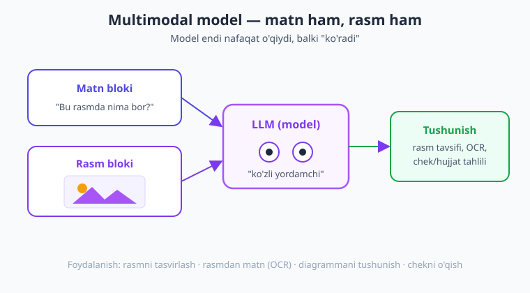
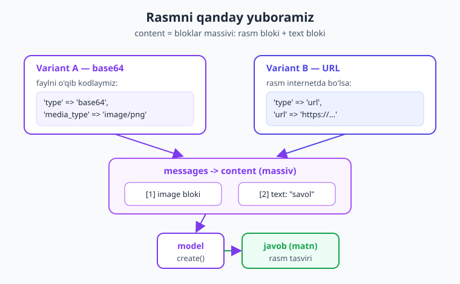
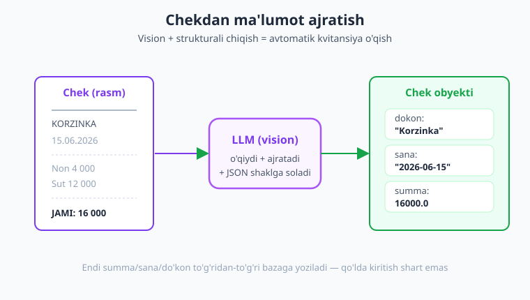

# 07 — Vision va hujjatlar

[⬅️ Oldingi: 06 — Strukturali chiqish](./06-strukturali-chiqish.md) · [🏠 Kitob boshi](./README.md) · [Keyingi: 08 — Xatolar va ishonchlilik ➡️](./08-xatolar-ishonchlilik.md)

> **Bu bobda:** modelga nafaqat matn, balki **rasm** va **PDF hujjat** ham yuborishni o'rganamiz. Rasmni base64 yoki URL orqali jo'natamiz, formatlar va cheklovlarni ko'ramiz. Keyin ikkita amaliy ish quramiz: chek/kvitansiyadan summa-sana-do'konni ajratish (OCR + strukturali chiqish) va mahsulot rasmini tavsiflash. Oxirida PDF hujjatdan savol-javob qilamiz va hammasini birlashtirib **"chek tahlilchisi"** dasturini yozamiz.

---

## Multimodal nima?

Hozirgacha biz modelga faqat **matn** yuborardik: savol yozasiz, model matn bilan javob beradi. Lekin zamonaviy modellar bundan ko'proqni qila oladi — ular **rasmni ham "ko'ra oladi"**.

> **Hayotiy o'xshatish.** Tasavvur qiling, sizning yordamchingiz bor. Avval u faqat siz yozgan xatlarni o'qiy olardi. Endi esa unga rasm ko'rsatsangiz ("mana bu chekka qara, qancha pul ketdi?"), u rasmga qarab javob beradi. Ya'ni yordamchi endi **ko'zli** — quloq (matn) ustiga ko'z (rasm) qo'shildi.

Bir necha turdagi ma'lumotni (matn + rasm + hujjat) bir vaqtda tushuna oladigan model **multimodal** deyiladi (multi = ko'p, modal = ma'lumot turi). Bizning Claude modellarimiz multimodal: bitta so'rovga matn ham, rasm ham, PDF ham qo'sha olasiz.



**Buni qayerda ishlatamiz?** Mana eng keng tarqalgan vazifalar:

- **Rasm tavsifi** — rasmda nima borligini so'z bilan aytib berish (mahsulot, manzara, vaziyat).
- **OCR (rasmdan matn)** — surat ichidagi yozuvni matnga o'girish (chek, varaqa, yo'lyo'riq, vizitka).
- **Chek/hujjat tahlili** — kvitansiyadan summa, sana, do'kon nomini ajratish; shartnomadan muhim shartlarni topish.
- **Diagramma/grafik tushunish** — sxema yoki grafikni o'qib, undagi ma'noni izohlash.
- **Klassifikatsiya** — rasmni kategoriyaga ajratish (bu kiyim? oziq-ovqat? texnika?).

!!! note "Eslatma"
    Multimodal — bu tushunchaning o'zi provayderga bog'liq emas. OpenAI (GPT), Gemini va boshqa yetuk modellar ham rasmni "ko'radi". Biz kodni Claude PHP SDK'da yozamiz, lekin g'oya (rasm bloki + matn bloki yuborish) hamma joyda bir xil.

---

## Rasm yuborish — base64 orqali

Eng asosiy savol: rasmni so'rovga **qanday** qo'shamiz? Eslang, 4-bobda har xabarning `content` maydoni oddiy matn satri edi:

```php
['role' => 'user', 'content' => 'Salom, Claude!']
```

Rasm yuborganda `content` endi **satr emas, balki bloklar massivi** bo'ladi. Har blok — bu bitta "bo'lak": biri rasm, biri matn. Modelga "mana rasm, mana mening savolim" deb beramiz.

Eng ko'p ishlatiladigan usul — rasmni **base64** ga aylantirish. Base64 — bu faylning baytlarini oddiy matn (harf-raqamlar) ko'rinishiga o'tkazadigan kodlash. Nega kerak? Chunki API'ga so'rovni matn (JSON) sifatida yuboramiz, rasm esa "ikkilik" fayl — uni avval matnga aylantirmasak, JSON ichiga sig'maydi.

> **Hayotiy o'xshatish.** Base64 — bu rasmni pochta orqali yuborish uchun **konvertga solish**. Rasmning o'zini "telefon orqali" ayta olmaysiz; lekin uni harflar zanjiriga (konvert) o'rab, matn sifatida jo'natasiz, narigi tomon esa konvertni ochib rasmni qayta yig'adi.

PHP'da bu ikki funksiya bilan bajariladi: `file_get_contents()` faylni o'qiydi, `base64_encode()` uni base64 matnga aylantiradi.

```php
<?php
require __DIR__ . '/vendor/autoload.php';

use Anthropic\Client;

$client = new Client(apiKey: getenv('ANTHROPIC_API_KEY'));

// 1) Faylni o'qib, base64 matnga aylantiramiz
$baytlar = file_get_contents('mushuk.png');   // rasm fayli baytlari
$base64  = base64_encode($baytlar);           // base64 matn

// 2) content — bloklar massivi: rasm bloki + matn bloki
$message = $client->messages->create(
    model: 'claude-opus-4-8',
    maxTokens: 1024,
    messages: [[
        'role' => 'user',
        'content' => [
            [
                'type' => 'image',
                'source' => [
                    'type' => 'base64',
                    'media_type' => 'image/png',  // rasm turi (pastda jadval)
                    'data' => $base64,            // base64 matn
                ],
            ],
            [
                'type' => 'text',
                'text' => 'Bu rasmda nima bor? O\'zbek tilida tasvirlab ber.',
            ],
        ],
    ]],
);

// 3) Javobni o'qiymiz (matn bloki)
echo $message->content[0]->text;
```

Diqqat qiling: `content` ichida **ikki blok** bor — birinchisi `'type' => 'image'` (rasm), ikkinchisi `'type' => 'text'` (savol). Model ikkalasini birga ko'radi: rasmga qarab, savolingizga javob beradi.

`'source'` ichidagi maydonlar:

- `'type' => 'base64'` — rasmni base64 sifatida yuborayotganimizni bildiradi.
- `'media_type'` — rasm formati (`image/png`, `image/jpeg`, ...). Buni xato bermaslik kerak — fayl PNG bo'lsa `image/png` yozing.
- `'data'` — base64 matnning o'zi.



!!! warning "Ehtiyot bo'ling"
    `media_type` rasm formatiga mos bo'lsin. JPEG faylga `image/png` yozsangiz xato chiqishi mumkin. Fayl kengaytmasidan formatni aniqlang yoki PHP'ning `mime_content_type('rasm.png')` funksiyasidan foydalaning.

---

## Rasm yuborish — URL orqali

Agar rasm allaqachon internetda joylashgan bo'lsa (masalan, saytingizdagi mahsulot surati), uni base64 ga aylantirish shart emas — to'g'ridan-to'g'ri **havola (URL)** bera olasiz. Bunda `source` turi `'url'` bo'ladi:

```php
$message = $client->messages->create(
    model: 'claude-opus-4-8',
    maxTokens: 1024,
    messages: [[
        'role' => 'user',
        'content' => [
            [
                'type' => 'image',
                'source' => [
                    'type' => 'url',
                    'url' => 'https://example.com/mahsulot.jpg',
                ],
            ],
            ['type' => 'text', 'text' => 'Bu mahsulotni qisqa tasvirlab ber.'],
        ],
    ]],
);

echo $message->content[0]->text;
```

URL holatida biz faylni o'qimaymiz va kodlamaymiz — model rasmni o'zi havoladan yuklab oladi. Kod ham qisqaroq.

**Qachon qaysi usul?**

| Holat | Tavsiya |
|---|---|
| Rasm sizning serveringizda fayl (yuklangan) | **base64** — faylni o'qib yuborasiz |
| Rasm foydalanuvchi yuborgan (forma orqali yuklangan) | **base64** — vaqtinchalik faylni kodlaysiz |
| Rasm allaqachon ochiq internetda (URL bor) | **URL** — havolani berasiz, qulayroq |
| Rasm maxfiy/ichki tarmoqda (internetdan ko'rinmaydi) | **base64** — model URL'ga yeta olmaydi |

!!! tip "Maslahat"
    URL usulida rasm **ommaviy** (login talab qilmaydigan) havolada bo'lishi kerak — aks holda model uni yuklab ololmaydi. Ishonchingiz komil bo'lmasa, base64 doim ishonchli ishlaydi.

---

## Formatlar va cheklovlar

Model har qanday faylni emas, balki bir nechta keng tarqalgan rasm **formatlarini** qo'llab-quvvatlaydi. `media_type` ga shulardan birini yozasiz:

| Format | `media_type` |
|---|---|
| PNG | `image/png` |
| JPEG | `image/jpeg` |
| GIF | `image/gif` |
| WebP | `image/webp` |

Bilib qo'yishingiz kerak bo'lgan amaliy cheklovlar:

- **Hajm chegarasi bor.** Juda katta rasmni (masalan, o'nlab megabaytli foto) avval kichraytirgan ma'qul. Amalda 5 MB atrofidagi rasm xavfsiz; kattasini siqib (resize) yuboring.
- **Bir nechta rasmni bitta so'rovga qo'shsa bo'ladi.** `content` massiviga bir nechta `image` blok joylashtiring — model hammasini ko'radi va taqqoslay oladi.
- **Har rasm tokenlarni "yeydi".** Rasm qancha katta/aniq bo'lsa, shuncha ko'p token sarflaydi (ya'ni qimmatroq). Kerakmas darajada katta rasm yubormang.

Bir nechta rasm yuborishga misol — ikki mahsulotni taqqoslash:

```php
// Ikki rasmni base64 ga aylantiramiz
$rasm1 = base64_encode(file_get_contents('mahsulot1.jpg'));
$rasm2 = base64_encode(file_get_contents('mahsulot2.jpg'));

$message = $client->messages->create(
    model: 'claude-opus-4-8',
    maxTokens: 1024,
    messages: [[
        'role' => 'user',
        'content' => [
            ['type' => 'text', 'text' => 'Birinchi rasm:'],
            ['type' => 'image', 'source' => ['type' => 'base64', 'media_type' => 'image/jpeg', 'data' => $rasm1]],
            ['type' => 'text', 'text' => 'Ikkinchi rasm:'],
            ['type' => 'image', 'source' => ['type' => 'base64', 'media_type' => 'image/jpeg', 'data' => $rasm2]],
            ['type' => 'text', 'text' => 'Bu ikki mahsulotning farqini ayt.'],
        ],
    ]],
);

echo $message->content[0]->text;
```

Bu yerda matn bloklarini rasmlardan oldin qo'yib, modelga "qaysi rasm qaysi" ekanini tushuntirdik. Bu — yaxshi odat: bir nechta rasmda har biriga nom/izoh bering.

!!! tip "Maslahat"
    Rasmni kichraytirish kerak bo'lsa, PHP'ning [GD](https://www.php.net/manual/en/book.image.php) yoki [Imagick](https://www.php.net/manual/en/book.imagick.php) kengaytmasidan foydalaning (`imagescale()`, `imagejpeg()` sifatni pasaytirib saqlaydi). Bu xarajatni ham, hajmni ham kamaytiradi.

---

## Amaliy 1 — chekdan ma'lumot ajratish (OCR + extraction)

Endi haqiqiy misol. Tasavvur qiling, foydalanuvchilar do'kondan chek (kvitansiya) suratini yuklaydi, biz esa **do'kon nomi, sana va umumiy summani** avtomatik ajratib olib, bazaga yozmoqchimiz. Qo'lda terish o'rniga — model o'qib bersin.

Bu yerda ikki narsani birlashtiramiz: **vision** (rasmni o'qish) + **strukturali chiqish** (6-bobda o'rgangan `outputConfig` bilan JSON obyekt olish). Natijada model bizga aralash matn emas, balki tayyor PHP obyektini qaytaradi.



Avval natija shaklini klass bilan ta'riflaymiz (6-bobdagidek, `StructuredOutputModel`):

```php
<?php
require __DIR__ . '/vendor/autoload.php';

use Anthropic\Client;
use Anthropic\Lib\Contracts\StructuredOutputModel;
use Anthropic\Lib\Concerns\StructuredOutputModelTrait;

// Chekdan ajratiladigan ma'lumot shakli
class Chek implements StructuredOutputModel
{
    use StructuredOutputModelTrait;

    public string $dokon;   // do'kon nomi
    public string $sana;    // YYYY-MM-DD ko'rinishida
    public float $summa;    // umumiy summa (raqam)
}

$client = new Client(apiKey: getenv('ANTHROPIC_API_KEY'));

// Chek rasmini base64 ga aylantiramiz
$chekRasm = base64_encode(file_get_contents('chek.jpg'));

$message = $client->messages->create(
    model: 'claude-opus-4-8',
    maxTokens: 1024,
    messages: [[
        'role' => 'user',
        'content' => [
            ['type' => 'image', 'source' => ['type' => 'base64', 'media_type' => 'image/jpeg', 'data' => $chekRasm]],
            ['type' => 'text', 'text' => 'Bu chek. Do\'kon nomi, sana va umumiy summani ajratib ber. Summani faqat raqam qil.'],
        ],
    ]],
    outputConfig: ['format' => Chek::class],   // strukturali chiqish
);

// Natija — validatsiyalangan Chek obyekti
$chek = $message->content[0]->parsed;

echo "Do'kon: {$chek->dokon}\n";
echo "Sana:   {$chek->sana}\n";
echo "Summa:  {$chek->summa}\n";
```

E'tibor bering: bu xuddi 6-bobdagi strukturali chiqish, faqat `content` ga **rasm bloki** qo'shildi. Model rasmni o'qiydi (OCR), kerakli ma'lumotni topadi va `Chek` shakliga soladi. Endi `$chek->summa` to'g'ridan-to'g'ri bazaga yoziladigan **raqam** — qo'lda tahlil shart emas.

!!! example "Misol — bazaga yozish"
    ```php
    // Ajratilgan ma'lumotni bazaga (PDO) yozamiz
    $stmt = $pdo->prepare(
        'INSERT INTO cheklar (dokon, sana, summa) VALUES (?, ?, ?)'
    );
    $stmt->execute([$chek->dokon, $chek->sana, $chek->summa]);
    ```
    Mana shu — "buxgalter yordamchisi" prototipi: foydalanuvchi chek suratini yuklaydi, dastur summani o'zi bazaga kiritadi.

!!! warning "Ehtiyot bo'ling"
    Model — sehrgar emas. Surat xira, qiyshiq yoki yarmi ko'rinmasa, summani noto'g'ri o'qishi mumkin. Pul bilan ishlaganda **doim natijani tekshirib** ko'rsating (foydalanuvchiga "summa 16 000 to'g'rimi?" deb tasdiqlatish) — buni mashinaga to'liq ishonib qo'ymang.

---

## Amaliy 2 — rasm klassifikatsiya va tavsif

Ikkinchi keng tarqalgan vazifa — mahsulot rasmini **tavsiflash** va **kategoriyaga ajratish**. Masalan, onlayn do'konga sotuvchi rasm yuklaydi, biz unga avtomatik sarlavha, tavsif va kategoriya yaratib beramiz.

Bu ham vision + strukturali chiqishning birlashmasi. Natija shaklini ta'riflaymiz:

```php
<?php
require __DIR__ . '/vendor/autoload.php';

use Anthropic\Client;
use Anthropic\Lib\Contracts\StructuredOutputModel;
use Anthropic\Lib\Concerns\StructuredOutputModelTrait;

class MahsulotTavsifi implements StructuredOutputModel
{
    use StructuredOutputModelTrait;

    public string $sarlavha;     // qisqa nom
    public string $kategoriya;   // masalan: "kiyim", "texnika", "oziq-ovqat"
    public string $tavsif;       // 1-2 jumlali tavsif
    /** @var string[] */
    public array $teglar;        // qidiruv uchun kalit so'zlar
}

$client = new Client(apiKey: getenv('ANTHROPIC_API_KEY'));
$rasm = base64_encode(file_get_contents('mahsulot.jpg'));

$message = $client->messages->create(
    model: 'claude-opus-4-8',
    maxTokens: 1024,
    system: 'Sen onlayn do\'kon uchun mahsulot kartochkalari tayyorlaysan. Qisqa va sotuvchi tilda yoz.',
    messages: [[
        'role' => 'user',
        'content' => [
            ['type' => 'image', 'source' => ['type' => 'base64', 'media_type' => 'image/jpeg', 'data' => $rasm]],
            ['type' => 'text', 'text' => 'Bu mahsulot uchun sarlavha, kategoriya, tavsif va teglar yarat.'],
        ],
    ]],
    outputConfig: ['format' => MahsulotTavsifi::class],
);

$m = $message->content[0]->parsed;

echo "Sarlavha:   {$m->sarlavha}\n";
echo "Kategoriya: {$m->kategoriya}\n";
echo "Tavsif:     {$m->tavsif}\n";
echo "Teglar:     " . implode(', ', $m->teglar) . "\n";
```

Bir rasmdan butun mahsulot kartochkasi tayyor bo'ldi — sarlavha, kategoriya, tavsif va qidiruv teglari. Bu — kontent yaratishni avtomatlashtirishning kuchli misoli.

!!! tip "Maslahat"
    Kategoriyalarni **cheklab** berish ko'pincha foydaliroq. `text` ga "Kategoriya faqat shulardan biri bo'lsin: kiyim, texnika, oziq-ovqat, uy-ro'zg'or" deb yozing — shunda model bazangizga mos kategoriya qaytaradi, kutilmagan qiymat chiqmaydi.

---

## Hujjatlar (PDF) yuborish

Rasmdan tashqari model **PDF hujjatlarni** ham o'qiy oladi. Buning uchun blok turi `'image'` emas, balki `'document'` bo'ladi va `media_type` `'application/pdf'` bo'ladi. Qolgan hammasi rasmnikiga o'xshash.

> **Hayotiy o'xshatish.** Bu — yordamchiga 10 betlik shartnoma berib, "menga muhim shartlarini bir necha gapda ayt" deyish bilan bir xil. Siz hujjatni o'qib o'tirmaysiz — yordamchi o'qiydi va xulosa qiladi.

PDF'ni ham base64 ga aylantirib yuboramiz:

```php
<?php
require __DIR__ . '/vendor/autoload.php';

use Anthropic\Client;

$client = new Client(apiKey: getenv('ANTHROPIC_API_KEY'));

// PDF faylni base64 ga aylantiramiz
$pdf = base64_encode(file_get_contents('shartnoma.pdf'));

$message = $client->messages->create(
    model: 'claude-opus-4-8',
    maxTokens: 1024,
    messages: [[
        'role' => 'user',
        'content' => [
            [
                'type' => 'document',
                'source' => [
                    'type' => 'base64',
                    'media_type' => 'application/pdf',
                    'data' => $pdf,
                ],
            ],
            ['type' => 'text', 'text' => 'Bu shartnomaning asosiy shartlarini 5 ta band qilib qisqacha ayt.'],
        ],
    ]],
);

echo $message->content[0]->text;
```

Endi hujjatdan **savol-javob** qilishingiz mumkin: "to'lov muddati qachon?", "jami necha modda bor?", "qaysi tomon bekor qila oladi?" — model PDF matnidan javobni topadi.

### Files API — bir marta yuklab, qayta-qayta ishlatish

Agar bitta katta PDF'ni **bir necha bor** ishlatadigan bo'lsangiz (har savolda qaytadan yuborish o'rniga), uni serverga bir marta yuklab, keyin faqat uning `file_id`'sini berish qulayroq. Buning uchun **Files API** bor — u `$client->beta->files` orqali ishlaydi.

```php
use Anthropic\Core\FileParam;

// 1) Faylni bir marta yuklaymiz -> file_id olamiz.
//    upload() string yoki FileParam qabul qiladi (to'g'ridan fopen resursi EMAS) —
//    shuning uchun resursni FileParam::fromResource() bilan o'raymiz.
$yuklangan = $client->beta->files->upload(
    file: FileParam::fromResource(fopen('katta-hujjat.pdf', 'r')),
);
$fileId = $yuklangan->id;   // masalan: "file_abc123..."

// 2) Endi document blokida base64 emas, file_id beramiz
$message = $client->messages->create(
    model: 'claude-opus-4-8',
    maxTokens: 1024,
    messages: [[
        'role' => 'user',
        'content' => [
            [
                'type' => 'document',
                'source' => ['type' => 'file', 'file_id' => $fileId],
            ],
            ['type' => 'text', 'text' => 'Bu hujjatdan asosiy xulosani ayt.'],
        ],
    ]],
);

echo $message->content[0]->text;
```

Files API'ning boshqa foydali metodlari:

- `$client->beta->files->list()` — yuklangan fayllar ro'yxati.
- `$client->beta->files->retrieveMetadata($fileId)` — fayl haqida ma'lumot (nomi, hajmi).
- `$client->beta->files->delete($fileId)` — faylni o'chirish.
- `$client->beta->files->download($fileId)` — faylni qaytarib yuklash.

!!! info "Boshqa provayderda"
    PDF/hujjat va fayl yuklash imkoniyatlari provayderlarda har xil. Ba'zilarida hujjatni o'zingiz matnga aylantirib (matn ajratuvchi kutubxona bilan) so'ngra yuborishingiz kerak. Claude'da PDF'ni to'g'ridan-to'g'ri berish qulay — bu kitobda shu usuldan foydalanamiz.

---

## Multimodal + strukturali = hujjatdan JSON

Eng kuchli naqsh — rasmni/hujjatni **strukturalangan ma'lumotga** aylantirish. Yuqorida chekda ko'rdik; bu PDF hujjatga ham aynan ishlaydi. Masalan, hisob-faktura (invoice) PDF'idan asosiy maydonlarni JSON qilib olamiz:

```php
<?php
require __DIR__ . '/vendor/autoload.php';

use Anthropic\Client;
use Anthropic\Lib\Contracts\StructuredOutputModel;
use Anthropic\Lib\Concerns\StructuredOutputModelTrait;

class Hisobfaktura implements StructuredOutputModel
{
    use StructuredOutputModelTrait;

    public string $raqam;        // hisob-faktura raqami
    public string $sana;         // YYYY-MM-DD
    public string $mijoz;        // mijoz nomi
    public float  $jamiSumma;    // jami to'lov
    public string $valyuta;      // masalan: "UZS", "USD"
}

$client = new Client(apiKey: getenv('ANTHROPIC_API_KEY'));
$pdf = base64_encode(file_get_contents('invoice.pdf'));

$message = $client->messages->create(
    model: 'claude-opus-4-8',
    maxTokens: 1024,
    messages: [[
        'role' => 'user',
        'content' => [
            ['type' => 'document', 'source' => ['type' => 'base64', 'media_type' => 'application/pdf', 'data' => $pdf]],
            ['type' => 'text', 'text' => 'Bu hisob-fakturadan raqam, sana, mijoz, jami summa va valyutani ajratib ber.'],
        ],
    ]],
    outputConfig: ['format' => Hisobfaktura::class],
);

$hf = $message->content[0]->parsed;
echo "№{$hf->raqam} · {$hf->mijoz} · {$hf->jamiSumma} {$hf->valyuta}\n";
```

Bu naqsh — **hujjatlarni avtomatik qayta ishlash** (document processing) deb ataladi va biznesda juda qadrlanadi: skanerlangan hujjatlar, kvitansiyalar, anketalar — hammasini odam o'qimasdan bazaga tushadi.

---

## Cheklovlar va maslahatlar

Vision kuchli, lekin uni to'g'ri ishlatish kerak. Mana amaliy qoidalar:

- **Aniqlik 100% emas.** Model rasmni "o'qiydi", lekin xato ham qilishi mumkin — ayniqsa xira, qiyshiq yoki past sifatli suratda. Muhim ma'lumotni (pul, hujjat) doim tekshirib ko'rsating yoki foydalanuvchiga tasdiqlatish bering.
- **Rasm tokenlari pulga teng.** Rasm qancha katta/aniq bo'lsa, shuncha ko'p token sarflaydi. Kerakmas darajada katta surat yubormang — avval kichraytiring (16-bobda xarajat optimizatsiyasini chuqurroq ko'ramiz).
- **Sifatsiz/juda kichik rasm — yomon natija.** Yozuvni o'qish kerak bo'lsa (OCR), surat aniq va to'g'ri tushgan bo'lsin. "Axlat kirsa, axlat chiqadi" qoidasi bu yerda ham amal qiladi.
- **Maxfiy hujjatlarga ehtiyot bo'ling.** Pasport, shaxsiy ma'lumot, tibbiy hujjat kabi maxfiy rasm/PDF'ni yuborishdan oldin xavfsizlik va maxfiylik talablarini o'ylab ko'ring. Bu mavzuni [20-bobda (Xavfsizlik)](./20-xavfsizlik.md) batafsil ko'ramiz — ayniqsa shaxsiy ma'lumot (PII) bilan ishlashda.

!!! danger "Xavfsizlik"
    Foydalanuvchi yuklagan faylga ishonmang: hajmini cheklang, formatini tekshiring (`mime_content_type`), faylni xavfsiz papkaga saqlang va uni darhol kerakli ishni qilib bo'lgach o'chiring. Maxfiy hujjatni keraksiz joyga (loglar, ochiq saqlash) tushib qolishidan saqlaning.

---

## To'liq misol — "Chek tahlilchisi"

Endi hammasini birlashtiramiz. Foydalanuvchi chek faylining yo'lini beradi, dastur uni o'qiydi, tekshiradi, modelga yuboradi va strukturalangan natijani chiqaradi. Bu — bu bobning kichik kapstoni.

```php
<?php
require __DIR__ . '/vendor/autoload.php';

use Anthropic\Client;
use Anthropic\Lib\Contracts\StructuredOutputModel;
use Anthropic\Lib\Concerns\StructuredOutputModelTrait;

// 1) Natija shakli
class ChekNatija implements StructuredOutputModel
{
    use StructuredOutputModelTrait;

    public string $dokon;       // do'kon nomi
    public string $sana;        // YYYY-MM-DD
    public float  $summa;       // umumiy summa
    public string $valyuta;     // masalan: "UZS"
    /** @var string[] */
    public array  $mahsulotlar; // chekdagi mahsulot nomlari
}

/**
 * Chek faylidan ma'lumot ajratuvchi funksiya.
 * Fayl yo'lini oladi, ChekNatija obyektini qaytaradi.
 */
function chekTahlil(Client $client, string $faylYoli): ChekNatija
{
    // Fayl bormi?
    if (!is_file($faylYoli)) {
        throw new RuntimeException("Fayl topilmadi: {$faylYoli}");
    }

    // Formatni aniqlaymiz (image/jpeg, image/png ...)
    $mime = mime_content_type($faylYoli);
    $ruxsat = ['image/jpeg', 'image/png', 'image/webp', 'image/gif'];
    if (!in_array($mime, $ruxsat, true)) {
        throw new RuntimeException("Qo'llab-quvvatlanmaydigan format: {$mime}");
    }

    // base64 ga aylantiramiz
    $base64 = base64_encode(file_get_contents($faylYoli));

    // Modelga yuboramiz (vision + strukturali)
    $message = $client->messages->create(
        model: 'claude-opus-4-8',
        maxTokens: 1024,
        system: 'Sen chek/kvitansiya tahlilchisisan. Faqat chekda ko\'ringan ma\'lumotni ber. '
              . 'Summani raqam qil, sanani YYYY-MM-DD shaklida ber.',
        messages: [[
            'role' => 'user',
            'content' => [
                ['type' => 'image', 'source' => ['type' => 'base64', 'media_type' => $mime, 'data' => $base64]],
                ['type' => 'text', 'text' => 'Ushbu chekdan ma\'lumotni ajratib ber.'],
            ],
        ]],
        outputConfig: ['format' => ChekNatija::class],
    );

    return $message->content[0]->parsed;
}

// 2) Ishlatish
$client = new Client(apiKey: getenv('ANTHROPIC_API_KEY'));

try {
    $chek = chekTahlil($client, 'cheklar/chek-001.jpg');

    echo "🧾 Chek tahlili\n";
    echo "Do'kon:  {$chek->dokon}\n";
    echo "Sana:    {$chek->sana}\n";
    echo "Summa:   {$chek->summa} {$chek->valyuta}\n";
    echo "Mahsulotlar (" . count($chek->mahsulotlar) . " ta):\n";
    foreach ($chek->mahsulotlar as $m) {
        echo "  - {$m}\n";
    }
} catch (\Throwable $e) {
    echo "Xato: " . $e->getMessage() . "\n";
}
```

Bu dastur:

1. Faylni tekshiradi (bor-yo'qligi va formati).
2. Rasmni base64 ga aylantiradi.
3. `system` prompt bilan modelni "chek tahlilchisi" rolida ishlatadi.
4. Strukturalangan `ChekNatija` obyektini qaytaradi.
5. Xato bo'lsa (`try/catch`) chiroyli xabar beradi.

Bu yerda xatolarni faqat ushladik. Keyingi bobda esa **API xatolari, rate limit va qayta urinish (retry)** ni jiddiyroq, ishonchli usulda boshqarishni o'rganamiz — productionga chiqadigan har bir dastur uchun bu shart.

!!! question "Tekshirib ko'ring"
    Yuqoridagi dasturni o'zingizning chek suratingiz bilan ishlatib ko'ring. Model summani to'g'ri o'qidimi? Endi xira yoki qiyshiq suratda sinab ko'ring — natija qanchalik o'zgaradi? Bu sizga "modelning aniqligi rasm sifatiga bog'liq" degan saboqni amalda ko'rsatadi.

---

## Xulosa

- **Multimodal** model nafaqat matnni, balki **rasm va PDF**'ni ham tushunadi — bu "ko'zli yordamchi" kabi.
- Rasm yuborganda `content` satr emas, **bloklar massivi** bo'ladi: `image` bloki + `text` bloki.
- Rasmni ikki yo'l bilan beramiz: **base64** (`file_get_contents` + `base64_encode`) yoki **URL** (rasm ochiq internetda bo'lsa).
- Qo'llab-quvvatlanadigan formatlar: **PNG, JPEG, GIF, WebP**. Hajm chegarasi bor; bir so'rovga bir nechta rasm qo'sha olasiz; har rasm token (pul) sarflaydi.
- **PDF hujjat** uchun `'type' => 'document'`, `media_type => 'application/pdf'`. Katta/qayta ishlatiladigan fayllar uchun **Files API** (`$client->beta->files->upload`) bilan bir marta yuklab `file_id` ishlatish qulay.
- Eng kuchli naqsh — **vision + strukturali chiqish**: rasm/hujjat → validatsiyalangan PHP obyekt (chek → summa-sana-do'kon, hujjat → JSON).
- Aniqlik 100% emas: muhim ma'lumotni (pul, hujjat) tekshirib ko'rsating; sifatli rasm yuboring; maxfiy hujjatlarda xavfsizlikka e'tibor bering ([20-bob](./20-xavfsizlik.md)).

## Amaliy mashqlar

1. **Rasm tavsifi.** Telefoningiz bilan biror narsaning suratini oling va modelga base64 orqali yuborib, "Bu rasmda nima bor? O'zbek tilida tasvirlab ber" deb so'rang. Keyin xuddi shu rasmni URL orqali (biror joyga yuklab) yuborib, natijani solishtiring.

2. **Chekdan extraction.** Do'kon chekining suratini oling va `ChekNatija` klassidan foydalanib do'kon, sana, summa va mahsulotlar ro'yxatini ajratib oling. Natijani PDO bilan SQLite/MySQL bazasiga yozadigan kod qo'shing.

3. **PDF xulosa.** Bironta PDF hujjat (masalan, dars konspekti yoki maqola) oling va modelga `document` bloki bilan yuborib, "asosiy 5 fikrini ayt" deb so'rang. So'ng undan aniq savol bering ("3-bo'limda nima yozilgan?") va javobni tekshiring.

4. **Multimodal + strukturali.** Mahsulot suratidan `MahsulotTavsifi` obyektini olib, kategoriyalarni faqat sizning do'koningizdagi ro'yxatdan (masalan: kiyim, texnika, oziq-ovqat) tanlashga majburlovchi prompt yozing. Model har doim ruxsat etilgan kategoriya qaytarishini tekshiring.

5. **Bir nechta rasm taqqoslash.** Ikki o'xshash mahsulot suratini bitta so'rovda yuborib, ularning farqini topadigan dastur yozing. Har rasmga matn bloki bilan nom bering ("Birinchi rasm:", "Ikkinchi rasm:").

---

[⬅️ Oldingi: 06 — Strukturali chiqish](./06-strukturali-chiqish.md) · [🏠 Kitob boshi](./README.md) · [Keyingi: 08 — Xatolar va ishonchlilik ➡️](./08-xatolar-ishonchlilik.md)
