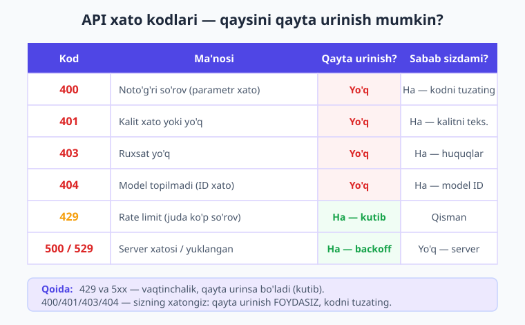
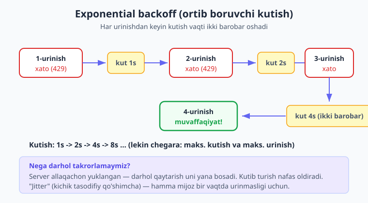
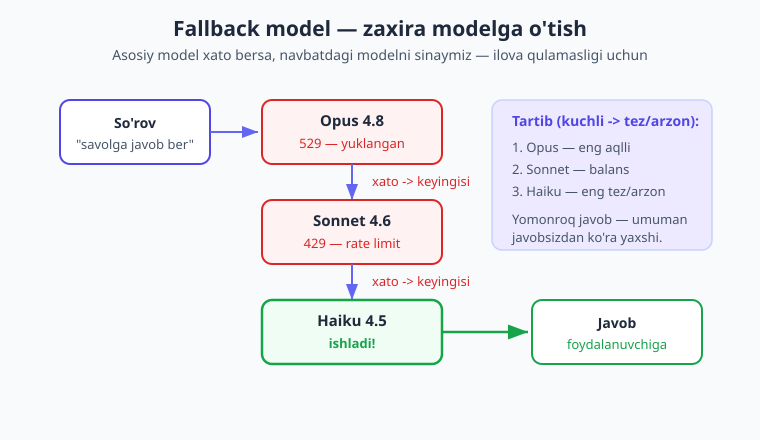

# 08 — Xatolar, qayta urinish va ishonchlilik

[⬅️ Oldingi: 07 — Vision va hujjatlar](./07-vision-hujjatlar.md) · [🏠 Kitob boshi](./README.md) · [Keyingi: 09 — Function calling ➡️](./09-function-calling.md)

> **Bu bobda:** AI bilan ishlovchi ilova internetga, uzoq serverga va cheklovlarga bog'liq — demak baribir xato bo'ladi. Biz xato turlarini (400, 401, 429, 500...) o'rganamiz, `try/catch` bilan ularni ushlaymiz, vaqtinchalik xatolarda **qayta urinish** (retry) va **exponential backoff** qo'llaymiz, timeout va **zaxira model** (fallback) qo'yamiz, va oxirida ishonchli `soraber()` o'ramini yozamiz. Maqsad — bitta xato butun ilovani qulatmasligi.

---

## Nega bu bob muhim?

Tasavvur qiling: sayohatga chiqyapsiz va ob-havo a'lo. Amma tajribali sayohatchi baribir yelkasiga yomg'irpo'sh oladi. Nega? Chunki **havoning buzilishi sizga bog'liq emas** — lekin unga tayyor turish sizga bog'liq.

API bilan ishlash ham xuddi shunday. Sizning kodingiz mukammal bo'lishi mumkin, lekin:

- Internet bir soniyaga uzilib qolishi mumkin;
- Anthropic serveri o'sha lahzada juda band bo'lishi mumkin;
- Siz daqiqasiga ruxsat etilganidan ko'p so'rov yuborib yuborishingiz mumkin;
- So'rov shunchaki juda uzoq cho'zilib ketishi mumkin.

Bularning **hech biri** sizning aybingiz emas. Lekin agar ilovangiz birinchi xatoda "yiqilib tushsa" (oq ekran, 500 xatolik, foydalanuvchiga tushunarsiz xabar), aybdor — sizning kodingiz. Chunki u **yomg'irga tayyor emas edi**.

Bu bob aynan shu tayyorlik haqida. Biz "agar hammasi joyida bo'lsa" degan kodni emas, **"agar biror narsa buzilsa nima qilamiz"** degan kodni yozishni o'rganamiz. Bu — havaskor dasturchi bilan **production** (real foydalanuvchilarga xizmat qiluvchi tizim) dasturchisini ajratib turuvchi eng muhim ko'nikma.

!!! note "Eslatma"
    "Production" — bu kodingiz real odamlarga xizmat qilayotgan holat (test/o'yin emas). Production'da har bir xato real foydalanuvchiga ta'sir qiladi, shuning uchun ishonchlilik (reliability) shu yerda eng muhim.

---

## Xato turlari — qaysi biri "tuzatib bo'ladi", qaysi biri "kutsa bo'ladi"

API xato qaytarganda, u faqat "xato bo'ldi" demaydi — u **HTTP status kodi** (raqam) bilan birga keladi. Bu raqam xatoning *turini* aytadi. Bu juda muhim, chunki har xil xatoga har xil munosabat kerak:

- Ba'zi xatolar — **sizning aybingiz** (noto'g'ri so'rov, xato kalit). Bularni qayta urinish **foydasiz** — kodni tuzatishingiz kerak.
- Ba'zi xatolar — **vaqtinchalik** (server band, juda ko'p so'rov). Bularni biroz **kutib, qayta urinsa** ko'pincha o'tib ketadi.

Mana asosiy xatolar va ularga munosabat:



| Kod | Ma'nosi | Sabab odatda | Qayta urinish? |
|---|---|---|---|
| **400** | Noto'g'ri so'rov (parametr xato, JSON buzuq) | Sizda | Yo'q — kodni tuzating |
| **401** | Autentifikatsiya xato (kalit noto'g'ri yoki yo'q) | Sizda | Yo'q — kalitni tekshiring |
| **403** | Ruxsat yo'q (bu amalga huquqingiz yo'q) | Sizda | Yo'q — huquqlarni tekshiring |
| **404** | Topilmadi (masalan, model ID noto'g'ri) | Sizda | Yo'q — ID/yo'lni tuzating |
| **413** | So'rov juda katta (juda ko'p token/rasm) | Sizda | Yo'q — so'rovni qisqartiring |
| **429** | Rate limit (juda ko'p so'rov yubordingiz) | Qisman | **Ha** — kutib qayta urining |
| **500** | Server ichki xatosi | Serverda | **Ha** — backoff bilan |
| **529** | Server vaqtincha ortiqcha yuklangan | Serverda | **Ha** — backoff bilan |

**Oddiy qoida.** `4xx` (400–404, 413) — odatda *sizning* xatongiz, qayta urinish foyda bermaydi, kodni to'g'rilang. `429` va `5xx` (500, 529) — *vaqtinchalik*, biroz kutib qayta urinish ko'pincha yordam beradi.

!!! tip "Maslahat"
    Xatoni ko'rganda birinchi savol: "Bu *vaqtinchalik*mi, yoki *doimiy*mi?" Vaqtinchalik bo'lsa — kut va qayta urin. Doimiy bo'lsa — qayta urinish vaqtni va pulni behuda sarflaydi, xatoni log'ga yozib, kodni tuzatish kerak.

---

## `try/catch` bilan xatoni ushlash

PHP'da xato yuz berganda dastur "istisno" (exception) "tashlaydi" (throw). Agar siz uni **ushlamasangiz** (catch), dastur to'xtaydi. Claude SDK barcha API xatolarini bitta umumiy ota-klass orqali tashlaydi:

```text
Anthropic\Core\Exceptions\APIException          (eng umumiy ota)
 └─ APIStatusException                            (server status kodi bilan javob berdi)
     ├─ BadRequestException          (400)
     ├─ AuthenticationException      (401)
     ├─ PermissionDeniedException    (403)
     ├─ NotFoundException            (404)
     ├─ RateLimitException           (429)
     └─ InternalServerException      (500, 529 ...)
 ├─ APIConnectionException                        (umuman ulanib bo'lmadi — tarmoq)
 └─ APITimeoutException                           (javob juda uzoq kutildi)
```

Bu daraxt juda foydali: agar siz faqat **bitta** xato turini ushlamoqchi bo'lsangiz (masalan, `RateLimitException`), uni alohida yozasiz. Agar **barcha** API xatolarini bir joyda ushlamoqchi bo'lsangiz — eng umumiy `APIException` ni ushlaysiz.

!!! warning "Ehtiyot bo'ling"
    PHP'da `catch` bloklari **yuqoridan pastga** tekshiriladi. Shuning uchun **aniqroq** (kichik) klasslarni **yuqorida**, eng umumiy `APIException` ni **eng pastda** yozing. Aks holda umumiy blok hammasini "yutib", aniq bloklarga navbat tegmaydi.

Mana to'liq misol — har xato turini alohida ushlab, foydalanuvchiga **tushunarli** xabar beramiz (texnik tafsilotni esa log'ga yozamiz):

```php
<?php
require __DIR__ . '/vendor/autoload.php';

use Anthropic\Client;
use Anthropic\Core\Exceptions\AuthenticationException;
use Anthropic\Core\Exceptions\PermissionDeniedException;
use Anthropic\Core\Exceptions\NotFoundException;
use Anthropic\Core\Exceptions\BadRequestException;
use Anthropic\Core\Exceptions\RateLimitException;
use Anthropic\Core\Exceptions\InternalServerException;
use Anthropic\Core\Exceptions\APIConnectionException;
use Anthropic\Core\Exceptions\APITimeoutException;
use Anthropic\Core\Exceptions\APIException;

// API kalitni MUHIT O'ZGARUVCHISIDAN olamiz — kodga YOZMAYMIZ!
$client = new Client(apiKey: getenv('ANTHROPIC_API_KEY'));

try {
    $message = $client->messages->create(
        model: 'claude-opus-4-8',
        maxTokens: 1024,
        messages: [
            ['role' => 'user', 'content' => 'Salom! Qisqa javob ber.'],
        ],
    );

    echo $message->content[0]->text;

} catch (AuthenticationException $e) {
    // 401 — kalit noto'g'ri yoki yo'q. Qayta urinish foydasiz.
    error_log('Auth xato: ' . $e->getMessage());
    echo "Tizim sozlamasida xatolik bor. Iltimos, keyinroq urinib ko'ring.";

} catch (PermissionDeniedException $e) {
    // 403 — bu amalga ruxsat yo'q.
    error_log('Ruxsat xato: ' . $e->getMessage());
    echo "Bu amal uchun ruxsatingiz yo'q.";

} catch (NotFoundException $e) {
    // 404 — model ID yoki yo'l noto'g'ri.
    error_log('Topilmadi: ' . $e->getMessage());
    echo "So'ralgan resurs topilmadi.";

} catch (BadRequestException $e) {
    // 400 — so'rovda xato (parametr, JSON ...). Kodni tuzating.
    error_log('Noto\'g\'ri so\'rov: ' . $e->getMessage());
    echo "So'rovda xatolik bor.";

} catch (RateLimitException $e) {
    // 429 — juda ko'p so'rov. Biroz kutib qayta urinsa bo'ladi.
    error_log('Rate limit (429): ' . $e->getMessage());
    echo "Hozir tizim band. Iltimos, bir lahzadan keyin urinib ko'ring.";

} catch (InternalServerException $e) {
    // 500 / 529 — server tomonidagi muammo. Qayta urinsa bo'ladi.
    error_log('Server xatosi: ' . $e->getMessage());
    echo "Serverda vaqtinchalik muammo. Iltimos, qaytadan urinib ko'ring.";

} catch (APITimeoutException $e) {
    // Javob juda uzoq kutildi.
    error_log('Timeout: ' . $e->getMessage());
    echo "Javob kelishi juda cho'zildi. Qayta urinib ko'ring.";

} catch (APIConnectionException $e) {
    // Umuman ulanib bo'lmadi (internet/DNS).
    error_log('Ulanish xatosi: ' . $e->getMessage());
    echo "Tarmoqqa ulanib bo'lmadi. Internetni tekshiring.";

} catch (APIException $e) {
    // Boshqa har qanday API xatosi — "tutib qolish to'ri" (safety net).
    error_log('Kutilmagan API xatosi: ' . $e->getMessage());
    echo "Kutilmagan xatolik yuz berdi.";
}
```

E'tibor bering: biz **ikki xil xabar** beramiz. `error_log(...)` — bu **siz uchun** (texnik tafsilot, log faylga). `echo "..."` — bu **foydalanuvchi uchun** (tushunarli, sokin xabar). Foydalanuvchiga hech qachon `$e->getMessage()` ni to'g'ridan-to'g'ri ko'rsatmang — unda ichki tafsilotlar (hatto so'rov tuzilishi) bo'lishi mumkin.

!!! danger "Xavfsizlik"
    Xato xabarlarida ba'zan maxfiy ma'lumot (so'rov tarkibi, ichki yo'llar) bo'ladi. Foydalanuvchiga **hech qachon** to'liq xato matnini ko'rsatmang — faqat sokin, umumiy xabar bering. To'liq tafsilotni esa faqat log'ga yozing (20-bob — xavfsizlik).

### Xatoning status kodini o'qish

`APIStatusException` (va uning bolalari) `status` xususiyatiga ega — bu HTTP raqami. Bitta `catch` da hamma status xatolarini ushlab, raqamga qarab ish ko'rishingiz mumkin:

```php
use Anthropic\Core\Exceptions\APIStatusException;

try {
    $message = $client->messages->create(
        model: 'claude-opus-4-8',
        maxTokens: 256,
        messages: [['role' => 'user', 'content' => 'Salom']],
    );
    echo $message->content[0]->text;
} catch (APIStatusException $e) {
    // $e->status — HTTP kod (int), masalan 429 yoki 500
    $kod = $e->status;
    $vaqtinchalikmi = $kod === 429 || ($kod !== null && $kod >= 500);

    if ($vaqtinchalikmi) {
        echo "Vaqtinchalik muammo (kod {$kod}). Keyinroq urining.";
    } else {
        echo "So'rovda muammo (kod {$kod}). Tekshirib qayta yuboring.";
    }
}
```

---

## Rate limit (429) — nima va nega?

Tasavvur qiling, mashhur kafe bor. Oshpaz bitta — u bir vaqtning o'zida cheksiz buyurtma bajara olmaydi. Shuning uchun kafe "navbat" qo'yadi: "daqiqasiga ko'pi bilan 20 ta buyurtma". 21-buyurtma kelsa, ofitsiant: "biroz kuting" deydi. Bu — **rate limit** (so'rov tezligi chegarasi).

Anthropic API ham xuddi shunday himoyaga ega. Agar siz juda tez-tez so'rov yuborsangiz, server **429** xatosini qaytaradi: "sekinroq, navbat bor". Chegaralar ikki o'lchamda bo'ladi:

- **RPM** (requests per minute) — daqiqasiga so'rovlar soni;
- **TPM** (tokens per minute) — daqiqasiga ishlangan tokenlar soni (kirish + chiqish).

Birortasi to'lsa — 429 olasiz. Bu **yomon** narsa emas — bu tizim o'zini himoya qilyapti. Sizning vazifangiz — to'g'ri munosabat bildirish.

### `retry-after` header — server "qancha kut" deydi

429 javobida ko'pincha `retry-after` nomli **header** (sarlavha) bo'ladi — bu serverning "shuncha soniya kutgin" degan maslahati. Buni hurmat qilish — eng muhim. SDK aslida buni avtomatik o'qiydi (pastda ko'ramiz), lekin o'zingiz ham javobdan olishingiz mumkin:

```php
use Anthropic\Core\Exceptions\RateLimitException;

try {
    $message = $client->messages->create(
        model: 'claude-opus-4-8',
        maxTokens: 1024,
        messages: [['role' => 'user', 'content' => 'Salom']],
    );
} catch (RateLimitException $e) {
    // Javob obyektidan retry-after sarlavhasini o'qiymiz (bo'lsa)
    $kut = 5; // standart: 5 soniya
    if ($e->response !== null && $e->response->hasHeader('retry-after')) {
        $kut = (int) $e->response->getHeaderLine('retry-after');
    }
    echo "Server band. {$kut} soniyadan keyin qayta urinamiz.";
}
```

!!! tip "Maslahat"
    429 ni **oldini olish** undan chiqib ketishdan yaxshiroq. Agar ko'p so'rov yuborayotgan bo'lsangiz: (1) so'rovlarni navbatga qo'ying (queue), (2) bir nechta so'rovni **Batch** orqali yuboring (16-bob — 50% arzon va alohida, kattaroq chegaraga ega), (3) takror so'rovlarni keshlang (pastda).

---

## Qayta urinish (retry) va exponential backoff

Server band (429 yoki 529) ekanini bildi — keyin nima? Eng yomon yo'l — **darhol qayta urinish**. Bu kafedagi navbatda "kuting" deyilganda har soniyada qichqirishga o'xshaydi: oshpazga yana ham yomon, navbat tezlashmaydi.

To'g'ri yo'l — **kutib, ortib boruvchi kechikish bilan** qayta urinish. Buni **exponential backoff** ("ko'rsatkichli chekinish") deyiladi: har urinishdan keyin kutish vaqti **ikki barobar** oshadi: 1s → 2s → 4s → 8s ...



Nega ikki barobar? Chunki agar server jiddiy yuklangan bo'lsa, unga **vaqt kerak**. Birinchi safar 1 soniya yetmasa, ehtimol bu safar uzoqroq kutish kerak. Kutishni asta oshirib, biz serverga "nafas oldiramiz".

Mana to'liq, mustaqil ishlaydigan `retry()` funksiyasi. U: (1) faqat **vaqtinchalik** xatolarni qayta uradi, (2) backoff bilan kutadi, (3) ortiqcha urinmaydi:

```php
<?php
require __DIR__ . '/vendor/autoload.php';

use Anthropic\Core\Exceptions\RateLimitException;
use Anthropic\Core\Exceptions\InternalServerException;
use Anthropic\Core\Exceptions\APIConnectionException;
use Anthropic\Core\Exceptions\APITimeoutException;

/**
 * Berilgan amalni (callable) vaqtinchalik xatoda qayta uradi.
 *
 * @param callable $amal     Bajariladigan funksiya (so'rov yuboruvchi)
 * @param int      $maksUrinish  Eng ko'pi necha marta urinamiz
 * @param float    $boshKechikish  Birinchi kutish (soniyada)
 */
function retry(callable $amal, int $maksUrinish = 4, float $boshKechikish = 1.0): mixed
{
    $urinish = 0;

    while (true) {
        $urinish++;
        try {
            // So'rovni bajarib ko'ramiz
            return $amal();
        } catch (
            RateLimitException
            | InternalServerException
            | APIConnectionException
            | APITimeoutException $e
        ) {
            // Bu xatolar — vaqtinchalik. Qayta urinish mantiqiy.

            if ($urinish >= $maksUrinish) {
                // Urinishlar tugadi — endi xatoni "yuqoriga" uzatamiz
                error_log("retry: {$maksUrinish} urinish ham muvaffaqiyatsiz");
                throw $e;
            }

            // Exponential backoff: 1s, 2s, 4s ... (2 darajasida)
            $kechikish = $boshKechikish * (2 ** ($urinish - 1));

            // "Jitter" — kichik tasodifiy qo'shimcha (0...0.5s).
            // Hamma mijoz bir vaqtda urinmasligi uchun.
            $kechikish += mt_rand(0, 500) / 1000;

            error_log(sprintf(
                'retry: %d-urinish xato (%s). %.2fs kutamiz...',
                $urinish, get_class($e), $kechikish
            ));

            // Kutamiz (microseconds: 1s = 1_000_000 mks)
            usleep((int) ($kechikish * 1_000_000));
            // ...va while sikli yana urinadi
        }
        // DIQQAT: BadRequest/Authentication/NotFound bu yerda USHLANMAYDI —
        // ular doimiy xatolar, qayta urinish foydasiz, chaqiruvchiga uzatiladi.
    }
}
```

Endi uni ishlatish juda oddiy — so'rovni `fn() => ...` ichiga o'rab beramiz:

```php
use Anthropic\Client;

$client = new Client(apiKey: getenv('ANTHROPIC_API_KEY'));

$message = retry(fn() => $client->messages->create(
    model: 'claude-opus-4-8',
    maxTokens: 1024,
    messages: [['role' => 'user', 'content' => 'O\'zbekiston haqida bir jumla.']],
));

echo $message->content[0]->text;
```

Diqqat qiling: `retry()` faqat **vaqtinchalik** istisnolarni ushlaydi (`RateLimitException`, `InternalServerException`, `APIConnectionException`, `APITimeoutException`). `BadRequestException` yoki `AuthenticationException` bu yerda **ushlanmaydi** — ular `retry()` dan "o'tib ketadi" va chaqiruvchiga boradi. Bu — to'g'ri xulq: xato kalitni 4 marta qayta yuborish bema'nilik.

### "Jitter" nima va nega kerak?

Tasavvur qiling, ming dona mijoz bir vaqtda 429 oldi va hammasi aniq **1 soniyadan keyin** qayta urinadi. Natijada — yana mingta so'rov bir lahzada keladi, server yana yiqiladi! Buni **"thundering herd"** (poda hujumi) deyiladi.

Yechim — **jitter**: har bir mijoz kutish vaqtiga ozgina **tasodifiy** qo'shimcha qo'shadi (yuqoridagi `mt_rand(0, 500) / 1000`). Shunda mijozlar bir vaqtda emas, ozroq tarqalib urinadi — server bosim ostida qolmaydi.

### SDK avtomatik qayta uradi!

Yaxshi yangilik: Claude PHP SDK **o'zi ham** vaqtinchalik xatolarda (429 va 5xx) avtomatik qayta uradi — exponential backoff bilan. Standart sozlama: **2 marta** qayta urinish. Buni klient yaratganda yoki har so'rovda o'zgartirishingiz mumkin:

```php
use Anthropic\Client;

// Klient darajasida: barcha so'rovlar uchun 4 martagacha qayta urin
$client = new Client(
    apiKey: getenv('ANTHROPIC_API_KEY'),
    requestOptions: ['maxRetries' => 4],
);
```

Yoki faqat **bitta** so'rov uchun:

```php
$message = $client->messages->create(
    model: 'claude-opus-4-8',
    maxTokens: 1024,
    messages: [['role' => 'user', 'content' => 'Salom']],
    requestOptions: ['maxRetries' => 5],
);
```

!!! question "Tekshirib ko'ring"
    Agar SDK o'zi qayta urinsa, nega bizga `retry()` funksiyasi kerak? Javob: (1) SDK retry **mantiqini tushunish** — eng muhim ko'nikma; (2) o'z `retry()` ga **fallback** va **maxsus logika** qo'sha olasiz (pastda ko'ramiz); (3) boshqa provayder yoki o'zingizning kodingiz uchun ham kerak bo'ladi. Real loyihada ko'pincha SDK retry'iga tayanasiz, lekin uni qanday ishlashini bilish shart.

---

## Timeout — "abadiy kutmaslik"

Tasavvur qiling, do'kon kassasida turibsiz va kassir g'oyib bo'ldi. Necha daqiqa kutasiz? Bir paytdan keyin "boshqa kassaga o'taman" deysiz. **Timeout** — aynan shu: "shuncha vaqtdan ortiq kutmayman".

So'rov ba'zan javobsiz "osilib" qolishi mumkin (server javob bermayapti, tarmoq sekin). Agar timeout bo'lmasa, sizning PHP skriptingiz **abadiy** kutib turadi — bu butun sahifani (yoki butun serverni) bloklaydi. Shuning uchun har doim timeout qo'ying.

SDK standart timeout — **600 soniya** (10 daqiqa). Buni kamaytirishingiz mumkin:

```php
use Anthropic\Client;

// Barcha so'rovlar uchun 30 soniya timeout
$client = new Client(
    apiKey: getenv('ANTHROPIC_API_KEY'),
    requestOptions: ['timeout' => 30.0],
);

// Yoki faqat bitta so'rov uchun:
$message = $client->messages->create(
    model: 'claude-opus-4-8',
    maxTokens: 1024,
    messages: [['role' => 'user', 'content' => 'Qisqa javob ber']],
    requestOptions: ['timeout' => 15.0],
);
```

Timeout o'tib ketsa, SDK `APITimeoutException` tashlaydi — biz uni yuqoridagi `try/catch` da ushlaymiz.

### Streaming bilan timeoutni oldini olish

Uzun javob (masalan, butun maqola yozish) **bir bo'lak** kelsa, server "hammasi tayyor bo'lguncha" hech narsa yubormaydi — bu vaqt timeoutdan oshib ketishi mumkin. Yechim — **streaming** (5-bob): javob **kichik bo'laklarda**, kelishi bilanoq oqib keladi. Demak ulanish doim "tirik", timeout xavfi kamayadi va foydalanuvchi javobni darhol ko'ra boshlaydi.

```php
// Uzun javob uchun streaming — ulanish "osilib" qolmaydi
$stream = $client->messages->createStream(
    model: 'claude-opus-4-8',
    maxTokens: 4096,
    messages: [['role' => 'user', 'content' => 'PHP haqida uzun maqola yoz']],
);

foreach ($stream as $event) {
    if ($event->type === 'content_block_delta'
        && ($event->delta->type ?? '') === 'text_delta') {
        echo $event->delta->text;
        flush(); // har bo'lakni darhol uzatamiz
    }
}
```

!!! tip "Maslahat"
    Qoida: **uzoq cho'ziladigan javoblar uchun streaming ishlating.** Bu ham timeoutni kamaytiradi, ham foydalanuvchiga tezroq javob "his qildiradi" (5-bob).

---

## Fallback model — "zaxira reja"

Tasavvur qiling, do'stingizga qo'ng'iroq qildingiz — ko'tarmadi. Nima qilasiz? Ehtimol boshqa raqamiga, yoki boshqa do'stga qo'ng'iroq qilasiz. Maqsadingizga yetish uchun **zaxira reja** bor.

**Fallback** — aynan shu: agar asosiy model (masalan, Opus) ishlamasa (529 — band, yoki 429 — limit), biz **boshqa** modelga (Sonnet, keyin Haiku) o'tamiz. Mantiq: **yomonroq javob — umuman javob yo'qligidan yaxshi**.



Odatda tartib **kuchli → tez/arzon**:

1. **Opus 4.8** — eng aqlli (lekin band/qimmat bo'lishi mumkin);
2. **Sonnet 4.6** — aql va tezlik balansi;
3. **Haiku 4.5** — eng tez va arzon (zaxira sifatida zo'r).

Mana to'liq misol — modellar ro'yxati bo'ylab yuramiz, birortasi ishlasa to'xtaymiz:

```php
<?php
require __DIR__ . '/vendor/autoload.php';

use Anthropic\Client;
use Anthropic\Core\Exceptions\APIException;

$client = new Client(apiKey: getenv('ANTHROPIC_API_KEY'));

/**
 * Modellar ro'yxatini ketma-ket sinaydi. Biror model ishlasa — javob.
 * Hammasi ishlamasa — oxirgi xatoni tashlaydi.
 *
 * @param string[] $modellar  Sinaladigan model ID'lari (kuchlidan arzonga)
 */
function fallbackSora(Client $client, array $modellar, array $messages): string
{
    $oxirgiXato = null;

    foreach ($modellar as $model) {
        try {
            $message = $client->messages->create(
                model: $model,
                maxTokens: 1024,
                messages: $messages,
            );
            // Ishladi! Qaysi model javob berganini log'ga yozamiz
            error_log("fallback: javob '{$model}' modelidan keldi");
            return $message->content[0]->text;

        } catch (APIException $e) {
            // Bu model ishlamadi — keyingisini sinaymiz
            error_log("fallback: '{$model}' ishlamadi ({$e->getMessage()})");
            $oxirgiXato = $e;
            continue;
        }
    }

    // Hech bir model ishlamadi — oxirgi xatoni yuqoriga uzatamiz
    throw $oxirgiXato ?? new \RuntimeException('Hech qanday model sinanmadi');
}

$javob = fallbackSora(
    $client,
    ['claude-opus-4-8', 'claude-sonnet-4-6', 'claude-haiku-4-5'],
    [['role' => 'user', 'content' => 'O\'zbekiston poytaxti qaysi?']],
);

echo $javob;
```

!!! note "Eslatma"
    Fallback faqat **vaqtinchalik** xatolarda mantiqiy (429, 5xx). Agar so'rovning o'zi xato bo'lsa (400 — masalan, juda uzun), boshqa modelda ham **xuddi shu** xato chiqadi — fallback yordam bermaydi. Shuning uchun pastdagi yakuniy misolda fallbackni faqat vaqtinchalik xatolarga ishlatamiz.

---

## Idempotentlik va keshlash — "bir ishni ikki marta qilmaslik"

**Idempotentlik** (idempotency) — qiyin so'z, oddiy g'oya: **bir amalni ikki marta bajarsang ham, natija bir xil bo'lishi.** Liftda tugmani ikki marta bossangiz, lift ikki marta kelmaydi — bir marta keladi. Bu idempotentlik.

Nega muhim? Tasavvur qiling: so'rov yubordingiz, javob kechikdi, foydalanuvchi sabrsizlanib **tugmani yana bosdi**. Endi siz **ikkita bir xil so'rov** yubordingiz — ikki marta to'ladingiz, ikki marta kutdingiz! Buni oldini olish kerak.

Eng oddiy yechim — **keshlash** (cache): bir xil so'rovga kelgan javobni saqlab qo'yib, takror so'rov kelsa serverga bormay, saqlangan javobni qaytarish.

```php
<?php
/**
 * Sodda fayl-kesh bilan so'rov: bir xil savol -> saqlangan javob.
 * Foydasi: takror so'rov serverga BORMAYDI (tez + tejamkor + 429 kamayadi).
 */
function keshliSora(Client $client, string $savol, int $umrSoniya = 3600): string
{
    // Savolni xeshlab, unikal fayl nomi yasaymiz
    $kalit = hash('sha256', $savol);
    $fayl = sys_get_temp_dir() . "/llm_cache_{$kalit}.txt";

    // Agar kesh bor va eskirmagan bo'lsa — uni qaytaramiz (serverga bormaymiz)
    if (is_file($fayl) && (time() - filemtime($fayl)) < $umrSoniya) {
        error_log('kesh: javob keshdan olindi (so\'rov yuborilmadi)');
        return file_get_contents($fayl);
    }

    // Kesh yo'q — so'rov yuboramiz
    $message = $client->messages->create(
        model: 'claude-opus-4-8',
        maxTokens: 1024,
        messages: [['role' => 'user', 'content' => $savol]],
    );
    $javob = $message->content[0]->text;

    // Javobni keshga yozamiz (keyingi takror so'rovga)
    file_put_contents($fayl, $javob);
    return $javob;
}
```

!!! tip "Maslahat"
    Bu — eng sodda kesh (fayl asosida). Real loyihada **Redis** yoki **Laravel Cache** ishlatasiz (16-bob — kesh va xarajat batafsil). Yana: katta o'zgarmas kontekstni (masalan, uzun hujjat) **prompt caching** bilan keshlash mumkin — bu Anthropic tomonida bo'ladi va ~90% arzonroq (16-bob).

---

## Hallyutsinatsiya — "ishonch bilan aytilgan xato"

Hozirgacha biz **tarmoq/server** xatolari haqida gaplashdik. Endi — boshqacha, lekin xavfliroq "xato": **hallyutsinatsiya** (hallucination).

Bu shunday holat: model **mutlaqo ishonch bilan** noto'g'ri narsa aytadi. Sana, ism, raqam, hatto mavjud bo'lmagan funksiya yoki manba "to'qib" chiqaradi. Eng yomoni — u xuddi haqiqatni aytayotgandek **ishonarli** ko'rinadi.

Nega bu bo'ladi? Chunki LLM "haqiqatni biladigan" tizim emas — u **eng ehtimolli keyingi so'zni** taxmin qiluvchi tizim (1-bob). Ko'pincha eng ehtimolli javob — to'g'ri. Lekin ba'zan — yo'q.

Bu **HTTP xato emas** — kod 200 (muvaffaqiyat) qaytaradi! Shuning uchun `try/catch` buni **ushlamaydi**. Himoya — boshqacha:

- **Tekshiring (verify).** Muhim faktlarni (raqam, kod, qonun) ko'r-ko'rona ishonmang — boshqa manbadan tasdiqlang.
- **Manba talab qiling.** Promptda "javobingni faqat berilgan hujjatga asosla, agar javob hujjatda yo'q bo'lsa 'bilmayman' deb ayt" deng. Bu — **RAG** ning asosiy g'oyasi (15-bob).
- **Strukturali chiqish ishlating.** Aniq JSON sxema (6-bob) modelni "to'qib" chiqarishdan ozroq tiyadi.
- **Past xavf ssenariylarini ajrating.** Tibbiyot, huquq, moliya kabi sohalarda javobni **odam** tasdiqlasin.
- **Foydalanuvchini ogohlantiring.** "Bu AI javobi, muhim qarorda mutaxassisga murojaat qiling" degan eslatma qo'ying.

!!! warning "Ehtiyot bo'ling"
    Hech qachon model javobini "100% to'g'ri" deb qabul qilmang — ayniqsa raqam, sana, kod, yuridik/tibbiy maslahatda. Model "ishonchli ovoz" bilan gapiradi, lekin u **haqiqatni bilmaydi**, faqat **so'z taxmin qiladi**. Tekshirish — sizning vazifangiz.

!!! example "Misol — modelni 'bilmayman' deyishga o'rgatish"
    ```php
    $message = $client->messages->create(
        model: 'claude-opus-4-8',
        maxTokens: 512,
        system: "Sen faqat berilgan ma'lumotga asoslanasan. "
              . "Agar javob ma'lumotda bo'lmasa, 'Bu haqda ma'lumotim yo'q' deb ayt. "
              . "Hech qachon faktni to'qib chiqarma.",
        messages: [[
            'role' => 'user',
            'content' => "Ma'lumot: Bizning do'kon 9:00-18:00 ishlaydi.\n\n"
                       . "Savol: Do'kon yakshanba kuni ishlaydimi?",
        ]],
    );
    echo $message->content[0]->text;
    // Model "ma'lumotim yo'q" deydi, chunki yakshanba haqida ma'lumot berilmagan
    ```

---

## Production ishonchlilik checklisti

Ilovangizni real foydalanuvchilarga chiqarishdan oldin, shu ro'yxatni belgilab chiqing:

- [ ] **`try/catch`** — har bir API chaqiruvi himoyalangan (foydalanuvchiga sokin xabar, log'ga tafsilot).
- [ ] **Retry + backoff** — vaqtinchalik xatolarda (429, 5xx) qayta urinish (SDK retry yoki o'z funksiya).
- [ ] **Timeout** — har so'rovga oqilona timeout (so'rov "abadiy osilib" qolmasin).
- [ ] **Fallback** — asosiy model ishlamasa, zaxira modelga o'tish.
- [ ] **Streaming** — uzun javoblar uchun (timeout va kutishni kamaytirish).
- [ ] **Keshlash** — takror so'rovlarni serverga yubormaslik (tez + tejamkor).
- [ ] **Logging** — har xato log'ga yoziladi (qaysi model, qanday xato, qachon).
- [ ] **Hallyutsinatsiyaga qarshi** — muhim faktlar tekshiriladi, model "bilmayman" deyishga o'rgatilgan.
- [ ] **Monitoring** — xato darajasi, kechikish, xarajat kuzatiladi (22-bob).
- [ ] **API kaliti xavfsiz** — kodda emas, `getenv()` orqali (20-bob).

!!! info "22-bobga ishora"
    **Logging** (xatolarni yozish) va **monitoring** (real vaqtda kuzatish — xato darajasi oshsa ogohlantirish) production'ning yuragi. Biz 22-bobda buni batafsil — log formatlari, Sentry/dashboard, alert (ogohlantirish) bilan ko'ramiz. Hozircha eng kamida `error_log()` ishlatib turing.

---

## To'liq misol: ishonchli `soraber()` o'rami

Endi hamma narsani bitta **ishonchli funksiyaga** jamlaymiz. Bu `soraber()` o'rami quyidagilarni birlashtiradi:

1. **Retry + backoff** — vaqtinchalik xatolarda qayta urinish (jitter bilan);
2. **Fallback** — modellar ro'yxati bo'ylab o'tish;
3. **Xato boshqaruvi** — doimiy xatolarni darhol uzatish, foydalanuvchiga sokin xabar.

```php
<?php
require __DIR__ . '/vendor/autoload.php';

use Anthropic\Client;
use Anthropic\Core\Exceptions\RateLimitException;
use Anthropic\Core\Exceptions\InternalServerException;
use Anthropic\Core\Exceptions\APIConnectionException;
use Anthropic\Core\Exceptions\APITimeoutException;
use Anthropic\Core\Exceptions\APIException;

/**
 * Ishonchli so'rov: retry + backoff + fallback model.
 * Vaqtinchalik xatolarda kutib qayta uradi; bo'lmasa keyingi modelga o'tadi.
 *
 * @param string[] $modellar      Modellar (kuchlidan arzonga)
 * @param array    $messages      Suhbat xabarlari
 * @param int      $maksUrinish   Har model uchun maks. urinish
 * @return string                 Model javobi (matn)
 *
 * @throws APIException  Hamma model va urinish tugasa
 */
function soraber(
    Client $client,
    array $modellar,
    array $messages,
    int $maksUrinish = 3,
    int $maxTokens = 1024,
): string {
    $oxirgiXato = null;

    // 1) Har bir modelni navbatma-navbat sinaymiz (fallback)
    foreach ($modellar as $model) {
        $urinish = 0;

        // 2) Har model uchun retry + backoff
        while ($urinish < $maksUrinish) {
            $urinish++;
            try {
                $message = $client->messages->create(
                    model: $model,
                    maxTokens: $maxTokens,
                    messages: $messages,
                );

                // Muvaffaqiyat — javobni qaytaramiz
                error_log("soraber: javob '{$model}' modelidan ({$urinish}-urinish)");
                return $message->content[0]->text;

            } catch (
                RateLimitException
                | InternalServerException
                | APIConnectionException
                | APITimeoutException $e
            ) {
                // Vaqtinchalik xato — shu modelda qayta urinamiz
                $oxirgiXato = $e;

                if ($urinish < $maksUrinish) {
                    // Exponential backoff + jitter
                    $kechikish = (2 ** ($urinish - 1)) + (mt_rand(0, 500) / 1000);
                    error_log(sprintf(
                        'soraber: %s/%d-urinish xato (%s), %.2fs kutamiz',
                        $model, $urinish, get_class($e), $kechikish
                    ));
                    usleep((int) ($kechikish * 1_000_000));
                    // ...while yana urinadi
                } else {
                    // Bu modelda urinishlar tugadi — keyingi modelga o'tamiz
                    error_log("soraber: '{$model}' barcha urinishlari tugadi, fallback");
                    break; // ichki while dan chiqib, keyingi modelga
                }

            } catch (APIException $e) {
                // Doimiy xato (400, 401, 403, 404 ...) — qayta urinish/fallback FOYDASIZ.
                // Boshqa modelda ham xuddi shu xato chiqadi. Darhol uzatamiz.
                error_log("soraber: doimiy xato '{$model}' ({$e->getMessage()})");
                throw $e;
            }
        }
        // ichki while tugadi (urinishlar bitdi) -> foreach keyingi modelga o'tadi
    }

    // Hamma model va urinish tugadi
    throw $oxirgiXato
        ?? new \RuntimeException('soraber: hech qanday model sinanmadi');
}
```

Ishlatish — sodda va xavfsiz. Yuqori darajada faqat **bitta** `try/catch` qoldiramiz (chunki ichki ishonchlilik allaqachon `soraber()` da):

```php
$client = new Client(apiKey: getenv('ANTHROPIC_API_KEY'));

try {
    $javob = soraber(
        $client,
        modellar: ['claude-opus-4-8', 'claude-sonnet-4-6', 'claude-haiku-4-5'],
        messages: [['role' => 'user', 'content' => 'O\'zbek tilida bir maqol ayt.']],
    );
    echo $javob;

} catch (APIException $e) {
    // Bu yerga faqat HAMMA urinish/model tugaganda yoki doimiy xatoda kelamiz
    error_log('soraber yakuniy xato: ' . $e->getMessage());
    echo "Kechirasiz, hozir javob bera olmadik. Iltimos, keyinroq urining.";
}
```

Mana shu — **production darajasidagi** so'rov. Bitta 429, bitta band server yoki bitta modelning ishlamasligi endi sizning ilovangizni qulata olmaydi. U "yomg'irga tayyor".

!!! note "Eslatma"
    Real loyihada bu `soraber()` ni klassga (masalan, `LlmService`) aylantirasiz, monitoring (22-bob) va keshlash (16-bob) qo'shasiz. Laravel'da esa buni service/provider sifatida ro'yxatdan o'tkazasiz (18-bob). Bu yerda esa asosiy **mantiq** — eng muhimi shu.

---

## Xulosa

- **Production'da xato muqarrar** — tarmoq, rate limit, band server sizga bog'liq emas, lekin ularga tayyorlik sizga bog'liq. Maqsad: bitta xato butun ilovani qulatmasin.
- **Xato turini ajrating.** `4xx` (400/401/403/404) — odatda sizning xatongiz, qayta urinish foydasiz, kodni tuzating. `429` va `5xx` (500/529) — vaqtinchalik, kutib qayta urinsa bo'ladi.
- **`try/catch`** — har API chaqiruvini himoyalang. Aniq klasslarni (`RateLimitException`...) yuqorida, umumiy `APIException` ni pastda ushlang. Foydalanuvchiga sokin xabar, log'ga tafsilot.
- **Retry + exponential backoff** — vaqtinchalik xatolarda kutish vaqtini ikki barobar oshirib qayta urining; **jitter** qo'shib "thundering herd"ni oldini oling. SDK ham buni avtomatik qiladi (`maxRetries`).
- **Timeout** qo'ying — so'rov "abadiy osilib" qolmasin. Uzun javoblar uchun **streaming** ishlatib timeout va kutishni kamaytiring.
- **Fallback model** — asosiy model ishlamasa, zaxira (Opus → Sonnet → Haiku) ga o'ting: yomonroq javob umuman javobsizdan yaxshi.
- **Keshlash va idempotentlik** — takror so'rovni serverga yubormang (tez + tejamkor + 429 kamayadi).
- **Hallyutsinatsiya** — model "ishonch bilan xato" aytishi mumkin (HTTP xato emas!). Faktlarni tekshiring, manba talab qiling, modelni "bilmayman" deyishga o'rgating, foydalanuvchini ogohlantiring.

---

## Amaliy mashqlar

1. **Xato xaritasi.** 400, 401, 403, 404, 429, 500, 529 kodlari uchun bitta jadval tuzing: har biriga (a) qisqa o'zbekcha tushuntirish, (b) "qayta urinsa bo'ladimi?" (ha/yo'q), (c) foydalanuvchiga ko'rsatiladigan sokin xabar yozing.

2. **`try/catch` to'liq.** Bitta `messages->create()` so'rovini yozing va `AuthenticationException`, `RateLimitException`, `InternalServerException`, `APIConnectionException` hamda umumiy `APIException` ni alohida ushlang. Har bir blokda `error_log()` ga texnik tafsilot, `echo` ga sokin xabar yozing. Bloklar tartibi to'g'rimi (aniqdan umumiyga) — tekshiring.

3. **O'z `retry()` funksiyangiz.** Yuqoridagi `retry()` ni qayta yozing, lekin: (a) kechikishni 1s → 2s → 4s qiling, (b) jitter qo'shing, (c) faqat vaqtinchalik xatolarni ushlang, (d) `BadRequestException` ushlanmasligini va darhol "o'tib ketishini" tekshiring (qo'lda sun'iy istisno tashlab sinab ko'ring).

4. **Fallback bilan timeout.** `fallbackSora()` ni shunday o'zgartiringki, har bir so'rovga `requestOptions: ['timeout' => 20.0]` qo'shilsin. Keyin tushuntiring: agar Opus 20 soniyada javob bermasa, nima bo'ladi va qaysi model keyingi sinaladi?

5. **Hallyutsinatsiyaga qarshi prompt.** System prompt yozing: model faqat siz bergan qisqa "kompaniya ma'lumoti"ga asoslansin, ma'lumotda bo'lmagan savolga "Bu haqda ma'lumotim yo'q" desin. Keyin ataylab ma'lumotda bo'lmagan savol bering va model to'qib chiqaradimi yoki "bilmayman" deydimi — kuzating.

---

[⬅️ Oldingi: 07 — Vision va hujjatlar](./07-vision-hujjatlar.md) · [🏠 Kitob boshi](./README.md) · [Keyingi: 09 — Function calling ➡️](./09-function-calling.md)
