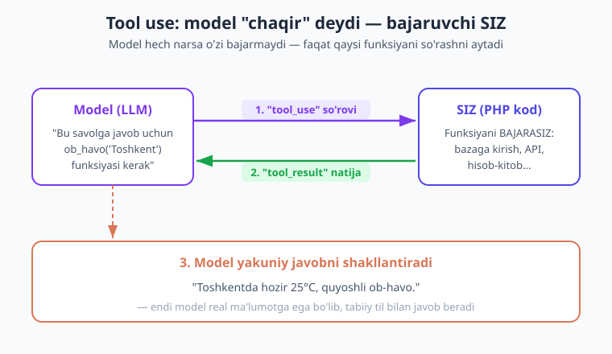
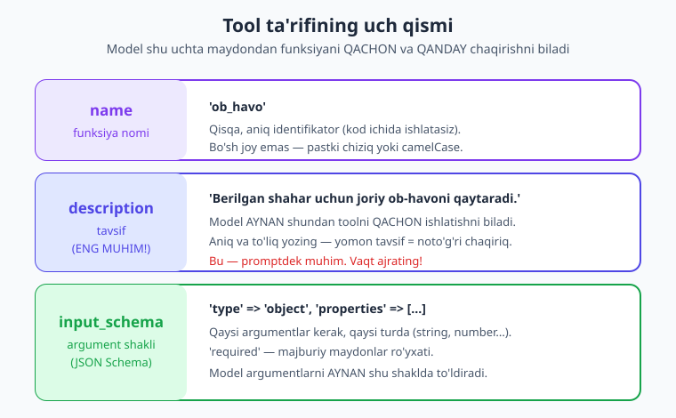
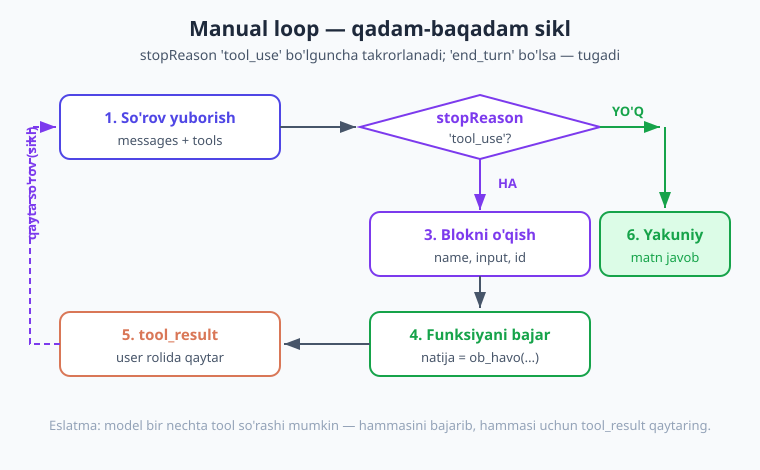

# 09 — Function calling (tool use) asoslari

[⬅️ Oldingi: 08 — Xatolar va ishonchlilik](./08-xatolar-ishonchlilik.md) · [🏠 Kitob boshi](./README.md) · [Keyingi: 10 — Tool runner ➡️](./10-tool-runner.md)

> **Bu bobda:** Hozirgacha model faqat **matn** yozardi — u bazadan ma'lumot ololmasdi, ob-havoni bilmasdi, aniq hisob qila olmasdi. Endi modelga **asboblar (tool)** beramiz: u "shu funksiyani shu argument bilan chaqir" deydi, **siz** funksiyani bajarib natijani qaytarasiz, model esa natija asosida tabiiy javob yozadi. Biz tool ta'rifini (`name`, `description`, `input_schema`), `tool_use` blokini o'qishni, `tool_result` qaytarishni va to'liq **manual loop**ni o'rganamiz. Oxirida "kalkulyator + ob-havo" yordamchisini yozamiz.

---

## Muammo: model gapira oladi, lekin harakat qila olmaydi

Tasavvur qiling, sizda juda bilimdon, chiroyli gapiradigan yordamchi bor. U she'r yozadi, kodni tushuntiradi, fikr bildiradi. Lekin uni xonaga qamab qo'yganmiz: **deraza yo'q, telefon yo'q, kalkulyator yo'q**. Siz undan so'raysiz:

- "Bugun Toshkentda havo qancha?" — u **bilmaydi** (oynaga qarolmaydi).
- "234 × 871 nechiga teng?" — u **taxmin qiladi** (qog'oz-qalami yo'q, ba'zan xato).
- "Mening bazamdagi 5-foydalanuvchining ismi nima?" — u **bilolmaydi** (bazaga kirolmaydi).

LLM ham xuddi shunday. U **faqat matn generatsiya qiladi** (1-bob): kiruvchi matnga eng ehtimolli davom yozadi. U:

- internetga chiqolmaydi (joriy ob-havo, valyuta kursi, yangiliklar — yo'q);
- sizning ma'lumotlar bazangizni ko'rolmaydi;
- aniq hisob-kitobni kafolatlamaydi (katta sonlarni "taxmin" qiladi);
- fayl yozolmaydi, xat yubora olmaydi, hech qanday **real harakat** qila olmaydi.

Yechim oddiy: **yordamchiga asboblar bering.** Telefon bering — qo'ng'iroq qila oladi. Kalkulyator bering — aniq hisoblaydi. Internet bering — ob-havoni biladi. Dasturlashda bu "asbob" — bu **sizning PHP funksiyangiz**. Modelga "mana bu funksiyalar bor, kerak bo'lsa so'ra" deymiz.

Bu g'oya **function calling** yoki **tool use** (asbob ishlatish) deyiladi. Bu — AI ilovalarini "suhbatdosh"dan "**ish bajaruvchi**"ga aylantiruvchi eng muhim qadamlardan biri.

!!! note "Eslatma — atamalar"
    **Tool** (asbob) = modelga taqdim etilgan funksiya. **Function calling** = "funksiya chaqirish" — xuddi shu narsaning boshqa nomi. **Tool use** = Anthropic ishlatadigan atama. Uchalasi bir narsa: model funksiya chaqirishni *so'raydi*, siz bajarasiz.

---

## Asosiy g'oya: model so'raydi, SIZ bajarasiz

Eng muhim tushuncha — buni boshidan to'g'ri tushunib oling: **model funksiyani O'ZI bajarmaydi.** U faqat "men shu funksiyani shu argument bilan chaqirmoqchiman" deb **so'raydi**. Funksiyani haqiqatda ishga tushiruvchi — **siz** (sizning PHP kodingiz).

Nega shunday? Chunki model — bu uzoq serverdagi matn modeli. U sizning bazangizga, sizning kompyuteringizga, sizning hisobingizga kira olmaydi (va kirmasligi ham **kerak** — xavfsizlik). Shuning uchun mehnat taqsimlanadi:

- **Model**: "qaysi funksiya, qanday argument bilan kerak" — buni hal qiladi (u aqlli).
- **Siz**: funksiyani bajarasiz va natijani qaytarasiz (sizda kirish bor).



Jarayon uch qadamdan iborat:

1. **Model so'raydi.** Foydalanuvchi "Toshkentda ob-havo qanday?" deydi. Model o'zicha javob bera olmasligini biladi va: "`ob_havo` funksiyasini `{shahar: 'Toshkent'}` bilan chaqir" deb javob qaytaradi. Bu — `tool_use` (asbob ishlatish) so'rovi.
2. **Siz bajarasiz.** Sizning kodingiz bu so'rovni o'qiydi, `obHavoOl('Toshkent')` funksiyangizni chaqiradi (u haqiqiy ob-havo API'siga boradi yoki bazadan oladi). Natija: "25°C, quyoshli". Buni **`tool_result`** sifatida modelga qaytarasiz.
3. **Model javobni shakllantiradi.** Endi modelda real ma'lumot bor. U buni tabiiy o'zbek tilida o'raydi: "Toshkentda hozir 25°C, ob-havo quyoshli."

> **Hayotiy o'xshatish.** Direktor (model) kotibga (siz) aytadi: "Buxgalteriyaga qo'ng'iroq qilib, oylik hisobotni so'rab ber." Direktor o'zi qo'ng'iroq qilmaydi — u faqat **buyruq beradi**. Kotib qo'ng'iroq qiladi, javobni oladi va direktorga qaytaradi. Direktor esa javob asosida qaror chiqaradi. Model — direktor, siz — kotib.

!!! warning "Eng ko'p qilinadigan xato"
    Yangi boshlovchilar "model funksiyamni o'zi ishga tushiradi" deb o'ylashadi. **Yo'q!** Model faqat *nomini va argumentini* aytadi. Agar siz funksiyani chaqirmasangiz, hech narsa bajarilmaydi. Butun "loop" (sikl) — sizning kodingiz mas'uliyatida.

---

## Tool ta'rifi: model funksiyangizni qanday "tushunadi"?

Modelga funksiya berish uchun uni **tasvirlab** berishingiz kerak — model sizning PHP kodingizni ko'rmaydi, faqat **ta'rifini** ko'radi. Ta'rif uch qismdan iborat:



1. **`name`** — funksiya nomi (qisqa identifikator, masalan `'ob_havo'`). Buni keyin kodingizda "qaysi funksiya so'raldi" deb taqqoslaysiz. Bo'sh joysiz: pastki chiziq yoki camelCase.
2. **`description`** — funksiya nima qilishini tushuntiruvchi matn. **Bu eng muhim qism!** Model AYNAN shu tavsifdan funksiyani **qachon** ishlatishni tushunadi. Yomon tavsif = noto'g'ri yoki o'tkazib yuborilgan chaqiriq.
3. **`input_schema`** — argumentlar shakli, **JSON Schema** formatida. Qaysi maydonlar kerak, ular qaysi turda (`string`, `number`, `boolean`...), qaysilari majburiy (`required`). Model argumentlarni AYNAN shu shaklda to'ldiradi.

!!! note "JSON Schema nima?"
    **JSON Schema** — ma'lumot *shaklini* tasvirlovchi standart. "Bu obyekt bo'lishi kerak, ichida `shahar` degan matn (string) maydoni bo'lishi shart" degani. Model shu sxemaga *qarab* argumentlarni to'ldiradi va siz qaytib kelgan argumentlar to'g'ri shaklda bo'lishiga ishonchingiz ortadi (lekin baribir tekshiring — pastda).

Mana **`ob_havo`** toolining to'liq ta'rifi (grounding 5.10 ga mos):

```php
$tools = [
    [
        'name' => 'ob_havo',
        'description' => 'Berilgan shahar uchun joriy ob-havoni qaytaradi. '
                       . 'Foydalanuvchi biron shaharning ob-havosini so\'rasa, shu toolni chaqir.',
        'input_schema' => [
            'type' => 'object',
            'properties' => [
                'shahar' => [
                    'type' => 'string',
                    'description' => 'Shahar nomi, masalan "Toshkent" yoki "Samarqand"',
                ],
            ],
            'required' => ['shahar'],
        ],
    ],
];
```

E'tibor bering: `description` ichida **qachon ishlatishni** ham ayttik ("Foydalanuvchi ... so'rasa, chaqir"). Bu modelga juda yordam beradi. Har bir `property` ning ham o'z `description`'si bor — bu ham argumentni to'g'ri to'ldirishga yordam beradi.

!!! tip "Maslahat — `description`ni prompt kabi yozing"
    `description` — bu aslida modelga yo'naltirilgan **mini-prompt** (3-bob). Aniq, to'liq va bir ma'noli yozing. Yomon: `'ob-havo'`. Yaxshi: `'Berilgan shahar uchun joriy ob-havoni (harorat, holat) qaytaradi. Faqat ob-havo so'ralganda chaqir; tarixiy ob-havo uchun ishlatma.'` Tavsif qancha aniq bo'lsa, model shuncha to'g'ri qaror qiladi.

---

## Tool'larni so'rovga qo'shish

Tool ta'riflarini `create()` ga `tools:` parametri orqali beramiz. Boshqa hammasi odatdagidek (model, maxTokens, messages):

```php
<?php
require __DIR__ . '/vendor/autoload.php';

use Anthropic\Client;

// API kalitni MUHIT O'ZGARUVCHISIDAN olamiz — kodga YOZMAYMIZ!
$client = new Client(apiKey: getenv('ANTHROPIC_API_KEY'));

$tools = [
    [
        'name' => 'ob_havo',
        'description' => 'Berilgan shahar uchun joriy ob-havoni qaytaradi. '
                       . 'Foydalanuvchi ob-havo so\'rasa shu toolni chaqir.',
        'input_schema' => [
            'type' => 'object',
            'properties' => [
                'shahar' => ['type' => 'string', 'description' => 'Shahar nomi'],
            ],
            'required' => ['shahar'],
        ],
    ],
];

$message = $client->messages->create(
    model: 'claude-opus-4-8',
    maxTokens: 1024,
    tools: $tools,
    messages: [
        ['role' => 'user', 'content' => 'Toshkentda ob-havo qanday?'],
    ],
);
```

Endi model ikki yo'ldan biri bilan javob beradi:

- **Tool kerak emas bo'lsa** (masalan, "Salom!" deganda): oddiy matn javobi, `stopReason` = `'end_turn'`.
- **Tool kerak bo'lsa**: model `stopReason` = **`'tool_use'`** qaytaradi va `content` ichida `tool_use` bloki bo'ladi.

Demak, birinchi tekshiruvimiz:

```php
if ($message->stopReason === 'tool_use') {
    // Model tool ishlatmoqchi — biz uni bajarishimiz kerak
    echo "Model tool so'rayapti...\n";
} else {
    // Oddiy matn javobi — tool kerak emas
    echo $message->content[0]->text;
}
```

!!! note "`stopReason` — model nega to'xtadi?"
    `stopReason` modelning **nega gapni tugatganini** aytadi. `'end_turn'` — "men gapimni tugatdim" (oddiy javob). `'tool_use'` — "tool kerak, sizdan natija kutaman". `'max_tokens'` — "limitga yetdim". Bizga `'tool_use'` muhim: bu — "endi navbat sizda" signali.

---

## `tool_use` blokini o'qish

Model tool so'raganda, javobning `content` massivida `tool_use` turidagi blok bo'ladi. Uning uchta muhim xususiyati bor:

- **`->name`** — qaysi tool so'raldi (masalan `'ob_havo'`);
- **`->input`** — argumentlar massivi (masalan `['shahar' => 'Toshkent']`);
- **`->id`** — bu chaqiriqning unikal raqami (natijani qaytarganda kerak bo'ladi).

Diqqat: `content` da matn bloki ham, tool bloki ham bo'lishi mumkin (model ba'zan "Hozir tekshiraman..." deb keyin tool so'raydi). Shuning uchun bloklarni **aylanib** chiqamiz:

```php
foreach ($message->content as $block) {
    if ($block->type === 'text') {
        // Model qo'shgan matn (ixtiyoriy, ba'zan bo'ladi)
        echo "Model: " . $block->text . "\n";
    } elseif ($block->type === 'tool_use') {
        // Tool so'rovi — eng muhim qism
        echo "Tool nomi:     " . $block->name . "\n";        // 'ob_havo'
        echo "Argumentlar:   " . json_encode($block->input) . "\n"; // {"shahar":"Toshkent"}
        echo "Chaqiriq ID:   " . $block->id . "\n";          // 'toolu_...'
    }
}
```

!!! tip "Maslahat"
    `->id` ni eslab qoling — natijani qaytarganda uni `tool_use_id` ga aynan o'sha qiymat bilan bog'lashingiz kerak. Model ko'p tool so'rasa, har bir natija qaysi so'rovga tegishli ekanini shu `id` bog'laydi.

---

## `tool_result` qaytarish

Tool nomini va argumentlarini bildik — endi **funksiyani bajaramiz** va natijani modelga qaytaramiz. Natija quyidagicha qaytariladi:

1. Avval modelning **`tool_use` javobini** suhbatga `assistant` xabari sifatida qo'shamiz (model o'zi nima so'raganini "eslashi" uchun).
2. Keyin **natijani** `tool_result` bloki sifatida, `user` rolida qaytaramiz. Blokda `tool_use_id` (qaysi so'rovga javob) va `content` (natija matni) bo'ladi.

```php
// 1) Modelning so'rovini suhbatga qo'shamiz (uning o'z tool_use bloki bilan)
$messages[] = ['role' => 'assistant', 'content' => $message->content];

// 2) Funksiyani bajaramiz (bu yerda mock natija — real loyihada API/baza)
$natija = "Toshkent: 25°C, quyoshli";

// 3) Natijani tool_result sifatida qaytaramiz
$messages[] = [
    'role' => 'user',
    'content' => [
        [
            'type'        => 'tool_result',
            'tool_use_id' => $toolUseId,   // tool_use blokining ->id
            'content'     => $natija,
        ],
    ],
];

// 4) Yangilangan suhbat bilan yana so'rov yuboramiz
$keyingi = $client->messages->create(
    model: 'claude-opus-4-8',
    maxTokens: 1024,
    tools: $tools,
    messages: $messages,
);

echo $keyingi->content[0]->text;
// "Toshkentda hozir 25°C, ob-havo quyoshli."
```

E'tibor bering: `tool_result` **`user` rolida** qaytariladi (garchi natijani siz bersangiz ham). Bu Anthropic protokolining qoidasi: model uchun "tashqi dunyodan kelgan ma'lumot" — bu foydalanuvchi tomonidan beriladi. Va `tools:` ni har so'rovda **takror** beramiz — model toollarni "esda saqlamaydi", har safar yuborish kerak.

!!! warning "Ehtiyot bo'ling — tartib muhim"
    Suhbat ketma-ketligi qat'iy: `user` (savol) → `assistant` (tool_use) → `user` (tool_result) → `assistant` (yakuniy javob). Agar `assistant` ning `tool_use` javobini suhbatga qo'shmasangiz yoki `tool_use_id` to'g'ri kelmasa — 400 xato olasiz. Har bir `tool_use` ga **aynan bitta** `tool_result` mos kelishi kerak.

---

## Manual loop — to'liq ishlaydigan misol

Endi hamma qismni birlashtiramiz. **Manual loop** ("qo'lda boshqariladigan sikl") — bu tool ishlatishning to'liq, qadam-baqadam jarayoni:

1. So'rov yuboramiz (tools bilan).
2. `stopReason` `'tool_use'`mi? Agar **ha** — tool(lar)ni bajaramiz, natijalarni qaytaramiz, **yana** so'rov yuboramiz (1-qadamga qaytamiz).
3. Agar `stopReason` `'tool_use'` **emas** (`'end_turn'`) — model yakuniy javob berdi, sikl tugadi.



Nega bu **sikl** (loop)? Chunki model bitta tool so'rab, natijani olib, keyin **yana** tool so'rashi mumkin (masalan: avval ob-havoni biladi, keyin shu asosda kalkulyatorni ishlatadi). Shuning uchun "bitta marta" emas — `'tool_use'` to'xtaguncha **aylanamiz**.

Mana to'liq, mustaqil ishlaydigan misol. Bu yerda `ob_havo` toolini **mock** (soxta) natija bilan ishlatamiz — haqiqiy ob-havo API'si o'rniga oddiy massiv. Kod tuzilishi haqiqiy loyihada ham aynan shunday:

```php
<?php
require __DIR__ . '/vendor/autoload.php';

use Anthropic\Client;

$client = new Client(apiKey: getenv('ANTHROPIC_API_KEY'));

// --- 1) Tool ta'rifi ---
$tools = [
    [
        'name' => 'ob_havo',
        'description' => 'Berilgan shahar uchun joriy ob-havoni qaytaradi. '
                       . 'Foydalanuvchi ob-havo so\'rasa shu toolni chaqir.',
        'input_schema' => [
            'type' => 'object',
            'properties' => [
                'shahar' => ['type' => 'string', 'description' => 'Shahar nomi'],
            ],
            'required' => ['shahar'],
        ],
    ],
];

// --- 2) Tool'ni haqiqatda bajaruvchi funksiya (mock natija) ---
function obHavoOl(string $shahar): string
{
    // Real loyihada bu yerda ob-havo API'siga so'rov yuborardingiz.
    $baza = [
        'Toshkent'  => '25°C, quyoshli',
        'Samarqand' => '23°C, bulutli',
    ];
    return $baza[$shahar] ?? "{$shahar}: ma'lumot topilmadi";
}

// --- 3) Suhbatni boshlaymiz ---
$messages = [
    ['role' => 'user', 'content' => 'Toshkentda hozir ob-havo qanday?'],
];

// --- 4) MANUAL LOOP ---
while (true) {
    $message = $client->messages->create(
        model: 'claude-opus-4-8',
        maxTokens: 1024,
        tools: $tools,
        messages: $messages,
    );

    // Model tool so'ramadimi? Demak yakuniy javob tayyor — chiqamiz.
    if ($message->stopReason !== 'tool_use') {
        foreach ($message->content as $block) {
            if ($block->type === 'text') {
                echo $block->text;
            }
        }
        break; // sikl tugadi
    }

    // Model tool so'radi. Avval uning javobini suhbatga qo'shamiz.
    $messages[] = ['role' => 'assistant', 'content' => $message->content];

    // Endi har bir tool_use blokini bajarib, natijalarni yig'amiz.
    $natijalar = [];
    foreach ($message->content as $block) {
        if ($block->type !== 'tool_use') {
            continue;
        }

        // Qaysi tool so'ralganini aniqlaymiz va bajaramiz.
        $natija = match ($block->name) {
            'ob_havo' => obHavoOl($block->input['shahar'] ?? ''),
            default   => "Noma'lum tool: {$block->name}",
        };

        // Har bir natija alohida tool_result blok (id bilan bog'lanadi).
        $natijalar[] = [
            'type'        => 'tool_result',
            'tool_use_id' => $block->id,
            'content'     => $natija,
        ];
    }

    // Barcha natijalarni bitta user xabarida qaytaramiz va sikl yana aylanadi.
    $messages[] = ['role' => 'user', 'content' => $natijalar];
}
```

Bu kod **to'liq tugun**: model tool so'raydi → biz bajaramiz → natijani qaytaramiz → model yakuniy javobni yozadi → sikl `break` bilan chiqadi. Agar model birinchi javobda tool so'ramasa (masalan, "Salom!" deyilsa), sikl darhol birinchi aylanishda chiqadi.

!!! tip "Maslahat — cheksiz siklning oldini oling"
    Yuqorida `while (true)` ishlatdik. Real loyihada **maksimal aylanishlar soni** qo'ying (masalan, 10 marta), aks holda nosoz model cheksiz tool so'rab qolishi (va sizning hisobingizni "yeb" qo'yishi) mumkin. 10-bobda **tool runner** bu va boshqa narsalarni avtomatik hal qiladi.

---

## Xato tool natijasi: `is_error`

Funksiyangiz har doim ham muvaffaqiyatli bo'lmaydi — shahar topilmasligi, API yiqilishi, argument noto'g'ri bo'lishi mumkin. Bunday holatda modelga **"xato bo'ldi"** deb aytishingiz mumkin: `tool_result` blokiga `is_error => true` qo'shasiz. Model buni tushunadi va moslashadi (qayta so'raydi, foydalanuvchiga tushuntiradi yoki boshqa yo'l tutadi).

```php
try {
    $natija = obHavoOl($block->input['shahar'] ?? '');
    $xatomi = false;
} catch (\Throwable $e) {
    // Funksiya ishlamadi — modelga xato ekanini bildiramiz
    $natija = "Ob-havo ma'lumotini olishda xato yuz berdi. Boshqa shahar bilan urinib ko'ring.";
    $xatomi = true;
    error_log('ob_havo tool xatosi: ' . $e->getMessage());
}

$natijalar[] = [
    'type'        => 'tool_result',
    'tool_use_id' => $block->id,
    'content'     => $natija,
    'is_error'    => $xatomi,   // true bo'lsa — model buni "xato" deb tushunadi
];
```

> **Hayotiy o'xshatish.** Direktor "buxgalteriyaga qo'ng'iroq qil" dedi, lekin liniya band. Kotib "uzr, liniya band, keyinroq urinaman" deydi — direktor buni tushunadi va boshqa qaror qiladi. `is_error` — aynan shu "uzr, ishlamadi" xabari.

!!! note "Eslatma"
    Xatoni `is_error` bilan qaytarish — istisno (exception) "tashlash"dan **yaxshiroq** ko'pincha. Chunki istisno butun siklni to'xtatadi, `is_error` esa modelga "moslash" imkonini beradi — masalan, foydalanuvchidan to'g'ri shahar nomini so'rashi mumkin. Lekin xatoni log'ga ham yozing (`error_log`) — sizga kerak bo'ladi (08-bob).

---

## Bir nechta tool

Haqiqiy yordamchida bitta emas, **bir nechta** tool bo'ladi. Modelga ro'yxat berasiz — u savol(lar)ga qarab **qaysi**sini (yoki bir vaqtda bir nechtasini) tanlaydi. Masalan, ob-havo va kalkulyator:

```php
$tools = [
    [
        'name' => 'ob_havo',
        'description' => 'Berilgan shahar uchun joriy ob-havoni qaytaradi.',
        'input_schema' => [
            'type' => 'object',
            'properties' => [
                'shahar' => ['type' => 'string', 'description' => 'Shahar nomi'],
            ],
            'required' => ['shahar'],
        ],
    ],
    [
        'name' => 'kalkulyator',
        'description' => 'Ikki son ustida arifmetik amal bajaradi (qo\'shish, ayirish, '
                       . 'ko\'paytirish, bo\'lish). Aniq hisob kerak bo\'lganda chaqir.',
        'input_schema' => [
            'type' => 'object',
            'properties' => [
                'amal' => [
                    'type' => 'string',
                    'enum' => ['qoshish', 'ayirish', 'kopaytirish', 'bolish'],
                    'description' => 'Bajariladigan amal',
                ],
                'a' => ['type' => 'number', 'description' => 'Birinchi son'],
                'b' => ['type' => 'number', 'description' => 'Ikkinchi son'],
            ],
            'required' => ['amal', 'a', 'b'],
        ],
    ],
];
```

`enum` ga e'tibor bering: bu modelga "`amal` faqat shu to'rt qiymatdan biri bo'lishi mumkin" deydi — model boshqa narsa "o'ylab topa" olmaydi. Bu noto'g'ri qiymatlardan himoya qiladi.

Endi muhim nuqta: **model bitta javobda bir nechta tool so'rashi mumkin.** Masalan, "Toshkent va Samarqandda ob-havo qanday?" deyilsa, model ikkita `ob_havo` chaqirig'ini birdaniga so'raydi. Bizning yuqoridagi manual loop **buni allaqachon to'g'ri ishlaydi** — chunki biz `content` dagi **har bir** `tool_use` blokini `foreach` bilan aylanib, har biriga alohida `tool_result` qaytaryapmiz. Faqat bajaruvchi `match` ni kengaytiramiz:

```php
$natija = match ($block->name) {
    'ob_havo'     => obHavoOl($block->input['shahar'] ?? ''),
    'kalkulyator' => kalkulyator(
        (string) ($block->input['amal'] ?? ''),
        (float)  ($block->input['a'] ?? 0),
        (float)  ($block->input['b'] ?? 0),
    ),
    default => "Noma'lum tool: {$block->name}",
};
```

Va kalkulyator funksiyasi:

```php
function kalkulyator(string $amal, float $a, float $b): string
{
    return match ($amal) {
        'qoshish'     => (string) ($a + $b),
        'ayirish'     => (string) ($a - $b),
        'kopaytirish' => (string) ($a * $b),
        'bolish'      => $b == 0.0
            ? "Xato: nolga bo'lib bo'lmaydi"
            : (string) ($a / $b),
        default => "Xato: noma'lum amal",
    };
}
```

!!! tip "Maslahat — `match` bilan toollarni boshqaring"
    Tool nomini funksiyaga bog'lash uchun `match` (yoki massiv-xarita) ideal. Har yangi tool qo'shganda: (1) ta'rifini `$tools` ga, (2) bajaruvchisini `match` ga qo'shasiz. 10-bobda buni yanada chiroyli — har tool o'z klassi/closure'i bilan — tashkil qilamiz.

---

## Xavfsizlik: tool argumentlariga ishonmang

Bu — **juda muhim** va ko'pincha unutiladigan nuqta. `tool_use` blokidagi `input` (argumentlar) **modeldan** keladi — ya'ni ularni oxir-oqibatda foydalanuvchi matnidan model "yasagan". Demak ularga **ko'r-ko'rona ishonmaslik** kerak, xuddi oddiy foydalanuvchi kiritmasiga (form, URL) ishonmaganingizdek.

Tasavvur qiling, sizda `fayl_ochir` toolingiz bor. Model (yoki uni aldagan foydalanuvchi) `{fayl: '../../etc/passwd'}` argumentini berishi mumkin. Agar siz tekshirmasdan ochsangiz — xavfsizlik teshigingiz bor.

Asosiy qoidalar:

- **Validatsiya qiling.** Argumentlar kutilgan turda, oraliqda, formatda ekanini tekshiring (`is_numeric`, `in_array`, regex, oq ro'yxat).
- **Cheklang.** Fayl yo'llari, SQL, buyruqlar — hech qachon model argumentini to'g'ridan-to'g'ri ishlatmang. Parametrli so'rov (PDO prepared statement), oq ro'yxat (allowlist) ishlating.
- **Xavfli amallarni tasdiqlating.** O'chirish, to'lov, xat yuborish kabi **qaytarib bo'lmaydigan** amallarni avtomatik bajarmang — avval foydalanuvchidan tasdiq oling ("Rostdan ham 50000 so'm o'tkazaymi?").

```php
function pulOtkaz(array $input): string
{
    $miqdor = $input['miqdor'] ?? null;

    // 1) Validatsiya — turi va oralig'ini tekshiramiz
    if (!is_numeric($miqdor) || $miqdor <= 0 || $miqdor > 1_000_000) {
        return "Xato: miqdor noto'g'ri (musbat va 1 mln dan kichik bo'lishi kerak).";
    }

    // 2) Xavfli amal — avtomatik bajarmaymiz, tasdiq talab qilamiz
    return "TASDIQ KERAK: {$miqdor} so'm o'tkazilsinmi? Foydalanuvchidan ruxsat oling.";
}
```

!!! danger "Xavfsizlik"
    Model "yordamchi", lekin uning chiqargan argumentlari — **ishonchsiz kiritma**. Hech qachon model bergan qiymatni to'g'ridan-to'g'ri `unlink()`, `exec()`, xom SQL yoki to'lovga uzatmang. Doim validatsiya + oq ro'yxat + xavfli amalga tasdiq. Bu mavzuni 11-bob (agentlar) va 20-bob (xavfsizlik) da batafsil ko'ramiz.

---

## To'liq misol: "kalkulyator + ob-havo" yordamchisi

Endi hamma narsani jamlaymiz — **ikki toolli yordamchi**, to'liq manual loop bilan. Bu kod ikki tool so'rovini ham, bir nechta tool so'rovini ham, xatoni ham boshqaradi:

```php
<?php
require __DIR__ . '/vendor/autoload.php';

use Anthropic\Client;

$client = new Client(apiKey: getenv('ANTHROPIC_API_KEY'));

// ===== Tool ta'riflari =====
$tools = [
    [
        'name' => 'ob_havo',
        'description' => 'Berilgan shahar uchun joriy ob-havoni qaytaradi. '
                       . 'Foydalanuvchi ob-havo so\'rasa shu toolni chaqir.',
        'input_schema' => [
            'type' => 'object',
            'properties' => [
                'shahar' => ['type' => 'string', 'description' => 'Shahar nomi'],
            ],
            'required' => ['shahar'],
        ],
    ],
    [
        'name' => 'kalkulyator',
        'description' => 'Ikki son ustida arifmetik amal bajaradi. Aniq hisob kerak bo\'lsa chaqir.',
        'input_schema' => [
            'type' => 'object',
            'properties' => [
                'amal' => [
                    'type' => 'string',
                    'enum' => ['qoshish', 'ayirish', 'kopaytirish', 'bolish'],
                ],
                'a' => ['type' => 'number'],
                'b' => ['type' => 'number'],
            ],
            'required' => ['amal', 'a', 'b'],
        ],
    ],
];

// ===== Tool bajaruvchilar =====
function obHavoOl(string $shahar): string
{
    $baza = ['Toshkent' => '25°C, quyoshli', 'Samarqand' => '23°C, bulutli'];
    return $baza[$shahar] ?? "{$shahar}: ma'lumot topilmadi";
}

function kalkulyator(string $amal, float $a, float $b): string
{
    return match ($amal) {
        'qoshish'     => (string) ($a + $b),
        'ayirish'     => (string) ($a - $b),
        'kopaytirish' => (string) ($a * $b),
        'bolish'      => $b == 0.0 ? "Xato: nolga bo'lish" : (string) ($a / $b),
        default       => "Xato: noma'lum amal",
    };
}

/** Bitta tool_use blokini xavfsiz bajaradi (xatoni ushlab). */
function toolniBajar(string $nomi, array $input): array
{
    try {
        $natija = match ($nomi) {
            'ob_havo'     => obHavoOl($input['shahar'] ?? ''),
            'kalkulyator' => kalkulyator(
                (string) ($input['amal'] ?? ''),
                (float)  ($input['a'] ?? 0),
                (float)  ($input['b'] ?? 0),
            ),
            default => throw new \RuntimeException("Noma'lum tool: {$nomi}"),
        };
        return [$natija, false]; // [natija, xatomi]
    } catch (\Throwable $e) {
        error_log("Tool '{$nomi}' xatosi: " . $e->getMessage());
        return ["Tool bajarilmadi: {$e->getMessage()}", true];
    }
}

// ===== Manual loop (maksimal 10 aylanish) =====
function yordamchi(Client $client, array $tools, string $savol, int $maksAylanish = 10): string
{
    $messages = [['role' => 'user', 'content' => $savol]];

    for ($aylanish = 0; $aylanish < $maksAylanish; $aylanish++) {
        $message = $client->messages->create(
            model: 'claude-opus-4-8',
            maxTokens: 1024,
            tools: $tools,
            messages: $messages,
        );

        // Tool kerak emas — yakuniy matn javobini yig'ib qaytaramiz.
        if ($message->stopReason !== 'tool_use') {
            $javob = '';
            foreach ($message->content as $block) {
                if ($block->type === 'text') {
                    $javob .= $block->text;
                }
            }
            return $javob;
        }

        // Tool so'raldi — modelning javobini suhbatga qo'shamiz.
        $messages[] = ['role' => 'assistant', 'content' => $message->content];

        // Har bir tool_use ni bajarib, natijalarni yig'amiz.
        $natijalar = [];
        foreach ($message->content as $block) {
            if ($block->type !== 'tool_use') {
                continue;
            }
            [$natija, $xatomi] = toolniBajar($block->name, $block->input);
            $natijalar[] = [
                'type'        => 'tool_result',
                'tool_use_id' => $block->id,
                'content'     => $natija,
                'is_error'    => $xatomi,
            ];
        }

        // Natijalarni qaytaramiz; sikl yana aylanadi.
        $messages[] = ['role' => 'user', 'content' => $natijalar];
    }

    return "Kechirasiz, javobni topa olmadim (juda ko'p urinish).";
}

// ===== Ishlatish =====
echo yordamchi($client, $tools, 'Toshkentda ob-havo qanday va 234 ni 7 ga ko\'paytir?');
// Model ikkala toolni chaqiradi, natijalarni oladi va yakuniy javob beradi.
```

Bu — to'liq, production'ga yaqin manual loop: bir nechta tool, xato boshqaruvi (`is_error`), aylanish chegarasi. Endi modelingiz **gapira oladi va ish bajara oladi**.

!!! info "Boshqa provayderda"
    Function calling g'oyasi — provayderga bog'liq **emas**. OpenAI ham, Gemini ham aynan shu tamoyilda ishlaydi: siz funksiyalar ro'yxatini berasiz, model "shuni chaqir" deydi, siz bajarasiz, natijani qaytarasiz. Faqat JSON maydon nomlari ozgina farq qiladi (masalan, OpenAI'da `function`/`tool_calls`). G'oyani bilsangiz — har joyda ishlatasiz (19-bob).

---

## Manual loop yetarli emasmi? — keyingi bobga ko'prik

Yuqoridagi kod ishlaydi, lekin biroz "qo'l mehnati": har safar suhbatga blok qo'shish, `foreach`, `is_error`, aylanish chegarasi... Har bir AI loyihangizda buni qayta yozish charchatadi.

Yaxshi yangilik: Claude PHP SDK bu butun siklni **avtomatlashtiruvchi** vosita — **tool runner** — beradi. Siz faqat toolni va uni bajaruvchi closure'ni berasiz, qolganini (loop, tool_result, blok qo'shish) SDK o'zi qiladi:

```php
use Anthropic\Lib\Tools\BetaRunnableTool;

$obHavoTool = new BetaRunnableTool(
    definition: [
        'name' => 'ob_havo',
        'description' => 'Shahar ob-havosi',
        'input_schema' => [
            'type' => 'object',
            'properties' => ['shahar' => ['type' => 'string']],
            'required' => ['shahar'],
        ],
    ],
    run: fn(array $input) => obHavoOl($input['shahar'] ?? ''),
);

$runner = $client->beta->messages->toolRunner(
    maxTokens: 1024,
    model: 'claude-opus-4-8',
    tools: [$obHavoTool],
    messages: [['role' => 'user', 'content' => 'Toshkentda ob-havo qanday?']],
);

$final = $runner->runUntilDone();   // butun loop avtomatik bajariladi
echo $final->content[0]->text;
```

Lekin **avval manual loopni tushunish shart** — chunki tool runner aynan shu mantiqni "yashiradi". Tushunmasangiz, xato bo'lganda nima ketganini bilmaysiz. 10-bobda tool runner'ni to'liq o'rganamiz.

!!! note "Eslatma"
    Bu bobdagi manual loop — "asos". 10-bob (tool runner) — "qulaylik". Ikkalasini ham biling: oddiy holatlarda runner, maxsus boshqaruv kerak bo'lganda (har qadamni nazorat qilish, logging, oraliq tekshiruv) manual loop.

---

## Xulosa

- **LLM faqat matn generatsiya qiladi** — u o'zicha bazaga kira olmaydi, ob-havoni bilmaydi, aniq hisoblamaydi. Yechim: modelga **tool** (funksiya) berish — "yordamchiga kalkulyator/telefon berish".
- **Model funksiyani O'ZI bajarmaydi** — u faqat "shu funksiyani shu argument bilan chaqir" deb **so'raydi**. Bajaruvchi — **siz** (PHP kodingiz). Bu eng muhim tushuncha.
- **Tool ta'rifi uch qism:** `name` (nomi), `description` (model qachon ishlatishni shundan biladi — promptdek aniq yozing), `input_schema` (argumentlar shakli, JSON Schema).
- **Tool'larni `tools:` parametri** bilan beriladi. Model `stopReason === 'tool_use'` qaytarsa — tool ishlatmoqchi. `content` ichidagi `tool_use` bloki `->name`, `->input`, `->id` ga ega.
- **`tool_result` qaytarish:** modelning `tool_use` javobini `assistant` xabari sifatida qo'shasiz, keyin natijani `tool_result` (`tool_use_id` bilan) **`user` rolida** qaytarasiz. `tools:` ni har so'rovda takror bering.
- **Manual loop:** so'rov → `tool_use`? → bajar → `tool_result` → yana so'rov → ... `'tool_use'` to'xtaguncha. Aylanish chegarasini (`maksAylanish`) qo'ying.
- **Xato natija** — `is_error => true` bilan qaytariladi; model moslashadi. **Bir nechta tool** — har `tool_use` blokiga alohida `tool_result` (`foreach`).
- **Xavfsizlik:** tool argumentlari modeldan keladi — ishonchsiz kiritma. Validatsiya qiling, oq ro'yxat ishlating, xavfli (o'chirish/to'lov) amalga foydalanuvchi tasdig'ini so'rang (11, 20-boblar).

---

## Amaliy mashqlar

1. **Kalkulyator tool.** Faqat `kalkulyator` toolini ta'riflang (`amal`, `a`, `b` — `enum` bilan) va manual loop yozing. "125 ni 17 ga ko'paytir" deb so'rang. Model toolni chaqirdimi, argumentlarni to'g'ri to'ldirdimi va yakuniy javob to'g'rimi — tekshiring.

2. **Ob-havo tool.** `ob_havo` toolini yozing (mock natija — 3-4 shaharli massiv). "Samarqandda havo qanday?" deb so'rang. Keyin massivda bo'lmagan shahar so'rang ("Parijda?") — funksiyangiz "ma'lumot topilmadi" qaytarsa, model buni qanday o'rab beradi, kuzating.

3. **Ko'p tool.** `ob_havo` va `kalkulyator` ni birga bering. Bitta savolda **ikkalasi** ham kerak bo'lsin: "Toshkentda ob-havo qanday va 48 ni 6 ga bo'l?". Model ikkala toolni so'radimi, sizning `foreach` har biriga alohida `tool_result` qaytardimi — tekshiring.

4. **Xato natija (`is_error`).** `bolish` amalida `b = 0` bo'lsa, `is_error => true` qaytaring. "10 ni 0 ga bo'l" deb so'rang va model nolga bo'lish mumkin emasligini foydalanuvchiga qanday tushuntirishini kuzating.

5. **Xavfsizlik tekshiruvi.** `kalkulyator` ga validatsiya qo'shing: agar `a` yoki `b` son bo'lmasa (`is_numeric` false), `is_error => true` va tushunarli xato qaytaring. Keyin o'ylab ko'ring: agar `fayl_ochir` toolingiz bo'lsa, qanday validatsiya kerak bo'lardi? (Maslahat: oq ro'yxat, yo'l tekshiruvi.)

---

[⬅️ Oldingi: 08 — Xatolar va ishonchlilik](./08-xatolar-ishonchlilik.md) · [🏠 Kitob boshi](./README.md) · [Keyingi: 10 — Tool runner ➡️](./10-tool-runner.md)
