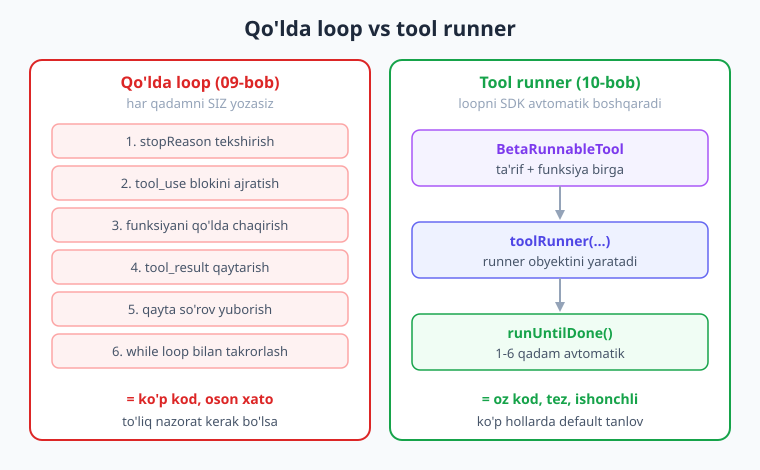
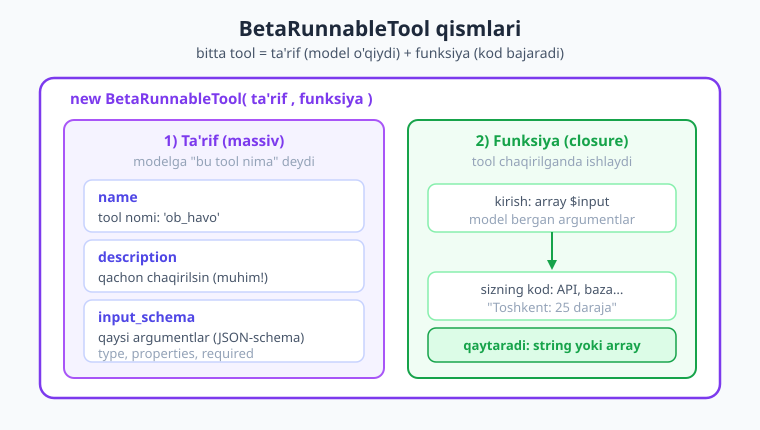
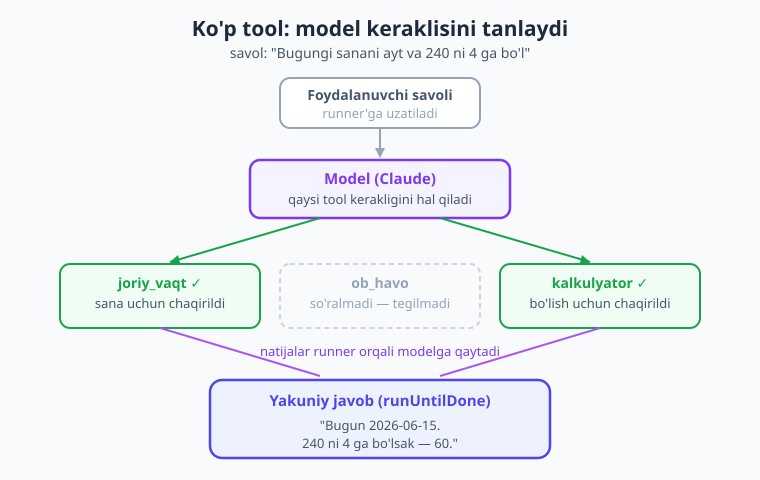

# 10 — Tool runner va ko'p tool

[⬅️ Oldingi: 09 — Function calling](./09-function-calling.md) · [🏠 Kitob boshi](./README.md) · [Keyingi: 11 — Agentlar ➡️](./11-agentlar.md)

> **Bu bobda:** 09-bobda tool'ni qo'lda boshqargandik — har tool natijasini o'zimiz qaytarib, loopni o'zimiz yozgandik. Bu charchatadi, ayniqsa bir nechta tool yoki ko'p qadam bo'lsa. Bu bobda **tool runner** bilan tanishamiz: u loopni avtomatik boshqaradi. SDK'dagi `BetaRunnableTool` va `toolRunner` yordamida bir nechta tool'ni model o'zi tanlab, ketma-ket chaqiradigan "do'kon yordamchisi" yasaymiz. Hammasi `php -l` bilan tekshirilgan jonli kod.

---

## 1. Muammo: qo'lda loop charchatadi

09-bobni eslang. Model tool chaqirishni xohlaganda biz quyidagilarni **o'z qo'limiz bilan** qildik:

1. Javobni tekshirdik — `stopReason === 'tool_use'` ekanmi?
2. `tool_use` blokidan tool nomi, ID va kirish argumentlarini ajratib oldik.
3. Tegishli PHP funksiyani qidirib topdik va chaqirdik.
4. Natijani `tool_result` blokiga o'rab, suhbatga qo'shdik.
5. Modelga **qaytadan** so'rov yubordik.
6. Model yana tool so'rasa — 1-qadamdan **takrorladik** (`while` loop bilan).

Bu bitta tool va bitta qadam uchun ham anchagina kod edi. Endi tasavvur qiling: foydalanuvchi *"Toshkentdagi ob-havoni ayt, keyin haroratni Farengeytga aylantir va menga bugungi sanani ham qo'sh"* desa. Bu uchta tool va kamida uch-to'rt qadamli loop. Har qadamda yuqoridagi 6 ta ishni qo'lda yozish — xato qilish oson, kodni o'qish qiyin.

> **Hayotiy o'xshatish.** Tasavvur qiling, siz oshpazsiz va sizda yordamchi bor. **Qo'lda loop** — bu yordamchiga har bir ingredientni alohida-alohida o'zingiz uzatib turish: "mana piyoz, to'g'ra... endi mana sabzi, to'g'ra... endi menga qaytar...". **Tool runner** esa — yordamchiga butun retseptni berib: "kerakli ingredientlarni o'zing olib, ketma-ket tayyorla, oxirida tayyor taomni ber" deyish. Siz faqat boshida va oxirida ishtirok etasiz.

**Yechim:** SDK'da tayyor **tool runner** bor. Siz unga tool'lar ro'yxati va boshlang'ich savolni berasiz — u esa yuqoridagi 1–6 qadamlarni avtomatik, model tugatgunicha takrorlaydi. Sizga faqat tool'ning o'zini (funksiyasi bilan) ta'riflash qoladi.



!!! note "Eslatma"
    Tool runner — bu sehr emas. U ichida aynan 09-bobdagi loopni bajaradi: model tool so'raydi → runner funksiyani chaqiradi → natijani qaytaradi → takrorlaydi. Farqi shundaki, bu kodni **siz emas, SDK yozadi**. Tushuncha har provayderda bir xil (OpenAI'da ham "tool/function calling loop" deyiladi), faqat klass nomlari farq qiladi.

---

## 2. `BetaRunnableTool` — funksiya bilan birga tool

09-bobda tool ta'rifi (JSON-schema) va uni bajaradigan PHP funksiya **alohida** edi: ta'rif `tools` massivida, funksiya esa `match` yoki `if` ichida. Tool runner ishlashi uchun bu ikkalasini **bir joyda** bog'lashimiz kerak — toki runner "qaysi tool chaqirilsa, qaysi funksiyani ishga tushirish"ni bilsin.

Buning uchun SDK'da `Anthropic\Lib\Tools\BetaRunnableTool` klassi bor. Bu — "ishga tushiriladigan tool", ya'ni **ta'rif + funksiya** birga.

```php
use Anthropic\Lib\Tools\BetaRunnableTool;

$obHavo = new BetaRunnableTool(
    // 1-argument: tool TA'RIFI (xuddi 09-bobdagi kabi JSON-schema massiv)
    [
        'name' => 'ob_havo',
        'description' => 'Berilgan shahar uchun joriy ob-havoni qaytaradi. '
            . 'Foydalanuvchi ob-havo haqida so\'rasa shu tool\'ni chaqir.',
        'input_schema' => [
            'type' => 'object',
            'properties' => [
                'shahar' => ['type' => 'string', 'description' => 'Shahar nomi'],
            ],
            'required' => ['shahar'],
        ],
    ],
    // 2-argument: FUNKSIYA (closure) — model tool'ni chaqirsa shu ishlaydi
    function (array $input): string {
        $shahar = $input['shahar'] ?? 'noma\'lum';
        // Haqiqiy loyihada bu yerda ob-havo API'ga so'rov yuborardingiz:
        return "$shahar: 25 daraja, quyoshli";
    },
);
```

`BetaRunnableTool` konstruktori **ikki argument** oladi:

| Argument | Nima | Misol |
|---|---|---|
| **ta'rif** (1-o'rin) | tool nomi + tavsifi + `input_schema` (model o'qiydigan JSON-schema massiv) | `['name' => ..., 'description' => ..., 'input_schema' => ...]` |
| **funksiya** (2-o'rin) | `array $input` qabul qiladi, `string` yoki `array` qaytaradi | `fn (array $in) => "..."` |



!!! warning "Ehtiyot bo'ling — argumentlar TARTIBI"
    `BetaRunnableTool` konstruktori **pozitsion** (tartibli) argument oladi: avval ta'rif massivi, keyin funksiya. `name:` yoki `run:` kabi nomli argument bilan chaqirib bo'lmaydi. Ta'rif ichidagi kalit aynan **`input_schema`** (pastki chiziq bilan, JSON-schema standartidagidek) — `inputSchema` emas.

**Funksiya nimani qaytaradi?** Ikki variant bor:

- **`string`** — oddiy matn natija (eng ko'p ishlatiladi): `"Toshkent: 25 daraja"`.
- **`array`** — bloklar massivi (masalan, model'ga rasm yoki tuzilgan ma'lumot qaytarish kerak bo'lsa). Oddiy hollarda string yetadi.

!!! tip "Maslahat — `description` muhim"
    Tool'ning `description` maydoni — modelga "bu tool qachon kerakligini" tushuntiradigan yagona yo'l. Aniq yozing: *"Foydalanuvchi ob-havo so'rasa chaqir"*. Yomon tavsif → model tool'ni noto'g'ri paytda chaqiradi yoki umuman chaqirmaydi. (09-bobda batafsil aytgandik.)

---

## 3. `toolRunner` — loopni boshqaruvchi

Tool tayyor. Endi loopni boshqaradigan **runner**ni yaratamiz. Buning uchun `$client->beta->messages->toolRunner(...)` metodi bor — u `BetaToolRunner` obyektini qaytaradi.

```php
$runner = $client->beta->messages->toolRunner(
    model: 'claude-opus-4-8',
    maxTokens: 1024,
    tools: [$obHavo],                       // BetaRunnableTool obyektlari ro'yxati
    messages: [
        ['role' => 'user', 'content' => 'Toshkentda ob-havo qanday?'],
    ],
);
```

`toolRunner` — bu `create` ga o'xshaydi (`model`, `maxTokens`, `messages`, `tools`), lekin **so'rov yubormaydi**. U faqat "boshqaruvchi"ni tayyorlaydi. Loopni ishga tushirish uchun **`runUntilDone()`** chaqiramiz:

```php
$final = $runner->runUntilDone();   // BetaMessage — loop tugagach YAKUNIY javob

// Yakuniy matnni o'qiymiz (xuddi oddiy create kabi):
foreach ($final->content as $block) {
    if ($block->type === 'text') {
        echo $block->text;
    }
}
```

`runUntilDone()` quyidagilarni **avtomatik** bajaradi:

1. Modelga so'rov yuboradi.
2. Model tool so'rasa — tegishli `BetaRunnableTool` funksiyasini chaqiradi.
3. Natijani `tool_result` qilib suhbatga qo'shadi.
4. Modelga qaytadan yuboradi.
5. Model yana tool so'rasa — 2-qadamga qaytadi; **so'ramasa, to'xtaydi**.
6. Yakuniy `BetaMessage`ni qaytaradi.

Ya'ni 09-bobdagi butun `while` loop — bitta `runUntilDone()` chaqiruviga aylandi.

!!! info "Boshqa provayderda"
    OpenAI SDK'sida bunday tayyor runner yo'q — odatda loopni qo'lda yozasiz yoki LLPhant/Neuron AI kabi framework ishlatasiz (17-bob). Anthropic PHP SDK'ning `toolRunner`'i — bu ishni o'rnatib qo'yilgan qulaylik. G'oya esa universal: "model tool so'raydi, kod bajaradi, takrorlanadi".

---

## 4. To'liq ishlaydigan misol — bitta tool

Hammasini bir joyga yig'amiz. Quyidagi to'liq fayl — bitta `ob_havo` tool bilan tool runner. API kalit muhit o'zgaruvchisidan olinadi (hech qachon kodga yozmaymiz).

```php
<?php
require __DIR__ . '/vendor/autoload.php';

use Anthropic\Client;
use Anthropic\Lib\Tools\BetaRunnableTool;

$client = new Client(apiKey: getenv('ANTHROPIC_API_KEY'));

// 1) Tool'ni ta'rif + funksiya bilan yaratamiz
$obHavo = new BetaRunnableTool(
    [
        'name' => 'ob_havo',
        'description' => 'Berilgan shahar uchun joriy ob-havoni qaytaradi.',
        'input_schema' => [
            'type' => 'object',
            'properties' => [
                'shahar' => ['type' => 'string', 'description' => 'Shahar nomi'],
            ],
            'required' => ['shahar'],
        ],
    ],
    function (array $input): string {
        $shahar = $input['shahar'] ?? 'noma\'lum';
        // Haqiqiy loyihada: ob-havo API chaqiruvi. Bu yerda namuna:
        return "$shahar: 25 daraja, quyoshli, shamol 3 m/s";
    },
);

// 2) Runner yaratamiz va loopni avtomatik ishga tushiramiz
$runner = $client->beta->messages->toolRunner(
    model: 'claude-opus-4-8',
    maxTokens: 1024,
    tools: [$obHavo],
    messages: [
        ['role' => 'user', 'content' => 'Toshkentda hozir ob-havo qanday?'],
    ],
);

$final = $runner->runUntilDone();

// 3) Yakuniy javobni chiqaramiz
foreach ($final->content as $block) {
    if ($block->type === 'text') {
        echo $block->text . PHP_EOL;
    }
}
```

Ishga tushirsangiz, model `ob_havo` tool'ni o'zi chaqiradi, bizning funksiya `"Toshkent: 25 daraja..."` qaytaradi, model esa buni odamga tushunarli jumlaga aylantiradi: *"Toshkentda hozir 25 daraja, ob-havo quyoshli, shamol kuchsiz."* Bularning hammasi bitta `runUntilDone()` ichida sodir bo'ladi.

!!! question "Tekshirib ko'ring"
    Yuqoridagi koddan `tools: [$obHavo]` qatorini olib tashlasangiz nima bo'ladi? (Model `ob_havo` tool haqida bilmaydi — uning o'rniga "Men real vaqtdagi ob-havoni bilolmayman" deb javob beradi.)

---

## 5. Bir nechta tool — model o'zi tanlaydi

Tool runner'ning asl kuchi — **bir nechta tool**da ko'rinadi. Siz bir necha tool berasiz, model esa savolga qarab qaysi biri (yoki bir nechtasi) kerakligini o'zi hal qiladi va ketma-ket chaqiradi.

Quyida uchta tool yaratamiz: ob-havo, kalkulyator va joriy vaqt.

```php
<?php
require __DIR__ . '/vendor/autoload.php';

use Anthropic\Client;
use Anthropic\Lib\Tools\BetaRunnableTool;

$client = new Client(apiKey: getenv('ANTHROPIC_API_KEY'));

// --- Tool 1: ob-havo ---
$obHavo = new BetaRunnableTool(
    [
        'name' => 'ob_havo',
        'description' => 'Shahar uchun joriy ob-havoni qaytaradi.',
        'input_schema' => [
            'type' => 'object',
            'properties' => ['shahar' => ['type' => 'string']],
            'required' => ['shahar'],
        ],
    ],
    fn (array $in): string => ($in['shahar'] ?? '?') . ': 25 daraja, quyoshli',
);

// --- Tool 2: kalkulyator ---
$kalkulyator = new BetaRunnableTool(
    [
        'name' => 'kalkulyator',
        'description' => 'Ikki son ustida arifmetik amal bajaradi.',
        'input_schema' => [
            'type' => 'object',
            'properties' => [
                'amal' => [
                    'type' => 'string',
                    'enum' => ['qoshish', 'ayirish', 'kopaytirish', 'bolish'],
                ],
                'a' => ['type' => 'number'],
                'b' => ['type' => 'number'],
            ],
            'required' => ['amal', 'a', 'b'],
        ],
    ],
    fn (array $in): string => (string) match ($in['amal']) {
        'qoshish'     => $in['a'] + $in['b'],
        'ayirish'     => $in['a'] - $in['b'],
        'kopaytirish' => $in['a'] * $in['b'],
        'bolish'      => $in['b'] != 0 ? $in['a'] / $in['b'] : 'nolga bo\'linmaydi',
    },
);

// --- Tool 3: joriy vaqt ---
$vaqt = new BetaRunnableTool(
    [
        'name' => 'joriy_vaqt',
        'description' => 'Joriy sana va vaqtni qaytaradi.',
        // argument kerak emas: bo'sh xususiyatlar
        'input_schema' => ['type' => 'object', 'properties' => (object) []],
    ],
    fn (array $in): string => date('Y-m-d H:i'),
);

// --- Runner: uchta tool bilan ---
$runner = $client->beta->messages->toolRunner(
    model: 'claude-opus-4-8',
    maxTokens: 1024,
    tools: [$obHavo, $kalkulyator, $vaqt],
    messages: [[
        'role' => 'user',
        'content' => 'Bugungi sanani ayt va 240 ni 4 ga bo\'l.',
    ]],
);

$final = $runner->runUntilDone();
echo $final->content[0]->text . PHP_EOL;
```

Bu savolda model **ikkita** tool'ni chaqiradi: `joriy_vaqt` (sana uchun) va `kalkulyator` (bo'lish uchun). Ob-havo so'ralmagani uchun `ob_havo` tegilmaydi. Runner ikkala tool'ni ham bajaradi va natijalarni bitta yakuniy javobga jamlaydi: *"Bugun 2026-06-15. 240 ni 4 ga bo'lsak — 60."*



!!! note "Eslatma"
    `'properties' => (object) []` — bu bo'sh JSON obyekti (`{}`) bo'lib serializatsiya bo'lishi uchun. Agar `[]` (bo'sh massiv) yozsangiz, JSON'da `[]` chiqadi va schema noto'g'ri bo'ladi. Argument talab qilmaydigan tool'larda shu yo'lni ishlating.

---

## 6. Real, foydali tool'lar

O'yinchoq misollar tushunarli, lekin amalda tool'lar **tashqi dunyo bilan** ishlaydi: ma'lumotlar bazasi, hisob-kitob, joriy vaqt, tashqi API. Mana bir nechta real namuna.

### 6.1 Ma'lumotlar bazasiga so'rov (mahsulot qidirish)

Eng foydali tool — bu modelga sizning bazangizdan ma'lumot olib berish. Model bazani bilmaydi; tool orqali u "ko'zoynak taqib" sizning ma'lumotingizni ko'radi.

```php
use Anthropic\Lib\Tools\BetaRunnableTool;

// PDO ulanishi avval tayyorlangan deb hisoblaymiz (PHP kitobiga qarang)
$mahsulotQidir = new BetaRunnableTool(
    [
        'name' => 'mahsulot_qidir',
        'description' => 'Do\'kon bazasidan nom bo\'yicha mahsulotlarni qidiradi. '
            . 'Narx va qoldiqni qaytaradi.',
        'input_schema' => [
            'type' => 'object',
            'properties' => [
                'nom' => ['type' => 'string', 'description' => 'Qidiriladigan mahsulot nomi'],
            ],
            'required' => ['nom'],
        ],
    ],
    function (array $input) use ($pdo): string {
        // Parametrli so'rov — SQL-injection xavfsiz (PHP kitobida tushuntirilgan)
        $stmt = $pdo->prepare(
            'SELECT nom, narx, qoldiq FROM mahsulotlar WHERE nom LIKE :q LIMIT 5'
        );
        $stmt->execute([':q' => '%' . $input['nom'] . '%']);
        $rows = $stmt->fetchAll(PDO::FETCH_ASSOC);

        if (!$rows) {
            return 'Bunday mahsulot topilmadi.';
        }
        // Natijani modelga matn ko'rinishida qaytaramiz
        return json_encode($rows, JSON_UNESCAPED_UNICODE);
    },
);
```

!!! danger "Xavfsizlik — SQL"
    Bazaga so'rov yozayotganda **doim parametrli so'rov** (`prepare` + `execute`) ishlating — model bergan matnni to'g'ridan-to'g'ri SQL'ga qo'shmang. Model "halol" bo'lsa ham, foydalanuvchi unga zararli matn yuborishi mumkin (prompt injection — 20-bob). Tool funksiyasi — bu sizning himoya devoringiz.

### 6.2 Hisob-kitob, sana va valyuta kursi

Boshqa foydali tool'lar:

```php
// Valyuta kursi (mock — real loyihada API chaqiruvi)
$valyuta = new BetaRunnableTool(
    [
        'name' => 'valyuta_kursi',
        'description' => 'Bir valyutadan boshqasiga konvertatsiya summasini hisoblaydi.',
        'input_schema' => [
            'type' => 'object',
            'properties' => [
                'miqdor' => ['type' => 'number'],
                'dan'    => ['type' => 'string', 'description' => 'masalan USD'],
                'ga'     => ['type' => 'string', 'description' => 'masalan UZS'],
            ],
            'required' => ['miqdor', 'dan', 'ga'],
        ],
    ],
    function (array $in): string {
        // Real loyihada: kursni API yoki bazadan oling
        $kurslar = ['USD_UZS' => 12600, 'EUR_UZS' => 13700];
        $kalit = "{$in['dan']}_{$in['ga']}";
        if (!isset($kurslar[$kalit])) {
            return 'Bu valyuta juftligi mavjud emas.';
        }
        $natija = $in['miqdor'] * $kurslar[$kalit];
        return "{$in['miqdor']} {$in['dan']} = {$natija} {$in['ga']}";
    },
);
```

!!! tip "Maslahat — tool nimaga yaxshi"
    LLM matn bilan kuchli, lekin aniq hisob-kitob, joriy sana, real ma'lumot — uning kuchsiz tomoni. Shu ishlarni **tool'ga** topshiring: model "240 / 4" ni o'zi yechmasin, `kalkulyator` chaqirsin. Shunda javob har doim aniq bo'ladi.

---

## 7. Iteratsiya — oraliq qadamlarni kuzatish

`runUntilDone()` faqat **yakuniy** javobni beradi — oraliqda nima bo'lganini ko'rsatmaydi. Lekin ba'zan har qadamni kuzatish kerak bo'ladi: qaysi tool chaqirildi, model nima dedi (debug, log, foydalanuvchiga "qidiryapman..." ko'rsatish uchun).

`BetaToolRunner` — **iterable**. Ya'ni uni `foreach` bilan aylanish mumkin; har takrorlanishda bitta `BetaMessage` (model javobi) qaytadi.

```php
$runner = $client->beta->messages->toolRunner(
    model: 'claude-opus-4-8',
    maxTokens: 1024,
    tools: [$obHavo, $kalkulyator],
    messages: [[
        'role' => 'user',
        'content' => 'Toshkentdagi haroratni 2 ga ko\'paytir.',
    ]],
);

$qadam = 0;
foreach ($runner as $message) {
    $qadam++;
    echo "--- Qadam {$qadam} (stopReason: {$message->stopReason}) ---" . PHP_EOL;

    foreach ($message->content as $block) {
        if ($block->type === 'text') {
            echo "Model: {$block->text}" . PHP_EOL;
        } elseif ($block->type === 'tool_use') {
            // Qaysi tool, qanday argument bilan chaqirildi
            echo "Tool chaqirildi: {$block->name}" . PHP_EOL;
            echo "Argumentlar: " . json_encode($block->input, JSON_UNESCAPED_UNICODE) . PHP_EOL;
        }
    }
}
// Loop tugaganda oxirgi $message — yakuniy javob
```

Bu yerda `foreach` runner'ni qadam-baqadam aylanadi. `runUntilDone()` esa — aslida shu `foreach`ning ichida oxirgi xabarni qaytaradigan qisqa yo'li (xohlasangiz manbasiga qarang). Iteratsiya — debug va kuzatish uchun; oddiy holatda `runUntilDone()` qulayroq.

!!! note "Eslatma"
    Bir `BetaToolRunner`ni faqat **bir marta** aylanish mumkin. `foreach` qilib bo'lgach yoki `runUntilDone()` chaqirgach, u "iste'mol qilingan" hisoblanadi — qayta aylansangiz xato beradi. Yangidan kerak bo'lsa, yangi runner yarating.

---

## 8. Qo'lda loop vs tool runner — qachon qaysi

Endi 09-bobning qo'lda usuli va bu bobning runner'i o'rtasidagi farqni aniq ko'raylik:

| Jihat | Qo'lda loop (09-bob) | Tool runner (10-bob) |
|---|---|---|
| Kod hajmi | Ko'p (`while`, blok ajratish, qaytarish) | Oz (`toolRunner` + `runUntilDone`) |
| Loop boshqaruvi | Siz yozasiz | SDK avtomatik |
| Tool va funksiya | Alohida (`tools` + `match`) | Birga (`BetaRunnableTool`) |
| Har qadamni nazorat | To'liq (har bosqichni boshqarasiz) | Faqat `foreach` orqali kuzatish |
| Inson-tasdiqlash | Oson (qadam orasiga qo'shasiz) | Qiyinroq (avtomatik bajariladi) |
| Shartli/murakkab mantiq | To'liq erkinlik | Cheklangan |
| Qachon | Maxsus nazorat, tasdiqlash, murakkab oqim | Oddiy, tez, ko'p hollarda **default** |

**Qisqasi:**

- **Tool runner** — kundalik, oddiy holatlar uchun **birinchi tanlov**. Tez yoziladi, kam xato.
- **Qo'lda loop** — sizga **to'liq nazorat** kerak bo'lganda: masalan, xavfli tool bajarilishidan oldin insondan tasdiq so'rash, yoki tool natijasiga qarab oqimni o'zgartirish. Bu mavzu 11-bobda (agentlar) chuqurroq ochiladi.

!!! info "11-bobga ko'prik"
    Agent — bu aslida "maqsadga yetgunicha tool'larni o'zi tanlab chaqiradigan" tizim. Tool runner — agentning yuragi. 11-bobda runner ustiga maqsad, xotira va to'xtash shartlarini qo'shib, to'laqonli agent yasaymiz.

---

## 9. Xavfsizlik — runner tool'larni AVTOMATIK bajaradi

Bu eng muhim ogohlantirish. Tool runner tool funksiyalarini **so'rovsiz, avtomatik** bajaradi — model "shu tool'ni chaqir" desa, kodingiz darhol ishga tushadi.

Bu o'qish/qidirish tool'lari uchun yaxshi. Lekin **o'zgartiruvchi yoki xavfli** tool'larda jiddiy xavf:

- Buyurtmani **o'chiradigan** tool
- Pul **o'tkazadigan** yoki to'lov qiladigan tool
- Fayl **yozadigan/o'chiradigan** tool
- Tashqariga email/SMS **yuboradigan** tool

> **Hayotiy o'xshatish.** Tool runner — bu sizning nomingizdan ish qiladigan ishonchli, lekin tajribasiz yordamchi. "Buni qil" desa qiladi — hatto "barcha fayllarni o'chir" bo'lsa ham. Shuning uchun yordamchiga **faqat xavfsiz vazifalarni** ishonib topshirasiz; pul yoki o'chirish kabi ishlarni — o'zingiz tasdiqlaganingizdan keyin.

!!! danger "Xavfsizlik qoidalari"
    1. **Xavfli tool'larni runner'ga avtomatik bermang.** O'chirish/to'lov kabi amallar uchun **qo'lda loop** ishlating va bajarishdan oldin insondan tasdiq oling.
    2. **Har bir tool funksiyasida tekshiruv qo'ying** — model bergan argumentni ishonchsiz deb biling: turlarini, chegaralarni, ruxsatlarni tekshiring.
    3. **Eng kam ruxsat tamoyili** — tool faqat o'ziga kerakli ishni qila olsin (masalan, faqat o'qish huquqi bilan ulangan baza).
    4. **Loop uzunligini cheklang** — `toolRunner`ga `maxIterations` bering, toki cheksiz loopga tushib qolmasin.

```php
// maxIterations — eng ko'pi bilan necha marta API chaqiruvi (xavfsizlik to'sig'i)
$runner = $client->beta->messages->toolRunner(
    model: 'claude-opus-4-8',
    maxTokens: 1024,
    tools: [$obHavo, $mahsulotQidir],
    messages: [['role' => 'user', 'content' => $savol]],
    maxIterations: 5,   // 5 qadamdan keyin majburan to'xtaydi
);
```

To'liq xavfsizlik mavzusi — prompt injection, ruxsatlar, audit — **20-bobda**.

---

## 10. To'liq misol — "do'kon yordamchisi"

Endi hammasini birlashtiramiz: ikkita tool bilan haqiqiy do'kon yordamchisi. Birinchi tool bazadan mahsulot qidiradi, ikkinchisi umumiy narxni hisoblaydi. Foydalanuvchi savol beradi — model tool'larni o'zi chaqirib, to'liq javob beradi.

```php
<?php
require __DIR__ . '/vendor/autoload.php';

use Anthropic\Client;
use Anthropic\Lib\Tools\BetaRunnableTool;

$client = new Client(apiKey: getenv('ANTHROPIC_API_KEY'));

// Namuna "baza" (real loyihada — PDO bilan MySQL/PostgreSQL)
$mahsulotlar = [
    ['nom' => 'Klaviatura', 'narx' => 250000, 'qoldiq' => 12],
    ['nom' => 'Sichqoncha', 'narx' => 90000,  'qoldiq' => 30],
    ['nom' => 'Monitor',    'narx' => 1800000, 'qoldiq' => 5],
];

// --- Tool 1: mahsulot qidirish ---
$mahsulotQidir = new BetaRunnableTool(
    [
        'name' => 'mahsulot_qidir',
        'description' => 'Do\'kon bazasidan nom bo\'yicha mahsulot qidiradi. '
            . 'Narx (so\'mda) va qoldiq sonini qaytaradi.',
        'input_schema' => [
            'type' => 'object',
            'properties' => ['nom' => ['type' => 'string']],
            'required' => ['nom'],
        ],
    ],
    function (array $input) use ($mahsulotlar): string {
        $topildi = array_values(array_filter(
            $mahsulotlar,
            fn ($m) => str_contains(
                mb_strtolower($m['nom']),
                mb_strtolower($input['nom'] ?? ''),
            ),
        ));
        return $topildi
            ? json_encode($topildi, JSON_UNESCAPED_UNICODE)
            : 'Mahsulot topilmadi.';
    },
);

// --- Tool 2: umumiy narx hisoblash ---
$narxHisobla = new BetaRunnableTool(
    [
        'name' => 'narx_hisobla',
        'description' => 'Birlik narxini soniga ko\'paytirib, umumiy summani qaytaradi.',
        'input_schema' => [
            'type' => 'object',
            'properties' => [
                'birlik_narx' => ['type' => 'number'],
                'soni'        => ['type' => 'integer'],
            ],
            'required' => ['birlik_narx', 'soni'],
        ],
    ],
    function (array $in): string {
        $umumiy = $in['birlik_narx'] * $in['soni'];
        return "Umumiy: {$umumiy} so'm";
    },
);

// --- Runner: ikkala tool bilan ---
$runner = $client->beta->messages->toolRunner(
    model: 'claude-opus-4-8',
    maxTokens: 1024,
    tools: [$mahsulotQidir, $narxHisobla],
    messages: [[
        'role' => 'user',
        'content' => 'Menga 3 ta klaviatura kerak. Bormi? Hammasi qancha bo\'ladi?',
    ]],
    maxIterations: 6,   // xavfsizlik to'sig'i
);

$final = $runner->runUntilDone();

foreach ($final->content as $block) {
    if ($block->type === 'text') {
        echo $block->text . PHP_EOL;
    }
}
```

Bu yerda model **ikki qadamda** ishlaydi: avval `mahsulot_qidir` bilan klaviaturani topadi (narx 250000, qoldiq 12 — yetarli), keyin `narx_hisobla` bilan `250000 × 3` ni hisoblaydi. Yakuniy javob: *"Ha, klaviatura bor (omborda 12 ta). 3 tasi 750 000 so'm bo'ladi."* Biz faqat ikki tool va bitta `runUntilDone()` yozdik — qolganini runner qildi.

> **Hayotiy o'xshatish.** Bu — do'kondagi tajribali sotuvchi kabi: mijoz savolini eshitadi, omborni tekshiradi, narxni hisoblaydi va bitta tushunarli javob beradi. Siz unga faqat "ombor"ni (qidirish tool) va "kalkulyator"ni (hisoblash tool) berdingiz.

!!! example "Kengaytirish g'oyasi"
    Bu yordamchiga `savatga_qoshish`, `buyurtma_yaratish` kabi tool'lar qo'shsangiz — to'liq savdo botiga aylanadi. Lekin `buyurtma_yaratish` — **o'zgartiruvchi** tool, shuning uchun (9-bo'limni eslang) uni avtomatik runner'ga bermay, insondan tasdiq so'rab qo'lda bajargan ma'qul.

---

## Xulosa

- **Qo'lda loop charchatadi:** har tool natijasini qaytarish va loop yozish — ko'p kod, oson xato. **Tool runner** bu loopni avtomatlashtiradi.
- **`BetaRunnableTool`** — tool ta'rifini (JSON-schema massiv) va uni bajaradigan funksiyani (closure) **birga** bog'laydi. Konstruktor pozitsion: avval ta'rif, keyin funksiya. Funksiya `string` yoki `array` qaytaradi.
- **`$client->beta->messages->toolRunner(...)`** `BetaToolRunner` qaytaradi; **`runUntilDone()`** loopni model tugatgunicha avtomatik aylantirib, yakuniy `BetaMessage`ni beradi.
- **Bir nechta tool**da model savolga qarab keraklisini (yoki bir nechtasini) o'zi tanlab, ketma-ket chaqiradi. Foydali tool'lar: baza qidiruvi, hisob-kitob, joriy vaqt, valyuta kursi.
- **`BetaToolRunner` iterable** — `foreach` bilan har qadamni (qaysi tool, qanday argument) kuzatish mumkin (debug, log). Bir runner faqat bir marta aylanadi.
- **Runner default, qo'lda loop — nazorat uchun.** Inson-tasdiqlash yoki murakkab shartli oqim kerak bo'lsa qo'lda loop ishlating.
- **Xavfsizlik:** runner tool'larni avtomatik bajaradi — o'chirish/to'lov kabi xavfli tool'larda ehtiyot bo'ling, argumentlarni tekshiring, `maxIterations` bilan loopni cheklang (batafsil — 20-bob).

## Amaliy mashqlar

1. **Bitta tool runner.** Bir `tasodifiy_son` tool yarating (min va max argumentlarini olib, oraliqdagi tasodifiy sonni qaytaradi). `toolRunner` + `runUntilDone()` bilan modeldan "1 dan 100 gacha tasodifiy son ber" deb so'rang.
2. **Ko'p tool tanlovi.** Uchta tool (`ob_havo`, `kalkulyator`, `joriy_vaqt`) bilan runner yozing. Modelga *"Bugungi sana qanaqa va 15 ni 3 ga ko'paytir"* deb savol bering — qaysi tool'lar chaqirilishini kuzating.
3. **DB qidiruv tool.** PDO (yoki namuna massiv) bilan `kitob_qidir` tool yozing: nom bo'yicha kitob qidirib, sarlavha va narxni qaytarsin. Runner orqali *"Dasturlash haqida kitob bormi?"* deb so'rang. Funksiyada parametrli so'rov ishlatganingizga ishonch hosil qiling.
4. **Iteratsiyani kuzatish.** 2-mashqdagi runner'ni `runUntilDone()` o'rniga `foreach` bilan aylanib chiqing. Har qadamda qaysi tool chaqirilganini va uning argumentlarini ekranga chiqaring.
5. **Xavfsizlik to'sig'i.** Bir runner'ga `maxIterations: 2` bering va modelni ko'p qadam talab qiladigan savol bilan sinab ko'ring. Nima bo'ldi? Nega `maxIterations` xavfsizlik uchun muhim?

---

[⬅️ Oldingi: 09 — Function calling](./09-function-calling.md) · [🏠 Kitob boshi](./README.md) · [Keyingi: 11 — Agentlar ➡️](./11-agentlar.md)
