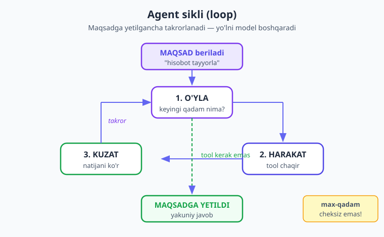
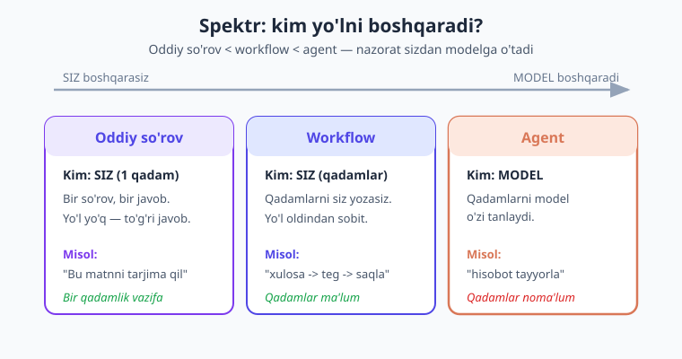
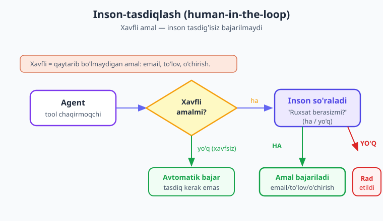

# 11 — Agentlar qurish

[⬅️ Oldingi: 10 — Tool runner](./10-tool-runner.md) · [🏠 Kitob boshi](./README.md) · [Keyingi: 12 — MCP ➡️](./12-mcp.md)

> **Bu bobda:** Endi modelga shunchaki savol bermaymiz — unga **maqsad** beramiz va u o'zi yo'lni topadi. Agent nima ekanini (mustaqil yordamchi), uning **siklini** (o'yla → harakat → kuzat → ...), oddiy so'rovdan agentgacha bo'lgan **spektrni**, va eng muhimi — **qachon agent kerak, qachon kerak emas** degan 4 mezonni o'rganamiz. PHP'da o'z agentingizni quramiz, **max-qadam chegarasi** va **inson-tasdiqlash** (xavfli amal oldidan ruxsat so'rash) bilan xavfsiz qilamiz. Oxirida — to'liq ko'p qadamli agent.

---

## Nega bu bob — bizning eng katta sakramoqimiz

Bir lahza orqaga qaytaylik. Kitobning boshida biz modelga **savol** berardik: "PHP nima?" — u javob berardi. Bu — kalkulyator: tugmani bosding, natija chiqdi.

9 va 10-boblarda biz modelga **tool** (vosita) berdik: "ob-havoni bilishing kerak bo'lsa, mana bu funksiyani chaqir". Endi model nafaqat gapiradi, balki **harakat** ham qila oladi. Tool runner esa bu harakatlarni avtomatik takrorladi.

Bu bobda yana bir pog'ona ko'tarilamiz. Endi biz modelga aniq ko'rsatma bermaymiz — biz unga **maqsad** beramiz:

> "Ushbu mavzu bo'yicha qisqa hisobot tayyorla."

Va model **o'zi** hal qiladi: avval nimani qidirish kerak, keyin qaysi tool'ni ishlatish kerak, natija yetarlimi yoki yana qidirish kerakmi, qachon to'xtab javob yozish kerak. Mana shu — **agent**. Bu farqni his qilish — butun bobning kaliti.

!!! note "Eslatma"
    Bu bob 9 va 10-bobga **to'liq tayanadi**. Agar tool nima ekani (`name`, `description`, `input_schema`) va tool runner loop'i (`toolRunner`, `runUntilDone`) sizga noaniq bo'lsa — avval [09](./09-function-calling.md) va [10](./10-tool-runner.md) boblarini o'qing. Agent — aslida tool runner loop'ining "aqlli", maqsadga yo'naltirilgan ko'rinishi.

---

## Agent nima? — "ko'rsatma" emas, "maqsad"

Tasavvur qiling, sizda ikki xil yordamchi bor.

**Birinchi yordamchi — itoatkor ijrochi.** Siz unga aniq ko'rsatma berasiz: "do'konga bor, 1 kg un ol, qaytib kel". U aynan shuni bajaradi. Bir qadam ko'p emas, bir qadam kam emas. Agar do'konda un tugagan bo'lsa — u quruq qaytadi, chunki "boshqa do'konga bor" deyilmagan.

**Ikkinchi yordamchi — mustaqil yordamchi.** Siz unga **maqsad** berasiz: "kechki ovqatga un kerak". U o'zi o'ylaydi: qaysi do'kon yaqin, agar u yerda yo'q bo'lsa boshqasiga boradi, narx qimmat bo'lsa eslatadi, kerak bo'lsa sizdan so'raydi. U **maqsadga** intiladi, yo'lni o'zi topadi.

Mana shu farq — **workflow** (birinchi yordamchi) bilan **agent** (ikkinchi yordamchi) o'rtasidagi farq.

> **Hayotiy o'xshatish.** Agent — bu sizning topshirig'ingizni olib, **o'zi rejalashtirib, o'zi qadam tashlaydigan** yordamchi. Siz unga "qanday" qilishni emas, "**nima**"ga erishishni aytasiz. U yo'lni — qaysi tool'ni, qaysi tartibda, qachon to'xtashni — **o'zi** tanlaydi.

Texnik ta'rif: **agent** — bu model **boshqaradigan**, maqsadga erishish uchun **o'zi** qadamlarni rejalashtirib, tool'lardan foydalanib, har natijaga qarab keyingi qadamni tanlaydigan tizim.

Eng muhim so'z — **"o'zi"**. Oddiy so'rovda yo'lni siz belgilaysiz. Agentda yo'lni **model** belgilaydi. Sizning vazifangiz — unga to'g'ri tool'lar, aniq maqsad va **xavfsizlik chegaralarini** berish.

!!! tip "Maslahat"
    Agentni "robot" deb tasavvur qilmang. Uni **ishonchli, lekin tajribasiz xodim** deb tasavvur qiling: u aqlli, lekin sizning biznesingiz qoidalarini bilmaydi, xato qilishi mumkin, va xavfli amallar oldidan undan ruxsat so'rashni talab qilish kerak. Bu o'xshatish butun bob davomida bizga yo'l ko'rsatadi.

---

## Agent sikli (loop) — o'yla → harakat → kuzat

Agent qanday "o'ylaydi"? U bitta katta sakrashda javob bermaydi — u **kichik qadamlarda**, har biridan keyin to'xtab "o'ylab" ishlaydi. Bu takrorlanuvchi jarayon — **agent loop** (agent sikli) deb ataladi.



Sikl bosqichlari:

1. **O'yla (think).** Model hozirgi holatni baholaydi: "Maqsadga yetish uchun nima qilishim kerak? Yetarli ma'lumotim bormi?"
2. **Harakat (act).** Model bir tool'ni tanlaydi va chaqiradi: "Avval ob-havoni bilishim kerak — `ob_havo` tool'ini chaqiraman."
3. **Kuzat (observe).** Siz tool'ni bajarasiz va **natijani** modelga qaytarasiz: "Toshkent: 25°C, quyoshli."
4. **Yana o'yla.** Model natijani ko'rib qaror qiladi: "Endi yetarli ma'lumot bormi? Yo'q — yana qidiraman. Ha — javob yozaman."
5. Bu sikl **maqsadga yetilgancha** (yoki chegaraga urilguncha) takrorlanadi.

Tanish ko'rinyaptimi? Bu — aynan 10-bobdagi tool runner loop'i! Farqi shundaki, u yerda biz **bitta aniq vazifa** uchun tool'lar berardik (ob-havo so'ra → ayt). Agentda esa biz **kengroq maqsad** beramiz, va model **bir necha xil tool'ni, har xil tartibda, o'zi tanlab** ishlatadi.

!!! note "Eslatma"
    "Loop" (sikl) bu yerda chin ma'noda **tsikl** — `while` yoki `foreach` kabi. Model bir marta javob bermaydi; u tool chaqiradi, natija oladi, yana o'ylaydi, yana tool chaqiradi... To'xtash sharti: model `tool_use` o'rniga oddiy matn javob qaytarsa (`stopReason` endi `tool_use` emas) — demak maqsadga yetdi. Yoki **biz qo'ygan max-qadam chegarasiga** urilsa — demak biz to'xtatamiz (pastda).

---

## Spektr: oddiy so'rov < workflow < agent

Agent — har doim kerak emas. Aksincha — **ko'pincha kerak emas**. To'g'ri qatlam tanlash uchun avval butun spektrni ko'raylik. Bu uch daraja **"kim boshqaradi?"** degan savol bilan farqlanadi:



| Daraja | Kim yo'lni boshqaradi? | Misol | Qachon |
|---|---|---|---|
| **Oddiy so'rov** | **Siz** (bir qadam) | "Bu matnni tarjima qil" | Vazifa bir qadamda hal bo'ladi |
| **Workflow** (ish oqimi) | **Siz** (qadamlarni siz yozasiz) | "Avval xulosa qil → keyin teglarni ajrat → keyin saqla" | Qadamlar **oldindan ma'lum** va sobit |
| **Agent** | **Model** (qadamlarni model tanlaydi) | "Bu mavzu bo'yicha hisobot tayyorla" | Qadamlar **oldindan noma'lum**, vaziyatga qarab o'zgaradi |

Farqni yana bir bor ta'kidlaylik:

- **Workflow'da** — *siz* dasturchi sifatida qadamlar ketma-ketligini kodda yozasiz. Model har qadamda bitta aniq vazifani bajaradi. Yo'l **oldindan belgilangan**. (Buni 23-bobda chuqurroq ko'ramiz.)
- **Agentda** — *model* qadamlarni o'zi tanlaydi. Siz faqat maqsad va tool'larni berasiz. Yo'l **ish vaqtida shakllanadi**.

> **Hayotiy o'xshatish.** Workflow — bu **retsept**: "1) un ol, 2) suv qo'sh, 3) yog'ur, 4) pishir". Har qadam aniq. Agent — bu **oshpazga maqsad berish**: "mazali non pishir". U o'zi qaror qiladi qancha un, qancha suv, qachon pishirish kerakligini. Retsept oddiy, takrorlanuvchi taomlar uchun zo'r. Oshpaz esa — yangi, noaniq vazifalar uchun.

!!! warning "Ehtiyot bo'ling"
    Eng keng tarqalgan xato — **hamma narsani agent qilish**. Agent qimmatroq (ko'p so'rov = ko'p token = ko'p pul), sekinroq (har qadam alohida so'rov), va kamroq bashoratli (model har safar boshqacha yo'l tanlashi mumkin). Agar vazifangizni oddiy so'rov yoki sobit workflow bilan hal qila olsangiz — **shuni qiling**. Agent — eng oxirgi chora, eng kuchli, lekin eng "qimmat" asbob.

---

## Qachon agent kerak? — 4 ta mezon

Bu — bobning eng muhim bo'limi. Agent qurishni boshlashdan oldin **to'rt savolga** javob bering. **Hammasi "ha"** bo'lsa — agent o'rinli. **Birortasi "yo'q"** bo'lsa — oddiyroq qatlamni (so'rov yoki workflow) tanlang.

**1. Vazifa murakkab va oldindan aniq yozib bo'lmaydimi?**

Agar qadamlar har safar bir xil bo'lsa — bu workflow, kodda yozing. Agar qadamlar **vaziyatga qarab o'zgarsa** (qidiruv natijasiga, ma'lumotga, foydalanuvchi javobiga bog'liq), va siz ularni oldindan to'liq sanab bera olmasangiz — bu yerda agent kuchini ko'rsatadi.

> *Misol:* "Foydalanuvchining muammosini hal qil" — muammo har xil, qadamlar oldindan noma'lum → agent. "Buyurtmani PDF qil" — har doim bir xil qadamlar → workflow.

**2. Natijaning qiymati yuqorimi (narx va kechikishni oqlaydimi)?**

Agent qimmat va sekin. Agar vazifa arzon va tez bo'lishi kerak bo'lsa (masalan, har bir tugma bosishda ishlaydigan), agentning narxi o'zini oqlamaydi. Lekin natija qimmatli bo'lsa (murakkab tahlil, soatlik qo'l mehnatini tejaydigan hisobot), agent arziydi.

> *Misol:* Murakkab kod refaktoringi yoki chuqur tadqiqot — natija qimmat, agent arziydi. "Sahifa sarlavhasini yarat" — arzon bo'lishi kerak, oddiy so'rov yetarli.

**3. Model bu vazifaga qodirmi?**

Agentlik modeldan ko'p narsa talab qiladi: rejalashtirish, tool'larni to'g'ri tanlash, xatodan o'rganish. Murakkab vazifalarda kuchliroq model (Opus) kerak. Agar hatto kuchli model ham bu vazifani ishonchli bajara olmasa — agent qilmang, vazifani kichikroq bo'laklarga bo'ling yoki workflow qiling.

> *Maslahat:* Avval **qo'lda** sinab ko'ring — vazifani modelga oddiy so'rovlar bilan bering. Agar u qadamlarni mantiqiy hal qila olsa, agent ham ishlaydi. Yo'q bo'lsa — agent ham yiqiladi.

**4. Xatoni aniqlash va tuzatish mumkinmi?**

Agent xato qiladi. Savol — bu xatoni **payqab, tuzatib bo'ladimi**? Agar har qadamning natijasini tekshirsa bo'lsa (test o'tdimi, kod kompilyatsiya bo'ldimi, ma'lumot to'g'rimi), va xato bo'lsa **orqaga qaytarsa bo'lsa** — agent xavfsiz. Lekin agar amal **qaytarib bo'lmaydigan** bo'lsa (pul o'tkazildi, email yuborildi, fayl o'chirildi) va xatoni aniqlab bo'lmasa — agentni juda ehtiyotkorlik bilan, **inson-tasdiqlash** bilan ishlatish kerak (pastda).

!!! danger "Xavfsizlik"
    To'rtinchi mezon eng jiddiy. **Qaytarib bo'lmaydigan, tekshirib bo'lmaydigan amallarni** agentga **avtomatik** ishonib qo'ymang. Email yuborish, to'lov qilish, ma'lumot o'chirish — bularni har doim **inson tasdig'i** ortida saqlang. Pastdagi "inson-tasdiqlash" bo'limi aynan shuni hal qiladi.

!!! question "Tekshirib ko'ring"
    O'zingizning loyihangizdan bitta vazifani oling va 4 mezonni qo'llang. Masalan "foydalanuvchi sharhlarini o'qib, eng muhim 3 shikoyatni topish": (1) qadamlar oldindan ma'lummi? (2) natija qimmatlimi? (3) model qodirmi? (4) xato tuzatib bo'ladimi? Javoblaringizga qarab — bu agent, workflow, yoki oddiy so'rovmi?

---

## Oddiy agent qurish (PHP)

Endi nazariyadan amaliyotga o'tamiz. Birinchi agentimizni quramiz — **tadqiqot yordamchisi**. Unga maqsad beramiz ("biror mavzu bo'yicha qisqa xulosa ber"), unga **qidiruv** tool'i beramiz, va u o'zi: kerakli ma'lumotni qidiradi, yetarli bo'lsa — xulosa yozadi.

Har bir agent uch qismdan iborat:

1. **System prompt** — agentning **maqsadi va qoidalari** (kim u, nima qilishi kerak, qanday cheklovlar bor).
2. **Tool'lar** — agent ishlatadigan vositalar (qidiruv, hisoblash, ma'lumot olish...).
3. **Loop** — sikl. Buni biz `toolRunner` (10-bob) bilan avtomatik, yoki o'zimiz qo'lda yozamiz.

### Eng oddiy yo'l — `toolRunner` bilan agent

Eng tez yo'l — 10-bobdagi `toolRunner`'dan foydalanish. Farqi: tool runner'ga **kengroq maqsad** beramiz, **system prompt** bilan agentga "shaxsiyat" beramiz, va **bir nechta tool** beramiz — model o'zi qaysisini, qachon ishlatishni tanlaydi.

Avval qidiruv tool'ini tayyorlaymiz. (Bu yerda qidiruvni soddalik uchun "soxta" qildim — real loyihada veb-qidiruv API yoki o'z ma'lumotlar bazangizga ulaysiz.)

```php
<?php
require __DIR__ . '/vendor/autoload.php';

use Anthropic\Client;
use Anthropic\Lib\Tools\BetaRunnableTool;

$client = new Client(apiKey: getenv('ANTHROPIC_API_KEY'));

// Tool: veb-qidiruv (namuna). Real loyihada haqiqiy qidiruv API'ga ulanadi.
$qidir = new BetaRunnableTool(
    definition: [
        'name' => 'veb_qidir',
        'description' => 'Internetdan ma\'lumot qidiradi. '
                       . 'Yangi yoki tashqi fakt kerak bo\'lganda chaqir.',
        'input_schema' => [
            'type' => 'object',
            'properties' => [
                'sorov' => ['type' => 'string', 'description' => 'Qidiruv so\'rovi'],
            ],
            'required' => ['sorov'],
        ],
    ],
    // run: model bu tool'ni chaqirsa, mana shu funksiya bajariladi
    run: function (array $input): string {
        $sorov = $input['sorov'] ?? '';
        // Real loyihada: $natija = $qidiruvServisi->qidir($sorov);
        return "[Qidiruv natijasi: '{$sorov}' bo'yicha 3 ta ishonchli manba topildi]";
    },
);
```

!!! note "Eslatma — tool ta'rifi shakli"
    E'tibor bering: `BetaRunnableTool` konstruktori ikki narsa oladi — **`definition`** (tool'ning ta'rifi: `name`, `description`, `input_schema` — aynan 9-bobdagi shakl) va **`run`** (model uni chaqirganda bajariladigan funksiya). `definition` — oddiy massiv; `run` — `array` qabul qilib `string` qaytaruvchi closure. Bu — SDK'da tasdiqlangan haqiqiy imzo.

Endi system prompt bilan agentni quramiz va ishga tushiramiz:

```php
// Agent system prompti: MAQSAD + QOIDALAR (ko'rsatma emas!)
$systemPrompt = <<<TEXT
Sen tadqiqot yordamchisisan. Foydalanuvchi mavzu beradi —
sen veb_qidir tool'i bilan ma'lumot to'playsan va qisqa,
aniq XULOSA yozasan.

Qoidalar:
- Avval kerakli ma'lumotni qidir, keyin xulosa yoz.
- Faqat topilgan ma'lumotga asoslan, to'qib chiqarma.
- Xulosa o'zbek tilida, 3-5 jumla bo'lsin.
TEXT;

// toolRunner — agent loop'ini avtomatik boshqaradi
$runner = $client->beta->messages->toolRunner(
    model: 'claude-opus-4-8',
    maxTokens: 1024,
    tools: [$qidir],
    messages: [[
        'role' => 'user',
        'content' => 'PHP 8.4 dagi asosiy yangiliklar haqida qisqa xulosa ber.',
    ]],
    maxIterations: 8,                 // MAX-QADAM chegarasi (xavfsizlik!)
    extraParams: ['system' => $systemPrompt],  // system prompt shu yerda
);

// Loop tugaguncha ishlaydi, yakuniy javobni qaytaradi
$yakuniy = $runner->runUntilDone();

echo $yakuniy->content[0]->text;
```

Mana shu — to'liq agent! Faqat 30 qator. Nima sodir bo'ldi:

1. Biz unga **maqsad** berdik ("xulosa ber"), aniq qadamlar emas.
2. Model **o'zi** hal qildi: avval `veb_qidir` chaqiraman (balki bir necha marta), keyin xulosa yozaman.
3. `runner` har tool chaqiruvini avtomatik bajarib, natijani modelga qaytardi (agent loop).
4. Model yetarli ma'lumot to'plagach, oddiy matn javob qaytardi → loop to'xtadi.
5. `maxIterations: 8` — **8 qadamdan oshmasin** degan chegara. Bu juda muhim (pastda batafsil).

!!! tip "Maslahat — `system` qayerda?"
    `toolRunner`'da `system` prompt'ni `extraParams` ichiga qo'yamiz. `extraParams` — har bir ichki `messages->create()` chaqiruviga uzatiladigan qo'shimcha parametrlar (`system`, `thinking`, `outputConfig` va h.k.). Bu — agentga "shaxsiyat" beradigan joy.

---

## Tool dizayni — agentlar uchun

Agent qanchalik yaxshi ishlashi ko'p jihatdan **tool'laringiz qanday dizayn qilinganiga** bog'liq. Model tool'ni faqat sizning **tavsifingiz** orqali "ko'radi" — kodingizni emas. Demak tavsif yomon bo'lsa, model noto'g'ri tool'ni, noto'g'ri vaqtda chaqiradi.

> **Hayotiy o'xshatish.** Yangi xodimga asboblar qutisini berdingiz. Agar har asbobda aniq yorliq bo'lsa ("bu — vint buragich, vintlar uchun"), xodim to'g'ri asbobni oladi. Agar yorliqlar chalkash yoki kam bo'lsa — u taxmin qiladi, xato qiladi. Tool tavsifi — aynan shu yorliq.

Yaxshi tool dizaynining qoidalari:

**1. Aniq, ma'noli nomlar.** `veb_qidir`, `hisobni_ol`, `email_yubor` — yaxshi. `tool1`, `f`, `qil` — yomon. Nom o'zi nima qilishini aytib tursin.

**2. Boy tavsiflar.** Tavsifda nafaqat **nima** qilishini, balki **qachon** ishlatishni ham yozing: "Berilgan shahar uchun joriy ob-havoni qaytaradi. **Foydalanuvchi ob-havo so'rasa chaqir.**" Oxirgi jumla modelga "qachon"ni o'rgatadi.

**3. Kam va aniq to'plam.** 20 ta tool bergandan ko'ra, 5 ta yaxshi tanlangan tool bering. Ko'p tool model'ni chalkashtiradi — u qaysi birini tanlashni bilmay qoladi. Har tool aniq, bir-biridan farqli bir vazifani bajarsin.

**4. Xavfli amallarni alohida tool qiling.** Bu — eng muhim. "Faylni o'qish" va "faylni o'chirish" — ikki **alohida** tool bo'lsin, bitta "fayl_boshqar" tool emas. Nega? Chunki alohida bo'lsa, xavfli tool'ni (`fayl_ochir`) **alohida nazorat qilish** (tasdiq talab qilish) oson bo'ladi.

```php
// YOMON: hamma narsa bitta tool'da — xavflini nazorat qilish qiyin
// 'fayl_boshqar' (amal: oqi | yoz | ochir)

// YAXSHI: alohida tool'lar — xavflisini gate qilish oson
$faylOqi = ['name' => 'fayl_oqi',   'description' => 'Faylni o\'qiydi (xavfsiz)', /* ... */];
$faylOchir = ['name' => 'fayl_ochir', 'description' => 'Faylni O\'CHIRADI (xavfli — tasdiq kerak)', /* ... */];
```

!!! warning "Ehtiyot bo'ling"
    Tool tavsifida **xavf darajasini ham yozing** ("xavfsiz", "XAVFLI — tasdiq kerak"). Bu ikki foyda beradi: model ehtiyotkorroq bo'ladi, va siz kodda tool nomiga qarab xavflini ajratib, tasdiq so'ray olasiz.

---

## Inson-tasdiqlash (human-in-the-loop)

Agentni **mustaqil** qildik — bu kuch. Lekin ba'zi amallar shunchalik jiddiyki, ularni **odam** tasdiqlamaguncha bajarishga ruxsat bermaslik kerak. Bu — **human-in-the-loop** ("aylanada inson") yondashuvi.

> **Hayotiy o'xshatish.** Yangi xodimingiz aqlli, lekin u "1000 dollar to'la" yoki "barcha mijozlarga email yubor" degan qarorni **o'zicha** qabul qilmasligi kerak — avval sizdan so'rasin. Pulli, qaytarib bo'lmaydigan, ommaviy amallar — har doim sizning tasdig'ingiz ortida.



G'oya oddiy: agent **xavfli tool** chaqirmoqchi bo'lganda, biz uni darhol bajarmaymiz — avval **foydalanuvchidan so'raymiz**. "Ha" desa — bajaramiz. "Yo'q" desa — bajarmaymiz va modelga "rad etildi" deb qaytaramiz.

Buni amalga oshirish uchun bizga **manual loop** kerak — ya'ni `runUntilDone()` o'rniga, loop'ni **o'zimiz** boshqaramiz, har qadamda to'xtab, tool chaqiruvini ko'rib, xavfli bo'lsa tasdiq so'raymiz. `toolRunner`'ni `foreach` bilan aylanish — aynan shuni beradi (10-bobda ko'rgan edik).

Avval tasdiq so'rovchi yordamchi funksiya:

```php
<?php
// Xavfli tool'lar ro'yxati
const XAVFLI_TOOLLAR = ['email_yubor', 'fayl_ochir', 'tolov_qil'];

/**
 * Agar tool xavfli bo'lsa, foydalanuvchidan tasdiq so'raydi.
 * @return bool true = ruxsat, false = rad etildi
 */
function tasdiqSora(string $toolNomi, array $input): bool
{
    // Xavfsiz tool — avtomatik ruxsat
    if (!in_array($toolNomi, XAVFLI_TOOLLAR, true)) {
        return true;
    }

    // Xavfli tool — foydalanuvchidan so'raymiz
    echo "\n⚠️  Agent quyidagi XAVFLI amalni bajarmoqchi:\n";
    echo "    Tool: {$toolNomi}\n";
    echo "    Ma'lumot: " . json_encode($input, JSON_UNESCAPED_UNICODE) . "\n";
    echo "    Ruxsat berasizmi? (ha/yo'q): ";

    $javob = trim(fgets(STDIN));      // konsoldan o'qiymiz
    return in_array(mb_strtolower($javob), ['ha', 'h', 'yes', 'y'], true);
}
```

Endi manual agent loop — `toolRunner`'ni `foreach` bilan aylanamiz, lekin **xavfli tool'ni o'zimiz nazorat qilamiz**. Buning uchun runner'ga faqat **xavfsiz** tool'larni "ishlaydigan" (`BetaRunnableTool`) qilib beramiz; xavfli tool'larni esa **oddiy ta'rif** (plain massiv) qilib beramiz — model ularni ko'radi, lekin runner ularni avtomatik **bajarmaydi**, biz o'zimiz tasdiq bilan bajaramiz.

Eng tushunarli yo'l — **to'liq manual loop** (runner'siz), `messages->create` bilan to'g'ridan-to'g'ri. Bu agent loop'ining "ichini" ochib ko'rsatadi:

```php
<?php
require __DIR__ . '/vendor/autoload.php';

use Anthropic\Client;

$client = new Client(apiKey: getenv('ANTHROPIC_API_KEY'));

// Tool ta'riflari (oddiy massiv — 9-bobdagi shakl)
$tools = [
    [
        'name' => 'fayl_oqi',
        'description' => 'Faylni o\'qiydi (xavfsiz).',
        'input_schema' => [
            'type' => 'object',
            'properties' => ['yol' => ['type' => 'string']],
            'required' => ['yol'],
        ],
    ],
    [
        'name' => 'fayl_ochir',
        'description' => 'Faylni butunlay O\'CHIRADI (XAVFLI — tasdiq kerak).',
        'input_schema' => [
            'type' => 'object',
            'properties' => ['yol' => ['type' => 'string']],
            'required' => ['yol'],
        ],
    ],
];

// Tool'ni haqiqatda bajaruvchi funksiya
function toolBajar(string $nom, array $input): string
{
    return match ($nom) {
        'fayl_oqi'   => "Fayl matni: 'eski_hisobot.txt' ichida 200 qator bor.",
        'fayl_ochir' => "Fayl o'chirildi: " . ($input['yol'] ?? '?'),
        default      => "Noma'lum tool: {$nom}",
    };
}
```

Endi agentning yuragi — manual loop, **max-qadam** va **inson-tasdiqlash** bilan:

```php
/**
 * Manual agent loop: max-qadam + inson-tasdiqlash bilan.
 *
 * @param array  $tools     Tool ta'riflari
 * @param string $maqsad    Foydalanuvchi maqsadi
 * @param int    $maxQadam  Eng ko'p necha qadam (xavfsizlik chegarasi)
 */
function agentIshlat(Client $client, array $tools, string $maqsad, int $maxQadam = 10): string
{
    // Suhbat tarixi — agent xotirasi (har qadam shu yerga qo'shiladi)
    $messages = [['role' => 'user', 'content' => $maqsad]];

    for ($qadam = 1; $qadam <= $maxQadam; $qadam++) {
        // 1) O'YLA: modeldan keyingi qadamni so'raymiz
        $message = $client->messages->create(
            model: 'claude-opus-4-8',
            maxTokens: 1024,
            tools: $tools,
            system: 'Sen ehtiyotkor yordamchisan. Xavfli amallarni '
                  . 'faqat zarur bo\'lganda ishlat.',
            messages: $messages,
        );

        // Assistant javobini tarixga qo'shamiz
        $messages[] = ['role' => 'assistant', 'content' => $message->content];

        // 2) Model tool so'ramadimi? Unda u tugatdi — javobni qaytaramiz
        if ($message->stopReason !== 'tool_use') {
            foreach ($message->content as $block) {
                if ($block->type === 'text') {
                    return $block->text;   // YAKUNIY javob
                }
            }
            return '(javob yo\'q)';
        }

        // 3) HARAKAT: tool chaqiruvlarini topamiz va bajaramiz
        $toolResults = [];
        foreach ($message->content as $block) {
            if ($block->type !== 'tool_use') {
                continue;
            }

            // INSON-TASDIQLASH: xavfli bo'lsa so'raymiz
            if (!tasdiqSora($block->name, (array) $block->input)) {
                // Rad etildi — modelga shuni aytamiz (u boshqa yo'l tanlaydi)
                $toolResults[] = [
                    'type' => 'tool_result',
                    'tool_use_id' => $block->id,
                    'content' => 'Foydalanuvchi bu amalni RAD ETDI. Boshqa yo\'l toping.',
                    'is_error' => true,
                ];
                continue;
            }

            // Ruxsat berildi — tool'ni bajaramiz
            $natija = toolBajar($block->name, (array) $block->input);
            $toolResults[] = [
                'type' => 'tool_result',
                'tool_use_id' => $block->id,
                'content' => $natija,
            ];
        }

        // 4) KUZAT: tool natijalarini modelga qaytaramiz (yangi user xabar)
        $messages[] = ['role' => 'user', 'content' => $toolResults];
        // ...va for sikli yana o'ylash uchun aylanadi
    }

    // Max-qadamga yetdik — xavfsizlik to'xtatdi
    return "[CHEGARA] Agent {$maxQadam} qadamdan oshdi, to'xtatildi.";
}
```

Ishlatish:

```php
$javob = agentIshlat(
    $client,
    $tools,
    'eski_hisobot.txt faylini o\'qib, keyin uni o\'chir.',
    maxQadam: 10,
);
echo $javob;
```

Bu loop'da nima sodir bo'ladi:

1. Model `fayl_oqi` chaqiradi — bu **xavfsiz**, `tasdiqSora` darhol `true` qaytaradi, avtomatik bajariladi.
2. Model `fayl_ochir` chaqiradi — bu **xavfli**! `tasdiqSora` foydalanuvchidan so'raydi.
3. "Ha" — fayl o'chiriladi. "Yo'q" — modelga "rad etildi" deb qaytariladi, va u boshqa yo'l qidiradi.
4. Hamma vaqt `maxQadam` chegarasi ostida — agent cheksiz aylana olmaydi.

!!! danger "Xavfsizlik"
    `tool_result`'da `is_error => true` — modelga "bu amal bajarilmadi" degan signal. Buni rad etilgan amal uchun ishlatamiz, shunda model qayta urinmasdan **boshqa** yo'l topadi. Hech qachon rad etilgan amalni "muvaffaqiyatli" deb ko'rsatmang — model adashadi.

!!! tip "Maslahat — manual loop vs toolRunner"
    `toolRunner` (10-bob) — **xavfsiz tool'lar uchun** eng qulay (avtomatik). **Manual loop** — sizga to'liq nazorat kerak bo'lganda (inson-tasdiqlash, har qadamni log qilish, maxsus mantiq). Ko'p loyihada **ikkalasini** birga ishlatasiz: xavfsiz tool'larni runner'ga, xavfli amallar uchun esa manual nazorat. `toolRunner` ham `foreach`, `setMessagesParams`, `pushMessages` bilan manual aralashuvni qo'llab-quvvatlaydi (10-bob).

---

## Kontekst va xotira

Agent **uzoq** ishlasa (10, 20, 50 qadam), bir muammo paydo bo'ladi: har qadamda suhbat tarixi (`$messages` massivi) **o'sib boradi**. Har bir tool chaqiruvi, har bir natija — tarixga qo'shiladi. Tez orada bu tarix **kontekst oynasiga** sig'maydi (4-bob: kontekst oynasi — modelning "ishchi xotirasi", chegarali).

> **Hayotiy o'xshatish.** Uzoq yig'ilishda kotib har bir gapni yozib boradi. Bir paytdan keyin daftar to'ladi. Yechim — eski qismlarni **qisqacha xulosa** qilib, joy bo'shatish: "1-soatda byudjet kelishildi" (10 sahifa o'rniga bir jumla).

Agent xotirasini boshqarishning asosiy usullari:

**1. Xulosalash (summarization).** Suhbat uzayganda, eski qadamlarni model'ning o'ziga **xulosa qildirib**, to'liq tarix o'rniga qisqa xulosani saqlang. "Avval A, B, C qidirildi, natija: X" — 20 ta xabar o'rniga bir paragraf.

**2. Faqat muhimni saqlash.** Har tool natijasining **to'liq** matnini saqlash shart emas — ko'pincha xulosasi yetarli. Masalan, 500 qatorlik qidiruv natijasidan faqat 3 ta muhim faktni saqlang.

**3. Tashqi xotira.** Muhim ma'lumotni suhbat tarixida emas, **tashqarida** (ma'lumotlar bazasi, fayl) saqlab, kerak bo'lganda tool orqali o'qing. Shunda kontekst oynasi toza qoladi.

**4. Keshlash.** Takrorlanuvchi katta kontekst (masalan, o'zgarmas yo'riqnoma) uchun **prompt caching** — har safar qayta yubormay, keshlangan qismni ishlatish (16-bob, ~90% arzonroq).

```php
// Misol: tarix juda uzaysa, eski qismni xulosaga almashtirish g'oyasi
if (count($messages) > 30) {
    // Eski xabarlarni modelga xulosa qildiramiz
    $xulosa = $client->messages->create(
        model: 'claude-haiku-4-5',   // arzon model xulosaga yetarli
        maxTokens: 512,
        messages: [[
            'role' => 'user',
            'content' => 'Quyidagi agent suhbatini 5 jumlada xulosala: '
                       . json_encode(array_slice($messages, 0, 20)),
        ]],
    );
    // Eski 20 ta xabarni bitta xulosa bilan almashtiramiz
    $messages = array_merge(
        [['role' => 'user', 'content' => 'Oldingi qadamlar xulosasi: '
            . $xulosa->content[0]->text]],
        array_slice($messages, 20),
    );
}
```

!!! info "4 va 16-bobga ishora"
    Kontekst oynasi va token sanash — [4-bob](./04-suhbat-kontekst.md)da batafsil. Xulosalash, keshlash va xarajat optimizatsiyasi — [16-bob](./16-kesh-xarajat.md)da. Uzoq ishlaydigan agent uchun bu ikki mavzu juda muhim, chunki kontekst to'lishi ham xato beradi, ham qimmatlashtiradi.

---

## Xavfsizlik va cheklovlar (guardrails)

Bu — agentlarning **eng muhim** bo'limi. Mustaqil agent — kuchli, lekin nazoratsiz agent — xavfli. "Guardrails" (himoya to'siqlari) — agentni xavfsiz tutib turadigan cheklovlar. Ularsiz agentni **hech qachon** productionga chiqarmang.

### 1. Cheksiz loop — max-qadam chegarasi

Eng katta xavf: agent **cheksiz aylanishi** mumkin. Model "yana bir marta qidiraman" deb to'xtamasligi, yoki ikki tool'ni navbatma-navbat cheksiz chaqirishi mumkin. Natija — pul yonadi, vaqt ketadi, hech narsa hal bo'lmaydi.

**Yechim:** har doim **max-qadam chegarasi** qo'ying. `toolRunner`'da — `maxIterations`, manual loop'da — `for` siklining chegarasi. Chegaraga yetilsa, agent **majburan to'xtaydi**.

```php
// toolRunner: maxIterations BILAN — chegarasiz HECH QACHON ishga tushirmang
$runner = $client->beta->messages->toolRunner(
    model: 'claude-opus-4-8',
    maxTokens: 1024,
    tools: [$qidir],
    messages: [['role' => 'user', 'content' => $maqsad]],
    maxIterations: 10,   // ENG MUHIM SATR: 10 qadamdan oshmaydi
);
```

### 2. Xarajat nazorati

Har qadam = alohida so'rov = token = pul. 20 qadamlik agent — 20 ta so'rov narxi. Buni nazorat qiling:

- **Max-qadam** — bilvosita xarajat chegarasi (kam qadam = kam pul).
- **Arzon model** — agar vazifa qodir bo'lsa, Haiku/Sonnet ishlatib tejang (yoki ichki qadamlarda arzon model, yakunda kuchli).
- **Token hisoblash** — har qadamdan keyin sarflangan tokenni yig'ib, byudjetga yetganda to'xtating (`$message->usage`).

```php
$jamiToken = 0;
$tokenByudjet = 50_000;  // bu agent uchun token chegarasi

// ...loop ichida har so'rovdan keyin:
$jamiToken += $message->usage->inputTokens + $message->usage->outputTokens;
if ($jamiToken > $tokenByudjet) {
    return "[BYUDJET] Token chegarasiga yetildi, to'xtatildi.";
}
```

### 3. Agent xatosi — noto'g'ri tool, takror urinish

Agent noto'g'ri tool'ni tanlashi, bir xil tool'ni cheksiz takrorlashi, yoki xato ma'lumot bilan ishlashi mumkin. Himoya:

- **Tool xatosini ushlang.** Tool ichida `try/catch` (8-bob) — xato bo'lsa, modelga `is_error => true` bilan qaytaring, agar tool "yiqilsa" agentni qulatmasin.
- **Takrorni payqang.** Agar agent bir xil tool'ni bir xil argument bilan 3 marta chaqirsa — bu "tiqilib qolish" belgisi, to'xtating.
- **Tasdiq.** Xavfli amallarga inson-tasdiqlash (yuqorida).

### 4. Ishonchsiz harakat — eng kam imtiyoz

Agentga **faqat kerakli** tool'larni bering, ortig'ini emas. Bu — "eng kam imtiyoz" (least privilege) tamoyili. Agar agentga "barcha fayllarni o'chirish" tool'i kerak bo'lmasa — bermang. Bergan har tool — potensial xavf.

!!! danger "Xavfsizlik — guardrails ro'yxati"
    Productionga chiqarishdan oldin har agent uchun belgilang:

    - [ ] **Max-qadam chegarasi** (`maxIterations` yoki `for` chegarasi) — cheksiz loop yo'q.
    - [ ] **Xarajat/token chegarasi** — byudjet oshmaydi.
    - [ ] **Inson-tasdiqlash** — barcha xavfli/qaytarib bo'lmaydigan amallar uchun.
    - [ ] **Tool xato boshqaruvi** — `try/catch`, tool yiqilsa agent qulamaydi.
    - [ ] **Eng kam imtiyoz** — faqat zarur tool'lar.
    - [ ] **Logging** — har qadam, har tool chaqiruvi log'ga yoziladi (22-bob).
    - [ ] **Prompt injection himoyasi** — agentga keladigan tashqi matnga ishonmaslik (20-bob).

!!! info "20 va 22-bobga ishora"
    Agent xavfsizligi — **prompt injection** (tashqi matn agentni "aldab" zararli amal qildirishi) bilan chambarchas bog'liq. Buni [20-bob](./20-xavfsizlik.md)da batafsil ko'ramiz. Agentni kuzatish (har qadamni log qilish, xato darajasi, xarajat) — [22-bob](./22-production-kuzatuv.md)da.

---

## Anthropic Managed Agents (qisqa eslatma)

Hozirgacha biz agent loop'ini **o'zimiz** qurdik — bu asosiy, eng moslashuvchan yo'l, va siz uni to'liq tushunasiz. Lekin Anthropic'ning PHP SDK'sida yana bir imkoniyat bor: **boshqariladigan agentlar** (managed agents) — bunda agent loop'ini **Anthropic serveri** boshqaradi.

G'oya: siz agentni va uning sessiyalarini server tomonda yaratasiz, holatni (xotira, qadamlar) server saqlaydi. SDK'da bu uchun `$client->beta->agents` va `$client->beta->sessions` xizmatlari bor:

```php
// Managed agents — server tomonda agent loop (ilg'or holatlar uchun)
// $client->beta->agents   — AgentsService
// $client->beta->sessions — SessionsService

// Bu xizmatlar mavjudligini tekshirish (klasslar real SDK'da bor):
echo $client->beta->agents::class;    // Anthropic\Services\Beta\AgentsService
echo $client->beta->sessions::class;  // Anthropic\Services\Beta\SessionsService
```

Bu yondashuv **murakkab**, uzoq ishlaydigan, holatni server tomonda saqlash kerak bo'lgan holatlar uchun foydali. Lekin boshlovchi va aksariyat loyihalar uchun — **o'zingiz qurgan agent** (yuqoridagi loop) yetarli, tushunarli va to'liq sizning nazoratingizda.

!!! note "Eslatma"
    Bu kitobning asosiy yo'nalishi — **o'zingiz qurish**, chunki bu sizga agent qanday ishlashini chuqur tushuntiradi va to'liq nazorat beradi. Managed agents — kelajakda murakkab tizimga o'sganingizda ko'rib chiqadigan ilg'or imkoniyat. Hozircha o'z loop'ingizni mukammal egallang.

---

## To'liq misol: ko'p qadamli agent

Endi hammasini birlashtiramiz. Quyida — **to'liq ko'p qadamli agent**: maqsad beramiz, agent o'zi tool'lar bilan ishlaydi, **max-qadam chegarasi** va **inson-tasdiqlash** bilan himoyalangan, har qadam log qilinadi.

Agent vazifasi: "vazifalar ro'yxatini ko'rib chiq, eng muhimini topib, uni bajar va menga xabar yubor". Tool'lar: `vazifalarni_ol` (xavfsiz), `vazifa_bajar` (xavfsiz), `email_yubor` (XAVFLI — tasdiq kerak).

```php
<?php
require __DIR__ . '/vendor/autoload.php';

use Anthropic\Client;
use Anthropic\Core\Exceptions\APIException;

$client = new Client(apiKey: getenv('ANTHROPIC_API_KEY'));

// --- Tool ta'riflari ---
$tools = [
    [
        'name' => 'vazifalarni_ol',
        'description' => 'Joriy vazifalar ro\'yxatini qaytaradi (xavfsiz).',
        'input_schema' => ['type' => 'object', 'properties' => [], 'required' => []],
    ],
    [
        'name' => 'vazifa_bajar',
        'description' => 'Berilgan ID bo\'yicha vazifani bajarilgan deb belgilaydi (xavfsiz).',
        'input_schema' => [
            'type' => 'object',
            'properties' => ['id' => ['type' => 'integer']],
            'required' => ['id'],
        ],
    ],
    [
        'name' => 'email_yubor',
        'description' => 'Email yuboradi (XAVFLI — tasdiq talab qiladi).',
        'input_schema' => [
            'type' => 'object',
            'properties' => [
                'kimga' => ['type' => 'string'],
                'matn'  => ['type' => 'string'],
            ],
            'required' => ['kimga', 'matn'],
        ],
    ],
];

// --- Tool'larni haqiqatda bajaruvchi funksiya ---
function toolBajar(string $nom, array $input): string
{
    return match ($nom) {
        'vazifalarni_ol' => json_encode([
            ['id' => 1, 'nom' => 'Hisobot', 'muhimlik' => 'past'],
            ['id' => 2, 'nom' => 'Mijoz shartnomasi', 'muhimlik' => 'yuqori'],
        ], JSON_UNESCAPED_UNICODE),
        'vazifa_bajar' => "Vazifa #{$input['id']} bajarilgan deb belgilandi.",
        'email_yubor'  => "Email yuborildi: {$input['kimga']}",
        default        => "Noma'lum tool: {$nom}",
    };
}

// --- Xavfli tool'lar va tasdiq ---
const XAVFLI_TOOLLAR = ['email_yubor', 'fayl_ochir', 'tolov_qil'];

function tasdiqSora(string $toolNomi, array $input): bool
{
    if (!in_array($toolNomi, XAVFLI_TOOLLAR, true)) {
        return true;  // xavfsiz — avtomatik
    }
    echo "\n⚠️  XAVFLI amal: {$toolNomi}("
       . json_encode($input, JSON_UNESCAPED_UNICODE) . ")\n";
    echo "    Ruxsat? (ha/yo'q): ";
    $javob = trim(fgets(STDIN));
    return in_array(mb_strtolower($javob), ['ha', 'h', 'yes', 'y'], true);
}

// --- AGENT YADROSI: max-qadam + tasdiq + xato boshqaruvi + log ---
function agent(Client $client, array $tools, string $maqsad, int $maxQadam = 12): string
{
    $messages = [['role' => 'user', 'content' => $maqsad]];

    for ($qadam = 1; $qadam <= $maxQadam; $qadam++) {
        error_log("agent: {$qadam}-qadam");

        // 1) O'YLA — keyingi qadamni so'raymiz (xato boshqaruvi bilan)
        try {
            $message = $client->messages->create(
                model: 'claude-opus-4-8',
                maxTokens: 1024,
                tools: $tools,
                system: 'Sen ehtiyotkor ish yordamchisisan. Maqsadga '
                      . 'eng kam qadamda yet. Xavfli amalni faqat zarurda ishlat.',
                messages: $messages,
            );
        } catch (APIException $e) {
            error_log('agent: API xato — ' . $e->getMessage());
            return "Kechirasiz, texnik muammo yuz berdi.";
        }

        $messages[] = ['role' => 'assistant', 'content' => $message->content];

        // 2) Tool so'ramadimi? Unda tugadi
        if ($message->stopReason !== 'tool_use') {
            foreach ($message->content as $block) {
                if ($block->type === 'text') {
                    error_log("agent: tugadi ({$qadam}-qadam)");
                    return $block->text;
                }
            }
            return '(javob yo\'q)';
        }

        // 3) HARAKAT + KUZAT — tool'larni bajaramiz
        $toolResults = [];
        foreach ($message->content as $block) {
            if ($block->type !== 'tool_use') {
                continue;
            }
            $nom = $block->name;
            $input = (array) $block->input;
            error_log("agent: tool '{$nom}' so'raldi");

            // INSON-TASDIQLASH
            if (!tasdiqSora($nom, $input)) {
                $toolResults[] = [
                    'type' => 'tool_result',
                    'tool_use_id' => $block->id,
                    'content' => 'RAD ETILDI. Bu amalsiz davom et yoki boshqa yo\'l top.',
                    'is_error' => true,
                ];
                continue;
            }

            // Tool xatosini ham ushlaymiz (tool yiqilsa agent qulamasin)
            try {
                $natija = toolBajar($nom, $input);
                $toolResults[] = [
                    'type' => 'tool_result',
                    'tool_use_id' => $block->id,
                    'content' => $natija,
                ];
            } catch (\Throwable $e) {
                $toolResults[] = [
                    'type' => 'tool_result',
                    'tool_use_id' => $block->id,
                    'content' => 'Tool xatosi: ' . $e->getMessage(),
                    'is_error' => true,
                ];
            }
        }

        $messages[] = ['role' => 'user', 'content' => $toolResults];
    }

    // Max-qadam chegarasi — xavfsizlik to'xtatdi
    error_log("agent: max-qadam ({$maxQadam}) ga yetildi");
    return "[CHEGARA] Agent {$maxQadam} qadamga yetdi va to'xtatildi.";
}

// --- ISHGA TUSHIRISH ---
try {
    $javob = agent(
        $client,
        $tools,
        'Vazifalarni ko\'rib chiq, eng muhimini bajar, keyin '
        . 'natija haqida boss@firma.uz ga email yubor.',
        maxQadam: 12,
    );
    echo "\n=== AGENT JAVOBI ===\n" . $javob . "\n";
} catch (APIException $e) {
    error_log('agent yakuniy xato: ' . $e->getMessage());
    echo "Agent ishlay olmadi. Keyinroq urining.";
}
```

Bu agent **barcha** guardrails'ni birlashtiradi:

1. **Max-qadam** (`maxQadam: 12`) — cheksiz loop yo'q.
2. **Inson-tasdiqlash** — `email_yubor` xavfli, foydalanuvchi tasdig'isiz yuborilmaydi.
3. **Xato boshqaruvi** — API xatosi va tool xatosi ushlanadi, agent qulamaydi.
4. **Logging** — har qadam, har tool chaqiruvi `error_log` ga yoziladi (22-bob).
5. **Aniq system prompt** — "eng kam qadamda yet", "xavflini faqat zarurda".

Agent o'zi hal qiladi: avval `vazifalarni_ol` chaqiradi, ro'yxatdan eng muhimini ("Mijoz shartnomasi") topadi, `vazifa_bajar` bilan belgilaydi, keyin `email_yubor` chaqirmoqchi bo'ladi — bu yerda **siz tasdiqlaysiz**. Tasdiqlasangiz — yuboradi va xulosa yozadi. Rad etsangiz — emailsiz davom etadi.

!!! note "Eslatma"
    Real loyihada bu agentni klassga (`TaskAgent`) aylantirasiz, tool'larni alohida xizmatlarga ulaysiz, tasdiqni esa konsol o'rniga veb-interfeys (foydalanuvchiga "Tasdiqlash" tugmasi) orqali olasiz. Laravel'da bu — queue + event + Livewire UI bo'ladi (18-bob). Bu yerda esa eng muhimi — **mantiq**: o'yla → harakat → (tasdiq) → kuzat → takror, chegaralar bilan.

---

## Xulosa

- **Agent — "maqsad" beriladigan mustaqil yordamchi**, "ko'rsatma" beriladigan ijrochi emas. Siz unga *nima*ga erishishni aytasiz, u *qanday* qilishni o'zi tanlaydi. Eng muhim so'z — **"o'zi"**: yo'lni model boshqaradi.
- **Agent sikli:** o'yla → harakat (tool) → kuzat (natija) → yana o'yla → ... → maqsadga yetilgancha. Bu — tool runner loop'ining (10-bob) "aqlli", maqsadga yo'naltirilgan ko'rinishi.
- **Spektr:** oddiy so'rov (siz, bir qadam) < workflow (siz, sobit qadamlar) < agent (model, dinamik qadamlar). Eng oddiy ishlaydigan qatlamni tanlang — agent eng oxirgi, eng qimmat chora.
- **Qachon agent kerak — 4 mezon:** (a) vazifa murakkab/oldindan noma'lum, (b) natija qimmatli, (c) model qodir, (d) xatoni tuzatib bo'ladi. Birortasi "yo'q" bo'lsa — oddiyroq qatlam tanlang.
- **Tool dizayni muhim:** aniq nomlar, "qachon ishlatish"ni aytadigan boy tavsiflar, kam va aniq to'plam, xavfli amallarni **alohida** tool qilish (gate qilish oson).
- **Inson-tasdiqlash (human-in-the-loop):** xavfli/qaytarib bo'lmaydigan amal (email, to'lov, o'chirish) oldidan foydalanuvchidan ruxsat so'rang. Manual loop bilan: tool_use'ni ushla → tasdiq so'ra → bajar yoki `is_error` bilan rad et.
- **Xotira:** uzoq agent kontekstni to'ldiradi — xulosalash, faqat muhimni saqlash, tashqi xotira, keshlash bilan boshqaring (4, 16-bob).
- **Guardrails (eng muhim):** max-qadam chegarasi (cheksiz loop yo'q), xarajat/token nazorati, tool xato boshqaruvi, eng kam imtiyoz, logging. Bularsiz agentni productionga chiqarmang.

---

## Amaliy mashqlar

1. **Oddiy agent.** `toolRunner` bilan "tarjima yordamchisi" agentini quring: unga ikkita tool bering — `sozni_qidir` (lug'atdan so'z izlaydi) va `grammatikani_tekshir`. System prompt: "matnni o'zbek tilidan ingliz tiliga tarjima qil, kerak bo'lsa tool'lardan foydalan". `maxIterations` qo'yishni unutmang. Tool'larni soxta (namunaviy) natija qaytaradigan qilib yozing.

2. **Qachon agent kerak — tahlil.** Quyidagi 3 vazifa uchun 4 mezonni qo'llab, har biri agent, workflow, yoki oddiy so'rov ekanini aniqlang va sababini yozing: (a) "har bir blog postidan 5 ta teg ajratish", (b) "mijozning shikoyatini o'qib, kerakli bo'limga yo'naltirish va javob loyihasini tayyorlash", (c) "matnni katta harfga aylantirish".

3. **Inson-tasdiqlash.** Manual agent loop yozing, unda `mahsulot_ochir` (xavfli) va `mahsulotni_ko'r` (xavfsiz) tool'lar bor. `tasdiqSora` funksiyasini shunday qiling: xavfli tool'da foydalanuvchidan tasdiq so'rasin, "yo'q" javobida modelga `is_error => true` bilan "rad etildi" qaytarsin. Keyin sinab ko'ring: rad etganda agent nima qiladi?

4. **Max-qadam himoyasi.** O'z agent loop'ingizga ikki himoya qo'shing: (a) `maxQadam` chegarasi (yetilsa "[CHEGARA]" qaytarsin), (b) **takror-payqash** — agar agent bir xil tool'ni bir xil argument bilan ketma-ket 3 marta chaqirsa, "tiqilib qoldi" deb to'xtatsin. Ikkinchisini amalga oshirish uchun oldingi tool chaqiruvlarini eslab qoling.

5. **Xarajat nazorati.** 4-mashq agentiga **token byudjeti** qo'shing: har `messages->create` dan keyin `$message->usage->inputTokens + $message->usage->outputTokens` ni yig'ib boring, jami belgilangan chegaradan (masalan 30 000) oshsa — agentni to'xtatib, "[BYUDJET]" qaytaring. Nega max-qadam yetarli emas, nega token byudjeti ham kerak — bir-ikki jumlada tushuntiring.

---

[⬅️ Oldingi: 10 — Tool runner](./10-tool-runner.md) · [🏠 Kitob boshi](./README.md) · [Keyingi: 12 — MCP ➡️](./12-mcp.md)
